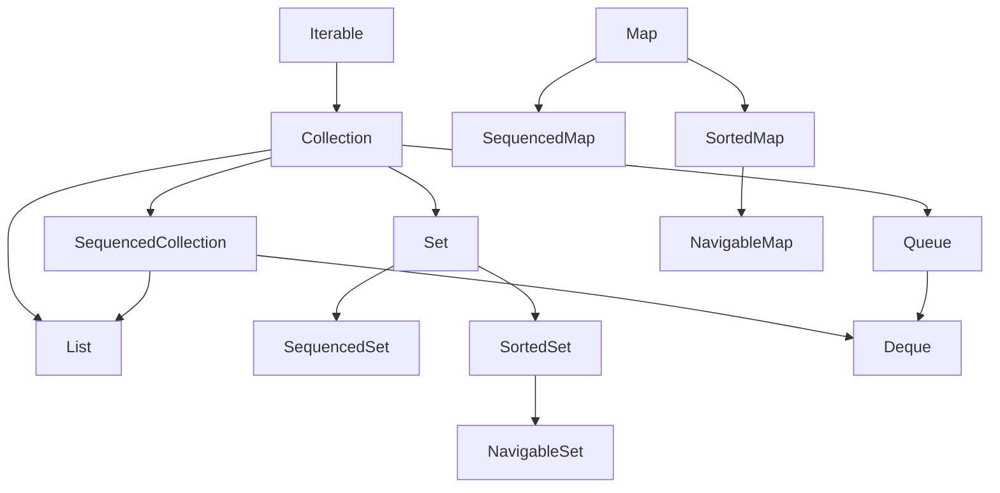

# Part 007 — Java Collections Framework Architecture

## 1. Tujuan Part Ini

Part ini membahas **Java Collections Framework** sebagai arsitektur API, bukan sekadar kumpulan class seperti `ArrayList`, `HashMap`, atau `HashSet`.

Target part ini:

- memahami mengapa Java Collections Framework didesain berbasis interface dan contract;
- membedakan abstraction, implementation, algorithm, wrapper, dan view;
- memahami hierarchy utama: `Iterable`, `Collection`, `List`, `Set`, `Queue`, `Deque`, `Map`, dan sequenced interfaces;
- memahami konsep optional operations, structural modification, backed views, dan fail-fast sebagai konsekuensi desain;
- membangun decision model untuk memilih tipe collection secara defensible di production code.

Prinsip utama:

> Collection choice is not a syntax choice. It is a semantic contract choice.

Kalau engineer hanya bertanya “pakai `ArrayList` atau `HashSet`?”, biasanya level berpikirnya masih implementation-first.

Engineer yang lebih matang bertanya:

```text
Apa contract data ini?
- boleh duplicate atau tidak?
- order penting atau tidak?
- lookup by key atau traversal?
- mutable atau immutable?
- snapshot atau live view?
- ownership ada di siapa?
- operasi dominan apa?
- correctness failure paling mahal apa?
```

---

## 2. Mental Model Besar: JCF sebagai Contract Architecture

Java Collections Framework atau JCF menyatukan beberapa elemen:

| Elemen | Peran |
|---|---|
| Interfaces | Mendefinisikan contract semantic |
| Implementations | Menyediakan storage dan algorithmic behavior konkret |
| Algorithms | Operasi reusable seperti sort, shuffle, binary search |
| Wrappers | Mengubah behavior tampilan seperti unmodifiable, synchronized, checked |
| Views | Representasi backed dari collection lain |
| Iteration APIs | Mengatur traversal melalui `Iterator`, `Iterable`, `Spliterator` |
| Stream bridge | Menghubungkan collection ke pipeline transformasi |

Cara membaca JCF:

```text
Interface = promise
Implementation = mechanism
Wrapper = behavior modifier
View = projected access
Iterator = traversal state
Spliterator = traversal + partitioning metadata
Stream = lazy processing pipeline
```

Jangan mulai dari class. Mulai dari **promise**.

---

## 3. Peta Hierarchy Konseptual



Catatan penting:

- `Map` **bukan** subtype dari `Collection`.
- `List`, `Set`, dan `Queue` adalah keluarga `Collection`.
- `Deque` punya hubungan dengan queue dan sequenced collection.
- Java 21 menambahkan sequenced interfaces agar konsep encounter order menjadi contract eksplisit.
- `Iterable` berada di atas `Collection` sebagai abstraction traversal paling minimal.

---

## 4. `Iterable`: Contract Minimal untuk Traversal

`Iterable<T>` menjanjikan bahwa object bisa menghasilkan `Iterator<T>`.

```java
public interface Iterable<T> {
    Iterator<T> iterator();
}
```

Secara praktis, `Iterable` berarti:

```text
Konsumen boleh melakukan traversal.
Konsumen tidak dijanjikan size.
Konsumen tidak dijanjikan random access.
Konsumen tidak dijanjikan mutability.
Konsumen tidak dijanjikan reusable traversal kecuali documented.
```

Contoh API yang sengaja minimal:

```java
public void processOrders(Iterable<Order> orders) {
    for (Order order : orders) {
        process(order);
    }
}
```

API ini lebih fleksibel daripada:

```java
public void processOrders(List<Order> orders) { ... }
```

Karena caller bisa memberikan:

- `List<Order>`;
- `Set<Order>`;
- custom lazy iterable;
- generated sequence;
- adapter dari source lain.

Tetapi `Iterable` juga membatasi apa yang boleh dilakukan:

```java
public void invalid(Iterable<Order> orders) {
    // orders.size();      // tidak ada
    // orders.get(0);      // tidak ada
    // orders.stream();    // tidak ada langsung sebelum support helper tertentu
}
```

Rule:

> Accept the weakest input abstraction that still supports your operation.

Namun jangan ekstrem. Kalau method perlu uniqueness atau random access, jangan menerima `Iterable` hanya demi terlihat generic.

---

## 5. `Collection`: Group of Elements dengan Size dan Mutability Contract

`Collection<E>` adalah abstraction untuk kumpulan element.

Yang dijanjikan lebih banyak dibanding `Iterable`:

- `size()`;
- `isEmpty()`;
- `contains()`;
- `add()`;
- `remove()`;
- `clear()`;
- `iterator()`;
- `toArray()`;
- bulk operations seperti `addAll`, `removeAll`, `retainAll`, `containsAll`;
- `stream()` dan `parallelStream()`;
- `spliterator()`.

Tetapi `Collection` masih belum menjanjikan:

- duplicate boleh atau tidak;
- order stabil atau tidak;
- index access;
- key lookup;
- sorted behavior;
- thread safety;
- null acceptance universal.

`Collection` cocok sebagai parameter ketika operasi benar-benar generik terhadap kumpulan element:

```java
public int countExpired(Collection<Contract> contracts, Clock clock) {
    int count = 0;
    for (Contract contract : contracts) {
        if (contract.isExpired(clock.instant())) {
            count++;
        }
    }
    return count;
}
```

Tetapi sebagai return type, `Collection` kadang terlalu kabur:

```java
public Collection<Violation> findViolations(CaseId caseId) { ... }
```

Pertanyaan reviewer:

```text
Apakah order penting?
Apakah duplicate mungkin?
Apakah caller boleh mutate?
Apakah hasil snapshot?
```

Kalau jawaban penting tapi tidak tersampaikan oleh `Collection`, gunakan type lebih spesifik atau dokumentasikan contract.

---

## 6. `List`: Ordered, Positional, Duplicate-Friendly

`List<E>` menjanjikan:

- encounter order;
- positional access by index;
- duplicate elements allowed;
- element replacement;
- insertion/removal at position;
- ordered equality.

Contoh contract yang tepat:

```java
public List<AuditEntry> auditTrail(CaseId caseId) {
    return repository.loadAuditTrail(caseId);
}
```

Kenapa `List` masuk akal?

- audit trail punya order;
- duplicate-looking entries mungkin valid;
- caller mungkin perlu render sesuai urutan;
- index access bisa berguna untuk pagination, diff, atau UI position.

Kapan `List` salah?

```java
public List<Role> userRoles(UserId userId) { ... }
```

Kalau role seharusnya unik, `Set<Role>` lebih jujur secara contract. Mengembalikan `List<Role>` mengundang duplicate bug.

Rule:

> Use `List` when position or encounter order is part of the meaning, not merely because it is convenient.

---

## 7. `Set`: Uniqueness Boundary

`Set<E>` menjanjikan tidak ada duplicate menurut equality semantics collection tersebut.

Contoh tepat:

```java
public Set<Permission> effectivePermissions(User user) {
    Set<Permission> result = new HashSet<>();
    result.addAll(user.directPermissions());
    result.addAll(user.rolePermissions());
    return Set.copyOf(result);
}
```

`Set` bukan hanya struktur data. Ia adalah **business invariant boundary**:

```text
There must not be duplicate permissions.
```

Risiko utama `Set`:

- equality object salah;
- element mutable setelah dimasukkan;
- order diasumsikan padahal tidak dijanjikan;
- `TreeSet` comparator tidak konsisten dengan `equals`;
- `HashSet` dipakai untuk output yang harus deterministik.

Rule:

> Use `Set` when uniqueness is semantically required. Do not use it only as an optimization for `contains` unless uniqueness is also acceptable.

---

## 8. `Map`: Association, Not Collection

`Map<K, V>` adalah mapping dari key ke value. Ia bukan subtype `Collection` karena semantic-nya berbeda.

Map menjanjikan:

- setiap key memetakan ke paling banyak satu value;
- lookup by key;
- key uniqueness;
- views: `keySet`, `values`, `entrySet`;
- operasi update seperti `put`, `remove`, `compute`, `merge`.

Contoh tepat:

```java
public Map<CustomerId, CustomerProfile> indexByCustomerId(List<CustomerProfile> profiles) {
    Map<CustomerId, CustomerProfile> index = new HashMap<>();
    for (CustomerProfile profile : profiles) {
        CustomerProfile previous = index.put(profile.id(), profile);
        if (previous != null) {
            throw new DuplicateCustomerException(profile.id());
        }
    }
    return Map.copyOf(index);
}
```

`Map` adalah pilihan ketika pertanyaan dominan adalah:

```text
Given K, find V.
```

Bukan:

```text
Iterate all values in their original order.
```

Walaupun `Map` bisa di-iterate, identitas utamanya tetap association.

---

## 9. `Queue` dan `Deque`: Access Policy sebagai Contract

`Queue<E>` memodelkan collection dengan access policy berbasis head.

`Deque<E>` memodelkan double-ended queue.

Perbedaan penting:

| Type | Contract utama |
|---|---|
| `Queue` | insert, inspect, remove dari head menurut policy tertentu |
| `Deque` | insert/remove dari dua ujung |
| `List` | positional access |
| `Set` | uniqueness |

Contoh worklist:

```java
Deque<Task> worklist = new ArrayDeque<>();
worklist.addLast(rootTask);

while (!worklist.isEmpty()) {
    Task current = worklist.removeFirst();
    for (Task child : current.children()) {
        worklist.addLast(child);
    }
}
```

`Deque` sering lebih tepat daripada `Stack`, karena `Stack` adalah legacy class berbasis `Vector`.

Rule:

> Use `Queue` or `Deque` when access policy matters more than index position.

---

## 10. Sequenced Collections: Order sebagai First-Class Contract

Sebelum Java 21, banyak collection punya encounter order tetapi API untuk first/last/reverse tidak seragam.

Contoh:

- `List` punya first element melalui `get(0)`;
- `Deque` punya `getFirst()`;
- `LinkedHashSet` punya encounter order tapi tidak punya operasi first/last yang seragam sebelum sequenced interfaces;
- `LinkedHashMap` punya iteration order tapi operasi first/last awkward.

Sequenced interfaces memperjelas konsep:

```text
This collection has a well-defined encounter order.
```

Keluarga penting:

- `SequencedCollection<E>`;
- `SequencedSet<E>`;
- `SequencedMap<K, V>`.

Implikasi desain:

```java
public SequencedSet<PolicyRule> activeRules() {
    return rulesInEvaluationOrder;
}
```

Ini lebih ekspresif daripada:

```java
public Set<PolicyRule> activeRules() { ... }
```

Karena evaluator mungkin bergantung pada encounter order.

Rule:

> If order is semantically meaningful, expose it explicitly. Do not rely on implementation folklore.

---

## 11. Implementation Families

JCF menyediakan banyak implementation. Pilihan implementation harus didasarkan pada operation profile dan semantic need.

### 11.1 List Implementations

| Implementation | Mental model | Cocok untuk | Hati-hati |
|---|---|---|---|
| `ArrayList` | dynamic array | traversal, random access, append-heavy | insert/remove tengah mahal |
| `LinkedList` | linked nodes | queue/deque-like operations | poor locality, random access mahal |
| immutable list factories | compact unmodifiable list | return value, constants, snapshots | tidak bisa mutate |

Default production choice untuk ordered mutable list biasanya `ArrayList`, bukan `LinkedList`.

### 11.2 Set Implementations

| Implementation | Mental model | Cocok untuk | Hati-hati |
|---|---|---|---|
| `HashSet` | hash table-backed uniqueness | fast membership, no order requirement | non-deterministic-looking order |
| `LinkedHashSet` | hash set + encounter order | uniqueness + deterministic iteration | memory overhead lebih besar |
| `TreeSet` | sorted tree | sorted uniqueness, range operations | comparator correctness |
| `EnumSet` | bit-vector-like enum set | enum membership | hanya enum type |

### 11.3 Map Implementations

| Implementation | Mental model | Cocok untuk | Hati-hati |
|---|---|---|---|
| `HashMap` | hash table | general lookup | key mutability |
| `LinkedHashMap` | hash map + encounter/access order | deterministic output, LRU-like logic | order policy harus jelas |
| `TreeMap` | sorted map | range query, ordered key traversal | comparator correctness |
| `EnumMap` | enum-key optimized map | enum key domain | null key tidak cocok |
| `IdentityHashMap` | identity comparison | specialized object graph use | bukan normal equality |

### 11.4 Queue/Deque Implementations

| Implementation | Mental model | Cocok untuk | Hati-hati |
|---|---|---|---|
| `ArrayDeque` | resizable circular array | stack/queue/deque general use | no null elements |
| `PriorityQueue` | heap-like priority access | priority-based processing | iteration not sorted |
| `LinkedList` | linked deque | legacy/general interface compatibility | often worse than `ArrayDeque` |

---

## 12. Interface vs Implementation: Return Type dan Variable Type

Ada dua decision point:

1. **Concrete object yang dibuat**
2. **Type yang diekspos**

Contoh baik:

```java
List<Invoice> invoices = new ArrayList<>();
```

Variable type `List` menyatakan contract yang diperlukan. Implementation `ArrayList` dipilih karena mekanismenya cocok.

Untuk return type:

```java
public List<Invoice> findPendingInvoices(CustomerId customerId) {
    return List.copyOf(repository.loadPendingInvoices(customerId));
}
```

Return `List` menyampaikan:

- ordered;
- duplicate mungkin secara contract;
- caller tidak perlu tahu implementation;
- hasil dapat dibuat unmodifiable melalui `copyOf`.

Hindari:

```java
public ArrayList<Invoice> findPendingInvoices(CustomerId customerId) { ... }
```

Kecuali caller benar-benar membutuhkan `ArrayList`-specific behavior, yang hampir tidak pernah defensible pada API boundary.

Rule:

> Expose semantic type, instantiate mechanical type.

---

## 13. Optional Operations

Beberapa method pada collection interface bersifat **optional operation**. Artinya implementation boleh melempar `UnsupportedOperationException`.

Contoh:

```java
List<String> names = List.of("A", "B", "C");
names.add("D"); // UnsupportedOperationException
```

Ini bukan pelanggaran interface. Ini bagian dari contract JCF.

Kenapa Java memilih desain ini?

Karena satu interface seperti `List` ingin merepresentasikan ordered collection baik mutable maupun unmodifiable. Daripada membuat hierarchy sangat granular untuk semua variasi, Java mendokumentasikan operasi tertentu sebagai optional.

Implikasi production:

```java
void appendDefault(List<String> names) {
    names.add("default");
}
```

Method ini diam-diam mensyaratkan mutable list. Contract-nya seharusnya eksplisit:

```java
void appendDefaultTo(MutableNames names) { ... }
```

Atau minimal dokumentasikan:

```java
/**
 * Mutates the provided list by appending a default name.
 * The list must support add.
 */
void appendDefault(List<String> names) {
    names.add("default");
}
```

Lebih baik lagi: jangan mutate input.

```java
List<String> withDefault(List<String> names) {
    ArrayList<String> copy = new ArrayList<>(names);
    copy.add("default");
    return List.copyOf(copy);
}
```

Rule:

> If a method mutates a collection it did not create, the mutability requirement must be explicit.

---

## 14. Structural Modification

Structural modification adalah perubahan yang mengubah struktur collection, biasanya size atau layout internal.

Contoh structural:

```java
list.add(x);
list.remove(x);
map.put(k, v);      // jika key baru
map.remove(k);
set.clear();
```

Contoh non-structural tergantung implementation:

```java
list.set(0, x);     // size tidak berubah
map.put(k, newV);   // jika key sudah ada, size tidak berubah
```

Structural modification penting karena memengaruhi:

- iterator fail-fast;
- backed view validity;
- `subList` behavior;
- concurrent access hazard;
- stream non-interference;
- cached size atau traversal state.

Contoh bug:

```java
for (Order order : orders) {
    if (order.isCancelled()) {
        orders.remove(order); // ConcurrentModificationException risk
    }
}
```

Perbaikan:

```java
orders.removeIf(Order::isCancelled);
```

Atau:

```java
Iterator<Order> iterator = orders.iterator();
while (iterator.hasNext()) {
    Order order = iterator.next();
    if (order.isCancelled()) {
        iterator.remove();
    }
}
```

Rule:

> Mutation during traversal must go through the traversal abstraction or a dedicated bulk operation.

---

## 15. Views: Projection yang Backed oleh Source

Banyak API JCF mengembalikan **view**, bukan copy.

Contoh:

```java
Map<String, Integer> counts = new HashMap<>();
counts.put("A", 1);
counts.put("B", 2);

Set<String> keys = counts.keySet();
keys.remove("A");

System.out.println(counts); // {B=2}
```

`keySet()` adalah view backed by map. Mengubah view bisa mengubah map.

Contoh `subList`:

```java
List<String> names = new ArrayList<>(List.of("A", "B", "C", "D"));
List<String> middle = names.subList(1, 3); // B, C
middle.clear();

System.out.println(names); // [A, D]
```

View berguna untuk performance, tetapi berbahaya di boundary.

Rule:

```text
Internal code may use views for efficiency.
Public boundaries should usually return snapshots or clearly documented views.
```

---

## 16. Wrappers: Behavior Modifier

`Collections` menyediakan wrapper seperti:

- `unmodifiableList`;
- `unmodifiableSet`;
- `unmodifiableMap`;
- `synchronizedList`;
- `checkedList`.

Contoh:

```java
List<String> internal = new ArrayList<>();
List<String> exposed = Collections.unmodifiableList(internal);
```

Penting: unmodifiable wrapper bukan immutable snapshot.

```java
internal.add("A");
System.out.println(exposed); // [A]
```

Kalau perlu snapshot:

```java
List<String> snapshot = List.copyOf(internal);
```

Rule:

> Wrapper changes access behavior. Copy changes ownership.

---

## 17. Algorithms: `Collections` sebagai Polymorphic Utility

`java.util.Collections` menyediakan algorithm reusable:

- `sort`;
- `binarySearch`;
- `reverse`;
- `shuffle`;
- `rotate`;
- `swap`;
- `min`;
- `max`;
- `frequency`;
- `disjoint`;
- `nCopies`;
- wrappers dan factories tertentu.

Contoh:

```java
List<Case> cases = new ArrayList<>(loadCases());
cases.sort(Comparator.comparing(Case::openedAt));
```

Modern Java sering lebih baik memakai method instance:

```java
cases.sort(Comparator.comparing(Case::openedAt));
```

Daripada:

```java
Collections.sort(cases, Comparator.comparing(Case::openedAt));
```

Tetapi `Collections` tetap penting untuk algorithms dan wrappers.

Rule:

> Prefer collection instance methods for direct operations; use `Collections` for polymorphic algorithms, wrappers, and legacy-compatible utilities.

---

## 18. Factory Methods: `of`, `copyOf`, dan Intent

Modern Java menyediakan factory methods:

```java
List<String> names = List.of("A", "B");
Set<String> roles = Set.of("ADMIN", "AUDITOR");
Map<String, Integer> counts = Map.of("A", 1, "B", 2);
```

Dan copy factories:

```java
List<String> snapshot = List.copyOf(names);
Set<String> unique = Set.copyOf(roles);
Map<String, Integer> stable = Map.copyOf(counts);
```

Intent berbeda:

| API | Intent |
|---|---|
| `of` | literal-like small collection |
| `copyOf` | snapshot/copy boundary |
| `unmodifiableX` | wrapper view yang mencegah mutation lewat wrapper |
| `new ArrayList<>(source)` | mutable copy |

Production rule:

```java
public List<Violation> violations() {
    return List.copyOf(violations);
}
```

Ini menyampaikan:

- caller tidak boleh mutate state internal;
- hasil adalah snapshot;
- representation internal disembunyikan.

---

## 19. Null Policy

JCF tidak punya satu policy universal terhadap null.

Contoh:

- `ArrayList` menerima null;
- `HashSet` menerima null;
- `HashMap` menerima null key dan null values;
- `TreeSet` dengan natural ordering biasanya tidak menerima null karena compare gagal;
- `List.of`, `Set.of`, `Map.of` tidak menerima null;
- `ConcurrentHashMap` tidak menerima null key/value.

Karena policy berbeda, boundary production harus eksplisit.

Buruk:

```java
public List<Customer> findCustomers(Query query) { ... }
```

Tidak jelas apakah list bisa berisi null.

Lebih baik:

```java
/**
 * Returns a non-null, unmodifiable list. Elements are non-null.
 */
public List<Customer> findCustomers(Query query) { ... }
```

Atau enforce:

```java
List<Customer> result = raw.stream()
    .map(Objects::requireNonNull)
    .toList();
```

Rule:

> A collection should usually be non-null and contain non-null elements unless the domain has a strong reason otherwise.

---

## 20. Empty Collection vs Null

Production Java APIs should almost always return empty collection instead of null.

Buruk:

```java
List<Violation> violations = service.findViolations(caseId);
if (violations != null && !violations.isEmpty()) {
    ...
}
```

Baik:

```java
List<Violation> violations = service.findViolations(caseId);
if (!violations.isEmpty()) {
    ...
}
```

Return empty collection menyederhanakan caller dan mengurangi null branching.

Tetapi jangan mencampur semantic:

```text
null = not loaded?
empty = loaded but no result?
```

Kalau distinction penting, buat type eksplisit:

```java
sealed interface LoadResult<T> permits NotLoaded, Loaded { }
record NotLoaded<T>() implements LoadResult<T> { }
record Loaded<T>(List<T> items) implements LoadResult<T> { }
```

Rule:

> Use empty collection for “no elements”. Use explicit result type for “not available”, “not loaded”, or “not authorized”.

---

## 21. Mutability Spectrum

Collection mutability bukan binary sederhana.

| Bentuk | Makna |
|---|---|
| Mutable internal | owner bebas mutate |
| Mutable parameter | callee mungkin mutate input |
| Unmodifiable view | wrapper menolak mutation lewat view |
| Immutable snapshot | caller tidak bisa mutate dan tidak berubah karena source berubah |
| Persistent immutable | update menghasilkan struktur baru dengan sharing |
| Shallow immutable | collection tidak berubah, element masih bisa mutable |

JDK immutable factories menghasilkan unmodifiable collections, tetapi element object masih bisa mutable.

Contoh shallow immutability hazard:

```java
record Customer(String id, List<Address> addresses) { }

List<Address> mutable = new ArrayList<>();
Customer customer = new Customer("C-1", List.copyOf(mutable));

// list tidak bisa mutate via customer.addresses(),
// tetapi Address object di dalamnya bisa saja mutable.
```

Rule:

> Collection immutability does not imply element immutability.

---

## 22. Encounter Order, Sorted Order, Access Order

Order punya beberapa bentuk:

| Order type | Makna | Contoh |
|---|---|---|
| Encounter order | urutan traversal yang dijanjikan source | `List`, `LinkedHashSet` |
| Sorted order | berdasarkan comparator/natural ordering | `TreeSet`, `TreeMap` |
| Insertion order | urutan insert | `LinkedHashMap` default |
| Access order | urutan akses | `LinkedHashMap` access-order mode |
| Undefined/no promised order | tidak boleh diasumsikan | `HashSet`, `HashMap` |

Bug umum:

```java
Set<String> ids = new HashSet<>();
ids.add("A");
ids.add("B");
ids.add("C");
return new ArrayList<>(ids); // output order dianggap stabil padahal contract tidak menjanjikan
```

Perbaikan kalau order dibutuhkan:

```java
Set<String> ids = new LinkedHashSet<>();
```

Atau:

```java
return ids.stream().sorted().toList();
```

Rule:

> If output is audited, tested by snapshot, serialized, or shown to users, make ordering explicit.

---

## 23. Complexity Is a Contract Adjacent Concern

JCF interfaces tidak selalu menjanjikan complexity detail, tetapi implementation choice membawa konsekuensi.

Contoh:

```java
boolean exists = list.contains(id); // O(n) typical for ArrayList
```

Kalau dilakukan dalam nested loop:

```java
for (Order order : orders) {
    if (blockedCustomerIds.contains(order.customerId())) {
        reject(order);
    }
}
```

Jika `blockedCustomerIds` adalah `List`, complexity menjadi `O(n*m)`.

Perbaikan:

```java
Set<CustomerId> blocked = new HashSet<>(blockedCustomerIds);
for (Order order : orders) {
    if (blocked.contains(order.customerId())) {
        reject(order);
    }
}
```

Rule:

> A collection type in an API can hide complexity. Review hot code by operation profile, not by syntax.

---

## 24. Production Decision Matrix

| Need | Preferred abstraction | Common implementation |
|---|---|---|
| Traverse once, no size needed | `Iterable<T>` | any |
| General group with size | `Collection<T>` | varies |
| Ordered output | `List<T>` or `SequencedCollection<T>` | `ArrayList`, immutable list |
| Unique items | `Set<T>` | `HashSet` |
| Unique + deterministic order | `SequencedSet<T>` / `Set<T>` documented | `LinkedHashSet` |
| Sorted unique items | `SortedSet<T>` / `NavigableSet<T>` | `TreeSet` |
| Lookup by key | `Map<K,V>` | `HashMap` |
| Lookup + deterministic order | `SequencedMap<K,V>` / documented `Map` | `LinkedHashMap` |
| Sorted keys/range query | `NavigableMap<K,V>` | `TreeMap` |
| Worklist FIFO/LIFO | `Deque<T>` | `ArrayDeque` |
| Priority processing | `Queue<T>` | `PriorityQueue` |
| Enum membership | `Set<E extends Enum<E>>` | `EnumSet` |
| Enum-key mapping | `Map<E,V>` | `EnumMap` |
| API return snapshot | specific interface | `List.copyOf`, `Set.copyOf`, `Map.copyOf` |

---

## 25. Case Study: Enforcement Case Processing

Misdesigned code:

```java
public List<Action> determineActions(List<Rule> rules, List<Event> events) {
    List<Action> actions = new ArrayList<>();

    for (Event event : events) {
        for (Rule rule : rules) {
            if (rule.appliesTo(event)) {
                actions.add(rule.toAction(event));
            }
        }
    }

    return actions;
}
```

Masalah:

- `rules` order mungkin penting tapi tidak eksplisit;
- duplicate actions mungkin terjadi;
- output mutability tidak jelas;
- complexity bisa tinggi;
- tidak ada policy untuk conflict;
- caller bisa mutate returned list.

Lebih defensible:

```java
public SequencedSet<Action> determineActions(
        SequencedCollection<Rule> rulesInEvaluationOrder,
        Collection<Event> events
) {
    LinkedHashSet<Action> actions = new LinkedHashSet<>();

    for (Rule rule : rulesInEvaluationOrder) {
        for (Event event : events) {
            if (rule.appliesTo(event)) {
                actions.add(rule.toAction(event));
            }
        }
    }

    return Collections.unmodifiableSequencedSet(actions);
}
```

Interpretasi contract:

- rule order penting;
- actions unik;
- output order mengikuti discovery order;
- caller tidak boleh mutate result;
- semantic duplicate jelas.

Catatan: tergantung versi dan kebutuhan compatibility, bisa juga return `Set.copyOf(actions)` jika order tidak penting, atau `List.copyOf(actions)` jika output perlu ordered tapi uniqueness hanya internal concern.

---

## 26. Common Architecture Smells

### 26.1 Everywhere `List`

```java
List<Role> roles;
List<Permission> permissions;
List<String> tags;
List<ErrorCode> errors;
```

Bau desain:

- uniqueness tidak tersampaikan;
- order mungkin fake;
- duplicate bug tersembunyi;
- caller harus menebak semantic.

### 26.2 Returning Mutable Internals

```java
class CaseFile {
    private final List<Document> documents = new ArrayList<>();

    public List<Document> documents() {
        return documents;
    }
}
```

Masalah:

- invariant internal bisa dirusak;
- caller bisa clear;
- tidak ada audit trail mutation;
- object ownership bocor.

Perbaikan:

```java
public List<Document> documents() {
    return List.copyOf(documents);
}
```

Atau sediakan command method:

```java
public void attach(Document document) {
    documents.add(validate(document));
}
```

### 26.3 Hidden Ordering Dependency

```java
Map<String, Rule> rules = new HashMap<>();
for (Rule rule : rules.values()) {
    evaluate(rule);
}
```

Jika evaluation order penting, ini bug.

Perbaikan:

```java
Map<String, Rule> rules = new LinkedHashMap<>();
```

Atau lebih jelas:

```java
SequencedCollection<Rule> rulesInEvaluationOrder;
```

### 26.4 Misusing `Map<K, List<V>>` Without Policy

```java
Map<CustomerId, List<Order>> ordersByCustomer = new HashMap<>();
```

Pertanyaan:

- list order apa?
- duplicate order boleh?
- empty list disimpan atau key dihapus?
- caller boleh mutate list?

Better with helper abstraction:

```java
final class OrdersByCustomer {
    private final Map<CustomerId, List<Order>> index;

    List<Order> ordersFor(CustomerId customerId) {
        return index.getOrDefault(customerId, List.of());
    }
}
```

---

## 27. Review Checklist

Gunakan checklist ini saat code review:

```text
1. Apakah tipe collection mencerminkan semantic data?
2. Apakah duplicate policy jelas?
3. Apakah ordering policy jelas?
4. Apakah null policy jelas?
5. Apakah mutability/ownership jelas?
6. Apakah return value snapshot atau live view?
7. Apakah input collection akan dimutate?
8. Apakah operation profile cocok dengan implementation?
9. Apakah equality/hashCode/comparator mendukung collection choice?
10. Apakah output deterministik untuk audit/log/test?
11. Apakah empty vs unavailable dibedakan dengan benar?
12. Apakah collection factory/wrapper yang digunakan sesuai intent?
```

---

## 28. Latihan 20 Jam — Slot Part 007

### Latihan 1 — Semantic Refactoring

Ambil service method yang menggunakan `List` untuk semua data.

Tugas:

- identifikasi mana yang sebenarnya `Set`;
- mana yang harus ordered;
- mana yang harus map/index;
- mana yang cukup `Iterable`;
- ubah signature dan dokumentasikan contract.

### Latihan 2 — Boundary Hardening

Cari class yang mengembalikan mutable internal collection.

Tugas:

- ubah return menjadi snapshot;
- tambahkan command method untuk mutation;
- pastikan tests gagal jika caller mencoba mutate internal state.

### Latihan 3 — Deterministic Output

Cari logic yang memakai `HashMap`/`HashSet` lalu output-nya diserialisasi, dites snapshot, atau ditampilkan.

Tugas:

- ubah ke `LinkedHashMap`, `LinkedHashSet`, atau explicit sort;
- tulis test yang memverifikasi order;
- jelaskan kenapa order itu bagian dari contract.

---

## 29. Ringkasan

Java Collections Framework harus dipahami sebagai architecture of contracts:

- `Iterable` berarti traversal minimal;
- `Collection` berarti group of elements;
- `List` berarti ordered positional collection;
- `Set` berarti uniqueness boundary;
- `Map` berarti key-value association;
- `Queue`/`Deque` berarti access policy;
- sequenced interfaces berarti encounter order menjadi eksplisit;
- implementation menentukan cost model dan behavior detail;
- wrappers mengubah behavior akses;
- views membawa coupling ke source;
- optional operations membuat mutability harus jelas;
- structural modification memengaruhi traversal correctness.

Part berikutnya akan masuk ke kontrak yang paling sering menjadi akar bug collection: **equality, hashing, ordering, dan mutability**.

---

## 30. Referensi Resmi

- Oracle Java SE 25 — Collections Framework Overview: `https://docs.oracle.com/en/java/javase/25/docs/api/java.base/java/util/doc-files/coll-overview.html`
- Oracle Java SE 25 — `java.util.Collection`: `https://docs.oracle.com/en/java/javase/25/docs/api/java.base/java/util/Collection.html`
- Oracle Java SE 25 — `java.util.Collections`: `https://docs.oracle.com/en/java/javase/25/docs/api/java.base/java/util/Collections.html`
- Oracle Java SE 25 — `java.util.SequencedCollection`: `https://docs.oracle.com/en/java/javase/25/docs/api/java.base/java/util/SequencedCollection.html`
- OpenJDK JEP 431 — Sequenced Collections: `https://openjdk.org/jeps/431`
