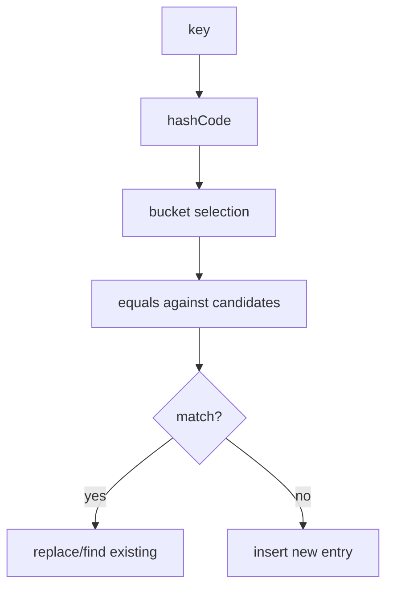

# Part 008 — Collection Contracts: Equality, Hashing, Ordering, Mutability

## 1. Tujuan Part Ini

Part ini membahas kontrak paling penting di balik Java Collections Framework:

- `equals`;
- `hashCode`;
- natural ordering melalui `Comparable`;
- external ordering melalui `Comparator`;
- duplicate semantics;
- null policy;
- mutability hazard;
- key stability;
- ordering determinism;
- failure modeling untuk bug production.

Ini bukan materi “cara generate equals/hashCode di IDE”. Fokusnya adalah:

> Bagaimana kontrak object memengaruhi correctness collection.

Banyak bug collection tidak muncul dari `ArrayList` atau `HashMap` itu sendiri, tetapi dari object yang dimasukkan ke dalamnya.

---

## 2. Kenapa Contract Lebih Penting dari Implementation

Contoh sederhana:

```java
record CustomerId(String value) { }

Set<CustomerId> ids = new HashSet<>();
ids.add(new CustomerId("C-001"));
ids.add(new CustomerId("C-001"));

System.out.println(ids.size()); // 1
```

Kenapa satu?

Karena `record` menghasilkan `equals` dan `hashCode` berbasis component.

Bandingkan:

```java
final class CustomerId {
    private final String value;

    CustomerId(String value) {
        this.value = value;
    }
}

Set<CustomerId> ids = new HashSet<>();
ids.add(new CustomerId("C-001"));
ids.add(new CustomerId("C-001"));

System.out.println(ids.size()); // 2
```

Karena default `equals` dari `Object` adalah identity-based.

Dari sisi collection, `HashSet` bekerja benar. Yang salah adalah domain contract `CustomerId`.

Rule:

> Collection correctness is object contract correctness multiplied by collection semantics.

---

## 3. `equals`: Equivalence Relation

`equals` harus membentuk equivalence relation:

| Property | Makna |
|---|---|
| Reflexive | `x.equals(x)` true |
| Symmetric | jika `x.equals(y)`, maka `y.equals(x)` |
| Transitive | jika `x.equals(y)` dan `y.equals(z)`, maka `x.equals(z)` |
| Consistent | hasil stabil selama state relevan tidak berubah |
| Non-null | `x.equals(null)` false |

Contoh benar:

```java
public final class CaseId {
    private final String value;

    public CaseId(String value) {
        this.value = Objects.requireNonNull(value);
    }

    @Override
    public boolean equals(Object other) {
        if (this == other) return true;
        if (!(other instanceof CaseId that)) return false;
        return value.equals(that.value);
    }

    @Override
    public int hashCode() {
        return value.hashCode();
    }
}
```

Contoh salah: symmetry violation.

```java
class Money {
    final int amount;

    Money(int amount) {
        this.amount = amount;
    }

    @Override
    public boolean equals(Object other) {
        if (other instanceof Money m) {
            return amount == m.amount;
        }
        if (other instanceof Integer i) {
            return amount == i;
        }
        return false;
    }
}
```

Masalah:

```java
Money money = new Money(100);
Integer integer = 100;

money.equals(integer);   // true
integer.equals(money);   // false
```

Collection impact:

```java
Set<Object> set = new HashSet<>();
set.add(money);
set.contains(integer); // bisa membingungkan, bergantung hash juga
```

Rule:

> Jangan membuat equality lintas domain type kecuali benar-benar invariant-nya equivalence relation.

---

## 4. `hashCode`: Bucket Eligibility Contract

Kontrak inti `hashCode`:

```text
Jika a.equals(b), maka a.hashCode() harus sama dengan b.hashCode().
```

Sebaliknya tidak wajib:

```text
Jika hashCode sama, equals boleh false.
```

Hash collision legal. Yang ilegal adalah equal object dengan hash berbeda.

Contoh fatal:

```java
final class UserKey {
    private final String tenant;
    private final String username;

    UserKey(String tenant, String username) {
        this.tenant = tenant;
        this.username = username;
    }

    @Override
    public boolean equals(Object other) {
        if (!(other instanceof UserKey that)) return false;
        return tenant.equals(that.tenant)
            && username.equalsIgnoreCase(that.username);
    }

    @Override
    public int hashCode() {
        return Objects.hash(tenant, username); // BUG: case-sensitive
    }
}
```

Bug:

```java
UserKey a = new UserKey("T1", "ALICE");
UserKey b = new UserKey("T1", "alice");

System.out.println(a.equals(b));       // true
System.out.println(a.hashCode() == b.hashCode()); // false likely

Set<UserKey> users = new HashSet<>();
users.add(a);
users.add(b); // duplicate secara logical bisa masuk
```

Perbaikan:

```java
@Override
public int hashCode() {
    return Objects.hash(tenant, username.toLowerCase(Locale.ROOT));
}
```

Atau lebih baik normalisasi di constructor:

```java
final class UserKey {
    private final String tenant;
    private final String normalizedUsername;

    UserKey(String tenant, String username) {
        this.tenant = Objects.requireNonNull(tenant);
        this.normalizedUsername = Objects.requireNonNull(username)
            .toLowerCase(Locale.ROOT);
    }

    @Override
    public boolean equals(Object other) {
        if (!(other instanceof UserKey that)) return false;
        return tenant.equals(that.tenant)
            && normalizedUsername.equals(that.normalizedUsername);
    }

    @Override
    public int hashCode() {
        return Objects.hash(tenant, normalizedUsername);
    }
}
```

Rule:

> Normalize before storing, not repeatedly inside equality logic, if normalization is part of identity.

---

## 5. Hash-Based Collections: How Contract Failure Manifests

Hash-based collections include:

- `HashSet`;
- `HashMap`;
- `LinkedHashSet`;
- `LinkedHashMap`;
- many internal structures relying on hash semantics.

Mental model simplified:

```text
hashCode -> candidate bucket
equals   -> exact match inside candidate bucket
```

Diagram:



Jika `hashCode` salah, collection mungkin tidak pernah mencari di tempat yang benar.

Jika `equals` salah, collection mungkin gagal mengenali duplicate.

Jika object mutable, collection bisa kehilangan element secara logical.

---

## 6. Mutable Key Hazard

Contoh klasik:

```java
final class CaseKey {
    String caseNumber;

    CaseKey(String caseNumber) {
        this.caseNumber = caseNumber;
    }

    @Override
    public boolean equals(Object other) {
        if (!(other instanceof CaseKey that)) return false;
        return Objects.equals(caseNumber, that.caseNumber);
    }

    @Override
    public int hashCode() {
        return Objects.hash(caseNumber);
    }
}
```

Penggunaan:

```java
CaseKey key = new CaseKey("CASE-1");
Map<CaseKey, String> map = new HashMap<>();
map.put(key, "open");

key.caseNumber = "CASE-2";

System.out.println(map.get(key)); // likely null
System.out.println(map.containsKey(key)); // likely false
```

Kenapa?

Object disimpan di bucket berdasarkan hash lama. Setelah field berubah, lookup menggunakan hash baru.

Map tidak rusak secara internal, tetapi key contract dilanggar.

Rule:

> Fields used in `equals` and `hashCode` must be effectively immutable while the object is inside hash-based collections.

Lebih aman:

```java
public record CaseKey(String caseNumber) {
    public CaseKey {
        Objects.requireNonNull(caseNumber);
    }
}
```

---

## 7. Mutable Element Hazard di `Set`

Masalah yang sama berlaku untuk element `Set`.

```java
final class Tag {
    String value;

    Tag(String value) {
        this.value = value;
    }

    @Override
    public boolean equals(Object other) {
        return other instanceof Tag that
            && Objects.equals(value, that.value);
    }

    @Override
    public int hashCode() {
        return Objects.hash(value);
    }
}
```

Bug:

```java
Tag tag = new Tag("urgent");
Set<Tag> tags = new HashSet<>();
tags.add(tag);

tag.value = "normal";

System.out.println(tags.contains(tag)); // likely false
System.out.println(tags.remove(tag));   // likely false
```

Rule sama:

> Element identity inside a `Set` must be stable for as long as it is a member.

Kalau object memang mutable, pisahkan identity dari mutable state:

```java
final class CaseAssignment {
    private final AssignmentId id;
    private Assignee assignee;
    private AssignmentStatus status;

    @Override
    public boolean equals(Object other) {
        return other instanceof CaseAssignment that
            && id.equals(that.id);
    }

    @Override
    public int hashCode() {
        return id.hashCode();
    }
}
```

Tetapi desain ini harus hati-hati: equality by ID artinya dua object dengan ID sama dianggap sama walaupun state lain berbeda.

---

## 8. Equality by ID vs Equality by Value

Ada dua model umum:

| Model | Cocok untuk | Risiko |
|---|---|---|
| Equality by value | value object, ID wrapper, money, range, coordinate | field harus immutable/logical |
| Equality by identity/ID | entity, aggregate, persisted record | transient object sebelum ID ada |

Value object:

```java
public record Money(BigDecimal amount, Currency currency) { }
```

Entity-like object:

```java
public final class Customer {
    private final CustomerId id;
    private String name;

    @Override
    public boolean equals(Object other) {
        return other instanceof Customer that
            && id.equals(that.id);
    }

    @Override
    public int hashCode() {
        return id.hashCode();
    }
}
```

Problem entity with generated ID:

```java
Customer customer = new Customer(null, "Alice");
Set<Customer> set = new HashSet<>();
set.add(customer);

customer.assignId(new CustomerId("C-1")); // hash changes
```

Solusi desain:

- jangan masukkan entity tanpa stable ID ke hash-based collection;
- gunakan natural key immutable;
- gunakan identity-based collection hanya untuk object graph algorithm yang benar-benar butuh identity;
- gunakan list sementara sampai ID stabil;
- pisahkan command object dari persisted entity.

Rule:

> Generated identity and hash-based collection membership are a dangerous combination unless lifecycle is strictly controlled.

---

## 9. `Comparable`: Natural Ordering

`Comparable<T>` mendefinisikan natural ordering.

```java
public record Priority(int level) implements Comparable<Priority> {
    @Override
    public int compareTo(Priority other) {
        return Integer.compare(this.level, other.level);
    }
}
```

Digunakan oleh:

- `TreeSet`;
- `TreeMap`;
- `Collections.sort`;
- `List.sort` tanpa comparator;
- `Stream.sorted()` tanpa comparator;
- `PriorityQueue` tanpa comparator.

Kontrak penting:

```text
compareTo(a, b) == 0 berarti a dan b setara menurut ordering.
```

Untuk sorted set/map, `compareTo` atau comparator menentukan uniqueness, bukan hanya `equals`.

Contoh bug:

```java
record User(String username, String email) implements Comparable<User> {
    @Override
    public int compareTo(User other) {
        return username.compareToIgnoreCase(other.username);
    }
}
```

Jika dipakai di `TreeSet`:

```java
Set<User> users = new TreeSet<>();
users.add(new User("alice", "a@example.com"));
users.add(new User("ALICE", "different@example.com"));

System.out.println(users.size()); // 1
```

Walaupun record `equals` menganggap email berbeda, `TreeSet` melihat comparator result 0 sebagai duplicate.

Rule:

> In sorted collections, comparator equivalence determines element uniqueness.

---

## 10. Comparator Consistency with Equals

Comparator dikatakan consistent with equals jika:

```text
compare(a, b) == 0 memiliki arti yang sama dengan a.equals(b)
```

Tidak selalu wajib, tetapi kalau tidak konsisten, harus disengaja dan didokumentasikan.

Contoh inconsistent tapi mungkin valid:

```java
Comparator<Person> byLastName = Comparator.comparing(Person::lastName);
```

Dalam `TreeSet<Person>`, semua person dengan last name sama dianggap duplicate.

Biasanya ini bukan yang diinginkan.

Perbaikan:

```java
Comparator<Person> byNameThenId = Comparator
    .comparing(Person::lastName)
    .thenComparing(Person::firstName)
    .thenComparing(Person::id);
```

Rule:

> Comparator for sorting list may be partial. Comparator for `TreeSet`/`TreeMap` must define identity-equivalence intentionally.

---

## 11. `TreeSet` and `TreeMap`: Sorted Identity Boundary

`TreeSet` bukan hanya set yang sorted. Ia adalah set dengan uniqueness berdasarkan comparator/natural ordering.

Contoh:

```java
record Rule(String code, int priority) { }

Set<Rule> rules = new TreeSet<>(Comparator.comparingInt(Rule::priority));
rules.add(new Rule("R-1", 10));
rules.add(new Rule("R-2", 10));

System.out.println(rules.size()); // 1
```

Kalau maksudnya sorted by priority tapi tetap semua rule masuk:

```java
List<Rule> rules = new ArrayList<>();
rules.add(new Rule("R-1", 10));
rules.add(new Rule("R-2", 10));
rules.sort(Comparator.comparingInt(Rule::priority));
```

Atau comparator lengkap:

```java
Set<Rule> rules = new TreeSet<>(
    Comparator.comparingInt(Rule::priority)
        .thenComparing(Rule::code)
);
```

Rule:

> Use `TreeSet` only when sorted uniqueness is the desired invariant.

---

## 12. Ordering Contract vs Presentation Sorting

Jangan mencampur storage invariant dengan presentation need.

Buruk:

```java
Set<CaseFile> files = new TreeSet<>(Comparator.comparing(CaseFile::displayName));
```

Jika `displayName` bukan identity, ini bisa menghilangkan element.

Lebih baik:

```java
Set<CaseFile> files = new HashSet<>();

List<CaseFile> sortedForDisplay = files.stream()
    .sorted(Comparator.comparing(CaseFile::displayName))
    .toList();
```

Rule:

> Storage collection should encode domain invariant. Presentation sorting should usually be a derived view.

---

## 13. Duplicate Semantics

Duplicate bukan sekadar “data sama dua kali”. Duplicate tergantung equivalence relation.

Contoh:

```java
record Violation(String article, String paragraph, String description) { }
```

Pertanyaan:

```text
Apakah duplicate ditentukan oleh article saja?
article + paragraph?
seluruh field?
normalized article?
case-insensitive?
time window?
source system?
```

Kalau duplicate policy domain-specific, jangan langsung bergantung pada `record` equality default.

Buat key eksplisit:

```java
record ViolationKey(String article, String paragraph) { }
```

Lalu:

```java
Map<ViolationKey, Violation> unique = new LinkedHashMap<>();
for (Violation violation : violations) {
    ViolationKey key = new ViolationKey(
        violation.article(),
        violation.paragraph()
    );
    unique.putIfAbsent(key, violation);
}
```

Atau jika duplicate adalah error:

```java
Violation previous = unique.put(key, violation);
if (previous != null) {
    throw new DuplicateViolationException(key);
}
```

Rule:

> When uniqueness is domain-specific, model the key explicitly.

---

## 14. Null Semantics in Contracts

Null dapat muncul di dua tempat:

```text
collection reference itself null
collection element/key/value null
```

Production default:

```text
collection reference: never null
elements: usually never null
map keys: usually never null
map values: usually never null, unless absence/value-null distinction is intentional
```

Masalah `Map<K, V>` dengan null value:

```java
Map<String, String> map = new HashMap<>();
map.put("A", null);

System.out.println(map.get("A")); // null
System.out.println(map.get("B")); // null
```

`get` tidak bisa membedakan key present dengan null value vs key absent.

Butuh:

```java
if (map.containsKey(key)) {
    String value = map.get(key);
}
```

Atau hindari null value.

Alternatif:

```java
Map<String, Optional<String>> map;
```

Tetapi `Optional` sebagai map value harus dipakai selektif. Kadang lebih baik domain type:

```java
sealed interface LookupResult permits Found, NotFound, Redacted { }
```

Rule:

> Null inside collections multiplies ambiguity. Use it only when ambiguity is intentionally modeled and tested.

---

## 15. HashMap Key Design Checklist

Sebuah key yang baik untuk `HashMap`/`HashSet`:

```text
1. Immutable atau effectively immutable.
2. equals dan hashCode konsisten.
3. Field identity final jika memungkinkan.
4. Normalisasi dilakukan sebelum equality.
5. Tidak bergantung pada volatile/time-based/external state.
6. Tidak bergantung pada collection mutable yang bisa berubah.
7. Tidak menggunakan array raw tanpa deep equality jika value equality dibutuhkan.
8. Tidak menggunakan BigDecimal tanpa sadar scale semantics.
9. Tidak menggunakan floating point tanpa policy NaN/precision.
10. Punya test contract.
```

Contoh raw array key bug:

```java
byte[] digest = computeDigest(data);
Map<byte[], Document> byDigest = new HashMap<>();
byDigest.put(digest, document);

byte[] sameDigest = computeDigest(data);
System.out.println(byDigest.get(sameDigest)); // null
```

Array `equals` default adalah identity, bukan content.

Solusi:

```java
record DigestKey(byte[] bytes) {
    DigestKey {
        bytes = bytes.clone();
    }

    @Override
    public boolean equals(Object other) {
        return other instanceof DigestKey that
            && Arrays.equals(bytes, that.bytes);
    }

    @Override
    public int hashCode() {
        return Arrays.hashCode(bytes);
    }

    public byte[] bytes() {
        return bytes.clone();
    }
}
```

Rule:

> Raw arrays are almost never safe as map keys unless identity semantics are intended.

---

## 16. BigDecimal Equality Trap

`BigDecimal.equals` considers both numeric value and scale.

```java
BigDecimal a = new BigDecimal("1.0");
BigDecimal b = new BigDecimal("1.00");

System.out.println(a.equals(b));    // false
System.out.println(a.compareTo(b)); // 0
```

Collection impact:

```java
Set<BigDecimal> hashSet = new HashSet<>();
hashSet.add(new BigDecimal("1.0"));
hashSet.add(new BigDecimal("1.00"));
System.out.println(hashSet.size()); // 2

Set<BigDecimal> treeSet = new TreeSet<>();
treeSet.add(new BigDecimal("1.0"));
treeSet.add(new BigDecimal("1.00"));
System.out.println(treeSet.size()); // 1
```

Ini bukan bug JDK. Ini perbedaan equality dan natural ordering.

Production rule:

- untuk money, jangan pakai raw `BigDecimal` sebagai domain concept;
- buat value object dengan scale/currency policy;
- normalisasi jika business equality numeric-only.

Contoh:

```java
public record Money(BigDecimal amount, Currency currency) {
    public Money {
        Objects.requireNonNull(amount);
        Objects.requireNonNull(currency);
        amount = amount.setScale(currency.getDefaultFractionDigits(), RoundingMode.UNNECESSARY);
    }
}
```

---

## 17. Floating Point Keys

`Double` dan `Float` punya edge cases:

- `NaN`;
- `-0.0` vs `0.0`;
- precision rounding;
- measurement tolerance.

Buruk:

```java
Map<Double, SensorReading> byTemperature = new HashMap<>();
```

Jika temperature hasil measurement, equality exact biasanya salah.

Lebih baik:

```java
record TemperatureBucket(int tenthsOfDegree) {
    static TemperatureBucket from(double celsius) {
        return new TemperatureBucket((int) Math.round(celsius * 10));
    }
}
```

Rule:

> Do not use floating point as key unless exact IEEE semantics are truly intended.

---

## 18. Case-Insensitive Keys

Buruk:

```java
Map<String, User> usersByEmail = new HashMap<>();
usersByEmail.put(email, user);
```

Jika email matching harus case-insensitive, key raw string tidak cukup.

Solusi dengan normalized key:

```java
record EmailKey(String normalized) {
    EmailKey(String value) {
        this(value.toLowerCase(Locale.ROOT));
    }
}

Map<EmailKey, User> usersByEmail = new HashMap<>();
```

Atau `TreeMap` dengan `String.CASE_INSENSITIVE_ORDER`, tetapi hati-hati: comparator menentukan key uniqueness dan sorted behavior.

```java
Map<String, User> users = new TreeMap<>(String.CASE_INSENSITIVE_ORDER);
```

Ini mungkin tepat untuk small admin dictionary, tetapi normalized key lebih eksplisit untuk domain identity.

Rule:

> Prefer normalized domain key over magic comparator when equality semantics are business-critical.

---

## 19. `IdentityHashMap`: When Equality Is Identity

`IdentityHashMap` memakai `==` alih-alih `equals` untuk key comparison.

Ini bukan faster `HashMap`. Ini semantic berbeda.

Cocok untuk:

- object graph traversal;
- serialization internals;
- cycle detection by object identity;
- proxy/object instrumentation tertentu.

Contoh:

```java
Map<Object, VisitState> visited = new IdentityHashMap<>();
```

Tidak cocok untuk:

```java
Map<String, User> users = new IdentityHashMap<>(); // hampir pasti salah
```

Karena dua `String` dengan content sama bisa object berbeda.

Rule:

> Use `IdentityHashMap` only when object identity, not logical equality, is the invariant.

---

## 20. `EnumSet` and `EnumMap`: Contract by Closed Domain

Enum punya domain tertutup. Karena itu `EnumSet` dan `EnumMap` sangat cocok.

```java
enum Permission {
    READ,
    WRITE,
    APPROVE,
    REVOKE
}

EnumSet<Permission> permissions = EnumSet.of(Permission.READ, Permission.WRITE);
```

Keuntungan:

- compact;
- cepat;
- domain jelas;
- tidak butuh custom equality;
- readable.

Map:

```java
EnumMap<Permission, String> labels = new EnumMap<>(Permission.class);
labels.put(Permission.READ, "Can read case file");
```

Rule:

> If the key domain is an enum, start from `EnumMap`/`EnumSet` unless you need a stronger reason not to.

---

## 21. Records and Equality

Java records menghasilkan `equals`, `hashCode`, dan `toString` berdasarkan record components.

Cocok untuk:

- value objects;
- keys;
- DTO-like immutable carriers;
- composite map keys.

Contoh:

```java
public record RuleKey(String jurisdiction, String article, String paragraph) { }
```

Tetapi record equality mengikuti semua components. Jika component bukan identity, jangan masukkan.

Buruk:

```java
public record CustomerKey(String id, String displayName) { }
```

Jika display name berubah, key berubah. Kalau identity hanya `id`, maka record harus hanya berisi `id`:

```java
public record CustomerKey(String id) { }
```

Atau buat class manual jika perlu derived/display fields.

Rule:

> Record components are equality components. Do not include non-identity state in key records.

---

## 22. Collection Equality Itself

Collection implementations juga punya equality semantics.

### 22.1 List Equality

`List.equals` order-sensitive.

```java
List.of("A", "B").equals(List.of("B", "A")); // false
```

### 22.2 Set Equality

`Set.equals` order-insensitive.

```java
Set.of("A", "B").equals(Set.of("B", "A")); // true
```

### 22.3 Map Equality

`Map.equals` berdasarkan mapping equality, bukan implementation.

```java
Map.of("A", 1).equals(new HashMap<>(Map.of("A", 1))); // true
```

Production implication:

- use `List` when order is part of equality;
- use `Set` when membership is equality;
- use `Map` when association equality matters.

Rule:

> The outer collection type also defines equality. Choose it as part of domain modeling.

---

## 23. Ordering and Deterministic Tests

Tests sering flaky karena implicit order.

Buruk:

```java
assertEquals(List.of("A", "B", "C"), new ArrayList<>(someHashSet));
```

Perbaikan 1: assert membership jika order tidak penting.

```java
assertEquals(Set.of("A", "B", "C"), someSet);
```

Perbaikan 2: sort jika output contract sorted.

```java
assertEquals(List.of("A", "B", "C"), result.stream().sorted().toList());
```

Perbaikan 3: gunakan ordered collection jika order contract.

```java
LinkedHashSet<String> result = service.computeOrderedUniqueIds();
assertEquals(List.of("A", "B", "C"), new ArrayList<>(result));
```

Rule:

> A test should either ignore order explicitly or assert order explicitly. Never accidentally depend on unspecified order.

---

## 24. Contract Tests for Domain Keys

Setiap domain key penting sebaiknya punya contract test.

Contoh minimal:

```java
class CaseIdTest {
    @Test
    void equalIdsHaveSameHashCode() {
        CaseId a = new CaseId("CASE-1");
        CaseId b = new CaseId("CASE-1");

        assertEquals(a, b);
        assertEquals(a.hashCode(), b.hashCode());
    }

    @Test
    void differentIdsAreDifferent() {
        assertNotEquals(new CaseId("CASE-1"), new CaseId("CASE-2"));
    }

    @Test
    void worksAsHashMapKey() {
        Map<CaseId, String> map = new HashMap<>();
        map.put(new CaseId("CASE-1"), "open");

        assertEquals("open", map.get(new CaseId("CASE-1")));
    }
}
```

Untuk comparator:

```java
class RuleComparatorTest {
    private final Comparator<Rule> comparator = Comparator
        .comparingInt(Rule::priority)
        .thenComparing(Rule::code);

    @Test
    void doesNotCollapseDifferentRulesWithSamePriority() {
        TreeSet<Rule> rules = new TreeSet<>(comparator);
        rules.add(new Rule("R-1", 10));
        rules.add(new Rule("R-2", 10));

        assertEquals(2, rules.size());
    }
}
```

Rule:

> Test collection behavior, not just `equals` in isolation.

---

## 25. Failure Modeling Table

| Symptom | Likely contract problem | Example |
|---|---|---|
| `HashSet` contains duplicate-looking values | `equals`/`hashCode` wrong | case-insensitive equals but case-sensitive hash |
| `HashMap.get` returns null for existing object | key mutated after insert | mutable key field |
| `TreeSet` drops elements | comparator returns 0 for non-identical values | compare by priority only |
| Tests flaky by order | unspecified iteration order | `HashSet` to `List` |
| Duplicate domain records after normalization | normalization not in key | raw email string |
| `Map.get` ambiguity | null value allowed | absent vs present-null |
| Memory leak through map | key identity/lifecycle wrong | cache with strong keys |
| Inconsistent sorted/hash behavior | `compareTo` inconsistent with `equals` | `BigDecimal` |
| `contains` false after mutation | set element mutated | mutable equality field |
| Serialization diff unstable | map/set order not explicit | `HashMap` output |

---

## 26. Production Refactoring Patterns

### 26.1 Extract Key Object

Before:

```java
Map<String, Customer> byEmail = new HashMap<>();
```

After:

```java
record EmailAddress(String normalized) {
    EmailAddress(String raw) {
        this(normalize(raw));
    }

    private static String normalize(String raw) {
        return Objects.requireNonNull(raw).trim().toLowerCase(Locale.ROOT);
    }
}

Map<EmailAddress, Customer> byEmail = new HashMap<>();
```

### 26.2 Replace Presentation `TreeSet` with `List.sort`

Before:

```java
Set<Violation> sorted = new TreeSet<>(Comparator.comparing(Violation::label));
```

After:

```java
List<Violation> sorted = violations.stream()
    .sorted(Comparator.comparing(Violation::label))
    .toList();
```

### 26.3 Replace Mutable Key with Stable ID

Before:

```java
class Assignment {
    String assignee;
    LocalDate dueDate;

    // equals/hashCode use both fields
}
```

After:

```java
class Assignment {
    final AssignmentId id;
    String assignee;
    LocalDate dueDate;

    // equals/hashCode use id only
}
```

### 26.4 Replace Raw Composite String Key

Before:

```java
String key = tenant + ":" + username;
map.put(key, user);
```

After:

```java
record UserKey(String tenant, String username) { }
map.put(new UserKey(tenant, username), user);
```

Composite string keys are fragile when escaping, delimiter, normalization, or field ordering changes.

---

## 27. Code Review Checklist

Gunakan ini untuk semua collection-heavy code:

```text
1. Apa definisi equality object ini?
2. Apakah hashCode konsisten dengan equals?
3. Apakah field equality immutable selama object masuk Set/Map?
4. Apakah comparator consistent with equals jika dipakai di TreeSet/TreeMap?
5. Jika comparator tidak consistent, apakah itu disengaja?
6. Apakah uniqueness domain sama dengan uniqueness collection?
7. Apakah null key/value/element boleh?
8. Apakah order contract eksplisit?
9. Apakah output deterministic jika dibutuhkan audit/test/serialization?
10. Apakah raw array dipakai sebagai key?
11. Apakah BigDecimal/floating point dipakai sebagai key dengan sadar?
12. Apakah record components benar-benar identity components?
13. Apakah Map.get ambiguity karena null value?
14. Apakah generated ID object dimasukkan ke hash collection sebelum ID stabil?
15. Apakah tests memverifikasi behavior sebagai key/member collection?
```

---

## 28. Latihan 20 Jam — Slot Part 008

### Latihan 1 — Key Audit

Ambil 10 class di codebase yang dipakai sebagai `Map` key atau `Set` element.

Untuk masing-masing:

- apakah immutable?
- apakah equals/hashCode manual, record, Lombok, atau default?
- apakah field equality bisa berubah?
- apakah ada normalization?
- apakah ada test as map key?

### Latihan 2 — Comparator Audit

Cari semua `TreeSet`, `TreeMap`, `sorted`, dan `Comparator` penting.

Tugas:

- klasifikasikan comparator: presentation sorting atau identity boundary;
- jika dipakai di sorted set/map, cek apakah comparator dapat collapse element berbeda;
- tambahkan `thenComparing` jika perlu;
- tulis test untuk same-priority/same-label edge case.

### Latihan 3 — Deterministic Output Hardening

Cari output berbasis `HashMap`/`HashSet` yang masuk ke:

- JSON response;
- audit log;
- report;
- snapshot test;
- UI rendering.

Tugas:

- ubah ke explicit sorting atau insertion-order collection;
- dokumentasikan order;
- tambahkan test.

---

## 29. Ringkasan

Kontrak collection bergantung pada kontrak object.

Yang wajib dikuasai:

- `equals` harus equivalence relation;
- equal object wajib punya hash yang sama;
- key/element hash identity harus stabil selama berada dalam hash collection;
- sorted collections memakai comparator/natural ordering sebagai uniqueness boundary;
- comparator untuk sorting list tidak sama risikonya dengan comparator untuk `TreeSet`/`TreeMap`;
- null policy harus eksplisit;
- raw array, `BigDecimal`, floating point, generated ID, dan mutable fields adalah sumber bug umum;
- record equality mengikuti semua components;
- outer collection type juga membawa equality semantics;
- deterministic order adalah contract, bukan kebetulan.

Part berikutnya akan masuk ke `List` secara mendalam: positional access, encounter order, `ArrayList`, `LinkedList`, `subList`, `RandomAccess`, immutable/fixed-size list, dan failure model list-heavy code.

---

## 30. Referensi Resmi

- Oracle Java SE 25 — `Object.equals` / `Object.hashCode`: `https://docs.oracle.com/en/java/javase/25/docs/api/java.base/java/lang/Object.html`
- Oracle Java SE 25 — `Comparable`: `https://docs.oracle.com/en/java/javase/25/docs/api/java.base/java/lang/Comparable.html`
- Oracle Java SE 25 — `Comparator`: `https://docs.oracle.com/en/java/javase/25/docs/api/java.base/java/util/Comparator.html`
- Oracle Java SE 25 — `Set`: `https://docs.oracle.com/en/java/javase/25/docs/api/java.base/java/util/Set.html`
- Oracle Java SE 25 — `Map`: `https://docs.oracle.com/en/java/javase/25/docs/api/java.base/java/util/Map.html`
- Oracle Java SE 25 — `HashMap`: `https://docs.oracle.com/en/java/javase/25/docs/api/java.base/java/util/HashMap.html`
- Oracle Java SE 25 — `TreeSet`: `https://docs.oracle.com/en/java/javase/25/docs/api/java.base/java/util/TreeSet.html`
- Oracle Java SE 25 — `BigDecimal`: `https://docs.oracle.com/en/java/javase/25/docs/api/java.base/java/math/BigDecimal.html`
