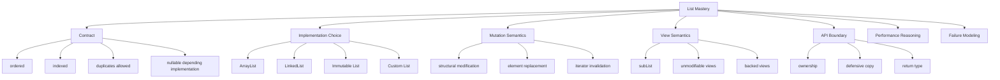
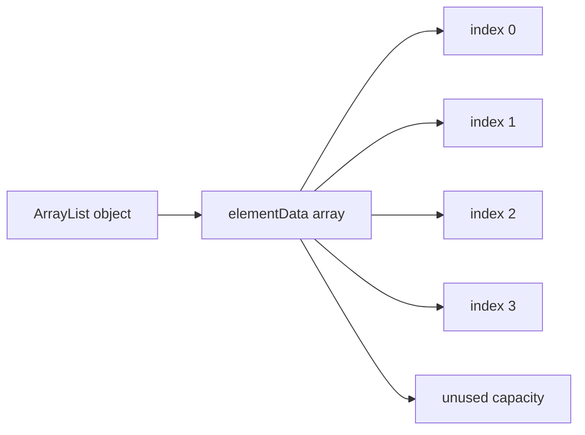
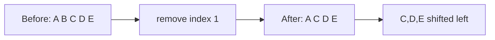
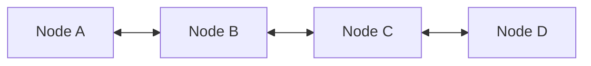
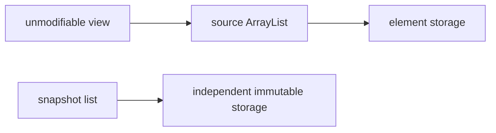

# Part 009 — List Deep Dive: Positional Access, Ordering, and Structural Mutation

## 1. Tujuan Part Ini

Part ini membahas `List` sebagai abstraction paling sering dipakai di Java application code.

Targetnya bukan sekadar tahu bahwa:

- `ArrayList` cepat untuk random access;
- `LinkedList` cepat untuk insert/delete di tengah;
- `List.of(...)` immutable;
- `subList(...)` mengambil sebagian list.

Itu terlalu dangkal.

Target sebenarnya:

> Mampu membaca, memilih, dan mendesain `List` berdasarkan kontrak posisi, encounter order, mutation model, view semantics, memory behavior, dan failure mode production.

Dalam production code, `List` sering menjadi default return type, default DTO field type, default aggregation container, default result materialization, dan default boundary antara layer.

Karena itu, kesalahan kecil pada `List` dapat berubah menjadi:

- accidental quadratic behavior;
- memory retention;
- hidden mutability leak;
- lost determinism;
- `ConcurrentModificationException`;
- result ordering bug;
- pagination bug;
- cache invalidation bug;
- unstable API contract.

Part ini akan membahas `List` sebagai **ordered positional sequence**, bukan sebagai “array yang lebih fleksibel”.

---

## 2. Kaufman Deconstruction: Apa Skill yang Harus Dikuasai?

Berdasarkan pendekatan Josh Kaufman, skill besar harus dipecah menjadi sub-skill yang dapat dilatih secara sengaja.

Untuk `List`, skill intinya adalah:



Kaufman-style learning target untuk part ini:

1. bisa menjelaskan **apa yang dijanjikan `List`**;
2. bisa membedakan **semantic contract** dari **implementation behavior**;
3. bisa memilih `ArrayList`, `LinkedList`, immutable list, atau view secara sadar;
4. bisa mendeteksi bug akibat mutation dan aliasing;
5. bisa menulis API yang jelas tentang order, null, duplicates, dan mutability;
6. bisa menghindari performance trap tanpa premature optimization.

---

## 3. Mental Model: `List` Adalah Sequence dengan Posisi Stabil Secara Konseptual

`List<E>` adalah collection yang mempertahankan urutan elemen dan memberi akses berdasarkan index.

Kontrak dasarnya:

- elemen punya posisi;
- posisi dimulai dari `0`;
- duplikasi diperbolehkan;
- urutan observasi penting;
- implementasi tertentu boleh menerima `null`;
- operasi berbasis index mungkin murah atau mahal tergantung implementasi.

Contoh:

```java
List<String> statuses = List.of("NEW", "REVIEW", "APPROVED", "CLOSED");

String first = statuses.get(0);       // NEW
String second = statuses.get(1);      // REVIEW
int index = statuses.indexOf("CLOSED"); // 3
```

Tetapi jangan berhenti pada “punya index”.

Yang lebih penting:

> Index adalah bagian dari semantic model.

Kalau posisi tidak punya makna, mungkin `List` bukan abstraction yang paling tepat.

Contoh posisi punya makna:

```java
record ApprovalStep(int sequence, String role) { }

List<ApprovalStep> workflow = List.of(
    new ApprovalStep(1, "ANALYST"),
    new ApprovalStep(2, "SUPERVISOR"),
    new ApprovalStep(3, "DIRECTOR")
);
```

Di sini urutan adalah domain semantics.

Contoh posisi tidak punya makna:

```java
List<String> userPermissions = List.of("READ", "WRITE", "APPROVE");
```

Kalau tidak boleh duplicate dan order tidak penting, `Set<String>` lebih jujur.

---

## 4. `List` Contract: Apa yang Benar-Benar Dijanjikan?

`List` menjanjikan ordered collection.

Tetapi ia tidak menjanjikan:

- fast random access;
- thread-safety;
- immutability;
- null acceptance universal;
- absence of duplicates;
- stable performance across implementation;
- stable backing storage;
- physical contiguity;
- memory compactness.

Ini penting.

Kode berikut terlihat aman:

```java
void process(List<Order> orders) {
    for (int i = 0; i < orders.size(); i++) {
        handle(orders.get(i));
    }
}
```

Tetapi kalau `orders` adalah `LinkedList`, access by index dapat menjadi sangat mahal.

Lebih aman secara abstraction:

```java
void process(List<Order> orders) {
    for (Order order : orders) {
        handle(order);
    }
}
```

Atau jika memang butuh index:

```java
void process(List<Order> orders) {
    for (ListIterator<Order> it = orders.listIterator(); it.hasNext(); ) {
        int index = it.nextIndex();
        Order order = it.next();
        handle(index, order);
    }
}
```

Prinsip:

> Kalau menerima `List`, jangan otomatis mengasumsikan `ArrayList`.

---

## 5. Encounter Order vs Sorted Order vs Insertion Order

Untuk `List`, urutan adalah posisi elemen.

Tetapi asal urutan bisa berbeda:

| Jenis order | Makna | Contoh |
|---|---|---|
| Encounter order | urutan saat traversal | hasil query yang sudah diurutkan |
| Insertion order | urutan elemen dimasukkan | append event ke list |
| Sorted order | urutan comparator/natural order | list di-sort berdasarkan timestamp |
| Domain order | urutan yang punya makna bisnis | approval stage 1, 2, 3 |
| Arbitrary order | urutan tidak bermakna | hasil dari `HashSet` lalu jadi list |

Masalah production sering muncul ketika arbitrary order diperlakukan seperti deterministic order.

Contoh bug:

```java
Set<String> ids = new HashSet<>();
ids.add("C");
ids.add("A");
ids.add("B");

List<String> list = new ArrayList<>(ids);

// Salah: menganggap list pasti [A, B, C]
return list.get(0);
```

Jika order penting, buat eksplisit:

```java
List<String> list = ids.stream()
    .sorted()
    .toList();
```

Atau gunakan source yang memang punya encounter order:

```java
Set<String> ids = new LinkedHashSet<>();
```

Rule:

> Jangan biarkan order menjadi incidental behavior.

---

## 6. `ArrayList`: Default Workhorse, Bukan Universal Truth

`ArrayList` adalah resizable-array implementation dari `List`.

Mental model:



Karakteristik umum:

- bagus untuk append-heavy workload;
- bagus untuk random access;
- bagus untuk sequential traversal;
- memory locality lebih baik dibanding node-based structure;
- insert/delete di tengah membutuhkan shifting;
- capacity bisa lebih besar dari size;
- tidak synchronized;
- mengizinkan `null`.

Contoh:

```java
List<String> names = new ArrayList<>();
names.add("Ayu");
names.add("Bima");
names.add("Citra");

System.out.println(names.get(1)); // Bima
```

`ArrayList` biasanya pilihan default terbaik untuk materialized ordered sequence.

Tetapi “biasanya” bukan “selalu”.

---

## 7. `ArrayList` Size vs Capacity

`size()` adalah jumlah elemen logical.

Capacity adalah ukuran internal array.

```java
ArrayList<String> list = new ArrayList<>(1000);

System.out.println(list.size()); // 0
```

Capacity bukan size.

Ini penting karena banyak engineer salah membaca constructor:

```java
new ArrayList<>(1000)
```

Artinya:

> siapkan kapasitas awal untuk mengurangi resize, bukan isi list dengan 1000 elemen.

Untuk mengisi 1000 elemen default, harus eksplisit:

```java
List<Integer> values = new ArrayList<>(1000);
for (int i = 0; i < 1000; i++) {
    values.add(0);
}
```

Gunakan initial capacity jika Anda punya estimasi ukuran.

Contoh:

```java
List<Result> results = new ArrayList<>(commands.size());
for (Command command : commands) {
    results.add(execute(command));
}
```

Ini menghindari beberapa resize.

Tapi jangan overdo:

```java
new ArrayList<>(1_000_000)
```

Kalau real size hanya 10, Anda membuang memory.

---

## 8. `ArrayList` Structural Mutation

Structural modification adalah perubahan yang memengaruhi ukuran list atau struktur internal traversal.

Contoh structural:

```java
list.add(x);
list.remove(x);
list.clear();
```

Contoh non-structural:

```java
list.set(0, x);
```

Kenapa ini penting?

Karena iterator fail-fast biasanya mendeteksi structural modification yang tidak dilakukan melalui iterator itu sendiri.

Contoh bug:

```java
List<String> names = new ArrayList<>(List.of("A", "B", "C"));

for (String name : names) {
    if (name.equals("B")) {
        names.remove(name); // ConcurrentModificationException risk
    }
}
```

Cara benar:

```java
names.removeIf(name -> name.equals("B"));
```

Atau:

```java
for (Iterator<String> it = names.iterator(); it.hasNext(); ) {
    String name = it.next();
    if (name.equals("B")) {
        it.remove();
    }
}
```

Part 017 akan membahas fail-fast lebih dalam. Untuk sekarang, pahami bahwa mutation dan traversal adalah kontrak sensitif.

---

## 9. `ArrayList` Insert/Delete Cost Model

Append:

```java
list.add(x);
```

Biasanya murah, kecuali ketika resize terjadi.

Insert di tengah:

```java
list.add(index, x);
```

Membutuhkan shifting elemen setelah index.

Remove di tengah:

```java
list.remove(index);
```

Juga membutuhkan shifting elemen setelah index.

Diagram:



Jika workload Anda banyak melakukan insert/delete di depan atau tengah, jangan otomatis pakai `ArrayList`.

Tetapi jangan juga otomatis pindah ke `LinkedList`.

Kenapa?

Karena `LinkedList` punya trade-off besar.

---

## 10. `LinkedList`: Realitas, Bukan Mitos Interview

`LinkedList` adalah doubly-linked list implementation dari `List` dan `Deque`.

Mental model:



Setiap elemen berada di node terpisah.

Karakteristik:

- tidak mendukung fast random access;
- traversal membutuhkan pointer chasing;
- memory overhead per element lebih tinggi;
- insert/remove murah jika posisi node sudah diketahui;
- mencari posisi index tetap mahal;
- juga berperan sebagai `Deque`;
- mengizinkan `null`.

Mitos umum:

> “Gunakan `LinkedList` kalau sering insert/delete di tengah.”

Versi yang lebih benar:

> Gunakan linked structure jika Anda sudah punya cursor/iterator pada posisi yang tepat dan mutation lokal lebih dominan daripada traversal/random access.

Contoh buruk:

```java
List<String> list = new LinkedList<>();

for (int i = 0; i < list.size(); i++) {
    process(list.get(i)); // buruk untuk LinkedList
}
```

Contoh yang lebih masuk akal:

```java
LinkedList<Task> tasks = new LinkedList<>();
ListIterator<Task> it = tasks.listIterator();

while (it.hasNext()) {
    Task task = it.next();
    if (task.shouldInsertFollowUp()) {
        it.add(task.followUp());
    }
}
```

Tetapi bahkan untuk banyak kasus seperti queue/stack, `ArrayDeque` sering lebih tepat daripada `LinkedList`.

Part 012 akan membahas `Queue` dan `Deque`.

---

## 11. `RandomAccess`: Marker Interface yang Sering Diabaikan

`RandomAccess` adalah marker interface.

Tidak punya method.

Tujuannya memberi sinyal bahwa sebuah `List` mendukung random access yang cepat secara umum.

Contoh:

```java
void process(List<Order> orders) {
    if (orders instanceof RandomAccess) {
        for (int i = 0; i < orders.size(); i++) {
            handle(orders.get(i));
        }
    } else {
        for (Order order : orders) {
            handle(order);
        }
    }
}
```

Apakah Anda harus selalu melakukan ini?

Tidak.

Gunakan hanya untuk generic algorithm yang benar-benar sensitif terhadap list implementation.

Pada application service biasa, enhanced for-loop lebih sederhana:

```java
for (Order order : orders) {
    handle(order);
}
```

Prinsip:

> API menerima abstraction; algorithm boleh melakukan specialization jika cost model penting.

---

## 12. `List.of`: Immutable List Factory

Sejak Java 9, `List.of(...)` menyediakan factory method untuk unmodifiable list.

Contoh:

```java
List<String> roles = List.of("ANALYST", "SUPERVISOR", "DIRECTOR");
```

Karakteristik penting:

- tidak bisa ditambah/dihapus/diubah;
- tidak menerima `null`;
- mempertahankan encounter order sesuai argumen;
- cocok untuk constant-like values;
- bukan berarti elemen di dalamnya immutable.

Contoh shallow immutability:

```java
record Rule(String name, List<String> conditions) { }

List<StringBuilder> builders = List.of(new StringBuilder("A"));
builders.get(0).append("B");

System.out.println(builders.get(0)); // AB
```

List tidak bisa dimodifikasi, tetapi object element masih mutable.

Gunakan `List.of` untuk data kecil yang fixed:

```java
private static final List<String> TERMINAL_STATUSES = List.of(
    "APPROVED",
    "REJECTED",
    "CANCELLED"
);
```

Jangan gunakan jika Anda perlu menambah elemen:

```java
List<String> values = List.of("A", "B");
values.add("C"); // UnsupportedOperationException
```

---

## 13. `List.copyOf`: Snapshot Defensive Copy

`List.copyOf(collection)` menghasilkan unmodifiable list berisi elemen dari source collection.

Contoh boundary:

```java
public final class CaseFile {
    private final List<Document> documents;

    public CaseFile(List<Document> documents) {
        this.documents = List.copyOf(documents);
    }

    public List<Document> documents() {
        return documents;
    }
}
```

Ini mencegah caller mengubah internal list setelah object dibuat.

Tanpa copy:

```java
public CaseFile(List<Document> documents) {
    this.documents = documents;
}
```

Caller masih bisa melakukan:

```java
List<Document> docs = new ArrayList<>();
CaseFile file = new CaseFile(docs);
docs.add(new Document("secret.pdf"));
```

Ini aliasing bug.

Rule:

> Pada constructor atau API boundary, gunakan defensive copy jika object Anda memiliki ownership atas collection.

---

## 14. `Collections.unmodifiableList`: View, Bukan Snapshot

`Collections.unmodifiableList(source)` membuat unmodifiable view atas source list.

Contoh:

```java
List<String> source = new ArrayList<>();
source.add("A");

List<String> view = Collections.unmodifiableList(source);

source.add("B");

System.out.println(view); // [A, B]
```

View tidak bisa dimodifikasi lewat `view`, tetapi source masih bisa berubah.

Ini berbeda dari snapshot:

```java
List<String> snapshot = List.copyOf(source);
```

Mental model:



Gunakan unmodifiable view jika Anda memang ingin expose live read-only view.

Gunakan snapshot jika Anda ingin stability.

---

## 15. `Arrays.asList`: Fixed-Size Backed List Trap

`Arrays.asList(array)` menghasilkan fixed-size list backed by array.

Contoh:

```java
String[] array = {"A", "B"};
List<String> list = Arrays.asList(array);

list.set(0, "X");
System.out.println(array[0]); // X

list.add("C"); // UnsupportedOperationException
```

Ini bukan immutable list.

Ini fixed-size view.

Kesalahan umum:

```java
List<String> values = Arrays.asList("A", "B");
values.add("C"); // UnsupportedOperationException
```

Solusi:

```java
List<String> values = new ArrayList<>(Arrays.asList("A", "B"));
values.add("C");
```

Atau modern:

```java
List<String> values = new ArrayList<>(List.of("A", "B"));
values.add("C");
```

---

## 16. `subList`: View yang Powerful dan Berbahaya

`list.subList(from, to)` mengembalikan view ke sebagian list.

Contoh:

```java
List<String> names = new ArrayList<>(List.of("A", "B", "C", "D"));
List<String> middle = names.subList(1, 3);

System.out.println(middle); // [B, C]

middle.clear();
System.out.println(names); // [A, D]
```

`subList` berguna untuk bulk operation:

```java
list.subList(0, Math.min(100, list.size())).clear();
```

Tetapi berbahaya jika disimpan lama.

Contoh:

```java
List<byte[]> huge = loadHugeList();
List<byte[]> firstTen = huge.subList(0, 10);

return firstTen;
```

Tergantung implementasi, view dapat mempertahankan referensi ke backing list, sehingga memory yang besar tetap tertahan.

Lebih aman jika ingin snapshot kecil:

```java
return List.copyOf(huge.subList(0, 10));
```

Rule:

> `subList` bagus untuk operasi lokal jangka pendek, bukan untuk boundary output jangka panjang.

---

## 17. `sort`: Mutating Operation dengan Semantic Impact

`List.sort(comparator)` mengurutkan list in-place.

Contoh:

```java
orders.sort(Comparator.comparing(Order::createdAt));
```

Ini mengubah list yang sama.

Jika list milik caller, ini mungkin side effect tak diinginkan:

```java
void export(List<Order> orders) {
    orders.sort(Comparator.comparing(Order::createdAt));
    writeCsv(orders);
}
```

Lebih aman:

```java
void export(List<Order> orders) {
    List<Order> sorted = orders.stream()
        .sorted(Comparator.comparing(Order::createdAt))
        .toList();

    writeCsv(sorted);
}
```

Atau:

```java
List<Order> sorted = new ArrayList<>(orders);
sorted.sort(Comparator.comparing(Order::createdAt));
```

Decision:

- gunakan in-place sort jika Anda memang memiliki list tersebut;
- gunakan copy jika input adalah milik caller;
- dokumentasikan ordering output.

---

## 18. `replaceAll`: Bulk Replacement, Bukan Transformation Murni

`List.replaceAll(operator)` mengganti setiap elemen pada list.

Contoh:

```java
names.replaceAll(String::trim);
```

Ini mutating operation.

Berbeda dengan stream mapping:

```java
List<String> trimmed = names.stream()
    .map(String::trim)
    .toList();
```

Gunakan `replaceAll` jika:

- list memang mutable;
- caller mengharapkan mutation;
- tidak perlu mempertahankan original.

Gunakan stream jika:

- ingin output baru;
- ingin functional-style transformation;
- input harus tidak berubah.

---

## 19. `removeIf`: Correct Mutation During Filtering

`removeIf` adalah cara idiomatis untuk menghapus elemen berdasarkan predicate.

```java
orders.removeIf(order -> order.status() == Status.CANCELLED);
```

Lebih aman daripada remove manual dalam enhanced for-loop.

Tetapi tetap mutating.

Kalau input tidak boleh berubah:

```java
List<Order> active = orders.stream()
    .filter(order -> order.status() != Status.CANCELLED)
    .toList();
```

Decision:

| Intent | API |
|---|---|
| mutate existing list | `removeIf` |
| produce filtered output | `stream().filter(...).toList()` |
| preserve mutable output | `stream().filter(...).collect(toCollection(ArrayList::new))` |

---

## 20. `toList()` Stream Result: Jangan Asumsikan Mutable

Sejak Java 16, `Stream.toList()` mengembalikan unmodifiable list.

Contoh:

```java
List<String> names = users.stream()
    .map(User::name)
    .toList();

names.add("extra"); // UnsupportedOperationException
```

Jika Anda butuh mutable list:

```java
List<String> names = users.stream()
    .map(User::name)
    .collect(Collectors.toCollection(ArrayList::new));
```

Atau:

```java
List<String> names = new ArrayList<>(users.stream()
    .map(User::name)
    .toList());
```

Rule:

> Pilih materialization API berdasarkan mutability contract, bukan kebiasaan.

---

## 21. `List` sebagai API Return Type

Pertanyaan penting:

> Kapan method harus return `List`?

Return `List` jika caller perlu mengetahui bahwa:

- hasil punya order;
- hasil boleh berisi duplicate;
- hasil dapat diakses per posisi;
- posisi/urutan adalah bagian dari kontrak.

Contoh tepat:

```java
List<ApprovalStep> approvalSteps(CaseType caseType);
```

Karena urutan step penting.

Contoh kurang tepat:

```java
List<String> permissions(User user);
```

Kalau permission unik dan order tidak penting, `Set<String>` lebih tepat.

Contoh lain:

```java
Collection<Notification> notifications(User user);
```

Kalau caller hanya perlu iterate, `Collection` mungkin cukup.

Prinsip:

> Return type adalah komunikasi semantic, bukan sekadar pilihan container.

---

## 22. `List` sebagai API Input Type

Pertanyaan:

> Method parameter sebaiknya `List`, `Collection`, `Iterable`, atau array?

Gunakan `List` jika method membutuhkan:

- positional access;
- stable order;
- duplicate preservation;
- index-aware logic.

Contoh:

```java
Money calculateTieredFee(List<FeeTier> tiers, Amount amount) {
    for (int i = 0; i < tiers.size(); i++) {
        FeeTier tier = tiers.get(i);
        // index matters for diagnostics
    }
}
```

Gunakan `Collection` jika hanya butuh size dan traversal:

```java
void validateAll(Collection<Command> commands) {
    if (commands.isEmpty()) {
        throw new IllegalArgumentException("commands must not be empty");
    }
    commands.forEach(this::validate);
}
```

Gunakan `Iterable` jika hanya butuh traversal dan tidak butuh size:

```java
void writeAll(Iterable<Record> records) {
    for (Record record : records) {
        writer.write(record);
    }
}
```

Rule:

> Jangan meminta `List` jika Anda hanya butuh `Iterable`.

---

## 23. Null Semantics dalam `List`

Beberapa list mengizinkan `null`, misalnya `ArrayList` dan `LinkedList`.

Tetapi factory method seperti `List.of` tidak mengizinkan `null`.

Contoh:

```java
List<String> mutable = new ArrayList<>();
mutable.add(null); // allowed

List<String> immutable = List.of("A", null); // NullPointerException
```

Secara production, null element biasanya membuat pipeline lebih rapuh.

Contoh:

```java
names.stream()
    .map(String::trim)
    .toList(); // NPE jika ada null
```

Lebih baik validasi di boundary:

```java
static List<String> normalizeNames(List<String> input) {
    Objects.requireNonNull(input, "input");

    List<String> result = new ArrayList<>(input.size());
    for (String value : input) {
        if (value == null) {
            throw new IllegalArgumentException("name must not be null");
        }
        result.add(value.trim());
    }
    return List.copyOf(result);
}
```

Rule:

> Null policy harus menjadi bagian dari API contract.

---

## 24. Duplicate Semantics

`List` mengizinkan duplicates.

Ini berguna jika multiplicity penting.

Contoh:

```java
List<String> eventTypes = List.of("CREATED", "UPDATED", "UPDATED", "CLOSED");
```

Di sini duplicate `UPDATED` mungkin menunjukkan dua event berbeda.

Tetapi jika duplicate tidak valid, jangan hanya menerima `List` tanpa validasi.

```java
static List<String> requireUniquePreservingOrder(List<String> input) {
    Set<String> seen = new LinkedHashSet<>();
    for (String item : input) {
        if (!seen.add(item)) {
            throw new IllegalArgumentException("duplicate item: " + item);
        }
    }
    return List.copyOf(seen);
}
```

Atau gunakan `Set` sebagai abstraction input jika uniqueness adalah kontrak.

---

## 25. Index Semantics dan Off-by-One Bug

List index adalah sumber bug klasik:

```java
for (int i = 0; i <= list.size(); i++) { // bug
    process(list.get(i));
}
```

Benar:

```java
for (int i = 0; i < list.size(); i++) {
    process(list.get(i));
}
```

Range convention di Java umumnya:

> from inclusive, to exclusive.

Contoh:

```java
list.subList(0, 10); // index 0..9
```

Gunakan helper agar intent jelas:

```java
static <T> List<T> firstN(List<T> input, int limit) {
    if (limit < 0) {
        throw new IllegalArgumentException("limit must not be negative");
    }
    return List.copyOf(input.subList(0, Math.min(limit, input.size())));
}
```

---

## 26. Pagination dengan `List`: Jangan Campur Index dan Domain Cursor

In-memory pagination:

```java
static <T> List<T> page(List<T> input, int page, int size) {
    if (page < 0 || size <= 0) {
        throw new IllegalArgumentException("invalid page request");
    }

    int from = Math.multiplyExact(page, size);
    if (from >= input.size()) {
        return List.of();
    }

    int to = Math.min(from + size, input.size());
    return List.copyOf(input.subList(from, to));
}
```

Perhatikan:

- validasi page dan size;
- `Math.multiplyExact` mencegah silent integer overflow;
- output snapshot, bukan view;
- range `from inclusive`, `to exclusive`.

Tetapi untuk database atau distributed query, jangan samakan list index dengan cursor domain.

Cursor pagination punya semantics berbeda:

- stable ordering;
- tie-breaker;
- page token;
- consistency window;
- changing source data.

`List` pagination hanya aman untuk snapshot in-memory.

---

## 27. `List` dan Deterministic Output

Dalam sistem audit/regulatory, deterministic output penting.

Contoh buruk:

```java
List<Violation> violations = new ArrayList<>(violationSet);
return violations;
```

Jika `violationSet` adalah `HashSet`, order tidak dijamin.

Lebih baik:

```java
List<Violation> violations = violationSet.stream()
    .sorted(Comparator.comparing(Violation::code))
    .toList();
```

Atau gunakan insertion-order source:

```java
Set<Violation> violations = new LinkedHashSet<>();
```

Checklist deterministic list:

- sumber order jelas;
- comparator eksplisit jika sorted;
- tie-breaker tersedia;
- null handling jelas;
- output tidak bergantung pada hash iteration order;
- test memverifikasi order.

---

## 28. `List` dalam DTO dan Serialization Boundary

DTO sering memakai `List`:

```java
record CaseResponse(
    String caseId,
    List<DocumentResponse> documents
) { }
```

Pertanyaan contract:

- apakah `documents` boleh kosong?
- apakah boleh `null`?
- apakah urutannya penting?
- apakah duplicate valid?
- apakah client boleh bergantung pada order?
- apakah field selalu ada di JSON?

Di Java object:

```java
public CaseResponse {
    documents = List.copyOf(documents);
}
```

Ini baik untuk internal immutability.

Tetapi untuk framework serialization/deserialization, pastikan constructor/record usage compatible dengan framework Anda.

Prinsip:

> DTO list bukan hanya container; ia bagian dari external contract.

---

## 29. `List` dan Domain Invariant

Jangan hanya menyimpan raw list jika domain punya invariant.

Contoh buruk:

```java
record ApprovalWorkflow(List<ApprovalStep> steps) { }
```

Masalah:

- steps bisa kosong;
- duplicate sequence;
- sequence tidak sorted;
- role null;
- caller bisa mengirim mutable list jika tidak defensive copy;
- tidak ada invariant.

Lebih baik:

```java
public record ApprovalWorkflow(List<ApprovalStep> steps) {
    public ApprovalWorkflow {
        Objects.requireNonNull(steps, "steps");
        if (steps.isEmpty()) {
            throw new IllegalArgumentException("workflow must have at least one step");
        }

        List<ApprovalStep> copy = new ArrayList<>(steps);
        copy.sort(Comparator.comparingInt(ApprovalStep::sequence));

        int expected = 1;
        Set<Integer> seen = new HashSet<>();
        for (ApprovalStep step : copy) {
            Objects.requireNonNull(step, "step");
            if (!seen.add(step.sequence())) {
                throw new IllegalArgumentException("duplicate sequence: " + step.sequence());
            }
            if (step.sequence() != expected++) {
                throw new IllegalArgumentException("sequence must be contiguous from 1");
            }
        }

        steps = List.copyOf(copy);
    }
}
```

Ini menjadikan `List` sebagai domain sequence yang valid, bukan arbitrary bag of items.

---

## 30. `List` dan Memory Retention

Bug memory retention terjadi ketika list atau view mempertahankan referensi lebih lama dari perlu.

Contoh:

```java
class BatchContext {
    private final List<Record> failedRecords = new ArrayList<>();

    void markFailed(Record record) {
        failedRecords.add(record);
    }
}
```

Jika `Record` membawa payload besar, list kecil pun dapat menahan banyak memory.

Contoh lain:

```java
List<Record> records = loadMillionRecords();
List<Record> sample = records.subList(0, 10);
cache.put("sample", sample); // risk: backing records retained
```

Lebih aman:

```java
cache.put("sample", List.copyOf(records.subList(0, 10)));
```

Checklist memory:

- apakah list menyimpan object besar?
- apakah list hidup lebih lama dari object yang disimpan?
- apakah list adalah view?
- apakah cache menyimpan list?
- apakah list perlu clear setelah batch selesai?
- apakah snapshot lebih tepat?

---

## 31. `List` dan Accidental Quadratic Behavior

Contoh klasik:

```java
List<Customer> customers = loadCustomers();
List<Order> orders = loadOrders();

for (Customer customer : customers) {
    for (Order order : orders) {
        if (order.customerId().equals(customer.id())) {
            process(customer, order);
        }
    }
}
```

Ini bukan bug `List`, tetapi bug model.

Solusi: bangun index.

```java
Map<CustomerId, List<Order>> ordersByCustomer = orders.stream()
    .collect(Collectors.groupingBy(Order::customerId));

for (Customer customer : customers) {
    List<Order> customerOrders = ordersByCustomer.getOrDefault(customer.id(), List.of());
    for (Order order : customerOrders) {
        process(customer, order);
    }
}
```

Part 030 akan membahas transform/index/group/diff/merge lebih sistematis.

Rule:

> Kalau Anda mencari di list besar berkali-kali, mungkin Anda butuh index, bukan loop yang lebih cantik.

---

## 32. `List.contains`: Equality-Based Linear Search

`contains` memakai equality semantics.

```java
if (list.contains(target)) {
    ...
}
```

Untuk `ArrayList`, ini linear scan.

Jika dipanggil di loop besar:

```java
for (String id : ids) {
    if (allowedIds.contains(id)) {
        process(id);
    }
}
```

Jika `allowedIds` besar, ubah ke `Set`:

```java
Set<String> allowed = new HashSet<>(allowedIds);
for (String id : ids) {
    if (allowed.contains(id)) {
        process(id);
    }
}
```

Tetapi jika order output harus mengikuti `ids`, tetap iterate `ids` dan gunakan set hanya sebagai index membership.

```java
List<String> filtered = ids.stream()
    .filter(allowed::contains)
    .toList();
```

---

## 33. `List` sebagai Stable Snapshot untuk Auditing

Dalam sistem audit, output list sering harus menjadi snapshot yang tidak berubah.

Contoh:

```java
public record ValidationReport(
    List<ValidationError> errors
) {
    public ValidationReport {
        errors = List.copyOf(errors);
    }
}
```

Tambahkan deterministic order:

```java
public record ValidationReport(List<ValidationError> errors) {
    public ValidationReport {
        errors = errors.stream()
            .sorted(Comparator
                .comparing(ValidationError::field)
                .thenComparing(ValidationError::code)
                .thenComparing(ValidationError::message))
            .toList();
    }
}
```

Ini membuat output:

- stabil;
- testable;
- mudah dibandingkan;
- cocok untuk audit log;
- tidak bergantung pada traversal incidental.

---

## 34. Production Decision Matrix: `ArrayList` vs `LinkedList` vs Immutable List

| Kebutuhan | Pilihan default | Catatan |
|---|---|---|
| materialized ordered result | `ArrayList` internal, `List.copyOf` output | common case |
| small fixed constants | `List.of` | no null |
| defensive immutable snapshot | `List.copyOf` | shallow immutable |
| read-only live view | `Collections.unmodifiableList` | source masih bisa berubah |
| frequent append | `ArrayList` | beri initial capacity jika tahu size |
| frequent random access | `ArrayList` | `RandomAccess` |
| stack/queue/deque | `ArrayDeque` | bukan `LinkedList` default |
| cursor-based local insertion | `LinkedList` + `ListIterator` | niche |
| subrange operation lokal | `subList` | jangan leak jangka panjang |
| uniqueness required | `Set` | bukan `List` |
| membership lookup intensif | `HashSet` index | tetap bisa output list |

---

## 35. Code Review Checklist untuk `List`

Gunakan checklist ini saat review PR.

### Contract

- Apakah method benar-benar membutuhkan `List`, bukan `Collection`/`Iterable`?
- Apakah order adalah bagian dari kontrak?
- Apakah duplicate diperbolehkan?
- Apakah null element diperbolehkan?
- Apakah caller boleh memodifikasi returned list?

### Mutation

- Apakah input list dimutasi secara tidak terduga?
- Apakah `sort`, `replaceAll`, `removeIf`, `clear`, `add` dilakukan pada list milik caller?
- Apakah mutation terjadi saat iteration?
- Apakah ada aliasing dari constructor?

### Performance

- Apakah ada `get(i)` pada unknown `List` implementation?
- Apakah ada `contains` dalam loop besar?
- Apakah ada nested list scan yang seharusnya memakai index?
- Apakah initial capacity masuk akal?
- Apakah `LinkedList` dipilih karena mitos?

### View

- Apakah `subList` disimpan keluar scope lokal?
- Apakah unmodifiable view disangka snapshot?
- Apakah `Arrays.asList` disangka mutable list biasa?

### Determinism

- Apakah list dibuat dari unordered source?
- Apakah comparator punya tie-breaker?
- Apakah output order diuji?

---

## 36. Common Bugs dan Fix

### Bug 1: Return Internal Mutable List

Buruk:

```java
class Registry {
    private final List<Handler> handlers = new ArrayList<>();

    List<Handler> handlers() {
        return handlers;
    }
}
```

Caller bisa mengubah internal state.

Fix:

```java
List<Handler> handlers() {
    return List.copyOf(handlers);
}
```

Atau jika live view memang diinginkan:

```java
List<Handler> handlers() {
    return Collections.unmodifiableList(handlers);
}
```

Tapi dokumentasikan live view.

### Bug 2: Sorting Caller-Owned List

Buruk:

```java
List<Order> normalize(List<Order> orders) {
    orders.sort(Comparator.comparing(Order::createdAt));
    return orders;
}
```

Fix:

```java
List<Order> normalize(List<Order> orders) {
    return orders.stream()
        .sorted(Comparator.comparing(Order::createdAt))
        .toList();
}
```

### Bug 3: `Arrays.asList` Disangka Growable

Buruk:

```java
List<String> values = Arrays.asList("A", "B");
values.add("C");
```

Fix:

```java
List<String> values = new ArrayList<>(List.of("A", "B"));
values.add("C");
```

### Bug 4: `Stream.toList()` Disangka Mutable

Buruk:

```java
List<String> names = users.stream().map(User::name).toList();
names.add("admin");
```

Fix:

```java
List<String> names = users.stream()
    .map(User::name)
    .collect(Collectors.toCollection(ArrayList::new));
```

### Bug 5: `subList` Leak

Buruk:

```java
return records.subList(0, 10);
```

Fix:

```java
return List.copyOf(records.subList(0, Math.min(10, records.size())));
```

---

## 37. Practice: 20-Hour Drill untuk `List`

Latihan ini tidak perlu project besar.

### Drill 1 — API Contract Refactoring

Ambil 10 method yang menerima atau return `List`.

Untuk tiap method, jawab:

- apakah butuh order?
- apakah butuh index?
- apakah duplicate valid?
- apakah output mutable?
- apakah null valid?

Refactor minimal 3 method menjadi `Collection`, `Iterable`, `Set`, atau immutable snapshot jika lebih tepat.

### Drill 2 — Mutation Audit

Cari semua penggunaan:

- `sort`;
- `removeIf`;
- `replaceAll`;
- `subList`;
- `clear`;
- `addAll`.

Tentukan apakah list yang dimutasi adalah owned atau borrowed.

### Drill 3 — Performance Trap

Cari pattern:

```java
for (...) {
    list.contains(...)
}
```

atau:

```java
for (...) {
    for (...) {
        ...
    }
}
```

Ubah menjadi index berbasis `Map`/`Set` jika sesuai.

### Drill 4 — Deterministic Output

Ambil pipeline yang output-nya list dari `Set`, `Map`, atau database result.

Pastikan ordering contract eksplisit.

### Drill 5 — Snapshot Boundary

Buat value object dengan `List` field.

Implementasikan:

- null rejection;
- defensive copy;
- duplicate validation;
- deterministic sorting;
- unmodifiable output.

---

## 38. Mini Case Study: Validation Result List

Masalah:

Anda membangun validator untuk command regulatory case.

Requirement:

- error boleh lebih dari satu;
- order error harus deterministic;
- caller tidak boleh mutate result;
- duplicate error sebaiknya dihindari;
- error harus menyimpan field dan code.

Model:

```java
record ValidationError(String field, String code, String message) { }
```

Naive implementation:

```java
class ValidationResult {
    private final List<ValidationError> errors = new ArrayList<>();

    void add(ValidationError error) {
        errors.add(error);
    }

    List<ValidationError> errors() {
        return errors;
    }
}
```

Masalah:

- mutable leak;
- duplicate allowed tanpa sadar;
- order tergantung execution path;
- null mungkin masuk;
- tidak ada invariant.

Production-grade version:

```java
public final class ValidationResult {
    private final List<ValidationError> errors;

    private ValidationResult(List<ValidationError> errors) {
        this.errors = errors.stream()
            .map(error -> Objects.requireNonNull(error, "error"))
            .distinct()
            .sorted(Comparator
                .comparing(ValidationError::field)
                .thenComparing(ValidationError::code)
                .thenComparing(ValidationError::message))
            .toList();
    }

    public static ValidationResult of(List<ValidationError> errors) {
        return new ValidationResult(errors);
    }

    public boolean valid() {
        return errors.isEmpty();
    }

    public List<ValidationError> errors() {
        return errors;
    }
}
```

Catatan:

- `toList()` memberi unmodifiable list;
- `distinct()` bergantung pada `equals/hashCode` record;
- `sorted()` membuat output deterministic;
- constructor membuat boundary invariant.

---

## 39. Baeldung-Style Summary

`List` adalah abstraction untuk ordered positional collection.

Gunakan `List` ketika order, duplicates, atau positional access adalah bagian dari kontrak.

Gunakan `ArrayList` sebagai default materialized list untuk sebagian besar workload karena traversal dan random access baik.

Jangan memilih `LinkedList` karena mitos interview. Pilih hanya jika cursor-based insertion/removal benar-benar dominan dan trade-off memory/traversal diterima.

`List.of` dan `List.copyOf` cocok untuk unmodifiable list dan defensive snapshot. `Collections.unmodifiableList` adalah view, bukan snapshot. `Arrays.asList` adalah fixed-size backed list, bukan growable list.

`subList` powerful untuk operasi lokal, tetapi berbahaya jika dileak keluar sebagai long-lived result.

Dalam API design, return type `List` harus berarti sesuatu: order jelas, duplicate policy jelas, null policy jelas, dan mutability jelas.

---

## 40. Referensi Resmi

- Java SE 25 `List`: https://docs.oracle.com/en/java/javase/25/docs/api/java.base/java/util/List.html
- Java SE 25 `ArrayList`: https://docs.oracle.com/en/java/javase/25/docs/api/java.base/java/util/ArrayList.html
- Java SE 25 `LinkedList`: https://docs.oracle.com/en/java/javase/25/docs/api/java.base/java/util/LinkedList.html
- Java SE 25 `RandomAccess`: https://docs.oracle.com/en/java/javase/25/docs/api/java.base/java/util/RandomAccess.html
- Java SE 25 `Collections`: https://docs.oracle.com/en/java/javase/25/docs/api/java.base/java/util/Collections.html
- Java SE 25 `Arrays`: https://docs.oracle.com/en/java/javase/25/docs/api/java.base/java/util/Arrays.html

---

## 41. Apa yang Harus Dikuasai Sebelum Lanjut

Sebelum lanjut ke Part 010, pastikan Anda bisa menjawab:

1. Apa bedanya `List.of`, `List.copyOf`, `Collections.unmodifiableList`, dan `Arrays.asList`?
2. Kenapa `ArrayList` biasanya lebih baik daripada `LinkedList` untuk kebanyakan use case?
3. Kapan `List` sebagai return type lebih tepat daripada `Collection`?
4. Kenapa `subList` bisa menyebabkan memory retention?
5. Apa bedanya mutating filter dengan producing filtered list?
6. Bagaimana memastikan output list deterministic?
7. Apa risiko `contains` dalam loop besar?
8. Kapan initial capacity berguna?
9. Apa arti `RandomAccess`?
10. Bagaimana mendesain value object yang punya `List` field secara aman?

Jika semua pertanyaan ini bisa dijawab dengan contoh kode dan trade-off, Anda sudah menguasai `List` pada level yang jauh lebih kuat daripada sekadar tahu API-nya.
