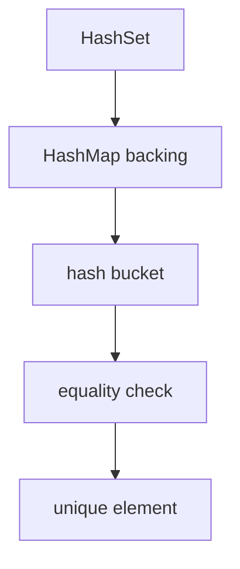
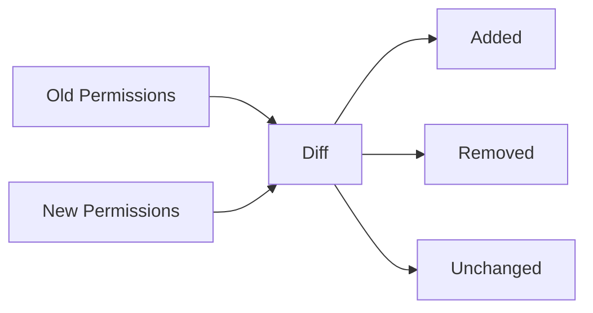

# Part 010 — Set Deep Dive: Uniqueness, Identity, Hashing, and Ordering

## 1. Tujuan Part Ini

Part ini membahas `Set` sebagai abstraction untuk **uniqueness boundary**.

Banyak engineer memakai `Set` hanya karena ingin `contains` lebih cepat daripada `List`.

Itu benar, tetapi belum cukup.

Skill yang lebih penting:

> Mampu menggunakan `Set` untuk mengekspresikan invariant domain: sesuatu harus unik, membership penting, duplicate adalah kondisi bermakna, dan ordering harus eksplisit jika diperlukan.

`Set` bukan sekadar data structure.

Dalam production system, `Set` sering dipakai untuk:

- deduplication;
- permission model;
- feature flags;
- visited markers;
- uniqueness validation;
- membership index;
- conflict detection;
- domain invariant;
- graph/workflow traversal support;
- audit diff;
- eligibility rule evaluation.

Kesalahan kecil pada `Set` dapat menghasilkan:

- duplicate yang lolos;
- element hilang secara “misterius”;
- output tidak deterministic;
- comparator inconsistent bug;
- mutable key/element corruption;
- null handling bug;
- memory blow-up;
- incorrect access control;
- audit mismatch.

---

## 2. Kaufman Deconstruction: Skill Map untuk `Set`

```mermaid
flowchart TD
    A[Set Mastery] --> B[Uniqueness Semantics]
    A --> C[Equality and Hashing]
    A --> D[Implementation Choice]
    A --> E[Ordering]
    A --> F[Set Algebra]
    A --> G[Domain Invariants]
    A --> H[Failure Modeling]

    B --> B1[duplicate rejection]
    B --> B2[membership]
    B --> B3[idempotency]

    C --> C1[equals]
    C --> C2[hashCode]
    C --> C3[compareTo/comparator]

    D --> D1[HashSet]
    D --> D2[LinkedHashSet]
    D --> D3[TreeSet]
    D --> D4[EnumSet]
    D --> D5[Identity-based sets]

    E --> E1[unordered]
    E --> E2[insertion order]
    E --> E3[sorted order]
    E --> E4[enum declaration order]

    F --> F1[union]
    F --> F2[intersection]
    F --> F3[difference]
    F --> F4[symmetric difference]
```



Kaufman-style target:

1. pahami `Set` sebagai semantic contract;
2. pahami bagaimana equality/hashing/ordering menentukan duplicate;
3. pilih implementation berdasarkan order, performance, dan domain need;
4. gunakan set algebra untuk logic yang jelas;
5. hindari mutable element corruption;
6. desain API yang eksplisit tentang uniqueness dan ordering.

---

## 3. Mental Model: `Set` Adalah Boundary untuk “Sudah Ada atau Belum?”

`Set` merepresentasikan collection yang tidak mengandung duplicate.

Contoh:

```java
Set<String> permissions = new HashSet<>();
permissions.add("READ");
permissions.add("WRITE");
permissions.add("READ");

System.out.println(permissions.size()); // 2
```

`Set.add` mengembalikan `boolean`.

```java
boolean added = permissions.add("READ");
```

Maknanya:

- `true`: element belum ada, sekarang ditambahkan;
- `false`: element sudah ada menurut equality semantics set.

Ini sangat berguna untuk invariant:

```java
if (!seenCaseIds.add(caseId)) {
    throw new DuplicateCaseException(caseId);
}
```

Jangan abaikan return value `add` jika duplicate adalah error.

---

## 4. `Set` Contract: Apa yang Dijanjikan?

`Set` menjanjikan uniqueness.

Tetapi tidak menjanjikan:

- ordering universal;
- fast lookup universal;
- null support universal;
- thread-safety;
- immutability;
- stable iteration order;
- identity-based uniqueness;
- deep immutability;
- deterministic serialization order.

`Set` juga sangat bergantung pada definisi equality.

Untuk `HashSet`, duplicate ditentukan oleh `equals` dan `hashCode`.

Untuk `TreeSet`, duplicate ditentukan oleh comparator/natural ordering, yaitu ketika compare menghasilkan `0`.

Ini perbedaan besar.

---

## 5. `HashSet`: General-Purpose Membership Set

`HashSet` adalah implementation paling umum.

Mental model:



Karakteristik:

- backed by `HashMap`;
- tidak menjamin iteration order;
- mengizinkan satu `null` element;
- lookup/add/remove rata-rata efisien;
- bergantung pada `hashCode` dan `equals`;
- tidak synchronized.

Contoh:

```java
Set<String> ids = new HashSet<>();
ids.add("C-001");
ids.add("C-002");
ids.add("C-001");

System.out.println(ids); // order tidak boleh diasumsikan
```

Gunakan `HashSet` untuk:

- membership lookup;
- deduplication tanpa order;
- visited marker;
- duplicate detection;
- intermediate index.

Jangan gunakan `HashSet` jika output order penting.

---

## 6. Hashing Contract: `HashSet` Tidak Bisa Menyelamatkan Object yang Salah

Contoh benar dengan record:

```java
record CustomerId(String value) { }

Set<CustomerId> ids = new HashSet<>();
ids.add(new CustomerId("C-001"));
ids.add(new CustomerId("C-001"));

System.out.println(ids.size()); // 1
```

Contoh salah:

```java
final class CustomerId {
    private final String value;

    CustomerId(String value) {
        this.value = value;
    }
}

Set<CustomerId> ids = new HashSet<>();
ids.add(new CustomerId("C-001"));
ids.add(new CustomerId("C-001"));

System.out.println(ids.size()); // 2
```

Karena `equals`/`hashCode` tidak dioverride.

Perbaikan:

```java
final class CustomerId {
    private final String value;

    CustomerId(String value) {
        this.value = Objects.requireNonNull(value);
    }

    @Override
    public boolean equals(Object other) {
        return other instanceof CustomerId that
            && this.value.equals(that.value);
    }

    @Override
    public int hashCode() {
        return value.hashCode();
    }
}
```

Rule:

> `HashSet` correctness adalah correctness `equals`/`hashCode` dari element-nya.

---

## 7. Mutable Element Hazard

Bug paling berbahaya:

```java
final class UserKey {
    private String username;

    UserKey(String username) {
        this.username = username;
    }

    void rename(String username) {
        this.username = username;
    }

    @Override
    public boolean equals(Object other) {
        return other instanceof UserKey that
            && Objects.equals(username, that.username);
    }

    @Override
    public int hashCode() {
        return Objects.hash(username);
    }
}
```

Lalu:

```java
UserKey key = new UserKey("alice");
Set<UserKey> users = new HashSet<>();
users.add(key);

key.rename("bob");

System.out.println(users.contains(key)); // bisa false
```

Kenapa?

Karena hash bucket dihitung saat insert berdasarkan hash lama.

Setelah state berubah, object “terletak” di bucket lama tetapi dicari dengan hash baru.

Prinsip:

> Field yang dipakai untuk equality/hashing harus stabil selama element berada di hash-based collection.

Solusi:

- gunakan immutable value object;
- gunakan record;
- jangan mutate field identity;
- remove lalu add ulang jika identity memang berubah;
- jangan gunakan mutable DTO sebagai set element jika equality berbasis mutable field.

---

## 8. `LinkedHashSet`: Uniqueness + Encounter Order

`LinkedHashSet` menjaga uniqueness seperti hash set, tetapi mempertahankan encounter order.

Biasanya insertion order.

Contoh:

```java
Set<String> ids = new LinkedHashSet<>();
ids.add("C");
ids.add("A");
ids.add("B");
ids.add("A");

System.out.println(ids); // [C, A, B]
```

Gunakan `LinkedHashSet` jika Anda butuh:

- deduplication sambil mempertahankan order input;
- deterministic output berdasarkan input order;
- stable serialization order;
- first-seen-wins behavior.

Contoh production:

```java
static List<String> uniquePreservingOrder(List<String> input) {
    return List.copyOf(new LinkedHashSet<>(input));
}
```

Ini pattern sangat berguna.

Jika Anda memakai `HashSet` lalu convert ke list, order bisa tidak deterministic.

---

## 9. `TreeSet`: Sorted Uniqueness

`TreeSet` memberikan sorted set.

Duplicate ditentukan oleh comparator/natural ordering.

Contoh:

```java
Set<String> names = new TreeSet<>();
names.add("Bima");
names.add("Ayu");
names.add("Citra");

System.out.println(names); // [Ayu, Bima, Citra]
```

Gunakan `TreeSet` jika Anda butuh:

- sorted iteration;
- range query;
- floor/ceiling/lower/higher operations;
- navigable set behavior;
- deterministic order by comparator.

Contoh:

```java
NavigableSet<LocalDate> dates = new TreeSet<>();
dates.add(LocalDate.parse("2026-06-01"));
dates.add(LocalDate.parse("2026-06-15"));
dates.add(LocalDate.parse("2026-07-01"));

LocalDate next = dates.ceiling(LocalDate.parse("2026-06-10"));
System.out.println(next); // 2026-06-15
```

Tetapi `TreeSet` tidak menggunakan hash.

Ia memakai ordering.

---

## 10. `TreeSet` Trap: Comparator Determines Equality

Contoh:

```java
record Person(String name, int age) { }

Set<Person> people = new TreeSet<>(Comparator.comparing(Person::name));
people.add(new Person("Ayu", 20));
people.add(new Person("Ayu", 30));

System.out.println(people.size()); // 1
```

Kenapa?

Comparator hanya membandingkan `name`.

Bagi `TreeSet`, dua element dianggap duplicate jika comparator menghasilkan `0`.

Padahal `record` `equals` akan menganggap mereka berbeda karena `age` berbeda.

Ini bukan bug Java.

Ini desain comparator.

Jika ingin unique berdasarkan semua field:

```java
Set<Person> people = new TreeSet<>(
    Comparator.comparing(Person::name)
        .thenComparingInt(Person::age)
);
```

Rule:

> Comparator pada `TreeSet` adalah identity function untuk uniqueness dalam set itu.

Jika comparator tidak consistent with equals, dokumentasikan dengan sangat jelas.

---

## 11. `BigDecimal` dan Consistency Trap

`BigDecimal` adalah contoh klasik.

```java
BigDecimal a = new BigDecimal("1.0");
BigDecimal b = new BigDecimal("1.00");

System.out.println(a.equals(b));    // false
System.out.println(a.compareTo(b)); // 0
```

Maka:

```java
Set<BigDecimal> hash = new HashSet<>();
hash.add(a);
hash.add(b);
System.out.println(hash.size()); // 2

Set<BigDecimal> tree = new TreeSet<>();
tree.add(a);
tree.add(b);
System.out.println(tree.size()); // 1
```

Ini menunjukkan bahwa pilihan set implementation bisa mengubah duplicate semantics.

Dalam domain uang, biasanya lebih baik normalize scale atau gunakan money value object.

```java
record Money(BigDecimal amount, Currency currency) {
    Money {
        amount = amount.setScale(2, RoundingMode.UNNECESSARY);
    }
}
```

---

## 12. `EnumSet`: Set Paling Tepat untuk Enum

Jika element type adalah enum, gunakan `EnumSet`.

Contoh:

```java
enum Permission {
    READ,
    WRITE,
    APPROVE,
    DELETE
}

EnumSet<Permission> permissions = EnumSet.of(Permission.READ, Permission.WRITE);
```

Karakteristik:

- khusus untuk enum;
- sangat compact secara konsep karena dapat direpresentasikan seperti bit vector;
- tidak mengizinkan `null`;
- iteration mengikuti natural order enum declaration;
- punya factory seperti `noneOf`, `allOf`, `of`, `range`, `complementOf`.

Contoh:

```java
EnumSet<Permission> all = EnumSet.allOf(Permission.class);
EnumSet<Permission> dangerous = EnumSet.of(Permission.DELETE, Permission.APPROVE);
EnumSet<Permission> safe = EnumSet.complementOf(dangerous);
```

Untuk permission, flags, states, capabilities, `EnumSet` biasanya lebih jelas dan efisien daripada `HashSet<Enum>`.

---

## 13. `Set.of` dan `Set.copyOf`

`Set.of(...)` membuat unmodifiable set.

```java
Set<String> terminalStatuses = Set.of("APPROVED", "REJECTED", "CANCELLED");
```

Karakteristik:

- tidak bisa dimodifikasi;
- tidak menerima `null`;
- tidak menerima duplicate pada argumen factory;
- iteration order tidak boleh dijadikan kontrak kecuali dokumentasi implementation tertentu menyatakan demikian;
- shallow immutable.

Contoh duplicate:

```java
Set.of("A", "A"); // IllegalArgumentException
```

`Set.copyOf(collection)` membuat unmodifiable snapshot.

```java
Set<String> permissions = Set.copyOf(inputPermissions);
```

Catatan penting:

Jika input collection berisi duplicates, hasil set akan deduplicate.

Kalau duplicate adalah error, jangan pakai `Set.copyOf` sebagai validation tanpa membandingkan size.

```java
static Set<String> requireUnique(Collection<String> input) {
    Set<String> copy = Set.copyOf(input);
    if (copy.size() != input.size()) {
        throw new IllegalArgumentException("duplicates are not allowed");
    }
    return copy;
}
```

Tetapi hati-hati: jika input adalah collection yang duplicate-nya sudah tidak terlihat, seperti `Set`, size comparison tidak membantu.

---

## 14. Null Semantics pada Set

Null support bergantung implementation.

Contoh:

```java
Set<String> hash = new HashSet<>();
hash.add(null); // allowed

Set<String> linked = new LinkedHashSet<>();
linked.add(null); // allowed

Set<String> immutable = Set.of(null); // NullPointerException
```

Untuk `TreeSet`, null behavior bergantung comparator/natural ordering dan Java version/implementation semantics. Secara production, jangan desain sorted set yang menerima null kecuali comparator Anda eksplisit menanganinya.

Contoh comparator null-safe:

```java
Set<String> values = new TreeSet<>(Comparator.nullsLast(Comparator.naturalOrder()));
values.add(null);
values.add("A");
```

Tetapi lebih baik reject null di boundary untuk domain collection.

```java
static Set<String> normalizePermissions(Collection<String> input) {
    Set<String> result = new LinkedHashSet<>();
    for (String permission : input) {
        if (permission == null) {
            throw new IllegalArgumentException("permission must not be null");
        }
        result.add(permission.trim().toUpperCase(Locale.ROOT));
    }
    return Set.copyOf(result);
}
```

---

## 15. Identity-Based Set

Kadang Anda butuh uniqueness berdasarkan object identity, bukan `equals`.

Java menyediakan `IdentityHashMap`, dan Anda bisa membuat set berbasis identity:

```java
Set<Object> identitySet = Collections.newSetFromMap(new IdentityHashMap<>());
```

Contoh:

```java
String a = new String("x");
String b = new String("x");

Set<String> normal = new HashSet<>();
normal.add(a);
normal.add(b);
System.out.println(normal.size()); // 1

Set<String> identity = Collections.newSetFromMap(new IdentityHashMap<>());
identity.add(a);
identity.add(b);
System.out.println(identity.size()); // 2
```

Gunakan sangat hati-hati.

Use case:

- object graph traversal by instance identity;
- cycle detection pada object graph;
- framework internals;
- serialization identity tracking.

Jangan gunakan untuk business key uniqueness.

---

## 16. Set Algebra: Bahasa yang Lebih Jelas untuk Logic

Banyak business logic lebih jelas jika diekspresikan dengan set algebra.

### Union

```java
Set<String> union = new HashSet<>(a);
union.addAll(b);
```

Makna: semua element yang ada di `a` atau `b`.

### Intersection

```java
Set<String> intersection = new HashSet<>(a);
intersection.retainAll(b);
```

Makna: element yang ada di `a` dan `b`.

### Difference

```java
Set<String> onlyA = new HashSet<>(a);
onlyA.removeAll(b);
```

Makna: element yang ada di `a` tetapi tidak di `b`.

### Symmetric Difference

```java
Set<String> symmetric = new HashSet<>(a);
symmetric.addAll(b);

Set<String> intersection = new HashSet<>(a);
intersection.retainAll(b);

symmetric.removeAll(intersection);
```

Makna: element yang ada tepat di salah satu set.

Diagram:



---

## 17. Production Pattern: Permission Diff

Misalnya Anda punya permission lama dan baru.

```java
record PermissionChange(
    Set<String> added,
    Set<String> removed,
    Set<String> unchanged
) { }
```

Implementation:

```java
static PermissionChange diffPermissions(Set<String> oldPermissions, Set<String> newPermissions) {
    Set<String> added = new TreeSet<>(newPermissions);
    added.removeAll(oldPermissions);

    Set<String> removed = new TreeSet<>(oldPermissions);
    removed.removeAll(newPermissions);

    Set<String> unchanged = new TreeSet<>(oldPermissions);
    unchanged.retainAll(newPermissions);

    return new PermissionChange(
        Set.copyOf(added),
        Set.copyOf(removed),
        Set.copyOf(unchanged)
    );
}
```

Kenapa `TreeSet`?

Agar output deterministic.

Jika order output harus berdasarkan input order, gunakan `LinkedHashSet`.

Jika order tidak penting secara internal tetapi output JSON harus deterministic, sort sebelum boundary.

---

## 18. Production Pattern: Duplicate Detection with Diagnostics

`Set` bagus untuk mendeteksi duplicate.

Naive:

```java
if (new HashSet<>(ids).size() != ids.size()) {
    throw new IllegalArgumentException("duplicate ids");
}
```

Tapi diagnostiknya buruk.

Lebih baik:

```java
static <T> List<T> duplicates(List<T> input) {
    Set<T> seen = new HashSet<>();
    Set<T> duplicates = new LinkedHashSet<>();

    for (T item : input) {
        if (!seen.add(item)) {
            duplicates.add(item);
        }
    }

    return List.copyOf(duplicates);
}
```

Contoh:

```java
List<String> duplicatedIds = duplicates(List.of("A", "B", "A", "C", "B"));
System.out.println(duplicatedIds); // [A, B]
```

`LinkedHashSet` menjaga order kemunculan duplicate pertama.

---

## 19. Production Pattern: First-Seen Wins Deduplication

Sering dibutuhkan ketika input berurutan dan duplicate harus dihapus tanpa mengubah order.

```java
static <T> List<T> deduplicatePreservingOrder(List<T> input) {
    return List.copyOf(new LinkedHashSet<>(input));
}
```

Contoh:

```java
List<String> normalized = deduplicatePreservingOrder(
    List.of("C", "A", "C", "B", "A")
);

System.out.println(normalized); // [C, A, B]
```

Tetapi jika duplicate harus error, jangan deduplicate diam-diam.

```java
static <T> List<T> requireNoDuplicates(List<T> input) {
    Set<T> seen = new HashSet<>();
    for (T item : input) {
        if (!seen.add(item)) {
            throw new IllegalArgumentException("duplicate item: " + item);
        }
    }
    return List.copyOf(input);
}
```

Rule:

> Deduplication policy harus eksplisit: reject, first wins, last wins, merge, atau accumulate error.

---

## 20. Set as Membership Index

Kadang output tetap `List`, tetapi lookup harus memakai `Set`.

Contoh:

```java
List<String> requestedIds = List.of("A", "B", "C", "D");
List<String> allowedIds = List.of("B", "D");
```

Buruk:

```java
List<String> result = requestedIds.stream()
    .filter(allowedIds::contains)
    .toList();
```

Jika `allowedIds` besar, `contains` linear.

Lebih baik:

```java
Set<String> allowed = new HashSet<>(allowedIds);

List<String> result = requestedIds.stream()
    .filter(allowed::contains)
    .toList();
```

Output tetap mengikuti order `requestedIds`.

Set hanya dipakai sebagai index membership.

---

## 21. `EnumSet` for State Machines

Untuk state machine, `EnumSet` sangat natural.

```java
enum CaseStatus {
    DRAFT,
    SUBMITTED,
    IN_REVIEW,
    APPROVED,
    REJECTED,
    CLOSED
}
```

Terminal states:

```java
private static final EnumSet<CaseStatus> TERMINAL = EnumSet.of(
    CaseStatus.APPROVED,
    CaseStatus.REJECTED,
    CaseStatus.CLOSED
);
```

Method:

```java
static boolean isTerminal(CaseStatus status) {
    return TERMINAL.contains(status);
}
```

Jika expose keluar:

```java
static Set<CaseStatus> terminalStatuses() {
    return Set.copyOf(TERMINAL);
}
```

Atau:

```java
static EnumSet<CaseStatus> terminalStatusesMutableCopy() {
    return EnumSet.copyOf(TERMINAL);
}
```

Jangan expose mutable static `EnumSet` langsung.

Buruk:

```java
public static final EnumSet<CaseStatus> TERMINAL = EnumSet.of(...);
```

Caller bisa mutate.

---

## 22. Set and Ordering: Jangan Kabur

Pertanyaan penting:

> Apakah set Anda butuh order?

Jika tidak:

```java
Set<String> ids = new HashSet<>();
```

Jika butuh insertion/encounter order:

```java
Set<String> ids = new LinkedHashSet<>();
```

Jika butuh sorted order:

```java
Set<String> ids = new TreeSet<>();
```

Jika element enum:

```java
EnumSet<Permission> permissions = EnumSet.noneOf(Permission.class);
```

Jangan menulis test yang bergantung pada order `HashSet`.

Buruk:

```java
assertEquals(List.of("A", "B", "C"), new ArrayList<>(hashSet));
```

Benar:

```java
assertEquals(Set.of("A", "B", "C"), hashSet);
```

Atau jika order penting, gunakan ordered set.

---

## 23. `Set` sebagai API Return Type

Return `Set` jika caller harus tahu bahwa:

- hasil unik;
- membership penting;
- duplicate tidak bermakna;
- order mungkin tidak penting atau dijelaskan oleh implementation/contract.

Contoh tepat:

```java
Set<Permission> effectivePermissions(User user);
```

Karena permission adalah unique capability.

Jika order juga penting, pertimbangkan:

```java
SequencedSet<Permission> permissionsInDisplayOrder(User user);
```

atau dokumentasikan:

```java
LinkedHashSet<Permission> permissionsInDisplayOrder(User user);
```

Namun return concrete type biasanya mengikat implementation. Lebih baik return interface dengan dokumentasi order.

```java
Set<Permission> permissionsInDisplayOrder(User user);
```

Javadoc harus menyatakan iteration order jika dijamin.

---

## 24. `Set` sebagai API Input Type

Gunakan `Set` sebagai parameter jika uniqueness adalah precondition.

```java
void assignPermissions(UserId userId, Set<Permission> permissions) {
    ...
}
```

Ini memberi sinyal bahwa duplicate tidak relevan.

Tetapi jika Anda perlu mendeteksi duplicate dari caller input, jangan menerima `Set`, karena duplicates sudah hilang.

Buruk:

```java
void importRows(Set<Row> rows) {
    // tidak bisa tahu apakah input awal punya duplicate
}
```

Lebih baik:

```java
void importRows(List<Row> rows) {
    List<Row> duplicates = duplicates(rows);
    if (!duplicates.isEmpty()) {
        throw new DuplicateRowsException(duplicates);
    }
}
```

Rule:

> Terima `List` jika duplicate adalah informasi yang perlu divalidasi; terima `Set` jika uniqueness sudah menjadi precondition.

---

## 25. Set and Idempotency

`Set.add` cocok untuk idempotent accumulation.

Contoh:

```java
Set<EventId> processed = new HashSet<>();

boolean firstTime = processed.add(event.id());
if (!firstTime) {
    return; // already processed in this batch
}

handle(event);
```

Tetapi hati-hati:

- ini hanya in-memory;
- tidak aman untuk distributed idempotency;
- tidak menggantikan database unique constraint;
- tidak menggantikan message dedup store.

Dalam batch processing lokal, pattern ini sangat berguna.

Dalam distributed system, gunakan durable idempotency key storage.

---

## 26. Set and Security/Authorization

Permission biasanya set.

```java
record AccessContext(Set<Permission> permissions) {
    AccessContext {
        permissions = Set.copyOf(permissions);
    }

    boolean has(Permission permission) {
        return permissions.contains(permission);
    }
}
```

Jika permission berbasis enum:

```java
record AccessContext(EnumSet<Permission> permissions) {
    AccessContext {
        permissions = EnumSet.copyOf(permissions);
    }

    boolean has(Permission permission) {
        return permissions.contains(permission);
    }

    Set<Permission> asSet() {
        return Set.copyOf(permissions);
    }
}
```

Hindari `List<Permission>` untuk permission karena duplicate dan order tidak bermakna.

Hindari string permission mentah jika domain bisa memakai enum/value object.

---

## 27. Set and Validation Accumulation

Jika Anda ingin mengumpulkan unique validation errors, gunakan set.

```java
record ValidationError(String field, String code, String message) { }

Set<ValidationError> errors = new LinkedHashSet<>();
errors.add(new ValidationError("email", "required", "email is required"));
errors.add(new ValidationError("email", "required", "email is required"));
```

`LinkedHashSet` membuat error unik dan mempertahankan order first occurrence.

Tetapi jika output harus sorted:

```java
List<ValidationError> output = errors.stream()
    .sorted(Comparator
        .comparing(ValidationError::field)
        .thenComparing(ValidationError::code)
        .thenComparing(ValidationError::message))
    .toList();
```

Pilih order berdasarkan kebutuhan:

- first occurrence order: debugging flow;
- sorted order: deterministic contract;
- severity order: user-facing priority.

---

## 28. `retainAll`, `removeAll`, `containsAll`: Bulk Operations

Bulk set operations expressive.

```java
if (!grantedPermissions.containsAll(requiredPermissions)) {
    throw new AccessDeniedException();
}
```

Untuk missing permissions:

```java
Set<Permission> missing = EnumSet.copyOf(requiredPermissions);
missing.removeAll(grantedPermissions);

if (!missing.isEmpty()) {
    throw new AccessDeniedException(missing);
}
```

Untuk enum set, perlu hati-hati jika required kosong.

`EnumSet.copyOf(Collection)` pada collection kosong yang bukan EnumSet tidak bisa menentukan enum type.

Lebih aman:

```java
EnumSet<Permission> missing = EnumSet.noneOf(Permission.class);
missing.addAll(requiredPermissions);
missing.removeAll(grantedPermissions);
```

---

## 29. `EnumSet.copyOf` Empty Collection Trap

Contoh:

```java
List<Permission> empty = List.of();
EnumSet<Permission> permissions = EnumSet.copyOf(empty); // IllegalArgumentException
```

Kenapa?

Karena dari empty collection biasa, `EnumSet` tidak bisa tahu element type.

Gunakan:

```java
EnumSet<Permission> permissions = EnumSet.noneOf(Permission.class);
permissions.addAll(empty);
```

Atau jika input sudah `EnumSet`:

```java
EnumSet<Permission> copy = EnumSet.copyOf(existingEnumSet);
```

Rule:

> Untuk `EnumSet`, kosong tetap membutuhkan enum type.

---

## 30. `Set` and Serialization Output

Set tidak selalu punya order stabil.

Jika Anda serialize `HashSet` ke JSON array:

```java
record PermissionResponse(Set<String> permissions) { }
```

Output order bisa tidak sesuai harapan.

Untuk external API, lebih aman expose list dengan order eksplisit:

```java
record PermissionResponse(List<String> permissions) {
    static PermissionResponse from(Set<String> permissions) {
        return new PermissionResponse(
            permissions.stream().sorted().toList()
        );
    }
}
```

Internal model tetap set.

External representation bisa list.

Prinsip:

> Internal uniqueness dan external ordering adalah dua concern berbeda.

---

## 31. Set and Large Data: Memory/Performance Reasoning

`HashSet` sering cepat, tetapi tidak gratis.

Biaya:

- hash table storage;
- node/entry overhead;
- load factor slack;
- hash computation;
- equality checks;
- object references;
- resize cost;
- poor cache locality dibanding array/list.

Jika data sangat kecil, `List.contains` kadang cukup dan lebih sederhana.

Contoh:

```java
private static final List<String> SMALL_ALLOWED = List.of("A", "B", "C");
```

Untuk tiga elemen, `Set` belum tentu bernilai secara readability.

Tetapi untuk membership besar atau repeated lookup, set lebih tepat.

Decision:

| Size/lookup | Pilihan |
|---|---|
| sangat kecil, sedikit lookup | `List.of` mungkin cukup |
| banyak lookup | `HashSet` |
| butuh stable order | `LinkedHashSet` |
| butuh sorted/range | `TreeSet` |
| enum | `EnumSet` |

---

## 32. Hash Flooding dan Worst Case Awareness

Secara umum, `HashSet` memberi operasi efisien.

Namun hash collision tetap mungkin.

Jika banyak element punya hash sama, bucket menjadi mahal.

Contoh buruk:

```java
final class BadKey {
    private final String value;

    BadKey(String value) {
        this.value = value;
    }

    @Override
    public boolean equals(Object other) {
        return other instanceof BadKey that
            && value.equals(that.value);
    }

    @Override
    public int hashCode() {
        return 1;
    }
}
```

Semua key masuk bucket sama.

Dalam Java modern, hash map punya mekanisme tree bin pada kondisi tertentu, tetapi ini bukan alasan untuk menulis `hashCode` buruk.

Rule:

> `hashCode` harus murah, stabil, dan cukup menyebar.

---

## 33. Set vs List for Business Semantics

Contoh 1: Status history.

```java
List<StatusChange> history;
```

Benar, karena order dan duplicate event mungkin penting.

Contoh 2: Current roles.

```java
Set<Role> roles;
```

Benar, karena role current biasanya unique.

Contoh 3: Error messages untuk display.

```java
List<ValidationError> errors;
```

Mungkin benar jika order/severity penting.

Contoh 4: Unique error codes.

```java
Set<String> errorCodes;
```

Benar jika hanya membership unique yang penting.

Rule:

> Jangan pakai `List` karena UI menampilkan array. Jangan pakai `Set` karena lookup cepat. Pilih berdasarkan makna.

---

## 34. Domain Wrapper untuk Set

Raw set sering terlalu lemah.

Buruk:

```java
Set<String> permissions;
```

Lebih baik:

```java
public final class Permissions {
    private final EnumSet<Permission> values;

    private Permissions(EnumSet<Permission> values) {
        this.values = values.clone();
    }

    public static Permissions of(Collection<Permission> permissions) {
        EnumSet<Permission> values = EnumSet.noneOf(Permission.class);
        for (Permission permission : permissions) {
            values.add(Objects.requireNonNull(permission));
        }
        return new Permissions(values);
    }

    public boolean contains(Permission permission) {
        return values.contains(permission);
    }

    public Permissions plus(Permission permission) {
        EnumSet<Permission> copy = values.clone();
        copy.add(permission);
        return new Permissions(copy);
    }

    public Set<Permission> asSet() {
        return Set.copyOf(values);
    }
}
```

Keuntungan:

- invariant terkapsulasi;
- null ditolak;
- representation bisa berubah;
- operasi domain bisa diberi nama;
- external mutation dicegah.

---

## 35. `Set` and Streams

Deduplication dengan stream:

```java
List<String> unique = input.stream()
    .distinct()
    .toList();
```

`distinct` mempertahankan encounter order untuk ordered stream.

Tetapi jika Anda butuh set result:

```java
Set<String> unique = input.stream()
    .collect(Collectors.toSet());
```

Jangan asumsikan `Collectors.toSet()` menghasilkan `HashSet` atau order tertentu.

Jika butuh specific set:

```java
Set<String> uniqueOrdered = input.stream()
    .collect(Collectors.toCollection(LinkedHashSet::new));
```

Jika butuh sorted:

```java
Set<String> sorted = input.stream()
    .collect(Collectors.toCollection(TreeSet::new));
```

Rule:

> Collector harus menyatakan implementation jika ordering/mutability penting.

---

## 36. Concurrent Sets: Hanya Preview Konseptual

Detail concurrency sudah dibahas di seri concurrency, jadi di sini hanya boundary.

Jangan gunakan `HashSet` mutable biasa dari banyak thread tanpa koordinasi.

Alternatif tergantung kebutuhan:

- `ConcurrentHashMap.newKeySet()`;
- `Collections.synchronizedSet(...)`;
- `CopyOnWriteArraySet`;
- immutable snapshot set.

Tetapi jangan memilih concurrent set untuk menyembunyikan desain ownership yang buruk.

Pertanyaan desain:

- siapa owner set?
- siapa boleh mutate?
- kapan snapshot dibuat?
- apakah iteration harus consistent?
- apakah duplicate detection harus atomic?

---

## 37. Production Decision Matrix

| Kebutuhan | Pilihan | Catatan |
|---|---|---|
| membership umum tanpa order | `HashSet` | default uniqueness/membership |
| dedupe preserve input order | `LinkedHashSet` | first-seen-wins |
| deterministic sorted output | `TreeSet` | comparator identity penting |
| enum flags/states | `EnumSet` | compact dan expressive |
| immutable small set | `Set.of` | no null, no duplicates |
| defensive immutable snapshot | `Set.copyOf` | dedupe silently |
| identity tracking | `Collections.newSetFromMap(new IdentityHashMap<>())` | framework-level use |
| output JSON deterministic | sorted list from set | separate internal/external model |
| detect duplicates with diagnostics | `seen` + `duplicates` sets | jangan hanya size compare |
| security permissions | `EnumSet`/domain wrapper | avoid raw strings jika bisa |

---

## 38. Code Review Checklist untuk `Set`

### Contract

- Apakah uniqueness adalah requirement nyata?
- Apakah duplicate harus ditolak, diabaikan, atau dimerge?
- Apakah order output penting?
- Apakah null element valid?
- Apakah set boleh dimutasi caller?

### Equality/Hashing

- Apakah element punya `equals`/`hashCode` benar?
- Apakah field identity immutable?
- Apakah ada mutable DTO sebagai set element?
- Apakah array dipakai sebagai element/key dan equality identity tidak disengaja?

### Ordering

- Apakah `HashSet` output dijadikan deterministic?
- Apakah `TreeSet` comparator consistent dengan intent uniqueness?
- Apakah comparator punya tie-breaker?
- Apakah `LinkedHashSet` lebih tepat?

### API Design

- Apakah parameter `Set` membuat duplicate input tidak bisa dideteksi?
- Apakah return `Set` cukup menjelaskan order?
- Apakah perlu wrapper domain?
- Apakah external API harus return sorted list?

### Performance

- Apakah set dibuat berulang kali di loop?
- Apakah set besar disimpan lebih lama dari perlu?
- Apakah `EnumSet` bisa menggantikan `HashSet<Enum>`?
- Apakah small list lebih sederhana daripada set?

---

## 39. Common Bugs dan Fix

### Bug 1: Mutable Element in `HashSet`

Buruk:

```java
Set<User> users = new HashSet<>();
User user = new User("alice");
users.add(user);
user.setUsername("bob");
users.contains(user); // unreliable
```

Fix:

```java
record UserKey(String username) { }
```

Gunakan immutable key.

### Bug 2: `HashSet` Order in Tests

Buruk:

```java
assertEquals(List.of("A", "B"), new ArrayList<>(service.ids()));
```

Fix jika order tidak penting:

```java
assertEquals(Set.of("A", "B"), service.ids());
```

Fix jika order penting:

```java
assertEquals(List.of("A", "B"), service.ids().stream().sorted().toList());
```

### Bug 3: `TreeSet` Comparator Drops Data

Buruk:

```java
new TreeSet<>(Comparator.comparing(Person::name));
```

Jika `name` tidak unique, data hilang.

Fix:

```java
new TreeSet<>(Comparator
    .comparing(Person::name)
    .thenComparing(Person::id));
```

### Bug 4: `Set.copyOf` Silent Deduplication

Buruk:

```java
this.ids = Set.copyOf(ids); // duplicate input hilang diam-diam
```

Jika duplicate harus error:

```java
Set<String> unique = new HashSet<>();
for (String id : ids) {
    if (!unique.add(id)) {
        throw new IllegalArgumentException("duplicate id: " + id);
    }
}
this.ids = Set.copyOf(unique);
```

### Bug 5: `EnumSet.copyOf` Empty List

Buruk:

```java
EnumSet<Permission> permissions = EnumSet.copyOf(inputList);
```

Jika `inputList` kosong, bisa gagal.

Fix:

```java
EnumSet<Permission> permissions = EnumSet.noneOf(Permission.class);
permissions.addAll(inputList);
```

---

## 40. Practice: 20-Hour Drill untuk `Set`

### Drill 1 — Replace Wrong Lists

Cari field atau method yang memakai `List` tetapi sebenarnya uniqueness adalah invariant.

Refactor menjadi `Set` atau domain wrapper.

### Drill 2 — Duplicate Policy Audit

Untuk setiap deduplication:

- duplicate diabaikan?
- duplicate error?
- first wins?
- last wins?
- merge?
- accumulate diagnostics?

Tuliskan eksplisit.

### Drill 3 — Hashing Contract Test

Buat test untuk value object yang masuk `HashSet`:

```java
assertEquals(
    Set.of(new CustomerId("C-001")),
    Set.of(new CustomerId("C-001"))
);
```

Pastikan equality bekerja.

### Drill 4 — TreeSet Comparator Test

Untuk setiap `TreeSet`, buat dua object yang comparator-nya mungkin sama.

Pastikan apakah mereka harus dianggap duplicate atau tidak.

### Drill 5 — Deterministic Output

Cari API response yang expose `Set`.

Jika output JSON array harus deterministic, ubah menjadi sorted list atau ordered set dengan contract jelas.

### Drill 6 — EnumSet Refactor

Cari `Set<SomeEnum>` yang memakai `HashSet`.

Ubah menjadi `EnumSet` internal jika memungkinkan.

---

## 41. Mini Case Study: Access Policy Engine

Masalah:

Anda membangun access policy sederhana.

Input:

- user permissions;
- required permissions;
- denied permissions.

Rules:

- jika ada denied permission yang dimiliki user, reject;
- jika required tidak semuanya dimiliki user, reject;
- output harus menjelaskan missing dan denied secara deterministic.

Model:

```java
enum Permission {
    READ,
    WRITE,
    APPROVE,
    DELETE
}

record AccessDecision(
    boolean allowed,
    Set<Permission> missing,
    Set<Permission> denied
) { }
```

Implementation:

```java
static AccessDecision decide(
    Set<Permission> userPermissions,
    Set<Permission> requiredPermissions,
    Set<Permission> deniedPermissions
) {
    EnumSet<Permission> user = EnumSet.noneOf(Permission.class);
    user.addAll(userPermissions);

    EnumSet<Permission> required = EnumSet.noneOf(Permission.class);
    required.addAll(requiredPermissions);

    EnumSet<Permission> deniedRules = EnumSet.noneOf(Permission.class);
    deniedRules.addAll(deniedPermissions);

    EnumSet<Permission> missing = required.clone();
    missing.removeAll(user);

    EnumSet<Permission> denied = deniedRules.clone();
    denied.retainAll(user);

    boolean allowed = missing.isEmpty() && denied.isEmpty();

    return new AccessDecision(
        allowed,
        Set.copyOf(missing),
        Set.copyOf(denied)
    );
}
```

Catatan:

- internal memakai `EnumSet`;
- output unmodifiable;
- duplicate tidak mungkin dalam set;
- order enum declaration deterministic untuk banyak kebutuhan display internal;
- jika external output butuh custom order, convert ke sorted/custom list.

---

## 42. Advanced Case: Import Validation with Duplicate Diagnostics

Requirement:

- input rows berupa list;
- duplicate `externalId` harus dilaporkan;
- duplicate tidak boleh hilang diam-diam;
- output error deterministic berdasarkan kemunculan pertama duplicate.

Model:

```java
record ImportRow(String externalId, String payload) { }
record ImportError(String externalId, String code, String message) { }
```

Implementation:

```java
static List<ImportError> validateDuplicates(List<ImportRow> rows) {
    Set<String> seen = new HashSet<>();
    Set<String> duplicates = new LinkedHashSet<>();

    for (ImportRow row : rows) {
        String id = Objects.requireNonNull(row.externalId(), "externalId");
        if (!seen.add(id)) {
            duplicates.add(id);
        }
    }

    return duplicates.stream()
        .map(id -> new ImportError(id, "duplicate", "duplicate externalId: " + id))
        .toList();
}
```

Mengapa input tetap `List`?

Karena duplicate adalah informasi yang harus dideteksi.

Jika parameter langsung `Set<ImportRow>`, duplicate awal bisa hilang sebelum validator bekerja.

---

## 43. Baeldung-Style Summary

`Set` adalah abstraction untuk uniqueness dan membership.

Gunakan `HashSet` untuk membership umum tanpa ordering guarantee. Gunakan `LinkedHashSet` ketika ingin dedupe sambil mempertahankan encounter/insertion order. Gunakan `TreeSet` ketika sorted uniqueness atau range operation penting. Gunakan `EnumSet` untuk enum karena lebih expressive dan cocok untuk flags/states/permissions.

`HashSet` bergantung pada `equals` dan `hashCode`. `TreeSet` bergantung pada comparator atau natural ordering. Ini berarti pilihan implementation dapat mengubah definisi duplicate.

Jangan masukkan mutable object ke hash-based set jika field yang dipakai untuk equality/hashing dapat berubah.

Jangan expose `HashSet` sebagai JSON array jika order output harus deterministic.

Gunakan set algebra untuk membuat business logic lebih jelas: union, intersection, difference, dan symmetric difference.

Jika duplicate adalah error, jangan deduplicate diam-diam. Deteksi dan laporkan.

---

## 44. Referensi Resmi

- Java SE 25 `Set`: https://docs.oracle.com/en/java/javase/25/docs/api/java.base/java/util/Set.html
- Java SE 25 `HashSet`: https://docs.oracle.com/en/java/javase/25/docs/api/java.base/java/util/HashSet.html
- Java SE 25 `LinkedHashSet`: https://docs.oracle.com/en/java/javase/25/docs/api/java.base/java/util/LinkedHashSet.html
- Java SE 25 `TreeSet`: https://docs.oracle.com/en/java/javase/25/docs/api/java.base/java/util/TreeSet.html
- Java SE 25 `EnumSet`: https://docs.oracle.com/en/java/javase/25/docs/api/java.base/java/util/EnumSet.html
- Java SE 25 `Collections.newSetFromMap`: https://docs.oracle.com/en/java/javase/25/docs/api/java.base/java/util/Collections.html
- Java SE 25 `Comparator`: https://docs.oracle.com/en/java/javase/25/docs/api/java.base/java/util/Comparator.html

---

## 45. Apa yang Harus Dikuasai Sebelum Lanjut

Sebelum lanjut ke Part 011 tentang `Map`, pastikan Anda bisa menjawab:

1. Apa arti uniqueness dalam `HashSet`, `LinkedHashSet`, `TreeSet`, dan `EnumSet`?
2. Kenapa mutable element berbahaya di `HashSet`?
3. Kenapa comparator `TreeSet` bisa membuat data “hilang”?
4. Kapan `LinkedHashSet` lebih tepat daripada `HashSet`?
5. Kapan `EnumSet.copyOf(collection)` bisa gagal?
6. Apa beda deduplicate silently dan duplicate validation?
7. Bagaimana membuat permission model dengan `EnumSet`?
8. Bagaimana menulis set difference untuk audit diff?
9. Kenapa `Set.copyOf` bukan validator duplicate yang cukup?
10. Kapan external API sebaiknya expose sorted list, bukan raw set?

Jika Anda bisa menjawabnya dengan contoh production, Anda sudah mulai melihat `Set` sebagai invariant boundary, bukan sekadar container.
