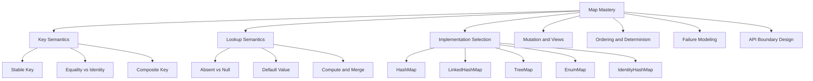
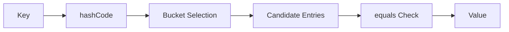

# Part 011 — Map Deep Dive: Key Semantics, Lookup Models, and Failure Modes

> Target: setelah bagian ini, kamu tidak hanya tahu `HashMap`, `TreeMap`, atau `EnumMap`, tetapi mampu menjawab pertanyaan engineering yang lebih penting: **apa arti sebuah key, siapa pemilik key, apakah key stabil, bagaimana lookup gagal, bagaimana order dijamin, bagaimana null diperlakukan, dan bagaimana Map diekspos secara aman sebagai API contract**.

`Map<K, V>` adalah salah satu abstraction paling berpengaruh di Java. Banyak bug production bukan terjadi karena engineer tidak tahu cara memakai `put` dan `get`, tetapi karena engineer salah memodelkan **identity**, **ownership**, **absence**, **ordering**, **mutability**, dan **view coupling**.

Di level top engineer, `Map` tidak dipahami sebagai “dictionary” saja. Ia dipahami sebagai **index**, **association boundary**, **lookup policy**, **deduplication structure**, **join structure**, **routing table**, **cache skeleton**, **configuration overlay**, dan kadang **anti-pattern yang menyembunyikan domain model**.

---

## 1. Posisi Part Ini dalam Framework Kaufman

Mengikuti pendekatan *The First 20 Hours*, kita pecah skill `Map` menjadi sub-skill kecil yang bisa dilatih secara sengaja.



Kaufman-style practice focus:

| Practice Block | Skill | Observable Ability |
|---:|---|---|
| 30 menit | Key semantics | Bisa menjelaskan kenapa object mutable tidak aman sebagai key |
| 45 menit | Implementation selection | Bisa memilih `HashMap`, `LinkedHashMap`, `TreeMap`, `EnumMap`, atau `IdentityHashMap` dengan alasan jelas |
| 45 menit | Lookup policy | Bisa membedakan absent, present-null, default value, dan computed value |
| 45 menit | View semantics | Bisa memprediksi efek mutation via `keySet`, `values`, dan `entrySet` |
| 45 menit | Failure modeling | Bisa menemukan bug Map dari symptoms seperti lost entries, duplicate logical keys, unstable audit output |
| 60 menit | API design | Bisa mendesain Map boundary yang aman untuk caller dan maintainer |

---

## 2. Mental Model Utama: Map adalah Association, Bukan Collection

`Map` **bukan** subtype dari `Collection`.

Kenapa penting?

Karena `Map` bukan sekumpulan value. `Map` adalah sekumpulan **mapping**:

```text
K -> V
```

Yang menjadi pusat desain bukan value, tetapi **relasi antara key dan value**.

Contoh:

```java
Map<CustomerId, CustomerProfile> customersById;
Map<AccountNumber, LedgerAccount> accountsByNumber;
Map<CaseStatus, List<CaseRecord>> casesByStatus;
Map<Permission, Decision> decisionsByPermission;
```

Pertanyaan design yang benar:

1. Apakah key merepresentasikan identity, classification, position, atau computed projection?
2. Apakah key immutable?
3. Apakah dua key yang berbeda secara object bisa dianggap sama secara domain?
4. Apakah lookup yang gagal adalah normal, invalid, atau data-corruption signal?
5. Apakah order dari hasil traversal harus deterministic?
6. Apakah value boleh null?
7. Apakah value boleh dimutasi setelah dimasukkan?
8. Apakah Map ini adalah internal implementation detail atau public contract?

Jika pertanyaan ini tidak dijawab, `Map` menjadi struktur yang terlihat simple tetapi menyimpan ambiguity.

---

## 3. Core Invariants of a Correct Map Usage

Sebelum memilih implementasi, tetapkan invariant.

### 3.1 Key Stability

Key yang sudah masuk Map harus tetap stabil terhadap equality/hash/order yang dipakai Map.

Contoh buruk:

```java
final class CustomerKey {
    private String country;
    private String nationalId;

    // equals/hashCode use both fields
}

Map<CustomerKey, Customer> byIdentity = new HashMap<>();
CustomerKey key = new CustomerKey("ID", "123");
byIdentity.put(key, customer);

key.setNationalId("999"); // fatal semantic mutation

Customer found = byIdentity.get(key); // may fail unexpectedly
```

Masalahnya bukan `HashMap` rusak. Masalahnya invariant dilanggar: key berubah setelah dipakai sebagai basis indexing.

Rule:

> Key untuk `HashMap`, `HashSet`, `TreeMap`, dan `TreeSet` harus efektif immutable terhadap field yang dipakai `equals`, `hashCode`, `compareTo`, atau `Comparator`.

Lebih aman:

```java
public record CustomerIdentity(String country, String nationalId) {}
```

Record cocok untuk composite key karena canonical constructor, `equals`, `hashCode`, dan `toString` sudah mengikuti state komponen record.

---

### 3.2 Key Uniqueness

`Map` tidak menyimpan duplicate key. `put` dengan key yang dianggap sama akan mengganti value lama.

```java
Map<String, Integer> scores = new HashMap<>();
scores.put("alice", 10);
scores.put("alice", 20);

System.out.println(scores.size());      // 1
System.out.println(scores.get("alice")); // 20
```

Untuk production code, pertanyaan pentingnya:

> Apakah overwrite adalah perilaku valid, atau seharusnya dianggap conflict?

Jika duplicate harus ditolak:

```java
static <K, V> void putUnique(Map<K, V> map, K key, V value) {
    V previous = map.putIfAbsent(key, value);
    if (previous != null) {
        throw new IllegalStateException("Duplicate key: " + key);
    }
}
```

Namun kode di atas punya celah jika value boleh null. Versi yang lebih tegas:

```java
static <K, V> void putUniqueNoNulls(Map<K, V> map, K key, V value) {
    Objects.requireNonNull(value, "value");
    V previous = map.putIfAbsent(key, value);
    if (previous != null) {
        throw new IllegalStateException("Duplicate key: " + key);
    }
}
```

Jika value boleh null, gunakan `containsKey`:

```java
static <K, V> void putUniqueAllowingNull(Map<K, V> map, K key, V value) {
    if (map.containsKey(key)) {
        throw new IllegalStateException("Duplicate key: " + key);
    }
    map.put(key, value);
}
```

---

### 3.3 Lookup Absence Is a Domain Decision

`map.get(key)` mengembalikan `null` jika:

1. key tidak ada; atau
2. key ada tetapi value-nya null.

Jika Map memperbolehkan null value, `get` saja tidak cukup untuk membedakan dua kondisi itu.

```java
Map<String, String> map = new HashMap<>();
map.put("known", null);

System.out.println(map.get("known"));   // null
System.out.println(map.get("missing")); // null

System.out.println(map.containsKey("known"));   // true
System.out.println(map.containsKey("missing")); // false
```

Production rule:

> Untuk domain code, prefer Map yang tidak menyimpan null key dan null value. Gunakan absence sebagai absence, bukan sebagai overloaded null semantics.

Lebih eksplisit:

```java
Map<CustomerId, Optional<CustomerProfile>> // biasanya smell
```

Lebih baik:

```java
Map<CustomerId, CustomerProfile> profilesById;
Optional<CustomerProfile> findProfile(CustomerId id) {
    return Optional.ofNullable(profilesById.get(id));
}
```

Tapi jangan menyimpan `Optional` sebagai value kecuali ada alasan API boundary yang sangat jelas. `Optional` biasanya lebih cocok sebagai return type, bukan field/map value.

---

## 4. Map Implementation Selection Matrix

| Implementation | Primary Use | Ordering | Null Policy | Key Equality Model | Production Notes |
|---|---|---|---|---|---|
| `HashMap` | General-purpose lookup | No guaranteed iteration order | Permits null key/value | `equals` + `hashCode` | Default choice for lookup when order does not matter |
| `LinkedHashMap` | Lookup + deterministic insertion/access order | Insertion-order or access-order | Permits null key/value | `equals` + `hashCode` | Excellent for stable output and simple LRU-like cache skeleton |
| `TreeMap` | Sorted key navigation | Sorted by natural order or comparator | Null key depends on comparator; null values generally allowed | `compareTo`/`Comparator` | Use when range query, floor/ceiling, or sorted traversal is required |
| `EnumMap` | Enum-keyed dense lookup | Natural enum declaration order | Null values allowed; null keys not allowed | Enum identity by enum type | Very efficient and expressive for enum-state mappings |
| `IdentityHashMap` | Reference identity lookup | No guaranteed order | Permits null key/value | `==`, not `equals` | Specialized: object graph traversal, canonicalization internals, proxy tracking |
| `WeakHashMap` | Weak-key association | No guaranteed order | Permits null key/value | `equals` + `hashCode`, weak key reachability | Specialized; useful for metadata associated with objects without preventing GC |
| `ConcurrentHashMap` | Concurrent access | No global deterministic iteration order | Does not permit null key/value | `equals` + `hashCode` | Concurrency-focused; not covered deeply here because concurrency was separate series |

Use this rule of thumb:

```text
Need general lookup?               HashMap
Need deterministic iteration?      LinkedHashMap
Need sorted/range navigation?      TreeMap
Key is enum?                       EnumMap
Need reference identity?           IdentityHashMap
Need weak association?             WeakHashMap
Need concurrent mutation?          ConcurrentHashMap
```

---

## 5. HashMap: Default Lookup Workhorse

`HashMap` is usually the default implementation for key-value lookup.

### 5.1 Contract-Level Behavior

Important contract properties:

- no guaranteed iteration order;
- permits one null key;
- permits null values;
- uses `hashCode` and `equals` for key lookup;
- not synchronized;
- structural modification while iterating can trigger fail-fast behavior through iterators.

Minimal example:

```java
Map<String, Integer> counts = new HashMap<>();
counts.put("OPEN", 12);
counts.put("CLOSED", 7);

int open = counts.getOrDefault("OPEN", 0);
int pending = counts.getOrDefault("PENDING", 0);
```

### 5.2 HashMap Lookup Mental Model

At high level:



The important thing is not memorizing internal bucket formulas. The important thing is understanding the correctness dependency:

```text
If two keys are equal, their hashCode must be equal.
```

If this contract is broken, lookup becomes unreliable.

Bad:

```java
final class BadKey {
    private final String id;

    BadKey(String id) {
        this.id = id;
    }

    @Override
    public boolean equals(Object other) {
        return other instanceof BadKey that && Objects.equals(this.id, that.id);
    }

    // hashCode missing: violates contract
}
```

Better:

```java
public record CustomerId(String value) {}
```

### 5.3 Pre-Sizing

If you know approximately how many mappings will be inserted, pre-size intentionally.

```java
int expectedSize = rows.size();
Map<CustomerId, CustomerRow> byId = new HashMap<>(expectedSize * 4 / 3 + 1);
```

Why? Because `HashMap` grows as entries are inserted. Resizing is not semantically wrong, but can become a predictable cost in batch processing.

Do not over-optimize this everywhere. Pre-size when:

- map is large;
- the size is known;
- construction happens in a hot path;
- allocation/resizing shows up in profiling;
- the code is a batch transform/index-building path.

---

## 6. LinkedHashMap: Deterministic Hash-Based Map

`LinkedHashMap` is one of the most underrated production choices.

Use it when you want hash lookup plus deterministic iteration order.

```java
Map<CustomerId, Customer> customersById = new LinkedHashMap<>();
```

### 6.1 Why Determinism Matters

Deterministic iteration matters for:

- audit logs;
- JSON output;
- snapshot comparison;
- tests;
- debugging;
- report generation;
- reproducible validation errors;
- stable domain event payloads.

A common production improvement is changing this:

```java
Map<String, Object> payload = new HashMap<>();
```

to this:

```java
Map<String, Object> payload = new LinkedHashMap<>();
```

when payload order matters for human readability or deterministic comparison.

### 6.2 Insertion Order vs Access Order

`LinkedHashMap` can maintain insertion order or access order.

Access-order is useful for simple LRU-style structures:

```java
final class FixedSizeCache<K, V> extends LinkedHashMap<K, V> {
    private final int maxEntries;

    FixedSizeCache(int maxEntries) {
        super(16, 0.75f, true); // access-order
        this.maxEntries = maxEntries;
    }

    @Override
    protected boolean removeEldestEntry(Map.Entry<K, V> eldest) {
        return size() > maxEntries;
    }
}
```

This is fine for small local structures. For real production caches, prefer a dedicated cache library because cache correctness involves eviction policy, concurrency, memory pressure, metrics, TTL, refresh, and failure handling.

---

## 7. TreeMap: Sorted Lookup and Navigable Access

`TreeMap` is for sorted keys and navigation.

```java
NavigableMap<LocalDate, List<Payment>> paymentsByDate = new TreeMap<>();
```

Useful operations:

```java
paymentsByDate.firstKey();
paymentsByDate.lastKey();
paymentsByDate.floorEntry(date);
paymentsByDate.ceilingEntry(date);
paymentsByDate.subMap(start, true, end, false);
```

### 7.1 TreeMap Identity Is Comparator-Based

This is critical:

`TreeMap` uniqueness is determined by comparison result, not `equals` directly.

If `compare(a, b) == 0`, the map treats them as the same key.

Example:

```java
Comparator<String> caseInsensitive = String.CASE_INSENSITIVE_ORDER;
Map<String, Integer> map = new TreeMap<>(caseInsensitive);

map.put("abc", 1);
map.put("ABC", 2);

System.out.println(map.size()); // 1
```

This may be correct or catastrophic depending on the domain.

### 7.2 Comparator Consistency Checklist

Before using `TreeMap`, ask:

1. Does comparator define the same uniqueness as the domain?
2. Is it consistent with `equals`?
3. Is it stable over time?
4. Does it handle null explicitly if null keys are expected?
5. Does it produce deterministic ordering across JVM runs and environments?

Bad comparator:

```java
Comparator<Order> byMutablePriority = Comparator.comparing(Order::priority);
```

If priority changes after insertion, map behavior becomes semantically broken.

Better key:

```java
record OrderPriorityKey(int priority, UUID orderId) {}
```

---

## 8. EnumMap: The Best Map When Key Is Enum

If key type is enum, consider `EnumMap` first.

```java
public enum CaseStatus {
    DRAFT,
    SUBMITTED,
    UNDER_REVIEW,
    APPROVED,
    REJECTED
}

Map<CaseStatus, Integer> counts = new EnumMap<>(CaseStatus.class);
counts.put(CaseStatus.DRAFT, 10);
counts.put(CaseStatus.APPROVED, 7);
```

Why it is good:

- key universe is finite;
- key type is explicit;
- iteration follows enum declaration order;
- implementation can be compact and efficient;
- domain intent is clear.

### 8.1 EnumMap for State Tables

```java
EnumMap<CaseStatus, Set<CaseStatus>> allowedTransitions = new EnumMap<>(CaseStatus.class);
allowedTransitions.put(CaseStatus.DRAFT, EnumSet.of(CaseStatus.SUBMITTED));
allowedTransitions.put(CaseStatus.SUBMITTED, EnumSet.of(CaseStatus.UNDER_REVIEW));
allowedTransitions.put(CaseStatus.UNDER_REVIEW, EnumSet.of(CaseStatus.APPROVED, CaseStatus.REJECTED));
```

This is often clearer than string-keyed maps:

```java
Map<String, Set<String>> allowedTransitions; // weaker type boundary
```

### 8.2 EnumMap Pitfall

Do not use enum ordinal manually:

```java
int[] countsByStatusOrdinal = new int[CaseStatus.values().length];
countsByStatusOrdinal[status.ordinal()]++;
```

This can be valid in performance-critical internals, but it leaks fragile positional meaning. Prefer `EnumMap` unless profiling proves array-indexing is needed.

---

## 9. IdentityHashMap: Reference Identity, Not Logical Equality

`IdentityHashMap` uses `==` instead of `equals` for key comparison.

```java
Map<Object, String> names = new IdentityHashMap<>();
String a = new String("x");
String b = new String("x");

names.put(a, "first");
names.put(b, "second");

System.out.println(names.size()); // 2
```

For normal domain modeling, this is usually wrong.

Legitimate cases:

- object graph traversal where object identity matters;
- cycle detection by object reference;
- serialization internals;
- proxy tracking;
- canonicalization infrastructure;
- framework internals.

Example: identity-based visited set pattern:

```java
Set<Object> visited = Collections.newSetFromMap(new IdentityHashMap<>());
```

Use this only when reference identity is the intended semantic.

---

## 10. Map Views: keySet, values, entrySet

A `Map` exposes three collection views:

```java
Set<K> keys = map.keySet();
Collection<V> values = map.values();
Set<Map.Entry<K, V>> entries = map.entrySet();
```

These are usually **backed views**, not independent copies.

### 10.1 keySet View

```java
Map<String, Integer> map = new LinkedHashMap<>();
map.put("a", 1);
map.put("b", 2);

Set<String> keys = map.keySet();
keys.remove("a");

System.out.println(map); // {b=2}
```

Removing from `keySet` removes from the backing map.

This can be useful:

```java
map.keySet().removeIf(key -> key.startsWith("temp:"));
```

But it must be intentional.

### 10.2 values View

```java
Collection<Integer> values = map.values();
values.remove(2); // removes one mapping whose value is 2
```

`values` is weaker because values are not unique. Removing by value can be ambiguous.

Avoid using `values().remove(...)` in domain code unless ambiguity is acceptable.

### 10.3 entrySet View

`entrySet` is the most powerful view.

```java
for (Map.Entry<String, Integer> entry : map.entrySet()) {
    System.out.println(entry.getKey() + "=" + entry.getValue());
}
```

It avoids repeated lookup:

Bad:

```java
for (String key : map.keySet()) {
    Integer value = map.get(key);
    process(key, value);
}
```

Better:

```java
for (Map.Entry<String, Integer> entry : map.entrySet()) {
    process(entry.getKey(), entry.getValue());
}
```

### 10.4 Entry Mutation

Some entry views allow `setValue`:

```java
for (Map.Entry<String, Integer> entry : map.entrySet()) {
    entry.setValue(entry.getValue() + 1);
}
```

This mutates values without changing keys or map size. Whether this is clear depends on context.

Prefer explicit transformations for business logic:

```java
map.replaceAll((key, value) -> value + 1);
```

---

## 11. Absent, Null, Default, and Computed Values

This is where many subtle bugs live.

### 11.1 get

```java
V value = map.get(key);
```

Simple, but ambiguous if null values are allowed.

### 11.2 getOrDefault

```java
int count = counts.getOrDefault(status, 0);
```

Good for read-only defaulting.

Be careful: it does not insert the default.

```java
counts.getOrDefault("missing", 0);
System.out.println(counts.containsKey("missing")); // false
```

### 11.3 putIfAbsent

```java
map.putIfAbsent(key, value);
```

Good for “first writer wins” semantics.

But if null values are allowed, read the JDK contract carefully. In many maps, `putIfAbsent` treats absent or mapped-to-null as absent-like.

Production rule:

> Avoid null values when using modern Map default methods. They make absence semantics harder to reason about.

### 11.4 computeIfAbsent

Useful for lazy construction:

```java
Map<CustomerId, List<Order>> ordersByCustomer = new HashMap<>();

ordersByCustomer
    .computeIfAbsent(customerId, ignored -> new ArrayList<>())
    .add(order);
```

This is common and expressive.

But avoid side effects inside mapping function:

```java
map.computeIfAbsent(key, k -> {
    audit.log("creating value"); // maybe okay, but now lookup has hidden effect
    return load(k);              // maybe expensive, maybe throws
});
```

Be careful if the mapping function calls back into the same map or mutates related state. Keep it small and local.

### 11.5 compute

`compute` recalculates a value based on old value:

```java
counts.compute(status, (key, old) -> old == null ? 1 : old + 1);
```

Good when old value matters.

### 11.6 merge

`merge` is often the cleanest for counters and aggregation:

```java
counts.merge(status, 1, Integer::sum);
```

For list aggregation, be careful:

```java
map.merge(key,
          new ArrayList<>(List.of(value)),
          (left, right) -> {
              left.addAll(right);
              return left;
          });
```

This works but can be less readable than `computeIfAbsent` for multi-value maps.

Prefer:

```java
map.computeIfAbsent(key, ignored -> new ArrayList<>()).add(value);
```

---

## 12. Building Indexes Safely

A common production pattern is turning a collection into a map.

### 12.1 Unique Index

```java
static Map<CustomerId, Customer> indexCustomers(List<Customer> customers) {
    Map<CustomerId, Customer> result = new LinkedHashMap<>();

    for (Customer customer : customers) {
        Customer previous = result.putIfAbsent(customer.id(), customer);
        if (previous != null) {
            throw new IllegalStateException("Duplicate customer id: " + customer.id());
        }
    }

    return Map.copyOf(result);
}
```

Why `LinkedHashMap` internally?

- deterministic duplicate detection order;
- easier debugging;
- stable error reproduction.

Why `Map.copyOf` at boundary?

- caller cannot mutate returned map;
- ownership is clear;
- invariant is preserved after construction.

### 12.2 Last-Write-Wins Index

```java
static Map<CustomerId, Customer> indexLastWriteWins(List<Customer> customers) {
    Map<CustomerId, Customer> result = new LinkedHashMap<>();
    for (Customer customer : customers) {
        result.put(customer.id(), customer);
    }
    return Map.copyOf(result);
}
```

Only use this if overwrite is explicitly valid.

Document it:

```java
/**
 * Builds an index by customer id. If duplicate ids exist, the later record wins.
 */
```

### 12.3 Multi-Value Index

```java
static Map<CustomerId, List<Order>> groupOrdersByCustomer(List<Order> orders) {
    Map<CustomerId, List<Order>> result = new LinkedHashMap<>();

    for (Order order : orders) {
        result.computeIfAbsent(order.customerId(), ignored -> new ArrayList<>())
              .add(order);
    }

    result.replaceAll((id, list) -> List.copyOf(list));
    return Map.copyOf(result);
}
```

This protects both layers:

- outer map unmodifiable;
- inner lists unmodifiable.

Without inner copy, caller could still mutate the lists.

---

## 13. Nested Maps: Useful but Dangerous

Nested maps are common:

```java
Map<Region, Map<ProductType, BigDecimal>> priceByRegionAndType;
```

They are useful for sparse two-dimensional lookup, but they can degrade readability.

### 13.1 When Nested Map Is Acceptable

Use nested map when:

- dimensions are truly independent;
- lookup by first dimension then second dimension is natural;
- sparse data matters;
- there are no additional rules attached to the pair;
- code remains local and understandable.

### 13.2 When Composite Key Is Better

```java
record PriceKey(Region region, ProductType productType) {}

Map<PriceKey, BigDecimal> priceByKey;
```

Composite key is often better when:

- the pair itself has domain meaning;
- lookup is always by both fields;
- you need easier diffing;
- you need easier serialization;
- you want one uniqueness boundary.

### 13.3 When Domain Object Is Better

If the map starts accumulating behavior:

```java
Map<Region, Map<ProductType, PriceRule>> rules;
```

and code is full of helpers like:

```java
findPrice(region, type)
validateRegionType(region, type)
mergeRegionRules(region, rules)
```

then introduce a domain abstraction:

```java
final class PriceBook {
    private final Map<PriceKey, PriceRule> rulesByKey;

    Optional<PriceRule> findRule(Region region, ProductType type) {
        return Optional.ofNullable(rulesByKey.get(new PriceKey(region, type)));
    }
}
```

A map is storage. A domain object is meaning.

---

## 14. Map as Configuration Overlay

Maps often model layered configuration.

```java
Map<String, String> defaults;
Map<String, String> environment;
Map<String, String> userOverrides;
```

Merge order must be explicit:

```java
static Map<String, String> overlay(
        Map<String, String> defaults,
        Map<String, String> environment,
        Map<String, String> userOverrides
) {
    Map<String, String> result = new LinkedHashMap<>();
    result.putAll(defaults);
    result.putAll(environment);
    result.putAll(userOverrides);
    return Map.copyOf(result);
}
```

This is readable because overwrite order is visible.

Avoid clever streams here if clarity matters more:

```java
Stream.of(defaults, environment, userOverrides)
      .flatMap(m -> m.entrySet().stream())
      .collect(toMap(...)); // usually less explicit for overlay semantics
```

---

## 15. Map as Domain Boundary: Return Type and Input Type

### 15.1 Returning a Map

Bad:

```java
Map<CustomerId, Customer> customersById() {
    return internalMap; // leaks ownership
}
```

Better:

```java
Map<CustomerId, Customer> customersById() {
    return Map.copyOf(internalMap);
}
```

If values are mutable, also consider value copying or immutable value objects.

### 15.2 Accepting a Map

Bad:

```java
public PriceBook(Map<PriceKey, PriceRule> rulesByKey) {
    this.rulesByKey = rulesByKey;
}
```

Better:

```java
public PriceBook(Map<PriceKey, PriceRule> rulesByKey) {
    this.rulesByKey = Map.copyOf(rulesByKey);
}
```

Then validate:

```java
public PriceBook(Map<PriceKey, PriceRule> rulesByKey) {
    Objects.requireNonNull(rulesByKey, "rulesByKey");
    rulesByKey.forEach((key, value) -> {
        Objects.requireNonNull(key, "rule key");
        Objects.requireNonNull(value, "rule value");
    });
    this.rulesByKey = Map.copyOf(rulesByKey);
}
```

---

## 16. Null Policy

Map null policy should not be accidental.

| Policy | Recommendation |
|---|---|
| Null key allowed | Avoid in domain maps; it weakens key semantics |
| Null value allowed | Avoid; creates absent/present-null ambiguity |
| Missing key valid | Return `Optional`, default, or domain-specific result |
| Missing key invalid | Throw clear exception with key context |
| Key generated from external input | Normalize and validate before insertion |

Example strict lookup:

```java
static <K, V> V requireMappedValue(Map<K, V> map, K key) {
    V value = map.get(key);
    if (value == null && !map.containsKey(key)) {
        throw new NoSuchElementException("No mapping for key: " + key);
    }
    return value;
}
```

If your map forbids null values, this is simpler:

```java
static <K, V> V requireNonNullMappedValue(Map<K, V> map, K key) {
    V value = map.get(key);
    if (value == null) {
        throw new NoSuchElementException("No mapping for key: " + key);
    }
    return value;
}
```

---

## 17. Stream Collectors and Map Semantics

We will cover collectors later, but `Map` mistakes often appear in `Collectors.toMap`.

Bad if duplicates are possible:

```java
Map<CustomerId, Customer> byId = customers.stream()
    .collect(Collectors.toMap(Customer::id, Function.identity()));
```

This throws on duplicate keys, which may be good, but the error may lack domain context.

More explicit:

```java
Map<CustomerId, Customer> byId = customers.stream()
    .collect(Collectors.toMap(
        Customer::id,
        Function.identity(),
        (left, right) -> {
            throw new IllegalStateException("Duplicate customer id: " + left.id());
        },
        LinkedHashMap::new
    ));
```

But for complex duplicate diagnostics, a loop is often clearer.

Top engineer rule:

> Do not force stream collectors when loop-based indexing expresses conflict policy more clearly.

---

## 18. Common Map Failure Modes

### 18.1 Mutable Key Lost Entry

Symptom:

- `containsKey(key)` unexpectedly false;
- map size still includes entry;
- iteration shows key exists;
- lookup by same object fails after mutation.

Cause:

- key mutated after insertion.

Fix:

- immutable key;
- record key;
- defensive copy;
- remove and reinsert after key-changing operation.

---

### 18.2 HashMap Used Where Deterministic Output Was Required

Symptom:

- flaky snapshot tests;
- nondeterministic JSON field order;
- unstable audit output;
- difficult diffs.

Cause:

- relying on unspecified iteration order.

Fix:

- `LinkedHashMap` for insertion order;
- `TreeMap` for sorted order;
- explicit sorting at output boundary.

---

### 18.3 TreeMap Comparator Collapses Distinct Keys

Symptom:

- map size smaller than expected;
- later entries overwrite earlier ones;
- duplicates disappear.

Cause:

- comparator returns `0` for domain-distinct objects.

Fix:

- comparator includes tie-breaker;
- key type represents actual uniqueness;
- use `HashMap` if sorting is display concern only.

Example fix:

```java
Comparator<Customer> byCountryAndId = Comparator
    .comparing(Customer::country)
    .thenComparing(Customer::nationalId);
```

---

### 18.4 Nested Map Null Maze

Symptom:

```java
map.get(a).get(b).get(c)
```

throws `NullPointerException` somewhere.

Cause:

- missing outer key;
- missing inner map;
- missing inner value;
- absent and null mixed.

Fix:

- composite key;
- domain abstraction;
- explicit lookup method.

```java
Optional<Decision> findDecision(Role role, Action action) {
    Map<Action, Decision> byAction = decisions.get(role);
    if (byAction == null) {
        return Optional.empty();
    }
    return Optional.ofNullable(byAction.get(action));
}
```

Better:

```java
record PermissionKey(Role role, Action action) {}
Map<PermissionKey, Decision> decisionsByPermission;
```

---

### 18.5 Accidental Memory Retention

Symptom:

- memory grows unexpectedly;
- old keys/values retained;
- cache-like map never shrinks.

Cause:

- using normal `HashMap` as unbounded cache;
- keeping references through map values;
- exposing views that keep backing map alive;
- long-lived map in singleton service.

Fix:

- bound size;
- use cache library;
- explicitly clear;
- prefer short-lived indexes;
- inspect retention graph in profiler.

---

## 19. API Design Decision Table

| Situation | Prefer |
|---|---|
| Caller only needs lookup by key | Return `Map<K, V>` unmodifiable |
| Caller needs iteration in input order | `LinkedHashMap` internally, document encounter order |
| Caller needs sorted navigation | Return `NavigableMap<K, V>` if navigation is part of contract |
| Caller should not know map shape | Return domain object with lookup methods |
| Duplicate keys are invalid | Build via explicit loop with conflict exception |
| Missing key is expected | Return `Optional<V>` from lookup method |
| Missing key indicates bug | Throw domain-specific exception |
| Key is enum | Use `EnumMap` |
| Key is composite | Use record key |
| Value list per key | `Map<K, List<V>>` with copied inner lists |
| Map is internal mutable index | Keep private, expose snapshots |

---

## 20. Code Review Checklist for Map Usage

Ask these during review:

1. Is the key immutable relative to equality/hash/order?
2. Is duplicate key behavior explicit?
3. Does the implementation match required order semantics?
4. Are null keys and null values intentionally allowed?
5. Is absent vs present-null distinguishable if needed?
6. Are `computeIfAbsent`, `merge`, or `compute` used with clear side-effect boundaries?
7. Are map views used intentionally?
8. Is internal mutable map leaked through API?
9. Are nested maps still readable?
10. Would a record key or domain object clarify the model?
11. Is deterministic output required for logs/tests/events?
12. Is the map bounded if it is long-lived?
13. Are values themselves mutable?
14. Does `TreeMap` comparator define correct uniqueness?
15. Is `IdentityHashMap` truly intended?

---

## 21. Practice: Refactor a Fragile Map Index

### Starting Code

```java
final class CaseRecord {
    private String country;
    private String caseNumber;
    private String status;

    // getters omitted
}

Map<String, CaseRecord> buildIndex(List<CaseRecord> records) {
    Map<String, CaseRecord> result = new HashMap<>();
    for (CaseRecord record : records) {
        result.put(record.getCountry() + "-" + record.getCaseNumber(), record);
    }
    return result;
}
```

Problems:

- string-concatenated key can collide ambiguously;
- delimiter assumptions leak into identity;
- duplicate behavior is silent overwrite;
- returned map is mutable;
- `HashMap` output order is unspecified;
- `CaseRecord` may be mutable;
- status string likely deserves enum in stronger domain model.

### Refactored Version

```java
record CaseKey(String country, String caseNumber) {
    CaseKey {
        Objects.requireNonNull(country, "country");
        Objects.requireNonNull(caseNumber, "caseNumber");
        if (country.isBlank()) {
            throw new IllegalArgumentException("country must not be blank");
        }
        if (caseNumber.isBlank()) {
            throw new IllegalArgumentException("caseNumber must not be blank");
        }
    }
}

static Map<CaseKey, CaseRecord> buildIndex(List<CaseRecord> records) {
    Objects.requireNonNull(records, "records");

    Map<CaseKey, CaseRecord> result = new LinkedHashMap<>();

    for (CaseRecord record : records) {
        CaseKey key = new CaseKey(record.getCountry(), record.getCaseNumber());
        CaseRecord previous = result.putIfAbsent(key, record);
        if (previous != null) {
            throw new IllegalStateException("Duplicate case key: " + key);
        }
    }

    return Map.copyOf(result);
}
```

Why better:

- identity is explicit;
- duplicate policy is explicit;
- deterministic construction order;
- unmodifiable boundary;
- validation is near identity construction;
- future changes can be localized to `CaseKey`.

---

## 22. Mini Exercises

### Exercise 1 — Choose Implementation

Choose a Map implementation and explain why:

1. Routing request type enum to handler.
2. Building customer index from CSV rows with stable output.
3. Storing exchange rates sorted by effective date.
4. Tracking visited object references during graph serialization.
5. Counting events by status.
6. Holding 50,000 temporary records by ID during batch import.
7. Generating deterministic API error response field order.

Expected direction:

1. `EnumMap<RequestType, Handler>`
2. `LinkedHashMap<CustomerId, Customer>`
3. `TreeMap<LocalDate, ExchangeRate>`
4. `IdentityHashMap`-backed set
5. `EnumMap<Status, Integer>` or `HashMap<Status, Integer>` depending on enum
6. pre-sized `HashMap` or `LinkedHashMap` if order matters
7. `LinkedHashMap`

### Exercise 2 — Fix Duplicate Policy

Given:

```java
Map<String, User> byEmail = users.stream()
    .collect(Collectors.toMap(User::email, Function.identity()));
```

Add explicit duplicate handling and deterministic output.

### Exercise 3 — Remove Nested Map Ambiguity

Refactor:

```java
Map<String, Map<String, Map<String, Decision>>> decisions;
```

into either:

- record composite key; or
- domain object with explicit lookup method.

Explain your choice.

---

## 23. Summary

`Map` mastery is mostly not about memorizing methods. It is about preserving the mapping invariant:

```text
stable key + explicit uniqueness + clear absence semantics + correct implementation + safe ownership boundary
```

Use:

- `HashMap` for general lookup;
- `LinkedHashMap` for deterministic lookup;
- `TreeMap` for sorted/range lookup;
- `EnumMap` for enum-keyed tables;
- `IdentityHashMap` only for reference identity;
- defensive copies at API boundaries;
- explicit duplicate policies;
- immutable composite keys.

A production-grade `Map` is not just a data structure. It is a **contract about identity and lookup**.
