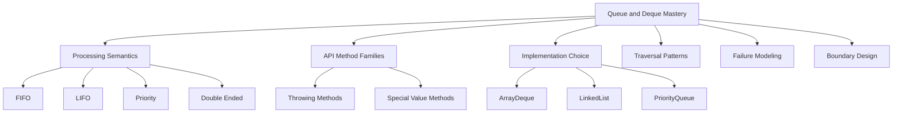

# Part 012 — Queue and Deque: Worklists, Buffers, and Traversal Semantics

> Target: setelah bagian ini, kamu mampu memakai `Queue` dan `Deque` bukan sebagai “list alternatif”, tetapi sebagai model eksplisit untuk **pending work**, **frontier traversal**, **buffer**, **stack**, **scheduler-like ordering**, dan **processing semantics**.

`Queue` dan `Deque` sering terlihat sederhana. Masukkan elemen, ambil elemen. Namun di production, struktur ini sering menjadi boundary antara:

- discovered vs processed;
- pending vs completed;
- next vs later;
- first-in-first-out vs last-in-first-out;
- stable ordering vs priority ordering;
- bounded vs unbounded growth;
- normal absence vs exceptional absence.

Bagian ini tidak mengulang teori DSA dasar. Fokus kita adalah contract, implementation choice, failure mode, dan API design.

---

## 1. Posisi Part Ini dalam Framework Kaufman



Kaufman-style skill decomposition:

| Practice Block | Skill | Observable Ability |
|---:|---|---|
| 30 menit | Queue contract | Bisa memilih `offer/poll/peek` vs `add/remove/element` |
| 30 menit | Deque contract | Bisa memakai `Deque` sebagai queue atau stack dengan method yang jelas |
| 45 menit | Implementation choice | Bisa menjelaskan kenapa `ArrayDeque` sering lebih tepat daripada `LinkedList` |
| 45 menit | Worklist design | Bisa menulis processing loop tanpa off-by-one atau infinite growth bug |
| 45 menit | Priority semantics | Bisa memakai `PriorityQueue` tanpa salah menganggap iteration sorted |
| 45 menit | Failure modeling | Bisa menemukan queue growth, null sentinel, order ambiguity, dan starvation bug |

---

## 2. Queue Mental Model: Holding Elements Prior to Processing

A `Queue<E>` models elements waiting to be processed.

```text
producer/discovery side -> [ pending elements ] -> consumer/processing side
```

Core semantic:

```text
Queue is about processing order, not random access.
```

Example:

```java
Queue<CaseTask> pending = new ArrayDeque<>();
pending.offer(new CaseTask("validate"));
pending.offer(new CaseTask("enrich"));

while (!pending.isEmpty()) {
    CaseTask task = pending.poll();
    process(task);
}
```

This says more than a `List`:

```java
List<CaseTask> pending = new ArrayList<>();
```

A list tells you elements are ordered. A queue tells you elements are **waiting for processing**.

---

## 3. Queue Method Families: Throwing vs Special Value

The `Queue` API has method pairs for insertion, removal, and inspection.

| Operation | Throws on Failure | Special Value on Failure |
|---|---|---|
| Insert | `add(e)` | `offer(e)` |
| Remove | `remove()` | `poll()` |
| Inspect | `element()` | `peek()` |

### 3.1 add vs offer

```java
queue.add(item);   // throws if insertion fails
queue.offer(item); // returns false if insertion fails
```

For most unbounded queues like `ArrayDeque`, both usually succeed unless invalid input or resource exhaustion occurs.

For bounded queues, `offer` is often clearer because failure can be normal.

```java
if (!queue.offer(task)) {
    reject(task);
}
```

### 3.2 remove vs poll

```java
E item = queue.remove(); // throws if empty
E item = queue.poll();   // returns null if empty
```

Use `remove` when empty queue indicates a bug.

Use `poll` when empty queue is normal.

Processing loop:

```java
for (Task task; (task = queue.poll()) != null; ) {
    process(task);
}
```

But only use this form when the queue does not allow null elements. Most queue implementations do not allow null because null is used as special absence value.

### 3.3 element vs peek

```java
E next = queue.element(); // throws if empty
E next = queue.peek();    // null if empty
```

Use `peek` to inspect optional next work.

Use `element` to assert non-empty state.

---

## 4. Deque Mental Model: Two-Ended Queue

`Deque<E>` means double-ended queue.

It supports insertion and removal at both ends.

```text
front/head <-> [ a, b, c, d ] <-> back/tail
```

A `Deque` can model:

- FIFO queue;
- LIFO stack;
- double-ended worklist;
- sliding window;
- undo buffer;
- local traversal frontier;
- simple bounded buffer if manually controlled.

### 4.1 Deque as Queue

```java
Deque<Task> queue = new ArrayDeque<>();
queue.offerLast(task); // enqueue at tail
Task next = queue.pollFirst(); // dequeue from head
```

This is explicit FIFO.

### 4.2 Deque as Stack

Prefer `Deque` over legacy `Stack`.

```java
Deque<Node> stack = new ArrayDeque<>();
stack.push(root);

while (!stack.isEmpty()) {
    Node node = stack.pop();
    visit(node);
}
```

Equivalent explicit-end version:

```java
stack.addFirst(root);
Node node = stack.removeFirst();
```

`push/pop/peek` are readable for stack semantics. `addFirst/removeFirst/peekFirst` are readable when you want explicit end semantics.

---

## 5. Deque Method Matrix

| Semantic | Head Method | Tail Method |
|---|---|---|
| Insert throwing | `addFirst(e)` | `addLast(e)` |
| Insert special | `offerFirst(e)` | `offerLast(e)` |
| Remove throwing | `removeFirst()` | `removeLast()` |
| Remove special | `pollFirst()` | `pollLast()` |
| Inspect throwing | `getFirst()` | `getLast()` |
| Inspect special | `peekFirst()` | `peekLast()` |

Stack aliases:

| Stack Operation | Deque Method |
|---|---|
| Push | `push(e)` |
| Pop | `pop()` |
| Peek | `peek()` |

Queue aliases:

| Queue Operation | Deque Method Usually Used |
|---|---|
| Enqueue | `offerLast(e)` |
| Dequeue | `pollFirst()` |
| Peek next | `peekFirst()` |

Production recommendation:

> Prefer explicit `First`/`Last` methods in complex code. Use `push/pop` only when the variable is clearly a stack.

---

## 6. ArrayDeque: Usually the Best General-Purpose Deque

`ArrayDeque` is usually the best default implementation for non-concurrent queue/deque/stack use.

```java
Deque<Task> tasks = new ArrayDeque<>();
```

Why it is often preferred:

- no per-node allocation like linked structures;
- good locality;
- efficient insertion/removal at both ends;
- simple mental model;
- works well as stack replacement;
- does not allow null, which keeps `poll` absence unambiguous.

### 6.1 ArrayDeque as FIFO Queue

```java
Deque<Task> pending = new ArrayDeque<>();

pending.offerLast(new Task("A"));
pending.offerLast(new Task("B"));

System.out.println(pending.pollFirst()); // A
System.out.println(pending.pollFirst()); // B
```

### 6.2 ArrayDeque as LIFO Stack

```java
Deque<Task> stack = new ArrayDeque<>();

stack.push(new Task("A"));
stack.push(new Task("B"));

System.out.println(stack.pop()); // B
System.out.println(stack.pop()); // A
```

### 6.3 Avoid Null Sentinels

Bad:

```java
queue.offer(null); // ArrayDeque rejects null
```

Use explicit sentinel object if needed:

```java
sealed interface WorkItem permits RealWork, StopSignal {}
record RealWork(Task task) implements WorkItem {}
record StopSignal() implements WorkItem {}
```

Or use separate lifecycle state.

---

## 7. LinkedList as Queue/Deque: Usually Not the Default

`LinkedList` implements `List` and `Deque`, but that does not mean it should be the default.

```java
Deque<Task> tasks = new LinkedList<>();
```

It can work, but consider the trade-offs:

- each element is stored in a node object;
- more pointer chasing;
- worse locality;
- more allocation pressure;
- supports null elements, which can confuse `poll`/`peek` semantics;
- also exposes list operations if referenced as `LinkedList`.

Prefer:

```java
Deque<Task> tasks = new ArrayDeque<>();
```

Use `LinkedList` only with a specific reason, not because “insert/remove is O(1)” in textbook terms. Constant factors, allocation, locality, and API semantics matter.

---

## 8. PriorityQueue: Priority-Ordered Retrieval, Not Sorted Iteration

`PriorityQueue<E>` retrieves elements according to priority.

```java
PriorityQueue<Job> jobs = new PriorityQueue<>(Comparator.comparing(Job::priority));

jobs.offer(new Job("low", 10));
jobs.offer(new Job("high", 1));

System.out.println(jobs.poll()); // high
```

Critical point:

> `PriorityQueue.poll()` returns the least/highest-priority element according to comparator semantics, but iteration over the queue is not a sorted traversal guarantee.

If you need sorted output:

```java
List<Job> sorted = new ArrayList<>(jobs);
sorted.sort(Comparator.comparing(Job::priority));
```

Or drain it:

```java
while (!jobs.isEmpty()) {
    process(jobs.poll());
}
```

Draining destroys the queue, so only do that when ownership is clear.

### 8.1 Comparator Defines Priority Identity

Unlike `TreeSet`, `PriorityQueue` permits elements that compare equal. It is not a uniqueness structure.

If you need uniqueness plus priority, combine structures carefully:

```java
Set<JobId> seen = new HashSet<>();
PriorityQueue<Job> queue = new PriorityQueue<>(Comparator.comparing(Job::priority));

if (seen.add(job.id())) {
    queue.offer(job);
}
```

### 8.2 Mutable Priority Hazard

Bad:

```java
job.setPriority(0); // after job already inside PriorityQueue
```

The queue does not automatically reorder itself because an element's priority-relevant field changed.

Fix options:

- make queued elements immutable;
- remove and reinsert after priority change;
- use a dedicated scheduler/heap abstraction;
- model updated priority as a new queue entry and skip stale entries when polled.

Stale-entry pattern:

```java
record ScheduledJob(JobId id, int version, int priority) {}

PriorityQueue<ScheduledJob> queue = new PriorityQueue<>(Comparator.comparingInt(ScheduledJob::priority));
Map<JobId, Integer> latestVersion = new HashMap<>();

void schedule(JobId id, int priority) {
    int version = latestVersion.merge(id, 1, Integer::sum);
    queue.offer(new ScheduledJob(id, version, priority));
}

ScheduledJob pollLatest() {
    while (!queue.isEmpty()) {
        ScheduledJob job = queue.poll();
        if (latestVersion.getOrDefault(job.id(), -1) == job.version()) {
            return job;
        }
    }
    return null;
}
```

This pattern is useful when decrease-key/update-priority is not directly supported by the abstraction.

---

## 9. Worklist Pattern

A worklist is a queue/deque of pending items.

```java
Deque<CaseId> worklist = new ArrayDeque<>();
Set<CaseId> scheduled = new HashSet<>();

void schedule(CaseId id) {
    if (scheduled.add(id)) {
        worklist.offerLast(id);
    }
}

while (!worklist.isEmpty()) {
    CaseId id = worklist.pollFirst();
    process(id);
}
```

Why include `scheduled`?

Because queue alone does not prevent duplicates.

```text
Queue controls processing order.
Set controls uniqueness.
```

This separation is important.

### 9.1 Worklist with Expansion

```java
Deque<Node> pending = new ArrayDeque<>();
Set<NodeId> seen = new HashSet<>();

pending.offerLast(root);
seen.add(root.id());

while (!pending.isEmpty()) {
    Node current = pending.pollFirst();
    visit(current);

    for (Node next : current.children()) {
        if (seen.add(next.id())) {
            pending.offerLast(next);
        }
    }
}
```

This is not about graph theory here. The production lesson is:

- queue stores pending work;
- set prevents repeated scheduling;
- processing loop owns lifecycle;
- expansion is explicit.

---

## 10. FIFO vs LIFO vs Priority: Semantic Choice

| Need | Structure | Typical Implementation |
|---|---|---|
| Process oldest discovered first | FIFO queue | `ArrayDeque` with `offerLast`/`pollFirst` |
| Process newest discovered first | Stack/LIFO | `ArrayDeque` with `push`/`pop` |
| Process most important first | Priority queue | `PriorityQueue` |
| Add/remove both ends | Deque | `ArrayDeque` |
| Maintain unique pending items | Queue + Set | `ArrayDeque` + `HashSet`/`LinkedHashSet` |
| Stable priority + uniqueness | PriorityQueue + Map/Set | careful composite design |
| Blocking producer/consumer | BlockingQueue | outside this part; concurrency series topic |

---

## 11. Queue Boundary Design

### 11.1 Do Not Expose Mutable Queue Internals

Bad:

```java
class Processor {
    private final Queue<Task> pending = new ArrayDeque<>();

    Queue<Task> pending() {
        return pending;
    }
}
```

This lets caller mutate processor state.

Better:

```java
class Processor {
    private final Deque<Task> pending = new ArrayDeque<>();

    void submit(Task task) {
        pending.offerLast(Objects.requireNonNull(task));
    }

    Optional<Task> pollNext() {
        return Optional.ofNullable(pending.pollFirst());
    }

    int pendingCount() {
        return pending.size();
    }
}
```

Expose behavior, not storage.

### 11.2 Use Queue Interface for Queue Semantics

If a method only needs FIFO behavior:

```java
void processAll(Queue<Task> tasks) {
    for (Task task; (task = tasks.poll()) != null; ) {
        process(task);
    }
}
```

But this mutates the queue. Method name must make ownership clear.

Better if caller retains ownership:

```java
void processSnapshot(Collection<Task> tasks) {
    for (Task task : tasks) {
        process(task);
    }
}
```

A queue-consuming method should be explicit:

```java
void drainToProcessor(Queue<Task> tasks) {
    Task task;
    while ((task = tasks.poll()) != null) {
        process(task);
    }
}
```

---

## 12. Boundedness and Growth

`ArrayDeque` and `PriorityQueue` are not bounded queues by default.

This matters for production.

Bad:

```java
while (true) {
    queue.offer(loadMoreWork());
}
```

A queue can hide backpressure problems. If producers add faster than consumers process, memory grows.

For local algorithms, boundedness may be naturally controlled by input size.

For service-level queues, you need explicit policy:

- maximum size;
- rejection;
- batching;
- backpressure;
- persistence;
- retry policy;
- monitoring.

Simple bounded wrapper:

```java
final class BoundedTaskQueue {
    private final int capacity;
    private final Deque<Task> queue = new ArrayDeque<>();

    BoundedTaskQueue(int capacity) {
        if (capacity <= 0) {
            throw new IllegalArgumentException("capacity must be positive");
        }
        this.capacity = capacity;
    }

    boolean offer(Task task) {
        Objects.requireNonNull(task, "task");
        if (queue.size() >= capacity) {
            return false;
        }
        return queue.offerLast(task);
    }

    Optional<Task> poll() {
        return Optional.ofNullable(queue.pollFirst());
    }
}
```

This is not a concurrent queue. It is a local invariant wrapper.

---

## 13. Sliding Window with Deque

A deque is a natural fit for sliding windows.

Example: keep last `N` events.

```java
final class LastNEvents<E> {
    private final int limit;
    private final Deque<E> events = new ArrayDeque<>();

    LastNEvents(int limit) {
        if (limit <= 0) {
            throw new IllegalArgumentException("limit must be positive");
        }
        this.limit = limit;
    }

    void add(E event) {
        Objects.requireNonNull(event, "event");
        events.offerLast(event);
        while (events.size() > limit) {
            events.pollFirst();
        }
    }

    List<E> snapshot() {
        return List.copyOf(events);
    }
}
```

Why `Deque` fits:

- add newest at tail;
- remove oldest at head;
- maintain bounded recent history.

---

## 14. Undo/Redo Buffer with Deque

```java
final class UndoHistory<T> {
    private final Deque<T> undo = new ArrayDeque<>();
    private final Deque<T> redo = new ArrayDeque<>();

    void record(T state) {
        undo.push(Objects.requireNonNull(state));
        redo.clear();
    }

    Optional<T> undo() {
        T previous = undo.poll();
        if (previous == null) {
            return Optional.empty();
        }
        redo.push(previous);
        return Optional.of(previous);
    }

    Optional<T> redo() {
        T next = redo.poll();
        if (next == null) {
            return Optional.empty();
        }
        undo.push(next);
        return Optional.of(next);
    }
}
```

This example is simplified. Real undo/redo usually stores commands or immutable snapshots with careful semantics. The point here is that `Deque` expresses stack-like history well.

---

## 15. Traversal Order and Iterator Semantics

Queue retrieval order and iteration order are related but not always identical in the way developers assume.

For `ArrayDeque`, iteration goes from first/head to last/tail.

For `PriorityQueue`, iteration is not sorted priority order.

Rule:

> If ordering matters operationally, use the removal operation (`poll`) that defines the structure's semantics, not casual iteration.

Bad:

```java
for (Job job : priorityQueue) {
    process(job); // not guaranteed sorted by priority
}
```

Better:

```java
while (!priorityQueue.isEmpty()) {
    process(priorityQueue.poll());
}
```

Or copy and sort if queue must remain:

```java
List<Job> jobs = new ArrayList<>(priorityQueue);
jobs.sort(jobComparator);
jobs.forEach(this::process);
```

---

## 16. Failure Modes

### 16.1 Using LinkedList by Habit

Symptom:

- high allocation;
- poor locality;
- slow traversal;
- unnecessary null allowance;
- unclear whether list or queue semantics are intended.

Fix:

- use `ArrayDeque` for queue/deque/stack;
- use `ArrayList` for random-access list;
- use `LinkedList` only with a specific justified need.

---

### 16.2 Poll Null Ambiguity

Symptom:

```java
Task task = queue.poll();
if (task == null) {
    // empty? or actual null task?
}
```

Fix:

- use implementations that disallow null;
- reject null at boundary;
- avoid null sentinel.

```java
void submit(Task task) {
    queue.offerLast(Objects.requireNonNull(task));
}
```

---

### 16.3 Queue Used Without Duplicate Control

Symptom:

- same item processed many times;
- performance blows up;
- business action repeated;
- duplicate notifications.

Fix:

- combine queue with set;
- define whether duplicate scheduling is allowed.

```java
if (scheduled.add(task.id())) {
    queue.offerLast(task);
}
```

---

### 16.4 PriorityQueue Assumed to Iterate Sorted

Symptom:

- priority order works in some tests but fails in production;
- iteration output seems random-ish;
- processing priority not respected.

Fix:

- drain with `poll`;
- copy and sort;
- test priority behavior using poll, not iterator.

---

### 16.5 Mutable Priority

Symptom:

- updated high-priority item not processed first;
- item appears in wrong order;
- queue behavior seems stale.

Cause:

- mutating fields used by comparator after insertion.

Fix:

- immutable queued element;
- remove and reinsert;
- use stale-entry skip pattern.

---

### 16.6 Unbounded Queue Growth

Symptom:

- memory pressure;
- GC churn;
- delayed processing;
- eventual OOM.

Cause:

- queue has no capacity policy;
- producer outruns consumer;
- retries insert more work than completed;
- expansion loop schedules duplicate work.

Fix:

- bound local queue if appropriate;
- track scheduled/seen;
- batch processing;
- fail fast;
- move to backpressure-aware design for service-level queues.

---

## 17. Queue/Deque API Design Checklist

Ask these during design/review:

1. Is this truly a queue/deque, or just an ordered collection?
2. Is FIFO, LIFO, priority, or double-ended behavior required?
3. Is empty queue normal or exceptional?
4. Should insertion failure throw or return false?
5. Are null elements forbidden?
6. Can duplicate pending items exist?
7. Is growth bounded by input, capacity, or policy?
8. Is retrieval order the same as iteration order?
9. Does priority depend on mutable fields?
10. Does the method consume the queue or just inspect it?
11. Is internal mutable queue leaked?
12. Should `ArrayDeque` be preferred over `LinkedList`?
13. Is concurrent access involved? If yes, this part is not enough; use concurrency-specific queues.
14. Are names explicit: `pending`, `worklist`, `frontier`, `stack`, `recent`, `history`?
15. Are failure modes observable through metrics/logs if this is service-level logic?

---

## 18. Practical Pattern: Validation Worklist

Suppose validation rules can discover additional checks.

```java
record ValidationTask(String ruleName, CaseId caseId) {}
record ValidationIssue(String ruleName, String message) {}

final class ValidationEngine {
    private final Deque<ValidationTask> pending = new ArrayDeque<>();
    private final Set<ValidationTask> scheduled = new HashSet<>();
    private final List<ValidationIssue> issues = new ArrayList<>();

    void schedule(ValidationTask task) {
        Objects.requireNonNull(task, "task");
        if (scheduled.add(task)) {
            pending.offerLast(task);
        }
    }

    List<ValidationIssue> run() {
        while (!pending.isEmpty()) {
            ValidationTask task = pending.pollFirst();
            execute(task);
        }
        return List.copyOf(issues);
    }

    private void execute(ValidationTask task) {
        // Simplified example.
        if (task.ruleName().isBlank()) {
            issues.add(new ValidationIssue(task.ruleName(), "Blank rule"));
        }
    }
}
```

Important design points:

- `pending` controls order;
- `scheduled` controls uniqueness;
- `issues` accumulates output;
- `run` consumes the queue;
- returned issues are copied;
- no internal queue is exposed.

---

## 19. Practical Pattern: Deterministic Processing Pipeline

```java
final class TaskPipeline {
    private final Deque<Task> pending = new ArrayDeque<>();
    private final List<TaskResult> completed = new ArrayList<>();

    void submitAll(Collection<Task> tasks) {
        for (Task task : tasks) {
            pending.offerLast(Objects.requireNonNull(task));
        }
    }

    List<TaskResult> drain() {
        while (!pending.isEmpty()) {
            Task task = pending.pollFirst();
            completed.add(process(task));
        }
        return List.copyOf(completed);
    }

    private TaskResult process(Task task) {
        return new TaskResult(task.id(), "OK");
    }
}
```

This is simple, but production-grade because semantics are explicit:

- input order is preserved;
- processing consumes pending queue;
- output is deterministic;
- internal mutable state is not leaked.

---

## 20. Mini Exercises

### Exercise 1 — Choose the Right Structure

Pick the structure:

1. Process imported CSV rows in file order.
2. Keep the last 100 audit events.
3. Run most urgent task first.
4. Implement stack-based parser traversal.
5. Avoid scheduling the same case twice.
6. Store pending tasks with manual capacity 1,000.
7. Generate sorted view of priority queue without consuming it.

Expected direction:

1. `ArrayDeque` FIFO or simple list depending on consumption semantics
2. `ArrayDeque` bounded sliding window
3. `PriorityQueue`
4. `ArrayDeque` as stack
5. `ArrayDeque` + `Set`
6. wrapper around `ArrayDeque` with capacity policy
7. copy to `ArrayList` and sort

### Exercise 2 — Replace LinkedList

Refactor:

```java
LinkedList<Task> tasks = new LinkedList<>();
tasks.add(task);
Task next = tasks.removeFirst();
```

into interface-first code using `Deque` and `ArrayDeque`.

Expected:

```java
Deque<Task> tasks = new ArrayDeque<>();
tasks.offerLast(task);
Task next = tasks.removeFirst();
```

If empty is normal:

```java
Task next = tasks.pollFirst();
```

### Exercise 3 — Fix Priority Mutation

Given:

```java
PriorityQueue<Job> queue = new PriorityQueue<>(Comparator.comparingInt(Job::priority));
queue.offer(job);
job.setPriority(0);
```

Fix by making queued entry immutable or remove/reinsert.

---

## 21. Summary

`Queue` and `Deque` mastery is about modeling **processing semantics**.

Use:

- `Queue` when elements are waiting to be processed;
- `Deque` when both ends matter or stack semantics are needed;
- `ArrayDeque` as the default non-concurrent queue/deque/stack implementation;
- `PriorityQueue` when retrieval should follow priority;
- `offer/poll/peek` when absence/failure is normal;
- `add/remove/element` when failure is exceptional;
- queue + set when uniqueness matters;
- explicit capacity policy when growth can exceed input bounds.

A production-grade queue is not just a container. It is a **contract for what happens next**.
