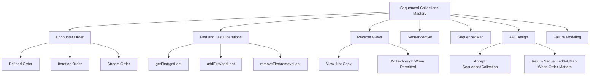
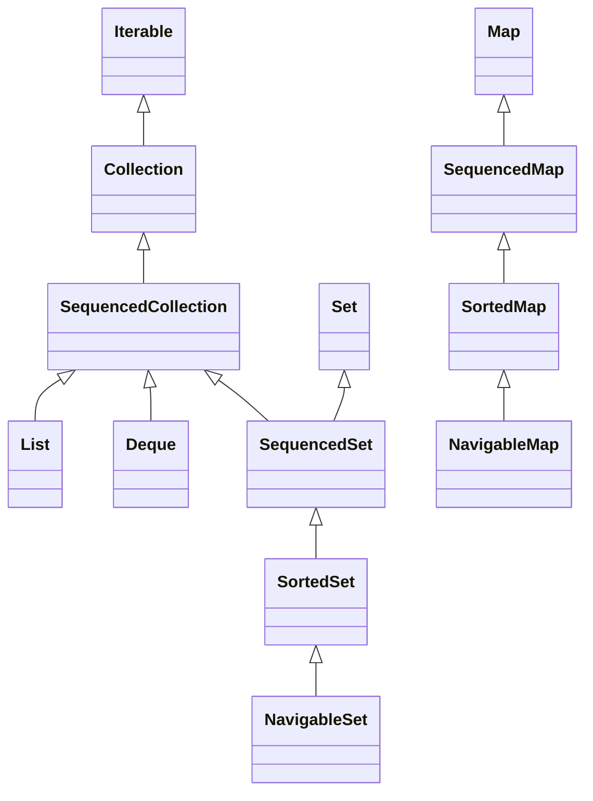

# Part 013 — Sequenced Collections Java 21+: First, Last, Reverse, Encounter Order

> Target: setelah bagian ini, kamu mampu memakai Java 21+ Sequenced Collections untuk mengekspresikan **order sebagai kontrak eksplisit**, bukan sebagai asumsi implisit dari `List`, `LinkedHashSet`, `TreeSet`, `LinkedHashMap`, atau `TreeMap`.

Sebelum Java 21, banyak collection Java sebenarnya punya urutan encounter yang jelas, tetapi type system tidak punya satu bahasa umum untuk mengatakan:

- collection ini punya elemen pertama dan terakhir;
- collection ini bisa dilihat secara reverse;
- collection ini bisa diproses dari depan atau belakang;
- map ini punya mapping pertama dan terakhir;
- set ini unik, tetapi juga punya urutan stabil;
- API saya butuh ordered collection, tetapi tidak harus `List`.

Akibatnya, engineer sering memilih type yang terlalu spesifik:

```java
void export(List<Transaction> transactions) { ... }
```

Padahal yang dibutuhkan bukan index access. Yang dibutuhkan hanya **encounter order**.

Atau memilih type yang terlalu lemah:

```java
void export(Collection<Transaction> transactions) { ... }
```

Padahal output audit perlu deterministic order.

Sequenced Collections memperbaiki gap ini.

---

## 1. Posisi Part Ini dalam Framework Kaufman



Kaufman-style decomposition:

| Practice Block | Skill | Observable Ability |
|---:|---|---|
| 30 menit | Encounter-order vocabulary | Bisa membedakan unordered, insertion-ordered, sorted, access-ordered, dan index-ordered |
| 30 menit | `SequencedCollection` | Bisa memakai `getFirst`, `getLast`, `reversed` tanpa cast ke implementation |
| 30 menit | `SequencedSet` | Bisa mendesain uniqueness + order contract tanpa memaksa `List` |
| 30 menit | `SequencedMap` | Bisa mengambil first/last entry dan reverse traversal secara eksplisit |
| 45 menit | API boundary | Bisa memilih `Collection` vs `SequencedCollection` vs `List` dengan alasan jelas |
| 45 menit | Failure modeling | Bisa menemukan bug lost-order, accidental reverse copy, dan backed-view mutation |

---

## 2. Masalah Sebelum Java 21

Sebelum Sequenced Collections, Java Collections Framework punya beberapa konsep order, tetapi tidak punya interface umum yang menangkap order tersebut.

Contoh:

```java
List<String> list = List.of("A", "B", "C");
Deque<String> deque = new ArrayDeque<>(list);
Set<String> set = new LinkedHashSet<>(list);
Map<String, Integer> map = new LinkedHashMap<>();
```

Semua contoh di atas dapat memiliki encounter order.

Namun sebelum Java 21:

- `List` punya `get(0)` dan `get(size - 1)`, tetapi itu index-based;
- `Deque` punya `getFirst()` dan `getLast()`, tetapi bukan semua ordered collection adalah deque;
- `LinkedHashSet` punya insertion order, tetapi tidak ada `getFirst()` umum;
- `SortedSet` punya `first()` dan `last()`, tetapi method itu berasal dari sorted abstraction, bukan general encounter-order abstraction;
- `LinkedHashMap` punya order, tetapi tidak ada common map interface untuk `firstEntry()`/`lastEntry()` sampai sequenced API.

Masalah production-nya bukan kosmetik. Masalahnya adalah **API contract tidak cukup presisi**.

```java
// Terlalu spesifik: caller harus punya List walaupun index tidak dibutuhkan.
void writeCsv(List<Row> rows) { ... }

// Terlalu lemah: caller bisa memberi HashSet dan output menjadi non-deterministic.
void writeCsv(Collection<Row> rows) { ... }
```

Dengan Java 21+:

```java
void writeCsv(SequencedCollection<Row> rows) { ... }
```

Ini menyatakan invariant yang lebih tepat:

> Saya tidak butuh random access. Saya tidak butuh duplicate behavior tertentu. Saya hanya butuh collection dengan encounter order yang well-defined.

---

## 3. Core Vocabulary: Encounter Order

Encounter order adalah urutan elemen ketika collection diproses oleh traversal normal.

Traversal normal meliputi:

- enhanced `for`;
- `iterator()`;
- `forEach()`;
- `stream()`;
- `toArray()`;
- reverse view traversal dari `reversed()`.

```java
SequencedCollection<String> names = new ArrayList<>();
names.addLast("Ayu");
names.addLast("Bima");
names.addLast("Citra");

for (String name : names) {
    System.out.println(name);
}

// Ayu
// Bima
// Citra
```

Encounter order tidak selalu berarti insertion order.

| Collection | Encounter Order Meaning |
|---|---|
| `ArrayList` | index order |
| `LinkedList` | node sequence order |
| `ArrayDeque` | deque front-to-back order |
| `LinkedHashSet` | normally insertion order, depending on usage |
| `TreeSet` | sorted order |
| `LinkedHashMap` | insertion order or access order depending constructor |
| `TreeMap` | sorted key order |

Production rule:

> Jangan sebut “ordered” tanpa menjelaskan ordered by apa.

Lebih baik:

```java
// Bad: ambiguous
List<Account> orderedAccounts;

// Better
SequencedCollection<Account> accountsInExportOrder;
SequencedSet<String> customerIdsInFirstSeenOrder;
SequencedMap<LocalDate, BigDecimal> balancesByBusinessDate;
```

---

## 4. Interface Baru: Big Picture

Java 21 menambahkan tiga interface utama:



Secara konseptual:

| Interface | Meaning |
|---|---|
| `SequencedCollection<E>` | Collection dengan encounter order, first/last, reversible |
| `SequencedSet<E>` | Set unik + encounter order |
| `SequencedMap<K,V>` | Map dengan encounter order pada mappings |

Key point:

- `SequencedCollection` bukan implementation.
- Ia adalah contract.
- Ia tidak otomatis membuat collection immutable.
- Ia tidak otomatis membuat traversal thread-safe.
- Ia tidak menjamin sorting.
- Ia menjamin ada defined encounter order.

---

## 5. `SequencedCollection<E>` Mental Model

`SequencedCollection<E>` adalah `Collection<E>` yang elemennya punya urutan linear dari first sampai last.

Method penting:

```java
interface SequencedCollection<E> extends Collection<E> {
    SequencedCollection<E> reversed();
    void addFirst(E e);
    void addLast(E e);
    E getFirst();
    E getLast();
    E removeFirst();
    E removeLast();
}
```

Mental model:

```text
first                                      last
  |                                         |
  v                                         v
+-----+     +-----+     +-----+     +-----+
|  A  | --> |  B  | --> |  C  | --> |  D  |
+-----+     +-----+     +-----+     +-----+
```

Reverse view:

```text
original: A, B, C, D
reversed: D, C, B, A
```

Important nuance:

`reversed()` returns a **view**, not necessarily a copy.

That means:

```java
var list = new ArrayList<>(List.of("A", "B", "C"));
SequencedCollection<String> reversed = list.reversed();

list.addLast("D");

System.out.println(reversed); // conceptually sees D, C, B, A
```

The reverse view reflects the backing collection if the backing collection changes.

This is powerful, but also dangerous at boundaries.

---

## 6. First/Last Operations: Removing Index Coupling

Before Java 21, first/last access often looked like this:

```java
List<Event> events = loadEvents();

Event first = events.get(0);
Event last = events.get(events.size() - 1);
```

Problems:

- assumes `List`;
- couples logic to index access;
- throws `IndexOutOfBoundsException` on empty list;
- does not generalize to `LinkedHashSet`, `Deque`, `SortedSet`, etc.

With `SequencedCollection`:

```java
SequencedCollection<Event> events = loadSequencedEvents();

Event first = events.getFirst();
Event last = events.getLast();
```

This reads closer to the domain:

```java
record AuditWindow(Event firstEvent, Event lastEvent) {}

AuditWindow windowOf(SequencedCollection<Event> events) {
    if (events.isEmpty()) {
        throw new IllegalArgumentException("events must not be empty");
    }
    return new AuditWindow(events.getFirst(), events.getLast());
}
```

Production invariant:

> Kalau business rule berbicara tentang “first” dan “last”, jangan paksa konsep itu menjadi index kalau index bukan invariant domain.

---

## 7. `addFirst` and `addLast`: Contract vs Implementation Support

`SequencedCollection` declares `addFirst` and `addLast`, but remember JCF has optional operations.

This can throw `UnsupportedOperationException`:

```java
SequencedCollection<String> names = List.of("A", "B");
names.addFirst("Z"); // UnsupportedOperationException
```

Why?

Because `List.of(...)` returns an unmodifiable list.

So, method existence does not mean mutation is permitted.

Use the same mental model as `Collection.add`:

| Question | Meaning |
|---|---|
| Does the interface declare it? | Operation is part of abstract capability vocabulary |
| Does the implementation support it? | Runtime behavior permits mutation |
| Does the returned object represent view or copy? | Boundary safety issue |

Safe mutable example:

```java
SequencedCollection<String> queue = new ArrayDeque<>();
queue.addLast("parse");
queue.addLast("validate");
queue.addFirst("load-config");
```

---

## 8. Reverse View Is Not Reverse Copy

This is one of the most important points.

```java
var source = new ArrayList<>(List.of("A", "B", "C"));
var reversedView = source.reversed();
var reversedCopy = new ArrayList<>(source.reversed());
```

They are different.

| Expression | Meaning |
|---|---|
| `source.reversed()` | reverse-ordered view backed by source |
| `new ArrayList<>(source.reversed())` | independent snapshot copy in reverse order |
| `List.copyOf(source.reversed())` | unmodifiable snapshot copy in reverse order |

Example bug:

```java
final class ReportModel {
    private final SequencedCollection<Row> rows;

    ReportModel(SequencedCollection<Row> rows) {
        this.rows = rows.reversed(); // dangerous if caller mutates original later
    }
}
```

Safer:

```java
final class ReportModel {
    private final List<Row> rowsNewestFirst;

    ReportModel(SequencedCollection<Row> rows) {
        this.rowsNewestFirst = List.copyOf(rows.reversed());
    }
}
```

Rule:

> Use `reversed()` for local traversal convenience. Use `copyOf(reversed())` for defensive boundary snapshots.

---

## 9. `List` as `SequencedCollection`

In Java 21+, `List<E>` extends `SequencedCollection<E>`.

That means this works:

```java
List<String> names = new ArrayList<>(List.of("A", "B", "C"));

String first = names.getFirst();
String last = names.getLast();
List<String> reversed = names.reversed();
```

This does not make `List` obsolete. It makes APIs more precise.

Use `List` when caller needs:

- positional access;
- index semantics;
- duplicates;
- stable order;
- ability to refer to element position.

Use `SequencedCollection` when caller needs:

- stable encounter order;
- first/last;
- reverse traversal;
- no index semantics.

Example:

```java
// Too specific: index access not needed.
void publish(List<DomainEvent> events) { ... }

// Better: order needed, index not needed.
void publish(SequencedCollection<DomainEvent> events) { ... }
```

But do not over-generalize:

```java
// Bad if duplicate positions matter.
void replaceAt(SequencedCollection<Row> rows, int index, Row replacement) { ... }

// Correct.
void replaceAt(List<Row> rows, int index, Row replacement) { ... }
```

---

## 10. `Deque` as `SequencedCollection`

`Deque` already had first/last operations. Sequenced Collections unify that vocabulary.

```java
Deque<String> steps = new ArrayDeque<>();
steps.addLast("load");
steps.addLast("validate");
steps.addLast("persist");

SequencedCollection<String> ordered = steps;
System.out.println(ordered.getFirst()); // load
System.out.println(ordered.getLast());  // persist
```

When using `Deque`, still prefer semantic method names:

| Intent | Prefer |
|---|---|
| Queue tail insert | `offerLast` / `addLast` |
| Queue head remove | `pollFirst` / `removeFirst` |
| Stack push | `push` or `addFirst` |
| Stack pop | `pop` or `removeFirst` |
| General sequenced insert front/back | `addFirst` / `addLast` |

`SequencedCollection` does not replace `Deque` for queue semantics. It gives a shared ordering interface.

---

## 11. `SequencedSet<E>`: Uniqueness + Encounter Order

A `SequencedSet<E>` is both:

- a `Set<E>`: unique elements by set equality contract;
- a `SequencedCollection<E>`: defined encounter order.

Useful examples:

```java
SequencedSet<String> customerIds = new LinkedHashSet<>();
customerIds.add("C-001");
customerIds.add("C-002");
customerIds.add("C-001");

System.out.println(customerIds); // [C-001, C-002]
System.out.println(customerIds.getFirst()); // C-001
System.out.println(customerIds.getLast());  // C-002
```

This type is ideal when the domain invariant is:

> unique, but process in a known order.

Examples:

- unique customer IDs in first-seen order;
- unique permissions in policy order;
- unique tags in display order;
- unique failed validation codes in detection order;
- unique workflow states in configured order.

Before Java 21, you often had to expose `LinkedHashSet` or weaken contract to `Set`.

```java
// Leaks implementation.
LinkedHashSet<String> failedRuleCodes() { ... }

// Loses order contract.
Set<String> failedRuleCodes() { ... }

// Better.
SequencedSet<String> failedRuleCodes() { ... }
```

---

## 12. Equality Trap: `SequencedSet` Equality Ignores Order

A `SequencedSet` is still a `Set`.

Set equality is based on elements, not order.

```java
SequencedSet<String> a = new LinkedHashSet<>(List.of("A", "B"));
SequencedSet<String> b = new LinkedHashSet<>(List.of("B", "A"));

System.out.println(a.equals(b)); // true
```

This matters in tests.

Bad test:

```java
assertEquals(
    new LinkedHashSet<>(List.of("A", "B")),
    actual
);
```

This can pass even if order is wrong.

Better:

```java
assertEquals(List.of("A", "B"), new ArrayList<>(actual));
```

Rule:

> When order matters for a set, test order through iteration/materialization, not `Set.equals`.

---

## 13. `addFirst` / `addLast` on Sequenced Set

For a list, `addFirst(x)` always inserts at front if mutation is supported.

For a set, duplicate uniqueness complicates the mental model.

```java
var set = new LinkedHashSet<>(List.of("A", "B", "C"));
set.addFirst("C");

System.out.println(set); // C, A, B conceptually
```

A sequenced set may reposition an existing element depending on method semantics and implementation support.

Why this matters:

- `add` answers “is this element newly added?”
- `addFirst`/`addLast` may express “make this element first/last” in a sequenced set.

Production use case:

```java
final class RecentUniqueIds {
    private final SequencedSet<String> ids = new LinkedHashSet<>();

    void markSeen(String id) {
        ids.addFirst(id); // move to front if already present in supporting implementation
        while (ids.size() > 100) {
            ids.removeLast();
        }
    }

    List<String> newestFirst() {
        return List.copyOf(ids);
    }
}
```

This pattern is much clearer with `SequencedSet` than with manual remove/add.

---

## 14. `SortedSet` and `NavigableSet` as Sequenced Sets

Sorted sets also have encounter order: sorted order.

```java
SequencedSet<Integer> numbers = new TreeSet<>(List.of(3, 1, 2));

System.out.println(numbers.getFirst()); // 1
System.out.println(numbers.getLast());  // 3
```

But the ordering meaning differs from `LinkedHashSet`.

| Type | Encounter Order |
|---|---|
| `LinkedHashSet` | insertion/explicit sequencing semantics |
| `TreeSet` | comparator/natural sorted order |

Do not mix them semantically.

```java
SequencedSet<Rule> rules = new TreeSet<>(byPriorityThenCode);
```

This is not “first seen rule order”. This is “sorted by priority/code order”.

Name it accordingly:

```java
SequencedSet<Rule> rulesByPriority = new TreeSet<>(byPriorityThenCode);
SequencedSet<Rule> rulesInRegistrationOrder = new LinkedHashSet<>();
```

---

## 15. `SequencedMap<K,V>`: Order Over Mappings

A `SequencedMap<K,V>` is a `Map<K,V>` with encounter order over key-value mappings.

Important methods include:

```java
interface SequencedMap<K, V> extends Map<K, V> {
    SequencedMap<K, V> reversed();

    SequencedSet<K> sequencedKeySet();
    SequencedCollection<V> sequencedValues();
    SequencedSet<Map.Entry<K, V>> sequencedEntrySet();

    Map.Entry<K, V> firstEntry();
    Map.Entry<K, V> lastEntry();
    Map.Entry<K, V> pollFirstEntry();
    Map.Entry<K, V> pollLastEntry();

    V putFirst(K k, V v);
    V putLast(K k, V v);
}
```

Mental model:

```text
first mapping                                      last mapping
     |                                                  |
     v                                                  v
+----------+     +----------+     +----------+     +----------+
| K1 -> V1 | --> | K2 -> V2 | --> | K3 -> V3 | --> | K4 -> V4 |
+----------+     +----------+     +----------+     +----------+
```

Use cases:

- first-seen index;
- deterministic export map;
- access-ordered cache view;
- sorted map by key;
- ordered error code to error detail map;
- business-date to balance map.

---

## 16. `LinkedHashMap` vs `TreeMap` as Sequenced Maps

```java
SequencedMap<String, Integer> byInsertion = new LinkedHashMap<>();
byInsertion.put("B", 2);
byInsertion.put("A", 1);

System.out.println(byInsertion.firstEntry()); // B=2

SequencedMap<String, Integer> byKey = new TreeMap<>();
byKey.put("B", 2);
byKey.put("A", 1);

System.out.println(byKey.firstEntry()); // A=1
```

Both are sequenced. Their order semantics differ.

| Implementation | Encounter Order |
|---|---|
| `LinkedHashMap` | insertion order by default, or access order when configured |
| `TreeMap` | sorted key order |
| `ConcurrentSkipListMap` | sorted key order with concurrent navigable semantics |

Therefore:

```java
SequencedMap<String, Account> accountsByFirstSeenId = new LinkedHashMap<>();
SequencedMap<LocalDate, Balance> balancesByBusinessDate = new TreeMap<>();
```

Naming should encode order source.

---

## 17. `sequencedKeySet`, `sequencedValues`, `sequencedEntrySet`

`Map.keySet()`, `Map.values()`, and `Map.entrySet()` already had view semantics, but their return types did not expose sequenced operations.

With `SequencedMap`:

```java
SequencedMap<String, Integer> counts = new LinkedHashMap<>();
counts.put("A", 10);
counts.put("B", 20);
counts.put("C", 30);

SequencedSet<String> keys = counts.sequencedKeySet();
SequencedCollection<Integer> values = counts.sequencedValues();
SequencedSet<Map.Entry<String, Integer>> entries = counts.sequencedEntrySet();

System.out.println(keys.getFirst());       // A
System.out.println(values.getLast());      // 30
System.out.println(entries.reversed());    // C=30, B=20, A=10 conceptually
```

These are views.

That means:

```java
keys.removeFirst();
```

may remove the first mapping from the backing map if mutation is supported.

Boundary rule:

> Do not return sequenced map views directly unless you intentionally expose live view behavior.

Safer boundary:

```java
SequencedSet<String> snapshotKeys(SequencedMap<String, ?> map) {
    return Collections.unmodifiableSequencedSet(new LinkedHashSet<>(map.sequencedKeySet()));
}
```

Or simply:

```java
List<String> snapshotKeys(SequencedMap<String, ?> map) {
    return List.copyOf(map.sequencedKeySet());
}
```

---

## 18. Access-Ordered `LinkedHashMap`: Sequenced But Dynamic

`LinkedHashMap` can be constructed with access-order mode.

That means encounter order changes when entries are accessed.

```java
var cache = new LinkedHashMap<String, String>(16, 0.75f, true);
cache.put("A", "alpha");
cache.put("B", "bravo");
cache.put("C", "charlie");

cache.get("A");

System.out.println(cache.sequencedKeySet()); // B, C, A conceptually
```

This is useful for LRU-like structures.

But it is dangerous for audit/export if you assume insertion order.

Bad:

```java
SequencedMap<String, Row> rows = accessOrderedMap();
writeCsv(rows); // order changes based on reads
```

Rule:

> Sequenced means “defined order,” not necessarily “stable insertion order.”

---

## 19. Reverse Traversal Without Copying

Before Java 21:

```java
List<Event> events = loadEvents();
for (int i = events.size() - 1; i >= 0; i--) {
    handle(events.get(i));
}
```

This assumes random access and index arithmetic.

Now:

```java
void handleNewestFirst(SequencedCollection<Event> events) {
    for (Event event : events.reversed()) {
        handle(event);
    }
}
```

This is more general.

It works for:

- `ArrayList`;
- `LinkedList`;
- `ArrayDeque`;
- `LinkedHashSet`;
- `TreeSet`;
- other sequenced implementations.

But remember: reverse view is a view.

If you need snapshot:

```java
List<Event> newestFirst = List.copyOf(events.reversed());
```

---

## 20. Streams and Encounter Order

Because `SequencedCollection` is still a `Collection`, it inherits `stream()`.

```java
List<String> newestFirst = events.reversed()
    .stream()
    .map(Event::id)
    .toList();
```

Key point:

- stream from original follows original encounter order;
- stream from reversed view follows reversed encounter order.

This gives a clean way to express ordering:

```java
List<InvoiceDto> dtos = invoices
    .reversed()
    .stream()
    .map(this::toDto)
    .toList();
```

This is better than:

```java
List<Invoice> copy = new ArrayList<>(invoices);
Collections.reverse(copy);
List<InvoiceDto> dtos = copy.stream().map(this::toDto).toList();
```

Use copy only when you need snapshot or independent mutation.

---

## 21. API Design: Choosing the Right Type

The most important production value of Sequenced Collections is API precision.

### 21.1 Input Type Matrix

| Your method needs | Accept |
|---|---|
| only traversal, order irrelevant | `Iterable<T>` or `Collection<T>` |
| traversal + size | `Collection<T>` |
| traversal + encounter order | `SequencedCollection<T>` |
| positional access | `List<T>` |
| uniqueness, order irrelevant | `Set<T>` |
| uniqueness + encounter order | `SequencedSet<T>` |
| key lookup, order irrelevant | `Map<K,V>` |
| key lookup + mapping order | `SequencedMap<K,V>` |
| sorted key navigation | `NavigableMap<K,V>` |

Examples:

```java
// Needs deterministic iteration. Does not need index.
void exportRows(SequencedCollection<Row> rows) { ... }

// Needs uniqueness and display order.
void renderTags(SequencedSet<Tag> tags) { ... }

// Needs stable key-value output order.
void writeProperties(SequencedMap<String, String> properties) { ... }
```

### 21.2 Return Type Matrix

| You return | Meaning |
|---|---|
| `Collection<T>` | group of elements, no order promise |
| `List<T>` | ordered, positional, duplicates allowed |
| `SequencedCollection<T>` | ordered, first/last/reversible, no index promise |
| `SequencedSet<T>` | unique + ordered |
| `SequencedMap<K,V>` | lookup + ordered mappings |

Return the weakest type that still preserves the domain invariant.

Do not return `SequencedCollection` if callers need `get(index)`. Do not return `Collection` if order matters.

---

## 22. Production Pattern: Ordered Error Accumulation

Problem:

- validation discovers errors in rule order;
- duplicate error codes should appear once;
- final response must preserve first-detected order.

Bad:

```java
Set<String> errorCodes = new HashSet<>();
```

This loses order.

Better:

```java
SequencedSet<String> errorCodes = new LinkedHashSet<>();

for (Rule rule : rules) {
    rule.validate(input).ifPresent(errorCodes::add);
}

return List.copyOf(errorCodes);
```

Why not return `Set`?

Because response order is part of behavior.

Why not return `List`?

Because uniqueness is part of behavior.

Internal type: `SequencedSet`.
External DTO field: often `List`, because JSON arrays encode order, not set semantics.

---

## 23. Production Pattern: Effective Policy Stack

Problem:

- policies are layered;
- later policy can override earlier policy;
- diagnostics need first and last policy.

```java
record Policy(String id, int priority) {}

final class PolicyChain {
    private final SequencedCollection<Policy> policies;

    PolicyChain(SequencedCollection<Policy> policies) {
        if (policies.isEmpty()) {
            throw new IllegalArgumentException("policy chain must not be empty");
        }
        this.policies = List.copyOf(policies);
    }

    Policy basePolicy() {
        return policies.getFirst();
    }

    Policy effectivePolicy() {
        return policies.getLast();
    }

    List<Policy> evaluationOrder() {
        return List.copyOf(policies);
    }

    List<Policy> overrideOrder() {
        return List.copyOf(policies.reversed());
    }
}
```

This expresses domain language directly.

---

## 24. Production Pattern: Ordered Index Construction

Problem:

- input records have order;
- lookup by ID is needed;
- export must preserve first occurrence order;
- duplicate IDs should be resolved by policy.

```java
static SequencedMap<String, Customer> indexByCustomerId(
        SequencedCollection<Customer> customers
) {
    SequencedMap<String, Customer> index = new LinkedHashMap<>();

    for (Customer customer : customers) {
        index.putIfAbsent(customer.id(), customer); // first wins
    }

    return Collections.unmodifiableSequencedMap(index);
}
```

If last wins but first-seen order should remain, use `put`:

```java
index.put(customer.id(), customer);
```

If last wins and last occurrence should move to end, use `putLast`:

```java
index.putLast(customer.id(), customer);
```

These distinctions are subtle and often cause bugs.

| Policy | Code |
|---|---|
| first value wins, first order wins | `putIfAbsent` |
| last value wins, first key position remains | `put` on `LinkedHashMap` insertion-order map |
| last value wins, last occurrence order wins | `putLast` |

---

## 25. Common Failure Modes

### 25.1 Treating `SequencedCollection` as Sorted

Wrong assumption:

```java
SequencedCollection<Order> orders = loadOrders();
Order earliest = orders.getFirst(); // not necessarily earliest by date
```

Correct:

```java
Order earliest = orders.stream()
    .min(Comparator.comparing(Order::createdAt))
    .orElseThrow();
```

Unless the collection is explicitly ordered by date.

### 25.2 Returning Live Reverse View

```java
SequencedCollection<Row> newestFirst() {
    return rows.reversed();
}
```

This exposes a live view.

Prefer:

```java
List<Row> newestFirst() {
    return List.copyOf(rows.reversed());
}
```

### 25.3 Testing `SequencedSet` Order with `equals`

As discussed, set equality ignores order.

```java
assertEquals(List.of("A", "B"), new ArrayList<>(actualSet));
```

### 25.4 Accidentally Depending on `HashMap` Iteration

```java
Map<String, String> map = new HashMap<>();
writeCsv(map.entrySet());
```

If output order matters, use:

```java
SequencedMap<String, String> map = new LinkedHashMap<>();
```

or:

```java
SequencedMap<String, String> map = new TreeMap<>();
```

depending on order source.

### 25.5 Confusing View With Snapshot

Any API named `reversed`, `keySet`, `values`, `entrySet`, `subList`, or `unmodifiableX` should trigger the same question:

> Is this a live view or an independent copy?

---

## 26. Code Review Checklist

Ask these questions when reviewing ordered collection code:

1. Does order matter?
2. What is the source of order: insertion, index, sort, access, business priority?
3. Is uniqueness required?
4. Is lookup required?
5. Is first/last part of the domain?
6. Is reverse traversal needed?
7. Is the returned object a view or snapshot?
8. Can caller mutate the underlying collection?
9. Does equality check include order or ignore it?
10. Is the API type too specific or too weak?

---

## 27. Deliberate Practice

### Exercise 1 — Replace Over-Specific `List`

Refactor this API:

```java
void export(List<Transaction> transactions) {
    for (Transaction transaction : transactions) {
        write(transaction);
    }
}
```

Questions:

- Does it need index access?
- Does it need duplicates?
- Does it need order?
- What should the input type be?

Expected direction:

```java
void export(SequencedCollection<Transaction> transactions) { ... }
```

### Exercise 2 — Ordered Unique Errors

Implement:

```java
SequencedSet<String> collectErrorCodes(SequencedCollection<ValidationResult> results)
```

Requirements:

- preserve first-detected order;
- remove duplicates;
- return unmodifiable result;
- tests must verify order correctly.

### Exercise 3 — Reverse Snapshot

Given:

```java
SequencedCollection<Event> events
```

Create:

```java
List<Event> newestFirstSnapshot
```

Do not expose live view.

### Exercise 4 — Duplicate Key Policy

Given records with duplicate customer IDs, implement three indexers:

- first wins, first order wins;
- last wins, first order remains;
- last wins, last order wins.

Use `SequencedMap` and explain the difference.

---

## 28. Summary

Sequenced Collections are not “just new convenience methods.” They repair a long-standing type-system gap in the Java Collections Framework.

The key mental model:

```text
Collection              = group of elements
List                    = ordered + positional
Set                     = unique
Map                     = lookup by key
SequencedCollection     = group with defined encounter order
SequencedSet            = unique + defined encounter order
SequencedMap            = lookup + defined mapping order
```

Use Sequenced Collections when the domain cares about order but not necessarily about index.

The highest-value production rules:

- Do not use `List` just because order matters.
- Do not use `Set` if order also matters; use `SequencedSet`.
- Do not use `Map` if mapping order matters; use `SequencedMap`.
- Treat `reversed()` as a view, not a copy.
- Test sequenced set order through iteration, not set equality.
- Name collections according to their order source.

---

## References

- Oracle Java SE 25 API — `SequencedCollection`, `SequencedSet`, `SequencedMap`, `List`, `Collections`
- OpenJDK JEP 431 — Sequenced Collections
