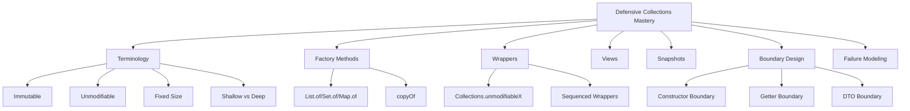

# Part 014 — Immutable, Unmodifiable, Fixed-Size, and Defensive Collections

> Target: setelah bagian ini, kamu mampu membedakan **immutable**, **unmodifiable**, **fixed-size**, **snapshot**, **view**, dan **defensive copy** secara presisi, lalu mendesain API boundary yang tidak bocor mutation, aliasing, null, atau live-view behavior.

Banyak bug collection di enterprise Java bukan karena engineer tidak tahu `List` atau `Map`. Bug muncul karena boundary semantics tidak eksplisit:

- apakah caller boleh mutate collection?
- apakah callee menyimpan reference langsung?
- apakah return value adalah snapshot atau live view?
- apakah elemen di dalam collection ikut immutable?
- apakah `null` diterima?
- apakah order dipertahankan?
- apakah `UnsupportedOperationException` bisa muncul di tengah algorithm?

Bagian ini adalah salah satu fondasi API design terpenting dalam Java.

---

## 1. Posisi Part Ini dalam Framework Kaufman



Kaufman-style decomposition:

| Practice Block | Skill | Observable Ability |
|---:|---|---|
| 30 menit | Vocabulary precision | Bisa menjelaskan immutable vs unmodifiable vs fixed-size tanpa ambiguity |
| 30 menit | Factory methods | Bisa memilih `List.of`, `Set.of`, `Map.of`, `copyOf` dengan benar |
| 30 menit | Wrapper semantics | Bisa menjelaskan kenapa `unmodifiableList` masih bisa berubah jika backing list berubah |
| 45 menit | Defensive boundary | Bisa menulis constructor/getter yang tidak bocor internal mutation |
| 45 menit | Shallow immutability | Bisa mendeteksi mutable element leak |
| 60 menit | Failure modeling | Bisa menemukan aliasing, null rejection, live view, and unsupported mutation bugs |

---

## 2. The Vocabulary Problem

Java code sering memakai kata “immutable” untuk banyak hal yang berbeda.

Contoh:

```java
List<String> names = Collections.unmodifiableList(new ArrayList<>());
```

Orang sering berkata “ini immutable list”. Itu tidak sepenuhnya benar.

Lebih presisi:

> Ini adalah unmodifiable view terhadap backing list.

Kalau backing list berubah, view ikut berubah.

```java
var mutable = new ArrayList<String>();
var view = Collections.unmodifiableList(mutable);

mutable.add("A");
System.out.println(view); // [A]
```

Jadi kita butuh vocabulary yang lebih tajam.

---

## 3. Terminology Matrix

| Term | Meaning | Can structure change through this reference? | Can structure change elsewhere? | Can element state change? |
|---|---|---:|---:|---:|
| Mutable collection | Normal modifiable collection | Yes | Yes if aliased | Yes if elements mutable |
| Fixed-size collection | Size cannot change, but elements may be replaceable | Sometimes | Yes if backed | Yes |
| Unmodifiable view | This reference cannot mutate structure | No | Yes through backing collection | Yes |
| Unmodifiable snapshot | This reference cannot mutate structure, and source mutation not reflected | No | No structural reflection | Yes |
| Immutable collection | Structural state cannot change | No | No | Elements may still be mutable unless deeply immutable |
| Deeply immutable graph | Collection and elements cannot observably change | No | No | No |

Java standard collections mostly give you **unmodifiable structural collections**, not deep immutability.

---

## 4. `List.of`, `Set.of`, `Map.of`: Factory-Created Unmodifiable Collections

Modern Java provides convenient factory methods:

```java
List<String> names = List.of("Ayu", "Bima", "Citra");
Set<String> roles = Set.of("ADMIN", "REVIEWER");
Map<String, Integer> weights = Map.of("LOW", 1, "HIGH", 10);
```

Important characteristics:

- structurally unmodifiable;
- reject `null` elements/keys/values;
- compact for small constants;
- safe to share structurally;
- shallow with respect to element mutability.

Mutation attempt:

```java
names.add("Dian"); // UnsupportedOperationException
```

Null rejection:

```java
List.of("A", null); // NullPointerException
```

Duplicate set element rejection:

```java
Set.of("A", "A"); // IllegalArgumentException
```

Duplicate map key rejection:

```java
Map.of("A", 1, "A", 2); // IllegalArgumentException
```

Use these for:

- constants;
- small configuration lists;
- test fixtures;
- default empty/non-empty values;
- safe structural return values.

---

## 5. `copyOf`: Snapshot Boundary

`List.copyOf`, `Set.copyOf`, and `Map.copyOf` create unmodifiable collections from existing collections/maps.

```java
List<String> source = new ArrayList<>();
source.add("A");

List<String> snapshot = List.copyOf(source);

source.add("B");

System.out.println(snapshot); // [A]
```

This is the default tool for defensive structural snapshot.

Use it in constructors:

```java
public final class Report {
    private final List<Row> rows;

    public Report(Collection<Row> rows) {
        this.rows = List.copyOf(rows);
    }

    public List<Row> rows() {
        return rows;
    }
}
```

This solves two problems:

- caller cannot mutate your internal list by holding the original reference;
- caller cannot mutate the returned list.

But it does not solve mutable element state:

```java
record Holder(List<StringBuilder> builders) {
    Holder(Collection<StringBuilder> builders) {
        this(List.copyOf(builders));
    }
}
```

`StringBuilder` remains mutable.

---

## 6. Shallow Immutability: The Most Common Hidden Leak

Unmodifiable collection means collection structure cannot be changed through that reference.

It does not mean elements cannot change.

```java
var account = new MutableAccount("A-001", BigDecimal.TEN);
var accounts = List.of(account);

account.setBalance(BigDecimal.ZERO);

System.out.println(accounts.getFirst().balance()); // 0
```

The list did not mutate structurally. The object inside mutated.

This matters in:

- DTO caching;
- audit snapshots;
- validation results;
- domain events;
- workflow state snapshots;
- authorization policy snapshots;
- reporting views.

Rule:

> For audit or historical snapshot, `List.copyOf` is insufficient if elements are mutable.

You need element copying too.

```java
public AuditSnapshot(Collection<Account> accounts) {
    this.accounts = accounts.stream()
        .map(AccountSnapshot::from)
        .toList();
}
```

Since `Stream.toList()` returns an unmodifiable list in modern Java, this gives structural immutability for the resulting list, but element immutability still depends on `AccountSnapshot`.

---

## 7. `Collections.unmodifiableX`: Live View Boundary

The classic wrappers:

```java
Collections.unmodifiableCollection(c)
Collections.unmodifiableList(list)
Collections.unmodifiableSet(set)
Collections.unmodifiableMap(map)
Collections.unmodifiableSequencedCollection(c)
Collections.unmodifiableSequencedSet(set)
Collections.unmodifiableSequencedMap(map)
```

They return an unmodifiable **view** backed by the specified collection/map.

Example:

```java
var mutable = new ArrayList<String>();
var view = Collections.unmodifiableList(mutable);

mutable.add("A");
mutable.add("B");

System.out.println(view); // [A, B]
```

The view prevents mutation through `view`, not mutation through `mutable`.

This is useful when:

- you control the backing collection;
- you want a live read-only view;
- internal mutation should be reflected to observers;
- you intentionally expose changing state.

It is dangerous when:

- caller controls the backing collection;
- constructor stores wrapper over caller input;
- getter exposes live internal state accidentally;
- thread visibility is assumed but not guaranteed;
- consumer expects snapshot semantics.

Bad constructor:

```java
public final class BadReport {
    private final List<Row> rows;

    public BadReport(List<Row> rows) {
        this.rows = Collections.unmodifiableList(rows);
    }
}
```

Caller can still mutate:

```java
List<Row> source = new ArrayList<>();
BadReport report = new BadReport(source);
source.add(new Row(...)); // report changes
```

Better:

```java
public final class Report {
    private final List<Row> rows;

    public Report(Collection<Row> rows) {
        this.rows = List.copyOf(rows);
    }
}
```

---

## 8. Fixed-Size Is Not Unmodifiable

`Arrays.asList(array)` returns a fixed-size list backed by the array.

```java
String[] array = {"A", "B"};
List<String> list = Arrays.asList(array);

list.set(0, "Z");      // allowed
list.add("C");         // UnsupportedOperationException
array[1] = "Y";         // reflected in list

System.out.println(list); // [Z, Y]
```

This is neither a normal mutable list nor a safe immutable snapshot.

It is a fixed-size view backed by an array.

Use cases:

- quick adapter from array to list for local code;
- legacy interop;
- temporary view.

Avoid for:

- defensive constructor copy;
- API return value;
- long-lived state;
- code that expects `add`/`remove`;
- code that assumes source array changes will not reflect.

Better:

```java
List<String> mutableCopy = new ArrayList<>(Arrays.asList(array));
List<String> unmodifiableSnapshot = List.copyOf(Arrays.asList(array));
```

Or with array directly:

```java
List<String> snapshot = List.of(array); // careful: varargs behavior depends on array type
```

For object array `String[]`, `List.of(array)` creates a list of array elements. For primitive arrays, it creates a single element list containing the primitive array object.

```java
int[] numbers = {1, 2, 3};
List<int[]> list = List.of(numbers); // one element: int[]
```

---

## 9. `Stream.toList()` vs `Collectors.toList()` vs `Collectors.toUnmodifiableList()`

This series will cover streams deeply later, but this boundary matters now.

```java
List<String> a = stream.toList();
List<String> b = stream.collect(Collectors.toList());
List<String> c = stream.collect(Collectors.toUnmodifiableList());
```

High-level semantics:

| API | Result Mutability Contract |
|---|---|
| `Stream.toList()` | unmodifiable list |
| `Collectors.toList()` | no guarantee of type, mutability, serializability, thread-safety |
| `Collectors.toUnmodifiableList()` | unmodifiable list, rejects null |

Production rule:

> If you need a mutable result, say so explicitly with `toCollection(ArrayList::new)` or `new ArrayList<>(...)`.

```java
List<String> mutable = stream.collect(Collectors.toCollection(ArrayList::new));
```

If you need an unmodifiable result:

```java
List<String> immutableStructure = stream.toList();
```

or:

```java
List<String> immutableStructure = stream.collect(Collectors.toUnmodifiableList());
```

Be careful with null behavior. `Collectors.toUnmodifiableList()` rejects null. `Stream.toList()` has different specification details and should not be treated as equivalent in every edge case. If nulls may exist, decide explicitly whether nulls are allowed at the boundary.

---

## 10. Defensive Copy in Constructors

The safest default for value-like classes:

```java
public final class InvoiceBatch {
    private final List<Invoice> invoices;

    public InvoiceBatch(Collection<Invoice> invoices) {
        this.invoices = List.copyOf(invoices);
    }

    public List<Invoice> invoices() {
        return invoices;
    }
}
```

This has clear semantics:

- constructor rejects null collection;
- constructor rejects null elements;
- internal list is unmodifiable;
- source collection mutation after construction does not affect object;
- getter can return internal reference safely for structural immutability.

But again, `Invoice` must also be immutable or defensively copied if element state matters.

For mutable elements:

```java
public final class InvoiceBatchSnapshot {
    private final List<InvoiceSnapshot> invoices;

    public InvoiceBatchSnapshot(Collection<Invoice> invoices) {
        this.invoices = invoices.stream()
            .map(InvoiceSnapshot::from)
            .toList();
    }

    public List<InvoiceSnapshot> invoices() {
        return invoices;
    }
}
```

---

## 11. Defensive Copy in Getters

If internal state is mutable and you keep mutating it internally, returning direct reference leaks mutation authority.

Bad:

```java
public final class MutableAccumulator {
    private final List<Event> events = new ArrayList<>();

    public List<Event> events() {
        return events;
    }
}
```

Caller can do:

```java
accumulator.events().clear();
```

Better options:

### Option A — Snapshot Getter

```java
public List<Event> events() {
    return List.copyOf(events);
}
```

Properties:

- caller gets independent structural snapshot;
- internal future mutations not reflected;
- allocation per call.

### Option B — Live Read-Only View

```java
private final List<Event> readOnlyEvents = Collections.unmodifiableList(events);

public List<Event> eventsView() {
    return readOnlyEvents;
}
```

Properties:

- caller cannot mutate through returned reference;
- internal future mutations are reflected;
- one wrapper allocation;
- must document live-view semantics.

### Option C — Iterator/Stream-Only API

```java
public void forEachEvent(Consumer<? super Event> consumer) {
    events.forEach(consumer);
}
```

Properties:

- no collection reference exposed;
- still subject to concurrent modification/side effects if consumer calls back;
- less flexible for caller.

Choose based on semantics, not habit.

---

## 12. Defensive Copy for Maps

Maps need extra care because both key and value can be mutable.

```java
public final class RoutingTable {
    private final Map<RouteKey, RouteTarget> routes;

    public RoutingTable(Map<RouteKey, RouteTarget> routes) {
        this.routes = Map.copyOf(routes);
    }

    public Map<RouteKey, RouteTarget> routes() {
        return routes;
    }
}
```

This only protects map structure.

It does not protect:

- mutable key hash/equality fields;
- mutable value fields;
- mutable collections inside values.

Danger:

```java
RouteKey key = new RouteKey("A");
Map<RouteKey, RouteTarget> source = new HashMap<>();
source.put(key, target);

RoutingTable table = new RoutingTable(source);
key.setCode("B"); // can break hash-based lookup semantics if key is mutable
```

Rule:

> Map keys used across defensive boundaries should be immutable or copied into immutable key records.

---

## 13. Defensive Copy for Sequenced Collections

`List.copyOf` is often enough if you want ordered snapshot and duplicates are acceptable.

But if uniqueness + order is part of the invariant, preserve it explicitly.

```java
public final class OrderedUniqueCodes {
    private final SequencedSet<String> codes;

    public OrderedUniqueCodes(Collection<String> codes) {
        this.codes = Collections.unmodifiableSequencedSet(new LinkedHashSet<>(codes));
    }

    public SequencedSet<String> codes() {
        return codes;
    }
}
```

Why not `Set.copyOf(codes)`?

Because `Set.copyOf` does not promise insertion-order preservation as a semantic contract. If order matters, choose an ordered implementation first, then wrap.

```java
SequencedSet<String> snapshot = Collections.unmodifiableSequencedSet(
    new LinkedHashSet<>(codes)
);
```

For sequenced maps:

```java
public final class OrderedProperties {
    private final SequencedMap<String, String> properties;

    public OrderedProperties(Map<String, String> properties) {
        this.properties = Collections.unmodifiableSequencedMap(
            new LinkedHashMap<>(properties)
        );
    }

    public SequencedMap<String, String> properties() {
        return properties;
    }
}
```

But beware: if the input map is unordered, `new LinkedHashMap<>(properties)` preserves the input map's iteration order, which might already be arbitrary.

If deterministic order is required, sort explicitly:

```java
this.properties = Collections.unmodifiableSequencedMap(new TreeMap<>(properties));
```

or:

```java
SequencedMap<String, String> ordered = new LinkedHashMap<>();
properties.entrySet().stream()
    .sorted(Map.Entry.comparingByKey())
    .forEach(e -> ordered.put(e.getKey(), e.getValue()));
this.properties = Collections.unmodifiableSequencedMap(ordered);
```

---

## 14. Null Policy at Boundaries

Modern unmodifiable factories are useful because they reject null.

```java
List.copyOf(input); // throws if input or element is null
Map.copyOf(input);  // throws if input, key, or value is null
```

This is often a good thing.

It turns hidden null contamination into immediate boundary failure.

However, if your domain intentionally permits nulls, do not accidentally use APIs that reject them without documenting the choice.

Better: normalize explicitly.

```java
List<String> normalized = input.stream()
    .map(value -> value == null ? "" : value)
    .toList();
```

Or reject with domain-specific error:

```java
static List<String> requireNoNulls(Collection<String> input) {
    int index = 0;
    for (String value : input) {
        if (value == null) {
            throw new IllegalArgumentException("input contains null at index " + index);
        }
        index++;
    }
    return List.copyOf(input);
}
```

Why not just let `NullPointerException` happen?

Because domain-specific errors are easier to diagnose across API boundaries.

---

## 15. Empty Collections: Never Return Null

Bad:

```java
List<Order> findOrders(CustomerId id) {
    if (notFound(id)) {
        return null;
    }
    return orders;
}
```

Better:

```java
List<Order> findOrders(CustomerId id) {
    if (notFound(id)) {
        return List.of();
    }
    return List.copyOf(orders);
}
```

Empty collection means:

> valid result with zero elements.

`null` means:

> absence of collection reference, which forces every caller into defensive null logic.

Use `Optional<List<T>>` rarely. It usually means two levels of absence:

- no collection known;
- collection known but empty.

Most APIs only need empty collection.

---

## 16. Boundary Design Patterns

### Pattern 1 — Value Object With Ordered Children

```java
public record WorkflowDefinition(
    String code,
    List<WorkflowStep> steps
) {
    public WorkflowDefinition {
        Objects.requireNonNull(code, "code");
        steps = List.copyOf(steps);
        if (steps.isEmpty()) {
            throw new IllegalArgumentException("steps must not be empty");
        }
    }
}
```

Record compact constructor allows defensive replacement of the component parameter.

### Pattern 2 — Ordered Unique Codes

```java
public final class ErrorCatalog {
    private final SequencedSet<String> codes;

    public ErrorCatalog(Collection<String> codes) {
        this.codes = Collections.unmodifiableSequencedSet(new LinkedHashSet<>(codes));
    }

    public SequencedSet<String> codes() {
        return codes;
    }
}
```

### Pattern 3 — Internal Mutable, External Snapshot

```java
public final class ValidationContext {
    private final List<Violation> violations = new ArrayList<>();

    public void addViolation(Violation violation) {
        violations.add(Objects.requireNonNull(violation));
    }

    public List<Violation> violations() {
        return List.copyOf(violations);
    }
}
```

### Pattern 4 — Internal Mutable, External Live View

```java
public final class ObservableBuffer<T> {
    private final List<T> buffer = new ArrayList<>();
    private final List<T> readOnlyBuffer = Collections.unmodifiableList(buffer);

    public void add(T value) {
        buffer.add(value);
    }

    /** Returns a live read-only view. Future internal additions are visible. */
    public List<T> view() {
        return readOnlyBuffer;
    }
}
```

Only use this when live view is intentional and documented.

---

## 17. Mutation Authority Matrix

When designing APIs, ask: who owns mutation authority?

| Scenario | Constructor Action | Getter Action |
|---|---|---|
| Value object snapshot | `List.copyOf(input)` | return field |
| Internal mutable accumulator | copy into `ArrayList` | `List.copyOf(field)` |
| Live read-only observer | own mutable list | return `unmodifiableList(field)` |
| Ordered unique snapshot | `new LinkedHashSet` + `unmodifiableSequencedSet` | return field |
| Sorted snapshot | `new TreeSet` + unmodifiable wrapper | return field |
| Map lookup snapshot | `Map.copyOf(input)` if order irrelevant | return field |
| Sequenced map snapshot | `new LinkedHashMap` or `TreeMap` + wrapper | return field |

---

## 18. Failure Mode: `UnsupportedOperationException` in Generic Algorithms

Generic code often assumes mutability:

```java
void normalize(List<String> names) {
    names.removeIf(String::isBlank);
    names.add("UNKNOWN");
}
```

This fails for:

- `List.of(...)`;
- `List.copyOf(...)`;
- `Collections.unmodifiableList(...)`;
- fixed-size `Arrays.asList(...)` for `add`/`remove`.

Better:

```java
List<String> normalized(Collection<String> names) {
    List<String> result = new ArrayList<>();
    for (String name : names) {
        if (!name.isBlank()) {
            result.add(name);
        }
    }
    result.add("UNKNOWN");
    return List.copyOf(result);
}
```

Input is read-only. Output is new value.

Rule:

> Prefer transform-to-new-result over mutating caller-provided collections unless mutation is the explicit purpose of the method.

---

## 19. Failure Mode: Defensive Copy That Destroys Semantics

Bad:

```java
Set<String> codes = new LinkedHashSet<>(List.of("B", "A"));
Set<String> copy = Set.copyOf(codes);
```

If order matters, this may not preserve the semantic order you intend to expose.

Better:

```java
SequencedSet<String> copy = Collections.unmodifiableSequencedSet(
    new LinkedHashSet<>(codes)
);
```

For maps:

```java
Map<String, String> copy = Map.copyOf(linkedHashMap);
```

If mapping order matters to callers, do not return plain `Map.copyOf` and expect order semantics to be your API contract.

Use explicit sequenced map snapshot.

---

## 20. Failure Mode: `unmodifiableList` Over Caller Input

This is one of the most common bugs.

```java
public UserSession(List<String> permissions) {
    this.permissions = Collections.unmodifiableList(permissions);
}
```

Caller mutation leaks in:

```java
List<String> permissions = new ArrayList<>(List.of("READ"));
UserSession session = new UserSession(permissions);
permissions.add("ADMIN");
```

Now `session` may appear to have `ADMIN`.

Correct:

```java
public UserSession(Collection<String> permissions) {
    this.permissions = List.copyOf(permissions);
}
```

If you need uniqueness:

```java
public UserSession(Collection<String> permissions) {
    this.permissions = Collections.unmodifiableSequencedSet(
        new LinkedHashSet<>(permissions)
    );
}
```

---

## 21. Failure Mode: Mutable Elements in Security/Policy Data

```java
record PolicySet(List<Policy> policies) {
    PolicySet(Collection<Policy> policies) {
        this(List.copyOf(policies));
    }
}
```

If `Policy` is mutable, caller can retain reference and mutate it.

Safer:

```java
record PolicySnapshot(String id, int priority, Set<String> permissions) {
    PolicySnapshot {
        permissions = Set.copyOf(permissions);
    }

    static PolicySnapshot from(Policy policy) {
        return new PolicySnapshot(
            policy.id(),
            policy.priority(),
            policy.permissions()
        );
    }
}

record PolicySet(List<PolicySnapshot> policies) {
    PolicySet(Collection<Policy> policies) {
        this(policies.stream().map(PolicySnapshot::from).toList());
    }
}
```

For security, audit, regulatory, and workflow systems, shallow immutability is often not enough.

---

## 22. Failure Mode: Confusing `final` With Immutable

```java
private final List<String> names = new ArrayList<>();
```

`final` means the field reference cannot be reassigned.

It does not mean the list cannot mutate.

```java
names.add("A"); // allowed inside class
```

Also:

```java
public final List<String> names;
```

is still dangerous if it references a mutable list.

Rule:

> `final` protects the reference, not the object graph.

---

## 23. Failure Mode: Assuming Wrapper Is Thread-Safe

Unmodifiable is not synchronized.

```java
List<String> view = Collections.unmodifiableList(new ArrayList<>());
```

This does not make access thread-safe. It only blocks mutation through `view`.

If the backing list is mutated concurrently elsewhere, readers may still observe inconsistent behavior or encounter concurrency problems.

Thread-safety needs separate design:

- external synchronization;
- concurrent collections;
- immutable snapshots;
- volatile/atomic publication;
- copy-on-write strategy.

This series does not repeat concurrency internals, but the boundary rule matters:

> Immutability helps concurrency only when the object graph is safely published and not mutated elsewhere.

---

## 24. Code Review Checklist

For every collection field, constructor parameter, and getter, ask:

1. Who owns this collection?
2. Can caller mutate it after passing it in?
3. Can callee mutate it after returning it?
4. Is returned value snapshot or live view?
5. Are null elements allowed?
6. Are duplicate elements allowed?
7. Is order part of the contract?
8. Is uniqueness part of the contract?
9. Are elements themselves immutable?
10. Are map keys immutable?
11. Is `UnsupportedOperationException` possible in downstream algorithms?
12. Does defensive copy preserve ordering semantics?
13. Is allocation cost acceptable for snapshot getters?
14. Is live view behavior documented if used?

---

## 25. Decision Matrix

| Need | Recommended Approach |
|---|---|
| Small constant list | `List.of(...)` |
| Small constant set | `Set.of(...)` |
| Small constant map | `Map.of(...)` / `Map.ofEntries(...)` |
| Snapshot list from input | `List.copyOf(input)` |
| Mutable copy from input | `new ArrayList<>(input)` |
| Snapshot map, order irrelevant | `Map.copyOf(input)` |
| Snapshot insertion-order set | `Collections.unmodifiableSequencedSet(new LinkedHashSet<>(input))` |
| Snapshot sorted set | `Collections.unmodifiableSortedSet(new TreeSet<>(input))` |
| Live read-only view | `Collections.unmodifiableX(backing)` |
| Fixed-size array adapter | `Arrays.asList(array)` |
| Mutable stream result | `collect(Collectors.toCollection(ArrayList::new))` |
| Unmodifiable stream result | `stream.toList()` or `toUnmodifiableList()` |
| Deep snapshot | map each element to immutable snapshot + unmodifiable collection |

---

## 26. Practical API Examples

### Example 1 — Bad API

```java
public final class Batch {
    private final List<Item> items;

    public Batch(List<Item> items) {
        this.items = items;
    }

    public List<Item> getItems() {
        return items;
    }
}
```

Problems:

- caller can mutate after construction;
- caller can mutate via getter;
- accepts null list;
- accepts null elements;
- element mutability unknown;
- no invariant validation.

### Example 2 — Better Structural Boundary

```java
public final class Batch {
    private final List<Item> items;

    public Batch(Collection<Item> items) {
        this.items = List.copyOf(items);
        if (this.items.isEmpty()) {
            throw new IllegalArgumentException("items must not be empty");
        }
    }

    public List<Item> items() {
        return items;
    }
}
```

### Example 3 — Deep Snapshot Boundary

```java
public final class BatchSnapshot {
    private final List<ItemSnapshot> items;

    public BatchSnapshot(Collection<Item> items) {
        this.items = items.stream()
            .map(ItemSnapshot::from)
            .toList();
        if (this.items.isEmpty()) {
            throw new IllegalArgumentException("items must not be empty");
        }
    }

    public List<ItemSnapshot> items() {
        return items;
    }
}
```

---

## 27. Deliberate Practice

### Exercise 1 — Classify Collection Semantics

For each expression, classify as mutable, fixed-size, unmodifiable view, or unmodifiable snapshot:

```java
new ArrayList<>(input)
List.of("A", "B")
List.copyOf(input)
Collections.unmodifiableList(input)
Arrays.asList(array)
stream.toList()
stream.collect(Collectors.toCollection(ArrayList::new))
```

Also answer:

- does it allow null?
- does it reflect source changes?
- can caller add/remove elements?

### Exercise 2 — Fix Constructor Leak

Refactor:

```java
public final class UserPermissions {
    private final List<String> permissions;

    public UserPermissions(List<String> permissions) {
        this.permissions = Collections.unmodifiableList(permissions);
    }

    public List<String> permissions() {
        return permissions;
    }
}
```

Requirement:

- caller mutation must not leak;
- duplicates should be removed;
- first-seen order should be preserved;
- returned value must not be structurally modifiable.

Expected direction:

```java
private final SequencedSet<String> permissions;

public UserPermissions(Collection<String> permissions) {
    this.permissions = Collections.unmodifiableSequencedSet(
        new LinkedHashSet<>(permissions)
    );
}
```

### Exercise 3 — Deep Snapshot

Given mutable `Order` objects, implement `OrderBatchSnapshot` so later mutation of original orders does not alter the snapshot.

### Exercise 4 — Decide View vs Snapshot

For each case, choose live view or snapshot:

- audit report rows;
- UI progress buffer;
- validation error response;
- internal metrics rolling window;
- policy definition loaded at startup;
- debug endpoint showing current in-memory queue.

Explain the trade-off.

---

## 28. Summary

The core distinction:

```text
unmodifiable view      = cannot mutate through this reference, but backing can change
unmodifiable snapshot  = cannot mutate through this reference, and source changes are not reflected
fixed-size view        = size cannot change, but replacement/backing mutation may happen
shallow immutable-ish  = structure stable, elements may mutate
deep immutable         = structure and reachable element state stable
```

Production-grade Java APIs need explicit boundary semantics.

The highest-value rules:

- Use `List.copyOf`, `Set.copyOf`, `Map.copyOf` for structural snapshots when their semantics fit.
- Use `Collections.unmodifiableX` only when you intentionally want a live read-only view.
- Do not wrap caller input with `unmodifiableX` and call it defensive.
- Use ordered implementations before wrapping when order matters.
- Use `SequencedSet`/`SequencedMap` wrappers when uniqueness/order or mapping-order are part of the contract.
- Remember shallow immutability: mutable elements still mutate.
- Never return `null` for “no elements”; return an empty collection.
- Do not mutate caller-provided collections unless mutation is the explicit purpose of the method.

---

## References

- Oracle Java SE 25 API — `List`, `Set`, `Map`, `Collections`, `Arrays`
- Oracle Java SE 25 API — unmodifiable lists, sets, maps, and sequenced wrappers
- OpenJDK JEP 431 — Sequenced Collections
