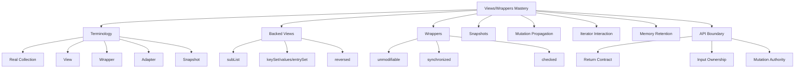
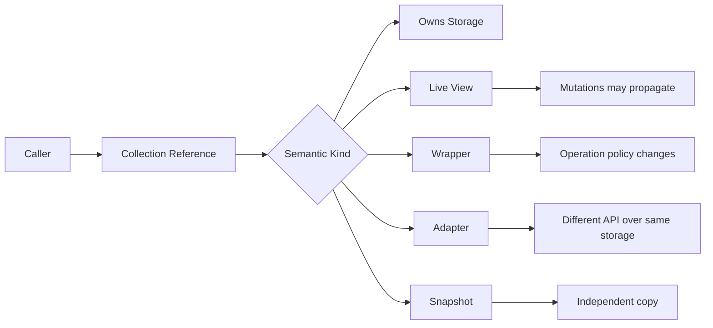
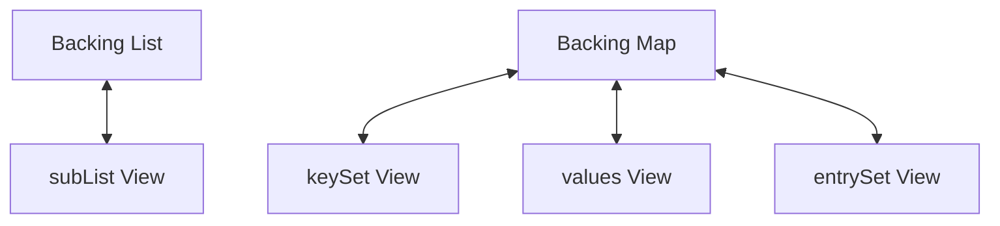
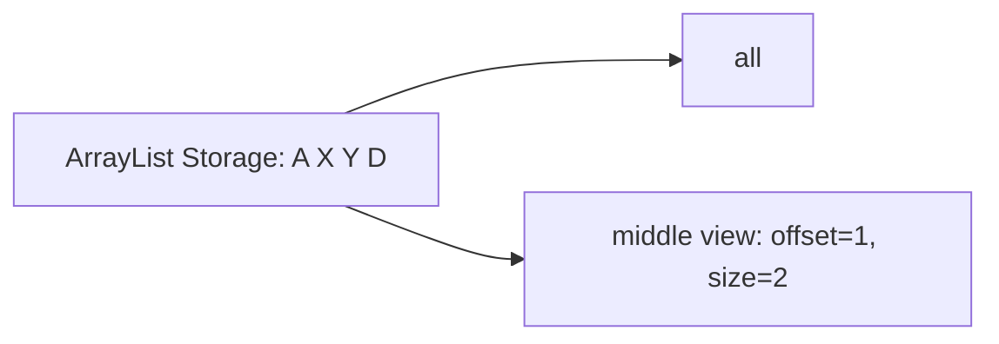
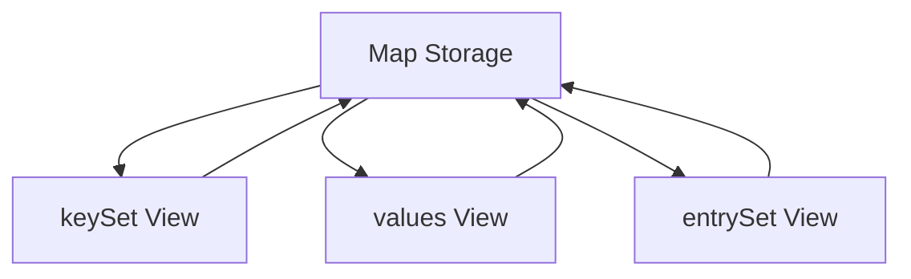
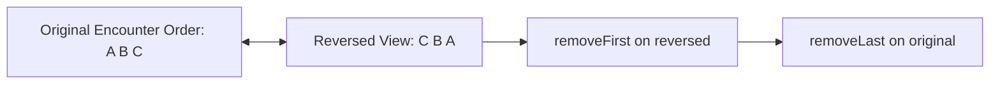
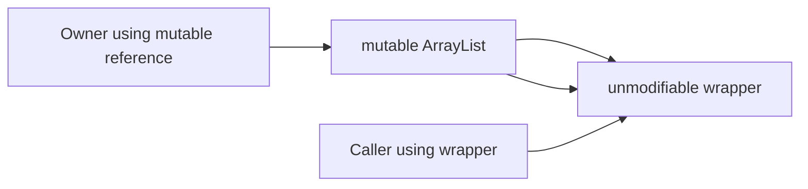
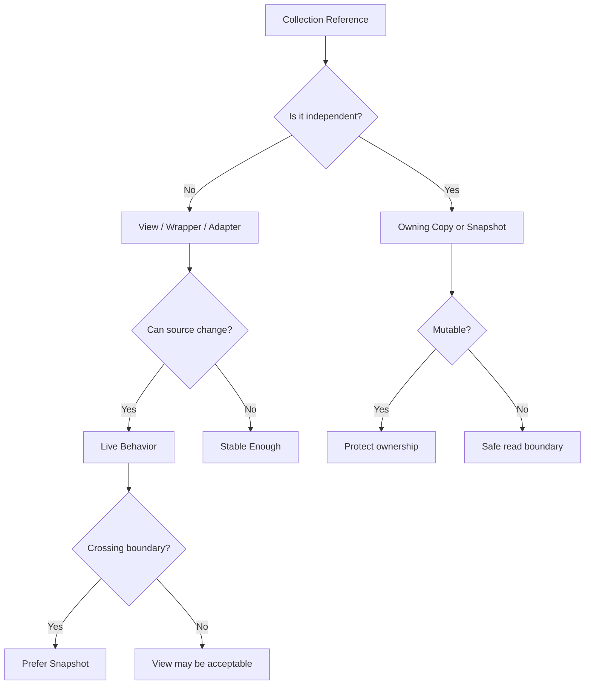

# Part 015 — Views, Wrappers, and Backed Collections

> Target: setelah bagian ini, kamu mampu membedakan **real collection**, **view**, **wrapper**, **backed view**, **adapter**, dan **snapshot** secara presisi, lalu mendesain boundary collection yang tidak menyembunyikan mutation propagation, memory retention, atau invalid iterator behavior.

Banyak bug Java Collections tidak muncul dari `ArrayList`, `HashMap`, atau `HashSet` secara langsung. Bug sering muncul dari objek collection yang **kelihatannya seperti collection biasa**, padahal secara semantik adalah:

- view ke collection lain,
- wrapper yang membatasi operasi,
- adapter dari array,
- snapshot hasil copy,
- reversed view,
- map view,
- range view,
- atau collection dengan backing storage yang masih hidup di tempat lain.

Masalahnya: semua ini tetap menggunakan interface yang sama seperti `List`, `Set`, `Map`, `Collection`, atau `SequencedCollection`. Karena type-nya sama, semantiknya harus dibaca dari dokumentasi dan kontrak implementasi, bukan dari nama interface saja.

Bagian ini membangun kemampuan membaca **hidden coupling** dalam collection code.

---

## 1. Posisi Part Ini dalam Framework Kaufman



Kaufman-style decomposition:

| Practice Block | Skill | Observable Ability |
|---:|---|---|
| 30 menit | Vocabulary | Bisa menjelaskan view vs wrapper vs snapshot tanpa rancu |
| 45 menit | Backed view tracing | Bisa memprediksi perubahan apa yang terlihat di object lain |
| 45 menit | Wrapper behavior | Bisa menilai apakah wrapper mencegah mutation atau hanya membatasi access path tertentu |
| 45 menit | Map view reasoning | Bisa menjelaskan efek `keySet().remove`, `entrySet().iterator().remove`, dan `entry.setValue` |
| 45 menit | Memory retention | Bisa mendeteksi view kecil yang menahan object besar tetap reachable |
| 60 menit | API boundary | Bisa merancang return/input contract yang tidak bocor aliasing |

---

## 2. Core Mental Model

Collection-like object di Java bisa memiliki beberapa bentuk storage semantics:



A reference of type `List<Order>` does **not** tell you whether:

- it owns its own internal array,
- it is a `subList` view,
- it is `Arrays.asList(array)`,
- it is `Collections.unmodifiableList(backingList)`,
- it is `List.copyOf(source)`,
- it is a reversed view from a sequenced collection,
- or it is a custom list backed by a database cursor, cache page, off-heap memory, or framework object.

The interface gives behavior expectations. The concrete object determines storage and mutation semantics.

---

## 3. Terminology That Must Be Precise

### 3.1 Real / Owning Collection

An owning collection has its own storage authority.

Example:

```java
List<String> names = new ArrayList<>();
names.add("Ayu");
names.add("Bima");
```

`names` owns its mutable internal storage. Other references may alias the same object, but the collection is not merely a projection over another collection.

Important: “owning” here is a design-level concept, not an official interface marker. Java does not expose an `OwnsStorage` interface.

### 3.2 View

A view is a collection-like object whose contents are derived from another object and remain linked to it.

Examples:

```java
List<String> page = names.subList(0, 10);
Set<String> keys = map.keySet();
Collection<User> values = map.values();
Set<Map.Entry<String, User>> entries = map.entrySet();
SequencedCollection<String> reversed = sequenced.reversed();
```

A view is usually cheap to create because it does not copy all elements. The trade-off is hidden coupling.

### 3.3 Backed View

A backed view is a live view backed by another collection or map.



Mutations can propagate in one or both directions depending on operation support.

### 3.4 Wrapper

A wrapper delegates to another collection but changes visible behavior.

Examples:

```java
List<String> readonly = Collections.unmodifiableList(names);
List<String> sync = Collections.synchronizedList(names);
List<String> checked = Collections.checkedList(names, String.class);
```

The wrapper usually does not copy data. It controls access through that wrapper reference only.

### 3.5 Adapter

An adapter presents one abstraction over another storage form.

Classic example:

```java
String[] array = {"A", "B", "C"};
List<String> list = Arrays.asList(array);
```

The returned list is fixed-size and backed by the array. `set` writes through; `add` and `remove` are unsupported.

### 3.6 Snapshot

A snapshot is an independent representation of contents at a point in time.

```java
List<String> snapshot = List.copyOf(names);
List<String> mutableSnapshot = new ArrayList<>(names);
```

A snapshot is detached from future structural changes to the original collection. It may still share references to mutable elements.

---

## 4. Semantic Matrix

| Kind | Copies Elements? | Live Link? | Can Mutate Through It? | Future Source Changes Visible? | Typical Use |
|---|---:|---:|---:|---:|---|
| `new ArrayList<>(source)` | Yes, shallow | No | Yes | No | Mutable working copy |
| `List.copyOf(source)` | Usually yes or reuse if safe | No semantic live link | No | No | Immutable boundary snapshot |
| `Collections.unmodifiableList(source)` | No | Yes | No through wrapper | Yes | Read-only view over live data |
| `source.subList(a, b)` | No | Yes | Often yes | Yes, with caveats | Range operation |
| `map.keySet()` | No | Yes | Remove usually yes, add no | Yes | Key-oriented map mutation/read |
| `Arrays.asList(array)` | No | Yes to array | `set` yes, size mutation no | Yes | Array/list adapter |
| `sequenced.reversed()` | No | Yes | Depends on backing | Yes | Reverse-order view |

The most important question is not “is this collection mutable?” but:

> Through which reference can mutation happen, and who observes it?

---

## 5. Backed Views: Cheap but Coupled

A backed view is often useful because it avoids copying. But it also means that two objects now represent overlapping state.

```java
List<String> all = new ArrayList<>(List.of("A", "B", "C", "D"));
List<String> middle = all.subList(1, 3);

middle.set(0, "X");
System.out.println(all);    // [A, X, C, D]

all.set(2, "Y");
System.out.println(middle); // [X, Y]
```

The view is not a separate list. It is a window over the original list.

Mental model:



The view remembers an offset and size, then delegates operations back to the backing list.

---

## 6. `subList`: The Most Common Range View Trap

`List.subList(fromIndex, toIndex)` returns a view of a portion of the list.

Correct use:

```java
List<Order> firstPageView = orders.subList(0, Math.min(50, orders.size()));
```

But a `subList` is not a defensive copy.

If you want a detached page:

```java
List<Order> firstPageSnapshot = new ArrayList<>(
    orders.subList(0, Math.min(50, orders.size()))
);
```

If you want an unmodifiable detached page:

```java
List<Order> firstPage = List.copyOf(
    orders.subList(0, Math.min(50, orders.size()))
);
```

### 6.1 Structural Modification Risk

A structural modification is a change that alters size or otherwise disturbs iteration/index structure.

Example:

```java
List<String> all = new ArrayList<>(List.of("A", "B", "C", "D"));
List<String> middle = all.subList(1, 3);

all.add("E");

// Behavior of using middle after unrelated structural modification
// may fail depending on implementation.
System.out.println(middle.size());
```

In production, do not keep a `subList` view long-lived while the backing list continues to evolve. Treat it as a short-lived operational tool.

### 6.2 `subList().clear()` Pattern

`subList` can be useful for range deletion:

```java
list.subList(fromInclusive, toExclusive).clear();
```

This is more expressive than loop deletion and lets the implementation remove a range.

But it still mutates the backing list.

### 6.3 Memory Retention Trap

A tiny view can keep a much larger backing collection reachable.

```java
List<byte[]> huge = loadHugePayloads();
List<byte[]> firstTen = huge.subList(0, 10);
return firstTen;
```

If `firstTen` is a view, the original `huge` list may remain reachable through the view. The elements outside the view may remain retained because the backing storage remains retained.

Safer boundary:

```java
return List.copyOf(huge.subList(0, 10));
```

This still shares the first ten element references, but it does not retain the backing list structure.

---

## 7. Map Views: `keySet`, `values`, `entrySet`

`Map` exposes three core views:

```java
Set<K> keySet();
Collection<V> values();
Set<Map.Entry<K, V>> entrySet();
```

They are not independent collections. They are backed by the map.



### 7.1 `keySet` View

```java
Map<String, Integer> counts = new HashMap<>();
counts.put("A", 1);
counts.put("B", 2);

Set<String> keys = counts.keySet();
keys.remove("A");

System.out.println(counts); // {B=2}
```

Removing from `keySet` removes the corresponding mapping.

But adding to `keySet` is generally unsupported because a key alone is not enough to create a map entry. There is no value.

### 7.2 `values` View

```java
Collection<Integer> values = counts.values();
values.remove(2);
```

Removing a value removes one corresponding mapping. This can be ambiguous when multiple keys map to equal values.

Example:

```java
Map<String, Integer> m = new LinkedHashMap<>();
m.put("a", 1);
m.put("b", 1);

m.values().remove(1);
System.out.println(m); // one of the mappings is removed according to iteration order
```

Production warning: avoid using `values().remove(value)` when value duplicates matter. Prefer explicit key-based removal.

### 7.3 `entrySet` View

`entrySet` is the most powerful map view.

```java
for (Map.Entry<String, Integer> entry : counts.entrySet()) {
    if (entry.getValue() < 0) {
        entry.setValue(0);
    }
}
```

`Map.Entry.setValue` may write through to the backing map, depending on the implementation and entry type. Entries from unmodifiable maps or immutable factories may reject mutation.

Rule:

> Treat `Map.Entry` as a live handle unless you explicitly snapshot it.

Snapshot example:

```java
List<Map.Entry<String, Integer>> snapshot = counts.entrySet()
    .stream()
    .map(e -> Map.entry(e.getKey(), e.getValue()))
    .toList();
```

`Map.entry` creates an unmodifiable entry-like value suitable for snapshot-style usage.

---

## 8. Sequenced Views and `reversed()`

Since Java 21, sequenced collection interfaces make encounter order explicit.

Typical pattern:

```java
SequencedCollection<String> events = new ArrayList<>(List.of("A", "B", "C"));
SequencedCollection<String> reverse = events.reversed();

System.out.println(reverse); // [C, B, A]
```

The key point: `reversed()` is a view, not necessarily a copy.

Mutation direction can be surprising:

```java
SequencedCollection<String> events = new ArrayList<>(List.of("A", "B", "C"));
SequencedCollection<String> reverse = events.reversed();

reverse.removeFirst();
System.out.println(events); // removes the original last element
```

Mental model:



When designing APIs, avoid returning a reversed live view if the caller might retain it and expect it to be stable.

Use a snapshot if needed:

```java
List<Event> latestFirst = List.copyOf(events.reversed());
```

---

## 9. Wrapper Collections

The `Collections` utility class provides wrappers that delegate to a backing collection while changing behavior.

Common wrapper families:

- unmodifiable wrappers,
- synchronized wrappers,
- checked wrappers,
- empty/singleton/nCopies factories,
- reverse/comparator helpers,
- legacy compatibility helpers.

### 9.1 Unmodifiable Wrappers

```java
List<String> mutable = new ArrayList<>();
List<String> readonly = Collections.unmodifiableList(mutable);

mutable.add("A");
System.out.println(readonly); // [A]

readonly.add("B"); // UnsupportedOperationException
```

The wrapper blocks mutation through `readonly`, but it does not freeze the backing list.

This is often misunderstood.



The wrapper is a read-only lens, not an immutable value.

### 9.2 Why Unmodifiable Wrapper Can Still Be Useful

It is useful when:

- the owner keeps mutation authority,
- readers should not mutate directly,
- the live view behavior is intentional,
- updates should become visible to readers,
- copying would be too expensive.

Example: internal registry exposing current state:

```java
final class HandlerRegistry {
    private final List<Handler> handlers = new ArrayList<>();
    private final List<Handler> publicView = Collections.unmodifiableList(handlers);

    public List<Handler> handlers() {
        return publicView;
    }

    public void register(Handler handler) {
        handlers.add(Objects.requireNonNull(handler));
    }
}
```

The API must document that `handlers()` is a live read-only view.

### 9.3 Synchronized Wrappers

```java
List<String> sync = Collections.synchronizedList(new ArrayList<>());
```

This serializes individual method calls on the wrapper. It does not magically make compound operations atomic unless the caller follows the wrapper's synchronization protocol.

Example of unsafe compound logic:

```java
if (!sync.contains("A")) {
    sync.add("A");
}
```

The check and add are two separate operations. Another thread can interleave. This part does not deep dive concurrency, but from a collection semantics perspective the invariant is:

> A synchronized wrapper controls individual method entry, not business transaction semantics.

For iteration, external synchronization is often required according to wrapper documentation.

### 9.4 Checked Wrappers

Checked wrappers enforce runtime type safety for dynamically typed interaction points.

```java
List raw = new ArrayList();
List<String> checked = Collections.checkedList(raw, String.class);
checked.add("safe");
raw.add(123); // can still corrupt through raw alias
```

Checked wrappers are useful at unsafe boundaries, especially when dealing with legacy raw types. They do not protect against mutation through aliases that bypass the wrapper.

---

## 10. Adapter: `Arrays.asList`

`Arrays.asList(array)` is one of the most important adapter examples.

```java
String[] array = {"A", "B", "C"};
List<String> list = Arrays.asList(array);

list.set(1, "X");
System.out.println(Arrays.toString(array)); // [A, X, C]

list.add("D"); // UnsupportedOperationException
```

It is:

- list-shaped,
- fixed-size,
- backed by the array,
- mutable by replacement through `set`,
- not structurally mutable.

If you need a mutable independent list:

```java
List<String> mutable = new ArrayList<>(Arrays.asList(array));
```

If you need an unmodifiable snapshot:

```java
List<String> snapshot = List.of(array);      // varargs snapshot-like factory
List<String> copy = List.copyOf(Arrays.asList(array));
```

Be careful with primitive arrays:

```java
int[] numbers = {1, 2, 3};
List<int[]> oneElement = Arrays.asList(numbers);
```

This is a `List<int[]>` with one element, not a `List<Integer>`.

---

## 11. Snapshot vs View: Boundary Decision

When returning data from a class, choose intentionally.

### 11.1 Return Live Read-Only View

```java
public List<Rule> rules() {
    return Collections.unmodifiableList(rules);
}
```

Use when:

- the object owns mutation,
- callers should observe updates,
- the returned object is not retained across uncertain lifecycle,
- the live nature is documented.

### 11.2 Return Immutable Snapshot

```java
public List<Rule> rules() {
    return List.copyOf(rules);
}
```

Use when:

- callers need stable data,
- you do not want backing collection retained,
- caller should not observe future mutation,
- audit/debug reproducibility matters,
- mutation authority must not leak.

### 11.3 Return Mutable Copy

```java
public List<Rule> mutableRulesCopy() {
    return new ArrayList<>(rules);
}
```

Use when:

- caller needs to mutate their own copy,
- changes must not affect owner,
- mutability is explicitly part of contract.

Naming should make this clear. `getRules()` is ambiguous. `rulesSnapshot()`, `rulesView()`, and `mutableRulesCopy()` are better in high-risk code.

---

## 12. Mutation Propagation Reasoning

For any collection reference, ask four questions:

1. Can I mutate through this reference?
2. Can another reference mutate the same storage?
3. Will changes elsewhere become visible here?
4. Can using this reference after external mutation fail?

Example:

```java
final class Batch {
    private final List<Item> items;

    Batch(List<Item> items) {
        this.items = items.subList(0, Math.min(100, items.size()));
    }

    List<Item> items() {
        return items;
    }
}
```

This class stores a live range view. If the caller later structurally modifies the original list, `Batch.items()` can become unstable.

Safer:

```java
final class Batch {
    private final List<Item> items;

    Batch(List<Item> source) {
        this.items = List.copyOf(source.subList(0, Math.min(100, source.size())));
    }

    List<Item> items() {
        return items;
    }
}
```

Now `Batch` owns a stable shallow snapshot.

---

## 13. Iterator Interaction with Backed Views

Views and iterators interact through structural modification rules.

Example:

```java
List<String> list = new ArrayList<>(List.of("A", "B", "C"));
List<String> view = list.subList(0, 2);

Iterator<String> it = view.iterator();
list.add("D");

it.next(); // may throw ConcurrentModificationException
```

Important: fail-fast behavior is a bug detection mechanism, not a business-level correctness guarantee.

The safe rule:

> Do not mutate backing storage while iterating over its view unless the view/iterator explicitly supports that mutation path.

Correct mutation through iterator:

```java
Iterator<String> it = list.iterator();
while (it.hasNext()) {
    String value = it.next();
    if (value.startsWith("tmp-")) {
        it.remove();
    }
}
```

For map:

```java
Iterator<Map.Entry<String, User>> it = users.entrySet().iterator();
while (it.hasNext()) {
    Map.Entry<String, User> entry = it.next();
    if (entry.getValue().inactive()) {
        it.remove(); // removes map entry
    }
}
```

---

## 14. Hidden Coupling in Domain Code

Bad domain object:

```java
final class CaseFile {
    private final List<Document> documents;

    CaseFile(List<Document> documents) {
        this.documents = documents;
    }

    List<Document> documents() {
        return documents;
    }
}
```

Problems:

- constructor stores caller-owned list,
- getter returns internal mutable list,
- caller and object share mutation authority,
- invariants can be violated after construction,
- no stable audit point.

Better:

```java
final class CaseFile {
    private final List<Document> documents;

    CaseFile(List<Document> documents) {
        this.documents = List.copyOf(documents);
    }

    List<Document> documents() {
        return documents;
    }
}
```

If the domain object must support mutation, centralize it:

```java
final class CaseFile {
    private final List<Document> documents = new ArrayList<>();

    void addDocument(Document document) {
        documents.add(validate(document));
    }

    List<Document> documents() {
        return List.copyOf(documents);
    }
}
```

Now invariants pass through controlled methods.

---

## 15. Views in Enterprise Data Pipelines

Consider a pipeline:

```java
List<Record> records = loadRecords();
List<Record> valid = records.subList(0, validCount);
process(valid);
archive(records);
```

This can be fine if `valid` is short-lived and `process` does not retain it.

But if `process` stores the list, schedules async work, or returns it to another module, the view boundary becomes unsafe.

Safer policy:

| Situation | Recommended Boundary |
|---|---|
| Internal short-lived range operation | `subList` view |
| Return page to API caller | `List.copyOf(subList)` |
| Store inside domain object | `List.copyOf` or validated owning copy |
| Mutate range in same method | `subList(...).clear()` or local view |
| Cross-thread or async handoff | stable snapshot |
| Audit/reporting | deterministic snapshot |

---

## 16. Anti-Pattern: “Unmodifiable Means Immutable”

Bad assumption:

```java
List<String> exposed = Collections.unmodifiableList(internal);
```

Then saying: “This list is immutable.”

Correct statement:

> This reference is an unmodifiable view. The backing collection can still change through other references.

Example:

```java
List<String> internal = new ArrayList<>();
List<String> exposed = Collections.unmodifiableList(internal);

internal.add("A");
System.out.println(exposed); // [A]
```

For stable immutability boundary:

```java
List<String> exposed = List.copyOf(internal);
```

Even then, element objects may still be mutable.

---

## 17. Anti-Pattern: Returning `map.values()` from Public API

Bad:

```java
public Collection<User> users() {
    return usersById.values();
}
```

Problems:

- caller receives live map view,
- removal from values can remove map entries,
- future map changes visible,
- order may be unspecified depending on map implementation,
- memory retains map,
- caller may assume it is independent.

Better options:

```java
public List<User> usersSnapshot() {
    return List.copyOf(usersById.values());
}
```

or:

```java
public Collection<User> usersView() {
    return Collections.unmodifiableCollection(usersById.values());
}
```

The second option still returns a live view. Name and docs must say so.

---

## 18. Anti-Pattern: Using Views as Cache Values

Bad:

```java
cache.put(customerId, orders.subList(0, 10));
```

This caches a view, not a stable result.

Risks:

- backing list retained,
- backing list mutation affects cached value,
- cached value may fail after structural modification,
- debugging becomes difficult because cache contents are not independent.

Better:

```java
cache.put(customerId, List.copyOf(orders.subList(0, Math.min(10, orders.size()))));
```

---

## 19. Anti-Pattern: `entrySet` Escape

Bad:

```java
public Set<Map.Entry<String, Rule>> rules() {
    return rulesByCode.entrySet();
}
```

This exposes live entries. A caller may mutate values via `setValue` or remove mappings through iterator.

Safer:

```java
public Map<String, Rule> rulesSnapshot() {
    return Map.copyOf(rulesByCode);
}
```

or:

```java
public List<RuleView> ruleViews() {
    return rulesByCode.entrySet().stream()
        .map(e -> new RuleView(e.getKey(), e.getValue().summary()))
        .toList();
}
```

Public API should expose the semantic object needed by callers, not internal map mechanics.

---

## 20. Anti-Pattern: Holding a Reversed View as State

Bad:

```java
final class Timeline {
    private final SequencedCollection<Event> latestFirst;

    Timeline(SequencedCollection<Event> events) {
        this.latestFirst = events.reversed();
    }
}
```

This stores a view over caller-owned data.

Better:

```java
final class Timeline {
    private final List<Event> latestFirst;

    Timeline(SequencedCollection<Event> events) {
        this.latestFirst = List.copyOf(events.reversed());
    }
}
```

If updates should be live, own the backing collection and expose views intentionally.

---

## 21. API Design Rules

### Rule 1 — Never Expose Internal Mutable Collections Accidentally

Bad:

```java
public List<Item> items() {
    return items;
}
```

Good snapshot:

```java
public List<Item> items() {
    return List.copyOf(items);
}
```

Good live read-only view:

```java
private final List<Item> itemsView = Collections.unmodifiableList(items);

public List<Item> itemsView() {
    return itemsView;
}
```

### Rule 2 — Constructor Should Declare Ownership Transfer or Copy

If constructor stores a reference directly, say ownership is transferred and caller must not mutate. But this is fragile in Java.

Prefer:

```java
this.items = List.copyOf(items);
```

or:

```java
this.items = new ArrayList<>(items);
```

depending on whether internal mutation is needed.

### Rule 3 — Name Live Views Honestly

Prefer:

```java
rulesView()
currentHandlersView()
entriesLiveView()
```

over ambiguous names when view semantics matter.

### Rule 4 — Snapshot Before Crossing Boundaries

Crossing boundaries include:

- public API return,
- async handoff,
- thread handoff,
- cache store,
- audit event,
- persistence event,
- message publication,
- domain aggregate construction.

Use snapshot semantics unless live semantics are intentional.

### Rule 5 — Document Order, Mutability, Null, and Stability

A collection-returning API should answer:

- Is order guaranteed?
- Can caller mutate returned collection?
- Can returned collection change later?
- Are elements mutable?
- Are nulls possible?
- Is it a snapshot or live view?

---

## 22. Performance Trade-Offs

Views and wrappers exist because copying is not always acceptable.

| Design | Pros | Cons |
|---|---|---|
| View | Cheap, no allocation of elements, live | Coupling, retention, invalidation |
| Wrapper | Cheap, policy control | Alias bypass, live changes |
| Snapshot | Stable, safe boundary | Copy cost, shallow only |
| Mutable copy | Caller freedom | More allocation, potential divergence |

Top 1% collection work is not “always copy” or “never copy”. It is choosing where stability is required.

Common heuristic:

- internal method-local operation: view is fine,
- object state: copy or own,
- public return: snapshot unless live view documented,
- cache/audit/event: snapshot,
- high-volume hot path: measure view vs copy.

---

## 23. Failure Modeling Checklist

When reviewing collection code, look for these smells:

- `subList` stored in field,
- `subList` returned from public method,
- `map.values()` returned directly,
- `entrySet()` exposed publicly,
- `Collections.unmodifiableX` called on caller-owned mutable collection,
- `Arrays.asList` followed by `add`/`remove`,
- `values().remove` with duplicate values,
- `entry.setValue` in code where map immutability is expected,
- reversed view stored long-term,
- `keySet` mutation from outside owner,
- tiny page view retaining huge source list,
- wrapper used as if it protected against all aliases,
- external mutation while iterating over view.

---

## 24. Code Review Heuristics

Ask these questions in review:

1. Is this collection independent or backed?
2. Is the returned object stable over time?
3. Who owns mutation authority?
4. Are we exposing map internals through views?
5. Could this view retain too much memory?
6. Could caller observe future changes unexpectedly?
7. Could caller mutate internal state indirectly?
8. Is the order contract explicit?
9. Is shallow immutability enough?
10. Is copying cost acceptable at this boundary?

---

## 25. Practice: Diagnose the Semantics

For each snippet, classify it as owning collection, view, wrapper, adapter, or snapshot.

```java
List<String> a = new ArrayList<>(source);
List<String> b = Collections.unmodifiableList(source);
List<String> c = source.subList(0, 10);
List<String> d = List.copyOf(source);
List<String> e = Arrays.asList(array);
Collection<User> f = usersById.values();
SequencedCollection<Event> g = events.reversed();
```

Expected:

| Variable | Classification |
|---|---|
| `a` | mutable shallow snapshot / owning copy |
| `b` | unmodifiable live wrapper |
| `c` | backed range view |
| `d` | unmodifiable shallow snapshot |
| `e` | fixed-size array-backed adapter |
| `f` | map-backed values view |
| `g` | reversed live view |

---

## 26. Practice: Refactor Unsafe API

Original:

```java
final class RuleCatalog {
    private final Map<String, Rule> rulesByCode;

    RuleCatalog(Map<String, Rule> rulesByCode) {
        this.rulesByCode = rulesByCode;
    }

    Collection<Rule> rules() {
        return rulesByCode.values();
    }
}
```

Problems:

- stores caller-owned map,
- exposes live values view,
- no order contract,
- no mutation authority control,
- no null policy,
- `Rule` mutability unknown.

Refactor:

```java
final class RuleCatalog {
    private final Map<String, Rule> rulesByCode;
    private final List<Rule> rulesInDeterministicOrder;

    RuleCatalog(Map<String, Rule> source) {
        Objects.requireNonNull(source, "source");

        Map<String, Rule> copy = new TreeMap<>();
        for (Map.Entry<String, Rule> entry : source.entrySet()) {
            String code = Objects.requireNonNull(entry.getKey(), "rule code");
            Rule rule = Objects.requireNonNull(entry.getValue(), "rule");
            copy.put(code, rule);
        }

        this.rulesByCode = Map.copyOf(copy);
        this.rulesInDeterministicOrder = List.copyOf(copy.values());
    }

    Optional<Rule> findByCode(String code) {
        return Optional.ofNullable(rulesByCode.get(code));
    }

    List<Rule> rulesInCodeOrder() {
        return rulesInDeterministicOrder;
    }
}
```

Design notes:

- `TreeMap` used only to create deterministic code order.
- `Map.copyOf` creates unmodifiable snapshot semantics.
- `List.copyOf` freezes ordered view result.
- Public API no longer exposes internal map views.

---

## 27. Production Decision Matrix

| Need | Prefer | Avoid |
|---|---|---|
| Stable API result | `List.copyOf`, `Set.copyOf`, `Map.copyOf` | returning `subList`, `values`, `entrySet` |
| Mutable working data | `new ArrayList<>(source)` | mutating caller-owned list accidentally |
| Read-only live state | `Collections.unmodifiableX` with clear docs | calling it immutable |
| Range delete | `list.subList(a, b).clear()` | manual index removal loop |
| Page response | `List.copyOf(list.subList(...))` | returning raw `subList` |
| Map key iteration | `map.keySet()` local use | exposing `keySet` publicly |
| Map updates by entry | `entrySet` local use | leaking live entries |
| Reverse traversal | `reversed()` local view | storing reversed view from caller-owned collection |
| Cache result | snapshot | backed view |

---

## 28. Mini Case Study: Enforcement Case Queue

Suppose you have enforcement cases loaded by priority:

```java
List<CaseFile> cases = repository.loadOpenCases();
List<CaseFile> top = cases.subList(0, Math.min(100, cases.size()));
queueService.enqueue(top);
```

Question: is this safe?

It depends on `enqueue`.

If `enqueue` consumes immediately and does not retain:

```java
void enqueue(List<CaseFile> cases) {
    for (CaseFile c : cases) {
        queue.add(c.id());
    }
}
```

View is fine.

If `enqueue` stores it:

```java
void enqueue(List<CaseFile> cases) {
    this.pending = cases;
}
```

Unsafe. The service now stores a range view of a caller-owned list.

Better caller-side boundary:

```java
List<CaseFile> top = List.copyOf(
    cases.subList(0, Math.min(100, cases.size()))
);
queueService.enqueue(top);
```

Better callee-side boundary:

```java
void enqueue(Collection<CaseFile> cases) {
    this.pending = List.copyOf(cases);
}
```

For enterprise code, the callee should usually defend its own invariants.

---

## 29. MDX Mermaid Summary



---

## 30. Mastery Checklist

You are ready to move on when you can:

- explain why `Collections.unmodifiableList` is not the same as `List.copyOf`,
- predict mutation propagation for `subList`, `keySet`, `values`, and `entrySet`,
- identify when `Arrays.asList` is fixed-size and array-backed,
- decide when a live view is acceptable,
- decide when a snapshot is required,
- detect view-based memory retention,
- avoid exposing `Map.Entry` views from public APIs,
- write constructor/getter boundaries with clear ownership semantics,
- document order, mutability, and stability of collection-returning methods.

---

## 31. References

- Java SE 25 API — `java.util.Collections`: `https://docs.oracle.com/en/java/javase/25/docs/api/java.base/java/util/Collections.html`
- Java SE 25 API — `java.util.List`: `https://docs.oracle.com/en/java/javase/25/docs/api/java.base/java/util/List.html`
- Java SE 25 API — `java.util.Map`: `https://docs.oracle.com/en/java/javase/25/docs/api/java.base/java/util/Map.html`
- Java SE 25 API — `java.util.Arrays`: `https://docs.oracle.com/en/java/javase/25/docs/api/java.base/java/util/Arrays.html`
- JEP 431 — Sequenced Collections: `https://openjdk.org/jeps/431`
