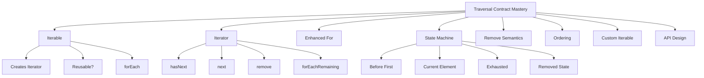
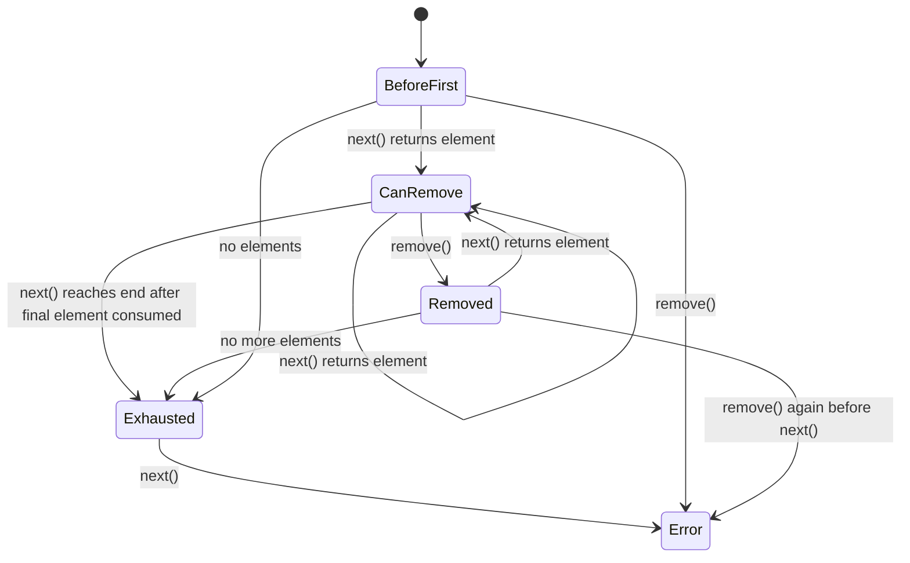
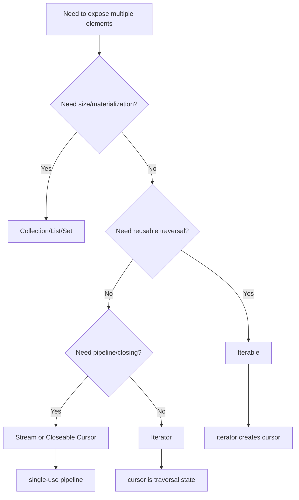

# Part 016 — Iterable and Iterator: The Traversal Contract

> Target: setelah bagian ini, kamu mampu memodelkan `Iterable` dan `Iterator` sebagai **kontrak traversal berbasis state machine**, memilih return type traversal yang tepat, menulis custom iterable yang benar, dan menghindari bug mutation, cursor, single-use, ordering, serta resource lifecycle.

Di Java, traversal sering terlihat sederhana:

```java
for (Order order : orders) {
    process(order);
}
```

Tapi di balik syntax itu ada kontrak penting:

- siapa yang membuat traversal state?
- apakah traversal bisa diulang?
- apakah order dijamin?
- apakah source boleh berubah saat traversal?
- apakah `remove()` didukung?
- apakah `next()` boleh dipanggil tanpa `hasNext()`?
- apakah traversal membawa resource?
- apakah return type seharusnya `Iterable`, `Iterator`, `Collection`, atau `Stream`?

Part ini membedah kontrak traversal dari bawah, karena `Iterator` adalah jembatan mental menuju `Spliterator` dan Stream di part berikutnya.

---

## 1. Posisi Part Ini dalam Framework Kaufman



Kaufman-style practice:

| Practice Block | Skill | Observable Ability |
|---:|---|---|
| 30 menit | Interface separation | Bisa menjelaskan `Iterable` vs `Iterator` |
| 45 menit | State machine | Bisa menggambar cursor state dan legal method sequence |
| 45 menit | Enhanced-for | Bisa menjelaskan desugaring `for-each` |
| 45 menit | Mutation during traversal | Bisa memakai `Iterator.remove` dengan benar |
| 45 menit | Custom iterable | Bisa membuat iterable reusable dan single-pass secara sadar |
| 45 menit | API return type | Bisa memilih `Iterable`, `Collection`, `Iterator`, atau `Stream` berdasarkan semantic need |
| 45 menit | Failure modeling | Bisa diagnosis `NoSuchElementException`, `IllegalStateException`, `UnsupportedOperationException`, dan `ConcurrentModificationException` |

---

## 2. The Core Split: `Iterable` vs `Iterator`

`Iterable<T>` means:

> “This object can provide an iterator.”

`Iterator<T>` means:

> “This object is the current traversal state.”

That difference is fundamental.

```java
Iterable<Order> orders = orderBook;
Iterator<Order> cursor = orders.iterator();
```

Mental model:

```mermaid
flowchart LR
    A[Iterable Source] -->|iterator()| B[Iterator Cursor 1]
    A -->|iterator()| C[Iterator Cursor 2]
    A -->|iterator()| D[Iterator Cursor 3]
```

A well-behaved collection-like `Iterable` usually creates a new independent iterator each time.

An `Iterator` itself is usually one-time-use.

---

## 3. `Iterable<T>` Contract

The minimal contract:

```java
public interface Iterable<T> {
    Iterator<T> iterator();
}
```

Modern `Iterable` also has default traversal helpers:

```java
default void forEach(Consumer<? super T> action)
default Spliterator<T> spliterator()
```

Important semantic points:

- `iterator()` supplies traversal state.
- `forEach` is implemented in terms of traversal.
- `spliterator()` provides a bridge toward stream-like traversal and partitioning.
- Ordering is only guaranteed if the implementing class specifies an iteration order.

Example:

```java
void printAll(Iterable<String> values) {
    for (String value : values) {
        System.out.println(value);
    }
}
```

This method only needs traversal. It does not need size, random access, mutation, uniqueness, or map lookup. `Iterable` is a good input type.

---

## 4. `Iterator<T>` Contract

The core methods:

```java
boolean hasNext();
T next();
default void remove();
default void forEachRemaining(Consumer<? super T> action);
```

Operational meaning:

| Method | Meaning |
|---|---|
| `hasNext()` | Ask whether another element is available |
| `next()` | Advance cursor and return the next element |
| `remove()` | Remove the last element returned by this iterator, if supported |
| `forEachRemaining()` | Consume all remaining elements with an action |

`Iterator` is not a collection. It is not reusable. It usually has internal cursor state.

---

## 5. Iterator as State Machine

Think of an iterator as a small state machine.



More practically:

- `next()` advances.
- `remove()` refers to the last returned element.
- `remove()` cannot be called before `next()`.
- `remove()` cannot usually be called twice for the same returned element.
- `next()` after exhaustion throws `NoSuchElementException`.
- `remove()` may throw `UnsupportedOperationException` if not supported.

Correct pattern:

```java
Iterator<Order> it = orders.iterator();
while (it.hasNext()) {
    Order order = it.next();
    if (order.isCancelled()) {
        it.remove();
    }
}
```

Incorrect pattern:

```java
Iterator<Order> it = orders.iterator();
it.remove(); // IllegalStateException
```

Incorrect pattern:

```java
Iterator<Order> it = orders.iterator();
Order order = it.next();
it.remove();
it.remove(); // IllegalStateException
```

---

## 6. `hasNext()` Is a Query, `next()` Is a State Transition

This distinction matters.

```java
while (it.hasNext()) {
    T value = it.next();
}
```

`hasNext()` should not advance the cursor in normal iterator design. `next()` advances.

Bad custom iterator design:

```java
@Override
public boolean hasNext() {
    current = loadNext(); // bad: advances in query method
    return current != null;
}
```

This causes repeated `hasNext()` calls to skip elements.

Correct design separates prefetch state carefully if needed:

```java
@Override
public boolean hasNext() {
    return index < values.size();
}

@Override
public T next() {
    if (!hasNext()) {
        throw new NoSuchElementException();
    }
    return values.get(index++);
}
```

If prefetch is unavoidable, model it explicitly with states: not-loaded, loaded, exhausted.

---

## 7. Enhanced For-Loop Desugaring

This:

```java
for (Order order : orders) {
    process(order);
}
```

is conceptually equivalent to:

```java
for (Iterator<Order> it = orders.iterator(); it.hasNext(); ) {
    Order order = it.next();
    process(order);
}
```

For arrays, enhanced for-loop uses index traversal conceptually, but for `Iterable`, it uses `iterator()`.

Implication:

- enhanced for-loop creates/uses an iterator,
- mutation of collection during enhanced for-loop can trigger iterator consistency issues,
- you cannot call iterator `remove()` directly in enhanced for-loop,
- if you need safe removal, use explicit iterator.

Bad:

```java
for (Order order : orders) {
    if (order.isCancelled()) {
        orders.remove(order); // unsafe for many collections during iteration
    }
}
```

Good:

```java
for (Iterator<Order> it = orders.iterator(); it.hasNext(); ) {
    Order order = it.next();
    if (order.isCancelled()) {
        it.remove();
    }
}
```

Or, for collections that support it:

```java
orders.removeIf(Order::isCancelled);
```

`removeIf` expresses collection-level removal and avoids manually managing the iterator in simple cases.

---

## 8. Iteration Order Is a Contract, Not a Side Effect

Different collection implementations provide different iteration order semantics.

Examples:

| Source | Typical Iteration Semantics |
|---|---|
| `ArrayList` | index order |
| `LinkedList` | list order |
| `LinkedHashSet` | insertion encounter order |
| `HashSet` | no stable API-level order guarantee |
| `TreeSet` | sorted order |
| `ArrayDeque` | head-to-tail order |
| `HashMap.entrySet()` | no stable API-level order guarantee |
| `LinkedHashMap.entrySet()` | insertion/access order depending configuration |
| `TreeMap.entrySet()` | key sorted order |

Top-level rule:

> If order matters to business correctness, make order part of the type/implementation choice or explicitly sort.

Bad audit code:

```java
for (String id : new HashSet<>(ids)) {
    audit.append(id).append('\n');
}
```

If audit output must be deterministic:

```java
for (String id : new TreeSet<>(ids)) {
    audit.append(id).append('\n');
}
```

or:

```java
ids.stream()
    .sorted()
    .forEach(id -> audit.append(id).append('\n'));
```

---

## 9. Single-Pass vs Reusable Traversal

A `Collection` is usually reusable:

```java
for (Order o : orders) process(o);
for (Order o : orders) audit(o);
```

An `Iterator` is single-pass:

```java
Iterator<Order> it = orders.iterator();
while (it.hasNext()) process(it.next());
while (it.hasNext()) audit(it.next()); // nothing left
```

An `Iterable` may or may not be truly reusable depending on implementation.

Bad single-pass iterable:

```java
final class SingleUseOrders implements Iterable<Order> {
    private final Iterator<Order> iterator;

    SingleUseOrders(Iterator<Order> iterator) {
        this.iterator = iterator;
    }

    @Override
    public Iterator<Order> iterator() {
        return iterator;
    }
}
```

This technically implements `Iterable`, but repeated loops share the same exhausted iterator.

Better: if it is single-use, do not pretend it is reusable unless documented clearly.

Option 1: return `Iterator` directly for one-time consumption.

```java
Iterator<Order> scanOrders();
```

Option 2: provide a reusable source factory.

```java
Iterable<Order> orders() {
    return () -> repository.loadOrders().iterator();
}
```

Option 3: expose `Stream` with clear close semantics if resource-backed.

---

## 10. Custom Iterable: Correct Basic Implementation

Example: an inclusive integer range.

```java
final class IntRange implements Iterable<Integer> {
    private final int startInclusive;
    private final int endExclusive;

    IntRange(int startInclusive, int endExclusive) {
        if (endExclusive < startInclusive) {
            throw new IllegalArgumentException("endExclusive must be >= startInclusive");
        }
        this.startInclusive = startInclusive;
        this.endExclusive = endExclusive;
    }

    @Override
    public Iterator<Integer> iterator() {
        return new Iterator<>() {
            private int current = startInclusive;

            @Override
            public boolean hasNext() {
                return current < endExclusive;
            }

            @Override
            public Integer next() {
                if (!hasNext()) {
                    throw new NoSuchElementException();
                }
                return current++;
            }
        };
    }
}
```

Properties:

- each `iterator()` call creates a new cursor,
- `hasNext()` is side-effect-free with respect to advancement,
- `next()` checks exhaustion,
- `remove()` is unsupported by default,
- traversal is deterministic.

Usage:

```java
for (int i : new IntRange(3, 7)) {
    System.out.println(i); // 3, 4, 5, 6
}
```

---

## 11. Custom Iterator with Remove Support

Implementing `remove()` correctly is harder because the iterator must know the last returned element and coordinate with backing storage.

Example over a list:

```java
final class FilteringListView<T> implements Iterable<T> {
    private final List<T> source;
    private final Predicate<? super T> predicate;

    FilteringListView(List<T> source, Predicate<? super T> predicate) {
        this.source = Objects.requireNonNull(source);
        this.predicate = Objects.requireNonNull(predicate);
    }

    @Override
    public Iterator<T> iterator() {
        return new Iterator<>() {
            private int nextIndex = 0;
            private int lastReturnedIndex = -1;
            private T nextMatch;
            private boolean nextPrepared;

            @Override
            public boolean hasNext() {
                prepareNext();
                return nextPrepared;
            }

            @Override
            public T next() {
                prepareNext();
                if (!nextPrepared) {
                    throw new NoSuchElementException();
                }
                T result = nextMatch;
                lastReturnedIndex = nextIndex - 1;
                nextMatch = null;
                nextPrepared = false;
                return result;
            }

            @Override
            public void remove() {
                if (lastReturnedIndex < 0) {
                    throw new IllegalStateException();
                }
                source.remove(lastReturnedIndex);
                nextIndex = lastReturnedIndex;
                lastReturnedIndex = -1;
            }

            private void prepareNext() {
                if (nextPrepared) {
                    return;
                }
                while (nextIndex < source.size()) {
                    T candidate = source.get(nextIndex++);
                    if (predicate.test(candidate)) {
                        nextMatch = candidate;
                        nextPrepared = true;
                        return;
                    }
                }
            }
        };
    }
}
```

This is intentionally complex. In real production code, prefer using existing collection operations unless custom traversal is truly needed.

The lesson: `remove()` is not “just delete something”. It is a cursor-state operation.

---

## 12. Iterator Exceptions and Their Meaning

| Exception | Typical Cause | Meaning |
|---|---|---|
| `NoSuchElementException` | `next()` called when exhausted | Caller advanced beyond available data |
| `IllegalStateException` | `remove()` before `next()` or twice after same `next()` | Invalid cursor state |
| `UnsupportedOperationException` | `remove()` not supported | Iterator is read-only for removal |
| `ConcurrentModificationException` | Backing collection structurally modified outside iterator | Fail-fast detection, not guaranteed synchronization |
| `NullPointerException` | action passed to `forEachRemaining` is null | Invalid callback |

These exceptions are not interchangeable. They communicate different contract violations.

---

## 13. `forEachRemaining`

`forEachRemaining` consumes all remaining elements.

```java
Iterator<Order> it = orders.iterator();

if (it.hasNext()) {
    processFirst(it.next());
}

it.forEachRemaining(this::processRest);
```

It is useful when:

- you need special handling for first element,
- then uniform handling for the rest,
- or you are adapting iterator to callback style.

Be careful with side effects. Exceptions thrown by the action propagate to the caller.

---

## 14. Iterable `forEach`

`Iterable.forEach` is callback-based traversal:

```java
orders.forEach(this::process);
```

It is concise, but it has limitations:

- checked exceptions are awkward,
- early break is awkward,
- mutation rules still apply,
- control flow is less explicit than a loop,
- stack traces may be less direct when using lambdas heavily.

Prefer explicit loops when control flow matters:

```java
for (Order order : orders) {
    if (shouldStop(order)) {
        break;
    }
    process(order);
}
```

Use `forEach` when the action is simple and total over all elements.

---

## 15. Pull-Based Traversal

Iterator is pull-based:

```java
while (it.hasNext()) {
    T item = it.next();
    consume(item);
}
```

The consumer asks for the next item.

Contrast with push-style callback:

```java
source.forEach(item -> consume(item));
```

Both can traverse the same data, but pull traversal gives the caller clearer control over:

- when to stop,
- when to remove,
- how to handle exceptions,
- how to interleave multiple iterators,
- how to consume partially.

Example: zipping two iterators manually:

```java
Iterator<A> left = lefts.iterator();
Iterator<B> right = rights.iterator();

while (left.hasNext() && right.hasNext()) {
    combine(left.next(), right.next());
}
```

Streams can express many transformations, but iterator-level control remains useful for low-level traversal logic.

---

## 16. Iterator Over Map

You do not iterate a `Map` directly because `Map` is not a `Collection` and does not implement `Iterable`.

Choose the view based on intent:

```java
for (String key : map.keySet()) {
    useKey(key);
}

for (User value : map.values()) {
    useValue(value);
}

for (Map.Entry<String, User> entry : map.entrySet()) {
    use(entry.getKey(), entry.getValue());
}
```

For performance and clarity, prefer `entrySet` when both key and value are needed.

Bad:

```java
for (String key : map.keySet()) {
    User user = map.get(key);
    use(key, user);
}
```

Better:

```java
for (Map.Entry<String, User> entry : map.entrySet()) {
    use(entry.getKey(), entry.getValue());
}
```

This avoids repeated lookup and expresses pair traversal.

---

## 17. Removing While Iterating a Map

Correct:

```java
Iterator<Map.Entry<String, User>> it = users.entrySet().iterator();
while (it.hasNext()) {
    Map.Entry<String, User> entry = it.next();
    if (entry.getValue().inactive()) {
        it.remove();
    }
}
```

Also possible:

```java
users.entrySet().removeIf(entry -> entry.getValue().inactive());
```

Avoid:

```java
for (String id : users.keySet()) {
    if (users.get(id).inactive()) {
        users.remove(id); // unsafe for many map implementations during iteration
    }
}
```

The iterator owns the traversal state. Mutate through the traversal path or use collection-level bulk operation.

---

## 18. Resource-Backed Iteration

Not all iterables are simple memory collections.

Some traversal sources may be backed by:

- database cursor,
- file lines,
- network pages,
- paginated API,
- streaming parser,
- generated sequence,
- lazy repository scan.

Plain `Iterator` has no `close()` method. This is a design problem for resource-backed traversal.

Bad API:

```java
Iterator<Row> scanRows(); // who closes DB cursor?
```

Better options:

```java
try (Stream<Row> rows = repository.scanRows()) {
    rows.forEach(this::process);
}
```

or callback style:

```java
void scanRows(Consumer<Row> consumer);
```

or explicit closeable cursor:

```java
interface RowCursor extends Iterator<Row>, AutoCloseable {
    @Override void close();
}
```

Then usage must be explicit:

```java
try (RowCursor cursor = repository.openCursor()) {
    while (cursor.hasNext()) {
        process(cursor.next());
    }
}
```

Rule:

> Use plain `Iterable` for in-memory or safely self-contained traversal. Use close-aware abstractions for resource-backed traversal.

---

## 19. Nulls During Traversal

An iterator may return `null` if the underlying collection permits nulls.

```java
List<String> values = new ArrayList<>();
values.add(null);

Iterator<String> it = values.iterator();
String value = it.next(); // null
```

Therefore, `null` from `next()` does not mean exhaustion. Exhaustion is represented by `hasNext() == false` or `NoSuchElementException` from `next()`.

Bad:

```java
while ((value = it.next()) != null) {
    process(value);
}
```

Correct:

```java
while (it.hasNext()) {
    String value = it.next();
    process(value);
}
```

If null is forbidden by your domain, validate it at boundary.

---

## 20. Iterator and Concurrency: Only the Necessary Mental Model

This series has a separate concurrency background, so here we keep it to traversal semantics.

Most standard mutable collections are not designed for arbitrary structural mutation during iteration except through iterator-supported paths.

A fail-fast iterator may throw `ConcurrentModificationException` if it detects structural modification outside the iterator.

But:

- fail-fast is not a synchronization mechanism,
- fail-fast is not guaranteed in all races,
- absence of exception does not prove correctness,
- weakly consistent iterators exist in concurrent collections,
- snapshot iterators exist in copy-on-write collections.

Part 017 will deep dive these consistency models.

For now:

> In normal mutable collections, do not structurally modify the backing collection while iterating except through the iterator or documented collection operation.

---

## 21. API Design: Return `Iterable`, `Iterator`, `Collection`, or `Stream`?

This is a high-value design decision.

### 21.1 Return `Collection<T>` When Size and Collection Semantics Matter

```java
Collection<Rule> rules();
```

Use when callers may need:

- size,
- emptiness,
- repeated traversal,
- collection operations,
- materialized data.

But be explicit about mutability.

### 21.2 Return `List<T>` When Order and Positional Semantics Matter

```java
List<Event> eventsInTimelineOrder();
```

Use when:

- order is part of contract,
- caller may need index access,
- duplicate order matters.

### 21.3 Return `Iterable<T>` When Only Traversal Is Promised

```java
Iterable<Record> records();
```

Use when:

- caller should only traverse,
- implementation may be lazy,
- size is not cheap or not meaningful,
- you want minimal surface area.

Caution: document whether traversal is reusable.

### 21.4 Return `Iterator<T>` When It Is Single-Pass Cursor State

```java
Iterator<Record> recordIterator();
```

Use when:

- the returned object itself is the traversal state,
- single-pass semantics are intentional,
- caller should not assume repeated traversal.

Caution: no close semantics.

### 21.5 Return `Stream<T>` When Pipeline Composition or Resource Closing Matters

```java
Stream<Record> recordsStream();
```

Use when:

- caller will compose transformations,
- lazy pipeline is intended,
- source may need closing,
- parallel/sequential execution mode may matter.

Caution: Stream is also single-use. It is not a collection.

---

## 22. Decision Matrix

| Need | Return Type | Reason |
|---|---|---|
| Stable materialized ordered result | `List<T>` | Order and repeatability matter |
| Unique result with no duplicates | `Set<T>` | Uniqueness is contract |
| Only traversal, minimal promise | `Iterable<T>` | No size/mutation guarantee needed |
| One-time cursor | `Iterator<T>` | Exposes traversal state intentionally |
| Lazy transform pipeline | `Stream<T>` | Composable terminal execution |
| Resource-backed lazy scan | `Stream<T>` or closeable cursor | Need close lifecycle |
| Public immutable result | `List.copyOf` returned as `List<T>` | Stable safe boundary |
| Internal helper accepting many sources | `Iterable<T>` | Broad compatibility |

---

## 23. Avoid Over-Promising with `List`

Bad:

```java
List<Record> scanLargeDataset();
```

If this loads millions of rows just to satisfy `List`, the type creates performance pressure.

Alternative:

```java
void scanLargeDataset(Consumer<Record> consumer);
```

or:

```java
Stream<Record> scanLargeDataset();
```

or:

```java
Iterable<Record> scanLargeDataset();
```

The right abstraction depends on resource lifecycle and consumption style.

---

## 24. Avoid Under-Promising with `Iterable`

Bad:

```java
Iterable<Violation> violations();
```

If callers always need count, deterministic sorting, repeat traversal, and API output, returning `Iterable` may under-specify the contract.

Better:

```java
List<Violation> violationsInDetectedOrder();
```

If order and materialization are domain guarantees, express them.

---

## 25. Iterator Composition Patterns

### 25.1 Filtering Iterator

```java
static <T> Iterable<T> filter(Iterable<T> source, Predicate<? super T> predicate) {
    return () -> new Iterator<>() {
        private final Iterator<T> it = source.iterator();
        private T next;
        private boolean prepared;
        private boolean available;

        @Override
        public boolean hasNext() {
            prepare();
            return available;
        }

        @Override
        public T next() {
            prepare();
            if (!available) {
                throw new NoSuchElementException();
            }
            T result = next;
            next = null;
            prepared = false;
            available = false;
            return result;
        }

        private void prepare() {
            if (prepared) {
                return;
            }
            while (it.hasNext()) {
                T candidate = it.next();
                if (predicate.test(candidate)) {
                    next = candidate;
                    available = true;
                    prepared = true;
                    return;
                }
            }
            available = false;
            prepared = true;
        }
    };
}
```

This demonstrates careful prefetching. But in application code, prefer Stream `filter` unless you need custom iterator semantics.

### 25.2 Limiting Iterator

```java
static <T> Iterable<T> limit(Iterable<T> source, int max) {
    if (max < 0) {
        throw new IllegalArgumentException("max must be >= 0");
    }

    return () -> new Iterator<>() {
        private final Iterator<T> it = source.iterator();
        private int remaining = max;

        @Override
        public boolean hasNext() {
            return remaining > 0 && it.hasNext();
        }

        @Override
        public T next() {
            if (!hasNext()) {
                throw new NoSuchElementException();
            }
            remaining--;
            return it.next();
        }
    };
}
```

This is simple because there is no prefetch.

---

## 26. Invariants for Custom Iterators

A custom iterator should obey these invariants:

1. `hasNext()` can be called repeatedly without skipping elements.
2. `next()` returns each element at most once per iterator.
3. `next()` throws `NoSuchElementException` when exhausted.
4. `remove()` either obeys the cursor contract or throws `UnsupportedOperationException`.
5. `remove()` before `next()` throws `IllegalStateException` if supported but called illegally.
6. Traversal order is documented if meaningful.
7. Null behavior matches source/domain contract.
8. Resource lifecycle is explicit if resources are involved.
9. Repeated `iterator()` calls on an `Iterable` are either independent or documented as single-use.
10. External mutation behavior is either fail-fast, weakly consistent, snapshot, or explicitly unspecified.

---

## 27. Failure Modeling Scenarios

### Scenario 1 — Skipped Elements

Cause: `hasNext()` advances the cursor.

Symptom: every second element disappears or repeated `hasNext()` changes result.

Fix: make `hasNext()` idempotent or use explicit prefetch state.

### Scenario 2 — Infinite Loop

Cause: `next()` does not advance.

Bad:

```java
public T next() {
    return values.get(index); // index never changes
}
```

Fix:

```java
return values.get(index++);
```

### Scenario 3 — Wrong Remove Target

Cause: custom iterator loses track of last returned element.

Fix: store last-returned index or reference carefully, update after remove.

### Scenario 4 — Exhaustion Misrepresented by Null

Cause: using `null` as end marker even though null may be valid data.

Fix: use state flag, not null sentinel, unless null is impossible by contract.

### Scenario 5 — Single-Use Iterable Surprise

Cause: `Iterable.iterator()` returns the same iterator every time.

Fix: return a new iterator or expose `Iterator` directly.

### Scenario 6 — Resource Leak

Cause: iterator opens resource but has no close path.

Fix: use `Stream` with try-with-resources, callback, or closeable cursor.

---

## 28. Code Review Checklist

Ask:

- Does this API need traversal only, or materialized collection semantics?
- Is the returned traversal reusable?
- Does order matter and is it guaranteed?
- Is mutation during traversal possible?
- Is `remove()` used legally?
- Could `next()` be called after exhaustion?
- Does custom `hasNext()` mutate cursor accidentally?
- Are null elements allowed?
- Is the iterator resource-backed?
- Would `removeIf`, Stream, or collection bulk operation express the intent better?
- Are map entries being traversed efficiently via `entrySet`?
- Is fail-fast behavior being incorrectly relied upon for correctness?

---

## 29. Practice: Predict Output

```java
List<String> values = new ArrayList<>(List.of("A", "B", "C"));
Iterator<String> it = values.iterator();

System.out.println(it.next());
it.remove();
System.out.println(values);
System.out.println(it.next());
```

Expected:

```text
A
[B, C]
B
```

Reason:

- first `next()` returns `A`,
- `remove()` removes last returned element,
- iterator cursor remains valid for next element.

---

## 30. Practice: Find the Bug

```java
final class BadRange implements Iterable<Integer> {
    private final int start;
    private final int end;
    private int current;

    BadRange(int start, int end) {
        this.start = start;
        this.end = end;
        this.current = start;
    }

    @Override
    public Iterator<Integer> iterator() {
        return new Iterator<>() {
            @Override
            public boolean hasNext() {
                return current < end;
            }

            @Override
            public Integer next() {
                if (!hasNext()) {
                    throw new NoSuchElementException();
                }
                return current++;
            }
        };
    }
}
```

Bug:

- traversal state `current` is stored in the iterable, not in each iterator.
- repeated loops continue where previous loop ended.
- two iterators interfere with each other.

Better:

```java
@Override
public Iterator<Integer> iterator() {
    return new Iterator<>() {
        private int current = start;

        @Override
        public boolean hasNext() {
            return current < end;
        }

        @Override
        public Integer next() {
            if (!hasNext()) {
                throw new NoSuchElementException();
            }
            return current++;
        }
    };
}
```

---

## 31. Mini Case Study: Validation Error Traversal

Suppose validation can produce many errors lazily:

```java
interface Validator<T> {
    Iterable<ValidationError> validate(T input);
}
```

Is `Iterable` good here?

It depends.

Good if:

- validation is in-memory,
- errors can be generated cheaply,
- caller only needs traversal,
- repeated traversal is supported or not needed.

Bad if:

- validation consumes a stream once,
- validation opens resources,
- caller needs count and random access,
- order is important but undocumented,
- errors must be stable for audit.

For audit-grade validation, prefer:

```java
interface Validator<T> {
    List<ValidationError> validate(T input);
}
```

For very large lazy validation:

```java
interface Validator<T> {
    Stream<ValidationError> validate(T input);
}
```

with clear ownership of stream closing if resources are involved.

The abstraction should match operational reality.

---

## 32. Mermaid Summary



---

## 33. Mastery Checklist

You are ready for Part 017 when you can:

- explain `Iterable` vs `Iterator` clearly,
- describe iterator as a state machine,
- use explicit iterator removal correctly,
- explain enhanced for-loop desugaring,
- avoid `hasNext()` side effects in custom iterators,
- detect single-use iterable bugs,
- choose `Iterable`, `Iterator`, `Collection`, `List`, or `Stream` intentionally,
- handle resource-backed traversal safely,
- avoid using null as an exhaustion signal,
- know why map traversal usually uses `entrySet` when both key and value are needed.

---

## 34. References

- Java SE 25 API — `java.lang.Iterable`: `https://docs.oracle.com/en/java/javase/25/docs/api/java.base/java/lang/Iterable.html`
- Java SE 25 API — `java.util.Iterator`: `https://docs.oracle.com/en/java/javase/25/docs/api/java.base/java/util/Iterator.html`
- Java SE 25 API — `java.util.Collection`: `https://docs.oracle.com/en/java/javase/25/docs/api/java.base/java/util/Collection.html`
- Java SE 25 API — `java.util.Map`: `https://docs.oracle.com/en/java/javase/25/docs/api/java.base/java/util/Map.html`
- Java SE 25 API — `java.util.stream.StreamSupport`: `https://docs.oracle.com/en/java/javase/25/docs/api/java.base/java/util/stream/StreamSupport.html`
