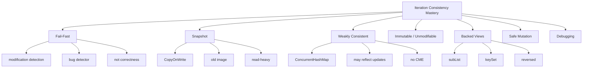
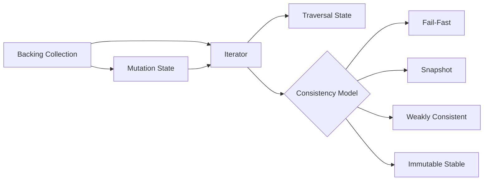
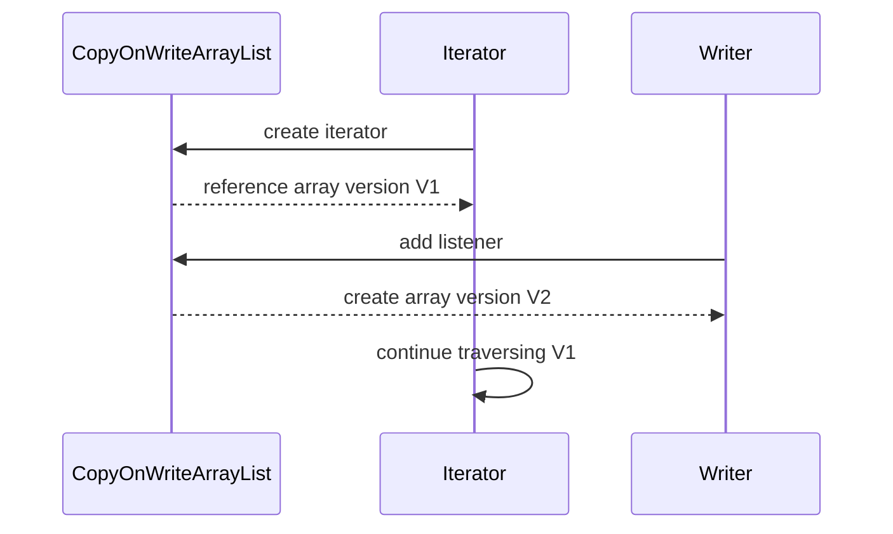
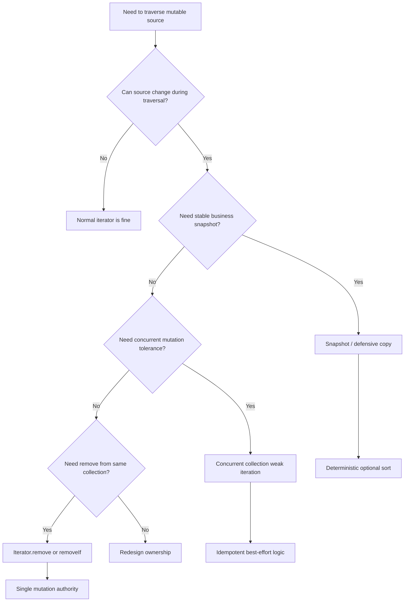

# Part 017 — Fail-Fast, Weakly Consistent, Snapshot, and Concurrent Iteration Semantics

> Target: setelah bagian ini, kamu mampu membaca traversal Java bukan hanya sebagai loop, tetapi sebagai **kontrak konsistensi**: apakah iterator melihat perubahan, menolak perubahan, mengambil snapshot, atau menoleransi perubahan secara weakly consistent. Kamu juga mampu memilih pola mutation yang benar, mendiagnosis `ConcurrentModificationException`, dan tidak menjadikan fail-fast sebagai mekanisme correctness.

Di part sebelumnya kita melihat `Iterator` sebagai state machine traversal. Sekarang kita naik satu level: iterator bukan hanya cursor, tetapi **perspektif terhadap collection yang bisa berubah**.

Pertanyaan pentingnya bukan hanya:

```java
while (it.hasNext()) {
    var item = it.next();
}
```

Pertanyaan yang lebih production-grade adalah:

- apa yang terjadi jika source berubah ketika traversal sedang berlangsung?
- perubahan apa yang dianggap structural?
- siapa yang boleh melakukan mutation: collection, iterator, view, atau thread lain?
- apakah iterator harus gagal, melihat snapshot lama, atau melihat sebagian update baru?
- apakah hasil traversal deterministic?
- apakah bug harus dideteksi cepat atau disembunyikan?
- apakah collection dipakai sebagai live registry, queue, validation result, atau audit snapshot?

Banyak bug collection di production bukan karena developer tidak tahu `for-each`, tetapi karena tidak eksplisit terhadap **iteration consistency model**.

---

## 1. Posisi Part Ini dalam Framework Kaufman



Kaufman-style deconstruction:

| Skill | What You Must Be Able To Do | Observable Signal |
|---|---|---|
| Detect mutation hazard | Identify unsafe mutation during traversal | You can explain why enhanced-for removal fails |
| Classify iterator model | Fail-fast vs snapshot vs weakly consistent | You can predict whether updates appear during traversal |
| Choose safe mutation pattern | `Iterator.remove`, `removeIf`, rebuild, snapshot | You can refactor mutation-heavy loops safely |
| Debug production failure | Read stack trace and infer source/view/mutator | You can locate the structural modifier |
| Design API boundary | Decide snapshot vs live view exposure | You can document ownership and mutation authority |

Learning strategy: do not memorize “fail-fast vs fail-safe”. That phrase is often misleading. Instead, ask:

> What consistency relation does this traversal have to the backing data?

---

## 2. The Core Mental Model

An iterator has three important relationships:



A collection can change in different ways while an iterator exists:

1. **No change**: iterator sees a stable source.
2. **Iterator-controlled change**: iterator itself performs supported mutation, usually `remove()`.
3. **External change in same thread**: collection is modified directly while iterator is active.
4. **External change in another thread**: collection is concurrently modified.
5. **View-mediated change**: a backed view modifies the same underlying collection.
6. **Snapshot isolation**: iterator traverses an old image.
7. **Weak consistency**: iterator may observe some updates, not necessarily all.

The essential production question:

> Does the traversal need a stable business snapshot, or is it allowed to traverse a moving target?

If the answer is “stable business snapshot”, do not rely on ordinary iterator behavior. Materialize a snapshot deliberately.

---

## 3. Four Iteration Consistency Models

### 3.1 Fail-fast

Fail-fast iterators try to detect illegal structural modification and throw `ConcurrentModificationException`.

Typical examples:

- `ArrayList` iterator
- `HashSet` iterator
- `HashMap` view iterators
- `LinkedList` iterator
- many general-purpose `java.util` collections

Fail-fast is useful because it exposes bugs early.

It is not a synchronization mechanism.

It is not guaranteed.

It is not a correctness proof.

### 3.2 Snapshot

Snapshot iterators traverse the state captured when the iterator was created.

Typical examples:

- `CopyOnWriteArrayList`
- `CopyOnWriteArraySet`

Later mutations are not reflected in that iterator.

This is excellent for read-mostly registries, listeners, routing tables, and configuration observers where reads dominate writes.

It is bad for high-frequency writes because each mutation copies underlying storage.

### 3.3 Weakly consistent

Weakly consistent iterators tolerate concurrent modification and do not throw `ConcurrentModificationException`. They may reflect some state at or since iterator creation, but they do not promise a full transactionally consistent snapshot.

Typical examples:

- `ConcurrentHashMap` iterators
- many `java.util.concurrent` collection iterators

This is useful for monitoring, registries, caches, and non-atomic traversal where exact snapshot semantics are unnecessary.

It is dangerous if you assume traversal means “all elements that existed at one logical time”.

### 3.4 Immutable or effectively stable

Immutable or unmodifiable collections can be stable during traversal if nobody can mutate the backing data.

Examples:

- `List.of(...)`
- `Set.of(...)`
- `Map.of(...)`
- `List.copyOf(...)`
- defensive snapshots

But be careful: `Collections.unmodifiableList(backing)` is only an unmodifiable **view**. If someone still owns `backing`, the backing collection can change.

---

## 4. Why `ConcurrentModificationException` Is Often Misunderstood

`ConcurrentModificationException` sounds like a concurrency exception. It is broader than that.

This can throw in a single thread:

```java
List<String> names = new ArrayList<>(List.of("ana", "budi", "citra"));

for (String name : names) {
    if (name.startsWith("b")) {
        names.remove(name); // unsafe external structural mutation
    }
}
```

The bug is not “two threads modified the list”. The bug is:

> an iterator was active, and the backing collection was structurally modified outside the iterator’s allowed mutation path.

Enhanced-for hides the iterator:

```java
for (String name : names) {
    // compiler uses Iterator under the hood
}
```

Conceptually similar to:

```java
Iterator<String> it = names.iterator();
while (it.hasNext()) {
    String name = it.next();
    // body
}
```

So direct `names.remove(...)` bypasses the iterator's expected state.

---

## 5. Structural Modification

A structural modification is a change that affects collection structure rather than merely replacing an existing element.

Usually structural:

- adding element
- removing element
- clearing collection
- changing map key set size
- changing list size
- bulk add/remove
- mutating through a backed view in a way that changes backing collection size

Usually not structural:

- `list.set(index, newValue)` on many lists
- replacing existing map value for an existing key
- mutating fields inside an object stored in a collection

But “usually” matters. Always check the specific type contract.

Example:

```java
List<String> items = new ArrayList<>(List.of("a", "b", "c"));

for (String item : items) {
    items.set(0, "x"); // typically not structural for ArrayList
}
```

This is not necessarily fail-fast, but it may still be a business bug because the traversed data is changing.

Do not reduce correctness to “does it throw?”.

---

## 6. The Implementation Mental Model: `modCount`

Many general-purpose collections use a modification counter internally.

Conceptually:

```java
class ConceptualArrayListIterator<E> implements Iterator<E> {
    private int cursor;
    private int expectedModCount = list.modCount;

    public E next() {
        if (expectedModCount != list.modCount) {
            throw new ConcurrentModificationException();
        }
        return list.elementData[cursor++];
    }
}
```

When the collection is structurally changed directly:

```java
list.add("x"); // increments modCount
```

The iterator still has the old `expectedModCount`.

When `next()` checks it, mismatch occurs.

Important: this is a mental model, not a contract you should depend on. The Java API explicitly treats fail-fast as best-effort bug detection.

---

## 7. Fail-Fast Is Bug Detection, Not Program Logic

Bad:

```java
try {
    for (Order order : orders) {
        process(order);
    }
} catch (ConcurrentModificationException ignored) {
    // retry or ignore
}
```

This is wrong because:

- fail-fast is not guaranteed,
- the traversal may already have partially processed elements,
- side effects may already have happened,
- retry may duplicate processing,
- the real ownership bug remains.

Better:

```java
List<Order> snapshot = List.copyOf(orders);

for (Order order : snapshot) {
    process(order);
}
```

or:

```java
synchronized (orders) {
    for (Order order : orders) {
        process(order);
    }
}
```

if `orders` is intentionally protected by the same lock.

Even better: design the API so traversal input is already stable.

---

## 8. Safe Mutation Pattern 1: Use `Iterator.remove()`

When a collection iterator supports `remove()`, this is the classic safe removal pattern:

```java
List<Order> orders = new ArrayList<>(loadOrders());

Iterator<Order> it = orders.iterator();
while (it.hasNext()) {
    Order order = it.next();
    if (order.isCancelled()) {
        it.remove();
    }
}
```

Why it works:

- the iterator performs the structural modification,
- the iterator updates its own expected modification state,
- cursor state remains consistent.

Wrong:

```java
Iterator<Order> it = orders.iterator();
while (it.hasNext()) {
    Order order = it.next();
    if (order.isCancelled()) {
        orders.remove(order); // unsafe external structural mutation
    }
}
```

Use this pattern when:

- mutation is local,
- removal condition is simple,
- iterator supports removal,
- you want in-place change.

Avoid when:

- the collection may be immutable/unmodifiable,
- the collection is copy-on-write and iterator does not support remove,
- removal logic is complex enough to deserve a separate predicate,
- you need an audit of removed items.

---

## 9. Safe Mutation Pattern 2: Use `removeIf`

For simple predicate-based removal:

```java
orders.removeIf(Order::isCancelled);
```

For business readability:

```java
orders.removeIf(order ->
    order.status() == OrderStatus.CANCELLED
        || order.status() == OrderStatus.EXPIRED
);
```

This expresses intent better than manual iterator removal.

But be careful with side effects:

```java
orders.removeIf(order -> {
    audit(order);          // smell: predicate has side effects
    return order.isStale();
});
```

Better:

```java
List<Order> stale = orders.stream()
    .filter(Order::isStale)
    .toList();

stale.forEach(this::audit);
orders.removeAll(stale);
```

or use a dedicated mutation function that makes side effects explicit.

---

## 10. Safe Mutation Pattern 3: Rebuild Instead of Mutating

For many domain transformations, rebuilding is clearer:

```java
List<Order> activeOrders = orders.stream()
    .filter(Order::isActive)
    .toList();
```

This is often better than in-place mutation because:

- original input remains available,
- result is easier to test,
- ownership is explicit,
- side effects are reduced,
- audit/retry logic is safer.

Use rebuild when:

- input is a request payload,
- output is a normalized model,
- downstream processing expects stable data,
- validation/reporting needs original and transformed collections.

Use in-place mutation when:

- collection is a local working buffer,
- memory pressure matters,
- object identity must be preserved,
- mutation is an implementation detail behind a clear boundary.

---

## 11. Safe Mutation Pattern 4: Snapshot Before Traversal

If the backing collection can change while you traverse, make the snapshot explicit:

```java
List<Listener> listenersSnapshot = List.copyOf(listeners);

for (Listener listener : listenersSnapshot) {
    listener.onEvent(event);
}
```

This pattern is common for event listeners.

Why it works:

- listener registration/unregistration during callback does not corrupt traversal,
- each dispatch sees a stable listener set,
- side effects do not affect current iteration,
- order can be deterministic if source order is deterministic.

Trade-off:

- copying cost,
- snapshot may be stale immediately,
- memory overhead for large collections.

Do not snapshot blindly. Snapshot when **semantic stability** matters.

---

## 12. Safe Mutation Pattern 5: Two-Phase Mutation

When mutation depends on traversal but should not happen during traversal:

```java
List<Order> toCancel = new ArrayList<>();

for (Order order : orders) {
    if (shouldCancel(order)) {
        toCancel.add(order);
    }
}

for (Order order : toCancel) {
    cancel(order);
}
```

This is useful when:

- mutation has side effects,
- mutation may trigger callbacks,
- mutation modifies multiple collections,
- you need audit of decisions,
- failure handling must be controlled.

A more explicit version:

```java
record CancellationDecision(Order order, String reason) {}

List<CancellationDecision> decisions = orders.stream()
    .filter(this::shouldCancel)
    .map(order -> new CancellationDecision(order, reasonFor(order)))
    .toList();

decisions.forEach(this::applyCancellation);
```

This separates decision from action.

---

## 13. Fail-Fast with Map Views

Maps expose backed views:

```java
Map<String, Integer> scores = new HashMap<>();
scores.put("ana", 10);
scores.put("budi", 20);

for (String name : scores.keySet()) {
    if (name.equals("ana")) {
        scores.remove(name); // unsafe during keySet iteration
    }
}
```

Correct:

```java
Iterator<String> it = scores.keySet().iterator();
while (it.hasNext()) {
    String name = it.next();
    if (name.equals("ana")) {
        it.remove();
    }
}
```

Or:

```java
scores.entrySet().removeIf(entry -> entry.getValue() < 15);
```

Remember: `keySet`, `values`, and `entrySet` are not independent copies. They are backed views.

Mutation through one view changes the map.

Mutation through the map changes the view.

---

## 14. Fail-Fast with `subList`

`subList` is a backed view.

```java
List<String> list = new ArrayList<>(List.of("a", "b", "c", "d"));
List<String> middle = list.subList(1, 3); // [b, c]

list.add("e");

middle.size(); // may throw ConcurrentModificationException
```

Why this is tricky:

- `middle` is not a snapshot,
- it depends on the parent list’s structural state,
- parent modification outside the sublist can invalidate assumptions.

Safer if you need a stable range:

```java
List<String> middleSnapshot = new ArrayList<>(list.subList(1, 3));
```

Use backed sublists only when:

- parent lifetime is controlled,
- mutation path is localized,
- you intentionally want write-through behavior,
- you do not leak the view across boundaries.

---

## 15. Fail-Fast with `reversed()` Views

Sequenced collections introduced reverse-ordered views.

Conceptually:

```java
List<String> list = new ArrayList<>(List.of("a", "b", "c"));
List<String> reversed = list.reversed();
```

A reversed view is not automatically a copy.

It may be backed by the original collection.

That means:

```java
reversed.remove("b");
System.out.println(list); // [a, c]
```

And parent changes may be visible in the reversed view depending on implementation.

Production rule:

> Treat `reversed()` like a view unless you deliberately materialize a snapshot.

Stable reversed snapshot:

```java
List<String> stableReverse = new ArrayList<>(list.reversed());
```

Unmodifiable reversed snapshot:

```java
List<String> stableReverse = List.copyOf(list.reversed());
```

---

## 16. Snapshot Iteration with `CopyOnWriteArrayList`

`CopyOnWriteArrayList` is useful when traversal dominates mutation.

Example:

```java
CopyOnWriteArrayList<Listener> listeners = new CopyOnWriteArrayList<>();

void publish(Event event) {
    for (Listener listener : listeners) {
        listener.onEvent(event);
    }
}

void register(Listener listener) {
    listeners.add(listener);
}
```

If a listener registers another listener during dispatch, the current iterator does not see the new listener.

That is usually desirable.

Mental model:



Strengths:

- traversal needs no external synchronization,
- no `ConcurrentModificationException`,
- stable iteration image,
- simple listener registry model.

Costs:

- each mutation copies storage,
- iterator mutation operations are unsupported,
- stale traversal is intentional,
- large collections with frequent writes are expensive.

Good candidates:

- listener lists,
- routing observers,
- feature flag subscribers,
- plugin registries,
- read-mostly configuration collections.

Bad candidates:

- task queues,
- high-volume mutable working sets,
- frequently changing caches,
- large collections with write-heavy access.

---

## 17. Weakly Consistent Iteration with `ConcurrentHashMap`

`ConcurrentHashMap` iterators do not throw `ConcurrentModificationException`.

Example:

```java
ConcurrentHashMap<String, Session> sessions = new ConcurrentHashMap<>();

for (Map.Entry<String, Session> entry : sessions.entrySet()) {
    if (entry.getValue().isExpired()) {
        sessions.remove(entry.getKey(), entry.getValue());
    }
}
```

This can be acceptable for cleanup jobs where:

- exact snapshot is not required,
- missed entries can be cleaned later,
- concurrent insertions/removals are normal,
- idempotency is built in.

It is not acceptable for:

- billing exact totals,
- audit-grade export,
- regulatory report snapshot,
- deterministic reconciliation,
- business decisions requiring complete consistency.

For exact snapshot:

```java
Map<String, Session> snapshot = Map.copyOf(sessions);
```

Then traverse `snapshot`.

But remember: the snapshot copies key/value references, not deep object state.

---

## 18. Weak Consistency Does Not Mean Random Chaos

Weakly consistent does not mean meaningless.

It means the iterator is designed to operate while the data structure changes, but it does not promise a single global snapshot.

Practical interpretation:

- it may see entries added after iterator creation,
- it may miss entries removed during traversal,
- it may reflect a mix of states,
- it should not throw CME due to concurrent updates,
- it is useful for monitoring and best-effort traversal.

Design question:

> Is best-effort traversal semantically acceptable?

For a metrics endpoint:

```java
int activeCount = sessions.size(); // estimate under concurrent updates
```

Often acceptable.

For a settlement engine:

```java
BigDecimal total = sessions.values().stream()
    .map(Session::amount)
    .reduce(BigDecimal.ZERO, BigDecimal::add);
```

Potentially wrong if sessions are changing and exactness matters.

---

## 19. Synchronized Wrappers and Iteration

`Collections.synchronizedList(list)` synchronizes individual method calls.

But iteration is a compound action.

This is not enough:

```java
List<String> syncList = Collections.synchronizedList(new ArrayList<>());

for (String value : syncList) {
    process(value);
}
```

Another thread can still modify between iterator operations unless external synchronization is used consistently.

Typical pattern:

```java
synchronized (syncList) {
    for (String value : syncList) {
        process(value);
    }
}
```

But be careful:

- do not call slow external services while holding the lock,
- do not call user callbacks while holding the lock,
- avoid lock-ordering hazards,
- prefer snapshot if processing is slow.

Safer for long processing:

```java
List<String> snapshot;
synchronized (syncList) {
    snapshot = List.copyOf(syncList);
}

for (String value : snapshot) {
    process(value);
}
```

---

## 20. Immutable, Unmodifiable, and Iterator Stability

Do not confuse these:

```java
List<String> immutable = List.of("a", "b", "c");
```

This list itself cannot be structurally modified.

```java
List<String> backing = new ArrayList<>(List.of("a", "b", "c"));
List<String> view = Collections.unmodifiableList(backing);
```

`view` cannot be modified through `view`, but `backing` can still change.

```java
Iterator<String> it = view.iterator();
backing.add("d");
it.next(); // may fail because backing changed
```

Rule:

> Unmodifiable view removes mutation authority from the view, not necessarily from all owners of the backing collection.

For stable API output:

```java
return List.copyOf(internalList);
```

For live read-only projection:

```java
return Collections.unmodifiableList(internalList);
```

But document it loudly.

---

## 21. Iterator Mutation Support Matrix

| Source | Iterator model | `remove()` support | Sees external mutation? | Throws CME? | Good for |
|---|---|---:|---|---|---|
| `ArrayList` | Fail-fast | Usually yes | Not safely | Best effort | Local mutable buffers |
| `HashMap.entrySet()` | Fail-fast view | Usually yes | Not safely | Best effort | Map filtering |
| `List.of(...)` | Stable unmodifiable | No | No structural mutation possible through list | No external backing | Immutable result |
| `Collections.unmodifiableList(backing)` | View over backing | No through view | Yes if backing changes | Possible | Read-only live view |
| `CopyOnWriteArrayList` | Snapshot | No | No, iterator sees old image | No | Read-mostly listener lists |
| `ConcurrentHashMap` views | Weakly consistent | Varies by view operation | May reflect some updates | No | Best-effort concurrent traversal |

The correct choice depends on semantics, not convenience.

---

## 22. Side Effects During Traversal

Even if collection mutation is safe, side effects can make traversal unsafe.

Bad:

```java
for (Order order : orders) {
    publish(order); // callback may mutate orders indirectly
}
```

The mutation may be hidden:

```java
void publish(Order order) {
    listeners.forEach(listener -> listener.onOrder(order));
}
```

A listener might remove an order from the original collection.

Better:

```java
List<Order> snapshot = List.copyOf(orders);

for (Order order : snapshot) {
    publish(order);
}
```

or design the callback boundary so it cannot mutate the source.

Production rule:

> When a loop calls external/user-provided code, assume the callback can mutate the world.

---

## 23. Nested Iteration Hazards

Example:

```java
for (Order order : orders) {
    for (Order other : orders) {
        if (conflicts(order, other)) {
            orders.remove(other); // unsafe
        }
    }
}
```

Problems:

- inner iterator invalidates outer iterator,
- removal affects traversal order,
- conflict decisions depend on mutation timing,
- duplicate decisions are possible,
- complexity may be quadratic.

Better:

```java
Set<OrderId> toRemove = new HashSet<>();

for (Order order : orders) {
    for (Order other : orders) {
        if (!order.equals(other) && conflicts(order, other)) {
            toRemove.add(other.id());
        }
    }
}

orders.removeIf(order -> toRemove.contains(order.id()));
```

Even better: build an index and avoid nested traversal if scale matters.

---

## 24. Traversing While Updating Multiple Collections

Common production bug:

```java
for (Order order : orders) {
    if (order.isExpired()) {
        orders.remove(order);
        byId.remove(order.id());
        byCustomer.get(order.customerId()).remove(order);
    }
}
```

Problems:

- iterator invalidation,
- partial update if one removal fails,
- indexes can diverge,
- empty nested collections may remain,
- error handling is unclear.

Better:

```java
List<Order> expired = orders.stream()
    .filter(Order::isExpired)
    .toList();

for (Order order : expired) {
    removeFromAllIndexes(order);
}
```

Or encapsulate the invariant:

```java
final class OrderIndex {
    private final List<Order> orders = new ArrayList<>();
    private final Map<OrderId, Order> byId = new HashMap<>();
    private final Map<CustomerId, List<Order>> byCustomer = new HashMap<>();

    void removeExpired(Clock clock) {
        List<Order> expired = orders.stream()
            .filter(order -> order.isExpired(clock))
            .toList();

        expired.forEach(this::remove);
    }

    private void remove(Order order) {
        orders.remove(order);
        byId.remove(order.id());
        byCustomer.computeIfPresent(order.customerId(), (id, list) -> {
            list.remove(order);
            return list.isEmpty() ? null : list;
        });
    }
}
```

Invariant belongs in one abstraction, not scattered loops.

---

## 25. Stream Pipelines and Source Mutation Preview

Streams will be covered deeply later, but this part needs one warning.

Bad:

```java
orders.stream()
    .filter(Order::isExpired)
    .forEach(orders::remove);
```

This mutates the stream source during pipeline execution.

Better:

```java
orders.removeIf(Order::isExpired);
```

or:

```java
List<Order> expired = orders.stream()
    .filter(Order::isExpired)
    .toList();

orders.removeAll(expired);
```

Stream source non-interference matters. A stream pipeline should not structurally mutate its own source unless the operation contract explicitly supports it.

---

## 26. Determinism and Auditability

A traversal can be safe from exceptions but still bad for audit.

Example:

```java
ConcurrentHashMap<AccountId, Balance> balances = ...;

List<BalanceReportLine> lines = new ArrayList<>();
for (var entry : balances.entrySet()) {
    lines.add(toReportLine(entry));
}
```

This may not throw. But under concurrent updates, the report may not correspond to one logical instant.

For audit-grade output:

```java
Map<AccountId, Balance> snapshot = Map.copyOf(balances);

List<BalanceReportLine> lines = snapshot.entrySet().stream()
    .sorted(Map.Entry.comparingByKey())
    .map(this::toReportLine)
    .toList();
```

Still consider object mutability:

```java
Map<AccountId, BalanceSnapshot> snapshot = balances.entrySet().stream()
    .collect(Collectors.toUnmodifiableMap(
        Map.Entry::getKey,
        e -> BalanceSnapshot.from(e.getValue())
    ));
```

A shallow snapshot may not be enough if values are mutable.

---

## 27. Debugging `ConcurrentModificationException`

When you see CME, do not stop at “collection modified during iteration”. Find the mutation path.

Checklist:

1. Which collection was being iterated?
2. Was it a direct collection or a view?
3. Was enhanced-for hiding the iterator?
4. Was removal done through the iterator or collection?
5. Was mutation hidden inside a callback?
6. Was a sublist/reversed/keySet/entrySet view involved?
7. Was the collection shared across methods or fields?
8. Was mutation in another thread?
9. Was the collection wrapped with unmodifiable/synchronized wrapper?
10. Is the correct fix snapshot, iterator mutation, rebuild, or ownership redesign?

Typical stack trace clue:

```text
java.util.ConcurrentModificationException
    at java.base/java.util.ArrayList$Itr.checkForComodification(ArrayList.java:...)
    at java.base/java.util.ArrayList$Itr.next(ArrayList.java:...)
```

The stack may point to `next()`, but the root cause is usually an earlier structural modification.

Search backward in the loop body.

---

## 28. Design Rules for API Boundaries

### 28.1 Returning internal live collection is dangerous

Bad:

```java
class Basket {
    private final List<Item> items = new ArrayList<>();

    List<Item> items() {
        return items;
    }
}
```

External code can mutate while internal code iterates.

Better snapshot:

```java
List<Item> items() {
    return List.copyOf(items);
}
```

Better controlled mutation:

```java
void addItem(Item item) {
    items.add(item);
}

boolean removeItem(ItemId id) {
    return items.removeIf(item -> item.id().equals(id));
}
```

### 28.2 Returning live views must be intentional

Sometimes live view is correct:

```java
Set<OrderId> orderIdsView() {
    return Collections.unmodifiableSet(byId.keySet());
}
```

But document:

- it is a live view,
- order is or is not guaranteed,
- concurrent modification behavior is not snapshot,
- caller must not rely on stable size during traversal.

### 28.3 Stream return can defer mutation hazards

```java
Stream<Order> orders() {
    return orders.stream();
}
```

This leaks traversal timing. Caller controls when terminal operation happens.

Often better:

```java
List<Order> ordersSnapshot() {
    return List.copyOf(orders);
}
```

Use `Stream` return only when laziness is semantically useful and lifecycle is clear.

---

## 29. Production Decision Matrix

| Requirement | Recommended Pattern | Why |
|---|---|---|
| Remove matching elements locally | `removeIf` | Declarative, safe, clear |
| Remove while complex traversal | Explicit `Iterator.remove()` | Maintains iterator state |
| Need original and transformed version | Rebuild collection | Preserves input |
| Callback may mutate source | Snapshot before callback | Stable dispatch |
| Read-mostly listener registry | `CopyOnWriteArrayList` | Snapshot traversal, simple writes |
| Concurrent cache cleanup | `ConcurrentHashMap` weak traversal + idempotent remove | Best-effort acceptable |
| Audit/export/report | Deep or value snapshot + deterministic sort | Stable, reproducible |
| Large mutable source, long processing | Snapshot keys/ids, process outside lock | Avoid long lock hold |
| View returned to callers | Snapshot unless live view is required | Prevent hidden coupling |
| Exact concurrent transaction | External synchronization or different data model | Iterator alone is insufficient |

---

## 30. Common Anti-Patterns

### 30.1 Catch and ignore CME

```java
try {
    processAll(items);
} catch (ConcurrentModificationException ignored) {
}
```

This hides data corruption risk.

### 30.2 Mutate source inside stream terminal

```java
items.stream().forEach(items::remove);
```

This is source interference.

### 30.3 Expose internal list and iterate internally

```java
List<Task> tasks() { return tasks; }
```

External mutation can break internal invariants.

### 30.4 Assume `unmodifiableList` is immutable

```java
return Collections.unmodifiableList(internalList);
```

This is a live view, not a snapshot.

### 30.5 Assume concurrent iterator is snapshot

```java
for (var entry : concurrentMap.entrySet()) {
    // assume exact report snapshot
}
```

Weakly consistent is not audit-consistent.

### 30.6 Assume fail-fast always triggers

```java
// If no CME occurs, code is safe.
```

Wrong. Fail-fast is best-effort.

---

## 31. Refactoring Examples

### 31.1 From unsafe remove to `removeIf`

Before:

```java
for (Payment payment : payments) {
    if (payment.isExpired()) {
        payments.remove(payment);
    }
}
```

After:

```java
payments.removeIf(Payment::isExpired);
```

### 31.2 From unsafe callback traversal to snapshot dispatch

Before:

```java
for (Handler handler : handlers) {
    handler.handle(event);
}
```

After:

```java
for (Handler handler : List.copyOf(handlers)) {
    handler.handle(event);
}
```

### 31.3 From live concurrent traversal to audit snapshot

Before:

```java
for (var entry : balances.entrySet()) {
    report.add(line(entry));
}
```

After:

```java
Map<AccountId, BalanceSnapshot> snapshot = balances.entrySet().stream()
    .collect(Collectors.toUnmodifiableMap(
        Map.Entry::getKey,
        e -> BalanceSnapshot.from(e.getValue())
    ));

List<ReportLine> report = snapshot.entrySet().stream()
    .sorted(Map.Entry.comparingByKey())
    .map(this::line)
    .toList();
```

---

## 32. Practice Lab 1 — Predict the Behavior

Given:

```java
List<String> list = new ArrayList<>(List.of("a", "b", "c"));
Iterator<String> it = list.iterator();

System.out.println(it.next());
list.add("d");
System.out.println(it.next());
```

Expected reasoning:

- first `next()` returns `a`,
- `list.add("d")` structurally modifies the backing list,
- second `next()` may throw `ConcurrentModificationException`,
- do not rely on exact throw timing for correctness.

---

## 33. Practice Lab 2 — Fix Three Ways

Unsafe:

```java
for (Order order : orders) {
    if (order.isInvalid()) {
        orders.remove(order);
    }
}
```

Fix 1:

```java
orders.removeIf(Order::isInvalid);
```

Fix 2:

```java
Iterator<Order> it = orders.iterator();
while (it.hasNext()) {
    if (it.next().isInvalid()) {
        it.remove();
    }
}
```

Fix 3:

```java
List<Order> validOrders = orders.stream()
    .filter(order -> !order.isInvalid())
    .toList();
```

Discussion:

- Fix 1 mutates in place declaratively.
- Fix 2 mutates in place with explicit cursor control.
- Fix 3 creates a new model and leaves input unchanged.

---

## 34. Practice Lab 3 — Listener Registry

Requirement:

- listeners can register/unregister during event handling,
- current dispatch must be stable,
- reads dominate writes.

Implementation:

```java
final class EventBus {
    private final CopyOnWriteArrayList<EventListener> listeners = new CopyOnWriteArrayList<>();

    void register(EventListener listener) {
        listeners.add(Objects.requireNonNull(listener));
    }

    void unregister(EventListener listener) {
        listeners.remove(listener);
    }

    void publish(Event event) {
        for (EventListener listener : listeners) {
            listener.onEvent(event);
        }
    }
}
```

Why this is acceptable:

- snapshot traversal prevents interference,
- callback mutation does not affect current iteration,
- mutation cost is acceptable only if writes are relatively rare.

---

## 35. Practice Lab 4 — Concurrent Cleanup

Requirement:

- shared session map,
- cleanup can miss entries and catch them next run,
- exact snapshot not required,
- removal must not remove replacement session incorrectly.

Implementation:

```java
void cleanup(ConcurrentHashMap<SessionId, Session> sessions, Clock clock) {
    for (Map.Entry<SessionId, Session> entry : sessions.entrySet()) {
        Session session = entry.getValue();
        if (session.isExpired(clock)) {
            sessions.remove(entry.getKey(), session);
        }
    }
}
```

The conditional remove matters:

```java
sessions.remove(entry.getKey(), session);
```

It avoids removing a newer replacement value under the same key.

---

## 36. Failure Modeling

| Failure | Cause | Symptom | Safer Design |
|---|---|---|---|
| CME in for-each | Direct collection mutation | Runtime exception | `removeIf` or iterator removal |
| Stale listener not seeing update | Snapshot iterator | New listener not called this event | Accept or document dispatch semantics |
| Audit report mismatch | Weak concurrent traversal | Totals do not match point-in-time state | Snapshot and sort |
| Memory retention | Long-lived backed view | Parent list retained | Materialize copy |
| Hidden mutation | Callback mutates source | CME or inconsistent state | Snapshot before callback |
| Index divergence | Multiple collections mutated in loop | Inconsistent lookup | Encapsulate index invariant |
| False sense of safety | No CME occurred | Data still inconsistent | Do not use exception as correctness |

---

## 37. Code Review Checklist

Ask these questions for every non-trivial traversal:

- Is the source mutable?
- Who owns the source?
- Can any code called inside the loop mutate the source?
- Is traversal over a direct collection or backed view?
- Is mutation required during traversal?
- Is the mutation through iterator-supported operations?
- Would `removeIf` be clearer?
- Would rebuilding be safer?
- Is snapshot semantics required?
- Is weak consistency acceptable?
- Is deterministic ordering required?
- Is the result used for audit or billing?
- Does object mutability make shallow snapshot insufficient?
- Is failure behavior explicit?

---

## 38. Mermaid Summary



---

## 39. Mastery Checklist

You are ready for Part 018 when you can:

- explain why `ConcurrentModificationException` can occur in a single thread,
- explain fail-fast as best-effort bug detection, not correctness,
- identify structural vs non-structural mutation,
- fix unsafe removal using `Iterator.remove`, `removeIf`, rebuild, or snapshot,
- explain backed view hazards with `subList`, `keySet`, `entrySet`, and `reversed`,
- explain when `CopyOnWriteArrayList` is appropriate,
- explain weakly consistent traversal with `ConcurrentHashMap`,
- decide whether a traversal needs stable snapshot semantics,
- design callback dispatch without iterator interference,
- review collection APIs for hidden live-view leakage.

---

## 40. References

- Java SE 25 API — `ConcurrentModificationException`: `https://docs.oracle.com/en/java/javase/25/docs/api/java.base/java/util/ConcurrentModificationException.html`
- Java SE 25 API — `Iterator`: `https://docs.oracle.com/en/java/javase/25/docs/api/java.base/java/util/Iterator.html`
- Java SE 25 API — `Collection`: `https://docs.oracle.com/en/java/javase/25/docs/api/java.base/java/util/Collection.html`
- Java SE 25 API — `List`: `https://docs.oracle.com/en/java/javase/25/docs/api/java.base/java/util/List.html`
- Java SE 25 API — `Map`: `https://docs.oracle.com/en/java/javase/25/docs/api/java.base/java/util/Map.html`
- Java SE 25 API — `CopyOnWriteArrayList`: `https://docs.oracle.com/en/java/javase/25/docs/api/java.base/java/util/concurrent/CopyOnWriteArrayList.html`
- Java SE 25 API — `ConcurrentHashMap`: `https://docs.oracle.com/en/java/javase/25/docs/api/java.base/java/util/concurrent/ConcurrentHashMap.html`
