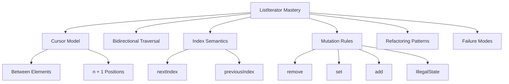
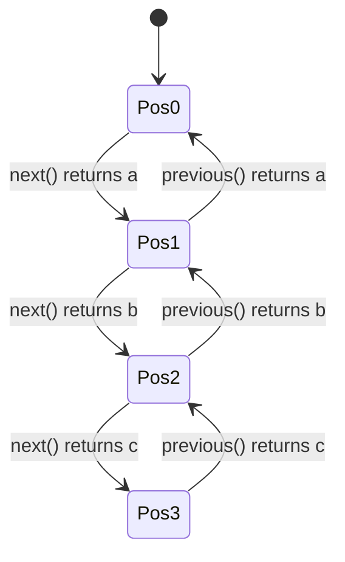
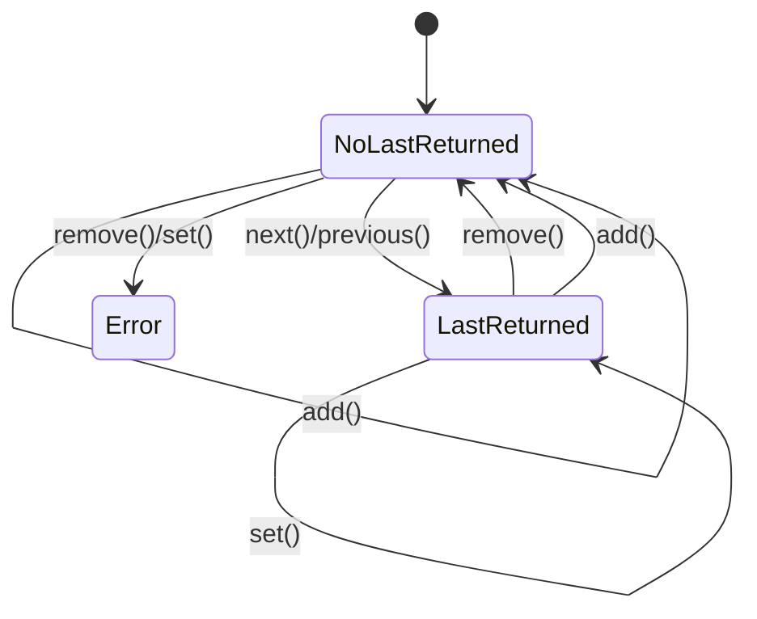
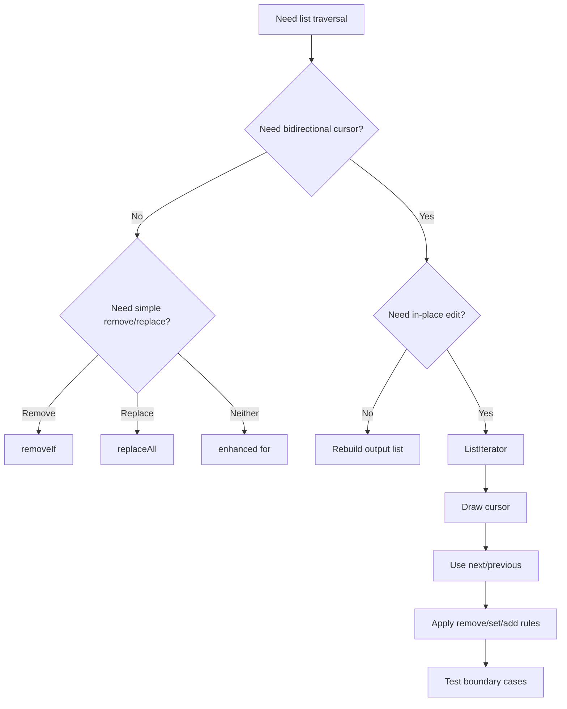

# Part 018 — ListIterator and Bidirectional Traversal

> Target: setelah bagian ini, kamu mampu menggunakan `ListIterator` bukan sebagai “iterator yang bisa mundur”, tetapi sebagai **cursor editor** untuk list: memahami posisi cursor, `next`/`previous`, `add`, `set`, `remove`, index semantics, mutation rules, dan kapan ia lebih tepat dibanding index loop, `Iterator`, `removeIf`, `replaceAll`, atau rebuild.

`Iterator` cocok untuk traversal maju. `ListIterator` lebih spesifik: ia hanya berlaku untuk `List`, dan memberi kemampuan:

- maju,
- mundur,
- mengetahui posisi index konseptual,
- mengganti elemen terakhir yang dikembalikan,
- menghapus elemen terakhir yang dikembalikan,
- menyisipkan elemen pada posisi cursor.

Banyak engineer jarang memakai `ListIterator`, lalu mengganti semua kasus dengan index loop. Kadang benar. Kadang index loop menjadi rapuh karena mutation menggeser posisi elemen. `ListIterator` berguna ketika problem-nya memang **cursor-based editing**.

---

## 1. Posisi Part Ini dalam Framework Kaufman



Kaufman-style deconstruction:

| Subskill | What You Practice | Observable Ability |
|---|---|---|
| Cursor model | Draw cursor between elements | Predict `next`/`previous` results |
| Mutation rules | Apply `remove`, `set`, `add` legally | Avoid `IllegalStateException` |
| Refactoring | Convert fragile index loops | Preserve traversal correctness |
| Implementation choice | Consider list implementation cost | Avoid accidental performance traps |
| API judgment | Choose `ListIterator` only when appropriate | Keep code simpler when possible |

The key mental shift:

> `ListIterator` does not point *at* an element. It points *between* elements.

---

## 2. The Cursor-Between-Elements Model

For a list of size `n`, there are `n + 1` cursor positions.

For:

```text
[a, b, c]
```

Cursor positions:

```text
^ a ^ b ^ c ^
0   1   2   3
```

A `ListIterator` at position `0` is before `a`.

A `ListIterator` at position `3` is after `c`.

`next()` returns the element to the right of the cursor and moves cursor right.

`previous()` returns the element to the left of the cursor and moves cursor left.



This model explains nearly every `ListIterator` edge case.

---

## 3. `next()` and `previous()` Can Return the Same Element

This surprises people:

```java
List<String> list = List.of("a", "b", "c");
ListIterator<String> it = list.listIterator();

System.out.println(it.next());     // a
System.out.println(it.previous()); // a
System.out.println(it.next());     // a
```

Why?

Start:

```text
^ a b c
```

After `next()`:

```text
a ^ b c
```

Then `previous()` returns the element to the left: `a`, and moves cursor back:

```text
^ a b c
```

Then `next()` returns `a` again.

This is not duplicate traversal. It is cursor movement.

---

## 4. Creating a `ListIterator`

Basic:

```java
ListIterator<String> it = list.listIterator();
```

Starts at cursor position `0`.

Start at a specific cursor position:

```java
ListIterator<String> it = list.listIterator(2);
```

For:

```text
[a, b, c]
```

`listIterator(2)` starts between `b` and `c`:

```text
a b ^ c
```

So:

```java
it.next();     // c
it.previous(); // c
```

Boundary rules:

```java
list.listIterator(0);           // before first
list.listIterator(list.size()); // after last
list.listIterator(-1);          // IndexOutOfBoundsException
list.listIterator(list.size()+1); // IndexOutOfBoundsException
```

---

## 5. Method Semantics Overview

| Method | Meaning | Moves Cursor? | Requires Prior `next/previous`? | Mutates List? |
|---|---|---:|---:|---:|
| `hasNext()` | Is there element to the right? | No | No | No |
| `next()` | Return right element, move right | Yes | No | No |
| `hasPrevious()` | Is there element to the left? | No | No | No |
| `previous()` | Return left element, move left | Yes | No | No |
| `nextIndex()` | Index next would return | No | No | No |
| `previousIndex()` | Index previous would return | No | No | No |
| `remove()` | Remove last returned element | Cursor adjusted | Yes | Yes |
| `set(E)` | Replace last returned element | No | Yes | Yes/no structural usually no |
| `add(E)` | Insert at cursor | Cursor moves after inserted element | No | Yes |

`remove`, `set`, and `add` are optional operations. Some list iterators do not support them.

---

## 6. `nextIndex()` and `previousIndex()`

For list:

```java
List<String> list = List.of("a", "b", "c");
ListIterator<String> it = list.listIterator();
```

At start:

```java
it.nextIndex();     // 0
it.previousIndex(); // -1
```

After one `next()`:

```java
it.next();          // a
it.nextIndex();     // 1
it.previousIndex(); // 0
```

At end:

```java
ListIterator<String> end = list.listIterator(list.size());
end.nextIndex();     // 3
end.previousIndex(); // 2
```

Important: these methods describe what `next()` or `previous()` would return. They are not “current element index”, because a `ListIterator` has no current element.

---

## 7. The “Last Returned Element” Rule

`remove()` and `set(E)` operate on the last element returned by `next()` or `previous()`.

They do not operate on “the cursor”.

Example:

```java
List<String> list = new ArrayList<>(List.of("a", "b", "c"));
ListIterator<String> it = list.listIterator();

String value = it.next(); // a
it.set("A");             // replaces a

System.out.println(list); // [A, b, c]
```

Backward example:

```java
List<String> list = new ArrayList<>(List.of("a", "b", "c"));
ListIterator<String> it = list.listIterator(list.size());

String value = it.previous(); // c
it.set("C");                 // replaces c

System.out.println(list);     // [a, b, C]
```

The last returned element can come from either direction.

---

## 8. Legal and Illegal `remove()`

Legal:

```java
List<String> list = new ArrayList<>(List.of("a", "b", "c"));
ListIterator<String> it = list.listIterator();

it.next();   // a
it.remove(); // removes a
```

Illegal: remove before traversal.

```java
ListIterator<String> it = list.listIterator();
it.remove(); // IllegalStateException
```

Illegal: remove twice for one returned element.

```java
it.next();
it.remove();
it.remove(); // IllegalStateException
```

Illegal after `add` without another `next`/`previous`:

```java
it.next();
it.add("x");
it.remove(); // IllegalStateException
```

Why? `add` changes the cursor context and resets the last-returned mutation eligibility.

---

## 9. Legal and Illegal `set(E)`

Legal:

```java
List<String> list = new ArrayList<>(List.of("a", "b", "c"));
ListIterator<String> it = list.listIterator();

it.next();
it.set("A");
```

Illegal before any returned element:

```java
ListIterator<String> it = list.listIterator();
it.set("x"); // IllegalStateException
```

Illegal after `remove()`:

```java
it.next();
it.remove();
it.set("x"); // IllegalStateException
```

Illegal after `add()`:

```java
it.next();
it.add("x");
it.set("y"); // IllegalStateException
```

Use `set` for replacement, not insertion.

For replacing every element, prefer `List.replaceAll` when possible:

```java
names.replaceAll(String::trim);
```

Use `ListIterator.set` when replacement depends on bidirectional context or local cursor edits.

---

## 10. `add(E)` Inserts at the Cursor

Example:

```java
List<String> list = new ArrayList<>(List.of("a", "c"));
ListIterator<String> it = list.listIterator();

it.next();   // a, cursor between a and c
it.add("b"); // insert before next element c

System.out.println(list); // [a, b, c]
```

Cursor effect:

Before `add`:

```text
a ^ c
```

After `add("b")`:

```text
a b ^ c
```

A subsequent `previous()` returns the inserted element:

```java
it.previous(); // b
```

A subsequent `next()` returns the element that was originally next:

```java
it.next(); // c, if cursor is after b
```

Be precise. `add` does not replace the next element. It inserts before the next element and after the previous element.

---

## 11. Cursor State Machine for Mutation



Interpretation:

- `next` or `previous` establishes a last returned element.
- `set` can be called after last returned and does not clear eligibility.
- `remove` consumes last-returned eligibility.
- `add` clears last-returned eligibility.
- `remove` or `set` without eligible last returned element fails.

This model is more useful than memorizing individual exceptions.

---

## 12. Pattern 1 — Backward Removal

Removing while traversing backward is one of the cleanest uses of `ListIterator`.

```java
List<Event> events = new ArrayList<>(loadEvents());
ListIterator<Event> it = events.listIterator(events.size());

while (it.hasPrevious()) {
    Event event = it.previous();
    if (event.isDuplicate()) {
        it.remove();
    }
}
```

Useful when:

- later elements have priority,
- you want to keep the last occurrence,
- removing from end avoids conceptual shifting issues,
- logic naturally scans from newest to oldest.

Example: keep latest record per key.

```java
Set<AccountId> seen = new HashSet<>();
ListIterator<AccountEvent> it = events.listIterator(events.size());

while (it.hasPrevious()) {
    AccountEvent event = it.previous();
    if (!seen.add(event.accountId())) {
        it.remove(); // remove older duplicate
    }
}
```

This preserves the newest event per account if the list is chronological.

---

## 13. Pattern 2 — In-Place Normalization

Example: trim and normalize tokens.

```java
List<String> tokens = new ArrayList<>(List.of("  A ", "", " b "));
ListIterator<String> it = tokens.listIterator();

while (it.hasNext()) {
    String token = it.next().trim().toLowerCase(Locale.ROOT);
    if (token.isEmpty()) {
        it.remove();
    } else {
        it.set(token);
    }
}

System.out.println(tokens); // [a, b]
```

This combines:

- read current element,
- remove invalid element,
- replace valid normalized element.

Alternative using streams:

```java
List<String> normalized = tokens.stream()
    .map(String::trim)
    .map(s -> s.toLowerCase(Locale.ROOT))
    .filter(s -> !s.isEmpty())
    .toList();
```

Which is better?

Use stream rebuild when you do not need to preserve original list identity.

Use `ListIterator` when the existing mutable list is the working buffer and mutation is intentional.

---

## 14. Pattern 3 — Insert Derived Elements During Scan

Example: insert separator before each major section.

```java
List<Line> lines = new ArrayList<>(loadLines());
ListIterator<Line> it = lines.listIterator();

while (it.hasNext()) {
    Line line = it.next();
    if (line.isHeading()) {
        it.previous();
        it.add(Line.separator());
        it.next(); // move past original heading again
    }
}
```

This pattern is powerful but easy to get wrong.

Reason through cursor movement carefully.

Before inserting separator, after `next()` returned heading:

```text
... heading ^ nextLine
```

To insert before heading, move back:

```java
it.previous();
```

Now:

```text
... ^ heading nextLine
```

Add separator:

```java
it.add(Line.separator());
```

Now:

```text
... separator ^ heading nextLine
```

Then `it.next()` moves past heading so the loop does not process the same heading forever.

If this feels too clever, rebuild instead.

```java
List<Line> result = new ArrayList<>();
for (Line line : lines) {
    if (line.isHeading()) {
        result.add(Line.separator());
    }
    result.add(line);
}
```

Often the rebuild is clearer.

---

## 15. Pattern 4 — Local Window Editing

Suppose a list of status changes contains redundant adjacent duplicates:

```text
[PENDING, PENDING, APPROVED, APPROVED, CLOSED]
```

Goal:

```text
[PENDING, APPROVED, CLOSED]
```

Using `ListIterator`:

```java
List<Status> statuses = new ArrayList<>(loadStatuses());
ListIterator<Status> it = statuses.listIterator();

if (it.hasNext()) {
    Status previous = it.next();

    while (it.hasNext()) {
        Status current = it.next();
        if (current == previous) {
            it.remove();
        } else {
            previous = current;
        }
    }
}
```

This is reasonable because the algorithm depends on adjacent state.

But do not overuse `ListIterator` for transformations that streams or simple loops express better.

---

## 16. Pattern 5 — Reverse Patch Application

When applying patches/removals by index, reverse traversal prevents index shift problems.

```java
record Patch(int index, String replacement) {}

List<String> lines = new ArrayList<>(loadLines());
List<Patch> patches = loadPatchesSortedAscending();

ListIterator<Patch> patchIt = patches.listIterator(patches.size());
while (patchIt.hasPrevious()) {
    Patch patch = patchIt.previous();
    lines.set(patch.index(), patch.replacement());
}
```

If patches include insertion/removal:

```java
record DeleteRange(int fromInclusive, int toExclusive) {}

ListIterator<DeleteRange> it = ranges.listIterator(ranges.size());
while (it.hasPrevious()) {
    DeleteRange range = it.previous();
    lines.subList(range.fromInclusive(), range.toExclusive()).clear();
}
```

This uses reverse order to avoid invalidating later indexes.

`ListIterator` is not always needed for the target list; the key is reverse traversal over patch definitions.

---

## 17. `ListIterator` vs Index Loop

Index loop:

```java
for (int i = 0; i < list.size(); i++) {
    E value = list.get(i);
}
```

Advantages:

- explicit index,
- easy random access,
- familiar,
- good for `ArrayList` positional algorithms.

Problems:

- fragile when removing/inserting,
- poor for `LinkedList` random access,
- easy off-by-one bugs,
- index shifts after mutation.

`ListIterator`:

```java
ListIterator<E> it = list.listIterator();
while (it.hasNext()) {
    E value = it.next();
}
```

Advantages:

- mutation-aware cursor,
- bidirectional traversal,
- can insert/remove safely through iterator,
- does not require repeated `get(i)`.

Problems:

- more stateful,
- harder to read for simple transformations,
- optional operations may not be supported,
- cursor movement can be subtle.

Decision rule:

| Requirement | Prefer |
|---|---|
| Simple forward read | Enhanced for-loop |
| Simple predicate removal | `removeIf` |
| Replace all elements uniformly | `replaceAll` |
| Build transformed result | Stream or explicit result list |
| Need index random access | Index loop on random-access list |
| Need safe in-place bidirectional edit | `ListIterator` |
| Need insert during traversal | `ListIterator` or rebuild |
| Need clarity over clever cursor movement | Rebuild |

---

## 18. `ArrayList` vs `LinkedList` Implications

This is not a DSA recap; it is a traversal API warning.

For `ArrayList`:

```java
list.get(i)
```

is efficient positional access.

For `LinkedList`, repeated `get(i)` can be expensive because it must traverse nodes.

So this is often bad for linked lists:

```java
for (int i = 0; i < linkedList.size(); i++) {
    process(linkedList.get(i));
}
```

Prefer iterator traversal:

```java
for (String value : linkedList) {
    process(value);
}
```

or:

```java
ListIterator<String> it = linkedList.listIterator();
while (it.hasNext()) {
    process(it.next());
}
```

However, do not jump to `LinkedList` just because you need insertions. In many production cases, `ArrayList` plus rebuild or batch mutation is faster and simpler due to locality.

Use `ListIterator` because the editing model is right, not because “linked list insertion is O(1)” in isolation.

---

## 19. `ListIterator` on Unmodifiable Lists

Example:

```java
List<String> list = List.of("a", "b", "c");
ListIterator<String> it = list.listIterator();

it.next();      // ok
it.previous();  // ok
it.set("A");    // UnsupportedOperationException
```

The traversal methods work.

Mutation methods may not.

The same applies to many unmodifiable or fixed-size lists:

```java
List<String> list = Arrays.asList("a", "b", "c");
ListIterator<String> it = list.listIterator();

it.next();
it.set("A"); // usually supported because fixed-size array-backed replacement is possible
it.add("x"); // unsupported because size change is not possible
```

Do not assume all mutation methods have the same support.

Optional operation means exactly that: optional.

---

## 20. `ListIterator` with `CopyOnWriteArrayList`

`CopyOnWriteArrayList` provides snapshot list iterators.

Traversal works:

```java
CopyOnWriteArrayList<String> list = new CopyOnWriteArrayList<>(List.of("a", "b"));
ListIterator<String> it = list.listIterator();

list.add("c");

while (it.hasNext()) {
    System.out.println(it.next()); // sees snapshot: a, b
}
```

Mutation through the iterator is unsupported:

```java
it.next();
it.remove(); // UnsupportedOperationException
```

Why?

The iterator sees an old array snapshot. Mutating through that iterator would not map cleanly to the latest list state.

This is a good reminder:

> `ListIterator` interface exposes mutation methods, but the concrete iterator decides whether they are supported.

---

## 21. `ListIterator` and Fail-Fast

For typical mutable lists like `ArrayList`, `ListIterator` is fail-fast.

Unsafe:

```java
List<String> list = new ArrayList<>(List.of("a", "b", "c"));
ListIterator<String> it = list.listIterator();

it.next();
list.add("d");
it.next(); // may throw ConcurrentModificationException
```

Safe through iterator:

```java
ListIterator<String> it = list.listIterator();

it.next();
it.add("x");
it.next();
```

But “safe” here means structurally consistent with iterator state, not necessarily business-correct.

Still ask:

- is insertion during traversal readable?
- does it affect downstream decisions?
- should we rebuild instead?

---

## 22. Replacing Elements: `set` vs `replaceAll`

Use `replaceAll` for uniform transformation:

```java
names.replaceAll(name -> name.trim().toLowerCase(Locale.ROOT));
```

Use `ListIterator.set` when:

- replacement depends on previous/next traversal context,
- replacement is mixed with removals/insertions,
- you need bidirectional cursor behavior,
- you are implementing a local editor.

Example:

```java
ListIterator<Token> it = tokens.listIterator();
Token previous = null;

while (it.hasNext()) {
    Token current = it.next();
    if (previous != null && shouldMerge(previous, current)) {
        it.set(merge(previous, current));
    }
    previous = current;
}
```

Even here, consider whether a separate parser/tokenizer abstraction is clearer.

---

## 23. Removing Elements: `remove` vs `removeIf`

Use `removeIf` for simple predicates:

```java
orders.removeIf(Order::isCancelled);
```

Use `ListIterator.remove` when:

- traversal direction matters,
- predicate depends on cursor context,
- removals are interleaved with replacements/insertions,
- you need to inspect previous/next positions.

Example:

```java
ListIterator<Step> it = steps.listIterator();
Step previous = null;

while (it.hasNext()) {
    Step current = it.next();
    if (previous != null && current.isNoOpAfter(previous)) {
        it.remove();
    } else {
        previous = current;
    }
}
```

Do not use `ListIterator` when the predicate is standalone. It adds cognitive load.

---

## 24. Insertion During Traversal: Prefer Rebuild Unless Cursor Editing Is Natural

Cursor insertion is valid:

```java
ListIterator<String> it = tokens.listIterator();
while (it.hasNext()) {
    String token = it.next();
    if (needsMarkerBefore(token)) {
        it.previous();
        it.add("MARKER");
        it.next();
    }
}
```

But this is easy to break.

Rebuild is often clearer:

```java
List<String> result = new ArrayList<>();
for (String token : tokens) {
    if (needsMarkerBefore(token)) {
        result.add("MARKER");
    }
    result.add(token);
}
```

Choose `ListIterator.add` when:

- preserving the same list object is required,
- insertions are local cursor edits,
- the list is small enough or implementation supports efficient edit,
- code is carefully tested.

Choose rebuild when:

- output is a transformed list,
- transformation is easier to express as “input to output”,
- auditability matters,
- you can avoid stateful cursor manipulation.

---

## 25. Infinite Loop Hazard with Insertions

Bad:

```java
List<String> list = new ArrayList<>(List.of("a", "b"));
ListIterator<String> it = list.listIterator();

while (it.hasNext()) {
    String value = it.next();
    if (value.equals("a")) {
        it.previous();
        it.add("x");
        // forgot to move past a
    }
}
```

After inserting `x`, cursor is before `a` again. The next loop iteration sees `a` again. Infinite insertion loop.

Fix:

```java
while (it.hasNext()) {
    String value = it.next();
    if (value.equals("a")) {
        it.previous();
        it.add("x");
        it.next(); // move past a
    }
}
```

Better if readability matters:

```java
List<String> result = new ArrayList<>();
for (String value : list) {
    if (value.equals("a")) {
        result.add("x");
    }
    result.add(value);
}
```

---

## 26. Domain Example: Normalizing Enforcement Timeline Events

Suppose an enforcement lifecycle system stores timeline events in encounter order:

```java
record TimelineEvent(
    Instant at,
    String type,
    String note
) {}
```

Rules:

- trim notes,
- remove empty notes,
- insert synthetic `SECTION_BREAK` before first event of a new day,
- preserve same mutable list object because another internal index references it.

One possible implementation:

```java
void normalizeTimeline(List<TimelineEvent> events, ZoneId zoneId) {
    LocalDate currentDay = null;
    ListIterator<TimelineEvent> it = events.listIterator();

    while (it.hasNext()) {
        TimelineEvent event = it.next();
        String note = event.note() == null ? "" : event.note().trim();

        if (note.isEmpty()) {
            it.remove();
            continue;
        }

        TimelineEvent normalized = new TimelineEvent(event.at(), event.type(), note);
        it.set(normalized);

        LocalDate eventDay = event.at().atZone(zoneId).toLocalDate();
        if (!eventDay.equals(currentDay)) {
            currentDay = eventDay;

            it.previous();
            it.add(new TimelineEvent(
                event.at(),
                "SECTION_BREAK",
                eventDay.toString()
            ));
            it.next();
        }
    }
}
```

This is advanced cursor editing. It should have tests.

A rebuild version may be clearer:

```java
List<TimelineEvent> normalizeTimelineCopy(List<TimelineEvent> events, ZoneId zoneId) {
    List<TimelineEvent> result = new ArrayList<>();
    LocalDate currentDay = null;

    for (TimelineEvent event : events) {
        String note = event.note() == null ? "" : event.note().trim();
        if (note.isEmpty()) {
            continue;
        }

        LocalDate eventDay = event.at().atZone(zoneId).toLocalDate();
        if (!eventDay.equals(currentDay)) {
            currentDay = eventDay;
            result.add(new TimelineEvent(event.at(), "SECTION_BREAK", eventDay.toString()));
        }

        result.add(new TimelineEvent(event.at(), event.type(), note));
    }

    return List.copyOf(result);
}
```

The rebuild version is usually easier to reason about. The in-place version is justified only if object identity or memory/lifecycle constraints matter.

---

## 27. Domain Example: Keeping the Last Decision Per Case

Input sorted by time ascending:

```java
record Decision(CaseId caseId, Instant decidedAt, String value) {}
```

Goal: remove older duplicate decisions, keeping the latest per case.

Reverse traversal:

```java
void keepLatestDecisionPerCase(List<Decision> decisions) {
    Set<CaseId> seen = new HashSet<>();
    ListIterator<Decision> it = decisions.listIterator(decisions.size());

    while (it.hasPrevious()) {
        Decision decision = it.previous();
        if (!seen.add(decision.caseId())) {
            it.remove();
        }
    }
}
```

Why `ListIterator` fits:

- traversal direction is semantically important,
- in-place removal is safe,
- no index shifting bug,
- latest record wins naturally.

Alternative if you do not need in-place mutation:

```java
List<Decision> latest = decisions.reversed().stream()
    .collect(Collectors.toMap(
        Decision::caseId,
        Function.identity(),
        (first, ignored) -> first,
        LinkedHashMap::new
    ))
    .values()
    .stream()
    .toList()
    .reversed();
```

This is clever but not necessarily clearer. Prefer explicit code for domain invariants.

---

## 28. Domain Example: Editing an Ordered Validation Plan

Suppose validation steps are ordered:

```java
record ValidationStep(String code, boolean expensive, Predicate<Input> applies) {}
```

Rule:

- remove steps that do not apply,
- insert a checkpoint before the first expensive step,
- do it once.

```java
void preparePlan(List<ValidationStep> steps, Input input) {
    boolean checkpointInserted = false;
    ListIterator<ValidationStep> it = steps.listIterator();

    while (it.hasNext()) {
        ValidationStep step = it.next();

        if (!step.applies().test(input)) {
            it.remove();
            continue;
        }

        if (step.expensive() && !checkpointInserted) {
            it.previous();
            it.add(checkpointStep());
            it.next();
            checkpointInserted = true;
        }
    }
}
```

Review questions:

- Is preserving list identity required?
- Is in-place mutation clearer than rebuild?
- Are predicates side-effect-free?
- Can inserted checkpoint itself match the same condition?
- Do tests cover empty, first, middle, and last positions?

---

## 29. Testing `ListIterator` Code

Cursor editing needs boundary tests.

Test cases:

| Case | Why |
|---|---|
| Empty list | No traversal should occur |
| Single element removed | Cursor state after remove |
| Single element replaced | `set` path |
| Insert before first | Cursor position 0 |
| Insert after last | Cursor position size |
| Adjacent matches | Avoid skipped elements |
| Backward traversal | `previous` semantics |
| Duplicate removal | Ensure correct duplicate retained |
| Unsupported list | Ensure failure is acceptable or copied first |
| External mutation | Ensure code owns collection |

Example test:

```java
@Test
void removesOlderDuplicateDecisions() {
    List<Decision> decisions = new ArrayList<>(List.of(
        new Decision(caseId("A"), instant("2026-01-01T10:00:00Z"), "WARN"),
        new Decision(caseId("B"), instant("2026-01-01T11:00:00Z"), "OK"),
        new Decision(caseId("A"), instant("2026-01-01T12:00:00Z"), "BLOCK")
    ));

    keepLatestDecisionPerCase(decisions);

    assertEquals(List.of(
        new Decision(caseId("B"), instant("2026-01-01T11:00:00Z"), "OK"),
        new Decision(caseId("A"), instant("2026-01-01T12:00:00Z"), "BLOCK")
    ), decisions);
}
```

---

## 30. Failure Modes

| Failure | Cause | Symptom | Fix |
|---|---|---|---|
| `IllegalStateException` on `remove` | No prior `next/previous`, or already removed | Runtime exception | Track last-returned rule |
| `IllegalStateException` on `set` | Called before traversal or after `remove/add` | Runtime exception | Call only after valid returned element |
| `UnsupportedOperationException` | List iterator does not support mutation | Runtime exception | Use mutable copy or different API |
| Infinite loop | Insert before current element but do not advance | Loop never terminates | Move cursor deliberately or rebuild |
| Skipped element | Removal/insertion changes cursor expectation | Missing processing | Draw cursor movement |
| CME | External structural modification | Runtime exception | Single mutation authority |
| Poor performance | Index loop over linked list or many middle edits on array list | Latency/CPU spike | Choose traversal/edit model deliberately |
| Overcomplicated cursor code | Used `ListIterator` where rebuild is clearer | Maintenance risk | Prefer explicit result list |

---

## 31. Code Review Heuristics

Use `ListIterator` when the answer to most of these is “yes”:

- Do we need bidirectional traversal?
- Do we need to insert or remove at cursor position?
- Does mutation depend on neighboring elements?
- Is preserving the same list object important?
- Is the cursor movement easy to draw?
- Are mutation methods supported by the concrete list?
- Are tests covering boundaries and adjacent edits?

Avoid `ListIterator` when:

- a simple `removeIf` works,
- a simple `replaceAll` works,
- a stream rebuild is clearer,
- external code may mutate the list,
- the list implementation does not support mutation,
- cursor movement requires comments to be understood.

Comments are not a substitute for a simpler algorithm.

---

## 32. Production Decision Matrix

| Problem | Best Starting Choice | Escalate To `ListIterator` When |
|---|---|---|
| Read all elements | Enhanced for-loop | Need backward traversal or mutation |
| Remove invalid elements | `removeIf` | Predicate depends on cursor context |
| Replace all elements | `replaceAll` | Replacement mixed with remove/add |
| Transform list to another list | Rebuild | Same list identity must be preserved |
| Insert separators/markers | Rebuild | In-place cursor edit is required |
| Keep last duplicate | Reverse traversal with `ListIterator` | In-place removal needed |
| Patch by index | Reverse sorted index operations | Patch definitions need bidirectional scan |
| Edit token stream | Parser/rebuild | Local cursor editing is simpler and tested |

---

## 33. Practice Lab 1 — Cursor Prediction

Given:

```java
List<String> list = new ArrayList<>(List.of("a", "b", "c"));
ListIterator<String> it = list.listIterator(1);

System.out.println(it.next());
System.out.println(it.previous());
it.add("x");
System.out.println(list);
System.out.println(it.next());
```

Reasoning:

- `listIterator(1)` starts between `a` and `b`,
- `next()` returns `b`, cursor after `b`,
- `previous()` returns `b`, cursor before `b`,
- `add("x")` inserts before `b`, cursor after `x`,
- list becomes `[a, x, b, c]`,
- `next()` returns `b`.

---

## 34. Practice Lab 2 — Fix the Illegal State

Bug:

```java
ListIterator<String> it = list.listIterator();
while (it.hasNext()) {
    if (shouldInsert()) {
        it.add("x");
        it.set("y");
    }
}
```

Problem:

- `set` after `add` is illegal because `add` clears last-returned eligibility.

Fix depends on intent.

If replacing next element:

```java
while (it.hasNext()) {
    String value = it.next();
    if (shouldReplace(value)) {
        it.set("y");
    }
}
```

If inserting a separate value:

```java
while (it.hasNext()) {
    String value = it.next();
    if (shouldInsertBefore(value)) {
        it.previous();
        it.add("x");
        it.next();
    }
}
```

---

## 35. Practice Lab 3 — Implement Adjacent Deduplication

Requirement:

Input:

```text
[a, a, b, b, b, c, a]
```

Output:

```text
[a, b, c, a]
```

Solution:

```java
static <T> void removeAdjacentDuplicates(List<T> list) {
    ListIterator<T> it = list.listIterator();

    if (!it.hasNext()) {
        return;
    }

    T previous = it.next();
    while (it.hasNext()) {
        T current = it.next();
        if (Objects.equals(previous, current)) {
            it.remove();
        } else {
            previous = current;
        }
    }
}
```

Why it works:

- `previous` tracks last retained value,
- duplicate current is removed through iterator,
- after removal, cursor remains valid,
- non-adjacent duplicate `a` at end is retained.

---

## 36. Practice Lab 4 — Reverse Remove Older Duplicates

Requirement:

Given chronological events, keep the last event per key.

```java
static <K, E> void keepLastPerKey(
    List<E> list,
    Function<? super E, ? extends K> keyFn
) {
    Set<K> seen = new HashSet<>();
    ListIterator<E> it = list.listIterator(list.size());

    while (it.hasPrevious()) {
        E element = it.previous();
        K key = keyFn.apply(element);
        if (!seen.add(key)) {
            it.remove();
        }
    }
}
```

Test boundary cases:

- empty list,
- one element,
- all unique,
- all same key,
- duplicate at beginning,
- duplicate at end,
- null key policy if allowed.

---

## 37. Mermaid Summary



---

## 38. Mastery Checklist

You are ready for Part 019 when you can:

- explain that `ListIterator` cursor sits between elements,
- predict `next`/`previous` behavior after arbitrary cursor movement,
- use `nextIndex` and `previousIndex` correctly,
- explain the last-returned-element rule,
- apply `remove`, `set`, and `add` legally,
- identify when `IllegalStateException` should occur,
- identify when `UnsupportedOperationException` should occur,
- refactor unsafe index-mutation loops into iterator or rebuild patterns,
- decide when `removeIf`, `replaceAll`, stream rebuild, or `ListIterator` is best,
- test cursor-editing logic at boundaries.

Part 019 moves from `Iterator` to `Spliterator`: the bridge between collection traversal and stream execution.

---

## 39. References

- Java SE 25 API — `ListIterator`: `https://docs.oracle.com/en/java/javase/25/docs/api/java.base/java/util/ListIterator.html`
- Java SE 25 API — `Iterator`: `https://docs.oracle.com/en/java/javase/25/docs/api/java.base/java/util/Iterator.html`
- Java SE 25 API — `List`: `https://docs.oracle.com/en/java/javase/25/docs/api/java.base/java/util/List.html`
- Java SE 25 API — `ArrayList`: `https://docs.oracle.com/en/java/javase/25/docs/api/java.base/java/util/ArrayList.html`
- Java SE 25 API — `LinkedList`: `https://docs.oracle.com/en/java/javase/25/docs/api/java.base/java/util/LinkedList.html`
- Java SE 25 API — `CopyOnWriteArrayList`: `https://docs.oracle.com/en/java/javase/25/docs/api/java.base/java/util/concurrent/CopyOnWriteArrayList.html`
