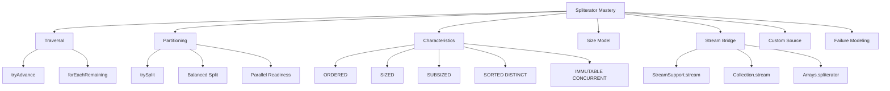
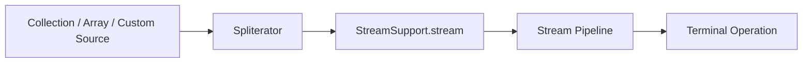

# Part 019 — Spliterator: The Bridge Between Collections and Streams

> Target: setelah bagian ini, kamu mampu melihat `Spliterator` bukan sebagai API obscure, tetapi sebagai **kontrak traversal + partitioning** yang menghubungkan data source dengan Stream API. Kamu akan mampu membaca characteristic spliterator, memahami efeknya terhadap stream pipeline, membuat custom spliterator sederhana, dan menghindari bug correctness/performance pada source buatan sendiri.

`Iterator` menjawab pertanyaan:

> “Bagaimana cara mengambil elemen berikutnya secara sequential?”

`Spliterator` menjawab pertanyaan yang lebih kaya:

> “Bagaimana cara mengambil elemen berikutnya, apakah source ini bisa dibagi, berapa ukurannya, apakah urutannya bermakna, apakah elemennya distinct/sorted/non-null, dan apakah karakteristik ini bisa dipercaya oleh client seperti Stream?”

Stream API membutuhkan informasi lebih dari sekadar `hasNext()` dan `next()`. Untuk membuat pipeline yang lazy, short-circuitable, dan mungkin parallel, runtime butuh sumber yang bisa memberi sinyal tentang:

- traversal,
- splitting,
- size estimation,
- encounter order,
- sorted/distinct guarantees,
- immutability/concurrency assumptions.

Itulah posisi `Spliterator`.

---

## 1. Posisi Part Ini dalam Framework Kaufman



Kaufman-style deconstruction:

| Subskill | What You Practice | Observable Ability |
|---|---|---|
| Traversal contract | Implement `tryAdvance` correctly | Every element emitted once, then stops |
| Splitting contract | Implement or evaluate `trySplit` | Understand parallel stream readiness |
| Characteristic reasoning | Choose flags conservatively | Avoid lying to Stream runtime |
| Size reasoning | Use `estimateSize`/`SIZED` safely | Avoid incorrect materialization assumptions |
| Stream bridging | Build streams from custom sources | Use `StreamSupport.stream` intentionally |
| Failure modeling | Simulate mutation, order, null, infinite source | Predict pipeline bugs before production |

The main invariant:

> A `Spliterator` must tell the truth about the source it represents. A wrong characteristic is worse than no characteristic.

---

## 2. Why `Spliterator` Exists

Java already had `Iterator`. Why add `Spliterator`?

Because `Iterator` is intentionally minimal:

```java
boolean hasNext();
T next();
default void remove();
```

That is enough for enhanced `for` loops, but not enough for efficient stream execution.

A stream pipeline may need to answer:

- Can this source be processed in encounter order?
- Can it be split into independent chunks?
- Is the size known exactly?
- If split, are child chunks also sized?
- Can `distinct()` be skipped because source is already distinct?
- Can `sorted()` be optimized because source is already sorted?
- Are null elements impossible?
- Can the source change during traversal?

An ordinary iterator cannot express those facts.

`Spliterator` combines two ideas:

```text
SPLIT + ITERATOR = SPLITERATOR
```

But the real value is not just splitting. The real value is the **metadata contract** around traversal.

---

## 3. Basic API Shape

The core methods:

```java
boolean tryAdvance(Consumer<? super T> action);
void forEachRemaining(Consumer<? super T> action);
Spliterator<T> trySplit();
long estimateSize();
int characteristics();
```

Helper/default methods include:

```java
long getExactSizeIfKnown();
boolean hasCharacteristics(int characteristics);
Comparator<? super T> getComparator();
```

Minimal mental model:

| Method | Meaning |
|---|---|
| `tryAdvance` | Push one element into the action if available |
| `forEachRemaining` | Push all remaining elements |
| `trySplit` | Return another spliterator covering some elements, leaving this one with the rest |
| `estimateSize` | Estimate remaining element count |
| `characteristics` | Return bit flags describing source and traversal guarantees |

Important difference from `Iterator`:

```java
Iterator<T> iterator = list.iterator();
while (iterator.hasNext()) {
    T item = iterator.next();
}
```

`Spliterator` is push-style:

```java
Spliterator<T> spliterator = list.spliterator();
while (spliterator.tryAdvance(item -> process(item))) {
    // repeated until source exhausted
}
```

You do not ask for the next value directly. You provide an action and the spliterator invokes it.

---

## 4. `tryAdvance`: The One-Element Traversal Contract

`tryAdvance` must obey this contract:

- if an element exists, pass exactly one element to the action and return `true`;
- if no element remains, do not call the action and return `false`;
- after it returns `false`, future calls should keep returning `false` unless the spliterator represents a source with unusual live behavior;
- it must not silently skip elements unless filtering is part of the spliterator's explicit design;
- it must not emit the same element twice unless the source logically contains duplicates.

Example using a list spliterator manually:

```java
List<String> names = List.of("Ayu", "Bima", "Citra");
Spliterator<String> sp = names.spliterator();

sp.tryAdvance(System.out::println); // Ayu
sp.tryAdvance(System.out::println); // Bima
sp.tryAdvance(System.out::println); // Citra
boolean hasMore = sp.tryAdvance(System.out::println); // false
```

Production lesson:

> `tryAdvance` is the smallest unit of stream consumption.

A terminal operation like `findFirst()` may only call enough `tryAdvance` operations to find the first matching element. This is one reason streams can short-circuit.

---

## 5. `forEachRemaining`: Bulk Traversal After Setup

`forEachRemaining` means:

> “Apply this action to everything left.”

Example:

```java
Spliterator<String> sp = List.of("A", "B", "C", "D").spliterator();

sp.tryAdvance(System.out::println); // A
sp.forEachRemaining(System.out::println); // B C D
```

For custom spliterators, `forEachRemaining` often has a default implementation that repeatedly calls `tryAdvance`. But optimized spliterators can implement it more efficiently using internal indexing.

Example custom array-backed traversal can avoid one method dispatch per element:

```java
@Override
public void forEachRemaining(Consumer<? super T> action) {
    Objects.requireNonNull(action);
    while (index < fence) {
        action.accept(array[index++]);
    }
}
```

Correctness still dominates performance:

- must not emit already-consumed elements;
- must update cursor/index;
- must reject null action;
- must follow same element-order semantics as `tryAdvance`.

---

## 6. `trySplit`: The Partitioning Contract

`trySplit` is the part that makes `Spliterator` different from `Iterator`.

Conceptually:

```text
Before split:

sp covers: [0, 1, 2, 3, 4, 5, 6, 7]

After split:

left returned spliterator covers: [0, 1, 2, 3]
original spliterator covers:      [4, 5, 6, 7]
```

The actual division depends on implementation.

A good `trySplit` should:

- return `null` when splitting is not useful or impossible;
- divide work without overlapping elements;
- avoid losing elements;
- ideally split into reasonably balanced chunks;
- preserve encounter order if the spliterator is `ORDERED`;
- preserve valid characteristics on both resulting spliterators.

Example manual split:

```java
List<Integer> values = List.of(1, 2, 3, 4, 5, 6, 7, 8);
Spliterator<Integer> right = values.spliterator();
Spliterator<Integer> left = right.trySplit();

left.forEachRemaining(System.out::println);
right.forEachRemaining(System.out::println);
```

For ordered list-like sources, you should expect both spliterators to cover disjoint ranges.

### Critical Production Point

`trySplit` does **not** mean:

> “Start a new thread.”

It only exposes a way to partition source traversal. The stream framework may use this partitioning when executing a parallel pipeline.

---

## 7. Spliterator Characteristics

The most important part of `Spliterator` is `characteristics()`.

Characteristics are bit flags. They let clients specialize behavior.

| Characteristic | Meaning |
|---|---|
| `ORDERED` | Encounter order is defined |
| `DISTINCT` | Elements are distinct according to `equals` |
| `SORTED` | Encounter order follows a sort order |
| `SIZED` | `estimateSize()` is exact before traversal/splitting changes |
| `NONNULL` | Source does not contain null elements |
| `IMMUTABLE` | Source cannot be structurally modified during traversal |
| `CONCURRENT` | Source may be safely concurrently modified |
| `SUBSIZED` | All spliterators from `trySplit` are also `SIZED` |

These flags are not decorative. They are part of a contract.

Bad characteristic examples:

```java
// Wrong: source may contain null.
return Spliterator.NONNULL | Spliterator.ORDERED;
```

```java
// Wrong: source size can change and estimate is not exact.
return Spliterator.SIZED;
```

```java
// Wrong: source is not actually sorted by comparator/natural order.
return Spliterator.SORTED;
```

The safe default for custom spliterators:

> Declare fewer characteristics unless you can prove the guarantee.

---

## 8. `ORDERED`: Encounter Order Matters

`ORDERED` means traversal has a defined encounter order.

Examples that usually have encounter order:

- array,
- `ArrayList`,
- `LinkedList`,
- `LinkedHashSet`,
- `TreeSet`,
- `LinkedHashMap` view,
- `TreeMap` view.

Examples where order should not be assumed:

- `HashSet`,
- `HashMap` key/value/entry views,
- unordered generated sources.

Why it matters:

```java
list.stream()
    .filter(x -> x.isActive())
    .findFirst();
```

If the source is ordered, `findFirst()` has stable semantic meaning.

For unordered source:

```java
set.stream()
   .filter(x -> x.isActive())
   .findFirst();
```

This may produce a result, but the result should not be interpreted as first by business priority unless the set's encounter order is meaningful.

Production rule:

> If business logic depends on “first”, “last”, “top”, “oldest”, “newest”, or “priority”, make order explicit before stream traversal.

---

## 9. `SIZED` and `SUBSIZED`: Size Is a Contract, Not a Hint

`SIZED` means `estimateSize()` returns the exact remaining size, assuming no structural changes outside the spliterator's expected behavior.

`SUBSIZED` means every spliterator returned by `trySplit()` is also `SIZED`.

Example: array range spliterator.

```text
array length = 10
spliterator covers [0, 10)
estimateSize = 10
trySplit -> [0, 5), original [5, 10)
child estimateSize = 5
original estimateSize = 5
```

This is `SIZED` and `SUBSIZED`.

A source backed by `Iterator` with unknown remaining count is generally not `SIZED`.

Why size matters:

- `toArray()` can preallocate.
- Some collectors/materializers can optimize capacity.
- Parallel execution can estimate chunk sizes.
- Short-circuiting may reason about remaining work.

Bug example:

```java
class BadSpliterator<T> implements Spliterator<T> {
    @Override
    public long estimateSize() {
        return 1_000_000; // fake
    }

    @Override
    public int characteristics() {
        return SIZED;
    }
}
```

This may cause wasteful allocation or wrong assumptions in clients.

Production rule:

> If size can change or is not exactly known, do not report `SIZED`.

---

## 10. `DISTINCT` and `SORTED`: Semantic Guarantees

`DISTINCT` means no two encountered elements are equal according to the relevant equality semantics.

Good candidates:

- `Set` sources, assuming set contract is not broken by mutable elements;
- key set of a map;
- custom deduplicated source.

Bad candidate:

```java
List<String> names = List.of("a", "a");
```

Even if business semantics says duplicates should not exist, do not mark a source `DISTINCT` unless it is structurally guaranteed.

`SORTED` means encounter order follows a sort order. If the source is sorted by comparator, `getComparator()` should expose it. If sorted by natural ordering, `getComparator()` may return `null`.

Production hazard:

```java
List<Customer> customers = fetchCustomers();
// They happened to arrive sorted today.
```

This is not a sorted source contract.

Do not mark data `SORTED` because the current sample happens to be sorted.

---

## 11. `NONNULL`: Useful but Dangerous if You Lie

`NONNULL` means the source will never emit null elements.

Good candidates:

- primitive spliterators,
- validated internal source,
- `List.of(...)` result when constructed successfully because nulls are rejected,
- domain-specific non-null storage.

Bad candidates:

- arbitrary `ArrayList`,
- deserialized collections,
- external input,
- collections populated by multiple layers.

Why it matters:

A stream client may choose to skip null checks if source says non-null.

Production rule:

> `NONNULL` should be a storage invariant, not a hope.

---

## 12. `IMMUTABLE` vs `CONCURRENT`

These two characteristics describe mutation behavior during traversal.

`IMMUTABLE`:

- source cannot be structurally modified;
- or the spliterator sees a stable immutable snapshot.

`CONCURRENT`:

- source may be safely concurrently modified;
- traversal has weakly consistent or otherwise documented behavior.

Examples:

| Source | Likely Model |
|---|---|
| `List.of(...)` | unmodifiable/immutable source behavior from API perspective |
| array spliterator | stable if array is not modified by owner; array itself is mutable |
| `CopyOnWriteArrayList` | snapshot-style traversal |
| `ConcurrentHashMap` views | concurrent/weakly consistent traversal |
| `ArrayList` | fail-fast-ish, not concurrent |

Important:

> Do not confuse “I promise not to mutate it” with `IMMUTABLE` unless the source itself enforces or snapshots that promise.

---

## 13. Late Binding vs Early Binding

A spliterator may bind to source contents early or late.

Early-binding mental model:

```text
spliterator created -> source identity/state captured now
```

Late-binding mental model:

```text
spliterator created -> source state observed when traversal begins
```

Why it matters:

```java
List<String> list = new ArrayList<>();
list.add("A");

Spliterator<String> sp = list.spliterator();

list.add("B");

sp.forEachRemaining(System.out::println);
```

Depending on the collection's documented spliterator behavior, `B` may or may not be observed, or concurrent modification may be detected.

Production rule:

> Do not write business logic that depends on unspecified binding timing. Create snapshots when the boundary requires stable input.

```java
List<String> snapshot = List.copyOf(input);
snapshot.stream().forEach(this::process);
```

---

## 14. From Collection to Stream

Most engineers use streams like this:

```java
orders.stream()
      .filter(Order::isOpen)
      .toList();
```

Under the hood, the collection provides a spliterator:

```java
Spliterator<Order> sp = orders.spliterator();
Stream<Order> stream = StreamSupport.stream(sp, false);
```

Conceptually:



The stream pipeline asks the spliterator for elements. For parallel streams, it may also ask for splits.

This means source quality affects stream quality.

| Source Property | Stream Consequence |
|---|---|
| Known size | Better materialization/preallocation potential |
| Good splitting | Better parallel stream scalability |
| Encounter order | `findFirst`, `forEachOrdered`, `limit`, `skip` semantics |
| Sorted/distinct | Possible pipeline simplification |
| Mutable during traversal | Possible bugs, fail-fast, or weak consistency |

---

## 15. `StreamSupport.stream`: When You Need It

Most application code should not use `StreamSupport.stream` directly. It is useful when you have:

- a custom data source;
- an `Iterable` that is not a `Collection`;
- a custom spliterator;
- a source with special traversal semantics;
- a library boundary that exposes spliterators.

Example:

```java
public Stream<Record> streamRecords() {
    Spliterator<Record> sp = new RecordFileSpliterator(path);
    return StreamSupport.stream(sp, false)
                        .onClose(() -> closeQuietly());
}
```

Be careful with resource-backed streams. A stream can be lazy, so resource lifetime must outlive terminal execution.

Bad:

```java
public Stream<String> lines(Path path) throws IOException {
    try (BufferedReader reader = Files.newBufferedReader(path)) {
        return reader.lines(); // reader closed before caller consumes stream
    }
}
```

Better:

```java
public List<String> readLines(Path path) throws IOException {
    try (Stream<String> lines = Files.lines(path)) {
        return lines.toList();
    }
}
```

Or clearly transfer close responsibility:

```java
public Stream<String> openLines(Path path) throws IOException {
    return Files.lines(path); // caller must close
}
```

---

## 16. Custom Spliterator Example: Array Range

A simple array-range spliterator is the easiest way to understand the contract.

```java
public final class ArrayRangeSpliterator<T> implements Spliterator<T> {
    private final T[] array;
    private int index;
    private final int fence;

    public ArrayRangeSpliterator(T[] array, int origin, int fence) {
        this.array = Objects.requireNonNull(array);
        if (origin < 0 || fence < origin || fence > array.length) {
            throw new IndexOutOfBoundsException();
        }
        this.index = origin;
        this.fence = fence;
    }

    @Override
    public boolean tryAdvance(Consumer<? super T> action) {
        Objects.requireNonNull(action);
        if (index < fence) {
            action.accept(array[index++]);
            return true;
        }
        return false;
    }

    @Override
    public Spliterator<T> trySplit() {
        int lo = index;
        int mid = (lo + fence) >>> 1;
        if (lo >= mid) {
            return null;
        }
        index = mid;
        return new ArrayRangeSpliterator<>(array, lo, mid);
    }

    @Override
    public long estimateSize() {
        return fence - index;
    }

    @Override
    public int characteristics() {
        return ORDERED | SIZED | SUBSIZED;
    }
}
```

Use it:

```java
String[] names = {"Ayu", "Bima", "Citra", "Dewi"};

Stream<String> stream = StreamSupport.stream(
    new ArrayRangeSpliterator<>(names, 0, names.length),
    false
);

List<String> result = stream
    .filter(name -> name.length() > 3)
    .toList();
```

Why not `IMMUTABLE`?

Because the array can be modified externally:

```java
names[0] = "Changed";
```

Unless the spliterator snapshots the array or owns it exclusively, do not claim immutability.

---

## 17. Custom Spliterator Example: Batching Records

Suppose you have a list of records and want to expose them as fixed-size batches.

```java
public final class BatchSpliterator<T> implements Spliterator<List<T>> {
    private final List<T> source;
    private final int batchSize;
    private int index;

    public BatchSpliterator(List<T> source, int batchSize) {
        this.source = Objects.requireNonNull(source);
        if (batchSize <= 0) {
            throw new IllegalArgumentException("batchSize must be positive");
        }
        this.batchSize = batchSize;
    }

    @Override
    public boolean tryAdvance(Consumer<? super List<T>> action) {
        Objects.requireNonNull(action);
        if (index >= source.size()) {
            return false;
        }

        int end = Math.min(index + batchSize, source.size());
        List<T> batch = List.copyOf(source.subList(index, end));
        index = end;
        action.accept(batch);
        return true;
    }

    @Override
    public Spliterator<List<T>> trySplit() {
        return null; // keep sequential unless splitting semantics are carefully designed
    }

    @Override
    public long estimateSize() {
        int remaining = source.size() - index;
        return (remaining + batchSize - 1L) / batchSize;
    }

    @Override
    public int characteristics() {
        return ORDERED | NONNULL;
    }
}
```

Why avoid `SIZED` here?

If `source` is mutable and can change during traversal, `estimateSize()` is not an exact stable remaining size. We could add `SIZED` only if we snapshot input or otherwise control mutation.

Safer version:

```java
public BatchSpliterator(List<T> source, int batchSize) {
    this.source = List.copyOf(source); // stable snapshot
    this.batchSize = requirePositive(batchSize);
}

@Override
public int characteristics() {
    return ORDERED | NONNULL | SIZED | SUBSIZED | IMMUTABLE;
}
```

But even `NONNULL` for `List<List<T>>` here means emitted batch objects are non-null. It does not mean elements inside each batch are non-null unless the source rejects nulls or validation enforces it.

---

## 18. Spliterator Over `Iterator`: Unknown Size Source

If you only have an `Iterator`, you can adapt it:

```java
Iterator<Event> iterator = eventSource.iterator();
Spliterator<Event> sp = Spliterators.spliteratorUnknownSize(
    iterator,
    Spliterator.ORDERED
);

Stream<Event> stream = StreamSupport.stream(sp, false);
```

This is convenient, but it carries limitations:

- size unknown;
- splitting quality limited;
- parallelism usually poor;
- binding/mutation semantics inherit from the iterator/source;
- if the iterator is single-use, the stream is also single-use.

Production rule:

> Adapting an iterator to a spliterator gives stream compatibility, not magically good stream performance.

---

## 19. Primitive Spliterators

`Spliterator` has primitive specializations:

- `Spliterator.OfInt`,
- `Spliterator.OfLong`,
- `Spliterator.OfDouble`.

These avoid boxing when feeding primitive streams.

Example:

```java
Spliterator.OfInt sp = Spliterators.spliterator(
    new int[] {1, 2, 3, 4},
    Spliterator.ORDERED | Spliterator.IMMUTABLE
);

int sum = StreamSupport.intStream(sp, false).sum();
```

Use primitive spliterators when:

- numeric throughput matters;
- element count is large;
- boxing would dominate allocation;
- source is naturally primitive.

Do not prematurely create custom primitive spliterators for small or readability-sensitive code.

---

## 20. Spliterator and Parallel Streams

Parallel stream performance depends heavily on spliterator quality.

Good parallel source properties:

| Property | Why It Helps |
|---|---|
| Cheap `trySplit` | Work can be partitioned efficiently |
| Balanced splits | Avoid one worker doing most work |
| Known size | Better task planning |
| Independent elements | No cross-element dependency |
| Low per-element overhead | Parallelism can overcome coordination cost |
| No blocking IO | Avoid starving common pool threads |

Bad parallel source properties:

- linked traversal with expensive splitting;
- unknown size;
- stateful transformation;
- synchronized per-element access;
- IO-bound processing;
- source mutation during traversal;
- ordered operations with high coordination cost.

Example risk:

```java
iteratorBackedSource.parallelStream()
    .map(this::expensiveButBlockingCall)
    .toList();
```

This often combines poor splitting with blocking work. The result may be slower and less predictable than explicit executor design.

Production rule:

> `parallelStream()` is a consumer of spliterator quality. It is not a substitute for workload architecture.

---

## 21. Spliterator Characteristic Matrix by Common Source

Approximate mental model; exact behavior should be checked against specific implementation docs.

| Source | Order | Size | Split Quality | Notes |
|---|---:|---:|---:|---|
| Array | Yes | Exact | Good | Dense indexed storage |
| `ArrayList` | Yes | Exact | Good | Usually strong stream source |
| `LinkedList` | Yes | Exact | Weaker | Traversal cost less cache-friendly |
| `HashSet` | No stable business order | Exact | Moderate | Distinct source |
| `LinkedHashSet` | Yes | Exact | Moderate | Encounter order meaningful |
| `TreeSet` | Sorted | Exact | Moderate | Sorted/distinct source |
| `HashMap.entrySet()` | No stable business order | Exact | Moderate | Entries distinct by key |
| `ConcurrentHashMap` views | Unordered-ish | Dynamic | Moderate | Weakly consistent/concurrent |
| Iterator adapter | Depends | Unknown | Poor/limited | Compatibility, not performance |
| Generated infinite stream | Depends | Unknown/infinite | Depends | Short-circuiting critical |

The hidden question:

> Is this source good at being split into independent chunks?

For sequential stream use, splitting may not matter. For parallel stream use, it matters a lot.

---

## 22. Failure Mode: Lying About Size

Bad custom spliterator:

```java
@Override
public long estimateSize() {
    return source.size(); // not remaining size
}

@Override
public int characteristics() {
    return ORDERED | SIZED;
}
```

If `index` has already advanced, `source.size()` is no longer remaining size.

Correct:

```java
@Override
public long estimateSize() {
    return source.size() - index;
}
```

But only mark `SIZED` if source size cannot change unexpectedly during traversal.

---

## 23. Failure Mode: Overlapping Splits

Bad split:

```java
@Override
public Spliterator<T> trySplit() {
    int mid = (index + fence) >>> 1;
    return new ArrayRangeSpliterator<>(array, index, mid);
    // BUG: original index not advanced to mid
}
```

This causes duplicate traversal because both spliterators cover `[index, mid)`.

Correct:

```java
int lo = index;
int mid = (lo + fence) >>> 1;
if (lo >= mid) return null;
index = mid;
return new ArrayRangeSpliterator<>(array, lo, mid);
```

Invariant:

```text
returned range ∩ remaining original range = empty
returned range ∪ remaining original range = previous remaining range
```

---

## 24. Failure Mode: Losing Encounter Order

Suppose you implement `trySplit` over an ordered source but assign chunks inconsistently:

```text
source: [A, B, C, D, E, F]
returned split: [A, C, E]
original left:  [B, D, F]
```

This may be valid for unordered processing if documented, but it violates intuitive contiguous encounter order for ordered sources.

For `ORDERED`, split behavior should preserve prefix/suffix style ordering where possible.

Better:

```text
returned split: [A, B, C]
original left:  [D, E, F]
```

This matters for operations like:

- `findFirst`,
- `limit`,
- `skip`,
- `forEachOrdered`,
- deterministic materialization.

---

## 25. Failure Mode: Side Effects in `tryAdvance`

A spliterator should traverse. It should not unexpectedly perform business side effects.

Bad:

```java
@Override
public boolean tryAdvance(Consumer<? super Event> action) {
    Event event = loadNext();
    auditService.recordRead(event); // hidden side effect
    action.accept(event);
    return true;
}
```

Better:

- keep spliterator as source traversal;
- make side effects explicit in terminal operation;
- document unavoidable side effects for IO-backed sources.

```java
stream.forEach(event -> {
    auditService.recordRead(event);
    process(event);
});
```

Even better, separate read audit from business processing if audit semantics matter.

---

## 26. Failure Mode: Resource Lifetime Bug

Resource-backed spliterators are subtle because streams are lazy.

Bad design:

```java
public Stream<Record> records() {
    RecordCursor cursor = openCursor();
    Spliterator<Record> sp = new CursorSpliterator(cursor);
    cursor.close();
    return StreamSupport.stream(sp, false);
}
```

The cursor is closed before traversal starts.

Better design:

```java
public Stream<Record> records() {
    RecordCursor cursor = openCursor();
    Spliterator<Record> sp = new CursorSpliterator(cursor);
    return StreamSupport.stream(sp, false)
                        .onClose(cursor::close);
}
```

Caller usage:

```java
try (Stream<Record> records = repository.records()) {
    records.filter(Record::isValid)
           .forEach(this::handle);
}
```

Rule:

> If a stream owns a resource, make closing semantics explicit.

---

## 27. Designing a Custom Spliterator: Checklist

Before writing one, answer:

| Question | Why It Matters |
|---|---|
| Is the source finite or infinite? | Size and short-circuit behavior |
| Is encounter order defined? | `ORDERED`, `findFirst`, deterministic output |
| Is size exactly known? | `SIZED`, `SUBSIZED`, allocation |
| Can the source be split cheaply? | Parallel stream support |
| Are elements non-null? | `NONNULL` correctness |
| Are elements distinct? | `DISTINCT` correctness |
| Is traversal sorted? | `SORTED` and comparator correctness |
| Can source mutate during traversal? | fail-fast, snapshot, immutable, concurrent |
| Does traversal require closing a resource? | `onClose` and API ownership |
| Can `tryAdvance` throw? | exception semantics and partial processing |

Default conservative approach:

```java
@Override
public Spliterator<T> trySplit() {
    return null;
}

@Override
public long estimateSize() {
    return Long.MAX_VALUE;
}

@Override
public int characteristics() {
    return 0;
}
```

Then add guarantees only when true.

---

## 28. When Not to Write a Custom Spliterator

Avoid custom spliterator if:

- `Collection.stream()` already does the job;
- `Arrays.stream()` already does the job;
- a simple loop is clearer;
- stream support is only for style;
- source has complex resource or error semantics better exposed as explicit API;
- parallelism is not required and `Iterator` is enough;
- you cannot write tests for split correctness.

Example where loop is better:

```java
for (Order order : orders) {
    if (order.isInvalid()) {
        errors.add(validate(order));
    }
}
```

Do not force a custom spliterator just to look advanced.

Top engineers are conservative with obscure extension points.

---

## 29. Practical Debugging: Inspect Spliterator Characteristics

Utility:

```java
static List<String> describe(Spliterator<?> sp) {
    List<String> result = new ArrayList<>();
    int c = sp.characteristics();
    if ((c & Spliterator.ORDERED) != 0) result.add("ORDERED");
    if ((c & Spliterator.DISTINCT) != 0) result.add("DISTINCT");
    if ((c & Spliterator.SORTED) != 0) result.add("SORTED");
    if ((c & Spliterator.SIZED) != 0) result.add("SIZED");
    if ((c & Spliterator.NONNULL) != 0) result.add("NONNULL");
    if ((c & Spliterator.IMMUTABLE) != 0) result.add("IMMUTABLE");
    if ((c & Spliterator.CONCURRENT) != 0) result.add("CONCURRENT");
    if ((c & Spliterator.SUBSIZED) != 0) result.add("SUBSIZED");
    return result;
}
```

Use:

```java
System.out.println(describe(List.of("A", "B").spliterator()));
System.out.println(describe(new HashSet<>(List.of("A", "B")).spliterator()));
System.out.println(describe(new TreeSet<>(List.of("A", "B")).spliterator()));
```

This is useful for learning, but do not write business logic that depends on incidental implementation flags unless they are documented contracts you control.

---

## 30. Testing Custom Spliterators

Minimum tests:

### 30.1 Emits All Elements Once

```java
@Test
void emitsAllElementsOnce() {
    String[] input = {"A", "B", "C"};
    Spliterator<String> sp = new ArrayRangeSpliterator<>(input, 0, input.length);

    List<String> output = StreamSupport.stream(sp, false).toList();

    assertEquals(List.of("A", "B", "C"), output);
}
```

### 30.2 Exhaustion Is Stable

```java
@Test
void exhaustedSpliteratorDoesNotEmitAgain() {
    String[] input = {"A"};
    Spliterator<String> sp = new ArrayRangeSpliterator<>(input, 0, input.length);

    assertTrue(sp.tryAdvance(x -> {}));
    assertFalse(sp.tryAdvance(x -> fail("should not emit")));
    assertFalse(sp.tryAdvance(x -> fail("should not emit")));
}
```

### 30.3 Split Has No Overlap and No Loss

```java
@Test
void splitHasNoOverlapAndNoLoss() {
    Integer[] input = {1, 2, 3, 4, 5, 6};
    Spliterator<Integer> right = new ArrayRangeSpliterator<>(input, 0, input.length);
    Spliterator<Integer> left = right.trySplit();

    List<Integer> output = Stream.concat(
        StreamSupport.stream(left, false),
        StreamSupport.stream(right, false)
    ).toList();

    assertEquals(List.of(1, 2, 3, 4, 5, 6), output);
}
```

### 30.4 Characteristics Are Honest

```java
@Test
void reportsSizedAndSubsized() {
    Integer[] input = {1, 2, 3, 4};
    Spliterator<Integer> sp = new ArrayRangeSpliterator<>(input, 0, input.length);

    assertTrue(sp.hasCharacteristics(Spliterator.SIZED));
    assertTrue(sp.hasCharacteristics(Spliterator.SUBSIZED));
    assertEquals(4, sp.getExactSizeIfKnown());
}
```

---

## 31. Code Review Smells

Flag these during review:

```java
return ORDERED | SIZED | IMMUTABLE | NONNULL | DISTINCT | SORTED;
```

Too many characteristics are suspicious unless the source is extremely controlled.

```java
@Override
public Spliterator<T> trySplit() {
    return this;
}
```

Never return `this`; split spliterators must represent distinct traversal portions.

```java
@Override
public boolean tryAdvance(Consumer<? super T> action) {
    action.accept(next());
    return true;
}
```

Infinite true without checking exhaustion is a bug unless source is intentionally infinite.

```java
StreamSupport.stream(sp, true)
```

Parallel custom stream requires higher scrutiny. Ask whether splitting, associativity, and source behavior are correct.

```java
public Stream<T> stream() {
    return StreamSupport.stream(spliterator, false);
}
```

If `spliterator` is a field and single-use, this method is broken on second call. Create a new spliterator per stream.

---

## 32. Decision Matrix: Iterator, Iterable, Spliterator, Stream

| Need | Best Abstraction |
|---|---|
| Simple pull traversal | `Iterator<T>` |
| Reusable enhanced-for source | `Iterable<T>` |
| Collection semantics and size/mutation methods | `Collection<T>` |
| Traversal + partitioning metadata | `Spliterator<T>` |
| Declarative lazy aggregate processing | `Stream<T>` |
| Resource-backed pipeline | `Stream<T>` with close contract |
| API return for stable materialized data | `List<T>` / `Set<T>` |
| API return for one-shot traversal | `Stream<T>` or `Iterator<T>`, documented |

Do not expose `Spliterator` from application APIs unless caller genuinely needs split/characteristic control.

For most domain APIs, prefer:

```java
List<Order> findOrders();
```

or:

```java
Stream<Order> streamOrders(); // resource/laziness documented
```

Expose `Spliterator` primarily in library/infrastructure-level APIs.

---

## 33. Production Pattern: Stable Snapshot Stream Source

Problem:

You receive mutable input but want stable stream behavior.

Solution:

```java
public Stream<Order> streamSnapshot(Collection<Order> orders) {
    List<Order> snapshot = List.copyOf(orders);
    return snapshot.stream();
}
```

Properties:

- stable membership;
- deterministic encounter order if input iteration order was deterministic;
- no accidental mutation during traversal;
- clear ownership boundary.

Caveat:

This is shallow. `Order` objects may still be mutable.

If element mutation matters, snapshot elements too:

```java
List<OrderSnapshot> snapshot = orders.stream()
    .map(OrderSnapshot::from)
    .toList();
```

---

## 34. Production Pattern: Validating Source Characteristics

If you build a source abstraction:

```java
interface OrderSource {
    Spliterator<Order> spliterator();
}
```

Document it:

```java
/**
 * Returns a new spliterator for the current order snapshot.
 *
 * Guarantees:
 * - ordered by creation time ascending;
 * - exact finite size;
 * - no null orders;
 * - safe against structural mutation because the source snapshots records.
 *
 * Does not guarantee:
 * - distinct customer ids;
 * - sorted by priority;
 * - deep immutability of order payload objects.
 */
Spliterator<Order> spliterator();
```

This is the level of precision expected in production libraries.

---

## 35. Practice Block: 90-Minute Deliberate Practice

### Exercise 1 — Inspect Characteristics

Write a utility that prints characteristics for:

- `ArrayList`,
- `LinkedList`,
- `HashSet`,
- `LinkedHashSet`,
- `TreeSet`,
- `List.of`,
- `Map.of(...).entrySet()`,
- `ConcurrentHashMap.keySet()`.

For each, write what you expected and what you observed.

### Exercise 2 — Implement Array Range Spliterator

Implement `ArrayRangeSpliterator<T>`.

Test:

- all elements emitted once;
- `trySplit` no overlap/no loss;
- `estimateSize` decreases;
- `getExactSizeIfKnown` works;
- parallel stream result equals sequential result.

### Exercise 3 — Implement Batching Spliterator

Create a spliterator that emits batches:

```java
List.of(1, 2, 3, 4, 5), batchSize = 2
// emits [1, 2], [3, 4], [5]
```

Then decide which characteristics are honest.

### Exercise 4 — Resource-Backed Source Review

Design an API for streaming records from a file.

You must answer:

- who closes the file?
- is stream reusable?
- is source ordered?
- is size known?
- can it be parallel?
- what happens on parse error?

---

## 36. Summary

`Spliterator` is not just a fancier iterator.

It is the contract that lets Java move from:

```text
one element at a time
```

to:

```text
one source with traversal, partitioning, size, order, and semantic guarantees
```

The key production lessons:

- `tryAdvance` emits one element at a time.
- `trySplit` partitions traversal; it does not create threads.
- Characteristics must be honest.
- `SIZED` means exact remaining size, not guess.
- `SUBSIZED` means split children are also sized.
- `ORDERED` affects observable stream semantics.
- `IMMUTABLE` and `CONCURRENT` describe source mutation behavior, not wishful thinking.
- Iterator adapters provide stream compatibility, but usually poor parallel characteristics.
- Custom spliterators belong mostly in library/infrastructure code.
- Resource-backed streams need explicit close ownership.

If you understand `Spliterator`, Stream API becomes much less magical. A stream is not floating computation. It is a pipeline consuming a source through a traversal contract.

---

## 37. References

- Java SE 25 API — `java.util.Spliterator`
- Java SE 25 API — `java.util.Spliterators`
- Java SE 25 API — `java.util.Collection`
- Java SE 25 API — `java.util.stream.StreamSupport`
- Java SE 25 API — `java.util.stream` package summary
