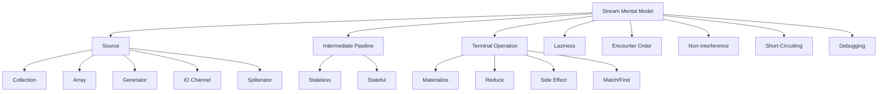
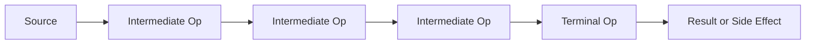

# Part 020 — Stream Mental Model: Source, Pipeline, Laziness, Terminal Execution

> Target: setelah bagian ini, kamu mampu memahami Java Stream sebagai **lazy aggregate processing pipeline**, bukan sebagai collection, bukan sebagai loop yang ditulis lebih pendek, dan bukan sebagai magic performance tool. Kamu akan mampu memprediksi kapan elemen diproses, kapan pipeline dieksekusi, apa arti single-use stream, kenapa side effect berbahaya, bagaimana encounter order memengaruhi hasil, dan kapan stream lebih buruk daripada loop.

Stream API sering disalahpahami karena syntax-nya enak:

```java
orders.stream()
    .filter(Order::isOpen)
    .map(Order::id)
    .toList();
```

Banyak engineer melihat ini sebagai “loop yang lebih modern”. Itu terlalu dangkal.

Mental model yang lebih benar:

```text
Stream = source + lazy pipeline description + terminal execution
```

Stream tidak menyimpan data. Stream tidak bisa dipakai ulang. Stream tidak otomatis cepat. Stream bukan collection. Stream adalah cara mendeklarasikan operasi agregat terhadap elemen dari sebuah source.

---

## 1. Posisi Part Ini dalam Framework Kaufman



Kaufman-style deconstruction:

| Subskill | What You Practice | Observable Ability |
|---|---|---|
| Source reasoning | Identify stream source and source properties | Predict order, size, mutability assumptions |
| Laziness | Trace when code runs | Avoid false debugging conclusions |
| Pipeline taxonomy | Separate intermediate and terminal ops | Explain why pipeline does or does not execute |
| Order reasoning | Use `findFirst`, `findAny`, `forEachOrdered` intentionally | Avoid accidental nondeterminism |
| Non-interference | Remove source mutation from stream lambdas | Avoid undefined/fragile behavior |
| Single-use discipline | Avoid storing/reusing stream objects | Design APIs correctly |
| Failure modeling | Test side effects, nulls, empty streams, exceptions | Make stream code production-safe |

Main invariant:

> A stream pipeline does no element processing until a terminal operation begins.

---

## 2. Stream Is Not a Collection

A `Collection` is a container.

A `Stream` is a pipeline.

| Question | Collection | Stream |
|---|---|---|
| Stores elements? | Yes | No |
| Can be traversed multiple times? | Usually yes | No |
| Has stable membership? | Often yes, depending on mutation | Source-dependent, consumed lazily |
| Supports mutation? | Some do | No collection-style mutation API |
| Represents data? | Yes | Represents computation over data |
| Can be infinite? | No practical collection is infinite | Yes |
| Needs terminal operation? | No | Yes |

Bad API design:

```java
class Report {
    private final Stream<Row> rows;

    Report(Stream<Row> rows) {
        this.rows = rows;
    }

    long countRows() {
        return rows.count();
    }

    List<Row> allRows() {
        return rows.toList(); // fails after countRows()
    }
}
```

Better:

```java
class Report {
    private final List<Row> rows;

    Report(Collection<Row> rows) {
        this.rows = List.copyOf(rows);
    }

    long countRows() {
        return rows.size();
    }

    List<Row> allRows() {
        return rows;
    }
}
```

Or use a supplier when laziness is truly needed:

```java
class ReportSource {
    private final Supplier<Stream<Row>> rows;

    ReportSource(Supplier<Stream<Row>> rows) {
        this.rows = rows;
    }

    long countRows() {
        return rows.get().count();
    }

    List<Row> allRows() {
        return rows.get().toList();
    }
}
```

But now the API must guarantee each supplier call creates a fresh stream.

---

## 3. Stream Pipeline Anatomy

A stream pipeline has three parts:

```java
List<String> result = users.stream()       // source
    .filter(User::active)                  // intermediate operation
    .map(User::email)                      // intermediate operation
    .sorted()                              // intermediate operation
    .toList();                             // terminal operation
```

Conceptually:



Examples of sources:

- collection: `orders.stream()`;
- array: `Arrays.stream(values)`;
- builder: `Stream.builder()`;
- generated: `Stream.generate(...)`;
- iterative: `Stream.iterate(...)`;
- IO-backed: `Files.lines(path)`;
- spliterator-backed: `StreamSupport.stream(sp, false)`.

Examples of intermediate operations:

- `filter`,
- `map`,
- `flatMap`,
- `mapMulti`,
- `distinct`,
- `sorted`,
- `peek`,
- `limit`,
- `skip`,
- `takeWhile`,
- `dropWhile`,
- `unordered`,
- `parallel`,
- `sequential`.

Examples of terminal operations:

- `toList`,
- `collect`,
- `reduce`,
- `count`,
- `min`,
- `max`,
- `sum` on primitive streams,
- `forEach`,
- `forEachOrdered`,
- `anyMatch`,
- `allMatch`,
- `noneMatch`,
- `findFirst`,
- `findAny`,
- `toArray`.

---

## 4. Laziness: Nothing Happens Until Terminal Operation

Consider:

```java
Stream<String> stream = List.of("A", "B", "C").stream()
    .filter(value -> {
        System.out.println("filter " + value);
        return true;
    })
    .map(value -> {
        System.out.println("map " + value);
        return value.toLowerCase();
    });
```

This prints nothing.

Why?

Because no terminal operation has started.

Now:

```java
List<String> result = stream.toList();
```

Now the pipeline executes.

Output is usually element-by-element for stateless operations:

```text
filter A
map A
filter B
map B
filter C
map C
```

Not:

```text
filter A
filter B
filter C
map A
map B
map C
```

This matters for performance and debugging. Stateless stream stages are often fused into a per-element traversal chain.

Mental model:

```text
terminal operation pulls elements from source through pipeline stages
```

---

## 5. Laziness and Short-Circuiting

Laziness becomes especially important with short-circuiting.

Example:

```java
boolean exists = List.of("A", "B", "C", "D").stream()
    .peek(x -> System.out.println("seen " + x))
    .anyMatch("B"::equals);
```

Output:

```text
seen A
seen B
```

The stream does not need to process `C` and `D`.

Short-circuiting operations include:

| Operation | Short-Circuit Behavior |
|---|---|
| `anyMatch` | Stops after first true |
| `allMatch` | Stops after first false |
| `noneMatch` | Stops after first true predicate match |
| `findFirst` | Stops when first element found |
| `findAny` | Stops when any element found |
| `limit` | Stops after enough elements downstream |
| `takeWhile` | Stops when predicate first fails on ordered stream |

Infinite source example:

```java
List<Integer> firstFiveEvenSquares = Stream.iterate(0, n -> n + 1)
    .filter(n -> n % 2 == 0)
    .map(n -> n * n)
    .limit(5)
    .toList();
```

Without `limit` or another short-circuiting terminal pattern, infinite streams may never complete.

---

## 6. Single-Use Stream

A stream can be consumed once.

Bad:

```java
Stream<Order> openOrders = orders.stream()
    .filter(Order::isOpen);

long count = openOrders.count();
List<Order> list = openOrders.toList(); // IllegalStateException likely
```

Better:

```java
List<Order> openOrders = orders.stream()
    .filter(Order::isOpen)
    .toList();

long count = openOrders.size();
```

Or create a fresh stream each time:

```java
Supplier<Stream<Order>> openOrders = () -> orders.stream()
    .filter(Order::isOpen);

long count = openOrders.get().count();
List<Order> list = openOrders.get().toList();
```

Production rule:

> Do not store a `Stream` in a field unless you are modeling a one-shot resource and clearly documenting it.

Usually store:

- `List<T>` for materialized data;
- `Supplier<Stream<T>>` for repeatable stream factory;
- `Iterable<T>` for traversal source;
- explicit reader/cursor abstraction for resource-backed streaming.

---

## 7. Intermediate vs Terminal Operations

A common bug is expecting intermediate operations to execute immediately.

Bad debugging assumption:

```java
orders.stream()
    .filter(order -> {
        log.info("checking {}", order.id());
        return order.isOpen();
    });
```

No terminal operation. No logging.

Correct:

```java
List<Order> open = orders.stream()
    .filter(order -> {
        log.info("checking {}", order.id());
        return order.isOpen();
    })
    .toList();
```

Taxonomy:

| Operation Type | Returns | Executes Immediately? | Example |
|---|---|---:|---|
| Intermediate | Stream | No | `filter`, `map`, `sorted` |
| Terminal | Non-stream or side effect | Yes | `toList`, `count`, `forEach` |

Important nuance:

`iterator()` and `spliterator()` from a stream are terminal escape hatches in the sense that they expose traversal mechanics. Use rarely.

---

## 8. Stateless vs Stateful Intermediate Operations

Stateless operations can process each element independently.

Examples:

```java
filter
map
flatMap
mapMulti
peek
```

Stateful operations need information across elements.

Examples:

```java
distinct
sorted
limit
skip
takeWhile
dropWhile
```

But `limit` can be cheap on ordered finite sequential streams and expensive in some ordered parallel scenarios.

Mental model:

```text
stateless op: element in -> element out/drop
stateful op: may need memory, ordering, buffering, or coordination
```

Example:

```java
List<String> result = names.stream()
    .map(String::trim)
    .filter(s -> !s.isBlank())
    .sorted()
    .toList();
```

`map` and `filter` can run per element. `sorted` needs to see the set of elements to sort before it can emit sorted output.

Production implication:

> Stateful operations are often the boundary where streams stop being “just a clean loop” and start requiring memory/order reasoning.

---

## 9. Encounter Order

Encounter order is the order in which a stream encounters elements from its source.

Sources with clear encounter order:

```java
List.of("A", "B", "C").stream()
```

Encounter order: `A`, then `B`, then `C`.

Sources without stable business order:

```java
new HashSet<>(List.of("A", "B", "C")).stream()
```

The stream may have some iteration order, but business logic should not depend on it.

Important operations affected by order:

| Operation | Order Sensitivity |
|---|---|
| `findFirst` | Yes |
| `findAny` | No strict first requirement |
| `limit` | Yes for ordered streams |
| `skip` | Yes for ordered streams |
| `forEachOrdered` | Yes |
| `sorted` | Creates sorted encounter order |
| `distinct` | Preserves first duplicate for ordered streams |

Example bug:

```java
Customer selected = customersById.values().stream()
    .filter(Customer::eligible)
    .findFirst()
    .orElseThrow();
```

If `customersById` is a `HashMap`, `findFirst()` is not a stable business selection policy.

Better:

```java
Customer selected = customersById.values().stream()
    .filter(Customer::eligible)
    .min(Comparator.comparing(Customer::createdAt))
    .orElseThrow();
```

Now the selection rule is explicit.

---

## 10. `findFirst` vs `findAny`

`findFirst` means:

> Respect encounter order if one exists.

`findAny` means:

> Return any element; useful especially when order does not matter or parallel execution may benefit.

Sequential ordered example:

```java
Optional<String> first = List.of("A", "B", "C").stream()
    .filter(s -> true)
    .findFirst(); // A
```

Parallel unordered example:

```java
Optional<String> any = names.parallelStream()
    .unordered()
    .filter(this::isValid)
    .findAny();
```

Production rule:

> Use `findFirst` when order is part of correctness. Use `findAny` only when any valid answer is semantically acceptable.

---

## 11. Non-Interference

Stream behavioral parameters should not interfere with the source.

Bad:

```java
List<Order> orders = new ArrayList<>(loadOrders());

orders.stream()
    .filter(Order::isCancelled)
    .forEach(orders::remove); // source mutation during traversal
```

This is fragile and may throw `ConcurrentModificationException` or behave unexpectedly.

Better:

```java
orders.removeIf(Order::isCancelled);
```

Or materialize filtered result:

```java
List<Order> active = orders.stream()
    .filter(order -> !order.isCancelled())
    .toList();
```

Non-interference means your lambdas should not mutate the stream source while the pipeline is executing.

This also applies indirectly:

```java
orders.stream()
    .map(order -> {
        repository.delete(order.id()); // may affect lazy source if source is repository-backed
        return order.id();
    })
    .toList();
```

If the source is connected to the repository state, this may be interference.

Production rule:

> Stream lambdas should transform, filter, or aggregate elements. Source mutation belongs outside the stream or in APIs designed for mutation.

---

## 12. Statelessness of Lambdas

Stream behavioral parameters should generally be stateless.

Bad:

```java
Set<String> seen = new HashSet<>();

List<String> unique = names.stream()
    .filter(name -> seen.add(name))
    .toList();
```

Sequentially, this may appear to work. But it hides mutable state inside a stream operation and breaks badly under parallel execution.

Better:

```java
List<String> unique = names.stream()
    .distinct()
    .toList();
```

Or if distinctness is by key:

```java
Map<String, User> byEmail = users.stream()
    .collect(Collectors.toMap(
        User::email,
        Function.identity(),
        (first, duplicate) -> first,
        LinkedHashMap::new
    ));

List<User> uniqueByEmail = List.copyOf(byEmail.values());
```

Stateful lambda smell:

```java
int[] counter = {0};
stream.map(x -> counter[0]++ + ":" + x)
```

Better if you need indexes:

```java
IntStream.range(0, list.size())
    .mapToObj(i -> i + ":" + list.get(i))
    .toList();
```

Or use an explicit loop when index semantics dominate.

---

## 13. Side Effects: Not Always Forbidden, But Must Be Intentional

Terminal `forEach` is side-effect oriented:

```java
orders.stream()
    .filter(Order::isReady)
    .forEach(this::dispatch);
```

This is acceptable if dispatching is the intended terminal action.

But side effects inside intermediate operations are usually suspicious:

```java
orders.stream()
    .map(order -> {
        audit(order); // hidden side effect
        return transform(order);
    })
    .toList();
```

This mixes transformation and side effect.

Better:

```java
List<Command> commands = orders.stream()
    .map(this::toCommand)
    .toList();

commands.forEach(commandBus::dispatch);
```

Or make side-effect terminal explicit:

```java
orders.stream()
    .filter(Order::isReady)
    .forEach(order -> {
        audit(order);
        dispatch(order);
    });
```

Production distinction:

| Side Effect Location | Risk |
|---|---|
| Terminal `forEach` | Explicit, but still needs failure handling |
| Intermediate `map`/`filter` | Hidden and order/laziness-sensitive |
| `peek` | Debugging-oriented; risky for business effects |
| Collector accumulator | Valid when collector contract is respected |

---

## 14. `peek`: Debug Tool, Not Business Logic

`peek` exists mainly to support debugging-style observation.

Example:

```java
List<String> result = names.stream()
    .peek(name -> log.debug("raw={}", name))
    .map(String::trim)
    .peek(name -> log.debug("trimmed={}", name))
    .filter(name -> !name.isBlank())
    .toList();
```

Bad:

```java
orders.stream()
    .peek(order -> auditService.record(order))
    .filter(Order::isValid)
    .toList();
```

Why bad?

- `peek` may not run if no terminal operation runs.
- It only runs for elements demanded by terminal operation.
- It can run in non-obvious order in parallel pipelines.
- It makes business side effects look like observation.

Production rule:

> Do not put required business effects in `peek`.

---

## 15. Element-by-Element Flow vs Full-Barrier Operations

For a simple pipeline:

```java
names.stream()
    .filter(this::valid)
    .map(this::normalize)
    .toList();
```

Flow is conceptually element-by-element:

```text
name1 -> filter -> map -> collect
name2 -> filter -> map -> collect
name3 -> filter -> map -> collect
```

For `sorted`:

```java
names.stream()
    .filter(this::valid)
    .sorted()
    .map(this::normalize)
    .toList();
```

There is a barrier:

```text
source -> filter all valid -> sort valid elements -> map sorted elements -> collect
```

For `distinct`, stream may need a seen set.

For `limit` on ordered parallel streams, runtime may need coordination to preserve first `n` elements.

Production rule:

> When stream performance surprises you, look for stateful operations and ordering constraints.

---

## 16. Empty Streams and Vacuous Truth

Matching operations on empty streams have important semantics.

```java
boolean any = Stream.<String>empty().anyMatch(s -> true);   // false
boolean all = Stream.<String>empty().allMatch(s -> false);  // true
boolean none = Stream.<String>empty().noneMatch(s -> true); // true
```

This is logically consistent:

- “any element matches” is false when there are no elements;
- “all elements match” is true vacuously;
- “no elements match” is true.

Production bug example:

```java
boolean allApproved = approvals.stream()
    .allMatch(Approval::approved);
```

If `approvals` is empty, `allApproved` is `true`.

If business rule requires at least one approval:

```java
boolean allApproved = !approvals.isEmpty()
    && approvals.stream().allMatch(Approval::approved);
```

This is not stream trivia. It is production correctness.

---

## 17. Nulls in Streams

Streams can carry nulls if the source contains nulls.

```java
List<String> names = Arrays.asList("A", null, "B");

List<Integer> lengths = names.stream()
    .map(String::length) // NullPointerException
    .toList();
```

Safer:

```java
List<Integer> lengths = names.stream()
    .filter(Objects::nonNull)
    .map(String::length)
    .toList();
```

But ask why null exists.

At production boundaries, prefer:

- reject null early;
- normalize null to explicit absence;
- use empty collection instead of null collection;
- avoid returning streams that may contain null unless documented.

Important:

```java
Stream.ofNullable(value)
```

Useful for converting nullable single value into zero-or-one stream:

```java
List<Address> addresses = users.stream()
    .flatMap(user -> Stream.ofNullable(user.address()))
    .toList();
```

---

## 18. Exceptions in Stream Pipelines

Exceptions propagate out of terminal execution.

```java
List<Integer> values = strings.stream()
    .map(Integer::parseInt)
    .toList();
```

If one element is invalid, the terminal operation fails and partial results are discarded unless side effects already happened.

Bad partial side-effect pattern:

```java
strings.stream()
    .map(Integer::parseInt)
    .forEach(repository::save);
```

If element 50 fails, elements 1-49 may already be saved.

Better for validation-heavy systems:

```java
List<ParseResult> results = strings.stream()
    .map(this::parseSafely)
    .toList();

List<ParseError> errors = results.stream()
    .flatMap(ParseResult::errorStream)
    .toList();

if (!errors.isEmpty()) {
    throw new ValidationException(errors);
}

results.stream()
    .map(ParseResult::value)
    .forEach(repository::save);
```

Stream pipelines do not automatically provide transaction semantics.

---

## 19. Stream Source Mutation Timing

Streams are lazy, so mutation before terminal execution may affect what gets processed.

```java
List<String> names = new ArrayList<>();
names.add("A");

Stream<String> stream = names.stream();

names.add("B");

List<String> result = stream.toList();
```

Should `B` appear? You should not design business logic around this question unless the source's binding behavior is documented and stable for your use.

Safer:

```java
List<String> snapshot = List.copyOf(names);
Stream<String> stream = snapshot.stream();
```

Or just materialize at point of use:

```java
List<String> result = names.stream().toList();
```

Rule:

> Build stream pipelines close to terminal execution unless there is a strong reason not to.

---

## 20. Streams and Resource Ownership

Some streams are resource-backed:

```java
Stream<String> lines = Files.lines(path);
```

This stream should be closed.

Correct:

```java
try (Stream<String> lines = Files.lines(path)) {
    List<String> result = lines
        .filter(line -> !line.isBlank())
        .toList();
}
```

Bad:

```java
public Stream<String> loadLines(Path path) throws IOException {
    try (Stream<String> lines = Files.lines(path)) {
        return lines.filter(line -> !line.isBlank());
    }
}
```

The stream is closed before caller consumes it.

Better API options:

Option 1: return materialized data.

```java
public List<String> loadLines(Path path) throws IOException {
    try (Stream<String> lines = Files.lines(path)) {
        return lines.filter(line -> !line.isBlank()).toList();
    }
}
```

Option 2: return stream and transfer close responsibility.

```java
public Stream<String> openLines(Path path) throws IOException {
    return Files.lines(path).filter(line -> !line.isBlank());
}
```

Document caller must close.

---

## 21. `toList()` vs `collect(toList())` at Mental Model Level

Modern Java has `Stream.toList()`.

```java
List<String> result = stream.toList();
```

This is a terminal operation that returns a list. It is concise and commonly preferred when you just need the result list.

`collect(Collectors.toList())` uses a collector:

```java
List<String> result = stream.collect(Collectors.toList());
```

Use collector forms when you need collector composition or a specific collection strategy:

```java
ArrayList<String> result = stream.collect(
    Collectors.toCollection(ArrayList::new)
);
```

Do not assume all list-producing operations have the same mutability/null/implementation guarantees. Treat returned collection mutability as an API contract, not an incidental behavior.

Safe pattern when you require your own mutable list:

```java
List<String> mutable = new ArrayList<>(stream.toList());
```

Safe pattern when you require defensive immutability:

```java
List<String> snapshot = List.copyOf(stream.toList());
```

---

## 22. Streams Are Not Always More Readable

Stream version:

```java
Map<CustomerId, List<Order>> byCustomer = orders.stream()
    .filter(Order::isBillable)
    .collect(Collectors.groupingBy(Order::customerId));
```

Good: declarative grouping.

But this stream is worse:

```java
AtomicInteger index = new AtomicInteger();
List<Line> result = lines.stream()
    .map(line -> parse(index.incrementAndGet(), line))
    .filter(ParseResult::valid)
    .map(ParseResult::line)
    .toList();
```

Indexing and error context may be clearer as a loop:

```java
List<Line> result = new ArrayList<>();
for (int i = 0; i < lines.size(); i++) {
    ParseResult parsed = parse(i + 1, lines.get(i));
    if (parsed.valid()) {
        result.add(parsed.line());
    }
}
```

Decision rule:

> Use streams when the operation is naturally a transformation, filtering, grouping, matching, or reduction pipeline. Use loops when control flow, mutation, indexing, early complex exit, or error handling dominates.

---

## 23. Common Stream Smells

### 23.1 Stream With Hidden Mutable Accumulator

```java
List<String> result = new ArrayList<>();
items.stream()
    .filter(this::valid)
    .forEach(result::add);
```

Better:

```java
List<String> result = items.stream()
    .filter(this::valid)
    .toList();
```

### 23.2 Stream Reuse

```java
Stream<Item> stream = items.stream();
stream.count();
stream.toList();
```

Create a new stream or materialize once.

### 23.3 Side Effects in `peek`

```java
stream.peek(this::save).toList();
```

Use explicit terminal side effect or separate transformation from persistence.

### 23.4 Order-Dependent Logic on Unordered Source

```java
hashSet.stream().findFirst();
```

Use explicit sort/min/max/comparator.

### 23.5 Overusing `parallelStream`

```java
requests.parallelStream().forEach(this::callRemoteService);
```

Parallel stream is usually wrong for blocking IO. Use explicit concurrency architecture.

### 23.6 Swallowed Optional Semantics

```java
User user = users.stream()
    .filter(User::active)
    .findFirst()
    .get();
```

Better:

```java
User user = users.stream()
    .filter(User::active)
    .findFirst()
    .orElseThrow(() -> new NoSuchElementException("No active user"));
```

### 23.7 Stream for Pure Mutation

```java
orders.stream().forEach(Order::markProcessed);
```

A loop may communicate intent better:

```java
for (Order order : orders) {
    order.markProcessed();
}
```

---

## 24. Debugging Stream Pipelines

Techniques:

### 24.1 Start With a Loop

If behavior is confusing, rewrite as loop.

```java
List<Result> result = new ArrayList<>();
for (Input input : inputs) {
    if (!valid(input)) continue;
    Result mapped = map(input);
    result.add(mapped);
}
```

Then compare with stream version.

### 24.2 Use `peek` Temporarily

```java
List<Result> result = inputs.stream()
    .peek(x -> log.debug("source={}", x))
    .filter(this::valid)
    .peek(x -> log.debug("valid={}", x))
    .map(this::map)
    .peek(x -> log.debug("mapped={}", x))
    .toList();
```

Remove or reduce after debugging.

### 24.3 Materialize Intermediate Result

```java
List<Input> validInputs = inputs.stream()
    .filter(this::valid)
    .toList();

List<Result> results = validInputs.stream()
    .map(this::map)
    .toList();
```

This may be less efficient but easier to inspect.

### 24.4 Name Predicates and Mappers

Bad:

```java
.filter(x -> x.status() == Status.ACTIVE && x.score() > 80 && !x.blocked())
```

Better:

```java
.filter(this::eligibleForPromotion)
```

Then test:

```java
boolean eligibleForPromotion(Customer customer) {
    return customer.status() == Status.ACTIVE
        && customer.score() > 80
        && !customer.blocked();
}
```

---

## 25. Stream Pipeline Design Pattern

A production-grade stream pipeline often has this shape:

```java
List<Command> commands = input.stream()
    .map(this::normalize)
    .filter(this::isProcessable)
    .map(this::validate)
    .flatMap(ValidationResult::validCommandStream)
    .sorted(Comparator.comparing(Command::executionOrder))
    .toList();
```

But only if each stage has clean semantics:

| Stage | Requirement |
|---|---|
| `normalize` | pure or at least side-effect-free |
| `isProcessable` | predicate only, no mutation |
| `validate` | returns result object, does not throw for expected validation issue |
| `flatMap` | clear zero/one/many expansion |
| `sorted` | explicit business ordering |
| `toList` | materialized boundary before side effects |

Then side effects happen after validation:

```java
for (Command command : commands) {
    commandBus.dispatch(command);
}
```

This separation is especially important in regulatory, financial, and case-management workflows where partial execution must be defensible.

---

## 26. Stream vs Loop Decision Matrix

| Situation | Prefer Stream | Prefer Loop |
|---|---:|---:|
| Simple filter/map/materialize | Yes | Maybe |
| Grouping/partitioning/reducing | Yes | Maybe |
| Complex branching | Maybe | Yes |
| Mutation-heavy algorithm | No | Yes |
| Index required everywhere | Maybe with `IntStream.range` | Yes |
| Checked exceptions per item | Maybe with result wrapper | Often yes |
| Need early return with complex cleanup | No | Yes |
| Debuggability more important than compactness | Maybe | Yes |
| Parallel CPU-bound aggregate | Maybe | Maybe explicit framework |
| Blocking IO per element | No | Explicit concurrency |
| Resource-backed source | Maybe with try-with-resources | Maybe |
| Auditability/deterministic ordering | Yes if explicit | Yes |

Rule:

> Stream is a tool for expressing aggregate data processing. It is not a moral upgrade over loops.

---

## 27. Production Example: Validation Pipeline

Input:

```java
record RawLine(int lineNumber, String text) {}
record ValidOrder(Order order) {}
record InvalidOrder(int lineNumber, String reason) {}
record ParseOutcome(Optional<ValidOrder> valid, Optional<InvalidOrder> invalid) {}
```

Pipeline:

```java
List<ParseOutcome> outcomes = IntStream.range(0, lines.size())
    .mapToObj(i -> new RawLine(i + 1, lines.get(i)))
    .map(this::parseOrder)
    .toList();

List<InvalidOrder> errors = outcomes.stream()
    .flatMap(outcome -> outcome.invalid().stream())
    .toList();

if (!errors.isEmpty()) {
    throw new BatchValidationException(errors);
}

List<Order> orders = outcomes.stream()
    .flatMap(outcome -> outcome.valid().stream())
    .map(ValidOrder::order)
    .toList();
```

Why this is defensible:

- line number is explicit;
- validation errors are accumulated;
- persistence side effects have not happened yet;
- failure is deterministic;
- pipeline is readable;
- stream is used for transformation, not hidden mutation.

---

## 28. Production Example: Selection Policy

Bad:

```java
Optional<Case> selected = cases.stream()
    .filter(Case::eligible)
    .findFirst();
```

What does first mean?

Better:

```java
Optional<Case> selected = cases.stream()
    .filter(Case::eligible)
    .min(Comparator
        .comparing(Case::riskScore).reversed()
        .thenComparing(Case::createdAt)
        .thenComparing(Case::id));
```

Now selection is explicit:

1. highest risk first;
2. older case first;
3. deterministic tie-breaker by id.

This is not just cleaner code. It is defensible behavior.

---

## 29. Production Example: Grouping Before Side Effects

Bad:

```java
transactions.stream()
    .filter(Transaction::requiresReview)
    .forEach(tx -> reviewQueue.enqueue(tx.accountId(), tx));
```

This interleaves filtering and side effects.

Better:

```java
Map<AccountId, List<Transaction>> byAccount = transactions.stream()
    .filter(Transaction::requiresReview)
    .collect(Collectors.groupingBy(
        Transaction::accountId,
        LinkedHashMap::new,
        Collectors.toList()
    ));

byAccount.forEach(reviewQueue::enqueueBatch);
```

Benefits:

- grouped intent is explicit;
- deterministic account iteration if source order is deterministic;
- side effect boundary is visible;
- batch operation can fail/retry as a unit.

---

## 30. Stream Correctness Checklist

Before approving stream code, ask:

| Question | Why It Matters |
|---|---|
| What is the source? | Determines order, size, mutability, resource behavior |
| Is source ordered? | Affects `findFirst`, `limit`, `skip`, output determinism |
| Is the stream consumed exactly once? | Avoid reuse bugs |
| Are lambdas non-interfering? | Avoid source mutation during traversal |
| Are lambdas stateless? | Avoid parallel/sequential inconsistency |
| Are side effects explicit? | Avoid hidden business behavior in `map`/`peek` |
| Are nulls possible? | Avoid late `NullPointerException` |
| Are empty-stream semantics correct? | `allMatch` trap |
| Are exceptions expected? | Use result wrappers for validation-style failures |
| Is terminal operation appropriate? | Materialize, reduce, match, or side effect intentionally |
| Is order-dependent logic explicit? | Avoid accidental `HashMap`/`HashSet` behavior |
| Would a loop be clearer? | Avoid stream overuse |

---

## 31. Testing Stream Pipelines

Test behavior, not stream internals.

### 31.1 Empty Input

```java
@Test
void emptyInputProducesEmptyOutput() {
    assertEquals(List.of(), service.normalize(List.of()));
}
```

### 31.2 Single Element

```java
@Test
void singleValidElementIsMapped() {
    List<Result> result = service.normalize(List.of(validInput()));
    assertEquals(1, result.size());
}
```

### 31.3 Order Determinism

```java
@Test
void outputIsSortedByRiskThenCreatedAtThenId() {
    List<Case> result = service.selectCases(input);

    assertEquals(List.of(caseB, caseA, caseC), result);
}
```

### 31.4 Duplicate Semantics

```java
@Test
void duplicateCustomerEmailKeepsFirstEncounteredCustomer() {
    List<Customer> result = service.deduplicateByEmail(customers);

    assertEquals(expected, result);
}
```

### 31.5 Null Boundary

```java
@Test
void rejectsNullInputElementAtBoundary() {
    assertThrows(NullPointerException.class, () -> service.process(List.of((Input) null)));
}
```

Or if nulls are tolerated:

```java
@Test
void ignoresNullInputElement() {
    List<Result> result = service.process(Arrays.asList(validInput(), null));
    assertEquals(List.of(expected), result);
}
```

### 31.6 Expected Validation Failure

```java
@Test
void invalidLinesAreAccumulatedBeforeThrowing() {
    BatchValidationException ex = assertThrows(
        BatchValidationException.class,
        () -> service.importLines(invalidLines)
    );

    assertEquals(3, ex.errors().size());
}
```

---

## 32. Micro Mental Models

### 32.1 Stream Pull Model

```text
terminal asks for result
  -> pipeline asks upstream for element
    -> source provides element through spliterator
      -> element passes stage by stage
```

### 32.2 Stream Is a Recipe Until Cooked

```java
Stream<Order> recipe = orders.stream()
    .filter(Order::isOpen)
    .map(Order::normalize);
```

No meal exists yet. Terminal operation cooks it:

```java
List<Order> meal = recipe.toList();
```

### 32.3 Source Determines Reality

Same pipeline, different source:

```java
source.stream().filter(...).findFirst()
```

- `ArrayList`: first by list order;
- `LinkedHashSet`: first by insertion order;
- `TreeSet`: first by sort order;
- `HashSet`: first by unspecified hash iteration behavior;
- generated stream: first by generator sequence;
- parallel unordered stream: any valid element may be selected if using `findAny`.

---

## 33. Anti-Pattern Refactoring Examples

### 33.1 From Side-Effect Stream to Collector

Before:

```java
Map<CustomerId, List<Order>> byCustomer = new HashMap<>();
orders.stream()
    .filter(Order::isOpen)
    .forEach(order -> byCustomer
        .computeIfAbsent(order.customerId(), ignored -> new ArrayList<>())
        .add(order));
```

After:

```java
Map<CustomerId, List<Order>> byCustomer = orders.stream()
    .filter(Order::isOpen)
    .collect(Collectors.groupingBy(Order::customerId));
```

### 33.2 From Accidental `findFirst` to Explicit Policy

Before:

```java
return handlers.stream()
    .filter(handler -> handler.supports(command))
    .findFirst()
    .orElseThrow();
```

After:

```java
return handlers.stream()
    .filter(handler -> handler.supports(command))
    .min(Comparator.comparingInt(Handler::priority))
    .orElseThrow();
```

Or if list order is the intended priority, document it:

```java
// Handlers are ordered by registration priority.
return handlers.stream()
    .filter(handler -> handler.supports(command))
    .findFirst()
    .orElseThrow();
```

### 33.3 From Stream Obscurity to Loop

Before:

```java
AtomicReference<State> state = new AtomicReference<>(initial);
List<Event> emitted = inputs.stream()
    .map(input -> transition(state.get(), input))
    .peek(result -> state.set(result.nextState()))
    .flatMap(result -> result.events().stream())
    .toList();
```

After:

```java
State state = initial;
List<Event> emitted = new ArrayList<>();

for (Input input : inputs) {
    TransitionResult result = transition(state, input);
    state = result.nextState();
    emitted.addAll(result.events());
}
```

State-machine logic is often clearer as a loop.

---

## 34. Practice Block: 90-Minute Deliberate Practice

### Exercise 1 — Trace Laziness

Given:

```java
List<Integer> result = List.of(1, 2, 3, 4, 5).stream()
    .peek(x -> System.out.println("source " + x))
    .filter(x -> x % 2 == 0)
    .peek(x -> System.out.println("even " + x))
    .map(x -> x * 10)
    .peek(x -> System.out.println("mapped " + x))
    .limit(1)
    .toList();
```

Predict output before running.

### Exercise 2 — Find the Bug

```java
boolean allApproved = approvals.stream()
    .allMatch(Approval::approved);
```

Write the correct version if business requires at least one approval.

### Exercise 3 — Refactor Side Effects

Refactor:

```java
List<Command> commands = new ArrayList<>();
requests.stream()
    .filter(Request::valid)
    .map(this::toCommand)
    .forEach(commands::add);
```

### Exercise 4 — Make Selection Deterministic

Refactor:

```java
caseMap.values().stream()
    .filter(Case::eligible)
    .findFirst();
```

Define explicit selection rule.

### Exercise 5 — Stream vs Loop Judgment

For each, choose stream or loop and justify:

- parse CSV lines with line-numbered validation errors;
- group transactions by account;
- update state machine per event;
- find max risk case;
- dispatch commands with retry and rollback;
- normalize user emails.

---

## 35. Summary

A Java Stream is a lazy pipeline over a source.

The core model:

```text
source -> intermediate operations -> terminal operation
```

But production mastery requires more:

- Stream is not a collection.
- Stream is single-use.
- Intermediate operations are lazy.
- Terminal operations trigger execution.
- Short-circuiting may process only part of the source.
- Encounter order affects correctness.
- `findFirst` implies order; `findAny` does not.
- Lambdas should be non-interfering and usually stateless.
- Side effects should be terminal and explicit.
- `peek` is not for business logic.
- Stateful operations like `sorted` and `distinct` affect cost model.
- Empty streams have important match semantics.
- Resource-backed streams must be closed.
- Loops are still the right tool when control flow, state, indexing, or side effects dominate.

The top 1% skill is not “use streams everywhere”. It is knowing exactly what semantic contract the stream expresses, where the side effects are, whether ordering is deterministic, and whether the pipeline is easier to reason about than a loop.

---

## 36. References

- Java SE 25 API — `java.util.stream` package summary
- Java SE 25 API — `java.util.stream.Stream`
- Java SE 25 API — `java.util.stream.BaseStream`
- Java SE 25 API — `java.util.stream.StreamSupport`
- Java SE 25 API — `java.util.Spliterator`
- Java SE 25 API — `java.nio.file.Files.lines`
