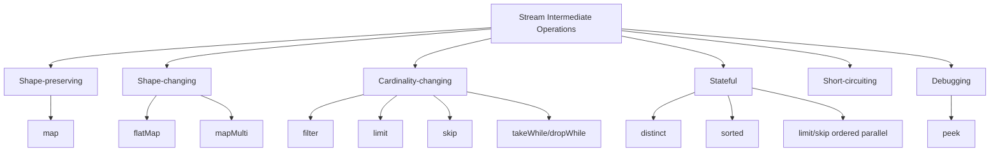
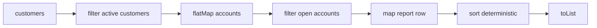

# Part 021 — Stream Operations Deep Dive: Map, Filter, FlatMap, Peek, Distinct, Sorted

> Target: setelah bagian ini, kamu mampu membaca dan mendesain pipeline Stream bukan sebagai rangkaian method call acak, tetapi sebagai **dataflow graph yang lazy, single-pass, contract-sensitive, dan cost-sensitive**. Kamu akan mampu memilih antara `map`, `flatMap`, `mapMulti`, `filter`, `distinct`, `sorted`, `limit`, `skip`, `takeWhile`, `dropWhile`, dan `peek` dengan alasan yang defensible.

Stream intermediate operation adalah operasi yang **menghasilkan stream baru**. Operasi ini tidak mengeksekusi pipeline sampai ada terminal operation.

Contoh:

```java
Stream<OrderId> ids = orders.stream()
    .filter(Order::isOpen)
    .map(Order::id);

// Belum ada traversal di sini.
// Traversal baru terjadi saat terminal operation dipanggil.
List<OrderId> result = ids.toList();
```

Mental model paling penting:

```text
intermediate operation = deklarasi transformasi
terminal operation     = eksekusi transformasi
```

Jadi pertanyaan production-grade bukan “method stream apa yang bisa dipakai?”, melainkan:

```text
Apa shape input?
Apa shape output?
Apakah operasi butuh state?
Apakah order penting?
Apakah operasi bisa short-circuit?
Apakah lambda bebas side effect?
Apakah cost-nya proporsional terhadap data?
```

---

## 1. Posisi Part Ini dalam Framework Kaufman



Kaufman-style deconstruction:

| Subskill | Latihan | Bukti Kamu Menguasai |
|---|---|---|
| Operation taxonomy | Klasifikasikan operasi sebagai stateless/stateful/short-circuiting | Bisa memprediksi cost dan risiko pipeline |
| Shape reasoning | Tentukan perubahan type dan cardinality | Bisa membaca pipeline kompleks tanpa tersesat |
| Side-effect discipline | Hilangkan mutation dari lambda | Pipeline aman untuk sequential/parallel reasoning |
| Ordering reasoning | Bedakan ordered vs unordered semantics | Bisa mengoptimalkan pipeline tanpa mengubah hasil |
| Failure modeling | Kenali bug umum stream | Bisa code review pipeline secara tajam |

---

## 2. Taxonomy: Cara Membaca Operasi Stream

Jangan mulai dari nama method. Mulai dari pertanyaan struktural.

### 2.1 Shape of Element

Apakah operasi mengubah tipe elemen?

```java
Stream<Order>      -> Stream<OrderDto>   // map
Stream<OrderBatch> -> Stream<Order>      // flatMap/mapMulti
Stream<Order>      -> Stream<Order>      // filter/distinct/sorted
```

### 2.2 Cardinality

Apakah jumlah output pasti sama dengan jumlah input?

| Operasi | Cardinality |
|---|---|
| `map` | 1 input -> 1 output |
| `filter` | 1 input -> 0 atau 1 output |
| `flatMap` | 1 input -> 0..N output |
| `mapMulti` | 1 input -> 0..N output |
| `distinct` | N input -> <= N output |
| `sorted` | N input -> N output |
| `limit` | N input -> <= N output |
| `skip` | N input -> <= N output |
| `takeWhile` | N input -> prefix output |
| `dropWhile` | N input -> suffix output |
| `peek` | 1 input -> 1 same input |

### 2.3 Statefulness

Stateless operation tidak perlu mengingat elemen sebelumnya untuk memproses elemen saat ini.

Stateful operation perlu melihat sebagian atau seluruh elemen lain.

| Operasi | Stateless? | Catatan |
|---|---:|---|
| `map` | Ya | Selama mapper stateless |
| `filter` | Ya | Selama predicate stateless |
| `flatMap` | Ya secara operasi | Mapper bisa menghasilkan stream baru |
| `mapMulti` | Ya secara operasi | Mapper mendorong 0..N output ke consumer |
| `peek` | Ya secara operasi | Tapi side effect sering problematik |
| `distinct` | Tidak | Perlu mengingat elemen yang sudah terlihat |
| `sorted` | Tidak | Perlu menyusun elemen berdasarkan comparator/natural order |
| `limit` | Stateful short-circuiting | Terutama mahal pada ordered parallel stream |
| `skip` | Stateful | Bisa mahal pada ordered parallel stream |
| `takeWhile` | Stateful short-circuiting | Prefix-sensitive |
| `dropWhile` | Stateful | Prefix-sensitive |

### 2.4 Encounter Order

Encounter order adalah urutan elemen sebagaimana disediakan source.

Contoh source ordered:

```java
List<String> names = List.of("b", "a", "c");
```

Contoh source yang tidak menjamin encounter order stabil:

```java
Set<String> names = new HashSet<>();
```

Beberapa operasi sangat dipengaruhi order:

- `sorted`
- `limit`
- `skip`
- `takeWhile`
- `dropWhile`
- `forEachOrdered` pada terminal phase

Production rule:

> Kalau hasil bisnis membutuhkan urutan, jadikan order sebagai bagian eksplisit dari kontrak, bukan efek samping dari implementasi collection.

---

## 3. `filter`: Selection, Not Validation

`filter` memilih elemen yang lolos predicate.

```java
List<Order> openOrders = orders.stream()
    .filter(Order::isOpen)
    .toList();
```

Mental model:

```text
T -> boolean -> maybe T
```

`filter` sebaiknya menjawab pertanyaan:

```text
Apakah elemen ini termasuk hasil?
```

Bukan:

```text
Apakah elemen ini valid dan kalau tidak valid saya ingin catat error?
```

### 3.1 Good Use: Business Selection

```java
List<Invoice> overdue = invoices.stream()
    .filter(invoice -> invoice.status() == InvoiceStatus.ISSUED)
    .filter(invoice -> invoice.dueDate().isBefore(today))
    .toList();
```

Pipeline ini jelas:

1. Mulai dari invoices.
2. Pilih yang sudah issued.
3. Pilih yang due date sudah lewat.
4. Materialize result.

### 3.2 Bad Use: Hidden Validation Loss

```java
List<Customer> validCustomers = customers.stream()
    .filter(Customer::hasValidEmail)
    .filter(Customer::hasActiveAccount)
    .toList();
```

Kode ini terlihat bersih, tetapi ada masalah: data invalid hilang tanpa jejak.

Dalam sistem regulatory, financial, billing, atau audit-heavy domain, ini sering tidak cukup. Kamu biasanya butuh tahu:

- record mana yang dibuang
- rule mana yang gagal
- apakah failure fatal atau warning
- apakah output masih defensible

Lebih eksplisit:

```java
record ValidationResult<T>(T value, List<String> errors) {
    boolean isValid() {
        return errors.isEmpty();
    }
}

List<ValidationResult<Customer>> assessed = customers.stream()
    .map(customer -> validateCustomer(customer))
    .toList();

List<Customer> valid = assessed.stream()
    .filter(ValidationResult::isValid)
    .map(ValidationResult::value)
    .toList();

List<ValidationResult<Customer>> invalid = assessed.stream()
    .filter(result -> !result.isValid())
    .toList();
```

Rule:

> Gunakan `filter` untuk selection. Gunakan explicit validation result untuk validation yang harus bisa dijelaskan.

### 3.3 Predicate Must Be Non-Interfering

Jangan mutasi source di predicate.

Salah:

```java
List<Order> orders = new ArrayList<>(input);

List<Order> result = orders.stream()
    .filter(order -> {
        if (order.isCancelled()) {
            orders.remove(order); // bug
            return false;
        }
        return true;
    })
    .toList();
```

Masalah:

- source dimodifikasi saat traversal
- bisa memicu `ConcurrentModificationException`
- behavior tidak portable
- sulit diuji

Benar:

```java
List<Order> active = orders.stream()
    .filter(order -> !order.isCancelled())
    .toList();
```

Kalau memang perlu mutation, lakukan di fase terpisah.

---

## 4. `map`: Transformation, Not Side-Effect Carrier

`map` mengubah satu elemen menjadi satu elemen lain.

```java
List<OrderDto> dtos = orders.stream()
    .map(OrderDto::from)
    .toList();
```

Mental model:

```text
T -> R
```

### 4.1 Good Use: Pure Projection

```java
List<OrderId> ids = orders.stream()
    .map(Order::id)
    .toList();
```

Atau:

```java
List<CustomerSummary> summaries = customers.stream()
    .map(customer -> new CustomerSummary(
        customer.id(),
        customer.name(),
        customer.status()
    ))
    .toList();
```

### 4.2 Bad Use: Mutation Disguised as Transformation

```java
List<Order> updated = orders.stream()
    .map(order -> {
        order.markExported();
        return order;
    })
    .toList();
```

Ini buruk karena `map` terlihat seperti transformation, tetapi sebenarnya mutation. Side effect ini membuat pipeline lebih sulit dipahami dan lebih berbahaya jika berubah menjadi parallel.

Lebih eksplisit:

```java
List<Order> updated = orders.stream()
    .map(order -> order.withExported(true))
    .toList();
```

Atau, kalau object memang mutable dan mutation adalah operasi utama:

```java
for (Order order : orders) {
    order.markExported();
}
```

Rule:

> Kalau tujuan utama operasi adalah mutation, loop sering lebih jujur daripada stream.

### 4.3 `map` and Nulls

`map` boleh menghasilkan `null`, tetapi itu sering memperburuk pipeline.

```java
List<String> emails = customers.stream()
    .map(Customer::email) // could be null
    .toList();
```

Kalau null bermakna “tidak ada value”, lebih baik eksplisit:

```java
List<String> emails = customers.stream()
    .map(Customer::email)
    .filter(Objects::nonNull)
    .toList();
```

Atau jika domain sudah memakai `Optional`:

```java
List<String> emails = customers.stream()
    .flatMap(customer -> customer.email().stream())
    .toList();
```

---

## 5. `flatMap`: Flattening Nested Structures

`flatMap` dipakai saat setiap input menghasilkan stream output 0..N, lalu hasilnya di-flatten.

```java
List<LineItem> items = orders.stream()
    .flatMap(order -> order.items().stream())
    .toList();
```

Mental model:

```text
T -> Stream<R>
Stream<Stream<R>> -> Stream<R>
```

### 5.1 Common Use: Parent-Child Flattening

```java
List<Payment> payments = customers.stream()
    .flatMap(customer -> customer.accounts().stream())
    .flatMap(account -> account.payments().stream())
    .toList();
```

Good when:

- parent-child structure jelas
- child collection sudah ada
- tidak perlu menghasilkan output secara conditional kompleks

### 5.2 `map` vs `flatMap`

Salah jika hasilnya menjadi nested stream/list tanpa sengaja:

```java
List<List<LineItem>> nested = orders.stream()
    .map(Order::items)
    .toList();
```

Benar jika ingin semua line items:

```java
List<LineItem> flat = orders.stream()
    .flatMap(order -> order.items().stream())
    .toList();
```

### 5.3 Flatten Optional

Sejak `Optional.stream()`, ini clean:

```java
List<Email> emails = customers.stream()
    .map(Customer::primaryEmail)     // Optional<Email>
    .flatMap(Optional::stream)       // Stream<Email>
    .toList();
```

Ini lebih baik daripada:

```java
List<Email> emails = customers.stream()
    .filter(customer -> customer.primaryEmail().isPresent())
    .map(customer -> customer.primaryEmail().get())
    .toList();
```

Karena tidak memanggil method dua kali dan tidak memakai `get()`.

### 5.4 Failure Mode: Nested Stream Resource Leak

Jika `flatMap` membuka stream resource-backed, hati-hati.

```java
Stream<String> lines = files.stream()
    .flatMap(path -> {
        try {
            return Files.lines(path);
        } catch (IOException e) {
            throw new UncheckedIOException(e);
        }
    });
```

Ini tampak praktis, tetapi resource lifecycle harus jelas. Untuk file kecil, pendekatan explicit sering lebih aman.

```java
List<String> allLines = new ArrayList<>();

for (Path path : files) {
    try (Stream<String> lines = Files.lines(path)) {
        lines.forEach(allLines::add);
    }
}
```

Rule:

> `flatMap` bagus untuk flattening data in-memory. Untuk IO/resource-backed stream, prioritaskan lifecycle clarity.

---

## 6. `mapMulti`: 0..N Output Without Creating Nested Streams

`mapMulti` adalah intermediate operation untuk menghasilkan 0..N output per input dengan cara mendorong elemen ke `Consumer`.

```java
List<LineItem> items = orders.stream()
    .<LineItem>mapMulti((order, downstream) -> {
        for (LineItem item : order.items()) {
            downstream.accept(item);
        }
    })
    .toList();
```

Mental model:

```text
T -> push 0..N R to downstream
```

Berbeda dari `flatMap`, `mapMulti` tidak meminta kamu membuat `Stream<R>` untuk setiap input.

### 6.1 When `mapMulti` Is Better Than `flatMap`

Gunakan `mapMulti` saat:

- output per input kecil atau conditional
- membuat stream kecil berulang terasa overhead
- transformation butuh branching sederhana
- kamu ingin menghindari intermediate collection/stream

Contoh: expand event only if allowed.

```java
List<DomainEvent> events = commands.stream()
    .<DomainEvent>mapMulti((command, out) -> {
        if (command instanceof CreateAccount c) {
            out.accept(new AccountCreated(c.accountId()));
        } else if (command instanceof FreezeAccount f) {
            out.accept(new AccountFrozen(f.accountId(), f.reason()));
            out.accept(new ComplianceReviewRequested(f.accountId()));
        }
    })
    .toList();
```

Dengan `flatMap`, kamu mungkin akan membuat `Stream.of(...)`, `Stream.empty()`, atau temporary list berkali-kali.

### 6.2 When `flatMap` Is Clearer

Kalau child collection sudah ada, `flatMap` lebih idiomatis.

```java
List<LineItem> items = orders.stream()
    .flatMap(order -> order.items().stream())
    .toList();
```

Jangan mengganti semua `flatMap` dengan `mapMulti`. `mapMulti` lebih low-level.

### 6.3 Type Inference Gotcha

Kadang compiler butuh explicit type witness:

```java
List<String> result = records.stream()
    .<String>mapMulti((record, out) -> {
        record.primaryCode().ifPresent(out);
        record.secondaryCode().ifPresent(out);
    })
    .toList();
```

Tanpa `<String>`, compiler bisa infer `Object` dalam beberapa kasus kompleks.

---

## 7. `peek`: Debugging Hook, Not Business Logic

`peek` mengembalikan stream yang sama secara element shape. Ia ada terutama untuk melihat elemen saat melewati pipeline.

```java
List<String> result = names.stream()
    .filter(name -> name.length() > 3)
    .peek(name -> System.out.println("after filter = " + name))
    .map(String::toUpperCase)
    .toList();
```

Mental model:

```text
T -> side observer -> same T
```

### 7.1 Good Use: Temporary Debugging

```java
List<OrderDto> result = orders.stream()
    .filter(Order::isOpen)
    .peek(order -> log.debug("open order: {}", order.id()))
    .map(OrderDto::from)
    .toList();
```

Even here, be careful: depending on terminal operation and optimization, not every behavioral parameter in a pipeline is guaranteed to run in the way an imperative loop would suggest.

### 7.2 Bad Use: Required Side Effect

Salah:

```java
List<OrderDto> result = orders.stream()
    .peek(order -> audit.logSeen(order.id()))
    .map(OrderDto::from)
    .toList();
```

Kalau audit adalah requirement, jangan sembunyikan di `peek`.

Lebih jelas:

```java
List<OrderDto> result = new ArrayList<>();

for (Order order : orders) {
    audit.logSeen(order.id());
    result.add(OrderDto.from(order));
}
```

Atau pecah fase:

```java
orders.forEach(order -> audit.logSeen(order.id()));

List<OrderDto> result = orders.stream()
    .map(OrderDto::from)
    .toList();
```

Rule:

> Kalau side effect penting untuk correctness, jangan taruh di `peek`.

---

## 8. `distinct`: Equality-Based De-Duplication

`distinct` menghapus duplicate berdasarkan `equals`.

```java
List<CustomerId> uniqueCustomerIds = orders.stream()
    .map(Order::customerId)
    .distinct()
    .toList();
```

Mental model:

```text
keep first logically unique element encountered
```

Untuk ordered stream, `distinct` mempertahankan elemen pertama sesuai encounter order.

### 8.1 Cost Model

`distinct` stateful. Ia perlu mengingat elemen yang sudah terlihat.

Konsekuensi:

- membutuhkan memory tambahan
- tergantung kualitas `equals`/`hashCode`
- pada stream besar bisa mahal
- pada parallel ordered stream bisa mahal karena harus menjaga stabilitas order

### 8.2 Use `distinct` After Projection When Possible

Kurang efisien:

```java
List<Customer> customers = orders.stream()
    .map(Order::customer)
    .distinct()
    .toList();
```

Kalau yang dibutuhkan hanya ID:

```java
List<CustomerId> customerIds = orders.stream()
    .map(Order::customerId)
    .distinct()
    .toList();
```

De-duplicate object besar biasanya lebih mahal daripada de-duplicate stable key kecil.

### 8.3 Distinct by Key Is Not Built-In

Banyak engineer membuat helper stateful seperti ini:

```java
static <T> Predicate<T> distinctByKey(Function<? super T, ?> keyExtractor) {
    Set<Object> seen = ConcurrentHashMap.newKeySet();
    return element -> seen.add(keyExtractor.apply(element));
}
```

Lalu:

```java
List<Customer> unique = customers.stream()
    .filter(distinctByKey(Customer::email))
    .toList();
```

Ini populer, tetapi bukan tanpa risiko:

- predicate stateful
- tidak cocok untuk semua parallel/order semantics
- memory grows with input
- key null/equals/hashCode contract tetap penting
- behavior lebih sulit diuji daripada explicit map/index

Production alternative yang lebih eksplisit:

```java
Map<Email, Customer> byEmail = new LinkedHashMap<>();

for (Customer customer : customers) {
    byEmail.putIfAbsent(customer.email(), customer);
}

List<Customer> unique = List.copyOf(byEmail.values());
```

Lebih panjang, tetapi policy-nya jelas: first wins, order preserved.

### 8.4 Distinct Failure: Mutable Elements

```java
List<Customer> unique = customers.stream()
    .distinct()
    .toList();

customers.get(0).setEmail("new@example.com");
```

Kalau `equals`/`hashCode` bergantung pada field mutable, reasoning deduplication menjadi rapuh.

Rule:

> Jangan memakai object mutable dengan identity berubah sebagai basis deduplication.

---

## 9. `sorted`: Ordering as a Contract

`sorted` mengurutkan stream.

```java
List<Customer> sorted = customers.stream()
    .sorted(Comparator.comparing(Customer::registeredAt))
    .toList();
```

Mental model:

```text
consume many -> order all -> emit ordered result
```

`sorted` stateful karena perlu membandingkan elemen.

### 9.1 Natural Order vs Comparator

Natural order:

```java
List<String> names = input.stream()
    .sorted()
    .toList();
```

Comparator:

```java
List<Customer> customers = input.stream()
    .sorted(Comparator
        .comparing(Customer::status)
        .thenComparing(Customer::registeredAt)
        .thenComparing(Customer::id))
    .toList();
```

Production rule:

> Untuk output user-facing, audit-facing, atau test-facing, gunakan comparator eksplisit dengan tie-breaker stabil.

### 9.2 Bad Comparator: Non-Deterministic Ordering

Salah:

```java
Comparator<Order> randomOrder = (a, b) -> ThreadLocalRandom.current().nextInt(-1, 2);
```

Comparator harus konsisten. Kalau tidak, sorting bisa menghasilkan hasil tidak stabil atau bahkan failure.

### 9.3 Sorting Before Limiting vs Limiting Before Sorting

```java
List<Order> top10 = orders.stream()
    .sorted(Comparator.comparing(Order::amount).reversed())
    .limit(10)
    .toList();
```

Artinya:

```text
sort all orders, then take top 10
```

Bukan:

```text
take any 10, then sort them
```

Urutan operasi mengubah semantics.

Bandingkan:

```java
List<Order> wrong = orders.stream()
    .limit(10)
    .sorted(Comparator.comparing(Order::amount).reversed())
    .toList();
```

Ini hanya mengurutkan 10 elemen pertama, bukan top 10 global.

### 9.4 Sorting Cost

`sorted` biasanya butuh materialisasi internal. Untuk data besar:

- sort di database jika data berasal dari database dan ordering bisa didorong ke query
- gunakan bounded heap/manual selection untuk top-N sangat besar
- jangan sort hanya untuk membuat test pass jika order tidak semantik
- pastikan comparator murah

---

## 10. `limit` and `skip`: Slicing with Order Awareness

`limit(n)` mengambil maksimal `n` elemen pertama.

```java
List<Order> first100 = orders.stream()
    .limit(100)
    .toList();
```

`skip(n)` membuang `n` elemen pertama.

```java
List<Order> afterFirst100 = orders.stream()
    .skip(100)
    .toList();
```

### 10.1 Pagination Trap

```java
List<OrderDto> page = orders.stream()
    .skip(pageNumber * pageSize)
    .limit(pageSize)
    .map(OrderDto::from)
    .toList();
```

Untuk in-memory list kecil, ini acceptable.

Untuk data besar dari database, ini biasanya salah layer. Pagination sebaiknya didorong ke storage/query engine.

### 10.2 Ordered Parallel Cost

Pada ordered parallel stream, `limit` dan `skip` bisa lebih mahal karena harus menghormati first N elements berdasarkan encounter order.

Jika order tidak penting, `.unordered()` dapat memberi runtime lebih banyak kebebasan.

```java
List<Order> any100 = orders.parallelStream()
    .unordered()
    .filter(Order::isOpen)
    .limit(100)
    .toList();
```

Tetapi ini hanya benar kalau “any 100” memang acceptable secara bisnis.

Rule:

> Jangan menghapus ordering untuk performa sebelum memastikan ordering bukan bagian dari correctness.

---

## 11. `takeWhile` and `dropWhile`: Prefix-Sensitive Operations

`takeWhile` mengambil elemen selama predicate masih benar.

```java
List<Event> beforeFailure = events.stream()
    .takeWhile(event -> event.type() != EventType.FAILURE)
    .toList();
```

`dropWhile` membuang elemen selama predicate benar, lalu mengambil sisanya.

```java
List<Event> afterWarmup = events.stream()
    .dropWhile(Event::isWarmup)
    .toList();
```

Penting: operasi ini prefix-sensitive pada ordered stream.

### 11.1 `takeWhile` Is Not `filter`

```java
List<Integer> input = List.of(2, 4, 6, 7, 8, 10);

List<Integer> filtered = input.stream()
    .filter(n -> n % 2 == 0)
    .toList();
// [2, 4, 6, 8, 10]

List<Integer> taken = input.stream()
    .takeWhile(n -> n % 2 == 0)
    .toList();
// [2, 4, 6]
```

`filter` memilih semua yang cocok. `takeWhile` berhenti saat predicate pertama kali false.

### 11.2 Use Case: Sorted or Time-Ordered Input

`takeWhile` masuk akal jika input punya order meaningful.

```java
List<Invoice> dueSoon = invoices.stream()
    .sorted(Comparator.comparing(Invoice::dueDate))
    .takeWhile(invoice -> !invoice.dueDate().isAfter(cutoff))
    .toList();
```

Tetapi kalau data sudah bisa difilter di database, lakukan di database.

---

## 12. Operation Ordering: Performance Without Changing Meaning

Urutan intermediate operations sangat penting.

### 12.1 Filter Before Map if Map Is Expensive

Kurang baik:

```java
List<InvoiceDto> result = invoices.stream()
    .map(this::expensiveDtoMapping)
    .filter(InvoiceDto::isVisible)
    .toList();
```

Lebih baik jika predicate bisa dievaluasi di source type:

```java
List<InvoiceDto> result = invoices.stream()
    .filter(this::isVisible)
    .map(this::expensiveDtoMapping)
    .toList();
```

### 12.2 Project Before Distinct if Key Is Enough

```java
List<AccountId> accountIds = transactions.stream()
    .map(Transaction::accountId)
    .distinct()
    .toList();
```

Lebih murah daripada distinct pada `Transaction` besar jika yang dibutuhkan hanya account ID.

### 12.3 Sort Late Unless Sorting Is Needed for Short-Circuit

Biasanya:

```java
List<Customer> result = customers.stream()
    .filter(Customer::isActive)
    .sorted(Comparator.comparing(Customer::registeredAt))
    .toList();
```

Filter dulu mengurangi data yang harus di-sort.

Tetapi untuk top-N global, sorting sebelum limit bisa diperlukan secara semantik.

```java
List<Customer> oldest10 = customers.stream()
    .sorted(Comparator.comparing(Customer::registeredAt))
    .limit(10)
    .toList();
```

### 12.4 Don’t Optimize by Accident

Salah:

```java
List<Customer> result = customers.stream()
    .limit(10)
    .filter(Customer::isActive)
    .toList();
```

Ini berarti:

```text
ambil 10 customer pertama, lalu pilih yang active
```

Bukan:

```text
ambil 10 active customer pertama
```

Yang benar untuk “10 active customer pertama”:

```java
List<Customer> result = customers.stream()
    .filter(Customer::isActive)
    .limit(10)
    .toList();
```

---

## 13. Stream Pipeline as Dataflow Graph

Pipeline ini:

```java
List<CustomerReportRow> rows = customers.stream()
    .filter(Customer::isActive)
    .flatMap(customer -> customer.accounts().stream())
    .filter(Account::isOpen)
    .map(account -> new CustomerReportRow(
        account.customerId(),
        account.id(),
        account.balance()
    ))
    .sorted(Comparator
        .comparing(CustomerReportRow::customerId)
        .thenComparing(CustomerReportRow::accountId))
    .toList();
```

Dapat dibaca sebagai:



Pertanyaan code review:

1. Apakah `Customer::isActive` bebas side effect?
2. Apakah `customer.accounts()` null-safe?
3. Apakah account order penting sebelum sort?
4. Apakah comparator punya tie-breaker cukup?
5. Apakah `toList()` unmodifiable sesuai kebutuhan caller?
6. Apakah sorting sebaiknya dilakukan lebih awal/lambat?
7. Apakah output butuh audit terhadap filtered-out records?

---

## 14. Side Effects: The Main Source of Stream Bugs

Side effect di intermediate operation sering tampak “praktis”.

```java
List<String> ids = new ArrayList<>();

orders.stream()
    .filter(Order::isOpen)
    .map(order -> {
        ids.add(order.id().value()); // side effect
        return order;
    })
    .toList();
```

Masalah:

- pipeline result dan side-effect result bisa diverge
- parallel stream akan berbahaya
- short-circuiting terminal operation bisa membuat side effect tidak terjadi untuk semua elemen
- optimization dapat mengubah ekspektasi eksekusi behavioral parameter
- code sulit diuji

Lebih baik:

```java
List<String> ids = orders.stream()
    .filter(Order::isOpen)
    .map(order -> order.id().value())
    .toList();
```

Kalau perlu dua output, gunakan explicit accumulation model.

```java
record OpenOrderExtraction(List<Order> orders, List<String> ids) {}

List<Order> openOrders = orders.stream()
    .filter(Order::isOpen)
    .toList();

List<String> ids = openOrders.stream()
    .map(order -> order.id().value())
    .toList();

OpenOrderExtraction result = new OpenOrderExtraction(openOrders, ids);
```

Lebih panjang, tetapi invariant-nya jelas.

---

## 15. Null Handling in Intermediate Operations

Stream tidak otomatis membuat null aman.

```java
List<String> normalized = names.stream()
    .map(String::trim) // NPE if name is null
    .toList();
```

Kalau source dapat mengandung null:

```java
List<String> normalized = names.stream()
    .filter(Objects::nonNull)
    .map(String::trim)
    .filter(name -> !name.isBlank())
    .toList();
```

Tetapi jangan jadikan ini excuse untuk membiarkan null masuk sembarangan. Pada API boundary, lebih baik buat null policy eksplisit.

```java
public CustomerBatch(List<Customer> customers) {
    this.customers = List.copyOf(customers);
    if (this.customers.stream().anyMatch(Objects::isNull)) {
        throw new IllegalArgumentException("customers must not contain null");
    }
}
```

---

## 16. Infinite Streams and Short-Circuiting

Beberapa source bisa infinite.

```java
List<Integer> firstTen = Stream.iterate(0, n -> n + 1)
    .limit(10)
    .toList();
```

Tanpa short-circuiting, terminal operation bisa tidak selesai.

```java
long count = Stream.iterate(0, n -> n + 1)
    .filter(n -> n % 2 == 0)
    .count(); // tidak selesai
```

Dengan limit:

```java
long count = Stream.iterate(0, n -> n + 1)
    .filter(n -> n % 2 == 0)
    .limit(1_000)
    .count();
```

Rule:

> Untuk infinite atau unbounded stream, pastikan ada short-circuiting operation yang secara nyata bisa menghentikan pipeline.

---

## 17. Exception Handling in Intermediate Operations

Lambda tidak membuat exception handling lebih mudah.

Salah satu smell:

```java
List<Result> results = inputs.stream()
    .map(input -> {
        try {
            return riskyParse(input);
        } catch (Exception e) {
            return null;
        }
    })
    .filter(Objects::nonNull)
    .toList();
```

Masalah:

- exception hilang
- error tidak bisa diaudit
- null menjadi hidden failure channel

Lebih baik:

```java
sealed interface ParseResult permits ParseSuccess, ParseFailure {}

record ParseSuccess(Result value) implements ParseResult {}

record ParseFailure(String input, String message) implements ParseResult {}

ParseResult parseSafely(String input) {
    try {
        return new ParseSuccess(riskyParse(input));
    } catch (RuntimeException e) {
        return new ParseFailure(input, e.getMessage());
    }
}

List<ParseResult> parsed = inputs.stream()
    .map(this::parseSafely)
    .toList();
```

Ini membuat failure menjadi data, bukan sesuatu yang disembunyikan.

---

## 18. Production Decision Matrix

| Need | Prefer | Avoid |
|---|---|---|
| Select subset | `filter` | throwing from predicate for normal validation |
| Project one-to-one | `map` | mutation disguised inside mapper |
| Flatten child collections | `flatMap` | nested `List<List<T>>` if not intended |
| Emit conditional 0..N outputs | `mapMulti` | temporary streams/lists in hot path |
| Debug pipeline | temporary `peek` | required audit/metrics/business side effects in `peek` |
| Remove duplicates by full object equality | `distinct` | mutable equality fields |
| Remove duplicates by key | explicit `LinkedHashMap`/collector | stateful predicate helper without documented policy |
| Deterministic order | `sorted` with explicit comparator | relying on `HashSet`/`HashMap` incidental iteration |
| Take first N meaningful elements | `filter` then `limit` | `limit` before business selection by accident |
| Prefix until condition fails | `takeWhile` | using `filter` when prefix semantics needed |
| Drop prefix | `dropWhile` | assuming it removes all matching elements |

---

## 19. Production Failure Catalogue

### 19.1 Hidden Dropped Data

```java
records.stream()
    .filter(Record::isValid)
    .toList();
```

Risk: invalid records disappear without explanation.

Fix: produce validation report.

### 19.2 Wrong Top-N

```java
orders.stream()
    .limit(10)
    .sorted(byAmountDescending)
    .toList();
```

Risk: sorts only first 10, not global top 10.

Fix:

```java
orders.stream()
    .sorted(byAmountDescending)
    .limit(10)
    .toList();
```

Or use specialized top-N algorithm for very large data.

### 19.3 `peek` as Required Audit

```java
orders.stream()
    .peek(order -> audit.log(order.id()))
    .map(OrderDto::from)
    .toList();
```

Risk: audit side effect coupled to stream evaluation details.

Fix: explicit audit phase or explicit loop.

### 19.4 Distinct on Mutable Object

```java
customers.stream()
    .distinct()
    .toList();
```

Risk: equality changes after deduplication.

Fix: deduplicate by immutable key.

### 19.5 Sorting Without Tie-Breaker

```java
customers.stream()
    .sorted(Comparator.comparing(Customer::status))
    .toList();
```

Risk: output may be unstable within equal status groups.

Fix:

```java
customers.stream()
    .sorted(Comparator
        .comparing(Customer::status)
        .thenComparing(Customer::id))
    .toList();
```

### 19.6 `takeWhile` Confused with `filter`

```java
events.stream()
    .takeWhile(Event::isValid)
    .toList();
```

Risk: stops at first invalid event, even if later events are valid.

Fix: use `filter` if selecting all valid events.

---

## 20. Code Review Checklist

Saat review stream intermediate operations, tanyakan:

1. Apakah operasi ini mengubah shape, cardinality, atau order?
2. Apakah setiap lambda non-interfering dan stateless?
3. Apakah `filter` menyembunyikan data invalid yang harus diaudit?
4. Apakah `map` murni transformation atau mutation tersembunyi?
5. Apakah `flatMap` membuka resource yang lifecycle-nya tidak jelas?
6. Apakah `mapMulti` membuat pipeline lebih jelas atau justru lebih low-level tanpa manfaat?
7. Apakah `peek` hanya untuk debug sementara?
8. Apakah `distinct` memakai equality yang stabil?
9. Apakah `sorted` punya comparator dan tie-breaker yang defensible?
10. Apakah `limit`, `skip`, `takeWhile`, dan `dropWhile` bergantung pada order yang eksplisit?
11. Apakah operation ordering mengubah meaning?
12. Apakah pipeline akan tetap benar jika source berubah dari `List` ke `Set`?
13. Apakah pipeline akan tetap benar jika dijalankan parallel? Jika tidak, apakah itu didokumentasikan?
14. Apakah result mutability sesuai kebutuhan caller?
15. Apakah loop akan lebih jelas?

---

## 21. Deliberate Practice

### Exercise 1 — Classify Operations

Untuk pipeline berikut, klasifikasikan setiap operation sebagai stateless/stateful/short-circuiting dan jelaskan cost-nya.

```java
List<OrderDto> result = orders.stream()
    .filter(Order::isOpen)
    .sorted(Comparator.comparing(Order::createdAt))
    .limit(100)
    .map(OrderDto::from)
    .toList();
```

Expected reasoning:

- `filter`: stateless, cardinality reducing
- `sorted`: stateful, likely materializes all open orders
- `limit`: short-circuiting but after sort, so cannot avoid sorting all open orders
- `map`: stateless one-to-one

### Exercise 2 — Fix Hidden Validation Loss

Refactor:

```java
List<Customer> eligible = customers.stream()
    .filter(Customer::hasValidEmail)
    .filter(Customer::isActive)
    .toList();
```

Requirement:

- keep eligible customers
- keep rejected customers and reasons
- output deterministic order

### Exercise 3 — Distinct by Key

Implement first-wins deduplication by `Customer::email` using explicit `LinkedHashMap`, not stateful predicate helper.

### Exercise 4 — Choose `flatMap` or `mapMulti`

Given:

```java
sealed interface Command permits CreateUser, SuspendUser, NoOp {}
```

Generate 0..N domain events per command. Implement once with `flatMap`, once with `mapMulti`, then compare readability.

### Exercise 5 — Find Wrong Top-N

Identify bug:

```java
List<Transaction> suspicious = transactions.stream()
    .limit(50)
    .filter(Transaction::isSuspicious)
    .sorted(Comparator.comparing(Transaction::riskScore).reversed())
    .toList();
```

Correct it for “top 50 suspicious transactions by risk score”.

---

## 22. Summary

Intermediate Stream operations are not just fluent syntax. They are a compact way to express a dataflow pipeline with strong assumptions.

Key takeaways:

- `filter` selects; it should not silently replace validation reporting.
- `map` transforms one-to-one; it should not hide mutation.
- `flatMap` flattens nested 0..N streams.
- `mapMulti` emits 0..N outputs without creating nested streams, but it is lower-level.
- `peek` is a debug hook, not a business side-effect mechanism.
- `distinct` is stateful and equality-based.
- `sorted` is stateful and should use explicit comparator for production output.
- `limit`, `skip`, `takeWhile`, and `dropWhile` are order-sensitive.
- Operation order can change both performance and correctness.
- Side effects are the main source of subtle stream bugs.

The next part moves from intermediate operations into **terminal operations**: reduction, matching, finding, counting, materializing, and the point where a lazy stream becomes actual work.
