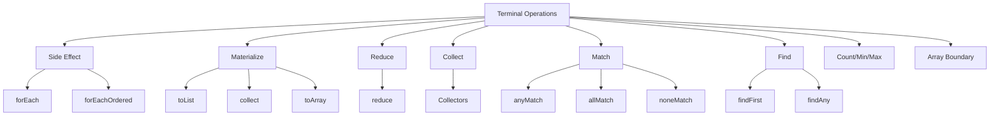

# Part 022 — Terminal Operations: Reduction, Matching, Finding, Counting, Materializing

> Target: setelah bagian ini, kamu mampu memilih terminal operation yang tepat berdasarkan **hasil yang diinginkan, determinisme, mutability, ordering, side-effect safety, dan reduction correctness**. Kamu juga akan mampu membedakan `reduce` vs `collect`, `toList` vs `Collectors.toList`, `findFirst` vs `findAny`, `forEach` vs `forEachOrdered`, serta kapan stream harus diganti dengan loop.

Intermediate operation mendeskripsikan pipeline. Terminal operation mengeksekusinya.

```java
Stream<OrderDto> pipeline = orders.stream()
    .filter(Order::isOpen)
    .map(OrderDto::from);

// Execution happens here.
List<OrderDto> result = pipeline.toList();
```

Mental model:

```text
terminal operation = boundary where lazy description becomes actual traversal
```

Terminal operation menentukan:

- apakah output berupa value tunggal, collection, array, optional, atau side effect
- apakah pipeline bisa short-circuit
- apakah encounter order dihormati
- apakah parallel execution aman
- apakah result mutable atau unmodifiable
- apakah failure akan muncul saat evaluation, bukan saat pipeline dibuat

---

## 1. Posisi Part Ini dalam Framework Kaufman



Kaufman-style deconstruction:

| Subskill | Latihan | Bukti Kamu Menguasai |
|---|---|---|
| Result-shape reasoning | Tentukan apakah output value/list/map/optional/side effect | Bisa memilih terminal operation tanpa trial-and-error |
| Reduction correctness | Uji identity, accumulator, associativity | `reduce` aman untuk sequential dan parallel reasoning |
| Collector reasoning | Pisahkan mutable accumulation dari immutable result | Bisa membuat aggregation defensible |
| Order reasoning | Pilih `findFirst`/`findAny`, `forEach`/`forEachOrdered` | Bisa menjelaskan determinisme output |
| Optional discipline | Tangani absence eksplisit | Tidak memakai `get()` sembarangan |
| Materialization boundary | Tentukan mutability dan ownership result | API boundary tidak bocor |

---

## 2. Terminal Operation Taxonomy

Mulai dari pertanyaan: “hasil apa yang benar-benar saya butuhkan?”

| Goal | Terminal Operation | Result |
|---|---|---|
| Materialize as unmodifiable list | `toList()` | `List<T>` |
| Materialize with custom container/policy | `collect(...)` | depends on collector |
| Convert to array | `toArray()` / `toArray(IntFunction)` | array |
| Count elements | `count()` | `long` |
| Test existence | `anyMatch(...)` | `boolean` |
| Test all | `allMatch(...)` | `boolean` |
| Test none | `noneMatch(...)` | `boolean` |
| Find deterministic first | `findFirst()` | `Optional<T>` |
| Find any, often parallel-friendly | `findAny()` | `Optional<T>` |
| Min/max by order | `min(...)` / `max(...)` | `Optional<T>` |
| Fold into scalar/value | `reduce(...)` | `T`, `Optional<T>`, or `U` |
| Mutable aggregation | `collect(...)` | container/result |
| Side-effect per element | `forEach(...)` | void |
| Ordered side-effect per element | `forEachOrdered(...)` | void |

Production rule:

> Choose terminal operation from result shape first, not from habit.

---

## 3. `toList()`: Simple Materialization with Unmodifiable Result

`Stream.toList()` materializes stream elements into a `List`.

```java
List<OrderDto> dtos = orders.stream()
    .filter(Order::isOpen)
    .map(OrderDto::from)
    .toList();
```

Important semantic point:

```text
Stream.toList() returns an unmodifiable List.
```

So this fails:

```java
List<String> names = Stream.of("a", "b")
    .toList();

names.add("c"); // UnsupportedOperationException
```

This is usually good for API boundaries because it prevents accidental mutation.

### 3.1 `toList()` vs `Collectors.toList()`

```java
List<String> a = stream.toList();

List<String> b = stream.collect(Collectors.toList());
```

Do not treat them as identical.

| Aspect | `Stream.toList()` | `Collectors.toList()` |
|---|---|---|
| Mutability | Unmodifiable | No guaranteed mutability contract |
| Simplicity | Very clear | More general collector mechanism |
| Use case | Most materialization | When using collector composition or older style |
| Type guarantee | `List` only | `List`, implementation not specified |

If you need a mutable `ArrayList`, say so explicitly:

```java
ArrayList<OrderDto> dtos = orders.stream()
    .map(OrderDto::from)
    .collect(Collectors.toCollection(ArrayList::new));
```

If you need an unmodifiable list with collector composition:

```java
List<OrderDto> dtos = orders.stream()
    .map(OrderDto::from)
    .collect(Collectors.toUnmodifiableList());
```

### 3.2 Boundary Rule

Return unmodifiable result by default unless mutation is part of the contract.

```java
public List<OrderDto> findOpenOrders() {
    return orders.stream()
        .filter(Order::isOpen)
        .map(OrderDto::from)
        .toList();
}
```

This says:

```text
Caller receives a result, not a mutable work buffer.
```

---

## 4. `toArray`: Crossing Back to Array Boundary

`toArray()` returns `Object[]`.

```java
Object[] values = stream.toArray();
```

Usually, prefer typed array:

```java
OrderDto[] values = orders.stream()
    .map(OrderDto::from)
    .toArray(OrderDto[]::new);
```

### 4.1 When Array Result Is Appropriate

Array result is appropriate when:

- calling legacy API
- interoperating with reflection/varargs/native boundary
- requiring compact primitive array via primitive stream
- fixed-size snapshot is desired

Otherwise, `List<T>` is often a better API boundary.

### 4.2 Primitive Stream Arrays

```java
int[] ids = orders.stream()
    .mapToInt(Order::numericId)
    .toArray();
```

This avoids boxing into `Integer`.

---

## 5. `count`, `min`, and `max`: Scalar Terminal Operations

### 5.1 `count`

```java
long openCount = orders.stream()
    .filter(Order::isOpen)
    .count();
```

`count()` returns `long`, not `int`, because stream size may exceed `Integer.MAX_VALUE`.

Do not do this:

```java
int count = orders.stream()
    .filter(Order::isOpen)
    .toList()
    .size();
```

Unless you need the list anyway, this materializes unnecessarily.

### 5.2 `min` and `max`

```java
Optional<Order> largest = orders.stream()
    .max(Comparator.comparing(Order::amount));
```

`min` and `max` return `Optional<T>` because the stream may be empty.

### 5.3 Comparator Must Be Defensible

```java
Optional<Customer> oldest = customers.stream()
    .min(Comparator
        .comparing(Customer::registeredAt)
        .thenComparing(Customer::id));
```

Tie-breaker matters if result must be deterministic.

---

## 6. Matching Operations: `anyMatch`, `allMatch`, `noneMatch`

Matching operations return boolean and may short-circuit.

### 6.1 `anyMatch`

```java
boolean hasOverdueInvoice = invoices.stream()
    .anyMatch(Invoice::isOverdue);
```

Use when question is existential:

```text
Does at least one element satisfy condition?
```

### 6.2 `allMatch`

```java
boolean allValid = records.stream()
    .allMatch(Record::isValid);
```

Use when condition must hold for every element.

Important: for empty stream, `allMatch` returns `true`. This is vacuous truth.

```java
boolean result = Stream.<String>empty()
    .allMatch(s -> s.length() > 3);
// true
```

This is mathematically consistent, but can surprise business code.

If empty input should fail, express that:

```java
boolean allValidAndNonEmpty = !records.isEmpty()
    && records.stream().allMatch(Record::isValid);
```

### 6.3 `noneMatch`

```java
boolean noBlockedAccounts = accounts.stream()
    .noneMatch(Account::isBlocked);
```

For empty stream, `noneMatch` also returns `true`.

### 6.4 Avoid Counting for Existence

Less efficient:

```java
boolean hasOpen = orders.stream()
    .filter(Order::isOpen)
    .count() > 0;
```

Better:

```java
boolean hasOpen = orders.stream()
    .anyMatch(Order::isOpen);
```

`anyMatch` can stop once it finds a match.

---

## 7. Finding Operations: `findFirst` vs `findAny`

### 7.1 `findFirst`

```java
Optional<Order> firstOpen = orders.stream()
    .filter(Order::isOpen)
    .findFirst();
```

Use when encounter order matters.

Example:

```text
first failed validation rule
first event in timeline
first matching escalation step
first configured routing rule
```

### 7.2 `findAny`

```java
Optional<Order> anyOpen = orders.parallelStream()
    .filter(Order::isOpen)
    .findAny();
```

Use when any matching element is acceptable, especially when parallel execution is plausible.

### 7.3 Determinism Rule

| Need | Use |
|---|---|
| First by source order | `findFirst` |
| Any match acceptable | `findAny` |
| First by business ordering | `sorted(...).findFirst()` or better domain-specific selection |
| Min/max by metric | `min` / `max` |

Do not use `findAny` if logs, tests, audit, or UI require stable result.

### 7.4 “First” Requires Meaningful Order

```java
Optional<Customer> first = customersFromHashSet.stream()
    .findFirst();
```

If source is a `HashSet`, “first” is not a stable business concept. Use a sequenced/ordered collection or sort explicitly.

---

## 8. `forEach` and `forEachOrdered`: Side-Effect Terminal Operations

`forEach` executes an action for each element.

```java
orders.stream()
    .filter(Order::isOpen)
    .forEach(order -> notification.send(order.id()));
```

This is terminal because the output is side effect, not a returned value.

### 8.1 When `forEach` Is Acceptable

Use `forEach` when side effect is genuinely the goal:

- send messages
- write to output sink
- call callback
- collect metrics where best-effort semantics are acceptable
- invoke idempotent operation per element

But if operation is complex, loop may be clearer.

```java
for (Order order : orders) {
    if (order.isOpen()) {
        notification.send(order.id());
    }
}
```

### 8.2 `forEach` vs `forEachOrdered`

On parallel streams, `forEach` does not guarantee encounter-order execution.

```java
orders.parallelStream()
    .forEach(order -> System.out.println(order.id()));
```

If order matters:

```java
orders.parallelStream()
    .forEachOrdered(order -> System.out.println(order.id()));
```

But preserving order can reduce parallel benefits.

### 8.3 Don’t Mutate External Collection in `forEach`

Bad:

```java
List<OrderDto> result = new ArrayList<>();

orders.stream()
    .filter(Order::isOpen)
    .forEach(order -> result.add(OrderDto.from(order)));
```

Better:

```java
List<OrderDto> result = orders.stream()
    .filter(Order::isOpen)
    .map(OrderDto::from)
    .toList();
```

Even worse with parallel stream:

```java
List<OrderDto> result = new ArrayList<>();

orders.parallelStream()
    .filter(Order::isOpen)
    .forEach(order -> result.add(OrderDto.from(order))); // unsafe
```

If you are collecting, use `collect`/`toList`. If you are causing side effects, be explicit and reason about idempotency, ordering, and failure.

---

## 9. `reduce`: Immutable Reduction

`reduce` combines stream elements into a single result using an associative function.

### 9.1 Simple Sum

```java
BigDecimal total = invoices.stream()
    .map(Invoice::amount)
    .reduce(BigDecimal.ZERO, BigDecimal::add);
```

Mental model:

```text
result = identity
for each element:
    result = accumulator(result, element)
```

### 9.2 Reduce Without Identity

```java
Optional<BigDecimal> maxAmount = invoices.stream()
    .map(Invoice::amount)
    .reduce(BigDecimal::max);
```

No identity means empty stream returns `Optional.empty()`.

### 9.3 Identity Must Be True Identity

For sum:

```java
BigDecimal.ZERO
```

Because:

```text
0 + x = x
```

For multiplication:

```java
BigDecimal.ONE
```

Because:

```text
1 * x = x
```

Wrong identity creates wrong result.

```java
int sum = numbers.stream()
    .reduce(10, Integer::sum); // wrong unless starting offset is intended
```

### 9.4 Accumulator Must Be Associative

Associativity means grouping does not change result.

```text
(a op b) op c == a op (b op c)
```

Addition is associative for integers in mathematical model, though overflow/float precision can complicate real machines.

Subtraction is not associative.

```java
int result = numbers.stream()
    .reduce(0, (a, b) -> a - b); // dangerous, especially parallel
```

Sequential and parallel results may differ.

### 9.5 Do Not Use `reduce` for Mutable Accumulation

Bad:

```java
List<OrderDto> result = orders.stream()
    .reduce(
        new ArrayList<>(),
        (list, order) -> {
            list.add(OrderDto.from(order));
            return list;
        },
        (left, right) -> {
            left.addAll(right);
            return left;
        }
    );
```

This abuses `reduce` with mutable state.

Use `map(...).toList()` or `collect(...)`:

```java
List<OrderDto> result = orders.stream()
    .map(OrderDto::from)
    .toList();
```

Rule:

> Use `reduce` for immutable value folding. Use `collect` for mutable accumulation.

---

## 10. Three-Argument `reduce`: Type-Changing Reduction

Example: total amount from invoices.

```java
BigDecimal total = invoices.stream()
    .reduce(
        BigDecimal.ZERO,
        (subtotal, invoice) -> subtotal.add(invoice.amount()),
        BigDecimal::add
    );
```

This form has:

```text
identity:     U
accumulator:  U x T -> U
combiner:     U x U -> U
```

It is useful when reducing `Stream<T>` into a different type `U`.

But be careful: if the accumulation container is mutable, `collect` is usually better.

---

## 11. `collect`: Mutable Reduction and Rich Aggregation

`collect` performs mutable reduction using a collector.

```java
Map<CustomerId, List<Order>> byCustomer = orders.stream()
    .collect(Collectors.groupingBy(Order::customerId));
```

Collector can express:

- list/set/map materialization
- grouping
- partitioning
- joining
- summarizing
- downstream aggregation
- custom mutable reduction

Detailed collector design is covered in Part 024 and Part 025. Here, focus on when terminal `collect` is the right boundary.

### 11.1 `collect` vs `reduce`

| Need | Prefer |
|---|---|
| Sum immutable values | `reduce` or primitive stream sum |
| Build list | `toList()` / collector |
| Build map | `collect(toMap(...))` |
| Group records | `collect(groupingBy(...))` |
| Accumulate into mutable container | `collect` |
| Combine immutable scalar | `reduce` |

### 11.2 Explicit Map Policy

Bad:

```java
Map<CustomerId, Customer> byId = customers.stream()
    .collect(Collectors.toMap(Customer::id, Function.identity()));
```

This throws if duplicate IDs exist. That might be good, but only if duplicate is truly illegal.

If first wins:

```java
Map<CustomerId, Customer> byId = customers.stream()
    .collect(Collectors.toMap(
        Customer::id,
        Function.identity(),
        (first, duplicate) -> first,
        LinkedHashMap::new
    ));
```

If duplicate should fail with domain-specific message, loop can be clearer:

```java
Map<CustomerId, Customer> byId = new LinkedHashMap<>();

for (Customer customer : customers) {
    Customer previous = byId.putIfAbsent(customer.id(), customer);
    if (previous != null) {
        throw new DuplicateCustomerException(customer.id());
    }
}
```

Rule:

> For maps, always make duplicate policy explicit.

---

## 12. Optional Handling in Terminal Results

Several terminal operations return `Optional<T>`:

- `findFirst`
- `findAny`
- `min`
- `max`
- `reduce` without identity

Do not blindly call `get()`.

Bad:

```java
Order first = orders.stream()
    .filter(Order::isOpen)
    .findFirst()
    .get();
```

Better if absence is expected:

```java
Optional<Order> first = orders.stream()
    .filter(Order::isOpen)
    .findFirst();
```

Better if absence is exceptional:

```java
Order first = orders.stream()
    .filter(Order::isOpen)
    .findFirst()
    .orElseThrow(() -> new IllegalStateException("No open order found"));
```

Better if default exists:

```java
Order order = orders.stream()
    .filter(Order::isOpen)
    .findFirst()
    .orElse(defaultOrder);
```

Better if default is expensive:

```java
Order order = orders.stream()
    .filter(Order::isOpen)
    .findFirst()
    .orElseGet(this::loadDefaultOrder);
```

### 12.1 Optional as Control-Flow Boundary

Optional should force you to answer:

```text
What does absence mean?
```

Possibilities:

- normal absence
- invalid input
- missing configuration
- data corruption
- race with external state
- empty result due to filters

Do not collapse all of these into `NoSuchElementException` from `get()`.

---

## 13. Short-Circuiting Terminal Operations

Short-circuiting terminal operations may finish without consuming all elements.

Examples:

- `anyMatch`
- `allMatch`
- `noneMatch`
- `findFirst`
- `findAny`

Example:

```java
boolean hasBlocked = accounts.stream()
    .anyMatch(Account::isBlocked);
```

If first account is blocked, stream does not need to inspect all accounts.

### 13.1 Side Effect Implication

If intermediate operations contain side effects, short-circuiting means side effects may not run for all elements.

Bad:

```java
boolean hasBlocked = accounts.stream()
    .peek(account -> audit.seen(account.id()))
    .anyMatch(Account::isBlocked);
```

This only audits accounts processed before short-circuit.

If audit all is required:

```java
for (Account account : accounts) {
    audit.seen(account.id());
}

boolean hasBlocked = accounts.stream()
    .anyMatch(Account::isBlocked);
```

Or combine explicitly in a loop if one traversal is required.

---

## 14. Terminal Operation and Exception Timing

Exceptions in stream pipeline usually occur at terminal operation time.

```java
Stream<String> pipeline = names.stream()
    .map(String::trim);

// No exception yet if names contains null.

List<String> result = pipeline.toList();
// NullPointerException here.
```

This matters for debugging.

If stack trace points to `toList`, the root cause may be in an earlier lambda.

Debug carefully:

```java
List<String> result = names.stream()
    .peek(name -> log.debug("raw name={}", name))
    .map(String::trim)
    .toList();
```

But remove `peek` after diagnosis unless logging is genuinely intended and safe.

---

## 15. Materialization Is a Boundary Decision

Every materialization allocates memory.

```java
List<Order> open = orders.stream()
    .filter(Order::isOpen)
    .toList();

List<OrderDto> dtos = open.stream()
    .map(OrderDto::from)
    .toList();
```

This can be correct if `open` is reused or inspected.

But if not:

```java
List<OrderDto> dtos = orders.stream()
    .filter(Order::isOpen)
    .map(OrderDto::from)
    .toList();
```

Avoid materializing intermediate collections unless they carry semantic value:

- snapshot boundary
- debugging boundary
- reuse boundary
- ownership boundary
- audit boundary
- performance boundary after expensive filter

### 15.1 Snapshot Boundary Example

```java
List<Order> eligibleSnapshot = orders.stream()
    .filter(policy::isEligible)
    .toList();

audit.recordEligibleOrders(eligibleSnapshot);

List<OrderDto> dtos = eligibleSnapshot.stream()
    .map(OrderDto::from)
    .toList();
```

Here materialization is meaningful: the snapshot is audited.

---

## 16. Stream Reuse and Terminal Operation

A stream can be consumed once.

Bad:

```java
Stream<Order> openOrders = orders.stream()
    .filter(Order::isOpen);

long count = openOrders.count();
List<Order> list = openOrders.toList(); // IllegalStateException may occur
```

Correct:

```java
List<Order> openOrders = orders.stream()
    .filter(Order::isOpen)
    .toList();

long count = openOrders.size();
```

Or recreate pipeline:

```java
long count = orders.stream()
    .filter(Order::isOpen)
    .count();

List<Order> list = orders.stream()
    .filter(Order::isOpen)
    .toList();
```

But avoid traversing twice if source is expensive or side-effecting.

---

## 17. Terminal Operations and Parallel Streams

Terminal operation choice affects parallel behavior.

### 17.1 Good Parallel Candidate

```java
BigDecimal total = invoices.parallelStream()
    .map(Invoice::amount)
    .reduce(BigDecimal.ZERO, BigDecimal::add);
```

Potentially okay if:

- data is large enough
- operation is CPU-bound
- reduction is associative
- no shared mutable state
- source splits well

### 17.2 Bad Parallel Candidate

```java
orders.parallelStream()
    .forEach(order -> externalApi.call(order.id()));
```

Problems:

- external IO
- rate limits
- common pool interference
- ordering unclear
- failure handling complex

Parallel stream is covered deeply in Part 028. For now:

> Terminal operation must be compatible with parallel semantics before `parallelStream()` is even considered.

---

## 18. Case Study: Validation Summary

Requirement:

Given records, produce:

- valid records
- invalid records with reasons
- boolean `allValid`
- first failure if any
- deterministic output

Naive stream:

```java
List<Record> valid = records.stream()
    .filter(Record::isValid)
    .toList();
```

Too weak. It loses reasons and failures.

Better:

```java
record ValidationIssue(String code, String message) {}

record AssessedRecord(Record record, List<ValidationIssue> issues) {
    boolean isValid() {
        return issues.isEmpty();
    }
}

record ValidationSummary(
    List<Record> validRecords,
    List<AssessedRecord> invalidRecords,
    boolean allValid,
    Optional<AssessedRecord> firstFailure
) {}

List<AssessedRecord> assessed = records.stream()
    .map(record -> new AssessedRecord(record, validate(record)))
    .toList();

List<Record> validRecords = assessed.stream()
    .filter(AssessedRecord::isValid)
    .map(AssessedRecord::record)
    .toList();

List<AssessedRecord> invalidRecords = assessed.stream()
    .filter(result -> !result.isValid())
    .toList();

boolean allValid = invalidRecords.isEmpty();

Optional<AssessedRecord> firstFailure = invalidRecords.stream()
    .findFirst();

ValidationSummary summary = new ValidationSummary(
    validRecords,
    invalidRecords,
    allValid,
    firstFailure
);
```

Why this is better:

- `map` creates explicit assessment data
- `toList` creates stable snapshots
- `filter` selects after failure data exists
- `findFirst` has deterministic meaning if `records` order is meaningful
- no side-effect hidden in stream lambdas

---

## 19. Case Study: Build an Index with Duplicate Policy

Requirement:

Build `Map<AccountId, Account>` from accounts.

Duplicate policy:

- duplicate account ID is illegal
- error should include duplicate ID
- preserve input order for deterministic diagnostics

Stream-only approach:

```java
Map<AccountId, Account> byId = accounts.stream()
    .collect(Collectors.toMap(Account::id, Function.identity()));
```

This may throw duplicate key exception, but domain error may not be good enough.

Explicit loop:

```java
Map<AccountId, Account> byId = new LinkedHashMap<>();

for (Account account : accounts) {
    Account previous = byId.putIfAbsent(account.id(), account);
    if (previous != null) {
        throw new DuplicateAccountException(account.id());
    }
}

Map<AccountId, Account> result = Collections.unmodifiableMap(byId);
```

Lesson:

> Terminal operation selection is not about using streams everywhere. It is about choosing the most defensible execution boundary.

---

## 20. Decision Matrix

| Situation | Recommended Terminal Operation | Reason |
|---|---|---|
| Need list result, no mutation by caller | `toList()` | Simple, unmodifiable result |
| Need mutable `ArrayList` | `collect(toCollection(ArrayList::new))` | Mutability explicit |
| Need array for legacy API | `toArray(Type[]::new)` | Typed array boundary |
| Need count only | `count()` | Avoid materialization |
| Need existence | `anyMatch()` | Short-circuits |
| Need all valid | `allMatch()` plus non-empty check if required | Express universal condition |
| Need absence of violation | `noneMatch()` | Express negative universal condition |
| Need first by encounter order | `findFirst()` | Deterministic if source order meaningful |
| Need any match | `findAny()` | More freedom, especially parallel |
| Need min/max | `min()` / `max()` | Direct scalar selection |
| Need immutable scalar fold | `reduce()` | Value reduction |
| Need grouping/indexing | `collect()` | Mutable reduction abstraction |
| Need per-element side effect | `forEach()` or loop | Side effect is the goal |
| Need ordered side effect | `forEachOrdered()` or loop | Preserve encounter order |
| Need domain-specific duplicate diagnostics | loop or explicit collector | Better failure semantics |

---

## 21. Code Review Checklist

Saat review terminal operation, tanyakan:

1. Apakah terminal operation sesuai result shape yang dibutuhkan?
2. Apakah pipeline materialize data yang sebenarnya tidak perlu?
3. Apakah result harus mutable atau unmodifiable?
4. Apakah `toList()` unmodifiable sesuai kontrak caller?
5. Apakah `Collectors.toList()` dipakai karena perlu collector atau hanya habit?
6. Apakah `forEach` menyembunyikan collection building?
7. Apakah side effect idempotent, ordered, dan failure-safe?
8. Apakah `reduce` punya identity benar?
9. Apakah accumulator associative?
10. Apakah `reduce` disalahgunakan untuk mutable accumulation?
11. Apakah matching operation lebih baik daripada `count() > 0`?
12. Apakah `findFirst` bergantung pada source order yang jelas?
13. Apakah `findAny` acceptable secara determinisme?
14. Apakah Optional absence ditangani eksplisit?
15. Apakah terminal operation akan tetap benar jika pipeline dibuat parallel?
16. Apakah exception akan muncul di terminal boundary dan mudah didiagnosis?
17. Apakah loop lebih jelas untuk domain-specific error handling?

---

## 22. Deliberate Practice

### Exercise 1 — Replace Wasteful Materialization

Refactor:

```java
boolean hasExpired = policies.stream()
    .filter(Policy::isExpired)
    .toList()
    .size() > 0;
```

Expected:

```java
boolean hasExpired = policies.stream()
    .anyMatch(Policy::isExpired);
```

### Exercise 2 — Fix Unsafe `forEach`

Refactor:

```java
List<OrderDto> result = new ArrayList<>();

orders.parallelStream()
    .filter(Order::isOpen)
    .forEach(order -> result.add(OrderDto.from(order)));
```

Expected:

```java
List<OrderDto> result = orders.parallelStream()
    .filter(Order::isOpen)
    .map(OrderDto::from)
    .toList();
```

Then discuss whether parallel stream is justified at all.

### Exercise 3 — Validate Reduce Identity

Is this correct?

```java
int product = numbers.stream()
    .reduce(0, (a, b) -> a * b);
```

Expected answer: no. Multiplication identity is `1`, not `0`.

### Exercise 4 — `findFirst` or `findAny`

Choose terminal operation for each:

1. first validation failure in uploaded file
2. any eligible worker for load-balanced task
3. first escalation rule in configured order
4. any duplicate ID for fast rejection

Expected:

1. `findFirst`
2. `findAny`
3. `findFirst`
4. `findAny` may be acceptable if diagnostic determinism is not required; otherwise deterministic duplicate detection needs explicit order.

### Exercise 5 — Explicit Duplicate Policy

Build `Map<CustomerId, Customer>` where duplicate ID should fail with `DuplicateCustomerException` and input order should be preserved.

Implement both:

- collector-based version
- explicit loop version

Compare readability and failure quality.

---

## 23. Summary

Terminal operations are the execution boundary of stream pipelines.

Key takeaways:

- `toList()` is the default simple materialization when unmodifiable result is acceptable.
- `toArray(Type[]::new)` is the correct typed array boundary.
- `count()` avoids unnecessary materialization when only count is needed.
- `anyMatch`, `allMatch`, and `noneMatch` express boolean questions and may short-circuit.
- `findFirst` is deterministic only when source encounter order is meaningful.
- `findAny` is appropriate when any matching element is acceptable.
- `forEach` is for side effects, not collection building.
- `forEachOrdered` preserves order but may reduce parallel benefit.
- `reduce` is for immutable, associative value folding.
- `collect` is for mutable aggregation and richer result construction.
- Optional terminal results force you to define absence semantics.
- Materialization should be a conscious boundary, not a reflex.
- A loop is often better when failure policy, side effect ordering, or domain diagnostics are central.

The next part moves into **Primitive Streams**: `IntStream`, `LongStream`, `DoubleStream`, boxing cost, ranges, numeric aggregation, precision boundaries, and when primitive streams improve or hurt production code.
