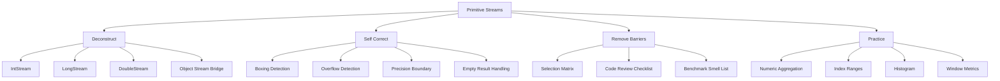

# Part 023 — Primitive Streams: `IntStream`, `LongStream`, `DoubleStream`

> Target: setelah bagian ini, kamu mampu memilih kapan memakai `Stream<T>` biasa dan kapan memakai primitive stream untuk **menghindari boxing**, menjaga **numeric correctness**, mengurangi **allocation pressure**, dan membuat pipeline aggregation yang jelas. Kamu juga akan mampu membaca failure mode numeric stream: overflow, precision loss, empty result, accidental boxing, dan semantic drift antara `int`, `long`, `double`, `BigDecimal`, dan domain value object.

Primitive stream bukan fitur kosmetik. Ia adalah jalur khusus di Stream API untuk data numerik primitif.

Java Stream API punya empat keluarga utama:

```text
Stream<T>     -> object/reference elements
IntStream     -> primitive int elements
LongStream    -> primitive long elements
DoubleStream  -> primitive double elements
```

Dokumentasi `java.util.stream` menyebut `IntStream`, `LongStream`, dan `DoubleStream` sebagai primitive specializations dari stream. Artinya, mereka tetap mengikuti model stream yang sama: source, intermediate operation, terminal operation, laziness, non-interference, stateless function, dan single-use pipeline.

Perbedaannya: elemen pipeline tidak perlu dibungkus menjadi `Integer`, `Long`, atau `Double` selama tetap berada di jalur primitive.

---

## 1. Posisi Part Ini dalam Framework Kaufman



Di level top engineer, primitive stream bukan sekadar “lebih cepat”. Pertanyaan yang benar:

```text
Apakah pipeline ini secara semantik memang numeric primitive pipeline,
atau sebenarnya domain calculation yang membutuhkan type/domain object lebih kuat?
```

Contoh:

- menghitung jumlah item: `IntStream` masuk akal
- menjumlahkan nominal uang: primitive stream bisa salah secara domain jika uang butuh scale, currency, rounding policy
- menghitung latency nanosecond: `LongStream` masuk akal
- menghitung average CPU usage: `DoubleStream` bisa masuk akal, tetapi precision dan NaN policy harus eksplisit

---

## 2. Problem yang Diselesaikan Primitive Stream

Tanpa primitive stream, pipeline numerik berbasis `Stream<T>` sering jatuh ke boxing.

```java
List<Integer> numbers = List.of(1, 2, 3, 4);

int sum = numbers.stream()
    .map(n -> n * 2)      // Integer -> Integer, boxing/unboxing possible
    .reduce(0, Integer::sum);
```

Versi primitive:

```java
int sum = numbers.stream()
    .mapToInt(Integer::intValue)
    .map(n -> n * 2)
    .sum();
```

Perbedaannya bukan hanya syntax. Perbedaannya ada pada pipeline representation:

```text
Stream<Integer> pipeline:
  references to Integer objects
  possible unboxing for arithmetic
  possible boxing for mapped results
  object identity/null hazards

IntStream pipeline:
  primitive int values
  primitive arithmetic operations
  specialized terminal operations
  no null element
```

Primitive stream menyelesaikan beberapa masalah:

1. **Allocation pressure** dari boxed values.
2. **Pointer chasing** saat membaca object wrapper.
3. **Null contamination** pada numeric stream.
4. **Verbose reduction** untuk operasi umum seperti sum, min, max, average.
5. **Index/range pipeline** tanpa membuat list angka.

Namun primitive stream tidak otomatis menyelesaikan:

- overflow
- rounding
- precision
- domain unit mismatch
- incorrect parallel reduction
- readability problem

---

## 3. Mental Model: Primitive Stream adalah Numeric Pipeline, Bukan Collection

`IntStream` bukan `List<Integer>` yang lebih cepat.

```text
collection = stored data structure
stream     = traversal/processing pipeline
```

`IntStream.range(0, n)` tidak menyimpan semua angka `0..n-1` sebagai array. Ia membuat source stream yang bisa menghasilkan nilai secara lazy.

```java
IntStream.range(0, 1_000_000)
    .filter(i -> i % 2 == 0)
    .limit(3)
    .forEach(System.out::println);
```

Pipeline di atas tidak perlu membangun satu juta boxed `Integer`.

Mental model penting:

```text
IntStream.range(0, n)
  = generator source dengan primitive int cursor
```

Ini sangat berguna untuk:

- index-driven traversal
- synthetic numeric sequences
- sampling
- pagination calculations
- hash bucket probing
- metric aggregation
- test-data generation

Tetapi hati-hati: range stream bisa membuat code terlihat functional padahal sebenarnya index loop lebih jelas.

```java
// Boleh, tetapi belum tentu lebih jelas.
IntStream.range(0, users.size())
    .filter(i -> users.get(i).isActive())
    .mapToObj(users::get)
    .toList();
```

Jika kamu butuh elemen, bukan index, gunakan element stream:

```java
List<User> activeUsers = users.stream()
    .filter(User::isActive)
    .toList();
```

Gunakan `IntStream.range` saat index adalah bagian dari semantics.

---

## 4. `IntStream`: Untuk Count, Index, Small Numeric Domain, dan Dense Integer Work

`IntStream` adalah spesialisasi untuk nilai `int`.

Contoh source:

```java
IntStream.of(10, 20, 30);
IntStream.range(0, 10);        // 0..9
IntStream.rangeClosed(0, 10);  // 0..10
Arrays.stream(new int[] {1, 2, 3});
```

Terminal umum:

```java
int sum = IntStream.rangeClosed(1, 100).sum();
long count = IntStream.range(0, 100).count();
OptionalInt min = IntStream.of(5, 2, 9).min();
OptionalInt max = IntStream.of(5, 2, 9).max();
OptionalDouble avg = IntStream.of(5, 2, 9).average();
IntSummaryStatistics stats = IntStream.of(5, 2, 9).summaryStatistics();
```

### 4.1 Kapan `IntStream` Tepat

Gunakan `IntStream` untuk:

- index traversal yang memang butuh index
- counting dan small integer aggregation
- histogram dengan bounded integer key
- numeric filtering pada primitive `int[]`
- test input generation
- mapping object ke numeric property `int`

Contoh production:

```java
int totalItems = orders.stream()
    .mapToInt(Order::itemCount)
    .sum();
```

Lebih baik daripada:

```java
int totalItems = orders.stream()
    .map(Order::itemCount) // Stream<Integer>
    .reduce(0, Integer::sum);
```

### 4.2 Kapan `IntStream` Berbahaya

`int` overflow diam-diam.

```java
int sum = IntStream.of(Integer.MAX_VALUE, 1).sum();
System.out.println(sum); // overflow
```

Jika total bisa melewati `Integer.MAX_VALUE`, naikkan ke `long` sebelum aggregation:

```java
long sum = orders.stream()
    .mapToLong(Order::itemCount)
    .sum();
```

Aturan praktis:

```text
count kecil / bounded -> int mungkin cukup
count agregat lintas batch/customer/day -> long lebih defensible
```

---

## 5. `LongStream`: Untuk Count Besar, Time, Size, Offset, dan Identifier Numeric

`LongStream` adalah spesialisasi untuk nilai `long`.

Common source:

```java
LongStream.of(1L, 2L, 3L);
LongStream.range(0L, 1_000_000_000L);
Arrays.stream(new long[] {10L, 20L, 30L});
```

Use case production:

```java
long totalBytes = files.stream()
    .mapToLong(FileMetadata::sizeBytes)
    .sum();
```

```java
LongSummaryStatistics latencyStats = events.stream()
    .mapToLong(Event::latencyNanos)
    .summaryStatistics();
```

### 5.1 `long` Bukan Bebas Overflow

`long` jauh lebih besar dari `int`, tetapi tetap bounded.

```java
long sum = LongStream.of(Long.MAX_VALUE, 1L).sum();
// overflow
```

Untuk domain seperti money, ledger, billing, exposure, atau high-stakes total, jangan memakai `long` tanpa unit contract.

Contoh defensible:

```java
record MoneyMinor(long amount, Currency currency) {
    MoneyMinor plus(MoneyMinor other) {
        if (!currency.equals(other.currency)) {
            throw new IllegalArgumentException("Currency mismatch");
        }
        return new MoneyMinor(Math.addExact(amount, other.amount), currency);
    }
}
```

Stream dengan `long` bisa tetap digunakan untuk minor-unit aggregation jika policy overflow eksplisit:

```java
long totalMinor = entries.stream()
    .mapToLong(LedgerEntry::amountMinor)
    .reduce(0L, Math::addExact);
```

`sum()` tidak memakai `Math.addExact`. Jika overflow harus terdeteksi, pakai `reduce` dengan `Math.addExact`.

---

## 6. `DoubleStream`: Untuk Continuous Metrics, Bukan Exact Decimal Domain

`DoubleStream` adalah spesialisasi untuk `double`.

Contoh:

```java
DoubleSummaryStatistics stats = samples.stream()
    .mapToDouble(Sample::cpuUsage)
    .summaryStatistics();
```

Use case yang masuk akal:

- latency percentile input preparation
- CPU/memory utilization ratio
- scoring heuristics
- telemetry numeric metrics
- scientific/approximate calculation
- probability-like value

Use case yang biasanya tidak masuk akal:

- uang
- tax
- regulatory exposure
- billing invoice
- exact decimal quantity

`double` adalah binary floating-point. Banyak decimal value tidak bisa direpresentasikan secara exact.

```java
double result = DoubleStream.of(0.1, 0.2).sum();
System.out.println(result); // not exactly 0.3 in binary floating-point semantics
```

Untuk money atau exact decimal, gunakan `BigDecimal` atau domain type, meskipun stream-nya object stream:

```java
BigDecimal total = invoices.stream()
    .map(Invoice::amount)
    .reduce(BigDecimal.ZERO, BigDecimal::add);
```

### 6.1 NaN dan Infinity Policy

`DoubleStream` bisa membawa `NaN`, `Infinity`, `-Infinity`.

```java
DoubleSummaryStatistics stats = DoubleStream.of(1.0, Double.NaN, 3.0)
    .summaryStatistics();
```

Dalam production system, ini harus punya policy:

```java
DoubleSummaryStatistics stats = metrics.stream()
    .mapToDouble(Metric::value)
    .filter(Double::isFinite)
    .summaryStatistics();
```

Tanpa policy, satu `NaN` bisa merusak agregasi.

---

## 7. Object Stream ke Primitive Stream

Bridge paling umum:

```java
Stream<Order> orders = ...;

IntStream itemCounts = orders.mapToInt(Order::itemCount);
LongStream sizes = files.stream().mapToLong(FileMetadata::sizeBytes);
DoubleStream scores = users.stream().mapToDouble(UserScore::score);
```

Gunakan:

- `mapToInt`
- `mapToLong`
- `mapToDouble`

Contoh:

```java
double averageAge = users.stream()
    .mapToInt(User::age)
    .average()
    .orElse(0.0);
```

Tapi hati-hati dengan default value.

```java
.orElse(0.0)
```

Apakah “tidak ada user” memang sama dengan average `0.0`? Sering kali tidak.

Lebih defensible:

```java
OptionalDouble averageAge = users.stream()
    .mapToInt(User::age)
    .average();
```

Biarkan caller memutuskan empty policy.

---

## 8. Primitive Stream ke Object Stream

Bridge balik:

```java
Stream<Integer> boxed = IntStream.range(0, 10).boxed();
```

Atau:

```java
List<Integer> ids = IntStream.rangeClosed(1, 100)
    .boxed()
    .toList();
```

Gunakan `boxed()` hanya saat memang harus materialize ke object collection.

Anti-pattern:

```java
int sum = IntStream.range(0, 1_000)
    .boxed()
    .mapToInt(Integer::intValue)
    .sum();
```

Ini bolak-balik tanpa alasan.

Bridge lain:

```java
Stream<String> labels = IntStream.range(0, 3)
    .mapToObj(i -> "item-" + i);
```

Gunakan `mapToObj` saat hasilnya memang object:

```java
List<LineNumberedError> errors = IntStream.range(0, lines.size())
    .filter(i -> isInvalid(lines.get(i)))
    .mapToObj(i -> new LineNumberedError(i + 1, lines.get(i)))
    .toList();
```

Di sini index punya makna domain: line number.

---

## 9. Range: `range` vs `rangeClosed`

`IntStream.range(startInclusive, endExclusive)`:

```java
IntStream.range(0, 5) // 0, 1, 2, 3, 4
```

`IntStream.rangeClosed(startInclusive, endInclusive)`:

```java
IntStream.rangeClosed(0, 5) // 0, 1, 2, 3, 4, 5
```

Untuk index list/array, gunakan `range(0, size)`.

```java
IntStream.range(0, array.length)
    .forEach(i -> process(array[i]));
```

Untuk domain inclusive range seperti day-of-month, rank, level, gunakan `rangeClosed` jika semantics memang inclusive.

```java
IntStream.rangeClosed(1, 31)
    .forEach(day -> generateDailySlot(day));
```

Failure mode umum:

```java
// Bug: index out of bounds when i == list.size()
IntStream.rangeClosed(0, list.size())
    .mapToObj(list::get)
    .toList();
```

Checklist:

```text
Array/list index?       -> range(0, size)
Human ordinal/domain?   -> maybe rangeClosed(start, end)
Empty range allowed?    -> validate behavior
Negative boundary?      -> test explicitly
```

---

## 10. Arrays dan Primitive Stream

`Arrays.stream` punya overload untuk primitive arrays.

```java
int[] values = {1, 2, 3};
int sum = Arrays.stream(values).sum();
```

Ini lebih baik daripada:

```java
int sum = Stream.of(values) // Stream<int[]>; one element, not Stream<Integer>
    .mapToInt(arr -> arr.length)
    .sum();
```

Perhatikan trap:

```java
int[] values = {1, 2, 3};
Stream<int[]> wrong = Stream.of(values);
```

Karena `int[]` adalah object, `Stream.of(values)` menghasilkan stream dengan satu elemen: array itu sendiri.

Correct:

```java
IntStream stream = Arrays.stream(values);
```

Untuk `Integer[]`:

```java
Integer[] values = {1, 2, 3};
int sum = Arrays.stream(values)
    .mapToInt(Integer::intValue)
    .sum();
```

---

## 11. Specialized Optional Types

Primitive stream terminal operations sering menghasilkan:

- `OptionalInt`
- `OptionalLong`
- `OptionalDouble`

Contoh:

```java
OptionalInt max = users.stream()
    .mapToInt(User::age)
    .max();
```

Kenapa bukan `Optional<Integer>`?

Karena tetap menghindari boxing pada result path.

Production rule:

```text
Jangan sembunyikan empty numeric result dengan magic default kecuali business policy-nya eksplisit.
```

Kurang baik:

```java
int maxAge = users.stream()
    .mapToInt(User::age)
    .max()
    .orElse(0);
```

Lebih baik:

```java
OptionalInt maxAge = users.stream()
    .mapToInt(User::age)
    .max();
```

Atau jika policy jelas:

```java
int maxAgeOrMinimumAdultAge = users.stream()
    .mapToInt(User::age)
    .max()
    .orElse(18);
```

Nama variable harus menyatakan policy.

---

## 12. Summary Statistics

Primitive streams punya `summaryStatistics()`.

```java
IntSummaryStatistics stats = orders.stream()
    .mapToInt(Order::itemCount)
    .summaryStatistics();

long count = stats.getCount();
int min = stats.getMin();
int max = stats.getMax();
long sum = stats.getSum();
double average = stats.getAverage();
```

Untuk `LongStream`:

```java
LongSummaryStatistics stats = events.stream()
    .mapToLong(Event::latencyNanos)
    .summaryStatistics();
```

Untuk `DoubleStream`:

```java
DoubleSummaryStatistics stats = samples.stream()
    .mapToDouble(Sample::value)
    .summaryStatistics();
```

### 12.1 Empty Stream Behavior

Pada empty stream:

```java
IntSummaryStatistics stats = IntStream.empty().summaryStatistics();

stats.getCount();   // 0
stats.getSum();     // 0
stats.getAverage(); // 0.0
```

Tetapi `min` dan `max` punya sentinel behavior:

```java
stats.getMin(); // Integer.MAX_VALUE
stats.getMax(); // Integer.MIN_VALUE
```

Jangan expose min/max dari empty stats tanpa memeriksa `count`.

```java
if (stats.getCount() == 0) {
    return Optional.empty();
}
return Optional.of(new Range(stats.getMin(), stats.getMax()));
```

---

## 13. Numeric Correctness: Overflow, Precision, and Units

Primitive stream membuat numeric aggregation mudah, tetapi tidak otomatis benar.

### 13.1 Overflow

```java
int total = orders.stream()
    .mapToInt(Order::itemCount)
    .sum();
```

Jika total item bisa besar, ganti:

```java
long total = orders.stream()
    .mapToLong(Order::itemCount)
    .sum();
```

Jika overflow harus terdeteksi:

```java
long total = orders.stream()
    .mapToLong(Order::amountMinor)
    .reduce(0L, Math::addExact);
```

### 13.2 Precision

```java
double total = payments.stream()
    .mapToDouble(Payment::amount)
    .sum();
```

Jika `amount` adalah uang, ini smell.

Gunakan:

```java
BigDecimal total = payments.stream()
    .map(Payment::amount)
    .reduce(BigDecimal.ZERO, BigDecimal::add);
```

Atau domain type:

```java
Money total = payments.stream()
    .map(Payment::money)
    .reduce(Money.zero(currency), Money::plus);
```

### 13.3 Units

```java
long total = events.stream()
    .mapToLong(Event::duration)
    .sum();
```

Apa unit `duration`? millis? nanos? seconds?

Lebih baik:

```java
long totalNanos = events.stream()
    .mapToLong(Event::durationNanos)
    .sum();
```

Atau domain type:

```java
Duration total = events.stream()
    .map(Event::duration)
    .reduce(Duration.ZERO, Duration::plus);
```

---

## 14. Histograms dengan Primitive Stream

Misalnya kamu punya skor 0..100 dan ingin histogram per bucket 10 poin.

```java
int[] buckets = new int[11];

scores.stream()
    .mapToInt(Score::value)
    .forEach(score -> buckets[score / 10]++);
```

Ini side-effectful, tetapi bisa defensible jika:

- stream sequential
- mutable array local, tidak dishare
- bucket boundary jelas
- code review memahami ownership

Namun versi loop sering lebih jelas:

```java
int[] buckets = new int[11];

for (Score score : scores) {
    buckets[score.value() / 10]++;
}
```

Stream bukan agama. Jika mutation local membuat loop lebih jelas, gunakan loop.

Versi collector object-stream bisa lebih ekspresif untuk non-bounded key:

```java
Map<Integer, Long> histogram = scores.stream()
    .collect(Collectors.groupingBy(
        score -> score.value() / 10,
        Collectors.counting()
    ));
```

Trade-off:

```text
int[] bucket        -> faster, compact, bounded domain, less expressive
Map<Integer, Long>  -> flexible, clearer key semantics, more allocation
```

---

## 15. Index-Aware Transformations

Java Stream API tidak punya built-in `zipWithIndex`. `IntStream.range` sering dipakai.

```java
List<IndexedLine> indexed = IntStream.range(0, lines.size())
    .mapToObj(i -> new IndexedLine(i + 1, lines.get(i)))
    .toList();
```

Ini tepat karena index adalah bagian dari output.

Namun jangan gunakan index range hanya untuk menghindari enhanced for-loop.

Kurang baik:

```java
IntStream.range(0, users.size())
    .mapToObj(users::get)
    .filter(User::active)
    .toList();
```

Lebih baik:

```java
users.stream()
    .filter(User::active)
    .toList();
```

Rule:

```text
Use IntStream.range when the index has domain meaning.
Do not use it merely to simulate a for-loop.
```

---

## 16. Primitive Stream dan `flatMapToInt` / `flatMapToLong` / `flatMapToDouble`

Object stream dapat di-flatten ke primitive stream.

```java
int totalQuantity = orders.stream()
    .flatMap(order -> order.lines().stream())
    .mapToInt(OrderLine::quantity)
    .sum();
```

Atau:

```java
int totalQuantity = orders.stream()
    .flatMapToInt(order -> order.lines().stream()
        .mapToInt(OrderLine::quantity))
    .sum();
```

Perbedaan utamanya adalah kapan pipeline masuk ke primitive specialization.

Untuk nested numeric primitive arrays:

```java
int total = batches.stream()
    .flatMapToInt(batch -> Arrays.stream(batch.values()))
    .sum();
```

Jika kamu punya `List<int[]>`, ini sangat berguna:

```java
List<int[]> chunks = ...;

int total = chunks.stream()
    .flatMapToInt(Arrays::stream)
    .sum();
```

---

## 17. `mapMulti` vs Primitive Streams

`mapMulti` sudah dibahas di Part 021 sebagai alternative untuk `flatMap` dalam beberapa kasus. Untuk primitive stream, ada varian seperti `mapMultiToInt` dari object stream.

Contoh: extract zero or more int values tanpa membuat intermediate stream per element.

```java
IntStream validCodes = records.stream()
    .mapMultiToInt((record, downstream) -> {
        for (String raw : record.rawCodes()) {
            OptionalInt parsed = parseCode(raw);
            parsed.ifPresent(downstream);
        }
    });
```

Ini bisa mengurangi overhead dibanding membuat banyak `IntStream` kecil.

Namun gunakan dengan disiplin:

- callback jangan menyimpan `downstream`
- callback jangan emit setelah return
- logic jangan terlalu kompleks

Jika code sulit dibaca, extractor method lebih baik:

```java
IntStream validCodes = records.stream()
    .mapMultiToInt(RecordParsers::emitValidCodes);
```

---

## 18. Primitive Stream dan Parallel Execution

Primitive stream bisa parallel seperti stream biasa.

```java
long total = LongStream.range(0, 1_000_000_000L)
    .parallel()
    .filter(this::isInteresting)
    .count();
```

Tapi parallel stream bukan “turbo button”. Pertimbangkan:

- source splitting quality
- CPU-bound vs IO-bound work
- shared mutable state
- associativity reduction
- ordering requirement
- ForkJoin common pool impact

Primitive stream sering cocok untuk parallel jika:

- source range besar
- operation CPU-bound
- no shared mutable state
- reduction associative
- ordering tidak penting

Contoh yang relatif aman:

```java
long count = LongStream.range(0, upperBound)
    .parallel()
    .filter(this::passesPureCpuPredicate)
    .count();
```

Contoh yang buruk:

```java
List<Long> result = new ArrayList<>();

LongStream.range(0, upperBound)
    .parallel()
    .filter(this::passes)
    .forEach(result::add); // data race
```

Bagian parallel stream akan dibahas lebih dalam di Part 028.

---

## 19. `sum`, `reduce`, dan `collect`: Pilih yang Sesuai

Untuk primitive stream, gunakan terminal specialized jika cukup:

```java
int total = items.stream()
    .mapToInt(Item::quantity)
    .sum();
```

Gunakan `reduce` jika butuh custom arithmetic policy:

```java
long total = entries.stream()
    .mapToLong(Entry::amountMinor)
    .reduce(0L, Math::addExact);
```

Gunakan collector/object aggregation jika result bukan primitive tunggal:

```java
Map<String, IntSummaryStatistics> statsByRegion = orders.stream()
    .collect(Collectors.groupingBy(
        Order::region,
        Collectors.summarizingInt(Order::itemCount)
    ));
```

Ini contoh bridge penting: collector downstream bisa melakukan primitive extraction tanpa kamu mengubah seluruh pipeline menjadi primitive stream.

---

## 20. Collectors yang Berhubungan dengan Primitive Aggregation

Walaupun Part 024 membahas collectors secara detail, beberapa collector relevan di sini:

```java
Collectors.summingInt(Order::itemCount)
Collectors.summingLong(FileMetadata::sizeBytes)
Collectors.summingDouble(Metric::value)

Collectors.averagingInt(User::age)
Collectors.averagingLong(Event::latencyMillis)
Collectors.averagingDouble(Sample::value)

Collectors.summarizingInt(Order::itemCount)
Collectors.summarizingLong(Event::latencyNanos)
Collectors.summarizingDouble(Metric::value)
```

Contoh:

```java
Map<String, Long> bytesByOwner = files.stream()
    .collect(Collectors.groupingBy(
        FileMetadata::owner,
        Collectors.summingLong(FileMetadata::sizeBytes)
    ));
```

Perhatikan bedanya:

```java
long totalBytes = files.stream()
    .mapToLong(FileMetadata::sizeBytes)
    .sum();
```

vs

```java
Map<String, Long> totalBytesByOwner = files.stream()
    .collect(Collectors.groupingBy(
        FileMetadata::owner,
        Collectors.summingLong(FileMetadata::sizeBytes)
    ));
```

Primitive stream bagus untuk satu aggregation path. Collector bagus untuk aggregation berstruktur.

---

## 21. Decision Matrix

| Situation | Prefer | Why |
|---|---|---|
| Sum simple `int` property | `mapToInt(...).sum()` | Clear and avoids boxing |
| Sum may exceed int | `mapToLong(...).sum()` | Safer range |
| Overflow must fail fast | `reduce(0L, Math::addExact)` | Explicit overflow policy |
| Money exact decimal | `Stream<BigDecimal>` / domain `Money` | Avoid binary floating error |
| Index has domain meaning | `IntStream.range(0, size)` | Explicit index semantics |
| Just filtering elements | `collection.stream()` | Avoid fake index pipeline |
| Numeric stats by group | `groupingBy(..., summarizingInt/Long/Double)` | Structured aggregation |
| Bounded histogram hot path | local primitive array + loop | Clear and efficient |
| Huge CPU-bound numeric range | maybe parallel primitive stream | Splittable source |
| IO-bound operation | not parallel stream | Common pool misuse risk |

---

## 22. Failure Catalogue

### 22.1 Accidental Boxing

```java
int total = list.stream()
    .map(x -> x.quantity())
    .reduce(0, Integer::sum);
```

Better:

```java
int total = list.stream()
    .mapToInt(Item::quantity)
    .sum();
```

### 22.2 `Stream.of(intArray)` Trap

```java
Stream<int[]> wrong = Stream.of(new int[] {1, 2, 3});
```

Better:

```java
IntStream right = Arrays.stream(new int[] {1, 2, 3});
```

### 22.3 Wrong Empty Default

```java
double average = users.stream()
    .mapToInt(User::age)
    .average()
    .orElse(0.0);
```

Maybe better:

```java
OptionalDouble average = users.stream()
    .mapToInt(User::age)
    .average();
```

### 22.4 Money with `DoubleStream`

```java
double total = invoices.stream()
    .mapToDouble(Invoice::amount)
    .sum();
```

Better:

```java
BigDecimal total = invoices.stream()
    .map(Invoice::amount)
    .reduce(BigDecimal.ZERO, BigDecimal::add);
```

### 22.5 Parallel Side Effects

```java
int[] buckets = new int[10];

scores.parallelStream()
    .mapToInt(Score::value)
    .forEach(score -> buckets[score / 10]++); // race
```

Better:

- keep sequential
- use collector with safe merge
- use explicit concurrency primitive if truly needed
- use loop if local sequential mutation is clearer

### 22.6 Hidden Overflow

```java
int total = largeOrders.stream()
    .mapToInt(Order::itemCount)
    .sum();
```

Better:

```java
long total = largeOrders.stream()
    .mapToLong(Order::itemCount)
    .sum();
```

Or:

```java
long total = largeOrders.stream()
    .mapToLong(Order::itemCount)
    .reduce(0L, Math::addExact);
```

---

## 23. Production Example: Audit Batch Metrics

Problem:

> Dari sekumpulan `AuditRecord`, hitung total records, total failed, max latency, average latency, dan total payload bytes. Output harus deterministic dan empty batch harus eksplisit.

Model:

```java
record AuditRecord(
    String id,
    boolean failed,
    long latencyNanos,
    long payloadBytes
) {}

record AuditBatchMetrics(
    long totalRecords,
    long failedRecords,
    OptionalLong maxLatencyNanos,
    OptionalDouble averageLatencyNanos,
    long totalPayloadBytes
) {}
```

Implementation:

```java
static AuditBatchMetrics metrics(List<AuditRecord> records) {
    long total = records.size();

    long failed = records.stream()
        .filter(AuditRecord::failed)
        .count();

    OptionalLong maxLatency = records.stream()
        .mapToLong(AuditRecord::latencyNanos)
        .max();

    OptionalDouble averageLatency = records.stream()
        .mapToLong(AuditRecord::latencyNanos)
        .average();

    long totalPayload = records.stream()
        .mapToLong(AuditRecord::payloadBytes)
        .reduce(0L, Math::addExact);

    return new AuditBatchMetrics(
        total,
        failed,
        maxLatency,
        averageLatency,
        totalPayload
    );
}
```

Analysis:

- `records.size()` lebih langsung untuk total karena source adalah `List`.
- `count()` dipakai untuk failed count.
- `OptionalLong` dan `OptionalDouble` menjaga empty semantics.
- `Math.addExact` memberi overflow policy eksplisit.

Trade-off: code melakukan beberapa traversal. Untuk list kecil/medium, clarity menang. Untuk hot path besar, satu loop bisa lebih baik:

```java
static AuditBatchMetrics metricsOnePass(List<AuditRecord> records) {
    long total = 0;
    long failed = 0;
    long maxLatency = Long.MIN_VALUE;
    long latencySum = 0;
    long totalPayload = 0;

    for (AuditRecord record : records) {
        total++;
        if (record.failed()) {
            failed++;
        }
        maxLatency = Math.max(maxLatency, record.latencyNanos());
        latencySum = Math.addExact(latencySum, record.latencyNanos());
        totalPayload = Math.addExact(totalPayload, record.payloadBytes());
    }

    return new AuditBatchMetrics(
        total,
        failed,
        total == 0 ? OptionalLong.empty() : OptionalLong.of(maxLatency),
        total == 0 ? OptionalDouble.empty() : OptionalDouble.of((double) latencySum / total),
        totalPayload
    );
}
```

Top engineer tidak otomatis memilih stream. Top engineer memilih model yang membuat invariant paling jelas.

---

## 24. Code Review Checklist

Saat melihat primitive stream, tanyakan:

1. Apakah primitive stream menghindari boxing yang nyata?
2. Apakah numeric type benar (`int`, `long`, `double`)?
3. Apakah overflow policy eksplisit?
4. Apakah precision policy eksplisit?
5. Apakah empty stream result ditangani dengan benar?
6. Apakah index range dipakai karena index punya makna?
7. Apakah ada accidental `boxed()`?
8. Apakah ada `Stream.of(int[])` trap?
9. Apakah side effect local, sequential, dan aman?
10. Apakah loop akan lebih jelas?
11. Apakah parallel stream benar-benar justified?
12. Apakah unit numeric terlihat dari nama method/variable?

---

## 25. Latihan Terarah

### Latihan 1 — Replace Boxed Reduction

Refactor:

```java
int total = orders.stream()
    .map(Order::itemCount)
    .reduce(0, Integer::sum);
```

Target:

- gunakan primitive stream
- jelaskan apakah `int` cukup
- tulis versi overflow-aware

### Latihan 2 — Empty Average Policy

Buat method:

```java
OptionalDouble averageLatency(List<RequestLog> logs)
```

Constraint:

- gunakan `mapToLong`
- jangan return `0.0` untuk empty input
- ignore failed request jika business rule menyatakan average hanya success latency

### Latihan 3 — Histogram

Buat histogram status code HTTP:

```text
2xx, 3xx, 4xx, 5xx, other
```

Coba dua versi:

1. loop + primitive array
2. stream + grouping collector

Bandingkan readability, determinism, dan extensibility.

### Latihan 4 — Index-Aware Validation

Diberikan `List<String> lines`, buat list error dengan line number untuk baris kosong.

Gunakan `IntStream.range` karena index punya makna domain.

### Latihan 5 — Double Policy

Diberikan metrics dengan kemungkinan `NaN`, buat method:

```java
DoubleSummaryStatistics finiteStats(List<Metric> metrics)
```

Constraint:

- gunakan `Double::isFinite`
- jelaskan apakah dropping invalid metric acceptable atau harus dilaporkan

---

## 26. Ringkasan

Primitive stream adalah tool untuk pipeline numeric primitive:

- `IntStream` cocok untuk count kecil, index, bounded integer domain.
- `LongStream` cocok untuk size, duration, offset, count besar, latency nanos.
- `DoubleStream` cocok untuk approximate continuous metrics, bukan exact decimal money.
- `mapToInt`, `mapToLong`, `mapToDouble` adalah bridge utama dari object stream.
- `boxed` dan `mapToObj` adalah bridge balik ke object stream.
- `range` cocok untuk index/domain sequence tanpa materialisasi list angka.
- `summaryStatistics` berguna, tetapi empty min/max harus hati-hati.
- `sum()` tidak mendeteksi overflow.
- `double` membawa precision/NaN/Infinity problem.

Mental model final:

```text
Primitive stream is a specialized numeric traversal pipeline.
Use it when numeric primitive semantics are real.
Avoid it when domain semantics require stronger types.
```

Part berikutnya membahas `Collectors` secara mendalam: bagaimana stream dimaterialisasi, dikelompokkan, dipartisi, direduksi, dan diubah menjadi struktur hasil yang production-grade.

---

## References

- Java SE 25 API — `java.util.stream` package summary: https://docs.oracle.com/en/java/javase/25/docs/api/java.base/java/util/stream/package-summary.html
- Java SE 25 API — `Stream`: https://docs.oracle.com/en/java/javase/25/docs/api/java.base/java/util/stream/Stream.html
- Java SE 25 API — `IntStream`: https://docs.oracle.com/en/java/javase/25/docs/api/java.base/java/util/stream/IntStream.html
- Java SE 25 API — `LongStream`: https://docs.oracle.com/en/java/javase/25/docs/api/java.base/java/util/stream/LongStream.html
- Java SE 25 API — `DoubleStream`: https://docs.oracle.com/en/java/javase/25/docs/api/java.base/java/util/stream/DoubleStream.html
- Java SE 25 API — `Arrays`: https://docs.oracle.com/en/java/javase/25/docs/api/java.base/java/util/Arrays.html
