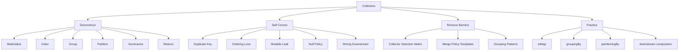

# Part 024 — Collectors Deep Dive: Grouping, Partitioning, Mapping, Reducing

> Target: setelah bagian ini, kamu mampu memilih dan merangkai `Collectors` untuk membuat hasil aggregation yang **benar, deterministic, eksplisit terhadap duplicate policy, jelas terhadap ordering, dan aman terhadap mutability boundary**. Kamu juga akan mampu membaca bug umum seperti duplicate key di `toMap`, grouping yang kehilangan urutan, mutable result yang bocor, downstream collector yang salah, dan collector yang terlihat elegan tetapi sulit dipertahankan.

`collect` adalah terminal operation yang mengubah stream menjadi struktur hasil.

```java
Map<String, List<Order>> ordersByCustomer = orders.stream()
    .collect(Collectors.groupingBy(Order::customerId));
```

Tetapi `Collectors` bukan hanya helper method. Ia adalah model **mutable reduction**.

Mental model paling penting:

```text
Collector = strategy for accumulating stream elements into a result container
```

`Collectors` menjawab pertanyaan:

- container apa yang dibuat?
- elemen dimasukkan bagaimana?
- partial result digabung bagaimana?
- apakah hasil akhir perlu ditransformasi?
- apakah result mutable/unmodifiable?
- apakah order dijaga?
- bagaimana duplicate key diselesaikan?
- bagaimana aggregation nested dibuat?

---

## 1. Posisi Part Ini dalam Framework Kaufman



Kaufman-style deconstruction untuk `Collectors`:

```text
Do not memorize every collector.
Learn the small set of collector shapes and compose them correctly.
```

Shapes:

1. materialize into collection
2. index by key
3. group by classifier
4. partition by boolean predicate
5. transform before collecting downstream
6. reduce/summarize downstream
7. finish/lock result

---

## 2. `collect` vs `reduce`

`reduce` cocok untuk immutable value reduction.

```java
BigDecimal total = invoices.stream()
    .map(Invoice::amount)
    .reduce(BigDecimal.ZERO, BigDecimal::add);
```

`collect` cocok untuk mutable accumulation.

```java
List<OrderDto> result = orders.stream()
    .map(OrderDto::from)
    .collect(Collectors.toCollection(ArrayList::new));
```

Jangan gunakan `reduce` untuk memutasi container.

Anti-pattern:

```java
List<OrderDto> result = orders.stream()
    .reduce(
        new ArrayList<>(),
        (list, order) -> {
            list.add(OrderDto.from(order));
            return list;
        },
        (left, right) -> {
            left.addAll(right);
            return left;
        }
    );
```

Masalah:

- identity mutable dipakai ulang secara berbahaya
- parallel semantics mudah salah
- intent tidak jelas
- `collect` sudah didesain untuk ini

Benar:

```java
List<OrderDto> result = orders.stream()
    .map(OrderDto::from)
    .collect(Collectors.toCollection(ArrayList::new));
```

Rule:

```text
Use reduce for immutable scalar/value result.
Use collect for mutable accumulation container.
```

---

## 3. Anatomy Collector

Dokumentasi `Collector` menjelaskan collector sebagai empat fungsi utama:

```text
supplier    -> create result container
accumulator -> incorporate element into container
combiner    -> combine two containers
finisher    -> final transform
```

Konsep:

```java
Collector<T, A, R>
```

- `T`: input element type
- `A`: mutable accumulation type
- `R`: final result type

Contoh konseptual `toList`:

```text
T = Order
A = ArrayList<Order>
R = List<Order>

supplier:    () -> new ArrayList<Order>()
accumulator: (list, order) -> list.add(order)
combiner:    (left, right) -> { left.addAll(right); return left; }
finisher:    maybe identity
```

Kamu tidak perlu selalu menulis custom collector. Tapi memahami anatomy ini membuat kamu bisa menilai:

- apakah collector aman di parallel stream?
- apakah combiner masuk akal?
- apakah result mutable?
- apakah downstream collector sesuai?

Custom collector akan dibahas di Part 025. Part ini fokus pada predefined collectors.

---

## 4. Materialization Collectors

### 4.1 `Stream.toList()` vs `Collectors.toList()`

Sejak Java 16, `Stream` punya `toList()` terminal operation.

```java
List<OrderDto> dtos = orders.stream()
    .map(OrderDto::from)
    .toList();
```

`Stream.toList()` menghasilkan unmodifiable list menurut kontrak API modern.

`Collectors.toList()`:

```java
List<OrderDto> dtos = orders.stream()
    .map(OrderDto::from)
    .collect(Collectors.toList());
```

Kontrak `Collectors.toList()` tidak menjamin type, mutability, serializability, atau thread-safety tertentu.

Practical rule:

```text
Need unmodifiable materialized result? Prefer stream.toList().
Need specific mutable collection? Use toCollection(ArrayList::new).
Need API boundary immutability? Prefer toList() or collectingAndThen(..., List::copyOf).
```

### 4.2 `toSet`

```java
Set<String> customerIds = orders.stream()
    .map(Order::customerId)
    .collect(Collectors.toSet());
```

Jangan mengandalkan order dari `toSet()`.

Jika order penting:

```java
Set<String> customerIds = orders.stream()
    .map(Order::customerId)
    .collect(Collectors.toCollection(LinkedHashSet::new));
```

Jika sorted:

```java
Set<String> customerIds = orders.stream()
    .map(Order::customerId)
    .collect(Collectors.toCollection(TreeSet::new));
```

### 4.3 `toCollection`

Gunakan jika implementasi result adalah bagian dari contract internal.

```java
ArrayDeque<Task> queue = tasks.stream()
    .filter(Task::ready)
    .collect(Collectors.toCollection(ArrayDeque::new));
```

```java
EnumSet<Permission> permissions = roles.stream()
    .flatMap(role -> role.permissions().stream())
    .collect(Collectors.toCollection(() -> EnumSet.noneOf(Permission.class)));
```

---

## 5. `toMap`: Indexing, Duplicate Policy, and Map Supplier

`toMap` adalah collector yang paling sering menyebabkan bug production.

Basic:

```java
Map<String, User> usersById = users.stream()
    .collect(Collectors.toMap(User::id, Function.identity()));
```

Jika ada duplicate key, collector melempar exception.

Itu bagus jika duplicate adalah data integrity error.

```java
Map<String, User> usersById = users.stream()
    .collect(Collectors.toMap(
        User::id,
        Function.identity()
    ));
```

Kode di atas menyatakan invariant:

```text
User id must be unique in this stream.
```

### 5.1 Merge Policy

Jika duplicate valid, merge policy harus eksplisit.

Keep first:

```java
Map<String, User> usersByEmail = users.stream()
    .collect(Collectors.toMap(
        User::email,
        Function.identity(),
        (first, duplicate) -> first
    ));
```

Keep last:

```java
Map<String, User> usersByEmail = users.stream()
    .collect(Collectors.toMap(
        User::email,
        Function.identity(),
        (previous, latest) -> latest
    ));
```

Merge domain object:

```java
Map<String, AccountSummary> summaries = rows.stream()
    .collect(Collectors.toMap(
        AccountRow::accountId,
        AccountSummary::from,
        AccountSummary::merge
    ));
```

Top engineer rule:

```text
Never use merge function as a way to silence duplicate-key errors.
The merge function is a business rule.
```

### 5.2 Map Supplier

Default map implementation is usually `HashMap`. Jika ordering penting, tentukan supplier.

Preserve encounter order:

```java
Map<String, User> usersById = users.stream()
    .collect(Collectors.toMap(
        User::id,
        Function.identity(),
        (a, b) -> { throw new IllegalStateException("Duplicate id: " + a.id()); },
        LinkedHashMap::new
    ));
```

Sorted keys:

```java
Map<String, User> usersById = users.stream()
    .collect(Collectors.toMap(
        User::id,
        Function.identity(),
        (a, b) -> { throw new IllegalStateException("Duplicate id"); },
        TreeMap::new
    ));
```

Enum keys:

```java
Map<Status, Long> countsByStatus = orders.stream()
    .collect(Collectors.groupingBy(
        Order::status,
        () -> new EnumMap<>(Status.class),
        Collectors.counting()
    ));
```

---

## 6. `groupingBy`: One-to-Many Classification

`groupingBy` mengelompokkan elemen berdasarkan classifier function.

```java
Map<String, List<Order>> ordersByCustomer = orders.stream()
    .collect(Collectors.groupingBy(Order::customerId));
```

Mental model:

```text
classifier(element) -> key
append element to group for that key
```

Use case:

- orders by customer
- events by type
- errors by code
- users by organization
- records by effective date
- tasks by status

### 6.1 `groupingBy` vs `toMap`

Gunakan `toMap` jika satu key harus punya satu value.

```java
Map<String, User> userById = users.stream()
    .collect(Collectors.toMap(User::id, Function.identity()));
```

Gunakan `groupingBy` jika satu key bisa punya banyak value.

```java
Map<String, List<User>> usersByDepartment = users.stream()
    .collect(Collectors.groupingBy(User::department));
```

Salah model:

```java
Map<String, User> usersByDepartment = users.stream()
    .collect(Collectors.toMap(
        User::department,
        Function.identity(),
        (a, b) -> a
    ));
```

Ini menghapus user lain per department tanpa policy yang jelas.

### 6.2 Downstream Collector

Default `groupingBy(classifier)` mengumpulkan values ke `List<T>`.

Jika butuh count:

```java
Map<String, Long> orderCountByCustomer = orders.stream()
    .collect(Collectors.groupingBy(
        Order::customerId,
        Collectors.counting()
    ));
```

Jika butuh set:

```java
Map<String, Set<String>> productIdsByCustomer = orders.stream()
    .collect(Collectors.groupingBy(
        Order::customerId,
        Collectors.mapping(Order::productId, Collectors.toSet())
    ));
```

Jika butuh numeric summary:

```java
Map<String, IntSummaryStatistics> itemStatsByCustomer = orders.stream()
    .collect(Collectors.groupingBy(
        Order::customerId,
        Collectors.summarizingInt(Order::itemCount)
    ));
```

---

## 7. `partitioningBy`: Boolean Split

`partitioningBy` adalah grouping khusus dengan key `Boolean`.

```java
Map<Boolean, List<Order>> partitioned = orders.stream()
    .collect(Collectors.partitioningBy(Order::isHighRisk));

List<Order> highRisk = partitioned.get(true);
List<Order> normal = partitioned.get(false);
```

Gunakan jika benar-benar ada dua bucket berdasarkan predicate boolean.

Contoh downstream:

```java
Map<Boolean, Long> counts = orders.stream()
    .collect(Collectors.partitioningBy(
        Order::isHighRisk,
        Collectors.counting()
    ));
```

Jangan gunakan `partitioningBy` untuk kategori lebih dari dua.

Salah:

```java
orders.stream()
    .collect(Collectors.partitioningBy(order -> order.status() == Status.OPEN));
```

Jika kamu butuh status lengkap:

```java
Map<Status, List<Order>> byStatus = orders.stream()
    .collect(Collectors.groupingBy(Order::status));
```

---

## 8. Downstream `mapping`

`mapping` mentransform elemen sebelum downstream collector.

```java
Map<String, Set<String>> productIdsByCustomer = orders.stream()
    .collect(Collectors.groupingBy(
        Order::customerId,
        Collectors.mapping(Order::productId, Collectors.toSet())
    ));
```

Tanpa `mapping`, kamu harus group orders lalu map values afterward.

Kurang direct:

```java
Map<String, List<Order>> grouped = orders.stream()
    .collect(Collectors.groupingBy(Order::customerId));

Map<String, Set<String>> result = new HashMap<>();
for (var entry : grouped.entrySet()) {
    result.put(entry.getKey(), entry.getValue().stream()
        .map(Order::productId)
        .collect(Collectors.toSet()));
}
```

`mapping` membuat transformation berada tepat di tempat aggregation terjadi.

---

## 9. Downstream `flatMapping`

`flatMapping` berguna jika satu elemen source menghasilkan banyak downstream values.

```java
Map<String, Set<String>> skuByCustomer = orders.stream()
    .collect(Collectors.groupingBy(
        Order::customerId,
        Collectors.flatMapping(
            order -> order.lines().stream().map(OrderLine::sku),
            Collectors.toSet()
        )
    ));
```

Mental model:

```text
group order by customer
within each group, flatten order lines
collect SKUs into set
```

Tanpa `flatMapping`, kamu sering perlu pre-flatten dengan helper record:

```java
record CustomerSku(String customerId, String sku) {}

Map<String, Set<String>> result = orders.stream()
    .flatMap(order -> order.lines().stream()
        .map(line -> new CustomerSku(order.customerId(), line.sku())))
    .collect(Collectors.groupingBy(
        CustomerSku::customerId,
        Collectors.mapping(CustomerSku::sku, Collectors.toSet())
    ));
```

Keduanya valid. Pilih yang lebih jelas untuk domain.

---

## 10. Downstream `filtering`

`filtering` memfilter elemen dalam downstream context.

```java
Map<String, List<Order>> highRiskOrdersByCustomer = orders.stream()
    .collect(Collectors.groupingBy(
        Order::customerId,
        Collectors.filtering(Order::isHighRisk, Collectors.toList())
    ));
```

Bedakan dengan filter sebelum grouping:

```java
Map<String, List<Order>> highRiskOnlyCustomers = orders.stream()
    .filter(Order::isHighRisk)
    .collect(Collectors.groupingBy(Order::customerId));
```

Perbedaan semantic:

```text
filter before grouping:
  customer with no high-risk orders may not appear

filtering downstream:
  customer can appear with empty downstream result
```

Ini penting untuk report completeness.

Contoh:

```java
Map<String, Long> failedCountByService = logs.stream()
    .collect(Collectors.groupingBy(
        LogEvent::service,
        Collectors.filtering(
            LogEvent::failed,
            Collectors.counting()
        )
    ));
```

Jika semua service harus muncul, downstream filtering bisa lebih tepat.

---

## 11. Numeric Collectors

Untuk aggregation numeric by group:

```java
Map<String, Integer> totalItemsByCustomer = orders.stream()
    .collect(Collectors.groupingBy(
        Order::customerId,
        Collectors.summingInt(Order::itemCount)
    ));
```

Long:

```java
Map<String, Long> totalBytesByService = events.stream()
    .collect(Collectors.groupingBy(
        Event::service,
        Collectors.summingLong(Event::payloadBytes)
    ));
```

Double:

```java
Map<String, Double> averageScoreBySegment = users.stream()
    .collect(Collectors.groupingBy(
        User::segment,
        Collectors.averagingDouble(User::score)
    ));
```

Summary:

```java
Map<String, LongSummaryStatistics> latencyStatsByService = events.stream()
    .collect(Collectors.groupingBy(
        Event::service,
        Collectors.summarizingLong(Event::latencyNanos)
    ));
```

Remember from Part 023:

- `summingInt` can overflow if int total too large
- `summingLong` can overflow if long total too large
- `summingDouble` has floating-point semantics
- `summaryStatistics` empty semantics must be interpreted carefully

---

## 12. `reducing` Collector

`Collectors.reducing` berguna sebagai downstream collector.

Contoh: max order amount by customer.

```java
Map<String, Optional<BigDecimal>> maxAmountByCustomer = orders.stream()
    .collect(Collectors.groupingBy(
        Order::customerId,
        Collectors.mapping(
            Order::amount,
            Collectors.reducing(BigDecimal::max)
        )
    ));
```

Namun untuk simple whole-stream reduction, gunakan `Stream.reduce`.

```java
Optional<BigDecimal> maxAmount = orders.stream()
    .map(Order::amount)
    .reduce(BigDecimal::max);
```

Rule:

```text
Use Collectors.reducing mostly as downstream of groupingBy/partitioningBy.
Use Stream.reduce for direct whole-stream reduction.
```

Dengan identity:

```java
Map<String, BigDecimal> totalAmountByCustomer = orders.stream()
    .collect(Collectors.groupingBy(
        Order::customerId,
        Collectors.mapping(
            Order::amount,
            Collectors.reducing(BigDecimal.ZERO, BigDecimal::add)
        )
    ));
```

Tapi sering lebih jelas dengan custom domain collector atau `toMap` merge:

```java
Map<String, BigDecimal> totalAmountByCustomer = orders.stream()
    .collect(Collectors.toMap(
        Order::customerId,
        Order::amount,
        BigDecimal::add
    ));
```

Pilih yang menyatakan intent lebih langsung.

---

## 13. `collectingAndThen`: Finish and Lock

`collectingAndThen` menjalankan finisher setelah downstream collector selesai.

```java
Map<String, List<Order>> immutableOrdersByCustomer = orders.stream()
    .collect(Collectors.groupingBy(
        Order::customerId,
        Collectors.collectingAndThen(
            Collectors.toList(),
            List::copyOf
        )
    ));
```

Namun map outer masih mutable.

Untuk lock outer map juga:

```java
Map<String, List<Order>> immutableOrdersByCustomer = orders.stream()
    .collect(Collectors.collectingAndThen(
        Collectors.groupingBy(
            Order::customerId,
            Collectors.collectingAndThen(
                Collectors.toList(),
                List::copyOf
            )
        ),
        Map::copyOf
    ));
```

This matters at API boundaries.

Mental model:

```text
inner finishing locks values
outer finishing locks map
```

---

## 14. `joining`: String Aggregation

`joining` is useful for strings.

```java
String csv = users.stream()
    .map(User::email)
    .collect(Collectors.joining(","));
```

With prefix/suffix:

```java
String label = users.stream()
    .map(User::email)
    .collect(Collectors.joining(", ", "[", "]"));
```

Production caution:

- avoid using `joining` to build SQL queries manually
- avoid huge unbounded string aggregation without size policy
- ensure escaping if output format matters

For audit/debug report, deterministic ordering matters:

```java
String customerIds = orders.stream()
    .map(Order::customerId)
    .distinct()
    .sorted()
    .collect(Collectors.joining(","));
```

---

## 15. `teeing`: Two Aggregations, One Result

`teeing` combines two collectors and merges their results.

Example: min/max range.

```java
record Range(int min, int max) {}

Range range = values.stream()
    .collect(Collectors.teeing(
        Collectors.minBy(Integer::compareTo),
        Collectors.maxBy(Integer::compareTo),
        (min, max) -> new Range(
            min.orElseThrow(),
            max.orElseThrow()
        )
    ));
```

But for primitive numbers, summary statistics may be better:

```java
IntSummaryStatistics stats = values.stream()
    .mapToInt(Integer::intValue)
    .summaryStatistics();
```

`teeing` shines when result combines different derived values:

```java
record AuditSummary(long total, long failed) {}

AuditSummary summary = events.stream()
    .collect(Collectors.teeing(
        Collectors.counting(),
        Collectors.filtering(Event::failed, Collectors.counting()),
        AuditSummary::new
    ));
```

Use it when it improves intent. Avoid it when a small loop is clearer.

---

## 16. Ordering Semantics

Collectors can preserve or lose order depending on source, collector, and container.

Examples:

```java
List<Order> list = orders.stream().toList();
```

For ordered stream, list encounter order is preserved.

Set:

```java
Set<String> ids = orders.stream()
    .map(Order::id)
    .collect(Collectors.toSet());
```

No deterministic iteration order guarantee.

Preserve order:

```java
Set<String> ids = orders.stream()
    .map(Order::id)
    .collect(Collectors.toCollection(LinkedHashSet::new));
```

Group map ordering:

```java
Map<String, List<Order>> byCustomer = orders.stream()
    .collect(Collectors.groupingBy(Order::customerId));
```

Do not assume map key iteration order.

Preserve first-seen key order:

```java
Map<String, List<Order>> byCustomer = orders.stream()
    .collect(Collectors.groupingBy(
        Order::customerId,
        LinkedHashMap::new,
        Collectors.toList()
    ));
```

Sorted key order:

```java
Map<String, List<Order>> byCustomer = orders.stream()
    .collect(Collectors.groupingBy(
        Order::customerId,
        TreeMap::new,
        Collectors.toList()
    ));
```

Production rule:

```text
If output is used for audit, tests, serialization, reports, or diffs,
make ordering explicit.
```

---

## 17. Null Policy

Collectors often interact badly with unclear null policy.

Examples:

```java
Map<String, User> byId = users.stream()
    .collect(Collectors.toMap(User::id, Function.identity()));
```

If `User::id` can return null, behavior depends on map implementation and collector path. Do not let null drift into collector logic accidentally.

Better:

```java
Map<String, User> byId = users.stream()
    .filter(user -> user.id() != null)
    .collect(Collectors.toMap(User::id, Function.identity()));
```

But filtering might hide data quality problems.

More defensible:

```java
Map<String, User> byId = users.stream()
    .peek(user -> {
        if (user.id() == null) {
            throw new IllegalArgumentException("User id must not be null: " + user);
        }
    })
    .collect(Collectors.toMap(User::id, Function.identity()));
```

However `peek` for validation side effects is debatable. A clearer loop or validation method may be better:

```java
static String requireUserId(User user) {
    if (user.id() == null) {
        throw new IllegalArgumentException("User id must not be null: " + user);
    }
    return user.id();
}

Map<String, User> byId = users.stream()
    .collect(Collectors.toMap(
        CollectorsLesson::requireUserId,
        Function.identity()
    ));
```

Rule:

```text
Classifier/key mapper/value mapper should encode null policy explicitly.
```

---

## 18. Duplicate Policy Patterns

### 18.1 Fail on Duplicate with Helpful Message

`Collectors.toMap` default duplicate exception message may not carry enough domain context. You can encode stronger policy.

```java
static <T> BinaryOperator<T> duplicateKey(String keyName) {
    return (a, b) -> {
        throw new IllegalStateException("Duplicate " + keyName + ": " + a + " vs " + b);
    };
}
```

Use:

```java
Map<String, User> byEmail = users.stream()
    .collect(Collectors.toMap(
        User::email,
        Function.identity(),
        duplicateKey("email"),
        LinkedHashMap::new
    ));
```

### 18.2 Keep Latest by Version

```java
Map<String, Contract> latestById = contracts.stream()
    .collect(Collectors.toMap(
        Contract::id,
        Function.identity(),
        BinaryOperator.maxBy(Comparator.comparing(Contract::version))
    ));
```

### 18.3 Merge Lists

```java
Map<String, List<ErrorDetail>> errorsByEntity = errors.stream()
    .collect(Collectors.toMap(
        ErrorDetail::entityId,
        error -> new ArrayList<>(List.of(error)),
        (left, right) -> {
            left.addAll(right);
            return left;
        }
    ));
```

But this is exactly `groupingBy` shape:

```java
Map<String, List<ErrorDetail>> errorsByEntity = errors.stream()
    .collect(Collectors.groupingBy(ErrorDetail::entityId));
```

Prefer `groupingBy` if result is one-to-many.

---

## 19. Grouping Pattern Catalogue

### 19.1 Count by Status

```java
Map<Status, Long> countByStatus = orders.stream()
    .collect(Collectors.groupingBy(
        Order::status,
        () -> new EnumMap<>(Status.class),
        Collectors.counting()
    ));
```

### 19.2 IDs by Customer

```java
Map<String, Set<String>> orderIdsByCustomer = orders.stream()
    .collect(Collectors.groupingBy(
        Order::customerId,
        LinkedHashMap::new,
        Collectors.mapping(Order::id, Collectors.toCollection(LinkedHashSet::new))
    ));
```

### 19.3 Stats by Service

```java
Map<String, LongSummaryStatistics> latencyByService = events.stream()
    .collect(Collectors.groupingBy(
        Event::service,
        Collectors.summarizingLong(Event::latencyNanos)
    ));
```

### 19.4 High-Risk Count by Region

```java
Map<String, Long> highRiskCountByRegion = orders.stream()
    .collect(Collectors.groupingBy(
        Order::region,
        Collectors.filtering(
            Order::highRisk,
            Collectors.counting()
        )
    ));
```

### 19.5 Nested Grouping

```java
Map<String, Map<Status, Long>> countByRegionAndStatus = orders.stream()
    .collect(Collectors.groupingBy(
        Order::region,
        Collectors.groupingBy(
            Order::status,
            () -> new EnumMap<>(Status.class),
            Collectors.counting()
        )
    ));
```

Nested grouping is powerful, but readability degrades quickly. For complex reporting, consider explicit accumulator type.

---

## 20. When Collectors Become Too Clever

Collectors are expressive, but deeply nested collectors can become unreadable.

Example smell:

```java
var result = orders.stream()
    .collect(Collectors.groupingBy(
        Order::region,
        Collectors.mapping(
            Order::customer,
            Collectors.collectingAndThen(
                Collectors.groupingBy(
                    Customer::segment,
                    Collectors.flatMapping(
                        customer -> customer.permissions().stream(),
                        Collectors.filtering(
                            Permission::enabled,
                            Collectors.mapping(Permission::code, Collectors.toSet())
                        )
                    )
                ),
                Map::copyOf
            )
        )
    ));
```

This may be technically valid but not maintainable.

Refactor options:

1. Extract classifier methods.
2. Extract downstream collector factory methods.
3. Use intermediate record.
4. Use loop with named accumulator.
5. Split into multiple transformations if dataset size allows.

Example:

```java
static Collector<Order, ?, Set<String>> enabledPermissionCodes() {
    return Collectors.flatMapping(
        order -> order.customer().permissions().stream(),
        Collectors.filtering(
            Permission::enabled,
            Collectors.mapping(Permission::code, Collectors.toSet())
        )
    );
}
```

Top engineer rule:

```text
Collector composition is good when it compresses accidental complexity.
It is bad when it hides business rules.
```

---

## 21. Production Case Study: Validation Report

Problem:

> Dari list `ValidationError`, buat report:
>
> - errors by entity id
> - count by severity
> - field names by entity id
> - deterministic ordering
> - immutable result boundary

Model:

```java
record ValidationError(
    String entityId,
    String field,
    Severity severity,
    String message
) {}

enum Severity {
    INFO, WARNING, ERROR
}

record ValidationReport(
    Map<String, List<ValidationError>> errorsByEntity,
    Map<Severity, Long> countBySeverity,
    Map<String, Set<String>> fieldsByEntity
) {}
```

Implementation:

```java
static ValidationReport report(List<ValidationError> errors) {
    Map<String, List<ValidationError>> errorsByEntity = errors.stream()
        .collect(Collectors.collectingAndThen(
            Collectors.groupingBy(
                ValidationError::entityId,
                LinkedHashMap::new,
                Collectors.collectingAndThen(
                    Collectors.toList(),
                    List::copyOf
                )
            ),
            Map::copyOf
        ));

    Map<Severity, Long> countBySeverity = errors.stream()
        .collect(Collectors.collectingAndThen(
            Collectors.groupingBy(
                ValidationError::severity,
                () -> new EnumMap<>(Severity.class),
                Collectors.counting()
            ),
            map -> Map.copyOf(map)
        ));

    Map<String, Set<String>> fieldsByEntity = errors.stream()
        .collect(Collectors.collectingAndThen(
            Collectors.groupingBy(
                ValidationError::entityId,
                LinkedHashMap::new,
                Collectors.mapping(
                    ValidationError::field,
                    Collectors.collectingAndThen(
                        Collectors.toCollection(LinkedHashSet::new),
                        Set::copyOf
                    )
                )
            ),
            Map::copyOf
        ));

    return new ValidationReport(errorsByEntity, countBySeverity, fieldsByEntity);
}
```

Analysis:

- `LinkedHashMap` preserves first-seen entity order before `Map.copyOf` boundary.
- `EnumMap` is appropriate for enum severity internally.
- `List::copyOf` and `Set::copyOf` protect inner collections.
- `Map::copyOf` protects outer map.
- Three traversals are acceptable if clarity and dataset size are reasonable.

If report generation is hot path and data volume huge, use explicit accumulator.

---

## 22. Collector Selection Matrix

| Need | Collector shape | Example |
|---|---|---|
| Immutable list | `stream.toList()` | `orders.stream().map(...).toList()` |
| Specific mutable list | `toCollection(ArrayList::new)` | queue/build buffer |
| Preserve unique order | `toCollection(LinkedHashSet::new)` | audit/report IDs |
| Index by unique key | `toMap(key, value)` | `userById` |
| Index with duplicate rule | `toMap(key, value, merge)` | latest version by id |
| Preserve map order | `toMap(..., LinkedHashMap::new)` | deterministic output |
| Group one-to-many | `groupingBy(classifier)` | orders by customer |
| Count by key | `groupingBy(key, counting())` | status counts |
| Boolean split | `partitioningBy(predicate)` | valid/invalid |
| Extract values per group | `groupingBy(key, mapping(...))` | product IDs by customer |
| Flatten values per group | `flatMapping` downstream | SKUs by customer |
| Filter inside group | `filtering` downstream | failed count per service |
| Numeric stats by group | `summarizingLong` downstream | latency by service |
| Finish immutable result | `collectingAndThen` | `List::copyOf` |
| Combine two aggregations | `teeing` | total + failed count |

---

## 23. Failure Catalogue

### 23.1 Duplicate Key Explosion

```java
Map<String, User> byEmail = users.stream()
    .collect(Collectors.toMap(User::email, Function.identity()));
```

Fails if email duplicate. Decide:

- should duplicate fail?
- keep first?
- keep latest?
- merge?
- group?

### 23.2 Accidental Data Loss

```java
Map<String, User> byDepartment = users.stream()
    .collect(Collectors.toMap(
        User::department,
        Function.identity(),
        (a, b) -> a
    ));
```

This silently drops users. Probably should be:

```java
Map<String, List<User>> byDepartment = users.stream()
    .collect(Collectors.groupingBy(User::department));
```

### 23.3 Ordering Assumption

```java
Set<String> ids = users.stream()
    .map(User::id)
    .collect(Collectors.toSet());
```

Do not assume deterministic iteration order. Use `LinkedHashSet` or sorted collection.

### 23.4 Mutable Result Leak

```java
class UserIndex {
    private final Map<String, List<User>> usersByDepartment;

    UserIndex(List<User> users) {
        this.usersByDepartment = users.stream()
            .collect(Collectors.groupingBy(User::department));
    }

    Map<String, List<User>> usersByDepartment() {
        return usersByDepartment;
    }
}
```

Caller can mutate map/list.

Better:

```java
this.usersByDepartment = users.stream()
    .collect(Collectors.collectingAndThen(
        Collectors.groupingBy(
            User::department,
            Collectors.collectingAndThen(Collectors.toList(), List::copyOf)
        ),
        Map::copyOf
    ));
```

### 23.5 Wrong Filter Placement

```java
Map<String, List<Order>> highRisk = orders.stream()
    .filter(Order::highRisk)
    .collect(Collectors.groupingBy(Order::customerId));
```

Customers without high-risk orders disappear. If report needs all customers, use downstream filtering.

### 23.6 Overly Clever Nested Collector

If collector takes longer to explain than the business rule, extract named methods or use a loop.

---

## 24. Code Review Checklist

For every collector pipeline, ask:

1. What is the result shape?
2. Is the collector shape appropriate: materialize, index, group, partition, summarize?
3. If `toMap`, what is duplicate policy?
4. If `groupingBy`, is one-to-many really intended?
5. Is ordering explicit where needed?
6. Is map implementation explicit where needed?
7. Is result mutability acceptable?
8. Are inner collections also protected if needed?
9. Is null policy explicit?
10. Is downstream collector correct?
11. Is filter placement semantically correct?
12. Would a loop be clearer?
13. Would an explicit accumulator type be more maintainable?
14. Is numeric aggregation safe for overflow/precision?
15. Is this collector safe if stream becomes parallel later?

---

## 25. Latihan Terarah

### Latihan 1 — Unique Index

Diberikan:

```java
record User(String id, String email, String department) {}
```

Buat:

```java
Map<String, User> userById(List<User> users)
```

Constraint:

- duplicate id harus fail
- error message harus helpful
- result preserve encounter order

### Latihan 2 — Group with Downstream Mapping

Buat:

```java
Map<String, Set<String>> emailsByDepartment(List<User> users)
```

Constraint:

- department order first-seen
- email order first-seen per department
- immutable outer map dan inner set

### Latihan 3 — Partition Validation

Diberikan:

```java
record ValidationResult(String id, boolean valid, List<String> errors) {}
```

Buat partition valid/invalid dan count masing-masing.

Bandingkan:

- `partitioningBy(ValidationResult::valid)`
- `groupingBy(ValidationResult::valid)`

### Latihan 4 — Report Completeness

Diberikan semua service dan logs. Buat failed count per service, termasuk service dengan count `0`.

Hint:

- downstream `filtering` hanya menjaga key yang muncul di source
- jika service harus muncul walau tidak ada log, kamu butuh seed map atau post-fill step

### Latihan 5 — Replace Clever Collector

Ambil satu nested collector kompleks dari codebase dan refactor menjadi:

1. named helper collector methods, atau
2. explicit accumulator class

Bandingkan readability dan testability.

---

## 26. Ringkasan

`Collectors` adalah tool untuk mutable reduction dan structured aggregation.

Key ideas:

- `collect` berbeda dari `reduce`; gunakan `collect` untuk mutable containers.
- `Collector` punya supplier, accumulator, combiner, finisher.
- `toMap` harus punya duplicate policy yang jelas.
- `groupingBy` cocok untuk one-to-many classification.
- `partitioningBy` cocok untuk boolean split.
- downstream collectors seperti `mapping`, `flatMapping`, `filtering`, `counting`, `summarizingX`, dan `reducing` membuat aggregation lebih tepat.
- ordering tidak boleh diasumsikan; tentukan collection/map supplier jika penting.
- mutability boundary harus eksplisit, termasuk inner collections.
- collector composition harus memperjelas business rule, bukan menyembunyikannya.

Mental model final:

```text
Collector is not just a convenience method.
Collector is an explicit aggregation contract.
```

Part berikutnya akan membahas custom collectors: kapan perlu dibuat, bagaimana memastikan identity/associativity/combiner correctness, dan bagaimana menguji collector agar aman untuk sequential maupun parallel execution.

---

## References

- Java SE 25 API — `Collector`: https://docs.oracle.com/en/java/javase/25/docs/api/java.base/java/util/stream/Collector.html
- Java SE 25 API — `Collectors`: https://docs.oracle.com/en/java/javase/25/docs/api/java.base/java/util/stream/Collectors.html
- Java SE 25 API — `Stream`: https://docs.oracle.com/en/java/javase/25/docs/api/java.base/java/util/stream/Stream.html
- Java SE 25 API — `Map`: https://docs.oracle.com/en/java/javase/25/docs/api/java.base/java/util/Map.html
- Java SE 25 API — `EnumMap`: https://docs.oracle.com/en/java/javase/25/docs/api/java.base/java/util/EnumMap.html
