# Part 025 — Custom Collectors: Correctness, Associativity, and Parallel Safety

> Target: setelah bagian ini, kamu mampu membuat custom `Collector` yang **benar secara sequential dan parallel**, memahami hukum identity/associativity, memilih `Characteristics` dengan aman, menulis combiner yang tidak sekadar “agar compile”, serta menguji collector agar tidak rusak saat stream dipartisi, dieksekusi paralel, atau digunakan di downstream collector.

Custom collector adalah salah satu area Stream API yang terlihat sederhana tetapi sering menjadi sumber bug halus.

Contoh signature-nya tampak ringan:

```java
Collector<T, A, R>
```

Tetapi di balik itu ada kontrak formal:

```text
T = input element type
A = mutable accumulation state
R = final result type
```

Collector yang benar harus menjawab:

- bagaimana state dibuat?
- bagaimana satu elemen masuk ke state?
- bagaimana dua state parsial digabung?
- bagaimana state akhir diubah menjadi result?
- apakah hasil bergantung pada order?
- apakah state boleh diakumulasi dari beberapa thread?
- apakah final result sama object-nya dengan accumulation state?

Kalau collector dipakai hanya pada stream sequential, bug combiner sering tidak terlihat. Begitu pipeline menjadi parallel, collector dipakai sebagai downstream `groupingBy`, atau source dipartisi berbeda, hasil bisa salah.

Mental model:

```text
A custom collector is not a loop callback.
It is a reduction algebra.
```

---

## 1. Posisi Part Ini dalam Framework Kaufman

```mermaid
flowchart TD
    A[Custom Collector Mastery] --> B[Deconstruct]
    B --> B1[Supplier]
    B --> B2[Accumulator]
    B --> B3[Combiner]
    B --> B4[Finisher]
    B --> B5[Characteristics]

    A --> C[Self Correct]
    C --> C1[Identity Law]
    C --> C2[Associativity Law]
    C --> C3[Sequential vs Parallel Equivalence]
    C --> C4[Mutation Leak]
    C --> C5[Wrong Characteristics]

    A --> D[Remove Barriers]
    D --> D1[Accumulator Class Template]
    D --> D2[Combiner Template]
    D --> D3[Test Harness]
    D --> D4[Decision Checklist]

    A --> E[Practice]
    E --> E1[Validation Report Collector]
    E --> E2[Top N Collector]
    E --> E3[Duplicate Diagnostic Collector]
    E --> E4[Parallel Safety Test]
```



Kaufman-style simplification:

```text
Do not start by writing Collector.of(...).
Start by defining the algebra of your aggregation.
```

Pertanyaan paling penting:

```text
Can partial results be combined without changing meaning?
```

Kalau jawabannya tidak jelas, jangan buat custom collector yang mengklaim parallel-safe.

---

## 2. Kapan Custom Collector Diperlukan?

Banyak kasus tidak membutuhkan custom collector.

Gunakan built-in collector jika cukup:

```java
Map<CustomerId, List<Order>> byCustomer = orders.stream()
    .collect(Collectors.groupingBy(Order::customerId));
```

Gunakan composition jika cukup:

```java
Map<CustomerId, Long> countByCustomer = orders.stream()
    .collect(Collectors.groupingBy(
        Order::customerId,
        Collectors.counting()
    ));
```

Gunakan `collectingAndThen` jika hanya butuh final transform:

```java
List<OrderDto> result = orders.stream()
    .map(OrderDto::from)
    .collect(Collectors.collectingAndThen(
        Collectors.toList(),
        List::copyOf
    ));
```

Custom collector layak ketika:

1. ada state accumulation yang tidak natural dengan built-in collector
2. kamu butuh result object domain-specific
3. kamu butuh merge policy yang kompleks
4. kamu butuh diagnostics, bukan hanya value akhir
5. kamu butuh menggabungkan beberapa aggregation dalam satu pass
6. kamu butuh downstream collector reusable
7. kamu bisa mendefinisikan combiner yang benar

Contoh valid:

```java
ValidationReport report = records.stream()
    .collect(ValidationReport.collector(rules));
```

Contoh mencurigakan:

```java
List<OrderDto> result = orders.stream()
    .collect(myCustomListCollector());
```

Kalau hanya membuat list, jangan buat custom collector.

Rule:

```text
Custom collector is justified when it captures a reusable aggregation contract,
not when it merely hides a simple stream pipeline.
```

---

## 3. Collector Anatomy

Collector terdiri dari empat fungsi utama.

```java
Collector<T, A, R> collector = Collector.of(
    supplier,
    accumulator,
    combiner,
    finisher,
    characteristics
);
```

Secara konseptual:

```text
supplier    -> A
accumulator -> (A, T) -> void
combiner    -> (A, A) -> A
finisher    -> A -> R
```

Sequential mental execution:

```java
A state = supplier.get();
for (T element : source) {
    accumulator.accept(state, element);
}
R result = finisher.apply(state);
```

Parallel mental execution:

```java
A left = supplier.get();
A right = supplier.get();

// partition 1
accumulator.accept(left, t1);
accumulator.accept(left, t2);

// partition 2
accumulator.accept(right, t3);
accumulator.accept(right, t4);

A combined = combiner.apply(left, right);
R result = finisher.apply(combined);
```

Karena stream library bebas mempartisi input, collector tidak boleh bergantung pada satu urutan internal yang hanya berlaku di loop sequential.

---

## 4. `T`, `A`, dan `R`: Tiga Type yang Harus Dipisahkan

Banyak bug collector dimulai dari tidak membedakan `A` dan `R`.

Contoh:

```java
Collector<Order, OrderReportBuilder, OrderReport>
```

- `Order` = input element
- `OrderReportBuilder` = mutable accumulation state
- `OrderReport` = immutable final result

Ini sehat.

Bandingkan:

```java
Collector<Order, List<OrderDto>, List<OrderDto>>
```

Di sini `A` dan `R` sama. Ini bisa valid jika hasil boleh mutable, atau jika collector memakai `IDENTITY_FINISH`.

Tetapi untuk API boundary yang aman, biasanya lebih baik:

```java
Collector<Order, List<OrderDto>, List<OrderDto>>
```

with finisher:

```java
List::copyOf
```

atau:

```java
Collector<Order, ArrayList<OrderDto>, List<OrderDto>>
```

Mental model:

```text
A is working state.
R is published state.
Do not publish working state unless you intentionally allow mutation.
```

---

## 5. Collector Laws: Identity and Associativity

Custom collector harus memenuhi dua hukum besar:

1. identity
2. associativity

### 5.1 Identity Law

Untuk state parsial apa pun `a`, menggabungkan dengan empty state harus equivalent dengan `a`.

```java
A a = partiallyAccumulatedState();
A empty = supplier.get();

A combined = combiner.apply(a, empty);
```

Harus equivalent dengan:

```java
a
```

Contoh benar:

```java
(left, right) -> {
    left.addAll(right);
    return left;
}
```

Untuk list:

```text
[a, b] + [] = [a, b]
[] + [a, b] = [a, b]
```

Contoh salah:

```java
(left, right) -> {
    left.add(null);
    left.addAll(right);
    return left;
}
```

Karena:

```text
[a, b] + [] = [a, b, null]
```

Identity rusak.

### 5.2 Associativity Law

Partitioning tidak boleh mengubah makna hasil.

Sequential:

```java
A a1 = supplier.get();
accumulator.accept(a1, t1);
accumulator.accept(a1, t2);
R r1 = finisher.apply(a1);
```

Split:

```java
A a2 = supplier.get();
accumulator.accept(a2, t1);

A a3 = supplier.get();
accumulator.accept(a3, t2);

R r2 = finisher.apply(combiner.apply(a2, a3));
```

Harus equivalent:

```text
r1 == r2, or r1.equals(r2), or equivalent under UNORDERED semantics
```

Contoh benar: sum integer dengan caveat overflow semantics tetap deterministik untuk operasi integer Java.

```java
record SumBox(int[] value) {}
```

Namun lebih umum:

```java
class LongSum {
    long value;
}
```

Combiner:

```java
(left, right) -> {
    left.value += right.value;
    return left;
}
```

Contoh salah: average dengan menggabungkan average tanpa count.

```java
class BadAverage {
    double average;
}
```

Combiner salah:

```java
(left, right) -> {
    left.average = (left.average + right.average) / 2;
    return left;
}
```

Kenapa salah?

```text
average([10, 20, 30]) = 20
average(average([10]), average([20, 30])) = average(10, 25) = 17.5
```

State untuk average harus menyimpan minimal:

```text
sum + count
```

Benar:

```java
final class AverageState {
    long count;
    BigDecimal sum = BigDecimal.ZERO;

    void add(BigDecimal value) {
        count++;
        sum = sum.add(value);
    }

    AverageState merge(AverageState other) {
        count += other.count;
        sum = sum.add(other.sum);
        return this;
    }

    Optional<BigDecimal> finish(MathContext mathContext) {
        if (count == 0) {
            return Optional.empty();
        }
        return Optional.of(sum.divide(BigDecimal.valueOf(count), mathContext));
    }
}
```

---

## 6. Equivalence Is Not Always `equals`

Untuk ordered collectors, result biasanya harus sama secara `equals`.

```java
List.of("a", "b").equals(List.of("a", "b")); // true
List.of("b", "a").equals(List.of("a", "b")); // false
```

Untuk unordered collector, equivalence boleh mengabaikan order.

```java
Set.of("a", "b").equals(Set.of("b", "a")); // true
```

Tetapi jangan salah kaprah:

```java
Collector.Characteristics.UNORDERED
```

bukan berarti output bebas berantakan tanpa konsekuensi. Artinya collector tidak menjanjikan encounter order sebagai bagian dari equivalence.

Kalau output akan dipakai untuk audit, snapshot, diff, CSV, log deterministik, atau test golden file, jangan jadikan unordered kecuali kamu menstabilkan order di finisher.

Contoh deterministic finisher:

```java
Collector<Order, ArrayList<Order>, List<Order>> sortedByIdCollector = Collector.of(
    ArrayList::new,
    ArrayList::add,
    (left, right) -> {
        left.addAll(right);
        return left;
    },
    list -> list.stream()
        .sorted(Comparator.comparing(Order::id))
        .toList()
);
```

---

## 7. Characteristics: Jangan Asal Tambah Flag

Collector characteristics memberi tahu stream library tentang sifat collector.

```java
Set<Collector.Characteristics> characteristics();
```

Karakteristik utama:

| Characteristic | Makna | Risiko Salah Pakai |
|---|---|---|
| `IDENTITY_FINISH` | `A` bisa langsung dianggap `R` | Salah jika finisher melakukan transformasi, copy, atau wrapping |
| `UNORDERED` | result tidak bergantung encounter order | Output nondeterministic jika sebenarnya order penting |
| `CONCURRENT` | accumulator boleh dipanggil concurrently pada state yang sama | Data race / corruption jika state tidak concurrent-safe |

### 7.1 `IDENTITY_FINISH`

Valid:

```java
Collector<String, List<String>, List<String>> c = Collector.of(
    ArrayList::new,
    List::add,
    (left, right) -> {
        left.addAll(right);
        return left;
    },
    Collector.Characteristics.IDENTITY_FINISH
);
```

Tidak valid:

```java
Collector<String, List<String>, List<String>> c = Collector.of(
    ArrayList::new,
    List::add,
    (left, right) -> {
        left.addAll(right);
        return left;
    },
    List::copyOf,
    Collector.Characteristics.IDENTITY_FINISH // wrong
);
```

Kalau `IDENTITY_FINISH` diset, stream runtime boleh melewati finisher karena kamu sudah menyatakan `A` adalah `R`.

Rule:

```text
Only use IDENTITY_FINISH when finisher is truly identity and A is safely R.
```

### 7.2 `UNORDERED`

Valid untuk set-like result:

```java
Collector<String, Set<String>, Set<String>> toHashSet = Collector.of(
    HashSet::new,
    Set::add,
    (left, right) -> {
        left.addAll(right);
        return left;
    },
    Collector.Characteristics.UNORDERED,
    Collector.Characteristics.IDENTITY_FINISH
);
```

Tidak valid untuk ordered diagnostics:

```java
Collector<Violation, List<Violation>, List<Violation>> diagnostics = Collector.of(
    ArrayList::new,
    List::add,
    (left, right) -> {
        left.addAll(right);
        return left;
    },
    Collector.Characteristics.UNORDERED // wrong if order matters
);
```

Jika diagnostics harus mengikuti input order, jangan klaim unordered.

### 7.3 `CONCURRENT`

`CONCURRENT` berarti result container mendukung accumulator dipanggil secara concurrent pada container yang sama.

Ini bukan berarti:

```text
collector can be used in parallel
```

Non-concurrent collector tetap bisa dipakai di parallel stream karena runtime dapat membuat state terpisah per partition lalu menggabungkannya.

`CONCURRENT` hanya valid jika:

1. accumulation container concurrent-safe
2. accumulator aman dipanggil bersamaan pada state yang sama
3. collector juga `UNORDERED`, atau source-nya unordered
4. result semantics tetap benar saat interleaving

Contoh hati-hati:

```java
Collector<Event, ConcurrentHashMap<EventType, LongAdder>, Map<EventType, Long>> c = Collector.of(
    ConcurrentHashMap::new,
    (map, event) -> map
        .computeIfAbsent(event.type(), ignored -> new LongAdder())
        .increment(),
    (left, right) -> {
        right.forEach((type, count) -> left
            .computeIfAbsent(type, ignored -> new LongAdder())
            .add(count.sum()));
        return left;
    },
    map -> {
        Map<EventType, Long> result = new EnumMap<>(EventType.class);
        map.forEach((type, count) -> result.put(type, count.sum()));
        return Map.copyOf(result);
    },
    Collector.Characteristics.UNORDERED,
    Collector.Characteristics.CONCURRENT
);
```

Even here, ask:

```text
Do I actually need CONCURRENT, or is normal partition+combine enough?
```

Most custom collectors should not declare `CONCURRENT`.

---

## 8. Thread Confinement for Non-Concurrent Collectors

Non-concurrent collector tidak harus thread-safe secara internal.

Ini valid:

```java
Collector<Order, ArrayList<OrderDto>, List<OrderDto>> dtoCollector = Collector.of(
    ArrayList::new,
    (list, order) -> list.add(OrderDto.from(order)),
    (left, right) -> {
        left.addAll(right);
        return left;
    },
    List::copyOf
);
```

`ArrayList` tidak thread-safe, tetapi collector masih bisa digunakan di parallel stream karena setiap partial result di-thread-confine selama accumulation.

Yang penting:

- jangan simpan state di static field
- jangan share accumulator antar supplier calls
- jangan capture mutable external state
- jangan return same container dari supplier setiap kali

Anti-pattern fatal:

```java
static final List<OrderDto> SHARED = new ArrayList<>();

static Collector<Order, List<OrderDto>, List<OrderDto>> broken() {
    return Collector.of(
        () -> SHARED,
        (list, order) -> list.add(OrderDto.from(order)),
        (left, right) -> {
            left.addAll(right);
            return left;
        }
    );
}
```

Masalah:

```text
supplier must create a fresh independent state.
```

---

## 9. Pattern 1: Domain Report Collector

Misal kita punya input:

```java
record Payment(String id, String customerId, BigDecimal amount, String currency) {}
```

Kita ingin result:

```java
record PaymentReport(
    int count,
    BigDecimal totalAmount,
    Set<String> currencies,
    List<String> invalidPaymentIds
) {}
```

Collector state:

```java
final class PaymentReportState {
    int count;
    BigDecimal totalAmount = BigDecimal.ZERO;
    final Set<String> currencies = new LinkedHashSet<>();
    final List<String> invalidPaymentIds = new ArrayList<>();

    void add(Payment payment) {
        count++;

        if (payment.amount() == null || payment.amount().signum() < 0) {
            invalidPaymentIds.add(payment.id());
            return;
        }

        totalAmount = totalAmount.add(payment.amount());

        if (payment.currency() != null) {
            currencies.add(payment.currency());
        }
    }

    PaymentReportState merge(PaymentReportState other) {
        count += other.count;
        totalAmount = totalAmount.add(other.totalAmount);
        currencies.addAll(other.currencies);
        invalidPaymentIds.addAll(other.invalidPaymentIds);
        return this;
    }

    PaymentReport finish() {
        return new PaymentReport(
            count,
            totalAmount,
            Set.copyOf(currencies),
            List.copyOf(invalidPaymentIds)
        );
    }
}
```

Collector:

```java
static Collector<Payment, PaymentReportState, PaymentReport> paymentReportCollector() {
    return Collector.of(
        PaymentReportState::new,
        PaymentReportState::add,
        PaymentReportState::merge,
        PaymentReportState::finish
    );
}
```

Usage:

```java
PaymentReport report = payments.stream()
    .collect(paymentReportCollector());
```

Why this is good:

- accumulation state tersembunyi
- final result immutable secara boundary
- combiner jelas
- sequential/parallel equivalent
- diagnostics ikut aggregation
- tidak expose mutable internal list/set

Caveat:

```text
invalidPaymentIds order follows encounter order only if stream preserves encounter order.
```

Kalau order diagnostics harus deterministic lintas parallel execution, sorting di finisher lebih defensible.

```java
List.copyOf(invalidPaymentIds.stream().sorted().toList())
```

---

## 10. Pattern 2: Top-N Collector

Top-N sering ditulis dengan sort semua data:

```java
List<Order> top = orders.stream()
    .sorted(Comparator.comparing(Order::amount).reversed())
    .limit(10)
    .toList();
```

Untuk data besar, kita bisa mempertahankan heap ukuran N.

State:

```java
final class TopNState<T> {
    private final int n;
    private final Comparator<? super T> comparator;
    private final PriorityQueue<T> heap;

    TopNState(int n, Comparator<? super T> comparator) {
        if (n < 0) {
            throw new IllegalArgumentException("n must be >= 0");
        }
        this.n = n;
        this.comparator = comparator;
        this.heap = new PriorityQueue<>(comparator);
    }

    void add(T value) {
        if (n == 0) {
            return;
        }
        if (heap.size() < n) {
            heap.add(value);
            return;
        }
        T smallest = heap.peek();
        if (comparator.compare(value, smallest) > 0) {
            heap.poll();
            heap.add(value);
        }
    }

    TopNState<T> merge(TopNState<T> other) {
        other.heap.forEach(this::add);
        return this;
    }

    List<T> finishDescending() {
        ArrayList<T> result = new ArrayList<>(heap);
        result.sort(comparator.reversed());
        return List.copyOf(result);
    }
}
```

Factory:

```java
static <T> Collector<T, ?, List<T>> topN(
    int n,
    Comparator<? super T> comparator
) {
    Objects.requireNonNull(comparator, "comparator");

    return Collector.of(
        () -> new TopNState<T>(n, comparator),
        TopNState::add,
        TopNState::merge,
        TopNState::finishDescending
    );
}
```

Usage:

```java
List<Order> top10 = orders.stream()
    .collect(topN(10, Comparator.comparing(Order::amount)));
```

Correctness questions:

| Question | Answer |
|---|---|
| Fresh state? | yes, supplier creates new `TopNState` |
| Identity? | merging with empty heap changes nothing |
| Associative? | top N of merged partitions equals top N of whole set, assuming comparator total enough for domain |
| Mutable leak? | no, finisher returns `List.copyOf` |
| Parallel safe? | yes as non-concurrent collector, state is partition-confined |
| Ordered result? | explicitly sorted in finisher |

Tie-breaker warning:

```java
Comparator.comparing(Order::amount)
```

Jika ada equal amount, output order antar equal elements bisa tidak stable. Untuk audit, tambahkan tie-breaker:

```java
Comparator.comparing(Order::amount)
    .thenComparing(Order::id)
```

---

## 11. Pattern 3: Duplicate Diagnostic Collector

`Collectors.toMap` bisa menerima merge function, tetapi kadang kamu butuh report duplicate, bukan silent merge.

Domain:

```java
record User(String id, String email) {}

record DuplicateIndex<K, V>(
    Map<K, V> uniqueValues,
    Map<K, List<V>> duplicates
) {}
```

State:

```java
final class DuplicateIndexState<K, V> {
    private final Function<? super V, ? extends K> keyExtractor;
    private final Map<K, V> unique = new LinkedHashMap<>();
    private final Map<K, List<V>> duplicates = new LinkedHashMap<>();

    DuplicateIndexState(Function<? super V, ? extends K> keyExtractor) {
        this.keyExtractor = keyExtractor;
    }

    void add(V value) {
        K key = keyExtractor.apply(value);
        V previous = unique.putIfAbsent(key, value);
        if (previous != null) {
            duplicates.computeIfAbsent(key, ignored -> new ArrayList<>())
                .add(value);
        }
    }

    DuplicateIndexState<K, V> merge(DuplicateIndexState<K, V> other) {
        other.unique.values().forEach(this::add);
        other.duplicates.values().forEach(list -> list.forEach(this::add));
        return this;
    }

    DuplicateIndex<K, V> finish() {
        Map<K, List<V>> frozenDuplicates = new LinkedHashMap<>();
        duplicates.forEach((key, values) -> frozenDuplicates.put(key, List.copyOf(values)));

        return new DuplicateIndex<>(
            Map.copyOf(unique),
            Map.copyOf(frozenDuplicates)
        );
    }
}
```

Collector:

```java
static <K, V> Collector<V, ?, DuplicateIndex<K, V>> indexingWithDuplicateDiagnostics(
    Function<? super V, ? extends K> keyExtractor
) {
    Objects.requireNonNull(keyExtractor, "keyExtractor");

    return Collector.of(
        () -> new DuplicateIndexState<K, V>(keyExtractor),
        DuplicateIndexState::add,
        DuplicateIndexState::merge,
        DuplicateIndexState::finish
    );
}
```

Usage:

```java
DuplicateIndex<String, User> index = users.stream()
    .collect(indexingWithDuplicateDiagnostics(User::email));
```

Important nuance:

```text
This collector's duplicate ordering is encounter-order sensitive.
Do not declare UNORDERED unless output order is irrelevant or normalized.
```

Also note the semantic policy:

```text
uniqueValues keeps first seen value.
duplicates contains later conflicting values.
```

This policy must be documented because another team might expect duplicates to include the first value too.

Alternative result shape:

```java
record DuplicateIndex<K, V>(
    Map<K, V> uniqueValues,
    Map<K, List<V>> duplicateGroupsIncludingOriginal
) {}
```

There is no universally correct shape. There is only explicit policy.

---

## 12. Pattern 4: Validation Collector

Validation pipelines often need to accumulate all errors instead of fail-fast.

Domain:

```java
record Violation(String path, String code, String message) {}

record ValidationReport(List<Violation> violations) {
    boolean isValid() {
        return violations.isEmpty();
    }
}
```

Rule interface:

```java
@FunctionalInterface
interface Rule<T> {
    Optional<Violation> validate(T value);
}
```

State:

```java
final class ValidationState<T> {
    private final List<Rule<T>> rules;
    private final List<Violation> violations = new ArrayList<>();

    ValidationState(List<Rule<T>> rules) {
        this.rules = List.copyOf(rules);
    }

    void add(T value) {
        for (Rule<T> rule : rules) {
            rule.validate(value).ifPresent(violations::add);
        }
    }

    ValidationState<T> merge(ValidationState<T> other) {
        violations.addAll(other.violations);
        return this;
    }

    ValidationReport finish() {
        return new ValidationReport(List.copyOf(violations));
    }
}
```

Collector:

```java
static <T> Collector<T, ?, ValidationReport> validating(List<Rule<T>> rules) {
    Objects.requireNonNull(rules, "rules");

    return Collector.of(
        () -> new ValidationState<T>(rules),
        ValidationState::add,
        ValidationState::merge,
        ValidationState::finish
    );
}
```

Usage:

```java
ValidationReport report = customers.stream()
    .collect(validating(List.of(
        customer -> customer.email() == null
            ? Optional.of(new Violation("email", "required", "Email is required"))
            : Optional.empty(),
        customer -> customer.status() == null
            ? Optional.of(new Violation("status", "required", "Status is required"))
            : Optional.empty()
    )));
```

Production considerations:

- if rules are expensive, avoid repeated allocation inside `add`
- if report must be deterministic, preserve encounter order or sort in finisher
- if validation is fail-fast, collector is the wrong abstraction
- if validation needs external IO, stream collector is usually the wrong place

---

## 13. Combiner Design

Combiner is the most commonly broken part.

### 13.1 Correct Combiner Shape

Typical mutable merge:

```java
(left, right) -> {
    left.addAll(right);
    return left;
}
```

Important:

```text
After right is combined, stream runtime will not use right again except as allowed by collector contract.
```

Therefore mutating `left` and returning it is valid.

### 13.2 Bad Combiner: Ignores Right

```java
(left, right) -> left
```

This passes sequential tests because combiner may never run.

Parallel result loses data.

### 13.3 Bad Combiner: Returns New but Drops State

```java
(left, right) -> new ArrayList<>()
```

Identity and associativity both broken.

### 13.4 Bad Combiner: Mutates Both and Returns One

```java
(left, right) -> {
    left.addAll(right);
    right.clear();
    return left;
}
```

Usually unnecessary. It may work under current constraints, but it creates no benefit and makes reasoning harder.

### 13.5 Bad Combiner: Side Effect to External State

```java
List<String> global = new ArrayList<>();

(left, right) -> {
    global.add("combined");
    left.addAll(right);
    return left;
}
```

Collector behavior should not depend on external side effects.

---

## 14. Finisher Design

Finisher transforms accumulation state into published result.

Common finisher responsibilities:

1. immutable copy
2. sorting result
3. validation of final invariants
4. conversion to domain object
5. removing internal helper state
6. computing derived values

Example:

```java
state -> new Report(
    state.count,
    state.total,
    List.copyOf(state.violations)
)
```

Avoid returning mutable accumulation state unless intended.

Anti-pattern:

```java
state -> state.violations
```

This leaks the mutable internal list.

Better:

```java
state -> List.copyOf(state.violations)
```

Do not put resource cleanup only in finisher if exceptions during accumulation can bypass it. Collector is not a general resource lifecycle abstraction.

Bad:

```java
Collector<Row, WriterState, Path> c = Collector.of(
    WriterState::openFile,
    WriterState::write,
    WriterState::merge,
    WriterState::closeAndReturnPath
);
```

Problem:

```text
If accumulator throws, finisher may not run.
```

Use explicit try-with-resources outside the stream for resource lifecycle.

---

## 15. Collector vs `Stream.collect(supplier, accumulator, combiner)`

There are two collect forms.

Collector object:

```java
R result = stream.collect(myCollector);
```

Three-arg collect:

```java
R result = stream.collect(
    supplier,
    accumulator,
    combiner
);
```

Three-arg collect is useful for simple mutable accumulation where `A == R` and no finisher/characteristics are needed.

Example:

```java
ArrayList<OrderDto> result = orders.stream()
    .collect(
        ArrayList::new,
        (list, order) -> list.add(OrderDto.from(order)),
        ArrayList::addAll
    );
```

But if you need:

- immutable final result
- reusable operation
- downstream collector
- characteristics
- named domain abstraction
- nontrivial finisher

prefer `Collector`.

---

## 16. Custom Collector as Downstream Collector

Custom collector becomes more powerful when used downstream.

Example:

```java
Map<CustomerId, ValidationReport> reportByCustomer = orders.stream()
    .collect(Collectors.groupingBy(
        Order::customerId,
        validating(orderRules)
    ));
```

This requires your collector to be correct not only alone but also when many instances are created as downstream accumulators.

Common bug:

```java
static <T> Collector<T, ?, ValidationReport> brokenValidating(List<Rule<T>> rules) {
    ValidationState<T> shared = new ValidationState<>(rules);

    return Collector.of(
        () -> shared,
        ValidationState::add,
        ValidationState::merge,
        ValidationState::finish
    );
}
```

Every group receives same state. Catastrophic.

Correct:

```java
() -> new ValidationState<>(rules)
```

Rule:

```text
Supplier must produce a fresh state for every independent reduction.
```

---

## 17. Parallel Safety Does Not Mean Faster

A collector can be parallel-safe and still slower in parallel.

Reasons:

- small input
- expensive combiner
- poor splitting source
- high allocation pressure
- ordering constraints
- cache misses
- common ForkJoinPool contention
- downstream collector overhead

Example: Top-N collector combiner cost can be non-trivial:

```text
merge partial heap by feeding every right element into left heap
```

If many partitions exist, combiner overhead may dominate.

Decision rule:

```text
Correctness first.
Parallel safety second.
Parallel performance only after measurement.
```

Do not add `parallelStream()` just because collector has combiner.

---

## 18. Testing Custom Collectors

A custom collector needs more than one happy-path test.

### 18.1 Sequential Test

```java
@Test
void collectsSequentially() {
    PaymentReport report = payments.stream()
        .collect(paymentReportCollector());

    assertThat(report.count()).isEqualTo(3);
}
```

### 18.2 Parallel Equivalence Test

```java
@Test
void sequentialAndParallelResultsAreEquivalent() {
    PaymentReport sequential = payments.stream()
        .collect(paymentReportCollector());

    PaymentReport parallel = payments.parallelStream()
        .collect(paymentReportCollector());

    assertThat(parallel).isEqualTo(sequential);
}
```

If output order is unspecified, compare with normalized result.

```java
assertThat(new HashSet<>(parallel.violations()))
    .isEqualTo(new HashSet<>(sequential.violations()));
```

But for audit-grade result, prefer deterministic ordering.

### 18.3 Manual Partition Test

This catches combiner bugs directly.

```java
@Test
void combinerProducesSameResultAsWholeAccumulation() {
    Collector<Payment, PaymentReportState, PaymentReport> collector = paymentReportCollector();

    PaymentReportState whole = collector.supplier().get();
    payments.forEach(p -> collector.accumulator().accept(whole, p));
    PaymentReport expected = collector.finisher().apply(whole);

    PaymentReportState left = collector.supplier().get();
    payments.subList(0, 2).forEach(p -> collector.accumulator().accept(left, p));

    PaymentReportState right = collector.supplier().get();
    payments.subList(2, payments.size()).forEach(p -> collector.accumulator().accept(right, p));

    PaymentReport actual = collector.finisher().apply(
        collector.combiner().apply(left, right)
    );

    assertThat(actual).isEqualTo(expected);
}
```

### 18.4 Empty Input Test

```java
@Test
void handlesEmptyInput() {
    PaymentReport report = Stream.<Payment>empty()
        .collect(paymentReportCollector());

    assertThat(report.count()).isZero();
    assertThat(report.invalidPaymentIds()).isEmpty();
}
```

### 18.5 Single Element Test

```java
@Test
void handlesSingleElement() {
    Payment payment = new Payment("p1", "c1", BigDecimal.TEN, "USD");

    PaymentReport report = Stream.of(payment)
        .collect(paymentReportCollector());

    assertThat(report.count()).isEqualTo(1);
}
```

### 18.6 Random Partition Property Test

Conceptual helper:

```java
static <T, A, R> R collectInTwoPartitions(
    List<T> input,
    int split,
    Collector<T, A, R> collector
) {
    A left = collector.supplier().get();
    for (T value : input.subList(0, split)) {
        collector.accumulator().accept(left, value);
    }

    A right = collector.supplier().get();
    for (T value : input.subList(split, input.size())) {
        collector.accumulator().accept(right, value);
    }

    A combined = collector.combiner().apply(left, right);
    return collector.finisher().apply(combined);
}
```

Test all split points:

```java
for (int split = 0; split <= input.size(); split++) {
    R actual = collectInTwoPartitions(input, split, collector);
    assertThat(actual).isEqualTo(expected);
}
```

This is often more valuable than only calling `parallelStream()`.

---

## 19. Failure Catalogue

### 19.1 Shared Mutable Supplier

```java
ArrayList<T> shared = new ArrayList<>();

Collector<T, List<T>, List<T>> broken = Collector.of(
    () -> shared,
    List::add,
    (left, right) -> {
        left.addAll(right);
        return left;
    }
);
```

Failure:

- cross-call contamination
- downstream grouping corruption
- data races in parallel

### 19.2 Broken Combiner

```java
(left, right) -> left
```

Failure:

- parallel result silently drops partition data

### 19.3 Wrong `IDENTITY_FINISH`

```java
Collector.of(
    ArrayList::new,
    List::add,
    (left, right) -> { left.addAll(right); return left; },
    List::copyOf,
    Collector.Characteristics.IDENTITY_FINISH
);
```

Failure:

- finisher may be skipped
- mutable result may escape
- ClassCastException possible depending shape

### 19.4 External Side Effects

```java
AtomicInteger count = new AtomicInteger();

Collector<Order, List<Order>, List<Order>> broken = Collector.of(
    ArrayList::new,
    (list, order) -> {
        count.incrementAndGet();
        list.add(order);
    },
    (left, right) -> {
        left.addAll(right);
        return left;
    }
);
```

Failure:

- count semantics separate from reduction
- retry/partition/optimization assumptions leak
- harder to reason

### 19.5 Order-Dependent Combiner

```java
(left, right) -> {
    right.addAll(left);
    return right;
}
```

This reverses partition order depending on merge tree.

Failure:

- nondeterministic output order in parallel
- test flakiness

### 19.6 Non-Associative Math

Floating point addition is not mathematically associative.

```java
double total = values.parallelStream()
    .collect(customDoubleSum());
```

Potential issue:

```text
sequential and parallel may differ in low-order bits
```

For financial values, prefer `BigDecimal` with explicit scale/rounding policy.

### 19.7 Resource Lifecycle in Collector

```java
Collector<Row, CsvWriter, Path> writerCollector = ...
```

Failure:

- finisher is not guaranteed to run on accumulation exception
- combiner semantics for open files are often undefined
- resource ownership unclear

Use explicit resource scope.

---

## 20. Decision Matrix

| Need | Recommended Approach |
|---|---|
| collect into list | `toList`, `toCollection`, or `Stream.toList()` |
| collect immutable list | `Stream.toList()` or `collectingAndThen(..., List::copyOf)` depending mutability/null policy needed |
| group by key | `groupingBy` |
| index by unique key | `toMap` with explicit merge policy |
| report duplicates | custom collector or explicit loop |
| top N | custom collector or explicit heap loop |
| validation report | custom collector if reusable, loop if local/simple |
| stateful intermediate operation | consider Gatherer, not Collector |
| resource-backed writing | explicit try-with-resources loop |
| fail-fast validation | stream short-circuit or loop, not collector |
| parallel-safe mutable reduction | collector with correct combiner; rarely `CONCURRENT` |

---

## 21. Collector Design Checklist

Before publishing a custom collector, answer:

```text
1. What is T?
2. What is A?
3. What is R?
4. Does supplier create a fresh independent A?
5. Does accumulator mutate only its A?
6. Does combiner preserve all information from both states?
7. Does combining with empty state change nothing?
8. Does arbitrary partitioning produce equivalent result?
9. Does finisher leak mutable working state?
10. Are characteristics minimal and truthful?
11. Is result order specified, unspecified, or normalized?
12. Does it work as downstream collector?
13. Does it pass sequential vs parallel equivalence tests?
14. Does it handle empty input?
15. Is custom collector simpler than an explicit loop?
```

Minimal characteristics rule:

```text
When in doubt, declare fewer characteristics.
Correct but less optimized is better than incorrectly optimized.
```

---

## 22. Baeldung-Style Practical Summary

Use custom collectors sparingly, but do not fear them. They are excellent when a domain aggregation is reused often and has a clear result type.

Good custom collector:

```text
fresh state + local mutation + correct combiner + safe finisher + minimal characteristics
```

Bad custom collector:

```text
shared state + ignored combiner + leaked mutable result + fake CONCURRENT + accidental order dependency
```

Most production bugs happen because the code is tested only as a sequential stream. A collector is correct only when the same logical result can be produced after arbitrary partitioning and combining.

---

## 23. Exercises

### Exercise 1 — Fix the Combiner

Given:

```java
static Collector<String, StringBuilder, String> joiningWithPipe() {
    return Collector.of(
        StringBuilder::new,
        (builder, value) -> {
            if (!builder.isEmpty()) {
                builder.append('|');
            }
            builder.append(value);
        },
        (left, right) -> {
            left.append(right);
            return left;
        },
        StringBuilder::toString
    );
}
```

Problem:

```text
Combiner misses delimiter between left and right.
```

Fix it.

Expected behavior:

```java
Stream.of("a", "b", "c").collect(joiningWithPipe())
// "a|b|c"
```

### Exercise 2 — Build `toImmutableEnumSet`

Create collector:

```java
static <E extends Enum<E>> Collector<E, ?, Set<E>> toImmutableEnumSet(Class<E> enumType)
```

Requirements:

- use `EnumSet.noneOf(enumType)` internally
- merge with `addAll`
- return immutable copy or unmodifiable view with clear semantics
- handle empty input

### Exercise 3 — Test All Split Points

Write a helper that compares normal sequential collection against manual two-partition collection for every possible split.

### Exercise 4 — Refactor Loop to Collector

Given a loop that builds:

```java
record ImportReport(int totalRows, int acceptedRows, List<Violation> violations) {}
```

Write a custom collector and prove its combiner is correct.

### Exercise 5 — Decide Not to Use Collector

Find one case where an explicit loop is better than custom collector. Explain why.

---

## 24. References

- Java SE 25 `Collector` API: https://docs.oracle.com/en/java/javase/25/docs/api/java.base/java/util/stream/Collector.html
- Java SE 25 `Collectors` API: https://docs.oracle.com/en/java/javase/25/docs/api/java.base/java/util/stream/Collectors.html
- Java SE 25 `Stream` API: https://docs.oracle.com/en/java/javase/25/docs/api/java.base/java/util/stream/Stream.html
- Java SE 25 Stream package summary: https://docs.oracle.com/en/java/javase/25/docs/api/java.base/java/util/stream/package-summary.html

---

## 25. What You Should Be Able to Do Now

Setelah part ini, kamu harus bisa:

- menjelaskan `T`, `A`, dan `R` dalam collector
- menulis supplier yang fresh dan independent
- membedakan accumulator dan combiner
- membuktikan identity law
- membuktikan associativity law
- menghindari shared mutable state
- memilih characteristics secara konservatif
- membuat final result immutable secara boundary
- menguji collector dengan manual partitioning
- memutuskan kapan explicit loop lebih baik
- membaca custom collector orang lain dan menemukan bug combiner

Key invariant:

```text
A collector is correct when sequential accumulation and arbitrary partitioned accumulation produce equivalent final results.
```
