# Part 026 — Stream Gatherers Java 24+: Custom Intermediate Operations

> Target: setelah bagian ini, kamu mampu memahami `Gatherer` sebagai ekstensi Stream API untuk **custom intermediate operation**, membedakannya dari `Collector`, memakai built-in `Gatherers` seperti `windowFixed`, `windowSliding`, `fold`, `scan`, dan `mapConcurrent`, serta merancang gatherer custom dengan state, downstream, finisher, dan combiner secara aman.

Java Stream API sejak Java 8 punya banyak intermediate operation:

```java
filter
map
flatMap
distinct
sorted
limit
skip
takeWhile
dropWhile
```

Tetapi set intermediate operation itu tetap terbatas. Banyak transformasi real-world tidak pas dipaksakan ke `map`, `flatMap`, atau `collect`.

Contoh kebutuhan:

- batch setiap 100 records sebelum dikirim ke downstream
- sliding window untuk moving average
- prefix scan untuk running balance
- deduplicate consecutive duplicate, bukan semua duplicate
- emit output hanya saat state tertentu terpenuhi
- transform satu input menjadi zero/one/many output dengan state internal
- menjalankan mapper concurrent dengan batas concurrency tertentu

Sebelum Gatherers, pilihan biasanya:

1. explicit loop
2. custom `Spliterator`
3. external mutable state dalam stream
4. collect lalu proses ulang
5. library pihak ketiga

Gatherers memberi satu abstraksi resmi:

```text
custom intermediate operation for Stream pipelines
```

---

## 1. Posisi Part Ini dalam Framework Kaufman

```mermaid
flowchart TD
    A[Gatherer Mastery] --> B[Deconstruct]
    B --> B1[Input Type T]
    B --> B2[State Type A]
    B --> B3[Output Type R]
    B --> B4[Initializer]
    B --> B5[Integrator]
    B --> B6[Combiner]
    B --> B7[Finisher]
    B --> B8[Downstream]

    A --> C[Self Correct]
    C --> C1[Intermediate vs Terminal]
    C --> C2[State Leak]
    C --> C3[Downstream Contract]
    C --> C4[Sequential vs Parallel]
    C --> C5[Ordering Semantics]

    A --> D[Remove Barriers]
    D --> D1[Built-in Gatherers]
    D --> D2[Custom Templates]
    D --> D3[Decision Matrix]
    D --> D4[Test Harness]

    A --> E[Practice]
    E --> E1[Fixed Window]
    E --> E2[Sliding Window]
    E --> E3[Scan]
    E --> E4[Consecutive Dedup]
    E --> E5[Batching]
```



Kaufman-style compression:

```text
Collector customizes how a stream ends.
Gatherer customizes what happens in the middle.
```

---

## 2. Why Gatherers Exist

Stream pipeline shape:

```text
source -> intermediate operations -> terminal operation
```

Before Gatherers, custom terminal operations were extensible via `Collector`.

```java
orders.stream()
    .filter(Order::isValid)
    .collect(customCollector());
```

But custom intermediate operations were not first-class.

If you needed windowing, you might write:

```java
List<List<Order>> batches = new ArrayList<>();
List<Order> current = new ArrayList<>(100);

for (Order order : orders) {
    current.add(order);
    if (current.size() == 100) {
        batches.add(List.copyOf(current));
        current.clear();
    }
}
if (!current.isEmpty()) {
    batches.add(List.copyOf(current));
}

batches.stream()
    .map(batchProcessor::process)
    .toList();
```

This materializes an intermediate list of batches.

With Gatherers:

```java
List<Result> results = orders.stream()
    .gather(Gatherers.windowFixed(100))
    .map(batchProcessor::process)
    .toList();
```

The operation stays inside the stream pipeline as an intermediate transformation.

---

## 3. Gatherer vs Collector

| Aspect | Collector | Gatherer |
|---|---|---|
| Stream position | Terminal operation | Intermediate operation |
| Main method | `collect(...)` | `gather(...)` |
| Input | stream elements | stream elements |
| Output | one final result | new stream elements |
| Can emit multiple outputs? | final result only | yes, during traversal |
| Can buffer state? | yes | yes |
| Can finish with final output? | yes | yes |
| Typical use | aggregate/materialize | transform/window/scan/batch/stateful intermediate op |

Collector:

```java
Map<CustomerId, List<Order>> result = orders.stream()
    .collect(Collectors.groupingBy(Order::customerId));
```

Gatherer:

```java
List<List<Order>> batches = orders.stream()
    .gather(Gatherers.windowFixed(100))
    .toList();
```

Mental distinction:

```text
Collector consumes the stream and returns a result.
Gatherer consumes upstream elements and pushes downstream elements.
```

---

## 4. Gatherer Type Parameters

Signature:

```java
Gatherer<T, A, R>
```

Meaning:

```text
T = input element type
A = internal state type
R = output element type
```

Example:

```java
Gatherer<Order, ?, List<Order>> fixedWindows = Gatherers.windowFixed(100);
```

Here:

```text
T = Order
A = hidden internal state
R = List<Order>
```

Input stream:

```text
Order, Order, Order, Order, ...
```

Output stream:

```text
List<Order>, List<Order>, List<Order>, ...
```

---

## 5. Gatherer Anatomy

A gatherer is specified by up to four functions:

```text
initializer -> creates state
integrator  -> integrates input element and may push output downstream
combiner    -> combines states for parallel execution
finisher    -> final action at end of upstream
```

Conceptual sequential execution:

```java
A state = gatherer.initializer().get();
for (T element : source) {
    gatherer.integrator().integrate(state, element, downstream);
}
gatherer.finisher().accept(state, downstream);
```

The crucial new concept is:

```java
Gatherer.Downstream<? super R> downstream
```

The integrator can push zero, one, or multiple output elements.

```java
downstream.push(output);
```

That makes gatherer more general than `map`.

---

## 6. Output Cardinality

Gatherer can represent several transformation shapes.

| Shape | Example |
|---|---|
| one input -> one output | map-like transform |
| one input -> zero output | filter-like transform |
| one input -> many outputs | flatMap-like transform |
| many inputs -> one output | fixed window/batch |
| many inputs -> many outputs | sliding window |
| all inputs -> final output | fold |
| prefix state -> output each step | scan |

This is why Gatherers are powerful.

```text
Gatherer generalizes many stateful intermediate transformations.
```

---

## 7. Built-in Gatherers

Java provides `java.util.stream.Gatherers` with common implementations.

Main built-ins:

```java
Gatherers.windowFixed(int windowSize)
Gatherers.windowSliding(int windowSize)
Gatherers.fold(Supplier<R> initial, BiFunction<? super R, ? super T, ? extends R> folder)
Gatherers.scan(Supplier<R> initial, BiFunction<? super R, ? super T, ? extends R> scanner)
Gatherers.mapConcurrent(int maxConcurrency, Function<? super T, ? extends R> mapper)
```

---

## 8. `windowFixed`: Batch Into Fixed-Size Windows

Input:

```text
1, 2, 3, 4, 5, 6, 7, 8
```

Operation:

```java
Stream.of(1, 2, 3, 4, 5, 6, 7, 8)
    .gather(Gatherers.windowFixed(3))
    .toList();
```

Output:

```text
[ [1,2,3], [4,5,6], [7,8] ]
```

Use cases:

- batching API calls
- chunking records for validation
- page-like processing
- reducing per-element overhead
- rate-limited downstream work

Example:

```java
List<BatchResult> results = orders.stream()
    .gather(Gatherers.windowFixed(100))
    .map(orderBatch -> orderClient.submitBatch(orderBatch))
    .toList();
```

Important semantics:

```text
Last window may be smaller than windowSize.
Empty stream produces no window.
```

Design question:

```text
Should downstream receive mutable or unmodifiable window lists?
```

For built-ins, rely on documented API behavior; at your API boundary, avoid mutating windows unless explicitly allowed.

---

## 9. `windowSliding`: Moving Window

Input:

```text
1, 2, 3, 4, 5
```

Operation:

```java
Stream.of(1, 2, 3, 4, 5)
    .gather(Gatherers.windowSliding(3))
    .toList();
```

Output:

```text
[ [1,2,3], [2,3,4], [3,4,5] ]
```

Use cases:

- moving average
- trend detection
- local anomaly detection
- adjacent comparison
- rolling risk rules

Example moving average:

```java
List<BigDecimal> movingAverage = balances.stream()
    .gather(Gatherers.windowSliding(3))
    .map(window -> window.stream()
        .reduce(BigDecimal.ZERO, BigDecimal::add)
        .divide(BigDecimal.valueOf(window.size()), MathContext.DECIMAL64))
    .toList();
```

Be careful:

```text
Sliding windows duplicate references across windows.
Do not mutate elements through window views.
```

---

## 10. `fold`: Ordered Reduction-Like Transformation

`fold` performs an ordered reduction-like transformation where no combiner may exist or the operation is intrinsically order-dependent.

Example: concatenate events into one audit digest.

```java
List<String> digests = events.stream()
    .gather(Gatherers.fold(
        () -> new StringBuilder(),
        (builder, event) -> builder.append(event.code()).append('|')
    ))
    .map(StringBuilder::toString)
    .toList();
```

But this example has a design smell: returning mutable `StringBuilder` downstream.

Prefer immutable accumulator value if feasible:

```java
List<String> digest = events.stream()
    .gather(Gatherers.fold(
        () -> "",
        (current, event) -> current + event.code() + "|"
    ))
    .toList();
```

However, repeated string concatenation may be inefficient. In practice, use explicit loop or a custom gatherer if lifecycle matters.

Good fold use case:

```java
List<BigDecimal> finalBalance = transactions.stream()
    .gather(Gatherers.fold(
        () -> BigDecimal.ZERO,
        (balance, tx) -> balance.add(tx.amount())
    ))
    .toList();
```

Output has one element: the final folded result, if the stream has data according to the gatherer behavior.

Design note:

```text
If you only need one final result, Collector may be clearer.
If you need to stay inside pipeline as an intermediate stage, Gatherer can be useful.
```

---

## 11. `scan`: Prefix Accumulation

`scan` emits incremental accumulation results.

Input:

```text
10, -3, 5
```

Operation:

```java
List<Integer> running = Stream.of(10, -3, 5)
    .gather(Gatherers.scan(
        () -> 0,
        Integer::sum
    ))
    .toList();
```

Output:

```text
[10, 7, 12]
```

Use cases:

- running balance
- cumulative risk score
- progressive quota usage
- sequence number generation from state
- prefix summaries

Example:

```java
record Transaction(String id, BigDecimal amount) {}
record BalancePoint(String transactionId, BigDecimal balance) {}

List<BigDecimal> balances = transactions.stream()
    .map(Transaction::amount)
    .gather(Gatherers.scan(
        () -> BigDecimal.ZERO,
        BigDecimal::add
    ))
    .toList();
```

If you need transaction id plus running balance:

```java
record RunningState(BigDecimal balance) {}

List<BalancePoint> points = transactions.stream()
    .gather(Gatherer.ofSequential(
        () -> new RunningState(BigDecimal.ZERO),
        (state, tx, downstream) -> {
            BigDecimal next = state.balance().add(tx.amount());
            state = new RunningState(next); // does not update external holder; not useful
            return downstream.push(new BalancePoint(tx.id(), next));
        }
    ))
    .toList();
```

The above illustrates a trap: if state is immutable but you do not store the new state somewhere mutable, the next element will not see it.

Better state holder:

```java
final class BalanceState {
    BigDecimal balance = BigDecimal.ZERO;
}

Gatherer<Transaction, BalanceState, BalancePoint> runningBalance = Gatherer.ofSequential(
    BalanceState::new,
    (state, tx, downstream) -> {
        state.balance = state.balance.add(tx.amount());
        return downstream.push(new BalancePoint(tx.id(), state.balance));
    }
);

List<BalancePoint> points = transactions.stream()
    .gather(runningBalance)
    .toList();
```

This is a custom gatherer, covered later.

---

## 12. `mapConcurrent`: Bounded Concurrent Mapping

`mapConcurrent` applies a mapper concurrently with a configured maximum concurrency, using virtual threads.

Example:

```java
List<CustomerProfile> profiles = customerIds.stream()
    .gather(Gatherers.mapConcurrent(
        20,
        customerClient::fetchProfile
    ))
    .toList();
```

Use cases:

- IO-bound lookup with controlled concurrency
- remote enrichment
- bounded parallel mapping
- latency hiding for independent operations

Important constraints:

```text
The mapper must be safe for concurrent execution.
The downstream semantics must tolerate completion scheduling as documented.
The max concurrency must be chosen based on downstream capacity, not wishful thinking.
```

Do not use for CPU-bound work by default. For CPU-bound work, normal stream parallelism or explicit executor design may be more appropriate.

Production questions:

- what is timeout policy?
- what is retry policy?
- what happens on partial failure?
- is ordering required?
- can remote service handle concurrency?
- does mapper use thread-local context?
- how are cancellations handled?

Gatherers can make concurrency look syntactically simple; capacity planning is still your responsibility.

---

## 13. Custom Gatherer: Map-Like Operation

A simple map-like gatherer:

```java
static <T, R> Gatherer<T, ?, R> mapping(Function<? super T, ? extends R> mapper) {
    Objects.requireNonNull(mapper, "mapper");

    return Gatherer.of(
        (unused, element, downstream) -> downstream.push(mapper.apply(element))
    );
}
```

Usage:

```java
List<String> names = users.stream()
    .gather(mapping(User::name))
    .toList();
```

This is educational, not useful in production because `map` already exists.

Purpose:

```text
Understand that integrator receives state, input element, and downstream.
```

---

## 14. Custom Gatherer: Consecutive Deduplication

Problem:

```text
Input:  A, A, B, B, A
Output: A, B, A
```

`distinct()` is not right because it would output:

```text
A, B
```

We need remove only consecutive duplicates.

State:

```java
final class LastSeen<T> {
    boolean hasValue;
    T value;
}
```

Gatherer:

```java
static <T> Gatherer<T, LastSeen<T>, T> deduplicateConsecutive() {
    return Gatherer.ofSequential(
        LastSeen::new,
        (state, element, downstream) -> {
            if (!state.hasValue || !Objects.equals(state.value, element)) {
                state.hasValue = true;
                state.value = element;
                return downstream.push(element);
            }
            return true;
        }
    );
}
```

Usage:

```java
List<String> result = Stream.of("A", "A", "B", "B", "A")
    .gather(deduplicateConsecutive())
    .toList();

// [A, B, A]
```

Why sequential?

```text
Consecutive deduplication depends on boundary between partitions.
A naive combiner cannot correctly know whether last element of left equals first element of right unless state carries boundary information and deferred output strategy is carefully designed.
```

For this operation, sequential gatherer is much safer.

---

## 15. Custom Gatherer: Batching Until Predicate

Problem:

```text
Create a batch until a boundary predicate is true.
```

Example: collect log lines until an `END` marker.

State:

```java
final class BatchState<T> {
    final List<T> buffer = new ArrayList<>();
}
```

Gatherer:

```java
static <T> Gatherer<T, BatchState<T>, List<T>> batchUntil(
    Predicate<? super T> isBoundary
) {
    Objects.requireNonNull(isBoundary, "isBoundary");

    return Gatherer.ofSequential(
        BatchState::new,
        (state, element, downstream) -> {
            state.buffer.add(element);

            if (isBoundary.test(element)) {
                List<T> batch = List.copyOf(state.buffer);
                state.buffer.clear();
                return downstream.push(batch);
            }

            return true;
        },
        (state, downstream) -> {
            if (!state.buffer.isEmpty()) {
                downstream.push(List.copyOf(state.buffer));
            }
        }
    );
}
```

Usage:

```java
List<List<String>> records = lines.stream()
    .gather(batchUntil(line -> line.equals("END")))
    .toList();
```

Important:

```text
The finisher flushes the final incomplete batch.
```

Without finisher, last buffered values disappear.

---

## 16. Custom Gatherer: Running Balance with Domain Output

Domain:

```java
record Transaction(String id, BigDecimal amount) {}
record BalancePoint(String transactionId, BigDecimal balance) {}
```

State:

```java
final class BalanceState {
    BigDecimal balance = BigDecimal.ZERO;
}
```

Gatherer:

```java
static Gatherer<Transaction, BalanceState, BalancePoint> runningBalance() {
    return Gatherer.ofSequential(
        BalanceState::new,
        (state, tx, downstream) -> {
            state.balance = state.balance.add(tx.amount());
            return downstream.push(new BalancePoint(tx.id(), state.balance));
        }
    );
}
```

Usage:

```java
List<BalancePoint> points = transactions.stream()
    .gather(runningBalance())
    .toList();
```

Why not `map`?

Because each output depends on previous inputs.

Why not `Collector`?

Because we want output per input, not one final aggregate.

Why sequential?

Because running balance is order-dependent and partition boundaries matter.

---

## 17. Downstream Contract

Integrator returns a boolean in common `Gatherer.Integrator` usage because downstream may signal that it does not want more elements.

Pattern:

```java
return downstream.push(output);
```

If downstream returns `false`, your gatherer should generally stop pushing and propagate `false`.

Bad:

```java
downstream.push(output);
return true;
```

This ignores cancellation/short-circuit signals.

Better:

```java
return downstream.push(output);
```

For many-output operation:

```java
for (R output : outputs) {
    if (!downstream.push(output)) {
        return false;
    }
}
return true;
```

This matters with downstream short-circuiting operations such as `limit`, `findFirst`, or matching operations.

---

## 18. State Ownership and Leak Rules

Gatherer state must not leak outside invocation lifecycle.

Bad:

```java
static final List<Object> leakedStates = new ArrayList<>();

Gatherer<T, State, R> broken = Gatherer.ofSequential(
    State::new,
    (state, element, downstream) -> {
        leakedStates.add(state);
        return true;
    }
);
```

Bad:

```java
static Gatherer<T, List<T>, List<T>> leakingBatches() {
    return Gatherer.ofSequential(
        ArrayList::new,
        (buffer, element, downstream) -> {
            buffer.add(element);
            if (buffer.size() == 10) {
                downstream.push(buffer); // leaks mutable internal buffer
                buffer.clear();          // downstream sees cleared list
            }
            return true;
        }
    );
}
```

Correct:

```java
downstream.push(List.copyOf(buffer));
buffer.clear();
```

Rule:

```text
Never push mutable internal state downstream unless ownership transfer is explicit and safe.
```

---

## 19. Sequential vs Parallel Gatherers

A gatherer can be sequential-only or parallelizable.

Sequential gatherer:

```java
Gatherer.ofSequential(...)
```

Parallelizable gatherer requires a combiner.

But many useful gatherers are inherently order-dependent:

- running balance
- consecutive deduplication
- sessionization
- boundary-based batching
- prefix scan
- state machine transition emission

For these, a fake combiner is dangerous.

Example fake combiner:

```java
(left, right) -> left
```

This loses state.

Better:

```text
Declare the gatherer sequential if you cannot prove partition merge correctness.
```

This is not weakness. It is honesty.

---

## 20. Gatherer vs Spliterator

Before Gatherers, custom `Spliterator` was a common advanced solution.

| Need | Better Tool |
|---|---|
| custom source traversal | `Spliterator` |
| custom intermediate transformation | `Gatherer` |
| custom terminal aggregation | `Collector` |
| simple mapping/filtering | built-in stream ops |
| resource lifecycle traversal | explicit `Stream`/`Spliterator` with close handling |

Example:

```text
Read records from a binary file lazily -> Spliterator
Batch existing stream elements into fixed windows -> Gatherer
Aggregate all elements into report -> Collector
```

---

## 21. Gatherer vs `mapMulti`

`mapMulti` can emit zero or more outputs per input.

```java
orders.stream()
    .mapMulti((order, downstream) -> {
        for (LineItem item : order.items()) {
            downstream.accept(item);
        }
    })
    .toList();
```

Use `mapMulti` when:

- output depends only on current element
- no cross-element state is needed
- transformation is local

Use Gatherer when:

- output depends on previous/future buffered elements
- you need finisher flush
- you need windowing
- you need stateful intermediate operation
- you need reusable named operation

Rule:

```text
mapMulti is per-element expansion.
Gatherer is stream-stateful transformation.
```

---

## 22. Production Pattern: Batching Remote Calls

Goal:

```text
Take stream of IDs, batch them into 100 IDs, call remote API once per batch.
```

Pipeline:

```java
List<CustomerProfile> profiles = customerIds.stream()
    .gather(Gatherers.windowFixed(100))
    .map(customerClient::fetchProfiles)
    .flatMap(List::stream)
    .toList();
```

Benefits:

- no manual batch list management
- no intermediate list of all batches required
- readable domain operation

Risks:

- remote call inside stream can obscure error handling
- retries/timeouts may deserve explicit service-layer abstraction
- partial failure policy must be clear

More explicit design:

```java
List<CustomerProfile> profiles = customerIds.stream()
    .gather(Gatherers.windowFixed(100))
    .map(batch -> customerProfileGateway.fetchBatch(batch, retryPolicy))
    .flatMap(List::stream)
    .toList();
```

Keep operational policy out of anonymous lambdas if it matters.

---

## 23. Production Pattern: Sliding Risk Window

Goal:

```text
Raise alert if any 5 consecutive transactions exceed threshold.
```

Pipeline:

```java
List<RiskAlert> alerts = transactions.stream()
    .gather(Gatherers.windowSliding(5))
    .map(window -> riskRules.evaluate(window))
    .filter(Optional::isPresent)
    .map(Optional::get)
    .toList();
```

Better with `flatMap(Optional::stream)`:

```java
List<RiskAlert> alerts = transactions.stream()
    .gather(Gatherers.windowSliding(5))
    .map(riskRules::evaluate)
    .flatMap(Optional::stream)
    .toList();
```

Invariant:

```text
Window order must match transaction encounter order.
```

Therefore source ordering must be controlled before pipeline:

```java
transactions.stream()
    .sorted(Comparator.comparing(Transaction::postedAt).thenComparing(Transaction::id))
    .gather(Gatherers.windowSliding(5))
```

Do not rely on incidental database or map iteration order.

---

## 24. Production Pattern: Running State Projection

Goal:

```text
Turn ordered events into state snapshots.
```

```java
record CaseEvent(String id, String type, Instant at) {}
record CaseSnapshot(String eventId, String status) {}
```

State:

```java
final class CaseState {
    String status = "NEW";

    void apply(CaseEvent event) {
        status = switch (event.type()) {
            case "SUBMIT" -> "SUBMITTED";
            case "APPROVE" -> "APPROVED";
            case "REJECT" -> "REJECTED";
            default -> status;
        };
    }
}
```

Gatherer:

```java
static Gatherer<CaseEvent, CaseState, CaseSnapshot> caseSnapshots() {
    return Gatherer.ofSequential(
        CaseState::new,
        (state, event, downstream) -> {
            state.apply(event);
            return downstream.push(new CaseSnapshot(event.id(), state.status));
        }
    );
}
```

Usage:

```java
List<CaseSnapshot> snapshots = events.stream()
    .sorted(Comparator.comparing(CaseEvent::at).thenComparing(CaseEvent::id))
    .gather(caseSnapshots())
    .toList();
```

This pattern is useful for enforcement lifecycle modeling, audit timelines, regulatory workflow reconstruction, and state transition visualization.

But be strict:

```text
Stateful projection must have deterministic input order.
```

---

## 25. Failure Catalogue

### 25.1 Using Collector for Intermediate Work

Bad:

```java
List<List<Order>> batches = orders.stream()
    .collect(customBatchCollector());

return batches.stream()
    .map(this::process)
    .toList();
```

Better:

```java
return orders.stream()
    .gather(Gatherers.windowFixed(100))
    .map(this::process)
    .toList();
```

### 25.2 Forgetting Finisher Flush

Bad batch gatherer:

```java
if (buffer.size() == 100) {
    downstream.push(List.copyOf(buffer));
    buffer.clear();
}
```

Missing:

```text
What about final 1..99 elements?
```

Use finisher.

### 25.3 Leaking Mutable Buffer

Bad:

```java
downstream.push(buffer);
buffer.clear();
```

Downstream receives a list that later becomes empty.

Correct:

```java
downstream.push(List.copyOf(buffer));
buffer.clear();
```

### 25.4 Fake Parallel Combiner

Bad:

```java
(left, right) -> left
```

If operation is sequential, declare sequential.

### 25.5 Ignoring Downstream Cancellation

Bad:

```java
downstream.push(value);
return true;
```

Better:

```java
return downstream.push(value);
```

### 25.6 Hidden Ordering Assumption

Bad:

```java
map.values().stream()
    .gather(runningBalance())
```

If map is `HashMap`, encounter order is not domain order.

Correct:

```java
map.values().stream()
    .sorted(Comparator.comparing(Transaction::postedAt).thenComparing(Transaction::id))
    .gather(runningBalance())
```

### 25.7 Remote Calls Without Operational Policy

Bad:

```java
ids.stream()
    .gather(Gatherers.mapConcurrent(100, client::fetch))
    .toList();
```

Missing:

- timeout
- retry
- circuit breaker
- backpressure
- error classification
- result ordering expectation

---

## 26. Decision Matrix

| Requirement | Use |
|---|---|
| simple one-to-one transform | `map` |
| simple filtering | `filter` |
| one-to-many per element without state | `flatMap` or `mapMulti` |
| fixed-size batches | `Gatherers.windowFixed` |
| moving window | `Gatherers.windowSliding` |
| running total emitted per element | `Gatherers.scan` or custom gatherer |
| final aggregate only | `Collector` |
| domain report | `Collector` |
| custom source traversal | `Spliterator` |
| order-dependent stateful intermediate op | sequential `Gatherer` |
| bounded concurrent IO mapping | `Gatherers.mapConcurrent` with operational policy |
| complex lifecycle/resource operation | explicit loop/resource scope |

---

## 27. Testing Gatherers

### 27.1 Basic Output Test

```java
@Test
void deduplicatesConsecutiveValues() {
    List<String> result = Stream.of("A", "A", "B", "B", "A")
        .gather(deduplicateConsecutive())
        .toList();

    assertThat(result).containsExactly("A", "B", "A");
}
```

### 27.2 Empty Input Test

```java
@Test
void emptyInputProducesEmptyOutput() {
    List<String> result = Stream.<String>empty()
        .gather(deduplicateConsecutive())
        .toList();

    assertThat(result).isEmpty();
}
```

### 27.3 Final Flush Test

```java
@Test
void flushesIncompleteFinalBatch() {
    List<List<Integer>> result = Stream.of(1, 2, 3, 4, 5)
        .gather(batchUntil(i -> i == 3))
        .toList();

    assertThat(result).containsExactly(
        List.of(1, 2, 3),
        List.of(4, 5)
    );
}
```

### 27.4 Short-Circuit Awareness Test

```java
@Test
void respectsLimitDownstream() {
    List<List<Integer>> result = Stream.iterate(1, i -> i + 1)
        .gather(Gatherers.windowFixed(3))
        .limit(2)
        .toList();

    assertThat(result).containsExactly(
        List.of(1, 2, 3),
        List.of(4, 5, 6)
    );
}
```

### 27.5 Deterministic Ordering Test

For stateful order-dependent gatherers, test with shuffled input and explicit sort.

```java
List<BalancePoint> result = shuffledTransactions.stream()
    .sorted(Comparator.comparing(Transaction::postedAt).thenComparing(Transaction::id))
    .gather(runningBalance())
    .toList();
```

The gatherer should not silently assume source is already sorted unless API contract says so.

---

## 28. API Design Guidance

If you publish gatherers as library API, name them as domain operations.

Good:

```java
CaseGatherers.caseSnapshots()
RiskGatherers.slidingExposureWindow(5)
ImportGatherers.batchUntilBoundary(...)
```

Less good:

```java
CustomGatherers.process()
StreamUtils.doStuff()
```

Document:

- input order requirements
- output order guarantees
- null handling
- whether output elements are immutable
- whether stateful operation is sequential-only
- behavior on empty input
- behavior on incomplete final buffer
- whether downstream cancellation is respected
- exception behavior

Example documentation:

```text
Returns a sequential gatherer that emits a CaseSnapshot after each event.
The input stream must be ordered by event time and deterministic tie-breaker.
Null events are not permitted.
The gatherer does not parallelize because state transition semantics are order-dependent.
```

---

## 29. Performance Reasoning

Gatherers can reduce intermediate materialization.

Before:

```java
List<List<T>> batches = makeBatches(input);
return batches.stream().map(this::process).toList();
```

After:

```java
return input.stream()
    .gather(Gatherers.windowFixed(100))
    .map(this::process)
    .toList();
```

Potential wins:

- fewer intermediate containers
- lazy production
- short-circuit compatibility
- clearer pipeline

Potential costs:

- state object allocation
- list copy per emitted window
- harder debugging
- misuse of concurrent mapping
- less familiar API for teams

Rule:

```text
Use Gatherer for semantic clarity first.
Optimize only after measuring representative workload.
```

---

## 30. Baeldung-Style Practical Summary

Gatherers fill the gap between intermediate stream operations and collectors.

Use them when you need to keep transformation inside the stream pipeline and the operation requires cross-element state, buffering, windowing, or incremental emission.

Do not use them to replace `map`, `filter`, or `flatMap` without a reason. Do not fake parallel support. Do not leak mutable buffers downstream. Do not ignore ordering requirements.

Strong mental model:

```text
Collector = custom terminal reduction.
Gatherer = custom intermediate transformation.
Spliterator = custom source traversal.
```

---

## 31. Exercises

### Exercise 1 — Fixed Window Usage

Given a list of 253 IDs, use `Gatherers.windowFixed(100)` to produce batches and verify batch sizes:

```text
100, 100, 53
```

### Exercise 2 — Sliding Window Alert

Given transaction amounts, use `windowSliding(3)` to find any three consecutive transactions whose sum exceeds a threshold.

### Exercise 3 — Running Balance

Implement a sequential custom gatherer that emits:

```java
record BalancePoint(String transactionId, BigDecimal balance) {}
```

### Exercise 4 — Consecutive Dedup

Implement and test:

```java
A, A, B, B, A -> A, B, A
```

Explain why `distinct()` is wrong.

### Exercise 5 — Batch Until Boundary

Implement `batchUntil(Predicate<T>)` with finisher flush.

Test:

```text
1, 2, 3, 4, 5 with boundary 3 -> [1,2,3], [4,5]
```

### Exercise 6 — Decision Exercise

For each case, choose `map`, `mapMulti`, `Gatherer`, `Collector`, `Spliterator`, or loop:

1. convert `User` to `UserDto`
2. flatten order line items
3. group orders by customer
4. create running balance after each transaction
5. read custom binary records lazily
6. write rows to a file with guaranteed cleanup
7. call remote API with max 20 concurrent requests

---

## 32. References

- Java SE 25 `Gatherer` API: https://docs.oracle.com/en/java/javase/25/docs/api/java.base/java/util/stream/Gatherer.html
- Java SE 25 `Gatherers` API: https://docs.oracle.com/en/java/javase/25/docs/api/java.base/java/util/stream/Gatherers.html
- Java SE 25 `Stream` API: https://docs.oracle.com/en/java/javase/25/docs/api/java.base/java/util/stream/Stream.html
- JEP 485 — Stream Gatherers: https://openjdk.org/jeps/485

---

## 33. What You Should Be Able to Do Now

Setelah part ini, kamu harus bisa:

- membedakan `Collector` dan `Gatherer`
- menjelaskan `Gatherer<T, A, R>`
- memakai `windowFixed` dan `windowSliding`
- memakai `scan` untuk running accumulation
- memahami `fold` sebagai ordered reduction-like transformation
- memakai `mapConcurrent` secara hati-hati untuk bounded concurrent mapping
- menulis gatherer sequential custom
- memakai finisher untuk flush buffered state
- menghindari mutable state leak
- menghormati downstream cancellation
- memilih antara `mapMulti`, `Gatherer`, `Collector`, `Spliterator`, dan loop

Key invariant:

```text
A gatherer is correct when it transforms upstream elements into downstream elements without leaking state, lying about parallelizability, or hiding ordering assumptions.
```
