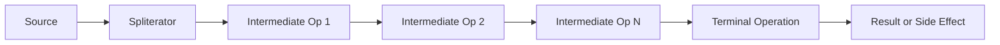
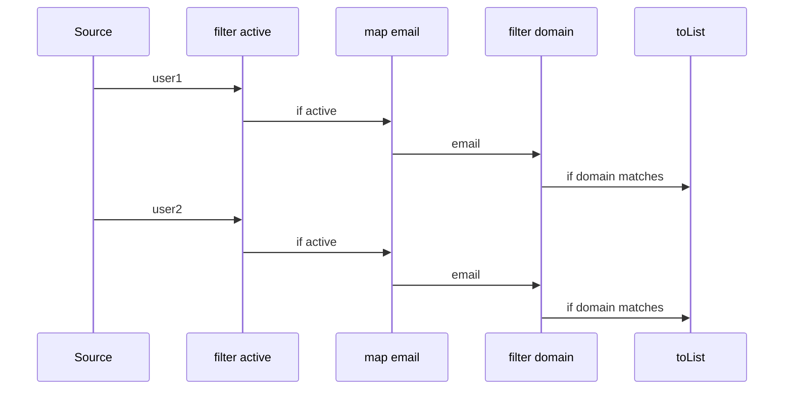

# Part 027 — Stream Performance Model: Allocation, Boxing, Fusion, Ordering, Short-Circuiting

> Target: setelah bagian ini, kamu mampu membaca pipeline stream bukan sebagai “syntax yang lebih modern”, tetapi sebagai **execution plan**: source quality, operation shape, allocation, boxing, ordering, stateful barrier, materialization, dan terminal behavior. Tujuannya bukan anti-stream, tetapi mampu memutuskan kapan stream membuat code lebih jelas, kapan loop lebih tepat, dan kapan performa harus dibuktikan dengan benchmark.

Stream API memberi cara deklaratif untuk memproses data:

```java
int total = orders.stream()
        .filter(Order::isSettled)
        .mapToInt(Order::amount)
        .sum();
```

Code seperti ini mudah dibaca. Tetapi di production, pertanyaan yang lebih penting adalah:

```text
Apa source-nya?
Berapa ukuran datanya?
Apakah elemennya primitive atau boxed?
Apakah pipeline punya stateful barrier?
Apakah encounter order penting?
Apakah terminal operation bisa short-circuit?
Apakah pipeline materialize intermediate result?
Apakah cost per element cukup besar untuk menutupi overhead stream?
```

Stream performance bukan soal “stream lambat” atau “loop cepat”. Itu framing yang salah. Framing yang benar:

```text
Performance = source cost + traversal cost + operation cost + allocation cost + ordering cost + terminal cost + runtime optimization result.
```

---

## 1. Posisi Part Ini dalam Framework Kaufman

```mermaid
flowchart TD
    A[Stream Performance Mastery] --> B[Deconstruct]
    B --> B1[Source Quality]
    B --> B2[Operation Cost]
    B --> B3[Boxing]
    B --> B4[Allocation]
    B --> B5[Ordering]
    B --> B6[Stateful Barrier]
    B --> B7[Short Circuit]
    B --> B8[Materialization]

    A --> C[Self Correct]
    C --> C1[Loop vs Stream]
    C --> C2[Object vs Primitive Stream]
    C --> C3[Ordered vs Unordered]
    C --> C4[Stateful vs Stateless]
    C --> C5[Measure Before Claim]

    A --> D[Remove Barriers]
    D --> D1[Decision Matrix]
    D --> D2[JMH Template]
    D --> D3[Code Smell Catalogue]
    D --> D4[Review Checklist]

    A --> E[Practice]
    E --> E1[Refactor Pipeline]
    E --> E2[Remove Boxing]
    E --> E3[Eliminate Materialization]
    E --> E4[Benchmark Variants]
```



Kaufman-style compression:

```text
A stream pipeline is a lazy traversal plan. Performance comes from the shape of that plan, not from the word stream.
```

---

## 2. Stream Performance Mental Model

A stream pipeline has this shape:



The important point:

```text
Intermediate operations do not execute as independent full passes by default.
```

For many stateless operations, stream implementation can traverse element-by-element through the pipeline:

```text
element 1 -> filter -> map -> terminal
element 2 -> filter -> map -> terminal
element 3 -> filter -> map -> terminal
```

That is why a pipeline like this does not necessarily create an intermediate list:

```java
List<String> names = users.stream()
        .filter(User::active)
        .map(User::name)
        .toList();
```

But there are operations that change the cost model:

```text
distinct
sorted
limit/skip in ordered parallel contexts
takeWhile/dropWhile with ordered source
collect/toList/toArray materialization
```

The top 1% habit is to classify each operation:

| Operation kind | Examples | Performance implication |
|---|---|---|
| Stateless one-to-one | `map`, `mapToInt` | usually pipeline-friendly |
| Stateless filter | `filter` | may reduce downstream work |
| Stateless one-to-many | `flatMap`, `mapMulti` | can amplify work |
| Stateful de-dup | `distinct` | needs remembered elements |
| Stateful ordering | `sorted` | often requires buffering |
| Short-circuit | `anyMatch`, `findFirst`, `limit` | may stop early |
| Materializing terminal | `toList`, `collect`, `toArray` | allocates result structure |
| Side-effect terminal | `forEach` | correctness risk if external state involved |

---

## 3. Source Quality: The Hidden Performance Input

The same pipeline can perform very differently depending on its source.

```java
arrayList.stream().map(...).toList();
linkedList.stream().map(...).toList();
hashSet.stream().map(...).toList();
fileLines.map(...).toList();
```

A source contributes:

- traversal cost
- spliterator characteristics
- known size or unknown size
- encounter order
- splitting quality for parallel stream
- locality of data
- mutation/interference risk
- resource lifecycle

### 3.1 Array and `ArrayList` sources

Good traits:

- predictable indexed storage
- good locality relative to pointer-heavy structures
- usually known size
- efficient sequential traversal
- usually good splitting behavior

Example:

```java
int total = numbers.stream()
        .mapToInt(Integer::intValue)
        .sum();
```

Still, this has boxing because `numbers` is `List<Integer>`.

Better if the source can be primitive:

```java
int total = IntStream.of(values).sum();
```

### 3.2 `LinkedList` source

Usually suspicious for stream-heavy processing.

Why:

- node traversal means pointer chasing
- poor cache locality
- splitting is less natural than array-backed data
- per-element overhead may dominate cheap operations

This does not mean `LinkedList.stream()` is always wrong. It means cheap transformations over large linked lists deserve scrutiny.

### 3.3 `HashSet` / `HashMap` views

Useful when uniqueness/lookup is the actual contract.

Performance considerations:

- encounter order is not deterministic unless using ordered implementation
- traversal walks table/buckets, not dense logical sequence
- `unordered()` may allow more flexibility in some pipelines
- `distinct()` after a set source is often redundant semantically

Smell:

```java
Set<String> uniqueIds = ...;
List<String> sorted = uniqueIds.stream()
        .distinct()     // usually redundant
        .sorted()
        .toList();
```

Better:

```java
List<String> sorted = uniqueIds.stream()
        .sorted()
        .toList();
```

### 3.4 Resource-backed source

Examples:

```java
Files.lines(path)
BufferedReader.lines()
```

Performance and correctness concerns:

- resource must be closed
- data may be consumed lazily
- exceptions may appear during terminal operation, not stream creation
- materializing all lines may defeat streaming benefit

Use:

```java
try (Stream<String> lines = Files.lines(path)) {
    long count = lines
            .filter(line -> !line.isBlank())
            .count();
}
```

---

## 4. Allocation Model

Stream code can allocate at several levels:

```text
pipeline objects
lambda/method reference objects or call sites
boxing wrappers
intermediate objects created by map
temporary buffers for stateful operations
result containers
collector accumulation objects
nested streams from flatMap
```

Do not assume every lambda allocates per element. Modern JVMs are more sophisticated than that. But also do not assume the JVM will eliminate all abstraction cost.

A practical model:

```text
If per-element operation is expensive, stream overhead may be noise.
If per-element operation is tiny, stream overhead may dominate.
```

### 4.1 Cheap per-element operation

Potentially sensitive:

```java
long count = ids.stream()
        .filter(id -> id > 0)
        .count();
```

For a hot path over millions of integers, this might be worse than primitive array traversal because of boxing and abstraction.

### 4.2 Expensive per-element operation

Usually stream overhead is less important:

```java
List<Decision> decisions = cases.stream()
        .filter(caseFile -> policyEngine.evaluate(caseFile).isAllowed())
        .map(caseFile -> riskModel.score(caseFile))
        .toList();
```

Here, policy evaluation and risk scoring dominate.

### 4.3 Allocation inside `map`

This allocates one DTO per surviving element:

```java
List<CustomerView> views = customers.stream()
        .filter(Customer::active)
        .map(c -> new CustomerView(c.id(), c.name(), c.status()))
        .toList();
```

That allocation is not a stream problem. It is the program’s requested output.

But this is suspicious:

```java
long count = customers.stream()
        .map(c -> new CustomerView(c.id(), c.name(), c.status()))
        .filter(CustomerView::active)
        .count();
```

If you only need count, constructing DTOs before filtering is wasteful.

Better:

```java
long count = customers.stream()
        .filter(Customer::active)
        .count();
```

Rule:

```text
Delay object creation until the object is actually needed.
```

---

## 5. Boxing and Primitive Streams

Boxing is one of the most common hidden costs in stream pipelines.

Suspicious:

```java
int total = orders.stream()
        .map(Order::amount)       // Stream<Integer>
        .reduce(0, Integer::sum);
```

Better:

```java
int total = orders.stream()
        .mapToInt(Order::amount)  // IntStream
        .sum();
```

The second version avoids creating or carrying boxed `Integer` values through the numeric pipeline.

### 5.1 Common boxing smells

| Smell | Better |
|---|---|
| `Stream<Integer>.reduce(0, Integer::sum)` | `mapToInt(...).sum()` |
| `stream.map(x -> x.score()).collect(summingInt(...))` when only sum needed | `mapToInt(...).sum()` |
| `IntStream.range(...).boxed().toList()` before numeric processing | keep `IntStream` longer |
| `List<Integer>` as hot numeric storage | consider `int[]` or primitive-specialized structure |
| `Comparator.comparing(x -> x.intValue())` | `Comparator.comparingInt(...)` |

### 5.2 Primitive stream boundaries

Primitive streams are excellent for numeric aggregation:

```java
IntSummaryStatistics stats = orders.stream()
        .mapToInt(Order::amount)
        .summaryStatistics();
```

But they are intentionally specialized:

```text
IntStream
LongStream
DoubleStream
```

There is no `BooleanStream`, `ByteStream`, or `BigDecimalStream` in the JDK.

For domain money, do not force `double` for performance if the domain requires exact decimal semantics.

Bad:

```java
double total = invoices.stream()
        .mapToDouble(invoice -> invoice.amount().doubleValue())
        .sum();
```

Better for exact money:

```java
BigDecimal total = invoices.stream()
        .map(Invoice::amount)
        .reduce(BigDecimal.ZERO, BigDecimal::add);
```

Performance cannot override domain correctness.

---

## 6. Pipeline Fusion: What It Is and What It Is Not

For stateless operations, stream pipelines are usually evaluated as one traversal.

```java
List<String> result = users.stream()
        .filter(User::active)
        .map(User::email)
        .filter(email -> email.endsWith("@example.com"))
        .toList();
```

Conceptual execution:



What fusion does not mean:

- no allocation ever
- no method calls ever
- no buffering ever
- all operations become one machine instruction
- all pipelines are equivalent to hand-written loops

Better mental model:

```text
Stateless stream stages can often be chained into one traversal, but abstraction and per-stage dispatch still exist unless optimized away by runtime.
```

---

## 7. Operation Ordering: Put Cheap Filters Early

This is one of the simplest and highest-value optimizations.

Bad:

```java
List<RiskScore> scores = cases.stream()
        .map(riskEngine::score)
        .filter(score -> score.level() == HIGH)
        .toList();
```

If scoring is expensive and not every case is eligible, filter first:

```java
List<RiskScore> scores = cases.stream()
        .filter(CaseFile::isOpen)
        .filter(CaseFile::hasRequiredEvidence)
        .map(riskEngine::score)
        .filter(score -> score.level() == HIGH)
        .toList();
```

Principle:

```text
Reject early. Allocate late. Sort last. Materialize only at the boundary.
```

### 7.1 Cheap reject before expensive map

```java
orders.stream()
        .filter(Order::isSettled)
        .filter(order -> order.totalCents() > 0)
        .map(reportMapper::toLine)
        .toList();
```

### 7.2 Preserve readability

Do not over-optimize into unreadable pipelines:

```java
// Too dense
var result = xs.stream().filter(a).map(b).filter(c).flatMap(d).filter(e).map(f).toList();
```

Better:

```java
List<EligibleCase> eligibleCases = cases.stream()
        .filter(CaseFile::isOpen)
        .filter(CaseFile::hasRequiredEvidence)
        .map(eligibilityMapper::toEligibleCase)
        .toList();

List<RiskDecision> decisions = eligibleCases.stream()
        .map(riskEngine::decide)
        .filter(RiskDecision::requiresEscalation)
        .toList();
```

This materializes an intermediate list, so it is not always fastest. But when the intermediate concept is domain-significant, the clarity can be worth it. Performance-sensitive code should benchmark both variants.

---

## 8. Stateful Operations as Barriers

A stateless operation can process one element at a time.

A stateful operation needs memory of other elements.

Examples:

```java
distinct()
sorted()
limit(n)   // may be cheap sequentially; can be costly with ordered parallel pipelines
skip(n)
takeWhile(predicate)
dropWhile(predicate)
```

### 8.1 `sorted()`

```java
List<User> users = input.stream()
        .filter(User::active)
        .sorted(comparing(User::createdAt))
        .toList();
```

`sorted()` cannot emit final sorted order until it has enough elements to sort. That means buffering.

Decision rule:

```text
Filter before sorted whenever possible.
```

Bad:

```java
input.stream()
        .sorted(comparing(User::createdAt))
        .filter(User::active)
        .toList();
```

Better:

```java
input.stream()
        .filter(User::active)
        .sorted(comparing(User::createdAt))
        .toList();
```

### 8.2 `distinct()`

```java
List<String> uniqueEmails = users.stream()
        .map(User::email)
        .filter(Objects::nonNull)
        .distinct()
        .toList();
```

`distinct()` needs to remember previously seen values.

Questions:

- Is uniqueness required?
- Does equality match domain identity?
- Is order required?
- Would collecting to `LinkedHashSet` communicate intent better?

Alternative:

```java
Set<String> uniqueEmails = users.stream()
        .map(User::email)
        .filter(Objects::nonNull)
        .collect(Collectors.toCollection(LinkedHashSet::new));
```

Then convert if needed:

```java
List<String> orderedUniqueEmails = new ArrayList<>(uniqueEmails);
```

### 8.3 `limit()` and `skip()`

Sequential ordered source:

```java
List<Order> firstTen = orders.stream()
        .filter(Order::settled)
        .limit(10)
        .toList();
```

Potentially efficient because terminal traversal can stop after enough elements.

But moving `limit` can change semantics:

```java
orders.stream()
        .limit(10)
        .filter(Order::settled)
        .toList();
```

This means:

```text
from the first 10 orders, keep settled ones
```

The previous one means:

```text
find the first 10 settled orders
```

Performance optimization must not change business meaning.

---

## 9. Encounter Order Cost

Encounter order is the order in which a stream encounters source elements.

Examples:

- `List` has encounter order
- arrays have encounter order
- `LinkedHashSet` has encounter order
- `HashSet` generally should not be treated as deterministic order
- `TreeSet` has sorted encounter order

Order matters for operations like:

```java
findFirst()
forEachOrdered()
limit()
skip()
takeWhile()
dropWhile()
sorted()
```

If order does not matter, explicitly dropping order can sometimes help, especially in parallel contexts:

```java
boolean exists = records.parallelStream()
        .unordered()
        .anyMatch(this::isFraudCandidate);
```

But only do this when order truly has no semantic meaning.

Review question:

```text
Would a different encounter order change logs, audit output, pagination, exported reports, or tests?
```

If yes, order matters.

---

## 10. Short-Circuiting: Stop Early When Semantics Allow

Short-circuiting terminal operations can stop traversal early.

Examples:

```java
anyMatch
allMatch
noneMatch
findFirst
findAny
```

### 10.1 Use `anyMatch` instead of count comparison

Bad:

```java
boolean hasHighRisk = cases.stream()
        .filter(this::isHighRisk)
        .count() > 0;
```

Better:

```java
boolean hasHighRisk = cases.stream()
        .anyMatch(this::isHighRisk);
```

The second version can stop at the first match.

### 10.2 Use `noneMatch` instead of negating `anyMatch` carefully

Both are valid:

```java
boolean noExpired = policies.stream()
        .noneMatch(Policy::expired);
```

Equivalent:

```java
boolean noExpired = !policies.stream()
        .anyMatch(Policy::expired);
```

Prefer the version that expresses the domain invariant clearly.

### 10.3 `findFirst` vs `findAny`

Use `findFirst` when encounter order is semantically relevant:

```java
Optional<Event> firstFailure = events.stream()
        .filter(Event::failed)
        .findFirst();
```

Use `findAny` when any matching element is acceptable:

```java
Optional<Event> anyFailure = events.parallelStream()
        .filter(Event::failed)
        .findAny();
```

---

## 11. Materialization Cost

Materialization means creating an actual data structure from a stream.

Examples:

```java
toList()
toArray()
collect(toSet())
collect(groupingBy(...))
collect(toMap(...))
```

This is necessary at boundaries:

- return API response
- persist batch
- send payload
- produce report
- build lookup index
- reuse result multiple times

But it is wasteful if used only to continue processing.

Bad:

```java
List<Order> settled = orders.stream()
        .filter(Order::settled)
        .toList();

long highValueCount = settled.stream()
        .filter(order -> order.totalCents() > 1_000_000)
        .count();
```

Better if `settled` is not a domain boundary:

```java
long highValueCount = orders.stream()
        .filter(Order::settled)
        .filter(order -> order.totalCents() > 1_000_000)
        .count();
```

### 11.1 Materialization as a named boundary

Intermediate materialization can be correct when it names an important boundary:

```java
List<CaseFile> eligibleCases = cases.stream()
        .filter(eligibilityRules::isEligible)
        .toList();

audit.recordEligibleCases(batchId, eligibleCases);

List<Escalation> escalations = eligibleCases.stream()
        .map(escalationPolicy::evaluate)
        .filter(Escalation::required)
        .toList();
```

This is not merely a performance choice; it is an auditability choice.

---

## 12. `flatMap` vs `mapMulti`

`flatMap` is expressive but may create many small streams:

```java
List<LineItem> items = orders.stream()
        .flatMap(order -> order.items().stream())
        .toList();
```

For many cases, this is perfectly fine.

But when avoiding nested stream creation matters, `mapMulti` can be useful:

```java
List<LineItem> items = orders.stream()
        .<LineItem>mapMulti((order, downstream) -> {
            for (LineItem item : order.items()) {
                downstream.accept(item);
            }
        })
        .toList();
```

Trade-off:

| Option | Strength | Weakness |
|---|---|---|
| `flatMap` | simple, declarative | may create nested stream objects |
| `mapMulti` | avoids nested stream creation, flexible zero/many emit | more imperative inside lambda |

Use `mapMulti` when:

- expansion is hot
- nested streams are expensive
- zero/one/many emission logic is clearer with a callback
- profiling shows `flatMap` overhead matters

Do not use it merely to look clever.

---

## 13. Sorting and Comparator Cost

Sorting is usually more expensive than mapping/filtering.

Bad:

```java
List<Customer> result = customers.stream()
        .sorted(comparing(Customer::lastLogin))
        .filter(Customer::active)
        .limit(100)
        .toList();
```

Better:

```java
List<Customer> result = customers.stream()
        .filter(Customer::active)
        .sorted(comparing(Customer::lastLogin))
        .limit(100)
        .toList();
```

But for top-N use cases, sorting all elements may still be wasteful.

If you only need top 100 from millions, consider a bounded heap or specialized selection algorithm. This series will not repeat DSA implementation detail, but the production rule is clear:

```text
Full sort for top-N can be algorithmically wrong for large N-source data.
```

Comparator cost also matters.

Suspicious:

```java
.sorted(comparing(customer -> expensiveNormalize(customer.name())))
```

If normalization is expensive and repeated many times during sort, precompute key:

```java
record CustomerSortKey(Customer customer, String normalizedName) {}

List<Customer> sorted = customers.stream()
        .map(c -> new CustomerSortKey(c, expensiveNormalize(c.name())))
        .sorted(comparing(CustomerSortKey::normalizedName))
        .map(CustomerSortKey::customer)
        .toList();
```

This allocates wrapper records but may reduce repeated expensive computation. Benchmark if it is hot.

---

## 14. Exception Cost and Failure Path Design

Exceptions inside streams are not free, but the bigger issue is usually clarity.

Bad:

```java
List<CustomerId> ids = rows.stream()
        .map(row -> CustomerId.parse(row.get("customer_id")))
        .toList();
```

If parsing can fail, where is row context preserved?

Better:

```java
List<ParsedCustomerId> parsed = rows.stream()
        .map(row -> parseCustomerId(row))
        .toList();
```

With explicit result:

```java
sealed interface ParsedCustomerId {
    record Valid(CustomerId id) implements ParsedCustomerId {}
    record Invalid(int rowNumber, String rawValue, String reason) implements ParsedCustomerId {}
}
```

Performance principle:

```text
Do not use exceptions as normal filtering control flow in large pipelines.
```

Better:

```java
List<CustomerId> ids = rows.stream()
        .map(this::tryParseCustomerId)
        .flatMap(Optional::stream)
        .toList();
```

Only if losing invalid diagnostics is acceptable.

---

## 15. Stream Reuse and Supplier Pattern

Streams are single-use.

Bad:

```java
Stream<Order> settled = orders.stream()
        .filter(Order::settled);

long count = settled.count();
List<Order> list = settled.toList(); // IllegalStateException likely
```

Better:

```java
Supplier<Stream<Order>> settled = () -> orders.stream()
        .filter(Order::settled);

long count = settled.get().count();
List<Order> list = settled.get().toList();
```

But repeated traversal may be expensive. If you need multiple passes over the same derived dataset, materialize intentionally:

```java
List<Order> settled = orders.stream()
        .filter(Order::settled)
        .toList();

long count = settled.size();
long total = settled.stream()
        .mapToLong(Order::totalCents)
        .sum();
```

The choice is:

```text
repeat computation vs allocate snapshot
```

---

## 16. Loop vs Stream Decision Matrix

| Situation | Prefer Stream | Prefer Loop |
|---|---:|---:|
| Simple transform/filter/materialize | ✅ | maybe |
| Numeric hot path over primitive array | maybe | ✅ |
| Complex branching with early exits and rich diagnostics | maybe | ✅ |
| Declarative aggregation | ✅ | maybe |
| Custom intermediate operation available via Gatherer | ✅ | maybe |
| Mutation-heavy in-place update | ❌ | ✅ |
| Checked exception-heavy path | maybe | ✅ |
| Requires multiple accumulators and clear collector exists | ✅ | maybe |
| Requires multiple accumulators but collector becomes unreadable | ❌ | ✅ |
| Performance-critical and benchmark favors loop | ❌ | ✅ |

Top 1% rule:

```text
Choose stream for semantic clarity, choose loop for control clarity, benchmark for performance claims.
```

---

## 17. Microbenchmarking: Do Not Trust Intuition Alone

Bad benchmark:

```java
long start = System.nanoTime();
var result = input.stream().map(...).toList();
long end = System.nanoTime();
System.out.println(end - start);
```

Problems:

- JIT warmup ignored
- dead-code elimination risk
- GC noise
- input construction included accidentally
- too few iterations
- branch prediction and cache state uncontrolled
- result not consumed reliably

Use JMH for serious claims.

Minimal shape:

```java
@State(Scope.Thread)
public class StreamBenchmark {
    private List<Integer> values;

    @Setup
    public void setup() {
        values = IntStream.range(0, 1_000_000)
                .boxed()
                .toList();
    }

    @Benchmark
    public int stream_sum() {
        return values.stream()
                .mapToInt(Integer::intValue)
                .filter(x -> x % 2 == 0)
                .sum();
    }

    @Benchmark
    public int loop_sum() {
        int sum = 0;
        for (int value : values) {
            if (value % 2 == 0) {
                sum += value;
            }
        }
        return sum;
    }
}
```

Interpretation discipline:

```text
Benchmark a representative workload, not a toy pipeline that proves your preference.
```

---

## 18. Performance Smell Catalogue

### Smell 1 — `count() > 0`

```java
boolean exists = stream.filter(p).count() > 0;
```

Use:

```java
boolean exists = stream.anyMatch(p);
```

### Smell 2 — Sorting before filtering

```java
stream.sorted(c).filter(p).toList();
```

Usually:

```java
stream.filter(p).sorted(c).toList();
```

### Smell 3 — `distinct()` after `Set`

```java
set.stream().distinct().toList();
```

Usually redundant.

### Smell 4 — Boxed numeric reduction

```java
stream.map(Foo::number).reduce(0, Integer::sum);
```

Use:

```java
stream.mapToInt(Foo::number).sum();
```

### Smell 5 — Materialize then immediately stream

```java
var tmp = stream.filter(p).toList();
return tmp.stream().map(f).toList();
```

Usually combine, unless `tmp` is a real boundary.

### Smell 6 — `peek` for business side effects

```java
orders.stream()
        .peek(audit::record)
        .map(processor::process)
        .toList();
```

Use explicit loop or terminal side-effect pattern if side effects are the point.

### Smell 7 — Expensive key extraction in comparator

```java
stream.sorted(comparing(x -> expensiveKey(x))).toList();
```

Consider precomputing keys.

### Smell 8 — Parallel stream as panic optimization

```java
stream.parallel().map(...).toList();
```

Parallel stream deserves a separate decision model. That is Part 028.

---

## 19. Production Review Checklist

Before approving stream-heavy code, ask:

```text
1. Is the source size known or bounded?
2. Is the source array/list/set/resource-backed?
3. Is encounter order required?
4. Are lambdas stateless and non-interfering?
5. Is there hidden boxing?
6. Are expensive operations placed after cheap filters?
7. Are stateful operations necessary?
8. Is materialization intentional?
9. Does the terminal operation short-circuit when possible?
10. Would a loop express control flow more clearly?
11. Is this code hot enough to benchmark?
12. Does the benchmark represent production data shape?
```

---

## 20. Worked Refactoring Example

Initial code:

```java
List<CaseSummary> summaries = cases.stream()
        .sorted(comparing(CaseFile::createdAt))
        .map(caseFile -> new CaseSummary(
                caseFile.id(),
                riskEngine.score(caseFile),
                caseFile.status()
        ))
        .filter(summary -> summary.riskScore() > 80)
        .distinct()
        .limit(100)
        .toList();
```

Problems:

- sorts all cases before filtering
- scores all cases before cheap eligibility checks
- constructs summaries before risk filtering
- `distinct()` depends on `CaseSummary.equals`
- `limit` after `distinct` has specific semantics that must be intentional

Refactored:

```java
List<CaseSummary> summaries = cases.stream()
        .filter(CaseFile::isOpen)
        .filter(CaseFile::hasRequiredEvidence)
        .map(caseFile -> new ScoredCase(caseFile, riskEngine.score(caseFile)))
        .filter(scored -> scored.score() > 80)
        .sorted(comparing(scored -> scored.caseFile().createdAt()))
        .limit(100)
        .map(scored -> new CaseSummary(
                scored.caseFile().id(),
                scored.score(),
                scored.caseFile().status()
        ))
        .toList();
```

Helper:

```java
record ScoredCase(CaseFile caseFile, int score) {}
```

Review:

- cheap filters first
- expensive scoring only after eligibility
- summary allocation delayed
- sort reduced dataset
- no `distinct()` unless domain requires it

If uniqueness is required by case id:

```java
List<CaseSummary> summaries = cases.stream()
        .filter(CaseFile::isOpen)
        .filter(CaseFile::hasRequiredEvidence)
        .collect(Collectors.toMap(
                CaseFile::id,
                Function.identity(),
                (left, right) -> left.createdAt().isBefore(right.createdAt()) ? left : right,
                LinkedHashMap::new
        ))
        .values()
        .stream()
        .map(caseFile -> new ScoredCase(caseFile, riskEngine.score(caseFile)))
        .filter(scored -> scored.score() > 80)
        .sorted(comparing(scored -> scored.caseFile().createdAt()))
        .limit(100)
        .map(scored -> new CaseSummary(
                scored.caseFile().id(),
                scored.score(),
                scored.caseFile().status()
        ))
        .toList();
```

Now duplicate policy is explicit.

---

## 21. Practice: 90-Minute Performance Reasoning Drill

Take five existing stream pipelines from your codebase.

For each, write:

```text
source:
size:
known bounded/unbounded:
encounter order required:
primitive/boxed:
stateless operations:
stateful operations:
short-circuit possible:
materialization boundary:
side effects:
likely bottleneck:
loop alternative worth testing:
```

Then refactor one pipeline using these rules:

1. reject early
2. allocate late
3. avoid boxing where easy
4. remove redundant stateful operations
5. replace count comparison with match operation
6. make duplicate policy explicit
7. benchmark only if it is a hot path

---

## 22. Key Takeaways

- Stream performance depends on pipeline shape, source quality, operation cost, boxing, ordering, stateful barriers, and terminal behavior.
- Stateless operations usually compose well; stateful operations such as `sorted` and `distinct` change the cost model.
- Primitive streams avoid common boxed numeric overhead.
- Short-circuiting operations express both semantics and performance intent.
- Materialization is not bad when it is a real boundary; it is bad when accidental.
- Loops are not obsolete. Streams are not magic. The best engineer chooses based on semantics, control, and measured behavior.

---

## References

- Java SE 25 API — `java.util.stream` package summary: https://docs.oracle.com/en/java/javase/25/docs/api/java.base/java/util/stream/package-summary.html
- Java SE 25 API — `Stream`: https://docs.oracle.com/en/java/javase/25/docs/api/java.base/java/util/stream/Stream.html
- Java SE 25 API — `BaseStream`: https://docs.oracle.com/en/java/javase/25/docs/api/java.base/java/util/stream/BaseStream.html
- Java SE 25 API — `Spliterator`: https://docs.oracle.com/en/java/javase/25/docs/api/java.base/java/util/Spliterator.html
- Java SE 25 API — `Collectors`: https://docs.oracle.com/en/java/javase/25/docs/api/java.base/java/util/stream/Collectors.html
- Java Microbenchmark Harness project: https://openjdk.org/projects/code-tools/jmh/
