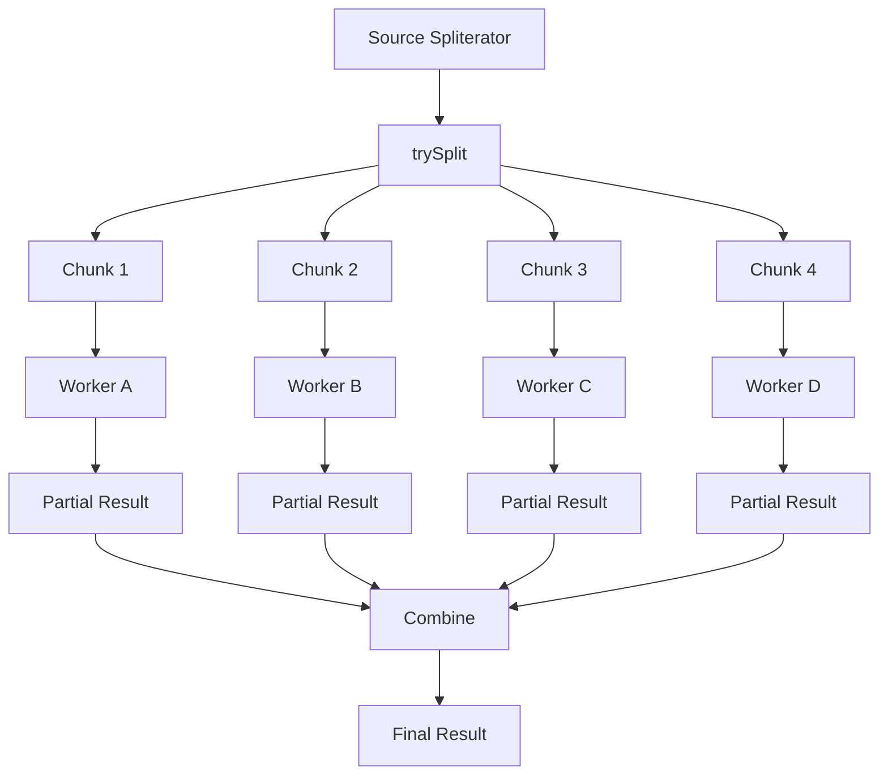
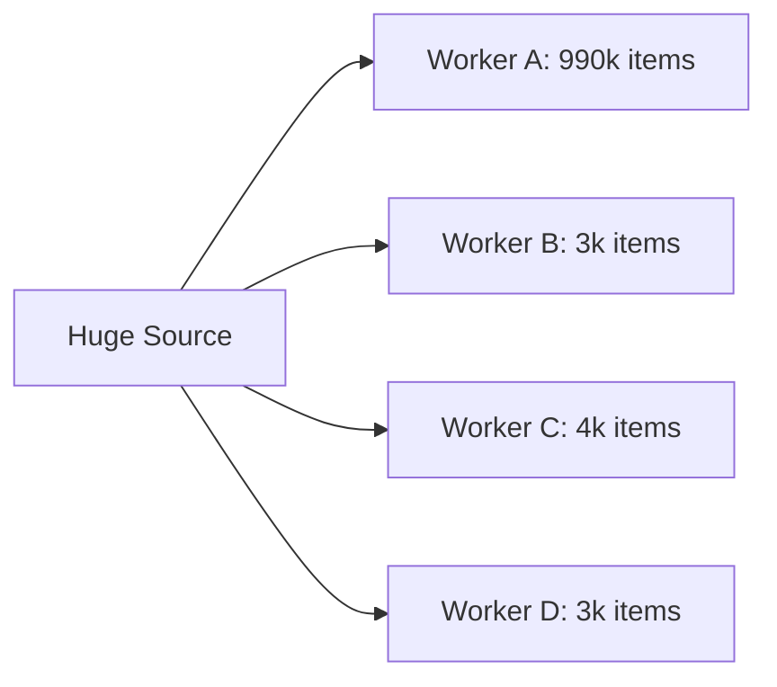
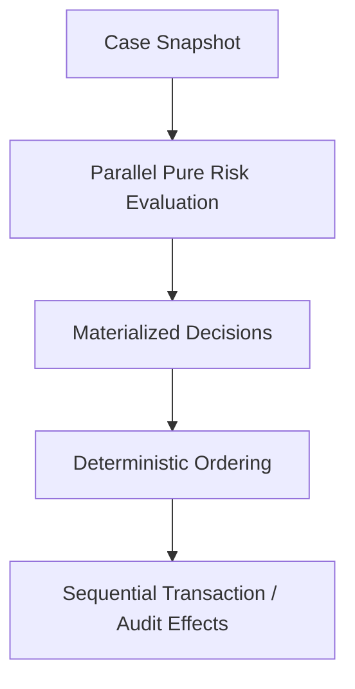

# Part 028 — Parallel Streams: Correct Use, Wrong Use, and Production Constraints

> Target: setelah bagian ini, kamu mampu memakai parallel stream sebagai alat **data parallelism** yang terkontrol, bukan sebagai tombol ajaib untuk mempercepat kode. Kamu akan memahami splitting, work distribution, associativity, ordering cost, shared mutable state, blocking hazards, common-pool risk, dan kapan parallel stream sebaiknya diganti dengan loop, executor, batch job, atau explicit pipeline.

Parallel stream terlihat sederhana:

```java
List<Result> results = inputs.parallelStream()
        .map(this::expensiveCompute)
        .toList();
```

Tetapi simplicity ini berbahaya kalau mental model-nya salah.

Parallel stream bukan berarti:

```text
always faster
safe for I/O
safe with shared mutable state
safe with transactions
safe with request-scoped context
isolated from other parallel workloads
predictable ordering by default
free from coordination overhead
```

Parallel stream berarti:

```text
The stream implementation may partition the source and process partitions concurrently, while preserving the stream contract.
```

Kalimat terakhir penting: **contract dulu, parallelism kedua**.

---

## 1. Posisi Part Ini dalam Framework Kaufman

```mermaid
flowchart TD
    A[Parallel Stream Mastery] --> B[Deconstruct]
    B --> B1[Source Splitting]
    B --> B2[Per Element Cost]
    B --> B3[Associativity]
    B --> B4[Shared State]
    B --> B5[Ordering]
    B --> B6[Blocking]
    B --> B7[Pool Interaction]
    B --> B8[Benchmark]

    A --> C[Self Correct]
    C --> C1[Sequential vs Parallel Result Equivalence]
    C --> C2[Combiner Correctness]
    C --> C3[Race Detection]
    C --> C4[Order Semantics]
    C --> C5[Throughput vs Latency]

    A --> D[Remove Barriers]
    D --> D1[Go No-Go Checklist]
    D --> D2[Collector Rules]
    D --> D3[Anti Pattern Catalogue]
    D --> D4[Benchmark Harness]

    A --> E[Practice]
    E --> E1[CPU Bound Map]
    E --> E2[Bad Shared List]
    E --> E3[Non Associative Reduce]
    E --> E4[Ordering Penalty]
    E --> E5[Pool Contention Scenario]
```



Kaufman-style compression:

```text
Parallel stream is good when data can split well, work per element is large enough, operations are stateless, reductions are associative, and order does not dominate.
```

---

## 2. Sequential Stream vs Parallel Stream

Sequential:

```java
long count = cases.stream()
        .filter(this::requiresEscalation)
        .count();
```

Parallel:

```java
long count = cases.parallelStream()
        .filter(this::requiresEscalation)
        .count();
```

Same logical pipeline. Different execution possibility.

Conceptual model:



The hidden cost:

```text
split source
schedule tasks
process chunks
combine partial results
preserve ordering if required
coordinate completion
```

Parallelism helps only when saved work time exceeds coordination overhead.

---

## 3. The Five Preconditions for Good Parallel Stream

Use this first-pass checklist:

```text
1. Large enough input.
2. Splittable source.
3. Expensive enough per-element work.
4. Stateless and non-interfering operations.
5. Associative reduction / safe collector.
```

### 3.1 Large enough input

Bad candidate:

```java
List<Integer> small = List.of(1, 2, 3, 4, 5);
int sum = small.parallelStream().mapToInt(Integer::intValue).sum();
```

Parallel overhead dominates.

### 3.2 Splittable source

Good candidates:

- array
- `ArrayList`
- `IntStream.range`
- collections with good `SIZED` / `SUBSIZED` splitting

Weak candidates:

- `LinkedList`
- iterator-backed unknown-size source
- I/O stream source
- source where splitting is expensive or imbalanced

### 3.3 Expensive per-element work

Good candidate:

```java
List<RiskScore> scores = cases.parallelStream()
        .map(riskModel::scoreCpuBound)
        .toList();
```

Only if `scoreCpuBound` is actually CPU-bound, independent, and heavy enough.

Bad candidate:

```java
List<String> normalized = names.parallelStream()
        .map(String::trim)
        .map(String::toLowerCase)
        .toList();
```

Cheap per-element work often loses to overhead.

### 3.4 Stateless and non-interfering operations

Good:

```java
long total = orders.parallelStream()
        .filter(Order::settled)
        .mapToLong(Order::totalCents)
        .sum();
```

Bad:

```java
List<Order> settled = new ArrayList<>();
orders.parallelStream()
        .filter(Order::settled)
        .forEach(settled::add); // race / corruption risk
```

Use collector:

```java
List<Order> settled = orders.parallelStream()
        .filter(Order::settled)
        .toList();
```

### 3.5 Associative reduction

Good:

```java
int sum = values.parallelStream()
        .mapToInt(Integer::intValue)
        .sum();
```

Addition over integers is structurally associative in mathematical intent, ignoring overflow nuance. The stream implementation can combine partial sums.

Bad:

```java
int result = values.parallelStream()
        .reduce(0, (a, b) -> a - b);
```

Subtraction is not associative:

```text
(a - b) - c != a - (b - c)
```

Parallel result may differ from sequential result.

---

## 4. Source Splitting: Why `Spliterator` Quality Matters

Parallel stream starts with a source spliterator.

Important methods:

```java
boolean tryAdvance(Consumer<? super T> action)
Spliterator<T> trySplit()
long estimateSize()
int characteristics()
```

For parallelism, `trySplit()` is crucial.

Good splitting:

```text
1,000,000 elements -> 500,000 + 500,000
500,000 -> 250,000 + 250,000
...
```

Bad splitting:

```text
1,000,000 elements -> 1 + 999,999
999,999 -> 1 + 999,998
...
```

Bad splitting causes imbalance:



Most workers finish early; one worker does the real work.

### 4.1 Source characteristics

Useful characteristics for parallel performance:

| Characteristic | Why it matters |
|---|---|
| `SIZED` | known size helps partitioning/allocation |
| `SUBSIZED` | split parts also have known sizes |
| `ORDERED` | can preserve order, but may add cost |
| `IMMUTABLE` | less interference concern |
| `CONCURRENT` | source can be safely concurrently modified under defined rules |

Do not fake characteristics in a custom spliterator. Incorrect characteristics can create incorrect results.

---

## 5. Work Granularity

Parallel stream has overhead. Therefore per-element work must be large enough.

Bad candidate:

```java
long count = ids.parallelStream()
        .filter(id -> id > 0)
        .count();
```

Good candidate shape:

```java
List<Decision> decisions = cases.parallelStream()
        .map(caseFile -> expensivePureDecision(caseFile))
        .toList();
```

The work should be:

- CPU-bound
- independent per element
- no shared mutable state
- no blocking I/O
- no request-context mutation
- no transaction/session dependency
- enough input size

A practical heuristic:

```text
Parallel stream is more plausible when each element costs microseconds-to-milliseconds of CPU work, not nanoseconds of trivial mapping.
```

Still benchmark. Hardware, JVM, data shape, and load matter.

---

## 6. Shared Mutable State: The Most Common Bug

Wrong:

```java
Map<String, Integer> counts = new HashMap<>();

orders.parallelStream()
        .forEach(order -> counts.merge(order.status(), 1, Integer::sum));
```

This mutates a non-thread-safe map from multiple workers.

Using `ConcurrentHashMap` may avoid corruption but does not automatically make the design good:

```java
ConcurrentHashMap<String, LongAdder> counts = new ConcurrentHashMap<>();

orders.parallelStream()
        .forEach(order -> counts
                .computeIfAbsent(order.status(), ignored -> new LongAdder())
                .increment());
```

This can be correct, but it introduces contention and imperative side effects.

Often better:

```java
Map<String, Long> counts = orders.parallelStream()
        .collect(Collectors.groupingByConcurrent(
                Order::status,
                Collectors.counting()
        ));
```

Even then, verify that concurrent grouping fits your ordering and map requirements.

Rule:

```text
Prefer reduction/collect over external mutation.
```

---

## 7. Non-Associative Reduce Bugs

Reduction in parallel splits input into chunks, reduces each chunk, then combines partial results.

This requires identity and associativity rules.

Bad:

```java
String result = values.parallelStream()
        .reduce("", (a, b) -> a + "," + b);
```

Problems:

- string concatenation creates many intermediate strings
- identity interacts badly with separators
- parallel combination can produce surprising separator placement

Better:

```java
String result = values.parallelStream()
        .collect(Collectors.joining(","));
```

Bad numeric example:

```java
double result = values.parallelStream()
        .reduce(0.0, (a, b) -> a - b);
```

Better: use an associative operation or keep sequential if order-dependent fold is required.

### 7.1 Sequential fold is not always parallel reduction

This is a sequential fold:

```java
State state = initial;
for (Event event : events) {
    state = transition(state, event);
}
```

This is not automatically parallelizable.

If every event depends on previous state, parallel stream is the wrong abstraction unless you redesign the state machine with an associative summary model.

Regulatory workflow example:

```text
case events -> final enforcement state
```

Usually order-dependent. Do not parallelize blindly.

---

## 8. Ordering Penalty

Parallel processing and ordering often fight each other.

This may be slower than expected:

```java
records.parallelStream()
        .filter(this::eligible)
        .limit(100)
        .toList();
```

If the stream is ordered, `limit(100)` means the first 100 eligible records in encounter order. Workers cannot simply emit any 100 records without coordination.

If order does not matter:

```java
records.parallelStream()
        .unordered()
        .filter(this::eligible)
        .limit(100)
        .toList();
```

But this changes semantics:

```text
any 100 eligible records, not first 100 eligible records
```

### 8.1 `forEach` vs `forEachOrdered`

```java
records.parallelStream()
        .forEach(this::send);
```

May execute in nondeterministic order.

```java
records.parallelStream()
        .forEachOrdered(this::send);
```

Preserves encounter order but can reduce parallel benefit.

If sending order matters, ask why you are using parallel stream for side effects.

---

## 9. Blocking I/O Hazard

Bad:

```java
List<Response> responses = urls.parallelStream()
        .map(httpClient::get)
        .toList();
```

This looks attractive but is usually the wrong abstraction for I/O.

Problems:

- common pool / worker starvation risk
- blocking waits consume worker threads
- no explicit timeout/backpressure/concurrency limit in the pipeline itself
- weak observability per request
- cancellation semantics may be insufficient
- request context propagation may be unclear

Better choices:

- explicit `ExecutorService` with bounded concurrency
- async HTTP client
- structured concurrency where appropriate
- reactive pipeline if backpressure is core
- batch scheduler / queue worker for large jobs

Parallel stream is mainly for CPU-bound data parallelism, not uncontrolled I/O fan-out.

---

## 10. Common Pool and Isolation Concerns

The JDK exposes `ForkJoinPool.commonPool()` as a static common pool for fork/join tasks that are not explicitly submitted to a specified pool. In typical OpenJDK usage, parallel stream tasks are implemented on top of fork/join mechanics. The production implication is simple:

```text
Do not assume every parallel stream has a private isolated worker pool.
```

Risk scenarios:

- multiple request handlers using parallel streams under load
- background jobs and request traffic sharing CPU
- blocking work inside parallel stream
- parallel stream inside another parallel computation
- library code internally calling `.parallel()` without caller consent

Production rule:

```text
Avoid parallel streams in latency-sensitive request paths unless benchmarked under realistic concurrent load.
```

If you need explicit isolation, use an explicit executor or job model. Do not hide capacity policy inside `.parallelStream()`.

---

## 11. Nested Parallelism

Suspicious:

```java
customers.parallelStream()
        .map(customer -> customer.orders().parallelStream()
                .map(this::score)
                .toList())
        .toList();
```

Nested parallel streams can create contention, overhead, and confusing work distribution.

Better shapes:

Flatten first:

```java
List<ScoredOrder> scores = customers.stream()
        .flatMap(customer -> customer.orders().stream()
                .map(order -> new CustomerOrder(customer.id(), order)))
        .parallel()
        .map(co -> score(co.customerId(), co.order()))
        .toList();
```

Or use explicit batching:

```java
List<CustomerOrder> work = customers.stream()
        .flatMap(customer -> customer.orders().stream()
                .map(order -> new CustomerOrder(customer.id(), order)))
        .toList();

List<ScoredOrder> scores = work.parallelStream()
        .map(co -> score(co.customerId(), co.order()))
        .toList();
```

The second version materializes work intentionally, which may improve observability and capacity control.

---

## 12. ThreadLocal and Context Propagation Hazards

Parallel streams execute work on worker threads. That matters if code depends on:

- `ThreadLocal`
- security context
- MDC/logging context
- transaction context
- request context
- locale context
- tenant context
- database session

Bad:

```java
String tenant = TenantContext.currentTenant();

List<Result> results = records.parallelStream()
        .map(record -> service.process(record)) // service reads ThreadLocal tenant
        .toList();
```

Worker threads may not have the expected context.

Better:

```java
String tenant = TenantContext.currentTenant();

List<Result> results = records.parallelStream()
        .map(record -> service.process(tenant, record))
        .toList();
```

Even better: decide whether request-context-dependent service calls belong in a parallel stream at all.

Rule:

```text
Parallel stream lambdas should receive required context explicitly, not implicitly through thread-bound state.
```

---

## 13. Collector Safety in Parallel Streams

This is correct shape:

```java
Map<Status, Long> counts = orders.parallelStream()
        .collect(Collectors.groupingBy(
                Order::status,
                Collectors.counting()
        ));
```

Why this can work:

- each worker can build partial result
- combiner merges partial results
- collector contract defines how to finish result

This is not equivalent:

```java
Map<Status, Long> counts = new HashMap<>();
orders.parallelStream()
        .forEach(order -> counts.merge(order.status(), 1L, Long::sum));
```

The second mutates shared state.

### 13.1 `groupingBy` vs `groupingByConcurrent`

`groupingBy`:

- creates partial maps
- combines maps
- can preserve more predictable map behavior depending on supplier
- may have higher combine cost

`groupingByConcurrent`:

- uses concurrent accumulation strategy
- can reduce combining overhead for some workloads
- may alter ordering guarantees
- contention may still hurt

Do not assume `Concurrent` means faster. It means a different accumulation strategy.

---

## 14. `findFirst`, `findAny`, and Parallel Semantics

```java
Optional<Record> first = records.parallelStream()
        .filter(this::matches)
        .findFirst();
```

Preserves first in encounter order. This can require coordination.

```java
Optional<Record> any = records.parallelStream()
        .filter(this::matches)
        .findAny();
```

Can return any match. More parallel-friendly if order does not matter.

Decision:

```text
If business semantics say first, use findFirst.
If business semantics say existence/sample, use findAny or anyMatch.
```

Do not weaken semantics for speed without product/domain approval.

---

## 15. Parallel Stream in Request Path vs Batch Path

### Request path

Riskier because:

- latency matters
- concurrent users multiply CPU demand
- hidden pool sharing can amplify tail latency
- cancellation/timeouts matter
- observability matters

Avoid by default unless measured.

### Batch path

More plausible because:

- throughput matters
- workload can be bounded
- input size is large
- CPU can be dedicated
- results can be benchmarked offline

Example plausible batch:

```java
List<ScoredCase> scores = caseSnapshot.parallelStream()
        .map(caseFile -> riskModel.scorePure(caseFile))
        .toList();
```

Still require:

- pure computation
- no DB session usage
- no shared mutable state
- bounded memory
- deterministic output if audit requires it

---

## 16. Determinism and Auditability

Parallel streams can produce nondeterministic side-effect order.

Bad for audit:

```java
cases.parallelStream()
        .filter(this::requiresEscalation)
        .forEach(auditLog::write);
```

Potential issues:

- nondeterministic log order
- interleaved writes
- hard-to-replay sequence
- partial failure ambiguity

Better:

```java
List<EscalationDecision> decisions = cases.parallelStream()
        .filter(this::requiresEscalation)
        .map(this::toDecision)
        .toList();

List<EscalationDecision> ordered = decisions.stream()
        .sorted(comparing(EscalationDecision::caseId))
        .toList();

ordered.forEach(auditLog::write);
```

Parallelize pure computation. Serialize side effects.

This is a powerful production rule:

```text
Parallelize calculation; centralize irreversible effects.
```

---

## 17. Exception Handling in Parallel Streams

Parallel stream exception behavior can be harder to reason about than sequential loops.

Example:

```java
List<Result> results = records.parallelStream()
        .map(this::parseAndValidate)
        .toList();
```

If one element throws:

- terminal operation fails
- some other elements may already have been processed
- side effects may already have occurred if lambda was impure
- exception context may be incomplete

Better for validation-heavy code:

```java
List<ValidationResult> results = records.parallelStream()
        .map(this::validateSafely)
        .toList();
```

Where:

```java
sealed interface ValidationResult {
    record Valid(String id) implements ValidationResult {}
    record Invalid(String id, String reason) implements ValidationResult {}
}
```

Then aggregate deterministically:

```java
Map<Boolean, List<ValidationResult>> partitioned = results.stream()
        .collect(Collectors.partitioningBy(result -> result instanceof ValidationResult.Valid));
```

For production systems, prefer data-shaped failures when many records can independently fail.

---

## 18. Benchmarking Parallel Streams

Benchmark parallel stream under realistic conditions:

```text
1. representative input size
2. representative CPU cost per element
3. realistic machine core count
4. realistic concurrent load
5. GC included in observation
6. warmup included
7. sequential baseline included
8. loop baseline included if hot path
9. result correctness checked
10. tail latency checked for request path
```

A parallel stream that improves isolated throughput may still hurt service tail latency under concurrent load.

Benchmark variants:

```text
sequential stream
parallel stream
plain loop
explicit executor
batch chunking
```

Never benchmark only the version you want to win.

---

## 19. Production Go/No-Go Checklist

Use parallel stream only when most answers are “yes”:

```text
1. Is the workload CPU-bound?
2. Is the input large enough?
3. Is the source efficiently splittable?
4. Is per-element work independent?
5. Are lambdas stateless and non-interfering?
6. Is reduction associative?
7. Is the collector parallel-safe by contract?
8. Is encounter order unnecessary or handled deliberately?
9. Are there no blocking calls inside the pipeline?
10. Are there no request ThreadLocal dependencies?
11. Is this outside a latency-sensitive request path, or benchmarked under realistic load?
12. Does benchmark show improvement over sequential alternatives?
13. Is output deterministic enough for audit/testing?
14. Are side effects outside the parallel pipeline?
```

If many answers are “no”, do not use parallel stream.

---

## 20. Anti-Pattern Catalogue

### Anti-pattern 1 — `.parallelStream()` as last-minute optimization

```java
return items.parallelStream()
        .map(this::cheapMap)
        .toList();
```

Fix: benchmark, or keep sequential.

### Anti-pattern 2 — shared mutable list

```java
List<Result> results = new ArrayList<>();
items.parallelStream().forEach(item -> results.add(process(item)));
```

Fix:

```java
List<Result> results = items.parallelStream()
        .map(this::process)
        .toList();
```

### Anti-pattern 3 — blocking HTTP calls

```java
urls.parallelStream().map(httpClient::get).toList();
```

Fix: explicit bounded async/concurrency model.

### Anti-pattern 4 — transaction/session inside parallel lambda

```java
entities.parallelStream()
        .map(entity -> repository.save(entity))
        .toList();
```

Fix: separate computation from persistence; batch writes explicitly.

### Anti-pattern 5 — non-associative reduce

```java
values.parallelStream().reduce(0, (a, b) -> a - b);
```

Fix: use associative operation or sequential fold.

### Anti-pattern 6 — ordered side effects

```java
items.parallelStream().forEach(emailSender::send);
```

Fix: compute messages in parallel, send via controlled side-effect pipeline.

### Anti-pattern 7 — nested parallel streams

```java
outer.parallelStream()
        .map(o -> o.inner().parallelStream().map(this::work).toList())
        .toList();
```

Fix: flatten or use explicit execution model.

---

## 21. Worked Example: Safe Parallel Computation + Sequential Effects

Bad version:

```java
cases.parallelStream()
        .filter(CaseFile::isOpen)
        .map(riskEngine::evaluate)
        .filter(RiskDecision::requiresEscalation)
        .forEach(decision -> {
            escalationRepository.save(decision);
            auditLog.write(decision);
        });
```

Problems:

- repository call inside parallel stream
- audit side effect inside parallel stream
- transaction context unclear
- output order unclear
- partial failure ambiguous

Better:

```java
List<RiskDecision> decisions = cases.parallelStream()
        .filter(CaseFile::isOpen)
        .map(riskEngine::evaluatePure)
        .filter(RiskDecision::requiresEscalation)
        .toList();
```

Then deterministic effect phase:

```java
List<RiskDecision> ordered = decisions.stream()
        .sorted(comparing(RiskDecision::caseId))
        .toList();

for (RiskDecision decision : ordered) {
    escalationRepository.save(decision);
    auditLog.write(decision);
}
```

Now the architecture is explicit:



This is often the correct enterprise pattern:

```text
parallel pure compute -> deterministic materialization -> controlled side effects
```

---

## 22. Practice: Parallel Stream Triage Drill

Pick three candidate pipelines.

For each, fill this table:

```text
pipeline:
source type:
source size:
splittable quality:
per-element cost:
CPU-bound or I/O-bound:
stateful operations:
ordering required:
shared mutable state:
ThreadLocal/context dependency:
reduction/collector used:
associative:
side effects:
expected benefit:
benchmark plan:
go/no-go:
```

Then implement three versions for one candidate:

1. sequential stream
2. parallel stream
3. explicit loop or executor version

Validate:

```text
same result
same ordering if required
same duplicate policy
same failure behavior
representative benchmark
```

---

## 23. Key Takeaways

- Parallel stream is data parallelism, not automatic performance.
- Source splitting quality is central; arrays and `ArrayList` are better candidates than pointer-heavy or unknown-size sources.
- Per-element work must be large enough to pay for coordination overhead.
- Lambdas must be stateless and non-interfering.
- Reductions must be associative and collectors must satisfy their contract.
- Ordering can heavily reduce parallel benefit.
- Blocking I/O, transactions, ThreadLocal context, and side effects are major hazards.
- For enterprise systems, the safest pattern is often: parallelize pure computation, materialize, then perform side effects in a controlled deterministic phase.

---

## References

- Java SE 25 API — `java.util.stream` package summary: https://docs.oracle.com/en/java/javase/25/docs/api/java.base/java/util/stream/package-summary.html
- Java SE 25 API — `Stream`: https://docs.oracle.com/en/java/javase/25/docs/api/java.base/java/util/stream/Stream.html
- Java SE 25 API — `BaseStream`: https://docs.oracle.com/en/java/javase/25/docs/api/java.base/java/util/stream/BaseStream.html
- Java SE 25 API — `Spliterator`: https://docs.oracle.com/en/java/javase/25/docs/api/java.base/java/util/Spliterator.html
- Java SE 25 API — `Collector`: https://docs.oracle.com/en/java/javase/25/docs/api/java.base/java/util/stream/Collector.html
- Java SE 25 API — `Collectors`: https://docs.oracle.com/en/java/javase/25/docs/api/java.base/java/util/stream/Collectors.html
- Java SE 25 API — `ForkJoinPool`: https://docs.oracle.com/en/java/javase/25/docs/api/java.base/java/util/concurrent/ForkJoinPool.html
- Java Microbenchmark Harness project: https://openjdk.org/projects/code-tools/jmh/
