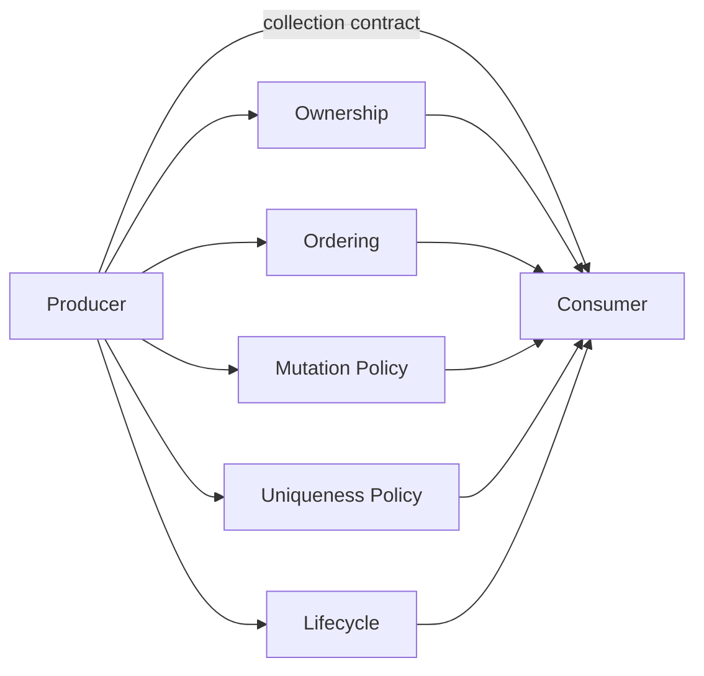
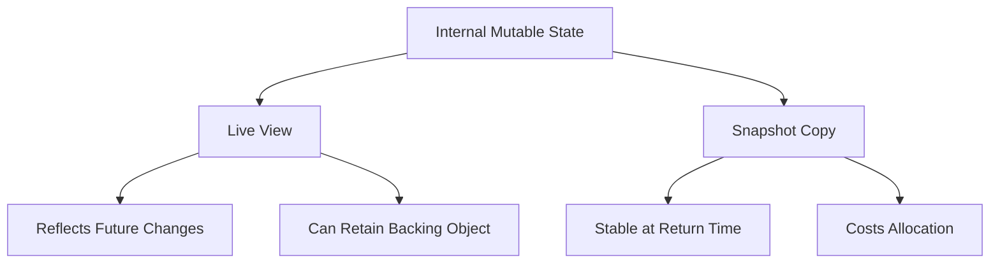
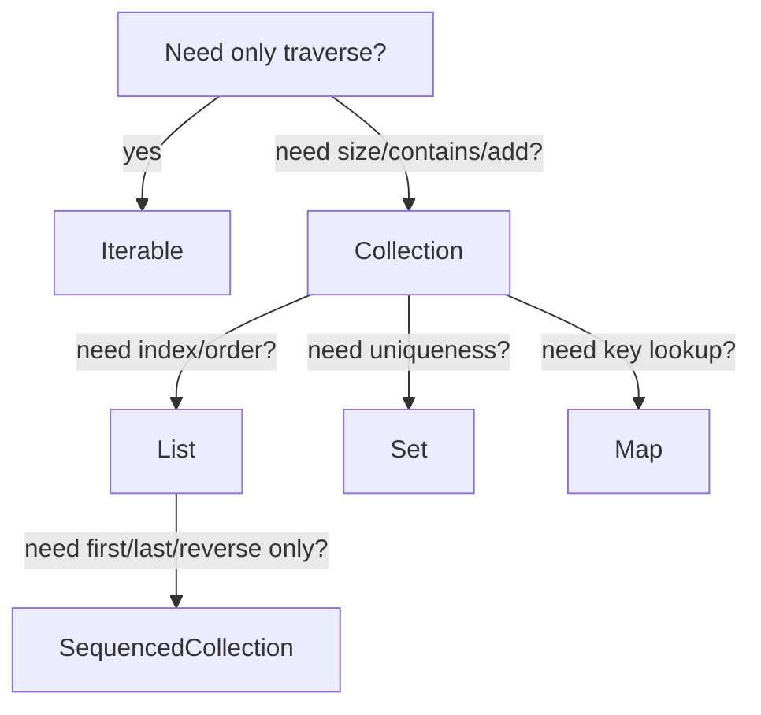

# Part 029 — Collection and Stream API Design for Enterprise Systems

> Target skill: design Java APIs whose collection/stream signatures communicate ownership, cardinality, ordering, uniqueness, mutability, traversal cost, and failure semantics clearly enough that downstream engineers cannot easily misuse them.

This part is not about memorizing `List` vs `Set` vs `Map`. It is about designing **contracts**.

In enterprise systems, many collection bugs are not algorithm bugs. They are API contract bugs:

- a method returns a mutable `List` that callers accidentally mutate;
- a method accepts `Collection` but actually depends on order;
- a method returns `Stream` backed by a resource but nobody closes it;
- a method returns `Set` and silently loses duplicates that should have become validation errors;
- a method returns `Map<K, V>` and hides duplicate-key conflict policy;
- a method exposes a live internal view and later refactoring creates temporal coupling;
- a method returns `null` instead of an empty collection and every caller becomes defensive boilerplate.

A top-tier engineer treats collection signatures as **domain promises**.

---

## 1. The Kaufman Lens for This Part

Using Josh Kaufman's learning framework, the skill is decomposed into small decisions you can self-correct quickly.

### 1.1 Deconstruct the Skill

For API design, you need to answer these questions every time a method crosses a boundary:

| Question | API dimension |
|---|---|
| How many results can exist? | cardinality |
| Can duplicates exist? | uniqueness |
| Does order matter? | encounter order / sorted order |
| Can the caller mutate it? | mutability / ownership |
| Is it a snapshot or live view? | time semantics |
| Can it contain `null`? | null policy |
| Is traversal cheap or expensive? | cost model |
| Is it reusable or single-use? | collection vs iterator vs stream |
| Is it resource-backed? | lifecycle |
| Is absence different from empty? | domain semantics |
| What happens on conflict? | merge/error policy |

### 1.2 Learn Enough to Self-Correct

You do not need more syntax. You need checks that expose wrong contracts.

Ask during code review:

- Does this return type hide an invariant?
- Does this parameter type overconstrain the caller?
- Does this parameter type underconstrain the implementation?
- Is mutation authority explicit?
- Is ordering deterministic where audit, tests, pagination, or signatures depend on it?
- Does the method name match collection semantics?

### 1.3 Remove Practice Barriers

Use a small set of API templates:

- internal mutable collection, external snapshot;
- input as weakest required abstraction;
- return as strongest useful guarantee;
- explicit conflict policy;
- explicit order policy;
- explicit null policy;
- no stream return unless lifecycle is trivial or documented.

### 1.4 Deliberate Practice Goal

After this part, you should be able to review a service interface and detect collection API bugs before runtime.

---

## 2. Collection API Design Is Boundary Design

A collection API is rarely just data movement. It defines a boundary between two responsibilities.



A weak boundary says:

```java
List<Order> getOrders();
```

A stronger boundary says:

```java
List<OrderSummary> findOpenOrdersSortedByCreatedAt(CustomerId customerId);
```

But the strongest boundary may need more than the type:

```java
/**
 * Returns an immutable snapshot of open orders sorted by createdAt ascending.
 * The returned list never contains null elements.
 */
List<OrderSummary> findOpenOrdersSortedByCreatedAt(CustomerId customerId);
```

Why the extra contract matters:

- `List` tells you order is present, but not what the order means.
- `List` tells you duplicates are possible, but not whether they are allowed.
- Java type alone does not say whether the returned list is mutable.
- Java type alone does not say whether the list is a snapshot or backed view.

Top-tier API design uses the type system where possible and documentation/naming where the type system is not expressive enough.

---

## 3. The API Contract Axes

Before choosing `List`, `Set`, `Map`, `Iterable`, `Stream`, or array, evaluate these axes.

### 3.1 Cardinality

| Domain cardinality | Better API shape |
|---|---|
| exactly one | `T` |
| zero or one | `Optional<T>` |
| zero or many | `List<T>`, `Set<T>`, `Collection<T>`, `Stream<T>` |
| one or many | `List<T>` plus validation, or domain-specific wrapper |
| key-based lookup | `Map<K, V>` |
| multiple values per key | `Map<K, List<V>>`, `Map<K, Set<V>>`, or dedicated multimap-like type |

Avoid using a collection to hide cardinality ambiguity.

Bad:

```java
List<Customer> findCustomerByNationalId(String nationalId);
```

This raises questions:

- Should national ID be unique?
- Is an empty result normal?
- Is multiple result a data integrity failure?

Better:

```java
Optional<Customer> findCustomerByNationalId(NationalId nationalId);
```

If duplicates are possible due to dirty upstream data, expose that explicitly:

```java
CustomerLookupResult findCustomerByNationalId(NationalId nationalId);

sealed interface CustomerLookupResult {
    record NotFound() implements CustomerLookupResult {}
    record Found(Customer customer) implements CustomerLookupResult {}
    record DuplicateNationalId(List<Customer> conflictingCustomers) implements CustomerLookupResult {}
}
```

This is not overengineering when duplicate identity creates compliance, billing, entitlement, or enforcement risk.

### 3.2 Ordering

There are several kinds of order:

| Order type | Meaning |
|---|---|
| no guaranteed order | caller must not depend on order |
| encounter order | order produced by source/traversal |
| insertion order | order elements were inserted |
| sorted order | order defined by comparator/natural order |
| priority order | retrieval order based on priority, not full iteration order |
| stable deterministic order | same inputs produce same output order |

Do not say `Set` when your output must be deterministic unless you choose an implementation or return type that preserves order.

Bad:

```java
Set<Violation> findViolations(CaseId caseId);
```

If a report later serializes this set, output order may become unstable.

Better:

```java
List<Violation> findViolationsOrderedBySeverityThenDate(CaseId caseId);
```

Or, if uniqueness plus encounter order matters in Java 21+ APIs:

```java
SequencedSet<ViolationCode> findViolationCodesInEncounterOrder(CaseId caseId);
```

Use a name that states the order when the type does not.

### 3.3 Uniqueness

`Set<T>` says duplicates are collapsed by `equals`/`hashCode` or comparator semantics. It does not say whether duplicates are impossible, ignored, or invalid.

These are different domain policies:

```java
// Duplicates are impossible by construction.
Set<Role> roles();

// Duplicates are tolerated and collapsed.
Set<Tag> normalizeTags(Collection<Tag> tags);

// Duplicates are invalid and must produce diagnostics.
ValidationResult validateUniqueViolationCodes(List<ViolationCode> codes);
```

If duplicates are meaningful, do not use `Set` too early.

Bad:

```java
Set<LineItem> items = new HashSet<>(request.items());
```

This hides duplicate input. If duplicates indicate client-side corruption, the system just destroyed evidence.

Better:

```java
List<LineItem> items = request.items();
DuplicateReport<LineItemKey> duplicates = DuplicateReport.from(items, LineItem::key);
if (duplicates.hasDuplicates()) {
    return ValidationResult.invalid(duplicates.toErrors());
}
```

### 3.4 Mutability and Ownership

There are four common cases:

| Case | Meaning |
|---|---|
| internal mutable | implementation may mutate internally |
| returned mutable owned by caller | caller may mutate safely |
| returned unmodifiable snapshot | caller cannot mutate, future internal changes not visible |
| returned unmodifiable live view | caller cannot mutate through view, but internal future changes may be visible |

The dangerous case is unmodifiable live view because it looks safe but still has temporal coupling.

```java
class CaseAggregate {
    private final List<Event> events = new ArrayList<>();

    // Unmodifiable, but still live.
    List<Event> eventsView() {
        return Collections.unmodifiableList(events);
    }
}
```

Better for external API:

```java
List<Event> eventsSnapshot() {
    return List.copyOf(events);
}
```

For internal hot paths, a live view may be acceptable if deliberately scoped and documented.

### 3.5 Null Policy

A collection API must define two null questions:

1. Can the collection reference itself be null?
2. Can elements inside the collection be null?

Production default:

- do not return null collections;
- prefer empty collection for no results;
- reject null elements at boundaries;
- use `Optional<T>` for element-level absence when truly needed;
- document exceptions clearly.

Bad:

```java
List<Account> accounts = repository.findAccounts(customerId);
if (accounts != null) {
    // ...
}
```

Better:

```java
List<Account> accounts = repository.findAccounts(customerId);
// Empty means no accounts.
```

If null elements exist because of legacy data, normalize at the adapter boundary:

```java
List<Account> accounts = rawAccounts.stream()
        .filter(Objects::nonNull)
        .toList();
```

But do not silently drop nulls when null indicates data corruption. Convert them into validation errors when correctness matters.

### 3.6 Snapshot vs Live View

This distinction is one of the most common sources of production bugs.



Use snapshot when:

- crossing service/domain/module boundary;
- returning from aggregate/entity state;
- producing audit/report data;
- returning cached data to untrusted callers;
- exposing data to async code.

Use live view only when:

- performance matters and caller is trusted;
- method is internal/private/package-local;
- backing lifetime is clearly shorter than the view lifetime;
- mutation semantics are intentionally part of the API.

### 3.7 Evaluation Model

Collections are materialized. Streams are lazy.

A method returning `List<T>` says:

- result has already been materialized;
- it can be traversed multiple times;
- size may be known cheaply;
- it is not inherently resource-backed.

A method returning `Stream<T>` says:

- result is lazy;
- it is single-use;
- it may need closing;
- exceptions may happen during terminal operation, not during method call;
- source state may be observed later.

That difference affects error handling.

```java
Stream<Order> orders = repository.streamOrders();
// Did database access happen here?
// Or will it happen during count()? Depends on implementation.
long count = orders.count();
```

If the stream is resource-backed, document and enforce lifecycle.

```java
try (Stream<Order> orders = repository.streamOpenOrders()) {
    return orders
            .filter(Order::isEscalated)
            .map(OrderSummary::from)
            .toList();
}
```

For most service APIs, returning a materialized collection is safer.

---

## 4. Return Type Selection

Return type should communicate what the caller can rely on.

### 4.1 Return `T` for Exactly One

Use when absence is exceptional or impossible by invariant.

```java
Customer getCustomer(CustomerId id);
```

This implies:

- the ID must resolve;
- failure likely throws domain exception;
- caller does not need absence branch.

Good for command-side operations where missing entity is an error.

### 4.2 Return `Optional<T>` for Zero or One

Use when absence is normal.

```java
Optional<Customer> findCustomer(CustomerId id);
```

Do not return `Optional<List<T>>` for normal empty result. Use empty list.

Bad:

```java
Optional<List<Order>> findOrders(CustomerId id);
```

Better:

```java
List<Order> findOrders(CustomerId id);
```

Use `Optional<List<T>>` only if absence of the container is semantically different from an empty container. That is rare and should be named explicitly.

### 4.3 Return `List<T>` for Ordered, Reusable Results

Use `List<T>` when:

- order matters;
- duplicates may exist;
- caller may need index-based traversal;
- caller may traverse multiple times;
- result is reasonably bounded or already materialized.

```java
List<CaseEvent> findEventsOrderedBySequence(CaseId caseId);
```

But define mutability:

```java
/** Returns an immutable snapshot ordered by event sequence ascending. */
List<CaseEvent> findEventsOrderedBySequence(CaseId caseId);
```

### 4.4 Return `Set<T>` for Uniqueness

Use when uniqueness is the contract.

```java
Set<Permission> effectivePermissions(UserId userId);
```

But beware of deterministic output. For stable display/reporting, prefer:

```java
List<Permission> effectivePermissionsOrdered(UserId userId);
```

Or return `SequencedSet<T>` when both uniqueness and encounter order are first-class.

### 4.5 Return `SequencedCollection<T>` When First/Last/Reverse Matter

In Java 21+, `SequencedCollection` gives a type-level signal that encounter order is defined.

```java
SequencedCollection<WorkflowStep> stepsInExecutionOrder(WorkflowId id);
```

Use it when callers need order operations but should not assume random access.

`SequencedCollection` is especially useful for APIs that previously had to choose between overpromising `List` and underpromising `Collection`.

### 4.6 Return `Map<K, V>` for Lookup

Use when callers need key-based access.

```java
Map<AccountId, AccountSnapshot> accountsById(Collection<AccountId> ids);
```

But map contracts need explicit policy:

- are all requested keys present?
- how are missing keys represented?
- what happens on duplicate source rows?
- is iteration order stable?
- is the map mutable?

Example:

```java
/**
 * Returns an immutable snapshot keyed by account id.
 * Missing account ids are omitted.
 * Iteration order follows the input ids order where possible.
 */
Map<AccountId, AccountSnapshot> findExistingAccountsById(List<AccountId> accountIds);
```

If missing keys matter, do not hide them:

```java
record AccountLookupBatch(
        Map<AccountId, AccountSnapshot> found,
        Set<AccountId> missing
) {}
```

### 4.7 Return `Collection<T>` for Minimal Reusable Bag Semantics

Use when:

- caller only needs traversal and size-ish collection semantics;
- order is not part of the contract;
- uniqueness is not part of the contract;
- implementation wants flexibility.

```java
Collection<Rule> activeRules();
```

But `Collection` is often too vague for public enterprise APIs. If ordering or uniqueness matters, be explicit.

### 4.8 Return `Iterable<T>` for Traversal-Only APIs

Use when:

- caller should only traverse;
- size is not guaranteed or cheap;
- source may be generated;
- you want to avoid exposing mutation methods from `Collection`.

```java
Iterable<AuditRecord> scanAuditRecords(AuditQuery query);
```

But `Iterable` still implies reusable traversal unless documented otherwise. If it is single-pass, a custom type or `Stream` may be clearer.

### 4.9 Return `Iterator<T>` Rarely

`Iterator<T>` exposes traversal state. Returning it transfers traversal state ownership to the caller.

Use only when:

- low-level cursor semantics are intended;
- the caller controls iteration state;
- reusable traversal is not promised.

For most APIs, prefer `Iterable<T>`, `Stream<T>`, or `List<T>`.

### 4.10 Return `Stream<T>` Carefully

Use when:

- laziness is valuable;
- result may be large;
- caller is expected to compose operations;
- lifecycle is clear;
- source is not easily materialized;
- resource closing is documented.

Avoid returning `Stream<T>` from domain objects.

Bad:

```java
class CaseAggregate {
    Stream<CaseEvent> events() {
        return events.stream();
    }
}
```

This gives little value over `List<CaseEvent>` and introduces single-use semantics.

Better:

```java
List<CaseEvent> eventsSnapshot() {
    return List.copyOf(events);
}
```

Returning streams is more acceptable at infrastructure/search boundaries:

```java
try (Stream<AuditRecord> records = auditStore.stream(query)) {
    return records
            .filter(AuditRecord::isRelevant)
            .limit(1000)
            .toList();
}
```

### 4.11 Return Arrays at Low-Level or Interop Boundaries

Use arrays when:

- Java API requires array;
- binary/interoperability boundary expects array;
- primitive compactness matters;
- result is fixed-size and internal;
- performance measurement justifies it.

Do not return internal arrays directly.

```java
class BytePayload {
    private final byte[] bytes;

    BytePayload(byte[] bytes) {
        this.bytes = bytes.clone();
    }

    byte[] toByteArray() {
        return bytes.clone();
    }
}
```

Arrays are mutable even when references are final.

---

## 5. Parameter Type Selection

For parameters, use the weakest abstraction that satisfies the method's needs.



### 5.1 Accept `Iterable<T>` When You Only Traverse

```java
ValidationResult validateAll(Iterable<Command> commands) {
    List<ValidationError> errors = new ArrayList<>();
    for (Command command : commands) {
        errors.addAll(validate(command));
    }
    return ValidationResult.from(errors);
}
```

This works with lists, sets, generated iterables, and custom sources.

But do not use `Iterable` if you need size, random access, or repeated traversal.

### 5.2 Accept `Collection<T>` When You Need Collection Semantics

```java
boolean hasAnyBlockedPermission(Collection<Permission> permissions) {
    return permissions.stream().anyMatch(Permission::blocked);
}
```

If you call `size()`, `isEmpty()`, or `contains()`, `Collection` is reasonable.

### 5.3 Accept `List<T>` When Position or Duplicate Order Matters

```java
ValidationResult validateWorkflow(List<WorkflowStep> steps) {
    if (steps.isEmpty()) {
        return ValidationResult.invalid("workflow must have at least one step");
    }

    WorkflowStep first = steps.getFirst(); // Java 21 List is sequenced.
    WorkflowStep last = steps.getLast();
    // ...
}
```

Use `List` when:

- index matters;
- duplicates matter;
- order matters;
- adjacency matters;
- first/last semantics matter and `SequencedCollection` is too weak.

### 5.4 Accept `Set<T>` When Caller Must Pre-Enforce Uniqueness

```java
AccessDecision evaluate(UserId userId, Set<Permission> permissions) {
    // The caller guarantees uniqueness.
}
```

But be careful. Accepting `Set` may hide duplicate input before your validation sees it. For validation boundaries, accept `List` or `Collection` and detect duplicates yourself.

### 5.5 Accept `Map<K, V>` When Caller Supplies an Index

```java
List<EnrichedCase> enrichCases(
        List<CaseRecord> cases,
        Map<CustomerId, CustomerSnapshot> customersById
) {
    // ...
}
```

This avoids rebuilding indexes repeatedly. But document whether the map is read-only from the callee's perspective.

Never mutate caller-provided maps unless mutation is the point of the method.

### 5.6 Accept `Stream<T>` Only for Stream-Specific Composition

Accepting streams as parameters is often awkward because streams are single-use and may be resource-backed.

Bad:

```java
ValidationResult validate(Stream<Command> commands) {
    long count = commands.count();
    // Cannot traverse commands again.
}
```

Better:

```java
ValidationResult validate(Iterable<Command> commands) {
    // reusable if source is reusable, simple traversal otherwise
}
```

Accept `Stream<T>` only when:

- the method itself is part of a stream composition API;
- single-use semantics are acceptable;
- lifecycle is owned by the caller;
- the method performs exactly one terminal operation.

---

## 6. Type Should Not Lie About Cost

A method returning `List<T>` usually implies materialized data. A method returning `Iterable<T>` may imply cheap traversal but not necessarily cheap size. A method returning `Stream<T>` implies deferred work.

Bad:

```java
List<AuditRecord> findAllAuditRecords();
```

This sounds safe but may load millions of rows.

Better:

```java
Stream<AuditRecord> streamAuditRecords(AuditQuery query);
```

Or expose pagination:

```java
Page<AuditRecord> findAuditRecords(AuditQuery query, PageRequest pageRequest);
```

Collection type is not enough when cardinality is unbounded. Use bounded query objects, page/cursor abstractions, or streaming APIs.

---

## 7. Domain-Specific Collection Wrappers

When ordinary collection types cannot express invariants, create a small domain type.

### 7.1 Example: Non-Empty Ordered Steps

```java
public final class WorkflowSteps implements Iterable<WorkflowStep> {
    private final List<WorkflowStep> steps;

    private WorkflowSteps(List<WorkflowStep> steps) {
        if (steps.isEmpty()) {
            throw new IllegalArgumentException("workflow must contain at least one step");
        }
        this.steps = List.copyOf(steps);
    }

    public static WorkflowSteps of(List<WorkflowStep> steps) {
        return new WorkflowSteps(steps);
    }

    public WorkflowStep first() {
        return steps.getFirst();
    }

    public WorkflowStep last() {
        return steps.getLast();
    }

    public int size() {
        return steps.size();
    }

    public List<WorkflowStep> asList() {
        return steps;
    }

    @Override
    public Iterator<WorkflowStep> iterator() {
        return steps.iterator();
    }
}
```

This communicates more than `List<WorkflowStep>`:

- not empty;
- ordered;
- immutable snapshot;
- no direct mutation;
- domain-specific first/last operations.

### 7.2 Example: Duplicate-Aware Batch

```java
public record CommandBatch(
        List<Command> commands,
        Map<CommandKey, List<Command>> duplicatesByKey
) {
    public CommandBatch {
        commands = List.copyOf(commands);
        duplicatesByKey = Map.copyOf(duplicatesByKey);
    }

    public boolean hasDuplicates() {
        return !duplicatesByKey.isEmpty();
    }
}
```

This avoids prematurely converting to `Set` or `Map` and losing diagnostic data.

### 7.3 Example: Stable Audit Output

```java
public final class AuditRows implements Iterable<AuditRow> {
    private final List<AuditRow> rows;

    public AuditRows(Collection<AuditRow> rows) {
        this.rows = rows.stream()
                .sorted(Comparator
                        .comparing(AuditRow::eventTime)
                        .thenComparing(AuditRow::sequence))
                .toList();
    }

    public List<AuditRow> asList() {
        return rows;
    }

    @Override
    public Iterator<AuditRow> iterator() {
        return rows.iterator();
    }
}
```

For regulated systems, deterministic collection output is often a defensibility requirement, not a display preference.

---

## 8. Mutation Authority Patterns

### 8.1 Internal Mutable, External Immutable Snapshot

Most common safe pattern.

```java
public final class CaseTimeline {
    private final List<CaseEvent> events = new ArrayList<>();

    public void append(CaseEvent event) {
        events.add(Objects.requireNonNull(event));
    }

    public List<CaseEvent> events() {
        return List.copyOf(events);
    }
}
```

Pros:

- internal code can mutate efficiently;
- caller cannot mutate internal state;
- returned value is stable.

Cons:

- allocation on each call;
- shallow immutability only.

### 8.2 Constructor Defensive Copy

```java
public record ViolationReport(List<Violation> violations) {
    public ViolationReport {
        violations = List.copyOf(violations);
    }
}
```

This protects the record from external mutation after construction.

Without copy:

```java
List<Violation> source = new ArrayList<>();
ViolationReport report = new ViolationReport(source);
source.clear(); // report changed if constructor did not copy
```

### 8.3 Getter Snapshot

```java
public List<Violation> violations() {
    return List.copyOf(violations);
}
```

Use when internal state changes over time.

### 8.4 Store Immutable Internally

```java
public final class RuleSet {
    private final Set<Rule> rules;

    public RuleSet(Collection<Rule> rules) {
        this.rules = Set.copyOf(rules);
    }

    public Set<Rule> rules() {
        return rules;
    }
}
```

Safe when object is immutable.

### 8.5 Controlled Mutator Methods

Expose operations, not raw collection mutation.

Bad:

```java
List<CaseEvent> mutableEvents() {
    return events;
}
```

Better:

```java
void appendEvent(CaseEvent event) {
    events.add(validate(event));
}
```

This centralizes invariants.

---

## 9. Stream Return Type Policy

Returning stream can be elegant, but it pushes lifecycle and error timing to the caller.

### 9.1 Safe Stream Return

Safe when source is in-memory and not resource-backed:

```java
public Stream<CaseEvent> eventStream() {
    return events.stream();
}
```

Even here, consider whether `List<CaseEvent>` is simpler.

### 9.2 Risky Stream Return

Risky when source is resource-backed:

```java
public Stream<AuditRecord> streamRecords(AuditQuery query) {
    return jdbcTemplate.queryForStream(...);
}
```

The caller must close it.

Better naming:

```java
/** Caller must close the returned stream. */
public Stream<AuditRecord> openRecordStream(AuditQuery query) {
    return jdbcTemplate.queryForStream(...);
}
```

The `open` prefix communicates lifecycle.

### 9.3 Safer Callback Alternative

```java
public <R> R withRecordStream(
        AuditQuery query,
        Function<Stream<AuditRecord>, R> operation
) {
    try (Stream<AuditRecord> records = openRecordStream(query)) {
        return operation.apply(records);
    }
}
```

Now the repository owns resource closure.

### 9.4 Avoid Storing Streams

Bad:

```java
class ReportBuilder {
    private Stream<Row> rows;
}
```

Streams are single-use. Store a collection, supplier, query, or iterable instead.

Better:

```java
class ReportBuilder {
    private Supplier<Stream<Row>> rowSource;
}
```

Even then, document whether each supplier call produces a fresh stream.

---

## 10. Empty Collection vs Null vs Optional

Default rule:

- return empty collection for no results;
- never return null collection;
- never put null elements unless legacy/API contract requires it;
- use `Optional<T>` for zero-or-one element, not zero-or-many.

### 10.1 Empty Means No Results

```java
List<Order> findOrders(CustomerId customerId);
```

No orders:

```java
return List.of();
```

### 10.2 Optional Means Container Absence

Rare example where `Optional<List<T>>` may be justified:

```java
Optional<List<Rule>> findRuleOverride(TenantId tenantId);
```

Here:

- `Optional.empty()` means tenant has no override configured;
- `Optional.of(List.of())` means tenant explicitly configured no rules.

This distinction must be documented because it is not obvious.

### 10.3 Null Element Policy

Reject early:

```java
public RuleSet(Collection<Rule> rules) {
    this.rules = rules.stream()
            .map(Objects::requireNonNull)
            .collect(Collectors.toUnmodifiableSet());
}
```

Or use `List.copyOf`, which rejects null elements for unmodifiable collections.

Do not allow null elements to drift through core domain logic.

---

## 11. Conflict Policy Must Be Explicit

Any API that converts `List<T>` into `Map<K, V>` needs a duplicate-key policy.

Bad:

```java
Map<CustomerId, Customer> byId(List<Customer> customers) {
    return customers.stream()
            .collect(Collectors.toMap(Customer::id, Function.identity()));
}
```

This throws on duplicate key, but the API does not say whether duplicates are impossible or invalid.

Better, fail with domain-specific error:

```java
Map<CustomerId, Customer> byUniqueId(List<Customer> customers) {
    return customers.stream()
            .collect(Collectors.toMap(
                    Customer::id,
                    Function.identity(),
                    (a, b) -> {
                        throw new DuplicateCustomerIdException(a.id());
                    },
                    LinkedHashMap::new
            ));
}
```

Better yet, return diagnostics when used at validation boundary:

```java
CustomerIndexResult buildCustomerIndex(List<Customer> customers);

record CustomerIndexResult(
        Map<CustomerId, Customer> uniqueCustomers,
        Map<CustomerId, List<Customer>> duplicates
) {}
```

---

## 12. API Evolution Without Breaking Callers

Collection API choices are hard to change once public.

### 12.1 Narrow Return Types Can Trap You

Returning `ArrayList<T>` exposes implementation.

Bad:

```java
ArrayList<Order> findOrders();
```

Better:

```java
List<Order> findOrders();
```

### 12.2 Overly Broad Return Types Can Hide Required Guarantees

Returning `Collection<T>` when order matters hides order.

Bad:

```java
Collection<WorkflowStep> steps();
```

Better:

```java
SequencedCollection<WorkflowStep> stepsInExecutionOrder();
```

or:

```java
List<WorkflowStep> stepsInExecutionOrder();
```

### 12.3 Parameter Types Should Avoid Unnecessary Restriction

Bad:

```java
void validate(ArrayList<Command> commands);
```

Better:

```java
void validate(List<Command> commands);
```

If only traversal is needed:

```java
void validate(Iterable<Command> commands);
```

### 12.4 Add New Methods Instead of Weakening Old Contracts

If an existing API returns ordered list:

```java
List<Event> events();
```

Do not change it to:

```java
Collection<Event> events();
```

That breaks callers. Add a new method if needed:

```java
Collection<Event> eventCollectionView();
```

But usually this is not worth the ambiguity.

---

## 13. Public API Documentation Template

Use this checklist in JavaDoc for collection-returning APIs.

```java
/**
 * Returns an immutable snapshot of active sanctions for the given customer.
 *
 * Contract:
 * - never returns null;
 * - never contains null elements;
 * - sorted by severity descending, then createdAt ascending;
 * - duplicate sanction ids are impossible by repository constraint;
 * - missing customer produces an empty list, not an exception;
 * - result is safe to traverse multiple times.
 */
List<Sanction> findActiveSanctions(CustomerId customerId);
```

Not every method needs this much documentation. Critical boundaries do.

Use it for:

- public SDK/API;
- domain aggregate getter;
- repository result;
- compliance/audit output;
- shared platform library;
- cross-team service contract.

---

## 14. Review Matrix

| Method signature | Hidden risk | Better design question |
|---|---|---|
| `List<T> getItems()` | mutable? sorted? snapshot? | What order and ownership are promised? |
| `Set<T> getItems()` | duplicate loss, unstable order | Are duplicates invalid or irrelevant? |
| `Collection<T> getItems()` | vague semantics | Does caller need order, uniqueness, or lookup? |
| `Iterable<T> getItems()` | reusable? resource-backed? | Is traversal single-use or repeatable? |
| `Stream<T> getItems()` | lifecycle, single-use | Who closes it and when do errors occur? |
| `Map<K,V> getItems()` | missing/duplicate policy | Are all keys present and conflict-free? |
| `T[] getItems()` | mutability, covariance | Is array required by boundary/performance? |
| `Optional<List<T>> getItems()` | unclear absence semantics | Is empty different from absent? |

---

## 15. Enterprise Examples

### 15.1 Repository Boundary

Bad:

```java
List<CaseRecord> getCases(String status);
```

Problems:

- `String` status weakly typed;
- order unspecified;
- cardinality unbounded;
- mutability unspecified;
- no pagination;
- no error semantics.

Better:

```java
Page<CaseRecord> findCases(
        CaseStatus status,
        CaseSort sort,
        PageRequest pageRequest
);
```

Or for bounded lookup:

```java
/** Returns immutable snapshot in the same order as requested ids, omitting missing cases. */
List<CaseRecord> findExistingCasesInRequestOrder(List<CaseId> caseIds);
```

### 15.2 Domain Aggregate Boundary

Bad:

```java
public List<CaseEvent> getEvents() {
    return events;
}
```

Better:

```java
public List<CaseEvent> eventsSnapshot() {
    return List.copyOf(events);
}
```

Even better if sequence matters:

```java
public SequencedCollection<CaseEvent> eventsInSequence() {
    return List.copyOf(events);
}
```

### 15.3 Application Service Boundary

Bad:

```java
Map<String, Object> evaluate(Map<String, Object> input);
```

Better:

```java
EvaluationResult evaluate(EvaluationRequest request);

record EvaluationResult(
        List<Decision> decisions,
        List<ValidationError> validationErrors,
        Map<RuleId, RuleTrace> traceByRuleId
) {}
```

Typed collections expose invariants. Raw maps hide them.

### 15.4 Batch Processing Boundary

Bad:

```java
void process(List<Command> commands);
```

Better:

```java
BatchResult process(CommandBatch batch);

record BatchResult(
        List<CommandResult> resultsInInputOrder,
        List<ValidationError> validationErrors
) {}
```

The return type states that result order follows input order. This matters for reconciliation.

---

## 16. Anti-Patterns

### 16.1 Return Internal Mutable Collection

```java
public List<Item> items() {
    return items;
}
```

Failure mode: caller mutates internal invariants.

### 16.2 Accept Implementation Type

```java
void process(HashMap<CustomerId, Customer> customers) {}
```

Failure mode: callers must construct exactly that implementation for no reason.

### 16.3 Use `Set` for Validation Input

```java
ValidationResult validate(Set<Rule> rules) {}
```

Failure mode: duplicates are removed before validation.

### 16.4 Return `Stream` from Closed Resource

```java
Stream<Row> rows() {
    try (Connection connection = dataSource.getConnection()) {
        return query(connection); // resource closed before traversal
    }
}
```

Failure mode: terminal operation fails later.

### 16.5 Expose `subList` Across Boundary

```java
return internalList.subList(0, 10);
```

Failure mode: live view retains backing list and can break if backing list is structurally modified.

### 16.6 Rely on Hash-Based Iteration Order

```java
return new HashSet<>(items);
```

Failure mode: unstable output causes flaky tests, unstable JSON, inconsistent signatures, or audit diffs.

### 16.7 Return Null Collection

```java
return null;
```

Failure mode: every caller becomes defensive and bugs move outward.

---

## 17. Decision Recipes

### 17.1 Query Returns Ordered Rows

Use:

```java
List<Row> rows = repository.findRowsSortedByCreatedAt(query);
```

Document:

- sorted by createdAt;
- immutable snapshot;
- empty if no rows;
- bounded/paged if large.

### 17.2 Query Returns Unique Permissions

Use:

```java
Set<Permission> permissions = permissionService.effectivePermissions(userId);
```

If display order matters:

```java
List<Permission> permissions = permissionService.effectivePermissionsOrdered(userId);
```

### 17.3 Query Returns Lookup by ID

Use:

```java
Map<CustomerId, Customer> customersById = service.findExistingCustomersById(ids);
```

If missing IDs matter:

```java
CustomerBatchLookup lookup = service.lookupCustomers(ids);
```

### 17.4 Large Scan

Use:

```java
try (Stream<AuditRecord> records = auditStore.openRecordStream(query)) {
    // consume here
}
```

or callback:

```java
auditStore.withRecordStream(query, records -> records.limit(1000).toList());
```

### 17.5 Domain Object Internal State

Use:

```java
List<Event> eventsSnapshot();
```

Not:

```java
List<Event> getEvents(); // returns internal mutable list
```

---

## 18. Code Review Checklist

Ask these questions for every collection/stream API:

1. Does the type express cardinality correctly?
2. Does the type express uniqueness correctly?
3. Does order matter, and is it named or typed?
4. Is mutability explicit?
5. Is it a snapshot or live view?
6. Can the collection or elements be null?
7. Is result size bounded?
8. Is traversal reusable?
9. Is the stream resource-backed?
10. Who owns closing?
11. What happens on duplicate key?
12. What happens on missing key?
13. Is output deterministic where needed?
14. Does parameter type overconstrain callers?
15. Does return type understate required guarantees?

---

## 19. Practice: Refactor Weak APIs

### Exercise 1

Refactor:

```java
List<Account> getAccounts(String customerId);
```

Possible answer:

```java
/** Returns immutable snapshot of active accounts sorted by account number ascending. */
List<AccountSummary> findActiveAccounts(CustomerId customerId);
```

### Exercise 2

Refactor:

```java
Map<String, Object> check(Map<String, Object> request);
```

Possible answer:

```java
EligibilityDecision evaluateEligibility(EligibilityRequest request);
```

Where:

```java
record EligibilityDecision(
        DecisionStatus status,
        List<DecisionReason> reasonsInPriorityOrder,
        List<ValidationError> validationErrors
) {}
```

### Exercise 3

Refactor:

```java
Set<LineItem> validate(Set<LineItem> items);
```

Possible answer:

```java
ValidationResult validateLineItems(List<LineItem> itemsInRequestOrder);
```

Why: validation should see duplicates and preserve request order for diagnostics.

### Exercise 4

Refactor:

```java
Stream<Row> rows();
```

Possible answer:

```java
/** Caller must close the returned stream. */
Stream<Row> openRowStream(Query query);
```

or:

```java
<R> R withRows(Query query, Function<Stream<Row>, R> operation);
```

---

## 20. Part Summary

Collection API design is about making implicit assumptions explicit.

Key rules:

- Return empty collections, not null.
- Use `Optional<T>` for zero-or-one, not zero-or-many.
- Use `List<T>` when order and duplicates matter.
- Use `Set<T>` when uniqueness is the contract, not just convenient deduplication.
- Use `Map<K,V>` when lookup is the contract, but state missing/duplicate policy.
- Use `SequencedCollection`/`SequencedSet`/`SequencedMap` when encounter order is first-class without requiring random access.
- Return immutable snapshots across boundaries unless live view is deliberate.
- Avoid returning `Stream<T>` unless laziness/lifecycle is part of the contract.
- Use domain-specific collection wrappers when plain Java types cannot express invariants.

The best API is not the one that exposes the most flexible type. It is the one that makes illegal states and misuse difficult.

---

## References

- Java SE 25 `Collection` API: https://docs.oracle.com/en/java/javase/25/docs/api/java.base/java/util/Collection.html
- Java SE 25 Collections Framework Overview: https://docs.oracle.com/en/java/javase/25/docs/api/java.base/java/util/doc-files/coll-overview.html
- Java SE 25 `Stream` API: https://docs.oracle.com/en/java/javase/25/docs/api/java.base/java/util/stream/Stream.html
- Java SE 25 Stream package summary: https://docs.oracle.com/en/java/javase/25/docs/api/java.base/java/util/stream/package-summary.html
- JEP 431 — Sequenced Collections: https://openjdk.org/jeps/431
