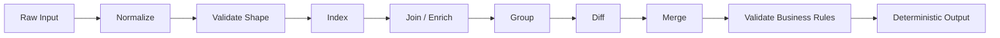
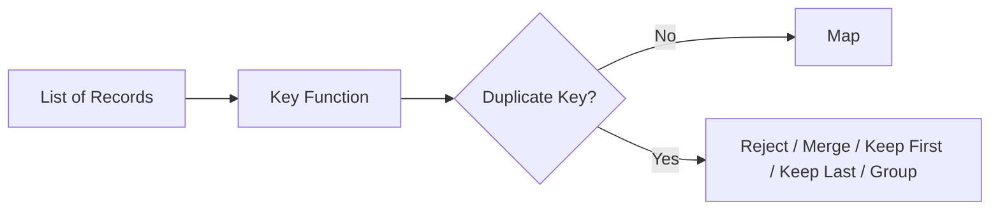
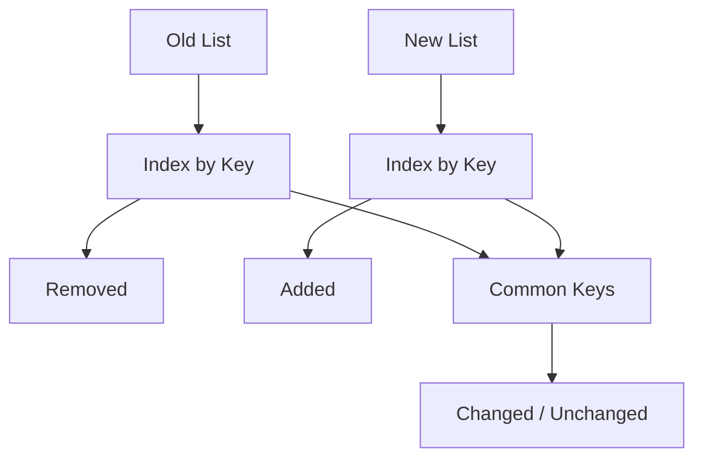

# Part 030 — Production Patterns: Transform, Index, Group, Diff, Merge, Validate

> Target skill: use Java arrays, collections, iterators, streams, and collectors to implement common enterprise data-shaping workflows without losing ordering, uniqueness, diagnostics, determinism, or performance clarity.

Most enterprise application code is not algorithmically exotic. It repeatedly does a small set of transformations:

1. normalize input;
2. transform DTOs into domain objects;
3. build indexes;
4. group records;
5. compare old and new snapshots;
6. merge changes;
7. accumulate validation errors;
8. emit deterministic results.

This part builds a reusable mental toolbox for those workflows.

---

## 1. The Production Collection Pipeline

A common collection-heavy use case looks like this:



The implementation fails when the code destroys information too early.

Common examples:

- converting list to set before duplicate validation;
- converting to map without duplicate-key policy;
- using `HashMap` where output order matters;
- sorting too late after errors have been attached to positions;
- using stream side effects where a collector is clearer;
- returning partial output without validation trace.

Production-grade collection code preserves the information needed for downstream correctness.

---

## 2. Pattern 1 — Normalize Without Losing Evidence

Normalization means converting messy input into a canonical shape.

But normalization must be careful: some irregularities are harmless, while others are evidence of invalid input.

### 2.1 Basic Normalization

```java
List<String> normalizeCodes(List<String> rawCodes) {
    return rawCodes.stream()
            .filter(Objects::nonNull)
            .map(String::trim)
            .filter(code -> !code.isEmpty())
            .map(String::toUpperCase)
            .toList();
}
```

This is acceptable when null/blank values are intentionally ignored.

But in regulated or financial systems, silently dropping input can be wrong.

### 2.2 Diagnostic Normalization

```java
record NormalizedCode(int inputIndex, String original, String normalized) {}
record NormalizationError(int inputIndex, String value, String message) {}

record NormalizationResult(
        List<NormalizedCode> codes,
        List<NormalizationError> errors
) {}
```

```java
NormalizationResult normalizeWithDiagnostics(List<String> rawCodes) {
    List<NormalizedCode> codes = new ArrayList<>();
    List<NormalizationError> errors = new ArrayList<>();

    for (int i = 0; i < rawCodes.size(); i++) {
        String raw = rawCodes.get(i);

        if (raw == null) {
            errors.add(new NormalizationError(i, null, "code must not be null"));
            continue;
        }

        String trimmed = raw.trim();
        if (trimmed.isEmpty()) {
            errors.add(new NormalizationError(i, raw, "code must not be blank"));
            continue;
        }

        codes.add(new NormalizedCode(i, raw, trimmed.toUpperCase(Locale.ROOT)));
    }

    return new NormalizationResult(List.copyOf(codes), List.copyOf(errors));
}
```

The result preserves:

- original input position;
- original value;
- normalized value;
- rejected values;
- deterministic diagnostic order.

### 2.3 Why This Matters

Bad normalization destroys traceability:

```java
Set<String> codes = rawCodes.stream()
        .filter(Objects::nonNull)
        .map(String::trim)
        .filter(s -> !s.isEmpty())
        .collect(Collectors.toSet());
```

What got lost?

- duplicates;
- original order;
- input indexes;
- invalid blanks/nulls;
- case differences;
- evidence needed for error messages.

In enterprise systems, data shaping is also evidence management.

---

## 3. Pattern 2 — Transform with Explicit Failure Semantics

Transforming DTOs to domain objects can fail. Do not hide failures inside exceptions when batch diagnostics are required.

### 3.1 Naive Transformation

```java
List<Command> commands = request.items().stream()
        .map(Command::from)
        .toList();
```

This is fine only when every item is guaranteed valid or fail-fast is desired.

### 3.2 Batch Transformation with Errors

```java
record TransformError(int index, String field, String message) {}

record TransformResult<T>(
        List<T> values,
        List<TransformError> errors
) {
    boolean isValid() {
        return errors.isEmpty();
    }
}
```

```java
TransformResult<Command> toCommands(List<CommandRequest> requests) {
    List<Command> commands = new ArrayList<>();
    List<TransformError> errors = new ArrayList<>();

    for (int i = 0; i < requests.size(); i++) {
        CommandRequest request = requests.get(i);

        if (request.id() == null) {
            errors.add(new TransformError(i, "id", "id is required"));
            continue;
        }

        if (request.amount() == null || request.amount().signum() <= 0) {
            errors.add(new TransformError(i, "amount", "amount must be positive"));
            continue;
        }

        commands.add(new Command(
                new CommandId(request.id()),
                request.amount()
        ));
    }

    return new TransformResult<>(List.copyOf(commands), List.copyOf(errors));
}
```

### 3.3 Stream or Loop?

Use stream for pure one-to-one transformations:

```java
List<OrderSummary> summaries = orders.stream()
        .map(OrderSummary::from)
        .toList();
```

Use loop when:

- you need indexed diagnostics;
- there are multiple validation branches;
- you need to accumulate errors and valid values separately;
- control flow is easier to inspect imperatively.

A top-tier engineer does not force everything into streams.

---

## 4. Pattern 3 — Build an Index with Duplicate Policy

Indexing means converting a collection into a map for lookup.



### 4.1 Unique Index, Fail on Duplicate

```java
Map<CustomerId, Customer> indexUniqueCustomers(List<Customer> customers) {
    return customers.stream()
            .collect(Collectors.toMap(
                    Customer::id,
                    Function.identity(),
                    (left, right) -> {
                        throw new IllegalArgumentException("duplicate customer id: " + left.id());
                    },
                    LinkedHashMap::new
            ));
}
```

`LinkedHashMap::new` preserves encounter order for deterministic iteration.

### 4.2 Unique Index with Diagnostics

```java
record IndexResult<K, V>(
        Map<K, V> uniqueValues,
        Map<K, List<V>> duplicates
) {
    boolean hasDuplicates() {
        return !duplicates.isEmpty();
    }
}
```

```java
static <K, V> IndexResult<K, V> indexUnique(
        List<V> values,
        Function<V, K> keyFunction
) {
    Map<K, V> unique = new LinkedHashMap<>();
    Map<K, List<V>> duplicates = new LinkedHashMap<>();

    for (V value : values) {
        K key = keyFunction.apply(value);
        V previous = unique.putIfAbsent(key, value);

        if (previous != null) {
            duplicates.computeIfAbsent(key, ignored -> new ArrayList<>()).add(previous);
            duplicates.get(key).add(value);
        }
    }

    Map<K, List<V>> immutableDuplicates = duplicates.entrySet().stream()
            .collect(Collectors.toMap(
                    Map.Entry::getKey,
                    entry -> List.copyOf(entry.getValue()),
                    (a, b) -> { throw new IllegalStateException(); },
                    LinkedHashMap::new
            ));

    return new IndexResult<>(Map.copyOf(unique), Map.copyOf(immutableDuplicates));
}
```

The above has a subtle issue: if a key has three duplicate values, the previous value may be added repeatedly. Fixing that requires tracking first duplicate addition.

Better implementation:

```java
static <K, V> IndexResult<K, V> indexUniqueSafely(
        List<V> values,
        Function<V, K> keyFunction
) {
    Map<K, V> firstByKey = new LinkedHashMap<>();
    Map<K, List<V>> conflicts = new LinkedHashMap<>();

    for (V value : values) {
        K key = keyFunction.apply(value);
        V first = firstByKey.putIfAbsent(key, value);

        if (first != null) {
            conflicts.computeIfAbsent(key, ignored -> {
                List<V> list = new ArrayList<>();
                list.add(first);
                return list;
            }).add(value);
        }
    }

    Map<K, List<V>> immutableConflicts = conflicts.entrySet().stream()
            .collect(Collectors.toMap(
                    Map.Entry::getKey,
                    entry -> List.copyOf(entry.getValue()),
                    (a, b) -> { throw new IllegalStateException("unexpected duplicate key"); },
                    LinkedHashMap::new
            ));

    return new IndexResult<>(Map.copyOf(firstByKey), Map.copyOf(immutableConflicts));
}
```

### 4.3 Merge Index

Sometimes duplicates are valid and should merge.

```java
Map<AccountId, BigDecimal> totalAmountByAccount(List<Transaction> transactions) {
    return transactions.stream()
            .collect(Collectors.toMap(
                    Transaction::accountId,
                    Transaction::amount,
                    BigDecimal::add,
                    LinkedHashMap::new
            ));
}
```

This is correct when duplicate account IDs mean multiple transactions to aggregate.

### 4.4 Keep First / Keep Last Policy

Keep first:

```java
Map<Key, Record> firstByKey = records.stream()
        .collect(Collectors.toMap(
                Record::key,
                Function.identity(),
                (first, ignored) -> first,
                LinkedHashMap::new
        ));
```

Keep last:

```java
Map<Key, Record> lastByKey = records.stream()
        .collect(Collectors.toMap(
                Record::key,
                Function.identity(),
                (ignored, last) -> last,
                LinkedHashMap::new
        ));
```

Do not use keep-first/keep-last unless it is a real business policy.

---

## 5. Pattern 4 — Group Records Without Creating Ambiguous Maps

Grouping means one key maps to multiple values.

### 5.1 Basic Grouping

```java
Map<CustomerId, List<Order>> ordersByCustomer = orders.stream()
        .collect(Collectors.groupingBy(
                Order::customerId,
                LinkedHashMap::new,
                Collectors.toList()
        ));
```

Use `LinkedHashMap` when group iteration order should follow first encounter order.

### 5.2 Group and Transform

```java
Map<CustomerId, List<OrderSummary>> summariesByCustomer = orders.stream()
        .collect(Collectors.groupingBy(
                Order::customerId,
                LinkedHashMap::new,
                Collectors.mapping(OrderSummary::from, Collectors.toList())
        ));
```

### 5.3 Group and Count

```java
Map<CaseStatus, Long> countByStatus = cases.stream()
        .collect(Collectors.groupingBy(
                Case::status,
                LinkedHashMap::new,
                Collectors.counting()
        ));
```

### 5.4 Group and Aggregate Domain Values

```java
Map<CustomerId, BigDecimal> exposureByCustomer = positions.stream()
        .collect(Collectors.groupingBy(
                Position::customerId,
                LinkedHashMap::new,
                Collectors.reducing(
                        BigDecimal.ZERO,
                        Position::exposure,
                        BigDecimal::add
                )
        ));
```

### 5.5 Grouping Failure Modes

Grouping can create problems:

- unbounded memory if key cardinality is large;
- lists become mutable by default;
- group order may be unstable if `HashMap` is used;
- null classifier keys may fail depending on collector behavior and downstream choices;
- aggregation can hide invalid records if validation is skipped.

For public output, materialize immutable groups:

```java
Map<CustomerId, List<OrderSummary>> immutableGroups = orders.stream()
        .collect(Collectors.groupingBy(
                Order::customerId,
                LinkedHashMap::new,
                Collectors.mapping(OrderSummary::from, Collectors.toList())
        ))
        .entrySet().stream()
        .collect(Collectors.toUnmodifiableMap(
                Map.Entry::getKey,
                entry -> List.copyOf(entry.getValue())
        ));
```

But note: `toUnmodifiableMap` does not preserve insertion order as a contract. If deterministic map iteration order matters, prefer a wrapper or `Collections.unmodifiableMap(new LinkedHashMap<>(...))`.

```java
Map<CustomerId, List<OrderSummary>> mutable = orders.stream()
        .collect(Collectors.groupingBy(
                Order::customerId,
                LinkedHashMap::new,
                Collectors.mapping(OrderSummary::from, Collectors.toList())
        ));

mutable.replaceAll((key, value) -> List.copyOf(value));
Map<CustomerId, List<OrderSummary>> stableView = Collections.unmodifiableMap(mutable);
```

This is an unmodifiable view over a map no longer mutated by your code. For stricter isolation, copy into a dedicated wrapper.

---

## 6. Pattern 5 — Partition for Binary Classification

Partitioning is a specialized grouping with boolean key.

```java
Map<Boolean, List<CaseRecord>> byEscalation = cases.stream()
        .collect(Collectors.partitioningBy(CaseRecord::requiresEscalation));
```

This is useful for:

- valid vs invalid;
- accepted vs rejected;
- retryable vs non-retryable;
- internal vs external;
- active vs inactive.

For domain readability, wrap the result.

```java
record Partition<T>(List<T> accepted, List<T> rejected) {}

Partition<CaseRecord> partitionCases(List<CaseRecord> cases) {
    Map<Boolean, List<CaseRecord>> grouped = cases.stream()
            .collect(Collectors.partitioningBy(CaseRecord::requiresEscalation));

    return new Partition<>(
            List.copyOf(grouped.get(true)),
            List.copyOf(grouped.get(false))
    );
}
```

A `Map<Boolean, List<T>>` is mechanically correct but semantically weak. Domain-specific records are clearer.

---

## 7. Pattern 6 — Diff Old and New Snapshots

Diffing compares two snapshots and identifies added, removed, and changed elements.



### 7.1 Diff Result Type

```java
record DiffResult<K, T>(
        List<T> added,
        List<T> removed,
        List<Changed<T>> changed,
        List<T> unchanged
) {}

record Changed<T>(T before, T after) {}
```

### 7.2 Generic Diff

```java
static <K, T> DiffResult<K, T> diff(
        List<T> oldItems,
        List<T> newItems,
        Function<T, K> keyFunction,
        BiPredicate<T, T> contentEquals
) {
    Map<K, T> oldByKey = oldItems.stream()
            .collect(Collectors.toMap(
                    keyFunction,
                    Function.identity(),
                    (a, b) -> { throw new IllegalArgumentException("duplicate old key"); },
                    LinkedHashMap::new
            ));

    Map<K, T> newByKey = newItems.stream()
            .collect(Collectors.toMap(
                    keyFunction,
                    Function.identity(),
                    (a, b) -> { throw new IllegalArgumentException("duplicate new key"); },
                    LinkedHashMap::new
            ));

    List<T> added = new ArrayList<>();
    List<T> removed = new ArrayList<>();
    List<Changed<T>> changed = new ArrayList<>();
    List<T> unchanged = new ArrayList<>();

    for (Map.Entry<K, T> entry : newByKey.entrySet()) {
        K key = entry.getKey();
        T after = entry.getValue();
        T before = oldByKey.get(key);

        if (before == null) {
            added.add(after);
        } else if (contentEquals.test(before, after)) {
            unchanged.add(after);
        } else {
            changed.add(new Changed<>(before, after));
        }
    }

    for (Map.Entry<K, T> entry : oldByKey.entrySet()) {
        if (!newByKey.containsKey(entry.getKey())) {
            removed.add(entry.getValue());
        }
    }

    return new DiffResult<>(
            List.copyOf(added),
            List.copyOf(removed),
            List.copyOf(changed),
            List.copyOf(unchanged)
    );
}
```

### 7.3 The Null Trap

The line:

```java
T before = oldByKey.get(key);
if (before == null) { ... }
```

assumes map values cannot be null. In high-quality code, either enforce non-null values or use `containsKey`.

Safer:

```java
if (!oldByKey.containsKey(key)) {
    added.add(after);
} else {
    T before = oldByKey.get(key);
    // compare
}
```

### 7.4 Deterministic Diff Order

The example preserves:

- added/changed/unchanged order from new snapshot;
- removed order from old snapshot.

This should be documented because downstream audit output may depend on it.

---

## 8. Pattern 7 — Merge with Conflict Policy

Merging combines an existing state and incoming changes.

Conflict policy must be explicit.

### 8.1 Merge Policy Type

```java
enum MergeConflictPolicy {
    REJECT,
    KEEP_EXISTING,
    OVERWRITE,
    CUSTOM
}
```

In real systems, prefer domain-specific names:

```java
enum AddressMergePolicy {
    REJECT_CONFLICTING_VERIFIED_ADDRESS,
    ACCEPT_NEWER_UNVERIFIED_ADDRESS,
    KEEP_EXISTING_VERIFIED_ADDRESS
}
```

### 8.2 Merge Result

```java
record MergeResult<T>(
        List<T> merged,
        List<MergeConflict<T>> conflicts
) {
    boolean hasConflicts() {
        return !conflicts.isEmpty();
    }
}

record MergeConflict<T>(T existingValue, T incomingValue, String reason) {}
```

### 8.3 Merge by Key

```java
static <K, T> MergeResult<T> mergeRejectingConflicts(
        List<T> existing,
        List<T> incoming,
        Function<T, K> keyFunction,
        BiPredicate<T, T> compatible
) {
    Map<K, T> mergedByKey = existing.stream()
            .collect(Collectors.toMap(
                    keyFunction,
                    Function.identity(),
                    (a, b) -> { throw new IllegalArgumentException("duplicate existing key"); },
                    LinkedHashMap::new
            ));

    List<MergeConflict<T>> conflicts = new ArrayList<>();

    for (T incomingValue : incoming) {
        K key = keyFunction.apply(incomingValue);
        T existingValue = mergedByKey.get(key);

        if (existingValue == null) {
            mergedByKey.put(key, incomingValue);
            continue;
        }

        if (compatible.test(existingValue, incomingValue)) {
            mergedByKey.put(key, incomingValue);
        } else {
            conflicts.add(new MergeConflict<>(
                    existingValue,
                    incomingValue,
                    "incoming value conflicts with existing value"
            ));
        }
    }

    return new MergeResult<>(
            List.copyOf(mergedByKey.values()),
            List.copyOf(conflicts)
    );
}
```

Again, this assumes null values are impossible. If `T` can be null, use `containsKey`.

### 8.4 Merge Policy Matrix

| Policy | Use when | Risk |
|---|---|---|
| reject conflict | correctness/audit matters | requires error handling |
| keep existing | existing source is authoritative | ignores fresh updates |
| overwrite | incoming source is authoritative | can erase verified state |
| merge fields | partial updates are valid | complex invariants |
| version-based | optimistic locking/versioned data | clock/version bugs |

Never leave merge behavior implicit.

---

## 9. Pattern 8 — Validate and Accumulate Errors

Validation code often becomes unreadable because it mixes traversal, branching, and error construction.

Use explicit error records and preserve location.

### 9.1 Validation Error Model

```java
record ValidationError(
        String path,
        String code,
        String message
) {}

record ValidationResult(List<ValidationError> errors) {
    static ValidationResult valid() {
        return new ValidationResult(List.of());
    }

    static ValidationResult invalid(List<ValidationError> errors) {
        return new ValidationResult(List.copyOf(errors));
    }

    boolean isValid() {
        return errors.isEmpty();
    }
}
```

### 9.2 Validate List with Index Paths

```java
ValidationResult validateLineItems(List<LineItem> items) {
    List<ValidationError> errors = new ArrayList<>();

    if (items.isEmpty()) {
        errors.add(new ValidationError("items", "REQUIRED", "at least one item is required"));
    }

    for (int i = 0; i < items.size(); i++) {
        LineItem item = items.get(i);
        String path = "items[" + i + "]";

        if (item.productId() == null) {
            errors.add(new ValidationError(path + ".productId", "REQUIRED", "productId is required"));
        }

        if (item.quantity() <= 0) {
            errors.add(new ValidationError(path + ".quantity", "INVALID", "quantity must be positive"));
        }
    }

    errors.addAll(validateDuplicateProductIds(items));

    return ValidationResult.invalid(errors);
}
```

### 9.3 Duplicate Validation Without Losing Position

```java
List<ValidationError> validateDuplicateProductIds(List<LineItem> items) {
    Map<ProductId, List<Integer>> indexesByProductId = new LinkedHashMap<>();

    for (int i = 0; i < items.size(); i++) {
        ProductId productId = items.get(i).productId();
        if (productId == null) {
            continue;
        }
        indexesByProductId.computeIfAbsent(productId, ignored -> new ArrayList<>()).add(i);
    }

    List<ValidationError> errors = new ArrayList<>();

    for (Map.Entry<ProductId, List<Integer>> entry : indexesByProductId.entrySet()) {
        List<Integer> indexes = entry.getValue();
        if (indexes.size() <= 1) {
            continue;
        }

        for (Integer index : indexes) {
            errors.add(new ValidationError(
                    "items[" + index + "].productId",
                    "DUPLICATE",
                    "duplicate productId: " + entry.getKey()
            ));
        }
    }

    return List.copyOf(errors);
}
```

This is better than:

```java
Set<ProductId> productIds = items.stream()
        .map(LineItem::productId)
        .collect(Collectors.toSet());
```

The set loses the location of duplicates.

### 9.4 Validation Streams vs Loops

Stream works well for simple validation:

```java
List<ValidationError> missingIds = IntStream.range(0, items.size())
        .filter(i -> items.get(i).productId() == null)
        .mapToObj(i -> new ValidationError(
                "items[" + i + "].productId",
                "REQUIRED",
                "productId is required"
        ))
        .toList();
```

But loops are often clearer when multiple errors per item are possible.

Rule: validation readability beats stream cleverness.

---

## 10. Pattern 9 — Join / Enrich with Prebuilt Indexes

Joining two in-memory collections is common.

Bad nested loop:

```java
List<EnrichedOrder> result = new ArrayList<>();
for (Order order : orders) {
    for (Customer customer : customers) {
        if (order.customerId().equals(customer.id())) {
            result.add(new EnrichedOrder(order, customer));
        }
    }
}
```

This is O(n × m) and hides missing customer handling.

Better:

```java
Map<CustomerId, Customer> customersById = customers.stream()
        .collect(Collectors.toMap(
                Customer::id,
                Function.identity(),
                (a, b) -> { throw new IllegalArgumentException("duplicate customer id"); },
                LinkedHashMap::new
        ));

List<EnrichedOrder> result = new ArrayList<>();
List<ValidationError> errors = new ArrayList<>();

for (int i = 0; i < orders.size(); i++) {
    Order order = orders.get(i);
    Customer customer = customersById.get(order.customerId());

    if (customer == null) {
        errors.add(new ValidationError(
                "orders[" + i + "].customerId",
                "NOT_FOUND",
                "customer not found: " + order.customerId()
        ));
        continue;
    }

    result.add(new EnrichedOrder(order, customer));
}
```

This makes the missing-reference policy explicit.

---

## 11. Pattern 10 — Deterministic Output

Determinism means same logical input produces same output order.

This matters for:

- audit logs;
- compliance reports;
- API snapshots;
- tests;
- cache keys;
- signatures/hashes;
- reconciliation files.

### 11.1 Sort at the Boundary

```java
List<DecisionReason> reasons = rawReasons.stream()
        .sorted(Comparator
                .comparing(DecisionReason::severity).reversed()
                .thenComparing(DecisionReason::code)
                .thenComparing(DecisionReason::message))
        .toList();
```

### 11.2 Use Stable Map Implementation for Intermediate Order

```java
Map<CustomerId, List<Order>> ordersByCustomer = orders.stream()
        .collect(Collectors.groupingBy(
                Order::customerId,
                LinkedHashMap::new,
                Collectors.toList()
        ));
```

### 11.3 Do Not Depend on HashMap Order

Bad:

```java
return new ArrayList<>(hashMap.values());
```

Better:

```java
return hashMap.values().stream()
        .sorted(Comparator.comparing(Customer::id))
        .toList();
```

or use `LinkedHashMap` intentionally when encounter order is the required order.

---

## 12. Pattern 11 — Batching and Windowing

Batching is common for external calls, persistence, messaging, or validation.

### 12.1 Manual Batch with List Slices

```java
static <T> List<List<T>> batches(List<T> input, int batchSize) {
    if (batchSize <= 0) {
        throw new IllegalArgumentException("batchSize must be positive");
    }

    List<List<T>> batches = new ArrayList<>();
    for (int start = 0; start < input.size(); start += batchSize) {
        int end = Math.min(start + batchSize, input.size());
        batches.add(List.copyOf(input.subList(start, end)));
    }
    return List.copyOf(batches);
}
```

Why `List.copyOf(input.subList(...))`?

- `subList` is a backed view;
- copying makes each batch stable;
- copying avoids retaining the full backing list accidentally.

### 12.2 Stream Gatherer Alternative

With modern Java, stream gatherers provide built-in windowing operations.

Conceptually:

```java
List<List<T>> batches = input.stream()
        .gather(Gatherers.windowFixed(batchSize))
        .toList();
```

Use gatherers when:

- you are already in stream pipeline;
- batching is a transformation stage;
- readability improves.

Use manual loop when:

- you need complex diagnostics;
- you need tight control over memory;
- the team is not yet standardized on gatherers.

---

## 13. Pattern 12 — Top-N Selection

Bad:

```java
List<Item> top = items.stream()
        .sorted(comparator.reversed())
        .limit(10)
        .toList();
```

This sorts all elements. For small data, fine. For huge data, consider bounded heap/priority queue.

```java
static <T> List<T> topN(Collection<T> items, int n, Comparator<T> comparator) {
    if (n <= 0) {
        return List.of();
    }

    PriorityQueue<T> heap = new PriorityQueue<>(comparator);

    for (T item : items) {
        if (heap.size() < n) {
            heap.offer(item);
        } else if (comparator.compare(item, heap.peek()) > 0) {
            heap.poll();
            heap.offer(item);
        }
    }

    return heap.stream()
            .sorted(comparator.reversed())
            .toList();
}
```

Use this when the dataset is large and `n` is much smaller than total size.

For ordinary bounded service responses, full sort may be simpler and acceptable.

---

## 14. Pattern 13 — Accumulate With Stable Result Type

Avoid returning raw tuples/maps from collection workflows.

Bad:

```java
Map<String, Object> result = new HashMap<>();
result.put("valid", validItems);
result.put("errors", errors);
return result;
```

Better:

```java
record BatchValidationResult<T>(
        List<T> validItems,
        List<ValidationError> errors
) {
    boolean isValid() {
        return errors.isEmpty();
    }
}
```

Typed result objects:

- document structure;
- support compiler refactoring;
- prevent key typo bugs;
- make test assertions clearer;
- improve cross-team maintainability.

---

## 15. Pattern 14 — Multi-Stage Processing Without Side Effects Everywhere

Bad:

```java
List<Error> errors = new ArrayList<>();
Map<Key, Value> index = new HashMap<>();
List<Output> outputs = input.stream()
        .peek(item -> validate(item, errors))
        .peek(item -> index.put(item.key(), item.value()))
        .map(this::convert)
        .toList();
```

This abuses `peek` and hides mutation.

Better:

```java
TransformResult<Command> transformed = toCommands(input);
if (!transformed.errors().isEmpty()) {
    return BatchResult.rejected(transformed.errors());
}

IndexResult<CommandId, Command> index = indexUniqueSafely(
        transformed.values(),
        Command::id
);
if (index.hasDuplicates()) {
    return BatchResult.rejected(toDuplicateErrors(index.duplicates()));
}

List<Output> outputs = transformed.values().stream()
        .map(this::execute)
        .toList();

return BatchResult.accepted(outputs);
```

This separates stages:

- transform;
- validate uniqueness;
- execute;
- return typed result.

### 15.1 Stage Object Pattern

For complex flows, define stage result types.

```java
sealed interface StageResult<T> {
    record Success<T>(T value) implements StageResult<T> {}
    record Failure<T>(List<ValidationError> errors) implements StageResult<T> {}
}
```

This avoids mixing partially valid states with fully valid states.

---

## 16. Pattern 15 — Idempotent Collection Processing

Idempotency means processing the same logical input multiple times does not create duplicate effects.

Collection design helps by building stable keys.

```java
record CommandKey(CustomerId customerId, RequestId requestId) {}
```

Build index:

```java
Map<CommandKey, Command> commandsByKey = commands.stream()
        .collect(Collectors.toMap(
                Command::key,
                Function.identity(),
                (a, b) -> { throw new DuplicateCommandException(a.key()); },
                LinkedHashMap::new
        ));
```

Then compare against already-processed keys:

```java
Set<CommandKey> alreadyProcessed = loadProcessedKeys(commandsByKey.keySet());

List<Command> newCommands = commandsByKey.entrySet().stream()
        .filter(entry -> !alreadyProcessed.contains(entry.getKey()))
        .map(Map.Entry::getValue)
        .toList();
```

Key lesson: idempotency is easier when collections are keyed by stable domain identifiers, not object identity.

---

## 17. Pattern 16 — Error Attachment and Ordering

When errors are returned to clients, order matters.

Recommended order:

1. input order;
2. within item, field order;
3. within field, severity or rule order.

Example:

```java
List<ValidationError> errors = rawErrors.stream()
        .sorted(Comparator
                .comparing(ValidationError::path)
                .thenComparing(ValidationError::code)
                .thenComparing(ValidationError::message))
        .toList();
```

But lexicographic path sorting can produce strange order:

```text
items[10] before items[2]
```

Better: store numeric index separately.

```java
record IndexedValidationError(
        int itemIndex,
        String field,
        String code,
        String message
) {}
```

Then sort correctly:

```java
List<IndexedValidationError> errors = rawErrors.stream()
        .sorted(Comparator
                .comparingInt(IndexedValidationError::itemIndex)
                .thenComparing(IndexedValidationError::field)
                .thenComparing(IndexedValidationError::code))
        .toList();
```

---

## 18. Pattern 17 — Immutable Result Assembly

Production code often builds mutable structures internally, then freezes at boundary.

```java
BatchReport buildReport(List<InputRecord> input) {
    List<AcceptedRecord> accepted = new ArrayList<>();
    List<RejectedRecord> rejected = new ArrayList<>();
    Map<Category, List<AcceptedRecord>> acceptedByCategory = new LinkedHashMap<>();

    for (InputRecord record : input) {
        ValidationResult validation = validate(record);
        if (!validation.isValid()) {
            rejected.add(new RejectedRecord(record.id(), validation.errors()));
            continue;
        }

        AcceptedRecord acceptedRecord = convert(record);
        accepted.add(acceptedRecord);
        acceptedByCategory
                .computeIfAbsent(acceptedRecord.category(), ignored -> new ArrayList<>())
                .add(acceptedRecord);
    }

    Map<Category, List<AcceptedRecord>> immutableGroups = acceptedByCategory.entrySet().stream()
            .collect(Collectors.toMap(
                    Map.Entry::getKey,
                    entry -> List.copyOf(entry.getValue()),
                    (a, b) -> { throw new IllegalStateException(); },
                    LinkedHashMap::new
            ));

    return new BatchReport(
            List.copyOf(accepted),
            List.copyOf(rejected),
            Collections.unmodifiableMap(immutableGroups)
    );
}
```

This pattern is simple and robust:

- mutable inside;
- immutable outside;
- deterministic map order;
- no stream side-effect abuse.

---

## 19. Pattern 18 — Choose Loop, Stream, Collector, Gatherer, or Spliterator

| Problem | Best first choice | Why |
|---|---|---|
| simple one-to-one transform | stream `map` | concise and clear |
| filter + transform | stream `filter` + `map` | pipeline semantics fit |
| grouping | collector | built-in aggregation model |
| duplicate diagnostics | loop or custom collector | needs indexed error context |
| diff old/new | maps + loop | explicit conflict/order policy |
| batching/windowing | gatherer or loop | depends on Java baseline/team fluency |
| custom lazy traversal | spliterator | source-level traversal semantics |
| resource-backed scan | stream with try-with-resources | lifecycle control |
| complex validation | loop | clearer branching and diagnostics |
| parallel aggregation | collector with correct combiner | correctness under splitting |

Do not choose the most advanced abstraction. Choose the abstraction whose failure modes are easiest to reason about.

---

## 20. Capstone Mini-Case: Process Case Updates

### 20.1 Requirements

Given a batch of case update requests:

- preserve input order for diagnostics;
- reject null/blank case IDs;
- detect duplicate case IDs in the request;
- load existing cases by ID;
- reject updates for missing cases;
- merge valid updates into existing cases;
- return accepted updates and validation errors deterministically.

### 20.2 Types

```java
record CaseUpdateRequest(String caseId, String status, String note) {}
record CaseId(String value) {}
record CaseRecord(CaseId id, String status, String note) {}
record AcceptedUpdate(int inputIndex, CaseRecord updatedCase) {}
record CaseUpdateError(int inputIndex, String field, String code, String message) {}

record CaseUpdateBatchResult(
        List<AcceptedUpdate> accepted,
        List<CaseUpdateError> errors
) {}
```

### 20.3 Implementation

```java
CaseUpdateBatchResult processCaseUpdates(List<CaseUpdateRequest> requests) {
    List<CaseUpdateError> errors = new ArrayList<>();
    List<NormalizedUpdate> normalized = new ArrayList<>();

    for (int i = 0; i < requests.size(); i++) {
        CaseUpdateRequest request = requests.get(i);

        if (request.caseId() == null || request.caseId().trim().isEmpty()) {
            errors.add(new CaseUpdateError(i, "caseId", "REQUIRED", "caseId is required"));
            continue;
        }

        CaseId caseId = new CaseId(request.caseId().trim());
        normalized.add(new NormalizedUpdate(i, caseId, request.status(), request.note()));
    }

    Map<CaseId, List<NormalizedUpdate>> byCaseId = normalized.stream()
            .collect(Collectors.groupingBy(
                    NormalizedUpdate::caseId,
                    LinkedHashMap::new,
                    Collectors.toList()
            ));

    for (Map.Entry<CaseId, List<NormalizedUpdate>> entry : byCaseId.entrySet()) {
        List<NormalizedUpdate> duplicates = entry.getValue();
        if (duplicates.size() <= 1) {
            continue;
        }

        for (NormalizedUpdate duplicate : duplicates) {
            errors.add(new CaseUpdateError(
                    duplicate.inputIndex(),
                    "caseId",
                    "DUPLICATE",
                    "duplicate caseId in request: " + entry.getKey().value()
            ));
        }
    }

    List<NormalizedUpdate> uniqueUpdates = byCaseId.values().stream()
            .filter(values -> values.size() == 1)
            .map(values -> values.getFirst())
            .toList();

    Map<CaseId, CaseRecord> existingById = loadExistingCases(
            uniqueUpdates.stream()
                    .map(NormalizedUpdate::caseId)
                    .toList()
    );

    List<AcceptedUpdate> accepted = new ArrayList<>();

    for (NormalizedUpdate update : uniqueUpdates) {
        CaseRecord existing = existingById.get(update.caseId());
        if (existing == null) {
            errors.add(new CaseUpdateError(
                    update.inputIndex(),
                    "caseId",
                    "NOT_FOUND",
                    "case not found: " + update.caseId().value()
            ));
            continue;
        }

        CaseRecord merged = new CaseRecord(
                existing.id(),
                update.status() != null ? update.status() : existing.status(),
                update.note() != null ? update.note() : existing.note()
        );

        accepted.add(new AcceptedUpdate(update.inputIndex(), merged));
    }

    List<AcceptedUpdate> orderedAccepted = accepted.stream()
            .sorted(Comparator.comparingInt(AcceptedUpdate::inputIndex))
            .toList();

    List<CaseUpdateError> orderedErrors = errors.stream()
            .sorted(Comparator
                    .comparingInt(CaseUpdateError::inputIndex)
                    .thenComparing(CaseUpdateError::field)
                    .thenComparing(CaseUpdateError::code))
            .toList();

    return new CaseUpdateBatchResult(orderedAccepted, orderedErrors);
}

record NormalizedUpdate(
        int inputIndex,
        CaseId caseId,
        String status,
        String note
) {}
```

### 20.4 What This Demonstrates

- normalize without losing input index;
- group to detect duplicates;
- preserve duplicate diagnostics;
- filter unique updates;
- build/load lookup map;
- reject missing references;
- merge with explicit fallback policy;
- return deterministic accepted/errors order;
- avoid premature `Set` or `Map` conversion that loses evidence.

---

## 21. Failure Catalogue

### 21.1 Premature Deduplication

```java
Set<CaseId> ids = requests.stream()
        .map(CaseUpdateRequest::caseId)
        .collect(Collectors.toSet());
```

Loses duplicate diagnostics.

### 21.2 Implicit Merge

```java
Map<CaseId, Request> byId = requests.stream()
        .collect(Collectors.toMap(Request::caseId, Function.identity(), (a, b) -> b));
```

Silently keeps last. Dangerous unless explicitly intended.

### 21.3 Nested Loop Join

Works for small data, fails with scale.

### 21.4 Stream Side Effects

```java
List<Error> errors = new ArrayList<>();
items.stream().map(item -> validate(item, errors)).toList();
```

The pipeline is harder to reason about, especially if parallelized later.

### 21.5 Unstable Output

Using `HashMap`/`HashSet` and serializing iteration order.

### 21.6 Losing Path Context

Validation returns:

```text
productId is duplicate
```

Instead of:

```text
items[3].productId duplicate with items[7].productId
```

### 21.7 Incorrect Null-Assumption in Map Lookup

Using `map.get(key) == null` to mean absent when null values are possible.

### 21.8 Materializing Huge Data

```java
List<Row> rows = repository.findAll();
```

Then filtering in memory. Prefer query constraints, pagination, cursor, or stream with lifecycle control.

---

## 22. Production Checklist

Before shipping collection-heavy workflow code, verify:

1. Input order is preserved where diagnostics need it.
2. Duplicate policy is explicit.
3. Missing reference policy is explicit.
4. Merge conflict policy is explicit.
5. Output order is deterministic.
6. Mutable internal collections are not exposed.
7. `HashMap`/`HashSet` iteration order is not relied on.
8. `Map.get` absent/null ambiguity is handled.
9. Streams do not mutate shared state.
10. Resource-backed streams are closed.
11. Large inputs are bounded, paged, or streamed.
12. Validation errors include path/index context.
13. Collector merge functions are domain-meaningful.
14. Intermediate grouping does not create unbounded memory risk.
15. Final result types are typed records/classes, not raw maps.

---

## 23. Practice Tasks

### Task 1 — Duplicate-Aware Index

Write a method:

```java
IndexResult<CustomerId, Customer> indexCustomers(List<Customer> customers)
```

Requirements:

- preserve first encounter order;
- detect all duplicate customer IDs;
- return immutable result;
- reject null IDs as validation errors or throw a domain exception.

### Task 2 — Stable Grouped Report

Write:

```java
CustomerExposureReport buildExposureReport(List<Position> positions)
```

Requirements:

- group by customer;
- sum exposure;
- sort customers by total exposure descending;
- preserve deterministic tie-breaker by customer ID;
- return immutable report rows.

### Task 3 — Snapshot Diff

Write:

```java
DiffResult<AccountId, AccountSnapshot> diffAccounts(
        List<AccountSnapshot> before,
        List<AccountSnapshot> after
)
```

Requirements:

- reject duplicate IDs in either snapshot;
- detect added/removed/changed/unchanged;
- preserve deterministic output;
- ignore fields that are not business-relevant.

### Task 4 — Batch Validation

Write:

```java
ValidationResult validateBatch(List<CommandRequest> requests)
```

Requirements:

- validate required fields;
- detect duplicate command IDs;
- attach errors to input indexes;
- do not stop at first error;
- do not use `Set` before duplicate diagnostics.

---

## 24. Part Summary

Production collection work is mostly about preserving meaning while reshaping data.

The core patterns:

- normalize without losing evidence;
- transform with explicit failure semantics;
- index with duplicate policy;
- group with deterministic order when needed;
- partition into domain-specific result types;
- diff snapshots using stable keys;
- merge with explicit conflict policy;
- validate with path/index context;
- join using prebuilt indexes;
- freeze mutable internals at output boundaries.

The best collection code is not always the shortest. It is the code whose invariants, failure modes, and ordering behavior are obvious under review.

---

## References

- Java SE 25 `Collection` API: https://docs.oracle.com/en/java/javase/25/docs/api/java.base/java/util/Collection.html
- Java SE 25 `Map` API: https://docs.oracle.com/en/java/javase/25/docs/api/java.base/java/util/Map.html
- Java SE 25 `Stream` API: https://docs.oracle.com/en/java/javase/25/docs/api/java.base/java/util/stream/Stream.html
- Java SE 25 `Collectors` API: https://docs.oracle.com/en/java/javase/25/docs/api/java.base/java/util/stream/Collectors.html
- Java SE 25 Stream package summary: https://docs.oracle.com/en/java/javase/25/docs/api/java.base/java/util/stream/package-summary.html
- JEP 485 — Stream Gatherers: https://openjdk.org/jeps/485
