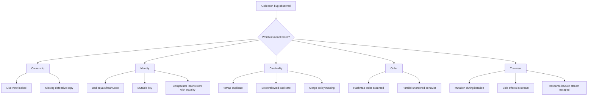
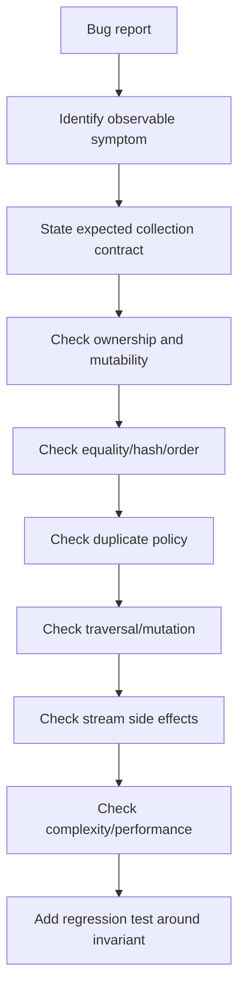

# Part 031 — Failure Modeling: Bugs Caused by Collections and Streams

> Target skill: diagnose, prevent, and review collection-heavy Java code by reasoning from invariants, not from symptoms.

At senior level, most bugs around arrays, collections, iterators, and streams are not caused by not knowing the API. They are caused by unclear contracts:

- Who owns this collection?
- Is this a snapshot or a live view?
- Is order part of the business rule?
- Are duplicates legal, ignored, merged, or rejected?
- Is mutation allowed during traversal?
- Is the stream source stable until the terminal operation?
- Are side effects intentional, safe, and observable?
- Does equality mean domain identity, object identity, value equality, or ordering equality?

This part is a failure-modeling handbook. Treat it as a production code review and incident debugging guide.

---

## 1. The Core Mental Model

A collection bug usually violates one of five invariants.

| Invariant | Meaning | Typical Failure |
|---|---|---|
| Ownership invariant | Only the intended owner may mutate the data | Caller mutates returned internal list |
| Identity invariant | Equality, hashing, and ordering match domain identity | Mutable map key disappears |
| Cardinality invariant | Size, uniqueness, and duplicate policy are explicit | Duplicate IDs silently overwrite |
| Order invariant | Encounter order, sorted order, or unspecified order is explicit | Audit output changes across runs |
| Traversal invariant | Source does not change illegally while being traversed | `ConcurrentModificationException`, skipped elements, nondeterminism |



The top 1% habit: when a collection bug appears, do not start by changing implementation type. First identify the broken invariant.

---

## 2. Failure Catalogue

Use this table during code review and debugging.

| Failure | Symptom | Root Cause | Corrective Move |
|---|---|---|---|
| Mutation during iteration | `ConcurrentModificationException` or skipped elements | Structural modification outside iterator contract | Use iterator `remove`, collect then mutate, or snapshot |
| Mutable map key | Lookup fails after mutation | `hashCode`/ordering changed after insertion | Use immutable keys or remove/reinsert |
| Accidental quadratic behavior | Slow on large data | Nested scans over lists | Build index map/set first |
| Duplicate overwrite | Missing records | `toMap`/`put` overwrote without policy | Explicit merge policy or reject duplicates |
| Lost order | Flaky tests/audit diffs | Used unordered collection | Use `List`, `LinkedHashMap`, `TreeMap`, or explicit sort |
| Null contamination | Late `NullPointerException` | Null accepted at boundary | Normalize/reject null at boundary |
| Stream reuse | `IllegalStateException` | Stream consumed once | Expose supplier/collection, not reusable stream |
| Side effects in stream | Missing writes, races, nondeterminism | Behavioral parameter has unsafe side effect | Use collector, loop, or isolated mutation |
| Parallel data race | Wrong totals/corrupted output | Shared mutable accumulator | Use associative reduction/collector |
| Backed view leak | Unexpected parent mutation | Returned `subList`, `keySet`, `values`, `reversed` live view | Snapshot with `copyOf` or document live view |
| Fixed-size list trap | `UnsupportedOperationException` | `Arrays.asList` used as normal list | Wrap in `new ArrayList<>(...)` when mutable list needed |
| Comparator identity bug | `TreeSet` drops different objects | Comparator returns `0` for distinct domain values | Comparator must encode uniqueness semantics |
| Resource stream leak | File/socket/db cursor leak | Stream returned beyond resource scope | Use try-with-resources at source boundary |
| Primitive overflow | Negative count/sum | `int` aggregation overflow | Use `long`, checked arithmetic, or `BigInteger` |
| `findAny` nondeterminism | Different element selected | Parallel/unordered source | Use `findFirst` with ordered source if required |
| `HashMap` order assumption | Different serialization/order | Implementation order not contract | Use order-aware collection or explicit sort |

---

## 3. Mutation During Iteration

### 3.1 The bug

```java
List<String> names = new ArrayList<>(List.of("a", "", "b"));

for (String name : names) {
    if (name.isBlank()) {
        names.remove(name); // bug
    }
}
```

This violates the traversal invariant: the enhanced `for` loop uses an iterator, but mutation happens through the list directly.

### 3.2 Correct pattern: iterator-owned mutation

```java
Iterator<String> it = names.iterator();
while (it.hasNext()) {
    if (it.next().isBlank()) {
        it.remove();
    }
}
```

This is valid only when the iterator supports `remove`.

### 3.3 Correct pattern: collect then mutate

```java
List<String> blanks = names.stream()
        .filter(String::isBlank)
        .toList();

names.removeAll(blanks);
```

This separates traversal from mutation. It is often clearer when the deletion criterion is non-trivial.

### 3.4 Correct pattern: produce a new collection

```java
List<String> cleaned = names.stream()
        .filter(name -> !name.isBlank())
        .toList();
```

This is best when the collection is a value boundary rather than a mutable working buffer.

### 3.5 Production rule

Do not depend on `ConcurrentModificationException` to protect correctness. It is a bug detector, not a synchronization or consistency mechanism.

Review question:

> Is mutation owned by the traversal mechanism, or is traversal isolated from mutation?

---

## 4. Mutable Map Keys

### 4.1 The bug

```java
record MutableKey(String tenant, List<String> scopes) {}

MutableKey key = new MutableKey("t1", new ArrayList<>(List.of("read")));
Map<MutableKey, String> cache = new HashMap<>();
cache.put(key, "value");

key.scopes().add("write");

String value = cache.get(key); // may be null
```

The key is not truly immutable because its internal list is mutable. Its hash may change after insertion.

### 4.2 Correct pattern: deep defensive key

```java
record PermissionKey(String tenant, List<String> scopes) {
    PermissionKey {
        scopes = List.copyOf(scopes);
    }
}
```

This creates stable equality and hashing.

### 4.3 Correct pattern: canonical scalar key

```java
record PermissionKey(String tenant, String normalizedScopeKey) {
    static PermissionKey of(String tenant, Collection<String> scopes) {
        String key = scopes.stream()
                .sorted()
                .distinct()
                .collect(Collectors.joining(","));
        return new PermissionKey(tenant, key);
    }
}
```

Use this when the domain identity is a normalized representation rather than original input order.

### 4.4 Production rule

Every `Map` key must be stable for the lifetime of its membership in the map.

Review question:

> Can any field used by `equals`, `hashCode`, or comparator ordering change while this object is inside a map or set?

---

## 5. Duplicate Handling Bugs

### 5.1 The bug: silent overwrite

```java
Map<String, User> byEmail = new HashMap<>();
for (User user : users) {
    byEmail.put(user.email(), user); // last wins silently
}
```

This hides duplicate input. Sometimes last-wins is correct, but it must be explicit.

### 5.2 Correct pattern: reject duplicates

```java
Map<String, User> byEmail = users.stream()
        .collect(Collectors.toMap(
                User::email,
                Function.identity(),
                (left, right) -> {
                    throw new IllegalArgumentException("Duplicate email: " + left.email());
                },
                LinkedHashMap::new
        ));
```

### 5.3 Correct pattern: group duplicates for diagnostics

```java
Map<String, List<User>> grouped = users.stream()
        .collect(Collectors.groupingBy(
                User::email,
                LinkedHashMap::new,
                Collectors.toList()
        ));

List<String> duplicateEmails = grouped.entrySet().stream()
        .filter(e -> e.getValue().size() > 1)
        .map(Map.Entry::getKey)
        .toList();
```

### 5.4 Correct pattern: explicit merge policy

```java
Map<String, User> latestByEmail = users.stream()
        .collect(Collectors.toMap(
                User::email,
                Function.identity(),
                BinaryOperator.maxBy(Comparator.comparing(User::updatedAt)),
                LinkedHashMap::new
        ));
```

### 5.5 Production rule

Any conversion from many records to a map must declare its duplicate policy.

Review question:

> Is duplicate input impossible, rejected, grouped, first-wins, last-wins, or merged by a deterministic rule?

---

## 6. Ordering Bugs

### 6.1 The bug

```java
Map<String, BigDecimal> totals = new HashMap<>();
// ... populate
return totals.entrySet().stream()
        .map(e -> e.getKey() + "=" + e.getValue())
        .toList();
```

If this output is used for audit, signatures, tests, CSV, or UI diffing, unspecified iteration order is a bug.

### 6.2 Correct pattern: insertion order

```java
Map<String, BigDecimal> totals = new LinkedHashMap<>();
```

Use this when input order matters.

### 6.3 Correct pattern: sorted order

```java
List<String> lines = totals.entrySet().stream()
        .sorted(Map.Entry.comparingByKey())
        .map(e -> e.getKey() + "=" + e.getValue())
        .toList();
```

Use this when deterministic canonical order matters.

### 6.4 Correct pattern: explicit encounter order type

```java
SequencedMap<String, BigDecimal> totals = new LinkedHashMap<>();
Map.Entry<String, BigDecimal> first = totals.firstEntry();
Map.Entry<String, BigDecimal> last = totals.lastEntry();
```

Use sequenced types when first/last/reverse behavior is part of the API contract.

### 6.5 Production rule

If output leaves the process boundary, order must be explicit.

Review question:

> Would a JVM upgrade, data change, or implementation change alter the output order?

---

## 7. Null Contamination

### 7.1 The bug

```java
List<Order> orders = loadOrders();
BigDecimal total = orders.stream()
        .map(Order::amount)
        .reduce(BigDecimal.ZERO, BigDecimal::add);
```

This fails late if `orders`, an element, or `amount()` is null.

### 7.2 Correct pattern: reject null at boundary

```java
record OrderBatch(List<Order> orders) {
    OrderBatch {
        orders = List.copyOf(Objects.requireNonNull(orders, "orders"));
        for (Order order : orders) {
            Objects.requireNonNull(order, "orders contains null");
            Objects.requireNonNull(order.amount(), "order amount is null");
        }
    }
}
```

### 7.3 Correct pattern: tolerate null explicitly

```java
BigDecimal total = orders.stream()
        .filter(Objects::nonNull)
        .map(Order::amount)
        .filter(Objects::nonNull)
        .reduce(BigDecimal.ZERO, BigDecimal::add);
```

Use this only when null is a valid input state, not as a blanket habit.

### 7.4 Production rule

Null policy belongs at the boundary. Do not let nulls travel deep into collection pipelines by accident.

Review question:

> Is null rejected, normalized, ignored, or represented as a domain state?

---

## 8. Stream Reuse

### 8.1 The bug

```java
Stream<User> activeUsers = users.stream().filter(User::active);
long count = activeUsers.count();
List<String> names = activeUsers.map(User::name).toList(); // bug
```

A stream is single-use. Once a terminal operation runs, the stream is consumed.

### 8.2 Correct pattern: use collection as reusable source

```java
List<User> activeUsers = users.stream()
        .filter(User::active)
        .toList();

long count = activeUsers.size();
List<String> names = activeUsers.stream()
        .map(User::name)
        .toList();
```

### 8.3 Correct pattern: use supplier when re-evaluation is intended

```java
Supplier<Stream<User>> activeUsers = () -> users.stream().filter(User::active);

long count = activeUsers.get().count();
List<String> names = activeUsers.get().map(User::name).toList();
```

Use this only when re-running against the current source is intended.

### 8.4 Production rule

Do not store streams in fields. Store source data or a supplier with clear lifecycle semantics.

Review question:

> Is this stream consumed exactly once within its owning method/resource scope?

---

## 9. Side Effects in Streams

### 9.1 The bug

```java
List<String> names = new ArrayList<>();
users.parallelStream()
        .filter(User::active)
        .forEach(user -> names.add(user.name())); // race
```

This violates stream non-interference/statelessness and mutates shared state from parallel execution.

### 9.2 Correct pattern: collect

```java
List<String> names = users.parallelStream()
        .filter(User::active)
        .map(User::name)
        .toList();
```

### 9.3 Correct pattern: side effects belong at boundary

```java
List<Notification> notifications = users.stream()
        .filter(User::active)
        .map(Notification::welcome)
        .toList();

notifications.forEach(sender::send);
```

This separates pure preparation from effectful delivery.

### 9.4 Production rule

Stream pipelines should usually describe data transformation. Side effects should be isolated, ordered when necessary, and observable.

Review question:

> Would this pipeline remain correct if operations were fused, reordered where allowed, skipped by short-circuiting, or executed in parallel?

---

## 10. Parallel Stream Failures

Parallel streams fail when sequential assumptions leak into parallel execution.

### 10.1 Shared mutable accumulator

```java
int[] total = {0};
items.parallelStream().forEach(item -> total[0] += item.amount()); // bug
```

Correct:

```java
int total = items.parallelStream()
        .mapToInt(Item::amount)
        .sum();
```

### 10.2 Non-associative reduction

```java
BigDecimal result = values.parallelStream()
        .reduce(BigDecimal.ZERO, (a, b) -> a.subtract(b)); // bug
```

Subtraction is not associative. Parallel reduction may group operations differently.

Correct:

```java
BigDecimal result = values.parallelStream()
        .reduce(BigDecimal.ZERO, BigDecimal::add);
```

### 10.3 Ordering penalty

```java
list.parallelStream()
        .filter(this::expensive)
        .forEachOrdered(this::writeOutput);
```

This may serialize the expensive tail and reduce the value of parallelism. If order matters, parallelism must justify the coordination cost.

### 10.4 Production rule

Parallel stream is valid only when:

1. the source splits well;
2. work per element is large enough;
3. lambdas are stateless and non-interfering;
4. reduction is associative;
5. output ordering requirements are understood;
6. blocking I/O is not hidden inside the pipeline;
7. benchmarks prove benefit under realistic load.

---

## 11. Backed View and Wrapper Bugs

### 11.1 `subList` memory retention

```java
List<byte[]> huge = loadHugePayloads();
List<byte[]> firstTen = huge.subList(0, 10);
return firstTen;
```

A backed view can keep the parent list reachable. If the parent has large elements or large internal storage, this can cause unexpected retention.

Correct:

```java
return List.copyOf(huge.subList(0, 10));
```

### 11.2 `keySet` mutation leaks to map

```java
Set<String> keys = map.keySet();
keys.remove("x"); // removes map entry
```

This can be useful internally, but dangerous at API boundaries.

Correct boundary:

```java
return Set.copyOf(map.keySet());
```

### 11.3 Unmodifiable view is not immutable snapshot

```java
List<String> internal = new ArrayList<>();
List<String> exposed = Collections.unmodifiableList(internal);
internal.add("x");
System.out.println(exposed); // sees x
```

Correct snapshot:

```java
List<String> exposed = List.copyOf(internal);
```

### 11.4 Production rule

A view is a live relationship. A snapshot is a value boundary. Do not confuse them.

Review question:

> If the backing collection changes, should this object reflect the change?

---

## 12. Comparator and Ordering Identity Failures

### 12.1 The bug

```java
record Person(String id, String email) {}

Set<Person> people = new TreeSet<>(Comparator.comparing(Person::email));
people.add(new Person("1", "a@example.com"));
people.add(new Person("2", "a@example.com")); // dropped
```

For `TreeSet`, comparator equality determines uniqueness. If comparator returns `0`, the set treats elements as equivalent.

### 12.2 Correct pattern: comparator matches uniqueness

```java
Set<Person> people = new TreeSet<>(
        Comparator.comparing(Person::email)
                .thenComparing(Person::id)
);
```

Or use a `List` sorted by email if duplicates are legal.

### 12.3 Production rule

Sorted collection comparator is not just display order. It is identity policy for that collection.

Review question:

> Does comparator equality mean the same thing as collection uniqueness?

---

## 13. Accidental Quadratic Behavior

### 13.1 The bug

```java
for (Order order : orders) {
    Customer customer = customers.stream()
            .filter(c -> c.id().equals(order.customerId()))
            .findFirst()
            .orElseThrow();
    enrich(order, customer);
}
```

This is `O(n * m)`. It may pass tests and fail production load.

### 13.2 Correct pattern: pre-index

```java
Map<String, Customer> customerById = customers.stream()
        .collect(Collectors.toMap(
                Customer::id,
                Function.identity(),
                (a, b) -> {
                    throw new IllegalArgumentException("Duplicate customer: " + a.id());
                }
        ));

for (Order order : orders) {
    Customer customer = customerById.get(order.customerId());
    if (customer == null) {
        throw new IllegalArgumentException("Unknown customer: " + order.customerId());
    }
    enrich(order, customer);
}
```

### 13.3 Production rule

Nested lookup over collections requires a deliberate complexity review.

Review question:

> Is a repeated scan hiding a missing index?

---

## 14. Resource-Backed Stream Leaks

### 14.1 The bug

```java
Stream<String> lines(Path path) throws IOException {
    return Files.lines(path);
}
```

This transfers resource ownership to the caller without making that contract obvious.

### 14.2 Correct pattern: own the resource inside the method

```java
List<String> readNonBlankLines(Path path) throws IOException {
    try (Stream<String> lines = Files.lines(path)) {
        return lines.filter(s -> !s.isBlank()).toList();
    }
}
```

### 14.3 Correct pattern: callback boundary

```java
<R> R withLines(Path path, Function<Stream<String>, R> fn) throws IOException {
    try (Stream<String> lines = Files.lines(path)) {
        return fn.apply(lines);
    }
}
```

### 14.4 Production rule

If a stream owns a resource, the method must make lifecycle ownership impossible to miss.

Review question:

> Who closes this stream, and can the caller accidentally consume it after the resource scope ends?

---

## 15. Failure Observability

Collection bugs are hard when output only says “invalid result.” Add diagnostic summaries that preserve privacy and avoid huge logs.

### 15.1 Useful diagnostics

```java
record BatchDiagnostics(
        int inputCount,
        int distinctCustomerCount,
        int duplicateCustomerCount,
        int missingReferenceCount,
        int validationErrorCount
) {}
```

### 15.2 Avoid logging entire collections

Bad:

```java
log.info("orders={}", orders);
```

Better:

```java
log.info("orders count={}, distinct customers={}, firstIds={}",
        orders.size(),
        orders.stream().map(Order::customerId).distinct().count(),
        orders.stream().map(Order::id).limit(10).toList());
```

### 15.3 Preserve deterministic diagnostics

```java
List<String> missingIds = orders.stream()
        .map(Order::customerId)
        .filter(id -> !customerById.containsKey(id))
        .distinct()
        .sorted()
        .toList();
```

Sorted diagnostics reduce noise in incident comparison.

---

## 16. Debugging Workflow

When a collection/stream bug appears, use this sequence.



### Step 1: State the contract

Write the expected behavior in one sentence:

```text
The output must contain exactly one row per account ID, sorted by account ID, rejecting duplicate account IDs with diagnostics.
```

### Step 2: Identify the implementation assumption

Examples:

- “HashMap order is stable enough.”
- “Input cannot contain duplicates.”
- “This stream can be consumed twice.”
- “This unmodifiable list cannot change.”
- “Comparator is only display order.”

### Step 3: Convert assumption into invariant test

```java
@Test
void rejectsDuplicateAccountIds() {
    List<AccountRow> rows = List.of(
            new AccountRow("A", BigDecimal.ONE),
            new AccountRow("A", BigDecimal.TEN)
    );

    assertThatThrownBy(() -> AccountIndex.build(rows))
            .hasMessageContaining("Duplicate account ID: A");
}
```

---

## 17. Code Review Checklist

Use this for PRs containing array, collection, iterator, or stream-heavy logic.

### Boundary

- Is null policy explicit?
- Is ownership explicit?
- Are mutable inputs defensively copied if retained?
- Are returned collections mutable, unmodifiable view, immutable snapshot, or live view?

### Identity

- Are `equals` and `hashCode` stable?
- Are map keys immutable enough?
- Does comparator equality match sorted collection uniqueness?
- Are arrays avoided as raw map keys unless identity semantics are intended?

### Cardinality

- Are duplicates impossible, rejected, grouped, or merged?
- Is `Collectors.toMap` merge behavior explicit?
- Are empty collections preferred over null?

### Ordering

- Is encounter order part of the contract?
- Is output deterministic?
- Are `HashMap`/`HashSet` iteration orders avoided for external output?
- Is sorted order explicit when canonical output is required?

### Traversal

- Is mutation during iteration safe?
- Is fail-fast behavior not used as correctness logic?
- Are backed views handled intentionally?
- Is the iterator single-use or reusable source distinction clear?

### Stream

- Is the stream consumed once?
- Are lambdas non-interfering and usually stateless?
- Are side effects isolated?
- Are stateful operations placed intentionally?
- Is parallel stream justified with benchmark and correctness proof?

### Performance

- Is there accidental `O(n²)` lookup?
- Is boxing avoided in numeric hot paths?
- Is materialization necessary?
- Is sorting limited to places where order matters?

---

## 18. Practice: Failure Drills

### Drill 1: Mutable Key

Given this code:

```java
record RuleKey(String code, List<String> dimensions) {}
```

Refactor it so it is safe as a `HashMap` key.

Expected answer:

```java
record RuleKey(String code, List<String> dimensions) {
    RuleKey {
        code = Objects.requireNonNull(code, "code");
        dimensions = List.copyOf(Objects.requireNonNull(dimensions, "dimensions"));
    }
}
```

### Drill 2: Duplicate Diagnostics

Transform a list of records into a map by ID, but return all duplicate IDs instead of failing on first duplicate.

Expected direction:

```java
Map<String, List<Record>> byId = records.stream()
        .collect(Collectors.groupingBy(
                Record::id,
                LinkedHashMap::new,
                Collectors.toList()
        ));

List<String> duplicateIds = byId.entrySet().stream()
        .filter(e -> e.getValue().size() > 1)
        .map(Map.Entry::getKey)
        .toList();
```

### Drill 3: Deterministic Output

Take a `Map<String, BigDecimal>` and produce canonical lines sorted by key.

Expected answer:

```java
List<String> canonical = values.entrySet().stream()
        .sorted(Map.Entry.comparingByKey())
        .map(e -> e.getKey() + "=" + e.getValue().toPlainString())
        .toList();
```

### Drill 4: Stream Side Effect Removal

Replace this:

```java
List<String> errors = new ArrayList<>();
items.stream().filter(this::invalid).forEach(i -> errors.add(errorFor(i)));
```

With this:

```java
List<String> errors = items.stream()
        .filter(this::invalid)
        .map(this::errorFor)
        .toList();
```

---

## 19. Key Takeaways

1. Collection bugs are contract bugs before they are implementation bugs.
2. Always specify ownership, identity, cardinality, ordering, and traversal semantics.
3. Fail-fast behavior is a debugging aid, not a correctness guarantee.
4. `Map` and `Set` require stable equality/hash/order semantics.
5. A live view is not a snapshot.
6. Stream pipelines should avoid hidden mutation and unsafe side effects.
7. Parallel stream requires associativity, statelessness, good splitting, and measurement.
8. Deterministic output matters for tests, audit, security, reconciliation, and incident analysis.

---

## 20. References

- Java SE 25 API: `java.util.Collection`
- Java SE 25 API: `java.util.Iterator`
- Java SE 25 API: `java.util.ConcurrentModificationException`
- Java SE 25 API: `java.util.stream.Stream`
- Java SE 25 API: `java.util.stream` package summary
- Java SE 25 Collections Framework overview
