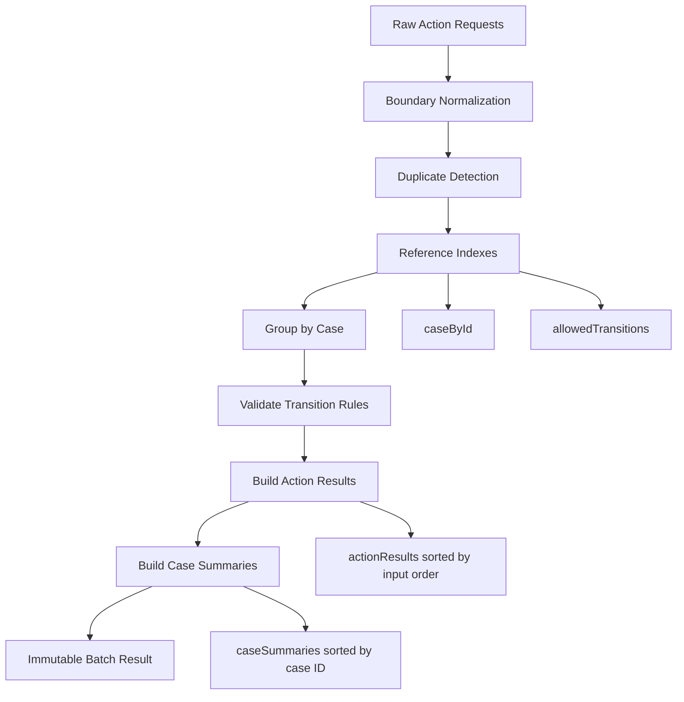

# Part 032 — Capstone: Designing a Production-Grade In-Memory Processing Module

> Target skill: design and implement a defensible in-memory processing module where arrays, collections, iterators, streams, collectors, and API boundaries are selected intentionally.

This is the final part of the series.

The goal is not to build the most clever stream pipeline. The goal is to build a module that is:

- correct under messy input;
- deterministic for audit/debugging;
- explicit about duplicates and ordering;
- defensive at boundaries;
- efficient enough for production-sized batches;
- easy to review;
- easy to test;
- safe to evolve.

The case study uses a regulatory-style batch processing domain because it stresses the same collection problems that appear in banking, telecom, insurance, marketplace, compliance, workflow, and case-management systems.

---

## 1. Problem Statement

We receive a batch of incoming case actions. Each action requests a state transition or annotation on a case.

The module must:

1. accept raw action requests;
2. reject malformed records;
3. reject duplicate action IDs;
4. group actions by case ID;
5. validate that target cases exist;
6. validate whether each action is allowed for the current case state;
7. produce a deterministic result per action;
8. produce a deterministic summary per case;
9. return immutable results;
10. avoid leaking internal mutable collections.

The module is intentionally in-memory. Persistence, messaging, locking, and workflow engines are outside this capstone.

---

## 2. Architecture



The main design principle:

> Every step either reduces ambiguity or makes a contract explicit.

---

## 3. Domain Model

### 3.1 Case state

```java
enum CaseState {
    NEW,
    UNDER_REVIEW,
    ESCALATED,
    RESOLVED,
    CLOSED
}
```

### 3.2 Action type

```java
enum ActionType {
    ASSIGN,
    ESCALATE,
    RESOLVE,
    CLOSE,
    COMMENT
}
```

### 3.3 Raw request

Raw request objects represent untrusted input.

```java
record RawActionRequest(
        String actionId,
        String caseId,
        String actorId,
        ActionType actionType,
        String comment
) {}
```

Do not put too much validation in the raw record. Raw records often come from deserialization, CSV parsing, message payloads, or external APIs. They may contain nulls, blanks, duplicated IDs, unknown references, or inconsistent semantics.

### 3.4 Normalized request

```java
record ActionRequest(
        String actionId,
        String caseId,
        String actorId,
        ActionType actionType,
        Optional<String> comment,
        int inputIndex
) {
    ActionRequest {
        actionId = requireNonBlank(actionId, "actionId");
        caseId = requireNonBlank(caseId, "caseId");
        actorId = requireNonBlank(actorId, "actorId");
        actionType = Objects.requireNonNull(actionType, "actionType");
        comment = Objects.requireNonNull(comment, "comment");
        if (inputIndex < 0) {
            throw new IllegalArgumentException("inputIndex must be >= 0");
        }
    }

    private static String requireNonBlank(String value, String name) {
        if (value == null || value.isBlank()) {
            throw new IllegalArgumentException(name + " must not be blank");
        }
        return value.strip();
    }
}
```

The normalized request has strong invariants:

- IDs are non-blank and stripped;
- action type is non-null;
- comment is represented explicitly as `Optional`;
- original input order is preserved with `inputIndex`.

### 3.5 Case snapshot

```java
record CaseSnapshot(
        String caseId,
        CaseState state,
        String ownerId,
        Set<String> tags
) {
    CaseSnapshot {
        caseId = requireNonBlank(caseId, "caseId");
        state = Objects.requireNonNull(state, "state");
        ownerId = requireNonBlank(ownerId, "ownerId");
        tags = Set.copyOf(Objects.requireNonNull(tags, "tags"));
    }

    private static String requireNonBlank(String value, String name) {
        if (value == null || value.isBlank()) {
            throw new IllegalArgumentException(name + " must not be blank");
        }
        return value.strip();
    }
}
```

`tags` is defensively copied because retained collection fields must not be externally mutable.

---

## 4. Result Model

### 4.1 Action status

```java
enum ActionStatus {
    ACCEPTED,
    REJECTED
}
```

### 4.2 Action result

```java
record ActionResult(
        String actionId,
        String caseId,
        int inputIndex,
        ActionStatus status,
        List<String> reasons
) {
    ActionResult {
        actionId = requireNonBlank(actionId, "actionId");
        caseId = requireNonBlank(caseId, "caseId");
        status = Objects.requireNonNull(status, "status");
        reasons = List.copyOf(Objects.requireNonNull(reasons, "reasons"));
    }

    static ActionResult accepted(ActionRequest request) {
        return new ActionResult(
                request.actionId(),
                request.caseId(),
                request.inputIndex(),
                ActionStatus.ACCEPTED,
                List.of()
        );
    }

    static ActionResult rejected(ActionRequest request, List<String> reasons) {
        return new ActionResult(
                request.actionId(),
                request.caseId(),
                request.inputIndex(),
                ActionStatus.REJECTED,
                reasons
        );
    }

    private static String requireNonBlank(String value, String name) {
        if (value == null || value.isBlank()) {
            throw new IllegalArgumentException(name + " must not be blank");
        }
        return value;
    }
}
```

### 4.3 Case summary

```java
record CaseActionSummary(
        String caseId,
        int acceptedCount,
        int rejectedCount,
        List<String> actionIds
) {
    CaseActionSummary {
        caseId = requireNonBlank(caseId, "caseId");
        actionIds = List.copyOf(Objects.requireNonNull(actionIds, "actionIds"));
    }

    private static String requireNonBlank(String value, String name) {
        if (value == null || value.isBlank()) {
            throw new IllegalArgumentException(name + " must not be blank");
        }
        return value;
    }
}
```

### 4.4 Batch result

```java
record BatchActionResult(
        List<ActionResult> actionResults,
        List<CaseActionSummary> caseSummaries,
        BatchDiagnostics diagnostics
) {
    BatchActionResult {
        actionResults = List.copyOf(Objects.requireNonNull(actionResults, "actionResults"));
        caseSummaries = List.copyOf(Objects.requireNonNull(caseSummaries, "caseSummaries"));
        diagnostics = Objects.requireNonNull(diagnostics, "diagnostics");
    }
}
```

### 4.5 Diagnostics

```java
record BatchDiagnostics(
        int rawInputCount,
        int normalizedCount,
        int duplicateActionIdCount,
        int missingCaseCount,
        int acceptedCount,
        int rejectedCount
) {}
```

Diagnostics should be cheap, deterministic, and safe to log.

---

## 5. Transition Rules

The transition rule table is small and stable. `EnumMap` and `EnumSet` are a good fit.

```java
final class TransitionRules {
    private final Map<CaseState, Set<ActionType>> allowedByState;

    private TransitionRules(Map<CaseState, Set<ActionType>> allowedByState) {
        EnumMap<CaseState, Set<ActionType>> copy = new EnumMap<>(CaseState.class);
        allowedByState.forEach((state, actions) ->
                copy.put(state, EnumSet.copyOf(actions))
        );
        this.allowedByState = Collections.unmodifiableMap(copy);
    }

    static TransitionRules defaultRules() {
        EnumMap<CaseState, Set<ActionType>> rules = new EnumMap<>(CaseState.class);
        rules.put(CaseState.NEW, EnumSet.of(ActionType.ASSIGN, ActionType.COMMENT));
        rules.put(CaseState.UNDER_REVIEW, EnumSet.of(ActionType.ESCALATE, ActionType.RESOLVE, ActionType.COMMENT));
        rules.put(CaseState.ESCALATED, EnumSet.of(ActionType.RESOLVE, ActionType.COMMENT));
        rules.put(CaseState.RESOLVED, EnumSet.of(ActionType.CLOSE, ActionType.COMMENT));
        rules.put(CaseState.CLOSED, EnumSet.of(ActionType.COMMENT));
        return new TransitionRules(rules);
    }

    boolean allows(CaseState state, ActionType actionType) {
        return allowedByState.getOrDefault(state, Set.of()).contains(actionType);
    }
}
```

Design notes:

- `EnumMap` is explicit about enum-keyed lookup.
- `EnumSet` is explicit about enum membership.
- The constructor defensively copies rule state.
- The public API exposes behavior, not internal maps.

---

## 6. Processor Boundary

The processor should accept broad input types but retain immutable snapshots.

```java
final class CaseActionProcessor {
    private final TransitionRules transitionRules;

    CaseActionProcessor(TransitionRules transitionRules) {
        this.transitionRules = Objects.requireNonNull(transitionRules, "transitionRules");
    }

    BatchActionResult process(
            Collection<RawActionRequest> rawRequests,
            Collection<CaseSnapshot> cases
    ) {
        Objects.requireNonNull(rawRequests, "rawRequests");
        Objects.requireNonNull(cases, "cases");

        List<RawActionRequest> rawSnapshot = List.copyOf(rawRequests);
        List<CaseSnapshot> caseSnapshot = List.copyOf(cases);

        return doProcess(rawSnapshot, caseSnapshot);
    }
}
```

Why `Collection` input?

- The method does not need index access from the caller.
- The method accepts `List`, `Set`, queue snapshots, and other collection sources.
- Internally, it converts to a `List` snapshot because deterministic input order is required.

Why not accept `Stream`?

- Stream is single-use.
- Stream may be resource-backed.
- Stream ownership and closing rules become ambiguous.
- Batch processing needs diagnostics such as input count and duplicate analysis.

---

## 7. Normalization

Normalization must preserve per-record diagnostics. Do not let one malformed row kill the entire batch unless that is the explicit policy.

```java
record NormalizationOutput(
        List<ActionRequest> validRequests,
        List<ActionResult> rejectedMalformed
) {
    NormalizationOutput {
        validRequests = List.copyOf(validRequests);
        rejectedMalformed = List.copyOf(rejectedMalformed);
    }
}
```

```java
private NormalizationOutput normalize(List<RawActionRequest> rawRequests) {
    List<ActionRequest> valid = new ArrayList<>();
    List<ActionResult> rejected = new ArrayList<>();

    for (int i = 0; i < rawRequests.size(); i++) {
        RawActionRequest raw = rawRequests.get(i);
        try {
            if (raw == null) {
                rejected.add(new ActionResult(
                        "<missing-action-id>",
                        "<missing-case-id>",
                        i,
                        ActionStatus.REJECTED,
                        List.of("Raw action request is null")
                ));
                continue;
            }

            ActionRequest request = new ActionRequest(
                    raw.actionId(),
                    raw.caseId(),
                    raw.actorId(),
                    raw.actionType(),
                    Optional.ofNullable(raw.comment()).map(String::strip).filter(s -> !s.isBlank()),
                    i
            );
            valid.add(request);
        } catch (RuntimeException ex) {
            rejected.add(new ActionResult(
                    safeId(raw == null ? null : raw.actionId(), "<invalid-action-id>", i),
                    safeId(raw == null ? null : raw.caseId(), "<invalid-case-id>", i),
                    i,
                    ActionStatus.REJECTED,
                    List.of("Malformed request: " + ex.getMessage())
            ));
        }
    }

    return new NormalizationOutput(valid, rejected);
}

private static String safeId(String value, String fallback, int index) {
    if (value == null || value.isBlank()) {
        return fallback + "#" + index;
    }
    return value.strip();
}
```

Why loop instead of stream?

- We need precise index-aware diagnostics.
- We need fine-grained exception isolation.
- A loop is clearer than forcing exception-handling state into a stream pipeline.

This is an important senior-level judgment: stream is not always better.

---

## 8. Duplicate Action Detection

Action IDs must be unique. We want deterministic diagnostics.

```java
record DuplicateCheckOutput(
        List<ActionRequest> uniqueRequests,
        List<ActionResult> rejectedDuplicates,
        int duplicateActionIdCount
) {
    DuplicateCheckOutput {
        uniqueRequests = List.copyOf(uniqueRequests);
        rejectedDuplicates = List.copyOf(rejectedDuplicates);
    }
}
```

```java
private DuplicateCheckOutput rejectDuplicateActionIds(List<ActionRequest> requests) {
    Map<String, List<ActionRequest>> byActionId = requests.stream()
            .collect(Collectors.groupingBy(
                    ActionRequest::actionId,
                    LinkedHashMap::new,
                    Collectors.toList()
            ));

    Set<String> duplicateIds = byActionId.entrySet().stream()
            .filter(e -> e.getValue().size() > 1)
            .map(Map.Entry::getKey)
            .collect(Collectors.toCollection(LinkedHashSet::new));

    List<ActionRequest> unique = new ArrayList<>();
    List<ActionResult> rejected = new ArrayList<>();

    for (ActionRequest request : requests) {
        if (duplicateIds.contains(request.actionId())) {
            rejected.add(ActionResult.rejected(
                    request,
                    List.of("Duplicate action ID: " + request.actionId())
            ));
        } else {
            unique.add(request);
        }
    }

    return new DuplicateCheckOutput(unique, rejected, duplicateIds.size());
}
```

Design decisions:

- `LinkedHashMap` preserves first-seen action ID order.
- `LinkedHashSet` preserves deterministic duplicate ID order.
- We reject all occurrences of a duplicate action ID, not just later ones. This avoids ambiguous first-wins semantics.

Alternative policy:

- keep first, reject later;
- keep latest;
- merge actions;
- group for manual review.

The correct policy depends on domain requirements. The wrong policy is silent overwrite.

---

## 9. Reference Indexes

### 9.1 Case index

```java
private Map<String, CaseSnapshot> indexCases(List<CaseSnapshot> cases) {
    return cases.stream()
            .collect(Collectors.toMap(
                    CaseSnapshot::caseId,
                    Function.identity(),
                    (left, right) -> {
                        throw new IllegalArgumentException("Duplicate case snapshot: " + left.caseId());
                    },
                    LinkedHashMap::new
            ));
}
```

Why `LinkedHashMap`?

- It gives deterministic iteration order for diagnostics.
- Lookup remains efficient.
- It preserves input order if that matters later.

If canonical sorted output were required by case ID, use `TreeMap` or sort at output boundary.

### 9.2 Missing reference validation

```java
private List<ActionResult> rejectMissingCases(
        List<ActionRequest> requests,
        Map<String, CaseSnapshot> caseById
) {
    return requests.stream()
            .filter(request -> !caseById.containsKey(request.caseId()))
            .map(request -> ActionResult.rejected(
                    request,
                    List.of("Unknown case ID: " + request.caseId())
            ))
            .toList();
}
```

This stream is clean because it is a pure transformation with no hidden mutation.

---

## 10. Allowed Action Validation

```java
private ActionResult validateAllowedAction(
        ActionRequest request,
        CaseSnapshot currentCase
) {
    List<String> reasons = new ArrayList<>();

    if (!transitionRules.allows(currentCase.state(), request.actionType())) {
        reasons.add("Action " + request.actionType()
                + " is not allowed when case state is " + currentCase.state());
    }

    if (request.actionType() == ActionType.COMMENT && request.comment().isEmpty()) {
        reasons.add("COMMENT action requires non-blank comment");
    }

    if (reasons.isEmpty()) {
        return ActionResult.accepted(request);
    }
    return ActionResult.rejected(request, reasons);
}
```

A small mutable local list is appropriate here. It is method-confined and converted into an immutable result record.

Do not overuse streams where local imperative accumulation is clearer.

---

## 11. Main Processing Flow

```java
private BatchActionResult doProcess(
        List<RawActionRequest> rawRequests,
        List<CaseSnapshot> cases
) {
    NormalizationOutput normalized = normalize(rawRequests);
    DuplicateCheckOutput duplicateChecked = rejectDuplicateActionIds(normalized.validRequests());

    Map<String, CaseSnapshot> caseById = indexCases(cases);

    Set<ActionRequest> missingCaseRequests = duplicateChecked.uniqueRequests().stream()
            .filter(request -> !caseById.containsKey(request.caseId()))
            .collect(Collectors.toCollection(
                    () -> Collections.newSetFromMap(new IdentityHashMap<>())
            ));

    List<ActionResult> missingCaseResults = duplicateChecked.uniqueRequests().stream()
            .filter(missingCaseRequests::contains)
            .map(request -> ActionResult.rejected(
                    request,
                    List.of("Unknown case ID: " + request.caseId())
            ))
            .toList();

    List<ActionResult> semanticResults = duplicateChecked.uniqueRequests().stream()
            .filter(request -> !missingCaseRequests.contains(request))
            .map(request -> validateAllowedAction(request, caseById.get(request.caseId())))
            .toList();

    List<ActionResult> allResults = Stream.of(
                    normalized.rejectedMalformed().stream(),
                    duplicateChecked.rejectedDuplicates().stream(),
                    missingCaseResults.stream(),
                    semanticResults.stream()
            )
            .flatMap(Function.identity())
            .sorted(Comparator.comparingInt(ActionResult::inputIndex))
            .toList();

    List<CaseActionSummary> summaries = summarizeByCase(allResults);

    BatchDiagnostics diagnostics = diagnostics(
            rawRequests.size(),
            normalized,
            duplicateChecked,
            missingCaseResults,
            allResults
    );

    return new BatchActionResult(allResults, summaries, diagnostics);
}
```

### Why identity set for missing requests?

`ActionRequest` is a record, so equality is value-based. In this flow, value equality would probably be fine. However, identity-based membership can be useful when tracking specific request objects after normalization if two valid requests could have the same field values except input position. Since `inputIndex` is included, regular `HashSet` would also work.

A simpler alternative:

```java
Set<Integer> missingInputIndexes = duplicateChecked.uniqueRequests().stream()
        .filter(request -> !caseById.containsKey(request.caseId()))
        .map(ActionRequest::inputIndex)
        .collect(Collectors.toSet());
```

For most enterprise code, indexing by stable scalar ID or input index is clearer than identity sets.

---

## 12. Case Summary

```java
private List<CaseActionSummary> summarizeByCase(List<ActionResult> results) {
    Map<String, List<ActionResult>> byCase = results.stream()
            .collect(Collectors.groupingBy(
                    ActionResult::caseId,
                    TreeMap::new,
                    Collectors.toList()
            ));

    return byCase.entrySet().stream()
            .map(entry -> {
                String caseId = entry.getKey();
                List<ActionResult> caseResults = entry.getValue();

                int accepted = (int) caseResults.stream()
                        .filter(r -> r.status() == ActionStatus.ACCEPTED)
                        .count();

                int rejected = caseResults.size() - accepted;

                List<String> actionIds = caseResults.stream()
                        .sorted(Comparator.comparingInt(ActionResult::inputIndex))
                        .map(ActionResult::actionId)
                        .toList();

                return new CaseActionSummary(caseId, accepted, rejected, actionIds);
            })
            .toList();
}
```

Why `TreeMap`?

- Case summaries should be deterministic and canonical by case ID.
- The output leaves the module boundary.
- Sorting at the grouping map avoids an extra sorted step over entries.

If input encounter order by case were required, use `LinkedHashMap` instead.

---

## 13. Diagnostics Assembly

```java
private BatchDiagnostics diagnostics(
        int rawInputCount,
        NormalizationOutput normalized,
        DuplicateCheckOutput duplicateChecked,
        List<ActionResult> missingCaseResults,
        List<ActionResult> allResults
) {
    int accepted = (int) allResults.stream()
            .filter(r -> r.status() == ActionStatus.ACCEPTED)
            .count();

    int rejected = allResults.size() - accepted;

    return new BatchDiagnostics(
            rawInputCount,
            normalized.validRequests().size(),
            duplicateChecked.duplicateActionIdCount(),
            missingCaseResults.size(),
            accepted,
            rejected
    );
}
```

Diagnostics are not a replacement for detailed per-record results. They are operational summaries.

---

## 14. Full Processor Skeleton

```java
final class CaseActionProcessor {
    private final TransitionRules transitionRules;

    CaseActionProcessor(TransitionRules transitionRules) {
        this.transitionRules = Objects.requireNonNull(transitionRules, "transitionRules");
    }

    BatchActionResult process(Collection<RawActionRequest> rawRequests,
                              Collection<CaseSnapshot> cases) {
        Objects.requireNonNull(rawRequests, "rawRequests");
        Objects.requireNonNull(cases, "cases");

        return doProcess(List.copyOf(rawRequests), List.copyOf(cases));
    }

    private BatchActionResult doProcess(List<RawActionRequest> rawRequests,
                                        List<CaseSnapshot> cases) {
        NormalizationOutput normalized = normalize(rawRequests);
        DuplicateCheckOutput duplicateChecked = rejectDuplicateActionIds(normalized.validRequests());
        Map<String, CaseSnapshot> caseById = indexCases(cases);

        List<ActionResult> missingCaseResults = duplicateChecked.uniqueRequests().stream()
                .filter(request -> !caseById.containsKey(request.caseId()))
                .map(request -> ActionResult.rejected(
                        request,
                        List.of("Unknown case ID: " + request.caseId())
                ))
                .toList();

        Set<Integer> missingInputIndexes = missingCaseResults.stream()
                .map(ActionResult::inputIndex)
                .collect(Collectors.toSet());

        List<ActionResult> semanticResults = duplicateChecked.uniqueRequests().stream()
                .filter(request -> !missingInputIndexes.contains(request.inputIndex()))
                .map(request -> validateAllowedAction(request, caseById.get(request.caseId())))
                .toList();

        List<ActionResult> allResults = Stream.of(
                        normalized.rejectedMalformed().stream(),
                        duplicateChecked.rejectedDuplicates().stream(),
                        missingCaseResults.stream(),
                        semanticResults.stream()
                )
                .flatMap(Function.identity())
                .sorted(Comparator.comparingInt(ActionResult::inputIndex))
                .toList();

        return new BatchActionResult(
                allResults,
                summarizeByCase(allResults),
                diagnostics(rawRequests.size(), normalized, duplicateChecked, missingCaseResults, allResults)
        );
    }

    // helper methods from previous sections omitted here for brevity
}
```

This skeleton intentionally combines loops and streams:

- loops for index-aware normalization and exception isolation;
- streams for pure transformations and grouping;
- collectors for materialization;
- maps/sets for efficient lookup;
- immutable result records for boundary safety.

---

## 15. Test Strategy

### 15.1 Boundary tests

```java
@Test
void returnsImmutableResults() {
    BatchActionResult result = processor.process(rawRequests, cases);

    assertThrows(UnsupportedOperationException.class,
            () -> result.actionResults().add(someResult));
}
```

### 15.2 Duplicate tests

```java
@Test
void rejectsAllDuplicateActionIds() {
    List<RawActionRequest> input = List.of(
            new RawActionRequest("A1", "C1", "U1", ActionType.COMMENT, "x"),
            new RawActionRequest("A1", "C1", "U1", ActionType.COMMENT, "y")
    );

    BatchActionResult result = processor.process(input, cases);

    assertEquals(2, result.actionResults().size());
    assertTrue(result.actionResults().stream()
            .allMatch(r -> r.status() == ActionStatus.REJECTED));
}
```

### 15.3 Ordering tests

```java
@Test
void actionResultsFollowInputOrder() {
    BatchActionResult result = processor.process(inputOutOfCaseOrder, cases);

    List<Integer> indexes = result.actionResults().stream()
            .map(ActionResult::inputIndex)
            .toList();

    assertEquals(List.of(0, 1, 2, 3), indexes);
}
```

### 15.4 Missing reference tests

```java
@Test
void rejectsUnknownCaseId() {
    RawActionRequest request = new RawActionRequest(
            "A1", "UNKNOWN", "U1", ActionType.COMMENT, "note"
    );

    BatchActionResult result = processor.process(List.of(request), cases);

    assertEquals(ActionStatus.REJECTED, result.actionResults().getFirst().status());
    assertTrue(result.actionResults().getFirst().reasons().getFirst().contains("Unknown case ID"));
}
```

### 15.5 Transition rule tests

```java
@Test
void rejectsEscalateFromClosedCase() {
    CaseSnapshot closed = new CaseSnapshot("C1", CaseState.CLOSED, "U1", Set.of());
    RawActionRequest request = new RawActionRequest(
            "A1", "C1", "U2", ActionType.ESCALATE, null
    );

    BatchActionResult result = processor.process(List.of(request), List.of(closed));

    assertEquals(ActionStatus.REJECTED, result.actionResults().getFirst().status());
}
```

---

## 16. Performance Review

### 16.1 Complexity

For `n` requests and `m` cases:

| Step | Complexity | Notes |
|---|---:|---|
| Snapshot inputs | `O(n + m)` | Defensive boundary |
| Normalize requests | `O(n)` | Loop with index diagnostics |
| Group by action ID | `O(n)` average | Hashing by action ID |
| Index cases | `O(m)` average | Hashing by case ID |
| Validate requests | `O(n)` | Constant-time lookup |
| Sort action results | `O(n log n)` | Can be avoided if assembly preserves order |
| Group summaries | `O(n log c)` with `TreeMap` | `c` = distinct case count |

### 16.2 Avoiding the final sort

Current implementation sorts all results by input index after combining result streams. This is simple and safe.

If `n` is large and performance matters, preallocate an array by input index:

```java
ActionResult[] resultsByIndex = new ActionResult[rawRequests.size()];

for (ActionResult result : allPartialResults) {
    resultsByIndex[result.inputIndex()] = result;
}

List<ActionResult> ordered = Arrays.stream(resultsByIndex)
        .filter(Objects::nonNull)
        .toList();
```

This trades memory for `O(n)` ordering.

Use this only after measurement and when input index is dense and valid.

### 16.3 Stream vs loop performance

Use loops when:

- you need index-aware exception handling;
- mutation is local and clearer;
- the operation is a tight hot path;
- early exit has complex control flow;
- debugging requires stepwise imperative clarity.

Use streams when:

- the transformation is pure;
- grouping/materialization is collector-friendly;
- ordering semantics are clear;
- the pipeline reads more directly than loop state;
- no hidden side effects are needed.

---

## 17. Production Hardening Checklist

### API boundary

- Accept the least-specific type that expresses the need.
- Snapshot mutable inputs if retained or if deterministic processing requires stable input.
- Return immutable results.
- Do not expose live internal views unless explicitly documented.

### Validation

- Reject nulls and blanks at boundary.
- Preserve input index for diagnostics.
- Separate malformed input from semantic rejection.
- Do not let one bad row kill the batch unless policy requires fail-fast.

### Duplicates

- Declare duplicate policy.
- Avoid silent `put` overwrite.
- Include duplicate diagnostics.
- Use deterministic duplicate order.

### Lookup

- Build indexes before repeated lookup.
- Use stable scalar keys.
- Avoid mutable map keys.
- Reject duplicate reference records unless merge policy exists.

### Ordering

- Preserve input order for per-action result.
- Use sorted order for canonical summaries.
- Avoid relying on unspecified collection iteration order.
- Use sequenced types when first/last/reverse semantics matter.

### Streams

- Keep stream lambdas non-interfering and stateless.
- Do not reuse streams.
- Avoid parallel streams unless correctness and benchmark evidence exist.
- Isolate side effects at system boundaries.

### Observability

- Emit counts, not huge collections.
- Include duplicate/missing/reference counts.
- Keep diagnostics deterministic.
- Avoid leaking sensitive payload data in logs.

---

## 18. Refactoring Exercises

### Exercise 1: Replace nested scans

Input:

```java
for (ActionRequest request : requests) {
    CaseSnapshot match = cases.stream()
            .filter(c -> c.caseId().equals(request.caseId()))
            .findFirst()
            .orElse(null);
}
```

Refactor to an indexed lookup.

Expected direction:

```java
Map<String, CaseSnapshot> caseById = cases.stream()
        .collect(Collectors.toMap(
                CaseSnapshot::caseId,
                Function.identity(),
                (a, b) -> {
                    throw new IllegalArgumentException("Duplicate case ID: " + a.caseId());
                }
        ));
```

### Exercise 2: Make result deterministic

Input:

```java
return resultByCase.entrySet().stream()
        .map(this::toSummary)
        .toList();
```

Refactor so output is sorted by case ID.

Expected direction:

```java
return resultByCase.entrySet().stream()
        .sorted(Map.Entry.comparingByKey())
        .map(this::toSummary)
        .toList();
```

### Exercise 3: Remove side effects

Input:

```java
List<ActionResult> rejected = new ArrayList<>();
requests.stream()
        .filter(this::invalid)
        .forEach(r -> rejected.add(reject(r)));
```

Expected direction:

```java
List<ActionResult> rejected = requests.stream()
        .filter(this::invalid)
        .map(this::reject)
        .toList();
```

### Exercise 4: Replace over-clever stream with loop

Input:

```java
List<ActionRequest> valid = IntStream.range(0, rawRequests.size())
        .mapToObj(i -> normalizeOrThrow(rawRequests.get(i), i))
        .toList();
```

If the requirement is to collect per-row errors instead of throwing, use a loop.

Expected direction:

```java
List<ActionRequest> valid = new ArrayList<>();
List<ActionResult> rejected = new ArrayList<>();

for (int i = 0; i < rawRequests.size(); i++) {
    try {
        valid.add(normalizeOrThrow(rawRequests.get(i), i));
    } catch (RuntimeException ex) {
        rejected.add(rejectMalformed(rawRequests.get(i), i, ex));
    }
}
```

---

## 19. Final Mastery Rubric

You are ready to treat Java arrays, collections, iterators, and streams as production-grade tools when you can do the following without guessing.

### Array mastery

- Explain when primitive arrays beat boxed collections.
- Use `Arrays` utility methods correctly.
- Avoid array covariance and exposed mutable array traps.
- Choose array-backed designs only when fixed-size/dense/locality benefits matter.

### Collection mastery

- Select `List`, `Set`, `Map`, `Queue`, `Deque`, or sequenced interfaces from contract, not habit.
- Explain equality, hashing, comparator, duplicate, ordering, and mutability consequences.
- Distinguish mutable, unmodifiable, immutable, fixed-size, live view, and snapshot.
- Design defensive collection API boundaries.

### Iterator mastery

- Explain `Iterable` vs `Iterator` vs `Spliterator`.
- Model iterator as traversal state machine.
- Handle mutation during traversal safely.
- Understand fail-fast, snapshot, and weakly consistent iteration models.

### Stream mastery

- Explain stream source, intermediate operations, terminal execution, laziness, and single-use lifecycle.
- Use primitive streams to avoid boxing in numeric pipelines.
- Use collectors and custom collectors with correct associativity and combiner semantics.
- Use gatherers when custom intermediate operations are a better fit than collectors or loops.
- Avoid unsafe side effects and unjustified parallel streams.

### Production mastery

- Build indexes to avoid accidental quadratic scans.
- Make duplicate policy explicit.
- Produce deterministic output when data leaves a module.
- Add diagnostics that explain cardinality, duplicates, missing references, and rejection reasons.
- Choose loops when they are clearer and streams when they express transformation safely.

---

## 20. The End of This Series

This is the final part of **Learn Java Array, Collections, Iterator/Iterable, Stream**.

The series covered:

1. Kaufman-style skill decomposition;
2. in-memory data modeling;
3. Java arrays and memory/performance behavior;
4. Java Collections Framework architecture;
5. collection contracts;
6. `List`, `Set`, `Map`, `Queue`, `Deque`;
7. Sequenced Collections;
8. immutability, views, wrappers, defensive boundaries;
9. `Iterable`, `Iterator`, `ListIterator`, `Spliterator`;
10. stream mental model and operations;
11. primitive streams;
12. collectors and custom collectors;
13. stream gatherers;
14. stream performance and parallel stream constraints;
15. enterprise API design;
16. production patterns;
17. failure modeling;
18. capstone module design.

The practical endpoint is not memorizing method names. The endpoint is being able to look at any collection-heavy Java code and answer:

- What is the contract?
- What are the invariants?
- Where can mutation happen?
- What identity model is used?
- What ordering is guaranteed?
- What happens with duplicates?
- What is the lifecycle of the traversal?
- What is the performance shape?
- What failure mode will appear in production?

That is the level of control expected from a top-tier Java engineer.

---

## 21. References

- Java SE 25 Collections Framework overview
- Java SE 25 API: `java.util.Collection`
- Java SE 25 API: `java.util.List`
- Java SE 25 API: `java.util.Map`
- Java SE 25 API: `java.util.SequencedCollection`
- Java SE 25 API: `java.util.Iterator`
- Java SE 25 API: `java.util.Spliterator`
- Java SE 25 API: `java.util.stream.Stream`
- Java SE 25 API: `java.util.stream.Collector`
- Java SE 25 API: `java.util.stream.Gatherer`
