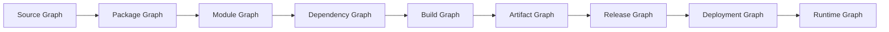
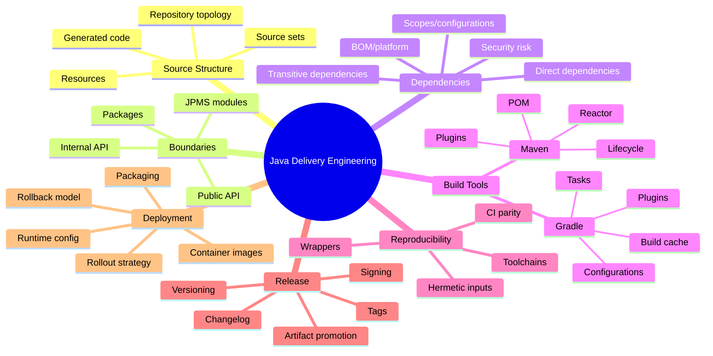
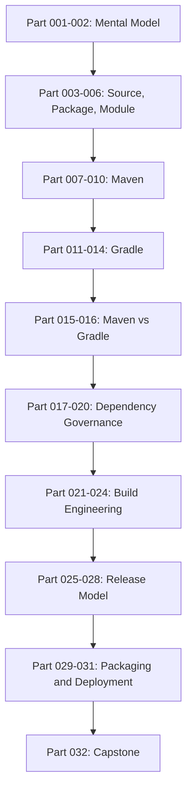

------
title: Learn Java Source, Package, Dependency, Build, Release & Deployment Engineering - Part 001
description: Kaufman-based skill map for mastering Java source layout, package/module boundaries, dependency governance, build systems, release engineering, and deployment lifecycle.
series: learn-java-build-dependency-release-deployment
seriesTitle: Learn Java Source, Package, Dependency, Build, Release & Deployment Engineering
order: 1
partTitle: Kaufman Skill Map
tags:
- java
- build-engineering
- dependency-management
- maven
- gradle
- release-engineering
- deployment
- software-supply-chain
date: 2026-06-28
---

# Part 001 — Kaufman Skill Map: From Java Code to Production Artifact

## 1. Tujuan Part Ini

Part ini bukan tutorial Maven, Gradle, atau Docker.

Part ini adalah **peta skill** untuk memahami seluruh lifecycle Java software dari source code sampai production artifact. Kita akan memakai pendekatan dari buku **The First 20 Hours** oleh Josh Kaufman:

1. **Deconstruct the skill** — pecah kemampuan besar menjadi sub-skill kecil.
2. **Learn enough to self-correct** — pelajari cukup teori agar bisa mendeteksi kesalahan sendiri.
3. **Remove practice barriers** — siapkan lingkungan dan workflow agar latihan tidak terhambat.
4. **Practice deliberately for at least 20 hours** — latihan terarah dengan feedback cepat.

Target seri ini: setelah selesai, kita tidak hanya bisa menjalankan:

```bash
mvn clean package
./gradlew build
```

Tetapi mampu menjawab pertanyaan seperti:

- Mengapa build lokal dan CI menghasilkan artifact berbeda?
- Mengapa dependency yang tidak dideklarasikan langsung bisa mengubah runtime behavior?
- Kapan Maven lebih tepat daripada Gradle, dan sebaliknya?
- Bagaimana mendesain repository structure agar ownership, modularity, release, dan deployment tetap sehat?
- Bagaimana membuat build pipeline yang deterministic, secure, observable, dan scalable?
- Bagaimana dependency graph menjadi bagian dari architecture, bukan sekadar urusan build file?
- Bagaimana artifact dipromosikan antar environment tanpa rebuild?
- Bagaimana memastikan deployment membawa artifact yang bisa diaudit, diulang, dan dikembalikan?

Di level senior/staff/principal, build dan release bukan pekerjaan administratif. Ia adalah **software supply-chain architecture**.

---

## 2. Skill yang Sebenarnya Dipelajari

Topik ini sering terlihat seperti kumpulan tool:

- Maven
- Gradle
- Git
- JAR/WAR
- Docker
- CI/CD
- Nexus/Artifactory
- semantic versioning
- release notes
- deployment pipeline

Tetapi skill intinya lebih dalam.

Skill sebenarnya adalah:

> Mendesain, mengoperasikan, dan men-debug aliran perubahan dari source code menjadi artifact yang aman, reproducible, compatible, traceable, dan deployable.

Kita bisa menyederhanakannya menjadi satu pertanyaan besar:

> Jika sebuah perubahan Java masuk ke repository hari ini, bagaimana kita memastikan perubahan itu berubah menjadi production behavior yang benar, dapat diaudit, dapat diulang, dan dapat dikendalikan risikonya?

Itulah domain build/release/deployment engineering.

---

## 3. Mental Model Utama

Sebelum masuk tool, kita butuh model.

Java software delivery dapat dilihat sebagai serangkaian graph:



Setiap graph punya fungsi berbeda:

| Graph | Pertanyaan yang Dijawab | Contoh Risiko |
|---|---|---|
| Source graph | File mana membentuk sistem? | source layout kacau, generated code drift |
| Package graph | Namespace dan boundary apa yang ada? | package-by-layer terlalu besar, internal API bocor |
| Module graph | Unit strong encapsulation apa yang valid? | split package, reflective access error |
| Dependency graph | Library mana yang membentuk classpath/runtime? | transitive conflict, vulnerability, dependency bloat |
| Build graph | Task/phase apa yang harus berjalan dan urutannya? | task tidak cacheable, CI beda dari lokal |
| Artifact graph | Binary apa yang diproduksi dan dipublikasikan? | artifact tidak immutable, checksum berubah |
| Release graph | Versi mana dipromosikan ke environment mana? | rebuild saat promote, rollback ambigu |
| Deployment graph | Workload mana menjalankan artifact mana? | image tag mutable, config drift |
| Runtime graph | Behavior apa yang benar-benar berjalan? | classpath shadowing, wrong config, partial rollout |

Top-tier engineer tidak melihat `pom.xml` atau `build.gradle` sebagai konfigurasi kecil. Mereka melihatnya sebagai **declarative/procedural representation of those graphs**.

---

## 4. Prinsip Dasar: Build System adalah Boundary of Trust

Build system menentukan:

- source mana yang dikompilasi
- compiler dan JDK mana yang dipakai
- dependency mana yang masuk
- test mana yang dijalankan
- static analysis mana yang dianggap blocking
- artifact mana yang dipublikasikan
- metadata apa yang ditempelkan
- apakah artifact bisa dipercaya

Karena itu, build pipeline adalah **trust boundary**.

Jika build pipeline lemah, maka production tidak bisa dipercaya meskipun source code tampak benar.

Contoh:

```text
Source code reviewed ✅
Unit tests passed locally ✅
CI used different JDK ❌
Transitive dependency resolved differently ❌
Docker image rebuilt during promotion ❌
Runtime behavior changed in staging ❌
```

Masalah di atas bukan masalah coding biasa. Itu masalah lifecycle integrity.

---

## 5. Deconstruct the Skill

Kaufman menyarankan skill besar dipecah menjadi sub-skill kecil. Untuk seri ini, kita pecah menjadi 12 sub-skill.

### 5.1 Source Organization

Kemampuan:

- memahami layout source Java modern
- memisahkan main/test/integration-test/generated source
- memahami resources sebagai input build
- menjaga repository tetap navigable
- membedakan repo boundary, module boundary, package boundary, dan deployment boundary

Kesalahan umum:

- menganggap folder sama dengan architecture
- mencampur generated code dan handwritten code tanpa aturan
- source layout beda antar service tanpa alasan
- module terlalu kecil sehingga build overhead besar
- module terlalu besar sehingga ownership kabur

### 5.2 Package Boundary Design

Kemampuan:

- memakai package sebagai namespace dan access boundary
- memanfaatkan package-private dengan sengaja
- menghindari package-by-layer yang menyebabkan coupling horizontal
- mendesain internal API vs exported API
- menjaga package invariant

Kesalahan umum:

```text
com.company.project.controller
com.company.project.service
com.company.project.repository
com.company.project.util
```

Layout seperti ini terlihat rapi, tetapi sering menyembunyikan coupling antar feature. Semua service bisa saling memanggil. Semua util menjadi dumping ground. Boundary domain hilang.

Alternatif yang lebih kuat:

```text
com.company.billing.invoice
com.company.billing.payment
com.company.billing.adjustment
com.company.billing.shared
```

Boundary mengikuti capability, bukan layer teknis.

### 5.3 JPMS / Module System Reasoning

Kemampuan:

- memahami `module-info.java`
- membedakan classpath dan module path
- memahami `requires`, `exports`, `opens`, `uses`, `provides`
- memahami strong encapsulation
- memutuskan kapan JPMS layak dipakai
- memigrasikan library/application bertahap

Kesalahan umum:

- memakai JPMS hanya karena “modern Java”
- membuka semua package dengan `open module`
- membuat split package
- mengabaikan reflective access dari framework
- tidak membedakan public API dan reflective access

### 5.4 Dependency Management

Kemampuan:

- membaca dependency tree
- memahami direct vs transitive dependency
- mengelola scope/configuration
- memahami Maven mediation dan Gradle resolution
- memakai BOM/platform untuk alignment
- mengendalikan dependency drift
- menilai risiko supply-chain dependency

Kesalahan umum:

- menambah dependency karena “cepat”
- tidak tahu library mana yang masuk runtime
- mengandalkan transitive dependency secara tidak sadar
- update dependency tanpa compatibility testing
- men-disable vulnerability gate karena noisy

### 5.5 Maven Build Engineering

Kemampuan:

- memahami POM, lifecycle, phase, goal, plugin
- memisahkan parent POM dan aggregator POM
- mengelola multi-module reactor
- memakai `dependencyManagement` dan `pluginManagement`
- membuat corporate parent POM yang sehat
- men-debug effective POM dan dependency tree

Kesalahan umum:

- parent POM menjadi “god configuration”
- plugin version tidak dipin
- lifecycle binding tidak jelas
- module dependency membentuk cycle
- `mvn install` menjadi implicit workflow untuk semua hal

### 5.6 Gradle Build Engineering

Kemampuan:

- memahami project, task, plugin, configuration
- memakai lazy configuration
- memakai version catalogs dan platforms
- membuat convention plugins
- memakai configuration cache dan build cache dengan aman
- memahami task inputs/outputs
- men-debug dependency insight dan build scan

Kesalahan umum:

- build script menjadi imperative spaghetti
- semua logic ditaruh di root `build.gradle`
- task tidak declare input/output
- memakai `afterEvaluate` sembarangan
- performance buruk karena configuration phase berat

### 5.7 Build Reproducibility

Kemampuan:

- memahami hidden build inputs
- pinning toolchain
- mengendalikan network access
- membuat build deterministic
- menghindari timestamp/randomness leak
- menyamakan local dan CI behavior

Kesalahan umum:

```text
Works on my machine.
```

Kalimat ini hampir selalu berarti ada input build yang tidak dimodelkan.

Contoh hidden inputs:

- JDK version
- OS
- locale
- timezone
- environment variables
- local Maven cache
- Gradle daemon state
- repository mirror
- generated source timestamp
- test ordering

### 5.8 Test and Quality Gate Integration

Kemampuan:

- menempatkan unit, integration, contract, smoke, performance test di pipeline yang tepat
- memisahkan fast feedback dan release confidence
- menghubungkan static analysis dengan build lifecycle
- membuat gate yang meaningful, bukan ceremonial
- men-debug flaky tests dan CI-only failures

Kesalahan umum:

- semua test dipaksa jalan di setiap commit tanpa layering
- coverage gate dipakai tanpa memahami kualitas assertion
- integration test bergantung pada shared mutable environment
- test fixture tidak deterministic

### 5.9 Artifact Packaging

Kemampuan:

- memilih thin JAR, fat JAR, shaded JAR, WAR, modular JAR, runtime image, container image
- memahami classpath dan resource loading implication
- menghindari duplicate classes
- mengelola shading/relocation
- memisahkan build artifact dan deployment artifact

Kesalahan umum:

- semua dibuat fat JAR tanpa mempertimbangkan conflict
- container image berisi terlalu banyak tool
- WAR dipakai karena legacy, bukan karena deployment model membutuhkan
- artifact tidak memiliki metadata cukup untuk traceability

### 5.10 Release Engineering

Kemampuan:

- mengelola versioning, tagging, changelog, release notes
- membuat release candidate
- memisahkan snapshot dan release
- menandatangani artifact
- melakukan artifact promotion tanpa rebuild
- mendesain rollback/roll-forward

Kesalahan umum:

- release berarti “build ulang dari branch tertentu”
- version number tidak punya compatibility meaning
- hotfix branch menjadi permanent fork
- production artifact tidak bisa ditelusuri ke commit

### 5.11 Deployment Model

Kemampuan:

- memahami VM deployment, app server, container, Kubernetes
- membuat deployment immutable
- memahami config/secrets injection
- memahami blue/green, canary, rolling update
- mengelola DB migration coordination
- membedakan deploy, release, dan enablement via feature flag

Kesalahan umum:

- deploy dianggap sama dengan release
- rollback dilakukan tanpa data migration strategy
- image tag mutable seperti `latest`
- health check hanya mengecek process hidup, bukan readiness

### 5.12 Supply-Chain Security

Kemampuan:

- memahami dependency confusion, typosquatting, compromised maintainer risk
- mengelola checksums/signature verification
- menghasilkan SBOM
- memahami provenance/attestation
- menaruh policy gate di pipeline
- membuat audit trail

Kesalahan umum:

- security scan hanya dijalankan saat audit
- transitive vulnerabilities tidak punya owner
- dependency approval dilakukan manual tanpa lifecycle
- provenance tidak tersedia saat incident

---

## 6. Skill Tree

Berikut skill tree seri ini.



Gunakan skill tree ini sebagai peta. Setiap part di seri ini akan memperkuat satu atau beberapa node.

---

## 7. Build/Release/Deployment Vocabulary yang Harus Presisi

Sebelum lanjut, kita harus menyamakan kosakata.

### 7.1 Build

**Build** adalah proses mengubah input menjadi output artifact.

Input:

- source code
- resource files
- generated sources
- build scripts
- dependency declarations
- compiler/toolchain
- environment
- test fixtures

Output:

- class files
- test reports
- coverage reports
- JAR/WAR
- SBOM
- metadata
- container image

Build yang baik harus:

- repeatable
- observable
- deterministic sejauh mungkin
- cepat untuk feedback umum
- lengkap untuk release confidence

### 7.2 Package

**Package** punya dua arti yang sering tertukar.

Pertama, Java package:

```java
package com.company.billing.invoice;
```

Ini namespace dan access boundary.

Kedua, packaging artifact:

```text
invoice-service-1.4.2.jar
invoice-service-1.4.2.war
invoice-service:1.4.2 container image
```

Ini hasil build yang bisa dipublikasikan atau dideploy.

Jangan campur dua arti ini.

### 7.3 Module

**Module** juga punya beberapa konteks:

| Istilah | Arti |
|---|---|
| Maven module | Sub-project di multi-module Maven reactor |
| Gradle subproject | Project anak dalam multi-project build |
| JPMS module | Java module dengan `module-info.java` |
| Business module | Boundary domain/capability |
| Deployment module | Unit deployable |

Top-tier engineer selalu bertanya: “module dalam konteks apa?”

### 7.4 Artifact

**Artifact** adalah output yang punya identitas.

Contoh Maven coordinate:

```text
com.company.billing:invoice-domain:1.4.2
```

Contoh container image coordinate:

```text
registry.company.com/billing/invoice-service:1.4.2
```

Artifact yang sehat punya:

- name
- version
- checksum/digest
- source commit
- build metadata
- dependency metadata
- provenance
- owner

### 7.5 Release

**Release** adalah keputusan bahwa artifact tertentu layak menjadi kandidat konsumsi/deployment.

Build bisa terjadi berkali-kali. Release harus lebih terkontrol.

Contoh:

```text
Build: every commit
Release candidate: selected build artifact
Release: approved immutable artifact
Deployment: artifact rolled out to environment
```

### 7.6 Deployment

**Deployment** adalah proses menjalankan artifact di environment tertentu.

Deployment bukan selalu release.

Sebuah artifact bisa:

- dibuild sekali
- direlease sekali
- dideploy ke dev
- dipromosikan ke staging
- dipromosikan ke production
- di-roll out bertahap

### 7.7 Promotion

**Promotion** adalah perpindahan artifact yang sama ke trust level/environment lebih tinggi.

Prinsip penting:

> Promote the same artifact. Do not rebuild during promotion.

Jika rebuild dilakukan saat promosi, artifact yang diuji di staging bukan artifact yang berjalan di production.

---

## 8. The Top 1% Standard

Untuk topik ini, “top 1%” bukan berarti hafal semua plugin Maven/Gradle.

Standarnya adalah mampu membuat sistem delivery yang punya properti berikut.

### 8.1 Reproducible

Engineer bisa menjawab:

- toolchain apa yang dipakai?
- dependency versi mana yang resolved?
- source commit mana yang dipakai?
- apakah artifact bisa dibangun ulang dengan output setara?
- input apa saja yang mempengaruhi output?

### 8.2 Governed

Dependency dan build rule tidak liar.

Ada:

- approved dependency policy
- ownership
- version alignment
- vulnerability response
- artifact retention
- release approval
- audit trail

### 8.3 Scalable

Build system tetap sehat saat:

- module bertambah
- team bertambah
- dependency bertambah
- test suite bertambah
- CI traffic bertambah
- release frequency naik

### 8.4 Observable

Saat build gagal, engineer bisa cepat menjawab:

- task/phase mana yang gagal?
- input apa yang berubah?
- dependency apa yang berubah?
- apakah gagal lokal atau CI saja?
- apakah flaky?
- apakah cache terlibat?
- apakah environment berubah?

### 8.5 Secure

Sistem mampu mengurangi risiko:

- dependency confusion
- compromised dependency
- vulnerable transitive dependency
- malicious plugin
- mutable artifact
- unsigned artifact
- missing provenance

### 8.6 Evolvable

Build/release system tidak membeku.

Ia bisa berevolusi saat:

- Java version naik
- Maven/Gradle berubah
- CI platform berubah
- deployment target berubah
- security requirement bertambah
- organisasi tumbuh

---

## 9. Anti-Goals Seri Ini

Agar efisien dan tidak mengulang seri lain, seri ini tidak akan mengulang detail mendalam tentang:

- Java syntax dasar
- OOP dasar
- collections/concurrency dasar
- REST API implementation detail
- persistence/JDBC/MyBatis/JPA detail
- observability runtime secara mendalam
- domain core banking/telecom secara spesifik
- Kubernetes dasar secara luas
- Docker tutorial dari nol

Kita akan membahas hal-hal tersebut hanya ketika relevan dengan **build, dependency, release, atau deployment model**.

Contoh:

- Kubernetes dibahas untuk deployment topology dan artifact promotion, bukan sebagai kursus Kubernetes lengkap.
- Observability dibahas untuk build observability dan release traceability, bukan distributed tracing runtime secara penuh.
- Security dibahas untuk dependency/supply-chain integrity, bukan cryptography application design.

---

## 10. Learning Enough to Self-Correct

Menurut Kaufman, kita tidak perlu membaca 20 buku sebelum mulai. Kita perlu belajar cukup untuk bisa mendeteksi error.

Untuk domain ini, self-correction berarti mampu melihat symptom dan menebak root cause layer.

### 10.1 Symptom-to-Layer Mapping

| Symptom | Kemungkinan Layer |
|---|---|
| Build lokal sukses, CI gagal | toolchain, environment, cache, test isolation |
| Runtime `ClassNotFoundException` | packaging, dependency scope, classpath, shading |
| Runtime `NoSuchMethodError` | binary incompatibility, dependency conflict |
| Maven module build salah urutan | reactor dependency graph |
| Gradle build lambat sebelum task jalan | configuration phase overhead |
| Security scan menemukan CVE transitive | dependency governance |
| Staging OK, production gagal | artifact promotion drift, config drift, infra difference |
| Rollback gagal | database migration, mutable artifact, state compatibility |
| JPMS illegal access | module encapsulation, reflection, opens/exports |
| Docker image besar sekali | packaging strategy, base image, layer hygiene |

### 10.2 Debugging Questions

Saat menghadapi masalah build/release/deployment, gunakan urutan ini:

1. Artifact apa yang sedang dibicarakan?
2. Dari source commit mana artifact itu berasal?
3. Build tool dan versi apa yang digunakan?
4. JDK/toolchain apa yang digunakan?
5. Dependency graph yang resolved apa?
6. Test/gate apa yang berjalan?
7. Artifact dipublish ke repository mana?
8. Apakah artifact yang sama dipromosikan, atau dibuild ulang?
9. Runtime environment apa yang menjalankan artifact?
10. Config dan secret apa yang berbeda antar environment?

Jika tidak bisa menjawab pertanyaan ini, sistem delivery belum cukup observable.

---

## 11. Remove Practice Barriers

Kita akan butuh lingkungan latihan yang konsisten. Tidak perlu kompleks, tetapi harus cukup realistis.

### 11.1 Tool Minimum

Gunakan:

```bash
java --version
javac --version
git --version
mvn --version
gradle --version
```

Namun dalam seri ini kita akan lebih mengandalkan wrapper:

```bash
./mvnw --version
./gradlew --version
```

Alasannya: wrapper mengurangi variasi tool antar developer/CI.

### 11.2 Repository Latihan

Buat satu repository latihan bernama:

```text
java-delivery-lab
```

Struktur awal:

```text
java-delivery-lab/
  README.md
  labs/
    maven-single/
    maven-multi/
    gradle-single/
    gradle-multi/
    dependency-conflict/
    artifact-promotion/
    container-packaging/
  notes/
    decisions/
    incidents/
```

Kita akan memakai repository ini untuk latihan mental model, bukan sekadar menjalankan command.

### 11.3 Feedback Loop

Setiap latihan harus menghasilkan salah satu feedback berikut:

- build success/failure
- dependency tree berubah
- artifact checksum berubah/tidak berubah
- test report berubah
- classpath berubah
- image digest berubah
- release metadata berubah
- deployment manifest berubah

Tanpa feedback, latihan menjadi pasif.

---

## 12. 20-Hour Practice Plan

Berikut rencana 20 jam berbasis Kaufman. Ini bukan total durasi seri, tetapi jalur akuisisi awal agar skill mulai melekat.

### Hour 0–2: Vocabulary and Lifecycle

Output:

- bisa menjelaskan beda source, package, module, dependency, build, artifact, release, deployment
- bisa menggambar lifecycle artifact
- bisa membaca struktur Maven/Gradle sederhana

Latihan:

- buat diagram dari source sampai production
- identifikasi semua input build pada project kecil

### Hour 2–4: Source and Package Boundaries

Output:

- bisa mengubah package-by-layer menjadi package-by-capability
- bisa menentukan internal API
- bisa mengenali split package risk

Latihan:

- refactor struktur package project kecil
- buat package-private boundary

### Hour 4–7: Maven Core

Output:

- bisa membaca effective POM
- bisa membaca dependency tree
- bisa membedakan lifecycle/phase/goal
- bisa mengelola multi-module sederhana

Latihan:

```bash
./mvnw help:effective-pom
./mvnw dependency:tree
./mvnw -pl module-a -am test
```

### Hour 7–10: Gradle Core

Output:

- bisa membaca task graph
- bisa memahami configurations
- bisa memakai version catalog
- bisa membuat convention plugin sederhana

Latihan:

```bash
./gradlew tasks
./gradlew dependencies
./gradlew dependencyInsight --dependency guava
./gradlew build --scan
```

### Hour 10–12: Dependency Conflict and Alignment

Output:

- bisa memicu dan memperbaiki conflict dependency
- bisa memakai BOM/platform
- bisa memahami runtime vs compile classpath

Latihan:

- buat project dengan dua dependency yang membawa versi library berbeda
- observasi resolved version
- stabilkan dengan BOM/platform/constraint

### Hour 12–14: Reproducible Builds

Output:

- bisa mengidentifikasi hidden inputs
- bisa pin JDK/toolchain
- bisa membandingkan artifact checksum

Latihan:

- build artifact dua kali
- bandingkan checksum
- ubah timezone/locale/JDK dan observasi

### Hour 14–16: Release and Versioning

Output:

- bisa membuat release candidate
- bisa membuat tag
- bisa membuat changelog sederhana
- bisa membedakan snapshot/release

Latihan:

- buat release `1.0.0-rc.1`
- promote artifact tanpa rebuild

### Hour 16–18: Packaging and Container Image

Output:

- bisa membandingkan thin JAR/fat JAR/container image
- bisa memahami layer image
- bisa menghindari mutable tag

Latihan:

- build JAR
- build container image
- catat digest
- ubah source dan lihat layer yang berubah

### Hour 18–20: Capstone Mini

Output:

- bisa mendesain mini build-release-deployment pipeline
- bisa menulis ADR
- bisa membuat failure-mode table

Latihan:

- desain pipeline dari commit sampai production
- tentukan gates
- tentukan metadata artifact
- tentukan rollback/roll-forward policy

---

## 13. Practice Artifacts

Sepanjang seri, kita tidak hanya membuat kode. Kita membuat engineering artifacts.

| Artifact | Fungsi |
|---|---|
| Repository layout | Menunjukkan ownership dan build boundary |
| Build files | Representasi dependency/build graph |
| Dependency tree | Bukti resolved dependencies |
| SBOM | Bukti komposisi software |
| Checksums/digest | Bukti identity artifact |
| Release tag | Bukti source state |
| Changelog | Bukti perubahan user-visible/internal |
| ADR | Bukti keputusan architecture |
| Pipeline YAML | Bukti delivery process |
| Failure-mode table | Bukti risk thinking |

Engineer biasa berhenti di build file.

Engineer top-tier menghasilkan bukti operasional.

---

## 14. Capability Maturity Model

Gunakan model berikut untuk mengevaluasi posisi team atau project.

### Level 0 — Manual and Implicit

Ciri:

- build hanya jalan di laptop tertentu
- dependency version tidak dipin
- release dilakukan manual
- artifact bisa berubah tanpa trace
- deployment mengandalkan tribal knowledge

Risiko:

- production tidak reproducible
- incident sulit diaudit
- onboarding lambat

### Level 1 — Scripted

Ciri:

- ada Maven/Gradle build
- ada CI sederhana
- test otomatis sebagian
- artifact dipublish

Risiko:

- dependency drift masih tinggi
- release metadata minim
- pipeline belum jadi trust boundary

### Level 2 — Standardized

Ciri:

- wrapper wajib
- plugin/dependency version dikontrol
- build template seragam
- release tag konsisten
- artifact repository terpusat

Risiko:

- governance masih manual
- security gate belum kuat
- multi-module scaling mulai terasa

### Level 3 — Governed

Ciri:

- BOM/platform internal
- dependency approval workflow
- SBOM/security scanning
- artifact signing
- build/release policy-as-code
- artifact promotion tanpa rebuild

Risiko:

- governance bisa memperlambat jika terlalu birokratis
- exception policy harus jelas

### Level 4 — Optimized

Ciri:

- reproducible/hermetic build tinggi
- remote cache aman
- build observability kuat
- release automation matang
- provenance/attestation tersedia
- deployment strategy terukur

Risiko:

- complexity platform meningkat
- perlu platform ownership kuat

---

## 15. Decision Lens

Saat mengambil keputusan di seri ini, gunakan lensa berikut.

### 15.1 Correctness

Apakah build menghasilkan artifact yang benar?

Pertanyaan:

- source yang dikompilasi benar?
- dependency resolved benar?
- test yang relevan berjalan?
- packaging sesuai runtime?

### 15.2 Reproducibility

Apakah artifact bisa dihasilkan ulang secara konsisten?

Pertanyaan:

- toolchain dipin?
- dependency dipin?
- hidden input dikendalikan?
- timestamp/randomness dikurangi?

### 15.3 Compatibility

Apakah artifact kompatibel dengan konsumen/runtime?

Pertanyaan:

- API berubah?
- binary compatibility rusak?
- runtime JDK cocok?
- transitive dependency mengubah behavior?

### 15.4 Security

Apakah supply-chain bisa dipercaya?

Pertanyaan:

- artifact signed?
- dependency verified?
- SBOM tersedia?
- provenance tersedia?
- vulnerability gate jelas?

### 15.5 Operability

Apakah sistem mudah di-debug dan dioperasikan?

Pertanyaan:

- logs build jelas?
- dependency tree mudah diakses?
- release metadata lengkap?
- rollback path tersedia?

### 15.6 Scalability

Apakah sistem tetap sehat saat organisasi tumbuh?

Pertanyaan:

- build time terkendali?
- convention reusable?
- ownership jelas?
- module boundary sustainable?

---

## 16. Common Failure Patterns

### 16.1 Dependency Ghost

Project berjalan karena dependency transitive, bukan karena direct dependency.

Contoh:

```text
app -> framework-starter -> jackson-databind
```

Developer memakai Jackson langsung, tetapi tidak mendeklarasikan Jackson sebagai direct dependency. Saat framework-starter berubah, aplikasi gagal.

Rule:

> Jika kode kita memakai library secara langsung, deklarasikan sebagai direct dependency.

### 16.2 Rebuild During Promotion

Pipeline staging:

```text
commit abc -> build artifact A -> deploy staging
```

Pipeline production:

```text
commit abc -> rebuild artifact B -> deploy production
```

Walaupun commit sama, artifact bisa berbeda karena:

- dependency repository berubah
- timestamp berubah
- plugin behavior berubah
- environment berubah
- generated code berubah

Rule:

> Build once, promote the immutable artifact.

### 16.3 God Parent POM

Parent POM berisi semuanya:

- dependency management
- plugin management
- profile environment
- deployment config
- test behavior
- corporate policy
- service-specific override

Akibat:

- semua service sulit upgrade
- perubahan kecil berdampak besar
- ownership tidak jelas

Rule:

> Pisahkan convention, policy, dan project-specific configuration.

### 16.4 Gradle Script Spaghetti

Root build script berisi logic imperative besar:

```kotlin
subprojects {
    afterEvaluate {
        // many conditional rules
    }
}
```

Akibat:

- build lambat
- configuration cache rusak
- behavior sulit ditebak
- subproject tidak isolated

Rule:

> Pindahkan reusable build logic ke convention plugins.

### 16.5 Mutable Image Tag

Deployment memakai:

```text
invoice-service:latest
```

Akibat:

- tidak tahu image mana yang berjalan
- rollback ambigu
- audit sulit
- environment bisa drift

Rule:

> Deploy by immutable version/digest, not mutable tag.

---

## 17. Series Roadmap in Practice

Seri ini akan bergerak dari konsep ke implementasi.



Setiap part akan punya:

- mental model
- concrete examples
- failure modes
- decision rules
- exercises
- checklist

---

## 18. Mini Lab: Baseline Repository Thinking

Sebelum masuk Part 002, lakukan latihan konseptual berikut.

Ambil satu Java service yang pernah kamu kerjakan. Jawab:

1. Apa unit deployable-nya?
2. Apa artifact utama yang dihasilkan?
3. Apa source boundary-nya?
4. Apa package boundary paling penting?
5. Apa dependency eksternal paling kritis?
6. Apa dependency internal paling kritis?
7. Apakah build lokal dan CI memakai JDK yang sama?
8. Apakah artifact staging dan production sama?
9. Apakah release bisa ditelusuri ke commit?
10. Apakah rollback aman jika ada database migration?

Jika lebih dari 3 jawaban tidak jelas, project itu punya delivery risk.

---

## 19. Checklist Part 001

Kamu dianggap memahami part ini jika bisa menjelaskan:

- build/release/deployment bukan sekadar tool usage
- source graph sampai runtime graph
- package, module, artifact, release, deployment sebagai konsep berbeda
- mengapa build pipeline adalah boundary of trust
- 12 sub-skill utama dalam Java delivery engineering
- skill maturity model dari manual sampai optimized
- failure pattern seperti dependency ghost dan rebuild during promotion
- bagaimana menyusun latihan 20 jam pertama

---

## 20. Key Takeaways

1. Build engineering adalah architecture work.
2. Dependency graph adalah bagian dari architecture, bukan detail build file.
3. Artifact harus punya identity, metadata, dan traceability.
4. Release adalah keputusan trust, bukan sekadar command.
5. Deployment adalah rollout artifact ke runtime environment, bukan selalu release.
6. Build pipeline adalah trust boundary.
7. Top-tier engineer mampu mendesain sistem delivery yang reproducible, governed, scalable, observable, secure, dan evolvable.

---

## References

- Josh Kaufman, *The First 20 Hours: How to Learn Anything... Fast*.
- OpenJDK JEP 322 — Time-Based Release Versioning: https://openjdk.org/jeps/322
- Apache Maven — Introduction to the Build Lifecycle: https://maven.apache.org/guides/introduction/introduction-to-the-lifecycle.html
- Apache Maven — Introduction to the Dependency Mechanism: https://maven.apache.org/guides/introduction/introduction-to-dependency-mechanism.html
- Gradle User Manual — Build Lifecycle: https://docs.gradle.org/current/userguide/build_lifecycle.html
- Gradle User Manual — Dependency Management: https://docs.gradle.org/current/userguide/dependency_management.html
- OpenJDK JEP 261 — Module System: https://openjdk.org/jeps/261
- Dev.java — Modules: https://dev.java/learn/modules/
