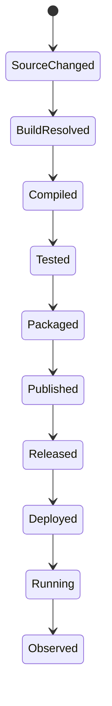
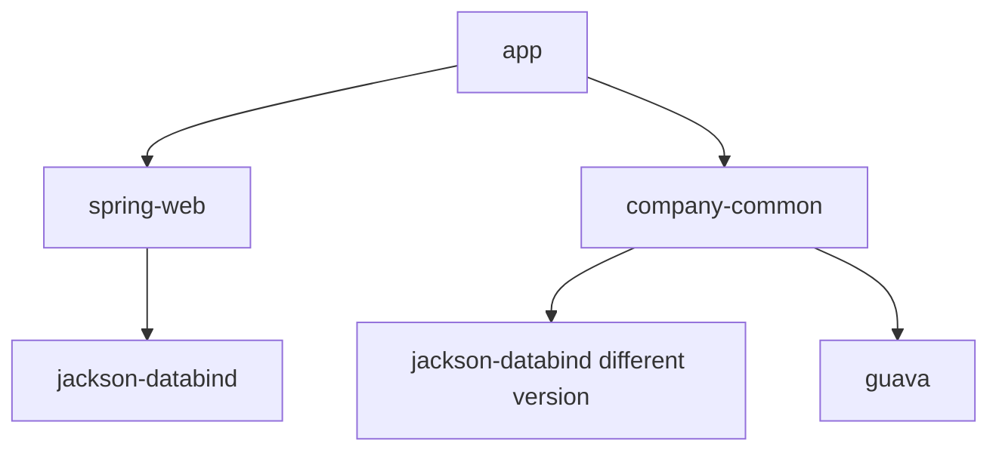
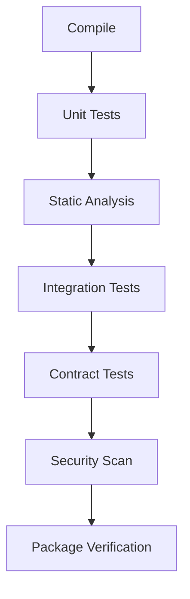
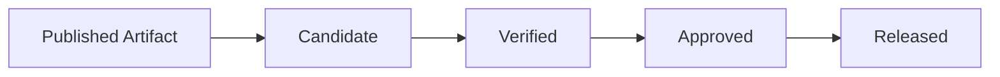
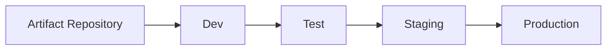
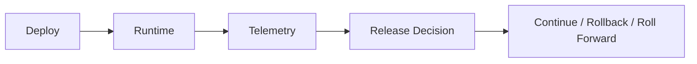

------
title: Learn Java Source, Package, Dependency, Build, Release & Deployment Engineering - Part 002
description: End-to-end Java artifact lifecycle from source code to runtime deployment, including build inputs, classpath/module-path, packaging, publishing, release promotion, and deployment drift.
series: learn-java-build-dependency-release-deployment
seriesTitle: Learn Java Source, Package, Dependency, Build, Release & Deployment Engineering
order: 2
partTitle: End-to-End Artifact Lifecycle
tags:
- java
- artifact-lifecycle
- build-engineering
- dependency-management
- release-engineering
- deployment
- ci-cd
date: 2026-06-28
---

# Part 002 — End-to-End Artifact Lifecycle Mental Model

## 1. Tujuan Part Ini

Part ini membangun mental model lengkap dari:

```text
.java file -> .class file -> packaged artifact -> published artifact -> released artifact -> deployed workload -> runtime behavior
```

Kita akan melihat lifecycle sebagai aliran perubahan yang harus dikendalikan.

Fokus kita bukan command. Fokus kita adalah **state transition**.

Sebuah Java system berubah melewati beberapa state:



Setiap transisi punya input, output, dan failure mode.

Top-tier engineer mampu men-debug lifecycle ini dari ujung ke ujung.

---

## 2. Big Picture: Java Artifact Lifecycle

Lifecycle umum:

```mermaid
flowchart LR
    A[Developer Change] --> B[Source Repository]
    B --> C[Build Tool]
    C --> D[Dependency Resolver]
    D --> E[Compiler]
    E --> F[Test and Quality Gates]
    F --> G[Packaging]
    G --> H[Artifact Repository]
    H --> I[Release Decision]
    I --> J[Environment Promotion]
    J --> K[Deployment Platform]
    K --> L[Runtime]
```



Bila dirinci:

| Stage | Output | Pertanyaan Kritis |
|---|---|---|
| Source | commit/tree | Apa yang berubah? |
| Resolve | dependency graph | Library versi mana yang dipakai? |
| Compile | `.class` | JDK/compiler mana yang menghasilkan bytecode? |
| Test | reports | Behavior apa yang divalidasi? |
| Package | JAR/WAR/image | Apa yang masuk artifact? |
| Publish | repository entry | Artifact immutable atau tidak? |
| Release | version/tag/approval | Apakah artifact dipercaya? |
| Promote | environment candidate | Artifact yang sama atau rebuild? |
| Deploy | workload | Runtime config apa yang dipakai? |
| Run | behavior | Apa yang benar-benar terjadi di production? |

---

## 3. Source State

Source state adalah titik awal.

Dalam engineering yang matang, source state bukan hanya file. Source state minimal mencakup:

- Git commit SHA
- branch/tag
- source tree
- build files
- wrapper files
- configuration template
- generated source policy
- test fixture
- documentation relevant to release

Contoh:

```text
commit: 8f4d2a9
branch: main
tag: invoice-service-1.4.2
build tool: Maven Wrapper 3.9.x
JDK target: 21
```

### 3.1 Source Is Not Enough

Dua build dari commit yang sama bisa menghasilkan artifact berbeda jika input lain berubah.

Contoh hidden input:

```text
Same commit
Different JDK
Different Maven/Gradle version
Different dependency repository state
Different environment variable
Different timezone
Different generated source timestamp
Different local cache
```

Karena itu, source commit adalah necessary but not sufficient.

### 3.2 Source Tree as Build Input

Build tool tidak membangun seluruh repository secara abstrak. Ia membangun berdasarkan rules.

Contoh Maven default:

```text
src/main/java
src/main/resources
src/test/java
src/test/resources
pom.xml
```

Contoh Gradle Java plugin default mirip:

```text
src/main/java
src/main/resources
src/test/java
src/test/resources
build.gradle(.kts)
settings.gradle(.kts)
```

Jika file berada di luar source set, build mungkin tidak melihatnya.

Failure mode:

```text
Developer menaruh file config di folder docs/sample-config.yml.
Runtime membutuhkan config itu.
Build tidak memasukkan file ke artifact.
Deployment gagal.
```

Root cause: source file ada di repository, tetapi bukan build input.

---

## 4. Build Configuration State

Build configuration adalah kontrak yang memberi tahu build tool:

- source mana yang dipakai
- dependency mana yang dibutuhkan
- plugin/task mana yang dijalankan
- target bytecode apa yang dibuat
- artifact apa yang dihasilkan
- repository mana yang digunakan
- test mana yang dijalankan

### 4.1 Maven Configuration

Maven configuration utama:

```text
pom.xml
.mvn/wrapper/maven-wrapper.properties
.mvn/maven.config
settings.xml
```

POM mendefinisikan project model.

Maven lifecycle menghubungkan phase seperti:

```text
validate -> compile -> test -> package -> verify -> install -> deploy
```

Command:

```bash
./mvnw clean verify
```

Bukan berarti hanya satu task. Maven menjalankan sequence phase sampai `verify`.

### 4.2 Gradle Configuration

Gradle configuration utama:

```text
settings.gradle.kts
build.gradle.kts
gradle/wrapper/gradle-wrapper.properties
gradle/libs.versions.toml
buildSrc/ or build-logic/
```

Gradle lifecycle secara umum:

```text
Initialization -> Configuration -> Execution
```

Command:

```bash
./gradlew build
```

Gradle akan:

1. menentukan participating projects
2. mengevaluasi build logic
3. membangun task graph
4. menjalankan task yang dibutuhkan

### 4.3 Build Configuration Is Executable Policy

Build file bukan hanya script teknis.

Ia adalah policy:

- dependency apa yang boleh masuk
- Java version apa yang dipakai
- test apa yang wajib lulus
- plugin apa yang dipercaya
- repository mana yang boleh diakses
- artifact seperti apa yang valid

Jika policy tidak dimasukkan ke build, policy itu hanya dokumentasi.

---

## 5. Dependency Resolution State

Sebelum compile, build tool harus menyelesaikan dependency graph.

Input:

- direct dependency declarations
- transitive dependency metadata
- scopes/configurations
- repositories
- BOM/platform/constraints
- exclusions/substitutions
- lock files atau verification metadata jika ada

Output:

- compile classpath
- runtime classpath
- test classpath
- annotation processor path
- plugin classpath

### 5.1 Dependency Declaration vs Resolved Dependency

Declaration:

```xml
<dependency>
  <groupId>com.fasterxml.jackson.core</groupId>
  <artifactId>jackson-databind</artifactId>
  <version>2.17.2</version>
</dependency>
```

Resolved graph bisa lebih besar:

```text
jackson-databind
  -> jackson-annotations
  -> jackson-core
```

Yang masuk classpath bukan hanya yang kita tulis langsung.

### 5.2 Direct and Transitive Risk

Dependency graph:



Jika dua jalur membawa library yang sama dengan versi berbeda, resolver akan memilih salah satu berdasarkan aturan tool.

Masalah bisa muncul saat:

- compile memakai satu versi
- runtime mendapatkan versi lain
- method yang dipanggil tidak ada di versi runtime

Symptom klasik:

```text
java.lang.NoSuchMethodError
```

Ini sering bukan bug source code langsung. Ini bug dependency resolution / binary compatibility.

### 5.3 Classpath Is Ordered and Dangerous

Classpath adalah daftar lokasi class/resource.

Jika ada duplicate class, classloader akan memilih berdasarkan urutan lookup.

Contoh:

```text
lib-a.jar contains com.example.JsonUtil
lib-b.jar contains com.example.JsonUtil
```

Jika keduanya masuk runtime classpath, behavior bisa bergantung pada order.

Rule:

> Duplicate class is an architecture smell, not just a warning.

### 5.4 Module Path Is Stricter

JPMS module path lebih eksplisit daripada classpath.

Module declaration:

```java
module com.company.invoice {
    requires com.company.billing.core;
    exports com.company.invoice.api;
    opens com.company.invoice.persistence to org.hibernate.orm.core;
}
```

Dengan module path, dependency dan exported package lebih jelas. Tetapi framework reflection perlu `opens`.

Keuntungan:

- reliable configuration
- strong encapsulation
- clearer dependencies

Trade-off:

- migration cost
- framework compatibility
- split package constraints
- build complexity

---

## 6. Compilation State

Compilation mengubah `.java` menjadi `.class`.

Input penting:

- source files
- generated source files
- compiler version
- release/target bytecode
- annotation processors
- compile classpath/module path
- compiler flags

Output:

```text
target/classes/**/*.class
build/classes/java/main/**/*.class
```

### 6.1 Java Version Has Multiple Meanings

Saat membicarakan “Java 21”, bisa berarti:

| Istilah | Arti |
|---|---|
| JDK running build | JDK yang menjalankan Maven/Gradle |
| javac version | compiler yang mengcompile source |
| source compatibility | syntax/API source yang diizinkan |
| target bytecode | versi bytecode `.class` |
| runtime JRE/JDK | JVM yang menjalankan artifact |
| toolchain | JDK yang dipilih build tool untuk compile/test |

Kesalahan umum:

```text
CI pakai JDK 21 untuk menjalankan Maven,
tetapi artifact ditargetkan untuk runtime Java 17,
dan developer memakai JDK 25 locally.
```

Tanpa toolchain policy, ini bisa menghasilkan behavior yang sulit ditebak.

### 6.2 Prefer `--release` Over Only `source`/`target`

Dalam Java modern, `--release` membantu memastikan code dikompilasi terhadap API platform release tertentu, bukan hanya menghasilkan bytecode target.

Contoh Maven compiler plugin concept:

```xml
<configuration>
  <release>21</release>
</configuration>
```

Contoh Gradle concept:

```kotlin
java {
    toolchain {
        languageVersion.set(JavaLanguageVersion.of(21))
    }
}
```

Rule:

> Pin both the toolchain and the intended platform level.

### 6.3 Annotation Processing as Compilation Side Channel

Annotation processors dapat menghasilkan code saat compile.

Contoh:

- MapStruct
- Lombok
- JPA metamodel generator
- AutoService
- Immutables

Masalahnya: processor adalah executable code di build time.

Risiko:

- processor tidak incremental
- processor bergantung pada classpath tertentu
- generated source berubah antar environment
- IDE dan CI berbeda behavior
- processor membawa vulnerability/plugin risk

Rule:

> Treat annotation processors as build-time dependencies with governance.

---

## 7. Test and Verification State

Setelah compile, build menjalankan verifikasi.

Layer umum:



Tidak semua layer harus berjalan di setiap commit dengan intensitas sama. Tetapi release pipeline harus punya confidence yang cukup.

### 7.1 Unit Test

Karakter:

- cepat
- isolated
- deterministic
- tidak butuh external service

Build implication:

- cocok untuk setiap commit
- failure harus dianggap serius
- flaky unit test adalah design smell

### 7.2 Integration Test

Karakter:

- melibatkan database/message broker/external process
- lebih lambat
- butuh environment setup

Build implication:

- butuh source set atau phase terpisah
- butuh lifecycle resource management
- cocok untuk `verify`, bukan hanya `test`

### 7.3 Contract Test

Karakter:

- memverifikasi compatibility antar service/library
- penting untuk release confidence

Build implication:

- artifact metadata harus jelas
- provider/consumer version harus traceable

### 7.4 Static and Security Gates

Gate umum:

- formatting
- linting
- static analysis
- dependency vulnerability scan
- license scan
- secret scan
- SBOM generation

Gate buruk:

```text
Gate selalu merah karena false positive.
Team lalu bypass gate.
```

Gate baik:

```text
Gate punya severity policy, owner, exception expiry, dan remediation workflow.
```

---

## 8. Packaging State

Packaging mengubah compiled output dan resource menjadi artifact.

Artifact umum di Java:

- plain JAR
- executable JAR
- fat/uber JAR
- shaded JAR
- WAR
- modular JAR
- source JAR
- javadoc JAR
- container image
- runtime image via `jlink`

### 8.1 Plain JAR

Plain JAR berisi class dan resource project sendiri.

```text
invoice-domain-1.4.2.jar
```

Cocok untuk:

- library
- internal module
- reusable component

Tidak membawa semua dependency.

### 8.2 Executable/Fat JAR

Executable/fat JAR membawa aplikasi dan dependency.

Cocok untuk:

- service deployment sederhana
- container entrypoint
- self-contained runtime package

Risiko:

- duplicate classes
- resource merge conflict
- signature files invalid setelah repackaging
- artifact besar

### 8.3 Shaded JAR

Shading memindahkan package dependency untuk menghindari conflict.

Contoh concept:

```text
com.google.common -> com.company.shadow.guava
```

Cocok untuk:

- library yang harus mengisolasi dependency internal
- tooling/agent

Risiko:

- stacktrace lebih sulit
- service loader/resource merge perlu hati-hati
- license attribution harus dijaga

### 8.4 WAR

WAR cocok jika deployment target adalah servlet container/application server.

Di Java modern microservice, WAR sering digantikan executable JAR/container image. Tetapi di enterprise legacy, WAR masih relevan.

Decision rule:

> Pilih WAR jika runtime platform memang app server bersama. Pilih executable/container packaging jika service membawa runtime sendiri.

### 8.5 Container Image

Container image bukan pengganti JAR. Ia deployment artifact yang membungkus runtime environment.

Image bisa berisi:

- OS layer/base image
- JRE/JDK layer
- application layer
- dependency layer
- config template
- entrypoint

Risiko:

- mutable tag
- terlalu banyak tool di image
- JDK penuh padahal runtime hanya butuh JRE
- dependency layer berubah terus
- secret masuk image

---

## 9. Artifact Identity

Artifact harus punya identity yang stabil.

Untuk Maven artifact:

```text
groupId:    com.company.billing
artifactId: invoice-service
version:    1.4.2
packaging:  jar
classifier: optional
```

Untuk container image:

```text
repository: registry.company.com/billing/invoice-service
tag:        1.4.2
digest:     sha256:...
```

Identity yang baik mencakup:

| Field | Fungsi |
|---|---|
| version | human-readable release coordinate |
| checksum/digest | machine-verifiable content identity |
| commit SHA | source traceability |
| build ID | CI traceability |
| timestamp | audit context |
| builder identity | supply-chain trust |
| SBOM | composition visibility |
| signature/provenance | tamper evidence |

### 9.1 Version Is Not Enough

Tag `1.4.2` mudah dibaca manusia, tetapi bisa mutable jika repository mengizinkan overwrite.

Digest/checksum lebih kuat karena mengacu ke content.

Rule:

> Use version for communication. Use digest/checksum for verification.

---

## 10. Publishing State

Publishing adalah memasukkan artifact ke repository/registry.

Target umum:

- Maven repository
- private artifact repository
- container registry
- release storage
- package registry

### 10.1 Snapshot vs Release

Snapshot:

```text
1.4.2-SNAPSHOT
```

Makna:

- mutable development artifact
- bisa berubah antar build
- cocok untuk integration sementara
- tidak cocok untuk production release

Release:

```text
1.4.2
```

Makna:

- immutable artifact
- tidak boleh overwrite
- harus traceable
- cocok untuk promotion

### 10.2 Repository as Trust Store

Artifact repository bukan sekadar file server.

Ia menyimpan:

- artifact binary
- metadata
- checksums
- signatures
- repository policy
- retention policy
- access control

Jika repository mengizinkan overwrite release artifact tanpa audit, release integrity lemah.

### 10.3 Publishing Is a Security Event

Saat artifact dipublish, ia bisa dikonsumsi oleh sistem lain.

Karena itu publishing harus memperhatikan:

- siapa boleh publish
- dari pipeline mana publish boleh terjadi
- artifact jenis apa yang boleh publish
- apakah tests/gates sudah lulus
- apakah metadata lengkap
- apakah signing/provenance tersedia

---

## 11. Release State

Release adalah transisi trust.



Release bukan hanya membuat version number.

Release minimal menjawab:

- artifact mana?
- commit mana?
- perubahan apa?
- test/gate apa yang lulus?
- dependency apa yang dibawa?
- vulnerability exception apa yang ada?
- environment mana yang menjadi target?
- rollback/roll-forward strategy apa?

### 11.1 Release Candidate

Release candidate adalah artifact yang dipertimbangkan untuk release.

Contoh:

```text
1.5.0-rc.1
1.5.0-rc.2
```

RC berguna ketika:

- verification panjang
- ada UAT
- ada regulated approval
- release window terbatas

### 11.2 Release Approval

Approval bisa otomatis atau manual.

Automated approval cocok jika:

- test coverage kuat
- blast radius kecil
- rollback cepat
- telemetry matang

Manual approval masih relevan jika:

- domain regulated
- perubahan high-risk
- customer impact besar
- coordinated release multi-system

Yang buruk bukan manual approval. Yang buruk adalah approval tanpa evidence.

### 11.3 Release Evidence

Release evidence ideal:

```text
Release: invoice-service 1.4.2
Commit: 8f4d2a9
Build: ci-2026-06-28-1042
JDK: 21.0.x
Maven/Gradle: wrapper-defined
Tests: unit/integration/contract passed
SBOM: attached
Vulnerability scan: no critical/high open
Artifact checksum: sha256:...
Container digest: sha256:...
Approved by: release policy / person
```

---

## 12. Promotion State

Promotion memindahkan artifact yang sama ke environment berikutnya.



Prinsip:

```text
Same artifact, different environment configuration.
```

Bukan:

```text
Same source, different rebuild.
```

### 12.1 Why Rebuild During Promotion Is Dangerous

Misal:

```text
Build A: staging
Build B: production
Same commit: yes
Same artifact: no
```

Perbedaan bisa berasal dari:

- repository dependency berubah
- plugin version dynamic
- timestamp berbeda
- generated code berbeda
- JDK patch berbeda
- base image berubah
- network dependency berubah

Jika production gagal, team tidak bisa yakin staging pernah menguji artifact production.

### 12.2 Promotion Metadata

Promotion harus mencatat:

- artifact identity
- source environment
- target environment
- approval
- timestamp
- config version
- deployment manifest version
- operator/pipeline identity

---

## 13. Deployment State

Deployment menjalankan artifact di environment.

Target umum:

- bare VM
- systemd service
- application server
- container runtime
- Kubernetes
- serverless container platform

Deployment membawa artifact bertemu dengan runtime inputs:

- environment variables
- config files
- secrets
- database
- network
- DNS
- service discovery
- certificates
- feature flags
- resource limits

### 13.1 Runtime Inputs Are Not Build Inputs

Artifact sebaiknya tidak dibuild ulang untuk environment.

Buruk:

```text
Build invoice-service-dev.jar
Build invoice-service-staging.jar
Build invoice-service-prod.jar
```

Lebih baik:

```text
Build invoice-service.jar once
Inject environment-specific config at runtime
```

Tetapi runtime config harus versioned dan auditable.

### 13.2 Deploy vs Release vs Enable

Tiga hal berbeda:

| Istilah | Arti |
|---|---|
| Deploy | Menjalankan artifact baru di environment |
| Release | Menjadikan capability tersedia/approved |
| Enable | Mengaktifkan behavior, sering via feature flag |

Contoh:

```text
Deploy code containing new pricing engine today.
Release to internal users tomorrow.
Enable for 5% customers next week.
```

Memisahkan tiga konsep ini memberi kontrol risiko lebih baik.

---

## 14. Runtime State

Runtime behavior adalah hasil akhir.

Artifact yang sama bisa berperilaku berbeda jika runtime input berbeda.

Contoh:

```text
Same JAR
Different JVM flags
Different memory limit
Different database schema
Different config
Different dependency mounted externally
Different timezone
```

### 14.1 Runtime Verification

Deployment sukses bukan berarti aplikasi sehat.

Minimal checks:

- process started
- readiness passed
- dependency reachable
- schema compatible
- critical endpoint works
- metrics emitted
- logs structured
- no error spike

### 14.2 Observed Runtime Closes the Loop

Lifecycle tidak selesai saat deploy.



Telemetry menjadi feedback untuk release decision.

---

## 15. Failure Model by Lifecycle Stage

| Stage | Failure | Typical Symptom | Root Cause Direction |
|---|---|---|---|
| Source | wrong files included | missing class/config | source set/layout |
| Resolve | wrong dependency version | `NoSuchMethodError` | conflict/mediation |
| Compile | wrong JDK target | unsupported class version | toolchain mismatch |
| Test | flaky test | intermittent CI failure | nondeterministic fixture |
| Package | missing resource | runtime config not found | packaging rule |
| Publish | overwritten artifact | checksum mismatch | repository policy |
| Release | wrong candidate | deployed old feature | tag/version mismatch |
| Promote | rebuild drift | staging OK prod fail | artifact identity mismatch |
| Deploy | wrong config | startup failure | env/config/secrets |
| Runtime | behavior regression | error spike | compatibility/config/data |

---

## 16. Example: Lifecycle of a Small Service

Misal service:

```text
invoice-service
```

Source layout:

```text
invoice-service/
  pom.xml
  src/main/java/com/company/billing/invoice/InvoiceApplication.java
  src/main/resources/application.yml
  src/test/java/com/company/billing/invoice/InvoiceCalculatorTest.java
```

Build command:

```bash
./mvnw clean verify
```

Output:

```text
target/invoice-service-1.0.0.jar
target/surefire-reports/
target/site/jacoco/
```

Publish:

```text
com.company.billing:invoice-service:1.0.0
```

Container:

```text
registry.company.com/billing/invoice-service:1.0.0
registry.company.com/billing/invoice-service@sha256:abc...
```

Release evidence:

```text
commit = 8f4d2a9
version = 1.0.0
artifact checksum = sha256:...
image digest = sha256:abc...
SBOM = invoice-service-1.0.0.cdx.json
```

Deploy:

```text
staging: invoice-service@sha256:abc...
production: invoice-service@sha256:abc...
```

Correct: same image digest.

Incorrect:

```text
staging: invoice-service:1.0.0 built at 10:00
production: invoice-service:1.0.0 rebuilt at 15:00
```

---

## 17. Artifact Lifecycle Invariants

Invariants adalah aturan yang harus selalu benar.

### Invariant 1 — Source Traceability

Setiap release artifact harus bisa ditelusuri ke source commit.

```text
artifact -> build -> commit
```

Jika tidak, incident analysis akan lemah.

### Invariant 2 — Dependency Traceability

Setiap release artifact harus bisa menjawab dependency apa yang dibawa.

```text
artifact -> SBOM/dependency tree
```

Jika tidak, vulnerability response akan lambat.

### Invariant 3 — Toolchain Traceability

Setiap build harus tahu toolchain-nya.

```text
artifact -> JDK/compiler/build tool/plugin versions
```

Jika tidak, reproducibility rendah.

### Invariant 4 — Artifact Immutability

Release artifact tidak boleh berubah setelah dipublish.

```text
same coordinate -> same content
```

Jika coordinate sama bisa menunjuk content berbeda, release trust rusak.

### Invariant 5 — Promotion Without Rebuild

Artifact yang diuji harus artifact yang dipromosikan.

```text
staging artifact digest == production artifact digest
```

Jika tidak, staging confidence tidak valid.

### Invariant 6 — Runtime Config Separation

Environment-specific config tidak boleh memaksa rebuild artifact.

```text
same artifact + different config = different deployment instance
```

Tetapi config tetap harus versioned/auditable.

### Invariant 7 — Release Evidence Completeness

Release harus punya evidence cukup untuk audit dan rollback.

```text
release -> commit + artifact + tests + approval + metadata
```

---

## 18. Anti-Patterns

### 18.1 Build Output Committed to Source

```text
src/main/generated checked in without generation rule
```

Masalah:

- source of truth ambigu
- generated code drift
- review noise
- conflict tinggi

Boleh dilakukan hanya jika ada alasan kuat dan rule jelas.

### 18.2 Dynamic Versions in Release Build

Contoh:

```text
1.+
latest.release
[1.0,2.0)
```

Masalah:

- resolved dependency bisa berubah tanpa source change
- reproducibility rendah
- incident sulit ditelusuri

Rule:

> Release builds should resolve fixed versions.

### 18.3 Environment-Specific Build

```bash
./build-prod.sh
./build-staging.sh
```

Jika script menghasilkan artifact berbeda untuk environment berbeda, artifact promotion hilang.

Lebih baik:

```text
build once
configure per environment
```

### 18.4 Local Cache Dependency

Build sukses karena artifact ada di local cache, tetapi repository remote tidak punya artifact itu.

Symptom:

```text
CI cannot resolve dependency
```

Root cause:

```text
Developer ran mvn install locally and forgot to publish internal dependency.
```

Rule:

> CI must be able to build from clean cache using declared repositories.

### 18.5 Test Skipping as Release Habit

```bash
mvn package -DskipTests
```

atau:

```bash
./gradlew assemble -x test
```

Skipping test untuk eksperimen lokal bisa diterima. Skipping test sebagai release default merusak trust boundary.

---

## 19. Lifecycle Debugging Playbook

Saat terjadi masalah, jangan langsung ubah build file. Ikuti playbook.

### Step 1 — Identify Artifact

Tanyakan:

```text
Artifact coordinate apa?
Version/tag apa?
Checksum/digest apa?
```

Jika tidak ada checksum/digest, identity lemah.

### Step 2 — Identify Source

```text
Commit mana?
Tag mana?
Branch mana?
Apakah working tree clean?
```

### Step 3 — Identify Build Environment

```text
JDK?
Maven/Gradle?
OS?
CI image?
Environment variables?
```

### Step 4 — Identify Dependency Graph

Maven:

```bash
./mvnw dependency:tree
```

Gradle:

```bash
./gradlew dependencies
./gradlew dependencyInsight --dependency <name>
```

### Step 5 — Identify Packaging Contents

Inspect JAR:

```bash
jar tf target/app.jar | head
```

Inspect image:

```bash
docker image inspect <image>
```

### Step 6 — Compare Staging vs Production

Bandingkan:

- artifact digest
- config version
- JVM flags
- environment variables
- database schema
- deployment manifest

### Step 7 — Classify Failure

Gunakan table:

```text
source / resolve / compile / test / package / publish / release / promote / deploy / runtime
```

Klasifikasi yang benar mempercepat remediation.

---

## 20. Lab: Trace One Artifact End-to-End

Ambil satu project Java. Lakukan latihan berikut.

### 20.1 Record Source Identity

```bash
git rev-parse HEAD
git status --short
```

Catat output.

### 20.2 Record Toolchain

```bash
java --version
./mvnw --version
# or
./gradlew --version
```

### 20.3 Build Artifact

Maven:

```bash
./mvnw clean verify
```

Gradle:

```bash
./gradlew clean build
```

### 20.4 Record Dependency Graph

Maven:

```bash
./mvnw dependency:tree > dependency-tree.txt
```

Gradle:

```bash
./gradlew dependencies > dependency-tree.txt
```

### 20.5 Record Artifact Checksum

```bash
sha256sum target/*.jar
# or
sha256sum build/libs/*.jar
```

### 20.6 Rebuild and Compare

Run build again.

```bash
sha256sum target/*.jar
# or
sha256sum build/libs/*.jar
```

Jika checksum berubah tanpa source change, cari hidden input.

### 20.7 Write Release Evidence

Buat file:

```text
release-evidence.md
```

Isi:

```md
# Release Evidence

- Artifact:
- Version:
- Commit:
- Build Tool:
- JDK:
- Dependency Tree File:
- Checksum:
- Test Result:
- Known Exceptions:
```

Latihan ini sederhana tetapi sangat kuat. Banyak team tidak bisa menghasilkan evidence seperti ini secara konsisten.

---

## 21. Checklist Part 002

Kamu memahami part ini jika bisa:

- menjelaskan lifecycle dari source sampai runtime
- membedakan source state, build state, dependency state, compile state, package state, release state, deployment state
- menjelaskan mengapa commit saja tidak cukup untuk reproducibility
- menjelaskan dependency declaration vs resolved graph
- menjelaskan classpath risk dan module path strictness
- menjelaskan artifact identity dengan version dan checksum/digest
- menjelaskan snapshot vs release
- menjelaskan build once, promote many
- menjelaskan deploy vs release vs enable
- memakai lifecycle debugging playbook

---

## 22. Key Takeaways

1. Java delivery adalah rangkaian state transition.
2. Source commit penting, tetapi tidak cukup untuk menjamin artifact reproducibility.
3. Dependency resolution adalah titik risiko besar karena resolved graph bisa lebih kompleks dari declaration.
4. Compilation bergantung pada JDK/toolchain, compiler flags, annotation processors, dan classpath/module path.
5. Packaging menentukan apa yang benar-benar masuk artifact.
6. Publishing artifact adalah security event.
7. Release adalah transisi trust berbasis evidence.
8. Promotion harus memakai artifact yang sama, bukan rebuild dari source yang sama.
9. Deployment mempertemukan artifact dengan runtime config dan infrastructure.
10. Lifecycle debugging harus dimulai dari artifact identity, bukan asumsi.

---

## References

- Apache Maven — Introduction to the Build Lifecycle: https://maven.apache.org/guides/introduction/introduction-to-the-lifecycle.html
- Apache Maven — Introduction to the Dependency Mechanism: https://maven.apache.org/guides/introduction/introduction-to-dependency-mechanism.html
- Gradle User Manual — Build Lifecycle: https://docs.gradle.org/current/userguide/build_lifecycle.html
- Gradle User Manual — Dependency Management: https://docs.gradle.org/current/userguide/dependency_management.html
- Gradle User Manual — Toolchains for JVM Projects: https://docs.gradle.org/current/userguide/toolchains.html
- OpenJDK JEP 261 — Module System: https://openjdk.org/jeps/261
- Dev.java — Modules: https://dev.java/learn/modules/
