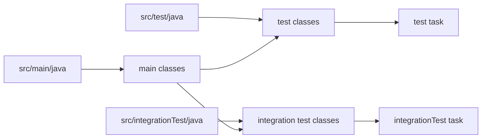
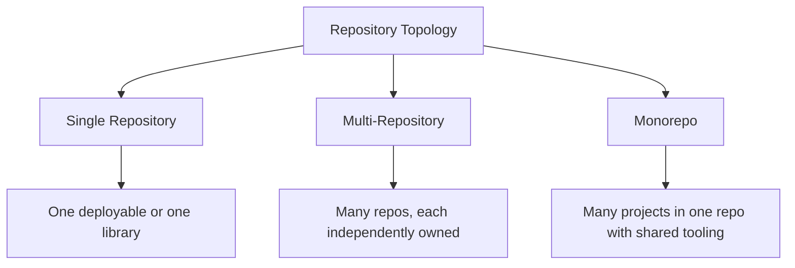
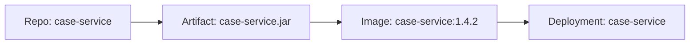
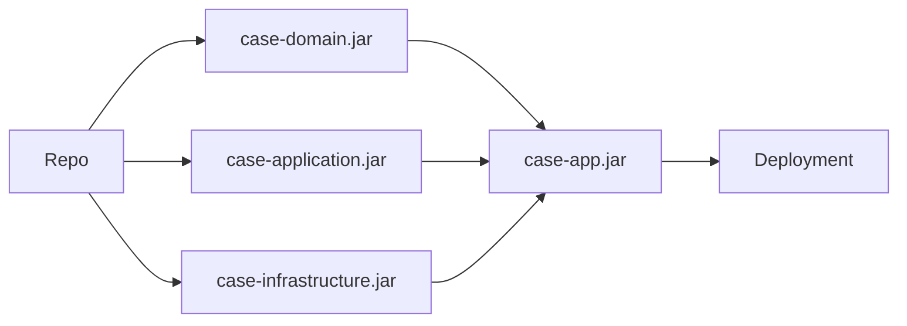
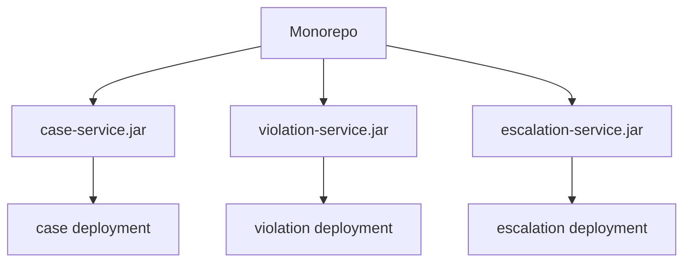
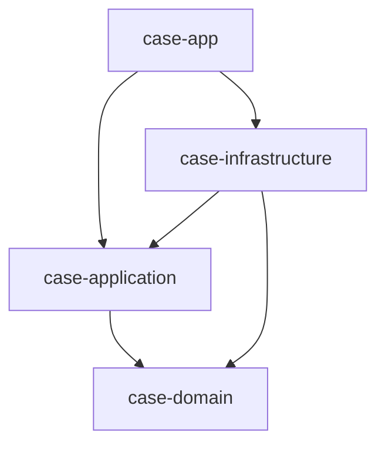
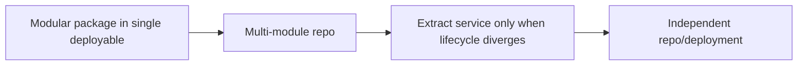
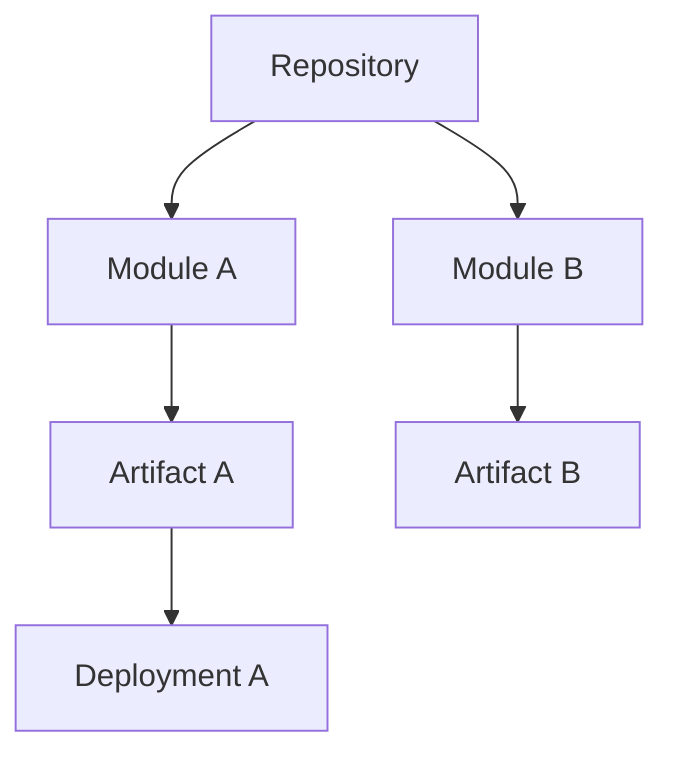

# Part 003 — Source Layout and Repository Topology

> **Goal:** setelah bagian ini, kita tidak lagi melihat struktur folder sebagai kosmetik. Kita melihatnya sebagai kontrak build, kontrak ownership, kontrak dependency, dan kontrak deployment.

Di level basic, struktur project Java sering dipahami seperti ini:

```text
src/main/java
src/test/java
pom.xml atau build.gradle
```

Itu benar, tapi belum cukup. Di sistem besar, layout source dan topology repository menentukan:

- seberapa mudah dependency graph dikendalikan;
- seberapa cepat build berjalan;
- seberapa jelas ownership antar-team;
- seberapa aman perubahan dilakukan;
- seberapa mudah artifact dipublish;
- seberapa mudah service direlease dan dideploy;
- seberapa defensible sistem ketika diaudit.

Apache Maven mendokumentasikan standard directory layout agar developer yang familiar dengan satu Maven project dapat cepat memahami project Maven lain. Gradle juga memiliki model multi-project build yang terdiri dari root project dan subprojects yang didefinisikan di `settings.gradle(.kts)`. Kita akan memakai prinsip tersebut sebagai baseline, lalu menaikkannya ke level engineering handbook.

Referensi utama:

- Maven Standard Directory Layout: <https://maven.apache.org/guides/introduction/introduction-to-the-standard-directory-layout.html>
- Gradle Multi-Project Builds: <https://docs.gradle.org/current/userguide/multi_project_builds.html>
- Gradle Structuring Multi-Project Builds: <https://docs.gradle.org/current/userguide/multi_project_builds_intermediate.html>

---

## 1. Kaufman Lens: Deconstruct the Skill

Menurut pendekatan Josh Kaufman, skill besar harus dipecah menjadi sub-skill yang bisa dilatih cepat. Untuk topik ini, skill “mendesain source layout dan repository topology” terdiri dari lima kemampuan kecil:

| Sub-skill | Pertanyaan inti | Output yang diharapkan |
|---|---|---|
| Source classification | Kode ini source utama, test, generated, fixture, script, atau deployment config? | Folder dan build input jelas |
| Boundary design | Mana boundary package, module, artifact, repo, dan deployable? | Struktur tidak ambigu |
| Ownership mapping | Siapa yang boleh mengubah bagian ini? | Ownership tidak tersembunyi di tribal knowledge |
| Build graph control | Bagian mana yang harus dibuild ketika satu file berubah? | Build cepat dan predictable |
| Evolution safety | Struktur ini bisa tumbuh tanpa rewrite besar? | Layout tahan perubahan |

Target kita bukan menghafal folder. Targetnya adalah mampu menjawab:

> “Jika sistem ini tumbuh 10x, apakah struktur source dan repository masih membuat perubahan lebih aman, bukan lebih berbahaya?”

---

## 2. Mental Model: Folder Is Not Architecture, but It Can Encode Architecture

Folder bukan arsitektur. Arsitektur adalah keputusan tentang boundary, dependency, responsibility, lifecycle, dan failure isolation.

Namun folder dapat **mengencode** keputusan arsitektur.

Contoh buruk:

```text
src/main/java/com/acme/app/controller
src/main/java/com/acme/app/service
src/main/java/com/acme/app/repository
src/main/java/com/acme/app/util
```

Struktur ini memberi tahu framework layer, tapi tidak memberi tahu domain capability. Ketika sistem tumbuh, semua fitur bercampur dalam `service`, semua persistence bercampur dalam `repository`, dan dependency antar-case menjadi tidak terlihat.

Contoh lebih baik untuk aplikasi domain-heavy:

```text
src/main/java/com/acme/enforcement/casefile
src/main/java/com/acme/enforcement/violation
src/main/java/com/acme/enforcement/escalation
src/main/java/com/acme/enforcement/appeal
src/main/java/com/acme/enforcement/shared
```

Struktur ini langsung menunjukkan capability. Layer tetap ada, tetapi dikandung di dalam capability:

```text
src/main/java/com/acme/enforcement/casefile/api
src/main/java/com/acme/enforcement/casefile/application
src/main/java/com/acme/enforcement/casefile/domain
src/main/java/com/acme/enforcement/casefile/infrastructure
```

Prinsipnya:

> Organisasi source harus membuat perubahan umum menjadi lokal, dan membuat dependency yang salah menjadi terlihat.

---

## 3. Standard Java Source Layout

Baseline modern Java project biasanya mengikuti bentuk ini:

```text
project-root/
  pom.xml                         # Maven
  build.gradle.kts                # Gradle Kotlin DSL
  settings.gradle.kts             # Gradle root project metadata
  src/
    main/
      java/
      resources/
    test/
      java/
      resources/
```

Maven standard layout secara umum mengenal:

```text
src/main/java          # application/library source
src/main/resources     # runtime resources packaged into artifact
src/test/java          # unit test source
src/test/resources     # test resources
src/main/webapp        # web application assets for WAR-style projects
```

Gradle Java plugin juga mengikuti konvensi source set `main` dan `test`, walaupun Gradle lebih mudah diperluas untuk source set tambahan.

### 3.1 `src/main/java`

Ini adalah source yang masuk ke artifact utama.

Ingat invariant ini:

> Semua class di `src/main/java` harus dianggap sebagai bagian dari artifact production, walaupun class tersebut tampaknya hanya helper.

Konsekuensinya:

- jangan taruh test helper di `src/main/java`;
- jangan taruh migration experiment yang belum dipakai;
- jangan taruh class debugging sementara;
- jangan taruh generator internal yang hanya dipakai build-time kecuali memang ingin masuk artifact;
- jangan taruh fake implementation untuk test.

Contoh buruk:

```text
src/main/java/com/acme/payment/FakePaymentGateway.java
src/main/java/com/acme/payment/TestClock.java
src/main/java/com/acme/payment/DebugDataSeeder.java
```

Nama-nama tersebut mungkin terlihat harmless, tetapi build akan menganggapnya production code.

### 3.2 `src/main/resources`

Isi folder ini ikut masuk ke classpath runtime.

Umumnya berisi:

```text
src/main/resources/application.yml
src/main/resources/logback.xml
src/main/resources/META-INF/services/...
src/main/resources/db/migration/...
src/main/resources/templates/...
```

Risiko utama `resources` adalah diam-diam menjadi tempat dumping ground.

Aturan praktis:

| Resource | Boleh? | Catatan |
|---|---:|---|
| config default aman | Ya | Jangan menyimpan secret |
| migration script | Ya | Harus versioned dan deterministic |
| template runtime | Ya | Jika benar-benar dibutuhkan runtime |
| test fixture | Tidak | Taruh di `src/test/resources` |
| local-only config | Tidak | Gunakan profile/env override |
| credential | Tidak | Gunakan secret manager/runtime injection |

### 3.3 `src/test/java`

Ini adalah source test yang tidak masuk artifact utama. Tapi bukan berarti boleh berantakan.

Test layout harus membantu navigasi behavior.

Pola umum:

```text
src/test/java/com/acme/enforcement/casefile/CaseFileLifecycleTest.java
src/test/java/com/acme/enforcement/casefile/CaseFileCommandHandlerTest.java
src/test/java/com/acme/enforcement/casefile/CaseFileRepositoryContractTest.java
```

Jangan hanya mencerminkan folder production secara buta. Tujuan test adalah menguji behavior, bukan mengulang struktur implementasi.

### 3.4 `src/test/resources`

Berisi resource untuk test:

```text
src/test/resources/fixtures/casefile/valid-case.json
src/test/resources/fixtures/casefile/invalid-case-missing-owner.json
src/test/resources/logback-test.xml
```

Invariant:

> Resource test tidak boleh dibutuhkan oleh production runtime.

Jika production code hanya jalan karena ada file di `src/test/resources`, build sedang menyembunyikan coupling yang salah.

---

## 4. Source Layout for Advanced Builds

Project enterprise jarang berhenti di `main` dan `test`. Biasanya ada kategori tambahan:

```text
src/integrationTest/java
src/integrationTest/resources
src/contractTest/java
src/e2eTest/java
src/generated/java
src/main/proto
src/main/openapi
src/main/avro
```

Tidak semua harus dibuat. Buat hanya ketika lifecycle-nya berbeda.

### 4.1 Kapan Membuat Source Set Baru?

Buat source set baru jika minimal satu dari ini benar:

| Alasan | Contoh |
|---|---|
| Classpath berbeda | integration test butuh Testcontainers, WireMock, database driver |
| Execution phase berbeda | unit test di setiap commit, integration test di pipeline tertentu |
| Artifact berbeda | generated client dipackage terpisah |
| Ownership berbeda | contract test milik platform team |
| Runtime berbeda | smoke test dijalankan setelah deploy |
| Cost berbeda | e2e test lambat, tidak boleh menghambat inner loop |

Jangan membuat source set baru hanya karena ingin folder terlihat rapi. Source set adalah build lifecycle boundary.

### 4.2 Example: Gradle Integration Test Source Set

```kotlin
plugins {
    java
}

sourceSets {
    create("integrationTest") {
        java.srcDir("src/integrationTest/java")
        resources.srcDir("src/integrationTest/resources")
        compileClasspath += sourceSets.main.get().output + configurations.testRuntimeClasspath.get()
        runtimeClasspath += output + compileClasspath
    }
}

tasks.register<Test>("integrationTest") {
    description = "Runs integration tests."
    group = "verification"
    testClassesDirs = sourceSets["integrationTest"].output.classesDirs
    classpath = sourceSets["integrationTest"].runtimeClasspath
    shouldRunAfter(tasks.test)
}
```

Mental model:



### 4.3 Example: Maven Integration Test Convention

Maven memiliki lifecycle phase yang umum dipakai untuk integration test:

```text
pre-integration-test
integration-test
post-integration-test
verify
```

Biasanya unit test dijalankan oleh Surefire, sedangkan integration test dijalankan oleh Failsafe.

```xml
<build>
  <plugins>
    <plugin>
      <groupId>org.apache.maven.plugins</groupId>
      <artifactId>maven-failsafe-plugin</artifactId>
      <version>3.5.3</version>
      <executions>
        <execution>
          <goals>
            <goal>integration-test</goal>
            <goal>verify</goal>
          </goals>
        </execution>
      </executions>
    </plugin>
  </plugins>
</build>
```

Common naming:

```text
*Test.java      # unit tests, Surefire
*IT.java        # integration tests, Failsafe
```

Jangan campur test lambat dan test cepat dalam task yang sama tanpa alasan. Itu menghancurkan feedback loop.

---

## 5. Repository Topology: The Real Architecture Boundary

Repository topology adalah keputusan tentang cara source code disimpan, dibuild, dimiliki, direview, direlease, dan dideploy.

Ada tiga bentuk besar:



Tidak ada topology yang selalu benar. Yang ada adalah fit terhadap organisasi, build system, release model, dan governance.

---

## 6. Single Repository

Single repository adalah bentuk paling sederhana:

```text
payment-service/
  build.gradle.kts
  settings.gradle.kts
  src/main/java/...
  src/test/java/...
```

Cocok untuk:

- satu service;
- satu library;
- satu deployable artifact;
- team kecil;
- lifecycle sederhana;
- dependency graph belum besar.

### Strengths

| Strength | Dampak |
|---|---|
| Mudah dipahami | Onboarding cepat |
| CI sederhana | Pipeline tidak banyak condition |
| Ownership jelas | Repo = team/service |
| Release jelas | Tag repo = release artifact |
| Tooling sederhana | Sedikit build convention |

### Weaknesses

| Weakness | Dampak |
|---|---|
| Shared code cenderung diduplikasi | Banyak util library informal |
| Cross-service refactor sulit | Perubahan harus koordinasi multi-repo |
| Dependency alignment manual | Versi internal library cepat drift |
| Discoverability rendah | Sulit melihat graph antar-service |

### Decision Rule

Gunakan single repo jika:

> Unit perubahan, ownership, build, release, dan deployment secara natural memang satu.

Jangan pecah repo hanya karena ingin terlihat microservice-oriented.

---

## 7. Multi-Repository

Multi-repository berarti setiap service/library biasanya punya repo sendiri:

```text
case-service/
violation-service/
escalation-service/
notification-client/
common-platform-lib/
```

Cocok untuk:

- banyak team;
- release independent;
- security isolation kuat;
- repositori berbeda punya compliance sensitivity berbeda;
- service lifecycle berbeda;
- vendor/team boundary nyata.

### Strengths

| Strength | Dampak |
|---|---|
| Ownership kuat | Setiap repo punya accountable team |
| Permission lebih granular | Security lebih mudah diatur |
| CI lebih kecil | Build repo biasanya cepat |
| Release independent | Service bisa bergerak sendiri |
| Failure isolation | Repo rusak tidak selalu memblokir semua |

### Weaknesses

| Weakness | Dampak |
|---|---|
| Cross-repo change mahal | Banyak PR harus disinkronkan |
| Dependency version drift | Internal API bisa pecah diam-diam |
| Tooling duplication | Banyak pipeline/build script copy-paste |
| Governance lemah jika tidak ada platform | Banyak style dan policy berbeda |
| Discovery sulit | Arsitektur tidak terlihat dari satu tempat |

### Failure Mode: Distributed Monolith in Multi-Repo Clothing

Multi-repo tidak otomatis berarti decoupled.

Tanda bahaya:

- setiap perubahan fitur butuh PR ke 5 repo;
- library internal berubah setiap minggu dan memaksa semua service upgrade;
- setiap service mengimpor domain model service lain;
- CI penuh dengan snapshot dependency;
- release satu service harus menunggu release semua service lain.

Itu bukan microservice. Itu monolith yang dipotong menjadi banyak repo tanpa boundary yang benar.

---

## 8. Monorepo

Monorepo berarti banyak project berada dalam satu repository besar:

```text
enterprise-platform/
  settings.gradle.kts
  services/
    case-service/
    violation-service/
    escalation-service/
  libraries/
    enforcement-domain/
    audit-client/
    workflow-client/
  build-logic/
  deployment/
```

Cocok untuk:

- banyak project dengan shared tooling kuat;
- refactor lintas project sering;
- internal platform maturity tinggi;
- dependency alignment harus ketat;
- team mampu mengelola build graph besar;
- CI mampu affected-build/test selection.

### Strengths

| Strength | Dampak |
|---|---|
| Cross-project refactor mudah | Satu PR bisa mengubah API dan consumers |
| Shared build logic mudah | Convention plugin/pipeline bisa dipusatkan |
| Dependency alignment kuat | Satu platform versioning policy |
| Discoverability tinggi | Graph terlihat dalam satu workspace |
| Atomic change | API + caller bisa berubah bersama |

### Weaknesses

| Weakness | Dampak |
|---|---|
| Build scalability sulit | Butuh cache, affected test, parallelism |
| Permission granularity sulit | Semua orang bisa melihat banyak hal |
| CI orchestration kompleks | Pipeline harus pintar |
| Repo operations berat | Clone/index/search bisa lambat |
| Governance harus matang | Kalau tidak, repo jadi landfill |

### Monorepo Is Not “One Big Project”

Monorepo yang sehat tetap memiliki boundary:

```text
enterprise-platform/
  services/case-service
  services/violation-service
  libs/audit-client
  libs/domain-events
  build-logic/java-conventions
```

Yang disatukan adalah storage dan tooling, bukan semua coupling.

---

## 9. Repository Boundary vs Artifact Boundary vs Deployment Boundary

Tiga boundary ini sering tertukar.

| Boundary | Arti | Contoh |
|---|---|---|
| Repository boundary | Lokasi source dan review | `case-service` repo |
| Artifact boundary | Unit build/publish | `case-service.jar`, `audit-client.jar` |
| Deployment boundary | Unit runtime rollout | Kubernetes deployment `case-service` |

Hubungannya bisa 1:1, tapi tidak selalu.

### 9.1 Simple Service



Ini sehat untuk banyak service.

### 9.2 Multi-Module Repo, One Deployable

```text
case-service/
  modules/
    case-domain/
    case-application/
    case-infrastructure/
    case-app/
```



Ini cocok jika internal modularization dibutuhkan, tetapi release/deployment tetap satu.

### 9.3 Monorepo, Many Deployables



Ini hanya sehat jika build tool bisa membuild affected projects saja dan release pipeline memahami dependency graph.

---

## 10. Layout Patterns for Java Applications

### 10.1 Package-by-Layer Layout

```text
src/main/java/com/acme/enforcement/
  controller/
  service/
  repository/
  dto/
  entity/
```

Cocok untuk:

- aplikasi kecil;
- CRUD sederhana;
- prototype;
- team kecil;
- domain complexity rendah.

Masalah di sistem besar:

- feature tersebar di banyak folder;
- semua service saling terlihat;
- package-private tidak membantu boundary domain;
- perubahan business process menyentuh banyak area;
- ownership per capability sulit.

### 10.2 Package-by-Feature Layout

```text
src/main/java/com/acme/enforcement/
  casefile/
    CaseFileController.java
    CaseFileService.java
    CaseFileRepository.java
  violation/
    ViolationController.java
    ViolationService.java
    ViolationRepository.java
```

Lebih baik karena locality meningkat.

Namun hati-hati: feature tidak selalu sama dengan domain capability. “Search”, “Dashboard”, “Export” mungkin cross-cutting, bukan bounded context.

### 10.3 Package-by-Capability Layout

```text
src/main/java/com/acme/enforcement/
  casefile/
    api/
    application/
    domain/
    infrastructure/
  violation/
    api/
    application/
    domain/
    infrastructure/
  escalation/
    api/
    application/
    domain/
    infrastructure/
```

Ini lebih cocok untuk sistem enterprise domain-heavy.

Keuntungannya:

- dependency lebih mudah dibatasi;
- package-private bisa berguna;
- ownership lebih jelas;
- test bisa dekat dengan capability;
- refactor lebih lokal;
- release notes bisa dipetakan ke capability.

---

## 11. Layout Patterns for Java Libraries

Library berbeda dari application. Library harus memikirkan public API, binary compatibility, documentation, dan consumer ergonomics.

Contoh layout library:

```text
audit-client/
  src/main/java/com/acme/audit/client/
    AuditClient.java
    AuditEvent.java
    AuditClientBuilder.java
  src/main/java/com/acme/audit/client/internal/
    DefaultAuditClient.java
    HttpAuditTransport.java
    JsonCodec.java
```

Prinsip:

- public API kecil;
- implementation detail masuk `internal`;
- jangan expose dependency implementation ke public types;
- jangan leak framework types jika tidak perlu;
- hindari public mutable model;
- dokumentasikan compatibility contract.

Contoh buruk:

```java
public interface AuditClient {
    org.springframework.web.client.RestTemplate restTemplate();
}
```

Ini membuat consumer API bergantung pada detail transport/framework.

Contoh lebih baik:

```java
public interface AuditClient {
    AuditReceipt publish(AuditEvent event);
}
```

---

## 12. Multi-Module Layout

Multi-module digunakan ketika satu repo menghasilkan beberapa artifact atau memiliki internal module boundary yang penting.

### 12.1 Maven Multi-Module Example

```text
case-platform/
  pom.xml
  case-domain/
    pom.xml
    src/main/java/...
  case-application/
    pom.xml
    src/main/java/...
  case-infrastructure/
    pom.xml
    src/main/java/...
  case-app/
    pom.xml
    src/main/java/...
```

Root `pom.xml`:

```xml
<project>
  <modelVersion>4.0.0</modelVersion>
  <groupId>com.acme.enforcement</groupId>
  <artifactId>case-platform</artifactId>
  <version>1.0.0-SNAPSHOT</version>
  <packaging>pom</packaging>

  <modules>
    <module>case-domain</module>
    <module>case-application</module>
    <module>case-infrastructure</module>
    <module>case-app</module>
  </modules>
</project>
```

### 12.2 Gradle Multi-Project Example

```text
case-platform/
  settings.gradle.kts
  build.gradle.kts
  case-domain/
    build.gradle.kts
  case-application/
    build.gradle.kts
  case-infrastructure/
    build.gradle.kts
  case-app/
    build.gradle.kts
```

`settings.gradle.kts`:

```kotlin
pluginManagement {
    repositories {
        gradlePluginPortal()
        mavenCentral()
    }
}

dependencyResolutionManagement {
    repositoriesMode.set(RepositoriesMode.FAIL_ON_PROJECT_REPOS)
    repositories {
        mavenCentral()
    }
}

rootProject.name = "case-platform"

include(
    "case-domain",
    "case-application",
    "case-infrastructure",
    "case-app"
)
```

### 12.3 Dependency Direction



Better invariant:

> Domain must not depend on application, infrastructure, framework, transport, or persistence implementation.

Build tools cannot fully enforce clean architecture, but module boundaries make violations harder to hide.

---

## 13. Generated Sources Layout

Generated source harus diperlakukan sebagai build output atau controlled source input, bukan campuran liar.

Common cases:

```text
src/main/proto
src/main/avro
src/main/openapi
build/generated/sources/annotationProcessor/java/main
build/generated/sources/openapi/java/main
```

Aturan praktis:

| Jenis generated code | Biasanya di-commit? | Catatan |
|---|---:|---|
| Annotation processor output | Tidak | Generated saat compile |
| OpenAPI client internal | Tergantung | Commit jika generator tidak stable atau consumer butuh review eksplisit |
| Protobuf generated Java | Biasanya tidak | Commit schema, bukan output |
| Avro generated classes | Tergantung | Banyak team commit schema saja |
| Codegen for published SDK | Kadang ya | Jika generated source adalah deliverable reviewed |

Invariant:

> Yang harus versioned adalah source of truth. Generated output hanya versioned jika output itu sendiri adalah artifact desain yang perlu direview.

Failure mode:

```text
schema berubah -> generated code tidak diregenerate -> CI tetap hijau karena generated code lama di-commit
```

Solusi:

- generate di CI;
- fail build jika generated output berbeda;
- pin generator version;
- dokumentasikan source of truth;
- jangan mencampur manual edit di generated code.

---

## 14. Build Scripts and Build Logic Location

Build logic juga source code. Jangan perlakukan sebagai konfigurasi acak.

### 14.1 Maven Build Logic

Maven biasanya memakai:

```text
pom.xml
parent-pom/
corporate-bom/
```

Common enterprise pattern:

```text
platform-parent/
  pom.xml              # pluginManagement, repositories, policies
platform-bom/
  pom.xml              # dependencyManagement only
service-repo/
  pom.xml              # inherits parent, imports BOM
```

Pisahkan parent POM dan BOM jika memungkinkan:

| Artifact | Responsibility |
|---|---|
| Parent POM | Build behavior, plugin config, organization defaults |
| BOM | Dependency version alignment |

Jangan paksa consumer library menginherit parent hanya untuk mendapat dependency versions.

### 14.2 Gradle Build Logic

Gradle enterprise pattern:

```text
root/
  settings.gradle.kts
  build.gradle.kts
  build-logic/
    settings.gradle.kts
    convention-plugins/
      src/main/kotlin/acme.java-library-conventions.gradle.kts
      src/main/kotlin/acme.java-application-conventions.gradle.kts
```

Gunakan convention plugins untuk menghindari copy-paste:

```kotlin
plugins {
    id("acme.java-application-conventions")
}
```

Build script yang sehat pendek. Build logic yang kompleks harus dimodularisasi dan dites.

---

## 15. Deployment Files in Repository

Deployment config bisa berada di repo yang sama atau repo terpisah.

### 15.1 App Repo Contains Deployment Config

```text
case-service/
  src/main/java/...
  deploy/
    helm/
    k8s/
```

Cocok jika:

- team yang sama memiliki app dan deployment;
- release app dan deployment config harus berubah bersama;
- platform belum memisahkan GitOps repo.

Risiko:

- application repo terlalu banyak concern;
- environment-specific config bocor;
- security permission lebih sulit.

### 15.2 Separate Deployment Repo

```text
case-service/           # source + build
platform-deployments/   # manifests/helm/kustomize/gitops
```

Cocok jika:

- platform team mengelola deployment policy;
- GitOps digunakan;
- production access harus dibatasi;
- release promotion explicit.

Risiko:

- app change dan deployment change tidak atomic;
- traceability harus dijaga;
- version pinning wajib rapi.

### 15.3 Recommended Invariant

> Artifact version harus eksplisit di deployment config. Jangan deploy floating branch atau mutable snapshot ke production.

---

## 16. Naming Conventions

Naming adalah governance murah.

### 16.1 Repository Names

Gunakan nama yang menunjukkan responsibility:

```text
case-service
violation-service
escalation-worker
audit-client
enforcement-domain
java-platform-bom
java-build-conventions
```

Hindari:

```text
backend
common
new-service
service2
utils
core
```

Nama seperti `common`, `core`, dan `utils` biasanya menandakan boundary belum dipikirkan.

### 16.2 Module Names

Module harus menunjukkan artifact atau capability:

```text
case-domain
case-application
case-infrastructure
case-app
audit-client
workflow-client
```

Jangan membuat module berdasarkan teknologi saja jika domain boundary lebih penting:

```text
controllers
services
repositories
models
```

### 16.3 Package Names

Package mengikuti reverse domain name convention, lalu domain/capability:

```text
com.acme.enforcement.casefile
com.acme.enforcement.violation
com.acme.enforcement.escalation
```

Lebih detail dibahas di Part 004.

---

## 17. Ownership Mapping

Struktur source yang bagus memudahkan ownership.

Contoh CODEOWNERS:

```text
/services/case-service/        @acme/case-team
/services/violation-service/   @acme/violation-team
/libs/audit-client/            @acme/platform-team
/build-logic/                  @acme/build-platform-team
```

Ownership harus dipetakan ke boundary yang stabil, bukan ke orang individual.

Jangan:

```text
/src/main/java/com/acme/app/service/CaseService.java @john
```

Lebih baik:

```text
/src/main/java/com/acme/enforcement/casefile/ @acme/case-team
```

Ownership yang baik menjawab:

- siapa reviewer yang tepat;
- siapa yang bertanggung jawab atas breakage;
- siapa yang boleh mengubah public contract;
- siapa yang memutuskan deprecation;
- siapa yang approve dependency baru.

---

## 18. Source Layout as Change Locality

Struktur baik membuat perubahan umum menjadi lokal.

Contoh requirement:

> “Tambahkan escalation reason baru ketika enforcement case melewati SLA.”

Pada package-by-layer:

```text
controller/EscalationController.java
service/EscalationService.java
service/CaseService.java
repository/EscalationRepository.java
dto/EscalationRequest.java
entity/EscalationEntity.java
```

Perubahan tersebar lintas folder teknis.

Pada package-by-capability:

```text
escalation/application/EscalationPolicyService.java
escalation/domain/EscalationReason.java
escalation/infrastructure/EscalationRepository.java
casefile/domain/CaseSlaStatus.java
```

Masih mungkin lintas capability, tetapi dependency lebih terlihat. Perubahan domain tampak sebagai perubahan domain, bukan sekadar service/repository edit.

---

## 19. Structural Smells

### 19.1 `common` Package/Module Smell

```text
com.acme.common
```

Masalah:

- boundary terlalu luas;
- ownership tidak jelas;
- dependency selalu bertambah;
- breaking change sulit diprediksi;
- semua orang merasa boleh menaruh apa saja.

Alternatif:

```text
com.acme.audit
com.acme.money
com.acme.time
com.acme.identity
com.acme.workflow
```

Beri nama berdasarkan capability atau semantic type.

### 19.2 `utils` Smell

```java
public final class StringUtils { ... }
public final class DateUtils { ... }
public final class JsonUtils { ... }
```

Kadang utility valid. Tetapi banyak utility class adalah domain concept yang gagal diberi nama.

Contoh:

```java
SlaUtils.calculateDeadline(caseFile)
```

Lebih baik:

```java
SlaPolicy.calculateDeadlineFor(caseFile)
```

### 19.3 `shared` Smell

`shared` lebih baik daripada `common` hanya jika didefinisikan ketat.

Boleh:

```text
shared/kernel
shared/testing
shared/contracts
```

Berbahaya:

```text
shared/Everything.java
```

### 19.4 Repo per Layer Smell

```text
enforcement-controllers
enforcement-services
enforcement-repositories
```

Ini hampir selalu buruk. Repository boundary harus mengikuti lifecycle/ownership/deployment, bukan layer teknis.

### 19.5 Build Script Copy-Paste Smell

Jika 20 repo punya file build identik dengan sedikit variasi, governance build belum matang.

Solusi:

- Maven parent POM + BOM;
- Gradle convention plugins;
- shared CI templates;
- policy checks.

---

## 20. Decision Matrix

| Context | Recommended topology | Reason |
|---|---|---|
| Satu service sederhana | Single repo | Simplicity |
| Library reusable kecil | Single repo | API/release jelas |
| Banyak service independent | Multi-repo | Ownership/release independent |
| Banyak service dengan refactor lintas-project sering | Monorepo | Atomic change |
| Enterprise dengan strong platform team | Monorepo atau governed multi-repo | Tooling bisa dikendalikan |
| Regulated system dengan strict access boundary | Multi-repo | Permission dan audit lebih mudah |
| Product line dengan shared domain kernel | Monorepo atau multi-module repo | Alignment penting |
| Legacy monolith ingin modularisasi | Multi-module repo | Boundary dulu, deployment belakangan |

---

## 21. Practical Design Exercise

Bayangkan sistem enforcement lifecycle:

- case intake;
- violation assessment;
- escalation;
- appeal;
- audit trail;
- notification;
- reporting.

### Option A: One Service Repo

```text
enforcement-service/
  src/main/java/com/acme/enforcement/
    casefile/
    violation/
    escalation/
    appeal/
    audit/
    notification/
```

Bagus jika deployable masih satu dan team masih sama.

### Option B: Multi-Module Repo

```text
enforcement-platform/
  case-domain/
  case-application/
  case-app/
  audit-client/
  workflow-client/
```

Bagus jika ingin modularisasi internal dan artifact reuse.

### Option C: Multi-Repo Services

```text
case-service/
violation-service/
escalation-service/
appeal-service/
audit-service/
notification-service/
```

Bagus hanya jika setiap service punya lifecycle, data ownership, dan deployment reason yang benar-benar berbeda.

### Recommended Evolution



Jangan mulai dengan service extraction hanya karena ingin “microservices”. Mulai dari boundary yang benar, lalu extract ketika lifecycle membutuhkan.

---

## 22. Implementation Checklist

Gunakan checklist ini ketika mendesain atau mereview repo Java.

### Source Layout

- [ ] `src/main/java` hanya berisi production source.
- [ ] `src/main/resources` tidak menyimpan secret.
- [ ] `src/test/java` tidak bocor ke production artifact.
- [ ] Test fixture berada di `src/test/resources` atau dedicated fixture module.
- [ ] Generated source memiliki source of truth jelas.
- [ ] Source set tambahan dibuat karena lifecycle berbeda, bukan karena kosmetik.

### Repository Boundary

- [ ] Repo boundary sesuai ownership nyata.
- [ ] Repo boundary sesuai release/deployment lifecycle.
- [ ] Tidak ada repo-per-layer.
- [ ] Tidak ada `common` repo tanpa policy ketat.
- [ ] Cross-repo change frequency dipahami.
- [ ] Access control dan audit need dipertimbangkan.

### Build Boundary

- [ ] Module boundary mencerminkan artifact/dependency boundary.
- [ ] Build logic tidak copy-paste liar.
- [ ] Tool version dipin via Maven/Gradle Wrapper.
- [ ] CI bisa menjalankan partial build jika repo besar.
- [ ] Dependency graph antar-module jelas.

### Evolution Safety

- [ ] Struktur bisa tumbuh tanpa memindahkan semuanya.
- [ ] Ownership bisa ditambahkan via CODEOWNERS.
- [ ] Release model tidak ambigu.
- [ ] Deployment config punya traceability ke artifact version.

---

## 23. Common Interview-Level Questions

### Q1: “Apakah selalu buruk memakai package-by-layer?”

Tidak. Package-by-layer bisa cukup untuk CRUD kecil dan prototype. Masalahnya muncul ketika domain kompleks dan banyak capability tumbuh. Pada titik itu, package-by-layer membuat change locality buruk dan ownership kabur.

### Q2: “Kapan multi-module lebih baik daripada multi-repo?”

Ketika boundary internal dibutuhkan, tetapi release/deployment masih satu lifecycle atau perubahan lintas-module masih sering harus atomic.

### Q3: “Kapan monorepo buruk?”

Ketika organisasi belum punya build platform, cache strategy, ownership discipline, dan CI affected-change mechanism. Tanpa itu, monorepo menjadi repo besar yang lambat dan chaos.

### Q4: “Apakah setiap service harus repo sendiri?”

Tidak. Service boundary adalah runtime/deployment boundary. Repo boundary adalah source/review/ownership boundary. Mereka sering 1:1, tapi tidak wajib.

### Q5: “Apa tanda struktur repo sudah salah?”

Tanda paling kuat: perubahan kecil menyentuh banyak folder/repo tanpa alasan domain yang jelas, atau semua dependency baru masuk ke `common`.

---

## 24. Deliberate Practice

Lakukan latihan ini selama 45–60 menit.

### Exercise 1 — Classify Source Inputs

Ambil satu repo Java. Buat tabel:

| Path | Classification | Included in production artifact? | Owner | Risk |
|---|---|---:|---|---|
| `src/main/java/...` | production source | yes | app team | high |
| `src/test/resources/...` | test fixture | no | app team | medium |
| `src/main/openapi/...` | contract source | maybe | platform/app | high |

Cari minimal 5 file yang lokasinya salah.

### Exercise 2 — Draw Boundary Map

Buat diagram:



Tanyakan:

- apakah repo boundary = artifact boundary?
- apakah artifact boundary = deployment boundary?
- apakah itu disengaja?

### Exercise 3 — Remove `common`

Cari package/module bernama `common`, `shared`, `core`, atau `utils`.

Untuk setiap class, rename secara konseptual ke capability yang lebih spesifik.

Contoh:

```text
common/DateUtils.java -> sla/SlaDeadlineCalculator.java
common/UserContext.java -> identity/AuthenticatedPrincipal.java
common/JsonUtils.java -> serialization/JsonCodec.java
```

---

## 25. Summary

Struktur source dan repository bukan sekadar pilihan estetika. Ia menentukan bagaimana sistem berubah.

Mental model utama:

1. `src/main/java` adalah production artifact input.
2. `src/test/java` adalah verification input.
3. Source set tambahan adalah lifecycle boundary.
4. Repository boundary harus mengikuti ownership/release/deployment reality.
5. Module boundary harus membuat dependency yang salah lebih sulit disembunyikan.
6. Package-by-capability lebih tahan untuk sistem domain-heavy daripada package-by-layer.
7. `common`, `utils`, dan `shared` harus dicurigai sampai terbukti punya semantic boundary.
8. Monorepo, multi-repo, dan single repo bukan ideology; semuanya trade-off.

Di part berikutnya, kita akan masuk lebih presisi ke **Java packages sebagai architecture boundary**: bagaimana package membantu access control, API design, dependency direction, encapsulation, dan evolusi modular sebelum kita masuk JPMS.
