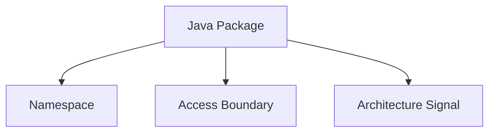
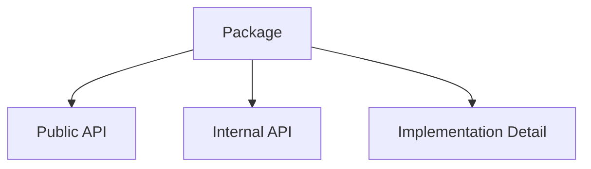
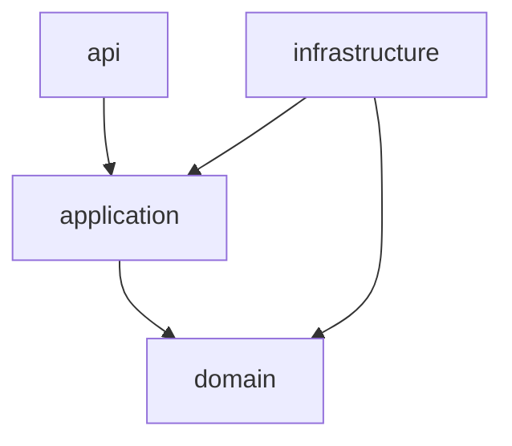
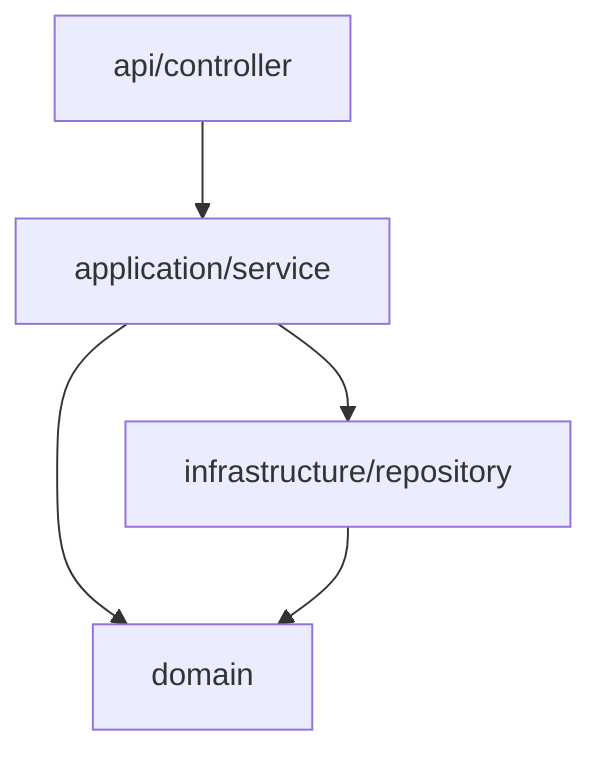
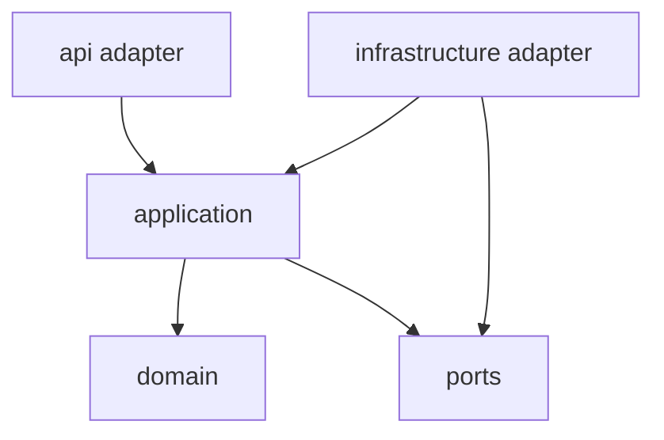

# Part 004 — Java Packages as Architecture Boundaries

> **Goal:** setelah bagian ini, kita tidak lagi melihat `package` sebagai formalitas di bagian atas file Java. Kita melihat package sebagai namespace, access-control boundary, dependency signal, API surface, dan alat untuk menjaga evolusi sistem.

Package sering dianggap sederhana:

```java
package com.acme.enforcement.casefile;
```

Padahal di sistem besar, package menjawab pertanyaan serius:

- class ini milik capability apa?
- siapa yang boleh memanggil class ini?
- bagian mana yang public API?
- bagian mana implementation detail?
- dependency direction yang benar ke mana?
- apakah boundary domain bisa ditegakkan tanpa framework tambahan?
- apakah module/library ini bisa dievolusi tanpa memecahkan consumer?

Oracle Java Tutorial mendefinisikan package sebagai grouping of related types yang menyediakan access protection dan namespace management. Java Language Specification juga membahas packages dan modules sebagai struktur bahasa, termasuk named package dan unnamed package. Kita akan memakai fakta bahasa tersebut sebagai dasar, lalu membangun praktik arsitektural di atasnya.

Referensi utama:

- Oracle Java Tutorial — Creating and Using Packages: <https://docs.oracle.com/javase/tutorial/java/package/packages.html>
- Oracle Java Tutorial — Access Control: <https://docs.oracle.com/javase/tutorial/java/javaOO/accesscontrol.html>
- Java Language Specification, Chapter 7 — Packages and Modules: <https://docs.oracle.com/javase/specs/jls/se17/html/jls-7.html>

---

## 1. Kaufman Lens: What Are We Actually Practicing?

Skill ini bukan “tahu syntax package”. Syntax hanya permukaan.

Skill sebenarnya:

| Sub-skill | Kemampuan |
|---|---|
| Namespace design | Memberi nama package yang stabil dan bermakna |
| Encapsulation design | Memutuskan apa yang public, package-private, internal, dan hidden |
| Dependency direction | Mengatur siapa boleh bergantung pada siapa |
| API surface control | Menjaga public API tetap kecil dan jelas |
| Evolution safety | Mengubah struktur package tanpa merusak consumer |
| Build/module alignment | Menyiapkan package agar cocok dengan JPMS, Maven/Gradle module, dan artifact boundary |

Kaufman-style target:

> Dalam 20 jam latihan fokus, kita ingin mampu melihat package tree dan langsung mendeteksi coupling, leakage, naming smell, ownership ambiguity, dan future migration risk.

---

## 2. Package Has Three Jobs

Package punya tiga pekerjaan utama.



### 2.1 Package as Namespace

Package mencegah nama class bertabrakan.

Tanpa package:

```java
class Case {}
class User {}
class Service {}
```

Dengan package:

```java
com.acme.enforcement.casefile.CaseFile
com.acme.identity.user.UserAccount
com.acme.workflow.service.WorkflowClient
```

Nama package memberi konteks semantic. `CaseFile` lebih jelas daripada `Case` karena domain-nya enforcement case management.

### 2.2 Package as Access Boundary

Java memiliki package-private access jika tidak ada modifier eksplisit:

```java
final class CaseFileValidator {
    boolean isValid(CaseFile caseFile) {
        return caseFile.ownerId() != null;
    }
}
```

Class ini hanya bisa diakses dari package yang sama.

Itu sangat berguna untuk menyembunyikan implementation detail tanpa membuat nested class besar atau framework magic.

### 2.3 Package as Architecture Signal

Package tree menunjukkan cara sistem berpikir.

```text
com.acme.enforcement.casefile
com.acme.enforcement.violation
com.acme.enforcement.escalation
```

Ini memberi sinyal domain capability.

Bandingkan dengan:

```text
com.acme.app.service
com.acme.app.repository
com.acme.app.dto
```

Ini memberi sinyal layer teknis, tetapi tidak memberi tahu business capability.

---

## 3. Package Naming: Stable, Semantic, and Boring

Package name sebaiknya membosankan. Ia bukan tempat kreativitas.

### 3.1 Basic Convention

Umumnya:

```text
<reverse-domain>.<organization/product>.<capability>.<sub-area>
```

Contoh:

```text
com.acme.enforcement.casefile
com.acme.enforcement.violation
com.acme.enforcement.escalation
com.acme.enforcement.appeal
```

### 3.2 Avoid Technology-First Names

Kurang baik:

```text
com.acme.enforcement.spring
com.acme.enforcement.hibernate
com.acme.enforcement.kafka
```

Lebih baik:

```text
com.acme.enforcement.casefile.infrastructure.persistence
com.acme.enforcement.casefile.infrastructure.messaging
```

Framework adalah implementation detail. Package root sebaiknya domain/capability-first.

### 3.3 Avoid Organization Chart Names

Kurang baik:

```text
com.acme.teamalpha.case
com.acme.teambeta.violation
```

Team berubah. Domain concept lebih stabil.

Gunakan CODEOWNERS atau metadata untuk ownership, bukan package name.

### 3.4 Avoid Temporal Names

Kurang baik:

```text
com.acme.enforcement.newcase
com.acme.enforcement.casev2
com.acme.enforcement.legacy
```

Nama temporal membusuk. Yang “new” akan menjadi old.

Lebih baik:

```text
com.acme.enforcement.casefile
com.acme.enforcement.casefile.migration
com.acme.enforcement.casefile.compatibility
```

---

## 4. Package-by-Layer vs Package-by-Feature vs Package-by-Capability

Ini bukan sekadar preferensi style. Ini memengaruhi evolusi sistem.

### 4.1 Package-by-Layer

```text
com.acme.enforcement.controller
com.acme.enforcement.service
com.acme.enforcement.repository
com.acme.enforcement.dto
com.acme.enforcement.entity
```

Kelebihan:

- mudah dipahami pemula;
- cocok untuk CRUD kecil;
- framework mapping terlihat jelas;
- struktur awal cepat.

Kelemahan:

- feature tersebar;
- package-private tidak membantu domain boundary;
- service package cepat menjadi god package;
- ownership per capability sulit;
- coupling domain tersembunyi.

### 4.2 Package-by-Feature

```text
com.acme.enforcement.casefile
com.acme.enforcement.violation
com.acme.enforcement.escalation
```

Lebih baik karena locality meningkat.

Namun “feature” bisa terlalu UI/product-oriented. Misalnya `dashboard`, `export`, dan `search` bisa menjadi feature lintas-domain.

### 4.3 Package-by-Capability

```text
com.acme.enforcement.casefile
com.acme.enforcement.violation
com.acme.enforcement.escalation
com.acme.enforcement.appeal
```

Capability lebih stabil karena dekat dengan domain responsibility.

Di dalam capability, layer boleh ada:

```text
com.acme.enforcement.casefile.api
com.acme.enforcement.casefile.application
com.acme.enforcement.casefile.domain
com.acme.enforcement.casefile.infrastructure
```

Ini memberikan dua keuntungan:

1. locality berdasarkan business change;
2. struktur internal tetap terbaca.

---

## 5. Package as Encapsulation Tool

Java menyediakan empat access level penting:

| Modifier | Scope |
|---|---|
| `public` | Semua caller yang bisa melihat type/classpath/module |
| `protected` | Package yang sama + subclass dengan aturan tertentu |
| package-private | Package yang sama |
| `private` | Class yang sama |

Package-private adalah tool desain yang sering diremehkan.

### 5.1 Example: Keep Domain Policy Internal

```text
com.acme.enforcement.casefile.domain
  CaseFile.java
  CaseFileStatus.java
  CaseFilePolicy.java          # package-private
  CaseFileTransitionGuard.java # package-private
```

```java
package com.acme.enforcement.casefile.domain;

public final class CaseFile {
    private CaseFileStatus status;

    public void submit() {
        CaseFileTransitionGuard.ensureCanSubmit(this);
        this.status = CaseFileStatus.SUBMITTED;
    }
}
```

```java
package com.acme.enforcement.casefile.domain;

final class CaseFileTransitionGuard {
    static void ensureCanSubmit(CaseFile caseFile) {
        if (caseFile.status() != CaseFileStatus.DRAFT) {
            throw new IllegalStateException("Only draft case files can be submitted");
        }
    }
}
```

`CaseFileTransitionGuard` tidak perlu public. Ia implementation detail dari package domain.

### 5.2 Public Is a Promise

Setiap `public` type adalah janji.

Dalam library, public type adalah consumer contract. Dalam aplikasi, public type tetap memperbesar coupling internal.

Jangan default ke `public` hanya karena IDE membuatnya begitu.

Bad:

```java
public class CaseFileTransitionGuard { ... }
public class CaseFileValidator { ... }
public class CaseFileStatusMapper { ... }
```

Better:

```java
final class CaseFileTransitionGuard { ... }
final class CaseFileValidator { ... }
final class CaseFileStatusMapper { ... }
```

Expose hanya facade yang memang boleh dipakai package lain:

```java
public final class CaseFileService { ... }
```

---

## 6. Designing Public API and Internal API

Dalam Java package design, bedakan tiga surface:



### 6.1 Public API

Public API adalah bagian yang consumer boleh pakai.

Contoh library:

```text
com.acme.audit.client
  AuditClient.java
  AuditClientBuilder.java
  AuditEvent.java
  AuditReceipt.java
```

### 6.2 Internal API

Internal API boleh dipakai antar-package internal, tetapi tidak dijanjikan untuk consumer eksternal.

Konvensi umum:

```text
com.acme.audit.client.internal
```

Tetapi `internal` hanya konvensi jika belum memakai JPMS atau static analysis. Class `public` di package `internal` tetap bisa dipakai consumer jika ada di classpath.

Contoh:

```java
package com.acme.audit.client.internal;

public final class DefaultAuditClient implements AuditClient {
    ...
}
```

Ini mungkin harus public karena konstruktor/framework/test, tetapi consumer tidak seharusnya memakainya.

Jika memakai JPMS, kita bisa tidak meng-`exports` package internal. Itu akan dibahas di Part 005.

### 6.3 Implementation Detail

Implementation detail sebaiknya package-private jika memungkinkan:

```java
final class AuditJsonCodec { ... }
final class AuditHttpTransport { ... }
```

Rule:

> Public API harus kecil, internal API harus jelas, implementation detail harus susah dipakai dari luar.

---

## 7. Package-Level Invariants

Package yang sehat punya invariant.

Contoh package:

```text
com.acme.enforcement.casefile.domain
```

Invariant-nya bisa seperti ini:

1. tidak bergantung pada Spring;
2. tidak bergantung pada JPA annotations;
3. tidak mengakses database;
4. tidak publish Kafka event langsung;
5. hanya berisi domain model, domain policy, domain event;
6. semua state transition melewati aggregate method;
7. helper internal package-private.

Tuliskan invariant di `package-info.java`.

```java
@NullMarked
package com.acme.enforcement.casefile.domain;
```

Atau dengan dokumentasi:

```java
/**
 * Domain model and policy for enforcement case files.
 *
 * <p>Package invariants:</p>
 * <ul>
 *   <li>No framework dependency.</li>
 *   <li>No persistence implementation.</li>
 *   <li>No transport DTO.</li>
 *   <li>State transitions must go through aggregate methods.</li>
 * </ul>
 */
package com.acme.enforcement.casefile.domain;
```

`package-info.java` sering diabaikan, padahal ia tempat yang bagus untuk package-level documentation dan annotations.

---

## 8. Dependency Direction Between Packages

Package boundary hanya berguna jika dependency direction dikendalikan.

Contoh capability:

```text
casefile/
  api/
  application/
  domain/
  infrastructure/
```

Possible dependency direction:



Tapi kita harus hati-hati. Ada dua style umum.

### 8.1 Layered Direction



Ini sederhana tetapi application bergantung pada infrastructure jika tidak pakai interface boundary.

### 8.2 Ports and Adapters Direction



Dalam Java package:

```text
casefile/
  application/
    CaseFileCommandHandler.java
    CaseFileRepository.java      # port/interface
  domain/
    CaseFile.java
  infrastructure/
    JpaCaseFileRepository.java   # adapter/implementation
  api/
    CaseFileController.java
```

Arah dependency:

```text
api -> application -> domain
infrastructure -> application/domain
application does not depend on infrastructure implementation
```

### 8.3 Enforcing Dependency Direction

Tanpa enforcement, rule mudah dilanggar.

Beberapa opsi:

- package-private types;
- module boundary di Maven/Gradle;
- JPMS exports;
- ArchUnit tests;
- Error Prone/custom static checks;
- code review checklist;
- convention plugin/build policy.

Contoh ArchUnit-style rule:

```java
classes()
    .that().resideInAPackage("..casefile.domain..")
    .should().onlyDependOnClassesThat()
    .resideOutsideOfPackages("..infrastructure..", "..api..");
```

Detail tool tidak kita bahas panjang karena fokus seri ini adalah source/package/build/release/deployment boundary, bukan testing framework.

---

## 9. Package-private Testing Strategy

Pertanyaan umum:

> Kalau class package-private, bagaimana cara test?

Jawaban sederhana: taruh test di package yang sama.

Production:

```text
src/main/java/com/acme/enforcement/casefile/domain/CaseFileTransitionGuard.java
```

Test:

```text
src/test/java/com/acme/enforcement/casefile/domain/CaseFileTransitionGuardTest.java
```

Walaupun directory root berbeda, package declaration sama:

```java
package com.acme.enforcement.casefile.domain;
```

Maka test bisa mengakses package-private class.

Ini lebih baik daripada membuat class public hanya untuk test.

Anti-pattern:

```java
public class CaseFileTransitionGuard { ... } // public only because test needs it
```

Better:

```java
final class CaseFileTransitionGuard { ... }
```

Test tetap bisa masuk jika package sama.

---

## 10. Split Packages

Split package terjadi ketika package yang sama tersebar di lebih dari satu artifact/module.

Contoh:

```text
case-domain.jar
  com.acme.enforcement.casefile.CaseFile

case-api.jar
  com.acme.enforcement.casefile.CaseFileDto
```

Keduanya memakai package `com.acme.enforcement.casefile`.

Di classpath tradisional, ini mungkin jalan. Di module path JPMS, split package bermasalah karena satu package tidak boleh dibaca dari beberapa module dengan cara yang ambigu.

### 10.1 Why Split Packages Are Dangerous

- ownership kabur;
- package-private boundary rusak secara konseptual;
- JPMS migration sulit;
- duplicate class risk meningkat;
- shading/relocation bisa kacau;
- IDE navigation membingungkan;
- build artifact boundary tidak terlihat.

### 10.2 Better Naming

```text
case-domain.jar
  com.acme.enforcement.casefile.domain

case-api.jar
  com.acme.enforcement.casefile.api
```

Atau jika artifact benar-benar berbeda:

```text
com.acme.enforcement.casefile.model
com.acme.enforcement.casefile.client
com.acme.enforcement.casefile.server
```

Rule:

> Jangan berbagi exact package name antar-artifact kecuali ada alasan legacy yang sangat kuat dan rencana migrasi jelas.

---

## 11. Unnamed Package: Never for Real Systems

JLS menyebut unnamed package sebagai convenience untuk small atau temporary applications dan early development. Untuk sistem serius, jangan gunakan.

Buruk:

```java
public class Main { ... }
```

Tanpa package declaration.

Masalah:

- tidak bisa diimport dengan baik dari named package;
- collision risk;
- tooling buruk;
- tidak cocok untuk modularization;
- tidak scalable.

Rule:

> Semua production Java source harus berada dalam named package.

---

## 12. Package and Maven/Gradle Module Alignment

Package boundary dan build module boundary idealnya saling mendukung.

### 12.1 Single Artifact, Multiple Packages

```text
case-service.jar
  com.acme.enforcement.casefile
  com.acme.enforcement.violation
  com.acme.enforcement.escalation
```

Cocok jika deployment lifecycle satu.

### 12.2 Multiple Artifacts, Separate Package Roots

```text
case-domain.jar
  com.acme.enforcement.casefile.domain

case-client.jar
  com.acme.enforcement.casefile.client

case-app.jar
  com.acme.enforcement.casefile.app
```

Lebih aman untuk dependency graph dan JPMS future.

### 12.3 Bad Alignment

```text
case-domain.jar
  com.acme.enforcement.casefile

case-client.jar
  com.acme.enforcement.casefile
```

Ini split package.

### 12.4 Rule of Thumb

| Situation | Package strategy |
|---|---|
| One artifact | Root package can contain multiple capability packages |
| Multiple artifacts | Avoid same exact package across artifacts |
| Public library | Keep public package stable and small |
| Internal service | Use package-private aggressively |
| JPMS migration planned | Avoid split packages early |

---

## 13. API DTO Package vs Domain Package

DTO dan domain object sering tercampur.

Bad:

```text
com.acme.enforcement.casefile
  CaseFile.java       # JPA entity/domain object/API response? unclear
  CaseFileDto.java
  CaseFileRequest.java
```

Better:

```text
com.acme.enforcement.casefile.domain
  CaseFile.java
  CaseFileStatus.java

com.acme.enforcement.casefile.api
  CaseFileResponse.java
  SubmitCaseFileRequest.java

com.acme.enforcement.casefile.application
  SubmitCaseFileCommand.java
  SubmitCaseFileHandler.java
```

Mental model:

| Type | Belongs to | Stability |
|---|---|---|
| Domain entity/value | Domain package | Business stable |
| API request/response | API package | Contract stable |
| Command/query object | Application package | Use-case stable |
| Persistence entity | Infrastructure package | Storage stable |

Jangan memaksa satu class mewakili semua boundary.

---

## 14. Persistence Package Boundary

Persistence detail sering bocor ke domain package.

Bad:

```java
package com.acme.enforcement.casefile.domain;

import jakarta.persistence.Entity;
import jakarta.persistence.Id;

@Entity
public class CaseFile {
    @Id
    private UUID id;
}
```

Ini belum selalu salah. Banyak aplikasi menggunakan JPA entity sebagai domain model secara pragmatis. Tetapi trade-off-nya harus disadari.

Risiko:

- domain package bergantung pada persistence framework;
- model sulit dipakai di luar runtime JPA;
- lazy loading bisa bocor ke domain behavior;
- testing domain murni lebih berat;
- serialization/API coupling bisa meningkat.

Alternatif:

```text
casefile/domain/CaseFile.java
casefile/infrastructure/persistence/JpaCaseFileEntity.java
casefile/infrastructure/persistence/JpaCaseFileMapper.java
```

Pilih berdasarkan complexity. Jangan dogmatis.

Decision rule:

| Context | Accept JPA in domain? |
|---|---:|
| CRUD sederhana | Bisa |
| Domain rules kompleks | Hindari jika memungkinkan |
| Regulated state machine | Lebih aman pisah |
| High-performance transactional aggregate | Evaluasi trade-off |
| Legacy system | Refactor bertahap |

---

## 15. Framework Boundary

Framework package harus berada di edge.

```text
casefile/api/rest
casefile/infrastructure/persistence
casefile/infrastructure/messaging
casefile/infrastructure/config
```

Jangan biarkan domain/application package penuh annotation framework jika tidak perlu.

Bad:

```java
package com.acme.enforcement.casefile.domain;

import org.springframework.stereotype.Component;

@Component
public class CaseFilePolicy { ... }
```

Better:

```java
package com.acme.enforcement.casefile.domain;

public final class CaseFilePolicy { ... }
```

Wiring dilakukan di infrastructure/config:

```java
package com.acme.enforcement.casefile.infrastructure.config;

@Configuration
class CaseFileConfiguration {
    @Bean
    CaseFilePolicy caseFilePolicy() {
        return new CaseFilePolicy();
    }
}
```

Sekali lagi, bukan dogma. Untuk aplikasi kecil, annotation langsung mungkin cukup. Untuk sistem besar, dependency direction penting.

---

## 16. Package Refactoring Safely

Mengubah package sama dengan mengubah fully qualified class name.

Dampaknya:

- source imports berubah;
- serialized class names bisa terdampak;
- reflection config bisa rusak;
- framework component scan bisa berubah;
- JPMS exports berubah;
- public API library bisa breaking;
- database migration class path bisa berubah;
- metrics/logging category bisa berubah;
- allowlist/security config bisa berubah.

### 16.1 Safe Refactoring Checklist

- [ ] Apakah class public API library?
- [ ] Apakah class dipakai via reflection?
- [ ] Apakah class name tersimpan di database/config/message?
- [ ] Apakah package digunakan component scan?
- [ ] Apakah package digunakan di JPMS `exports`/`opens`?
- [ ] Apakah package digunakan di logging config?
- [ ] Apakah package digunakan di native image reflection config?
- [ ] Apakah consumer external perlu migration guide?

### 16.2 Migration Pattern for Libraries

Jika public class harus dipindah:

1. buat class baru di package baru;
2. pertahankan class lama sebagai deprecated facade jika memungkinkan;
3. rilis minor version dengan deprecation;
4. dokumentasikan replacement;
5. hapus di major version berikutnya.

Example:

```java
package com.acme.audit;

/**
 * @deprecated use {@link com.acme.audit.client.AuditClient} instead.
 */
@Deprecated(forRemoval = true, since = "2.4")
public interface AuditClient extends com.acme.audit.client.AuditClient {
}
```

Hati-hati: inheritance trick tidak selalu cocok untuk class final, records, sealed types, atau complex generics.

---

## 17. Package and Logging Categories

Banyak logging framework memakai logger name berdasarkan class/package.

```java
private static final Logger log = LoggerFactory.getLogger(CaseFileService.class);
```

Logger category:

```text
com.acme.enforcement.casefile.application.CaseFileService
```

Jika package dipindah, logging config bisa tidak match lagi.

Contoh config:

```xml
<logger name="com.acme.enforcement.casefile" level="DEBUG" />
```

Refactor package bisa mengubah observability behavior.

Lesson:

> Package name bukan hanya compile-time detail. Ia sering masuk runtime operations.

---

## 18. Package and Serialization

Beberapa serialization mechanism menyimpan class name.

Contoh risk:

- Java native serialization;
- polymorphic JSON dengan class metadata;
- message headers berisi type name;
- event schema memakai FQCN;
- job scheduler menyimpan handler class name;
- workflow engine menyimpan delegate class name;
- reflection config.

Jika FQCN masuk payload atau persisted state, package rename menjadi data migration problem.

Rule:

> Jangan jadikan Java package/class name sebagai external contract kecuali benar-benar disengaja.

Gunakan stable logical type name:

```json
{
  "type": "case-file-submitted",
  "version": 1
}
```

Bukan:

```json
{
  "type": "com.acme.enforcement.casefile.domain.CaseFileSubmitted"
}
```

---

## 19. Package and Component Scanning

Framework seperti Spring sering memakai base package scanning.

```java
@SpringBootApplication(scanBasePackages = "com.acme.enforcement")
```

Risiko:

- package baru tidak terscan;
- package lama masih terscan;
- test context mengambil bean yang tidak diinginkan;
- multi-module app menjadi terlalu broad;
- internal class terdaftar sebagai bean karena annotation.

Struktur package harus memperhatikan scanning boundary.

Better:

```text
com.acme.enforcement.casefile.api
com.acme.enforcement.casefile.application
com.acme.enforcement.casefile.infrastructure.config
```

Dan config eksplisit untuk module besar:

```java
@Configuration
@ComponentScan(basePackageClasses = CaseFileModule.class)
class CaseFileModuleConfiguration {
}
```

Marker class:

```java
package com.acme.enforcement.casefile;

public final class CaseFileModule {
    private CaseFileModule() {}
}
```

`basePackageClasses` lebih refactor-safe daripada string package literal.

---

## 20. Package and Public Libraries

Dalam public/internal shared library, package design lebih serius daripada service code.

Public package adalah API.

```text
com.acme.money
  Money.java
  CurrencyCode.java
  ExchangeRate.java
```

Internal implementation:

```text
com.acme.money.internal
  MoneyParser.java
  CurrencyMetadataLoader.java
```

Compatibility concerns:

| Change | Binary/source compatibility risk |
|---|---|
| Add public class | Usually safe |
| Remove public class | Breaking |
| Rename package | Breaking |
| Move public class | Breaking |
| Change public method signature | Breaking |
| Make public class package-private | Breaking |
| Move internal class | Should be safe, unless consumers used it anyway |

If you publish a library, assume consumers will use anything public unless technically prevented.

---

## 21. Internal Package Is Not a Security Boundary

Package-private is compile-time encapsulation, not security.

Reflection, unsafe operations, test tooling, same-package source, and module opens can bypass assumptions in some contexts.

Do not rely on package structure for security policy such as:

- authorization;
- tenant isolation;
- secret protection;
- data access control;
- regulatory segregation.

Use package design for maintainability and correctness guidance. Use runtime security controls for security.

---

## 22. Package Design Smell Catalog

### 22.1 God Package

```text
com.acme.enforcement.service
```

Contains 200 classes.

Problem: no real boundary.

Fix: split by capability.

### 22.2 Ambiguous `model`

```text
com.acme.enforcement.model
```

Contains DTO, JPA entity, domain entity, API response.

Fix:

```text
casefile.domain
casefile.api
casefile.infrastructure.persistence
```

### 22.3 Public Everything

```java
public class InternalMapper { ... }
public class Helper { ... }
public class Validator { ... }
```

Fix: package-private by default, public only for intended API.

### 22.4 Package Named After Framework

```text
com.acme.enforcement.spring
```

Fix: package by capability and put Spring in infrastructure/config.

### 22.5 Split Package Across Modules

```text
module-a: com.acme.casefile
module-b: com.acme.casefile
```

Fix: unique subpackages per artifact.

### 22.6 `impl` Without API

```text
com.acme.audit.impl
```

But no clear public API package.

Fix:

```text
com.acme.audit.client
com.acme.audit.client.internal
```

### 22.7 `v2` Package

```text
com.acme.casefile.v2
```

Maybe acceptable for API contract versioning, but suspicious for domain package.

Fix: understand whether version belongs at API boundary, not internal domain model.

---

## 23. Recommended Package Template for Domain-Heavy Service

```text
com.acme.enforcement
  casefile
    api
      rest
      dto
    application
      command
      query
      port
    domain
      event
      policy
    infrastructure
      persistence
      messaging
      config
  violation
    api
    application
    domain
    infrastructure
  escalation
    api
    application
    domain
    infrastructure
  shared
    kernel
    testing
```

Do not blindly copy this. Use it as a starting point.

### 23.1 `api`

External entrypoints and contracts:

- REST controllers;
- request/response DTO;
- message listener adapter;
- GraphQL resolver;
- API mapper.

### 23.2 `application`

Use-case orchestration:

- command handlers;
- query handlers;
- transaction boundaries;
- ports/interfaces;
- application services;
- workflow coordination.

### 23.3 `domain`

Business model and policy:

- aggregates;
- value objects;
- domain events;
- domain services;
- state transitions;
- invariants.

### 23.4 `infrastructure`

Technical adapters:

- persistence implementation;
- messaging implementation;
- HTTP clients;
- config/wiring;
- external system adapters.

---

## 24. Package Boundary Decision Table

| Question | If yes | Package implication |
|---|---|---|
| Is this called by another capability? | Public facade/port | Put in clear API/application package |
| Is this only helper for same domain concept? | Keep package-private | Same package as concept |
| Is this framework-specific? | Edge concern | `infrastructure` or `api` |
| Is this persistence-specific? | Storage concern | `infrastructure.persistence` |
| Is this external contract? | Stable API | Dedicated `api`/`client` package |
| Is this generated? | Build input/output | Dedicated generated namespace |
| Is this test-only? | Test source | Same package in `src/test/java` |
| Is this shared across bounded contexts? | Shared kernel/platform | Avoid dumping into `common` |

---

## 25. Practice: Package Tree Review

Ambil package tree ini:

```text
com.acme.enforcement
  controller
  service
  repository
  dto
  entity
  util
  common
```

Tugas: ubah menjadi package-by-capability.

Possible answer:

```text
com.acme.enforcement
  casefile
    api
      rest
      dto
    application
    domain
    infrastructure
      persistence
  violation
    api
    application
    domain
    infrastructure
      persistence
  escalation
    api
    application
    domain
    infrastructure
      persistence
  shared
    kernel
```

Lalu buat rule:

```text
casefile.domain must not depend on casefile.infrastructure
casefile.domain must not depend on casefile.api
casefile.application may depend on casefile.domain
casefile.infrastructure may depend on casefile.application ports
```

---

## 26. Practice: Reduce Public Surface

Sebelum:

```java
package com.acme.enforcement.casefile.domain;

public class CaseFileValidator { ... }
public class CaseFileTransitionGuard { ... }
public class CaseFileStatusMapper { ... }
public class CaseFilePolicy { ... }
public class CaseFile { ... }
```

Sesudah:

```java
package com.acme.enforcement.casefile.domain;

final class CaseFileValidator { ... }
final class CaseFileTransitionGuard { ... }
final class CaseFileStatusMapper { ... }
public final class CaseFilePolicy { ... }
public final class CaseFile { ... }
```

Tanyakan untuk setiap public class:

1. siapa caller-nya?
2. apakah caller berada di package yang sama?
3. apakah class ini contract atau implementation detail?
4. jika public, apakah kita siap menjaga compatibility-nya?

---

## 27. Review Checklist

Gunakan checklist ini saat code review.

### Naming

- [ ] Package name berbasis domain/capability, bukan framework.
- [ ] Tidak ada package temporal seperti `new`, `old`, `v2` tanpa alasan contract.
- [ ] Tidak ada package `misc`, `stuff`, `helper`.
- [ ] `common/shared/core` punya scope yang jelas.

### Encapsulation

- [ ] Class public memang dimaksudkan sebagai API.
- [ ] Helper internal package-private.
- [ ] Public API tidak expose implementation detail.
- [ ] Package-private test digunakan daripada membuat class public demi test.

### Dependency Direction

- [ ] Domain tidak bergantung ke infrastructure/API.
- [ ] Application tidak bergantung ke concrete adapter jika port pattern dipilih.
- [ ] API adapter tidak berisi business rule utama.
- [ ] Infrastructure adapter tidak mengubah domain invariant diam-diam.

### Build/Artifact Alignment

- [ ] Tidak ada split package antar-artifact.
- [ ] Package root cocok dengan module/artifact name.
- [ ] Package design tidak menghambat JPMS migration.
- [ ] Generated code package tidak bertabrakan dengan manual code.

### Runtime Impact

- [ ] Package rename tidak merusak component scan.
- [ ] Package rename tidak merusak logging config.
- [ ] Package/class name tidak menjadi external event contract.
- [ ] Reflection/native config diperiksa jika ada.

---

## 28. Common Questions

### Q1: “Apakah package-by-layer selalu salah?”

Tidak. Ia cukup untuk sistem kecil dan CRUD sederhana. Ia menjadi masalah ketika domain tumbuh, ownership makin banyak, dan perubahan business capability tersebar lintas layer.

### Q2: “Apakah semua class sebaiknya package-private?”

Tidak. Public class diperlukan untuk API, facade, framework entrypoint, dan contract. Tetapi default mental model sebaiknya: public harus dibenarkan, bukan otomatis.

### Q3: “Apakah `internal` package cukup untuk menyembunyikan class?”

Tidak secara teknis pada classpath biasa. Itu hanya sinyal. Untuk enforcement lebih kuat, gunakan JPMS exports, module boundary, static analysis, atau build rules.

### Q4: “Apakah boleh domain class punya JPA annotations?”

Boleh jika trade-off diterima. Untuk CRUD sederhana, ini pragmatis. Untuk domain state machine kompleks, regulated workflow, atau model yang perlu bebas persistence, pemisahan domain dan persistence entity lebih aman.

### Q5: “Kapan package rename menjadi breaking change?”

Untuk public library, hampir selalu breaking jika consumer menggunakan class tersebut. Untuk aplikasi internal, tetap bisa breaking jika FQCN dipakai di reflection, config, serialized data, logs, scheduler, workflow engine, atau component scanning.

---

## 29. Summary

Package adalah alat arsitektur murah yang tersedia langsung di Java.

Mental model utama:

1. Package adalah namespace, access boundary, dan architecture signal.
2. Public class adalah promise.
3. Package-private adalah alat encapsulation yang sering lebih baik daripada membuat semua class public.
4. Package-by-capability lebih cocok untuk domain-heavy enterprise systems daripada package-by-layer murni.
5. `internal` package adalah sinyal, bukan enforcement kuat, kecuali didukung JPMS/static analysis/build rules.
6. Split package berbahaya untuk ownership, classpath clarity, dan JPMS migration.
7. Package rename bisa berdampak ke logging, serialization, reflection, component scanning, dan public compatibility.
8. Package design yang baik membuat dependency direction terlihat dan pelanggaran lebih mudah ditemukan.

Di part berikutnya, kita naik satu level ke **JPMS Module System in Practice**: `module-info.java`, `requires`, `exports`, `opens`, module path vs classpath, automatic modules, unnamed modules, dan strategi migrasi yang realistis untuk enterprise Java.
