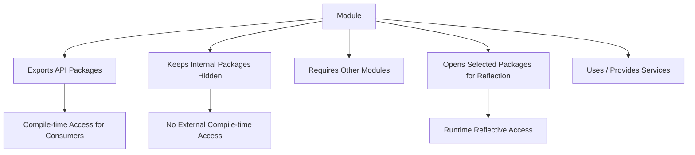
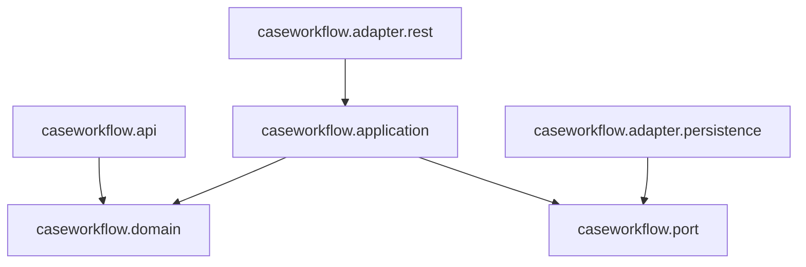
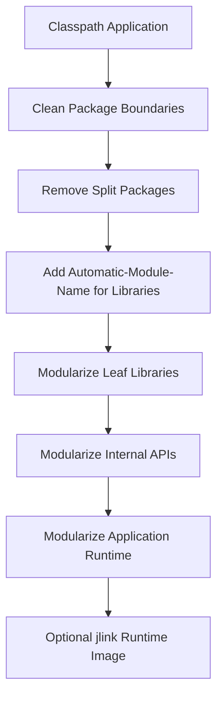

------
title: Learn Java Source, Package, Dependency, Build, Release & Deployment Engineering - Part 005
description: Practical deep dive into JPMS, module-info.java, module path, classpath interop, strong encapsulation, services, migration strategy, and when to use Java modules in real enterprise systems.
series: learn-java-build-dependency-release-deployment
seriesTitle: Learn Java Source, Package, Dependency, Build, Release & Deployment Engineering
order: 5
partTitle: JPMS Module System in Practice
tags:
- java
- jpms
- module-system
- package-management
- architecture-boundaries
- build-engineering
- release-engineering
date: 2026-06-28
---

# Part 005 — JPMS Module System in Practice

## 1. Tujuan Part Ini

Part sebelumnya membahas **package** sebagai boundary arsitektur. Sekarang kita naik satu level: **module**.

Java Platform Module System atau JPMS bukan sekadar fitur Java 9. JPMS adalah mekanisme untuk membuat boundary yang lebih eksplisit di level platform:

- dependency antar komponen dideklarasikan;
- package mana yang menjadi API dideklarasikan;
- package mana yang boleh direfleksikan dideklarasikan;
- service provider dapat dipisahkan dari service consumer;
- runtime image bisa diperkecil dengan `jlink`;
- accidental coupling dapat ditekan.

Namun untuk engineer senior, pertanyaan utamanya bukan “bagaimana menulis `module-info.java`”. Pertanyaannya:

> Kapan module system layak dipakai, boundary apa yang seharusnya dimodulkan, dan bagaimana menghindari migrasi yang merusak delivery velocity?

Part ini akan membangun mental model praktis untuk menjawabnya.

## 2. Kaufman Skill Deconstruction

Untuk menguasai JPMS secara praktis, skill-nya dipecah menjadi beberapa bagian kecil.

| Sub-skill | Yang Perlu Dikuasai | Output Praktis |
|---|---|---|
| Module descriptor | Membaca dan menulis `module-info.java` | Bisa melihat kontrak module tanpa membaca seluruh source |
| Readability | Memahami `requires`, `requires transitive`, `requires static` | Bisa mengendalikan dependency visibility |
| Accessibility | Memahami `exports` vs non-exported package | Bisa menyembunyikan implementation package |
| Reflection boundary | Memahami `opens`, `open module`, qualified opens | Bisa mengatur framework reflection secara aman |
| Classpath interop | Unnamed module, automatic module, module path | Bisa migrasi bertahap dari aplikasi legacy |
| Service loading | `uses` dan `provides` | Bisa membuat plugin architecture tanpa hard dependency |
| Build integration | Maven/Gradle module path behavior | Bisa membuat build modular yang tidak rapuh |
| Migration strategy | Bottom-up/top-down modularization | Bisa membuat roadmap tanpa big-bang rewrite |

Kita tidak akan mengulang konsep package dari Part 004. Fokusnya: **boundary eksplisit antar module**.

## 3. Mental Model: Package vs Module

Package menjawab:

> “Nama dan visibility class ini berada di ruang apa?”

Module menjawab:

> “Komponen ini bergantung pada apa, mengekspos apa, membuka apa untuk reflection, dan menyediakan service apa?”

Dengan kata lain:

- package adalah boundary **namespace dan access**;
- module adalah boundary **dependency, API exposure, reflection, dan runtime composition**.



Package masih penting. JPMS tidak menggantikan package; JPMS memberi **manifest arsitektural** di atas package.

## 4. The Smallest Useful Module

Struktur minimum:

```text
payment-core/
  src/main/java/
    module-info.java
    com/acme/payment/api/PaymentCommand.java
    com/acme/payment/api/PaymentResult.java
    com/acme/payment/internal/PaymentValidator.java
```

`module-info.java`:

```java
module com.acme.payment.core {
    exports com.acme.payment.api;
}
```

Efeknya:

- consumer dapat menggunakan `com.acme.payment.api`;
- consumer tidak dapat menggunakan `com.acme.payment.internal`;
- internal package tetap bisa dipakai oleh code di module yang sama;
- boundary API menjadi eksplisit.

Tanpa JPMS, package `internal` hanya konvensi. Dengan JPMS, `internal` benar-benar tidak diekspos ke consumer module.

## 5. `module-info.java` Sebagai Kontrak Arsitektur

File `module-info.java` bukan metadata kosmetik. Ini adalah kontrak.

Contoh lebih realistis:

```java
module com.acme.caseworkflow.domain {
    requires java.base;
    requires java.logging;

    exports com.acme.caseworkflow.domain.model;
    exports com.acme.caseworkflow.domain.policy;

    uses com.acme.caseworkflow.domain.policy.EscalationPolicyProvider;
}
```

Catatan:

- `java.base` selalu required secara implisit, jadi biasanya tidak perlu ditulis.
- `exports` menunjukkan package API.
- Package yang tidak diekspor adalah internal untuk module.
- `uses` menyatakan module ini membutuhkan service yang akan ditemukan via `ServiceLoader`.

Dalam code review, `module-info.java` seharusnya dibaca seperti ADR kecil:

> “Apa dependency module ini? Apa API-nya? Apa yang sengaja dibuka?”

## 6. Readability: `requires`

Directive `requires` membuat module saat ini **membaca** module lain.

```java
module com.acme.payment.application {
    requires com.acme.payment.core;
    requires com.acme.customer.api;
}
```

Artinya code dalam `com.acme.payment.application` dapat mengakses package yang diekspor oleh:

- `com.acme.payment.core`;
- `com.acme.customer.api`.

Namun `requires` tidak berarti semua package di dependency dapat diakses. Hanya package yang di-`exports`.

Mental model:

```text
requires  = boleh membaca exported API dari module lain
exports   = package ini tersedia untuk dibaca module lain
```

Kesalahan umum:

```java
module com.acme.foo {
    requires com.acme.bar;
}
```

Lalu berharap bisa mengakses package internal dari `com.acme.bar`. Tidak bisa, kecuali `com.acme.bar` mengekspor package tersebut.

## 7. `requires transitive`: API Dependency yang Ikut Terekspos

Gunakan `requires transitive` ketika dependency menjadi bagian dari API module kita.

Misalnya:

```java
module com.acme.payment.api {
    requires transitive com.acme.money.api;

    exports com.acme.payment.api;
}
```

Jika class di `payment.api` mengekspos type dari `money.api`:

```java
package com.acme.payment.api;

import com.acme.money.api.Money;

public record PaymentAmount(Money value) {}
```

Maka consumer dari `com.acme.payment.api` juga perlu membaca `com.acme.money.api` agar API tersebut bisa dikompilasi.

Tanpa `requires transitive`, consumer harus menulis:

```java
module com.acme.checkout {
    requires com.acme.payment.api;
    requires com.acme.money.api;
}
```

Dengan `requires transitive`, cukup:

```java
module com.acme.checkout {
    requires com.acme.payment.api;
}
```

Aturan praktis:

| Situasi | Directive |
|---|---|
| Dependency hanya dipakai internal | `requires` |
| Dependency typenya muncul di public API | `requires transitive` |
| Dependency hanya compile-time optional | `requires static` |

Jangan menjadikan semua dependency sebagai transitive. Itu sama saja dengan membocorkan internal implementation.

## 8. `requires static`: Compile-Time Optional Dependency

`requires static` berarti dependency diperlukan saat compile, tetapi boleh tidak ada saat runtime.

Contoh:

```java
module com.acme.annotation.consumer {
    requires static com.github.spotbugs.annotations;
}
```

Use case:

- annotation only dependency;
- compile-time checker annotation;
- optional integration API;
- generated metadata yang tidak dibutuhkan runtime.

Anti-pattern:

```java
module com.acme.runtime.feature {
    requires static com.acme.payment.gateway;
}
```

Jika code runtime benar-benar memanggil gateway tersebut, tetapi module tidak ada di runtime, aplikasi bisa gagal. `requires static` bukan feature flag.

## 9. Accessibility: `exports`

`exports` membuat public/protected type dari package tersedia untuk module lain.

```java
module com.acme.customer.api {
    exports com.acme.customer.api;
}
```

Tidak semua package perlu diekspor.

```text
com.acme.customer.api         -> exported
com.acme.customer.internal    -> hidden
com.acme.customer.mapper      -> hidden
com.acme.customer.validation  -> hidden unless API-level validation contract
```

Ini berbeda dengan Java `public`. Dalam JPMS, class `public` di package non-exported tetap tidak dapat diakses oleh module lain secara normal.

Mental model:

```text
public class + exported package     = external API
public class + non-exported package = module-internal public
package-private class               = package-internal
```

Ini sangat berguna untuk library yang secara historis terpaksa membuat banyak class `public` karena dipakai lintas package internal.

## 10. Qualified `exports`

Kadang package hanya boleh dibaca module tertentu.

```java
module com.acme.payment.core {
    exports com.acme.payment.internal.audit to com.acme.payment.audit.adapter;
}
```

Artinya package tersebut hanya tersedia untuk `com.acme.payment.audit.adapter`.

Use case:

- adapter internal;
- test fixture module;
- migration bridge;
- compatibility shim;
- controlled observability probe.

Namun qualified export harus dipakai hati-hati. Jika terlalu banyak, module graph menjadi implicit whitelist yang sulit dipahami.

Checklist sebelum qualified export:

1. Apakah package ini sebenarnya API yang perlu distabilkan?
2. Apakah consumer benar-benar perlu compile-time access?
3. Apakah lebih baik memakai SPI/service interface?
4. Apakah ini hanya shortcut karena boundary domain kurang rapi?

## 11. Reflection Boundary: `opens`

Banyak framework Java memakai reflection:

- dependency injection;
- ORM;
- JSON serialization/deserialization;
- testing framework;
- proxy generation;
- validation;
- configuration binding.

JPMS membedakan:

- `exports`: compile-time dan ordinary runtime access;
- `opens`: reflective runtime access.

Contoh:

```java
module com.acme.customer.persistence {
    requires jakarta.persistence;

    exports com.acme.customer.persistence.api;
    opens com.acme.customer.persistence.entity to org.hibernate.orm.core;
}
```

Artinya:

- API package diekspor;
- entity package tidak menjadi compile-time API publik;
- Hibernate boleh melakukan reflection pada entity package.

Ini penting karena tanpa JPMS, membuka reflective access sering tidak terlihat di desain.

## 12. `open module` vs Selective `opens`

`open module` membuka semua package untuk reflection.

```java
open module com.acme.legacy.app {
    requires spring.context;
    requires spring.beans;
}
```

Ini berguna saat migrasi awal, terutama aplikasi framework-heavy. Namun untuk desain jangka panjang, lebih baik selective `opens`.

| Pilihan | Kapan Dipakai | Risiko |
|---|---|---|
| `open module` | Migrasi cepat, aplikasi legacy, framework reflection besar | Semua package terbuka untuk reflection |
| `opens package` | Framework butuh akses runtime pada package tertentu | Masih perlu governance |
| `opens package to module` | Framework target jelas | Lebih aman, tapi perlu tahu module name framework |

Strategi yang sehat:

1. Mulai dari `open module` jika migrasi terlalu sulit.
2. Catat package mana yang benar-benar membutuhkan reflection.
3. Ganti ke selective `opens` bertahap.
4. Jadikan setiap tambahan `opens` sebagai perubahan arsitektur yang direview.

## 13. Module Path vs Classpath

Sebelum JPMS, Java memakai classpath.

```bash
java -cp app.jar:lib/* com.acme.Main
```

Dengan JPMS, module bisa ditempatkan di module path.

```bash
java --module-path mods -m com.acme.app/com.acme.app.Main
```

Perbedaan mental model:

| Aspek | Classpath | Module Path |
|---|---|---|
| Unit utama | JAR/classes | Module |
| Dependency declaration | Eksternal di build tool | Module descriptor + build tool |
| Duplicate classes | Bisa shadowing | Lebih ketat |
| API exposure | Konvensi package/public | `exports` |
| Reflection | Terbuka secara historis | Perlu `opens` |
| Runtime composition | Flat classpath | Resolved module graph |

Classpath adalah “tas besar berisi class”. Module path adalah “graph komponen bernama”.

## 14. Unnamed Module

Semua code yang berjalan di classpath diperlakukan sebagai bagian dari **unnamed module**.

Karakteristik:

- membaca semua observable module;
- dapat membantu kompatibilitas code lama;
- tidak punya `module-info.java`;
- tidak bisa di-`requires` oleh named module dengan cara normal.

Mental model:

```text
Legacy classpath code -> unnamed module
Modular code          -> named module
```

Hal penting:

- unnamed module adalah jembatan kompatibilitas;
- bukan target arsitektur jangka panjang;
- semakin banyak logic penting berada di unnamed module, semakin kecil manfaat JPMS.

## 15. Automatic Modules

Jika JAR non-modular diletakkan di module path, Java dapat memperlakukannya sebagai **automatic module**.

Efek umum:

- module name diturunkan dari metadata/JAR name;
- semua package diekspor;
- module dapat membaca banyak hal untuk kompatibilitas.

Automatic module membantu migrasi, tapi bukan desain final.

Masalah:

- nama module bisa tidak stabil jika hanya berasal dari file name;
- semua package terekspos;
- dependency boundary masih lemah;
- split package bisa muncul;
- rilis library bisa menjadi kompatibilitas trap.

Untuk library publik, lebih baik menyediakan module descriptor eksplisit atau setidaknya `Automatic-Module-Name` di manifest saat belum siap fully modular.

## 16. Split Package Problem

Split package terjadi ketika package yang sama muncul di lebih dari satu module.

Contoh buruk:

```text
module com.acme.payment.core
  com.acme.payment.model.Payment

module com.acme.payment.adapter
  com.acme.payment.model.PaymentMapper
```

Package `com.acme.payment.model` tersebar di dua module.

Dalam classpath, ini sering “berfungsi” walaupun rapuh. Dalam module path, ini menjadi masalah serius karena module system ingin package dimiliki secara jelas oleh satu module.

Aturan enterprise:

> Satu package harus dimiliki oleh satu module/artifact secara jelas.

Jika package perlu dibagi, biasanya boundary-nya salah. Rename package berdasarkan ownership:

```text
com.acme.payment.core.model
com.acme.payment.adapter.mapper
```

atau ekstrak common API:

```text
com.acme.payment.api.model
```

## 17. Service Loading: `uses` dan `provides`

JPMS membuat `ServiceLoader` menjadi bagian eksplisit dari module descriptor.

Service interface:

```java
package com.acme.risk.spi;

public interface RiskScoringProvider {
    RiskScore score(RiskRequest request);
}
```

Consumer module:

```java
module com.acme.risk.engine {
    exports com.acme.risk.api;
    exports com.acme.risk.spi;

    uses com.acme.risk.spi.RiskScoringProvider;
}
```

Provider module:

```java
module com.acme.risk.provider.rulebased {
    requires com.acme.risk.engine;

    provides com.acme.risk.spi.RiskScoringProvider
        with com.acme.risk.provider.rulebased.RuleBasedRiskScoringProvider;
}
```

Loading:

```java
ServiceLoader<RiskScoringProvider> loader =
    ServiceLoader.load(RiskScoringProvider.class);

for (RiskScoringProvider provider : loader) {
    RiskScore score = provider.score(request);
}
```

Kapan ini berguna?

- plugin architecture;
- pluggable policy engine;
- vendor-specific adapter;
- runtime-discoverable implementation;
- optional capability;
- library extension mechanism.

Kapan tidak perlu?

- aplikasi internal sederhana;
- dependency jelas dan statis;
- DI container sudah menjadi composition mechanism utama;
- service discovery akan membuat traceability lebih buruk.

## 18. JPMS dan Layered Architecture

Jangan membuat module sekadar mengikuti layer teknis.

Anti-pattern:

```text
com.acme.controller
com.acme.service
com.acme.repository
com.acme.model
```

Ini hanya package-by-layer dalam bentuk module.

Lebih baik module berbasis capability atau bounded context:

```text
com.acme.customer.api
com.acme.customer.domain
com.acme.customer.persistence
com.acme.customer.application
com.acme.customer.adapter.rest
```

Namun jangan terlalu cepat memecah. Untuk banyak aplikasi, modulasi berikut cukup:

```text
com.acme.customer
com.acme.payment
com.acme.caseworkflow
com.acme.shared.kernel
```

Lalu internal package diatur dengan `exports` minimal.

## 19. JPMS dan Hexagonal Architecture

JPMS cocok untuk menegakkan arah dependency.

Contoh:



Module descriptor bisa membuat arah ini eksplisit:

```java
module com.acme.caseworkflow.application {
    requires com.acme.caseworkflow.domain;
    requires com.acme.caseworkflow.port;

    exports com.acme.caseworkflow.application.usecase;
}
```

Adapter REST:

```java
module com.acme.caseworkflow.adapter.rest {
    requires com.acme.caseworkflow.application;
    requires jakarta.ws.rs;
}
```

Persistence adapter:

```java
module com.acme.caseworkflow.adapter.persistence {
    requires com.acme.caseworkflow.port;
    requires jakarta.persistence;

    opens com.acme.caseworkflow.adapter.persistence.entity to org.hibernate.orm.core;
}
```

Module system tidak otomatis membuat arsitektur bagus, tetapi membantu menegakkan dependency direction jika boundary-nya sudah benar.

## 20. JPMS dan Maven

Dalam Maven, `module-info.java` biasanya diletakkan di:

```text
src/main/java/module-info.java
```

Contoh minimal POM:

```xml
<project>
  <modelVersion>4.0.0</modelVersion>

  <groupId>com.acme</groupId>
  <artifactId>payment-core</artifactId>
  <version>1.0.0</version>

  <properties>
    <maven.compiler.release>21</maven.compiler.release>
  </properties>

  <dependencies>
    <dependency>
      <groupId>com.acme</groupId>
      <artifactId>money-api</artifactId>
      <version>1.0.0</version>
    </dependency>
  </dependencies>
</project>
```

Maven dependency tetap diperlukan untuk resolution artifact. JPMS descriptor mendeklarasikan module dependency di level Java language/runtime.

Artinya ada dua graph:


Kesalahan umum:

> Menambahkan dependency di Maven, tetapi lupa `requires` di `module-info.java`.

Atau sebaliknya:

> Menulis `requires com.foo.bar`, tetapi artifact-nya tidak tersedia di build dependency graph.

Keduanya harus sinkron.

## 21. JPMS dan Gradle

Gradle juga harus menyelaraskan dependency graph dengan module graph.

Contoh Kotlin DSL:

```kotlin
plugins {
    `java-library`
}

java {
    toolchain {
        languageVersion.set(JavaLanguageVersion.of(21))
    }
}

dependencies {
    api("com.acme:money-api:1.0.0")
    implementation("com.acme:validation-core:1.0.0")
}
```

`module-info.java`:

```java
module com.acme.payment.api {
    requires transitive com.acme.money.api;
    requires com.acme.validation.core;

    exports com.acme.payment.api;
}
```

Hubungan penting:

| Gradle Configuration | JPMS Concept | Catatan |
|---|---|---|
| `api` | Sering cocok dengan `requires transitive` | Jika dependency type muncul di public API |
| `implementation` | Sering cocok dengan `requires` | Jika dependency internal |
| `compileOnly` | Bisa cocok dengan `requires static` | Jika hanya compile-time |
| `runtimeOnly` | Tidak selalu punya `requires` | Untuk runtime provider/plugin tertentu |

Jangan menyamakan Gradle `api` otomatis dengan JPMS `exports`. `api` mengatur dependency exposure di Gradle. `exports` mengatur package exposure di JPMS.

## 22. JPMS dan Framework Reflection

Framework modern banyak bergantung pada reflection. Dalam aplikasi modular, masalah umum adalah error seperti:

```text
module com.acme.customer does not open com.acme.customer.entity to org.hibernate.orm.core
```

atau:

```text
Unable to make field private ... accessible
```

Solusi bukan langsung menambahkan `--add-opens` global selamanya.

Langkah diagnosis:

1. Package mana yang direfleksikan?
2. Framework module name apa yang membutuhkan akses?
3. Apakah akses hanya runtime reflection atau compile-time API?
4. Apakah package sebaiknya dibuka qualified?
5. Apakah ini entity/DTO/config yang memang framework-managed?

Contoh:

```java
module com.acme.customer.persistence {
    requires jakarta.persistence;
    requires org.hibernate.orm.core;

    opens com.acme.customer.persistence.entity to org.hibernate.orm.core;
}
```

Untuk JSON binding:

```java
module com.acme.customer.api {
    requires com.fasterxml.jackson.databind;

    exports com.acme.customer.api.dto;
    opens com.acme.customer.api.dto to com.fasterxml.jackson.databind;
}
```

Catatan desain:

- DTO publik boleh diekspor.
- Entity persistence belum tentu harus diekspor.
- Reflection access harus eksplisit dan minimal.

## 23. Strong Encapsulation dan Internal API

Salah satu motivasi JPMS adalah strong encapsulation.

Di sistem enterprise, masalah klasik adalah internal class dipakai consumer karena “kebetulan public”.

Contoh:

```java
package com.acme.payment.internal;

public final class PaymentStateMachineInternalHelper {
    // public karena dipakai lintas package internal
}
```

Tanpa JPMS, consumer bisa import class ini jika JAR ada di classpath.

Dengan JPMS:

```java
module com.acme.payment.core {
    exports com.acme.payment.api;
    // internal package not exported
}
```

Consumer tidak dapat mengakses package internal tersebut.

Efek organisasi:

- API surface lebih kecil;
- backward compatibility burden lebih rendah;
- refactoring lebih aman;
- internal implementation tidak menjadi contract tidak resmi.

## 24. Designing Module Boundaries

Gunakan pertanyaan berikut.

### 24.1 Apakah boundary ini punya lifecycle sendiri?

Jika module dirilis bersama aplikasi yang sama, jangan terlalu banyak module kecil. Modulasi berlebihan membuat build dan runtime configuration lebih berat.

### 24.2 Apakah boundary ini punya API yang stabil?

Module paling bernilai ketika ada API jelas.

Good candidate:

```text
com.acme.money.api
com.acme.caseworkflow.policy.api
com.acme.audit.spi
```

Bad candidate:

```text
com.acme.util
com.acme.common
com.acme.helpers
```

### 24.3 Apakah internal implementation sering berubah?

Jika iya, JPMS membantu menyembunyikan implementation.

### 24.4 Apakah dependency direction perlu ditegakkan?

Jika sistem sering mengalami layer leak, module dapat membantu.

### 24.5 Apakah toolchain dan framework mendukung?

Jika framework stack sangat reflection-heavy dan library dependency belum modular, JPMS mungkin memberi friction tinggi.

## 25. Module Granularity

Granularity yang terlalu kasar:

```text
com.acme.enterprise.app
```

Masalah:

- semua hal ada dalam satu module;
- API/internal boundary minim;
- module-info tidak informatif.

Granularity yang terlalu halus:

```text
com.acme.customer.controller
com.acme.customer.service
com.acme.customer.repository
com.acme.customer.mapper
com.acme.customer.validator
```

Masalah:

- dependency graph terlalu ramai;
- module-info menjadi noisy;
- refactoring kecil memerlukan perubahan module;
- build friction meningkat.

Granularity yang lebih sehat:

```text
com.acme.customer.api
com.acme.customer.domain
com.acme.customer.application
com.acme.customer.persistence
com.acme.customer.rest
```

Atau untuk aplikasi lebih kecil:

```text
com.acme.customer
```

Dengan exports minimal.

## 26. Migration Strategy: Jangan Big Bang

JPMS migration paling aman dilakukan bertahap.



Urutan rasional:

1. Rapikan package dulu.
2. Hilangkan split package.
3. Pastikan dependency graph bersih.
4. Modularisasi library internal yang dependency-nya ringan.
5. Modularisasi boundary API/SPI.
6. Tangani reflection framework.
7. Baru pikirkan modular runtime.

Jangan mulai dari aplikasi paling besar.

## 27. Bottom-Up vs Top-Down Modularization

### Bottom-up

Mulai dari library paling bawah:

```text
money-api -> validation-api -> customer-api -> payment-api
```

Kelebihan:

- risiko kecil;
- boundary lebih jelas;
- cocok untuk shared libraries.

Kekurangan:

- aplikasi utama masih classpath;
- manfaat runtime belum langsung terasa.

### Top-down

Mulai dari aplikasi utama.

Kelebihan:

- cepat melihat runtime module graph;
- cocok untuk greenfield.

Kekurangan:

- legacy dependency bisa menghambat;
- framework reflection error banyak;
- risiko delivery tinggi.

Rekomendasi enterprise: **bottom-up untuk sistem existing**, top-down hanya untuk greenfield atau modul yang sangat terkontrol.

## 28. JPMS untuk Library Publik vs Aplikasi Internal

### Library publik

JPMS sangat relevan jika:

- API surface perlu jelas;
- consumer banyak;
- backward compatibility penting;
- internal implementation sering berubah;
- library ingin friendly untuk modular consumers.

Yang perlu dijaga:

- nama module stabil;
- exported package tidak berubah sembarangan;
- jangan mengekspos dependency internal via `requires transitive`;
- pertimbangkan `Automatic-Module-Name` saat belum full modular.

### Aplikasi internal

JPMS relevan jika:

- aplikasi besar;
- boundary sering bocor;
- deployment butuh custom runtime image;
- keamanan reflection/encapsulation penting;
- tim siap membayar biaya toolchain.

Tidak selalu wajib untuk:

- service kecil;
- aplikasi Spring Boot sederhana;
- sistem yang deployment-nya sudah terisolasi container;
- tim yang belum punya dependency hygiene dasar.

## 29. JPMS dan `jlink`

JPMS memungkinkan link-time assembly menggunakan `jlink` untuk membuat custom runtime image.

Mental model:

```text
module graph + JDK modules -> custom runtime image
```

Use case:

- runtime lebih kecil;
- packaging self-contained;
- mengurangi komponen JDK yang tidak perlu;
- appliance-style deployment;
- embedded/serverless-like runtime optimization.

Namun jangan mengejar `jlink` sebelum:

- module graph bersih;
- dependency modular-compatible;
- operational model membutuhkan custom runtime;
- CI/CD mendukung image creation;
- vulnerability scanning runtime image dipahami.

Untuk banyak microservice container, base image JRE/JDK yang hardened mungkin lebih praktis.

## 30. Common Failure Modes

| Failure | Gejala | Akar Masalah | Perbaikan |
|---|---|---|---|
| Missing `requires` | Compile error package not visible | Build dependency ada, module dependency tidak ada | Tambah `requires` yang tepat |
| Over-exporting | Semua package jadi API | Takut consumer gagal | Export hanya package contract |
| Reflection failure | Runtime inaccessible object/field | Package belum `opens` | Tambah qualified `opens` |
| Split package | Module resolution gagal | Package tersebar di beberapa artifact | Rename/extract package ownership |
| Automatic module instability | Module name berubah | Nama diturunkan dari JAR | Set explicit module descriptor/name |
| Transitive leak | Consumer mendapat dependency tak perlu | `requires transitive` berlebihan | Ubah ke `requires` |
| Open module forever | Semua terbuka reflection | Migrasi tidak dilanjutkan | Buat backlog selective opens |
| Modularizing too early | Build jadi lambat/fragile | Package/dependency belum rapi | Rapikan foundation dulu |

## 31. Review Checklist untuk `module-info.java`

Gunakan checklist ini saat code review.

### Dependency

- Apakah setiap `requires` memang dipakai?
- Apakah ada dependency internal yang tidak perlu?
- Apakah `requires transitive` hanya dipakai ketika type muncul di API?
- Apakah `requires static` benar-benar optional runtime?

### Exports

- Apakah package yang diekspor memang API?
- Apakah package internal tidak diekspor?
- Apakah qualified export punya alasan yang terdokumentasi?
- Apakah exported package punya compatibility expectation?

### Opens

- Apakah `opens` dibatasi ke module framework target?
- Apakah `open module` hanya solusi sementara?
- Apakah reflective access bisa dikurangi?
- Apakah package yang dibuka berisi data class/entity/config yang memang perlu reflection?

### Services

- Apakah `uses/provides` membuat coupling lebih baik, bukan lebih tersembunyi?
- Apakah provider discovery mudah diuji?
- Apakah order dan conflict provider ditangani?

### Migration

- Apakah module ini bebas split package?
- Apakah dependency pihak ketiga modular-friendly?
- Apakah CI menjalankan module-path test?
- Apakah IDE developer mendukung workflow ini?

## 32. Exercise: Modularisasi Mini-Library

Buat library kecil:

```text
risk-engine/
  src/main/java/module-info.java
  src/main/java/com/acme/risk/api/RiskRequest.java
  src/main/java/com/acme/risk/api/RiskScore.java
  src/main/java/com/acme/risk/spi/RiskScoringProvider.java
  src/main/java/com/acme/risk/internal/DefaultRiskEngine.java
```

Target:

```java
module com.acme.risk.engine {
    exports com.acme.risk.api;
    exports com.acme.risk.spi;

    uses com.acme.risk.spi.RiskScoringProvider;
}
```

Lalu buat provider module:

```text
risk-provider-rulebased/
  src/main/java/module-info.java
  src/main/java/com/acme/risk/provider/rulebased/RuleBasedRiskScoringProvider.java
```

Descriptor:

```java
module com.acme.risk.provider.rulebased {
    requires com.acme.risk.engine;

    provides com.acme.risk.spi.RiskScoringProvider
        with com.acme.risk.provider.rulebased.RuleBasedRiskScoringProvider;
}
```

Kriteria self-correction:

- Consumer tidak bisa mengakses `internal` package.
- Provider bisa ditemukan via `ServiceLoader`.
- Tidak ada `exports` untuk package implementation.
- Tidak ada `requires transitive` yang tidak perlu.

## 33. Ringkasan Mental Model

JPMS bukan “struktur folder baru”. JPMS adalah cara membuat **module graph** yang eksplisit.

Ingat lima aturan:

1. `requires` mengatur apa yang dibaca module.
2. `exports` mengatur package apa yang menjadi API.
3. `opens` mengatur reflective access.
4. `uses/provides` mengatur service discovery.
5. Classpath interop adalah jembatan, bukan desain final.

Engineer top-tier tidak memaksakan JPMS ke semua sistem. Ia tahu kapan JPMS meningkatkan correctness, encapsulation, release discipline, dan runtime composition; dan kapan JPMS hanya menambah friction tanpa ROI.

## 34. Referensi Resmi

- Dev.java — Modules: https://dev.java/learn/modules/
- Java Language Specification, Chapter 7 — Packages and Modules: https://docs.oracle.com/javase/specs/jls/se9/html/jls-7.html
- OpenJDK JEP 261 — Module System: https://openjdk.org/jeps/261
- Gradle Java Library Plugin: https://docs.gradle.org/current/userguide/java_library_plugin.html
- Apache Maven Compiler Plugin: https://maven.apache.org/plugins/maven-compiler-plugin/

## 35. Selesai Part 005

Kita sudah membahas JPMS sebagai boundary eksplisit di atas package. Part berikutnya akan membahas **source sets, generated code, dan build inputs**: bagaimana build tool mengelompokkan source, resource, generated output, annotation processing, dan input determinism.
