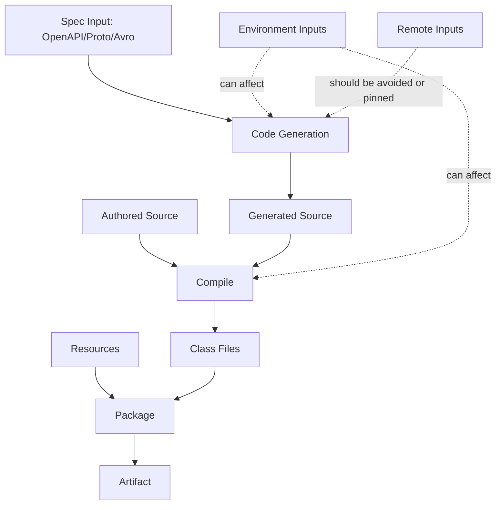
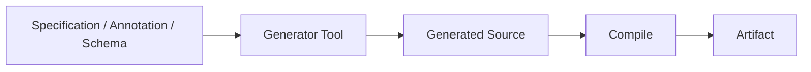
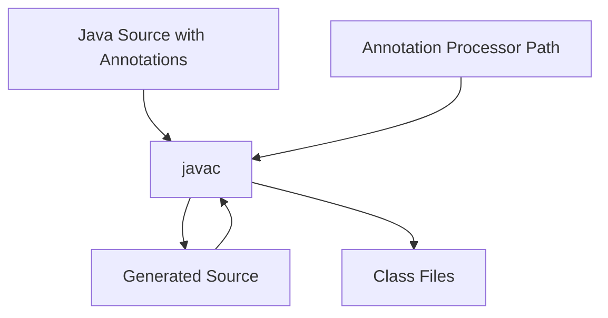
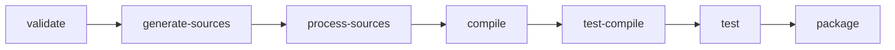
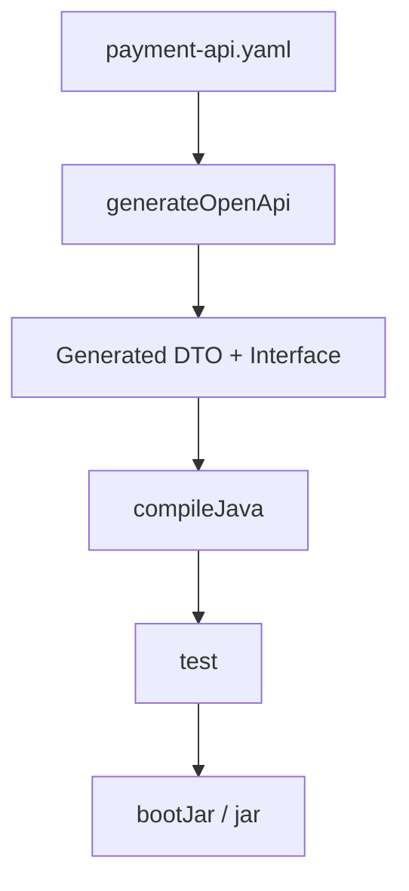
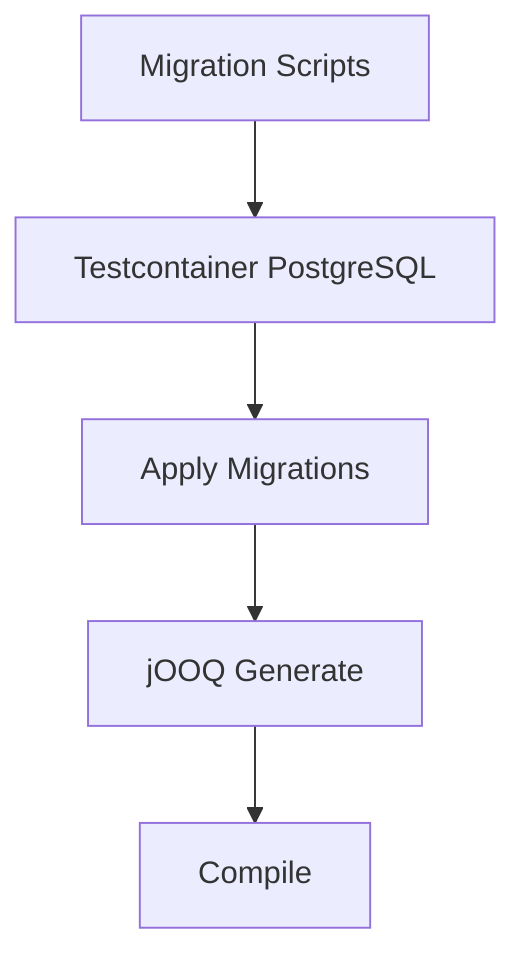

------
title: Learn Java Source, Package, Dependency, Build, Release & Deployment Engineering - Part 006
description: Deep practical guide to Java source sets, generated code, annotation processing, build inputs, deterministic generation, IDE synchronization, and generated-code drift control.
series: learn-java-build-dependency-release-deployment
seriesTitle: Learn Java Source, Package, Dependency, Build, Release & Deployment Engineering
order: 6
partTitle: Source Sets, Generated Code, and Build Inputs
tags:
- java
- source-sets
- generated-code
- annotation-processing
- build-inputs
- build-engineering
- gradle
- maven
date: 2026-06-28
---

# Part 006 — Source Sets, Generated Code, and Build Inputs

## 1. Tujuan Part Ini

Part ini membahas sesuatu yang sering dianggap detail build tool, padahal sebenarnya inti dari build correctness:

> Source mana yang dikompilasi, resource mana yang dipaketkan, code mana yang dihasilkan, input mana yang mempengaruhi output, dan bagaimana kita mencegah build menghasilkan artifact berbeda tanpa perubahan source yang jelas?

Dalam proyek kecil, source layout terlihat sederhana:

```text
src/main/java
src/test/java
```

Dalam sistem enterprise, kenyataannya lebih kompleks:

```text
src/main/java
src/main/resources
src/test/java
src/integrationTest/java
src/contractTest/java
src/generated/java
build/generated/sources/annotationProcessor/java/main
target/generated-sources/annotations
target/generated-sources/openapi
build/generated/source/proto/main/java
```

Jika tidak dikelola, generated code dan source sets menjadi sumber masalah:

- build lokal berbeda dari CI;
- IDE melihat source yang build tidak lihat;
- generated code stale;
- annotation processor membuat incremental build lambat;
- integration test tercampur unit test;
- resource test masuk artifact production;
- code generator mengambil input dari network;
- generated source di-commit tanpa policy;
- reproducibility rusak.

Part ini memberi mental model dan pola operasional untuk mengendalikan kompleksitas tersebut.

## 2. Kaufman Skill Deconstruction

| Sub-skill | Yang Dipelajari | Output Praktis |
|---|---|---|
| Source set modeling | Mengelompokkan source berdasarkan purpose | Build lifecycle lebih jelas |
| Build input classification | Membedakan source, resource, spec, generated output, environment | Build lebih reproducible |
| Generated code ownership | Menentukan generated code di-commit atau tidak | Tidak ada drift tanpa sadar |
| Annotation processing | Memisahkan processor path dan compile path | Build lebih aman dan cepat |
| Test source partitioning | Unit/integration/contract/e2e terpisah | Pipeline lebih cepat dan reliable |
| IDE synchronization | Generated source dikenali IDE | Developer feedback loop sehat |
| Determinism | Generator output stabil | Artifact bisa diaudit |
| Failure diagnosis | Menemukan stale/generated drift | Debug build lebih cepat |

## 3. Mental Model: Build Input vs Build Output

Kesalahan paling umum adalah menyebut semua file `.java` sebagai “source”. Dalam build engineering, itu tidak cukup.

Klasifikasi yang lebih akurat:

| Jenis | Contoh | Status |
|---|---|---|
| Authored source | `src/main/java/...` | Human-owned input |
| Authored resource | `src/main/resources/application.yml` | Human-owned input |
| Spec input | `openapi.yaml`, `.proto`, `.avsc` | Human-owned input untuk generator |
| Generated source | `build/generated/.../*.java` | Machine-owned output |
| Compiled output | `.class` | Machine-owned output |
| Packaged artifact | `.jar`, `.war`, image layer | Machine-owned output |
| Environment input | JDK version, locale, timezone, OS | Hidden input jika tidak dikontrol |
| Remote input | Network schema, registry metadata | Hidden input jika tidak dipin |



Rule:

> Build output tidak boleh diperlakukan sebagai source of truth kecuali ada policy eksplisit.

## 4. Source Set Sebagai Partition, Bukan Folder Kosmetik

Source set adalah pengelompokan source dan resource dengan classpath, output, dan task lifecycle sendiri.

Contoh konseptual:

```text
main              -> production code
api               -> public API code
test              -> unit test
integrationTest   -> integration test
contractTest      -> provider/consumer contract test
functionalTest    -> end-to-end style test
fixture           -> reusable test fixture
```

Dalam Gradle, `SourceSet` adalah logical group untuk Java source dan resource files. Dalam Maven, konsepnya lebih convention/lifecycle-driven: `src/main/java`, `src/test/java`, dan tambahan source biasanya dikaitkan lewat plugin/lifecycle.

Perhatikan perbedaannya:

| Aspek | Maven | Gradle |
|---|---|---|
| Default source layout | Convention kuat | Convention + configurable source sets |
| Custom source set | Biasanya via plugin/build-helper/failsafe profile | Native source set model |
| Task model | Lifecycle phase | Task graph |
| Generated source | `target/generated-sources/...` | `build/generated/...` |
| Test partition | Surefire/Failsafe convention | Custom source set/test task mudah |

## 5. Default Source Layout

### Maven default

```text
src/main/java          production Java source
src/main/resources     production resources
src/test/java          test Java source
src/test/resources     test resources
target/classes         compiled production output
target/test-classes    compiled test output
```

### Gradle default

```text
src/main/java          production Java source
src/main/resources     production resources
src/test/java          test Java source
src/test/resources     test resources
build/classes/java/main
build/resources/main
build/classes/java/test
build/resources/test
```

Default ini bukan sekadar tradisi. Banyak plugin, IDE, CI template, dan developer habit bergantung pada layout tersebut.

Aturan praktis:

> Ubah default source layout hanya jika ada alasan kuat. Custom layout menambah biaya cognitive load dan tool integration.

## 6. Source Set Boundary Invariants

Setiap source set seharusnya punya invariant.

| Source Set | Invariant |
|---|---|
| `main` | Hanya code dan resource yang masuk artifact production |
| `test` | Unit test cepat, isolated, tidak butuh external service nyata |
| `integrationTest` | Test integrasi dengan database/broker/container/local dependency |
| `contractTest` | Verifikasi contract antar service/library |
| `e2eTest` | Test flow end-to-end, lambat, tidak wajib di setiap local build |
| `testFixtures` | Helper test reusable, bukan production dependency |
| `generated` | Output dari generator, bukan edited manually |

Jika source set tidak punya invariant, ia hanya folder tambahan yang membingungkan.

## 7. Anti-Pattern: Test Taxonomy Tercampur

Contoh buruk:

```text
src/test/java
  PaymentCalculatorTest.java              fast unit test
  PaymentRepositoryTest.java              needs PostgreSQL
  PaymentKafkaConsumerTest.java           needs Kafka
  PaymentApiContractTest.java             contract test
  PaymentEndToEndTest.java                calls real environment
```

Akibat:

- `mvn test` atau `gradle test` jadi lambat;
- developer skip test;
- CI pipeline susah layer;
- flakiness meningkat;
- build feedback buruk.

Desain lebih baik:

```text
src/test/java
src/integrationTest/java
src/contractTest/java
src/e2eTest/java
```

Pipeline:


Unit test harus menjaga fast feedback. Test lambat boleh ada, tetapi jangan disembunyikan di source set yang sama tanpa kontrol.

## 8. Gradle: Custom Source Set untuk Integration Test

Contoh Kotlin DSL:

```kotlin
plugins {
    `java-library`
}

sourceSets {
    create("integrationTest") {
        java.srcDir("src/integrationTest/java")
        resources.srcDir("src/integrationTest/resources")
        compileClasspath += sourceSets["main"].output + configurations["testRuntimeClasspath"]
        runtimeClasspath += output + compileClasspath
    }
}

configurations {
    named("integrationTestImplementation") {
        extendsFrom(configurations["testImplementation"])
    }
    named("integrationTestRuntimeOnly") {
        extendsFrom(configurations["testRuntimeOnly"])
    }
}

tasks.register<Test>("integrationTest") {
    description = "Runs integration tests."
    group = "verification"
    testClassesDirs = sourceSets["integrationTest"].output.classesDirs
    classpath = sourceSets["integrationTest"].runtimeClasspath
    shouldRunAfter(tasks.test)
}

tasks.check {
    dependsOn("integrationTest")
}
```

Key idea:

- integration test punya source, resource, classpath, dan task sendiri;
- bisa dijalankan terpisah;
- bisa masuk pipeline berbeda;
- dependency integration test tidak bocor ke production.

## 9. Maven: Integration Test dengan Failsafe

Dalam Maven, integration test umum dipisahkan lewat naming convention dan Maven Failsafe Plugin.

Contoh:

```text
src/test/java
  PaymentCalculatorTest.java
  PaymentRepositoryIT.java
```

Surefire menjalankan unit test. Failsafe menjalankan integration test di fase lebih akhir.

Contoh konfigurasi:

```xml
<build>
  <plugins>
    <plugin>
      <groupId>org.apache.maven.plugins</groupId>
      <artifactId>maven-surefire-plugin</artifactId>
      <version>3.5.3</version>
    </plugin>
    <plugin>
      <groupId>org.apache.maven.plugins</groupId>
      <artifactId>maven-failsafe-plugin</artifactId>
      <version>3.5.3</version>
      <executions>
        <execution>
          <goals>
            <goal>integration-test</goal>
            <goal>verify</goal>
          </goals>
        </execution>
      </executions>
    </plugin>
  </plugins>
</build>
```

Maven bisa juga memakai source directory tambahan, tetapi trade-off-nya lebih tinggi daripada Gradle karena Maven lebih lifecycle-convention oriented.

Rule:

> Di Maven, gunakan lifecycle dan naming convention dulu sebelum membuat layout yang terlalu custom.

## 10. Generated Code: Apa yang Sebenarnya Terjadi?

Generated code adalah code yang dihasilkan dari input lain.

Contoh:

| Generator | Input | Output |
|---|---|---|
| Annotation processor | Java annotations | Java source/class/resource |
| OpenAPI Generator | `openapi.yaml` | API client/server stubs/model |
| Protobuf | `.proto` | Java message classes/gRPC stubs |
| Avro | `.avsc` | Java specific records |
| jOOQ | DB schema | Java DSL classes |
| QueryDSL | JPA annotations | Q-types |
| MapStruct | Mapper interfaces | Mapper implementations |
| Lombok | Java annotations | AST transformation/class bytecode effect |

Generated code harus diperlakukan sebagai output dari pipeline:



Jika generator input berubah, output berubah. Jika generator version berubah, output bisa berubah. Jika environment berubah, output bisa berubah. Karena itu generator adalah bagian dari build correctness.

## 11. Generated Code Ownership Policy

Ada dua pilihan utama:

### Option A — Generated code tidak di-commit

```text
src/main/openapi/payment.yaml        committed
build/generated/sources/openapi/...  not committed
```

Kelebihan:

- tidak ada noise diff besar;
- source of truth jelas;
- tidak ada stale generated code di repo;
- build bersih menghasilkan output terbaru.

Kekurangan:

- build butuh generator tersedia;
- IDE harus sinkron;
- debugging kadang lebih lambat;
- CI harus deterministic.

### Option B — Generated code di-commit

```text
src/main/openapi/payment.yaml        committed
src/generated/java/...               committed
```

Kelebihan:

- consumer bisa melihat generated API langsung;
- build tidak bergantung generator runtime tertentu;
- kadang perlu untuk source distribution/regulatory review;
- beberapa ekosistem legacy mengharuskannya.

Kekurangan:

- drift antara spec dan generated source;
- diff besar;
- developer bisa edit generated code manual;
- review menjadi noisy;
- merge conflict.

Rekomendasi default:

> Jangan commit generated code jika generator deterministic, cepat, tersedia di build, dan IDE dapat dikonfigurasi dengan baik.

Commit generated code hanya jika ada alasan kuat, misalnya:

- generated output menjadi API published source artifact;
- generator sangat mahal/tidak tersedia di consumer environment;
- compliance membutuhkan review exact generated source;
- build harus berjalan tanpa generator tertentu;
- toolchain lama tidak bisa handle generated directory.

## 12. Generated Code Drift

Generated code drift terjadi ketika input dan output tidak sinkron.

Contoh:

```text
openapi.yaml changed
Generated PaymentApi.java not regenerated
Build still passes because stale generated file committed
Runtime contract broken later
```

Drift bisa terjadi dalam dua arah:

| Drift | Contoh |
|---|---|
| Input berubah, generated output stale | Spec update tidak diikuti regeneration |
| Generated output diedit manual | Perubahan hilang saat regenerate |
| Generator version berubah | Output berubah massal tanpa logic change |
| Environment berbeda | Timestamp/path/order berbeda |

Mitigasi:

1. Tandai generated directory di `.gitignore` jika tidak di-commit.
2. Jika di-commit, CI harus menjalankan regenerate lalu cek diff bersih.
3. Header generated file harus jelas: “do not edit”.
4. Generator version harus dipin.
5. Input spec harus version-controlled.
6. Output harus deterministic.

CI check jika generated code committed:

```bash
./gradlew generateSources

git diff --exit-code
```

atau:

```bash
mvn generate-sources

git diff --exit-code
```

## 13. Where Should Generated Code Live?

Generated output sebaiknya berada di build directory.

Maven convention:

```text
target/generated-sources/annotations
target/generated-sources/openapi
target/generated-sources/protobuf
```

Gradle convention:

```text
build/generated/sources/annotationProcessor/java/main
build/generated/source/proto/main/java
build/generated/sources/openapi/main/java
```

Hindari default buruk:

```text
src/main/java/generated
src/generated/java
```

kecuali memang policy-nya generated code di-commit dan dikelola sebagai source artifact.

Mental model:

```text
src/...     = human-owned input
build/...   = machine-owned output in Gradle
target/...  = machine-owned output in Maven
```

## 14. Annotation Processing Mental Model

Annotation processing berjalan saat compile.



Contoh annotation processor:

- MapStruct;
- Dagger;
- AutoService;
- QueryDSL;
- JPA Metamodel;
- Lombok, dengan caveat karena mekanismenya lebih invasive;
- Immutables;
- Micronaut/Quarkus build-time processing.

Hal penting:

- annotation processor adalah build-time dependency;
- processor tidak selalu runtime dependency;
- processor harus berada di processor path, bukan asal masuk compile classpath;
- output processor harus dianggap generated output;
- processor dapat merusak incremental build jika tidak mendeklarasikan behavior dengan benar.

## 15. Maven Annotation Processing

Maven Compiler Plugin menyediakan konfigurasi annotation processor path dan generated sources directory.

Contoh MapStruct:

```xml
<plugin>
  <groupId>org.apache.maven.plugins</groupId>
  <artifactId>maven-compiler-plugin</artifactId>
  <version>3.13.0</version>
  <configuration>
    <release>21</release>
    <annotationProcessorPaths>
      <path>
        <groupId>org.mapstruct</groupId>
        <artifactId>mapstruct-processor</artifactId>
        <version>1.6.3</version>
      </path>
    </annotationProcessorPaths>
  </configuration>
</plugin>
```

Default generated source annotation processing umumnya berada di:

```text
target/generated-sources/annotations
```

Policy:

- annotation processor dependency dipin;
- processor path dipisahkan;
- generated output tidak diedit manual;
- jika processor membaca file tambahan, file tersebut harus dianggap input build.

## 16. Gradle Annotation Processing

Gradle menyediakan configuration `annotationProcessor`.

```kotlin
dependencies {
    implementation("org.mapstruct:mapstruct:1.6.3")
    annotationProcessor("org.mapstruct:mapstruct-processor:1.6.3")
    testAnnotationProcessor("org.mapstruct:mapstruct-processor:1.6.3")
}
```

Untuk Java Library Plugin:

```kotlin
dependencies {
    api("com.acme:money-api:1.0.0")
    implementation("com.acme:validation-core:1.0.0")
    compileOnly("org.projectlombok:lombok:1.18.36")
    annotationProcessor("org.projectlombok:lombok:1.18.36")
}
```

Catatan:

- `compileOnly` membuat annotation type tersedia saat compile.
- `annotationProcessor` membuat processor tersedia untuk javac processing.
- Untuk source set custom, processor configuration-nya juga terpisah.

Jika source set `integrationTest` butuh processor:

```kotlin
dependencies {
    "integrationTestAnnotationProcessor"("org.mapstruct:mapstruct-processor:1.6.3")
}
```

## 17. Incremental Annotation Processing

Annotation processor dapat merusak incremental compilation.

Dua kategori umum:

| Kategori | Cara Kerja | Dampak |
|---|---|---|
| Isolating | Output untuk satu input tergantung pada input itu saja | Incremental lebih baik |
| Aggregating | Output tergantung banyak input | Perubahan kecil bisa memicu lebih banyak recompilation |

Contoh isolating:

```text
UserMapper.java -> UserMapperImpl.java
OrderMapper.java -> OrderMapperImpl.java
```

Contoh aggregating:

```text
All annotated handlers -> GeneratedRegistry.java
```

Untuk build besar, processor aggregating bisa menjadi bottleneck.

Checklist:

- Apakah processor incremental-compatible?
- Apakah Gradle `--info` menunjukkan processor menonaktifkan incremental compilation?
- Apakah processor membaca resource/config tambahan?
- Apakah input tambahan dideklarasikan?
- Apakah generator membuat output deterministik?

## 18. Code Generation dari OpenAPI

OpenAPI generation sering dipakai untuk:

- client SDK;
- server interface;
- DTO/model;
- API documentation;
- contract testing.

Input:

```text
src/main/openapi/payment-api.yaml
```

Output:

```text
build/generated/sources/openapi/main/java
```

Guideline:

1. Treat OpenAPI file as source of truth.
2. Pin generator version.
3. Pin templates if customized.
4. Separate generated API interface from implementation.
5. Avoid editing generated model manually.
6. Add generated output to source set explicitly.
7. Ensure generation runs before compile.

Gradle conceptual pattern:

```kotlin
val generatePaymentApi by tasks.registering {
    inputs.file("src/main/openapi/payment-api.yaml")
    outputs.dir(layout.buildDirectory.dir("generated/sources/openapi/main/java"))
    // run generator here
}

sourceSets {
    main {
        java.srcDir(generatePaymentApi.map { layout.buildDirectory.dir("generated/sources/openapi/main/java") })
    }
}

tasks.compileJava {
    dependsOn(generatePaymentApi)
}
```

Key principle:

> Generated source directory should be an output of a task, not a manually populated folder.

## 19. Code Generation dari Protobuf / gRPC

Protobuf lebih strict karena `.proto` adalah schema contract.

Typical structure:

```text
src/main/proto/payment.proto
build/generated/source/proto/main/java
build/generated/source/proto/main/grpc
```

Design concerns:

- backward compatibility of field numbers;
- generated code version compatibility with protobuf runtime;
- gRPC stub version alignment;
- schema ownership;
- package naming between proto package and Java package;
- deterministic generation.

Anti-pattern:

```text
Copy generated protobuf classes between services manually.
```

Better:

- publish schema artifact;
- publish generated client artifact if needed;
- centralize versioning;
- run compatibility checks.

## 20. Code Generation dari Avro

Avro specific records biasanya dihasilkan dari `.avsc` atau `.avdl`.

Input:

```text
src/main/avro/PaymentAuthorized.avsc
```

Output:

```text
build/generated-main-avro-java
```

Concerns:

- schema evolution;
- compatibility mode;
- namespace mapping;
- logical type handling;
- generated class stability;
- schema registry interaction.

Rule:

> Schema compatibility adalah release concern, bukan hanya compile concern.

Generated code compile pass tidak berarti schema evolution aman.

## 21. Code Generation dari Database Schema

Tools seperti jOOQ dapat generate Java DSL dari database schema.

Input bisa berupa:

- live database;
- migration scripts;
- schema snapshot;
- generated DDL.

Paling berbahaya:

```text
Generator reads developer's local database
```

Karena local DB adalah hidden input. Dua developer bisa menghasilkan Java source berbeda.

Desain lebih baik:


Atau:

```text
Versioned schema snapshot -> generator -> Java DSL
```

Rule:

> DB-generated code harus berasal dari schema yang version-controlled atau environment ephemeral yang dibangun deterministically.

## 22. Resource as Build Input

Resource juga build input.

Contoh:

```text
src/main/resources/application.yml
src/main/resources/logback.xml
src/main/resources/META-INF/services/...
src/test/resources/test-data.json
```

Masalah umum:

- test resource masuk production artifact;
- production resource berisi secret;
- resource filtering membuat artifact environment-specific;
- timestamp/build number disisipkan tanpa policy;
- resource encoding berbeda antar environment.

Resource filtering perlu hati-hati.

Contoh Maven filtering:

```xml
<resources>
  <resource>
    <directory>src/main/resources</directory>
    <filtering>true</filtering>
  </resource>
</resources>
```

Risiko:

- artifact untuk dev/staging/prod berbeda;
- build tidak immutable;
- credential bisa masuk JAR;
- sulit audit.

Prinsip release modern:

> Artifact sebaiknya environment-neutral. Configuration injection terjadi saat deploy/runtime, bukan saat package, kecuali ada alasan eksplisit.

## 23. Build Inputs yang Sering Tersembunyi

Build output dapat berubah karena input yang tidak terlihat.

| Hidden Input | Contoh Dampak |
|---|---|
| JDK version | bytecode/generator behavior berbeda |
| OS path separator | generated code path berbeda |
| Locale | sorting/case conversion berbeda |
| Timezone | timestamp generated berbeda |
| Current time | file header berubah setiap build |
| Username/home dir | path masuk generated metadata |
| Network | schema/dependency berubah |
| Environment variable | artifact beda antar developer |
| File order | output registry order tidak stabil |
| DB state | jOOQ output berbeda |

Untuk top-tier build engineering, hidden inputs harus dibuat eksplisit atau dihilangkan.

## 24. Declaring Inputs and Outputs in Gradle

Gradle sangat bergantung pada deklarasi input/output untuk incremental build dan caching.

Custom task harus jelas:

```kotlin
abstract class GenerateApiTask : DefaultTask() {
    @get:InputFile
    abstract val specFile: RegularFileProperty

    @get:OutputDirectory
    abstract val outputDir: DirectoryProperty

    @TaskAction
    fun generate() {
        // generate code deterministically
    }
}
```

Jika task membaca file tapi tidak dideklarasikan sebagai input, cache bisa salah.

Jika task menulis output di luar output directory, clean/cache bisa salah.

Rule:

> Task yang tidak jujur tentang input/output adalah sumber build flakiness.

## 25. Maven Lifecycle dan Generated Sources

Maven biasanya menjalankan code generation pada fase:

```text
generate-sources
generate-test-sources
```

Lalu compile terjadi setelah source generation.



Generated source harus ditambahkan ke compile source roots. Banyak plugin melakukannya otomatis, tetapi custom generator mungkin memerlukan plugin tambahan.

Contoh build-helper:

```xml
<plugin>
  <groupId>org.codehaus.mojo</groupId>
  <artifactId>build-helper-maven-plugin</artifactId>
  <version>3.6.0</version>
  <executions>
    <execution>
      <id>add-generated-sources</id>
      <phase>generate-sources</phase>
      <goals>
        <goal>add-source</goal>
      </goals>
      <configuration>
        <sources>
          <source>${project.build.directory}/generated-sources/openapi/src/main/java</source>
        </sources>
      </configuration>
    </execution>
  </executions>
</plugin>
```

Rule:

> Jangan mengandalkan IDE manual source-root setting. Build file harus menjadi source of truth.

## 26. IDE Synchronization

Masalah umum:

- build sukses, IDE merah;
- IDE sukses, CI gagal;
- generated source tidak dikenali;
- annotation processing aktif di IDE tapi tidak di build;
- IDE memakai JDK berbeda;
- generated code berada di folder yang tidak di-mark sebagai generated.

Policy:

1. IDE harus import dari Maven/Gradle, bukan manual project structure.
2. Generated source directory harus dikonfigurasi di build file.
3. Annotation processing harus konsisten antara IDE dan CLI.
4. Wrapper (`mvnw`/`gradlew`) harus dipakai.
5. JDK/toolchain harus terdokumentasi.
6. Jangan commit IDE-specific workaround untuk build problem yang belum dipahami.

Self-check:

```bash
./mvnw clean verify
./gradlew clean build
```

Jika CLI build gagal, IDE green tidak berarti apa-apa.

## 27. Generated Source dan Source Artifact

Library sering mem-publish sources JAR.

Pertanyaan:

> Apakah generated source perlu masuk sources JAR?

Jawaban tergantung.

Masukkan generated source jika:

- generated classes adalah bagian API consumer;
- debugging consumer membutuhkan source;
- source distribution harus lengkap;
- generated source stabil dan deterministic.

Jangan masukkan jika:

- generated source internal noisy;
- source artifact menjadi terlalu besar;
- output mengandung path/env metadata;
- generator output tidak stabil.

Untuk API clients, sering masuk akal generated source ikut sources JAR. Untuk internal generated registry, belum tentu.

## 28. Build-Time vs Runtime Code Generation

Tidak semua generation terjadi saat build.

| Jenis | Contoh | Pros | Cons |
|---|---|---|---|
| Build-time generation | MapStruct, OpenAPI, Protobuf | cepat runtime, error lebih awal | build lebih kompleks |
| Runtime generation | Reflection proxy, bytecode proxy | fleksibel | runtime failure, startup cost |
| Ahead-of-time processing | Quarkus/Micronaut style | optimized runtime | toolchain lebih ketat |

Build-time generation biasanya lebih baik untuk correctness karena error muncul saat build. Namun build-time generation harus deterministic dan observable.

## 29. Deterministic Generation

Generator deterministic berarti input yang sama menghasilkan output yang sama.

Non-deterministic output biasanya muncul dari:

- timestamp di header;
- absolute path;
- unordered map iteration;
- locale-dependent sorting;
- random UUID;
- generator version floating;
- network lookup;
- current DB state.

Checklist:

- Pin generator version.
- Disable timestamp header jika mungkin.
- Sort generated members deterministically.
- Avoid absolute paths.
- Use fixed locale/timezone in CI if needed.
- Avoid network during generation.
- Generate from version-controlled spec.
- Review diff after generator upgrade.

## 30. Case Study: Payment API OpenAPI Generation

Repo:

```text
payment-service/
  src/main/java/com/acme/payment/application/...
  src/main/openapi/payment-api.yaml
  build.gradle.kts
```

Desired pipeline:



Policy:

- `payment-api.yaml` committed.
- Generated source not committed.
- Generator version pinned.
- Generated output under `build/generated/...`.
- Compile task depends on generate task.
- CI runs clean build.
- API compatibility check runs before merge.

Failure scenario:

```text
Developer updates payment-api.yaml.
IDE still uses stale generated source.
Local test passes because build not cleaned.
CI clean build fails.
```

Fix:

- Make compile depend on generation.
- Ensure generated output directory is cleaned.
- Use clean build in CI.
- Avoid IDE-only generated source configuration.

## 31. Case Study: jOOQ Generation from Local DB

Bad setup:

```text
jOOQ connects to localhost:5432/payment
Generates source based on whatever schema developer has
```

Failure:

- Developer A has migration 104 applied.
- Developer B has migration 103 applied.
- Generated source differs.
- CI uses migration 105.
- PR diff confusing.

Better setup:



Input source of truth is migration scripts, not human-maintained local database.

If generation is too slow, consider:

- separate generation task;
- caching generated output;
- publishing generated schema DSL as internal artifact;
- running only when migrations change;
- using schema snapshot.

## 32. Source Set and Dependency Leakage

Source set dependency leakage terjadi ketika dependency untuk satu source set bocor ke source set lain.

Contoh buruk:

```kotlin
dependencies {
    implementation("org.testcontainers:postgresql:1.20.0")
}
```

Padahal Testcontainers hanya untuk integration test.

Lebih baik:

```kotlin
dependencies {
    "integrationTestImplementation"("org.testcontainers:postgresql:1.20.0")
}
```

Di Maven, pastikan scope benar:

```xml
<dependency>
  <groupId>org.testcontainers</groupId>
  <artifactId>postgresql</artifactId>
  <version>1.20.0</version>
  <scope>test</scope>
</dependency>
```

Masalah leakage:

- artifact production membesar;
- CVE scanner menemukan dependency test di runtime;
- classpath conflict;
- accidental runtime coupling;
- cold start lebih lambat.

Rule:

> Dependency harus berada di source set paling sempit yang membutuhkannya.

## 33. Source Set Design for Enterprise Java

Template umum:

```text
src/main/java
src/main/resources
src/test/java
src/test/resources
src/integrationTest/java
src/integrationTest/resources
src/contractTest/java
src/contractTest/resources
src/testFixtures/java
src/main/openapi
src/main/proto
src/main/avro
```

Namun jangan langsung menambahkan semua. Tambahkan source set berdasarkan lifecycle nyata.

Decision table:

| Need | Add Source Set? | Alternative |
|---|---:|---|
| Unit tests only | No | Use `src/test/java` |
| Integration tests slow and need infra | Yes | `integrationTest` |
| Contract tests have separate lifecycle | Yes | `contractTest` |
| Few test helpers | Maybe no | package-private helpers in test |
| Shared fixtures across modules | Yes | test fixtures module/plugin |
| One generated API client | No custom source set maybe enough | Generated dir attached to main |
| Multiple generated domains with different classpaths | Yes | Separate generator tasks/source dirs |

## 34. Failure Mode Table

| Failure | Symptom | Root Cause | Fix |
|---|---|---|---|
| IDE green CI red | CI clean build missing generated output | IDE manual generated root | Configure generation in build file |
| Generated source stale | Runtime/API mismatch | Generated code committed without diff check | Regenerate + diff gate |
| Slow local build | Unit + integration tests mixed | Bad source set taxonomy | Split integration test task |
| Cache incorrect | Task reads undeclared input | Bad Gradle task modeling | Declare inputs/outputs |
| Different generated output | Timestamp/path/order | Non-deterministic generator | Pin and configure generator |
| Test dependency in artifact | Wrong scope/configuration | Dependency leakage | Move dependency to test/integration scope |
| Compile succeeds locally only | Local generated files not cleaned | Hidden local state | Clean build and ignore build output |
| Annotation processing full rebuild | Non-incremental processor | Processor behavior | Upgrade/change processor or isolate module |
| Generated code manually edited | Changes disappear | No generated-code policy | Header + review rule + regenerate gate |
| Runtime config packaged | Resource filtering misuse | Build-time env injection | Runtime config injection |

## 35. Practice: Refactor a Messy Build Input Model

Starting point:

```text
src/main/java
  com/acme/payment/generated/PaymentApi.java
  com/acme/payment/service/PaymentService.java
src/test/java
  PaymentServiceTest.java
  PaymentRepositoryIT.java
  PaymentContractTest.java
openapi/payment.yaml
```

Problems:

- generated code under `src/main/java`;
- OpenAPI spec outside convention;
- integration and contract tests mixed in `test`;
- no generated task boundary;
- likely stale generated source.

Target:

```text
src/main/java
  com/acme/payment/service/PaymentService.java
src/main/openapi
  payment.yaml
src/test/java
  PaymentServiceTest.java
src/integrationTest/java
  PaymentRepositoryIT.java
src/contractTest/java
  PaymentContractTest.java
build/generated/sources/openapi/main/java
```

Build invariants:

- generated code not manually edited;
- generate task runs before compile;
- unit test can run alone;
- integration test can run after package;
- contract test can run in provider verification stage;
- CI clean build passes from fresh checkout.

## 36. Review Checklist

### Source Sets

- Apakah setiap source set punya purpose jelas?
- Apakah source set baru benar-benar perlu?
- Apakah classpath antar source set tidak bocor?
- Apakah test lambat dipisahkan dari unit test?
- Apakah resource production dan test tidak tercampur?

### Generated Code

- Apa source of truth-nya?
- Apakah generated code di-commit atau tidak?
- Jika di-commit, apakah ada regenerate diff check?
- Apakah generated output di bawah `build/` atau `target/`?
- Apakah generator version dipin?
- Apakah output deterministic?

### Annotation Processing

- Apakah processor berada di processor path/configuration?
- Apakah processor juga dikonfigurasi untuk source set custom?
- Apakah processor incremental-friendly?
- Apakah processor membaca resource tambahan yang harus dideklarasikan?

### Build Inputs

- Apakah input network dihindari?
- Apakah DB/local environment menjadi hidden input?
- Apakah JDK/toolchain dipin?
- Apakah locale/timezone/path mempengaruhi output?
- Apakah CI menjalankan clean build?

## 37. Ringkasan Mental Model

Source set adalah cara mempartisi source berdasarkan **purpose, classpath, output, dan lifecycle**.

Generated code adalah **output**, bukan source of truth, kecuali ada policy eksplisit.

Build input bukan hanya file `.java`. Build input meliputi spec, resources, generator version, JDK, environment, schema, dan kadang remote metadata.

Engineer top-tier melihat build seperti fungsi:

```text
artifact = build(authored_source, specs, resources, dependencies, toolchain, build_logic)
```

Jika ada input tersembunyi, hasil build bisa berubah tanpa perubahan yang terlihat. Itulah akar banyak bug build/release yang mahal.

## 38. Referensi Resmi

- Gradle SourceSet API: https://docs.gradle.org/current/kotlin-dsl/gradle/org.gradle.api.tasks/-source-set/index.html
- Gradle Building Java & JVM Projects: https://docs.gradle.org/current/userguide/building_java_projects.html
- Gradle Java Plugin: https://docs.gradle.org/current/userguide/java_plugin.html
- Gradle Java Library Plugin: https://docs.gradle.org/current/userguide/java_library_plugin.html
- Apache Maven Compiler Plugin: https://maven.apache.org/plugins/maven-compiler-plugin/compile-mojo.html
- Apache Maven Standard Directory Layout: https://maven.apache.org/guides/introduction/introduction-to-the-standard-directory-layout.html

## 39. Selesai Part 006

Kita sudah menutup fondasi source/module/source-set/generated-code. Part berikutnya masuk ke Maven secara sistematis: **POM, lifecycle, plugin execution, effective POM, parent vs aggregator, dan Maven Wrapper**.
