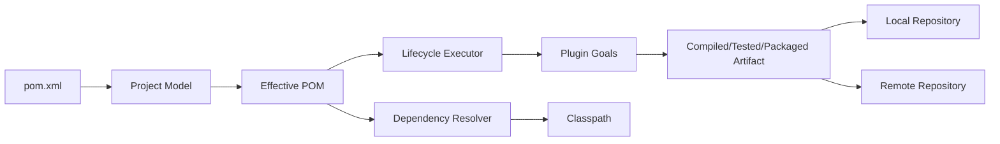
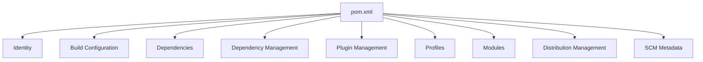
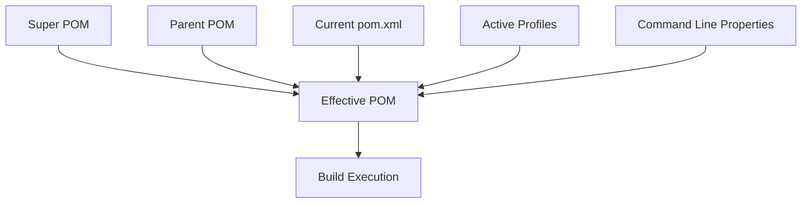
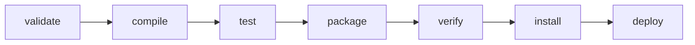
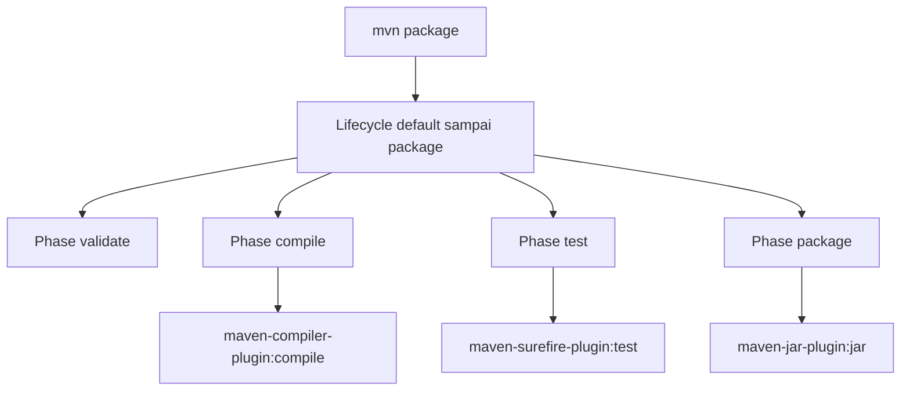
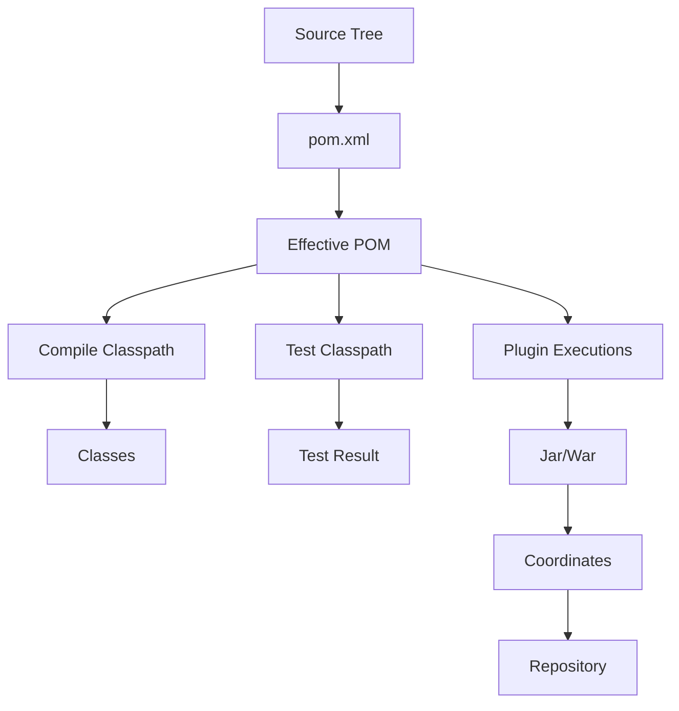

# Part 007 — Maven Mental Model: POM, Lifecycle, Plugins

> Tujuan bagian ini bukan membuat kita hafal command Maven. Tujuannya adalah membentuk mental model agar setiap kali build Maven gagal, lambat, tidak deterministik, atau sulit dipromosikan ke release, kita tahu lapisan mana yang harus dibaca: **project model**, **lifecycle**, **plugin execution**, **dependency graph**, **repository**, atau **environment configuration**.

Materi ini menjadi awal fase Maven deep dive. Kita belum membahas dependency resolution secara penuh karena itu akan menjadi Part 008. Kita juga belum masuk ke multi-module reactor secara dalam karena itu akan menjadi Part 009.

Di bagian ini kita fokus pada satu pertanyaan inti:

> Ketika kita mengetik `mvn clean verify`, apa sebenarnya yang sedang terjadi?

---

## 1. Posisi Maven dalam Skill Map Kaufman

Dalam kerangka Josh Kaufman, kita perlu memecah skill besar menjadi sub-skill kecil yang bisa dilatih dan dikoreksi. “Menguasai Maven” bukan satu skill tunggal. Ia adalah gabungan dari beberapa kemampuan.

| Sub-skill | Pertanyaan yang harus bisa dijawab | Output kemampuan |
|---|---|---|
| Project model | Apa identitas project ini? Apa packaging-nya? Apa parent-nya? | Bisa membaca dan mendesain `pom.xml` sebagai kontrak project |
| Lifecycle model | Phase apa yang berjalan ketika command tertentu dipanggil? | Bisa memprediksi urutan build tanpa trial-and-error |
| Plugin model | Goal plugin apa yang di-bind ke phase? Dari mana konfigurasinya datang? | Bisa debug behavior build yang tidak terlihat dari source code |
| Effective model | POM final setelah inheritance, profile, pluginManagement, dependencyManagement seperti apa? | Bisa mendiagnosis konfigurasi tersembunyi |
| Environment model | Apa yang ada di `settings.xml`, local repository, mirror, credential, proxy? | Bisa membedakan project problem vs machine/CI problem |
| Release model | Artifact apa yang diproduksi, ke repository mana dipublish, dengan version apa? | Bisa membangun pipeline release yang immutable dan repeatable |

Kaufman menekankan “learn enough to self-correct”. Dalam konteks Maven, self-correction berarti kita tidak hanya tahu command, tetapi tahu **query diagnostik** yang tepat:

```bash
mvn help:effective-pom
mvn help:effective-settings
mvn dependency:tree
mvn -X clean verify
mvn -DskipTests package
mvn -DskipITs verify
```

Command ini bukan mantra. Ia adalah alat untuk melihat model internal Maven.

---

## 2. Maven dalam Satu Mental Model

Maven sering disebut build tool, tetapi itu terlalu sempit. Untuk engineer senior, Maven sebaiknya dipahami sebagai:

> **Project model + dependency resolver + lifecycle executor + plugin runtime + artifact publisher.**



Maven tidak menjalankan “file script” secara bebas seperti shell script. Maven membaca model project, menggabungkannya dengan default, inheritance, profile, settings, lalu mengeksekusi lifecycle phase melalui plugin goal yang terikat pada phase tersebut.

Inilah sumber kekuatan Maven sekaligus sumber kebingungannya:

- banyak behavior tidak eksplisit di `pom.xml` karena datang dari convention dan default binding;
- konfigurasi bisa datang dari parent POM, super POM, profile, plugin default, settings, atau command line;
- command yang terlihat sederhana bisa memicu banyak phase dan plugin execution;
- artifact yang dihasilkan bukan hanya file, tetapi bagian dari graph repository.

---

## 3. POM sebagai Project Contract

POM adalah **Project Object Model**. Secara praktis, `pom.xml` adalah kontrak yang menjawab:

1. Project ini siapa?
2. Project ini menghasilkan artifact apa?
3. Project ini butuh dependency apa?
4. Project ini dibuild dengan plugin apa?
5. Project ini mengikuti parent/convention apa?
6. Project ini dipublish ke mana?

Contoh POM minimal:

```xml
<project xmlns="http://maven.apache.org/POM/4.0.0"
         xmlns:xsi="http://www.w3.org/2001/XMLSchema-instance"
         xsi:schemaLocation="http://maven.apache.org/POM/4.0.0 https://maven.apache.org/xsd/maven-4.0.0.xsd">
    <modelVersion>4.0.0</modelVersion>

    <groupId>com.acme.payments</groupId>
    <artifactId>payment-api</artifactId>
    <version>1.4.0</version>
    <packaging>jar</packaging>

    <properties>
        <maven.compiler.release>21</maven.compiler.release>
        <project.build.sourceEncoding>UTF-8</project.build.sourceEncoding>
    </properties>
</project>
```

POM minimal ini sudah cukup untuk membentuk identitas artifact:

```text
com.acme.payments:payment-api:jar:1.4.0
```

Dalam ekosistem Maven, artifact bukan sekadar file `target/payment-api-1.4.0.jar`. Artifact adalah entitas dengan **coordinates**.

---

## 4. Coordinates: Identitas Artifact

Maven coordinates biasanya dipahami sebagai GAV:

```text
groupId:artifactId:version
```

Namun dalam resolution sebenarnya, identitas artifact bisa mencakup:

```text
groupId:artifactId:packaging/classifier:version
```

Contoh:

```text
com.acme.risk:risk-engine:jar:2.3.1
com.acme.risk:risk-engine:jar:sources:2.3.1
com.acme.risk:risk-engine:jar:javadoc:2.3.1
com.acme.risk:risk-engine:test-jar:tests:2.3.1
```

Makna setiap bagian:

| Elemen | Fungsi |
|---|---|
| `groupId` | Namespace organisasi/domain kepemilikan |
| `artifactId` | Nama unit artifact yang dipublish |
| `version` | Versi artifact yang digunakan untuk resolution dan release |
| `packaging` | Jenis artifact dan default lifecycle binding |
| `classifier` | Variasi artifact tambahan dari project yang sama |

Kesalahan umum adalah memperlakukan `artifactId` sebagai nama aplikasi saja. Untuk library dan enterprise platform, `artifactId` harus merepresentasikan **unit reuse** atau **unit deployment** yang jelas.

Contoh buruk:

```text
com.company:common:1.0.0
com.company:utils:1.0.0
com.company:shared:1.0.0
```

Contoh lebih baik:

```text
com.company.identity:identity-token-verifier:1.0.0
com.company.audit:audit-event-contract:1.0.0
com.company.payments:payment-state-machine-core:1.0.0
```

Nama artifact yang baik menjelaskan batas tanggung jawab. Ini memudahkan dependency governance, release note, ownership, dan incident analysis.

---

## 5. POM Bukan Build Script Biasa

POM punya beberapa lapisan informasi:



Masing-masing lapisan punya peran berbeda.

| Bagian POM | Peran | Kesalahan umum |
|---|---|---|
| `groupId/artifactId/version` | Identitas artifact | Version tidak jelas, artifact terlalu generik |
| `properties` | Parameter build/project | Terlalu banyak property tanpa struktur |
| `dependencies` | Dependency aktual project | Menaruh versi sembarangan tanpa governance |
| `dependencyManagement` | Aturan versi dependency | Disangka otomatis menambahkan dependency |
| `build/plugins` | Plugin yang benar-benar aktif | Plugin version tidak dipin |
| `pluginManagement` | Default config untuk plugin | Disangka otomatis menjalankan plugin |
| `profiles` | Variasi model untuk kondisi tertentu | Dipakai sebagai environment switch yang berbahaya |
| `modules` | Daftar child modules dalam aggregator | Disamakan dengan package/module Java |
| `distributionManagement` | Target publish release/snapshot | Credential disimpan di POM |

Invariant penting:

> `dependencyManagement` dan `pluginManagement` adalah **management**, bukan activation.

Artinya, keduanya menyediakan versi/configuration default, tetapi dependency/plugin tetap harus dinyatakan atau terikat agar aktif.

---

## 6. Super POM dan Effective POM

Ketika kita melihat `pom.xml`, kita belum melihat model final yang Maven gunakan. Maven menggabungkan beberapa sumber:

1. Super POM Maven.
2. Parent POM.
3. Current project POM.
4. Active profiles.
5. Settings.
6. Command-line properties.
7. Plugin defaults.

Hasil akhirnya disebut **effective POM**.



Untuk melihatnya:

```bash
mvn help:effective-pom
```

Dalam enterprise build, banyak masalah muncul karena engineer membaca `pom.xml` lokal tetapi lupa bahwa behavior sebenarnya datang dari parent POM atau corporate BOM.

Contoh gejala:

- compiler tiba-tiba memakai release Java tertentu;
- Surefire menjalankan test dengan pattern tertentu;
- JAR punya manifest tambahan;
- plugin enforcer menggagalkan build;
- dependency version muncul padahal tidak ditulis di module POM.

Debug pertama bukan menebak. Debug pertama adalah melihat effective model.

---

## 7. Maven Lifecycle: Phase Bukan Command Tunggal

Maven punya built-in lifecycle. Yang paling sering digunakan:

| Lifecycle | Fungsi |
|---|---|
| `clean` | Membersihkan output build sebelumnya |
| `default` | Build, test, package, verify, install, deploy |
| `site` | Membuat dokumentasi/site project |

Ketika kita menjalankan:

```bash
mvn clean verify
```

Maven menjalankan:

1. lifecycle `clean` sampai phase `clean`;
2. lifecycle `default` sampai phase `verify`.

Phase bukan task mandiri. Phase adalah titik dalam urutan lifecycle. Jika kita memanggil phase yang lebih akhir, phase sebelumnya ikut berjalan.

Contoh phase penting dalam default lifecycle:

| Phase | Makna praktis |
|---|---|
| `validate` | Validasi project model cukup benar untuk build |
| `compile` | Compile source utama |
| `test` | Jalankan unit test |
| `package` | Buat artifact seperti JAR/WAR |
| `verify` | Jalankan verifikasi tambahan/integration checks |
| `install` | Install artifact ke local repository |
| `deploy` | Publish artifact ke remote repository |



Implikasi penting:

- `mvn test` tidak menghasilkan release artifact final seperti `package`;
- `mvn package` tidak otomatis publish artifact ke remote repository;
- `mvn install` menaruh artifact ke local repo, bukan release repository;
- `mvn deploy` berbahaya jika dipakai sembarangan di laptop developer;
- `mvn verify` sering lebih tepat untuk CI daripada `mvn package`, karena memberi tempat untuk quality gates.

---

## 8. Goal: Kerja Aktual Dilakukan oleh Plugin

Lifecycle phase sendiri tidak “melakukan pekerjaan” secara langsung. Pekerjaan aktual dilakukan oleh **plugin goals**.

Contoh:

```bash
mvn compiler:compile
mvn surefire:test
mvn jar:jar
mvn dependency:tree
```

Di sini:

- `compiler` adalah plugin prefix;
- `compile` adalah goal;
- `surefire:test` adalah goal untuk menjalankan unit test;
- `jar:jar` adalah goal untuk membuat JAR.

Hubungan antara lifecycle dan plugin:



Dengan kata lain:

> Phase adalah **kapan**. Plugin goal adalah **apa yang dikerjakan**.

Ini adalah mental model paling penting untuk Maven debugging.

---

## 9. Packaging Mengubah Default Plugin Binding

Elemen `packaging` bukan sekadar ekstensi file output. Ia mempengaruhi default lifecycle binding.

Contoh:

```xml
<packaging>jar</packaging>
```

Untuk packaging `jar`, phase tertentu punya default plugin goals. Misalnya compile source, menjalankan test, membuat JAR.

Untuk packaging `war`, Maven akan menggunakan plugin yang relevan untuk membuat WAR.

Untuk packaging `pom`, project biasanya tidak menghasilkan binary artifact utama, tetapi berperan sebagai parent atau aggregator.

| Packaging | Umum dipakai untuk | Catatan |
|---|---|---|
| `jar` | Library atau executable Java artifact | Default paling umum |
| `war` | Web application untuk servlet container/app server | Masih relevan untuk legacy/app server deployment |
| `pom` | Parent POM atau aggregator multi-module | Tidak sama dengan Java module |
| custom packaging | Framework/build khusus | Harus dipahami plugin binding-nya |

Kesalahan umum:

```xml
<packaging>pom</packaging>
```

lalu berharap module itu menghasilkan JAR. Tidak akan. Packaging `pom` berarti project itu terutama model/aggregator/parent, bukan artifact binary biasa.

---

## 10. Plugin Configuration: Global, Execution, dan Inheritance

Plugin bisa dikonfigurasi di beberapa tempat.

Contoh konfigurasi compiler:

```xml
<build>
    <plugins>
        <plugin>
            <groupId>org.apache.maven.plugins</groupId>
            <artifactId>maven-compiler-plugin</artifactId>
            <version>3.13.0</version>
            <configuration>
                <release>21</release>
            </configuration>
        </plugin>
    </plugins>
</build>
```

Contoh plugin dengan execution eksplisit:

```xml
<build>
    <plugins>
        <plugin>
            <groupId>org.apache.maven.plugins</groupId>
            <artifactId>maven-enforcer-plugin</artifactId>
            <version>3.5.0</version>
            <executions>
                <execution>
                    <id>enforce-build-rules</id>
                    <phase>validate</phase>
                    <goals>
                        <goal>enforce</goal>
                    </goals>
                    <configuration>
                        <rules>
                            <requireJavaVersion>
                                <version>[21,)</version>
                            </requireJavaVersion>
                        </rules>
                    </configuration>
                </execution>
            </executions>
        </plugin>
    </plugins>
</build>
```

Perbedaan penting:

| Konfigurasi | Makna |
|---|---|
| `<configuration>` langsung di plugin | Default configuration untuk goal plugin itu |
| `<executions>` | Mengikat goal ke phase tertentu atau memberi konfigurasi per execution |
| `<phase>` | Phase lifecycle tempat execution berjalan |
| `<goals>` | Goal plugin yang dijalankan |
| `<id>` | Identitas execution, penting untuk inheritance/override |

Plugin execution adalah salah satu area yang sering menyebabkan behavior “misterius”. Jika sebuah parent POM mengikat enforcer ke `validate`, semua child module bisa gagal bahkan bila child POM tidak menulis enforcer sama sekali.

---

## 11. `pluginManagement` vs `plugins`

Ini salah satu sumber bug paling umum.

```xml
<build>
    <pluginManagement>
        <plugins>
            <plugin>
                <groupId>org.apache.maven.plugins</groupId>
                <artifactId>maven-surefire-plugin</artifactId>
                <version>3.2.5</version>
            </plugin>
        </plugins>
    </pluginManagement>
</build>
```

Konfigurasi di atas **tidak berarti Surefire baru saja diaktifkan secara eksplisit**. Ia hanya menyediakan versi/config default untuk saat plugin itu dipakai.

Untuk plugin yang sudah punya default binding dari packaging, pluginManagement bisa mempengaruhi versi/config plugin tersebut. Untuk plugin yang tidak punya default binding, kita tetap perlu menaruh plugin di `<plugins>` dan/atau execution.

Perbandingan:

| Section | Fungsi | Menjalankan plugin? |
|---|---|---|
| `pluginManagement` | Menyediakan versi/config default | Tidak langsung |
| `plugins` | Menyatakan plugin aktif dalam build | Bisa, tergantung binding/execution |
| `executions` | Mengikat goal ke phase | Ya, saat phase tercapai |

Rule enterprise:

> Pin semua plugin version di parent `pluginManagement`, lalu aktifkan hanya plugin yang benar-benar dibutuhkan melalui `plugins`/execution yang jelas.

Mengandalkan plugin version default dari Maven adalah risiko reproduksibilitas. Build hari ini dan build masa depan bisa memakai plugin version berbeda jika environment/tooling berubah.

---

## 12. Dependency dan Plugin Itu Dua Dunia Berbeda

Maven punya dependency untuk application/library dan dependency untuk plugin runtime. Jangan campur mental modelnya.

Application dependency:

```xml
<dependencies>
    <dependency>
        <groupId>org.slf4j</groupId>
        <artifactId>slf4j-api</artifactId>
        <version>2.0.13</version>
    </dependency>
</dependencies>
```

Plugin dependency:

```xml
<build>
    <plugins>
        <plugin>
            <groupId>org.apache.maven.plugins</groupId>
            <artifactId>maven-checkstyle-plugin</artifactId>
            <version>3.3.1</version>
            <dependencies>
                <dependency>
                    <groupId>com.puppycrawl.tools</groupId>
                    <artifactId>checkstyle</artifactId>
                    <version>10.17.0</version>
                </dependency>
            </dependencies>
        </plugin>
    </plugins>
</build>
```

Application dependency masuk ke classpath project. Plugin dependency masuk ke classpath plugin execution.

Jika Checkstyle butuh versi engine tertentu, itu plugin dependency. Jangan masukkan ke application dependency hanya agar plugin bekerja.

---

## 13. `settings.xml`: Environment, Bukan Project Contract

POM adalah project contract. `settings.xml` adalah environment/user/machine configuration.

Biasanya berada di:

```text
~/.m2/settings.xml
```

Atau global Maven installation settings.

`settings.xml` cocok untuk:

- credentials;
- mirrors;
- proxy;
- local repository override;
- server credentials by id;
- user-specific profile activation;
- corporate repository mirror.

POM cocok untuk:

- project identity;
- dependencies;
- build plugins;
- module list;
- distribution target id;
- SCM metadata;
- project-level properties.

Contoh `distributionManagement` di POM:

```xml
<distributionManagement>
    <repository>
        <id>company-releases</id>
        <url>https://repo.company.example/releases</url>
    </repository>
    <snapshotRepository>
        <id>company-snapshots</id>
        <url>https://repo.company.example/snapshots</url>
    </snapshotRepository>
</distributionManagement>
```

Credential-nya tidak ditaruh di POM, tetapi di `settings.xml`:

```xml
<settings>
    <servers>
        <server>
            <id>company-releases</id>
            <username>${env.REPO_USERNAME}</username>
            <password>${env.REPO_PASSWORD}</password>
        </server>
    </servers>
</settings>
```

Invariant:

> POM boleh menyebut **ke mana** artifact dipublish. POM tidak boleh menyimpan **secret** untuk publish.

---

## 14. Maven Wrapper: Pinning Entrypoint Build

Maven Wrapper memungkinkan project menyediakan script:

```text
mvnw
mvnw.cmd
.mvn/wrapper/maven-wrapper.properties
```

Tujuannya:

- developer tidak perlu install Maven manual;
- CI memakai Maven version yang sama dengan local;
- upgrade Maven bisa dilakukan per repository;
- build lebih reproducible.

Command:

```bash
./mvnw clean verify
```

Rule enterprise:

> CI harus menggunakan `./mvnw`, bukan `mvn` global, kecuali organisasi punya image build yang version-nya dipin dan dikelola secara eksplisit.

Maven Wrapper tidak menyelesaikan semua masalah reproduksibilitas. Kita masih perlu pin JDK, plugin versions, dependency versions, repository behavior, dan environment. Tapi wrapper adalah baseline penting.

---

## 15. Properties: Berguna, Tapi Bisa Menjadi Kabut

Properties sering dipakai untuk version dan konfigurasi:

```xml
<properties>
    <java.version>21</java.version>
    <maven.compiler.release>${java.version}</maven.compiler.release>
    <junit.jupiter.version>5.10.2</junit.jupiter.version>
</properties>
```

Ini baik jika:

- nama property jelas;
- property punya ownership;
- property dipakai untuk menyederhanakan governance;
- version dikelola di satu tempat.

Ini buruk jika:

```xml
<properties>
    <version>1.0.0</version>
    <common.version>2.1.0</common.version>
    <lib.version>3.0.0</lib.version>
    <new.version>4.0.0</new.version>
</properties>
```

Nama property yang buruk membuat dependency tree sulit dibaca. Untuk enterprise POM, property sebaiknya eksplisit:

```xml
<properties>
    <junit.jupiter.version>5.10.2</junit.jupiter.version>
    <testcontainers.version>1.19.8</testcontainers.version>
    <micrometer.version>1.13.1</micrometer.version>
</properties>
```

Namun untuk ekosistem besar, BOM biasanya lebih baik daripada ratusan version properties tersebar.

---

## 16. Profiles: Gunakan untuk Variasi Model, Bukan Menyembunyikan Environment

Maven profiles bisa mengubah model build berdasarkan activation tertentu.

Contoh:

```xml
<profiles>
    <profile>
        <id>native</id>
        <build>
            <plugins>
                <!-- native build plugin config -->
            </plugins>
        </build>
    </profile>
</profiles>
```

Aktivasi:

```bash
mvn -Pnative clean package
```

Profiles berguna untuk:

- build variant yang eksplisit;
- publishing variant;
- native image variant;
- optional static analysis;
- documentation generation.

Profiles berbahaya jika dipakai untuk:

- menyembunyikan dependency production;
- mengganti behavior test diam-diam;
- environment switch seperti `dev`, `qa`, `prod` yang mengubah artifact;
- membuat artifact berbeda dari source commit yang sama tanpa traceability.

Anti-pattern:

```bash
mvn -Pprod package
mvn -Pqa package
mvn -Pdev package
```

Jika tiga command di atas menghasilkan tiga binary artifact berbeda, maka kita kehilangan prinsip **build once, promote many**.

Lebih baik:

- build artifact sekali;
- konfigurasi environment disuntikkan saat deployment/runtime;
- artifact dipromosikan antar environment tanpa rebuild.

---

## 17. Maven Local Repository: Cache dan Artifact Store Lokal

Maven local repository biasanya berada di:

```text
~/.m2/repository
```

Fungsinya:

- menyimpan dependency yang diunduh;
- menyimpan artifact hasil `mvn install`;
- mengurangi kebutuhan download ulang;
- menjadi cache lokal untuk plugin dan artifact.

Masalah umum:

| Gejala | Kemungkinan penyebab |
|---|---|
| Build hanya berhasil di laptop tertentu | Artifact pernah di-`install` lokal tapi tidak dipublish remote |
| CI gagal resolve dependency internal | Dependency hanya ada di local `.m2`, bukan repository manager |
| Versi snapshot tidak update | Snapshot cache atau update policy |
| Build memakai artifact lama | Local repository stale/corrupt |

Rule:

> Artifact yang dibutuhkan oleh build tim tidak boleh hanya hidup di local repository developer.

Jika dependency internal dibutuhkan banyak project, publish ke repository manager. Jangan mengandalkan `mvn install` manual sebagai integration mechanism.

---

## 18. Maven Command Semantics yang Sering Disalahpahami

| Command | Arti sebenarnya | Kesalahan umum |
|---|---|---|
| `mvn compile` | Compile main source | Disangka menjalankan semua test |
| `mvn test` | Compile dan jalankan unit test | Disangka membuat deployable artifact |
| `mvn package` | Buat artifact di `target/` | Disangka publish artifact |
| `mvn verify` | Jalankan checks sampai verify | Sering dilewatkan di CI padahal cocok untuk quality gates |
| `mvn install` | Install artifact ke local repository | Disangka release internal |
| `mvn deploy` | Publish ke remote repository | Berbahaya jika dipakai tanpa release control |
| `mvn clean` | Hapus output build | Dipakai terlalu sering sebagai solusi malas |

`clean` sering dipakai berlebihan. Jika build hanya benar setelah `clean`, bisa jadi ada masalah incremental behavior, generated source, atau plugin output. Jangan langsung menerima `clean` sebagai ritual permanen.

---

## 19. `skipTests` vs `maven.test.skip`

Dua flag ini sering membingungkan.

```bash
mvn -DskipTests package
```

Umumnya skip eksekusi test, tetapi test sources masih bisa dikompilasi.

```bash
mvn -Dmaven.test.skip=true package
```

Umumnya skip kompilasi dan eksekusi test.

Dalam enterprise CI, jangan menyebarkan flag skip test tanpa policy. Lebih baik pisahkan pipeline:

- fast local build;
- pull-request verification;
- main branch verification;
- release verification.

Contoh:

```bash
./mvnw -DskipTests package       # local quick packaging
./mvnw verify                    # CI required gate
./mvnw -Pfull-verification verify # nightly/release gate
```

---

## 20. Parent POM vs Aggregator POM

Ini akan dibahas lebih dalam di Part 009, tetapi mental model dasarnya perlu ada sejak sekarang.

Parent POM digunakan untuk inheritance:

```xml
<parent>
    <groupId>com.acme.platform</groupId>
    <artifactId>java-service-parent</artifactId>
    <version>3.2.0</version>
</parent>
```

Aggregator POM digunakan untuk menjalankan multi-module build:

```xml
<modules>
    <module>payment-api</module>
    <module>payment-core</module>
    <module>payment-app</module>
</modules>
```

Satu POM bisa menjadi parent sekaligus aggregator, tetapi itu bukan keharusan.

| Peran | Mekanisme | Fungsi |
|---|---|---|
| Parent | `<parent>` | Inheritance configuration |
| Aggregator | `<modules>` | Build beberapa module bersama |

Kesalahan umum:

- mengira semua module dalam aggregator otomatis mewarisi parent yang sama;
- mengira parent harus selalu berada di repo yang sama;
- menggabungkan parent corporate dan aggregator application tanpa alasan jelas.

Enterprise guideline:

> Pisahkan mental model inheritance dari orchestration. Parent mengatur convention. Aggregator mengatur build set.

---

## 21. Corporate Parent POM: Platform Contract

Dalam organisasi besar, parent POM sering menjadi alat standardisasi.

Contoh isi corporate parent:

- Java release baseline;
- plugin versions;
- compiler configuration;
- surefire/failsafe policy;
- enforcer rules;
- static analysis;
- formatting;
- dependency management/BOM imports;
- repository policy;
- source encoding;
- reproducibility settings.

Contoh struktur:

```text
com.acme.platform:java-parent:3.2.0
com.acme.platform:java-library-parent:3.2.0
com.acme.platform:java-service-parent:3.2.0
com.acme.platform:spring-boot-service-parent:3.2.0
```

Jangan membuat parent POM menjadi tempat semua hal. Parent yang terlalu besar membuat semua service saling terikat pada konfigurasi yang tidak selalu relevan.

Rule:

> Parent POM harus berisi convention yang stabil, bukan eksperimen project tertentu.

Jika hanya satu service yang butuh plugin khusus, jangan paksakan ke corporate parent.

---

## 22. Maven sebagai Boundary antara Source dan Artifact

Maven bukan hanya alat compile. Ia menentukan bagaimana source berubah menjadi artifact.



Artifact yang baik punya properti:

- identitas jelas;
- versi jelas;
- dependency metadata benar;
- reproducible sejauh mungkin;
- bisa dipublish ke repository;
- bisa dipromosikan tanpa rebuild;
- bisa dilacak ke source commit;
- tidak mengandung secret;
- tidak bergantung pada local machine state.

Maven membantu sebagian dari properti ini, tetapi tidak menjaminnya otomatis. Governance tetap diperlukan.

---

## 23. Failure Model: Build Maven yang Tidak Sehat

| Failure | Gejala | Root cause umum | Cara investigasi |
|---|---|---|---|
| Hidden parent behavior | Child module gagal tanpa config lokal jelas | Parent POM mengikat plugin/ rule | `mvn help:effective-pom` |
| Plugin version drift | Build berbeda antar mesin | Plugin version tidak dipin | Cek effective POM dan pluginManagement |
| Local-only dependency | CI gagal resolve artifact internal | Dependency hanya ada di `.m2` lokal | Hapus `.m2`, build ulang, cek repository manager |
| Profile artifact drift | Artifact prod/qa/dev berbeda | Profile mengubah binary | Bandingkan artifact checksum |
| Settings mismatch | Local sukses, CI gagal auth/proxy | `settings.xml` berbeda | `mvn help:effective-settings` |
| Overused clean | Build hanya sukses dengan `clean` | Output/generated source tidak benar | Debug plugin inputs/outputs |
| Misplaced plugin dependency | App membawa dependency hanya untuk plugin | Salah taruh dependency | Cek dependency tree |
| Wrong lifecycle phase | Integration test tidak jalan | Plugin tidak terikat ke phase yang dipanggil | Cek executions dan command CI |

---

## 24. Diagnostic Workflow Saat Maven Build Gagal

Jangan mulai dari Stack Overflow. Mulai dari model.

### Step 1 — Reproduce dengan wrapper

```bash
./mvnw -version
./mvnw clean verify
```

Pastikan Maven dan JDK yang dipakai jelas.

### Step 2 — Lihat effective POM

```bash
./mvnw help:effective-pom -Doutput=effective-pom.xml
```

Cari plugin, dependencyManagement, profile, dan property yang relevan.

### Step 3 — Lihat effective settings

```bash
./mvnw help:effective-settings -Doutput=effective-settings.xml
```

Periksa mirror, server id, proxy, local repository, active profiles.

### Step 4 — Jalankan phase minimal

```bash
./mvnw validate
./mvnw compile
./mvnw test
./mvnw package
./mvnw verify
```

Cari phase pertama yang gagal. Ini mempersempit masalah.

### Step 5 — Aktifkan debug hanya saat perlu

```bash
./mvnw -X verify
```

`-X` sangat verbose. Gunakan setelah tahu area masalah.

### Step 6 — Isolasi profile

```bash
./mvnw help:active-profiles
./mvnw -Pprofile-name verify
```

Pastikan build tidak tergantung profile tersembunyi.

---

## 25. Design Guideline untuk POM Enterprise

POM enterprise yang sehat biasanya punya karakteristik berikut:

1. **Explicit plugin versions** melalui `pluginManagement`.
2. **Explicit Java release** melalui compiler plugin atau property standar.
3. **Centralized dependency versions** melalui BOM/dependencyManagement.
4. **No secrets** di POM.
5. **No environment-specific binary changes** melalui profile.
6. **Maven Wrapper committed**.
7. **CI command standardized**: biasanya `./mvnw verify` untuk PR dan `./mvnw deploy` hanya untuk release/publish pipeline.
8. **Parent POM stable** dan tidak terlalu banyak surprise.
9. **Effective POM debuggable**.
10. **Artifact identity meaningful**.

Contoh baseline POM untuk library kecil:

```xml
<project xmlns="http://maven.apache.org/POM/4.0.0"
         xmlns:xsi="http://www.w3.org/2001/XMLSchema-instance"
         xsi:schemaLocation="http://maven.apache.org/POM/4.0.0 https://maven.apache.org/xsd/maven-4.0.0.xsd">
    <modelVersion>4.0.0</modelVersion>

    <groupId>com.acme.audit</groupId>
    <artifactId>audit-event-contract</artifactId>
    <version>1.0.0-SNAPSHOT</version>
    <packaging>jar</packaging>

    <properties>
        <maven.compiler.release>21</maven.compiler.release>
        <project.build.sourceEncoding>UTF-8</project.build.sourceEncoding>
    </properties>

    <build>
        <pluginManagement>
            <plugins>
                <plugin>
                    <groupId>org.apache.maven.plugins</groupId>
                    <artifactId>maven-compiler-plugin</artifactId>
                    <version>3.13.0</version>
                    <configuration>
                        <release>${maven.compiler.release}</release>
                    </configuration>
                </plugin>
                <plugin>
                    <groupId>org.apache.maven.plugins</groupId>
                    <artifactId>maven-surefire-plugin</artifactId>
                    <version>3.2.5</version>
                </plugin>
            </plugins>
        </pluginManagement>
    </build>
</project>
```

Untuk organisasi besar, konfigurasi ini biasanya dipindah ke parent POM agar tiap project tidak mengulang.

---

## 26. Latihan Deliberate Practice

### Latihan 1 — Baca effective POM

Ambil satu project Maven. Jalankan:

```bash
./mvnw help:effective-pom -Doutput=effective-pom.xml
```

Jawab:

- plugin apa saja yang aktif?
- dari mana versi compiler plugin datang?
- apakah ada parent POM?
- apakah ada profile aktif?
- apa packaging project?
- phase mana yang punya execution tambahan?

### Latihan 2 — Prediksi lifecycle

Sebelum menjalankan command, tulis prediksi pekerjaan yang terjadi:

```bash
./mvnw test
./mvnw package
./mvnw verify
./mvnw install
```

Lalu jalankan dan bandingkan dengan output log.

### Latihan 3 — Plugin binding eksplisit

Tambahkan Maven Enforcer Plugin ke phase `validate` untuk memaksa Java minimal 21. Pastikan failure terjadi di phase `validate`, bukan di tengah compile.

### Latihan 4 — Parent vs local config

Buat parent POM kecil yang mem-pinning plugin version. Buat child module yang mewarisi parent. Buktikan via effective POM bahwa child menerima konfigurasi parent.

### Latihan 5 — Profile safety check

Buat profile `extra-checks` yang menjalankan plugin tambahan. Pastikan artifact binary tidak berubah saat profile diaktifkan, kecuali memang profile tersebut adalah build variant yang diberi classifier/version berbeda.

---

## 27. Checklist Self-Assessment

Kita siap lanjut ke dependency resolution jika sudah bisa menjawab tanpa menebak:

- Apa beda phase dan goal?
- Apa yang terjadi saat menjalankan `mvn clean verify`?
- Apa beda `plugins` dan `pluginManagement`?
- Apa beda POM dan `settings.xml`?
- Apa arti `packaging=pom`?
- Apa itu effective POM?
- Mengapa Maven Wrapper penting?
- Mengapa profile `prod` yang mengubah artifact adalah risiko?
- Mengapa `mvn install` bukan release?
- Dari mana plugin version final bisa berasal?

Jika jawaban masih berupa hafalan command, ulangi bagian mental model. Jika sudah bisa menjelaskan flow-nya, lanjut ke Part 008.

---

## 28. Ringkasan

Maven adalah build system berbasis model. Ia membaca POM, membentuk effective POM, menyelesaikan dependency, lalu menjalankan lifecycle phase melalui plugin goals. Untuk engineer senior, Maven harus dipahami sebagai boundary antara source code dan artifact release.

Konsep yang harus tertanam:

- POM adalah project contract.
- Coordinates adalah identitas artifact.
- Lifecycle phase menentukan urutan.
- Plugin goal melakukan pekerjaan aktual.
- Packaging mempengaruhi default plugin binding.
- Effective POM adalah model final yang harus dibaca saat debugging.
- `settings.xml` adalah environment config, bukan project definition.
- Maven Wrapper membantu pin entrypoint build.
- Profiles harus eksplisit dan tidak boleh diam-diam menciptakan artifact drift.

Part berikutnya akan masuk ke dependency resolution: bagaimana Maven membangun dependency graph, memilih version saat conflict, memakai scope, optional dependency, exclusions, BOM, dan dependencyManagement.

---

## Referensi Faktual Utama

- Apache Maven — Introduction to the Build Lifecycle: https://maven.apache.org/guides/introduction/introduction-to-the-lifecycle.html
- Apache Maven — Introduction to the POM: https://maven.apache.org/guides/introduction/introduction-to-the-pom.html
- Apache Maven — POM Reference: https://maven.apache.org/pom.html
- Apache Maven — Guide to Configuring Plug-ins: https://maven.apache.org/guides/mini/guide-configuring-plugins.html
- Apache Maven — Introduction to the Dependency Mechanism: https://maven.apache.org/guides/introduction/introduction-to-dependency-mechanism.html
