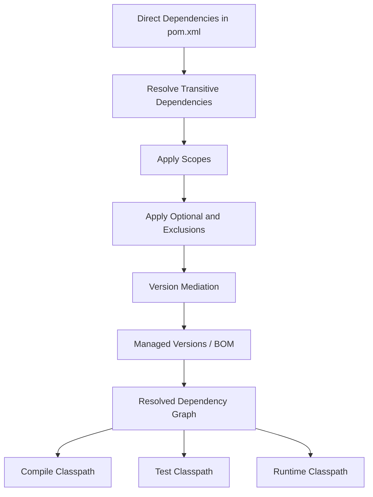
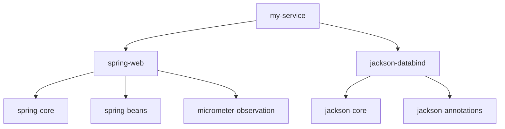
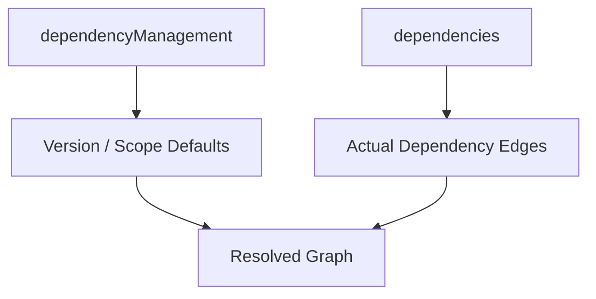
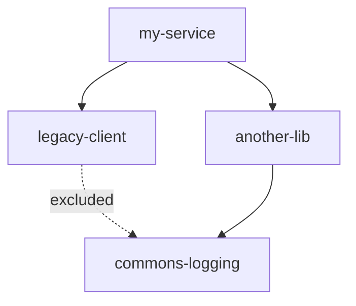
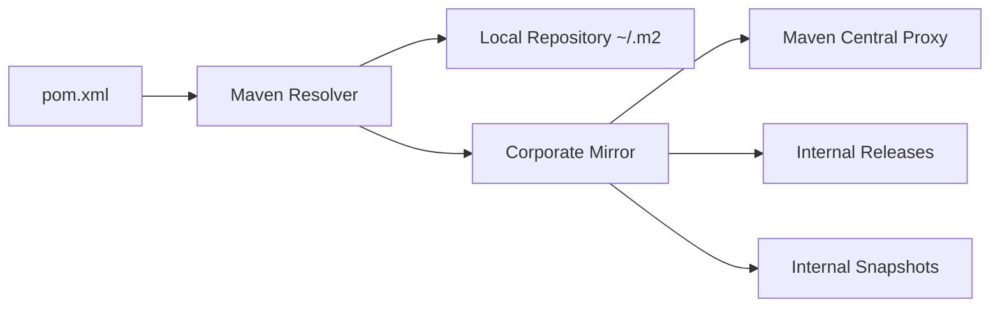

# Part 008 — Maven Dependency Resolution

> Dependency resolution adalah salah satu tempat paling penting untuk membedakan engineer yang “bisa pakai Maven” dari engineer yang mampu menjaga sistem besar tetap stabil. Banyak production bug Java bukan karena business logic salah, tetapi karena classpath berisi versi library yang tidak kita pikir sedang dipakai.

Di Part 007, kita mempelajari Maven sebagai project model, lifecycle executor, dan plugin runtime. Sekarang kita masuk ke mesin dependency resolution.

Pertanyaan inti bagian ini:

> Ketika POM hanya mendeklarasikan beberapa dependency, bagaimana Maven menentukan ratusan JAR yang akhirnya masuk ke compile/test/runtime classpath?

---

## 1. Posisi Dependency Resolution dalam Kerangka Kaufman

Dalam deconstruction Kaufman, dependency management harus dipecah menjadi beberapa sub-skill:

| Sub-skill | Pertanyaan kunci | Output kemampuan |
|---|---|---|
| Dependency graph reading | Dependency mana yang langsung, mana yang transitive? | Bisa membaca `dependency:tree` sebagai graph, bukan log |
| Scope reasoning | Dependency ini masuk classpath mana? | Bisa memprediksi compile/test/runtime behavior |
| Conflict mediation | Jika ada dua versi library, Maven pilih yang mana? | Bisa menjelaskan dan memperbaiki version conflict |
| Version governance | Di mana versi harus dikelola? | Bisa mendesain BOM/dependencyManagement |
| Optional/exclusion reasoning | Kapan dependency harus optional atau excluded? | Bisa mengurangi bloat tanpa merusak consumer |
| Convergence enforcement | Bagaimana mencegah graph liar? | Bisa menambahkan guardrail build |
| Diagnostic workflow | Command apa yang harus dijalankan saat konflik? | Bisa self-correct tanpa menebak |

Mental model utama:



Dependency resolution bukan hanya mencari file JAR. Ini adalah proses membentuk graph, memilih versi, dan memfilter classpath.

---

## 2. Dependency Graph sebagai Arsitektur Tersembunyi

Setiap dependency yang kita tambahkan adalah edge baru dalam graph. Edge itu membawa konsekuensi:

- API baru yang bisa dipakai developer;
- transitive dependencies baru;
- classpath collision risk;
- CVE exposure;
- license obligation;
- startup/memory impact;
- binary compatibility risk;
- release coordination risk.

Contoh POM sederhana:

```xml
<dependencies>
    <dependency>
        <groupId>org.springframework</groupId>
        <artifactId>spring-web</artifactId>
        <version>6.1.8</version>
    </dependency>

    <dependency>
        <groupId>com.fasterxml.jackson.core</groupId>
        <artifactId>jackson-databind</artifactId>
        <version>2.17.1</version>
    </dependency>
</dependencies>
```

Yang tampak hanya dua dependency. Namun setiap dependency bisa membawa dependency lain.



Untuk engineer senior, dependency graph adalah bagian dari arsitektur. Ia harus direview seperti kita mereview API, database schema, atau state machine.

---

## 3. Direct vs Transitive Dependency

**Direct dependency** adalah dependency yang ditulis langsung di POM project kita.

```xml
<dependency>
    <groupId>org.slf4j</groupId>
    <artifactId>slf4j-api</artifactId>
    <version>2.0.13</version>
</dependency>
```

**Transitive dependency** adalah dependency yang dibawa oleh dependency lain.

Misalnya:

```text
my-service
└── library-a
    └── library-b
        └── library-c
```

Jika `my-service` hanya mendeklarasikan `library-a`, maka `library-b` dan `library-c` adalah transitive dependencies.

Rule praktis:

> Jika source code kita langsung meng-import tipe dari sebuah library, library itu sebaiknya menjadi direct dependency.

Contoh buruk:

```java
import com.fasterxml.jackson.databind.ObjectMapper;
```

Tetapi `pom.xml` tidak punya direct dependency ke `jackson-databind` karena Jackson kebetulan datang dari Spring Boot starter.

Masalahnya:

- source code kita bergantung pada Jackson;
- POM tidak menyatakan dependency itu secara eksplisit;
- jika starter berubah dan tidak lagi membawa Jackson, code kita rusak;
- ownership dependency menjadi kabur.

Lebih baik:

```xml
<dependency>
    <groupId>com.fasterxml.jackson.core</groupId>
    <artifactId>jackson-databind</artifactId>
</dependency>
```

Jika memakai BOM/platform, version bisa dikelola terpusat, tetapi dependency tetap direct.

---

## 4. Maven Dependency Declaration Anatomy

Satu dependency declaration bisa berisi:

```xml
<dependency>
    <groupId>com.acme.risk</groupId>
    <artifactId>risk-engine-client</artifactId>
    <version>2.4.1</version>
    <type>jar</type>
    <classifier>jdk21</classifier>
    <scope>compile</scope>
    <optional>false</optional>
    <exclusions>
        <exclusion>
            <groupId>commons-logging</groupId>
            <artifactId>commons-logging</artifactId>
        </exclusion>
    </exclusions>
</dependency>
```

Field paling umum:

| Field | Makna |
|---|---|
| `groupId` | Namespace artifact |
| `artifactId` | Nama artifact |
| `version` | Versi artifact, kecuali dikelola dependencyManagement |
| `type` | Jenis artifact, default `jar` |
| `classifier` | Variasi artifact |
| `scope` | Classpath/filtering semantics |
| `optional` | Apakah dependency ini transitively inherited consumer |
| `exclusions` | Edge transitive mana yang dipotong |

Jangan mengisi semua field hanya agar terlihat lengkap. Semakin banyak deklarasi, semakin besar surface area untuk salah konfigurasi.

---

## 5. Scope: Dependency Masuk Classpath Mana?

Maven scope menentukan kapan dependency tersedia.

| Scope | Tersedia saat compile? | Tersedia saat test? | Tersedia saat runtime? | Umum untuk |
|---|---:|---:|---:|---|
| `compile` | Ya | Ya | Ya | Dependency utama/default |
| `provided` | Ya | Ya | Tidak disertakan sebagai runtime dependency aplikasi | Servlet API, container-provided API |
| `runtime` | Tidak untuk compile main | Ya | Ya | JDBC driver, runtime implementation |
| `test` | Tidak | Ya | Tidak untuk runtime aplikasi | JUnit, Mockito, test fixtures |
| `system` | Ya | Ya | Bergantung path lokal | Hindari; tidak portable |
| `import` | Khusus dependencyManagement BOM | Tidak langsung ke classpath | BOM import |

### 5.1 `compile`

Default scope.

```xml
<dependency>
    <groupId>org.slf4j</groupId>
    <artifactId>slf4j-api</artifactId>
    <version>2.0.13</version>
</dependency>
```

Gunakan untuk API/library yang dibutuhkan source utama dan runtime.

### 5.2 `provided`

Dependency tersedia saat compile, tetapi diasumsikan disediakan runtime environment.

```xml
<dependency>
    <groupId>jakarta.servlet</groupId>
    <artifactId>jakarta.servlet-api</artifactId>
    <version>6.0.0</version>
    <scope>provided</scope>
</dependency>
```

Cocok untuk WAR yang berjalan di servlet container. Berbahaya jika dipakai pada executable JAR yang sebenarnya harus membawa semua runtime dependency sendiri.

### 5.3 `runtime`

Dependency tidak dibutuhkan untuk compile source utama, tetapi dibutuhkan saat runtime.

```xml
<dependency>
    <groupId>org.postgresql</groupId>
    <artifactId>postgresql</artifactId>
    <version>42.7.3</version>
    <scope>runtime</scope>
</dependency>
```

Cocok untuk JDBC driver jika code hanya bergantung pada `java.sql` atau abstraction yang tidak membutuhkan tipe driver langsung.

### 5.4 `test`

Dependency hanya untuk test.

```xml
<dependency>
    <groupId>org.junit.jupiter</groupId>
    <artifactId>junit-jupiter</artifactId>
    <version>5.10.2</version>
    <scope>test</scope>
</dependency>
```

Jangan biarkan test helper masuk ke main runtime classpath.

### 5.5 `system`

Scope ini menunjuk file lokal via path. Hindari.

```xml
<dependency>
    <groupId>com.vendor</groupId>
    <artifactId>legacy-driver</artifactId>
    <version>1.0</version>
    <scope>system</scope>
    <systemPath>${project.basedir}/lib/legacy-driver.jar</systemPath>
</dependency>
```

Ini merusak reproducibility dan repository governance. Lebih baik publish artifact ke repository internal.

### 5.6 `import`

Dipakai di `dependencyManagement` untuk mengimpor BOM.

```xml
<dependencyManagement>
    <dependencies>
        <dependency>
            <groupId>org.springframework.boot</groupId>
            <artifactId>spring-boot-dependencies</artifactId>
            <version>3.3.0</version>
            <type>pom</type>
            <scope>import</scope>
        </dependency>
    </dependencies>
</dependencyManagement>
```

`import` tidak menambahkan dependency ke project. Ia hanya mengimpor versi yang dikelola.

---

## 6. Scope Transitivity: Jangan Hanya Pahami Baris Lokal

Scope juga mempengaruhi bagaimana transitive dependency masuk ke downstream project.

Contoh:

```text
app
└── library-a compile
    └── library-b runtime
```

`library-b` bisa muncul sebagai runtime dependency app, tergantung kombinasi scope.

Poin penting:

- scope bukan hanya label dokumentasi;
- scope mempengaruhi compile/test/runtime classpath;
- scope transitive bisa mengejutkan;
- packaging plugin juga bisa memperlakukan scope berbeda.

Praktik senior:

1. Jalankan `dependency:tree` dengan scope berbeda.
2. Cek packaged artifact akhir.
3. Jangan asumsikan dependency tidak ikut hanya karena tidak direct.

Contoh command:

```bash
./mvnw dependency:tree -Dscope=compile
./mvnw dependency:tree -Dscope=runtime
./mvnw dependency:tree -Dscope=test
```

---

## 7. Dependency Mediation: Jika Ada Dua Versi, Maven Pilih Mana?

Dependency graph sering membawa versi berbeda untuk artifact yang sama.

Contoh:

```text
my-service
├── library-a
│   └── commons-codec:commons-codec:1.15
└── library-b
    └── commons-codec:commons-codec:1.16
```

Maven tidak memasukkan dua versi `commons-codec` ke classpath normal. Maven memilih satu versi melalui dependency mediation.

Rule utama Maven:

1. **Nearest definition wins** — dependency yang jalurnya paling dekat dari root project menang.
2. Jika kedalaman sama, **first declaration wins** — dependency yang lebih dulu dideklarasikan menang.
3. Direct dependency dari project root biasanya menang atas transitive dependency karena jaraknya lebih dekat.

Contoh 1 — nearest wins:

```text
my-service
├── commons-codec:commons-codec:1.16       <-- direct, depth 1, wins
└── library-a
    └── commons-codec:commons-codec:1.15   <-- transitive, depth 2
```

Contoh 2 — same depth, first declaration wins:

```xml
<dependencies>
    <dependency>
        <groupId>com.acme</groupId>
        <artifactId>library-a</artifactId>
        <version>1.0.0</version>
    </dependency>
    <dependency>
        <groupId>com.acme</groupId>
        <artifactId>library-b</artifactId>
        <version>1.0.0</version>
    </dependency>
</dependencies>
```

```text
my-service
├── library-a
│   └── commons-codec:commons-codec:1.15   <-- same depth, first branch wins
└── library-b
    └── commons-codec:commons-codec:1.16
```

Ini powerful tetapi berbahaya. Urutan dependency declaration bisa mengubah resolved version.

Rule enterprise:

> Jangan mengandalkan kebetulan nearest-wins untuk dependency penting. Kelola versi secara eksplisit melalui direct dependency atau `dependencyManagement`/BOM.

---

## 8. `dependencyManagement`: Mengatur Versi, Bukan Menambahkan Dependency

`dependencyManagement` memberi aturan versi/scope/default untuk dependency, tetapi tidak otomatis menambahkan dependency ke classpath.

Contoh:

```xml
<dependencyManagement>
    <dependencies>
        <dependency>
            <groupId>com.fasterxml.jackson.core</groupId>
            <artifactId>jackson-databind</artifactId>
            <version>2.17.1</version>
        </dependency>
    </dependencies>
</dependencyManagement>

<dependencies>
    <dependency>
        <groupId>com.fasterxml.jackson.core</groupId>
        <artifactId>jackson-databind</artifactId>
    </dependency>
</dependencies>
```

Dependency di `<dependencies>` tidak perlu menulis version karena version dikelola di `<dependencyManagement>`.

Salah kaprah:

```xml
<dependencyManagement>
    <dependencies>
        <dependency>
            <groupId>org.junit.jupiter</groupId>
            <artifactId>junit-jupiter</artifactId>
            <version>5.10.2</version>
            <scope>test</scope>
        </dependency>
    </dependencies>
</dependencyManagement>
```

Lalu mengira JUnit sudah tersedia. Belum. Kita tetap perlu:

```xml
<dependencies>
    <dependency>
        <groupId>org.junit.jupiter</groupId>
        <artifactId>junit-jupiter</artifactId>
        <scope>test</scope>
    </dependency>
</dependencies>
```

Mental model:



---

## 9. BOM: Bill of Materials

BOM adalah POM khusus yang berisi daftar dependency versions yang dikelola bersama.

Contoh import BOM:

```xml
<dependencyManagement>
    <dependencies>
        <dependency>
            <groupId>com.acme.platform</groupId>
            <artifactId>acme-java-platform-bom</artifactId>
            <version>2026.06.0</version>
            <type>pom</type>
            <scope>import</scope>
        </dependency>
    </dependencies>
</dependencyManagement>
```

Setelah BOM diimport:

```xml
<dependencies>
    <dependency>
        <groupId>com.acme.audit</groupId>
        <artifactId>audit-event-contract</artifactId>
    </dependency>
</dependencies>
```

Version datang dari BOM.

BOM berguna untuk:

- menjaga library ecosystem tetap aligned;
- menghindari version declaration tersebar;
- mempercepat security patch rollout;
- menyederhanakan migration wave;
- membuat dependency review lebih terpusat.

BOM buruk jika:

- terlalu besar dan memasukkan semua library organisasi;
- tidak punya ownership;
- tidak punya release notes;
- override sembarangan tanpa testing;
- dipakai untuk menyembunyikan dependency yang sebenarnya tidak dipahami.

---

## 10. BOM Layering

Dalam enterprise, satu project bisa mengimpor beberapa BOM.

Contoh:

```xml
<dependencyManagement>
    <dependencies>
        <dependency>
            <groupId>org.springframework.boot</groupId>
            <artifactId>spring-boot-dependencies</artifactId>
            <version>3.3.0</version>
            <type>pom</type>
            <scope>import</scope>
        </dependency>
        <dependency>
            <groupId>com.acme.platform</groupId>
            <artifactId>acme-security-bom</artifactId>
            <version>2026.06.0</version>
            <type>pom</type>
            <scope>import</scope>
        </dependency>
    </dependencies>
</dependencyManagement>
```

Masalahnya: bagaimana jika dua BOM mengatur artifact yang sama?

Kita perlu policy:

- BOM mana yang paling authoritative?
- Apakah internal BOM boleh override framework BOM?
- Bagaimana testing compatibility dilakukan?
- Apakah override dicatat dalam release notes?
- Siapa owner BOM?

Rule praktis:

> Layer BOM dari paling eksternal/framework ke paling internal/platform, lalu dokumentasikan override yang disengaja.

Namun jangan membuat terlalu banyak BOM layer. Setiap layer menambah cognitive cost.

---

## 11. Optional Dependencies

Optional dependency berarti dependency tersebut tidak otomatis diwariskan ke consumer.

Misalnya library `report-exporter` mendukung PDF dan Excel:

```xml
<dependencies>
    <dependency>
        <groupId>org.apache.poi</groupId>
        <artifactId>poi-ooxml</artifactId>
        <version>5.2.5</version>
        <optional>true</optional>
    </dependency>
</dependencies>
```

Jika aplikasi memakai `report-exporter`, dependency optional tidak otomatis ikut. Aplikasi harus menambahkan sendiri jika butuh fitur Excel.

```xml
<dependency>
    <groupId>com.acme.reporting</groupId>
    <artifactId>report-exporter</artifactId>
    <version>1.5.0</version>
</dependency>

<dependency>
    <groupId>org.apache.poi</groupId>
    <artifactId>poi-ooxml</artifactId>
    <version>5.2.5</version>
</dependency>
```

Optional cocok untuk:

- library dengan feature adapter optional;
- support banyak backend tetapi consumer hanya butuh satu;
- menghindari dependency berat untuk fitur yang jarang dipakai.

Optional buruk jika:

- dipakai untuk menyembunyikan dependency yang sebenarnya wajib;
- membuat runtime error karena consumer tidak tahu harus menambahkan dependency;
- menggantikan modularisasi yang seharusnya dilakukan.

Design lebih baik:

```text
report-exporter-core
report-exporter-pdf
report-exporter-excel
```

Daripada satu library besar dengan banyak optional dependency.

---

## 12. Exclusions: Memotong Edge Transitive

Exclusion menghapus dependency transitive tertentu dari edge tertentu.

```xml
<dependency>
    <groupId>com.acme.legacy</groupId>
    <artifactId>legacy-client</artifactId>
    <version>2.0.0</version>
    <exclusions>
        <exclusion>
            <groupId>commons-logging</groupId>
            <artifactId>commons-logging</artifactId>
        </exclusion>
    </exclusions>
</dependency>
```

Penting: exclusion berlaku pada dependency edge tersebut, bukan global untuk seluruh POM.



Jika `another-lib` juga membawa `commons-logging`, dependency itu masih bisa muncul.

Exclusion cocok untuk:

- mengganti implementation yang tidak diinginkan;
- menghapus dependency bermasalah dari library lama;
- mengurangi collision dengan platform dependency;
- memitigasi CVE sementara dengan replacement yang tested.

Exclusion berbahaya jika:

- dilakukan tanpa memahami kenapa dependency dibutuhkan;
- memotong dependency runtime yang diperlukan;
- menyelesaikan dependency tree tetapi menciptakan `ClassNotFoundException`;
- dilakukan berulang-ulang tanpa upstream fix.

Rule:

> Setiap exclusion harus punya komentar atau ADR kecil: dependency apa yang dipotong, kenapa aman, dan bagaimana diverifikasi.

Contoh:

```xml
<dependency>
    <groupId>com.acme.legacy</groupId>
    <artifactId>legacy-client</artifactId>
    <version>2.0.0</version>
    <exclusions>
        <!-- Excluded because platform standardizes logging via slf4j-api + logback.
             Verified by integration test LegacyClientLoggingIT. -->
        <exclusion>
            <groupId>commons-logging</groupId>
            <artifactId>commons-logging</artifactId>
        </exclusion>
    </exclusions>
</dependency>
```

---

## 13. Classpath Conflict: Compile Sukses, Runtime Gagal

Java classpath biasanya hanya memuat satu versi class tertentu berdasarkan urutan classpath. Maven mediation memilih satu artifact version, tetapi tidak menjamin binary compatibility.

Contoh failure:

```text
java.lang.NoSuchMethodError: 'void com.fasterxml.jackson.core.JsonFactory.<init>(...)'
```

Kemungkinan:

- code dikompilasi dengan versi library tertentu;
- runtime memakai versi lain;
- transitive dependency menurunkan versi;
- packaging/deployment environment membawa library sendiri;
- application server menyediakan library lama.

Maven bisa menunjukkan resolved dependency tree, tetapi runtime environment masih perlu diperiksa.

Diagnostic:

```bash
./mvnw dependency:tree -Dincludes=com.fasterxml.jackson.core
./mvnw dependency:tree -Dverbose
```

Untuk aplikasi yang dipackage ke container/app server, cek juga isi artifact akhir:

```bash
jar tf target/my-app.war | grep jackson
jar tf target/my-app.jar | grep jackson
```

Rule:

> Dependency resolution Maven adalah necessary condition untuk classpath sehat, bukan sufficient condition. Deployment packaging dan runtime classloader tetap harus dipahami.

---

## 14. Dependency Tree sebagai Alat Debug Utama

Command paling penting:

```bash
./mvnw dependency:tree
```

Filter artifact tertentu:

```bash
./mvnw dependency:tree -Dincludes=com.fasterxml.jackson.core:jackson-databind
```

Filter group:

```bash
./mvnw dependency:tree -Dincludes=com.fasterxml.jackson.core
```

Lihat scope tertentu:

```bash
./mvnw dependency:tree -Dscope=runtime
```

Output harus dibaca sebagai graph.

Contoh:

```text
com.acme:payment-service:jar:1.0.0
+- com.acme:payment-core:jar:1.0.0:compile
|  \- com.fasterxml.jackson.core:jackson-databind:jar:2.17.1:compile
|     +- com.fasterxml.jackson.core:jackson-annotations:jar:2.17.1:compile
|     \- com.fasterxml.jackson.core:jackson-core:jar:2.17.1:compile
\- com.acme:legacy-client:jar:2.1.0:compile
   \- (com.fasterxml.jackson.core:jackson-databind:jar:2.13.5:compile - omitted for conflict with 2.17.1)
```

Yang harus dicari:

- dependency direct vs transitive;
- versi yang dipilih;
- versi yang omitted;
- path asal dependency;
- scope dependency;
- dependency yang tidak diharapkan;
- duplicate library families.

---

## 15. Effective POM dan Dependency Management Debugging

Jika dependency muncul tanpa version di POM lokal, cari dari mana version-nya datang.

```bash
./mvnw help:effective-pom -Doutput=effective-pom.xml
```

Cari artifact:

```bash
grep -n "jackson-databind" effective-pom.xml
```

Kemungkinan sumber:

- parent POM;
- imported BOM;
- profile aktif;
- current POM dependencyManagement;
- framework parent seperti Spring Boot parent.

Jangan langsung menambahkan version lokal untuk “memperbaiki” masalah. Itu bisa menciptakan override liar.

Better workflow:

1. Temukan source of truth version.
2. Pahami kenapa version itu dipilih.
3. Jika perlu override, lakukan di layer yang benar.
4. Tambahkan test/guardrail.
5. Catat alasan override.

---

## 16. Dependency Convergence

Dependency convergence berarti graph tidak membawa beberapa versi berbeda untuk artifact yang sama.

Contoh tidak converge:

```text
my-service
├── library-a
│   └── jaxen:jaxen:1.1.3
└── library-b
    └── jaxen:jaxen:2.0.0
```

Maven akan memilih satu versi berdasarkan mediation, tetapi graph tetap menunjukkan konflik. Ini bisa aman, bisa juga berbahaya.

Maven Enforcer Plugin punya rule `dependencyConvergence` untuk menggagalkan build saat versi dependency tidak converge.

Contoh:

```xml
<plugin>
    <groupId>org.apache.maven.plugins</groupId>
    <artifactId>maven-enforcer-plugin</artifactId>
    <version>3.5.0</version>
    <executions>
        <execution>
            <id>enforce-dependency-convergence</id>
            <phase>validate</phase>
            <goals>
                <goal>enforce</goal>
            </goals>
            <configuration>
                <rules>
                    <dependencyConvergence />
                </rules>
            </configuration>
        </execution>
    </executions>
</plugin>
```

Convergence enforcement bagus untuk library/platform yang harus sangat bersih. Namun pada aplikasi besar, rule ini bisa noisy jika dependency ecosystem kompleks. Gunakan dengan policy yang realistis.

---

## 17. Require Upper Bound Dependencies

Rule `requireUpperBoundDeps` memastikan resolved dependency tidak lebih rendah dari versi tertinggi yang ditemukan dalam transitive dependencies.

Contoh:

```text
my-service
├── library-a
│   └── netty:netty-common:4.1.100
└── library-b
    └── netty:netty-common:4.1.108
```

Jika Maven memilih `4.1.100` karena nearest-wins, padahal ada transitive dependency yang butuh `4.1.108`, rule ini bisa menggagalkan build.

Contoh konfigurasi:

```xml
<requireUpperBoundDeps />
```

Rule ini sangat berguna untuk mencegah downgrade diam-diam.

Namun jangan blindly upgrade tanpa memahami compatibility. Versi lebih tinggi tidak selalu aman jika ada breaking change, meskipun semver seharusnya membantu.

---

## 18. Version Override: Direct Dependency vs Dependency Management

Ada beberapa cara mengubah versi dependency yang dipilih Maven.

### Cara 1 — Direct dependency

```xml
<dependencies>
    <dependency>
        <groupId>commons-codec</groupId>
        <artifactId>commons-codec</artifactId>
        <version>1.16.1</version>
    </dependency>
</dependencies>
```

Karena direct dependency dekat dari root, ia biasanya menang.

Cocok jika source code kita memang menggunakan dependency itu secara langsung.

### Cara 2 — Dependency management

```xml
<dependencyManagement>
    <dependencies>
        <dependency>
            <groupId>commons-codec</groupId>
            <artifactId>commons-codec</artifactId>
            <version>1.16.1</version>
        </dependency>
    </dependencies>
</dependencyManagement>
```

Cocok untuk mengontrol transitive version tanpa menambahkan direct dependency edge baru ke source code.

### Cara 3 — BOM/platform update

Update BOM yang menjadi source of truth:

```xml
<dependency>
    <groupId>com.acme.platform</groupId>
    <artifactId>acme-java-platform-bom</artifactId>
    <version>2026.07.0</version>
    <type>pom</type>
    <scope>import</scope>
</dependency>
```

Cocok untuk update terkoordinasi banyak project.

### Decision rule

| Situasi | Pilihan umum |
|---|---|
| Code kita import API dependency itu | Direct dependency |
| Ingin mengontrol transitive version | `dependencyManagement` |
| Ingin align banyak dependency dalam ecosystem | BOM |
| Ingin memotong dependency yang tidak boleh ada | Exclusion + replacement/test |
| Ingin temporary security patch | Dependency management override + ADR + test |

---

## 19. Snapshot vs Release Dependency

Maven mengenal version release dan snapshot.

Contoh release:

```xml
<version>1.4.2</version>
```

Contoh snapshot:

```xml
<version>1.4.3-SNAPSHOT</version>
```

Snapshot berarti versi mutable selama development. Repository dapat menyimpan timestamped snapshot build di balik versi logical `-SNAPSHOT`.

Risiko snapshot dependency:

- build tidak reproducible;
- artifact yang sama secara logical bisa berubah;
- CI hari ini dan besok bisa memakai binary berbeda;
- debugging production sulit;
- release artifact bisa tidak immutable jika snapshot bocor.

Rule enterprise:

> Release artifact tidak boleh bergantung pada `-SNAPSHOT` dependency.

CI bisa mengizinkan snapshot pada feature branch tertentu, tetapi release pipeline harus menolak.

Maven Enforcer bisa membantu melalui rule seperti `requireReleaseDeps`.

---

## 20. Dependency Repositories: Resolution Source

Dependency resolution membutuhkan repository.

Common sources:

- Maven Central;
- corporate repository manager;
- proxy/cache repository;
- internal release repository;
- internal snapshot repository;
- local repository.

Mental model:



Dalam enterprise, sebaiknya developer dan CI tidak langsung resolve ke internet sembarangan. Gunakan repository manager/mirror untuk:

- caching;
- audit;
- allowlist/blocklist;
- security scanning;
- retention policy;
- reproducibility;
- outage isolation.

Namun bagian repository governance akan dibahas lebih dalam di Part 019.

---

## 21. Dependency Security: Graph adalah Attack Surface

Setiap transitive dependency memperluas attack surface.

Dependency risk bukan hanya direct dependency. Banyak CVE masuk melalui transitive dependency yang tidak pernah ditulis developer di POM.

Praktik baseline:

```bash
./mvnw dependency:tree
./mvnw dependency:tree -Dscope=runtime
```

Lalu integrasikan dengan:

- SBOM generation;
- vulnerability scanning;
- license scanning;
- dependency update review;
- repository allowlist;
- signature/checksum verification;
- release provenance.

Security detail akan dibahas khusus di Part 020. Untuk sekarang, ingat:

> Dependency graph adalah bagian dari threat model.

---

## 22. Dependency Bloat

Dependency bloat terjadi ketika project membawa terlalu banyak library untuk tugas yang kecil atau historis.

Gejala:

- startup lambat;
- image besar;
- vulnerability scan noisy;
- classpath conflict sering;
- developer takut upgrade;
- test suite lambat;
- native-image sulit;
- shaded/fat JAR terlalu besar.

Cara audit:

```bash
./mvnw dependency:tree
./mvnw dependency:analyze
```

`dependency:analyze` bisa membantu menemukan used undeclared dan unused declared dependencies, tetapi jangan dianggap sempurna. Reflection, annotation processing, service loader, runtime loading, dan framework magic bisa membuat hasil perlu interpretasi manusia.

Decision rule:

- hapus dependency yang jelas tidak dipakai;
- jadikan direct dependency jika source code langsung memakai API;
- pisahkan module optional;
- hindari starter besar jika hanya butuh satu library kecil;
- review dependency baru seperti review design.

---

## 23. Case Study: Version Conflict yang Terlihat Aman tapi Berbahaya

Misalnya project:

```xml
<dependencies>
    <dependency>
        <groupId>com.acme</groupId>
        <artifactId>risk-client</artifactId>
        <version>1.8.0</version>
    </dependency>
    <dependency>
        <groupId>com.acme</groupId>
        <artifactId>case-client</artifactId>
        <version>2.4.0</version>
    </dependency>
</dependencies>
```

Tree:

```text
my-service
├── risk-client:1.8.0
│   └── validation-api:2.0.0
└── case-client:2.4.0
    └── validation-api:3.1.0
```

Maven memilih `validation-api:2.0.0` karena `risk-client` dideklarasikan lebih dulu pada depth yang sama.

Build compile sukses karena code kita tidak langsung memakai fitur baru. Namun saat runtime, `case-client` memanggil method yang hanya ada di `validation-api:3.1.0`.

Failure:

```text
java.lang.NoSuchMethodError
```

Fix buruk:

```xml
<!-- blindly added because build failed -->
<dependency>
    <groupId>com.acme</groupId>
    <artifactId>validation-api</artifactId>
    <version>3.1.0</version>
</dependency>
```

Fix lebih baik:

1. Pastikan `risk-client` compatible dengan `validation-api:3.1.0`.
2. Kelola version di dependencyManagement atau BOM.
3. Tambahkan integration test yang memakai kedua client.
4. Buat issue ke owner `risk-client` jika metadata dependency-nya outdated.
5. Tambahkan enforcer rule jika konflik semacam ini sering terjadi.

---

## 24. Case Study: Optional Dependency yang Salah

Library:

```xml
<dependency>
    <groupId>com.acme.crypto</groupId>
    <artifactId>crypto-provider</artifactId>
    <version>1.2.0</version>
    <optional>true</optional>
</dependency>
```

Code library:

```java
import com.acme.crypto.CryptoProvider;

public final class TokenSigner {
    private final CryptoProvider provider;
}
```

Ini buruk jika `TokenSigner` adalah API utama library. Consumer akan compile/run gagal kecuali menambahkan dependency optional secara eksplisit.

Lebih baik:

- jika crypto-provider wajib, jangan optional;
- jika crypto-provider optional, pisahkan adapter:

```text
token-core
token-crypto-provider-adapter
```

Optional dependency harus merepresentasikan fitur opsional, bukan dependency wajib yang disembunyikan.

---

## 25. Case Study: Exclusion yang Memperbaiki Tree tapi Merusak Runtime

Project mengecualikan dependency:

```xml
<dependency>
    <groupId>com.vendor</groupId>
    <artifactId>vendor-sdk</artifactId>
    <version>5.0.0</version>
    <exclusions>
        <exclusion>
            <groupId>org.apache.httpcomponents</groupId>
            <artifactId>httpclient</artifactId>
        </exclusion>
    </exclusions>
</dependency>
```

Alasan: vulnerability scanner menandai `httpclient` lama.

Build sukses. Runtime gagal:

```text
ClassNotFoundException: org.apache.http.client.HttpClient
```

Fix yang benar bukan sekadar exclusion. Kita perlu replacement compatible:

```xml
<dependency>
    <groupId>org.apache.httpcomponents</groupId>
    <artifactId>httpclient</artifactId>
    <version>4.5.14</version>
</dependency>
```

Atau upgrade `vendor-sdk` ke versi yang sudah memperbaiki dependency.

Exclusion tanpa replacement/test adalah debt.

---

## 26. Diagnostic Workflow Dependency Conflict

Saat ada dependency problem, gunakan workflow berikut.

### Step 1 — Identifikasi artifact bermasalah

Dari error:

```text
NoSuchMethodError: com.fasterxml.jackson.databind.ObjectMapper.readerFor
```

Artifact family kemungkinan:

```text
com.fasterxml.jackson.core
```

### Step 2 — Tampilkan dependency tree terfilter

```bash
./mvnw dependency:tree -Dincludes=com.fasterxml.jackson.core
```

### Step 3 — Cek runtime scope

```bash
./mvnw dependency:tree -Dscope=runtime -Dincludes=com.fasterxml.jackson.core
```

### Step 4 — Cek effective POM

```bash
./mvnw help:effective-pom -Doutput=effective-pom.xml
```

Cari BOM atau dependencyManagement yang mengatur version.

### Step 5 — Tentukan source of truth

Apakah versi seharusnya datang dari:

- framework BOM?
- internal platform BOM?
- parent POM?
- direct dependency?
- emergency override?

### Step 6 — Fix di layer yang benar

- direct dependency jika code memakai API langsung;
- dependencyManagement jika mengontrol transitive version;
- BOM update jika ecosystem perlu aligned;
- exclusion jika edge tertentu harus dipotong;
- upstream dependency update jika metadata library salah.

### Step 7 — Tambahkan guardrail

- integration test;
- enforcer rule;
- dependency lock/report;
- SBOM diff;
- CI check.

---

## 27. Enterprise Dependency Policy

Untuk sistem besar, dependency policy harus eksplisit.

Contoh policy:

1. Semua direct library yang dipakai source code harus dideklarasikan langsung.
2. Version untuk dependency umum dikelola BOM/platform.
3. Release artifact tidak boleh bergantung pada snapshot.
4. Dependency baru memerlukan owner dan alasan.
5. Exclusion harus punya komentar/ADR.
6. Dependency dengan CVE high/critical harus punya remediation plan.
7. Test dependency tidak boleh bocor ke runtime artifact.
8. Internal library harus dipublish ke repository manager, bukan dibagi via file JAR.
9. Build CI harus memakai repository mirror corporate.
10. Dependency tree harus bisa direproduksi di CI bersih.

Contoh checklist review dependency baru:

| Pertanyaan | Ya/Tidak |
|---|---|
| Apakah dependency ini benar-benar diperlukan? |  |
| Apakah source code memakai API-nya langsung? |  |
| Apakah ada alternatif JDK/platform yang sudah ada? |  |
| Apakah transitive dependency-nya masuk akal? |  |
| Apakah license sesuai? |  |
| Apakah ada CVE known? |  |
| Apakah version dikelola BOM? |  |
| Apakah dependency ini runtime-critical? |  |
| Siapa owner upgrade-nya? |  |
| Bagaimana rollback jika dependency bermasalah? |  |

---

## 28. Maven Dependency Anti-Patterns

### 28.1 Mengandalkan transitive dependency sebagai API langsung

Buruk:

```java
import org.apache.commons.lang3.StringUtils;
```

Tapi `commons-lang3` tidak direct di POM.

Fix: declare direct dependency.

### 28.2 Menambahkan version lokal yang melawan BOM

Buruk:

```xml
<dependency>
    <groupId>com.fasterxml.jackson.core</groupId>
    <artifactId>jackson-databind</artifactId>
    <version>2.13.0</version>
</dependency>
```

Padahal platform BOM mengatur Jackson `2.17.x`.

Fix: hilangkan local version atau override di layer governance dengan alasan jelas.

### 28.3 Exclusion shotgun

Buruk:

```xml
<exclusions>
    <exclusion>
        <groupId>*</groupId>
        <artifactId>*</artifactId>
    </exclusion>
</exclusions>
```

Atau exclusion banyak dependency tanpa verifikasi.

Fix: potong edge spesifik dan test runtime behavior.

### 28.4 Snapshot dependency dalam release

Buruk:

```xml
<dependency>
    <groupId>com.acme</groupId>
    <artifactId>case-client</artifactId>
    <version>2.5.0-SNAPSHOT</version>
</dependency>
```

Fix: release dependency dulu, lalu gunakan version immutable.

### 28.5 `systemPath`

Buruk:

```xml
<scope>system</scope>
<systemPath>${project.basedir}/lib/vendor.jar</systemPath>
```

Fix: publish vendor JAR ke internal repository dengan coordinates jelas.

---

## 29. Practice: Build a Dependency Lab

Buat tiga module kecil:

```text
dependency-lab/
├── pom.xml
├── app/
├── library-a/
└── library-b/
```

`library-a` bergantung pada `commons-codec:1.15`.

`library-b` bergantung pada `commons-codec:1.16`.

`app` bergantung pada `library-a` dan `library-b`.

Latihan:

1. Jalankan `dependency:tree`.
2. Tukar urutan dependency `library-a` dan `library-b` di `app`.
3. Amati versi `commons-codec` yang dipilih.
4. Tambahkan direct dependency ke `commons-codec:1.16`.
5. Pindahkan version ke `dependencyManagement`.
6. Tambahkan `dependencyConvergence` rule.
7. Dokumentasikan hasil.

Tujuannya bukan belajar `commons-codec`, tetapi merasakan dependency mediation secara langsung.

---

## 30. Practice: Scope Lab

Buat dependency dengan scope berbeda:

```xml
<dependency>
    <groupId>org.postgresql</groupId>
    <artifactId>postgresql</artifactId>
    <version>42.7.3</version>
    <scope>runtime</scope>
</dependency>
```

Lalu coba import class driver langsung di source utama.

Prediksi:

- compile gagal jika source utama membutuhkan type yang hanya ada di runtime dependency;
- test mungkin punya behavior berbeda karena runtime dependency tersedia di test/runtime path.

Ubah scope ke `compile`, lalu amati perubahan.

Latihan ini mengajarkan bahwa scope bukan formalitas.

---

## 31. Practice: Optional Dependency Lab

Buat module:

```text
exporter-core
exporter-excel
app
```

Versi 1: `exporter-core` punya optional dependency ke Apache POI.

Versi 2: `exporter-excel` memisahkan adapter Excel.

Bandingkan:

- dependency tree app;
- clarity API;
- runtime failure risk;
- consumer experience;
- modularity.

Kesimpulan yang biasanya muncul: optional dependency bisa berguna, tetapi modularisasi sering lebih jelas.

---

## 32. Checklist Self-Assessment

Sebelum lanjut ke Maven multi-module, pastikan kita bisa menjawab:

- Apa beda direct dan transitive dependency?
- Kapan dependency harus direct walaupun sudah transitive?
- Bagaimana Maven memilih versi saat conflict?
- Apa itu nearest definition?
- Apa arti first declaration wins?
- Apa beda `dependencyManagement` dan `dependencies`?
- Apa itu BOM dan mengapa `scope=import` hanya dipakai di dependencyManagement?
- Kapan memakai `provided`, `runtime`, dan `test`?
- Kapan optional dependency masuk akal?
- Mengapa exclusion harus hati-hati?
- Bagaimana membaca `dependency:tree`?
- Bagaimana mencegah snapshot dependency masuk release?
- Apa risiko dependency bloat?

Jika kita bisa menjawab ini dengan contoh nyata, kita sudah melewati level pemakai Maven dasar.

---

## 33. Ringkasan

Maven dependency resolution adalah proses membentuk dependency graph, menerapkan scope, optional/exclusion rule, memilih versi lewat mediation, lalu menghasilkan classpath untuk compile, test, dan runtime.

Konsep utama:

- Dependency graph adalah arsitektur tersembunyi.
- Direct dependency harus mencerminkan API yang dipakai source code.
- Scope menentukan classpath availability.
- Maven memilih versi dengan nearest definition, lalu first declaration wins jika depth sama.
- `dependencyManagement` mengatur versi, bukan menambahkan dependency.
- BOM membantu alignment lintas library ecosystem.
- Optional dependency harus dipakai hati-hati; modularisasi sering lebih baik.
- Exclusion memotong edge spesifik dan harus diverifikasi runtime.
- Convergence dan upper-bound rules bisa menjadi guardrail.
- Snapshot dependency tidak boleh bocor ke release artifact.

Part berikutnya akan membahas Maven multi-module enterprise builds: parent POM, aggregator, reactor, module ordering, partial builds, corporate parent, dan trade-off multi-module di sistem besar.

---

## Referensi Faktual Utama

- Apache Maven — Introduction to the Dependency Mechanism: https://maven.apache.org/guides/introduction/introduction-to-dependency-mechanism.html
- Apache Maven — Optional Dependencies and Dependency Exclusions: https://maven.apache.org/guides/introduction/introduction-to-optional-and-excludes-dependencies.html
- Apache Maven Dependency Plugin — Usage: https://maven.apache.org/plugins/maven-dependency-plugin/usage.html
- Apache Maven Enforcer — Dependency Convergence: https://maven.apache.org/enforcer/enforcer-rules/dependencyConvergence.html
- Apache Maven Enforcer — Require Upper Bound Dependencies: https://maven.apache.org/enforcer/enforcer-rules/requireUpperBoundDeps.html
