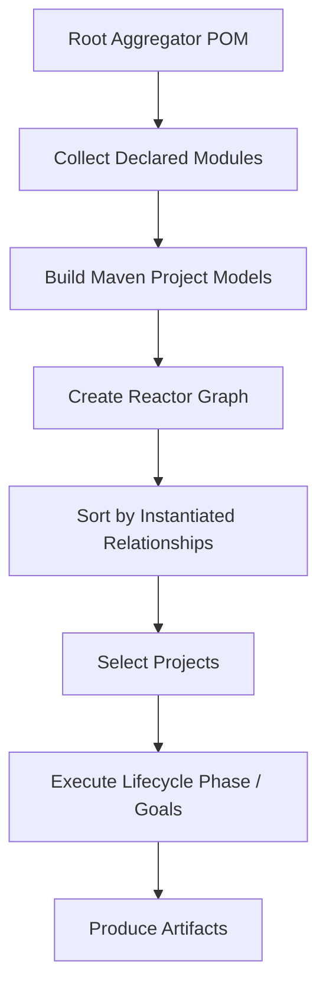
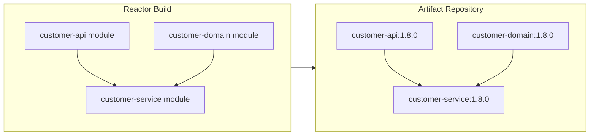
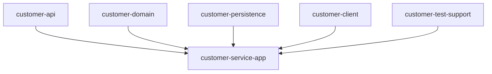
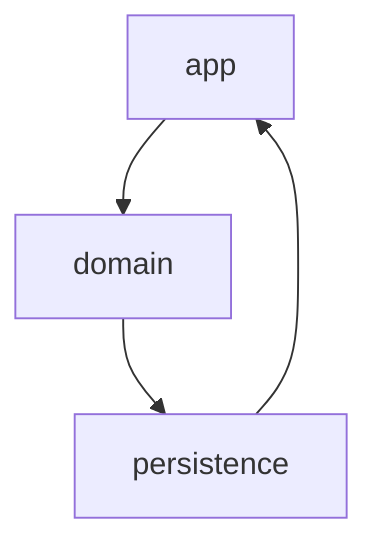
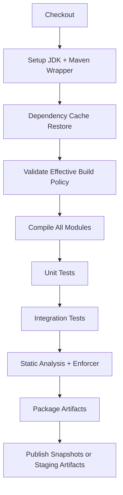
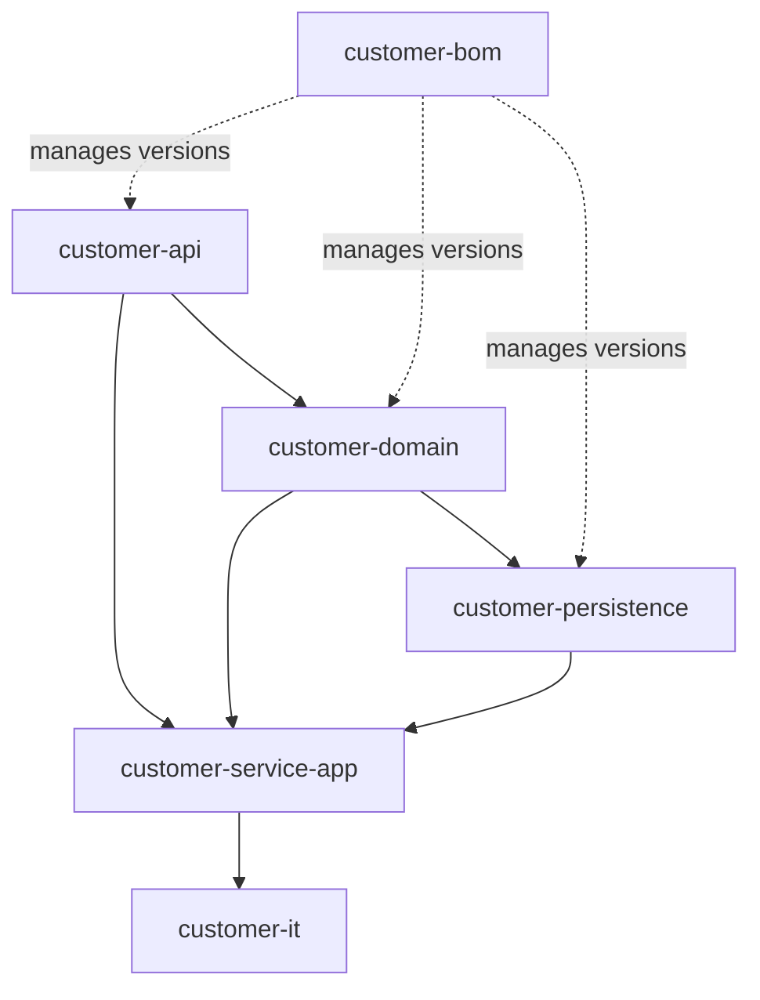

# Part 009 — Maven Multi-Module Enterprise Builds

Multi-module Maven is not just “many folders under one parent POM”. In a serious Java organization, it becomes a **build-time architecture system**. It decides which source units are compiled together, which dependencies can be substituted from the same checkout, which artifacts are published, which test scopes run, and which ownership boundaries are enforced or accidentally destroyed.

The core mistake is treating multi-module Maven as a convenience for importing many projects into the IDE. That is useful, but too shallow. The deeper model is this:

> A Maven multi-module build is a temporary in-memory graph where Maven replaces some remote artifacts with local project outputs and then executes lifecycle phases in a valid topological order.

Once you internalize that, most Maven reactor behavior becomes predictable.

## 1. Kaufman framing

In Josh Kaufman's approach, we first deconstruct the skill. For multi-module Maven, the skill is not “create parent pom and modules”. The useful skill is the ability to decide:

- which Java units should be built together;
- which units should be versioned together;
- which units should be published independently;
- which units should be deployable;
- which build logic should be inherited;
- which dependency versions should be centrally managed;
- which modules should be visible to other modules;
- which reactor shortcuts are safe in local development and which are dangerous in CI.

The performance target for this part:

> Given a Java codebase of 10 to 200 Maven modules, you should be able to explain the reactor graph, simplify the module topology, diagnose partial-build failures, design parent/aggregator separation, and define a release policy that does not rely on accidental local reactor behavior.

## 2. What problem does multi-module Maven solve?

A single Maven project has one `pom.xml`, one effective model, one lifecycle execution, and usually one primary artifact. That works for small applications and libraries. It becomes weak when a product contains several related artifacts that need to evolve together.

For example:

```text
customer-platform/
  pom.xml
  customer-api/
  customer-domain/
  customer-persistence/
  customer-service/
  customer-web/
  customer-test-support/
```

This structure may produce several artifacts:

- `customer-api.jar`
- `customer-domain.jar`
- `customer-persistence.jar`
- `customer-service.jar`
- `customer-web.jar`
- `customer-test-support.jar`

A multi-module build lets Maven:

1. collect all declared modules;
2. sort them in dependency order;
3. build them as one reactor;
4. use locally produced outputs instead of resolving every dependency from a remote repository;
5. run consistent plugin and dependency policy across modules;
6. produce multiple artifacts from a single source control checkout.

The Apache Maven documentation calls the mechanism that handles multi-module projects the **reactor**. The reactor collects modules, sorts projects into a correct build order, and builds selected projects in order.

## 3. The three identities in a Maven multi-module system

A multi-module Maven setup commonly mixes three different ideas:

| Concept | What it means | Implemented by | Common mistake |
|---|---|---|---|
| Aggregation | “Build these projects together” | `<modules>` in an aggregator POM | Assuming it also means inheritance |
| Inheritance | “Reuse this build model” | `<parent>` in child POM | Making every aggregator a parent even when unnecessary |
| Dependency | “This artifact needs that artifact” | `<dependencies>` | Relying on module order instead of dependency declarations |

These are separate. A POM can aggregate without being a parent. A POM can be a parent without aggregating children. A module can depend on another module without inheriting from the same parent, although that is rare in a unified enterprise repository.

### 3.1 Aggregator POM

An aggregator POM has packaging `pom` and declares modules:

```xml
<project>
  <modelVersion>4.0.0</modelVersion>
  <groupId>com.acme.customer</groupId>
  <artifactId>customer-platform</artifactId>
  <version>1.8.0-SNAPSHOT</version>
  <packaging>pom</packaging>

  <modules>
    <module>customer-api</module>
    <module>customer-domain</module>
    <module>customer-persistence</module>
    <module>customer-service</module>
    <module>customer-web</module>
  </modules>
</project>
```

Its main job is to say: “these projects participate in the same reactor build.”

### 3.2 Parent POM

A parent POM provides inherited configuration:

```xml
<project>
  <modelVersion>4.0.0</modelVersion>
  <groupId>com.acme.build</groupId>
  <artifactId>acme-java-parent</artifactId>
  <version>12.3.0</version>
  <packaging>pom</packaging>

  <properties>
    <maven.compiler.release>21</maven.compiler.release>
    <project.build.sourceEncoding>UTF-8</project.build.sourceEncoding>
  </properties>

  <dependencyManagement>
    <dependencies>
      <!-- managed dependency versions -->
    </dependencies>
  </dependencyManagement>

  <build>
    <pluginManagement>
      <plugins>
        <!-- managed plugin versions/configuration -->
      </plugins>
    </pluginManagement>
  </build>
</project>
```

Its main job is to say: “these projects share build policy.”

### 3.3 A module POM

A module POM usually inherits from a parent and declares its artifact-specific dependencies:

```xml
<project>
  <modelVersion>4.0.0</modelVersion>

  <parent>
    <groupId>com.acme.customer</groupId>
    <artifactId>customer-platform</artifactId>
    <version>1.8.0-SNAPSHOT</version>
  </parent>

  <artifactId>customer-service</artifactId>

  <dependencies>
    <dependency>
      <groupId>com.acme.customer</groupId>
      <artifactId>customer-domain</artifactId>
      <version>${project.version}</version>
    </dependency>
  </dependencies>
</project>
```

The module POM should describe the module's real artifact contract. Do not hide dependencies in the parent just to reduce repeated XML. That makes the graph less explicit.

## 4. Parent versus aggregator: the enterprise decision

Small projects often combine parent and aggregator in one root POM. That is acceptable when the codebase is small and one team owns everything.

```text
customer-platform/
  pom.xml            # parent + aggregator
  customer-api/
  customer-domain/
  customer-service/
```

For larger systems, it is often cleaner to separate them:

```text
acme-build-parent/             # versioned build policy artifact
  pom.xml

customer-platform/             # application/product aggregator
  pom.xml
  customer-api/
  customer-domain/
  customer-service/
```

Then child modules can inherit from a corporate parent while the product root only aggregates modules.

```xml
<parent>
  <groupId>com.acme.build</groupId>
  <artifactId>acme-java-parent</artifactId>
  <version>12.3.0</version>
</parent>
```

This separation matters because build policy and product module composition change at different rates.

### 4.1 When combined parent + aggregator is fine

Use one root POM as both parent and aggregator when:

- the product has one release train;
- most modules are owned by the same team;
- the parent is not meant to be reused outside the product;
- all modules should share exactly the same version;
- build policy changes are product-local.

### 4.2 When to separate parent and aggregator

Separate them when:

- many products share common Maven policy;
- security/quality plugins must be enforced centrally;
- dependency versions are governed by a platform team;
- application module composition changes more frequently than corporate build rules;
- parent upgrades must be rolled out gradually;
- teams should not modify global build policy casually.

### 4.3 Avoid the “god parent”

A god parent POM is a parent that contains everything:

- compiler config;
- Surefire config;
- integration test config;
- Docker config;
- deployment config;
- environment URLs;
- cloud-specific settings;
- business-specific dependencies;
- test framework dependencies;
- repository credentials;
- release plugin configuration;
- code generation logic;
- application packaging assumptions.

This becomes hard to evolve because every child inherits assumptions it may not need.

A better pattern:

```text
acme-java-parent
  minimal common Java invariants

acme-service-parent
  service-specific build conventions

acme-library-parent
  library-specific publication conventions

acme-spring-boot-parent
  Spring Boot application conventions
```

Do not put application-specific dependencies in a corporate parent. Use `dependencyManagement` for versions, not `dependencies` for forced inclusion.

## 5. Reactor mental model

The reactor is the execution model for multi-module builds.



The reactor is not the repository. It is not the dependency graph exactly. It is the set of projects Maven has collected for a specific invocation.

This distinction is critical:

```bash
mvn verify
```

from the root may create a reactor containing all modules.

```bash
cd customer-service
mvn verify
```

may build only `customer-service`, unless Maven 4-style root/subproject discovery behavior is available and applicable, or unless you explicitly tell Maven to also build required reactor projects.

In Maven 3, starting from a child directory often means you are no longer running the same reactor as the root build. Many “it works in root but not in module” problems come from that.

## 6. Reactor sorting rules

Maven sorts reactor projects so that a project is built before another project that requires it.

The Maven 3 multi-module guide states that reactor sorting honors instantiated relationships such as:

- a project dependency on another module in the build;
- a plugin declaration where the plugin is another module in the build;
- a plugin dependency on another module in the build;
- a build extension declaration on another module in the build;
- the order declared in `<modules>` if no other rule applies.

It also notes that only instantiated references are used; `dependencyManagement` and `pluginManagement` do not change reactor sort order.

That last sentence is an important expert-level invariant.

### 6.1 Dependency management does not create an edge

This does **not** make `customer-service` depend on `customer-domain`:

```xml
<dependencyManagement>
  <dependencies>
    <dependency>
      <groupId>com.acme.customer</groupId>
      <artifactId>customer-domain</artifactId>
      <version>${project.version}</version>
    </dependency>
  </dependencies>
</dependencyManagement>
```

It only says: “if some child declares `customer-domain`, use this version.”

This creates the actual edge:

```xml
<dependencies>
  <dependency>
    <groupId>com.acme.customer</groupId>
    <artifactId>customer-domain</artifactId>
  </dependency>
</dependencies>
```

A senior engineer never confuses managed versions with dependencies.

## 7. Reactor graph versus artifact graph

A reactor graph is a build execution graph. An artifact graph is what consumers see after artifacts are published.

They often look similar, but they are not identical.



The reactor can hide publication problems. Suppose `customer-service` builds locally because the reactor provides `customer-domain`. But after publishing, a downstream consumer fails because the published POM for `customer-service` has wrong metadata, wrong scope, missing dependency, or wrong version.

Therefore, enterprise CI should include at least one validation mode that builds from published-like artifacts rather than relying only on reactor substitution.

## 8. Common enterprise module taxonomy

A multi-module Maven repository should not be a dumping ground. Every module should have a reason to exist.

A practical taxonomy:

| Module type | Artifact? | Deployable? | Example | Main rule |
|---|---:|---:|---|---|
| API contract | Yes | No | `customer-api` | Stable types used by other modules/services |
| Domain/library | Yes | No | `customer-domain` | Business model and rules, no infra assumptions |
| Adapter | Yes | No | `customer-persistence`, `customer-client` | External system integration |
| Application | Yes | Yes | `customer-service-app` | Composition/root runtime artifact |
| Test support | Sometimes | No | `customer-test-support` | Test fixtures, never leak to production classpath |
| BOM/platform | Yes | No | `customer-bom` | Version alignment only |
| Parent/build policy | Yes | No | `customer-parent` | Build inheritance only |
| Integration test module | Usually no production artifact | No | `customer-it` | Cross-module or black-box verification |

### 8.1 Artifact-producing modules

A module should produce an artifact when another module, service, or external consumer has a meaningful reason to depend on it.

Good reasons:

- shared API types;
- reusable library logic;
- generated client libraries;
- test fixtures with a controlled test scope;
- version alignment BOM;
- deployable application artifact.

Bad reasons:

- a package got too big;
- developers want the IDE tree to look tidy;
- layering ideology says every architecture layer must be a separate Maven module;
- a module is used only by one other module and creates more ceremony than value.

### 8.2 Deployable modules

In a clean enterprise build, most modules are not deployable. Usually only one or a few modules produce runtime application artifacts.

```text
customer-platform/
  customer-api/              # library JAR
  customer-domain/           # library JAR
  customer-persistence/      # library JAR
  customer-service-app/      # deployable JAR/image input
```

The deployable module should compose the runtime:

```xml
<dependencies>
  <dependency>
    <groupId>com.acme.customer</groupId>
    <artifactId>customer-api</artifactId>
  </dependency>
  <dependency>
    <groupId>com.acme.customer</groupId>
    <artifactId>customer-domain</artifactId>
  </dependency>
  <dependency>
    <groupId>com.acme.customer</groupId>
    <artifactId>customer-persistence</artifactId>
  </dependency>
</dependencies>
```

Do not make every module independently deployable unless the product truly contains multiple runtimes. Deployment boundaries should reflect operational ownership and failure isolation, not folder structure.

## 9. Recommended repository shapes

### 9.1 Small product repository

```text
customer-service/
  pom.xml                    # parent + aggregator
  customer-api/
  customer-domain/
  customer-app/
```

Use when one team owns the product and modules release together.

### 9.2 Enterprise product repository with external corporate parent

```text
customer-platform/
  pom.xml                    # product aggregator
  .mvn/
    wrapper/
    maven.config
  customer-api/
  customer-domain/
  customer-app/
```

Each module inherits from:

```xml
<parent>
  <groupId>com.acme.build</groupId>
  <artifactId>acme-java-service-parent</artifactId>
  <version>12.3.0</version>
</parent>
```

Use when platform teams govern build policy separately from product teams.

### 9.3 Product with local parent and separate BOM

```text
customer-platform/
  pom.xml                    # aggregator
  customer-parent/
  customer-bom/
  customer-api/
  customer-domain/
  customer-app/
```

This is useful when the product publishes both implementation artifacts and a consumer-facing BOM.

Important rule: a parent POM and a BOM are different artifacts. A parent configures build inheritance. A BOM configures dependency version alignment for consumers.

## 10. Parent POM design

A parent POM should define invariants, not hide behavior.

Good parent responsibilities:

- Java release level;
- source encoding;
- plugin versions;
- plugin defaults;
- dependency versions in `dependencyManagement`;
- test plugin baseline;
- compiler plugin baseline;
- reproducible build timestamp policy;
- enforcer rules;
- shared repository policy when appropriate;
- organization metadata.

Bad parent responsibilities:

- adding application dependencies to every child;
- declaring runtime frameworks that some modules do not use;
- setting environment-specific URLs;
- embedding deployment credentials;
- requiring all modules to run the same packaging plugin;
- hiding too much plugin behavior behind profiles.

### 10.1 Use `dependencyManagement`, not inherited `dependencies`

This is usually good:

```xml
<dependencyManagement>
  <dependencies>
    <dependency>
      <groupId>org.junit.jupiter</groupId>
      <artifactId>junit-jupiter</artifactId>
      <version>${junit.version}</version>
      <scope>test</scope>
    </dependency>
  </dependencies>
</dependencyManagement>
```

This is risky in a corporate parent:

```xml
<dependencies>
  <dependency>
    <groupId>org.springframework.boot</groupId>
    <artifactId>spring-boot-starter-web</artifactId>
  </dependency>
</dependencies>
```

Because every child gets it, even modules that should be plain libraries. That pollutes classpaths and blurs module intent.

### 10.2 Use `pluginManagement`, not unconditional plugin executions everywhere

This is usually good:

```xml
<build>
  <pluginManagement>
    <plugins>
      <plugin>
        <groupId>org.apache.maven.plugins</groupId>
        <artifactId>maven-compiler-plugin</artifactId>
        <version>3.14.0</version>
        <configuration>
          <release>${maven.compiler.release}</release>
        </configuration>
      </plugin>
    </plugins>
  </pluginManagement>
</build>
```

Then child modules opt in by declaring the plugin when needed, unless it is a universal plugin bound by packaging defaults.

A parent should not make all modules run packaging, container, or deployment plugins. Library modules, BOM modules, test modules, and app modules need different behavior.

## 11. Dependency alignment inside a multi-module Maven build

In a unified release train, internal dependencies often use `${project.version}`:

```xml
<dependency>
  <groupId>com.acme.customer</groupId>
  <artifactId>customer-domain</artifactId>
  <version>${project.version}</version>
</dependency>
```

This is simple and strong when all modules release together.

However, it becomes restrictive when modules have independent lifecycles. A common enterprise smell is a 120-module repository where one small library change forces a full product release because every module shares one version.

### 11.1 Single version release train

Use one version for all modules when:

- modules are product-internal;
- consumers should not mix versions;
- releases are coordinated;
- the repository represents one deployable product or product family;
- backward compatibility between internal modules is not guaranteed.

Pros:

- simple versioning;
- easier release tags;
- clear provenance;
- fewer compatibility combinations.

Cons:

- unnecessary version churn;
- larger releases;
- harder independent library evolution.

### 11.2 Independent module versions

Use independent versions when:

- modules are reusable libraries;
- consumers upgrade separately;
- binary compatibility is carefully managed;
- each module has its own release notes and compatibility contract.

Pros:

- precise releases;
- less consumer churn;
- better library discipline.

Cons:

- more release complexity;
- more dependency alignment problems;
- harder reactor ergonomics.

For most enterprise application repositories, use a single version. For platform/library repositories, consider independent versions only if you are willing to invest in compatibility tooling.

## 12. BOM module in a multi-module repository

A BOM module can expose aligned dependency versions to consumers.

```text
customer-platform/
  customer-bom/
  customer-api/
  customer-client/
```

A Maven 3-compatible BOM is usually a `pom` packaging artifact with `dependencyManagement`:

```xml
<project>
  <modelVersion>4.0.0</modelVersion>
  <groupId>com.acme.customer</groupId>
  <artifactId>customer-bom</artifactId>
  <version>1.8.0</version>
  <packaging>pom</packaging>

  <dependencyManagement>
    <dependencies>
      <dependency>
        <groupId>com.acme.customer</groupId>
        <artifactId>customer-api</artifactId>
        <version>${project.version}</version>
      </dependency>
      <dependency>
        <groupId>com.acme.customer</groupId>
        <artifactId>customer-client</artifactId>
        <version>${project.version}</version>
      </dependency>
    </dependencies>
  </dependencyManagement>
</project>
```

Consumers import it:

```xml
<dependencyManagement>
  <dependencies>
    <dependency>
      <groupId>com.acme.customer</groupId>
      <artifactId>customer-bom</artifactId>
      <version>1.8.0</version>
      <type>pom</type>
      <scope>import</scope>
    </dependency>
  </dependencies>
</dependencyManagement>
```

Do not confuse the product parent with the consumer BOM. A consumer should not inherit your parent POM just to get dependency versions. That would leak your build policy into their build.

## 13. Reactor command-line operations

The reactor has command-line controls that are essential for large builds.

### 13.1 Build everything

```bash
mvn clean verify
```

Use in CI as the baseline validation.

### 13.2 Build one module

```bash
mvn -pl customer-service verify
```

This selects one project from the reactor.

But if `customer-service` depends on other reactor modules that are not already installed or available, this may fail. Use `-am` to also make dependencies.

### 13.3 Build one module and its dependencies

```bash
mvn -pl customer-service -am verify
```

`-am` means `--also-make`: include required upstream reactor modules.

This is usually the safest local development command for a selected module.

### 13.4 Build one module and its dependents

```bash
mvn -pl customer-domain -amd verify
```

`-amd` means `--also-make-dependents`: include modules that depend on the selected module.

This is useful after changing a low-level module. It answers: “what else could I have broken?”

### 13.5 Resume a failed build

```bash
mvn -rf :customer-service verify
```

`-rf` resumes from the selected module. This is useful after a long build fails halfway through.

### 13.6 Fail at end

```bash
mvn -fae verify
```

`-fae` means `--fail-at-end`: continue building independent modules after one fails, then report all failures.

In CI, `-fae` is useful for broad feedback. In release builds, `fail-fast` is often cleaner.

### 13.7 Non-recursive build

```bash
mvn -N validate
```

`-N` means non-recursive. It builds only the current project and ignores child modules.

This is useful for checking root-level plugin configuration, effective POM behavior, or parent metadata.

## 14. Partial builds: productivity versus false confidence

Partial builds are useful locally but dangerous as release evidence.

```bash
mvn -pl customer-service -am test
```

This can be fast and appropriate while developing. But it does not prove the whole product works.

CI should distinguish between:

| Build type | Purpose | Example |
|---|---|---|
| Local focused build | Fast feedback | `mvn -pl customer-service -am test` |
| PR affected build | Reasonable validation of impacted modules | changed module + dependents |
| Full integration build | Product confidence | `mvn clean verify` from root |
| Release build | Publishable artifact creation | clean checkout, clean repo, pinned toolchain |
| Consumer build | Validate published metadata | build downstream sample using repository artifacts |

The failure mode is “partial green”. A developer sees green locally but the root build fails because another module, integration test, packaging plugin, or enforcer rule was not executed.

## 15. Module dependency direction

A multi-module build should have an intentional dependency direction.

Example:



Depending on how you draw arrows, you may prefer “A depends on B” as `A --> B`. The important part is that direction is consistent and reviewed.

A cleaner logical model:

```text
app depends on adapters and domain
adapters depend on api/domain as needed
domain should not depend on app
api should not depend on app
```

Common bad graph:



Maven cannot build cyclic module dependencies. More importantly, cycles indicate that module boundaries are lying.

## 16. Cycles and hidden cycles

Maven detects direct artifact cycles. But teams often create hidden cycles through test fixtures, generated sources, or “common” modules.

### 16.1 The `common` trap

```text
customer-common/
  DateUtils.java
  JsonUtils.java
  CustomerStatus.java
  JdbcRetryPolicy.java
  HttpClientFactory.java
  TestFactories.java
```

`common` becomes an architectural landfill. Every module depends on it, then it slowly depends on everything through utility creep.

Better split by reason:

```text
customer-api/
customer-domain/
customer-json/
customer-db-support/
customer-test-support/
```

A module should have a single dominant reason to change.

### 16.2 Test fixture cycles

A production module should not depend on a test-support module. Keep fixtures in test scope:

```xml
<dependency>
  <groupId>com.acme.customer</groupId>
  <artifactId>customer-test-support</artifactId>
  <version>${project.version}</version>
  <scope>test</scope>
</dependency>
```

If production code needs something from test-support, the test-support module is carrying production responsibility and should be split.

## 17. Multi-module and integration tests

There are several patterns for integration tests.

### 17.1 Integration tests inside each module

```text
customer-persistence/
  src/test/java/
  src/it/java/       # if custom source setup is used
```

Good when integration tests belong to one artifact.

### 17.2 Dedicated integration-test module

```text
customer-platform/
  customer-app/
  customer-it/
```

`customer-it` depends on the deployable artifact or starts the application under test.

Good when tests cross module boundaries or require a full runtime composition.

### 17.3 Black-box integration test module

```text
customer-it/
  tests against packaged app, HTTP API, database, broker, etc.
```

This is closer to release validation. It reduces the risk that tests pass because they access internal classes directly.

## 18. Multi-module CI design

A serious CI pipeline should not blindly run the same heavy build for every small change, but it must preserve release confidence.

### 18.1 Baseline pipeline



For pull requests, you can add affected-module optimization. But keep a scheduled or merge-gate full build.

### 18.2 Affected module strategy

Affected module strategy asks:

1. Which modules changed?
2. Which modules depend on them?
3. Which integration test modules cover them?
4. Which deployable artifacts include them?

Maven gives you `-pl`, `-am`, and `-amd`, but deciding the project list often requires repository-specific tooling.

For example:

```bash
mvn -pl customer-domain -amd verify
```

This checks dependents of `customer-domain`, but it may miss external consumers outside the reactor.

### 18.3 CI must not depend on developer local repository state

A common bad practice:

```bash
mvn install -DskipTests
mvn -pl customer-service test
```

This relies on local `~/.m2/repository` state inside the CI worker. In ephemeral CI this may be okay if the workspace is clean, but it can hide ordering and metadata problems if reused carelessly.

Prefer root reactor builds or clean isolated local repositories for release jobs:

```bash
mvn -Dmaven.repo.local=$PWD/.m2 clean verify
```

This makes dependency resolution more explicit and reduces accidental coupling to previous CI job state.

## 19. Publishing multi-module artifacts

Not every module should be deployed to the artifact repository.

Ask for each module:

- Is it consumed by another repository?
- Is it consumed at runtime?
- Is it only internal to the reactor?
- Is it test-only?
- Is its POM metadata meaningful to consumers?
- Should it be part of the public compatibility contract?

### 19.1 Publishable library module

A publishable library must have clean metadata:

- correct dependencies;
- correct scopes;
- no accidental test dependencies;
- no system-scoped dependencies;
- no hidden reactor-only assumptions;
- clear semantic versioning policy if external consumers exist.

### 19.2 Non-publishable internal module

Maven does not have a universal “private module” concept. If a module exists in a multi-module build, Maven can build it. Whether you publish it is a release pipeline policy.

For internal-only modules, ensure downstream repositories do not depend on them. If they do, the module is no longer private.

### 19.3 Deployable application module

A deployable app may publish a JAR, container image, SBOM, provenance metadata, and deployment manifest. Its Maven artifact is only one part of release output.

Do not force library modules to carry app packaging plugin configuration.

## 20. Versioning strategies for multi-module builds

### 20.1 Unified version

Root POM:

```xml
<version>1.8.0-SNAPSHOT</version>
```

Children inherit the same version.

Internal dependencies use:

```xml
<version>${project.version}</version>
```

This is the default recommendation for application/product repositories.

### 20.2 CI-friendly version property

Maven supports CI-friendly version placeholders such as `${revision}`, `${sha1}`, and `${changelist}` in Maven 3.5.0-beta-1 and newer.

```xml
<version>${revision}${changelist}</version>

<properties>
  <revision>1.8.0</revision>
  <changelist>-SNAPSHOT</changelist>
</properties>
```

CI can set:

```bash
mvn -Drevision=1.8.0 -Dchangelist= clean deploy
```

This avoids committing release-version changes into every POM, but it requires discipline around published consumer POMs. Many Maven 3 builds use the Flatten Maven Plugin for this. Maven 4 improves this area, which we cover in the next part.

### 20.3 Independent versions

Independent versions are possible but expensive. You need tooling to answer:

- which modules changed;
- which version should each changed module get;
- which dependent modules need version bumps;
- whether compatibility has been preserved;
- which BOM should be published;
- which release notes apply to which artifact.

Do not choose independent versions just to look sophisticated. Choose them only when consumers need independent upgrade paths.

## 21. Enforcer rules in multi-module builds

Maven Enforcer can protect build invariants.

Common enterprise rules:

- require Maven version;
- require Java version;
- ban duplicate classes;
- require dependency convergence;
- ban snapshot dependencies in release builds;
- ban certain dependencies;
- require plugin versions;
- enforce bytecode version.

The parent POM can configure Enforcer. But be careful: some rules may be too strict for all modules. For example, application modules may tolerate dependency mediation differently than published libraries.

A good approach:

- strict rules for published libraries;
- pragmatic rules for applications;
- mandatory rules for release builds;
- warning mode during migration;
- fail mode after cleanup.

## 22. Parallel builds

Maven supports parallel builds with `-T`:

```bash
mvn -T 1C verify
```

This can speed up multi-module builds, but it exposes unsafe plugin behavior and hidden shared-state assumptions.

Common issues:

- plugins writing to shared directories;
- tests sharing ports;
- integration tests sharing database schemas;
- generated code output paths colliding;
- build scripts assuming module order beyond declared dependencies.

A build is parallel-safe only when every module's outputs and test resources are isolated or explicitly coordinated.

## 23. IDE behavior is not the source of truth

IDEs often import a multi-module Maven project and make module dependencies seem obvious. But the Maven build remains the source of truth.

If IntelliJ or Eclipse compiles something that `mvn clean verify` does not, the build is wrong or the IDE import is hiding a mismatch.

A top-tier engineer validates important refactors with command-line Maven, not only IDE green status.

Recommended local checks:

```bash
mvn -q -DskipTests compile
mvn -q test
mvn -q verify
mvn -q -pl changed-module -am test
mvn -q -pl changed-module -amd test
```

## 24. Multi-module anti-patterns

### 24.1 One module per package

Bad:

```text
customer-controller/
customer-service/
customer-repository/
customer-model/
customer-util/
```

This usually reflects package-by-layer thinking rather than artifact boundaries. Maven modules are expensive; they should represent publishable or build-isolatable units.

### 24.2 Everything depends on everything

If every module depends on most other modules, the modular structure is decorative. You get the cost of modules without isolation.

Measure:

- number of dependencies per module;
- number of modules depending on `common`;
- cycles attempted through tests;
- modules with too many responsibilities.

### 24.3 Parent POM as dependency injector

A parent should not add many runtime dependencies to every child. That creates invisible dependencies and bloated classpaths.

### 24.4 Reactor-only correctness

If a module only works when built in the reactor, its published artifact may be broken. Validate published metadata.

### 24.5 Release plugin magic without release model

The Maven Release Plugin can automate some release steps, but it cannot define your release governance. You still need decisions about versions, tags, staging, signing, promotion, rollback, and auditability.

## 25. Practical enterprise blueprint

Here is a solid baseline for a product repository:

```text
customer-platform/
  .mvn/
    wrapper/
    maven.config
  pom.xml
  customer-bom/
  customer-api/
  customer-domain/
  customer-persistence/
  customer-service-app/
  customer-it/
```

Root POM:

```xml
<project>
  <modelVersion>4.0.0</modelVersion>
  <groupId>com.acme.customer</groupId>
  <artifactId>customer-platform</artifactId>
  <version>${revision}${changelist}</version>
  <packaging>pom</packaging>

  <properties>
    <revision>1.8.0</revision>
    <changelist>-SNAPSHOT</changelist>
    <maven.compiler.release>21</maven.compiler.release>
    <project.build.outputTimestamp>${git.commit.time}</project.build.outputTimestamp>
  </properties>

  <modules>
    <module>customer-bom</module>
    <module>customer-api</module>
    <module>customer-domain</module>
    <module>customer-persistence</module>
    <module>customer-service-app</module>
    <module>customer-it</module>
  </modules>
</project>
```

Module dependency direction:



Again, choose arrow semantics consciously. The important idea is that app composes lower-level artifacts; lower-level artifacts do not depend on app.

## 26. Diagnostic commands

### 26.1 Show effective POM for a module

```bash
mvn -pl customer-service help:effective-pom
```

Use this when inherited plugin/dependency behavior is unclear.

### 26.2 Show dependency tree

```bash
mvn -pl customer-service dependency:tree
```

Use this when classpath behavior differs from expectations.

### 26.3 Show dependency tree filtered by artifact

```bash
mvn -pl customer-service dependency:tree -Dincludes=org.slf4j
```

Use this for conflict tracing.

### 26.4 Build downstream impact

```bash
mvn -pl customer-domain -amd verify
```

Use this after changing lower-level modules.

### 26.5 Build selected module with upstream dependencies

```bash
mvn -pl customer-service -am verify
```

Use this during focused development.

## 27. Failure model

| Failure | Symptom | Root cause | Prevention |
|---|---|---|---|
| Missing reactor edge | Module builds in IDE but fails in Maven | Dependency not declared, only available indirectly | Declare real dependencies |
| Wrong reactor order expectation | Module order in `<modules>` ignored | Dependency edges override listed order | Understand reactor sorting |
| Parent pollution | All modules get unnecessary dependencies | Dependencies declared in parent | Use `dependencyManagement` |
| Plugin surprise | Plugin runs in modules that should not run it | Execution inherited too broadly | Use `pluginManagement`, opt-in executions |
| Reactor-only success | Local root build passes but consumer fails | Published POM metadata wrong | Consumer-style validation |
| Snapshot leakage | Release depends on SNAPSHOT | Weak release enforcer rules | Ban snapshots in release profile |
| Partial green | PR build passes but root build fails | Affected-module logic incomplete | Full merge-gate or scheduled full build |
| Common module decay | Everything depends on `common` | No real module taxonomy | Split by reason to change |
| Parallel flakiness | `-T` build fails randomly | Shared test/build state | Isolate outputs and resources |
| Independent version chaos | Consumers get incompatible mix | No compatibility/versioning policy | Use BOM and compatibility checks |

## 28. Deliberate practice

### Exercise 1 — Draw the reactor graph

Pick any multi-module Maven repository and draw:

- aggregator modules;
- parent inheritance;
- artifact dependencies;
- deployable artifacts;
- published artifacts;
- test-only modules.

Do not use one diagram for all relationships. Draw at least three diagrams:

1. aggregation graph;
2. inheritance graph;
3. dependency graph.

### Exercise 2 — Diagnose hidden parent behavior

Run:

```bash
mvn help:effective-pom > effective-pom.xml
```

Find:

- dependencies inherited from parent;
- plugin versions inherited from parent;
- plugin executions inherited from parent;
- properties that affect compiler/test behavior.

Classify each as:

- invariant;
- convenience;
- accidental coupling;
- dangerous inheritance.

### Exercise 3 — Build with selected reactor subsets

Run:

```bash
mvn -pl some-module test
mvn -pl some-module -am test
mvn -pl some-module -amd test
mvn -fae verify
```

Explain why the project set differs.

### Exercise 4 — Consumer artifact validation

Publish artifacts to a temporary local repository path:

```bash
mvn -Dmaven.repo.local=$PWD/.tmp-m2 clean deploy
```

Then create a small consumer project that depends on the published artifact. Confirm that the consumer can resolve and compile without access to the reactor source tree.

## 29. Senior engineer checklist

Before approving a Maven multi-module design, ask:

- Does every module have a clear reason to exist?
- Is aggregation separated from inheritance conceptually?
- Are runtime dependencies declared in child modules, not hidden in the parent?
- Are versions managed centrally without creating fake dependencies?
- Are plugin versions pinned?
- Are plugin executions scoped correctly?
- Are deployable modules obvious?
- Are published modules intentional?
- Does CI validate the full reactor?
- Does CI avoid relying on stale local repository state?
- Are partial-build commands documented?
- Are cycles impossible by design?
- Are test-support dependencies test-scoped?
- Is there a release strategy for all produced artifacts?
- Is there a plan for Maven 4 migration if the organization uses Maven heavily?

## 30. Mental compression

Remember these invariants:

1. **Aggregation builds together. Inheritance shares configuration. Dependency creates classpath edges.**
2. **`dependencyManagement` manages versions; it does not create dependencies.**
3. **`pluginManagement` manages plugin defaults; it does not necessarily execute plugins.**
4. **The reactor is a build-time graph, not proof that published artifacts are correct.**
5. **Local partial builds optimize feedback; release builds prove trust.**
6. **A Maven module is an artifact boundary, not a folder decoration.**

## References

- Apache Maven, “Guide to Working with Multiple Modules” — reactor collection, sorting, and command-line options.
- Apache Maven, “Guide to Working with Multiple Subprojects in Maven 4” — updated Maven 4 terminology and subproject selection semantics.
- Apache Maven, “Maven CI Friendly Versions” — `${revision}`, `${sha1}`, and `${changelist}` placeholders.
- Apache Maven, “Introduction to the Dependency Mechanism” — dependency management and transitive dependency behavior.
- Apache Maven, “Configuring for Reproducible Builds” — reproducible build basics and `project.build.outputTimestamp`.
