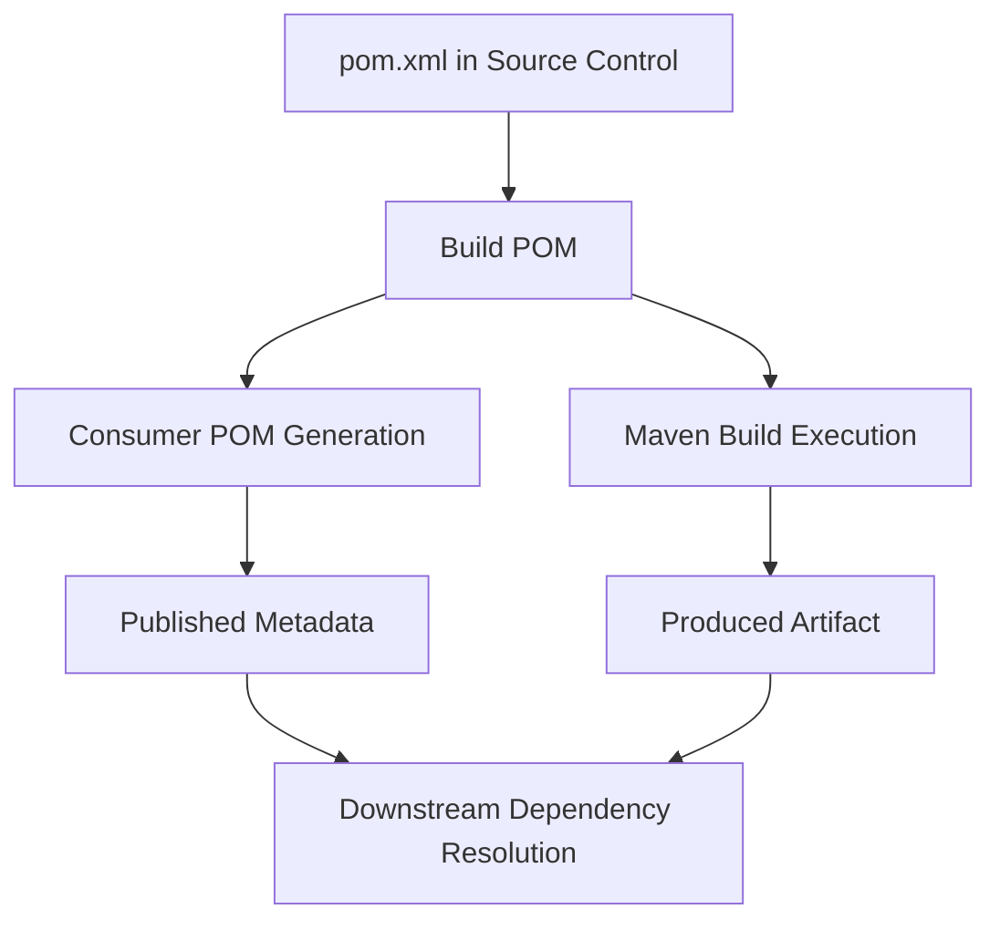
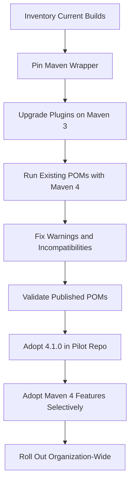
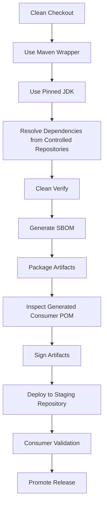

# Part 010 — Maven 4 and Modern Maven Practices

Maven 4 is not “Maven becomes Gradle”. It is still Maven: model-driven, lifecycle-oriented, convention-heavy, and intentionally less programmable than Gradle. The important change is that Maven 4 makes several long-standing build-model weaknesses more explicit: build POM versus consumer POM, better multi-project terminology, root directory semantics, improved CI-friendly versioning, dedicated BOM packaging, and better support for modern source layouts.

The wrong way to learn Maven 4 is to memorize new XML elements. The right way is to ask:

> Which Maven 3 workarounds existed because the model was underspecified, and how does Maven 4 reduce those workarounds?

This part is intentionally practical. We will not treat Maven 4 as mandatory for every organization immediately. A senior engineer evaluates it as a migration of build infrastructure, not a toy upgrade.

## 1. Kaufman framing

Using Kaufman's skill acquisition frame, this part deconstructs Maven 4 into decisions you must make:

- whether to run Maven 4 against existing Maven 3-style POMs;
- whether to adopt model version `4.1.0`;
- whether to use `<subprojects>` instead of `<modules>`;
- whether to use root directory declarations;
- whether to adopt dedicated `bom` packaging;
- whether to rely on Maven 4's improved CI-friendly version behavior;
- whether to remove flatten-plugin workarounds;
- whether plugins in your ecosystem are ready;
- whether CI and developer workstations can run the same Maven version safely.

The performance target:

> You should be able to read a Maven 4 migration guide, classify each change by risk, migrate a large Maven 3 repository incrementally, and avoid adopting Maven 4-only features before the organization is ready.

## 2. The Maven 4 mental model

Maven 3 has one dominant POM idea: the `pom.xml` is both the build model and the published metadata model. This creates tension.

A build needs rich information:

- plugin configuration;
- local source layout;
- generated source setup;
- profiles;
- project-local properties;
- repository policy;
- deployment metadata;
- build extensions;
- packaging instructions.

A consumer needs only enough information to use the artifact:

- coordinates;
- dependencies;
- dependency scopes;
- exclusions;
- artifact metadata;
- maybe dependency management for BOMs.

Maven 4 makes this distinction more explicit with the idea of a **build POM** and a **consumer POM**.



The key idea:

> The POM you need to build an artifact is not always the POM consumers need to depend on that artifact.

This is a major build-engineering improvement because it lets Maven evolve build-side modeling without breaking the entire Maven 3 consumer ecosystem.

## 3. Maven 3-compatible POMs still matter

Maven 4 can build projects that still use model version `4.0.0`. You do not need to immediately convert every POM to model version `4.1.0` just because you start testing Maven 4.

This is the safest migration principle:

> First run Maven 4 with existing POMs. Only after that succeeds should you adopt Maven 4-only model features.

Do not combine these changes in one step:

- Maven runtime upgrade;
- plugin upgrades;
- parent POM refactor;
- dependency alignment refactor;
- `4.1.0` model adoption;
- release pipeline changes.

That creates an un-debuggable migration.

## 4. Model version `4.1.0`

Maven 4 introduces POM model version `4.1.0` for build POMs.

Example:

```xml
<project xmlns="http://maven.apache.org/POM/4.1.0"
         xmlns:xsi="http://www.w3.org/2001/XMLSchema-instance"
         xsi:schemaLocation="http://maven.apache.org/POM/4.1.0 https://maven.apache.org/xsd/maven-4.1.0.xsd">
  <modelVersion>4.1.0</modelVersion>
  <groupId>com.acme</groupId>
  <artifactId>sample</artifactId>
  <version>1.0.0</version>
</project>
```

Do not read this as “new Maven means all POMs must change now.” Model version `4.1.0` is needed for new model features, not for merely running Maven 4.

### 4.1 When to keep `4.0.0`

Keep model version `4.0.0` when:

- the organization still has Maven 3 consumers or build agents;
- your plugins have not been validated on Maven 4;
- you do not need Maven 4-only features;
- you want a low-risk first migration phase;
- your build estate is large and distributed.

### 4.2 When to adopt `4.1.0`

Adopt `4.1.0` when:

- you need Maven 4 model features such as `root` attributes, `subprojects`, `bom` packaging, or new source declarations;
- your CI, release pipeline, IDEs, and developer workstations are ready;
- the team understands consumer POM generation;
- you have tested downstream consumers;
- you have rollback procedures.

## 5. Build POM versus consumer POM

In Maven 4, the build POM can use richer model features, while Maven can generate a consumer POM for repositories and downstream consumers.

Practical implication:

```text
source repository:
  pom.xml      # build POM, may use model 4.1.0 features

artifact repository:
  artifact.jar
  artifact.pom # consumer metadata, Maven 3-compatible when possible
```

This matters most for libraries and platform artifacts. Applications that are never consumed as dependencies may care less, but their build and release metadata still benefit from clarity.

### 5.1 What belongs in the build POM?

Build POM concerns:

- plugin configuration;
- source directory configuration;
- generated source setup;
- test plugin behavior;
- packaging behavior;
- release plugin behavior;
- build-only properties;
- local repository policy;
- build extensions;
- profile activation rules;
- project-root references.

### 5.2 What belongs in the consumer POM?

Consumer POM concerns:

- artifact coordinates;
- runtime/compile/test dependency metadata;
- dependency exclusions;
- dependency management for BOMs;
- artifact description/license/developer metadata where relevant.

### 5.3 Why this matters

If build-only details leak into published POMs, consumers become coupled to your build system. If consumer dependency metadata is incomplete, downstream builds break.

Maven 4's model separation is a response to that tension.

## 6. Maven 4 terminology: projects and subprojects

Maven 3 commonly talks about “modules”. Maven 4 documentation moves toward “projects” and “subprojects”. This is not just cosmetic. It reduces confusion with the Java Platform Module System, where “module” has a different meaning.

Maven 3:

```xml
<modules>
  <module>customer-api</module>
  <module>customer-app</module>
</modules>
```

Maven 4 model `4.1.0`:

```xml
<subprojects>
  <subproject>customer-api</subproject>
  <subproject>customer-app</subproject>
</subprojects>
```

In conversation, this distinction helps:

- **Java module**: JPMS unit described by `module-info.java`.
- **Maven subproject**: build project included by an aggregator.
- **Maven artifact**: published coordinate such as `groupId:artifactId:version`.
- **Package**: Java namespace and access-control boundary.

Do not mix those terms in architecture reviews.

## 7. Root directory semantics

Large Maven builds often need to reference files at the repository root:

- Checkstyle suppressions;
- license header config;
- dependency allowlist;
- code style rules;
- shared generated-source config;
- CI metadata;
- root-level `.mvn` settings.

In Maven 3, teams often used fragile relative paths like:

```xml
<configLocation>${basedir}/../config/checkstyle.xml</configLocation>
```

This breaks when invoked from different subdirectories.

Maven 4 introduces clearer root directory semantics, including root declaration through model `4.1.0` and root-related properties.

Example:

```xml
<project root="true"
         xmlns="http://maven.apache.org/POM/4.1.0"
         xmlns:xsi="http://www.w3.org/2001/XMLSchema-instance"
         xsi:schemaLocation="http://maven.apache.org/POM/4.1.0 https://maven.apache.org/xsd/maven-4.1.0.xsd">
  <modelVersion>4.1.0</modelVersion>
  <groupId>com.acme.customer</groupId>
  <artifactId>customer-platform</artifactId>
  <version>1.0.0-SNAPSHOT</version>
  <packaging>pom</packaging>
</project>
```

Modern practice:

- create a root `.mvn` directory even for Maven 3-compatible projects;
- keep wrapper/config under `.mvn`;
- avoid ad-hoc `../../..` paths in child modules;
- centralize root-level files intentionally;
- document which paths are stable public build inputs.

## 8. Subproject discovery and explicitness

Maven 4 can improve subproject handling. Some documentation describes automatic discovery under certain conditions. This reduces boilerplate, but it has a trade-off.

Explicit list:

```xml
<subprojects>
  <subproject>customer-api</subproject>
  <subproject>customer-domain</subproject>
  <subproject>customer-app</subproject>
</subprojects>
```

Possible automatic discovery model:

```text
root pom has pom packaging
no explicit subprojects/modules section
direct child directories with pom.xml are discovered
```

For enterprise systems, explicit is usually safer than magical.

Use explicit subproject lists when:

- release artifacts must be controlled;
- some folders contain experiments or examples;
- not every child POM should be in the main reactor;
- module order fallback should be human-readable;
- code review should catch new build participants.

Use discovery only when:

- the repository convention is strict;
- all direct child POMs should participate;
- CI validates the discovered project set;
- developers understand the rule.

## 9. Dedicated `bom` packaging

In Maven 3, a BOM is usually a POM-packaging artifact with dependency management. Maven 4 introduces a dedicated `bom` packaging type in the `4.1.0` model.

Maven 3-style BOM:

```xml
<packaging>pom</packaging>

<dependencyManagement>
  <dependencies>
    <dependency>
      <groupId>com.acme</groupId>
      <artifactId>acme-core</artifactId>
      <version>1.2.3</version>
    </dependency>
  </dependencies>
</dependencyManagement>
```

Maven 4-style BOM:

```xml
<project xmlns="http://maven.apache.org/POM/4.1.0"
         xmlns:xsi="http://www.w3.org/2001/XMLSchema-instance"
         xsi:schemaLocation="http://maven.apache.org/POM/4.1.0 https://maven.apache.org/xsd/maven-4.1.0.xsd">
  <modelVersion>4.1.0</modelVersion>
  <groupId>com.acme</groupId>
  <artifactId>acme-platform-bom</artifactId>
  <version>1.2.3</version>
  <packaging>bom</packaging>

  <dependencyManagement>
    <dependencies>
      <dependency>
        <groupId>com.acme</groupId>
        <artifactId>acme-core</artifactId>
        <version>1.2.3</version>
      </dependency>
    </dependencies>
  </dependencyManagement>
</project>
```

The real benefit is semantic separation:

- a parent POM is for build inheritance;
- a BOM is for dependency version alignment;
- a consumer should import a BOM, not inherit your build parent.

### 9.1 Internal BOMs versus external BOMs

An internal BOM used only inside one reactor is often unnecessary. A BOM is most valuable when consumed outside the current build.

If the BOM is published for consumers, treat it as a product:

- version it carefully;
- document managed artifacts;
- test downstream import;
- avoid managing dependencies you do not own unless intentionally providing a platform;
- provide migration notes for version changes.

## 10. CI-friendly versions in modern Maven

Maven 3.5.0-beta-1 introduced CI-friendly placeholders such as `${revision}`, `${sha1}`, and `${changelist}`.

Example:

```xml
<version>${revision}${changelist}</version>

<properties>
  <revision>1.4.0</revision>
  <changelist>-SNAPSHOT</changelist>
</properties>
```

Release command:

```bash
mvn -Drevision=1.4.0 -Dchangelist= clean deploy
```

Snapshot command:

```bash
mvn -Drevision=1.5.0 -Dchangelist=-SNAPSHOT clean deploy
```

### 10.1 Why teams use CI-friendly versions

They reduce noisy commits like:

```text
change all POMs from 1.4.0-SNAPSHOT to 1.4.0
build release
change all POMs to 1.5.0-SNAPSHOT
```

They fit modern CI where release version is supplied by pipeline metadata.

### 10.2 Maven 3 caveat

In Maven 3, CI-friendly versions often require additional care so published POMs are consumer-friendly. Many teams use the Flatten Maven Plugin to resolve placeholders before install/deploy.

### 10.3 Maven 4 improvement

Maven 4 improves support for CI-friendly variables, especially with multi-subproject setups and generated consumer POMs. This can remove some flatten-plugin workarounds, but do not remove them blindly. Validate published POMs and downstream builds first.

## 11. New source declaration model

Traditional Maven 3 source customization uses:

```xml
<build>
  <sourceDirectory>src/main/java</sourceDirectory>
  <testSourceDirectory>src/test/java</testSourceDirectory>
</build>
```

Maven 4 introduces a more flexible `<sources>` model.

Conceptual example:

```xml
<build>
  <sources>
    <source>
      <scope>main</scope>
      <directory>src/main/java</directory>
    </source>
    <source>
      <scope>test</scope>
      <directory>src/test/java</directory>
    </source>
  </sources>
</build>
```

This matters for advanced Java builds:

- generated sources;
- multi-release JARs;
- module-specific source layout;
- mixed language projects;
- annotation processing separation;
- test fixture layouts.

However, prefer standard layout unless there is a concrete reason to customize. Custom source layouts increase onboarding and tooling cost.

## 12. Processor dependency types

Maven 4 documentation introduces more explicit dependency types around JAR placement and annotation processors, such as classpath versus module path variants in the model. The intent is to reduce ambiguity about where a JAR belongs:

- classpath;
- module path;
- annotation processor path;
- annotation processor module path.

This matters because modern Java builds may combine:

- JPMS modules;
- annotation processors;
- generated sources;
- modular test execution;
- legacy classpath libraries.

The practical rule:

> Do not let annotation processors accidentally become runtime dependencies.

Even before adopting Maven 4-specific types, keep processor configuration explicit. For Maven Compiler Plugin usage, prefer dedicated annotation processor configuration instead of placing processors as normal compile dependencies.

## 13. Lifecycle improvements for multi-project builds

Maven 4 introduces new lifecycle phases such as concepts around all/every project execution ordering, including `all`, `each`, `before:all`, `after:all`, `before:each`, and `after:each` in its migration documentation.

The problem this addresses:

> Some plugin actions are meant to happen once per entire multi-project build, while others are meant to happen for each subproject.

In Maven 3, teams often simulate this with fragile profiles, root-only plugin checks, or custom scripts.

Examples:

- generate one root-level aggregate report after all modules finish;
- run a repository-wide license scan once;
- run per-module checks in each subproject;
- prepare shared build metadata once before the reactor starts.

Migration warning: do not move critical release logic into new lifecycle phases until your plugin versions and CI behavior are validated.

## 14. Reproducible builds as modern Maven baseline

Modern Maven practice is not only Maven 4. It also includes reproducibility.

A reproducible build means that the same source, environment, and build instructions can produce bit-for-bit identical artifacts. Maven's reproducible build guidance points to plugin-level support and the `project.build.outputTimestamp` property.

Example:

```xml
<properties>
  <project.build.outputTimestamp>2026-06-28T00:00:00Z</project.build.outputTimestamp>
</properties>
```

A better release pipeline sets this from the commit timestamp or release metadata so artifacts are deterministic without being misleading.

### 14.1 Sources of non-reproducibility

| Source | Example | Mitigation |
|---|---|---|
| Timestamp | JAR entries use current time | `project.build.outputTimestamp` |
| Environment | Locale/timezone changes output | Pin locale/timezone in CI |
| Tool version | Different Maven/JDK/plugin versions | Wrapper, toolchains, pinned plugins |
| Generated code | Generator emits nondeterministic order | Pin generator and sort inputs |
| File ordering | Archive order differs | Use reproducible plugin versions |
| Network | Build downloads moving artifacts | Ban dynamic versions, use repository manager |
| Local state | Build reads files outside workspace | Isolate CI workspace |

### 14.2 Reproducibility is not hermeticity

Reproducible means output can be reproduced under controlled conditions. Hermetic means build inputs are isolated and declared. Maven builds can be more reproducible without being fully hermetic.

For enterprise Java, aim for:

- pinned Maven Wrapper;
- pinned JDK via toolchains or CI image;
- pinned plugin versions;
- pinned dependency versions;
- no dynamic versions;
- controlled repository manager;
- reproducible archive timestamps;
- clean local repository for release builds;
- SBOM/provenance in later pipeline stages.

## 15. Wrapper and toolchain policy

A modern Maven repository should include the Maven Wrapper:

```text
.mvn/wrapper/maven-wrapper.properties
mvnw
mvnw.cmd
```

The wrapper makes Maven version selection project-local.

A modern Java repository should also define JDK policy:

- minimum JDK for building;
- Java release target;
- runtime JDK version;
- test JDK version if different;
- vendor/distribution constraints if relevant.

Maven Compiler Plugin config:

```xml
<properties>
  <maven.compiler.release>21</maven.compiler.release>
</properties>
```

This is different from “whatever JDK happens to be installed on the developer laptop.”

## 16. Plugin version pinning

Modern Maven builds pin plugin versions.

Bad:

```xml
<plugin>
  <artifactId>maven-surefire-plugin</artifactId>
</plugin>
```

Good:

```xml
<pluginManagement>
  <plugins>
    <plugin>
      <groupId>org.apache.maven.plugins</groupId>
      <artifactId>maven-surefire-plugin</artifactId>
      <version>3.5.3</version>
    </plugin>
  </plugins>
</pluginManagement>
```

Why this matters:

- plugin defaults change;
- plugin bugs affect build behavior;
- CI and local builds should be explainable;
- release artifacts should be traceable;
- plugin compatibility must be tested before upgrade.

A platform team should maintain a plugin baseline the same way it maintains dependency baselines.

## 17. Dependency hygiene

Modern Maven practice includes dependency discipline:

- no undeclared direct dependencies;
- no used-but-undeclared dependencies;
- no unused direct dependencies;
- no accidental test dependencies in compile scope;
- no dynamic versions;
- no snapshots in release builds;
- no system-scoped dependencies except extreme legacy cases;
- no repository declarations scattered across child modules;
- no dependency versions outside managed policy unless justified.

Maven 4 does not replace dependency discipline. It only gives a stronger model for some build behaviors.

## 18. Flatten plugin: keep, remove, or replace?

Many Maven 3 builds use the Flatten Maven Plugin to produce cleaner published POMs, especially when using CI-friendly versions or complex parents.

With Maven 4's build/consumer POM distinction and improved CI-friendly behavior, some usages may become unnecessary.

Decision table:

| Current flatten usage | Maven 4 action |
|---|---|
| Resolve `${revision}` before publishing | Test whether Maven 4 consumer POM now handles it correctly |
| Remove build-only parent details from published POM | Compare generated consumer POM behavior |
| Simplify overly complex dependency metadata | Fix POM design first; do not rely only on flattening |
| Work around bad internal parent leakage | Separate parent/BOM/build metadata |
| Required by existing release pipeline | Keep until pipeline is redesigned and validated |

Never remove flattening in the same commit that changes Maven runtime, parent model, and release process. Split the migration.

## 19. Maven 4 migration strategy

A safe migration is staged.



### Stage 1 — Inventory

Collect:

- Maven version used in CI;
- Maven version used locally;
- Maven Wrapper presence;
- parent POMs;
- custom plugins;
- build extensions;
- profiles;
- release jobs;
- flatten plugin usage;
- plugin versions;
- repository declarations;
- snapshot policies.

### Stage 2 — Stabilize Maven 3 build first

Before Maven 4, fix obvious problems:

- missing plugin versions;
- undeclared dependencies;
- unused inherited dependencies;
- fragile profiles;
- root-relative path hacks;
- flaky tests;
- snapshot leakage;
- undocumented release commands.

A messy Maven 3 build becomes a messier Maven 4 migration.

### Stage 3 — Run Maven 4 without model changes

Use existing `4.0.0` POMs.

```bash
./mvnw -version
./mvnw clean verify
```

Capture:

- warnings;
- plugin validation errors;
- changed defaults;
- test behavior differences;
- install/deploy behavior differences;
- generated POM differences.

### Stage 4 — Validate plugin compatibility

High-risk areas:

- code generation plugins;
- annotation processing;
- shading/assembly plugins;
- release plugins;
- custom corporate plugins;
- build extensions;
- frontend/npm plugins;
- Docker/container plugins;
- old Surefire/Failsafe configurations;
- site/reporting plugins.

### Stage 5 — Validate consumer behavior

For libraries and BOMs:

1. build and publish to a staging repository;
2. inspect generated POMs;
3. build downstream sample consumers using only staged artifacts;
4. compare dependency trees with Maven 3 output;
5. validate Gradle consumers if your artifacts are consumed by Gradle builds.

### Stage 6 — Adopt `4.1.0` features selectively

Adopt one feature at a time:

1. root declaration;
2. `<subprojects>`;
3. dedicated `bom` packaging;
4. improved source declarations;
5. Maven 4 lifecycle improvements;
6. flatten-plugin removal if safe.

## 20. Changed defaults and migration surprises

Maven 4 migration documentation notes changed defaults for install/deploy plugin behavior such as `installAtEnd` and `deployAtEnd` becoming `true`. The intent is usually better behavior for multi-project builds, but it can expose builds that relied on old intermediate install/deploy behavior.

Practical implication:

- if a build required installing intermediate modules during the same reactor execution, inspect why;
- if a deploy partially succeeded before a later module failed, Maven 4's at-end behavior may reduce partial publication risk;
- release jobs should explicitly define expected behavior rather than relying on historical defaults.

A senior engineer treats changed defaults as design review prompts.

## 21. Maven 4 and multi-project selection

Maven 4 improves behavior when building from subdirectories and selecting subprojects. The official Maven 4 multiple-subprojects guide describes root discovery and richer project selection semantics.

Practical improvement:

```bash
cd subproject-c/subproject-c-2
mvn compile -am
```

can reason about dependencies outside the immediate current directory when Maven identifies the root multi-project setup.

This reduces the classic Maven 3 pain where running Maven from a submodule often loses broader reactor context.

Still, do not rely on implicit behavior in CI. CI should run from known roots with explicit commands.

## 22. Maven 4 and JPMS-aware builds

Maven 4's clearer dependency types around classpath/module-path and processor placement are relevant to JPMS-era Java.

The underlying problem:

- some dependencies belong on the classpath;
- some belong on the module path;
- some are annotation processors;
- some annotation processors may themselves be modular;
- some legacy libraries are automatic modules;
- tests may need different module/classpath treatment than production code.

Modern practice:

- keep JPMS decisions explicit;
- avoid mixing annotation processors into normal dependencies;
- verify IDE and CLI behavior match;
- keep compiler plugin versions modern;
- test modular artifacts as consumers would use them.

## 23. Maven 4 and BOM design

The dedicated `bom` packaging nudges teams toward separating parent and BOM roles.

Bad consumer guidance:

```xml
<parent>
  <groupId>com.acme</groupId>
  <artifactId>acme-parent</artifactId>
  <version>1.0.0</version>
</parent>
```

just to get dependency versions.

Good consumer guidance:

```xml
<dependencyManagement>
  <dependencies>
    <dependency>
      <groupId>com.acme</groupId>
      <artifactId>acme-platform-bom</artifactId>
      <version>1.0.0</version>
      <type>pom</type>
      <scope>import</scope>
    </dependency>
  </dependencies>
</dependencyManagement>
```

In Maven 4 with `bom` packaging, source-side semantics become clearer while consumer compatibility can still be preserved through generated consumer POMs.

## 24. Modern Maven repository template

A good enterprise Maven repository has a boring, predictable shape:

```text
customer-platform/
  .mvn/
    wrapper/
      maven-wrapper.properties
    maven.config
    jvm.config
  mvnw
  mvnw.cmd
  pom.xml
  customer-bom/
    pom.xml
  customer-api/
    pom.xml
    src/main/java/
    src/test/java/
  customer-domain/
    pom.xml
    src/main/java/
    src/test/java/
  customer-app/
    pom.xml
    src/main/java/
    src/test/java/
  customer-it/
    pom.xml
    src/test/java/
```

Root `.mvn/maven.config` example:

```text
--batch-mode
--show-version
-Dstyle.color=always
```

Be careful with putting too much into `maven.config`. It affects every invocation and can surprise developers and CI jobs.

## 25. Modern parent POM baseline

A modern parent POM should be explicit and conservative.

```xml
<properties>
  <project.build.sourceEncoding>UTF-8</project.build.sourceEncoding>
  <project.reporting.outputEncoding>UTF-8</project.reporting.outputEncoding>
  <maven.compiler.release>21</maven.compiler.release>
  <project.build.outputTimestamp>${git.commit.time}</project.build.outputTimestamp>
</properties>

<build>
  <pluginManagement>
    <plugins>
      <plugin>
        <groupId>org.apache.maven.plugins</groupId>
        <artifactId>maven-compiler-plugin</artifactId>
        <version>3.14.0</version>
        <configuration>
          <release>${maven.compiler.release}</release>
        </configuration>
      </plugin>
      <plugin>
        <groupId>org.apache.maven.plugins</groupId>
        <artifactId>maven-surefire-plugin</artifactId>
        <version>3.5.3</version>
      </plugin>
      <plugin>
        <groupId>org.apache.maven.plugins</groupId>
        <artifactId>maven-failsafe-plugin</artifactId>
        <version>3.5.3</version>
      </plugin>
      <plugin>
        <groupId>org.apache.maven.plugins</groupId>
        <artifactId>maven-enforcer-plugin</artifactId>
        <version>3.5.0</version>
      </plugin>
    </plugins>
  </pluginManagement>
</build>
```

This is a baseline, not a universal prescription. Always verify current plugin versions and compatibility in your actual ecosystem.

## 26. Release pipeline baseline

Modern Maven release pipeline:



Maven 4 can improve parts of this, but the pipeline discipline is independent of Maven version.

## 27. Maven 4 migration risk register

| Risk | Why it happens | Mitigation |
|---|---|---|
| Plugin incompatibility | Old plugins assume Maven 3 internals | Upgrade plugins first, test in pilot repo |
| Custom extension failure | Extensions rely on internal APIs | Inventory extensions and isolate tests |
| Consumer POM change | Generated POM differs from expected metadata | Diff published POMs and test consumers |
| Release behavior change | Install/deploy defaults change | Make release plugin behavior explicit |
| IDE mismatch | IDE Maven importer lags Maven 4 behavior | Validate supported IDE versions |
| Over-adoption | Team adopts all new features at once | Stage features one by one |
| Parent/BOM confusion | `bom` packaging misunderstood | Document parent vs BOM policy |
| Root path drift | Build uses old relative path hacks | Introduce root policy and cleanup paths |
| CI-friendly version error | Published placeholders not resolved as expected | Inspect staged POMs before promotion |
| Subproject discovery surprise | Unintended child POM joins reactor | Prefer explicit subprojects in regulated repos |

## 28. Decision matrix

| Question | Stay Maven 3 for now | Run Maven 4 with `4.0.0` POMs | Adopt Maven 4 + `4.1.0` |
|---|---|---|---|
| Many old plugins? | Strong signal | Pilot only | Not yet |
| Need new BOM packaging? | Weak | Maybe | Strong |
| Need build/consumer separation? | Weak | Medium | Strong |
| Large regulated release process? | Medium | Pilot carefully | Only after validation |
| Small internal app? | Fine | Good candidate | Possible |
| Library published externally? | Fine | Test heavily | Only with consumer validation |
| Corporate parent widely used? | Fine | Pilot with one product | Roll out gradually |
| Strong platform team? | Less issue | Good | Good if governance exists |

## 29. What not to do

Do not:

- convert all POMs to `4.1.0` just because Maven 4 exists;
- remove flatten plugin without inspecting published POMs;
- use Maven 4-only features in libraries consumed by untested environments;
- rely on IDE import as migration proof;
- migrate Maven, Java version, plugin versions, parent POM, and release pipeline in one giant change;
- confuse `bom` packaging with parent inheritance;
- hide runtime dependencies in parents;
- use subproject discovery in repositories where not every child POM should be built;
- let local reactor success replace staged consumer validation.

## 30. Deliberate practice

### Exercise 1 — Maven 4 dry run

Pick a Maven 3 repository and run it with Maven 4 without changing POM model versions.

Record:

- warnings;
- plugin validation messages;
- failed phases;
- generated artifact differences;
- generated POM differences;
- release pipeline assumptions.

### Exercise 2 — Build POM versus consumer POM inspection

For a library module:

1. build and deploy to a local staging repository;
2. inspect the source `pom.xml`;
3. inspect the published `.pom`;
4. compare dependencies and properties;
5. create a separate consumer project and resolve the artifact.

Write down what consumers actually see.

### Exercise 3 — Parent versus BOM refactor

Take a parent POM that consumers inherit only for dependency versions. Split it into:

- `acme-java-parent` for build policy;
- `acme-platform-bom` for dependency alignment.

Then update a consumer to import the BOM instead of inheriting the parent.

### Exercise 4 — Root path cleanup

Search for path hacks:

```bash
grep -R "\.\./" -n . --include='pom.xml'
```

Classify each:

- legitimate relative module path;
- root-level config reference;
- fragile path smell;
- can be replaced by root semantics or property.

### Exercise 5 — CI-friendly release simulation

Simulate:

```bash
mvn -Drevision=2.0.0 -Dchangelist= clean verify
```

Then inspect artifact names and generated POMs. Confirm no unresolved placeholders leak to consumers.

## 31. Senior engineer checklist

Before proposing Maven 4 adoption, confirm:

- The Maven Wrapper is present and pinned.
- CI uses the wrapper, not a random global Maven installation.
- JDK version is pinned and compatible.
- Core plugins are modern and pinned.
- Custom plugins/extensions are inventoried.
- The build passes on Maven 3 cleanly.
- Maven 4 dry-run warnings are understood.
- Published POMs have been compared.
- Downstream consumers have been tested.
- Release pipeline behavior is explicit.
- Parent and BOM responsibilities are separated.
- Maven 4-only features are adopted one at a time.
- Rollback to Maven 3 is possible during migration.

## 32. Mental compression

Keep these invariants:

1. **Maven 4 evolves Maven's model; it does not change Maven's philosophy.**
2. **Build POM is for producing artifacts; consumer POM is for using artifacts.**
3. **Run Maven 4 first; adopt `4.1.0` features later.**
4. **A BOM aligns dependency versions; a parent defines build inheritance.**
5. **CI-friendly versions are only safe when published metadata is validated.**
6. **Modern Maven means pinned tools, pinned plugins, reproducible output, and clean release evidence.**
7. **Migration risk comes less from Maven 4 itself and more from hidden assumptions in old builds.**

## References

- Apache Maven, “What's new in Maven 4?” — model version `4.1.0`, build POM versus consumer POM, `bom` packaging, root directory semantics, source declarations, and subproject improvements.
- Apache Maven, “Starting with Maven 4” — migration guidance, model version adoption, root directory definition, subprojects, CI-friendly variables, BOM packaging, lifecycle updates, and source declarations.
- Apache Maven, “Guide to Working with Multiple Subprojects in Maven 4” — Maven 4 reactor collection, sorting, selection, and command-line behavior.
- Apache Maven, “Maven CI Friendly Versions” — Maven 3 support for `${revision}`, `${sha1}`, and `${changelist}`.
- Apache Maven, “Configuring for Reproducible Builds” — reproducible builds and `project.build.outputTimestamp`.
