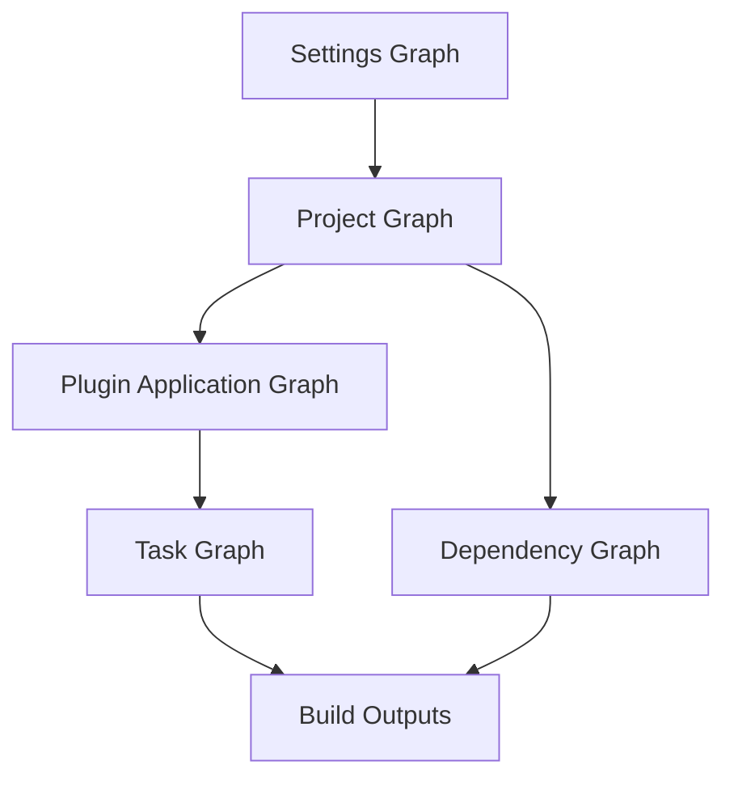
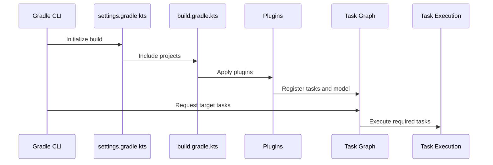
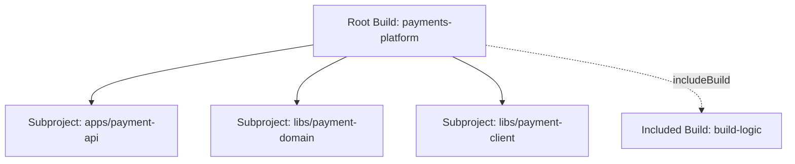
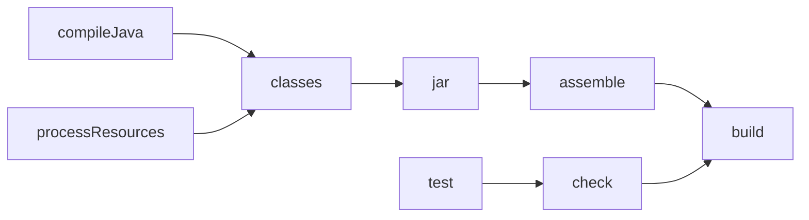
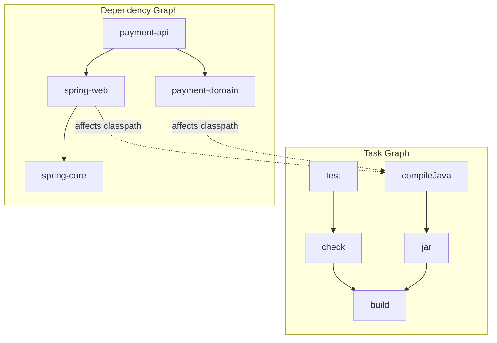

# Part 011 — Gradle Mental Model: Tasks, Plugins, Build Graph

Gradle is often introduced as “a more flexible Maven”. That framing is incomplete and sometimes harmful.

A better mental model:

> Gradle is a programmable build graph engine. A Gradle build describes projects, tasks, plugins, dependencies, inputs, outputs, and rules. Gradle then computes what needs to run for a requested outcome.

For a top-tier Java engineer, the goal is not merely to write `build.gradle.kts`. The goal is to reason about a build as a system:

- What is the build input?
- What is the build output?
- What is configured too early?
- What is executed unnecessarily?
- Which task depends on which artifact?
- Which plugin owns which behavior?
- Which part is local policy, and which part is product-specific behavior?
- Which build behavior is deterministic, cacheable, portable, and CI-safe?

Gradle gives more power than Maven. More power means more possible failure modes.

This part builds the mental model needed before we discuss Gradle dependencies, multi-project builds, build caches, and Maven-vs-Gradle decision architecture.

---

## 1. Kaufman Framing: What Are We Actually Learning?

Josh Kaufman’s method starts by deconstructing the skill. For Gradle, the wrong decomposition is:

1. learn syntax
2. copy plugins
3. run `gradle build`
4. fix errors by searching Stack Overflow

That produces fragile build scripts.

The useful decomposition is:

| Skill Area | What You Need to Understand | Why It Matters |
|---|---|---|
| Build lifecycle | Initialization, configuration, execution | Explains when code runs |
| Project model | Root project, subprojects, included builds | Explains repository structure |
| Task model | Tasks, inputs, outputs, dependencies | Explains build graph behavior |
| Plugin model | Core plugins, binary plugins, convention plugins | Explains where behavior comes from |
| Lazy model | Providers, properties, task registration | Explains performance and correctness |
| Java model | Source sets, compilation, test, JAR tasks | Explains Java artifact production |
| Build logic model | Build scripts vs convention plugins | Explains maintainability at scale |
| Failure model | Configuration-time side effects, hidden inputs, task graph pollution | Explains enterprise build instability |

The minimum practical target for this part:

> Given a Gradle Java build, you should be able to predict which projects are evaluated, which tasks are selected, which tasks run, which tasks are skipped, where plugin behavior comes from, and where enterprise build logic should live.

---

## 2. Gradle’s Core Model

A Gradle build has several overlapping graphs:



These graphs are related, but they are not the same.

A common mistake is to say “Gradle builds dependencies”. More precisely:

- Gradle discovers projects through settings.
- Gradle configures projects using build scripts and plugins.
- Gradle resolves dependencies when a task or configuration requires them.
- Gradle creates a task execution graph for the requested command.
- Gradle executes only the required tasks, subject to up-to-date checks and cache reuse.

The build is not a simple script executed from top to bottom. It is a model plus graph execution.

---

## 3. Build Lifecycle: Initialization, Configuration, Execution

Gradle has three primary lifecycle phases:

| Phase | What Happens | Typical File Involved | Common Failure |
|---|---|---|---|
| Initialization | Gradle determines which projects participate in the build | `settings.gradle.kts` | Wrong project topology |
| Configuration | Gradle evaluates build scripts and plugins, creates/configures model | `build.gradle.kts` | Too much work during configuration |
| Execution | Gradle runs selected task graph | Task actions | Non-deterministic task behavior |



The most important lesson:

> Configuration is not execution.

When someone writes expensive logic directly in `build.gradle.kts`, they are often doing work during configuration, even when the requested task does not need it.

Bad pattern:

```kotlin
// Runs during configuration.
val generated = file("build/generated/version.txt")
generated.writeText(System.currentTimeMillis().toString())
```

This mutates the build directory while Gradle is still configuring the model. It also makes the build non-deterministic.

Better pattern:

```kotlin
abstract class GenerateVersionFile : DefaultTask() {
    @get:OutputFile
    abstract val outputFile: RegularFileProperty

    @TaskAction
    fun generate() {
        outputFile.get().asFile.writeText(project.version.toString())
    }
}

tasks.register<GenerateVersionFile>("generateVersionFile") {
    outputFile.set(layout.buildDirectory.file("generated/version.txt"))
}
```

The second version models the operation as a task with an output. Gradle can reason about it.

---

## 4. Settings File: The Build’s Entry Point

`settings.gradle.kts` defines the participating build.

Typical single-project build:

```kotlin
pluginManagement {
    repositories {
        gradlePluginPortal()
        mavenCentral()
    }
}

dependencyResolutionManagement {
    repositoriesMode.set(RepositoriesMode.FAIL_ON_PROJECT_REPOS)
    repositories {
        mavenCentral()
    }
}

rootProject.name = "billing-service"
```

Typical multi-project build:

```kotlin
rootProject.name = "payments-platform"

include("apps:payment-api")
include("libs:payment-domain")
include("libs:payment-client")
include("platform:java-conventions")
```

At enterprise scale, `settings.gradle.kts` is not a minor file. It controls:

- project inclusion
- plugin repositories
- dependency repositories
- dependency verification policy
- version catalog location
- composite builds
- build cache settings through `settings`-level plugins
- build naming and topology

The settings file answers:

> What is this build?

The root build file answers:

> What common behavior applies to this build?

Subproject build files answer:

> What is special about this project?

---

## 5. Project Model: Root Project, Subproject, Included Build

Gradle uses `Project` objects.

In a simple build, there is one project.

In a multi-project build, there is one root project and many subprojects.

In a composite build, multiple independent Gradle builds can be included together.



Do not confuse these concepts:

| Concept | Meaning |
|---|---|
| Root project | Top project of one Gradle build |
| Subproject | Project included by the root settings file |
| Included build | Separate Gradle build participating in a composite |
| Module | Often used informally, but can mean Gradle project, JPMS module, Maven module, or application module |

Use precise vocabulary in architecture discussions. “Module” is too overloaded.

A top-tier build review should ask:

- Is this a Gradle project boundary?
- Is this a Java package boundary?
- Is this a JPMS module boundary?
- Is this a deployable service boundary?
- Is this a source ownership boundary?

Those boundaries do not have to be identical.

---

## 6. Build Script DSL: Kotlin vs Groovy

Gradle supports Groovy DSL and Kotlin DSL.

Groovy DSL:

```groovy
plugins {
    id 'java-library'
}

dependencies {
    implementation 'org.apache.commons:commons-lang3:3.14.0'
}
```

Kotlin DSL:

```kotlin
plugins {
    `java-library`
}

dependencies {
    implementation("org.apache.commons:commons-lang3:3.14.0")
}
```

For new Java enterprise builds, Kotlin DSL is often preferable because it offers stronger IDE support and type safety. However, Groovy DSL remains common in older builds and in many plugin examples.

The important rule is not “always Kotlin”. The important rule is:

> Build logic should be understandable, typed where practical, centralized where repeated, and boring where possible.

The worst Gradle builds are not Groovy builds. The worst Gradle builds are unstructured builds with business logic hidden inside ad-hoc scripts.

---

## 7. Tasks: The Unit of Work

A task is a unit of work in the build.

Examples:

- `compileJava`
- `processResources`
- `classes`
- `test`
- `jar`
- `check`
- `build`
- `publish`

A task has:

- a name
- a type
- inputs
- outputs
- actions
- dependencies
- ordering rules
- group and description metadata



The Java plugin wires many tasks automatically. You do not usually create `compileJava` manually. The plugin adds it because the build declares itself as a Java build.

That is one of Gradle’s most important design choices:

> Plugins extend the build model by adding tasks, configurations, conventions, and extensions.

---

## 8. Lifecycle Tasks vs Action Tasks

Some tasks do real work. Some tasks primarily aggregate other tasks.

| Task | Typical Role |
|---|---|
| `compileJava` | Compiles source files |
| `test` | Runs tests |
| `jar` | Creates a JAR |
| `check` | Aggregates verification tasks |
| `assemble` | Aggregates packaging tasks |
| `build` | Aggregates assemble and check |
| `clean` | Deletes build output |

`build` is not magic. It is a lifecycle task that depends on other tasks.

The command:

```bash
gradle build
```

means:

> Build the task graph required for the `build` task and execute tasks that are not up-to-date, skipped, disabled, excluded, or satisfied by cache.

This distinction helps you design custom tasks correctly.

Bad:

```kotlin
tasks.register("enterpriseBuild") {
    doLast {
        println("compile")
        println("test")
        println("package")
    }
}
```

Better:

```kotlin
tasks.register("enterpriseBuild") {
    group = "verification"
    description = "Runs the enterprise build verification set."

    dependsOn("clean", "build", "dependencyCheck")
}
```

Better still: define meaningful tasks with declared inputs and outputs, then wire them into lifecycle tasks.

---

## 9. Task Dependencies vs Ordering Rules

Gradle has task dependencies and task ordering constraints.

| Mechanism | Meaning |
|---|---|
| `dependsOn` | This task requires another task to complete first |
| `mustRunAfter` | If both tasks run, enforce ordering |
| `shouldRunAfter` | Prefer ordering if possible |
| `finalizedBy` | Run finalizer after this task |

Example:

```kotlin
tasks.register("startTestDatabase")
tasks.register("stopTestDatabase")

tasks.named("test") {
    dependsOn("startTestDatabase")
    finalizedBy("stopTestDatabase")
}
```

Use `dependsOn` only when there is a real dependency.

A common build smell:

```kotlin
tasks.named("build") {
    dependsOn("everythingWeCouldThinkOf")
}
```

That turns the build into an overloaded command. Instead, model lifecycle tasks explicitly:

- `quickCheck`
- `ciCheck`
- `releaseCheck`
- `compatibilityCheck`
- `securityCheck`

Each should have a clear purpose.

---

## 10. Task Inputs and Outputs

Gradle can skip work only if it understands task inputs and outputs.

A task without declared inputs and outputs is opaque. Gradle cannot safely determine if it is up-to-date.

Example custom task:

```kotlin
abstract class GenerateBuildManifest : DefaultTask() {
    @get:Input
    abstract val serviceName: Property<String>

    @get:Input
    abstract val serviceVersion: Property<String>

    @get:OutputFile
    abstract val outputFile: RegularFileProperty

    @TaskAction
    fun generate() {
        outputFile.get().asFile.writeText(
            """
            service=${serviceName.get()}
            version=${serviceVersion.get()}
            """.trimIndent()
        )
    }
}

tasks.register<GenerateBuildManifest>("generateBuildManifest") {
    serviceName.set("payment-api")
    serviceVersion.set(project.version.toString())
    outputFile.set(layout.buildDirectory.file("generated/build-manifest.properties"))
}
```

This is build-engineering thinking:

- declare the operation
- declare inputs
- declare outputs
- avoid hidden state
- let Gradle optimize safely

Hidden inputs break correctness.

Examples of hidden inputs:

- current timestamp
- local hostname
- local username
- environment variables read without declaration
- files outside the project directory
- network calls during task execution
- mutable shared directories
- installed local tools not declared by the build

If a task depends on an environment variable, model it deliberately.

```kotlin
abstract class PrintTargetEnvironment : DefaultTask() {
    @get:Input
    abstract val targetEnvironment: Property<String>

    @TaskAction
    fun run() {
        println("target=${targetEnvironment.get()}")
    }
}

tasks.register<PrintTargetEnvironment>("printTargetEnvironment") {
    targetEnvironment.set(
        providers.environmentVariable("TARGET_ENV").orElse("local")
    )
}
```

This is still not always reproducible, but at least the input is represented in the model.

---

## 11. Lazy Configuration: Do Not Create What You Do Not Need

Gradle builds can become slow before executing any task. That happens when configuration logic eagerly creates and configures too much.

Eager pattern:

```kotlin
tasks.create("generateReport") {
    doLast {
        println("report")
    }
}
```

Lazy pattern:

```kotlin
tasks.register("generateReport") {
    doLast {
        println("report")
    }
}
```

The difference is not cosmetic.

`create` creates the task immediately during configuration.

`register` registers the task lazily. The task is realized only when needed.

The same applies to task lookup.

Prefer:

```kotlin
tasks.named("test") {
    useJUnitPlatform()
}
```

Avoid:

```kotlin
tasks.getByName("test") {
    // Eagerly realizes the task.
}
```

Enterprise invariant:

> Build logic should register and configure lazily unless there is a specific reason to realize objects immediately.

This matters especially in large multi-project builds where hundreds or thousands of tasks may exist.

---

## 12. Provider API: Values That May Not Exist Yet

Gradle’s lazy model is built around providers and properties.

Common types:

| Type | Meaning |
|---|---|
| `Provider<T>` | A lazily computed value |
| `Property<T>` | A configurable lazy value |
| `ListProperty<T>` | Lazy list value |
| `MapProperty<K,V>` | Lazy map value |
| `RegularFileProperty` | Lazy file value |
| `DirectoryProperty` | Lazy directory value |

Bad:

```kotlin
val output = file("${buildDir}/generated/report.txt")
```

Better:

```kotlin
val output = layout.buildDirectory.file("generated/report.txt")
```

Bad:

```kotlin
val env = System.getenv("TARGET_ENV") ?: "local"
```

Better:

```kotlin
val env = providers.environmentVariable("TARGET_ENV").orElse("local")
```

The Provider API lets Gradle wire values without forcing them too early.

This is one of the hardest mental shifts for engineers coming from Maven or shell scripts.

You are not writing an imperative build script. You are modeling a build graph.

---

## 13. Plugins: Where Behavior Comes From

A plugin adds behavior to a build.

Plugins can add:

- tasks
- extensions
- configurations
- dependencies
- conventions
- validations
- publications
- toolchains
- source sets
- reporting behavior

Core Java plugin:

```kotlin
plugins {
    java
}
```

Java library plugin:

```kotlin
plugins {
    `java-library`
}
```

Application plugin:

```kotlin
plugins {
    application
}

application {
    mainClass.set("com.acme.billing.Main")
}
```

Third-party plugin:

```kotlin
plugins {
    id("org.springframework.boot") version "3.5.0"
}
```

Enterprise convention plugin:

```kotlin
plugins {
    id("com.acme.java-library-conventions")
}
```

The best Gradle builds reduce repeated build script code by moving conventions into plugins.

---

## 14. Core Plugins vs Community Plugins vs Convention Plugins

| Plugin Type | Example | Governance Concern |
|---|---|---|
| Core plugin | `java`, `java-library`, `application`, `maven-publish` | Stable, documented, but still version-dependent |
| Community plugin | Spring Boot, protobuf, shadow, license plugins | Must manage plugin version, compatibility, trust |
| Internal convention plugin | `com.company.java-service` | Best place for enterprise defaults |

A mature organization usually creates a small internal build platform:

- `company.java-library`
- `company.java-application`
- `company.spring-boot-service`
- `company.contract-test`
- `company.publishing`
- `company.release-checks`

The product build file then becomes small:

```kotlin
plugins {
    id("company.spring-boot-service")
}

dependencies {
    implementation(project(":libs:payment-domain"))
    implementation(libs.spring.boot.starter.web)
    testImplementation(libs.junit.jupiter)
}
```

That is the desired shape: local build files express product-specific intent, not enterprise boilerplate.

---

## 15. Plugin Management

Plugin repositories and versions can be centralized in `settings.gradle.kts`.

```kotlin
pluginManagement {
    repositories {
        gradlePluginPortal()
        mavenCentral()
        maven("https://repo.company.example/gradle-plugins")
    }

    plugins {
        id("org.springframework.boot") version "3.5.0"
        id("io.spring.dependency-management") version "1.1.7"
    }
}
```

Then in subprojects:

```kotlin
plugins {
    id("org.springframework.boot")
}
```

This avoids uncontrolled plugin version scattering.

But centralizing versions alone is not enough. A platform team should also define:

- approved plugins
- plugin upgrade cadence
- compatibility matrix
- deprecation policy
- plugin security review
- fallback plan if plugin is abandoned

Build plugins are part of the software supply chain. Treat them accordingly.

---

## 16. `apply false`: Declaring Without Applying

A common root build pattern:

```kotlin
plugins {
    java apply false
    `java-library` apply false
    id("org.springframework.boot") version "3.5.0" apply false
}

subprojects {
    repositories {
        mavenCentral()
    }
}
```

`apply false` makes the plugin available without applying it to the root project.

This is useful when subprojects apply different plugins.

However, avoid massive `subprojects { ... }` blocks that mutate every subproject in hidden ways.

Prefer convention plugins when behavior is non-trivial.

Bad enterprise pattern:

```kotlin
subprojects {
    apply(plugin = "java")

    tasks.withType<Test> {
        useJUnitPlatform()
    }

    dependencies {
        "testImplementation"("org.junit.jupiter:junit-jupiter:5.10.2")
    }
}
```

Better:

```kotlin
// In each Java subproject:
plugins {
    id("company.java-conventions")
}
```

The convention plugin owns the shared behavior.

---

## 17. Java Plugin: What It Adds

When you apply `java`, Gradle adds Java-specific model elements.

Typical tasks:

- `compileJava`
- `processResources`
- `classes`
- `compileTestJava`
- `processTestResources`
- `testClasses`
- `test`
- `jar`
- `javadoc`
- `assemble`
- `check`
- `build`

Typical source sets:

- `main`
- `test`

Typical configurations:

- `implementation`
- `compileOnly`
- `runtimeOnly`
- `testImplementation`
- `testCompileOnly`
- `testRuntimeOnly`
- `annotationProcessor`

The `java-library` plugin adds API-aware modeling:

- `api`
- `compileOnlyApi`

This matters because a library has an API surface. An application usually does not expose a compile-time API to consumers in the same way.

Use `java-library` for reusable Java libraries.

Use `application` or framework-specific plugins for executable applications.

---

## 18. Build Graph vs Dependency Graph

Gradle has a task graph and a dependency graph.

They are related, but different.



The task graph answers:

> What work must run?

The dependency graph answers:

> What artifacts are needed by compile/runtime/test/publish operations?

A dependency may influence a task without being a task dependency in the simple sense. For example, `compileJava` depends on a resolved compile classpath. That classpath may contain external modules or outputs from other projects.

In a multi-project build:

```kotlin
dependencies {
    implementation(project(":libs:payment-domain"))
}
```

Gradle can infer that compiling or packaging `payment-api` may need outputs from `payment-domain`.

This inference is powerful. It is also why precise project dependencies matter.

---

## 19. A Minimal Java Library Build

```kotlin
plugins {
    `java-library`
}

java {
    toolchain {
        languageVersion.set(JavaLanguageVersion.of(21))
    }
}

repositories {
    mavenCentral()
}

dependencies {
    api("org.slf4j:slf4j-api:2.0.17")
    implementation("org.apache.commons:commons-lang3:3.17.0")

    testImplementation("org.junit.jupiter:junit-jupiter:5.13.0")
}

tasks.test {
    useJUnitPlatform()
}
```

This build expresses:

- it is a Java library
- consumers may see `slf4j-api`
- `commons-lang3` is internal implementation detail
- tests use JUnit Jupiter
- Java toolchain is pinned
- Maven Central is used

What it does not yet express:

- version catalog
- dependency constraints
- dependency verification
- publishing
- test suites beyond unit tests
- enterprise convention plugin
- reproducibility gates

Those will come later.

---

## 20. The Root Build Should Not Become a Trash Heap

A common Gradle decay path:

1. start with a simple root `build.gradle.kts`
2. add `subprojects {}`
3. add `allprojects {}`
4. add plugin-specific logic
5. add conditional logic by project name
6. add publication logic
7. add CI hacks
8. add environment-specific behavior
9. everyone becomes afraid to edit the build

Example smell:

```kotlin
subprojects {
    if (name.contains("service")) {
        apply(plugin = "org.springframework.boot")
    }

    if (!name.endsWith("bom")) {
        apply(plugin = "java")
    }
}
```

This is implicit architecture encoded as string matching.

Better:

```kotlin
// apps/payment-api/build.gradle.kts
plugins {
    id("company.spring-boot-service")
}

// libs/payment-domain/build.gradle.kts
plugins {
    id("company.java-library")
}

// platform/dependencies/build.gradle.kts
plugins {
    id("company.java-platform")
}
```

Explicit plugin application is easier to review, safer to migrate, and more compatible with configuration cache.

---

## 21. Convention Plugins: The Enterprise Escape Hatch

Convention plugins are internal plugins that encode standard build behavior.

They usually live in:

- `buildSrc`
- an included build like `build-logic`
- a published internal plugin artifact

For serious builds, prefer an included build called `build-logic`.

Example topology:

```text
payments-platform/
  settings.gradle.kts
  build.gradle.kts
  build-logic/
    settings.gradle.kts
    convention-plugins/
      build.gradle.kts
      src/main/kotlin/company.java-library.gradle.kts
      src/main/kotlin/company.java-service.gradle.kts
  apps/
    payment-api/
      build.gradle.kts
  libs/
    payment-domain/
      build.gradle.kts
```

`settings.gradle.kts`:

```kotlin
pluginManagement {
    includeBuild("build-logic")
}

rootProject.name = "payments-platform"

include("apps:payment-api")
include("libs:payment-domain")
```

`company.java-library.gradle.kts`:

```kotlin
plugins {
    `java-library`
}

java {
    toolchain {
        languageVersion.set(JavaLanguageVersion.of(21))
    }
}

tasks.withType<Test>().configureEach {
    useJUnitPlatform()
}
```

Subproject:

```kotlin
plugins {
    id("company.java-library")
}
```

This gives you standardization without turning the root build into a procedural script.

---

## 22. `buildSrc` vs Included Build

`buildSrc` is convenient. Gradle automatically compiles it and puts it on the build script classpath.

However, `buildSrc` has drawbacks in large builds:

- it is implicitly included
- changes can invalidate build script classpaths broadly
- it can become a dumping ground
- it is harder to reuse across repositories

An included build for build logic is usually clearer:

```kotlin
pluginManagement {
    includeBuild("build-logic")
}
```

This treats build logic as a real build.

Use `buildSrc` for small builds or experiments. Use included build convention plugins for enterprise build platforms.

---

## 23. Anti-Patterns in Gradle Build Logic

### 23.1 Doing I/O During Configuration

Bad:

```kotlin
val token = file("secrets/token.txt").readText()
```

Why bad:

- fails local builds without secret file
- reads during configuration
- leaks secret into configuration model
- harms cacheability

Better: use credentials providers, CI secret injection, or task inputs only where required.

### 23.2 Resolving Configurations During Configuration

Bad:

```kotlin
val files = configurations.runtimeClasspath.get().files
```

This forces dependency resolution too early.

Better: wire providers into tasks and let task execution resolve what is needed.

### 23.3 `afterEvaluate` as Design Tool

Bad:

```kotlin
afterEvaluate {
    tasks.named("jar") {
        dependsOn("generateSomething")
    }
}
```

`afterEvaluate` often indicates the build model is not being wired lazily or through plugin extensions properly.

Use plugin APIs, task providers, and extension configuration instead.

### 23.4 Project Name String Logic

Bad:

```kotlin
if (project.name.contains("api")) {
    apply(plugin = "java-library")
}
```

This creates implicit architecture rules.

Prefer explicit convention plugins.

### 23.5 Mutable Global State

Bad:

```kotlin
val generatedFiles = mutableListOf<File>()
```

Builds should model inputs/outputs, not accumulate global mutable state across project configuration.

---

## 24. Debugging the Build Graph

Useful commands:

```bash
./gradlew tasks
./gradlew tasks --all
./gradlew help --task build
./gradlew build --dry-run
./gradlew build --info
./gradlew build --debug
./gradlew projects
./gradlew properties
```

For dependency-related debugging:

```bash
./gradlew dependencies
./gradlew dependencyInsight --dependency guava --configuration runtimeClasspath
```

For performance:

```bash
./gradlew help --scan
./gradlew build --profile
```

But commands are not enough. You need interpretation.

When a task appears unexpectedly, ask:

1. Which plugin created it?
2. Which task depends on it?
3. Was it directly requested?
4. Was it added by lifecycle wiring?
5. Was it added by publication logic?
6. Was it added by test suite logic?
7. Was it realized because of eager configuration?

When configuration is slow, ask:

1. Are all subprojects being configured?
2. Are tasks being created eagerly?
3. Are configurations being resolved during configuration?
4. Are external processes invoked during configuration?
5. Are files scanned during configuration?
6. Are plugins doing expensive work?

---

## 25. The Advanced Engineer’s Gradle Review Checklist

Use this checklist when reviewing a Gradle build.

### Lifecycle

- Does the build avoid expensive work during configuration?
- Are tasks registered lazily?
- Are task actions limited to execution phase?
- Are environment reads deliberate?

### Tasks

- Do custom tasks declare inputs and outputs?
- Are lifecycle tasks used as aggregators only?
- Is `dependsOn` used for real dependencies?
- Are ordering rules used correctly?

### Plugins

- Are plugins versioned centrally?
- Are approved plugins documented?
- Are repeated conventions encoded as internal plugins?
- Is root build logic minimal?

### Project Structure

- Are project boundaries explicit?
- Is plugin application explicit?
- Are subproject names free of hidden behavior?
- Is build logic separate from product logic?

### Performance

- Is configuration avoidance used?
- Are configurations resolved lazily?
- Are task outputs cacheable where practical?
- Is build performance measured?

### Maintainability

- Can a new engineer predict the build graph?
- Is the build boring for common use cases?
- Are CI-only behaviors minimized?
- Is enterprise policy centralized?

---

## 26. Practice Lab

Create a small Gradle multi-project build:

```text
inventory-platform/
  settings.gradle.kts
  build.gradle.kts
  build-logic/
  libs/
    inventory-domain/
  apps/
    inventory-api/
```

Requirements:

1. `inventory-domain` uses `company.java-library`.
2. `inventory-api` uses `company.java-application`.
3. Java toolchain is set to 21 through convention plugins.
4. JUnit Platform is configured through convention plugins.
5. No `subprojects { apply(...) }` block is allowed.
6. Add a custom `generateBuildManifest` task with declared inputs and outputs.
7. Wire the generated manifest into `processResources`.
8. Verify task graph with `./gradlew build --dry-run`.
9. Verify that `./gradlew help` does not execute custom task actions.

Expected learning:

- plugin application is architecture
- task registration is not task execution
- custom work must be modeled
- root build files should stay small
- Gradle scales when build logic is structured

---

## 27. Summary

Gradle is powerful because it models builds as graphs. That same power makes it easy to create fragile builds if engineers treat Gradle as a shell script with nicer syntax.

The core mental model:

- settings define the participating build
- projects hold build model
- plugins add behavior
- tasks model work
- inputs and outputs make work optimizable
- providers delay values until needed
- lifecycle tasks aggregate meaningful work
- convention plugins encode enterprise standards

The key invariant:

> A Gradle build should be explicit in architecture, lazy in configuration, deterministic in execution, and boring for product teams.

In the next part, we will focus on Gradle dependency configurations and version catalogs. That is where Gradle’s graph model becomes especially important, because dependencies are not just strings. They are scoped, variant-aware, policy-sensitive inputs to compilation, testing, runtime, publishing, and release.
