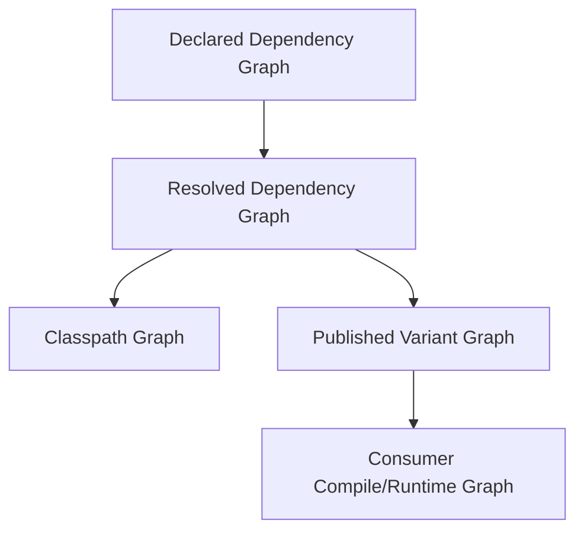
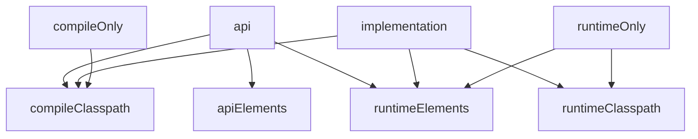

# Part 012 — Gradle Dependency Configurations and Version Catalogs

In Maven, dependency scope is usually taught as `compile`, `runtime`, `test`, `provided`, `system`, and `import`.

In Gradle, the model is more flexible and more subtle.

Gradle dependencies are declared against configurations. A configuration is not just a “scope name”. It can be:

- a place where dependencies are declared
- a classpath that can be resolved
- a variant that can be consumed by another project
- a policy boundary for compilation, runtime, testing, publishing, and tooling

This part explains how to reason about Gradle dependency configurations, especially for Java builds.

The central idea:

> A dependency declaration is an architectural statement about who may see an artifact, when it is needed, and whether it becomes part of another component’s contract.

---

## 1. Kaufman Framing: The Skill to Acquire

The skill is not “remember all Gradle configuration names”.

The skill is to answer these questions quickly:

1. Is this dependency needed for compilation, runtime, testing, annotation processing, or publishing?
2. Is it part of this library’s public API?
3. Should consumers inherit it on their compile classpath?
4. Should it be available only at runtime?
5. Should it be available only in tests?
6. Should its version be declared locally, centrally, constrained, or aligned by a platform?
7. Should this dependency be hidden behind an internal abstraction?
8. Should this dependency be allowed by policy at all?

A top-tier engineer uses dependency configurations to control coupling.

A weak build uses `implementation` everywhere and hopes for the best.

---

## 2. The Three Graphs You Must Keep Separate

Gradle dependency management involves at least three conceptual graphs:



| Graph | Meaning |
|---|---|
| Declared graph | What the build file says |
| Resolved graph | What Gradle selected after conflict resolution and metadata rules |
| Classpath graph | What compiler/test/runtime actually sees |
| Published variant graph | What consumers receive when depending on your component |

Most production dependency bugs happen because engineers confuse these graphs.

Example:

```kotlin
dependencies {
    implementation("com.fasterxml.jackson.core:jackson-databind:2.17.2")
}
```

This declaration does not merely “add Jackson”. It adds Jackson to a specific configuration. Whether that affects compile classpath, runtime classpath, publication metadata, or consumer classpaths depends on plugin behavior and variant mapping.

---

## 3. What Is a Configuration?

A configuration is a named bucket with semantics.

In Java builds, common configurations include:

- `implementation`
- `api`
- `compileOnly`
- `compileOnlyApi`
- `runtimeOnly`
- `annotationProcessor`
- `testImplementation`
- `testCompileOnly`
- `testRuntimeOnly`

There are also classpath-like configurations such as:

- `compileClasspath`
- `runtimeClasspath`
- `testCompileClasspath`
- `testRuntimeClasspath`

And consumable variants such as:

- `apiElements`
- `runtimeElements`

A simplified model:



This diagram is simplified, but it captures the important idea: configurations feed different classpaths and published variants differently.

---

## 4. Declarable, Resolvable, and Consumable Configurations

Gradle configurations can play different roles.

| Role | Question It Answers | Example |
|---|---|---|
| Declarable | Where do I declare dependencies? | `implementation`, `api` |
| Resolvable | What files should this task/classpath use? | `runtimeClasspath` |
| Consumable | What variant can another project consume? | `apiElements`, `runtimeElements` |

As a rule:

- declare dependencies on declarable configurations
- resolve resolvable configurations
- publish consumable configurations

Avoid resolving `implementation` directly. Use classpath configurations or task APIs.

Bad:

```kotlin
val files = configurations.implementation.get().files
```

Better:

```kotlin
tasks.register<Copy>("copyRuntimeLibs") {
    from(configurations.runtimeClasspath)
    into(layout.buildDirectory.dir("runtime-libs"))
}
```

Even better: avoid custom classpath copying unless the packaging model requires it.

---

## 5. `implementation`: Internal Compile and Runtime Dependency

`implementation` is the default choice for most dependencies.

```kotlin
dependencies {
    implementation("org.apache.commons:commons-lang3:3.17.0")
}
```

Use `implementation` when:

- your code needs the dependency to compile
- your code needs it at runtime
- consumers do not need it on their compile classpath as part of your API

Example:

```java
package com.acme.billing.internal;

import org.apache.commons.lang3.StringUtils;

final class InvoiceCodeNormalizer {
    String normalize(String value) {
        return StringUtils.trimToEmpty(value).toUpperCase();
    }
}
```

If `commons-lang3` is used only inside implementation classes, it should not be exposed as `api`.

Benefit:

- smaller consumer compile classpaths
- less recompilation downstream
- better encapsulation
- lower accidental coupling

Enterprise invariant:

> Default to `implementation`; promote to `api` only when the dependency appears in the public ABI of a library.

---

## 6. `api`: Public API Dependency

`api` is available when the `java-library` plugin is applied.

```kotlin
plugins {
    `java-library`
}

dependencies {
    api("org.slf4j:slf4j-api:2.0.17")
}
```

Use `api` when your public types expose the dependency.

Example:

```java
package com.acme.billing;

import org.slf4j.Logger;

public interface BillingLoggerFactory {
    Logger loggerFor(Class<?> type);
}
```

Here, `Logger` appears in the public API. Consumers compiling against `BillingLoggerFactory` need `slf4j-api` on their compile classpath.

Another example:

```java
public interface CustomerRepository {
    Optional<Customer> findById(CustomerId id);
}
```

`Optional` is from the JDK, so no external dependency issue.

But:

```java
public interface CustomerRepository {
    io.vavr.control.Option<Customer> findById(CustomerId id);
}
```

Now Vavr becomes part of the API contract. It should be `api`, or better, you may reconsider whether exposing it is a good architectural choice.

---

## 7. API Leakage as an Architectural Smell

API leakage happens when an implementation choice becomes a consumer contract.

```java
public interface PaymentReportService {
    com.fasterxml.jackson.databind.JsonNode generateReport(PaymentReportRequest request);
}
```

This leaks Jackson into the API.

Maybe that is intended. But often it is not.

Alternative:

```java
public interface PaymentReportService {
    PaymentReport generateReport(PaymentReportRequest request);
}
```

Then Jackson can remain internal serialization detail:

```kotlin
dependencies {
    implementation(libs.jackson.databind)
}
```

Design rule:

> Every `api` dependency deserves an architectural justification.

Review question:

- Is this dependency a domain contract?
- Is it a stable platform abstraction?
- Is it a logging/API facade intended for consumers?
- Or did an implementation detail accidentally leak?

---

## 8. `compileOnly`: Needed to Compile, Not Packaged for Runtime

Use `compileOnly` when the dependency is required for compilation but provided elsewhere at runtime.

```kotlin
dependencies {
    compileOnly("jakarta.servlet:jakarta.servlet-api:6.1.0")
}
```

Typical cases:

- servlet API provided by app server/container
- compile-time-only annotations
- platform APIs provided by runtime
- optional integration APIs

Danger:

If the runtime does not actually provide the dependency, you get runtime failure:

```text
java.lang.NoClassDefFoundError
java.lang.ClassNotFoundException
```

Use `compileOnly` only when runtime ownership is explicit.

Checklist:

- Who provides this at runtime?
- Which deployment model guarantees it?
- Is the runtime version compatible?
- Is there a test that exercises runtime packaging?

---

## 9. `runtimeOnly`: Needed at Runtime, Not Compile Time

Use `runtimeOnly` when code does not compile directly against the dependency, but runtime needs it.

```kotlin
dependencies {
    runtimeOnly("org.postgresql:postgresql:42.7.7")
}
```

Typical cases:

- JDBC drivers
- logging implementations
- service provider implementations
- runtime-only instrumentation agents
- plugin implementations discovered by SPI

Example:

```kotlin
dependencies {
    implementation("org.slf4j:slf4j-api:2.0.17")
    runtimeOnly("ch.qos.logback:logback-classic:1.5.18")
}
```

The application compiles against `slf4j-api`. At runtime, Logback provides the implementation.

This is a clean separation:

- API at compile time
- implementation at runtime

---

## 10. `annotationProcessor`: Compile-Time Code Generation

Annotation processors should be placed on `annotationProcessor`, not ordinary implementation classpath.

```kotlin
dependencies {
    implementation("org.mapstruct:mapstruct:1.6.3")
    annotationProcessor("org.mapstruct:mapstruct-processor:1.6.3")
}
```

Why separation matters:

- annotation processors affect compilation behavior
- they should not accidentally become runtime dependencies
- they can affect incremental compilation
- they can create generated source determinism issues

For tests:

```kotlin
dependencies {
    testAnnotationProcessor("org.mapstruct:mapstruct-processor:1.6.3")
}
```

Do not hide annotation processors in `implementation` unless the tool specifically requires it.

---

## 11. Test Configurations

Common test configurations:

```kotlin
dependencies {
    testImplementation("org.junit.jupiter:junit-jupiter:5.13.0")
    testRuntimeOnly("org.junit.platform:junit-platform-launcher:1.13.0")
}

tasks.test {
    useJUnitPlatform()
}
```

`testImplementation` is for dependencies needed to compile and run tests.

`testRuntimeOnly` is for dependencies needed only when tests run.

Tests should not silently depend on production internals unless intentional.

Bad smell:

```kotlin
dependencies {
    testImplementation(project(":apps:payment-api"))
}
```

This can create circular knowledge between app and library layers.

Better patterns:

- test through public API
- create test fixtures intentionally
- use contract test artifacts
- keep test utilities in dedicated test-fixtures modules only when ownership is clear

---

## 12. Java Library Plugin: Why `api` Exists

The `java` plugin is enough for simple applications.

The `java-library` plugin is better for reusable libraries because it distinguishes API dependencies from implementation dependencies.

```kotlin
plugins {
    `java-library`
}
```

Why this matters:

Suppose `payment-domain` exposes only domain types and internally uses Guava.

```kotlin
// libs/payment-domain/build.gradle.kts
plugins {
    `java-library`
}

dependencies {
    implementation("com.google.guava:guava:33.3.1-jre")
}
```

`payment-api` depends on it:

```kotlin
dependencies {
    implementation(project(":libs:payment-domain"))
}
```

If Guava is implementation-only, consumers do not need Guava on their compile classpath merely because `payment-domain` uses it internally.

This improves build performance and architectural hygiene.

---

## 13. Classpath Reasoning

A Java build has multiple classpaths.

| Classpath | Used By | Typical Inputs |
|---|---|---|
| `compileClasspath` | `compileJava` | `api`, `implementation`, `compileOnly` |
| `runtimeClasspath` | runtime execution/package tasks | `implementation`, `runtimeOnly`, runtime variants |
| `testCompileClasspath` | `compileTestJava` | production output plus test compile deps |
| `testRuntimeClasspath` | `test` | production runtime plus test runtime deps |

When debugging, do not ask “is dependency present?” Ask:

> Present on which classpath?

Commands:

```bash
./gradlew dependencies --configuration compileClasspath
./gradlew dependencies --configuration runtimeClasspath
./gradlew dependencies --configuration testRuntimeClasspath
```

For a specific dependency:

```bash
./gradlew dependencyInsight \
  --dependency jackson-databind \
  --configuration runtimeClasspath
```

A dependency can be absent from compile classpath but present at runtime. That may be correct.

A dependency can be present in tests but absent from production runtime. That may be correct.

The goal is not maximal visibility. The goal is correct visibility.

---

## 14. Project Dependencies

Gradle supports dependencies on other projects in the same build.

```kotlin
dependencies {
    implementation(project(":libs:payment-domain"))
}
```

This means:

- use the published variant of the target project inside the same build
- wire task dependencies as needed
- consume API/runtime elements according to configuration

Use project dependencies for source-coupled modules that should build together.

Avoid using project dependencies to create accidental monoliths.

Review questions:

- Does this project dependency represent a real architectural dependency?
- Is the dependency direction correct?
- Does it cross a deployable boundary?
- Should this be a published library dependency instead?
- Does it create a cycle?

Gradle can detect some cycles, but architectural cycles can exist even when build graph cycles do not.

---

## 15. External Module Dependencies

Standard external dependency syntax:

```kotlin
dependencies {
    implementation("org.apache.commons:commons-lang3:3.17.0")
}
```

Expanded notation:

```kotlin
dependencies {
    implementation(group = "org.apache.commons", name = "commons-lang3", version = "3.17.0")
}
```

Use string notation for normal cases. Use expanded notation or rich declarations when you need exclusions, capabilities, attributes, or constraints.

Example with exclusion:

```kotlin
dependencies {
    implementation("com.example:legacy-client:1.4.0") {
        exclude(group = "commons-logging", module = "commons-logging")
    }
}
```

Exclusions are sharp tools.

Before excluding, ask:

- Why is the transitive dependency harmful?
- Which dependency introduces it?
- Will removing it break the provider?
- Is there a better version alignment solution?
- Should we use constraints instead?

---

## 16. Version Catalogs: Centralized Coordinates

A version catalog centralizes dependency aliases.

Default file:

```text
gradle/libs.versions.toml
```

Example:

```toml
[versions]
junit = "5.13.0"
slf4j = "2.0.17"
jackson = "2.17.2"

[libraries]
junit-jupiter = { module = "org.junit.jupiter:junit-jupiter", version.ref = "junit" }
slf4j-api = { module = "org.slf4j:slf4j-api", version.ref = "slf4j" }
jackson-databind = { module = "com.fasterxml.jackson.core:jackson-databind", version.ref = "jackson" }

[bundles]
testing = ["junit-jupiter"]

[plugins]
spring-boot = { id = "org.springframework.boot", version = "3.5.0" }
```

Usage:

```kotlin
dependencies {
    implementation(libs.slf4j.api)
    implementation(libs.jackson.databind)
    testImplementation(libs.bundles.testing)
}
```

Plugin usage:

```kotlin
plugins {
    alias(libs.plugins.spring.boot)
}
```

Version catalogs improve consistency and discoverability.

But they are not a complete dependency governance solution.

---

## 17. What Version Catalogs Are Not

A version catalog is not automatically:

- a compatibility guarantee
- a security approval system
- a dependency lock
- a transitive version alignment mechanism
- a policy enforcement engine
- a license compliance system
- an SBOM
- a vulnerability scanner

It is a catalog.

It answers:

> What names do we use for common dependency coordinates and plugin coordinates?

It does not fully answer:

> Are these dependencies safe, aligned, allowed, compatible, signed, reproducible, and production-approved?

For that, you need additional mechanisms:

- platforms/BOMs
- constraints
- dependency locking
- dependency verification
- SBOM generation
- vulnerability scanning
- license policy
- repository allowlists
- plugin governance
- review workflows

---

## 18. Naming Aliases Well

Bad catalog:

```toml
[libraries]
lib1 = "org.apache.commons:commons-lang3:3.17.0"
jackson = "com.fasterxml.jackson.core:jackson-databind:2.17.2"
foo = "org.junit.jupiter:junit-jupiter:5.13.0"
```

Better:

```toml
[libraries]
commons-lang3 = { module = "org.apache.commons:commons-lang3", version = "3.17.0" }
jackson-databind = { module = "com.fasterxml.jackson.core:jackson-databind", version.ref = "jackson" }
junit-jupiter = { module = "org.junit.jupiter:junit-jupiter", version.ref = "junit" }
```

Alias guidelines:

- prefer stable ecosystem names
- avoid local nicknames
- include module role when needed
- group by family where useful
- do not encode versions in aliases
- avoid aliases that hide risky dependencies

For a large organization, consider catalog sections by domain:

```toml
[libraries]
logging-slf4j-api = { module = "org.slf4j:slf4j-api", version.ref = "slf4j" }
logging-logback-classic = { module = "ch.qos.logback:logback-classic", version.ref = "logback" }
json-jackson-databind = { module = "com.fasterxml.jackson.core:jackson-databind", version.ref = "jackson" }
test-junit-jupiter = { module = "org.junit.jupiter:junit-jupiter", version.ref = "junit" }
```

Do not over-engineer naming. The catalog should reduce cognitive load.

---

## 19. Bundles: Convenience, Not Architecture

Bundles group multiple aliases.

```toml
[bundles]
jackson = ["jackson-databind", "jackson-jsr310", "jackson-parameter-names"]
```

Usage:

```kotlin
dependencies {
    implementation(libs.bundles.jackson)
}
```

Bundles are useful for common dependency sets.

But be careful. Bundles can hide dependency decisions.

Bad:

```toml
[bundles]
default-service = [
  "spring-boot-starter-web",
  "spring-boot-starter-data-jpa",
  "postgresql",
  "flyway-core",
  "kafka-clients",
  "redis-client",
  "aws-sdk-s3"
]
```

This encourages every service to depend on everything.

Better:

- create small, cohesive bundles
- keep runtime drivers explicit
- avoid domain-inappropriate bundles
- use convention plugins for repeated build behavior, not dependency dumping

---

## 20. Plugin Catalogs

Version catalogs can declare plugins.

```toml
[plugins]
spotless = { id = "com.diffplug.spotless", version = "7.0.4" }
shadow = { id = "com.gradleup.shadow", version = "8.3.6" }
```

Usage:

```kotlin
plugins {
    alias(libs.plugins.spotless)
}
```

This centralizes plugin versions.

But plugin application should still be deliberate.

Do not apply powerful plugins casually:

- shading plugins can alter packaging and dependency visibility
- publishing plugins can expose artifacts externally
- codegen plugins can affect compile performance and generated source policy
- framework plugins can rewrite lifecycle tasks

Plugin aliases are convenience, not approval.

---

## 21. Platforms and BOMs

A platform aligns versions across dependency families.

Example using a Maven BOM:

```kotlin
dependencies {
    implementation(platform("org.springframework.boot:spring-boot-dependencies:3.5.0"))
    implementation("org.springframework.boot:spring-boot-starter-web")
    implementation("org.springframework.boot:spring-boot-starter-actuator")
}
```

With a version catalog:

```toml
[libraries]
spring-boot-bom = { module = "org.springframework.boot:spring-boot-dependencies", version = "3.5.0" }
spring-boot-starter-web = { module = "org.springframework.boot:spring-boot-starter-web" }
spring-boot-starter-actuator = { module = "org.springframework.boot:spring-boot-starter-actuator" }
```

```kotlin
dependencies {
    implementation(platform(libs.spring.boot.bom))
    implementation(libs.spring.boot.starter.web)
    implementation(libs.spring.boot.starter.actuator)
}
```

A platform answers:

> Which versions are intended to work together?

A catalog answers:

> Which aliases point to which coordinates?

Do not confuse them.

---

## 22. `platform` vs `enforcedPlatform`

`platform` imports dependency constraints that participate in version selection.

```kotlin
implementation(platform(libs.spring.boot.bom))
```

`enforcedPlatform` forces versions more aggressively.

```kotlin
implementation(enforcedPlatform(libs.spring.boot.bom))
```

Use `enforcedPlatform` cautiously. It can override transitive dependency expectations and may leak strict constraints to consumers if used in published libraries.

General guidance:

- applications can use stronger enforcement when runtime control is local
- libraries should avoid imposing aggressive version constraints on consumers unless the library is a platform itself
- internal platforms should document override policy

Prefer `platform` unless you have a clear reason to force.

---

## 23. Dependency Constraints

Constraints let you influence versions without always declaring direct usage.

```kotlin
dependencies {
    constraints {
        implementation("com.fasterxml.jackson.core:jackson-databind:2.17.2") {
            because("Align with approved JSON stack")
        }
    }
}
```

Constraints are useful when:

- transitive dependency versions need alignment
- security fix requires minimum version
- platform dependency should be documented
- internal policy needs explicit reason

For a platform project:

```kotlin
plugins {
    `java-platform`
}

javaPlatform {
    allowDependencies()
}

dependencies {
    constraints {
        api("com.fasterxml.jackson.core:jackson-databind:2.17.2")
        api("org.slf4j:slf4j-api:2.0.17")
        api("org.junit.jupiter:junit-jupiter:5.13.0")
    }
}
```

A platform project is usually better than spreading constraints across many applications.

---

## 24. Rich Versions

Gradle supports richer version declarations.

Example:

```kotlin
dependencies {
    implementation("com.example:client") {
        version {
            strictly("2.4.1")
        }
        because("Protocol compatibility with current gateway")
    }
}
```

Concepts include:

- required version
- preferred version
- strict version
- rejected versions

Use rich versions when the version relationship matters and should be visible to future maintainers.

Do not use strict versions everywhere. Strictness without reason creates upgrade deadlocks.

Every strict constraint should explain why.

---

## 25. Dependency Locking

Version catalogs centralize requested versions. They do not necessarily freeze the entire resolved graph.

Dependency locking records resolved versions so builds can be repeated more predictably.

Typical intent:

- avoid unexpected transitive upgrades
- make CI and local builds agree
- support controlled update workflows
- reduce dependency drift

Locking is especially useful for applications.

Libraries require more care because locks may not represent consumer resolution behavior.

Governance question:

> Are we controlling application runtime closure, or are we publishing a flexible library for consumers?

The answer changes the locking strategy.

---

## 26. Dependency Verification

Dependency verification checks downloaded artifacts against trusted metadata such as checksums or signatures.

This protects against:

- corrupted artifacts
- tampered artifacts
- repository compromise scenarios
- unexpected artifact replacement

It does not prove the dependency is safe or vulnerability-free. It proves that the artifact matches expected verification metadata.

A mature dependency policy combines:

- repository allowlist
- version catalogs
- platforms/constraints
- dependency locks
- dependency verification
- vulnerability scanning
- license scanning
- SBOM generation
- review workflow

Each mechanism solves a different problem.

---

## 27. Common Dependency Failure Modes

### 27.1 Dependency Present in Test, Missing in Production

Symptom:

```text
ClassNotFoundException in production only
```

Cause:

- dependency declared as `testImplementation`
- runtime path never included it
- local tests passed because test classpath was wider

Fix:

- move to `implementation` or `runtimeOnly`
- add packaging/runtime test

### 27.2 API Dependency Declared as Implementation

Symptom:

Consumer fails to compile.

Cause:

- library public API exposes external type
- dependency declared as `implementation`

Fix:

- move dependency to `api`
- or remove external type from public API

### 27.3 Runtime Driver Declared as Implementation

Symptom:

Unnecessary compile-time coupling.

Cause:

- JDBC driver or implementation provider declared as `implementation`

Fix:

- move to `runtimeOnly`

### 27.4 Annotation Processor on Runtime Classpath

Symptom:

- bloated runtime artifact
- unexpected dependency conflicts
- slower builds

Cause:

- processor declared as `implementation`

Fix:

- move to `annotationProcessor`

### 27.5 Version Catalog Treated as Policy

Symptom:

- vulnerable dependency still allowed
- unapproved dependency added with local version
- inconsistent transitive versions

Cause:

- catalog used as only governance mechanism

Fix:

- add constraints, locking, verification, scanning, and review

---

## 28. Enterprise Dependency Classification

For every dependency, classify it.

| Class | Example | Recommended Configuration |
|---|---|---|
| Public API facade | `slf4j-api` exposed by library API | `api` |
| Internal utility | `commons-lang3` used internally | `implementation` |
| Runtime provider | Logback, JDBC driver | `runtimeOnly` |
| Compile-time platform API | Servlet API in WAR deployment | `compileOnly` |
| Annotation processor | MapStruct processor | `annotationProcessor` |
| Test framework | JUnit Jupiter | `testImplementation` |
| Test runtime launcher | JUnit Platform Launcher | `testRuntimeOnly` |
| Version alignment BOM | Spring Boot dependencies BOM | `platform(...)` |
| Internal platform | Company Java platform | `platform(project(...))` |

Do not add dependencies without classification.

Dependency review should include:

- purpose
- owner
- configuration
- version source
- runtime impact
- transitive impact
- license/security status
- replacement/removal plan if risky

---

## 29. A Practical Enterprise Pattern

`gradle/libs.versions.toml`:

```toml
[versions]
java = "21"
junit = "5.13.0"
slf4j = "2.0.17"
logback = "1.5.18"
jackson = "2.17.2"
springBoot = "3.5.0"

[libraries]
slf4j-api = { module = "org.slf4j:slf4j-api", version.ref = "slf4j" }
logback-classic = { module = "ch.qos.logback:logback-classic", version.ref = "logback" }
jackson-databind = { module = "com.fasterxml.jackson.core:jackson-databind", version.ref = "jackson" }
junit-jupiter = { module = "org.junit.jupiter:junit-jupiter", version.ref = "junit" }
spring-boot-bom = { module = "org.springframework.boot:spring-boot-dependencies", version.ref = "springBoot" }
spring-boot-starter-web = { module = "org.springframework.boot:spring-boot-starter-web" }

[plugins]
spring-boot = { id = "org.springframework.boot", version.ref = "springBoot" }
```

Library module:

```kotlin
plugins {
    id("company.java-library")
}

dependencies {
    api(libs.slf4j.api)
    implementation(libs.jackson.databind)
    testImplementation(libs.junit.jupiter)
}
```

Application module:

```kotlin
plugins {
    id("company.spring-boot-service")
}

dependencies {
    implementation(platform(libs.spring.boot.bom))
    implementation(project(":libs:payment-domain"))
    implementation(libs.spring.boot.starter.web)
    runtimeOnly(libs.logback.classic)
    testImplementation(libs.junit.jupiter)
}
```

This separates:

- dependency coordinates in catalog
- dependency alignment in platform/BOM
- build behavior in convention plugins
- product-specific dependencies in module build file

---

## 30. Dependency Review Checklist

When reviewing a Gradle dependency change, ask:

### Scope

- Is the dependency needed for compile, runtime, test, or annotation processing?
- Is it part of public API?
- Is `api` justified?
- Could `runtimeOnly` be enough?
- Should it be `compileOnly` because the runtime provides it?

### Coupling

- Does this introduce a new architectural dependency?
- Does it cross a layer boundary?
- Does it create a cycle?
- Does it leak implementation details?

### Versioning

- Is the version controlled by a catalog?
- Is the version aligned by a platform/BOM?
- Is a constraint needed?
- Is a strict version justified?

### Runtime

- Does this affect artifact size?
- Does it affect startup time?
- Does it add service providers?
- Does it conflict with existing runtime dependencies?

### Governance

- Is the dependency approved?
- Is the license acceptable?
- Is the vulnerability status acceptable?
- Is the repository source trusted?
- Is it included in SBOM output?

---

## 31. Practice Lab

Given this library API:

```java
package com.acme.payment;

import com.fasterxml.jackson.databind.JsonNode;
import org.slf4j.Logger;

public interface PaymentAuditExporter {
    JsonNode export(PaymentAuditQuery query);
    Logger logger();
}
```

And this build:

```kotlin
plugins {
    java
}

dependencies {
    implementation("com.fasterxml.jackson.core:jackson-databind:2.17.2")
    implementation("org.slf4j:slf4j-api:2.0.17")
    implementation("ch.qos.logback:logback-classic:1.5.18")
    implementation("org.junit.jupiter:junit-jupiter:5.13.0")
}
```

Tasks:

1. Change `java` to `java-library` if this is a reusable library.
2. Move API-exposed dependencies to `api` or refactor the API.
3. Move Logback to `runtimeOnly` if it is the selected runtime provider.
4. Move JUnit to `testImplementation`.
5. Create aliases in `libs.versions.toml`.
6. Replace string dependencies with catalog aliases.
7. Run dependency insight for Jackson on `compileClasspath` and `runtimeClasspath`.
8. Decide whether exposing `JsonNode` is architecturally acceptable.

Possible improved build:

```kotlin
plugins {
    `java-library`
}

dependencies {
    api(libs.slf4j.api)

    // Only use api if JsonNode intentionally belongs to the public contract.
    api(libs.jackson.databind)

    runtimeOnly(libs.logback.classic)
    testImplementation(libs.junit.jupiter)
}
```

Even better API:

```java
public interface PaymentAuditExporter {
    PaymentAuditDocument export(PaymentAuditQuery query);
}
```

Then Jackson can become internal:

```kotlin
dependencies {
    implementation(libs.jackson.databind)
}
```

The best dependency configuration often comes from better API design, not from better Gradle syntax.

---

## 32. Summary

Gradle dependency management is powerful because it models dependency purpose more precisely than a flat classpath.

Core takeaways:

- `implementation` is the default for internal compile/runtime dependencies.
- `api` is for dependencies exposed through a library’s public API.
- `compileOnly` is for dependencies provided by the runtime environment.
- `runtimeOnly` is for runtime providers and drivers.
- `annotationProcessor` isolates compile-time code generators.
- test configurations prevent production classpath pollution.
- version catalogs centralize aliases and coordinates.
- platforms/BOMs align compatible versions.
- constraints express version policy.
- catalogs are not security governance by themselves.

The advanced invariant:

> Dependency configuration is architecture. Every dependency should have a reason, a visibility boundary, a version source, a runtime expectation, and a governance path.

In the next part, we will move from single Gradle builds to multi-project, composite builds, and build logic modularization. That is where Gradle becomes either an enterprise accelerator or an enterprise liability, depending on how well the build architecture is designed.
