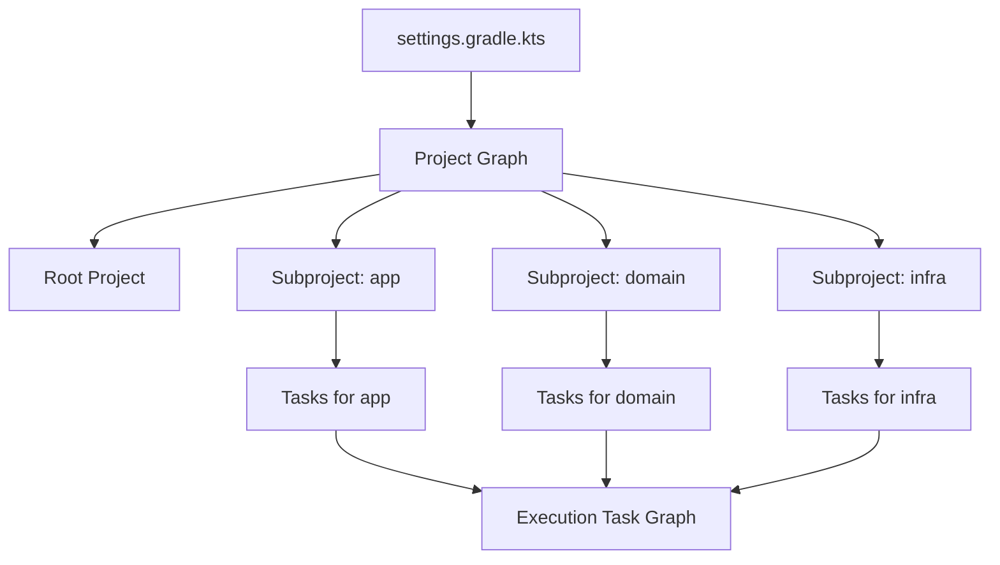
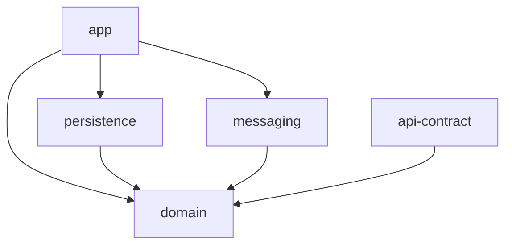
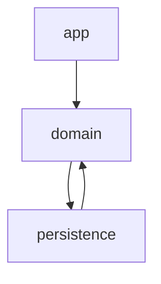
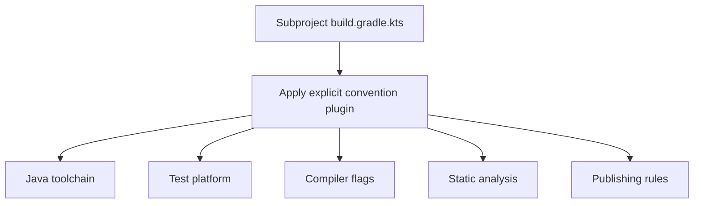
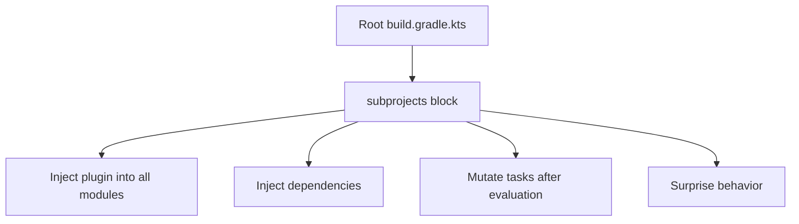
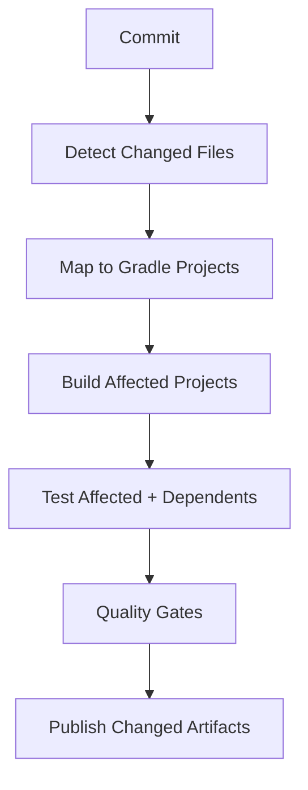
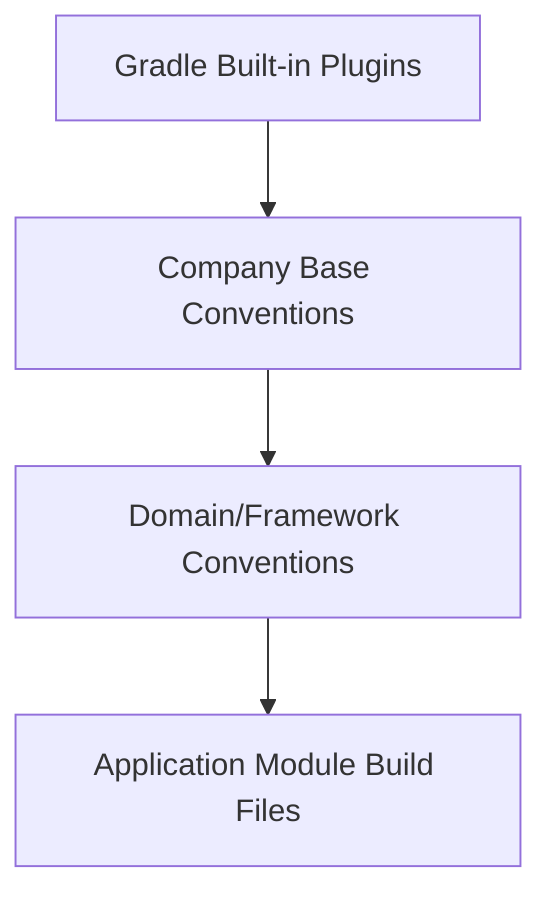
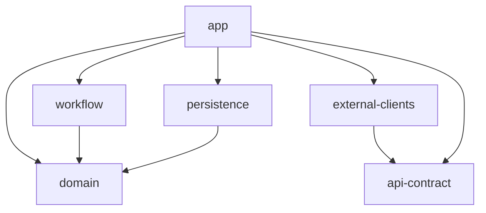

# Part 013 — Gradle Multi-Project, Composite Builds, and Build Logic

Pada part sebelumnya kita sudah membangun mental model Gradle sebagai **programmable build graph engine** dan memahami dependency configurations/version catalogs. Sekarang kita naik ke level yang biasanya membedakan engineer biasa dari engineer yang benar-benar mampu mengelola build enterprise: **cara menyusun banyak module, banyak project, dan shared build logic tanpa membuat build menjadi spaghetti**.

Target part ini bukan agar kita hafal `settings.gradle.kts`, `subprojects {}`, atau `includeBuild(...)`. Targetnya adalah memahami **kapan sebuah unit harus menjadi subproject, kapan harus menjadi included build, kapan harus menjadi dependency eksternal, dan bagaimana build logic dibagikan tanpa merusak isolation**.

Referensi resmi utama:

- Gradle Multi-Project Builds: https://docs.gradle.org/current/userguide/multi_project_builds.html
- Gradle Composite Builds: https://docs.gradle.org/current/userguide/composite_builds.html
- Gradle Best Practices for Structuring Builds: https://docs.gradle.org/current/userguide/best_practices_structuring_builds.html
- Gradle Sharing Build Logic using buildSrc: https://docs.gradle.org/current/userguide/sharing_build_logic_between_subprojects.html
- Gradle General Best Practices: https://docs.gradle.org/current/userguide/best_practices_general.html

---

## 1. Kaufman Lens: Skill yang Sedang Didekonstruksi

Dalam kerangka Josh Kaufman, kita perlu memecah skill besar menjadi sub-skill yang bisa dilatih secara sengaja.

Skill besarnya:

> Mendesain struktur Gradle build untuk sistem Java besar agar scalable, maintainable, cepat, aman, dan dapat dioperasikan oleh banyak tim.

Sub-skill-nya:

1. Memilih boundary antara root build, subproject, included build, dan published dependency.
2. Mendesain dependency direction antar-module.
3. Mengekstrak build logic menjadi convention plugins.
4. Menghindari cross-project configuration yang membuat build tidak predictable.
5. Mengelola shared version, shared plugins, shared test conventions, dan shared publishing conventions.
6. Menjaga build tetap bisa dipahami per module.
7. Mendesain struktur yang kompatibel dengan CI, build cache, configuration cache, dan partial builds.

Anti-target:

- Membuat semua module dimasukkan ke satu mega `build.gradle.kts`.
- Menganggap `subprojects {}` adalah solusi universal.
- Memakai `buildSrc` untuk semua hal tanpa boundary.
- Menjadikan Gradle script sebagai tempat business rule aplikasi.
- Menyalin konfigurasi yang sama ke 50 module.

---

## 2. Mental Model: Gradle Build sebagai Graph of Projects + Graph of Tasks

Gradle multi-project build memiliki dua graph besar:

1. **Project graph**: project apa saja yang ada dalam build.
2. **Task graph**: task apa saja yang perlu dijalankan untuk requested goal.

Project graph dibentuk saat initialization phase dari `settings.gradle.kts`. Task graph dibentuk setelah Gradle memahami project, plugin, task, dan dependency antar-task.



Kuncinya: Gradle tidak hanya “menjalankan script”. Gradle membangun model, lalu mengeksekusi task yang relevan. Karena itu struktur multi-project yang buruk akan merusak model sebelum task apa pun dijalankan.

---

## 3. Multi-Project Build: Definisi dan Kapan Dipakai

Multi-project build adalah satu Gradle build yang berisi beberapa subproject. Biasanya setiap subproject menghasilkan artifact sendiri atau mewakili logical module tertentu.

Contoh struktur:

```text
payment-platform/
├── settings.gradle.kts
├── build.gradle.kts
├── gradle.properties
├── gradle/
│   └── libs.versions.toml
├── app/
│   └── build.gradle.kts
├── domain/
│   └── build.gradle.kts
├── persistence/
│   └── build.gradle.kts
├── messaging/
│   └── build.gradle.kts
└── api-contract/
    └── build.gradle.kts
```

`settings.gradle.kts`:

```kotlin
pluginManagement {
    repositories {
        gradlePluginPortal()
        mavenCentral()
    }
}

dependencyResolutionManagement {
    repositoriesMode.set(RepositoriesMode.FAIL_ON_PROJECT_REPOS)
    repositories {
        mavenCentral()
    }
}

rootProject.name = "payment-platform"

include(
    "app",
    "domain",
    "persistence",
    "messaging",
    "api-contract"
)
```

Pakai multi-project build jika:

- module sering berubah bersama;
- module perlu dibangun/test bersama dalam satu CI pipeline;
- dependency antar-module masih source-level, bukan release-level;
- tim yang sama atau platform yang sama mengelola module-module tersebut;
- kita butuh feedback cepat dari perubahan lintas module;
- artifact lifecycle-nya masih terikat.

Jangan otomatis memakai multi-project build jika:

- module punya lifecycle release berbeda;
- ownership berbeda secara kuat;
- module lebih cocok menjadi library versioned artifact;
- build menjadi terlalu besar untuk local development;
- semua tim harus mengunduh dan mengonfigurasi semua module walau hanya mengerjakan satu bagian.

---

## 4. Root Project Bukan Tempat Menaruh Semua Logic

Root project sering disalahgunakan sebagai “global configuration dumping ground”. Ini membuat build sulit dipahami karena subproject terlihat sederhana, tetapi behavior sebenarnya disuntikkan dari root.

Contoh buruk:

```kotlin
// root build.gradle.kts - anti-pattern
subprojects {
    apply(plugin = "java")

    repositories {
        mavenCentral()
    }

    dependencies {
        add("testImplementation", "org.junit.jupiter:junit-jupiter:5.10.0")
    }

    tasks.withType<Test> {
        useJUnitPlatform()
    }
}
```

Masalahnya:

1. Subproject tidak self-describing.
2. Perubahan root bisa mengubah semua subproject tanpa terlihat dari file module tersebut.
3. Plugin ordering menjadi rapuh.
4. Configuration cache dan task avoidance lebih mudah terganggu.
5. Build sulit dimigrasikan ke composite/included builds.
6. Debugging menjadi “siapa yang mengubah task ini?”

Lebih baik root project minimal:

```kotlin
// root build.gradle.kts
plugins {
    // Declare plugin versions centrally, do not apply globally.
    id("com.acme.java-library-conventions") version "1.0.0" apply false
    id("com.acme.java-application-conventions") version "1.0.0" apply false
}
```

Atau bahkan root build file kosong jika build logic sudah ditangani via convention plugins dan settings.

---

## 5. Subproject sebagai Unit Build yang Harus Bisa Dipahami Sendiri

Subproject yang baik harus menjawab pertanyaan ini hanya dari file `build.gradle.kts`-nya:

- Ini module apa?
- Ini library, application, test fixture, atau contract module?
- Dependency langsungnya apa?
- Plugin convention apa yang berlaku?
- Artifact apa yang dihasilkan?

Contoh `domain/build.gradle.kts`:

```kotlin
plugins {
    id("com.acme.java-library-conventions")
}

dependencies {
    api(libs.jakarta.validation.api)
    implementation(libs.slf4j.api)

    testImplementation(libs.assertj.core)
}
```

Contoh `app/build.gradle.kts`:

```kotlin
plugins {
    id("com.acme.java-application-conventions")
}

application {
    mainClass.set("com.acme.payment.app.PaymentApplication")
}

dependencies {
    implementation(project(":domain"))
    implementation(project(":persistence"))
    implementation(project(":messaging"))
}
```

Perhatikan polanya: build logic umum tidak ditulis ulang, tetapi dependency dan karakter module tetap eksplisit.

---

## 6. Project Dependency: Source-Level Coupling

Saat kita menulis:

```kotlin
dependencies {
    implementation(project(":domain"))
}
```

kita menyatakan bahwa module ini bergantung pada output dari subproject `:domain` dalam build yang sama.

Ini bukan dependency biasa. Ini adalah **source-level coupling**.

Konsekuensi:

- Gradle dapat membangun `:domain` sebelum consumer-nya.
- Perubahan source di `:domain` langsung memengaruhi consumer.
- Tidak ada version boundary antara consumer dan provider.
- CI bisa mendeteksi breakage lintas module sebelum publishing.

Ini cocok untuk module yang satu lifecycle.

Tidak cocok jika kita ingin consumer hanya bergantung pada released artifact dengan compatibility contract.

---

## 7. Architectural Direction dalam Multi-Project Build

Gradle tidak tahu dependency architecture yang “benar” untuk aplikasi kita. Ia hanya menjalankan graph. Engineer harus mendesain arah dependency.

Contoh layering yang sehat:



Contoh dependency cycle yang buruk:



Masalah cycle:

- sulit menguji module secara isolasi;
- sulit publish library secara independen;
- sulit memahami ownership;
- sering berujung pada shared “common” module yang menjadi tempat sampah;
- build graph kehilangan kemampuan memberi sinyal architecture smell.

Gradle akan gagal pada project dependency cycle tertentu, tetapi tidak semua architectural smell otomatis gagal. Karena itu perlu rule tambahan, misalnya dependency analysis, ArchUnit, custom plugin, atau CI policy.

---

## 8. Composite Build: Build yang Mengikutsertakan Build Lain

Composite build berbeda dari multi-project build.

Multi-project:

```text
one build
└── many subprojects
```

Composite build:

```text
one invoking build
└── includes other independent builds
```

Contoh:

```kotlin
// settings.gradle.kts
rootProject.name = "payment-service"

include("app")
includeBuild("../platform-build-logic")
includeBuild("../payment-contracts")
```

Composite build berguna ketika kita ingin:

- memakai build logic dari build terpisah;
- mengembangkan aplikasi dan library lokal secara bersamaan;
- mengganti binary dependency dengan source dependency saat development;
- menguji perubahan library terhadap consumer tanpa publish ke repository;
- menjaga boundary antar-build tetap lebih kuat daripada subproject.

Gradle composite build memungkinkan included build menyediakan plugin, dependency substitution, atau project yang dapat dipakai build utama.

---

## 9. Multi-Project vs Composite Build

| Pertanyaan | Multi-Project | Composite Build |
|---|---:|---:|
| Apakah module bagian dari lifecycle build yang sama? | Ya | Tidak selalu |
| Apakah module ada dalam satu root settings? | Ya | Tidak, build lain di-include |
| Cocok untuk app + internal modules? | Sangat cocok | Bisa, tapi biasanya berlebihan |
| Cocok untuk shared build logic? | Kurang ideal | Sangat cocok |
| Cocok untuk local library override? | Kurang fleksibel | Cocok |
| Cocok untuk organizational boundary? | Lemah | Lebih kuat |
| Cocok untuk monorepo sangat besar? | Bisa, tapi hati-hati | Bisa untuk fragmentasi build |

Rule praktis:

> Jika unit tersebut harus selalu berubah dan diuji bersama, jadikan subproject. Jika unit tersebut punya identity build sendiri tetapi perlu dikomposisikan, jadikan included build. Jika unit tersebut punya release lifecycle sendiri dan tidak perlu source-level coupling, jadikan published dependency.

---

## 10. `buildSrc`: Berguna, Tetapi Bukan Default untuk Semua Hal

`buildSrc` adalah directory khusus yang otomatis dikompilasi dan masuk classpath build script.

Contoh:

```text
payment-platform/
├── buildSrc/
│   ├── build.gradle.kts
│   └── src/main/kotlin/
│       └── com.acme.java-conventions.gradle.kts
├── settings.gradle.kts
└── app/build.gradle.kts
```

Kelebihan `buildSrc`:

- sederhana;
- otomatis tersedia;
- cocok untuk build logic kecil;
- cocok untuk eksperimen awal.

Kekurangan:

- setiap perubahan `buildSrc` bisa menginvalidasi banyak konfigurasi build;
- sulit dibagi antar-repository;
- bisa tumbuh menjadi monolith build logic;
- coupling dengan build utama terlalu kuat;
- kurang ideal untuk platform build logic enterprise.

Gunakan `buildSrc` untuk:

- build kecil;
- prototyping convention plugin;
- helper kecil yang tidak perlu reuse lintas repo.

Hindari `buildSrc` untuk:

- enterprise standard plugin;
- shared Java conventions untuk banyak service;
- publishing conventions global;
- policy-as-code yang harus versioned;
- logic yang butuh lifecycle sendiri.

---

## 11. Included Build Bernama `build-logic`: Pola Modern yang Lebih Sehat

Daripada `buildSrc`, banyak build besar lebih sehat memakai included build khusus untuk build logic.

Struktur:

```text
payment-platform/
├── settings.gradle.kts
├── build.gradle.kts
├── build-logic/
│   ├── settings.gradle.kts
│   ├── build.gradle.kts
│   └── src/main/kotlin/
│       ├── com.acme.java-library-conventions.gradle.kts
│       ├── com.acme.java-application-conventions.gradle.kts
│       └── com.acme.java-publishing-conventions.gradle.kts
├── app/
├── domain/
└── persistence/
```

Root `settings.gradle.kts`:

```kotlin
pluginManagement {
    includeBuild("build-logic")
    repositories {
        gradlePluginPortal()
        mavenCentral()
    }
}

dependencyResolutionManagement {
    repositoriesMode.set(RepositoriesMode.FAIL_ON_PROJECT_REPOS)
    repositories {
        mavenCentral()
    }
}

rootProject.name = "payment-platform"
include("app", "domain", "persistence")
```

`build-logic/build.gradle.kts`:

```kotlin
plugins {
    `kotlin-dsl`
}

repositories {
    gradlePluginPortal()
    mavenCentral()
}
```

Convention plugin:

```kotlin
// build-logic/src/main/kotlin/com.acme.java-library-conventions.gradle.kts
plugins {
    `java-library`
}

java {
    toolchain {
        languageVersion.set(JavaLanguageVersion.of(21))
    }
}

tasks.withType<Test>().configureEach {
    useJUnitPlatform()
}
```

Subproject:

```kotlin
plugins {
    id("com.acme.java-library-conventions")
}
```

Manfaat pola ini:

- build logic menjadi explicit build;
- lebih mudah diuji;
- lebih mudah dipisah jika nanti menjadi shared plugin repository;
- menghindari `subprojects {}`;
- lebih kompatibel dengan composite build mental model;
- convention dapat diberi nama sesuai maksud.

---

## 12. Convention Plugin: Cara Menyatakan Policy Tanpa Menyembunyikan Intent

Convention plugin adalah plugin internal yang membawa konfigurasi standar.

Contoh convention:

- `com.acme.java-library-conventions`
- `com.acme.java-application-conventions`
- `com.acme.java-test-conventions`
- `com.acme.java-publishing-conventions`
- `com.acme.spring-boot-service-conventions`
- `com.acme.openapi-client-conventions`

Jangan membuat satu plugin bernama:

```text
com.acme.everything-conventions
```

Itu akan menjadi global magic.

Plugin yang baik punya boundary:



Plugin yang buruk:



---

## 13. Cross-Project Configuration: Kenapa Berbahaya

Cross-project configuration biasanya terlihat seperti ini:

```kotlin
allprojects {
    repositories {
        mavenCentral()
    }
}

subprojects {
    apply(plugin = "java")
}
```

Masalahnya bukan hanya style. Masalahnya adalah coupling tersembunyi.

Dampak nyata:

1. **Local reasoning rusak**  
   Kita tidak bisa memahami subproject tanpa membaca root script.

2. **Build order sensitif**  
   Logic bisa tergantung pada project lain sudah dievaluasi atau belum.

3. **Plugin ordering rapuh**  
   Block bisa berjalan sebelum plugin target tersedia.

4. **Sulit dipisah**  
   Subproject sulit diekstrak menjadi build sendiri.

5. **Configuration cache hostility**  
   Logic yang bergantung pada project graph global sering lebih sulit dibuat cache-friendly.

6. **Ownership kabur**  
   Tim module tidak tahu policy mana yang benar-benar berlaku.

Prinsip yang lebih sehat:

> Build logic should be pulled by the module through explicit plugin application, not pushed globally from the root.

---

## 14. `afterEvaluate`: Escape Hatch yang Sering Menjadi Utang

`afterEvaluate` sering dipakai ketika engineer tidak memahami lazy configuration.

Contoh buruk:

```kotlin
afterEvaluate {
    tasks.named("test") {
        // mutate late
    }
}
```

Masalah:

- behavior tergantung timing evaluation;
- sulit dianalisis statically;
- sering bertabrakan dengan plugin lain;
- mengurangi predictability;
- sering menjadi blocker configuration cache.

Alternatif:

```kotlin
tasks.withType<Test>().configureEach {
    useJUnitPlatform()
}
```

Atau:

```kotlin
plugins.withType<JavaPlugin> {
    tasks.withType<Test>().configureEach {
        useJUnitPlatform()
    }
}
```

Gunakan `afterEvaluate` hanya sebagai emergency workaround dan beri komentar teknis yang jelas, termasuk alasan, risiko, dan rencana penghapusan.

---

## 15. Build Logic sebagai Product Internal

Pada skala enterprise, build logic bukan “script sampingan”. Ia adalah platform product.

Build logic yang matang harus punya:

- versioning;
- changelog;
- tests;
- deprecation policy;
- compatibility matrix;
- release notes;
- migration guide;
- default yang aman;
- observability untuk adoption;
- documented escape hatch.

Contoh domain build logic:

```text
build-platform/
├── java-conventions
├── spring-service-conventions
├── library-publishing-conventions
├── quality-gate-conventions
├── dependency-governance-conventions
└── container-image-conventions
```

Mental model:

> Build platform adalah produk internal yang mengurangi cognitive load tim aplikasi tanpa mengambil semua keputusan arsitektur dari mereka.

---

## 16. Jangan Membuat `common` Module yang Menjadi Tempat Sampah

Dalam multi-project Gradle, smell klasik adalah module bernama:

```text
common
shared
utils
core
base
foundation
```

Tidak selalu salah. Tetapi sering menjadi tempat semua hal yang tidak tahu harus ditaruh di mana.

Gejala buruk:

- semua module bergantung ke `:common`;
- `:common` bergantung ke framework berat;
- `:common` berisi DTO, util, exception, constants, config, date helper, security helper, logging helper, dan client helper sekaligus;
- perubahan kecil di `:common` memicu rebuild/test banyak module;
- `:common` tidak punya domain ownership.

Alternatif:

- pecah berdasarkan capability;
- jadikan library internal versioned jika benar-benar reusable;
- letakkan util dekat pengguna jika hanya dipakai satu module;
- gunakan package-private/internal boundary;
- gunakan test fixtures untuk helper test.

Contoh lebih sehat:

```text
domain-primitives
money
id-generation
api-error-model
test-fixtures
```

---

## 17. Test Fixtures dalam Multi-Project Build

Untuk library Java, Gradle menyediakan konsep test fixtures melalui plugin `java-test-fixtures`.

Contoh:

```kotlin
plugins {
    `java-library`
    `java-test-fixtures`
}
```

Consumer:

```kotlin
dependencies {
    testImplementation(testFixtures(project(":domain")))
}
```

Gunakan test fixtures untuk:

- object mother;
- fake implementation;
- reusable test data builder;
- contract test helper;
- assertion helper.

Jangan gunakan test fixtures untuk:

- production helper yang “kebetulan” dipakai test;
- menyembunyikan dependency production yang seharusnya eksplisit;
- membuat test antar-module terlalu coupled.

---

## 18. Publishing Boundary dalam Multi-Project Build

Tidak semua subproject perlu dipublish.

Tipe module:

| Module | Perlu publish? | Catatan |
|---|---:|---|
| `app` | Biasanya tidak ke Maven repo | Bisa publish image/artifact deployable |
| `domain` | Tergantung | Jika dipakai service lain, publish library |
| `persistence` | Biasanya tidak | Terlalu implementation-specific |
| `api-contract` | Sering ya | Contract artifact dapat dipakai client/server |
| `test-fixtures` | Hati-hati | Bisa bocor jika tidak dikontrol |
| `build-logic` | Bisa | Jika shared lintas repo |

Convention plugin bisa memisahkan:

```kotlin
plugins {
    id("com.acme.java-library-conventions")
    id("com.acme.maven-publish-conventions")
}
```

Dengan begitu module yang tidak apply publishing convention tidak akan publish artifact secara tidak sengaja.

---

## 19. CI Strategy untuk Multi-Project Gradle

CI yang buruk menjalankan semuanya untuk setiap perubahan tanpa analisis.

CI yang matang memahami:

- affected project;
- dependency direction;
- test layer;
- cacheability;
- artifact boundary;
- release boundary.

Contoh pipeline sederhana:



Command yang sering dipakai:

```bash
./gradlew :domain:test
./gradlew :app:build
./gradlew build --continue
./gradlew projects
./gradlew tasks --all
```

Namun enterprise CI sebaiknya tidak hanya bergantung pada manual task selection. Ia perlu policy:

- kapan full build wajib;
- kapan partial build boleh;
- kapan dependency graph change memicu wider test;
- kapan build logic change memicu semua build;
- kapan version catalog change memicu semua module.

---

## 20. Dependency Substitution dalam Composite Build

Composite build sering dipakai untuk mengganti binary dependency dengan source dependency secara lokal.

Misalnya aplikasi biasanya bergantung pada:

```kotlin
dependencies {
    implementation("com.acme:payment-contracts:1.4.2")
}
```

Saat development, kita include source build:

```kotlin
includeBuild("../payment-contracts")
```

Gradle dapat mensubstitusi dependency module dengan project dari included build jika coordinates cocok atau jika substitution dikonfigurasi.

Gunakan pola ini untuk:

- menguji perubahan library sebelum release;
- debugging bug lintas repository;
- mengembangkan platform plugin dan consumer bersamaan;
- migrasi library besar.

Risiko:

- local build tidak sama dengan CI jika CI tidak include build yang sama;
- developer bisa lupa bahwa ia sedang memakai source override;
- behavior release artifact bisa berbeda dari local source substitution;
- boundary release menjadi kabur.

Mitigasi:

- dokumentasikan mode composite;
- gunakan setting eksplisit;
- jangan jadikan composite override default untuk release build;
- pastikan CI release memakai resolved artifact yang benar.

---

## 21. Naming Convention untuk Project Path

Project path adalah bagian dari build API internal.

Contoh path:

```text
:app
:domain
:infra:persistence
:infra:messaging
:contract:public-api
```

Prinsip:

1. Nama harus stabil.
2. Hindari nama teknis yang cepat usang.
3. Hindari nama terlalu umum.
4. Jangan encode team name kecuali ownership memang bagian dari boundary.
5. Struktur folder boleh berubah, tapi path sebaiknya tidak sering berubah.

`settings.gradle.kts` bisa memetakan path ke directory berbeda:

```kotlin
include(":contract:public-api")
project(":contract:public-api").projectDir = file("api-contract")
```

Jangan gunakan ini berlebihan. Mapping terlalu banyak membuat repository sulit dibaca.

---

## 22. Enterprise Pattern: Three-Layer Gradle Build Logic

Pola yang sering sehat:



Layer 1 — built-in/external plugin:

- `java`
- `java-library`
- `application`
- `maven-publish`
- Spring Boot plugin
- Checkstyle/Spotless/ErrorProne/etc.

Layer 2 — company base conventions:

- Java toolchain;
- compiler args;
- JUnit platform;
- repository policy;
- dependency verification;
- static analysis baseline;
- publishing metadata.

Layer 3 — domain/framework conventions:

- REST service convention;
- event consumer convention;
- batch job convention;
- library convention;
- generated client convention.

Module build file hanya menyatakan intent:

```kotlin
plugins {
    id("com.acme.spring-rest-service")
}

dependencies {
    implementation(project(":domain"))
    implementation(libs.spring.boot.starter.web)
}
```

---

## 23. Build Logic Testing

Build logic juga bisa punya bug. Karena itu build logic perlu test.

Tipe test:

1. **Unit test** untuk helper Kotlin/Groovy class.
2. **Functional test** dengan Gradle TestKit.
3. **Fixture build test** untuk memastikan plugin bekerja pada sample project.
4. **Compatibility test** terhadap versi Gradle/JDK yang didukung.

Checklist build logic:

- Apakah plugin id benar?
- Apakah plugin apply plugin lain secara eksplisit?
- Apakah task registered lazily?
- Apakah dependency ditambahkan ke configuration yang benar?
- Apakah extension bisa dioverride consumer?
- Apakah bekerja dengan configuration cache?
- Apakah error message actionable?

---

## 24. Failure Model: Masalah yang Sering Muncul

| Failure | Gejala | Penyebab | Mitigasi |
|---|---|---|---|
| Hidden global config | Subproject berubah tanpa file-nya berubah | `subprojects {}` / `allprojects {}` | Convention plugin eksplisit |
| Slow configuration | Task sederhana tetap lambat | Semua project dikonfigurasi berat | Lazy configuration, configuration cache |
| Build logic monolith | Semua convention saling tergantung | `buildSrc` tumbuh liar | Included build `build-logic` modular |
| Dependency cycle | Build/test sulit dipisah | Boundary module buruk | Architecture rules, dependency analysis |
| Common module bloat | Perubahan kecil rebuild besar | Shared util tidak terkendali | Pecah by capability |
| Local/CI drift | Local composite sukses, CI gagal | Source substitution tidak sama | Mode composite eksplisit |
| Plugin ordering bug | Kadang task ada, kadang tidak | Imperative mutation | `plugins.withType`, lazy APIs |
| Configuration cache fail | Cache tidak bisa reuse | Build logic membaca state tidak deklaratif | Ikuti requirements configuration cache |

---

## 25. Decision Matrix: Subproject, Included Build, atau Published Artifact?

| Kondisi | Pilihan Utama | Reasoning |
|---|---|---|
| Module selalu berubah bersama aplikasi | Subproject | Source-level feedback lebih penting |
| Library dipakai banyak repo | Published artifact | Perlu versioned compatibility contract |
| Library sedang dikembangkan bersama consumer | Composite build | Source override sementara |
| Shared build logic lintas module dalam repo | Included `build-logic` | Build logic explicit dan modular |
| Shared build logic lintas organization | Published Gradle plugin | Versioning dan governance jelas |
| Generated contract dipakai client/server | Bisa subproject atau artifact | Tergantung lifecycle contract |
| Module punya ownership berbeda | Published artifact atau separate build | Boundary lebih kuat |
| Module hanya grouping folder | Jangan jadikan subproject | Subproject harus punya build meaning |

---

## 26. Step-by-Step Refactoring dari Build Berantakan

Misal kondisi awal:

- root build punya `subprojects {}` besar;
- semua module apply plugin secara implicit;
- dependencies sebagian disuntikkan dari root;
- `common` module membengkak;
- build lambat;
- CI selalu full build.

Urutan perbaikan:

1. **Inventory behavior global**  
   Catat semua logic dalam `allprojects`, `subprojects`, dan `afterEvaluate`.

2. **Kelompokkan behavior berdasarkan intent**  
   Misalnya Java library, Java app, publishing, testing, static analysis.

3. **Buat included build `build-logic`**  
   Pindahkan logic bertahap ke convention plugin.

4. **Apply convention plugin eksplisit di subproject**  
   Jangan hapus global config sekaligus. Migrasi per module.

5. **Pindahkan dependencies ke module masing-masing**  
   Dependency adalah bagian dari module contract.

6. **Matikan repository declaration di subproject**  
   Gunakan `dependencyResolutionManagement` di settings.

7. **Audit `common` module**  
   Pecah atau pindahkan logic dekat consumer.

8. **Aktifkan warning untuk configuration cache**  
   Perbaiki issue build logic.

9. **Tambahkan build logic tests**  
   Jaga agar convention plugin tidak regresi.

10. **Desain CI affected build strategy**  
    Jangan langsung optimasi sebelum graph sehat.

---

## 27. Worked Example: Enterprise Java Service Build

Struktur:

```text
case-management-service/
├── settings.gradle.kts
├── gradle.properties
├── gradle/libs.versions.toml
├── build-logic/
│   ├── settings.gradle.kts
│   ├── build.gradle.kts
│   └── src/main/kotlin/
│       ├── com.acme.java-library-conventions.gradle.kts
│       ├── com.acme.java-application-conventions.gradle.kts
│       └── com.acme.integration-test-conventions.gradle.kts
├── app/
├── domain/
├── workflow/
├── persistence/
├── external-clients/
└── api-contract/
```

Dependency direction:



Rules:

- `domain` tidak boleh depend ke `persistence`.
- `workflow` boleh depend ke `domain`, tapi tidak ke `app`.
- `api-contract` tidak boleh depend ke implementation module.
- `app` adalah composition root.
- Hanya `api-contract` yang dipublish sebagai library jika service lain butuh client contract.
- `app` dipackage sebagai deployable artifact/container image.

---

## 28. Practice: 90-Minute Deliberate Exercise

Latihan:

1. Buat repo Gradle multi-project dengan module:
   - `app`
   - `domain`
   - `persistence`
   - `api-contract`
   - `build-logic`

2. Buat convention plugin:
   - `com.acme.java-library-conventions`
   - `com.acme.java-application-conventions`

3. Terapkan Java toolchain 21 di convention plugin.

4. Tambahkan JUnit Platform untuk semua module Java.

5. Buat `domain` sebagai `java-library`.

6. Buat `app` sebagai `application` yang depend ke `domain` dan `persistence`.

7. Pastikan tidak ada `subprojects {}` di root build.

8. Jalankan:

```bash
./gradlew projects
./gradlew :app:build
./gradlew :domain:test
```

9. Tambahkan satu deliberate mistake: buat `domain` depend ke `persistence`. Jelaskan kenapa ini architectural smell.

10. Refactor agar dependency direction kembali sehat.

---

## 29. Self-Correction Questions

Gunakan pertanyaan ini untuk mengevaluasi pemahaman:

1. Apakah subproject ini benar-benar punya build identity, atau hanya folder?
2. Apakah dependency ini source-level coupling atau release-level contract?
3. Apakah subproject bisa dipahami tanpa membaca root build?
4. Apakah build logic ditarik secara eksplisit atau didorong secara global?
5. Apakah convention plugin terlalu besar?
6. Apakah module boundary mengikuti architecture boundary?
7. Apakah `common` module punya ownership jelas?
8. Apakah local composite build sama dengan CI release build?
9. Apakah build logic bisa diuji?
10. Apakah struktur ini masih masuk akal jika jumlah module naik 5x?

---

## 30. Summary

Gradle multi-project build bukan sekadar banyak folder dengan banyak `build.gradle.kts`. Ia adalah model untuk mengelola **source-level coupling** antar unit build dalam satu lifecycle.

Composite build bukan sekadar fitur advanced. Ia adalah cara mengomposisikan build yang tetap punya identity sendiri, sangat berguna untuk shared build logic, local source substitution, dan boundary lintas repo.

Build logic yang sehat sebaiknya diekspresikan sebagai convention plugins, bukan global mutation via `subprojects {}` atau `allprojects {}`. Pada skala enterprise, build logic adalah platform product: harus versioned, tested, documented, dan punya migration path.

Prinsip utama part ini:

> Gradle build yang baik membuat intent module eksplisit, shared policy reusable, dan dependency graph dapat diaudit.

Part berikutnya akan masuk ke performa Gradle: incremental build, build cache, remote cache, configuration cache, parallelism, dan bagaimana mengoptimasi build tanpa merusak correctness.
