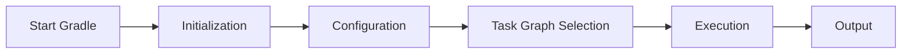
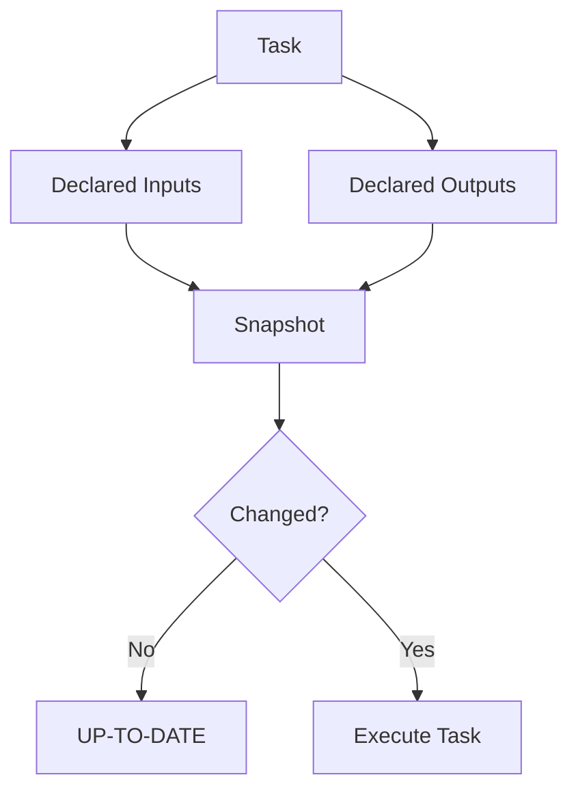
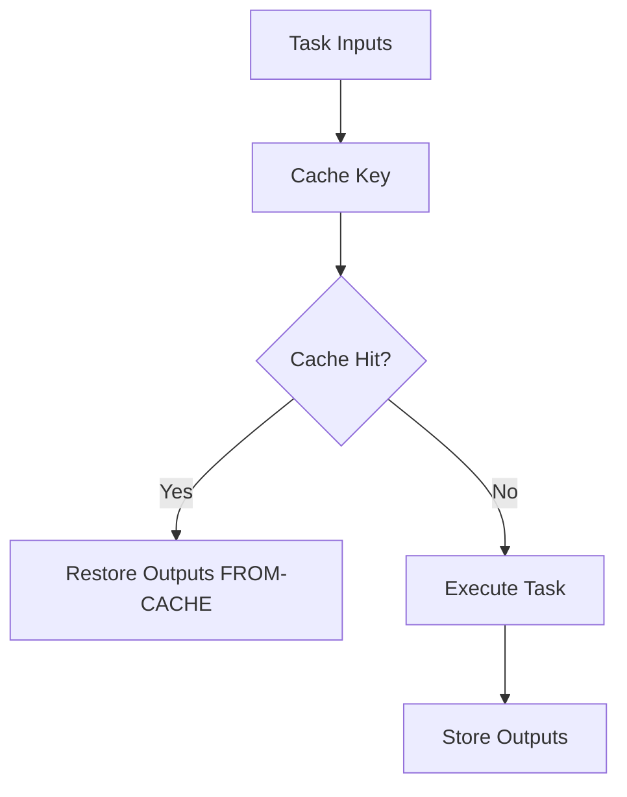
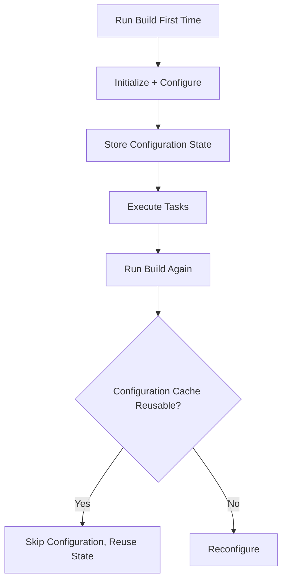
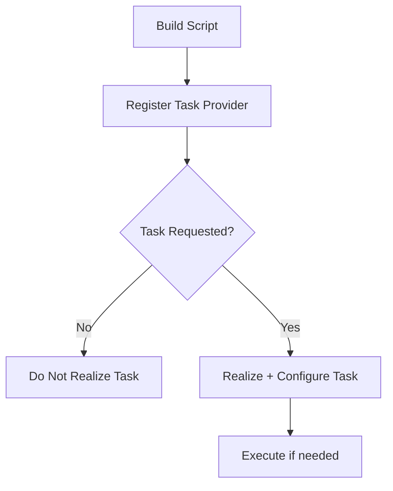
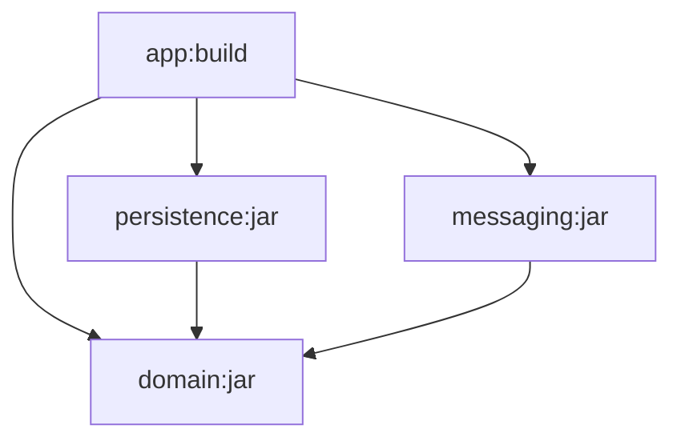

# Part 014 — Gradle Performance, Cache, and Incrementality

Gradle sering dipilih karena fleksibel dan cepat pada build besar. Tetapi Gradle tidak otomatis cepat. Gradle cepat jika build kita **mendeklarasikan input/output dengan benar, menghindari konfigurasi yang tidak perlu, memakai cache secara aman, dan menjaga build logic tetap deterministik**.

Part ini membahas performa Gradle dari sisi engineering, bukan sekadar kumpulan flag. Targetnya: kita mampu menjelaskan mengapa build lambat, mengukur bottleneck, memperbaiki tanpa merusak correctness, dan mendesain policy cache yang aman untuk developer maupun CI.

Referensi resmi utama:

- Gradle Performance Guide: https://docs.gradle.org/current/userguide/performance.html
- Gradle Incremental Build: https://docs.gradle.org/current/userguide/incremental_build.html
- Gradle Build Cache: https://docs.gradle.org/current/userguide/build_cache.html
- Gradle Build Cache Use Cases: https://docs.gradle.org/current/userguide/build_cache_use_cases.html
- Gradle Configuration Cache: https://docs.gradle.org/current/userguide/configuration_cache.html
- Gradle Configuration Cache Requirements: https://docs.gradle.org/current/userguide/configuration_cache_requirements.html
- Gradle Task Configuration Avoidance: https://docs.gradle.org/current/userguide/task_configuration_avoidance.html
- Gradle Debugging Build Cache Misses: https://docs.gradle.org/current/userguide/build_cache_debugging.html

---

## 1. Kaufman Lens: Performance sebagai Skill, Bukan Flag

Dalam kerangka Josh Kaufman, kita pecah “membuat Gradle cepat” menjadi skill kecil:

1. Membedakan waktu initialization, configuration, dan execution.
2. Membaca task output: `UP-TO-DATE`, `FROM-CACHE`, `NO-SOURCE`, executed.
3. Memahami input/output task.
4. Menghindari task execution yang tidak perlu.
5. Menghindari task configuration yang tidak perlu.
6. Memakai local build cache dengan benar.
7. Memakai remote build cache dengan aman.
8. Memakai configuration cache tanpa menyembunyikan correctness bug.
9. Mengoptimasi test dan compilation hotspots.
10. Men-debug cache miss dan cache poisoning.

Prinsip pertama:

> Build performance engineering bukan “membuat build terlihat hijau lebih cepat”. Build performance engineering adalah menghindari kerja yang tidak perlu tanpa menghilangkan kerja yang wajib untuk correctness.

---

## 2. Mental Model: Gradle Build Time Terdiri dari Beberapa Area



Area optimasi:

| Area | Pertanyaan Utama | Mekanisme Gradle |
|---|---|---|
| Startup | Apakah Gradle/JVM perlu start dari nol? | Daemon |
| Initialization | Apakah project graph terlalu besar? | Settings hygiene, included builds |
| Configuration | Apakah semua project/task dikonfigurasi? | Task configuration avoidance, configuration cache |
| Execution | Apakah task perlu jalan? | Incremental build, up-to-date checks |
| Reuse output | Apakah output bisa diambil dari cache? | Local/remote build cache |
| Parallelism | Apakah task independen bisa jalan bersamaan? | Parallel execution |
| Dependency resolve | Apakah resolve lambat/flaky? | Repository policy, locking, cache |

Performance Gradle tidak bisa diselesaikan oleh satu fitur. Biasanya perlu kombinasi.

---

## 3. Correctness First: Optimasi yang Salah Lebih Mahal daripada Build Lambat

Build cepat tetapi salah lebih berbahaya daripada build lambat.

Contoh build salah:

- task generate code tidak rerun saat spec OpenAPI berubah;
- test mengambil output stale dari cache;
- task package tidak memasukkan resource terbaru;
- CI memakai dependency cache lama yang tidak valid;
- generated source berbeda antara local dan CI;
- remote cache berisi output dari environment yang tidak kompatibel.

Karena itu urutan berpikir:

1. Buat build benar.
2. Buat input/output eksplisit.
3. Buat build repeatable.
4. Baru aktifkan cache/incrementality.
5. Ukur.
6. Optimasi bottleneck terbesar.

---

## 4. Incremental Build: Avoid Executing Work

Incremental build menghindari eksekusi task jika input dan output tidak berubah.

Saat task dianggap tidak perlu jalan, Gradle menandainya sebagai:

```text
UP-TO-DATE
```

Contoh:

```bash
./gradlew :domain:compileJava
./gradlew :domain:compileJava
```

Run kedua seharusnya `UP-TO-DATE` jika tidak ada perubahan.

Mental model:



Jika task custom tidak mendeklarasikan input/output, Gradle tidak punya dasar untuk memutuskan apakah task aman dilewati.

---

## 5. Task Inputs dan Outputs adalah Contract

Untuk custom task, input/output harus dinyatakan dengan annotation atau API yang sesuai.

Contoh Kotlin custom task:

```kotlin
abstract class GenerateBuildInfo : DefaultTask() {
    @get:Input
    abstract val version: Property<String>

    @get:OutputFile
    abstract val outputFile: RegularFileProperty

    @TaskAction
    fun generate() {
        outputFile.get().asFile.writeText("version=${version.get()}\n")
    }
}
```

Registration:

```kotlin
val generateBuildInfo by tasks.registering(GenerateBuildInfo::class) {
    version.set(project.version.toString())
    outputFile.set(layout.buildDirectory.file("generated/build-info.properties"))
}
```

Contract-nya:

- jika `version` berubah, task harus rerun;
- jika output hilang, task harus rerun;
- jika tidak berubah, task boleh `UP-TO-DATE`;
- jika cache aktif dan key cocok, output bisa `FROM-CACHE`.

Kesalahan fatal:

```kotlin
@TaskAction
fun generate() {
    val env = System.getenv("BUILD_NUMBER")
    outputFile.get().asFile.writeText("build=$env")
}
```

Jika `BUILD_NUMBER` memengaruhi output tetapi tidak dideklarasikan sebagai input, Gradle bisa menganggap task unchanged padahal output seharusnya berubah.

---

## 6. Hidden Inputs: Sumber Bug Build Paling Umum

Hidden input adalah sesuatu yang memengaruhi output task tetapi tidak diketahui Gradle.

Contoh hidden input:

- environment variable;
- current time;
- locale;
- timezone;
- current working directory;
- absolute path;
- network response;
- file di luar declared input;
- installed tool version;
- JVM system property;
- random number;
- Git metadata;
- content dari generated file yang tidak dideklarasikan.

Checklist:

| Hidden Input | Risiko | Mitigasi |
|---|---|---|
| Time | Output selalu berubah atau stale | Deklarasikan input atau hindari time |
| Env var | Local/CI beda | `providers.environmentVariable(...)` sebagai input |
| Network | Non-deterministic | Resolve di task terpisah, pin artifact |
| Absolute path | Cache miss lintas mesin | Gunakan relative path sensitivity |
| Tool version | Output beda | Deklarasikan toolchain/tool version |
| Locale/timezone | Formatting beda | Pin locale/timezone atau jadikan input |

---

## 7. Build Cache: Reuse Output, Bukan Skip Work Sembarangan

Build cache menyimpan output task berdasarkan cache key. Jika task yang sama dengan input yang sama dijalankan lagi, output dapat diambil dari cache.

Status:

```text
FROM-CACHE
```

Mental model:



Build cache berbeda dari incremental build:

| Mekanisme | Scope | Output |
|---|---|---|
| Incremental/up-to-date | Workspace saat ini | `UP-TO-DATE` |
| Local build cache | Mesin developer/CI lokal | `FROM-CACHE` |
| Remote build cache | Dibagi lintas mesin | `FROM-CACHE` |

Up-to-date check menjawab:

> Apakah output di workspace ini masih valid?

Build cache menjawab:

> Apakah output valid sudah pernah dibuat di tempat lain dan bisa dipakai ulang?

---

## 8. Mengaktifkan Build Cache

`gradle.properties`:

```properties
org.gradle.caching=true
```

Atau command:

```bash
./gradlew build --build-cache
```

Contoh `settings.gradle.kts` untuk local/remote cache:

```kotlin
buildCache {
    local {
        isEnabled = true
    }

    remote<HttpBuildCache> {
        url = uri("https://gradle-cache.acme.internal/cache/")
        isEnabled = !System.getenv("CI").isNullOrBlank()
        isPush = !System.getenv("CI").isNullOrBlank()
    }
}
```

Policy umum:

- developer boleh read dari remote cache;
- hanya trusted CI yang boleh push ke remote cache;
- PR dari fork/untrusted source tidak boleh push;
- release build harus strict dan reproducible;
- cache harus dianggap performance optimization, bukan source of truth.

---

## 9. Remote Build Cache: Besar Manfaatnya, Besar Juga Risikonya

Remote build cache mempercepat build besar karena developer dapat memakai output yang sudah dibuat CI atau developer lain.

Use case:

1. CI build A menghasilkan output compile/test yang cacheable.
2. Developer pull commit yang sama.
3. Developer menjalankan build.
4. Output task tertentu diambil dari remote cache.

Risiko:

- cache poisoning;
- output dari environment berbeda;
- credential leakage;
- cache key tidak lengkap;
- task yang sebenarnya tidak deterministic;
- artifact tidak sesuai platform/JDK;
- remote cache menjadi bottleneck network.

Mitigasi:

- hanya trusted CI yang push;
- dependency verification aktif;
- toolchain dideklarasikan;
- task custom diuji cacheability-nya;
- jangan cache task yang membaca network/current time secara implisit;
- monitor cache hit/miss ratio;
- pisahkan cache untuk branch/tenant jika perlu.

---

## 10. Cacheable Task: Syarat Minimal

Task cacheable harus:

1. Mendeklarasikan semua input.
2. Mendeklarasikan semua output.
3. Output hanya ditentukan oleh input.
4. Tidak bergantung pada state tersembunyi.
5. Tidak menghasilkan output non-deterministic.
6. Tidak menulis ke lokasi di luar declared outputs.
7. Tidak membaca file di luar declared inputs.
8. Memiliki path sensitivity yang benar.

Contoh annotation:

```kotlin
@CacheableTask
abstract class NormalizeSpec : DefaultTask() {
    @get:InputFile
    @get:PathSensitive(PathSensitivity.RELATIVE)
    abstract val inputSpec: RegularFileProperty

    @get:OutputFile
    abstract val outputSpec: RegularFileProperty

    @TaskAction
    fun normalize() {
        val text = inputSpec.get().asFile.readText()
        outputSpec.get().asFile.writeText(text.trim() + "\n")
    }
}
```

Jangan menandai task sebagai cacheable hanya karena ingin cepat. Cacheability adalah correctness claim.

---

## 11. Debugging Cache Miss

Cache miss terjadi saat task harus execute walaupun kita berharap `FROM-CACHE`.

Pertanyaan diagnosis:

1. Apakah task memang cacheable?
2. Apakah build cache aktif?
3. Apakah task punya output?
4. Apakah input berubah?
5. Apakah absolute path masuk cache key?
6. Apakah environment variable berubah?
7. Apakah JDK/toolchain berbeda?
8. Apakah dependency resolution menghasilkan file berbeda?
9. Apakah output task sebelumnya tidak disimpan karena task disabled cache?
10. Apakah local/remote cache policy mengizinkan read/push?

Command berguna:

```bash
./gradlew build --build-cache --info
./gradlew :module:taskName --scan
```

Build scan sering membantu melihat alasan task executed, cache miss, dan dependency resolution bottleneck.

---

## 12. Configuration Cache: Avoid Reconfiguring the Build

Configuration cache menyimpan hasil configuration phase agar build berikutnya tidak perlu mengonfigurasi ulang project/task graph dari nol.

Aktifkan:

```bash
./gradlew build --configuration-cache
```

Atau:

```properties
org.gradle.configuration-cache=true
```

Mental model:



Configuration cache berbeda dari build cache:

| Fitur | Meng-cache apa? | Tujuan |
|---|---|---|
| Build cache | Task outputs | Menghindari execution |
| Configuration cache | Configuration result/task graph state | Menghindari configuration |

Keduanya saling melengkapi.

---

## 13. Configuration Cache Requirements: Kenapa Build Logic Harus Lebih Bersih

Configuration cache memaksa build logic menjadi lebih deklaratif dan isolated.

Hal yang sering bermasalah:

- membaca `Project` dari task action;
- memakai mutable global state;
- membaca environment secara langsung saat execution tanpa Provider API;
- menyimpan object Gradle internal dalam task;
- melakukan IO saat configuration phase;
- memakai `afterEvaluate` untuk mutasi late;
- mengakses model project lain secara langsung;
- membuat task yang tidak serializable state-nya.

Contoh buruk:

```kotlin
abstract class BadTask : DefaultTask() {
    @TaskAction
    fun run() {
        println(project.version) // avoid using Project at execution time
    }
}
```

Contoh lebih baik:

```kotlin
abstract class GoodTask : DefaultTask() {
    @get:Input
    abstract val projectVersion: Property<String>

    @TaskAction
    fun run() {
        println(projectVersion.get())
    }
}

tasks.register<GoodTask>("printVersion") {
    projectVersion.set(provider { project.version.toString() })
}
```

Prinsip:

> Task action sebaiknya menerima state yang sudah dideklarasikan, bukan mengambil state bebas dari Gradle model saat execution.

---

## 14. Task Configuration Avoidance: Jangan Buat Task yang Tidak Dipakai

API lama:

```kotlin
tasks.create("generateReport") {
    // configured immediately
}
```

API lebih baik:

```kotlin
tasks.register("generateReport") {
    // configured lazily only when needed
}
```

Untuk existing task:

```kotlin
tasks.named<Test>("test") {
    useJUnitPlatform()
}
```

Untuk tipe task:

```kotlin
tasks.withType<Test>().configureEach {
    useJUnitPlatform()
}
```

Anti-pattern:

```kotlin
tasks.withType<Test> {
    useJUnitPlatform()
}
```

Di Kotlin DSL, prefer `configureEach` untuk menghindari eager configuration.

Mental model:



---

## 15. Gradle Daemon: Avoid JVM Startup Cost

Gradle daemon menjaga proses Gradle tetap hidup agar build berikutnya tidak perlu membayar full JVM startup/config warmup cost.

Default modern Gradle umumnya memakai daemon untuk local development.

Hal yang perlu dipahami:

- daemon mempercepat build lokal;
- daemon punya JVM memory sendiri;
- daemon bisa dihentikan;
- CI environment kadang disable daemon tergantung policy;
- memory leak di plugin/build logic dapat memengaruhi daemon.

Command:

```bash
./gradlew --status
./gradlew --stop
```

Konfigurasi umum di `gradle.properties`:

```properties
org.gradle.jvmargs=-Xmx2g -Dfile.encoding=UTF-8
```

Jangan asal menaikkan heap. Ukur dulu. Heap terlalu kecil membuat GC berat, heap terlalu besar bisa mengganggu developer machine/CI executor.

---

## 16. Parallel Execution: Cepat Jika Graph Memang Independen

Aktifkan:

```properties
org.gradle.parallel=true
```

Parallel execution membantu jika ada project/task yang independen.

Contoh graph yang bisa paralel:



`persistence` dan `messaging` bisa dibangun paralel jika tidak saling bergantung.

Parallel tidak membantu jika:

- graph linear;
- semua task bergantung ke satu bottleneck;
- CPU sudah penuh;
- disk IO bottleneck;
- test memakai shared external resource;
- task tidak thread-safe;
- worker limit terlalu tinggi.

Konfigurasi worker:

```properties
org.gradle.workers.max=4
```

Pada CI, worker count harus disesuaikan dengan CPU/memory executor. Terlalu banyak parallelism dapat memperlambat karena contention.

---

## 17. Java Compilation Performance

Java compile performance dipengaruhi oleh:

- jumlah source;
- jumlah dependency di compile classpath;
- annotation processors;
- compiler args;
- incremental compilation;
- ABI changes;
- module boundaries;
- generated sources;
- JDK/toolchain.

Prinsip:

1. Gunakan `java-library` agar `api` dan `implementation` terpisah.
2. Hindari dependency compile classpath yang tidak perlu.
3. Letakkan annotation processor di `annotationProcessor`, bukan `implementation`.
4. Pisahkan generated source yang mahal.
5. Hindari perubahan ABI jika tidak perlu.
6. Pecah module berdasarkan boundary yang meaningful, bukan terlalu granular.

Contoh:

```kotlin
dependencies {
    api(libs.jakarta.validation.api)
    implementation(libs.slf4j.api)

    annotationProcessor(libs.mapstruct.processor)
    compileOnly(libs.lombok)
    annotationProcessor(libs.lombok)
}
```

Jika dependency implementation berubah tetapi API library tidak berubah, consumer tidak selalu perlu recompile. Ini salah satu alasan `api` vs `implementation` penting untuk performance.

---

## 18. Annotation Processor: Sering Jadi Bottleneck Tersembunyi

Annotation processor dapat memperlambat compile dan mengganggu incremental build jika tidak incremental-friendly.

Risiko:

- processor membaca seluruh classpath;
- processor menghasilkan file non-deterministic;
- processor tidak mendeklarasikan behavior incremental;
- processor bercampur di compile classpath;
- generated source berubah walau input tidak berubah.

Mitigasi:

- gunakan processor yang mendukung incremental processing;
- pisahkan processor dependency;
- minimalkan scope annotation processing;
- hindari processor berat di module yang sering berubah;
- ukur compile task dengan build scan;
- pertimbangkan pre-generation untuk contract yang stabil.

---

## 19. Test Performance: Jangan Langsung Skip Test

Test sering menjadi bagian build paling lambat. Tetapi solusi buruk adalah “skip test” tanpa strategi.

Optimasi sehat:

1. Pisahkan unit test dan integration test.
2. Gunakan test filtering untuk local loop.
3. Gunakan parallel test execution dengan hati-hati.
4. Hindari shared mutable external resource.
5. Gunakan test fixtures yang ringan.
6. Cache test task hanya jika deterministic.
7. Pisahkan flaky test dari fast gate.
8. Gunakan build cache untuk test task yang aman.

Contoh konfigurasi:

```kotlin
tasks.withType<Test>().configureEach {
    useJUnitPlatform()
    maxParallelForks = Runtime.getRuntime().availableProcessors().coerceAtMost(4)
}
```

Hati-hati:

- test yang membaca current time/random/network bisa tidak cacheable;
- test integration ke database biasanya tidak cocok dicache sembarangan;
- test parallel bisa memunculkan race condition yang sebelumnya tersembunyi.

---

## 20. Dependency Resolution Performance

Build lambat tidak selalu karena compile/test. Kadang karena dependency resolution.

Penyebab:

- terlalu banyak repository;
- repository lambat;
- dynamic versions;
- changing modules/SNAPSHOT;
- metadata lookup berulang;
- plugin resolution lambat;
- dependency graph terlalu besar;
- konflik dependency yang memicu resolution kompleks.

Policy sehat:

```kotlin
dependencyResolutionManagement {
    repositoriesMode.set(RepositoriesMode.FAIL_ON_PROJECT_REPOS)
    repositories {
        mavenCentral()
        maven("https://repo.acme.internal/releases")
    }
}
```

Hindari:

```kotlin
repositories {
    mavenCentral()
    google()
    maven("https://random-repo.example")
    mavenLocal()
}
```

`mavenLocal()` khususnya bisa membuat local/CI drift jika dipakai sembarangan.

---

## 21. Dynamic Versions dan Changing Modules

Contoh dynamic version:

```kotlin
implementation("com.acme:rules-engine:1.+")
```

Contoh changing module:

```kotlin
implementation("com.acme:rules-engine:1.4.0-SNAPSHOT")
```

Masalah:

- reproducibility turun;
- dependency resolution lebih sering check remote;
- build cache key bisa berubah tanpa source berubah;
- debugging release sulit;
- CI dan local bisa resolve versi berbeda.

Untuk enterprise build, prefer:

- fixed versions;
- version catalogs;
- dependency locking;
- controlled upgrade bot/process;
- snapshot hanya untuk workflow terbatas.

---

## 22. Configuration-Time IO: Pembunuh Configuration Cache

Contoh buruk:

```kotlin
val buildNumber = file("build-number.txt").readText()

version = "1.0.$buildNumber"
```

Ini membaca file saat configuration phase. Jika dilakukan di banyak project, configuration lambat dan cache sulit reusable.

Lebih baik gunakan Provider API:

```kotlin
val buildNumber = providers.fileContents(layout.projectDirectory.file("build-number.txt"))
    .asText
    .map { it.trim() }

version = buildNumber.map { "1.0.$it" }.getOrElse("1.0.0-local")
```

Catatan: tidak semua property Gradle menerima Provider secara penuh. Tetapi prinsipnya tetap: hindari IO eager saat configuration.

---

## 23. Measuring Before Optimizing

Jangan optimasi berdasarkan perasaan.

Minimal command:

```bash
./gradlew clean build --profile
./gradlew build --scan
./gradlew build --info
./gradlew help --configuration-cache
```

Yang perlu diukur:

- configuration time;
- task execution time;
- slowest tasks;
- cache hit/miss;
- dependency resolution time;
- test time;
- compile time;
- time spent in annotation processing;
- CI queue/setup time vs Gradle time;
- cold build vs warm build.

Bedakan:

| Scenario | Makna |
|---|---|
| Clean build | Worst-case execution |
| Warm local build | Developer edit loop |
| CI build without cache | Baseline reproducibility |
| CI build with cache | Optimized pipeline |
| Single module test | Inner-loop speed |
| Full verification | Release confidence |

---

## 24. Performance Budget

Enterprise build sebaiknya punya performance budget.

Contoh:

| Build Type | Target |
|---|---:|
| `./gradlew help` warm | < 5s |
| Single module unit test | < 30s |
| Affected modules build | < 5 min |
| Full PR verification | < 15 min |
| Release build | < 30 min |

Angka ini contoh, bukan hukum. Yang penting adalah budget eksplisit.

Tanpa budget, build akan melambat perlahan sampai developer menganggap lambat sebagai normal.

---

## 25. CI Cache Policy

CI cache bukan sekadar menyimpan `~/.gradle`.

Layer cache di CI:

1. Gradle distribution cache.
2. Dependency artifact cache.
3. Local build cache.
4. Remote build cache.
5. Docker layer cache.
6. Test fixture/service image cache.

Policy:

- cache dependency boleh dipakai lintas branch dengan lockfile/verification;
- build output cache harus trusted;
- remote build cache push hanya dari trusted branch/CI;
- PR untrusted read-only atau isolated;
- release build boleh read cache, tapi harus tetap menghasilkan provenance/signing dari pipeline trusted;
- cache cleanup harus dikontrol.

Contoh safe-ish policy:

```text
main branch CI: read + push remote cache
release CI: read + push trusted release cache
internal PR CI: read remote, push only after merge
external PR CI: no push, limited read or isolated cache
local developer: read remote, push local only
```

---

## 26. Cache Poisoning Failure Model

Cache poisoning terjadi saat cache menyimpan output yang salah tetapi dianggap valid.

Penyebab:

- task input tidak lengkap;
- untrusted build push ke remote cache;
- toolchain berbeda tapi tidak masuk key;
- output bergantung pada network/current time;
- task menulis output di luar declared location;
- test flaky dicache sebagai pass;
- generated artifact berisi absolute path.

Dampak:

- build hijau palsu;
- artifact salah dipublish;
- bug hanya muncul di production;
- developer tidak bisa reproduce;
- rollback sulit karena artifact chain tidak dipercaya.

Mitigasi:

- strict input/output declaration;
- remote push hanya dari trusted CI;
- build scan/cache debugging;
- periodic clean non-cache build;
- disable cache untuk task non-deterministic;
- dependency verification;
- provenance/attestation untuk release artifact.

---

## 27. Practical Gradle Properties Baseline

Contoh baseline untuk repo Java besar:

```properties
org.gradle.caching=true
org.gradle.configuration-cache=true
org.gradle.parallel=true
org.gradle.jvmargs=-Xmx2g -Dfile.encoding=UTF-8
```

Jangan copy-paste tanpa validasi.

Validation sequence:

1. Jalankan tanpa config cache.
2. Pastikan build benar.
3. Aktifkan build cache local.
4. Verifikasi task status.
5. Aktifkan configuration cache.
6. Perbaiki reported problems.
7. Aktifkan parallel.
8. Jalankan test flakiness check.
9. Baru integrasikan remote cache.
10. Monitor CI dan developer feedback.

---

## 28. Performance Anti-Patterns

| Anti-Pattern | Dampak | Perbaikan |
|---|---|---|
| `subprojects {}` besar | Configuration lambat, hidden logic | Convention plugins |
| `tasks.create` | Eager task realization | `tasks.register` |
| `afterEvaluate` | Timing brittle | Lazy API, `plugins.withType` |
| Dynamic versions | Slow/unreproducible resolution | Pin versions, locking |
| `mavenLocal()` default | Local/CI drift | Explicit internal repos |
| Hidden env input | Stale/wrong cache | Provider API + declared input |
| Generated source non-deterministic | Cache miss atau wrong hit | Deterministic generation |
| All tests integration-heavy | Slow feedback | Test layering |
| Remote cache push from untrusted CI | Cache poisoning | Trusted push policy |
| Copy-pasted build scripts | Inconsistent performance | Build logic platform |

---

## 29. Worked Example: Fixing a Slow Build

Kondisi awal:

```text
./gradlew build = 18 minutes
./gradlew :domain:test = 3 minutes
./gradlew help = 45 seconds
```

Observasi:

- root punya `subprojects {}` besar;
- 80% module dikonfigurasi walau hanya test satu module;
- annotation processor ada di `implementation`;
- repository dideklarasikan di tiap subproject;
- remote cache belum ada;
- configuration cache gagal karena custom task membaca `project` saat execution.

Perbaikan bertahap:

1. Pindahkan root `subprojects` ke convention plugin.
2. Ganti `tasks.create` menjadi `tasks.register`.
3. Gunakan `tasks.withType<T>().configureEach`.
4. Pindahkan annotation processor ke `annotationProcessor`.
5. Centralize repository di `dependencyResolutionManagement`.
6. Deklarasikan input/output custom task.
7. Perbaiki custom task agar configuration-cache compatible.
8. Aktifkan local build cache.
9. Tambahkan remote cache read dari developer, push dari CI.
10. Split integration test dari unit test.

Target setelah perbaikan:

```text
./gradlew help = 5-8 seconds warm
./gradlew :domain:test = 20-40 seconds warm
./gradlew build = 6-10 minutes with cache
```

Angka tergantung ukuran repo, tetapi arah improvement-nya jelas: mengurangi configuration overhead, mengurangi execution, dan reuse output yang valid.

---

## 30. Diagnostic Runbook

Saat build lambat:

1. Jalankan `./gradlew help`.
   - Jika lambat, masalah ada di initialization/configuration.

2. Jalankan target kecil, misalnya `./gradlew :domain:test`.
   - Jika module kecil tetap lambat, ada global config atau dependency resolution issue.

3. Jalankan dengan `--scan`.
   - Lihat slowest tasks, configuration time, cache info.

4. Jalankan dua kali target yang sama.
   - Run kedua harus banyak `UP-TO-DATE` atau `FROM-CACHE`.

5. Jika task rerun terus, cek input/output.

6. Jika cache miss terus, cek path/env/toolchain/dynamic dependency.

7. Jika configuration cache gagal, baca report dan perbaiki build logic.

8. Jika test lambat, pisahkan unit/integration dan cek parallelism.

9. Jika CI lambat tapi local cepat, cek CI setup, dependency cache, remote cache, executor resources.

10. Jika build cepat tapi flaky, hentikan optimasi dan perbaiki correctness.

---

## 31. Deliberate Practice: 2-Hour Build Performance Lab

Latihan:

1. Ambil repo Gradle multi-project dari part sebelumnya.
2. Tambahkan custom task yang menghasilkan file.
3. Deklarasikan input/output dengan benar.
4. Jalankan dua kali dan pastikan `UP-TO-DATE`.
5. Aktifkan `org.gradle.caching=true`.
6. Hapus output build, jalankan lagi, amati `FROM-CACHE` jika task cacheable.
7. Tambahkan hidden input environment variable tanpa deklarasi.
8. Jelaskan kenapa itu bug.
9. Perbaiki dengan Provider API dan `@Input`.
10. Aktifkan configuration cache.
11. Perbaiki problem yang muncul.
12. Ganti satu eager task creation menjadi lazy registration.
13. Ukur waktu sebelum/sesudah.

Tujuan latihan bukan angka performa absolut. Tujuannya adalah membangun intuisi bahwa performa Gradle berasal dari model yang benar.

---

## 32. Self-Correction Questions

1. Apakah task yang lambat benar-benar harus jalan?
2. Apakah semua input/output task sudah dideklarasikan?
3. Apakah output task deterministic?
4. Apakah build cache hit aman secara correctness?
5. Apakah remote cache hanya menerima output dari trusted source?
6. Apakah configuration time tinggi karena global configuration?
7. Apakah build logic memakai lazy API?
8. Apakah configuration cache problem menunjukkan hidden dependency?
9. Apakah dependency resolution lambat karena dynamic versions/repository berlebihan?
10. Apakah test lambat karena memang perlu, atau karena test layering buruk?
11. Apakah parallelism membantu atau justru membuat resource contention?
12. Apakah optimasi ini akan tetap benar di CI, local, dan release pipeline?

---

## 33. Summary

Gradle performance bukan magic. Ia berdiri di atas beberapa invariant:

- task harus mendeklarasikan input/output;
- output harus deterministic;
- build logic harus lazy dan declarative;
- configuration tidak boleh melakukan kerja berat yang tidak perlu;
- cache hanya aman jika key merepresentasikan semua hal yang memengaruhi output;
- remote cache harus punya trust policy;
- performance harus diukur, bukan ditebak.

Build yang matang bukan hanya cepat pada laptop satu engineer. Build yang matang cepat, benar, reproducible, debuggable, dan aman di local development, CI, dan release pipeline.

Prinsip utama part ini:

> Jangan mengejar build cepat dengan mengurangi verifikasi secara membabi buta. Kejar build cepat dengan menghindari kerja yang tidak perlu dan mendeklarasikan kerja yang perlu secara benar.

Part berikutnya akan membandingkan Maven dan Gradle melalui decision framework: determinism vs programmability, governance vs flexibility, onboarding vs scalability, dan rekomendasi praktis untuk berbagai tipe organisasi/proyek.
