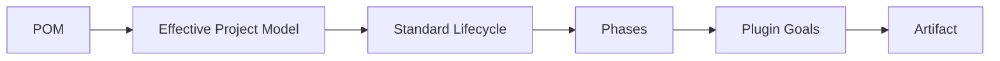
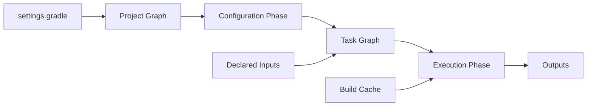
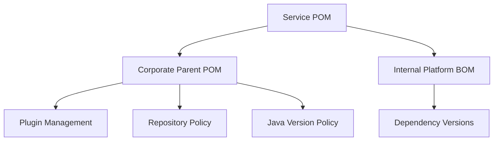
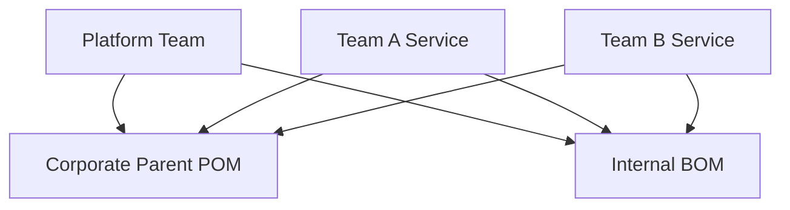
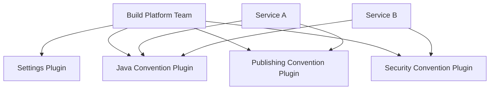

# Part 015 — Maven vs Gradle: Decision Framework

This part is not about which tool is “better”. That framing is too shallow.

The real question is:

> Given our codebase shape, dependency governance needs, release model, developer skill profile, CI constraints, and long-term operating model, which build system gives us the smallest total cost of correctness?

Maven and Gradle both build Java software. They differ in how they model the world.

Maven is centered on a **declarative project model** and a **standard lifecycle**.
Gradle is centered on a **programmable build graph** and **incremental task execution**.

A top-tier engineer does not choose based on taste. They choose based on constraints, invariants, and failure modes.

---

## 1. Kaufman Framing

Josh Kaufman’s learning model starts by deconstructing the skill, learning enough to self-correct, removing barriers, and practicing deliberately.

For this topic, the skill is:

> The ability to select, justify, operate, and evolve a Java build tool under real organizational constraints.

That means we need to be able to answer:

1. What kind of project are we building?
2. What kind of dependency graph do we have?
3. What kind of build graph do we need?
4. What kind of release model do we operate?
5. What kind of team will maintain the build?
6. What failures are most expensive for us?
7. What governance do we need over time?

The goal is not to memorize Maven and Gradle commands. The goal is to reason from first principles.

---

## 2. The Core Mental Model

### Maven

Maven can be modeled as:



Maven asks:

> What kind of project is this, and which lifecycle phases should run?

Its strength is standardization.

A Maven build is usually easier to understand when it stays close to convention:

- `pom.xml` describes the project
- packaging type influences default lifecycle bindings
- plugins attach goals to phases
- dependencies are resolved through well-known mediation rules
- parent POMs and BOMs centralize policy
- repositories publish Maven coordinates

Maven becomes weaker when the build stops being a mostly standard Java build and starts becoming a custom workflow engine.

### Gradle

Gradle can be modeled as:



Gradle asks:

> What task graph should run, and which tasks are already up-to-date or cache-reusable?

Its strength is controlled programmability.

A Gradle build is powerful when:

- build logic is centralized into convention plugins
- tasks declare inputs and outputs correctly
- dependency configurations express API/runtime boundaries
- version catalogs/platforms define dependency policy
- cache and configuration avoidance are respected
- custom build behavior is modeled as reusable build logic

Gradle becomes dangerous when build scripts become arbitrary imperative programs that mutate projects unpredictably.

---

## 3. First Principle: The Build Tool Is Part of the Delivery Platform

A build tool is not just a developer convenience. It is part of the software supply chain.

It controls:

- source compilation
- test execution
- generated code
- dependency resolution
- artifact packaging
- artifact publishing
- release metadata
- reproducibility
- SBOM generation
- signing
- CI/CD integration
- developer feedback speed

So the decision has architectural weight.

A weak build decision creates downstream damage:

| Weak Decision | Downstream Damage |
|---|---|
| Build scripts are inconsistent | CI failures, onboarding friction, duplicated fixes |
| Dependency policy is decentralized | version drift, CVE exposure, classpath conflicts |
| Build logic is too magical | engineers cannot debug failures |
| Tooling is too slow | developers bypass checks |
| Release process is hand-assembled | non-reproducible artifacts |
| Migration is rushed | broken publishing, broken consumers, lost trust |

The build system is a governance surface.

---

## 4. Maven Strengths

Maven is strong when the problem is mostly standard Java build automation.

### 4.1 Convention and Predictability

Maven’s biggest advantage is that many Java engineers can inspect a POM and quickly understand the build.

The default lifecycle gives a shared language:

- `validate`
- `compile`
- `test`
- `package`
- `verify`
- `install`
- `deploy`

This matters in large organizations because build maintainability depends on shared mental models.

### 4.2 Strong Ecosystem Compatibility

The Maven coordinate system is the lingua franca of JVM artifacts:

```xml
<groupId>com.example</groupId>
<artifactId>payments-api</artifactId>
<version>1.4.2</version>
```

Even Gradle often publishes Java libraries into Maven-compatible repositories.

Maven is usually a safe choice for:

- internal libraries
- public libraries
- standard Java services
- projects where many teams consume artifacts by Maven coordinates
- enterprise repositories like Nexus or Artifactory

### 4.3 Simple Governance Through Parent POMs and BOMs

Maven makes centralized governance natural:

- corporate parent POM
- shared plugin management
- shared dependency management
- imported BOMs
- Enforcer rules
- release plugin conventions

Example policy structure:



This is boring, but boring can be excellent when the cost of variation is high.

### 4.4 Lower Build-Language Surface Area

Maven’s XML is verbose, but it limits arbitrary code.

That is a governance advantage.

In highly regulated or platform-managed organizations, limiting build behavior can be desirable because:

- builds are easier to audit
- conventions are harder to bypass accidentally
- plugin behavior is more explicit
- teams cannot easily create divergent build logic

### 4.5 Good Default for Standard Service Repositories

For many enterprise Java microservices, Maven is enough.

Typical service:

- one application artifact
- Spring Boot or Jakarta stack
- normal unit/integration tests
- standard dependency management
- normal container packaging
- no complex monorepo optimization

For this shape, Maven often wins by reducing cognitive overhead.

---

## 5. Maven Weaknesses

Maven is not weak because it is old. It is weak when forced into problems that do not fit its model.

### 5.1 Lifecycle Rigidity

Maven’s lifecycle is predictable, but less flexible.

Custom workflows often require plugin executions bound to phases:

```xml
<execution>
  <id>generate-openapi-client</id>
  <phase>generate-sources</phase>
  <goals>
    <goal>generate</goal>
  </goals>
</execution>
```

This is fine until many teams start stacking custom behavior into lifecycle phases. At that point, the POM becomes a hidden workflow definition.

### 5.2 Multi-Module Friction at Scale

Maven reactor builds are reliable, but large multi-module projects can become slow and hard to optimize.

Pain points include:

- limited incremental execution compared with Gradle’s task model
- coarse module rebuild behavior
- difficult partial build ergonomics
- parent POM inheritance coupling
- heavy effective POMs
- slow CI feedback in large repositories

### 5.3 Plugin Configuration Becomes Verbose

Maven plugin configuration is explicit, but can become large.

This often leads to:

- copy-pasted plugin blocks
- hard-to-read parent POMs
- accidental inherited behavior
- profile complexity
- brittle overrides in child modules

### 5.4 Profiles Are Often Overused

Maven profiles can be useful, but they are often abused for environment-specific behavior.

Bad pattern:

```xml
<profiles>
  <profile>
    <id>prod</id>
    <!-- changes dependency or packaging behavior -->
  </profile>
</profiles>
```

Danger:

- local and CI builds diverge
- release artifact differs by profile
- deployment behavior leaks into build logic
- artifact immutability is weakened

A release artifact should usually be built once and configured later.

---

## 6. Gradle Strengths

Gradle is strong when the build itself is a system.

### 6.1 Programmable Build Graph

Gradle models work as tasks with dependencies, inputs, and outputs.

This makes it effective for builds involving:

- code generation
- multiple languages
- custom validation
- generated clients
- generated schemas
- specialized packaging
- monorepo-like structures
- performance optimization

Gradle can express build workflows more naturally than Maven when the workflow does not map cleanly to Maven phases.

### 6.2 Performance and Incrementality

Gradle’s performance model is a major reason teams adopt it.

Important concepts:

- incremental tasks
- task output caching
- configuration cache
- parallel execution
- task avoidance
- remote build cache
- build scans

For large builds, this can materially improve feedback speed.

However, this benefit is not automatic. Gradle performance depends on disciplined build logic.

Bad Gradle builds can be slower and harder to debug than Maven builds.

### 6.3 Strong Modeling of API vs Implementation

The Java Library plugin separates API and implementation dependencies:

```kotlin
dependencies {
    api("com.example:public-contract:1.2.0")
    implementation("com.example:internal-helper:3.1.0")
}
```

This is architecturally important.

It prevents accidental API leakage and can improve compilation avoidance.

Maven has dependency scopes, but Gradle’s `api` vs `implementation` distinction gives stronger expression for library boundary design.

### 6.4 Build Logic as Internal Platform

Gradle allows organizations to package build conventions as plugins:

```kotlin
plugins {
    id("company.java-library-conventions")
    id("company.publishing-conventions")
    id("company.security-scan-conventions")
}
```

This is powerful for platform engineering.

Instead of copying configuration into every project, the organization can define reusable build behavior.

This enables:

- centralized Java toolchain policy
- consistent test tasks
- consistent publishing
- consistent security scanning
- consistent SBOM generation
- consistent repository rules
- consistent quality gates

### 6.5 Better Fit for Polyglot and Android Ecosystems

Gradle is the dominant build system in Android and a common choice for Kotlin-heavy projects.

It is also strong when Java coexists with:

- Kotlin
- Groovy
- Scala
- native components
- protobuf
- frontend build steps
- generated clients
- platform-specific packaging

When the build is not “just Java”, Gradle often has better abstraction capacity.

---

## 7. Gradle Weaknesses

Gradle’s power introduces governance risk.

### 7.1 Higher Cognitive Load

Gradle has more moving parts:

- settings file
- project graph
- configuration phase
- execution phase
- task graph
- providers
- configurations
- attributes
- variants
- convention plugins
- build cache
- configuration cache

For teams without Gradle discipline, this can become a barrier.

### 7.2 Imperative Build Script Risk

Gradle build files are executable code.

That is a strength and a risk.

Bad pattern:

```kotlin
subprojects {
    afterEvaluate {
        tasks.named("test") {
            // hidden mutation after configuration
        }
    }
}
```

Problems:

- order-dependent behavior
- configuration cache incompatibility
- hard-to-debug task graph mutation
- unexpected cross-project coupling
- slow configuration time

### 7.3 Governance Requires Platform Discipline

Gradle is excellent when build logic is centralized properly.

It is dangerous when every team invents its own Gradle style.

Without convention plugins and governance, Gradle can produce:

- inconsistent dependency declarations
- uncontrolled plugins
- incompatible publishing metadata
- poor cache behavior
- unreadable build scripts
- CI/local divergence

Gradle needs stronger build engineering maturity.

### 7.4 Maven Compatibility Is Not Always Lossless

Gradle has richer dependency metadata than Maven POMs.

This means publishing from Gradle to Maven repositories requires careful thought.

Potential issues:

- variant metadata may not map perfectly to Maven POMs
- rich version constraints may be simplified
- resolved versions may need explicit publication policy
- consumers using Maven may see a different dependency view

For library authors, this matters.

---

## 8. Decision Axes

Do not ask “Maven or Gradle?” in isolation.

Score the project across decision axes.

### 8.1 Project Shape

| Project Shape | Usually Favors |
|---|---|
| Standard Java service | Maven or Gradle |
| Simple internal library | Maven |
| Public JVM library | Maven or carefully configured Gradle |
| Android project | Gradle |
| Kotlin-heavy JVM project | Gradle |
| Large multi-project repository | Gradle |
| Simple multi-module enterprise app | Maven |
| Polyglot build | Gradle |
| Highly regulated standardized environment | Maven or governed Gradle |
| Build platform product | Gradle |

### 8.2 Build Complexity

| Build Need | Maven Fit | Gradle Fit |
|---|---:|---:|
| Standard compile/test/package | High | High |
| Complex generated sources | Medium | High |
| Custom task orchestration | Medium/Low | High |
| Incremental execution optimization | Low/Medium | High |
| Remote build cache | Low | High |
| Strict convention enforcement | High | High if platformized |
| Low cognitive load | High | Medium |
| Large monorepo scaling | Medium/Low | High |
| Rich dependency variants | Low | High |
| Maven repository publishing | High | High with care |

### 8.3 Team Skill Profile

Ask:

- How many engineers can debug a failed build?
- Who owns build conventions?
- Do teams understand dependency graphs?
- Are platform engineers available?
- Is build performance a known bottleneck?
- Are teams disciplined enough to avoid arbitrary Gradle logic?

A team with low build maturity may do better with Maven even if Gradle is theoretically more powerful.

A team with strong platform engineering can extract huge value from Gradle.

### 8.4 Governance Model

| Governance Requirement | Maven Approach | Gradle Approach |
|---|---|---|
| Standard plugin versions | parent POM pluginManagement | convention plugins / settings plugins |
| Dependency version alignment | BOM / dependencyManagement | platforms / version catalogs / constraints |
| Repository policy | settings.xml / parent POM | settings plugin / repository management |
| Quality gates | plugins bound to lifecycle | convention plugin tasks |
| Publishing policy | distributionManagement / plugins | maven-publish convention |
| Java version policy | compiler plugin / toolchains | Java toolchains |
| Build reproducibility | plugin config + controlled repos | wrapper + locking + verification + cache policy |

Both can be governed. Gradle governance requires more deliberate platform design.

### 8.5 Runtime and Release Model

The build tool should support your release model.

Questions:

- Do we publish libraries or only deploy applications?
- Do we use snapshots?
- Do we need staged releases?
- Do we sign artifacts?
- Do we produce SBOMs?
- Do we build container images?
- Do we promote the same artifact across environments?
- Do we need release branches and hotfixes?
- Do we need reproducible builds?

Maven has long-standing patterns for classic Java library publishing.
Gradle can support the same, but publishing metadata must be intentionally configured.

---

## 9. A Practical Decision Matrix

Use this matrix as a starting point, not as a substitute for judgment.

Score each factor from 1 to 5.

- 1 = not important
- 3 = moderately important
- 5 = critical

Then evaluate which tool better satisfies the factor in your context.

| Factor | Weight | Maven Score | Gradle Score | Notes |
|---|---:|---:|---:|---|
| Standard Java convention |  |  |  | Maven often stronger by default |
| Build performance at scale |  |  |  | Gradle usually stronger if well-authored |
| Developer familiarity |  |  |  | Depends on organization |
| Dependency governance |  |  |  | Both strong, different mechanisms |
| Custom build workflows |  |  |  | Gradle usually stronger |
| Auditability |  |  |  | Maven often simpler; Gradle needs conventions |
| Publishing to Maven repos |  |  |  | Both can work; Maven simpler by default |
| Multi-project scaling |  |  |  | Gradle usually stronger |
| IDE integration |  |  |  | Both mature; project-specific |
| CI/CD simplicity |  |  |  | Maven often simpler; Gradle stronger with cache |
| Onboarding speed |  |  |  | Maven often simpler |
| Internal build platform |  |  |  | Gradle stronger |
| Long-term maintainability |  |  |  | Depends on governance |

Decision formula:

```text
weighted score = factor weight × tool score
```

But do not blindly obey the highest number. Use the matrix to expose assumptions.

---

## 10. Default Recommendations

### 10.1 Choose Maven When

Choose Maven when:

- the project is a standard Java application or library
- the organization values convention over flexibility
- most engineers already understand Maven
- build performance is acceptable
- publishing Maven artifacts is central
- governance can be expressed through parent POMs and BOMs
- custom build workflows are limited
- auditability and predictability matter more than optimization

Maven is not a “junior” choice. It is often the correct enterprise choice.

### 10.2 Choose Gradle When

Choose Gradle when:

- the repository is large or multi-project
- build performance is a major constraint
- code generation is heavy
- the build requires custom orchestration
- Kotlin or Android is central
- API/implementation separation matters strongly
- you have platform engineers to own build logic
- remote build cache and configuration cache can be exploited
- you want build conventions as internal plugins

Gradle is not automatically better. It is better when the organization can operate it properly.

### 10.3 Avoid Tool Switching for Weak Reasons

Bad reasons to migrate:

- “Gradle is modern”
- “Maven is old”
- “Everyone says Gradle is faster”
- “XML is ugly”
- “Kotlin DSL looks nicer”
- “We want to standardize without understanding the current build”

Good reasons to migrate:

- current build performance blocks delivery
- build logic cannot be modeled safely in current tool
- dependency governance is failing
- monorepo scale requires better graph behavior
- platform team can centralize conventions
- current release model cannot be made reproducible
- tool ecosystem requirements changed materially

---

## 11. Enterprise Operating Models

The build tool choice should match your operating model.

### 11.1 Decentralized Teams

If each team owns its own service build independently, Maven may reduce variance.

Recommended model:



This model works when teams mostly build similar services.

### 11.2 Platform-Managed Build System

If a central platform team actively owns build logic, Gradle can become a powerful internal product.

Recommended model:



This model works when build logic is treated like production code.

### 11.3 Regulated or Audit-Heavy Organization

A regulated environment needs:

- traceable dependency decisions
- reproducible release artifacts
- locked tool versions
- controlled repositories
- signed artifacts
- SBOMs
- approval evidence
- reliable rollback/roll-forward

Both Maven and Gradle can support this.

Maven may be easier to audit because it is less programmable.
Gradle may be more powerful if governance is enforced through plugins and CI policies.

---

## 12. Failure Mode Analysis

### 12.1 Maven Failure Modes

| Failure Mode | Cause | Mitigation |
|---|---|---|
| Parent POM becomes a dumping ground | all shared behavior is centralized without boundaries | separate parent, BOM, and plugin policy |
| Profiles change release artifact | environment-specific build behavior | build once, configure at runtime |
| Dependency convergence issues | transitive graph drift | Enforcer rules, BOMs, dependency tree review |
| Slow multi-module builds | large reactor and limited incrementality | split modules, CI partitioning, consider Gradle |
| Plugin version drift | plugins not managed centrally | `pluginManagement` in parent POM |
| Hidden lifecycle behavior | plugin goals bound across many phases | document lifecycle bindings, minimize magic |

### 12.2 Gradle Failure Modes

| Failure Mode | Cause | Mitigation |
|---|---|---|
| Build scripts become arbitrary programs | uncontrolled imperative logic | convention plugins, code review, build logic tests |
| Configuration cache disabled | unsafe task/configuration behavior | Provider API, configuration avoidance |
| Cache poisoning | wrong task inputs/outputs | strict task modeling, CI cache isolation |
| Inconsistent project conventions | each team writes custom scripts | internal build platform |
| Maven consumer metadata mismatch | rich Gradle metadata not reflected in POM | test Maven consumer compatibility |
| Slow configuration time | cross-project eager configuration | avoid `allprojects/subprojects`, use plugins |

---

## 13. Build Tool Decision as ADR

A serious build tool decision should be captured as an Architecture Decision Record.

Template:

```md
# ADR: Build Tool Choice for <System>

## Status
Accepted | Proposed | Superseded

## Context
- Repository shape:
- Number of modules:
- Languages:
- Artifact types:
- Release model:
- CI constraints:
- Dependency governance needs:
- Team skill profile:

## Options Considered
- Maven
- Gradle
- Hybrid / no migration

## Decision
We will use <tool> because ...

## Consequences
Positive:
- ...

Negative:
- ...

Required controls:
- ...

## Revisit Trigger
We will revisit this decision if:
- build time exceeds ...
- module count exceeds ...
- release model changes ...
- platform team capacity changes ...
```

This prevents tool choice from becoming tribal knowledge.

---

## 14. Anti-Patterns

### 14.1 “Gradle Because Maven Is Old”

Age is not an architectural argument.

Maven’s stability is often a feature.

### 14.2 “Maven Because Gradle Is Too Flexible”

Flexibility is only dangerous without governance.

A disciplined Gradle platform can be cleaner than a chaotic Maven parent POM hierarchy.

### 14.3 “One Build Tool for Everything”

Standardization is valuable, but forced uniformity can be harmful.

A company may reasonably use:

- Maven for simple Java services
- Gradle for Android/Kotlin/monorepo builds
- specialized tooling for native/image packaging

The key is to standardize interfaces:

- artifact coordinates
- repository policy
- release metadata
- SBOM format
- CI gates
- security rules

Not every repository must use the same implementation.

### 14.4 “The Build Team Owns Everything”

Platform teams should own conventions and guardrails, not every project-specific detail.

Good platform model:

- centralize common behavior
- expose safe extension points
- document migration paths
- provide diagnostics
- avoid blocking teams unnecessarily

Bad platform model:

- every change requires platform approval
- build logic is opaque
- teams cannot debug failures
- exceptions become permanent forks

---

## 15. Practical Decision Scenarios

### Scenario A: Standard Spring Boot Microservice Fleet

Characteristics:

- many services
- similar structure
- standard compile/test/package
- Maven Central plus internal repository
- moderate CI build time
- engineers familiar with Maven

Recommendation:

> Maven is likely sufficient and may be preferable.

Use:

- corporate parent POM
- internal platform BOM
- Maven Wrapper
- Enforcer rules
- pinned plugin versions
- standardized container build pipeline

Do not migrate just for aesthetics.

### Scenario B: Large JVM Monorepo with Heavy Code Generation

Characteristics:

- hundreds of modules
- protobuf/OpenAPI generation
- shared libraries
- cross-module test tasks
- build time is a bottleneck
- platform team exists

Recommendation:

> Gradle is likely a stronger fit.

Use:

- convention plugins
- version catalogs
- platforms
- dependency locking
- remote build cache
- configuration cache discipline
- build scans
- CI task partitioning

### Scenario C: Public Java Library

Characteristics:

- external consumers
- Maven Central publishing
- strict semantic versioning
- source/javadoc artifacts
- signing
- Maven and Gradle consumers

Recommendation:

> Maven is simpler by default; Gradle is fine if publishing metadata is carefully tested.

Controls:

- verify generated POM
- test Maven consumer
- test Gradle consumer
- publish sources/Javadoc
- sign artifacts
- validate dependency scopes

### Scenario D: Regulated Banking Platform

Characteristics:

- auditability
- dependency approval
- reproducible artifacts
- strict release evidence
- controlled repositories
- many Java services

Recommendation:

> Maven or governed Gradle can both work. Choose based on build complexity and platform maturity.

If simple service fleet: Maven.
If complex internal platform/monorepo: Gradle with strong governance.

### Scenario E: Kotlin + Java Backend Platform

Characteristics:

- Kotlin-first modules
- Java interoperability
- generated code
- custom quality tasks
- developer productivity focus

Recommendation:

> Gradle is usually the better fit.

---

## 16. Minimum Governance Baseline

Regardless of Maven or Gradle, every serious Java build should have:

- wrapper committed to repository
- pinned Java version or toolchain
- pinned plugin versions
- controlled repositories
- no dependency resolution from random repositories
- dependency graph review
- CI parity with local build
- reproducible artifact policy
- quality gates
- SBOM generation path
- artifact publishing policy
- release tagging policy
- documented rollback or roll-forward strategy

Tool choice does not remove the need for governance.

---

## 17. Deliberate Practice

### Exercise 1 — Decide for a New Service

Given:

- 12 Java services
- standard REST APIs
- Spring Boot
- small teams
- no build platform team
- CI time acceptable

Write an ADR choosing Maven or Gradle.

Expected reasoning:

- avoid unnecessary build complexity
- standardize parent/BOM
- use Maven unless a strong constraint favors Gradle

### Exercise 2 — Decide for a Monorepo

Given:

- 150 modules
- Java/Kotlin mix
- OpenAPI and protobuf generation
- CI takes 45 minutes
- platform team available

Write an ADR choosing Maven or Gradle.

Expected reasoning:

- Gradle likely wins due to graph/caching/build-logic needs
- governance must be expressed as convention plugins

### Exercise 3 — Review an Existing Build

Pick any repository and answer:

1. What is the artifact contract?
2. What is the dependency governance mechanism?
3. What is the release path?
4. What are hidden build inputs?
5. What is the slowest feedback loop?
6. What is the most likely build failure mode?
7. Would a different build tool solve the problem, or would governance solve it?

The last question is critical. Many build problems are governance problems, not tool problems.

---

## 18. Heuristics for Top-Tier Engineers

Use these heuristics:

1. Prefer boring builds until complexity proves otherwise.
2. Do not optimize build performance before measuring it.
3. Do not migrate tools to compensate for bad build governance.
4. Treat dependency graph shape as architecture.
5. Treat build logic as production code.
6. Keep release artifacts immutable.
7. Test consumer compatibility when publishing libraries.
8. Separate build-time, release-time, and deploy-time concerns.
9. Minimize hidden environment-dependent behavior.
10. Revisit the decision when repository shape changes.

---

## 19. Summary

Maven and Gradle are both serious tools.

Maven is usually better when you need:

- convention
- simplicity
- predictable lifecycle
- easy auditability
- classic Java publishing
- lower cognitive overhead

Gradle is usually better when you need:

- programmable build graph
- performance optimization
- custom build logic
- large multi-project scale
- Kotlin/Android/polyglot support
- build platform extensibility

The decision should be made from system constraints, not preference.

A top-tier engineer can defend either choice with a clear operating model.

---

## References

- Apache Maven — Introduction to the Build Lifecycle: https://maven.apache.org/guides/introduction/introduction-to-the-lifecycle.html
- Apache Maven — Introduction to the POM: https://maven.apache.org/guides/introduction/introduction-to-the-pom.html
- Apache Maven — Dependency Mechanism: https://maven.apache.org/guides/introduction/introduction-to-dependency-mechanism.html
- Gradle User Manual — Build Lifecycle: https://docs.gradle.org/current/userguide/build_lifecycle.html
- Gradle User Manual — Dependency Management: https://docs.gradle.org/current/userguide/getting_started_dep_man.html
- Gradle User Manual — Java Library Plugin: https://docs.gradle.org/current/userguide/java_library_plugin.html
- Gradle User Manual — Build Cache: https://docs.gradle.org/current/userguide/build_cache.html
- Gradle User Manual — Maven Publish Plugin: https://docs.gradle.org/current/userguide/publishing_maven.html
