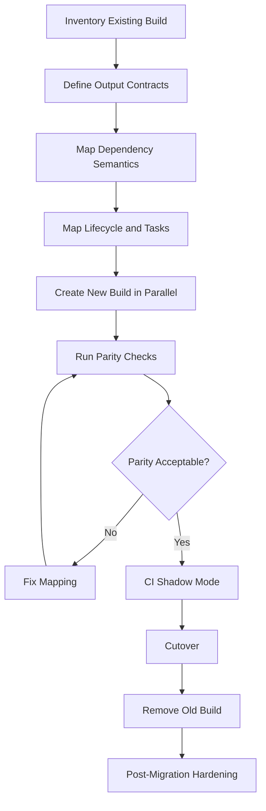
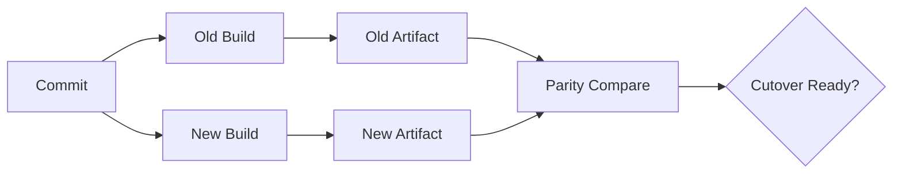

# Part 016 — Migration Between Maven and Gradle

A build migration is not a syntax conversion.

It is a controlled replacement of a delivery subsystem.

The objective is not:

> Convert `pom.xml` to `build.gradle.kts`.

The objective is:

> Preserve the artifact contract, dependency semantics, quality gates, release behavior, and developer workflow while changing the build engine.

That distinction determines whether the migration is safe or chaotic.

---

## 1. Kaufman Framing

Using Kaufman’s model, we deconstruct this skill into five sub-skills:

1. Understand the existing build contract.
2. Map lifecycle/task semantics correctly.
3. Preserve dependency graph behavior.
4. Preserve artifact and publishing compatibility.
5. Cut over with measurable parity and rollback.

The first 20 hours should not be spent editing build files randomly.

They should be spent building a migration map.

---

## 2. Core Migration Principle

The build tool is implementation.

The build contract is the thing that must survive.

A Java build contract includes:

- source layout
- Java version/toolchain
- generated sources
- annotation processors
- dependency graph
- compile classpath
- runtime classpath
- test classpath
- test tasks/phases
- packaged artifact
- manifest entries
- shaded/relocated classes
- published metadata
- source and Javadoc artifacts
- signing behavior
- release versioning
- CI gates
- repository publishing
- container image build behavior

Before migration, document the contract.

If you cannot describe the old behavior, you cannot safely reproduce it.

---

## 3. Migration Flow Overview



The migration is successful only when the new build produces equivalent outputs and the team can operate it.

---

## 4. Pre-Migration Inventory

Start with an inventory.

### 4.1 Project Structure

Capture:

```text
root/
  pom.xml or settings.gradle(.kts)
  module-a/
  module-b/
  module-c/
```

Record:

- number of modules
- module dependency graph
- parent/child relationships
- aggregator relationships
- generated source locations
- custom source sets
- resource filtering
- test directories
- integration test directories
- packaging types

### 4.2 Dependency Graph

For Maven, capture:

```bash
./mvnw dependency:tree
./mvnw help:effective-pom
```

For Gradle, capture:

```bash
./gradlew dependencies
./gradlew dependencyInsight --dependency <name>
```

Record:

- direct dependencies
- transitive dependencies
- dependency scopes/configurations
- BOMs/platforms
- exclusions
- optional dependencies
- version overrides
- annotation processors
- runtime-only dependencies
- test dependencies

### 4.3 Build Lifecycle and Tasks

For Maven, capture:

- lifecycle phases used by CI
- plugin goals bound to phases
- profiles used by CI/release
- plugin versions
- custom plugin executions

For Gradle, capture:

- tasks run by CI
- task dependencies
- convention plugins
- custom tasks
- source sets
- configurations
- publishing tasks
- cache assumptions

### 4.4 Artifact Contract

For every produced artifact, record:

| Artifact | Required Checks |
|---|---|
| JAR | classes, resources, manifest, metadata |
| WAR | web resources, `WEB-INF/lib`, deployment descriptor |
| shaded JAR | relocation rules, duplicate handling, service files |
| source JAR | source inclusion/exclusion |
| Javadoc JAR | public docs, links, warnings |
| BOM | managed dependencies |
| container image | layers, entrypoint, labels, digest policy |

Artifact shape is part of compatibility.

### 4.5 Release Contract

Record:

- versioning strategy
- snapshot behavior
- release tag format
- changelog generation
- signing
- staging repository
- promotion workflow
- rollback/roll-forward model
- release approval gates
- artifact retention

A build migration that changes release semantics is not just a build migration.

---

## 5. Maven to Gradle Migration

Maven to Gradle is common when teams need stronger build graph control, performance, Kotlin support, or platformized build logic.

### 5.1 Use Gradle Wrapper

Commit the wrapper:

```bash
gradle wrapper
```

Repository should contain:

```text
gradlew
gradlew.bat
gradle/wrapper/gradle-wrapper.properties
```

Do not rely on developer-installed Gradle.

### 5.2 Prefer Kotlin DSL for New Enterprise Builds

Both Groovy DSL and Kotlin DSL are valid.

For enterprise Java builds, Kotlin DSL often helps because:

- better IDE completion
- stronger refactoring support
- clearer plugin convention code
- fewer dynamic typing surprises

Example root structure:

```text
settings.gradle.kts
build.gradle.kts
gradle/libs.versions.toml
build-logic/
  convention-plugins/
```

### 5.3 Map Maven Coordinates

Maven:

```xml
<groupId>com.example.payments</groupId>
<artifactId>payment-service</artifactId>
<version>1.2.0</version>
```

Gradle:

```kotlin
group = "com.example.payments"
version = "1.2.0"
```

Artifact ID normally comes from the Gradle project name unless publishing configuration overrides it.

Be explicit for libraries:

```kotlin
publishing {
    publications {
        create<MavenPublication>("mavenJava") {
            from(components["java"])
            artifactId = "payment-service"
        }
    }
}
```

### 5.4 Map Maven Modules to Gradle Projects

Maven aggregator:

```xml
<modules>
  <module>api</module>
  <module>service</module>
</modules>
```

Gradle settings:

```kotlin
pluginManagement {
    repositories {
        gradlePluginPortal()
        mavenCentral()
    }
}

dependencyResolutionManagement {
    repositoriesMode.set(RepositoriesMode.FAIL_ON_PROJECT_REPOS)
    repositories {
        mavenCentral()
    }
}

rootProject.name = "payment-platform"
include("api", "service")
```

Maven reactor ordering is inferred from module relationships.
Gradle task ordering is inferred from project dependencies and task dependencies.

### 5.5 Map Maven Dependency Scopes to Gradle Configurations

| Maven Scope | Gradle Configuration | Notes |
|---|---|---|
| `compile` | `implementation` or `api` | libraries should choose carefully |
| `provided` | `compileOnly` | servlet APIs, container-provided APIs |
| `runtime` | `runtimeOnly` | JDBC drivers, logging bindings |
| `test` | `testImplementation` / `testRuntimeOnly` | test libraries |
| `import` BOM | `platform(...)` or `enforcedPlatform(...)` | dependency alignment |
| annotation processor plugin config | `annotationProcessor` | separate from compile classpath |

Important decision:

- use `api` only when consumers need the dependency on their compile classpath
- use `implementation` by default

Maven `compile` often maps too broadly. Do not blindly convert every Maven compile dependency into Gradle `api`.

### 5.6 Map `dependencyManagement` to Platforms or Version Catalogs

Maven:

```xml
<dependencyManagement>
  <dependencies>
    <dependency>
      <groupId>org.slf4j</groupId>
      <artifactId>slf4j-api</artifactId>
      <version>2.0.17</version>
    </dependency>
  </dependencies>
</dependencyManagement>
```

Gradle version catalog:

```toml
[versions]
slf4j = "2.0.17"

[libraries]
slf4j-api = { module = "org.slf4j:slf4j-api", version.ref = "slf4j" }
```

Gradle dependency:

```kotlin
dependencies {
    implementation(libs.slf4j.api)
}
```

For alignment across modules, use a platform:

```kotlin
dependencies {
    implementation(platform("com.example:company-platform:1.0.0"))
}
```

Version catalogs centralize aliases. Platforms express dependency alignment.

They solve related but different problems.

### 5.7 Map Maven Parent POM to Gradle Convention Plugins

Maven parent POM commonly contains:

- Java version
- plugin versions
- compiler settings
- test settings
- repository policy
- quality plugin config
- publishing config

In Gradle, avoid copy-pasting this into every `build.gradle.kts`.

Create convention plugins:

```text
build-logic/
  convention-plugins/
    src/main/kotlin/company.java-library-conventions.gradle.kts
    src/main/kotlin/company.java-application-conventions.gradle.kts
    src/main/kotlin/company.publishing-conventions.gradle.kts
```

Example project:

```kotlin
plugins {
    id("company.java-library-conventions")
    id("company.publishing-conventions")
}
```

This is the Gradle equivalent of enterprise parent POM governance, but with stronger modularity.

### 5.8 Map Maven Lifecycle to Gradle Tasks

Maven lifecycle command:

```bash
./mvnw clean verify
```

Rough Gradle equivalent:

```bash
./gradlew clean check
```

Common mapping:

| Maven Phase | Gradle Task/Concept |
|---|---|
| `clean` | `clean` |
| `validate` | custom validation task, usually wired into `check` |
| `compile` | `compileJava` |
| `test` | `test` |
| `package` | `jar`, `bootJar`, `war`, etc. |
| `verify` | `check` plus integration verification tasks |
| `install` | `publishToMavenLocal` |
| `deploy` | `publish` |

Do not assume the command names are semantically identical. Define what CI must prove.

### 5.9 Map Maven Profiles Carefully

Maven profiles often combine unrelated concerns:

- OS-specific behavior
- environment-specific config
- release behavior
- test selection
- optional modules
- repository selection

Gradle alternatives:

- project properties
- explicit tasks
- source sets
- separate CI jobs
- convention plugins
- environment variables only at execution boundary

Bad migration:

```kotlin
if (project.findProperty("prod") == "true") {
    dependencies {
        implementation("com.example:prod-only-lib:1.0.0")
    }
}
```

This creates different artifacts based on flags.

Better:

- build one artifact
- inject runtime configuration at deployment
- use explicit tasks only for different verification paths

### 5.10 Map Publishing

Maven publishing usually uses `maven-deploy-plugin`, `distributionManagement`, or release tooling.

Gradle publishing uses `maven-publish`:

```kotlin
plugins {
    `java-library`
    `maven-publish`
}

publishing {
    publications {
        create<MavenPublication>("mavenJava") {
            from(components["java"])
            pom {
                name.set("Payment API")
                description.set("Payment API contracts")
            }
        }
    }
    repositories {
        maven {
            name = "internal"
            url = uri("https://repo.example.com/releases")
        }
    }
}
```

Validate:

- generated POM dependencies
- scopes in generated POM
- artifact ID
- classifier artifacts
- source JAR
- Javadoc JAR
- signing
- repository target
- version mapping
- Maven consumer compatibility

### 5.11 Maven-to-Gradle Parity Checks

Run both builds and compare outputs.

Minimum checks:

```bash
./mvnw clean verify
./gradlew clean check
```

Compare:

- compiled class count
- test count
- packaged artifact names
- JAR contents
- manifest entries
- generated sources
- dependency trees
- published POM
- runtime classpath
- container image contents if applicable

Example JAR comparison:

```bash
jar tf target/app.jar | sort > maven-jar.txt
jar tf build/libs/app.jar | sort > gradle-jar.txt
diff -u maven-jar.txt gradle-jar.txt
```

Not every difference is wrong, but every difference must be understood.

---

## 6. Gradle to Maven Migration

Gradle to Maven is less common for complex builds, but it happens.

Reasons include:

- organization standardizes on Maven
- build logic became too complex
- audit requirements favor declarative POMs
- public library publishing wants simpler Maven metadata
- team lacks Gradle expertise
- Gradle-specific features are not needed

The main challenge is that Gradle can model more than Maven POMs can express.

### 6.1 Identify Gradle-Specific Semantics

Before converting, find Gradle features that do not map cleanly:

- custom tasks
- task inputs/outputs
- variants
- attributes
- capabilities
- rich version constraints
- convention plugins
- source sets beyond main/test
- composite builds
- included builds
- configuration cache assumptions
- remote build cache assumptions
- artifact transforms

If the build heavily relies on these, migration to Maven may require redesign, not conversion.

### 6.2 Map Gradle Projects to Maven Modules

Gradle:

```kotlin
include("api", "service")
```

Maven aggregator:

```xml
<modules>
  <module>api</module>
  <module>service</module>
</modules>
```

Each module needs its own POM.

Clarify whether the root POM is:

- aggregator only
- parent only
- both aggregator and parent

For enterprise maintainability, consider separating parent and aggregator if the hierarchy becomes complex.

### 6.3 Map Gradle Configurations to Maven Scopes

| Gradle Configuration | Maven Scope | Notes |
|---|---|---|
| `api` | `compile` | consumer-visible dependency |
| `implementation` | `compile` or hidden via design | Maven cannot perfectly hide implementation dependencies in the same way |
| `compileOnly` | `provided` | approximate mapping |
| `runtimeOnly` | `runtime` | runtime dependency |
| `testImplementation` | `test` | test compile/runtime |
| `testRuntimeOnly` | `test` | Maven is less granular |
| `annotationProcessor` | compiler plugin annotation processor path | configure explicitly |

Important limitation:

Maven does not model Gradle’s `api`/`implementation` distinction as strongly.

If you migrate a Java library from Gradle to Maven, review consumer classpaths carefully.

### 6.4 Map Version Catalogs to BOM or Properties

Gradle version catalog:

```toml
[versions]
junit = "5.13.0"

[libraries]
junit-jupiter = { module = "org.junit.jupiter:junit-jupiter", version.ref = "junit" }
```

Maven property:

```xml
<properties>
  <junit.version>5.13.0</junit.version>
</properties>
```

Maven dependency:

```xml
<dependency>
  <groupId>org.junit.jupiter</groupId>
  <artifactId>junit-jupiter</artifactId>
  <version>${junit.version}</version>
  <scope>test</scope>
</dependency>
```

For multi-module alignment, prefer a BOM:

```xml
<dependencyManagement>
  <dependencies>
    <dependency>
      <groupId>com.example</groupId>
      <artifactId>company-platform-bom</artifactId>
      <version>1.0.0</version>
      <type>pom</type>
      <scope>import</scope>
    </dependency>
  </dependencies>
</dependencyManagement>
```

### 6.5 Map Convention Plugins to Parent POMs and Shared Plugins

Gradle convention plugin:

```kotlin
plugins {
    `java-library`
    `maven-publish`
}

java {
    toolchain {
        languageVersion.set(JavaLanguageVersion.of(21))
    }
}
```

Maven equivalent:

```xml
<pluginManagement>
  <plugins>
    <plugin>
      <groupId>org.apache.maven.plugins</groupId>
      <artifactId>maven-compiler-plugin</artifactId>
      <version>...</version>
      <configuration>
        <release>21</release>
      </configuration>
    </plugin>
  </plugins>
</pluginManagement>
```

But beware:

- convention plugin code may contain logic
- parent POMs are mostly declarative
- not every Gradle behavior belongs in Maven XML

If behavior is complex, consider writing a Maven plugin or simplifying the process.

### 6.6 Map Custom Tasks to Maven Plugins

Gradle custom task:

```kotlin
tasks.register("validateApiSpec") {
    inputs.file("openapi.yaml")
    outputs.file(layout.buildDirectory.file("api-validation.txt"))
    doLast {
        // validation logic
    }
}
```

Maven choices:

1. Existing Maven plugin
2. Exec Maven Plugin
3. Antrun plugin
4. Custom Maven plugin
5. Move behavior outside Maven into CI script

Prefer existing plugins or custom Maven plugins for important behavior.

Avoid turning Maven lifecycle into a shell-script runner.

### 6.7 Map Source Sets

Gradle can define source sets naturally:

```kotlin
sourceSets {
    create("integrationTest") {
        java.srcDir("src/integrationTest/java")
        resources.srcDir("src/integrationTest/resources")
    }
}
```

Maven does not have first-class arbitrary source sets in the same way.

Common Maven mappings:

- unit tests: `src/test/java`
- integration tests: Failsafe plugin with naming conventions like `*IT.java`
- generated sources: build-helper plugin or generator plugin
- separate fixtures: separate module

For Maven, module separation is often cleaner than many custom source roots.

### 6.8 Gradle-to-Maven Parity Checks

Compare:

- generated POM vs new POM
- dependency scopes
- API exposure
- source sets
- test execution behavior
- JAR contents
- published metadata
- Maven local install
- downstream consumer compile/test

A Gradle build may have hidden variant semantics that Maven consumers never saw. The migration can accidentally expose or remove dependencies.

---

## 7. Dependency Migration Deep Dive

Dependency migration is the highest-risk part.

### 7.1 Direct Dependency Equivalence

Create a table:

| Module | Old Dependency | Old Scope/Config | New Dependency | New Scope/Config | Notes |
|---|---|---|---|---|---|
| api | `org.slf4j:slf4j-api` | compile/api | same | api/compile | public API uses it |
| service | `org.postgresql:postgresql` | runtime | same | runtimeOnly/runtime | runtime driver |
| service | Lombok | annotationProcessor | same | annotationProcessor/compiler path | not runtime |

Do this before editing build files.

### 7.2 Transitive Dependency Equivalence

Direct dependencies are easy. Transitives are where bugs hide.

Compare resolved graphs.

Maven:

```bash
./mvnw dependency:tree -Dverbose
```

Gradle:

```bash
./gradlew dependencies --configuration runtimeClasspath
./gradlew dependencyInsight --dependency guava --configuration runtimeClasspath
```

Look for:

- version changes
- missing runtime dependencies
- new duplicate dependencies
- excluded dependencies returning
- optional dependencies becoming included
- BOM/platform alignment changes

### 7.3 Optional Dependencies

Maven optional dependencies are not automatically pulled transitively by consumers.

Gradle does not use Maven optional dependency semantics in the same central way.

When migrating, decide whether optional means:

- compile-only
- runtime plugin dependency
- separate feature module
- documented consumer dependency
- variant-specific dependency

Do not blindly map optional to `compileOnly` without checking runtime behavior.

### 7.4 Exclusions

Maven exclusion:

```xml
<exclusions>
  <exclusion>
    <groupId>commons-logging</groupId>
    <artifactId>commons-logging</artifactId>
  </exclusion>
</exclusions>
```

Gradle exclusion:

```kotlin
implementation("org.springframework:spring-core") {
    exclude(group = "commons-logging", module = "commons-logging")
}
```

Exclusions are sharp tools.

During migration, verify why each exclusion exists.

Categories:

- duplicate logging implementation
- security vulnerability
- container-provided API
- broken transitive metadata
- old workaround that can be removed

Do not preserve exclusions blindly forever.

---

## 8. Plugin and Lifecycle Migration

### 8.1 Maven Plugin Inventory

For Maven to Gradle, list every plugin execution:

| Plugin | Phase | Goal | Purpose | Gradle Mapping |
|---|---|---|---|---|
| compiler | compile | compile | Java compilation | `java` plugin/toolchain |
| surefire | test | test | unit tests | `test` task |
| failsafe | integration-test/verify | integration-test/verify | integration tests | custom `integrationTest` task |
| shade | package | shade | uber JAR | Shadow plugin or equivalent |
| javadoc | package/deploy | jar | docs artifact | `javadocJar` task |
| source | package/deploy | jar | source artifact | `sourcesJar` task |
| deploy | deploy | deploy | publish | `maven-publish` |

If you cannot explain a plugin execution, do not migrate it yet. First discover whether it is still needed.

### 8.2 Gradle Task Inventory

For Gradle to Maven, list every task used by CI:

```bash
./gradlew tasks --all
```

Capture:

- task name
- plugin source
- inputs
- outputs
- lifecycle dependency
- CI usage
- artifact effect

Then map to Maven lifecycle or external CI steps.

### 8.3 Integration Tests

Maven usually uses Failsafe:

- Surefire for unit tests
- Failsafe for integration tests

Gradle commonly uses a custom source set and task.

Migration must preserve:

- test selection
- classpath
- system properties
- environment variables
- reports
- failure semantics
- order relative to packaging

Do not let integration tests silently disappear.

---

## 9. CI Migration Strategy

### 9.1 Shadow Mode

Run old and new builds side-by-side before cutover.



Shadow mode should publish only to temporary repositories or local staging.

Do not let two builds publish the same release coordinate.

### 9.2 CI Cutover Stages

Recommended stages:

1. Local build works.
2. New build runs in CI non-blocking.
3. New build becomes blocking for test/verification only.
4. New build publishes snapshot to isolated repository.
5. Consumer tests run against new artifact.
6. Release dry run succeeds.
7. New build becomes release source of truth.
8. Old build is removed.

The last step matters. Long-term dual builds create drift.

### 9.3 Avoid Permanent Dual Builds

Dual builds are acceptable temporarily for migration validation.

Permanent dual builds are dangerous because:

- dependency graphs drift
- artifacts differ subtly
- CI cost doubles
- engineers fix one build and forget the other
- release authority becomes ambiguous

A repository should have one source-of-truth build.

---

## 10. Artifact Compatibility Testing

### 10.1 JAR Content

Compare:

```bash
jar tf old.jar | sort > old.txt
jar tf new.jar | sort > new.txt
diff -u old.txt new.txt
```

Check:

- class files
- resources
- service loader files
- manifest
- module-info.class
- generated metadata
- license files

### 10.2 Public API Compatibility

Use API compatibility tools where appropriate.

Check:

- public classes
- public methods
- generic signatures
- annotations
- exception declarations
- binary compatibility

Even if the build succeeds, consumers may break.

### 10.3 Runtime Smoke Test

For applications, run:

- startup test
- health endpoint test
- migration test if database is involved
- minimal business flow
- logging check
- configuration loading check

Artifact equivalence is not complete until runtime behavior is validated.

### 10.4 Consumer Build Test

For libraries, create consumer test projects:

```text
consumer-maven/
  pom.xml
consumer-gradle/
  build.gradle.kts
```

Verify both can:

- resolve dependency
- compile against API
- run tests
- avoid unexpected transitive dependencies
- see correct source/Javadoc artifacts

This catches publishing metadata bugs.

---

## 11. Release Migration

### 11.1 Preserve Version Semantics

Check:

- snapshot versions
- release versions
- pre-release versions
- Git tag format
- generated changelog
- artifact coordinates
- repository path

Changing version semantics during build migration increases risk.

Do one major change at a time.

### 11.2 Preserve Signing and Provenance

If old build signs artifacts, new build must sign equivalent artifacts.

Check:

- signing keys
- signature files
- repository staging
- SBOM generation
- provenance generation
- checksums

A migration that drops signing is a supply-chain regression.

### 11.3 Build Once, Promote Many

Do not rebuild separately per environment.

Bad:

```text
build-dev -> deploy-dev
build-qa -> deploy-qa
build-prod -> deploy-prod
```

Better:

```text
build artifact once -> promote same artifact -> deploy to environments
```

Build migration is a good moment to remove environment-dependent artifact creation.

---

## 12. Rollback Plan

Every migration needs rollback.

Rollback plan should define:

- how to restore old build commands
- how to prevent duplicate publishing
- how to handle partially migrated CI
- how to revert wrapper/build files
- how to communicate to consumers
- how to handle released artifacts already produced by new build

Rollback is not failure. It is controlled risk management.

---

## 13. Common Edge Cases

### 13.1 Annotation Processors

Examples:

- Lombok
- MapStruct
- JPA metamodel
- Dagger
- AutoService

Check:

- processor path
- compile-only dependency separation
- generated source location
- IDE support
- incremental compilation support

### 13.2 Shaded JARs

Check:

- relocation rules
- duplicate file handling
- service file merge
- signature file removal
- manifest main class
- dependency minimization

Shading bugs often appear only at runtime.

### 13.3 JPMS Modules

Check:

- `module-info.java`
- module path vs classpath
- automatic module names
- exported packages
- opened packages
- test module behavior

Maven and Gradle can both build JPMS projects, but defaults and plugins matter.

### 13.4 Generated Clients

Examples:

- OpenAPI
- protobuf
- Avro
- GraphQL

Check:

- generator version
- generated package names
- deterministic output
- generated source inclusion
- generated resources
- CI reproducibility

### 13.5 Multi-Release JARs

Check:

- `META-INF/versions/*`
- compiler release flags
- JAR manifest
- runtime compatibility
- test coverage for versioned classes

### 13.6 Container Image Build

If the build creates images, verify:

- base image
- layers
- entrypoint
- JVM flags
- labels
- exposed ports
- user permissions
- health check assumptions
- image tag policy
- digest promotion

Do not assume Java artifact parity means image parity.

---

## 14. Migration Checklists

### 14.1 Maven to Gradle Checklist

- [ ] Inventory all Maven modules.
- [ ] Capture effective POM.
- [ ] Capture dependency tree.
- [ ] Capture plugin executions.
- [ ] Identify profiles and their purpose.
- [ ] Define Gradle settings structure.
- [ ] Add Gradle Wrapper.
- [ ] Choose Kotlin or Groovy DSL.
- [ ] Create convention plugins.
- [ ] Map dependencies to configurations.
- [ ] Map BOMs to platforms or catalogs.
- [ ] Map lifecycle phases to tasks.
- [ ] Configure tests and integration tests.
- [ ] Configure generated sources.
- [ ] Configure publishing.
- [ ] Compare artifacts.
- [ ] Test consumers.
- [ ] Run CI shadow mode.
- [ ] Cut over release pipeline.
- [ ] Remove old Maven build.

### 14.2 Gradle to Maven Checklist

- [ ] Inventory Gradle projects.
- [ ] Capture dependency configurations.
- [ ] Capture custom tasks.
- [ ] Identify convention plugins.
- [ ] Identify Gradle-specific variants.
- [ ] Define Maven parent/aggregator model.
- [ ] Create module POMs.
- [ ] Map configurations to scopes.
- [ ] Convert catalog/platform policy.
- [ ] Configure compiler/test plugins.
- [ ] Configure integration tests.
- [ ] Replace custom tasks with Maven plugins or CI steps.
- [ ] Configure publishing.
- [ ] Compare artifacts.
- [ ] Test consumers.
- [ ] Run CI shadow mode.
- [ ] Cut over release pipeline.
- [ ] Remove old Gradle build.

---

## 15. Migration Anti-Patterns

### 15.1 Blind Syntax Conversion

Converting XML blocks to Gradle blocks is not enough.

You must preserve semantics.

### 15.2 Rebuilding Release Process at the Same Time

Changing build tool and release model simultaneously multiplies risk.

Separate the changes unless there is a strong reason.

### 15.3 Keeping Both Builds Forever

Dual builds drift.

Use them for migration validation, then remove one.

### 15.4 Ignoring Consumers

A library migration is incomplete until consumers can resolve and compile successfully.

### 15.5 Losing Dependency Governance

A migration that makes dependency versions easier to change but harder to govern is a regression.

### 15.6 Migrating Without Ownership

A migrated build needs maintainers.

If nobody owns the new model, it will decay quickly.

---

## 16. A Safe Migration Plan Template

```md
# Build Migration Plan

## Goal
Move from <old tool> to <new tool> while preserving artifact, dependency, release, and CI behavior.

## Non-Goals
- Changing runtime framework
- Changing release versioning
- Changing deployment model
- Refactoring module boundaries

## Existing Build Contract
- Modules:
- Artifacts:
- Dependency policy:
- Test phases:
- Publishing:
- Release process:

## Migration Mapping
- Source layout:
- Dependencies:
- Plugins/tasks:
- Generated sources:
- Tests:
- Publishing:

## Parity Checks
- Dependency graph:
- Artifact contents:
- Consumer tests:
- Runtime smoke test:
- CI timing:

## Cutover Plan
1. Add new build.
2. Run shadow CI.
3. Compare outputs.
4. Publish to staging.
5. Validate consumers.
6. Switch CI source of truth.
7. Remove old build.

## Rollback Plan
- Restore old CI path:
- Prevent duplicate publish:
- Revert files:
- Notify consumers:

## Acceptance Criteria
- New build passes all checks.
- Artifacts are equivalent or differences are approved.
- Consumers pass.
- Release dry run succeeds.
- Team can debug failures.
```

Use this as a real engineering artifact.

---

## 17. Deliberate Practice

### Exercise 1 — Maven to Gradle Mapping

Given this Maven dependency:

```xml
<dependency>
  <groupId>org.postgresql</groupId>
  <artifactId>postgresql</artifactId>
  <version>42.7.7</version>
  <scope>runtime</scope>
</dependency>
```

Map it to Gradle.

Expected answer:

```kotlin
dependencies {
    runtimeOnly("org.postgresql:postgresql:42.7.7")
}
```

Reason:

The PostgreSQL JDBC driver is usually needed at runtime, not to compile application code.

### Exercise 2 — Gradle to Maven API Boundary

Given:

```kotlin
dependencies {
    api("com.fasterxml.jackson.core:jackson-databind:2.19.0")
    implementation("com.google.guava:guava:33.4.8-jre")
}
```

When migrating to Maven, what risk appears?

Expected reasoning:

Maven’s `compile` scope does not preserve Gradle’s strict `api`/`implementation` separation. The migration may expose implementation dependencies to consumers unless module boundaries or publishing metadata are redesigned.

### Exercise 3 — Artifact Parity Review

Run old and new builds, then compare:

```bash
jar tf old.jar | sort > old.txt
jar tf new.jar | sort > new.txt
diff -u old.txt new.txt
```

Classify each difference:

- expected and safe
- expected but needs documentation
- unexpected and must be fixed
- irrelevant build metadata

### Exercise 4 — Migration ADR

Write an ADR for migrating a 60-module Maven build to Gradle.

Include:

- why Maven is insufficient
- why Gradle solves the problem
- what governance is required
- migration risks
- rollback strategy

---

## 18. Summary

A Maven/Gradle migration is successful when the new build preserves or intentionally improves the old build contract.

The safest migration sequence is:

1. inventory
2. mapping
3. parallel build
4. parity check
5. shadow CI
6. consumer validation
7. release dry run
8. cutover
9. remove old build
10. harden governance

Do not migrate syntax. Migrate semantics.

A top-tier engineer treats build migration as a controlled system replacement, not a formatting exercise.

---

## References

- Gradle User Manual — Migrating Builds From Apache Maven: https://docs.gradle.org/current/userguide/migrating_from_maven.html
- Gradle User Manual — Maven Publish Plugin: https://docs.gradle.org/current/userguide/publishing_maven.html
- Gradle User Manual — Dependency Management: https://docs.gradle.org/current/userguide/getting_started_dep_man.html
- Gradle User Manual — Dependency Locking: https://docs.gradle.org/current/userguide/dependency_locking.html
- Apache Maven — Introduction to the Build Lifecycle: https://maven.apache.org/guides/introduction/introduction-to-the-lifecycle.html
- Apache Maven — Introduction to the Dependency Mechanism: https://maven.apache.org/guides/introduction/introduction-to-dependency-mechanism.html
- Apache Maven — POM Reference: https://maven.apache.org/pom.html
- Apache Maven — Guide to Working with Multiple Modules: https://maven.apache.org/guides/mini/guide-multiple-modules.html
