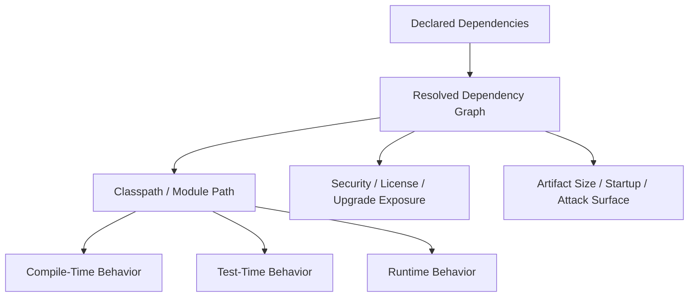
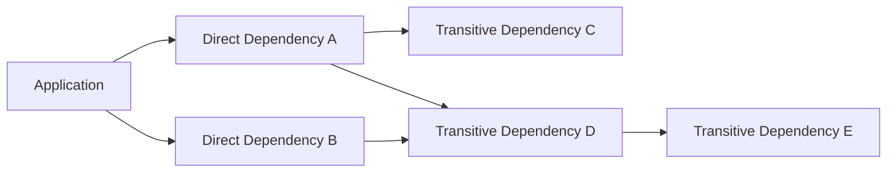
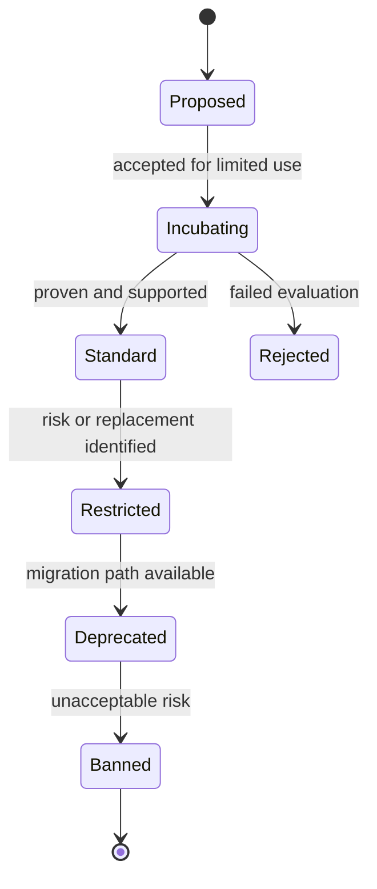
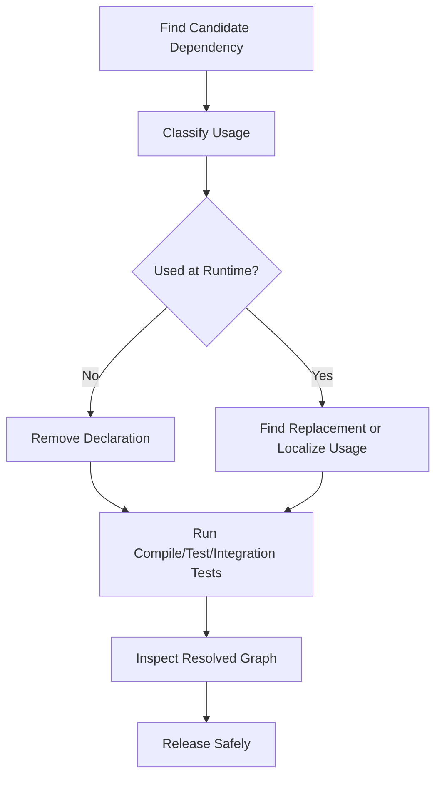
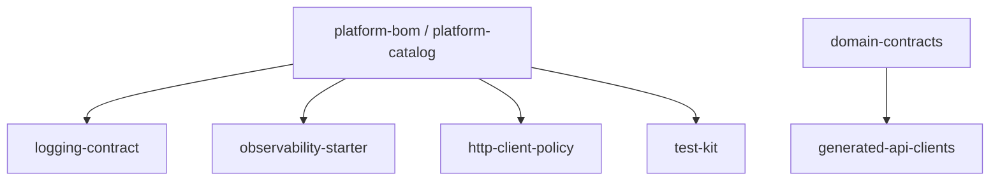
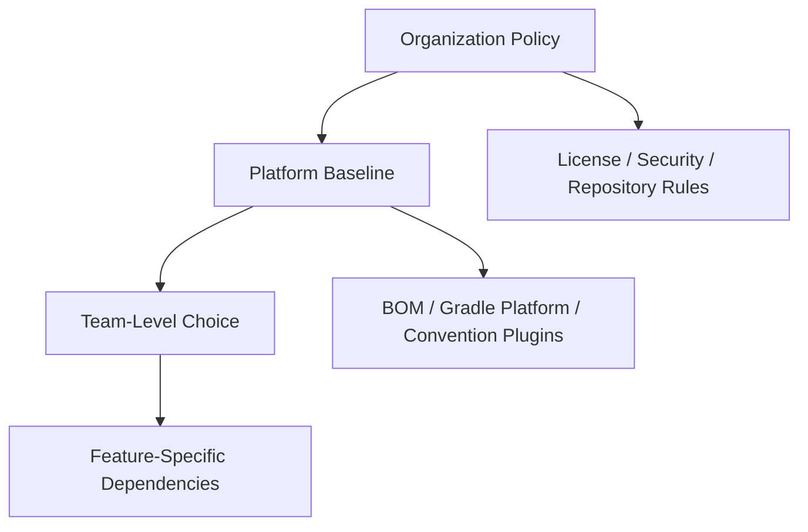

# Part 017 — Dependency Graph Governance

A Java dependency graph is not just a list of libraries.

It is part of the architecture.

Every dependency adds code, behavior, APIs, transitive dependencies, release cadence, security exposure, licensing obligations, operational assumptions, and upgrade work. A top-tier engineer treats dependency management as an engineering system, not as a collection of ad-hoc `pom.xml` or `build.gradle` edits.

The practical question is:

> How do we let teams move fast with external and internal libraries without allowing the dependency graph to become unbounded, inconsistent, insecure, or impossible to upgrade?

This part gives the governance model.

Part 018 will explain the technical alignment mechanisms: Maven BOMs, Gradle platforms, version catalogs, and versioning policy.

---

## 1. Kaufman Framing

Using Josh Kaufman’s skill-acquisition frame, we deconstruct dependency governance into smaller subskills.

The skill is not “knowing how to add a dependency”.

The real skill is:

> The ability to design and operate dependency rules that preserve delivery speed, runtime correctness, maintainability, and auditability across many Java services and libraries.

The subskills are:

1. Read a dependency graph.
2. Classify dependency types.
3. Distinguish direct, transitive, build-time, test-time, and runtime dependencies.
4. Detect accidental API exposure.
5. Define dependency ownership.
6. Create library approval states.
7. Centralize version policy.
8. Control transitive risk.
9. Detect drift.
10. Upgrade safely.
11. Retire obsolete dependencies.
12. Explain dependency decisions in architecture terms.

The first 20 hours should not be spent memorizing every plugin. They should be spent practicing graph inspection, failure diagnosis, and dependency policy design.

---

## 2. The Core Mental Model

A dependency graph has three layers:



The important point:

> The dependency declaration is not the actual system. The resolved graph is the system.

A `pom.xml` or `build.gradle` file says what you asked for. The resolver decides what you actually got.

In Maven, dependency mediation and `dependencyManagement` strongly influence the final graph.
In Gradle, configurations, platforms, constraints, capabilities, and conflict resolution influence the final graph.

Governance must operate on the resolved graph, not only on source declarations.

---

## 3. Why Dependency Graph Is Architecture

A dependency changes architecture in at least eight ways.

| Dimension | Architectural Effect |
|---|---|
| API surface | What code can call and expose |
| Runtime behavior | What code executes in production |
| Transitive graph | What other libraries enter the system |
| Upgrade cadence | How often teams must react to upstream changes |
| Compatibility | Which Java versions, frameworks, and containers are supported |
| Security | Which CVEs, supply-chain risks, and unsafe defaults are inherited |
| Licensing | Which legal obligations enter the product |
| Operations | Logging, networking, threading, native libraries, memory, startup cost |

A dependency is an architectural commitment because it changes future options.

Adding a library may take five minutes.
Removing it may take months.

---

## 4. Dependency Types

Not all dependencies deserve the same policy.

### 4.1 Platform Dependencies

Platform dependencies define the foundation for many services.

Examples:

- logging APIs and implementations
- JSON library
- HTTP server/client stack
- metrics/tracing APIs
- test framework
- dependency injection framework
- persistence framework
- cloud SDK baseline
- internal shared platform libraries

These should be centrally governed.

A team should not freely choose a different logging implementation for every service unless there is a strong reason.

### 4.2 Domain Dependencies

Domain dependencies encode business concepts.

Examples:

- customer domain model library
- payment contract package
- regulatory code-list package
- core-banking shared taxonomy package
- telecom product catalog contract package

These are dangerous when overused.

A domain dependency can accidentally couple service release cycles. If many services import a shared domain model, a small model change can become a cross-system migration.

### 4.3 Infrastructure Dependencies

Infrastructure dependencies connect the service to infrastructure.

Examples:

- database driver
- message broker client
- object storage SDK
- secret manager client
- cache client
- scheduler client

These need operational scrutiny because they influence connection pooling, retries, timeouts, TLS, authentication, thread pools, native transport, and failure behavior.

### 4.4 Utility Dependencies

Utility dependencies provide helper functions.

Examples:

- collections helper
- string utilities
- date/time helper
- validation helper
- reflection helper

These are easy to add but often hard to justify. Many utility dependencies can be replaced by JDK APIs or small local code.

The governance rule:

> A utility dependency must earn its place by reducing complexity more than it increases graph risk.

### 4.5 Annotation Processor Dependencies

Annotation processors affect compilation.

Examples:

- mapper generators
- metamodel generators
- configuration metadata generators
- Lombok-style source transformation tools

These dependencies are not ordinary runtime libraries. They execute during build and can affect IDE behavior, incremental compilation, generated source stability, and cache correctness.

### 4.6 Test Dependencies

Test dependencies do not normally ship to production, but they still matter.

They affect:

- test reliability
- build time
- test data generation
- mocking behavior
- transitive dependency pressure
- CVE scanning noise
- developer experience

Test dependencies should be allowed more flexibility than runtime dependencies, but not unlimited freedom.

### 4.7 Build Plugin Dependencies

Build plugins execute inside the build process.

Examples:

- Maven plugins
- Gradle plugins
- code generation plugins
- shading plugins
- publishing plugins
- SBOM plugins
- signing plugins

Build plugins are part of the supply chain. A compromised build plugin can affect artifacts even if production runtime dependencies are clean.

---

## 5. Direct vs Transitive Dependencies

A direct dependency is explicitly declared by the project.

A transitive dependency is pulled in through another dependency.



The mistake is assuming transitive dependencies are someone else’s problem.

They are not.

If they end up on your runtime classpath, they are part of your runtime system.

### Governance Rule

Use this rule:

> Direct dependencies are owned by the consuming team. Transitive dependencies are jointly owned by the consuming team and the platform/dependency-governance function.

Why jointly?

Because the consuming team owns runtime behavior, but platform teams usually own organization-wide consistency, scanner policy, vulnerability response, and approved baseline.

---

## 6. Dependency Ownership Model

Every dependency needs an owner.

Ownership does not mean “the person who added it”.
Ownership means “the person or team accountable for keeping it acceptable over time”.

Use this simple ownership matrix.

| Dependency Category | Primary Owner | Secondary Owner | Review Required? |
|---|---|---|---|
| Core platform library | Platform team | Service team | Yes |
| External runtime framework | Platform team | Architecture/security | Yes |
| External utility library | Service team | Platform team | Sometimes |
| Database/message client | Service team | SRE/platform | Yes |
| Annotation processor | Build/platform team | Service team | Yes |
| Test-only library | Service team | Build/platform team | Usually no |
| Build plugin | Build/platform team | Security | Yes |
| Internal domain model | Domain owner | Consuming team | Yes |

Ownership should be visible in the repository.

Possible locations:

- `DEPENDENCIES.md`
- `docs/architecture/dependencies.md`
- dependency policy file
- internal developer portal
- service catalog metadata
- code owners file
- platform BOM ownership metadata

---

## 7. Approved Library Lifecycle

A scalable organization should not treat dependencies as simply “allowed” or “not allowed”.

Use lifecycle states.



### 7.1 Proposed

A team wants to introduce the library.

Required information:

- reason for adoption
- alternatives considered
- license
- maintenance status
- release cadence
- Java compatibility
- transitive dependency impact
- security status
- operational implications
- replacement cost

### 7.2 Incubating

The library is allowed in limited scope.

Good for:

- new library evaluation
- proof of concept
- non-critical service
- bounded domain experiment

Rules:

- limited number of consuming services
- named owner
- explicit review date
- no platform-wide adoption yet
- clear rollback plan

### 7.3 Standard

The library is approved as the default choice.

Rules:

- included in platform BOM or Gradle platform
- documented usage pattern
- known upgrade process
- supported by platform/build team
- scanner and license policy understood
- recommended alternatives documented

### 7.4 Restricted

The library is still allowed but only under specific conditions.

Reasons:

- heavy runtime footprint
- risky transitive graph
- narrow use case
- known unsafe defaults
- limited maintainer activity
- migration in progress

### 7.5 Deprecated

The library should no longer be used for new code.

Rules:

- new usage blocked
- existing usage tracked
- migration guide exists
- removal target date exists
- replacement approved

### 7.6 Banned

The library is not allowed.

Reasons:

- severe unresolved vulnerability
- unacceptable license
- abandoned critical dependency
- known malicious artifact
- violates platform policy
- causes systemic runtime conflict

---

## 8. Dependency Intake Process

A lightweight intake process prevents arbitrary graph growth without blocking engineering.

### 8.1 Minimum Intake Template

```md
# Dependency Intake Request

## Dependency
- groupId / artifactId or Gradle coordinate:
- requested version:
- scope/configuration:
- consuming module/service:

## Purpose
- what problem does it solve?
- why is existing platform insufficient?

## Alternatives Considered
- JDK-only option:
- existing approved library:
- internal library:

## Runtime Impact
- shipped to production? yes/no
- starts threads? yes/no/unknown
- uses network? yes/no/unknown
- uses reflection? yes/no/unknown
- native code? yes/no/unknown

## Graph Impact
- direct dependencies added:
- transitive dependencies added:
- duplicate/conflicting versions:

## Governance
- owner:
- lifecycle state:
- review date:
- rollback/removal path:
```

This template is intentionally practical. It asks questions that affect real systems.

---

## 9. Dependency Risk Scoring

Risk scoring should be simple enough to use during review.

Use a 1–5 score for each dimension.

| Dimension | 1 = Low Risk | 5 = High Risk |
|---|---|---|
| Runtime criticality | test-only | core production path |
| Transitive size | no/few transitives | large graph |
| Maintenance | active, stable | abandoned/unclear |
| Security history | clean/fast fixes | repeated severe issues |
| License | known approved | unknown/restrictive |
| Operational behavior | pure library | threads/network/native/reflection |
| Replaceability | easy | deeply embedded |
| Version volatility | stable | frequent breaking changes |

Example scoring:

| Dependency | Runtime | Transitive | Maint. | Sec. | License | Ops | Replace | Volatility | Total |
|---|---:|---:|---:|---:|---:|---:|---:|---:|---:|
| test assertion library | 1 | 1 | 1 | 1 | 1 | 1 | 1 | 1 | 8 |
| database driver | 5 | 2 | 2 | 3 | 1 | 5 | 4 | 2 | 24 |
| obscure reflection utility | 3 | 4 | 5 | 3 | 3 | 4 | 4 | 3 | 29 |
| cloud SDK mega-bundle | 4 | 5 | 2 | 3 | 1 | 5 | 4 | 3 | 27 |

Risk score is not a replacement for judgment. It is a conversation accelerator.

---

## 10. Governance by Dependency Scope

Different scopes need different strictness.

### Maven Scope Governance

| Maven Scope | Typical Governance |
|---|---|
| `compile` | strict, because it affects compile and runtime |
| `provided` | strict, because container/runtime must provide it correctly |
| `runtime` | strict, because production behavior depends on it |
| `test` | moderate, because it affects build reliability |
| `system` | usually banned in serious builds |
| `import` | strict, because BOMs affect many dependencies |

### Gradle Configuration Governance

| Gradle Configuration | Typical Governance |
|---|---|
| `api` | very strict, because it leaks to consumers |
| `implementation` | strict, but more internal than `api` |
| `compileOnly` | strict when runtime provider must be guaranteed |
| `runtimeOnly` | strict, because production runtime depends on it |
| `testImplementation` | moderate |
| `annotationProcessor` | strict, because it executes during build |
| `platform` / `enforcedPlatform` | very strict, because it controls graph alignment |

The highest-risk category in Gradle library projects is often accidental `api` usage.

If a library uses `api` when it only needs `implementation`, it exposes implementation details to consumers and increases coupling.

---

## 11. Dependency Policy as Code

Manual review is insufficient at scale.

Policies should be encoded into build and CI.

Examples:

- block banned coordinates
- require approved repositories only
- fail on duplicate classes
- fail on dependency convergence issues
- fail on known vulnerable versions above threshold
- fail on disallowed licenses
- require dependency lock updates through controlled PRs
- require BOM/platform usage for approved stacks
- reject dynamic versions in release builds
- reject local file JARs
- reject unapproved plugin repositories

### Maven Examples

Useful Maven inspection commands:

```bash
./mvnw help:effective-pom
./mvnw dependency:tree
./mvnw dependency:analyze
./mvnw versions:display-dependency-updates
```

Common Maven governance tools:

- Maven Enforcer Plugin
- Maven Dependency Plugin
- Versions Maven Plugin
- CycloneDX Maven plugin
- OWASP Dependency-Check Maven plugin
- internal repository manager rules

### Gradle Examples

Useful Gradle inspection commands:

```bash
./gradlew dependencies
./gradlew dependencyInsight --dependency guava
./gradlew buildEnvironment
./gradlew outgoingVariants
```

Common Gradle governance features/tools:

- dependency constraints
- platforms
- version catalogs
- dependency locking
- dependency verification
- dependency analysis plugin
- SBOM plugins
- vulnerability/license scanning
- convention plugins

---

## 12. Approved Repository Policy

Dependency governance is incomplete if repositories are uncontrolled.

Rules:

1. Do not let every project declare arbitrary external repositories.
2. Route external dependencies through approved repository managers or mirrors.
3. Separate release and snapshot repositories.
4. Avoid direct dependency resolution from random vendor URLs.
5. Require repository credentials through secure CI secrets, not committed files.
6. For release builds, disable untrusted or mutable repositories.
7. Keep plugin repositories under the same scrutiny as dependency repositories.

Repository policy matters because resolution source is part of artifact trust.

A coordinate is not enough. You also need to know where it came from.

---

## 13. Dependency Graph Drift

Dependency graph drift happens when services that should be aligned gradually diverge.

Examples:

- service A uses Jackson `2.x`, service B uses a different minor version
- one module uses an older database driver with different timeout behavior
- multiple test frameworks coexist
- a service overrides platform-managed dependency versions locally
- Gradle subprojects use inconsistent plugin versions
- Maven modules have inconsistent parent POM versions
- generated clients use incompatible protocol library versions

Drift is not always bad. Sometimes it is intentional.

The danger is undocumented drift.

### Drift Classification

| Drift Type | Example | Response |
|---|---|---|
| Intentional temporary drift | hotfix version override | track and expire |
| Intentional permanent drift | specialized low-level library | document and own |
| Accidental drift | copy-pasted dependency version | align |
| Dangerous drift | conflicting runtime libraries | block release |
| Unknown drift | no one knows why version differs | investigate |

---

## 14. Dependency Upgrade Strategy

Upgrade strategy should be explicit.

There are four common strategies.

### 14.1 Opportunistic Upgrade

Teams upgrade when they touch the code.

Pros:

- low process overhead
- simple for small systems

Cons:

- inconsistent graph
- security response may be slow
- stale dependencies accumulate

### 14.2 Scheduled Upgrade Window

Dependencies are reviewed and upgraded on a fixed cadence.

Pros:

- predictable
- easier cross-team planning

Cons:

- can create large upgrade batches
- may delay urgent fixes

### 14.3 Continuous Upgrade Bot

A bot opens small PRs for dependency updates.

Pros:

- small diffs
- faster feedback
- less stale graph

Cons:

- PR noise
- needs strong test suite
- can train teams to ignore alerts

### 14.4 Platform-Controlled Upgrade

A central platform BOM or Gradle platform is upgraded, then services consume the platform version.

Pros:

- consistent versions
- easier governance
- clearer auditability

Cons:

- platform team can become bottleneck
- requires compatibility testing
- teams may need emergency override path

Top-tier organizations usually mix these strategies.

For example:

- continuous bot for low-risk patch updates
- platform-controlled upgrades for core frameworks
- emergency upgrade flow for critical vulnerabilities
- scheduled cleanup for stale or deprecated libraries

---

## 15. Dependency Removal Is a First-Class Skill

Most teams know how to add dependencies.
Fewer teams practice removing them.

Removal matters because it reduces:

- attack surface
- artifact size
- classpath complexity
- startup overhead
- build time
- license obligations
- upgrade workload
- duplicate APIs
- cognitive load

### Removal Workflow



### Removal Checklist

Before removing a dependency, check:

- direct source references
- reflection-based references
- service loader references
- annotation processor output
- generated code
- configuration files
- logging provider bindings
- runtime auto-discovery
- serialization/deserialization classes
- test fixtures
- shaded artifacts

Removal can fail when usage is implicit.

---

## 16. Dependency Bloat

Dependency bloat is when the graph contains dependencies that are unnecessary or disproportionately costly.

Common causes:

- starter dependencies that pull large graphs
- SDK mega-bundles instead of service-specific SDK modules
- direct dependency retained after refactor
- compile dependency used only in tests
- `api` exposure where `implementation` is enough
- generated code retaining old libraries
- old framework bridge libraries no longer needed
- duplicate libraries with overlapping purpose

### Bloat Smells

- application has many libraries for the same purpose
- artifact size grows without feature reason
- startup time worsens after dependency additions
- dependency tree is too large for reviewers to understand
- vulnerability scanner reports many unused libraries
- services include libraries for infrastructure they do not use

### Governance Rule

> Every runtime dependency should have a reason that can be explained in one sentence.

If no one can explain why it is there, it is a removal candidate.

---

## 17. Internal Libraries: The Hidden Coupling Trap

External dependencies get attention. Internal dependencies often get a free pass.

That is dangerous.

Internal libraries can be worse than external libraries when they create unplanned organizational coupling.

### Common Internal Library Anti-Patterns

1. **Shared everything library**  
   A single package containing utilities, domain models, constants, API clients, exception types, and configuration helpers.

2. **Common domain model library**  
   Multiple services share mutable business objects and accidentally synchronize release cycles.

3. **Framework wrapper library**  
   Internal abstraction over a framework that leaks the framework anyway.

4. **Central constants library**  
   Changes in one domain force upgrades across unrelated services.

5. **Internal SDK without compatibility policy**  
   Consumers cannot safely upgrade because binary/source compatibility is not managed.

### Better Pattern

Split internal dependencies by responsibility:



The rule:

> Internal dependency boundaries should mirror ownership and compatibility promises, not convenience.

---

## 18. Dependency Governance Operating Model

Dependency governance fails when it becomes either too centralized or too loose.

### Too Centralized

Symptoms:

- every dependency requires architecture board approval
- teams wait weeks for basic library updates
- local workarounds appear
- teams vendor JARs manually
- platform team becomes delivery bottleneck

### Too Loose

Symptoms:

- every service chooses its own stack
- dependency drift explodes
- scanner noise becomes unmanageable
- upgrades become cross-team projects
- classpath conflicts become normal
- nobody owns transitive risk

### Balanced Model

Use three layers:



- Organization policy defines non-negotiables.
- Platform baseline defines defaults.
- Teams retain controlled choice for local needs.

---

## 19. CI Gates for Dependency Governance

A dependency policy that does not run in CI is only a document.

Good gates include:

| Gate | Purpose |
|---|---|
| Dependency tree diff | show graph changes in PR |
| License scan | block disallowed licenses |
| Vulnerability scan | detect known risky versions |
| Banned dependency rule | prevent forbidden coordinates |
| Convergence/alignment check | avoid conflicting versions |
| Duplicate class check | detect classpath ambiguity |
| Dependency analysis | find unused or undeclared deps |
| Lockfile validation | enforce reproducible resolution |
| Repository allowlist | block untrusted repositories |
| Plugin allowlist | control build-time code execution |

Do not make every gate equally strict.

Use severity:

- **blocker**: cannot merge
- **warning**: visible but allowed
- **waiver required**: can merge with expiration
- **informational**: tracked trend

---

## 20. Waivers and Exceptions

Every serious governance system needs exceptions.

A system with no exceptions will be bypassed.
A system with permanent exceptions will decay.

Use expiring waivers.

```md
# Dependency Policy Waiver

Dependency: com.example:legacy-client:1.2.3
Policy violated: deprecated dependency
Reason: required until partner API migration completes
Owner: team-payments
Approved by: platform-architecture
Created: 2026-06-29
Expires: 2026-09-30
Exit criteria:
- migrate to partner-client-v2
- remove legacy-client
- update integration tests
```

Rules:

1. Every waiver has an owner.
2. Every waiver has an expiration date.
3. Every waiver has an exit criterion.
4. Waivers are visible in CI or service catalog.
5. Expired waivers fail the build or create escalation.

---

## 21. Runtime Dependency Verification

Build-time graph correctness is not enough.

You also need to know what is actually shipped.

Check:

- contents of final JAR/WAR/image
- shaded dependencies
- layered container image contents
- runtime classpath
- duplicate classes
- generated dependency reports
- SBOM output
- base image libraries
- native libraries

A Maven/Gradle graph can be clean while the container image still contains old libraries through another layer.

Governance must cover the deployable artifact, not only the build file.

---

## 22. Common Failure Modes

| Failure Mode | Cause | Symptom | Prevention |
|---|---|---|---|
| Dependency drift | local overrides | inconsistent behavior across services | platform BOM / Gradle platform |
| Hidden transitive risk | unreviewed transitives | CVEs or runtime conflicts | graph diff and scanner gates |
| Accidental API leakage | Gradle `api` misuse | consumers depend on internals | dependency analysis and API review |
| Duplicate runtime implementations | multiple logging/JSON providers | unpredictable runtime behavior | duplicate class/provider checks |
| Internal common library coupling | convenience sharing | lockstep releases | split ownership-bound libraries |
| Stale dependency pins | no upgrade process | old vulnerabilities and bugs | scheduled/bot/platform upgrades |
| Build plugin risk | arbitrary plugin adoption | compromised build output | plugin allowlist and verification |
| Repository confusion | uncontrolled repositories | wrong artifact source | repository allowlist/mirror policy |
| Over-governance | too much manual approval | teams bypass process | risk-based self-service model |

---

## 23. Practical Maven Review Workflow

When reviewing a Maven dependency change:

```bash
./mvnw -q dependency:tree
./mvnw dependency:analyze
./mvnw help:effective-pom
```

Ask:

1. Was a direct dependency added?
2. Which transitive dependencies appeared?
3. Which scope was used?
4. Is the version managed by a BOM or local declaration?
5. Did the dependency override another version?
6. Are exclusions used? Why?
7. Is this dependency part of runtime artifact?
8. Is the dependency already provided by the platform?
9. Does it duplicate another library?
10. Does it require repository or plugin changes?

For multi-module projects, review the dependency at the right level:

- parent POM for policy
- BOM for alignment
- module POM for actual usage
- aggregator POM for build structure

Do not put every dependency into the parent POM as a direct dependency. Use `dependencyManagement` for version policy and module POMs for actual usage.

---

## 24. Practical Gradle Review Workflow

When reviewing a Gradle dependency change:

```bash
./gradlew dependencies
./gradlew dependencyInsight --dependency <name>
./gradlew buildEnvironment
```

Ask:

1. Which configuration was used?
2. Is this dependency part of API, implementation, runtime, test, or annotation processing?
3. Is the version declared locally, in version catalog, or in platform?
4. Did conflict resolution select a different version than requested?
5. Was `api` used unnecessarily?
6. Was `enforcedPlatform` introduced?
7. Was a repository added?
8. Was a plugin added?
9. Is the dependency locked?
10. Is verification metadata updated intentionally?

Gradle governance should prefer convention plugins over copy-pasted build rules.

A platform team should encode dependency rules once, then apply them consistently.

---

## 25. ADR Template for Dependency Adoption

Use ADRs for high-impact dependency decisions.

```md
# ADR: Adopt <dependency> for <capability>

## Status
Proposed / Accepted / Deprecated / Replaced

## Context
What problem are we solving?
Why is the existing platform insufficient?

## Decision
We will use <group:artifact:version/policy> for <scope>.

## Consequences
Positive:
- ...

Negative:
- ...

Operational implications:
- ...

Upgrade implications:
- ...

## Alternatives Considered
- JDK-only
- existing approved dependency
- other external library
- internal implementation

## Governance
Owner:
Lifecycle state:
Review date:
Allowed scope:
Managed by BOM/platform:
```

Do not write ADRs for every test helper. Write them for dependencies that shape architecture or operations.

---

## 26. Deliberate Practice

### Drill 1 — Dependency Tree Reading

Pick an existing Java service.

Generate its dependency tree.

Classify each top-level dependency:

- platform
- domain
- infrastructure
- utility
- annotation processor
- test
- build plugin

Then answer:

1. Which dependencies are truly runtime-critical?
2. Which dependencies are accidental?
3. Which transitives surprised you?
4. Which dependency has the largest graph impact?
5. Which dependency would be hardest to remove?

### Drill 2 — Dependency Intake Review

Choose a new library you want to introduce.

Write a dependency intake request.

Then reject your own request unless it clearly beats:

- JDK-only solution
- existing approved platform library
- small local implementation
- internal standard library

This forces architectural reasoning.

### Drill 3 — Remove One Dependency

Find one unused or weakly justified dependency.

Remove it.

Run:

- compile
- unit tests
- integration tests
- dependency analysis
- artifact inspection

Document what broke.

This is one of the fastest ways to develop dependency intuition.

### Drill 4 — Create a Dependency Policy

For one service family, define:

- approved JSON library
- approved HTTP client
- approved test stack
- approved database driver policy
- approved logging stack
- deprecated libraries
- banned libraries
- waiver process

Then express as much as possible in build/CI rules.

---

## 27. Review Checklist

Before approving a dependency change, check:

- [ ] Is the purpose clear?
- [ ] Is the scope/configuration correct?
- [ ] Is the version centrally managed where appropriate?
- [ ] Are transitive dependencies understood?
- [ ] Is there duplicate functionality already available?
- [ ] Is runtime behavior acceptable?
- [ ] Is license acceptable?
- [ ] Is security posture acceptable?
- [ ] Is maintenance status acceptable?
- [ ] Is there an owner?
- [ ] Is there an upgrade/removal path?
- [ ] Is the repository source approved?
- [ ] Is the final artifact inspected, not just the build file?

---

## 28. Key Takeaways

Dependency governance is not bureaucracy.

Good governance gives teams a safe default path.

The goal is not to block dependency adoption. The goal is to prevent dependency decisions from becoming invisible architecture decisions.

The core principles are:

1. Govern the resolved graph, not only declarations.
2. Treat dependencies as architecture.
3. Assign ownership.
4. Use lifecycle states.
5. Automate policy in CI.
6. Prefer central alignment for platform dependencies.
7. Allow team-level choice with visible constraints.
8. Use expiring waivers.
9. Practice dependency removal.
10. Inspect the final deployable artifact.

In Part 018, we convert this governance model into version alignment mechanisms: Maven BOMs, Gradle platforms, version catalogs, and compatibility policy.

---

## References

- Apache Maven — Introduction to the Dependency Mechanism: https://maven.apache.org/guides/introduction/introduction-to-dependency-mechanism.html
- Gradle User Manual — Dependency Configurations: https://docs.gradle.org/current/userguide/dependency_configurations.html
- Gradle User Manual — Declaring Dependency Constraints: https://docs.gradle.org/current/userguide/dependency_constraints.html
- Gradle User Manual — Dependency Verification: https://docs.gradle.org/current/userguide/dependency_verification.html
- Semantic Versioning 2.0.0: https://semver.org/
