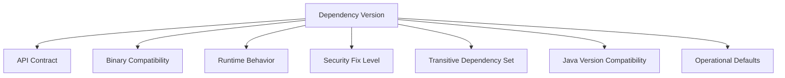
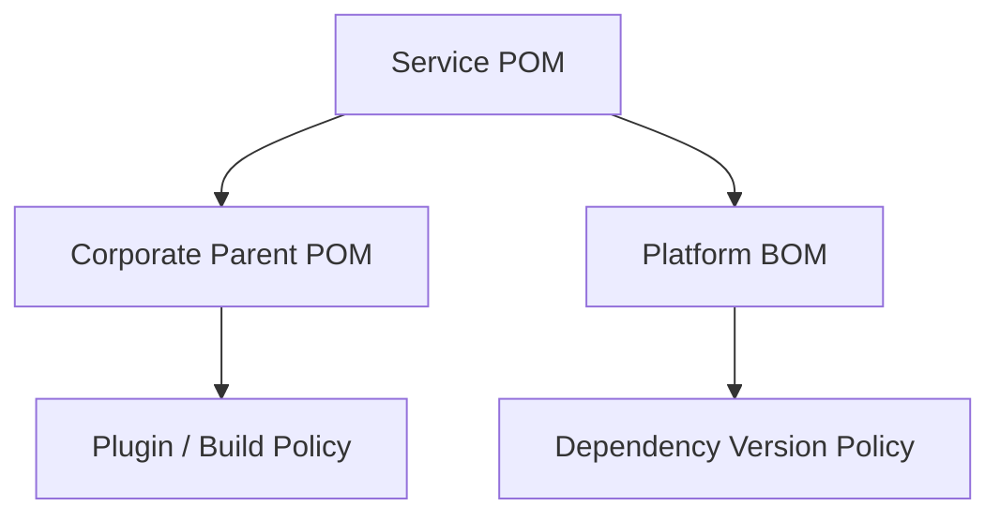
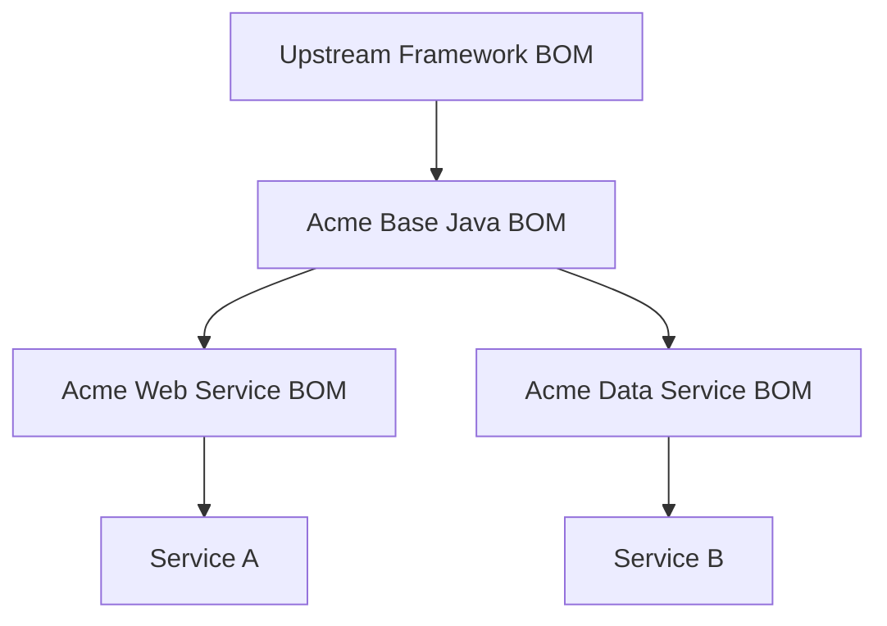
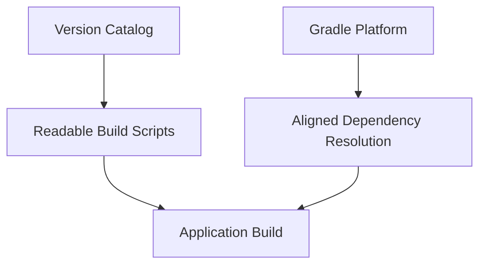

# Part 018 — Versioning, Alignment, BOMs, and Platforms

Part 017 established dependency governance as an operating model.

This part turns that operating model into concrete version-control mechanisms:

- Maven `dependencyManagement`
- Maven BOMs
- Gradle platforms
- Gradle dependency constraints
- Gradle version catalogs
- version alignment policy
- compatibility contracts
- override rules
- drift detection

The core problem is simple:

> In a large Java system, each module can ask for a version, but the organization needs the final resolved graph to be compatible, explainable, upgradeable, and reproducible.

Version alignment is how we prevent a Java ecosystem from becoming a set of unrelated classpaths.

---

## 1. Kaufman Framing

The subskill here is not “knowing what a BOM is”.

The real skill is:

> The ability to define and evolve dependency version policy so that many Java modules can build, test, release, and upgrade consistently without every team hand-managing every library version.

The subskills are:

1. Understand version as compatibility signal.
2. Distinguish application versioning from library versioning.
3. Understand Maven `dependencyManagement`.
4. Use BOMs for version alignment.
5. Understand Gradle platforms and constraints.
6. Distinguish version catalogs from platforms.
7. Design internal dependency baselines.
8. Handle overrides safely.
9. Detect version drift.
10. Upgrade aligned stacks without breaking consumers.

This is one of the highest-leverage build engineering skills because one good platform baseline can improve dozens or hundreds of services.

---

## 2. The Core Mental Model

A dependency version is not just a number.

It is a compatibility claim.



When you choose a version, you also choose:

- public APIs
- transitive versions
- supported Java versions
- bug fixes
- security fixes
- default behavior
- serialization formats
- plugin compatibility
- sometimes performance characteristics

Alignment exists because local version choices can create global inconsistency.

---

## 3. Compatibility Dimensions in Java

Versioning in Java is harder than “major/minor/patch”.

You need to think across several compatibility dimensions.

| Compatibility Type | Meaning | Example Break |
|---|---|---|
| Source compatibility | existing source code still compiles | method renamed or generic signature changed |
| Binary compatibility | existing compiled classes still link | method removed after consumer was compiled |
| Runtime compatibility | behavior remains acceptable | default timeout changes |
| Serialization compatibility | serialized data remains readable | field/type changes in serialized payload |
| Configuration compatibility | config keys and values remain valid | property renamed |
| Transitive compatibility | dependency graph remains consistent | library upgrades incompatible transitive library |
| Java runtime compatibility | works on target JDK | dependency requires newer class file version |
| Operational compatibility | production assumptions remain valid | thread model, memory, startup, network behavior changes |

A top-tier engineer asks all of these before a platform upgrade.

---

## 4. Semantic Versioning: Useful but Not Sufficient

Semantic Versioning says that versions communicate compatibility based on a public API contract:

- major changes indicate incompatible API changes
- minor changes add functionality in a backward-compatible way
- patch changes provide backward-compatible bug fixes

That model is useful.

But Java systems need more caution.

A minor version can still break you if:

- behavior changes
- transitive dependencies change
- reflection behavior changes
- serialization changes
- configuration defaults change
- generated code changes
- framework integration changes
- Java baseline changes

So use Semantic Versioning as a signal, not as proof.

Practical rule:

> Treat major upgrades as migration projects, minor upgrades as compatibility events, and patch upgrades as low-risk only when tests and release notes support that assumption.

---

## 5. Maven Version Alignment

Maven has two important concepts:

1. Declaring a dependency.
2. Managing a dependency version.

A dependency declaration says:

> This module uses this dependency.

A dependency management entry says:

> If this dependency is used, this is the version or metadata to apply.

That distinction is essential.

### 5.1 Bad Pattern: Version Everywhere

```xml
<dependencies>
  <dependency>
    <groupId>com.fasterxml.jackson.core</groupId>
    <artifactId>jackson-databind</artifactId>
    <version>2.17.0</version>
  </dependency>
</dependencies>
```

This is fine for small projects, but it does not scale across many modules.

When every module declares versions locally, alignment becomes manual.

### 5.2 Better Pattern: Version Managed Centrally

```xml
<dependencyManagement>
  <dependencies>
    <dependency>
      <groupId>com.fasterxml.jackson.core</groupId>
      <artifactId>jackson-databind</artifactId>
      <version>2.17.0</version>
    </dependency>
  </dependencies>
</dependencyManagement>

<dependencies>
  <dependency>
    <groupId>com.fasterxml.jackson.core</groupId>
    <artifactId>jackson-databind</artifactId>
  </dependency>
</dependencies>
```

The module declares usage. The parent or platform declares the version policy.

This is the Maven baseline pattern.

---

## 6. Maven BOM

A BOM is a POM whose primary purpose is dependency version management.

BOM means “Bill of Materials”.

It defines a curated set of dependency versions intended to work together.

### 6.1 BOM Producer

```xml
<project>
  <modelVersion>4.0.0</modelVersion>

  <groupId>com.acme.platform</groupId>
  <artifactId>acme-java-platform-bom</artifactId>
  <version>2026.06.0</version>
  <packaging>pom</packaging>

  <dependencyManagement>
    <dependencies>
      <dependency>
        <groupId>com.fasterxml.jackson.core</groupId>
        <artifactId>jackson-databind</artifactId>
        <version>2.17.0</version>
      </dependency>

      <dependency>
        <groupId>org.slf4j</groupId>
        <artifactId>slf4j-api</artifactId>
        <version>2.0.13</version>
      </dependency>
    </dependencies>
  </dependencyManagement>
</project>
```

### 6.2 BOM Consumer

```xml
<dependencyManagement>
  <dependencies>
    <dependency>
      <groupId>com.acme.platform</groupId>
      <artifactId>acme-java-platform-bom</artifactId>
      <version>2026.06.0</version>
      <type>pom</type>
      <scope>import</scope>
    </dependency>
  </dependencies>
</dependencyManagement>
```

Then module dependencies can omit versions:

```xml
<dependencies>
  <dependency>
    <groupId>com.fasterxml.jackson.core</groupId>
    <artifactId>jackson-databind</artifactId>
  </dependency>
</dependencies>
```

The consuming module still chooses what it uses. The BOM chooses compatible versions.

---

## 7. BOM vs Parent POM

Do not confuse BOM with parent POM.

| Concept | Purpose |
|---|---|
| Parent POM | inheritance of build config, plugin management, properties, dependency management |
| BOM | importable dependency version alignment |
| Aggregator POM | groups modules for reactor build |

A parent POM can contain dependency management.
A BOM is specifically designed to be imported by many independent projects.

### Practical Guidance

Use parent POM when:

- modules belong to the same repository/build
- build configuration should be inherited
- plugin versions and build rules must be shared

Use BOM when:

- independent services need dependency alignment
- libraries should consume version policy without inheriting build config
- multiple repos need the same dependency baseline
- you want to publish dependency policy as a standalone artifact

In enterprise systems, you often need both.



---

## 8. BOM Layering

BOMs can be layered.

Example:



Possible BOM layers:

1. **Upstream framework BOM** — provided by framework vendor/project.
2. **Organization base BOM** — organization-wide Java baseline.
3. **Capability BOM** — web, data, messaging, batch, streaming.
4. **Product-line BOM** — specific domain/product alignment.
5. **Service local overrides** — temporary and documented only.

Layering should remain shallow.

Too many BOM layers make version origin hard to understand.

---

## 9. Maven BOM Ordering and Override Rules

In Maven, BOM import order and dependency management location matter.

Practical rules:

1. The effective POM is the source of truth.
2. Local `dependencyManagement` can override imported BOM versions.
3. Multiple BOM imports can create subtle precedence issues.
4. Direct dependency versions override managed versions for that declaration.
5. Transitive versions are mediated according to Maven dependency resolution rules.

Use:

```bash
./mvnw help:effective-pom
./mvnw dependency:tree -Dverbose
```

A top-tier engineer does not guess which version Maven used. They inspect the effective model and resolved tree.

---

## 10. Gradle Version Alignment

Gradle gives several mechanisms:

- dependency constraints
- platforms
- enforced platforms
- version catalogs
- dependency locking
- rich versions
- capabilities

Do not collapse these into one concept.

They solve different problems.

---

## 11. Gradle Platforms

A Gradle platform is a component that controls dependency versions through constraints.

It can be consumed by multiple projects.

### 11.1 Platform Producer

```kotlin
plugins {
    `java-platform`
}

javaPlatform {
    allowDependencies()
}

dependencies {
    constraints {
        api("com.fasterxml.jackson.core:jackson-databind:2.17.0")
        api("org.slf4j:slf4j-api:2.0.13")
    }
}
```

### 11.2 Platform Consumer

```kotlin
dependencies {
    implementation(platform("com.acme.platform:acme-java-platform:2026.06.0"))
    implementation("com.fasterxml.jackson.core:jackson-databind")
}
```

The platform supplies version constraints. The dependency declaration supplies usage.

This mirrors the same core idea as Maven BOMs.

---

## 12. `platform` vs `enforcedPlatform`

Gradle has two important consumption modes.

### `platform`

```kotlin
implementation(platform("com.acme.platform:acme-java-platform:2026.06.0"))
```

This recommends/participates in version alignment.

It is usually the right default.

### `enforcedPlatform`

```kotlin
implementation(enforcedPlatform("com.acme.platform:acme-java-platform:2026.06.0"))
```

This forces versions more aggressively.

Use carefully.

`enforcedPlatform` can be useful for applications where you own the final runtime graph. It can be dangerous for libraries because it can impose forced versions on consumers.

Practical rule:

> Prefer `platform` for libraries. Use `enforcedPlatform` only when you intentionally control the final application classpath.

---

## 13. Dependency Constraints

A dependency constraint says:

> If this module appears in the graph, apply this version requirement.

It does not necessarily add the dependency by itself.

Example:

```kotlin
dependencies {
    constraints {
        implementation("com.google.guava:guava:33.2.1-jre") {
            because("Align Guava across services and avoid older transitive versions")
        }
    }
}
```

Constraints are useful for:

- aligning transitive dependencies
- preventing older unsafe versions
- documenting version reasons
- building platforms
- avoiding version declarations everywhere

Constraints are governance tools.

---

## 14. Gradle Version Catalogs

A version catalog centralizes dependency coordinates and versions for build scripts.

Example:

```toml
[versions]
jackson = "2.17.0"
slf4j = "2.0.13"

[libraries]
jackson-databind = { module = "com.fasterxml.jackson.core:jackson-databind", version.ref = "jackson" }
slf4j-api = { module = "org.slf4j:slf4j-api", version.ref = "slf4j" }
```

Consumer:

```kotlin
dependencies {
    implementation(libs.jackson.databind)
    implementation(libs.slf4j.api)
}
```

Version catalogs improve build-script maintainability.

But a catalog is not the same as a platform.

---

## 15. Version Catalog vs Platform

| Mechanism | Main Purpose | Affects Resolution? | Published as Alignment Artifact? |
|---|---|---:|---:|
| Version catalog | centralize dependency notation for Gradle builds | indirectly, by providing versions in declarations | can be published, but not same as platform constraints |
| Gradle platform | align dependency versions through constraints | yes | yes |
| Maven BOM | align dependency versions through dependency management | yes | yes |
| Parent POM | inherit build/dependency/plugin policy | yes, if dependency management exists | yes, but inheritance-based |

Use version catalogs for build authoring convenience.
Use platforms/BOMs for dependency alignment policy.

A common enterprise Gradle setup uses both:



---

## 16. Designing an Internal Java Platform Baseline

An internal platform baseline is an organization-owned dependency alignment artifact.

It can be implemented as:

- Maven BOM
- Gradle platform
- both, generated from one source of truth
- version catalog plus platform
- parent POM plus BOM

### 16.1 Baseline Contents

A good baseline usually includes:

- logging API and implementation policy
- JSON serialization stack
- HTTP client baseline
- metrics/tracing APIs
- test framework versions
- mocking/assertion libraries
- database drivers
- messaging clients
- validation libraries
- annotation processors
- code generation tool versions
- plugin versions, if parent/convention plugin manages build

Do not include every possible library.

A platform baseline should define the paved road, not the entire internet.

### 16.2 Baseline Exclusions

Usually exclude:

- domain-specific libraries
- experimental libraries
- one-off vendor SDKs
- rarely used utilities
- service-local generated clients
- dependencies with no organization-wide compatibility requirement

---

## 17. Platform Versioning

Your internal platform itself needs a versioning scheme.

Options:

### Semantic Versioning

Example:

```text
3.4.2
```

Good when the platform publishes a compatibility contract.

### Calendar Versioning

Example:

```text
2026.06.0
```

Good when the platform is released on cadence and used as a dependency baseline snapshot.

### Hybrid

Example:

```text
2026.06.0-java21
```

Useful when Java baseline is part of the compatibility contract.

### Recommendation

For internal Java dependency platforms, calendar versioning is often practical:

```text
YYYY.MM.PATCH
```

Example:

```text
2026.06.0
2026.06.1
2026.07.0
```

Because the platform is less like a library API and more like a curated dependency baseline.

---

## 18. Application vs Library Alignment

Applications and libraries should use alignment differently.

### Applications

Applications own their final runtime graph.

They can be stricter.

Application rules:

- use organization platform/BOM
- align all runtime dependencies
- use lockfiles where appropriate
- allow emergency override with waiver
- fail CI on dangerous drift
- inspect final artifact/container image

### Libraries

Libraries do not fully control consumer runtime graphs.

They must be more careful.

Library rules:

- avoid forcing versions on consumers
- minimize API dependencies
- prefer `implementation` over `api` in Gradle
- avoid `enforcedPlatform` unless intentionally publishing a platform
- document compatible ranges where appropriate
- test against supported dependency versions when practical
- avoid leaking implementation libraries into public API

The mistake is treating library builds and application builds the same.

They have different compatibility responsibilities.

---

## 19. Version Override Policy

Overrides are sometimes necessary.

Examples:

- urgent security fix
- bug fix not yet included in platform
- vendor compatibility requirement
- framework migration
- temporary rollback

But unmanaged overrides destroy alignment.

Use this policy:

```md
# Dependency Version Override

Dependency: org.example:some-lib
Managed version: 1.4.2
Override version: 1.4.5
Reason: fixes production bug in connection handling
Owner: team-payments
Approved by: platform-team
Expires: 2026-08-31
Exit plan: remove override after platform 2026.08.0 adopts 1.4.5
```

Rules:

1. Override must have a reason.
2. Override must have an owner.
3. Override must be temporary unless explicitly accepted as permanent.
4. Override must be visible in review.
5. Override must have tests covering the risk.
6. Platform team should absorb valid overrides into the next platform release.

---

## 20. Version Drift Detection

Version drift is when modules/services that should share a baseline diverge.

### Maven Drift Checks

```bash
./mvnw help:effective-pom
./mvnw dependency:tree
./mvnw versions:display-dependency-updates
./mvnw versions:display-plugin-updates
```

Inspect:

- direct versions declared outside BOM
- local dependency management overrides
- inconsistent parent POM versions
- snapshot usage in release builds
- imported BOM order
- exclusions hiding conflicts

### Gradle Drift Checks

```bash
./gradlew dependencies
./gradlew dependencyInsight --dependency <name>
./gradlew buildEnvironment
```

Inspect:

- local versions not from catalog/platform
- constraints that override platform intention
- `enforcedPlatform` usage
- dynamic versions
- lockfile changes
- version catalog changes
- plugin version inconsistencies

### Cross-Repository Drift

For many services, use automation:

- dependency inventory export
- SBOM aggregation
- internal service catalog
- repository scanning
- platform adoption dashboard
- stale platform version alerts
- override expiration alerts

---

## 21. Release Cadence for Dependency Platforms

A platform baseline needs a release cadence.

Possible cadences:

| Cadence | Good For | Risk |
|---|---|---|
| weekly | fast-moving services | update fatigue |
| monthly | balanced enterprise default | moderate lag |
| quarterly | regulated/slow systems | stale dependencies |
| event-driven | security/framework events | unpredictable |

A practical model:

- monthly platform release for normal updates
- emergency patch release for critical security/production bugs
- quarterly larger framework upgrade window
- annual Java baseline review

Example platform release train:

```text
2026.06.0  normal monthly baseline
2026.06.1  urgent patch for security fix
2026.07.0  normal monthly baseline
2026.09.0  larger framework compatibility release
```

---

## 22. Testing a Platform Upgrade

Before publishing a new platform baseline, test it like a product.

### Platform Test Matrix

| Test Type | Purpose |
|---|---|
| Dependency resolution test | ensure graph resolves consistently |
| Compile test | ensure representative services compile |
| Unit test suite | catch source/API breaks |
| Integration test suite | catch runtime behavior breaks |
| Contract tests | catch external API incompatibility |
| Smoke deployment | catch packaging/runtime failures |
| Performance smoke | catch severe startup/memory regressions |
| Security/license scan | ensure baseline is acceptable |

### Representative Consumers

Pick services that cover different shapes:

- simple REST service
- persistence-heavy service
- messaging service
- batch job
- library project
- generated-client-heavy project
- legacy migration project

The platform is not proven by building itself. It is proven by building consumers.

---

## 23. Maven Example: Internal BOM + Service

### `acme-java-platform-bom/pom.xml`

```xml
<project>
  <modelVersion>4.0.0</modelVersion>
  <groupId>com.acme.platform</groupId>
  <artifactId>acme-java-platform-bom</artifactId>
  <version>2026.06.0</version>
  <packaging>pom</packaging>

  <dependencyManagement>
    <dependencies>
      <dependency>
        <groupId>org.slf4j</groupId>
        <artifactId>slf4j-api</artifactId>
        <version>2.0.13</version>
      </dependency>
      <dependency>
        <groupId>com.fasterxml.jackson.core</groupId>
        <artifactId>jackson-databind</artifactId>
        <version>2.17.0</version>
      </dependency>
      <dependency>
        <groupId>org.junit.jupiter</groupId>
        <artifactId>junit-jupiter</artifactId>
        <version>5.10.2</version>
      </dependency>
    </dependencies>
  </dependencyManagement>
</project>
```

### Service POM

```xml
<project>
  <modelVersion>4.0.0</modelVersion>

  <groupId>com.acme.payments</groupId>
  <artifactId>payment-service</artifactId>
  <version>1.8.0</version>

  <dependencyManagement>
    <dependencies>
      <dependency>
        <groupId>com.acme.platform</groupId>
        <artifactId>acme-java-platform-bom</artifactId>
        <version>2026.06.0</version>
        <type>pom</type>
        <scope>import</scope>
      </dependency>
    </dependencies>
  </dependencyManagement>

  <dependencies>
    <dependency>
      <groupId>org.slf4j</groupId>
      <artifactId>slf4j-api</artifactId>
    </dependency>
    <dependency>
      <groupId>com.fasterxml.jackson.core</groupId>
      <artifactId>jackson-databind</artifactId>
    </dependency>
    <dependency>
      <groupId>org.junit.jupiter</groupId>
      <artifactId>junit-jupiter</artifactId>
      <scope>test</scope>
    </dependency>
  </dependencies>
</project>
```

The service declares usage. The BOM declares versions.

---

## 24. Gradle Example: Internal Platform + Version Catalog

### Platform Build

```kotlin
plugins {
    `java-platform`
    `maven-publish`
}

group = "com.acme.platform"
version = "2026.06.0"

javaPlatform {
    allowDependencies()
}

dependencies {
    constraints {
        api("org.slf4j:slf4j-api:2.0.13") {
            because("Organization logging API baseline")
        }
        api("com.fasterxml.jackson.core:jackson-databind:2.17.0") {
            because("Organization JSON baseline")
        }
        api("org.junit.jupiter:junit-jupiter:5.10.2") {
            because("Organization test baseline")
        }
    }
}
```

### Version Catalog

```toml
[libraries]
slf4j-api = { module = "org.slf4j:slf4j-api" }
jackson-databind = { module = "com.fasterxml.jackson.core:jackson-databind" }
junit-jupiter = { module = "org.junit.jupiter:junit-jupiter" }
```

### Service Build

```kotlin
dependencies {
    implementation(platform("com.acme.platform:acme-java-platform:2026.06.0"))

    implementation(libs.slf4j.api)
    implementation(libs.jackson.databind)
    testImplementation(libs.junit.jupiter)
}
```

The version catalog makes dependencies readable. The platform aligns versions.

---

## 25. Dynamic Versions and Ranges

Avoid dynamic versions in release builds.

Examples to avoid:

```kotlin
implementation("org.example:lib:1.+")
implementation("org.example:lib:latest.release")
```

Maven range example:

```xml
<version>[1.0,2.0)</version>
```

Version ranges can be useful for libraries in some ecosystems, but in enterprise Java release builds they often reduce reproducibility.

Practical rule:

> Release builds should resolve from pinned, reviewable, auditable versions.

Use bots and platform releases to update pins intentionally instead of letting builds float unpredictably.

---

## 26. Lockfiles and Alignment

Alignment and locking solve different problems.

| Mechanism | Solves |
|---|---|
| BOM/platform | what versions should be used |
| lockfile | what versions were resolved at a point in time |
| catalog | how build authors refer to dependencies |
| scanner | whether resolved versions are acceptable |

A lockfile without a platform can freeze chaos.
A platform without locking can still allow resolution changes if metadata or transitive constraints change.

For applications, use both when reproducibility matters.

---

## 27. Failure Modes

| Failure Mode | Cause | Symptom | Prevention |
|---|---|---|---|
| Split-brain versions | local versions override platform | different services behave differently | drift checks and override policy |
| BOM overload | BOM contains too many unrelated deps | hard to reason and upgrade | keep platform scoped |
| Forced platform leakage | library uses enforced platform | consumers get unexpected versions | avoid enforced platform in libraries |
| Version catalog mistaken for platform | catalog centralizes strings only | resolution still diverges | use platform/BOM for alignment |
| Stale platform | baseline not upgraded | old vulnerabilities and bugs | release cadence and adoption dashboard |
| Override rot | temporary overrides never removed | alignment decays | expiring waivers |
| Major upgrade treated as patch | blind SemVer trust | runtime or source breakage | migration plan and test matrix |
| Too many BOM layers | unclear version origin | debugging complexity | shallow hierarchy and effective model inspection |
| Dynamic versions in release | floating resolution | non-reproducible builds | pin and lock release dependencies |

---

## 28. Decision Matrix

| Situation | Recommended Mechanism |
|---|---|
| Maven multi-repo services need shared versions | published BOM |
| Maven same-repo modules need build + dependency policy | parent POM + dependencyManagement |
| Gradle services need shared aligned versions | Gradle platform |
| Gradle build scripts need readable aliases | version catalog |
| Gradle app must fully control runtime versions | platform, possibly enforcedPlatform with care |
| Gradle library published to others | platform only if appropriate; avoid forced versions |
| Organization wants Maven and Gradle support | publish both BOM and Gradle platform from shared source |
| Need reproducible application resolution | platform/BOM + lockfiles |
| Need temporary security override | local override with expiring waiver |

---

## 29. Deliberate Practice

### Drill 1 — Build an Effective BOM

Create a small Maven BOM with:

- logging API
- JSON library
- test framework
- database driver

Consume it from two services.

Then upgrade one library in the BOM and confirm both services align after changing only the BOM version.

### Drill 2 — Build a Gradle Platform

Create a Gradle `java-platform` project.

Add constraints for:

- JSON
- logging
- test framework
- HTTP client

Consume it from two subprojects.

Use `dependencyInsight` to verify selected versions.

### Drill 3 — Catalog vs Platform

Create a version catalog without a platform.

Then create a platform without a catalog.

Observe the difference:

- catalog improves declaration ergonomics
- platform affects resolution alignment

This drill prevents a common misunderstanding.

### Drill 4 — Override with Expiry

Introduce a local override for one dependency.

Document:

- reason
- owner
- expiration
- exit plan

Then create a CI check or review checklist that detects the override.

### Drill 5 — Platform Upgrade Test

Take a representative service and upgrade platform version.

Run:

- dependency tree
- compile
- unit tests
- integration tests
- artifact inspection
- smoke deployment

Write down every failure and classify it as source, binary, runtime, configuration, or transitive compatibility.

---

## 30. Final Checklist

A healthy Java version alignment system has:

- [ ] clear dependency ownership
- [ ] central BOM/platform for shared dependencies
- [ ] limited local version declarations
- [ ] explicit override policy
- [ ] shallow BOM/platform layering
- [ ] documented platform release cadence
- [ ] application/library distinction
- [ ] compatibility test matrix
- [ ] drift detection
- [ ] reproducible release resolution
- [ ] SBOM/scanner integration
- [ ] upgrade and rollback path
- [ ] dashboard or inventory for platform adoption

---

## 31. Key Takeaways

Version alignment is not cosmetic.

It is how large Java organizations prevent dependency entropy.

Remember these principles:

1. Dependency versions are compatibility claims.
2. Maven BOMs and Gradle platforms encode version policy.
3. Version catalogs improve authoring, but do not replace platforms.
4. Applications and libraries have different alignment responsibilities.
5. Overrides must be visible, owned, and temporary.
6. Platform baselines should be released and tested like products.
7. Reproducibility requires both alignment and pinned/locked resolution.
8. The effective/resolved graph is the truth.

In Part 019, we move from version policy to artifact infrastructure: repositories, registries, artifact storage, snapshots, release repositories, mirrors, credentials, and retention.

---

## References

- Apache Maven — Introduction to the Dependency Mechanism: https://maven.apache.org/guides/introduction/introduction-to-dependency-mechanism.html
- Gradle User Manual — Platforms: https://docs.gradle.org/current/userguide/platforms.html
- Gradle User Manual — How to Align Dependency Versions: https://docs.gradle.org/current/userguide/how_to_align_dependency_versions.html
- Gradle User Manual — Declaring Dependency Constraints: https://docs.gradle.org/current/userguide/dependency_constraints.html
- Gradle User Manual — Version Catalogs: https://docs.gradle.org/current/userguide/version_catalogs.html
- Semantic Versioning 2.0.0: https://semver.org/
