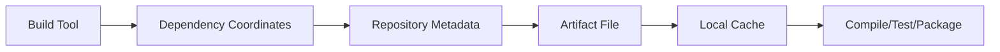
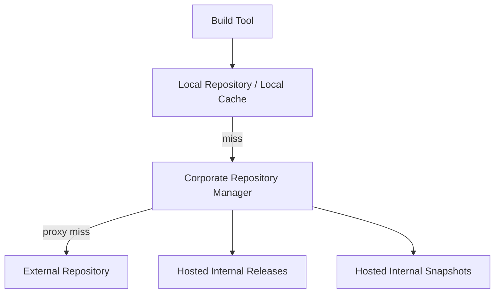
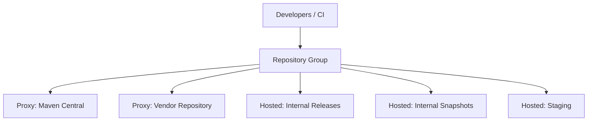
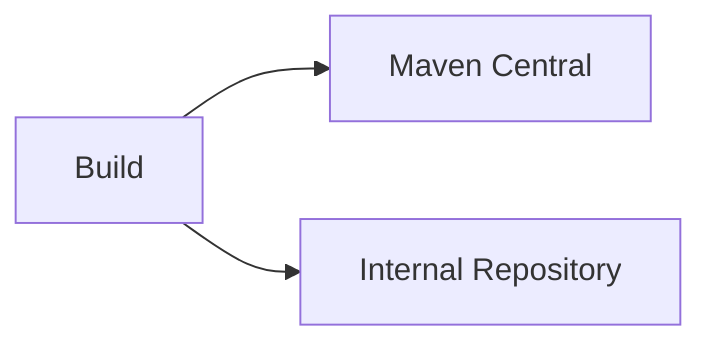
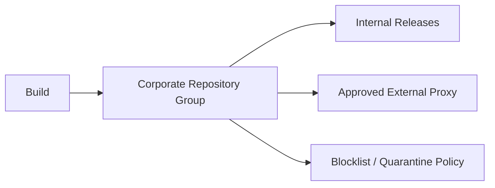
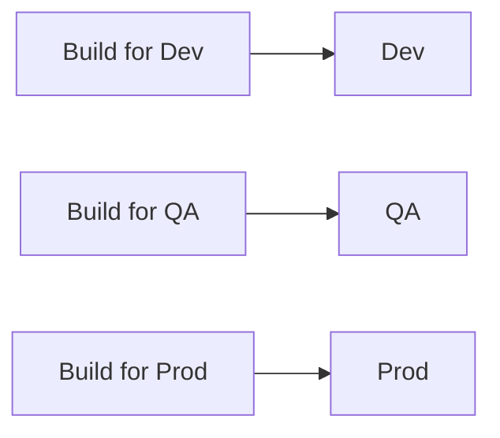
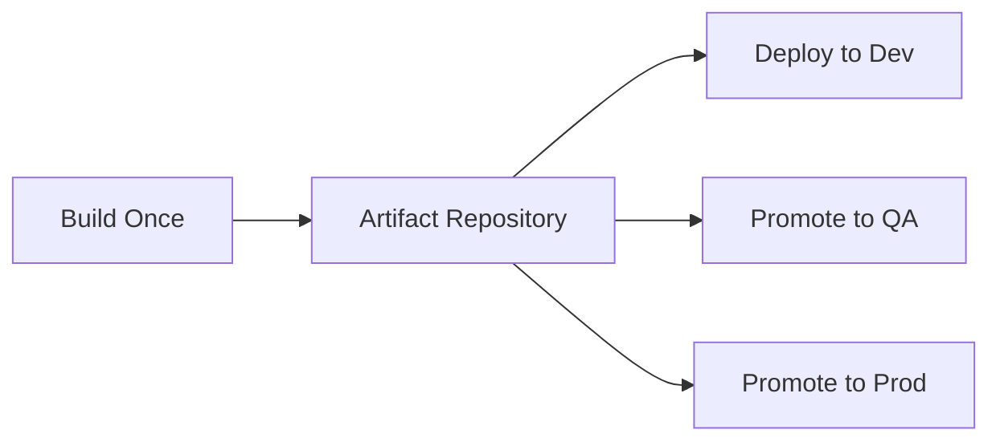
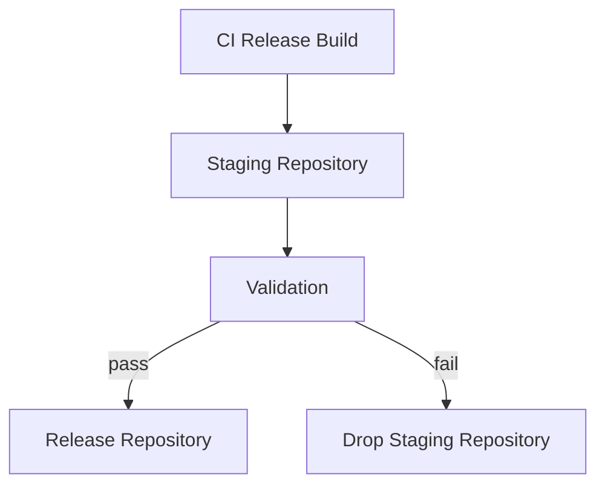
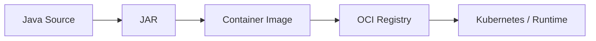
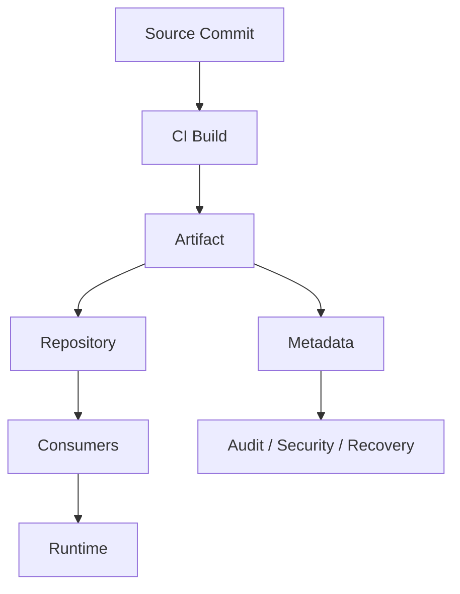

# Part 019 — Repositories, Registries, and Artifact Storage

Part 018 explained how dependency versions are aligned through BOMs, platforms, constraints, and version catalogs.

This part focuses on the next layer:

> Where do those artifacts live, how are they discovered, how are they cached, how are they promoted, and how does an enterprise prevent artifact storage from becoming an uncontrolled supply-chain dependency?

A Java build does not depend only on source code and build scripts. It depends on a distributed artifact system:

- local developer cache
- CI cache
- private repository manager
- external repositories
- release repository
- snapshot repository
- plugin repository
- container registry
- artifact metadata
- credentials and access policy
- retention and disaster recovery

For top-tier engineering, artifact repositories are not just storage. They are part of the production delivery architecture.

---

## 1. Kaufman Framing

The subskill here is not “knowing where Maven Central is”.

The real skill is:

> The ability to design, operate, and reason about artifact repositories as controlled distribution infrastructure for build, release, dependency resolution, auditability, and recovery.

Break the skill into smaller parts:

1. Understand Maven repository layout.
2. Understand coordinates as artifact address.
3. Understand release vs snapshot semantics.
4. Understand repository metadata.
5. Understand local vs remote repository behavior.
6. Understand private repository managers.
7. Separate repository roles: proxy, hosted, group, staging, release, snapshot.
8. Design mirror and repository policy.
9. Publish artifacts safely from Maven and Gradle.
10. Protect credentials and publishing rights.
11. Retain artifacts according to release and audit needs.
12. Recover from upstream outage or repository corruption.
13. Detect and prevent dependency confusion.
14. Treat artifact storage as a system of record.

A weak engineer asks:

> Which repository URL should I add?

A strong engineer asks:

> What trust boundary am I crossing, what metadata am I depending on, what artifact immutability guarantees do I have, and can I rebuild or redeploy safely if this repository fails?

---

## 2. Core Mental Model

A repository is an addressable graph of immutable or semi-mutable build outputs.



The build does not magically “download dependencies”.

It executes a resolution process:

1. read declared coordinates
2. find metadata
3. choose version
4. locate artifact file
5. verify checksum/signature if configured
6. place artifact in local cache
7. construct classpath or module path
8. execute build tasks or lifecycle phases

For Maven-compatible repositories, the address is usually derived from:

```text
groupId:artifactId:version[:classifier]:packaging
```

Example:

```text
com.acme.payment:payment-api:1.4.2:jar
```

This becomes a repository path similar to:

```text
/com/acme/payment/payment-api/1.4.2/payment-api-1.4.2.jar
/com/acme/payment/payment-api/1.4.2/payment-api-1.4.2.pom
```

The repository is not just storing a file. It stores a consumable contract:

- artifact binary
- POM metadata
- Gradle module metadata, when published
- checksums
- signatures, when used
- snapshot metadata
- version metadata
- plugin metadata

---

## 3. Maven Repository Layout

Maven repository layout is coordinate-driven.

Given:

```xml
<groupId>org.example</groupId>
<artifactId>billing-core</artifactId>
<version>2.7.0</version>
<packaging>jar</packaging>
```

The repository stores:

```text
org/example/billing-core/2.7.0/billing-core-2.7.0.jar
org/example/billing-core/2.7.0/billing-core-2.7.0.pom
```

For a source JAR:

```text
org/example/billing-core/2.7.0/billing-core-2.7.0-sources.jar
```

For Javadoc:

```text
org/example/billing-core/2.7.0/billing-core-2.7.0-javadoc.jar
```

For test fixtures or classified artifacts:

```text
org/example/billing-core/2.7.0/billing-core-2.7.0-tests.jar
```

The path is deterministic.

This matters because repository storage is not arbitrary. It is a protocol-level contract between producers and consumers.

---

## 4. Artifact Coordinates as Address and Contract

Coordinates identify an artifact, but they also communicate ownership and compatibility.

```text
groupId     = ownership namespace
artifactId  = artifact identity
version     = compatibility/release identity
packaging   = artifact type
classifier  = artifact variant
```

Good coordinates are stable.

Bad coordinates leak implementation details or temporary team structures.

### Strong coordinate examples

```text
com.acme.identity:identity-api:3.2.1
com.acme.identity:identity-client-java:3.2.1
com.acme.billing:invoice-domain:2.8.0
com.acme.platform:java-service-bom:2026.06.0
```

### Weak coordinate examples

```text
com.acme.team-a:new-common-utils:1.0
com.acme.temp:stuff:0.0.1
com.acme.oldproject:shared:latest
```

The problem with weak coordinates is not aesthetics. It is governance failure.

When coordinates are unclear, dependency ownership becomes unclear. When ownership is unclear, security review, upgrade decisions, compatibility policy, and incident response become slower.

---

## 5. Local Repository and Remote Repositories

Java builds usually operate with at least two repository layers.



### Local repository

For Maven, the local repository is commonly:

```text
~/.m2/repository
```

For Gradle, downloaded dependencies are stored in Gradle's user home cache, commonly under:

```text
~/.gradle/caches
```

The local cache improves speed but can hide problems:

- stale snapshot exists locally
- corrupted artifact exists locally
- build works locally but fails on clean CI
- developer machine has unpublished local artifact
- dependency resolution differs between machines

### Remote repository

A remote repository is any source used to resolve artifacts:

- Maven Central
- private Nexus/Artifactory/CodeArtifact/Cloudsmith-style repository
- GitHub Packages
- vendor repository
- internal staging repository

A mature Java build should not let every project define arbitrary remote repositories.

Remote repository access is a supply-chain decision.

---

## 6. Release Repository vs Snapshot Repository

Release and snapshot repositories should be separated.

### Release repository

A release repository stores immutable artifacts.

Example versions:

```text
1.0.0
1.0.1
2.4.0
2026.06.0
```

Expected properties:

- immutable after publish
- auditable
- retained for long periods
- used by production builds
- eligible for promotion
- tied to release notes and source tags

### Snapshot repository

A snapshot repository stores changing development artifacts.

Example version:

```text
1.0.0-SNAPSHOT
```

Expected properties:

- mutable or repeatedly updated
- used for integration during development
- not used for production release inputs
- shorter retention
- not a compliance-grade release record

The invariant:

> A production release must not depend on changing snapshot artifacts.

This sounds obvious, but many enterprise outages start with some version of this mistake.

---

## 7. Snapshot Semantics

A Maven `SNAPSHOT` version is not one artifact. It is a moving version label.

For example:

```text
payment-api-1.2.0-SNAPSHOT.jar
```

may resolve to timestamped artifacts internally:

```text
payment-api-1.2.0-20260629.101500-1.jar
payment-api-1.2.0-20260629.113000-2.jar
```

The base version remains:

```text
1.2.0-SNAPSHOT
```

but the actual artifact may change over time.

This creates several risks:

| Risk | Explanation |
|---|---|
| Non-reproducible build | Same source resolves different snapshot later |
| Hidden integration drift | API changes without version bump |
| CI inconsistency | Local cache may hold older snapshot |
| Promotion failure | Artifact used in test is not identical to artifact used later |
| Audit weakness | Harder to prove exactly what was built |

Snapshot dependencies can be useful for short-lived integration, but they should be forbidden from release builds.

### Snapshot policy

A pragmatic policy:

| Context | Snapshot allowed? |
|---|---:|
| Local feature exploration | Yes, with caution |
| Pull request build | Usually no |
| Main branch integration | Only for explicitly marked integration repositories |
| Release candidate | No |
| Production release | No |
| Regulated system build | No |

---

## 8. Repository Metadata

Repositories also contain metadata files.

Maven uses `maven-metadata.xml` for discovery-like operations, such as available versions and snapshot resolution.

Example simplified metadata:

```xml
<metadata>
  <groupId>com.acme.payment</groupId>
  <artifactId>payment-api</artifactId>
  <versioning>
    <latest>1.4.0</latest>
    <release>1.4.0</release>
    <versions>
      <version>1.2.0</version>
      <version>1.3.0</version>
      <version>1.4.0</version>
    </versions>
  </versioning>
</metadata>
```

Metadata matters because resolution sometimes depends on it.

Problems that can occur:

- stale metadata after repository outage
- corrupted metadata after interrupted publish
- inconsistent metadata between mirrors
- snapshot metadata not updated
- local cache contains stale metadata
- repository manager indexes are out of sync

A mature build system treats metadata as part of artifact integrity, not as incidental XML.

---

## 9. Repository Manager Roles

A private repository manager usually provides several repository types.



### Proxy repository

A proxy repository caches artifacts from an upstream repository.

Example:

```text
corporate-maven-central-proxy -> Maven Central
```

Benefits:

- faster builds
- reduced external dependency on each build
- centralized access logging
- central blocking/quarantine
- repeatability if upstream is temporarily down

Risks:

- stale or poisoned cache
- blind trust in external upstream
- hidden use of unapproved libraries
- cache eviction breaking historical builds

### Hosted repository

A hosted repository stores artifacts produced by the organization.

Examples:

```text
internal-releases
internal-snapshots
internal-staging
internal-platform-boms
```

### Group repository

A group repository exposes multiple repositories behind one URL.

Example:

```text
https://repo.acme.internal/maven/all
```

This may include:

1. internal releases
2. internal snapshots
3. approved vendor repositories
4. Maven Central proxy

Group repositories improve developer experience but can hide resolution priority.

The order matters.

---

## 10. Resolution Priority and Dependency Confusion

Dependency confusion happens when a build resolves a package from the wrong source, often because an external repository contains a package name matching an internal dependency name.

For Java/Maven-style repositories, the risk depends on:

- repository order
- mirror configuration
- whether internal groupIds are reserved
- whether external repositories are blocked from serving internal namespaces
- whether publishing policy prevents namespace collision
- whether dependency verification is used

### Dangerous setup



If external repositories are checked before internal repositories, a malicious or accidental coordinate collision can become dangerous.

### Safer setup



The build should generally know only the corporate repository endpoint.

The repository manager decides what upstreams are allowed.

### Namespace policy

Example:

```text
com.acme.* must only resolve from internal repositories.
org.acmefoundation.* must only resolve from approved external upstream.
```

A top-tier organization can enforce this with repository routing rules, proxy blocking, dependency verification, and CI policy.

---

## 11. Repository Configuration in Maven

Maven can receive repository configuration from multiple places:

- project `pom.xml`
- parent POM
- settings file
- corporate settings template
- CI injected settings
- plugin repositories

Example POM repository declaration:

```xml
<repositories>
  <repository>
    <id>internal-releases</id>
    <url>https://repo.acme.internal/maven/releases</url>
    <releases>
      <enabled>true</enabled>
    </releases>
    <snapshots>
      <enabled>false</enabled>
    </snapshots>
  </repository>
</repositories>
```

In enterprise systems, avoid letting each project add arbitrary repositories in its POM.

Prefer a corporate `settings.xml` with a mirror:

```xml
<settings>
  <mirrors>
    <mirror>
      <id>acme-all</id>
      <mirrorOf>*</mirrorOf>
      <url>https://repo.acme.internal/maven/all</url>
    </mirror>
  </mirrors>
</settings>
```

This makes all resolution flow through the corporate repository manager.

### Plugin repositories

Maven plugins are resolved separately from project dependencies.

That means this is not enough:

```xml
<repositories>...</repositories>
```

You may also need:

```xml
<pluginRepositories>...</pluginRepositories>
```

or a mirror that covers both dependency and plugin resolution.

A common enterprise failure is to lock down dependencies but forget plugin resolution.

---

## 12. Repository Configuration in Gradle

Gradle repositories are declared in build scripts or centralized in settings.

Example:

```kotlin
repositories {
    maven {
        url = uri("https://repo.acme.internal/maven/all")
    }
}
```

For stronger governance, centralize repository policy in `settings.gradle.kts`:

```kotlin
dependencyResolutionManagement {
    repositoriesMode.set(RepositoriesMode.FAIL_ON_PROJECT_REPOS)
    repositories {
        maven {
            name = "acme"
            url = uri("https://repo.acme.internal/maven/all")
        }
    }
}
```

This prevents subprojects from adding arbitrary repositories.

Plugin repositories should also be controlled:

```kotlin
pluginManagement {
    repositories {
        maven {
            url = uri("https://repo.acme.internal/gradle/plugins")
        }
        gradlePluginPortal()
    }
}
```

In strict environments, even the Gradle Plugin Portal should be proxied through an internal repository manager.

---

## 13. Publishing Internal Libraries with Maven

A Maven library publication usually includes:

- main JAR
- POM
- source JAR
- Javadoc JAR
- checksums
- signatures, when required

Basic publication configuration:

```xml
<distributionManagement>
  <repository>
    <id>internal-releases</id>
    <url>https://repo.acme.internal/maven/releases</url>
  </repository>
  <snapshotRepository>
    <id>internal-snapshots</id>
    <url>https://repo.acme.internal/maven/snapshots</url>
  </snapshotRepository>
</distributionManagement>
```

The `id` connects to credentials in `settings.xml`:

```xml
<servers>
  <server>
    <id>internal-releases</id>
    <username>${env.REPO_USERNAME}</username>
    <password>${env.REPO_PASSWORD}</password>
  </server>
</servers>
```

For enterprise release pipelines, publishing should usually happen from CI only.

Do not allow developers to publish official release artifacts from laptops.

---

## 14. Publishing Internal Libraries with Gradle

Gradle commonly uses the `maven-publish` plugin.

```kotlin
plugins {
    `java-library`
    `maven-publish`
}

publishing {
    publications {
        create<MavenPublication>("mavenJava") {
            from(components["java"])
            groupId = "com.acme.payment"
            artifactId = "payment-api"
            version = project.version.toString()
        }
    }
    repositories {
        maven {
            name = "internal"
            url = uri("https://repo.acme.internal/maven/releases")
            credentials {
                username = providers.environmentVariable("REPO_USERNAME").orNull
                password = providers.environmentVariable("REPO_PASSWORD").orNull
            }
        }
    }
}
```

In real systems, this should usually be wrapped in an internal convention plugin:

```kotlin
plugins {
    id("com.acme.java-library-publishing")
}
```

The convention plugin should enforce:

- groupId pattern
- artifactId rules
- source JAR generation
- Javadoc JAR policy
- signing policy
- repository selection
- version format
- release vs snapshot routing
- metadata requirements

---

## 15. Artifact Promotion Model

A mature release process avoids rebuilding artifacts between environments.

Bad model:



Good model:



The invariant:

> Promotion should move trust, not rebuild bytes.

For Java libraries, this means the same JAR should be promoted.

For Java services, this may mean the same container image digest should be promoted.

For release metadata, this means the same SBOM, provenance, and checksums should follow the artifact.

---

## 16. Staging Repositories

A staging repository is a temporary holding area for candidate release artifacts.

Use cases:

- collect all artifacts for a release
- validate metadata
- verify signatures
- run smoke tests
- perform manual approval
- close and promote repository
- drop failed staging repository



Staging is especially important for multi-module releases.

If a release publishes 40 artifacts, partial publication is dangerous. A staging repository lets the release be validated as a set before it becomes consumable.

---

## 17. Artifact Immutability

A release artifact should be immutable after publication.

That means:

- do not overwrite release versions
- do not delete and republish same version
- do not repair bad releases in-place
- publish a new patch version instead
- keep source tag and artifact aligned
- keep build metadata attached

### Why immutability matters

If `billing-core:1.4.2` can change after publication, then:

- historical builds are not reproducible
- audits become unreliable
- rollbacks may not return to the same code
- checksum verification becomes noisy
- debugging production incidents becomes harder

The correct fix for a bad artifact is:

```text
1.4.2 is bad
publish 1.4.3
mark 1.4.2 as revoked/deprecated/quarantined
```

Do not rewrite history.

---

## 18. Repository Credentials and Access Control

Repository access has two broad modes:

1. read access for dependency resolution
2. write access for publication

These should not use the same credential.

### Minimal policy

| Actor | Read dependencies | Publish snapshots | Publish releases | Admin |
|---|---:|---:|---:|---:|
| Developer laptop | Yes | Sometimes | No | No |
| Pull request CI | Yes | No | No | No |
| Main branch CI | Yes | Maybe | No | No |
| Release CI | Yes | Yes | Yes | No |
| Repository admin | Yes | Yes | Yes | Yes |

### Credential rules

- no repository passwords in source code
- no credentials in checked-in `settings.xml`
- no broad admin token in CI build jobs
- separate read and publish credentials
- rotate credentials
- use short-lived tokens if possible
- scope credentials to repository/path
- audit publication events

A compromised release credential is a supply-chain incident.

Treat it like production access.

---

## 19. Repository Retention Policy

Artifact retention is not just a storage-cost decision.

It affects:

- reproducibility
- rollback capability
- audit history
- vulnerability investigation
- customer support
- disaster recovery
- compliance evidence

### Suggested retention model

| Artifact Type | Retention |
|---|---|
| Production releases | Long-term / regulatory period |
| Release candidates | Until superseded plus investigation window |
| Snapshots | Short-term, e.g. days/weeks |
| Failed staging artifacts | Short-term |
| Build caches | Short-term, performance-only |
| SBOM/provenance/signatures | Same as release artifact |
| Deprecated but deployed versions | Retain while any environment may need rollback |

Never apply the same cleanup rule to snapshots and releases.

---

## 20. Repository as System of Record

A release repository is a system of record for binaries.

It should answer:

- What artifact was released?
- Who published it?
- When was it published?
- From which source commit?
- Which CI workflow built it?
- Which dependencies were included?
- Was it signed?
- What SBOM belongs to it?
- What environment consumed it?
- Is it still approved?
- Is it affected by a known vulnerability?

A plain file store is usually not enough for this operating model.

You need metadata discipline.

---

## 21. Handling External Repository Outage

If Maven Central or another upstream repository is unavailable, your builds should not all fail immediately.

A corporate proxy cache helps, but only if:

- dependencies were already cached
- retention does not evict needed artifacts
- plugin artifacts are cached too
- metadata cache policy is sane
- CI does not bypass the proxy

### Outage test

A mature team periodically asks:

> Can we build and redeploy critical services if the public internet or Maven Central is unavailable for 24 hours?

If the answer is no, artifact availability is part of your operational risk.

---

## 22. Repository Corruption and Recovery

Repository corruption can happen through:

- failed publish
- disk corruption
- object storage inconsistency
- bad metadata generation
- accidental deletion
- repository manager upgrade bug
- wrong retention policy
- credential compromise

Recovery plan should include:

1. backup strategy
2. metadata repair procedure
3. artifact restore procedure
4. checksum validation
5. publication freeze process
6. downstream communication
7. incident timeline
8. prevention follow-up

A release repository should have disaster recovery expectations similar to a critical internal platform.

---

## 23. Repository Mirrors and Corporate Build Policy

A strong policy is:

> Builds must resolve dependencies only through approved corporate repositories.

For Maven, enforce through `settings.xml` mirror policy.

For Gradle, enforce through centralized repository declaration and `FAIL_ON_PROJECT_REPOS`.

For CI, enforce through network egress controls if needed.

For compliance-sensitive systems, build workers may not have direct internet access. They resolve only through curated internal mirrors.

This makes dependency intake slower, but safer and more explainable.

---

## 24. Plugin Repositories Are Supply Chain Too

Build plugins execute code during the build.

That means a compromised plugin can:

- exfiltrate credentials
- alter source before compile
- change produced artifacts
- skip tests
- manipulate SBOM generation
- publish malicious artifacts

Therefore plugin resolution should be governed at least as strictly as library dependency resolution.

Common mistake:

```text
Library dependencies are proxied.
Gradle plugins still resolve directly from the public plugin portal.
Maven plugins still resolve from arbitrary external repositories.
```

Correct policy:

- approve plugin list
- pin plugin versions
- route plugin resolution through corporate proxy
- verify plugin checksums/signatures where feasible
- monitor plugin CVEs
- restrict plugin upgrades

---

## 25. Artifact Types Beyond JAR

A modern Java delivery pipeline may store many artifact types.

| Artifact | Repository Type |
|---|---|
| Library JAR | Maven repository |
| BOM | Maven repository |
| Gradle plugin | Maven-compatible plugin repository |
| Executable service JAR | Maven or generic artifact repository |
| Container image | OCI registry |
| Helm chart | Chart registry or OCI registry |
| SBOM | Artifact repository or attached build evidence store |
| Provenance attestation | Artifact repository, transparency log, or metadata store |
| Test reports | CI artifact store |
| Coverage reports | CI/reporting store |

The advanced mental model:

> A release is not one binary. It is a bundle of artifacts and evidence.

---

## 26. Container Registry and Maven Repository Relationship

For Java applications deployed as containers, the Maven artifact may not be the final deployable artifact.



Questions to answer:

- Is the JAR published separately?
- Is the container image the only release artifact?
- Is the image built from a released JAR or directly from workspace output?
- Which artifact has the SBOM?
- Which artifact is signed?
- Which artifact is promoted?
- Which artifact is rolled back?

A clear platform chooses one source of deployment truth.

For service deployment, the container image digest is usually the deployable artifact identity.

For library consumption, the Maven coordinate is the artifact identity.

---

## 27. Publishing Metadata Quality

A published library should not be just a JAR.

It should include meaningful metadata:

- coordinates
- name
- description
- license
- SCM URL
- developer/team ownership
- issue tracker
- dependency metadata
- Java version compatibility
- module name, when applicable
- sources
- Javadoc or documentation artifact

Internal artifacts need metadata too.

Enterprise teams often skip metadata because artifacts are “only internal”. That is a mistake. Internal artifacts often live longer than expected and become platform dependencies.

---

## 28. Repository Policy Checklist

Use this checklist for every Java platform.

### Resolution policy

- [ ] All builds resolve through approved internal repository endpoint.
- [ ] Direct public repository access is blocked or discouraged.
- [ ] Maven plugin repositories are governed.
- [ ] Gradle plugin repositories are governed.
- [ ] Internal namespaces cannot resolve from external repositories.
- [ ] Snapshot dependencies are forbidden in release builds.
- [ ] Dynamic versions are forbidden in release builds.
- [ ] Dependency verification exists for critical builds.

### Publishing policy

- [ ] Release artifacts are published only from CI.
- [ ] Release versions cannot be overwritten.
- [ ] Snapshot and release repositories are separate.
- [ ] Staging repository exists for multi-artifact releases.
- [ ] Credentials are scoped.
- [ ] Publication events are audited.
- [ ] Source tag and artifact version are linked.
- [ ] Metadata quality is validated.

### Retention and recovery

- [ ] Release artifacts have long-term retention.
- [ ] SBOM/provenance/signatures are retained with artifacts.
- [ ] Snapshot cleanup is separate from release cleanup.
- [ ] Repository backup is tested.
- [ ] Upstream outage scenario is tested.
- [ ] Corruption recovery is documented.

---

## 29. Common Failure Modes

| Failure | Root Cause | Prevention |
|---|---|---|
| Production build uses snapshot | No release dependency gate | Enforcer/CI policy banning snapshots |
| Artifact overwritten | Repository allows redeploy release | Immutable release repository |
| Dependency confusion | External repository resolves internal coordinate | Namespace routing and corporate proxy |
| CI-only resolution failure | Developer local cache hides missing artifact | Clean CI and dependency verification |
| Random slow builds | Every build hits external repositories | Internal proxy cache |
| Plugin supply-chain gap | Plugin repos not governed | Central plugin repository policy |
| Broken historical build | Retention deleted old release artifacts | Long-term release retention |
| Untraceable binary | Artifact lacks source/build metadata | Publish provenance and commit metadata |
| Partial multi-module release | Direct publish without staging | Staging repository and close/promote flow |
| Secret leak | Credentials in build files | Environment/secret manager and scoped tokens |

---

## 30. Repository Decision Matrix

| Need | Recommended Pattern |
|---|---|
| Small open-source library | Publish to Maven Central with signing and metadata |
| Internal enterprise libraries | Hosted internal release repository |
| High-churn integration artifacts | Separate snapshot repository with short retention |
| Regulated release artifacts | Immutable repository with audit metadata and long retention |
| Multi-module release | Staging repository before promotion |
| Many teams consuming common libraries | Corporate group repository with central policy |
| Secure build environment | Internal mirror/proxy only, no direct internet |
| Large service fleet | Maven repo for build artifacts plus OCI registry for deployable images |

---

## 31. Deliberate Practice

### Exercise 1 — Repository topology design

Design repository topology for an organization with:

- 200 Java microservices
- 40 internal libraries
- regulated production workloads
- separate dev/qa/prod environments
- both Maven and Gradle projects
- Kubernetes deployment

Deliver:

1. repository types
2. repository URLs
3. resolution path
4. publishing path
5. retention policy
6. credential model
7. release artifact identity
8. disaster recovery plan

### Exercise 2 — Snapshot elimination

Given a Maven or Gradle multi-module build, find all snapshot dependencies and propose a removal plan.

Include:

- owner
- reason for snapshot
- replacement release version
- risk
- deadline
- CI gate

### Exercise 3 — Dependency confusion threat model

Pick one internal groupId, such as:

```text
com.acme.platform
```

Design controls to ensure it can never resolve from an external repository.

### Exercise 4 — Artifact traceability drill

For one production service, answer:

- deployed image digest
- source commit
- CI build URL
- JAR coordinate
- dependency BOM version
- SBOM location
- signature/provenance location
- release approver
- rollback artifact

If you cannot answer these quickly, artifact traceability is incomplete.

---

## 32. Baeldung-Style Practical Summary

When working with Java repositories, keep these rules:

1. Use one corporate repository path for dependency resolution.
2. Separate snapshots and releases.
3. Never overwrite release artifacts.
4. Publish releases only from CI.
5. Govern plugins as code-executing dependencies.
6. Treat repository metadata as part of the artifact system.
7. Retain release artifacts as long as rollback/audit may require them.
8. Promote artifacts; do not rebuild them.
9. Block internal namespace resolution from public repositories.
10. Attach evidence to artifacts: checksums, SBOM, signatures, provenance.

---

## 33. Key Takeaways

A Java artifact repository is not a passive storage folder.

It is a trust boundary, distribution network, metadata system, release record, and recovery dependency.

The top 1% skill is not memorizing repository URLs. It is being able to reason about the artifact supply chain:



If you can explain where every artifact comes from, who can publish it, how it is verified, how long it is retained, and how it is recovered, you are operating above ordinary build-tool usage.

You are doing build and release engineering.

---

## 34. References

- Apache Maven — Repository Layout: https://maven.apache.org/repository/layout.html
- Apache Maven — Repository Metadata: https://maven.apache.org/repositories/metadata.html
- Apache Maven — Dependency Mechanism: https://maven.apache.org/guides/introduction/introduction-to-dependency-mechanism.html
- Apache Maven — Settings Reference: https://maven.apache.org/settings.html
- Gradle — Declaring Repositories: https://docs.gradle.org/current/userguide/declaring_repositories.html
- Gradle — Maven Publish Plugin: https://docs.gradle.org/current/userguide/publishing_maven.html
- Gradle — Publishing Overview: https://docs.gradle.org/current/userguide/publishing_setup.html
- Sonatype — Maven Repositories: https://help.sonatype.com/en/maven-repositories.html
