# Part 020 — Dependency Security, SBOM, Signing, and Provenance

Part 019 treated repositories as controlled artifact distribution infrastructure.

This part focuses on supply-chain integrity:

> How do we know what we consumed, what we built, who built it, whether it was tampered with, and whether it is safe enough to release?

A modern Java application may include hundreds of transitive dependencies, multiple build plugins, generated code, container base layers, CI actions, and deployment manifests.

Security is no longer only about your source code.

It is about the whole path from source to deployed artifact.

---

## 1. Kaufman Framing

The subskill here is not “running a vulnerability scanner”.

The real skill is:

> The ability to design a Java build and release pipeline that produces trustworthy artifacts with explainable dependencies, verifiable integrity, traceable provenance, and enforceable security policy.

Break the skill into smaller parts:

1. Understand dependency attack surface.
2. Understand direct vs transitive risk.
3. Understand plugin and build-script risk.
4. Understand checksums and dependency verification.
5. Understand artifact signing.
6. Understand SBOM purpose and limits.
7. Understand vulnerability scanning and false positives.
8. Understand provenance and attestations.
9. Understand SLSA-style supply-chain maturity.
10. Understand policy-as-code gates.
11. Understand exception and waiver workflow.
12. Understand incident response for compromised dependencies.
13. Understand how to make controls developer-friendly.

A weak engineer says:

> We run dependency scanning, so we are safe.

A strong engineer says:

> Scanning is only one control. We also need controlled resolution, pinned versions, verification, signing, provenance, SBOM quality, policy gates, and a clear exception process.

---

## 2. Threat Model for Java Dependencies

A Java dependency can fail you in many ways.

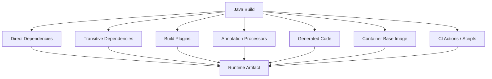

Possible threats:

| Threat | Example |
|---|---|
| Known vulnerability | A dependency version has a published CVE |
| Malicious package | Package intentionally exfiltrates secrets |
| Compromised maintainer | Legitimate project releases malicious version |
| Dependency confusion | Internal coordinate resolved from external repository |
| Typosquatting | Similar package name used by mistake |
| Build plugin compromise | Plugin changes artifact during build |
| Annotation processor abuse | Processor executes code at compile time |
| Transitive surprise | Indirect dependency introduces vulnerable library |
| Repository tampering | Artifact bytes differ from expected checksum |
| CI tampering | Build script or runner modifies artifact |
| Base image drift | Runtime image changes after build policy assumed safety |

The key insight:

> Anything that executes during build or runtime is part of the trust boundary.

---

## 3. Dependency Security Is a Pipeline Property

Security cannot be attached at the end.

It has to be layered.

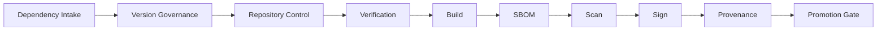

Each layer catches different failures.

| Layer | Catches |
|---|---|
| Intake review | Bad library choices before adoption |
| Version governance | Uncontrolled drift and unsupported versions |
| Repository control | Arbitrary external resolution |
| Dependency verification | Unexpected artifact byte changes |
| Build isolation | Environment and network tampering |
| SBOM | Unknown component inventory |
| Vulnerability scanning | Known CVEs and policy violations |
| Signing | Artifact identity and publisher trust |
| Provenance | How artifact was built and from which inputs |
| Promotion gate | Unsafe release candidates |

No single control is enough.

---

## 4. Dependency Intake Policy

Before a dependency enters the platform baseline, ask:

1. What problem does it solve?
2. Is it runtime or build-time only?
3. How mature is the project?
4. Is it actively maintained?
5. What license does it use?
6. Does it pull many transitive dependencies?
7. Does it execute code during build?
8. Does it process untrusted input?
9. Does it have known vulnerabilities?
10. Does it duplicate an existing approved library?
11. Who owns upgrades internally?
12. How hard is removal?

### Intake states

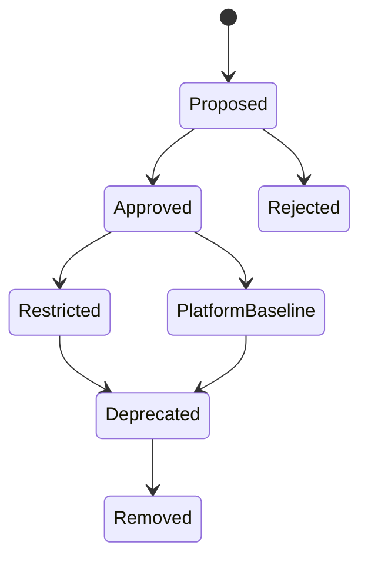

| State | Meaning |
|---|---|
| Proposed | Someone wants to use it |
| Approved | Allowed under conditions |
| PlatformBaseline | Managed centrally |
| Restricted | Allowed only for specific use cases |
| Deprecated | Existing use tolerated, new use blocked |
| Removed | Not allowed |

This avoids the two extremes:

- every team can add anything
- central platform blocks everything forever

---

## 5. Direct vs Transitive Risk

Direct dependencies are chosen by your team.

Transitive dependencies are chosen by your dependencies.

Example:

```text
service-a
└── framework-x
    ├── json-lib
    ├── http-client
    └── logging-bridge
```

A transitive dependency can become a production risk even if no developer explicitly added it.

That is why dependency governance should operate on the resolved graph, not just declared dependencies.

### Rules

1. Review direct dependencies before adoption.
2. Monitor the full resolved graph continuously.
3. Align common transitive dependencies through BOM/platform.
4. Use exclusions only when you understand replacement impact.
5. Do not ignore runtime-only dependencies.
6. Do not ignore test dependencies if tests run in CI with secrets.

---

## 6. Build Plugins Are Dependencies Too

Build plugins are often more dangerous than runtime libraries because they execute during the build.

Examples:

- Maven plugins
- Gradle plugins
- annotation processors
- code generators
- test runners
- coverage agents
- container image builders
- SBOM generators
- release automation plugins

A build plugin may have access to:

- source code
- environment variables
- repository credentials
- signing keys
- CI tokens
- deployment metadata
- produced artifacts

Policy:

> Build plugins must be pinned, approved, resolved from trusted repositories, and upgraded deliberately.

Avoid:

```kotlin
plugins {
    id("some-random-plugin") version "+"
}
```

Prefer:

```kotlin
plugins {
    id("com.acme.java-service-conventions") version "2026.06.0"
}
```

where the internal convention plugin controls the approved external plugin set.

---

## 7. Checksums and Dependency Verification

Checksums answer:

> Are the bytes I downloaded the bytes I expected?

They do not prove that the artifact is good. They prove that it matches a known digest.

Common digest algorithms include SHA-256 and SHA-512.

### What checksums protect against

- accidental corruption
- repository storage errors
- unexpected artifact replacement
- some forms of tampering

### What checksums do not protect against

- malicious artifact accepted during first trust event
- vulnerable but unchanged artifact
- compromised upstream publishing account
- malicious maintainer release
- bad dependency choice

### Gradle dependency verification

Gradle supports dependency verification metadata that can record checksums and signatures for dependencies.

Simplified example:

```xml
<verification-metadata>
  <components>
    <component group="org.example" name="example-lib" version="1.2.3">
      <artifact name="example-lib-1.2.3.jar">
        <sha256 value="..."/>
      </artifact>
    </component>
  </components>
</verification-metadata>
```

With this style of control, a dependency byte change becomes a build failure instead of silently entering the build.

### Operational caveat

Dependency verification can become noisy if managed poorly.

Good practice:

- generate metadata intentionally
- review verification diffs
- store verification metadata in source control
- update during dependency upgrade PRs
- fail on unexpected changes
- avoid blind auto-accept in CI

---

## 8. Artifact Signing

Signing answers a different question:

> Was this artifact signed by a key we trust?

Signing can apply to:

- JAR files
- POM files
- Gradle module metadata
- container images
- SBOM documents
- provenance attestations
- release bundles

For Java libraries published to Maven-style repositories, OpenPGP signatures are common.

With Gradle, the Signing Plugin can sign publications.

Simplified Gradle example:

```kotlin
plugins {
    `maven-publish`
    signing
}

signing {
    sign(publishing.publications["mavenJava"])
}
```

### Signing is not magic

Signing proves relationship to a key. The difficult questions are:

- Who controls the key?
- How is the key protected?
- Can CI access the key?
- Is the key rotated?
- What happens if the key is compromised?
- Are consumers verifying signatures?
- Are signatures tied to provenance?

A signature without verification is theater.

A signing key in an unprotected CI variable is risk.

---

## 9. JAR Signing vs Artifact Publication Signing

Java has historically supported signed JARs, where entries inside the JAR are signed.

Maven Central-style artifact publication often uses detached signatures, such as:

```text
library-1.0.0.jar
library-1.0.0.jar.asc
library-1.0.0.pom
library-1.0.0.pom.asc
```

Do not confuse these.

| Concept | Purpose |
|---|---|
| Signed JAR | Runtime/classloading integrity model for JAR contents |
| Detached publication signature | Repository distribution trust model |
| Container image signature | Runtime deployable image trust |
| Provenance attestation signature | Trust in build process evidence |

In modern service delivery, container image signing and provenance often matter more for deployment than classic signed JARs.

For Java libraries, publication signatures and dependency verification remain important.

---

## 10. SBOM Mental Model

SBOM means Software Bill of Materials.

It is an inventory of components associated with software.

For a Java application, an SBOM may include:

- application component
- direct dependencies
- transitive dependencies
- versions
- package URLs
- licenses
- hashes
- dependency relationships
- metadata about supplier or author
- vulnerabilities, depending on format/tooling

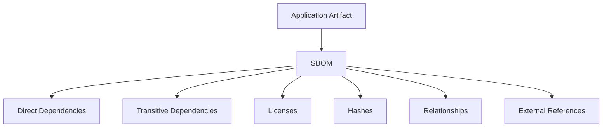

The point of an SBOM is not to create a file for compliance.

The point is operational visibility.

When a critical vulnerability appears, you want to answer:

> Which deployed artifacts include the affected component?

quickly and accurately.

---

## 11. CycloneDX and SPDX

The two common SBOM standards are CycloneDX and SPDX.

High-level orientation:

| Standard | Typical Strength |
|---|---|
| CycloneDX | Security-oriented BOMs, vulnerability and supply-chain use cases |
| SPDX | License/compliance heritage and broad package/document metadata |

Do not treat this as a religious choice.

In many enterprises, the correct answer is:

- generate CycloneDX for security tooling
- generate SPDX when required by compliance or customers
- normalize both into central inventory if needed

The key is consistency and quality.

A low-quality SBOM in the “right” format is still low-quality.

---

## 12. SBOM for Java Is Harder Than It Looks

For Java, SBOM accuracy can be tricky because of:

- dependency scopes
- optional dependencies
- shaded dependencies
- relocated classes
- application server provided libraries
- runtime-only dependencies
- generated code
- multi-module builds
- Gradle variant-aware dependencies
- Maven profiles
- platform/BOM-managed versions
- test fixtures
- annotation processors
- container base layers

Question:

> Is your SBOM describing the source project, the built JAR, the fat JAR, the container image, or the deployed runtime?

These are not always the same.

### SBOM target types

| Target | Captures |
|---|---|
| Source dependency SBOM | Declared/resolved source dependencies |
| Build artifact SBOM | What went into the produced JAR/WAR |
| Container image SBOM | OS packages, runtime, app artifact |
| Deployment SBOM | Image plus sidecars/config/extensions |
| Runtime SBOM | What is actually loaded/executed |

Be explicit.

---

## 13. Vulnerability Scanning

Vulnerability scanning maps components to known vulnerability databases.

It can identify:

- known CVEs
- vulnerable version ranges
- malicious packages in known feeds
- license issues
- end-of-life components
- policy violations

But scanners produce noise.

### Common scanner problems

| Problem | Example |
|---|---|
| False positive | Vulnerable code path not present or not reachable |
| False negative | Vulnerability not in database yet |
| Bad matching | Shaded or repackaged library not detected |
| Scope confusion | Test dependency flagged as production runtime issue |
| Version ambiguity | Vendor-patched version appears vulnerable |
| Fix conflict | Upgrading breaks framework compatibility |

Do not blindly fail builds on every finding without a triage model.

Do not blindly ignore findings because scanners are noisy.

Build a severity and reachability workflow.

---

## 14. Vulnerability Policy Model

A practical vulnerability policy needs more than severity.

Evaluate:

1. severity
2. exploitability
3. reachability
4. exposure
5. compensating controls
6. availability of fix
7. blast radius
8. regulatory impact
9. customer impact
10. age of vulnerability

### Example policy

| Finding | Build Behavior |
|---|---|
| Critical, reachable, internet-facing | Block release |
| Critical, not reachable, internal-only | Require security approval |
| High with available fix | Block after remediation window |
| Medium | Track and remediate by SLA |
| Test-scope only | Do not block production release unless build risk exists |
| No fix available | Require accepted risk and mitigation |

Security gates must be strict enough to matter and practical enough not to be bypassed.

---

## 15. Provenance Mental Model

Provenance answers:

> Where did this artifact come from, what process built it, and what inputs were used?

An artifact without provenance is just bytes.

A provenance statement may include:

- artifact identity
- digest
- source repository
- source commit
- build workflow
- build runner identity
- build parameters
- dependencies or materials
- timestamp
- builder identity
- attestation signature

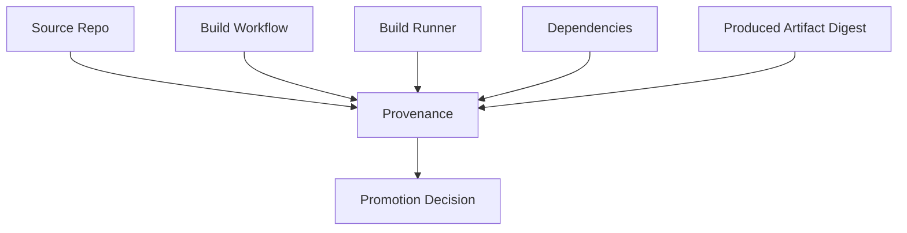

Provenance is most useful when it is generated by a trusted build system and signed or otherwise protected from tampering.

---

## 16. SLSA Mental Model

SLSA stands for Supply-chain Levels for Software Artifacts.

It is a framework for improving software supply-chain integrity.

For build provenance, the basic maturity progression is:

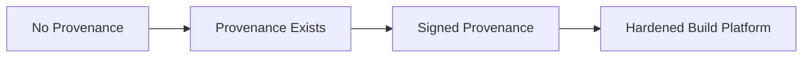

The important concept is not memorizing level numbers.

The important concept is:

> Increase confidence that an artifact was built from expected source by expected process on a trustworthy platform, and that evidence cannot be silently tampered with.

### Practical Java interpretation

| Maturity | Java Build Practice |
|---|---|
| Low | Developer builds JAR locally and uploads it |
| Better | CI builds artifact from tagged commit |
| Better | CI emits SBOM and checksums |
| Better | CI signs artifact and provenance |
| Strong | Release uses isolated hosted builders with restricted inputs |
| Strong | Deployment verifies artifact identity and provenance |

---

## 17. Policy-as-Code Gates

Manual review does not scale across hundreds of services.

Supply-chain policy should become code.

Examples:

- no snapshot dependencies in release builds
- no dynamic versions
- no unapproved repositories
- no critical reachable CVEs
- no dependency outside approved license set
- no release without SBOM
- no release without provenance
- no unsigned production artifact
- no deployment from mutable tag
- no internal namespace from external repository

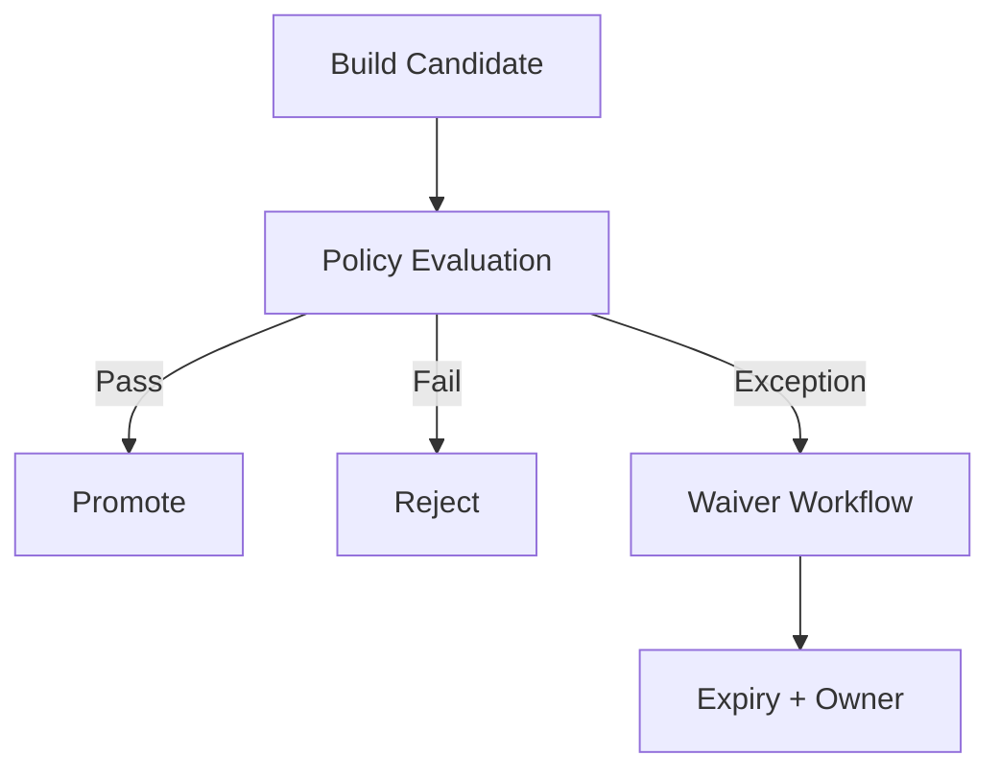

A good policy gate explains failures clearly.

Bad gate:

```text
Build failed: policy violation.
```

Good gate:

```text
Release blocked:
- org.example:legacy-parser:1.2.0 has CVE-XXXX with critical severity
- dependency appears on runtimeClasspath
- fixed version: 1.2.4
- owner: platform-security
- waiver process: SECURITY-WAIVER.md
```

Developer experience matters.

If policy gates are impossible to understand, teams will work around them.

---

## 18. Maven Controls

Useful Maven controls include:

- corporate parent POM
- `dependencyManagement`
- imported BOMs
- Maven Enforcer Plugin
- banned dependencies rule
- dependency convergence rule
- require release dependencies rule
- duplicate class detection
- explicit plugin versions
- corporate `settings.xml` mirrors
- repository manager routing
- CI release profile
- CycloneDX Maven plugin or equivalent SBOM generator

Example Enforcer-style intent:

```xml
<rules>
  <requireReleaseDeps>
    <message>No SNAPSHOT dependencies allowed in release builds.</message>
  </requireReleaseDeps>
  <dependencyConvergence />
</rules>
```

Do not scatter these rules across every project manually.

Put them in a parent POM or build platform baseline.

---

## 19. Gradle Controls

Useful Gradle controls include:

- convention plugins
- version catalogs
- platforms
- dependency constraints
- dependency locking
- dependency verification
- centralized repositories
- `RepositoriesMode.FAIL_ON_PROJECT_REPOS`
- plugin management repositories
- component metadata rules
- capabilities conflict resolution
- `dependencyInsight`
- SBOM plugin integration
- signing plugin
- CI release task graph

Example repository governance:

```kotlin
dependencyResolutionManagement {
    repositoriesMode.set(RepositoriesMode.FAIL_ON_PROJECT_REPOS)
    repositories {
        maven("https://repo.acme.internal/maven/all")
    }
}
```

Example dependency locking intent:

```kotlin
dependencyLocking {
    lockAllConfigurations()
}
```

Example verification intent:

```bash
./gradlew --write-verification-metadata sha256 help
```

The exact commands and configuration should be wrapped in internal platform conventions so product teams do not reinvent them.

---

## 20. Signing and Provenance in CI

A secure release pipeline should treat signing and provenance as release activities, not developer-laptop activities.

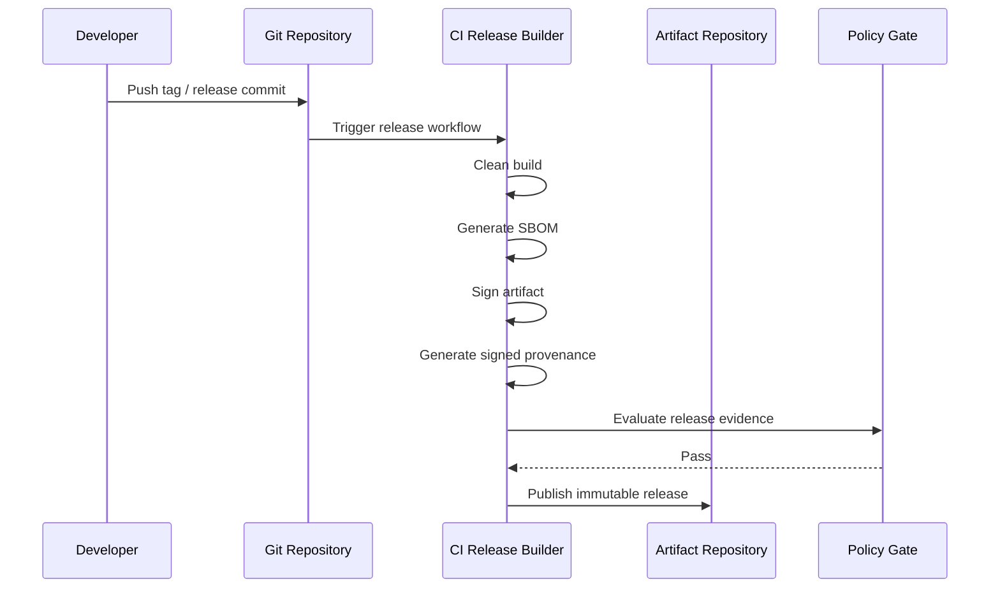

CI key handling should be carefully designed:

- avoid long-lived broad secrets
- use hardware-backed or managed signing where possible
- isolate release jobs from untrusted pull requests
- do not expose signing keys to arbitrary build scripts
- use least privilege tokens
- require protected branches/tags
- log signing events

A pull request build should not have access to release signing keys.

---

## 21. Release Evidence Bundle

A mature release is not just:

```text
app.jar
```

It is:

```text
app.jar
app.jar.sha256
app.jar.asc
app-sbom.cdx.json
app-provenance.intoto.jsonl
release-notes.md
source-tag
ci-run-id
policy-evaluation.json
```

For a containerized Java service:

```text
image digest
image signature
image SBOM
image provenance
application JAR coordinate
base image digest
deployment manifest version
policy evaluation result
```

The release artifact and evidence should travel together through promotion.

---

## 22. Exception and Waiver Workflow

Security policy without exception handling becomes either too weak or too disruptive.

A good waiver includes:

- dependency coordinate
- affected version
- finding ID
- affected services
- reason for exception
- exploitability analysis
- mitigation
- owner
- expiration date
- approval identity
- remediation plan

Waivers must expire.

A permanent waiver is usually just undocumented risk.

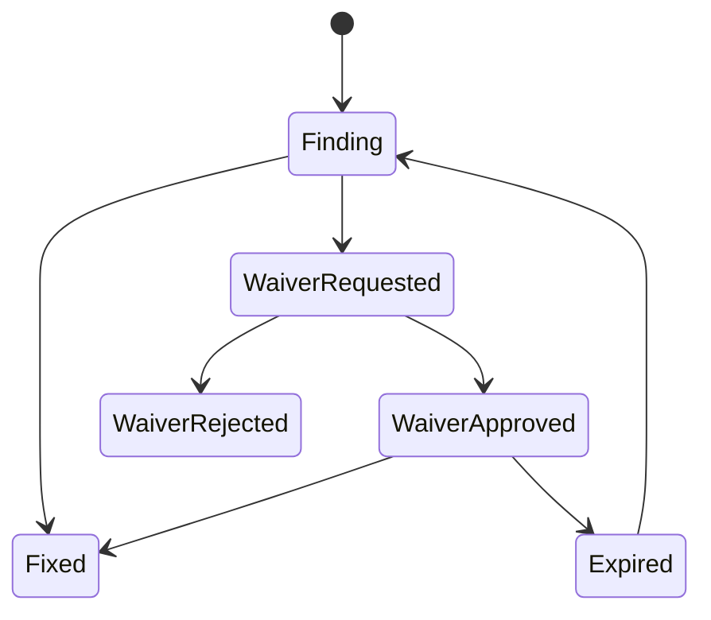

---

## 23. Incident Response for Compromised Dependency

When a dependency is compromised, you need speed and accuracy.

Questions:

1. Which artifacts include this dependency?
2. Which deployed environments run those artifacts?
3. Is the vulnerable code reachable?
4. Is there evidence of exploitation?
5. Is a fixed version available?
6. Can we patch through BOM/platform alignment?
7. Which teams own affected services?
8. Can we block new deployments with vulnerable versions?
9. Do we need credential rotation?
10. Do we need to quarantine repository artifacts?

### Response flow

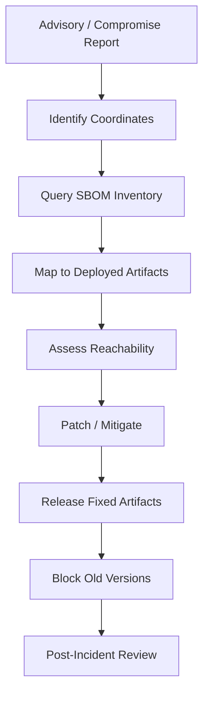

Without SBOM inventory and artifact traceability, this becomes a manual panic exercise.

---

## 24. Designing a Java Supply-Chain Gate

A practical release gate might evaluate:

### Dependency policy

- no snapshots
- no dynamic versions
- approved repositories only
- approved licenses only
- no banned coordinates
- no deprecated internal libraries

### Build policy

- built by CI
- protected branch or tag
- clean checkout
- pinned JDK/toolchain
- reproducible settings where feasible
- no uncommitted generated code

### Security policy

- SBOM generated
- vulnerability scan completed
- no blocking vulnerabilities
- waiver exists for accepted risks
- dependency verification passed

### Integrity policy

- artifact checksum generated
- artifact signed
- provenance generated
- provenance signed
- repository publish immutable

### Deployment policy

- deploy by digest, not mutable tag
- artifact promoted, not rebuilt
- runtime config separated from artifact
- rollback artifact retained

---

## 25. Common Anti-Patterns

| Anti-Pattern | Why It Fails |
|---|---|
| “We scan once before prod” | Problems enter much earlier |
| “All CVEs block forever” | Creates alert fatigue and bypass culture |
| “No CVEs means safe” | Unknown vulnerabilities and malicious packages remain |
| “SBOM generated after deployment” | Too late for release gate |
| “Signing key in every project CI” | Key sprawl and exposure risk |
| “Developers publish releases locally” | Weak provenance and inconsistent environment |
| “Latest dependency version allowed” | Non-reproducible and unreviewed upgrades |
| “Plugin versions float” | Build logic can change unexpectedly |
| “Only runtime deps matter” | Build plugins can tamper with output |
| “Waivers never expire” | Risk becomes invisible debt |

---

## 26. Dependency Security Checklist

### Project-level checklist

- [ ] Dependencies use pinned versions through BOM/platform/catalog.
- [ ] Release builds reject snapshots.
- [ ] Release builds reject dynamic versions.
- [ ] Repositories are centralized.
- [ ] Plugin versions are pinned.
- [ ] SBOM is generated from resolved graph.
- [ ] Vulnerability scan runs in CI.
- [ ] Findings are triaged by severity and reachability.
- [ ] Waivers have owners and expiration dates.
- [ ] Dependency verification or equivalent checksum control exists for critical builds.

### Platform-level checklist

- [ ] Approved dependency intake workflow exists.
- [ ] Repository manager blocks internal namespace confusion.
- [ ] Corporate BOM/platform is maintained.
- [ ] Build plugins are approved and pinned.
- [ ] Artifact signing policy exists.
- [ ] Provenance policy exists.
- [ ] Release artifacts are immutable.
- [ ] SBOM inventory is searchable.
- [ ] Incident response playbook exists.
- [ ] Critical services can be mapped from vulnerable dependency to deployment quickly.

---

## 27. Deliberate Practice

### Exercise 1 — Build a dependency threat model

Pick one Java service and list:

- direct dependencies
- transitive dependency count
- build plugins
- annotation processors
- generated-code tools
- container base image
- CI actions
- external repositories

Classify each as:

```text
runtime risk
build-time risk
repository risk
credential risk
license risk
operational risk
```

### Exercise 2 — SBOM quality check

Generate an SBOM for a Java application.

Then answer:

1. Does it include test dependencies?
2. Does it include runtime-only dependencies?
3. Does it include shaded dependencies?
4. Does it include container base image packages?
5. Does it include dependency relationships?
6. Does it include hashes?
7. Does it map to deployed artifact identity?

If the answer is unclear, document the limitation.

### Exercise 3 — Dependency verification drill

Enable checksum verification for a small Gradle project.

Then intentionally change a dependency version and observe:

- metadata diff
- build failure behavior
- review workflow
- developer experience

### Exercise 4 — Compromised dependency simulation

Assume this dependency is compromised:

```text
org.example:json-core:2.1.0
```

Build a response plan:

- locate affected services
- check deployed environments
- find fixed version
- update BOM/platform
- trigger rebuilds
- block old version
- communicate risk
- close incident

### Exercise 5 — Provenance review

For one release artifact, collect:

- source commit
- source tag
- CI run
- builder identity
- artifact digest
- SBOM
- signature
- provenance attestation
- policy evaluation

If any item is missing, define the control needed.

---

## 28. Top 1% Mental Model

Ordinary dependency management asks:

> Which version compiles?

Advanced dependency management asks:

> Which version is compatible?

Top-tier supply-chain engineering asks:

> Which artifact can we trust, prove, scan, trace, promote, reproduce, and revoke?

The final question is the important one.

A build that compiles but cannot be trusted is not a release system.

It is an accident generator.

---

## 29. Baeldung-Style Practical Summary

Use these rules in real Java systems:

1. Pin dependency and plugin versions.
2. Resolve dependencies only through approved repositories.
3. Ban snapshots and dynamic versions in release builds.
4. Treat build plugins and annotation processors as supply-chain dependencies.
5. Generate SBOMs from the resolved graph, not from guesses.
6. Scan continuously, but triage findings intelligently.
7. Sign release artifacts or images where the deployment model depends on trust.
8. Generate provenance from CI, not from developer laptops.
9. Store SBOM, signatures, checksums, and provenance with the artifact.
10. Make policy gates understandable and exception workflows time-bound.

---

## 30. Key Takeaways

Supply-chain security is not a single scanner or checklist.

It is a system:

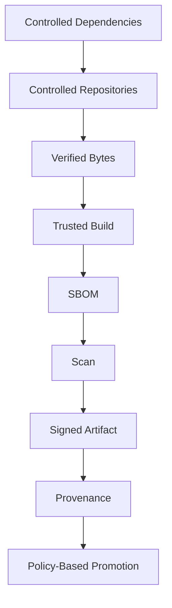

For Java engineers, the core shift is this:

> Dependency management is no longer only about classpath correctness. It is also about integrity, provenance, auditability, and operational response.

If you can trace a vulnerable dependency from advisory to deployed artifact in minutes, block unsafe releases automatically, and prove how a production artifact was built, you are operating at an advanced build/release engineering level.

---

## 31. References

- Gradle — Dependency Verification: https://docs.gradle.org/current/userguide/dependency_verification.html
- Gradle — Signing Plugin: https://docs.gradle.org/current/userguide/signing_plugin.html
- Gradle — Signing Artifacts: https://docs.gradle.org/current/userguide/publishing_signing.html
- Gradle — Maven Publish Plugin: https://docs.gradle.org/current/userguide/publishing_maven.html
- Apache Maven — Dependency Mechanism: https://maven.apache.org/guides/introduction/introduction-to-dependency-mechanism.html
- Apache Maven Enforcer Plugin: https://maven.apache.org/enforcer/maven-enforcer-plugin/
- SLSA Specification: https://slsa.dev/spec/v1.2/
- SLSA Levels: https://slsa.dev/spec/v1.0/levels
- CycloneDX: https://cyclonedx.org/
- CycloneDX Specification: https://cyclonedx.org/specification/overview/
- SPDX: https://spdx.dev/
- OWASP Dependency-Track: https://dependencytrack.org/
