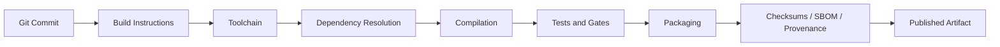
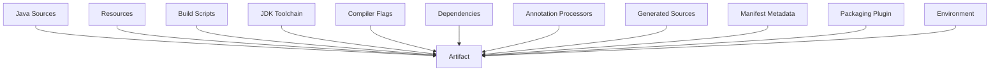
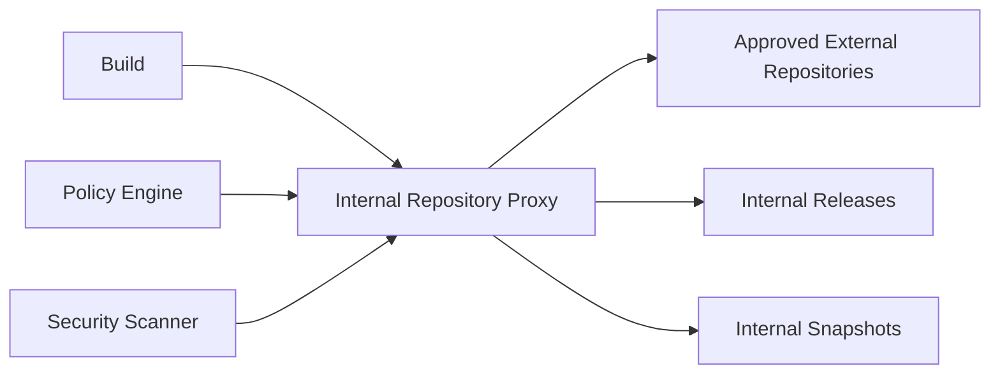
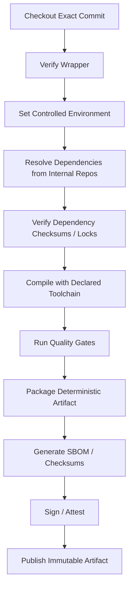
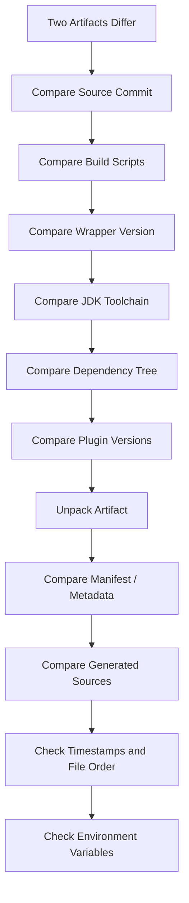

# Part 021 — Reproducible and Hermetic Builds

Build engineering becomes serious when a team stops asking:

> “Can we build it?”

and starts asking:

> “Can we rebuild the same artifact, from the same source, under controlled conditions, and prove what influenced it?”

This part focuses on the trust boundary between source code and binary artifact. A top-tier Java engineer should be able to explain why two builds differ, which inputs caused the difference, and which controls prevent uncontrolled variation.

This is not only about security. It is about debugging, rollback, auditability, release confidence, compliance, dependency governance, and incident response.

---

## 1. Kaufman Framing

Josh Kaufman’s learning model starts by deconstructing a skill into smaller subskills, learning enough to self-correct, removing practice barriers, and practicing deliberately.

For reproducible and hermetic builds, the skill decomposes into these subskills:

| Subskill | What You Must Be Able to Do |
|---|---|
| Input modeling | Identify every input that can affect a Java artifact. |
| Determinism | Make packaging output stable across repeated builds. |
| Toolchain control | Pin JDK, Maven, Gradle, compiler, and plugin versions. |
| Dependency closure control | Freeze dependency versions and verify resolved artifacts. |
| Environment control | Prevent locale, time, path, OS, network, and credentials from silently changing output. |
| Repository control | Resolve dependencies from trusted repositories only. |
| CI parity | Ensure local and CI builds execute the same contract. |
| Evidence generation | Produce logs, manifests, SBOMs, checksums, and provenance useful for audit/debugging. |
| Failure analysis | Diff two builds and locate the drift source. |

The goal is not to memorize every Maven or Gradle option. The goal is to develop the reflex:

> If artifact output changed, some input changed. Find the input.

---

## 2. Core Definitions

These terms are often used loosely. In serious build engineering, they mean different things.

### 2.1 Repeatable Build

A build is repeatable when it usually succeeds when run again in the same environment.

Example:

```bash
mvn clean verify
./gradlew clean build
```

If those pass twice on your laptop, the build may be repeatable.

But repeatable does not mean reproducible.

### 2.2 Reproducible Build

A build is reproducible when the same source code, same build instructions, and same build environment can recreate bit-for-bit identical artifacts.

For Java this usually means the generated JAR/WAR and its metadata are byte-identical, not only functionally equivalent.

### 2.3 Deterministic Build

A build is deterministic when the same explicit inputs always produce the same output.

Determinism is a property of the build logic.

### 2.4 Hermetic Build

A build is hermetic when all inputs are declared, controlled, and isolated from ambient machine state.

A hermetic build should not depend on:

- random installed JDK on the developer machine
- random Maven/Gradle installation
- random local repository state
- current wall-clock time
- local timezone
- user home directory
- internet availability
- unchecked environment variables
- mutable remote repository metadata
- undeclared files outside the repository

### 2.5 Verifiable Build

A build is verifiable when another party can check evidence that links source, dependencies, build process, and output artifact.

This requires checksums, dependency metadata, SBOMs, signatures, and provenance.

---

## 3. The Build Trust Chain

A Java build is a trust chain.



Each arrow is a place where uncontrolled variation can enter.

The most important invariant:

> The published artifact must be explainable as a function of source, declared build instructions, declared toolchain, declared dependencies, and controlled environment.

If the artifact depends on anything else, your build has a hidden input.

---

## 4. Hidden Inputs in Java Builds

Most build drift comes from hidden inputs.

| Hidden Input | Typical Symptom | Control |
|---|---|---|
| JDK version | Different bytecode, warnings, tool behavior | Java toolchains, CI image pinning |
| Maven/Gradle version | Plugin resolution or task behavior differs | Maven/Gradle Wrapper |
| Plugin versions | Different packaging/test behavior | Pin plugin versions |
| Dynamic dependency versions | Different dependencies over time | Locking, BOM/platform, no ranges |
| Snapshot dependencies | Artifact changes without version change | Ban from release builds |
| Mutable repository metadata | Different transitive resolution | Controlled proxy repository |
| File timestamps | Different JAR checksums | Normalize archive timestamps |
| File ordering | Different archive byte order | Reproducible archive ordering |
| Locale/timezone | Different generated output | Set locale/timezone in CI |
| Absolute paths | Generated sources contain machine paths | Configure generators |
| Environment variables | CI-only/local-only behavior | Explicit environment contract |
| Network calls | Build result depends on external services | Offline build mode after resolve |
| Test data clock | Flaky tests, inconsistent reports | Fixed clock/test fixtures |
| Annotation processors | Generated source drift | Pin processor versions/options |
| Cache state | Cache poisoning, stale outputs | Cache key discipline |

Build hardening is mostly the process of turning hidden inputs into explicit inputs or removing them.

---

## 5. Java-Specific Build Inputs

A Java artifact is shaped by more than `.java` files.



A practical build review should classify each input:

| Input Type | Examples | Must Be Controlled? |
|---|---|---|
| Source input | `.java`, `.properties`, `.xml`, `.yaml` | Yes |
| Build definition | `pom.xml`, `build.gradle.kts`, `settings.gradle.kts` | Yes |
| Build runtime | Maven/Gradle version, wrapper JAR/distribution | Yes |
| Compilation toolchain | JDK, `javac`, `--release` | Yes |
| Dependency closure | direct and transitive libraries | Yes |
| Build plugins | compiler, jar, shade, surefire, jacoco, protobuf | Yes |
| Generated code | OpenAPI, protobuf, annotation processor output | Yes |
| Ambient environment | timezone, locale, env vars, path, OS | Should be minimized |
| External network | remote repositories, codegen APIs | Should be eliminated during trusted build |
| Credentials | repository tokens, signing keys | Controlled and auditable |

---

## 6. Reproducible vs Hermetic: Do Not Confuse Them

A build can be reproducible but not hermetic.

Example: the build is byte-identical only because two developers happen to have the same local JDK and dependency cache. It is reproducible by accident.

A build can be hermetic but not reproducible.

Example: all inputs are declared, but the JAR task embeds current timestamps into the archive.

You want both:

```mermaid
quadrantChart
    title Build Trust Model
    x-axis Low Hermeticity --> High Hermeticity
    y-axis Low Reproducibility --> High Reproducibility
    quadrant-1 Trustworthy Build
    quadrant-2 Stable by Accident
    quadrant-3 Dangerous Build
    quadrant-4 Controlled but Non-Deterministic
    A[Works on laptop] : 0.2, 0.3
    B[CI only stable] : 0.4, 0.6
    C[Containerized but timestamped] : 0.8, 0.5
    D[Pinned + deterministic] : 0.9, 0.9
```

---

## 7. Maven Controls for Reproducible Builds

Maven builds can be made highly reproducible, but only if the team treats the POM as a build contract, not as a casual dependency list.

### 7.1 Pin Maven Itself

Use Maven Wrapper:

```bash
./mvnw --version
./mvnw clean verify
```

The wrapper ensures developers and CI do not accidentally use different Maven versions.

Recommended repository files:

```text
.mvn/
  wrapper/
    maven-wrapper.properties
    maven-wrapper.jar
mvnw
mvnw.cmd
pom.xml
```

Policy:

- use `./mvnw`, not arbitrary `mvn`
- review wrapper version changes like code changes
- pin Maven version in CI images only as a secondary safeguard

### 7.2 Pin Plugin Versions

A Maven build should not rely on implicit plugin versions.

Use `pluginManagement` in a parent POM:

```xml
<build>
  <pluginManagement>
    <plugins>
      <plugin>
        <groupId>org.apache.maven.plugins</groupId>
        <artifactId>maven-compiler-plugin</artifactId>
        <version>3.14.1</version>
      </plugin>
      <plugin>
        <groupId>org.apache.maven.plugins</groupId>
        <artifactId>maven-surefire-plugin</artifactId>
        <version>3.5.3</version>
      </plugin>
      <plugin>
        <groupId>org.apache.maven.plugins</groupId>
        <artifactId>maven-failsafe-plugin</artifactId>
        <version>3.5.3</version>
      </plugin>
      <plugin>
        <groupId>org.apache.maven.plugins</groupId>
        <artifactId>maven-jar-plugin</artifactId>
        <version>3.4.2</version>
      </plugin>
    </plugins>
  </pluginManagement>
</build>
```

The exact versions above should be updated by your dependency governance process. The architectural rule is more important than the specific number:

> Release builds must not depend on implicit plugin version resolution.

### 7.3 Normalize Archive Timestamps

Maven supports reproducible build configuration through `project.build.outputTimestamp`.

A common pattern is to derive it from the commit timestamp or release timestamp:

```xml
<properties>
  <project.build.outputTimestamp>2026-06-29T00:00:00Z</project.build.outputTimestamp>
</properties>
```

For release automation, avoid setting it manually per developer. Use release tooling or CI to set a stable value.

Bad:

```xml
<project.build.outputTimestamp>${maven.build.timestamp}</project.build.outputTimestamp>
```

This embeds the build time, which changes every run.

Better:

```bash
./mvnw -Dproject.build.outputTimestamp="$(git log -1 --format=%cI)" clean verify
```

In enterprise pipelines, compute once and pass it consistently to every module.

### 7.4 Control JDK Compilation

Do not rely on `source` and `target` alone for cross-release compilation. Prefer the compiler `release` option where applicable.

```xml
<properties>
  <maven.compiler.release>21</maven.compiler.release>
</properties>
```

This helps prevent accidental use of APIs unavailable on the target Java release.

### 7.5 Ban Dynamic and Snapshot Release Inputs

For release builds, avoid:

```xml
<version>[1.0,2.0)</version>
<version>LATEST</version>
<version>RELEASE</version>
<version>1.2.3-SNAPSHOT</version>
```

Prefer exact versions managed centrally:

```xml
<dependencyManagement>
  <dependencies>
    <dependency>
      <groupId>com.fasterxml.jackson</groupId>
      <artifactId>jackson-bom</artifactId>
      <version>2.17.2</version>
      <type>pom</type>
      <scope>import</scope>
    </dependency>
  </dependencies>
</dependencyManagement>
```

### 7.6 Use Maven Enforcer as Policy Boundary

Use Maven Enforcer to turn build assumptions into build rules.

Example policy categories:

- require Maven version
- require Java version
- ban duplicate classes
- ban dependency convergence problems
- ban snapshots in release builds
- require plugin versions
- ban problematic dependencies

Example:

```xml
<plugin>
  <groupId>org.apache.maven.plugins</groupId>
  <artifactId>maven-enforcer-plugin</artifactId>
  <version>3.5.0</version>
  <executions>
    <execution>
      <id>enforce-build-contract</id>
      <goals>
        <goal>enforce</goal>
      </goals>
      <configuration>
        <rules>
          <requireMavenVersion>
            <version>[3.9.9,)</version>
          </requireMavenVersion>
          <requireJavaVersion>
            <version>[21,)</version>
          </requireJavaVersion>
          <dependencyConvergence />
          <requirePluginVersions />
        </rules>
      </configuration>
    </execution>
  </executions>
</plugin>
```

Treat Enforcer failures as architecture feedback, not as annoying build failures.

---

## 8. Gradle Controls for Reproducible Builds

Gradle gives strong tools for controlling build inputs, but because Gradle is programmable, teams must be disciplined about build logic.

### 8.1 Pin Gradle Itself

Use the Gradle Wrapper:

```bash
./gradlew --version
./gradlew clean build
```

Repository files:

```text
gradle/
  wrapper/
    gradle-wrapper.properties
    gradle-wrapper.jar
gradlew
gradlew.bat
settings.gradle.kts
build.gradle.kts
```

Policy:

- do not ask developers to install Gradle manually
- review wrapper upgrades through PR
- verify wrapper distribution URL and checksum where policy requires it

### 8.2 Use Java Toolchains

A Gradle build should declare which Java version it needs.

```kotlin
java {
    toolchain {
        languageVersion = JavaLanguageVersion.of(21)
    }
}
```

This avoids the accidental behavior where one developer compiles with JDK 17, another with JDK 21, and CI with JDK 25.

For target compatibility, still be explicit:

```kotlin
tasks.withType<JavaCompile>().configureEach {
    options.release.set(21)
}
```

### 8.3 Lock Dependency Resolution

Dynamic versions are dangerous without locks:

```kotlin
dependencies {
    implementation("org.springframework:spring-web:6.+")
}
```

If dynamic versions are allowed at all, dependency locking must be enabled.

```kotlin
dependencyLocking {
    lockAllConfigurations()
}
```

Generate lock state intentionally:

```bash
./gradlew dependencies --write-locks
```

A stricter enterprise rule is simpler:

> Release builds must not use dynamic versions. If dynamic versions exist during development, they must be locked before CI release stages.

### 8.4 Prefer Version Catalogs for Declaration, Not Governance Alone

Version catalogs centralize dependency aliases:

```toml
[versions]
junit = "5.10.3"

[libraries]
junit-jupiter = { module = "org.junit.jupiter:junit-jupiter", version.ref = "junit" }
```

Usage:

```kotlin
dependencies {
    testImplementation(libs.junit.jupiter)
}
```

But catalogs do not automatically solve transitive dependency alignment, override policy, or vulnerability exceptions.

Use them with:

- platforms/BOMs
- constraints
- dependency locking
- dependency verification
- CI policy gates

### 8.5 Verify Dependency Artifacts

Gradle dependency verification can validate checksums and signatures for resolved dependencies.

High-level flow:

```bash
./gradlew --write-verification-metadata sha256 help
```

Then commit:

```text
gradle/verification-metadata.xml
```

This helps detect tampered or unexpectedly changed artifacts.

### 8.6 Normalize Archive Output

For archive tasks, verify that file order and timestamps are stable.

Example explicit configuration:

```kotlin
tasks.withType<AbstractArchiveTask>().configureEach {
    isPreserveFileTimestamps = false
    isReproducibleFileOrder = true
}
```

Do not assume that every custom packaging task behaves like Gradle’s standard archive tasks.

Audit:

- `jar`
- `war`
- shadow/fat JAR tasks
- Spring Boot executable archive tasks
- generated ZIP/TAR distributions
- custom packaging tasks

### 8.7 Avoid Non-Deterministic Build Logic

Bad Gradle build logic:

```kotlin
tasks.register("writeBuildInfo") {
    doLast {
        file("$buildDir/build-info.txt").writeText("builtAt=${System.currentTimeMillis()}")
    }
}
```

Better:

```kotlin
val buildTimestamp = providers.gradleProperty("buildTimestamp")

// CI sets -PbuildTimestamp from commit time or release metadata.
tasks.register("writeBuildInfo") {
    inputs.property("buildTimestamp", buildTimestamp)
    outputs.file(layout.buildDirectory.file("build-info.txt"))

    doLast {
        val out = layout.buildDirectory.file("build-info.txt").get().asFile
        out.writeText("builtAt=${buildTimestamp.get()}\n")
    }
}
```

The timestamp may still vary between releases, but it is now an explicit input.

---

## 9. Environment Control

A trusted build should define its environment contract.

### 9.1 Minimum Environment Contract

| Environment Property | Recommended Control |
|---|---|
| OS image | Pin CI image or container digest |
| JDK | Toolchain + image policy |
| Maven/Gradle | Wrapper |
| Timezone | Set `TZ=UTC` |
| Locale | Set `LANG=C.UTF-8` or agreed default |
| User home | Avoid using user-home state in build logic |
| Network | Restrict after dependency resolution |
| Repositories | Use internal mirror/proxy |
| Secrets | Inject only in publishing/signing stages |
| Cache | Key by lockfiles, build scripts, toolchain |

### 9.2 Example CI Environment Baseline

```yaml
variables:
  TZ: UTC
  LANG: C.UTF-8
  MAVEN_OPTS: "-Duser.timezone=UTC -Dfile.encoding=UTF-8"
  GRADLE_OPTS: "-Dorg.gradle.jvmargs=-Duser.timezone=UTC -Dfile.encoding=UTF-8"
```

Do not overfit to this exact YAML. The idea is that timezone and encoding are declared, not inherited accidentally.

---

## 10. Hermetic Dependency Resolution

Dependency resolution is the most common non-hermetic part of Java builds.

### 10.1 The Problem

A build that resolves directly from public repositories during release is exposed to:

- availability failures
- metadata changes
- compromised transitive artifacts
- dependency confusion
- repository ordering mistakes
- unauthorized snapshot usage
- inconsistent cache state

### 10.2 Trusted Resolution Pattern



Rules:

1. CI builds use internal repository manager only.
2. Public repositories are proxied, not used directly.
3. Repository order is controlled centrally.
4. Release builds reject snapshots unless explicitly allowed for non-production artifacts.
5. Artifact checksums are verified.
6. Dependency locks or equivalent evidence are committed.
7. Repository credentials are injected by CI, not stored in source.

---

## 11. Caching Without Breaking Trust

Build cache is useful, but cache is not truth.

### 11.1 Cache Safety Principle

> A cache may speed up a build, but it must not define the correctness of a build.

If disabling the cache changes the artifact, the build is broken.

### 11.2 Cache Failure Modes

| Failure Mode | Cause | Mitigation |
|---|---|---|
| Stale output reused | Missing task input declaration | Declare inputs/outputs correctly |
| Cache poisoning | Untrusted branch writes to shared cache | Separate read/write policy |
| Secret leakage | Outputs contain secrets | Never cache secret-derived outputs |
| Environment-sensitive output | Task ignores OS/locale/JDK input | Declare environment/toolchain input |
| False confidence | CI passes only because of cache | Periodic no-cache verification |

### 11.3 Recommended Enterprise Cache Policy

| Context | Read Cache | Write Cache |
|---|---:|---:|
| Developer local | Yes | Local only |
| PR from internal branch | Yes | Maybe, restricted |
| PR from fork/untrusted branch | Maybe | No |
| Main branch | Yes | Yes |
| Release build | Prefer no remote write | No or isolated |
| Reproducibility verification | No | No |

---

## 12. Artifact Determinism Checklist

For Java archive outputs, inspect:

| Artifact Component | Risk |
|---|---|
| ZIP/JAR entry timestamps | Different checksum each build |
| Entry ordering | Different binary layout |
| Manifest attributes | Build time/user/path leakage |
| `Implementation-Version` | Snapshot or CI run number drift |
| Generated classes | Processor output drift |
| Embedded resources | Generated timestamp/path |
| Shaded dependencies | Duplicate class ordering |
| Service files | Merge order nondeterminism |
| Native libraries | OS/architecture variability |
| Build info files | Uncontrolled wall-clock time |

A useful verification command:

```bash
sha256sum target/*.jar
sha256sum build/libs/*.jar
```

For deeper diffing:

```bash
jar tf app.jar
unzip -l app.jar
javap -classpath app.jar com.example.SomeClass
```

For two artifacts:

```bash
cmp artifact-a.jar artifact-b.jar
```

If they differ, unpack them and compare:

```bash
mkdir a b
unzip artifact-a.jar -d a
unzip artifact-b.jar -d b
diff -ru a b
```

---

## 13. Build Info: Useful but Dangerous

Many teams embed build metadata:

- git commit
- branch
- build number
- build timestamp
- CI URL
- Java version
- dependency summary

This helps operations, but it can break reproducibility.

### 13.1 Safe Build Info Rules

| Metadata | Safe? | Reason |
|---|---:|---|
| Git commit SHA | Yes | Stable for source revision |
| Version | Yes | Release contract |
| Build timestamp from commit time | Usually | Stable for same commit |
| CI build number | No for bit-reproducibility | Changes per run |
| Current wall-clock time | No | Changes every run |
| Username | No | Machine-specific |
| Absolute path | No | Machine-specific |
| Dirty working tree marker | Maybe | Useful locally, banned in release |

Recommended rule:

> Release artifacts may embed source identity, but not ambient build execution identity, unless that identity is explicitly part of the released artifact contract.

---

## 14. Trusted Build Pipeline Pattern



The build should fail if any step cannot be explained.

---

## 15. Maven Example: Release Build Contract

```bash
./mvnw \
  --batch-mode \
  --no-transfer-progress \
  -DskipTests=false \
  -Dproject.build.outputTimestamp="$(git log -1 --format=%cI)" \
  clean verify
```

Release publishing should be a separate, explicit step:

```bash
./mvnw \
  --batch-mode \
  --no-transfer-progress \
  -Dproject.build.outputTimestamp="$(git log -1 --format=%cI)" \
  deploy
```

Do not hide release behavior inside developer-local defaults.

---

## 16. Gradle Example: Release Build Contract

```bash
./gradlew \
  --no-daemon \
  --warning-mode=fail \
  -PbuildTimestamp="$(git log -1 --format=%cI)" \
  clean build
```

For reproducibility verification:

```bash
./gradlew --no-daemon --no-build-cache clean build
```

For dependency lock enforcement:

```bash
./gradlew dependencies --write-locks
./gradlew build
```

For dependency verification:

```bash
./gradlew --write-verification-metadata sha256 help
./gradlew build
```

---

## 17. Local Developer Experience

Hermeticity should not make developers miserable.

Good build platforms provide:

- wrapper commands
- fast local build path
- clear error messages
- documented environment assumptions
- IDE synchronization
- local-only tasks separated from release tasks
- bootstrap script for toolchain setup
- reliable cache usage
- easy dependency update workflow

Bad platform behavior:

- “works only in CI”
- “run these five undocumented commands first”
- “delete `.m2` or `.gradle` until it works”
- “download this private JAR manually”
- “ask senior engineer for settings.xml”

The goal is controlled builds, not ritualistic builds.

---

## 18. Common Anti-Patterns

### 18.1 The Build Depends on Developer Machine State

Symptoms:

- depends on installed Maven/Gradle
- depends on manually installed local JARs
- depends on local environment variables
- depends on local config file not documented

Fix:

- wrapper
- internal artifact repository
- checked-in build config
- CI parity

### 18.2 The Build Pulls Random Internet State

Symptoms:

- public repository outage breaks release
- different dependency resolves next week
- dependency confusion risk

Fix:

- internal repository proxy
- dependency locks
- checksum/signature verification
- no dynamic versions

### 18.3 The Build Embeds Current Time Everywhere

Symptoms:

- artifact checksum differs every build
- manifest contains build timestamp
- generated sources contain current date

Fix:

- `project.build.outputTimestamp`
- stable `buildTimestamp` property
- generator configuration
- no uncontrolled wall-clock access

### 18.4 The Build Has Secret Side Effects

Symptoms:

- build publishes during `verify`
- build uploads reports during local execution
- build writes to external service during tests

Fix:

- separate build/test/publish phases
- no network in trusted build
- explicit publish tasks

### 18.5 The Cache Masks Broken Inputs

Symptoms:

- clean CI fails but cached CI passes
- `--no-build-cache` changes result
- generated sources missing after clean build

Fix:

- proper task inputs/outputs
- periodic clean/no-cache builds
- restrict remote write access

---

## 19. Enterprise Policy Template

A minimal reproducible/hermetic build policy:

```text
Policy: Java Trusted Build Contract

1. All projects must use Maven Wrapper or Gradle Wrapper.
2. Release builds must run from a clean checkout of an exact Git commit.
3. Release builds must use declared Java toolchain/version.
4. Build plugins must have explicit versions.
5. Release builds must not use dynamic dependency versions.
6. Release builds must not depend on SNAPSHOT artifacts unless explicitly approved.
7. CI must resolve dependencies through approved internal repositories.
8. Artifacts must normalize archive timestamps and file ordering.
9. Build metadata must not include uncontrolled wall-clock time, username, or absolute local paths.
10. Build output must include checksums and dependency evidence.
11. Release artifacts must be immutable after publication.
12. A reproducibility verification job must be runnable without remote build cache.
```

---

## 20. Troubleshooting Playbook

When two builds differ:



Useful commands:

Maven:

```bash
./mvnw help:effective-pom
./mvnw dependency:tree
./mvnw -X clean verify
```

Gradle:

```bash
./gradlew dependencies
./gradlew dependencyInsight --dependency guava
./gradlew build --info
./gradlew build --scan
```

Generic:

```bash
git rev-parse HEAD
java -version
./mvnw --version
./gradlew --version
env | sort
sha256sum artifact.jar
jar tf artifact.jar
```

---

## 21. Deliberate Practice

### Drill 1 — Rebuild and Compare

1. Pick a Java project.
2. Build it twice from a clean checkout.
3. Compare artifact checksums.
4. If checksums differ, unpack artifacts and identify why.
5. Fix one source of nondeterminism.

Success criteria:

- You can explain the difference.
- You can remove or control the difference.

### Drill 2 — Hidden Input Inventory

Create a table for one project:

| Input | Declared? | Controlled? | Evidence? | Risk |
|---|---:|---:|---:|---|
| JDK version | Yes/No | Yes/No | command/log | high/med/low |
| Build tool version | Yes/No | Yes/No | wrapper | high/med/low |
| Dependencies | Yes/No | Yes/No | lock/tree | high/med/low |
| Plugins | Yes/No | Yes/No | effective POM/build scan | high/med/low |
| Environment | Yes/No | Yes/No | CI config | high/med/low |

### Drill 3 — CI No-Cache Verification

Add a CI job that runs:

- clean checkout
- no remote build cache
- declared JDK
- wrapper only
- dependency verification
- artifact checksum generation

Success criteria:

- The build passes without relying on cache.
- The artifact checksum is published as evidence.

### Drill 4 — Dependency Resolution Freeze

Maven:

- remove version ranges
- use BOMs/dependency management
- run dependency tree
- ban snapshots in release profile

Gradle:

- enable dependency locking
- commit lockfiles
- add dependency verification metadata
- reject dynamic versions in release builds

---

## 22. What Top-Tier Engineers Notice

A strong Java build engineer notices these early:

- A build that needs internet during release is not fully controlled.
- A build that depends on a developer-installed tool is not portable.
- A build that embeds wall-clock time is not byte-reproducible.
- A build that uses snapshots for production releases is not auditable.
- A build that hides publish side effects behind normal verification is unsafe.
- A build that only passes with cache is suspect.
- A build that cannot explain its dependency closure is not production-grade.

The mindset shift:

> Build output is not magic. It is the result of declared inputs plus hidden inputs. Your job is to eliminate hidden inputs.

---

## 23. Summary

Reproducible and hermetic builds are the foundation for trusted release engineering.

The critical practices are:

- use Maven/Gradle Wrapper
- declare Java toolchains
- pin plugin versions
- avoid dynamic and snapshot release dependencies
- normalize archive output
- control repository resolution
- verify dependency artifacts
- avoid uncontrolled build metadata
- isolate secrets and publishing
- run no-cache verification
- produce checksums, SBOMs, and provenance evidence

A mature Java organization does not merely ask whether a build passed. It asks:

> Can we explain, reproduce, and verify the artifact we are about to deploy?

---

## References

- Apache Maven — Configuring for Reproducible Builds: https://maven.apache.org/guides/mini/guide-reproducible-builds.html
- Apache Maven — Introduction to the Build Lifecycle: https://maven.apache.org/guides/introduction/introduction-to-the-lifecycle.html
- Apache Maven Compiler Plugin: https://maven.apache.org/plugins/maven-compiler-plugin/
- Apache Maven Enforcer Plugin: https://maven.apache.org/enforcer/maven-enforcer-plugin/
- Gradle — Dependency Locking: https://docs.gradle.org/current/userguide/dependency_locking.html
- Gradle — Toolchains for JVM Projects: https://docs.gradle.org/current/userguide/toolchains.html
- Gradle — Dependency Verification: https://docs.gradle.org/current/userguide/dependency_verification.html
- Gradle — Build Cache: https://docs.gradle.org/current/userguide/build_cache.html
- Gradle — Working with Files / Archives: https://docs.gradle.org/current/userguide/working_with_files.html
- Reproducible Builds Project: https://reproducible-builds.org/
