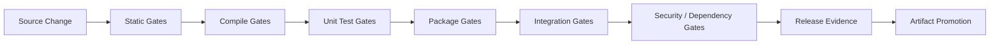
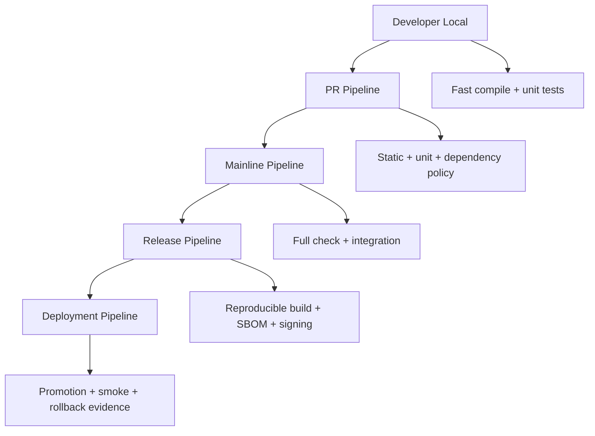

# Part 022 — Test, Quality Gates, and Build Pipelines

A build pipeline is not a YAML file.

A build pipeline is a confidence machine.

Its job is to transform a source change into evidence:

- does it compile?
- does it respect architecture boundaries?
- does it pass fast behavioral checks?
- does it pass slower integration checks?
- does it meet quality policy?
- does it satisfy security and dependency constraints?
- is the produced artifact fit to promote?

For advanced Java engineers, the important skill is not merely adding more checks. The important skill is placing the right checks at the right stage with the right failure semantics.

---

## 1. Kaufman Framing

Using Kaufman’s model, this skill decomposes into:

| Subskill | What You Must Be Able to Do |
|---|---|
| Gate classification | Distinguish compile, test, quality, security, packaging, and release gates. |
| Lifecycle placement | Place each gate in Maven/Gradle lifecycle correctly. |
| Signal design | Decide what each gate proves and what it does not prove. |
| Feedback optimization | Keep common failures fast while preserving release confidence. |
| Failure governance | Define owner, severity, retry policy, waiver, and remediation path. |
| Pipeline topology | Design local, PR, mainline, release, and deployment pipeline layers. |
| Evidence handling | Preserve reports, logs, checksums, SBOMs, and test artifacts. |
| Drift prevention | Prevent local build, CI build, and release build from becoming different systems. |

A top-tier engineer does not say, “CI is red.”

They say:

> “The integration gate failed in the verify stage because the database contract test found schema drift. The artifact should not be promoted, but the unit-test signal is still healthy.”

---

## 2. Mental Model: Pipeline as Progressive Evidence

A good pipeline is layered from cheap and deterministic checks to expensive and environment-dependent checks.



The earlier a gate runs, the more it should be:

- fast
- deterministic
- local-friendly
- easy to diagnose
- low false-positive

The later a gate runs, the more it may be:

- expensive
- environment-heavy
- comprehensive
- release-blocking
- evidence-producing

---

## 3. Gate Taxonomy

Not every gate has the same semantics.

| Gate Type | Example | Main Question | Typical Stage |
|---|---|---|---|
| Syntax/format | formatter, import order | Is the code mechanically acceptable? | pre-commit/PR |
| Compilation | `javac` | Is source type-correct? | local/PR |
| Unit test | JUnit | Does isolated behavior work? | local/PR |
| Architecture test | package/module rules | Are boundaries respected? | PR/main |
| Static analysis | Checkstyle, PMD, SpotBugs-style tools | Are known code-quality risks present? | PR/main |
| Coverage | JaCoCo | Is test coverage below policy? | PR/main |
| Mutation test | PIT-style tools | Are tests meaningful? | scheduled/release |
| Integration test | DB/broker/API integration | Does the system work with dependencies? | PR/main/release |
| Contract test | provider/consumer contract | Are service contracts compatible? | PR/main/release |
| Dependency policy | Enforcer, Gradle verification | Is the dependency graph acceptable? | PR/main/release |
| Vulnerability scan | SCA tools | Are known CVEs above threshold? | PR/release |
| License scan | license policy | Are licenses allowed? | PR/release |
| Packaging check | JAR/image validation | Is artifact structurally valid? | main/release |
| SBOM/provenance | CycloneDX/SPDX/SLSA evidence | Can we explain artifact composition? | release |

The trap is treating all of these as “tests.” They are different forms of evidence.

---

## 4. Maven Lifecycle Placement

Maven has a fixed lifecycle model. Use it instead of inventing random command sequences.

Important lifecycle phases:

```text
validate -> compile -> test -> package -> verify -> install -> deploy
```

A useful mental model:

| Maven Phase | Appropriate Responsibility |
|---|---|
| `validate` | validate project configuration and policy prerequisites |
| `compile` | compile production source |
| `test` | run unit tests |
| `package` | produce JAR/WAR/etc. |
| `verify` | run integration tests and quality checks against packaged result |
| `install` | install artifact to local repository |
| `deploy` | publish artifact to remote repository |

The most important operational rule:

> Release confidence should usually be established by `verify`; publication belongs to `deploy`.

### 4.1 Unit Tests with Surefire

Maven Surefire is conventionally used for unit tests.

Typical naming:

```text
src/test/java/**/SomeServiceTest.java
src/test/java/**/SomeServiceTests.java
src/test/java/**/TestSomeService.java
```

Example:

```xml
<plugin>
  <groupId>org.apache.maven.plugins</groupId>
  <artifactId>maven-surefire-plugin</artifactId>
  <version>3.5.3</version>
</plugin>
```

Command:

```bash
./mvnw test
```

### 4.2 Integration Tests with Failsafe

Maven Failsafe is designed for integration tests and is typically bound to `integration-test` and `verify`.

Typical naming:

```text
src/test/java/**/SomeRepositoryIT.java
src/test/java/**/SomeRepositoryITCase.java
```

Example:

```xml
<plugin>
  <groupId>org.apache.maven.plugins</groupId>
  <artifactId>maven-failsafe-plugin</artifactId>
  <version>3.5.3</version>
  <executions>
    <execution>
      <goals>
        <goal>integration-test</goal>
        <goal>verify</goal>
      </goals>
    </execution>
  </executions>
</plugin>
```

Command:

```bash
./mvnw verify
```

Why this matters:

- `test` should remain fast and local-friendly.
- `verify` can include slower checks.
- Failsafe allows teardown/verification semantics more appropriate for integration tests.

### 4.3 Maven Quality Gate Placement

Example mapping:

| Gate | Maven Phase |
|---|---|
| Enforce Java/Maven/dependency policy | `validate` |
| Compile | `compile` |
| Unit tests | `test` |
| JaCoCo report/check | `verify` |
| Integration tests | `verify` |
| Dependency convergence | `validate` or `verify` |
| Vulnerability scan | `verify` or release pipeline |
| SBOM generation | `package` or `verify` |
| Signing/publishing | `deploy` or release pipeline |

---

## 5. Gradle Lifecycle Placement

Gradle does not use Maven’s fixed phase model. It uses a task graph.

Common lifecycle tasks:

| Gradle Task | Meaning |
|---|---|
| `clean` | remove build outputs |
| `compileJava` | compile production Java source |
| `test` | run test suite |
| `check` | run verification tasks |
| `build` | assemble and check |
| `assemble` | produce artifacts without necessarily running checks |
| `publish` | publish artifacts |

Important rule:

> In Gradle, attach verification gates to `check` unless there is a strong reason not to.

### 5.1 Unit Test Baseline

```kotlin
plugins {
    java
}

tasks.test {
    useJUnitPlatform()
}
```

Command:

```bash
./gradlew test
```

### 5.2 Integration Test Source Set

One common pattern:

```kotlin
val integrationTest by sourceSets.creating {
    compileClasspath += sourceSets.main.get().output + configurations.testRuntimeClasspath.get()
    runtimeClasspath += output + compileClasspath
}

val integrationTestImplementation by configurations.getting {
    extendsFrom(configurations.testImplementation.get())
}

val integrationTestTask = tasks.register<Test>("integrationTest") {
    description = "Runs integration tests."
    group = "verification"
    testClassesDirs = integrationTest.output.classesDirs
    classpath = integrationTest.runtimeClasspath
    shouldRunAfter(tasks.test)
    useJUnitPlatform()
}

tasks.check {
    dependsOn(integrationTestTask)
}
```

Alternative: use Gradle JVM Test Suite support where it fits your Gradle version and team convention.

The architectural point:

- unit tests and integration tests should be separable
- `check` should represent verification
- CI can run `test` quickly and `check` comprehensively depending on stage

---

## 6. Local, PR, Mainline, Release, Deployment Pipelines

Do not design one pipeline for all contexts.



### 6.1 Local Pipeline

Goal: fast feedback.

Typical command:

```bash
./mvnw test
./gradlew test
```

Should include:

- compile
- unit tests
- maybe formatting/lint if fast

Should avoid:

- slow integration environments
- external service dependency
- publishing
- mandatory vulnerability scans that take minutes

### 6.2 PR Pipeline

Goal: protect mainline.

Should include:

- clean build
- compile
- unit tests
- static analysis
- dependency policy
- selected integration tests
- package validation

### 6.3 Mainline Pipeline

Goal: prove main remains releasable.

Should include:

- full `verify` or `check`
- integration tests
- contract tests
- coverage reports
- dependency/security reports
- artifact assembly

### 6.4 Release Pipeline

Goal: produce trusted artifact.

Should include:

- clean checkout of tag/commit
- pinned toolchain
- reproducible build settings
- full verification
- SBOM
- checksums
- signing/attestation
- immutable publishing

### 6.5 Deployment Pipeline

Goal: promote already-built artifact.

Should include:

- config validation
- environment readiness
- database migration coordination
- smoke tests
- health checks
- rollback/roll-forward decision points

Critical rule:

> Deployment pipelines should promote artifacts, not rebuild them.

---

## 7. Gate Design Template

Every gate should have a clear contract.

```text
Gate: Integration Tests
Stage: mainline verify
Owner: service team
Blocks merge? yes
Blocks release? yes
Inputs: packaged service, ephemeral database, broker container
Output evidence: JUnit XML, logs, container logs
Failure meaning: service may not work with declared infrastructure dependencies
Retry policy: one automatic retry only for known transient infra failure
Waiver policy: engineering manager + owning architect approval
Timeout: 15 minutes
```

A gate without semantics becomes noise.

---

## 8. Static Analysis Gates

Static analysis gates are useful when they are:

- fast
- deterministic
- consistently configured
- explainable
- owned
- not dominated by legacy noise

Common categories:

| Category | Example Concern |
|---|---|
| Formatting | consistent code shape |
| Style | naming, import order, line rules |
| Bug patterns | null misuse, resource leaks, concurrency hazards |
| Complexity | cyclomatic complexity, duplicated code |
| Architecture | forbidden package dependencies |
| Security | hardcoded secrets, unsafe APIs |

### 8.1 Gradle Checkstyle Example

```kotlin
plugins {
    checkstyle
}

checkstyle {
    toolVersion = "10.17.0"
    configFile = file("config/checkstyle/checkstyle.xml")
}

tasks.check {
    dependsOn(tasks.checkstyleMain, tasks.checkstyleTest)
}
```

### 8.2 Maven Checkstyle Placement

```xml
<plugin>
  <groupId>org.apache.maven.plugins</groupId>
  <artifactId>maven-checkstyle-plugin</artifactId>
  <version>3.4.0</version>
  <executions>
    <execution>
      <phase>verify</phase>
      <goals>
        <goal>check</goal>
      </goals>
    </execution>
  </executions>
</plugin>
```

Policy rule:

> Do not introduce static analysis as a permanent advisory-only report. Either create a ratcheting plan or do not pretend it is a gate.

---

## 9. Coverage Gates

Coverage is a weak but useful signal.

It answers:

> How much code was executed by tests?

It does not answer:

> Were the assertions meaningful?

### 9.1 Good Coverage Policy

Good:

- package/module-level thresholds for critical code
- branch coverage for decision-heavy components
- ratcheting upward over time
- exemptions for generated code
- separate thresholds for legacy and new code

Bad:

- one global 90% rule across every module
- rewarding tests with no assertions
- including generated code
- treating coverage as proof of correctness

### 9.2 Gradle JaCoCo Example

```kotlin
plugins {
    jacoco
}

tasks.test {
    useJUnitPlatform()
    finalizedBy(tasks.jacocoTestReport)
}

tasks.jacocoTestReport {
    dependsOn(tasks.test)
    reports {
        xml.required.set(true)
        html.required.set(true)
    }
}

tasks.jacocoTestCoverageVerification {
    violationRules {
        rule {
            limit {
                minimum = "0.80".toBigDecimal()
            }
        }
    }
}

tasks.check {
    dependsOn(tasks.jacocoTestCoverageVerification)
}
```

### 9.3 Maven JaCoCo Example

```xml
<plugin>
  <groupId>org.jacoco</groupId>
  <artifactId>jacoco-maven-plugin</artifactId>
  <version>0.8.12</version>
  <executions>
    <execution>
      <goals>
        <goal>prepare-agent</goal>
      </goals>
    </execution>
    <execution>
      <id>report</id>
      <phase>verify</phase>
      <goals>
        <goal>report</goal>
      </goals>
    </execution>
    <execution>
      <id>check</id>
      <phase>verify</phase>
      <goals>
        <goal>check</goal>
      </goals>
      <configuration>
        <rules>
          <rule>
            <element>BUNDLE</element>
            <limits>
              <limit>
                <counter>LINE</counter>
                <value>COVEREDRATIO</value>
                <minimum>0.80</minimum>
              </limit>
            </limits>
          </rule>
        </rules>
      </configuration>
    </execution>
  </executions>
</plugin>
```

---

## 10. Mutation Testing Gate

Mutation testing asks a stronger question than coverage:

> If production code is changed in small ways, do tests fail?

It is valuable but expensive.

Recommended placement:

| Context | Recommendation |
|---|---|
| Developer local | optional/manual |
| PR | only targeted modules or changed areas |
| Mainline | scheduled or selective |
| Release | for critical libraries/domains only |

Do not make mutation testing a universal blocking PR gate unless the codebase and infrastructure can handle it.

---

## 11. Integration Test Gates

Integration tests are often where pipelines become slow and flaky.

### 11.1 Integration Test Contract

An integration test should declare:

- what external dependency is being exercised
- how the dependency is provisioned
- test data lifecycle
- cleanup semantics
- timeout policy
- retry policy
- logs/artifacts captured on failure

### 11.2 Common Integration Test Types

| Type | Example | Risk |
|---|---|---|
| In-process integration | Spring context + repository | slower than unit tests |
| Containerized dependency | PostgreSQL/Kafka container | image pull/runtime flake |
| Shared environment | shared staging DB | data pollution |
| Ephemeral environment | per-PR environment | expensive but isolated |
| Contract test | provider/consumer schema | false confidence if stale |

Best default:

> Prefer ephemeral or isolated dependencies over shared mutable test environments.

### 11.3 Maven Naming Split

```text
Unit test:        UserServiceTest
Integration test: UserRepositoryIT
```

Maven command split:

```bash
./mvnw test      # unit tests
./mvnw verify    # integration tests + verify gates
```

### 11.4 Gradle Task Split

```bash
./gradlew test
./gradlew integrationTest
./gradlew check
```

The split is important because developers need a fast path, while CI needs a confidence path.

---

## 12. Contract Gates

Contract gates matter in distributed systems because compile-time correctness does not prove runtime compatibility.

Contract gates may check:

- REST request/response compatibility
- event schema compatibility
- Kafka topic payload evolution
- protobuf/Avro compatibility
- generated client/server drift
- API backward compatibility

Placement:

| Gate | Best Stage |
|---|---|
| Consumer contract tests | PR/main |
| Provider verification | main/release |
| Schema registry compatibility | PR/release |
| Generated client drift check | PR |

The key invariant:

> A service release should not break consumers that rely on declared compatible contracts.

---

## 13. Dependency and Security Gates

These gates are part of build quality, not an afterthought.

Recommended checks:

| Gate | Detects |
|---|---|
| dependency convergence | conflicting transitive versions |
| upper-bound dependency rule | older version overriding newer transitive version |
| duplicate classes | classpath ambiguity |
| forbidden dependencies | banned libraries or risky packages |
| vulnerability scan | known CVEs |
| license scan | license policy violation |
| dependency verification | unexpected artifact checksum/signature |
| SBOM generation | dependency evidence for release |

Placement:

- lightweight dependency policy: PR
- vulnerability threshold: PR/main
- SBOM/provenance: release
- signing: release

Policy nuance:

> Not every CVE should block every PR immediately. But every accepted risk must have owner, expiry, severity, and remediation plan.

---

## 14. Packaging Gates

After tests pass, the artifact itself can still be wrong.

Packaging gates check:

- JAR contains expected classes/resources
- executable JAR starts
- manifest metadata is correct
- no duplicate classes
- no unexpected dependencies embedded
- image has correct user/entrypoint
- image does not include build tools/secrets
- health endpoint responds
- config can be loaded

Example smoke check:

```bash
java -jar build/libs/app.jar --version
java -jar target/app.jar --version
```

For containerized apps:

```bash
docker run --rm my-app:${VERSION} --version
```

Do not wait until deployment to discover the artifact is structurally invalid.

---

## 15. Build Pipeline Evidence

A production-grade pipeline preserves evidence.

| Evidence | Why It Matters |
|---|---|
| test reports | failure diagnosis, trend analysis |
| coverage reports | visibility into test reach |
| static analysis reports | quality risk tracking |
| dependency tree | graph audit/debugging |
| SBOM | supply-chain visibility |
| checksums | artifact integrity |
| signatures | publisher identity/integrity |
| provenance | source/build linkage |
| container image digest | immutable deployment target |
| logs | incident investigation |

A gate that fails without evidence is not a gate; it is a dead end.

---

## 16. Flaky Tests and Gate Trust

Flaky tests destroy pipeline trust.

### 16.1 Flake Sources

| Source | Example |
|---|---|
| Time | test depends on current date/time |
| Concurrency | race condition in assertions |
| Network | calls external service |
| Shared state | tests share database or files |
| Ordering | tests depend on execution order |
| Randomness | random input not seeded |
| Resource limits | CPU/memory sensitive test |
| Async behavior | insufficient waiting/eventual consistency handling |

### 16.2 Flake Policy

A serious team needs a flake policy:

```text
1. A flaky test is a production risk signal, not just CI noise.
2. Automatic retry may be allowed once to reduce transient infra noise.
3. Every retry must be visible in reports.
4. Repeated flakes require ownership and deadline.
5. Quarantining requires issue link and expiry date.
6. Quarantined tests do not count as passing confidence.
```

Do not normalize rerunning CI until green.

That trains the team to ignore evidence.

---

## 17. Fast Feedback vs Strong Confidence

There is a real trade-off.

| Goal | Design Choice |
|---|---|
| Fast developer loop | small unit test suite, no external dependencies |
| Mainline safety | deterministic PR checks |
| Release confidence | full verify/check, integration, security, SBOM |
| Operational safety | deployment smoke tests and rollback checks |

A weak pipeline runs too little and misses defects.

A bad pipeline runs everything everywhere and becomes ignored.

A mature pipeline stages confidence.

---

## 18. Pipeline Anti-Patterns

### 18.1 One Giant Build Job

Symptoms:

- all checks run in one opaque CI step
- failure diagnosis is slow
- no clear owner
- developers cannot reproduce locally

Fix:

- split by gate type
- preserve reports
- expose commands
- keep local equivalents

### 18.2 Advisory-Only Gates Forever

Symptoms:

- reports generated but ignored
- quality never improves
- teams claim coverage/security “exists”

Fix:

- add ratcheting thresholds
- set enforcement date
- assign ownership

### 18.3 Release Pipeline Rebuilds Artifact

Symptoms:

- PR/main artifact differs from released artifact
- release cannot be reproduced
- promoted artifact lacks evidence

Fix:

- build once
- publish immutable artifact
- promote by digest/version

### 18.4 CI Does Something Different from Local Build

Symptoms:

- local green, CI red
- CI uses hidden profiles
- undocumented environment variables

Fix:

- wrapper commands
- checked-in CI scripts
- same lifecycle/task contract
- documented env contract

### 18.5 Flake Retry Hides Real Failure

Symptoms:

- pipeline “green” after retries
- intermittent production bugs
- test failures ignored

Fix:

- make retries visible
- track flake rate
- quarantine with expiry
- fix root cause

---

## 19. Example Maven Pipeline

```yaml
stages:
  - validate
  - test
  - verify
  - package
  - publish

validate:
  script:
    - ./mvnw --batch-mode --no-transfer-progress validate

test:
  script:
    - ./mvnw --batch-mode --no-transfer-progress test
  artifacts:
    paths:
      - "**/target/surefire-reports/**"

verify:
  script:
    - ./mvnw --batch-mode --no-transfer-progress verify
  artifacts:
    paths:
      - "**/target/failsafe-reports/**"
      - "**/target/site/jacoco/**"

package:
  script:
    - ./mvnw --batch-mode --no-transfer-progress package
    - sha256sum **/target/*.jar > checksums.txt
  artifacts:
    paths:
      - "**/target/*.jar"
      - checksums.txt

publish:
  script:
    - ./mvnw --batch-mode --no-transfer-progress deploy
  rules:
    - if: '$CI_COMMIT_TAG'
```

This is illustrative, not a universal CI template.

The important structure is:

- validate policy early
- test behavior before packaging
- verify slow gates before release
- publish only on release condition

---

## 20. Example Gradle Pipeline

```yaml
stages:
  - test
  - check
  - build
  - publish

test:
  script:
    - ./gradlew --no-daemon test
  artifacts:
    paths:
      - "**/build/test-results/test/**"
      - "**/build/reports/tests/test/**"

check:
  script:
    - ./gradlew --no-daemon check
  artifacts:
    paths:
      - "**/build/reports/**"

build:
  script:
    - ./gradlew --no-daemon clean build
    - sha256sum **/build/libs/*.jar > checksums.txt
  artifacts:
    paths:
      - "**/build/libs/*.jar"
      - checksums.txt

publish:
  script:
    - ./gradlew --no-daemon publish
  rules:
    - if: '$CI_COMMIT_TAG'
```

The important Gradle invariant:

> `check` should mean verification, `assemble` should mean artifact assembly, and `publish` should mean external side effect.

---

## 21. Quality Gate Decision Matrix

Use this matrix before adding a new gate.

| Question | Good Answer |
|---|---|
| What risk does this gate reduce? | Specific, not vague “quality” |
| Where should it run? | Local, PR, main, release, deploy |
| How long should it take? | Defined budget |
| Who owns failures? | Named team/role |
| Is it deterministic? | Yes, or flake policy exists |
| Is there evidence? | Reports/logs/artifacts preserved |
| Can developers reproduce it? | Documented command |
| What is the bypass process? | Controlled waiver with expiry |
| Does it block? | Clear blocking/advisory semantics |
| How is threshold updated? | Ratchet/versioned policy |

---

## 22. Deliberate Practice

### Drill 1 — Gate Inventory

For one Java service, create this table:

| Gate | Tool | Stage | Blocks PR? | Blocks Release? | Evidence | Owner |
|---|---|---|---:|---:|---|---|
| compile | Maven/Gradle | PR | yes | yes | build log | service team |
| unit test | JUnit | PR | yes | yes | JUnit XML | service team |
| integration test | Failsafe/Gradle Test | main | maybe | yes | JUnit XML/logs | service team |
| coverage | JaCoCo | PR/main | yes/no | yes | report | service team |
| dependency policy | Enforcer/Gradle | PR | yes | yes | dependency report | platform team |

Success criteria:

- every gate has owner and stage
- no gate is “just because”
- every blocking gate has evidence

### Drill 2 — Split Unit and Integration Tests

Maven:

- configure Surefire for unit tests
- configure Failsafe for integration tests
- ensure `mvn test` is fast
- ensure `mvn verify` includes integration tests

Gradle:

- create `integrationTest` source set/task
- wire it into `check`
- ensure `gradle test` remains fast
- ensure `gradle check` is comprehensive

### Drill 3 — Add a Ratcheting Gate

Choose one metric:

- coverage
- static analysis violations
- flaky test count
- dependency risk score

Set current baseline.

Then enforce:

> New changes must not make it worse.

This is often more effective than imposing an unrealistic global target immediately.

### Drill 4 — Build Evidence Review

For one CI run, collect:

- test reports
- coverage report
- dependency tree
- artifact checksum
- SBOM if available
- build logs

Ask:

> If production incident happens tomorrow, would this evidence help explain what was released?

---

## 23. What Top-Tier Engineers Notice

A top-tier engineer notices that:

- A green build without evidence is weak.
- A slow gate in the wrong stage teaches developers to bypass it.
- Flaky tests are trust debt.
- Coverage without assertion quality is easily gamed.
- Integration tests without isolation create false failures.
- Dependency/security gates need risk governance, not blind panic.
- Release pipelines should promote artifacts, not rebuild them.
- `test`, `check`, `verify`, `deploy`, and `publish` should have precise meanings.

The mature view:

> CI is not a place where commands run. CI is where engineering claims are tested and recorded.

---

## 24. Summary

A quality pipeline should be designed as progressive evidence.

Core practices:

- keep local tests fast
- use Maven lifecycle and Gradle task graph intentionally
- separate unit and integration tests
- attach Gradle verification tasks to `check`
- use Maven `verify` for integration and quality verification
- preserve reports and artifacts
- design every gate with owner, stage, evidence, and failure semantics
- treat flaky tests as trust failures
- avoid rebuilding artifacts during release promotion
- make security, dependency, and packaging checks part of the build trust chain

The real objective is not more CI steps.

The real objective is reliable confidence.

---

## References

- Apache Maven — Introduction to the Build Lifecycle: https://maven.apache.org/guides/introduction/introduction-to-the-lifecycle.html
- Apache Maven Surefire Plugin: https://maven.apache.org/surefire/maven-surefire-plugin/
- Apache Maven Failsafe Plugin Usage: https://maven.apache.org/surefire/maven-failsafe-plugin/usage.html
- Gradle — Build Lifecycle: https://docs.gradle.org/current/userguide/build_lifecycle.html
- Gradle — Java Testing: https://docs.gradle.org/current/userguide/java_testing.html
- Gradle — JaCoCo Plugin: https://docs.gradle.org/current/userguide/jacoco_plugin.html
- Gradle — Checkstyle Plugin: https://docs.gradle.org/current/userguide/checkstyle_plugin.html
- Gradle — Build Cache: https://docs.gradle.org/current/userguide/build_cache.html
- JaCoCo Documentation: https://www.jacoco.org/jacoco/trunk/doc/
