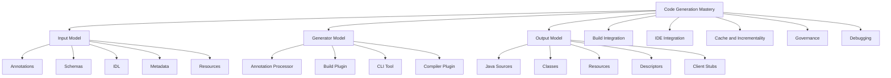
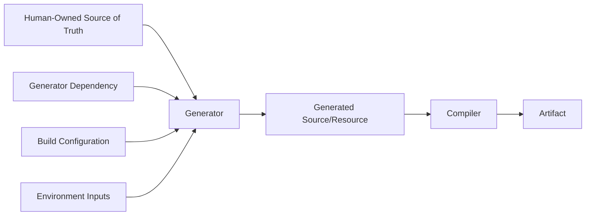
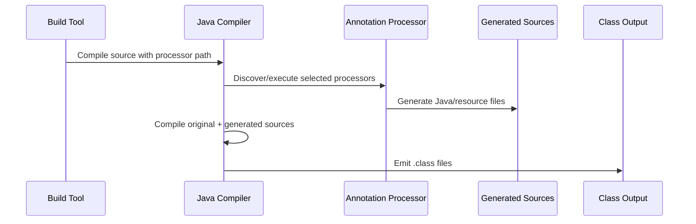
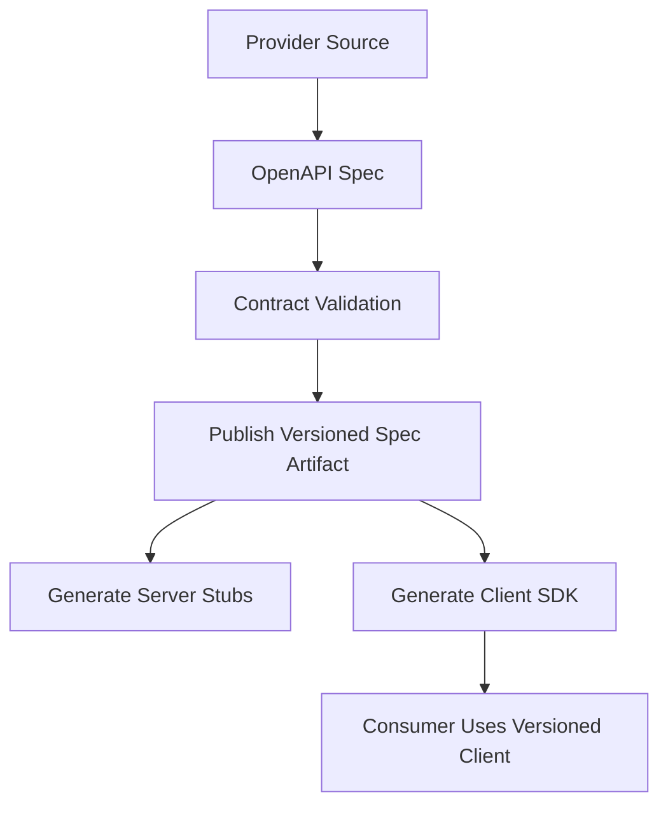

------
title: Learn Java Source, Package, Dependency, Build, Release & Deployment Engineering - Part 023
description: Code generation, annotation processing, and build complexity in modern Java build systems.
series: learn-java-build-dependency-release-deployment
seriesTitle: Learn Java Source, Package, Dependency, Build, Release & Deployment Engineering
order: 23
partTitle: Code Generation, Annotation Processing, and Build Complexity
tags:
- java
- build-engineering
- maven
- gradle
- annotation-processing
- code-generation
- source-management
- generated-code
date: 2026-06-29
------

# Part 023 — Code Generation, Annotation Processing, and Build Complexity

## 1. Posisi Part Ini Dalam Seri

Pada part sebelumnya kita sudah membahas:

1. reproducible dan hermetic builds;
2. test dan quality gates;
3. dependency governance;
4. repository/artifact storage;
5. Maven dan Gradle sebagai build system.

Sekarang kita masuk ke area yang sering terlihat kecil, tetapi dampaknya besar di enterprise system: **code generation** dan **annotation processing**.

Topik ini sering disalahpahami karena banyak engineer menganggap generated code hanya sebagai “file Java tambahan”. Itu kurang tepat.

Generated code adalah **produk intermediate dari pipeline build**. Ia punya input, generator, output, cache behavior, determinism, dependency boundary, lifecycle, dan failure mode sendiri.

Kalau kita salah mengelola generated code, efeknya bisa muncul sebagai:

- build lambat;
- IDE tidak sinkron;
- CI hijau tapi lokal merah;
- classpath bengkak;
- incremental compilation rusak;
- source control noisy;
- artifact tidak reproducible;
- annotation processor tidak jalan setelah upgrade JDK;
- generated client tidak kompatibel dengan server;
- library internal bocor ke consumer API;
- deployment gagal karena runtime artifact tidak membawa resource hasil generate.

Tujuan part ini bukan membuat kita hafal command Maven/Gradle untuk MapStruct, Lombok, OpenAPI, Avro, atau Protobuf. Tujuannya adalah membangun **mental model** agar kita bisa mengendalikan semua bentuk generated code secara konsisten.

---

## 2. Kaufman Skill Deconstruction

Berdasarkan pendekatan Josh Kaufman, skill ini kita pecah menjadi sub-skill yang bisa dilatih cepat.

### 2.1 Target Performance Level

Setelah part ini, kita harus mampu:

- membedakan source of truth, generated source, generated resource, generated bytecode, dan generated artifact;
- menentukan apakah generated output perlu di-commit ke Git atau tidak;
- mendesain source set untuk generated code;
- mengonfigurasi Maven/Gradle agar generated source masuk compile path secara benar;
- memisahkan annotation processor dari runtime dependency;
- memahami dampak annotation processor terhadap incremental build dan build cache;
- mendesain policy untuk OpenAPI/Protobuf/Avro/generated client;
- membuat build tetap deterministic meskipun ada generator;
- melakukan debugging ketika generated code hilang, stale, double-generated, atau berbeda antara lokal dan CI.

### 2.2 Skill Components



### 2.3 Learn Enough to Self-Correct

Untuk bisa self-correct, kita perlu selalu bertanya:

1. Apa input generator ini?
2. Siapa owner input-nya?
3. Output-nya source, resource, bytecode, atau artifact?
4. Output-nya deterministic?
5. Output-nya masuk ke source control atau build output?
6. Generator dijalankan di fase mana?
7. Output-nya dipakai oleh compile, test, package, atau runtime?
8. Apakah generator membaca environment tersembunyi?
9. Apakah generator merusak incremental build?
10. Apakah dependency generator bocor ke runtime artifact?

Kalau 10 pertanyaan ini bisa dijawab, biasanya build menjadi bisa dikendalikan.

---

## 3. Mental Model: Generated Code Bukan Source Utama

Dalam build engineering, source code yang ditulis manusia dan generated code harus diperlakukan berbeda.



Ada lima entitas berbeda:

| Entitas | Contoh | Ownership |
|---|---|---|
| Human-owned source | Java class, `module-info.java`, OpenAPI spec, `.proto`, Avro schema | Engineer/team |
| Generator | annotation processor, OpenAPI generator, protobuf compiler, Avro plugin | Build/tooling |
| Generator dependency | MapStruct processor, Hibernate processor, Lombok, `protoc` | Build governance |
| Generated output | Java DTO, mapper impl, client stub, metamodel class | Build output atau controlled source |
| Final artifact | JAR/WAR/container image | Release pipeline |

Kesalahan umum adalah menggabungkan semuanya ke dalam “source code”.

Di enterprise build, kita perlu memisahkan:

- **source of truth**: sesuatu yang manusia review sebagai kontrak;
- **derived output**: sesuatu yang bisa dibuat ulang;
- **published artifact**: sesuatu yang dikonsumsi sistem lain.

---

## 4. Kategori Code Generation di Java

### 4.1 Annotation Processing

Annotation processor dijalankan oleh Java compiler untuk memproses annotation dan menghasilkan source/resource tambahan.

Contoh:

- MapStruct menghasilkan implementation class untuk mapper.
- Hibernate/JPA metamodel generator menghasilkan static metamodel.
- Dagger menghasilkan dependency-injection graph.
- AutoValue menghasilkan immutable value type.
- Lombok memodifikasi AST/compiler behavior, walau modelnya berbeda dari processor biasa dalam beberapa aspek.
- Spring configuration metadata processor menghasilkan metadata untuk tooling.

Karakteristik:

- biasanya berjalan saat `compileJava`;
- input-nya annotation dan source;
- output-nya Java source atau resource;
- sangat memengaruhi incremental compilation;
- perlu processor path yang eksplisit;
- tidak boleh otomatis bocor ke runtime dependency.

### 4.2 Schema/IDL-Based Generation

Generator membaca schema/IDL dan menghasilkan source.

Contoh:

- OpenAPI spec ke REST client/server interface;
- Protobuf `.proto` ke Java message dan gRPC service;
- Avro schema ke Java record/class;
- GraphQL schema ke client/server types;
- WSDL ke SOAP client;
- JSON Schema ke DTO;
- database schema ke jOOQ generated classes.

Karakteristik:

- source of truth biasanya schema, bukan Java;
- output bisa besar;
- perubahan kecil pada schema bisa menghasilkan diff besar;
- perlu strategi versioning;
- perlu policy apakah output di-commit;
- sering dipakai lintas service/team.

### 4.3 Resource and Descriptor Generation

Contoh:

- `META-INF/services/...`;
- build info;
- Git commit metadata;
- Spring Boot build metadata;
- native-image config;
- `module-info.class`;
- manifest entries;
- service descriptors;
- generated configuration metadata.

Karakteristik:

- output bukan Java source;
- efeknya sering muncul saat runtime;
- mudah hilang jika packaging tidak benar;
- perlu dicek di artifact final, bukan hanya di compile output.

### 4.4 Bytecode Enhancement and Instrumentation

Contoh:

- Hibernate bytecode enhancement;
- AspectJ weaving;
- Jacoco instrumentation;
- shading/relocation;
- obfuscation;
- framework-specific enhancement.

Karakteristik:

- output tidak terlihat sebagai `.java`;
- perubahan terjadi setelah compile atau saat package;
- debugging lebih sulit;
- classpath dan classloader behavior bisa berubah;
- harus jelas apakah enhancement terjadi di build-time atau runtime.

### 4.5 Test Fixture Generation

Contoh:

- generated test clients;
- WireMock stubs dari contract;
- Pact contract artifacts;
- test data builders;
- synthetic API fixtures.

Karakteristik:

- tidak boleh masuk production artifact;
- source set harus terpisah;
- dependency harus `testImplementation`/`testAnnotationProcessor`;
- artifact test fixture harus punya lifecycle dan versioning yang jelas jika dipublish.

---

## 5. Prinsip Utama Generated Code

### 5.1 Generated Output Harus Bisa Dibuat Ulang

Rule pertama:

> Jangan menganggap generated code sebagai authoritative source kecuali ada alasan governance yang kuat.

Generated output idealnya:

- deterministic;
- reproducible;
- tidak bergantung pada jam lokal;
- tidak bergantung pada absolute path;
- tidak bergantung pada urutan file system yang tidak stabil;
- tidak memuat username/machine name;
- tidak memuat environment variable yang tidak dideklarasikan;
- bisa dihapus dan dibuat ulang.

Praktik validasi sederhana:

```bash
git clean -xfd
./mvnw clean verify
git status --short
```

atau:

```bash
git clean -xfd
./gradlew clean build
git status --short
```

Jika setelah build muncul diff pada generated file yang dikomit, ada kemungkinan generator tidak deterministic atau policy generated-code kita salah.

### 5.2 Generated Output Harus Punya Direktori Terpisah

Jangan generate ke `src/main/java`.

Lebih baik:

```text
target/generated-sources/annotations
target/generated-sources/openapi
build/generated/sources/annotationProcessor/java/main
build/generated/sources/openapi/main/java
```

Prinsipnya:

- source manusia berada di `src/...`;
- output build berada di `target` atau `build`;
- kalau output generated harus di-commit, letakkan di path eksplisit seperti `src/generated/java` hanya dengan policy ketat.

### 5.3 Generator Dependency Bukan Runtime Dependency

Annotation processor, schema generator, dan compiler plugin biasanya adalah **build-time dependency**.

Mereka tidak otomatis perlu berada di runtime classpath aplikasi.

Contoh buruk di Gradle:

```kotlin
dependencies {
    implementation("org.mapstruct:mapstruct-processor:...")
}
```

Lebih benar:

```kotlin
dependencies {
    implementation("org.mapstruct:mapstruct:...")
    annotationProcessor("org.mapstruct:mapstruct-processor:...")
}
```

Contoh buruk di Maven:

```xml
<dependency>
  <groupId>org.mapstruct</groupId>
  <artifactId>mapstruct-processor</artifactId>
  <version>${mapstruct.version}</version>
</dependency>
```

Lebih benar untuk Maven 3.x:

```xml
<plugin>
  <groupId>org.apache.maven.plugins</groupId>
  <artifactId>maven-compiler-plugin</artifactId>
  <configuration>
    <annotationProcessorPaths>
      <path>
        <groupId>org.mapstruct</groupId>
        <artifactId>mapstruct-processor</artifactId>
        <version>${mapstruct.version}</version>
      </path>
    </annotationProcessorPaths>
  </configuration>
</plugin>
```

### 5.4 Source of Truth Harus Jelas

Untuk generated client dari OpenAPI, pertanyaan utama bukan “plugin apa yang dipakai”, melainkan:

- spec disimpan di repo siapa?
- spec versioning-nya bagaimana?
- client generated di service consumer atau dipublish sebagai library?
- breaking change dideteksi di mana?
- apakah client generated ulang saat build atau saat release?
- bagaimana rollback ketika spec berubah?

Untuk Protobuf:

- `.proto` adalah source of truth;
- generated Java biasanya output;
- schema compatibility harus dicek;
- package Java dan package proto harus dirancang;
- generated code tidak boleh membuat module boundary kacau.

---

## 6. Annotation Processing: Model Compiler-Level

Annotation processing bukan sekadar plugin build. Ia bagian dari pipeline compiler.



### 6.1 Processor Discovery

Secara historis, compiler bisa menemukan annotation processor dari classpath melalui service provider metadata.

Namun pada modern JDK, terutama sejak JDK 23, annotation processing perlu diaktifkan secara eksplisit dalam praktik build yang aman. Ini penting untuk security dan build predictability.

Rule enterprise:

> Selalu deklarasikan annotation processor secara eksplisit.

Jangan mengandalkan processor auto-discovery dari compile classpath.

### 6.2 Processor Path vs Compile Classpath

Kita perlu membedakan:

| Path | Isi | Dipakai untuk |
|---|---|---|
| Compile classpath | API/library yang dibutuhkan untuk compile source | Type checking |
| Processor path | Annotation processor dan dependency processor | Code generation |
| Runtime classpath | Library yang dibutuhkan saat aplikasi berjalan | Execution |
| Test processor path | Processor untuk test source | Test code generation |

Kesalahan umum:

```text
compile classpath == processor path == runtime classpath
```

Itu membuat build tidak rapi, lambat, dan berisiko.

### 6.3 Processor Output

Annotation processor bisa menghasilkan:

- Java source;
- resource;
- diagnostics/warnings;
- metadata;
- service descriptors.

Jangan hanya cek `target/generated-sources/annotations`. Beberapa processor menghasilkan resource yang harus ikut ke artifact final.

---

## 7. Maven Configuration Pattern

### 7.1 Maven 3.x Annotation Processor Path

Untuk Maven 3.x dan Maven Compiler Plugin 3.x, gunakan `annotationProcessorPaths`.

```xml
<properties>
  <maven.compiler.release>21</maven.compiler.release>
  <mapstruct.version>1.6.3</mapstruct.version>
</properties>

<build>
  <plugins>
    <plugin>
      <groupId>org.apache.maven.plugins</groupId>
      <artifactId>maven-compiler-plugin</artifactId>
      <version>3.14.1</version>
      <configuration>
        <release>${maven.compiler.release}</release>
        <annotationProcessorPaths>
          <path>
            <groupId>org.mapstruct</groupId>
            <artifactId>mapstruct-processor</artifactId>
            <version>${mapstruct.version}</version>
          </path>
        </annotationProcessorPaths>
      </configuration>
    </plugin>
  </plugins>
</build>
```

Implementation/API library tetap sebagai normal dependency:

```xml
<dependencies>
  <dependency>
    <groupId>org.mapstruct</groupId>
    <artifactId>mapstruct</artifactId>
    <version>${mapstruct.version}</version>
  </dependency>
</dependencies>
```

### 7.2 Maven 4.x Processor Dependency Types

Dengan Maven 4 dan Maven Compiler Plugin 4.x, processor dapat dideklarasikan sebagai dependency dengan type khusus seperti `processor`, `classpath-processor`, atau `modular-processor`.

Contoh konseptual:

```xml
<dependencies>
  <dependency>
    <groupId>org.hibernate.orm</groupId>
    <artifactId>hibernate-processor</artifactId>
    <version>${hibernate.version}</version>
    <type>processor</type>
  </dependency>
</dependencies>
```

Enterprise rule:

- untuk Maven 3: gunakan `annotationProcessorPaths`;
- untuk Maven 4: gunakan processor dependency type jika ecosystem build sudah siap;
- jangan campur secara acak dalam satu fleet tanpa migration policy.

### 7.3 Separate Main and Test Processors

Main source dan test source bisa butuh processor berbeda.

```xml
<plugin>
  <groupId>org.apache.maven.plugins</groupId>
  <artifactId>maven-compiler-plugin</artifactId>
  <configuration>
    <annotationProcessorPaths>
      <!-- processors for main compile -->
    </annotationProcessorPaths>
    <testAnnotationProcessorPaths>
      <!-- processors for test compile if needed -->
    </testAnnotationProcessorPaths>
  </configuration>
</plugin>
```

Jika test processor menghasilkan class untuk test fixture, pastikan tidak ikut production artifact.

### 7.4 Maven Generated Sources Directory

Banyak plugin Maven otomatis menambahkan generated source directory ke project compile roots. Tetapi jangan asumsikan semuanya otomatis.

Checklist:

```bash
./mvnw -q help:effective-pom
./mvnw -X compile
find target/generated-sources -type f | head
```

Jika generated sources ada tetapi tidak dikompilasi:

- plugin mungkin belum menambahkan compile source root;
- eksekusi plugin salah phase;
- generated output berada di direktori yang salah;
- source set tidak dikenali IDE;
- build helper plugin mungkin dibutuhkan untuk kasus custom.

### 7.5 Maven Phase Placement

Common mapping:

| Generator Type | Maven Phase |
|---|---|
| Generate Java sources from schema | `generate-sources` |
| Generate test sources | `generate-test-sources` |
| Annotation processing | `compile` / `testCompile` via compiler |
| Generate resources | `generate-resources` / `process-resources` |
| Bytecode enhancement | `process-classes` / `prepare-package` |
| API docs/spec output | `prepare-package` / `verify` |
| Contract verification | `verify` |

Rule:

> Generator harus jalan sebelum consumer-nya.

Kalau Java compile membutuhkan generated Java source, generator harus selesai sebelum `compile`.

---

## 8. Gradle Configuration Pattern

### 8.1 Annotation Processor Configuration

Gradle Java plugin menyediakan configuration khusus untuk annotation processor.

```kotlin
plugins {
    `java-library`
}

java {
    toolchain {
        languageVersion.set(JavaLanguageVersion.of(21))
    }
}

dependencies {
    implementation("org.mapstruct:mapstruct:1.6.3")
    annotationProcessor("org.mapstruct:mapstruct-processor:1.6.3")

    testAnnotationProcessor("org.mapstruct:mapstruct-processor:1.6.3")
}
```

Source generated default Gradle biasanya berada di:

```text
build/generated/sources/annotationProcessor/java/main
build/generated/sources/annotationProcessor/java/test
```

### 8.2 Explicit Generated Source Task

Untuk schema-based generation, buat task dengan input/output yang eksplisit.

```kotlin
val generatedOpenApiDir = layout.buildDirectory.dir("generated/sources/openapi/main/java")

tasks.register<Exec>("generateOpenApiClient") {
    inputs.file(layout.projectDirectory.file("src/main/openapi/customer-api.yaml"))
    outputs.dir(generatedOpenApiDir)

    commandLine(
        "openapi-generator-cli",
        "generate",
        "-i", "src/main/openapi/customer-api.yaml",
        "-g", "java",
        "-o", generatedOpenApiDir.get().asFile.absolutePath
    )
}

sourceSets {
    named("main") {
        java.srcDir(generatedOpenApiDir)
    }
}

tasks.named("compileJava") {
    dependsOn("generateOpenApiClient")
}
```

Namun untuk enterprise, lebih baik bungkus logic seperti ini ke convention plugin, bukan copy-paste di setiap repo.

### 8.3 Avoid Generated Output Under `src/main/java`

Buruk:

```kotlin
val generatedDir = layout.projectDirectory.dir("src/main/java")
```

Lebih baik:

```kotlin
val generatedDir = layout.buildDirectory.dir("generated/sources/my-generator/main/java")
```

Alasannya:

- memisahkan human source dan build output;
- mencegah accidental commit;
- membuat `clean` valid;
- memudahkan cache;
- memudahkan IDE membedakan generated source.

### 8.4 Incremental Task Contract

Custom generator task harus mendeklarasikan input/output.

Buruk:

```kotlin
tasks.register("generate") {
    doLast {
        // reads files, env vars, and writes output
    }
}
```

Lebih baik:

```kotlin
abstract class GenerateClientTask : DefaultTask() {
    @get:InputFile
    abstract val specFile: RegularFileProperty

    @get:Input
    abstract val generatorVersion: Property<String>

    @get:OutputDirectory
    abstract val outputDir: DirectoryProperty

    @TaskAction
    fun generate() {
        // deterministic generation
    }
}
```

Jika input/output tidak dideklarasikan, Gradle tidak bisa melakukan up-to-date checking dan caching dengan benar.

---

## 9. Incrementality and Caching

### 9.1 Annotation Processor Bisa Merusak Incremental Compilation

Dalam Gradle, annotation processor yang tidak incremental bisa memicu full recompilation. Processor harus opt-in agar bisa diperlakukan incremental.

Gradle mengenal kategori umum:

| Processor Type | Karakter |
|---|---|
| Isolating | output untuk satu annotated element bergantung pada element itu saja |
| Aggregating | output bergantung pada banyak annotated element |
| Dynamic | processor memutuskan kategori di runtime |

Dampak praktis:

- isolating processor biasanya lebih friendly untuk incremental build;
- aggregating processor bisa memicu compile lebih luas;
- processor non-incremental bisa membuat perubahan kecil menjadi full recompilation;
- processor yang membaca resource tambahan harus mendeklarasikan resource itu sebagai input task.

### 9.2 Compile Avoidance dan Processor Classpath

Gradle compile avoidance bisa menghindari recompilation jika perubahan dependency tidak mengubah ABI. Tetapi annotation processor berbeda: implementation processor sendiri adalah input compiler.

Jika processor berada di compile classpath, Gradle bisa memperlakukan classpath lebih luas sebagai input runtime-style dan incremental behavior memburuk.

Rule:

> Pisahkan `annotationProcessor` dari `implementation`.

### 9.3 Generator Version Is a Build Input

Generator version harus diperlakukan sebagai input.

Contoh:

```kotlin
@get:Input
abstract val generatorVersion: Property<String>
```

Kalau generator version berubah, output generated code mungkin berubah, meskipun schema tidak berubah.

Untuk Maven, pastikan plugin/generator version dipin:

```xml
<plugin>
  <groupId>org.openapitools</groupId>
  <artifactId>openapi-generator-maven-plugin</artifactId>
  <version>${openapi.generator.version}</version>
</plugin>
```

Jangan biarkan plugin version floating.

### 9.4 Deterministic Output Rules

Generated output harus menghindari:

- timestamp;
- absolute path;
- local username;
- random UUID;
- nondeterministic ordering;
- locale-specific sorting;
- environment-specific line endings;
- generator banner dengan tanggal;
- tool version yang tidak dipin.

Kalau generator menghasilkan header seperti:

```java
// Generated at 2026-06-29T10:33:21+07:00 by user alice
```

maka reproducible build rusak.

Solusi:

- matikan timestamp option;
- pin locale;
- normalize line ending;
- sort input list;
- pin generator version;
- gunakan container/toolchain fixed;
- validasi `git diff` setelah regenerate.

---

## 10. Commit Generated Code atau Tidak?

Tidak ada satu jawaban universal. Gunakan decision matrix.

| Kondisi | Rekomendasi |
|---|---|
| Output bisa dibuat cepat dan deterministic | Jangan commit |
| Output sangat besar dan generator mahal | Pertimbangkan publish generated artifact |
| Consumer tidak punya generator/toolchain | Publish library artifact, bukan commit source |
| Output perlu direview sebagai API surface | Review source of truth + generated diff di CI |
| Generator tidak stabil/nondeterministic | Perbaiki generator atau commit dengan policy ketat sementara |
| Regulasi perlu audit exact generated output | Simpan release artifact + provenance, bukan asal commit source |
| Cross-language SDK | Publish SDK artifact/package per language |
| Legacy build tidak bisa generate reliably | Commit sementara dengan migration plan |

### 10.1 Default Recommendation

Untuk Java enterprise:

1. **Do not commit** annotation-processor output.
2. **Do commit** schema/IDL source of truth.
3. **Do publish** generated clients jika dipakai lintas service.
4. **Do not regenerate external client silently** di setiap consumer tanpa version pinning.
5. **Do keep** release artifacts, SBOM, and provenance.

### 10.2 When Committing Generated Code Is Acceptable

Generated code boleh di-commit jika:

- generator tidak tersedia di CI karena licensing/legacy constraint;
- review proses memerlukan generated diff;
- target ecosystem tidak punya generator di consumer side;
- generated code dimodifikasi manual dalam legacy migration;
- reproducibility belum bisa dicapai dan ada explicit exception.

Tetapi harus ada label:

```text
src/generated/java
GENERATED_CODE_POLICY.md
```

Dan aturan:

- jangan edit manual;
- regenerate command documented;
- generator version pinned;
- CI check memastikan generated output up-to-date;
- owner jelas.

---

## 11. OpenAPI Generation Pattern

### 11.1 Source of Truth

OpenAPI spec dapat berada di:

1. provider service repo;
2. central API contract repo;
3. artifact repository sebagai versioned spec;
4. registry/catalog internal.

Jangan biarkan setiap consumer copy-paste spec tanpa version.

### 11.2 Provider-Driven Model



Kelebihan:

- provider mengontrol contract;
- spec bisa dipublish dengan version;
- consumer menggunakan versi eksplisit.

Risiko:

- provider harus menjaga backward compatibility;
- client SDK release harus dikelola;
- breaking change perlu gate.

### 11.3 Consumer-Generated Model

Consumer mengambil spec dan generate client saat build.

Kelebihan:

- consumer bisa generate sesuai kebutuhan;
- tidak perlu provider publish SDK per language.

Risiko:

- build consumer bergantung pada generator;
- spec update bisa memecahkan build;
- generator version drift;
- output berbeda antar repo;
- debugging lebih sulit.

Enterprise recommendation:

- untuk critical internal API: publish versioned contract + optional SDK;
- untuk team kecil: consumer-generated boleh, tapi pin spec version dan generator version;
- untuk regulated systems: release contract artifact dan link ke deployment evidence.

---

## 12. Protobuf and Avro Generation Pattern

### 12.1 Proto Source Ownership

Untuk Protobuf:

```text
src/main/proto/customer/v1/customer.proto
```

Hal yang perlu dijaga:

- package proto;
- Java package option;
- field numbering;
- backward compatibility;
- generated service boundary;
- schema versioning;
- language-neutral ownership.

Contoh:

```proto
syntax = "proto3";

package customer.v1;

option java_multiple_files = true;
option java_package = "com.acme.customer.v1.proto";
option java_outer_classname = "CustomerProto";

message Customer {
  string id = 1;
  string legal_name = 2;
}
```

### 12.2 Avoid Domain Pollution

Generated Proto/Avro classes sebaiknya tidak menjadi domain model utama.

Buruk:

```java
public class CustomerService {
    public CustomerProto.Customer approve(CustomerProto.Customer customer) {
        // domain logic directly tied to generated proto
    }
}
```

Lebih baik:

```java
public final class CustomerApplicationService {
    public ApprovalResult approve(Customer customer) {
        // domain logic uses domain model
    }
}
```

Adapter layer melakukan mapping:

```java
Customer domain = customerProtoMapper.toDomain(request);
ApprovalResult result = service.approve(domain);
return customerProtoMapper.toResponse(result);
```

Generated class adalah boundary DTO/transport type, bukan core domain object.

### 12.3 Schema Compatibility Gate

Schema generator harus ditemani compatibility gate:

- Protobuf field removal detection;
- Avro backward/forward compatibility;
- OpenAPI breaking change detection;
- consumer-driven contract tests;
- versioned artifact promotion.

Code generation tanpa compatibility gate hanya mempercepat pembuatan bug.

---

## 13. Lombok: Special Case

Lombok populer, tetapi secara build engineering harus diperlakukan hati-hati.

Karakteristik:

- mengubah compiler behavior;
- IDE butuh plugin/support;
- source yang terlihat manusia tidak sama dengan source yang dikompilasi;
- annotation processor path harus benar;
- delombok kadang diperlukan untuk tooling tertentu;
- public API yang dihasilkan harus dipahami.

Policy yang sehat:

- gunakan Lombok untuk boilerplate sederhana jika team sepakat;
- hindari Lombok untuk domain invariant kompleks;
- jangan sembunyikan lifecycle/state machine dalam annotation magic;
- pastikan IDE, CI, static analysis, dan Javadoc kompatibel;
- siapkan migration path jika perlu mengurangi Lombok.

Contoh penggunaan aman:

```java
@Getter
@RequiredArgsConstructor
public final class CustomerId {
    private final String value;
}
```

Contoh penggunaan berisiko:

```java
@Data
@Entity
public class Account {
    @Id
    private Long id;

    private BigDecimal balance;
}
```

Kenapa berisiko?

- `@Data` menghasilkan `equals`, `hashCode`, `toString`, setter;
- entity lifecycle dan lazy-loaded association bisa bermasalah;
- invariant domain bisa bocor.

---

## 14. Generated Code and JPMS

Jika project memakai JPMS, generated code harus cocok dengan module boundary.

Pertanyaan penting:

- generated package diekspor atau internal?
- annotation processor berjalan di classpath atau module path?
- apakah processor membutuhkan reflective access?
- apakah generated service membutuhkan `provides ... with ...`?
- apakah generated classes berada di package yang sama dengan human source?
- apakah muncul split package?

Contoh module:

```java
module com.acme.customer.api {
    exports com.acme.customer.api;
    exports com.acme.customer.generated.client;

    requires java.net.http;
}
```

Jika generated package adalah implementation detail:

```java
module com.acme.customer.app {
    exports com.acme.customer.api;

    requires com.fasterxml.jackson.databind;
    // no export for generated internal package
}
```

Jangan otomatis `exports` semua generated packages. Treat generated code dengan boundary yang sama ketatnya seperti source manusia.

---

## 15. Generated Code and Multi-Module Builds

### 15.1 Anti-Pattern: Every Module Regenerates Everything

Buruk:

```text
root
├── service-a  # generates API client
├── service-b  # generates same API client
├── service-c  # generates same API client
└── service-d  # generates same API client
```

Masalah:

- build lambat;
- output bisa drift;
- generator config copy-paste;
- versioning tidak jelas;
- change satu spec memengaruhi banyak module.

Lebih baik:

```text
root
├── customer-api-contract
├── customer-api-client
├── service-a
├── service-b
└── service-c
```

`customer-api-client` publish artifact internal. Consumer memakai versioned dependency.

### 15.2 Multi-Module Maven

```xml
<modules>
  <module>customer-api-contract</module>
  <module>customer-api-client</module>
  <module>order-service</module>
</modules>
```

`order-service` depend ke `customer-api-client`.

### 15.3 Multi-Project Gradle

```kotlin
include(
    "customer-api-contract",
    "customer-api-client",
    "order-service"
)
```

```kotlin
dependencies {
    implementation(project(":customer-api-client"))
}
```

Rule:

> Generate once per source of truth, publish/consume as artifact, do not duplicate generation logic across consumers unless there is a strong reason.

---

## 16. IDE Integration

Generated code harus dikenali oleh IDE, tetapi tidak diperlakukan sebagai human source.

### 16.1 Symptoms of Bad IDE Integration

- class generated bisa dibaca di CI tetapi merah di IDE;
- IDE compile sukses, command line compile gagal;
- generated folder dianggap source biasa;
- annotation processing off di IDE;
- IDE memakai JDK berbeda;
- output generated masuk ke Git karena path salah.

### 16.2 Rules

- gunakan Maven/Gradle import, bukan manual source root;
- jangan konfigurasi IDE-only yang berbeda dari build;
- source root generated harus berasal dari build model;
- gunakan Wrapper dan Java Toolchain;
- jika pakai Lombok, dokumentasikan requirement IDE;
- CI tetap source of truth.

### 16.3 IntelliJ/IDEA Style Checklist

- reimport Maven/Gradle project;
- enable annotation processing only if build model requires it;
- check generated sources root;
- verify JDK/toolchain;
- avoid manual module settings that diverge from build;
- run command line build before blaming IDE.

---

## 17. Failure Mode Table

| Failure | Root Cause | Detection | Fix |
|---|---|---|---|
| Generated class missing in CI | Generator not bound to phase/task | `clean build` fails | Bind generator before compile |
| Works in IDE only | IDE generated source root manual | Clean CLI build | Remove manual IDE config; fix build |
| Works locally only | Local generated files stale | `git clean -xfd` then build | Generate in build |
| Processor not running on new JDK | Annotation processing not explicit | Compiler warnings/errors | Declare processors explicitly |
| Build slow after adding processor | Non-incremental processor | Gradle `--info` logs | Use incremental processor, isolate path |
| Runtime artifact contains processor | Processor declared as runtime dependency | Inspect dependency tree/JAR | Move to processor path |
| Generated code diff every build | Timestamp/random path in output | Regenerate twice and diff | Disable volatile metadata |
| Duplicate classes | Generated same output twice | `jar tf`, compile duplicate error | Single owner module |
| JPMS split package | Generated package overlaps module | Module compile error | Change generated package |
| Client breaks after spec update | No compatibility gate | Consumer build failure | Version contract; add breaking-change check |
| Cache misses | Generator input undeclared | Gradle cache diagnostics | Declare all inputs/outputs |
| Stale generated output | Task output not cleaned | Clean build vs incremental diff | Use build dir; wire clean correctly |

---

## 18. Build Governance Policy

A mature enterprise should define a generated code policy.

### 18.1 Policy Template

```md
# Generated Code Policy

## Source of Truth
- Human-owned inputs: `src/main/openapi`, `src/main/proto`, `src/main/avro`
- Generated outputs: `build/generated/**` or `target/generated-sources/**`

## Commit Rule
- Annotation processor output is not committed.
- Schema/IDL files are committed.
- Generated SDKs are published as artifacts if consumed across services.
- Exceptions require an ADR.

## Build Rule
- All generators must run in clean CI.
- Generator versions must be pinned.
- Generated output must be deterministic.
- Generator dependencies must not be runtime dependencies.

## Review Rule
- Review source of truth.
- Review generated diff only when output is committed or release evidence requires it.
- Breaking contract changes require explicit approval.

## Debug Rule
- Reproduce with `git clean -xfd`.
- Use Wrapper.
- Use pinned JDK/toolchain.
```

### 18.2 ADR Questions

When introducing a generator:

1. Why do we need generation?
2. What is the source of truth?
3. Who owns the source of truth?
4. What output is generated?
5. Is output committed?
6. Where is generator configured?
7. Is generator version pinned?
8. Is output deterministic?
9. How does IDE recognize generated output?
10. How is compatibility checked?
11. How is generated artifact published?
12. How is rollback handled?

---

## 19. Practical Maven Example: OpenAPI Client Module

### 19.1 Module Layout

```text
customer-api-client
├── pom.xml
└── src
    └── main
        └── openapi
            └── customer-api.yaml
```

### 19.2 Conceptual POM Pattern

```xml
<project>
  <modelVersion>4.0.0</modelVersion>

  <groupId>com.acme.customer</groupId>
  <artifactId>customer-api-client</artifactId>
  <version>1.4.0</version>

  <properties>
    <openapi.generator.version>7.13.0</openapi.generator.version>
  </properties>

  <build>
    <plugins>
      <plugin>
        <groupId>org.openapitools</groupId>
        <artifactId>openapi-generator-maven-plugin</artifactId>
        <version>${openapi.generator.version}</version>
        <executions>
          <execution>
            <id>generate-customer-client</id>
            <phase>generate-sources</phase>
            <goals>
              <goal>generate</goal>
            </goals>
            <configuration>
              <inputSpec>${project.basedir}/src/main/openapi/customer-api.yaml</inputSpec>
              <generatorName>java</generatorName>
              <output>${project.build.directory}/generated-sources/openapi</output>
              <apiPackage>com.acme.customer.client.api</apiPackage>
              <modelPackage>com.acme.customer.client.model</modelPackage>
              <invokerPackage>com.acme.customer.client</invokerPackage>
              <hideGenerationTimestamp>true</hideGenerationTimestamp>
            </configuration>
          </execution>
        </executions>
      </plugin>
    </plugins>
  </build>
</project>
```

Key ideas:

- spec berada di `src/main/openapi`;
- generated output berada di `target/generated-sources/openapi`;
- generator version dipin;
- timestamp dimatikan;
- package generated eksplisit.

---

## 20. Practical Gradle Example: Generated Client Module

```kotlin
plugins {
    `java-library`
    id("org.openapi.generator") version "7.13.0"
}

java {
    toolchain {
        languageVersion.set(JavaLanguageVersion.of(21))
    }
}

val generatedOpenApiDir = layout.buildDirectory.dir("generated/sources/openapi/main/java")

openApiGenerate {
    generatorName.set("java")
    inputSpec.set(layout.projectDirectory.file("src/main/openapi/customer-api.yaml").asFile.absolutePath)
    outputDir.set(layout.buildDirectory.dir("generated/openapi").get().asFile.absolutePath)
    apiPackage.set("com.acme.customer.client.api")
    modelPackage.set("com.acme.customer.client.model")
    invokerPackage.set("com.acme.customer.client")
    configOptions.set(
        mapOf(
            "hideGenerationTimestamp" to "true"
        )
    )
}

sourceSets {
    named("main") {
        java.srcDir(generatedOpenApiDir)
    }
}

tasks.named("compileJava") {
    dependsOn(tasks.named("openApiGenerate"))
}
```

In a real enterprise, wrap this in a convention plugin:

```text
build-logic
└── java-openapi-client-conventions
```

Consumer module should only write:

```kotlin
plugins {
    id("com.acme.java-openapi-client")
}
```

This reduces copy-paste and centralizes generator defaults.

---

## 21. Debugging Generated Code Problems

### 21.1 Clean-Room Reproduction

Always start with clean-room reproduction.

```bash
git clean -xfd
./mvnw -V -e clean verify
```

or:

```bash
git clean -xfd
./gradlew --version
./gradlew clean build --stacktrace
```

### 21.2 Questions to Ask

1. Was the generator executed?
2. Did it read the expected input?
3. Did it write the expected output?
4. Did compile task see that output?
5. Was output packaged?
6. Was the same JDK used?
7. Was the same generator version used?
8. Were environment variables involved?
9. Did an incremental build hide the issue?
10. Does `clean` reproduce?

### 21.3 Maven Debug Commands

```bash
./mvnw -X compile
./mvnw help:effective-pom
./mvnw dependency:tree
find target/generated-sources -type f | sort | head -50
jar tf target/*.jar | sort | grep -E 'META-INF|generated|Customer'
```

### 21.4 Gradle Debug Commands

```bash
./gradlew clean compileJava --info
./gradlew tasks --all
./gradlew dependencies --configuration compileClasspath
./gradlew dependencyInsight --configuration compileClasspath --dependency mapstruct
find build/generated -type f | sort | head -50
jar tf build/libs/*.jar | sort | grep -E 'META-INF|generated|Customer'
```

---

## 22. Deliberate Practice

### Drill 1 — Processor Path Hygiene

Take a module using MapStruct or another processor.

1. Move processor from `implementation` to `annotationProcessor`.
2. Run dependency tree before/after.
3. Confirm processor is not runtime dependency.
4. Confirm generated implementation still compiles.
5. Measure compile behavior.

### Drill 2 — Generated Code Determinism

1. Run clean build.
2. Save generated output checksum.
3. Delete output.
4. Run clean build again.
5. Compare checksum.
6. Fix timestamp/path/randomness if changed.

### Drill 3 — Schema Client Ownership

Design a module layout for:

- `payment-api-contract`;
- `payment-api-client`;
- `payment-service`;
- `order-service`.

Define:

- source of truth;
- generated output;
- published artifact;
- compatibility gate;
- release versioning.

### Drill 4 — Gradle Task Inputs/Outputs

Create a simple custom generator task that reads `schema.txt` and writes Java source.

Then:

1. run once;
2. run again and observe `UP-TO-DATE`;
3. change schema;
4. verify task reruns;
5. change generator version property;
6. verify task reruns.

### Drill 5 — CI vs IDE Drift

Simulate generated code visible in IDE but absent from clean CI.

Fix by making build model the source of truth.

---

## 23. Engineering Checklist

Before approving a generator in a Java repo:

- [ ] Source of truth is clear.
- [ ] Generator version is pinned.
- [ ] Generated output goes under `target` or `build`.
- [ ] Output is deterministic.
- [ ] Clean build works.
- [ ] Processor path is separate from runtime dependency.
- [ ] IDE source root comes from build model.
- [ ] Generated package does not violate JPMS/package boundaries.
- [ ] Schema/API compatibility gate exists if contract crosses service boundary.
- [ ] CI validates generated output.
- [ ] Cache/incremental behavior is understood.
- [ ] Exception policy exists if generated code is committed.
- [ ] Artifact packaging includes necessary generated resources.
- [ ] Release evidence captures generator version and input version.

---

## 24. Top 1% Engineer Mental Model

A mid-level engineer asks:

> “Which plugin do I need to generate this class?”

A senior engineer asks:

> “Which phase runs this generator?”

A top-tier engineer asks:

> “What is the source of truth, what are the declared inputs and outputs, how is deterministic output enforced, how is the generated artifact versioned, and how does this affect consumers, CI, caching, release evidence, and rollback?”

That is the mindset we want.

Generated code is not magic. It is a build transformation. Once treated as a transformation with declared inputs, outputs, ownership, and lifecycle, it becomes governable.

---

## 25. References

- Apache Maven Compiler Plugin — Annotation Processors: https://maven.apache.org/plugins/maven-compiler-plugin-4.x/examples/annotation-processor.html
- Apache Maven Compiler Plugin — compile goal: https://maven.apache.org/plugins/maven-compiler-plugin-4.x/compile-mojo.html
- Gradle Java Plugin — Incremental Annotation Processing: https://docs.gradle.org/current/userguide/java_plugin.html
- Gradle Caching Java Projects: https://docs.gradle.org/current/userguide/caching_java_projects.html
- Gradle Incremental Build: https://docs.gradle.org/current/userguide/incremental_build.html
- Gradle CompileOptions `annotationProcessorPath`: https://docs.gradle.org/current/dsl/org.gradle.api.tasks.compile.CompileOptions.html
