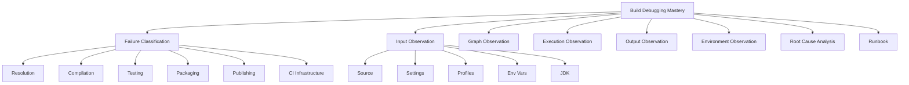
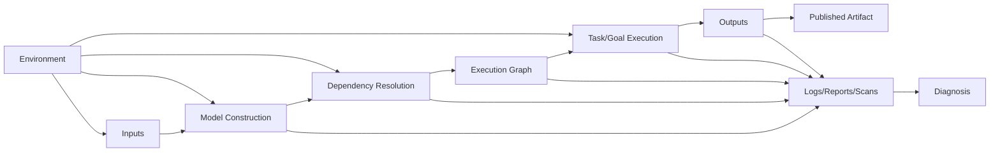
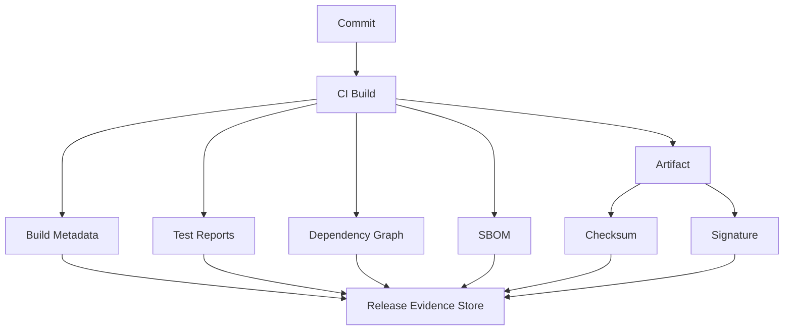

------
title: Learn Java Source, Package, Dependency, Build, Release & Deployment Engineering - Part 024
description: Build observability and debugging for Maven, Gradle, CI builds, dependency resolution, plugins, classpath conflicts, and build performance incidents.
series: learn-java-build-dependency-release-deployment
seriesTitle: Learn Java Source, Package, Dependency, Build, Release & Deployment Engineering
order: 24
partTitle: Build Observability and Debugging
tags:
- java
- build-engineering
- maven
- gradle
- ci
- debugging
- observability
- dependency-resolution
- build-performance
date: 2026-06-29
------

# Part 024 — Build Observability and Debugging

## 1. Posisi Part Ini Dalam Seri

Kita sudah membahas:

- source layout;
- package dan module boundary;
- Maven/Gradle;
- dependency governance;
- supply chain;
- reproducible builds;
- quality gates;
- generated code.

Sekarang kita membahas skill yang membedakan build user dan build engineer: **observability dan debugging build**.

Build system bukan black box. Build system adalah execution engine yang menerima input, membentuk graph, menjalankan task/phase, menyelesaikan dependency, menghasilkan output, dan melaporkan error.

Kalau kita tidak bisa mengobservasi build, kita akan memperbaiki masalah dengan tebakan:

- hapus `.m2`;
- hapus `.gradle`;
- run `clean`;
- restart IDE;
- tambah exclusion random;
- pin dependency tanpa alasan;
- disable cache;
- skip test;
- rerun CI sampai hijau.

Itu bukan engineering. Itu ritual.

Part ini membangun cara berpikir sistematis untuk:

- membaca build log;
- men-debug Maven dan Gradle;
- memahami dependency resolution;
- menemukan classpath conflict;
- menemukan duplicate class;
- menganalisis plugin behavior;
- membedakan local-only dan CI-only failure;
- membuat build incident runbook;
- membangun observability untuk build platform internal.

---

## 2. Kaufman Skill Deconstruction

### 2.1 Target Performance Level

Setelah part ini, kita harus mampu:

- melakukan build triage tanpa trial-and-error;
- menjelaskan apa yang sedang dieksekusi Maven/Gradle;
- melihat effective POM/effective settings;
- melihat dependency tree dan conflict mediation;
- memakai Gradle `dependencies` dan `dependencyInsight`;
- membaca task graph dan up-to-date/cache status;
- membedakan failure di resolution, compile, test, package, publish, atau deploy preparation;
- membuat minimal reproduction;
- menulis build incident report;
- menentukan fix yang mengatasi root cause, bukan symptom.

### 2.2 Skill Map



### 2.3 Minimal Effective Practice

Kita tidak perlu menghafal semua flags. Kita perlu menguasai satu loop:

```text
classify → reproduce → observe inputs → observe graph → observe execution → inspect outputs → isolate cause → fix → guardrail
```

---

## 3. Build as Observable System

Build bisa dimodelkan seperti sistem dataflow.



Build observability berarti kita bisa menjawab:

1. Input apa yang dipakai?
2. Model build apa yang dibentuk?
3. Dependency versi apa yang dipilih?
4. Phase/task apa yang berjalan?
5. Output apa yang dihasilkan?
6. Environment apa yang memengaruhi?
7. Perbedaan apa antara local dan CI?
8. Bagian mana yang nondeterministic?
9. Evidence apa yang bisa kita simpan?
10. Guardrail apa yang mencegah kejadian berulang?

---

## 4. Failure Classification

Sebelum memperbaiki build, klasifikasikan failure.

| Failure Layer | Contoh Gejala | Kemungkinan Root Cause |
|---|---|---|
| Tool bootstrap | Wrapper gagal download | network, checksum, proxy, wrapper config |
| Model construction | POM/build script invalid | syntax, plugin version, profile, convention plugin |
| Dependency resolution | artifact not found, conflict | repository, credentials, metadata, version alignment |
| Source generation | generated class missing | generator phase/task, stale output, source root |
| Compilation | symbol not found | classpath, module path, generated source, JDK mismatch |
| Annotation processing | processor not run | processor path, JDK 23 behavior, disabled proc |
| Test execution | flaky test, fork crash | parallelism, ports, timeouts, memory, classloader |
| Packaging | missing resource, duplicate entry | shade, resource filtering, generated resource |
| Publishing | 401, 409, invalid POM | credentials, staging, duplicate release, metadata |
| Cache/incremental | stale output, wrong up-to-date | undeclared inputs, cache poisoning |
| CI infrastructure | timeout, agent issue | disk, memory, network, container image, secrets |

Rule:

> Jangan lompat ke solusi sebelum failure layer jelas.

---

## 5. Debugging Principles

### 5.1 Start From Clean Reproduction

Local dirty state adalah sumber kebohongan.

```bash
git status --short
git clean -xfd
```

Kemudian:

```bash
./mvnw -V -e clean verify
```

atau:

```bash
./gradlew --version
./gradlew clean build --stacktrace
```

`clean` bukan solusi permanen, tetapi alat diagnosis. Jika `clean` memperbaiki error, kemungkinan ada masalah incremental/caching/stale output.

### 5.2 Capture Environment

Minimal capture:

```bash
java -version
./mvnw -version
./gradlew --version
env | sort
git rev-parse HEAD
git status --short
```

Untuk CI:

- runner image;
- JDK distribution;
- JDK version;
- Maven/Gradle wrapper version;
- OS;
- architecture;
- memory;
- mounted cache;
- repository mirror;
- credentials source;
- proxy configuration.

### 5.3 Reduce the Problem

Jika root project besar:

Maven:

```bash
./mvnw -pl :order-service -am clean verify
```

Gradle:

```bash
./gradlew :order-service:clean :order-service:build
```

Kemudian kecilkan lagi:

```bash
./mvnw -pl :order-service test -Dtest=CustomerServiceTest
```

```bash
./gradlew :order-service:test --tests '*CustomerServiceTest'
```

### 5.4 Separate Symptom Fix From Root Fix

Symptom fix:

```bash
rm -rf ~/.m2/repository
rm -rf ~/.gradle/caches
```

Root fix:

- pin dependency;
- fix repository mirror;
- fix plugin version;
- declare task input/output;
- separate processor path;
- align BOM/platform;
- remove duplicate generated output;
- add CI gate.

---

## 6. Maven Observability

### 6.1 Maven Version and Execution Context

Start here:

```bash
./mvnw -V -version
```

Check:

- Maven version;
- Java version;
- Java home;
- OS;
- locale;
- encoding;
- Maven home;
- user home.

Use Wrapper to avoid “global Maven” drift.

### 6.2 Effective POM

Maven builds the effective model by applying:

- parent POM;
- dependency management;
- plugin management;
- profiles;
- property interpolation;
- default lifecycle bindings.

Use:

```bash
./mvnw help:effective-pom
```

For large output:

```bash
./mvnw help:effective-pom -Doutput=effective-pom.xml
```

With modern help plugin, verbose mode can show origin comments for XML elements:

```bash
./mvnw help:effective-pom -Dverbose -Doutput=effective-pom.xml
```

Use cases:

- why plugin version is selected;
- where dependencyManagement comes from;
- which profile is active;
- whether compiler release is configured;
- whether plugin execution is bound;
- whether generated source plugin is configured.

### 6.3 Effective Settings

Settings can change repository behavior.

```bash
./mvnw help:effective-settings -Doutput=effective-settings.xml
```

Inspect:

- mirrors;
- servers;
- proxies;
- active profiles;
- local repository path;
- repository credentials IDs.

Common CI issue:

```text
Could not transfer artifact ...
status code: 401
```

Often not a dependency problem. It may be a server ID mismatch between `distributionManagement`/repository config and `settings.xml`.

### 6.4 Active Profiles

```bash
./mvnw help:active-profiles
```

Profiles can change:

- dependencies;
- plugins;
- repositories;
- properties;
- test skips;
- compiler flags;
- generated source configuration.

Rule:

> Any build behavior controlled by profile must be observable and documented.

### 6.5 Dependency Tree

```bash
./mvnw dependency:tree
```

Filter:

```bash
./mvnw dependency:tree -Dincludes=com.fasterxml.jackson.core
```

Scope:

```bash
./mvnw dependency:tree -Dscope=runtime
```

Machine-readable output:

```bash
./mvnw dependency:tree -DoutputType=json -DoutputFile=dependency-tree.json
```

Use cases:

- why a dependency exists;
- which version won;
- whether a test dependency leaked;
- whether a processor leaked into runtime;
- whether duplicate libraries exist;
- whether a vulnerable library is direct or transitive.

### 6.6 Debug Output

```bash
./mvnw -X clean verify
```

Use `-X` selectively. It is verbose, but useful for:

- plugin configuration;
- repository resolution;
- lifecycle execution;
- classpath details;
- profile activation;
- exception stack traces.

Use `-e` for stack traces without full debug noise:

```bash
./mvnw -e clean verify
```

### 6.7 Maven Plugin Introspection

```bash
./mvnw help:describe \
  -DgroupId=org.apache.maven.plugins \
  -DartifactId=maven-compiler-plugin \
  -Dgoal=compile \
  -Ddetail
```

Use when:

- unsure what a plugin parameter means;
- trying to find user property names;
- migrating plugin versions;
- debugging plugin defaults.

### 6.8 Maven Test Debugging

Run a specific test:

```bash
./mvnw -Dtest=CustomerServiceTest test
```

Run a method:

```bash
./mvnw -Dtest=CustomerServiceTest#shouldApproveCustomer test
```

Remote debug forked tests:

```bash
./mvnw -Dmaven.surefire.debug test
```

Investigate fork/classloader issues:

- `forkCount`;
- `reuseForks`;
- `useSystemClassLoader`;
- `argLine`;
- memory settings;
- Surefire vs Failsafe;
- parallel execution.

### 6.9 Maven Reactor Debugging

Build a module and its dependencies:

```bash
./mvnw -pl :order-service -am clean verify
```

Resume from failure:

```bash
./mvnw -rf :order-service verify
```

Skip unrelated modules only for diagnosis, not as permanent CI pattern.

---

## 7. Gradle Observability

### 7.1 Gradle Version and Environment

```bash
./gradlew --version
```

Check:

- Gradle version;
- JVM version;
- Kotlin version;
- Groovy version;
- OS;
- Gradle home.

### 7.2 Build Lifecycle

Gradle has three high-level phases:

1. initialization;
2. configuration;
3. execution.

Debugging question:

| Phase | Typical Failure |
|---|---|
| Initialization | settings file, included build, plugin resolution |
| Configuration | build script error, plugin config, missing property |
| Execution | task failure, compile/test/package error |

If failure occurs before any task runs, it is likely configuration/model issue.

### 7.3 List Tasks

```bash
./gradlew tasks
./gradlew tasks --all
```

Use cases:

- confirm task exists;
- find lifecycle tasks;
- find plugin-created tasks;
- verify naming convention in multi-project builds.

### 7.4 Dry Run

```bash
./gradlew build --dry-run
```

This shows task execution plan without actually running tasks.

Use cases:

- understand task graph;
- confirm `dependsOn`;
- confirm generator runs before compile;
- check whether a quality gate is attached to `check`.

### 7.5 Info and Debug Logs

```bash
./gradlew build --info
```

Useful for:

- incremental build decisions;
- annotation processor full recompilation warnings;
- task execution details;
- cache messages;
- compiler arguments.

More verbose:

```bash
./gradlew build --debug
```

Use `--debug` carefully. It can expose secrets in logs if build logic is careless.

### 7.6 Stacktrace

```bash
./gradlew build --stacktrace
./gradlew build --full-stacktrace
```

Use when:

- plugin throws exception;
- task action fails;
- configuration cache reports error;
- dependency resolution error lacks context.

### 7.7 Dependency Graph

```bash
./gradlew dependencies
```

For specific configuration:

```bash
./gradlew :app:dependencies --configuration runtimeClasspath
```

Use configurations intentionally:

- `compileClasspath`;
- `runtimeClasspath`;
- `testCompileClasspath`;
- `testRuntimeClasspath`;
- `annotationProcessor`;
- custom configurations.

### 7.8 Dependency Insight

```bash
./gradlew :app:dependencyInsight \
  --configuration runtimeClasspath \
  --dependency jackson-databind
```

Use cases:

- why this version was selected;
- who brought this dependency;
- conflict resolution;
- constraint/platform effect;
- variant/attribute matching details.

### 7.9 Build Environment

```bash
./gradlew buildEnvironment
```

This is different from application dependencies. It shows buildscript/plugin classpath dependencies.

Use when debugging:

- plugin resolution;
- convention plugin behavior;
- classpath conflict in build logic;
- Gradle plugin version drift.

### 7.10 Build Scan

```bash
./gradlew build --scan
```

Build Scan can help analyze:

- task timeline;
- dependency resolution;
- cache hits/misses;
- test results;
- environment;
- build failures;
- performance bottlenecks.

In enterprise environments, prefer an approved Develocity/Gradle Enterprise setup rather than publishing sensitive metadata to arbitrary external endpoints.

### 7.11 Configuration Cache Diagnostics

```bash
./gradlew build --configuration-cache
```

When it fails, read the generated report.

Common causes:

- task reads project model during execution;
- task accesses environment without declaring input;
- task uses unsupported APIs;
- plugin uses mutable global state;
- custom task is not serializable-compatible.

Configuration cache failure is not “Gradle being annoying”. It often reveals build logic that was already unsafe.

---

## 8. Dependency Resolution Debugging

### 8.1 Maven Resolution Questions

When Maven picks a version, ask:

1. Is dependency direct or transitive?
2. Is version managed by parent/BOM?
3. Did nearest definition win?
4. Did first declaration among same-depth dependencies win?
5. Is dependency optional?
6. Was it excluded?
7. Which repository served it?
8. Is local repository stale/corrupt?
9. Is mirror overriding repository?
10. Is snapshot metadata changing?

Commands:

```bash
./mvnw dependency:tree -Dverbose
./mvnw dependency:tree -Dincludes=groupId:artifactId
./mvnw help:effective-pom
./mvnw help:effective-settings
```

### 8.2 Gradle Resolution Questions

When Gradle picks a version, ask:

1. Which configuration?
2. Was there a conflict?
3. Was version selected by constraint/platform?
4. Was an enforced platform used?
5. Was dependency substituted?
6. Was variant selection involved?
7. Was capability conflict involved?
8. Was dynamic version cached?
9. Was module metadata used?
10. Was repository order relevant?

Commands:

```bash
./gradlew :app:dependencies --configuration runtimeClasspath
./gradlew :app:dependencyInsight --configuration runtimeClasspath --dependency group:name
```

### 8.3 Classpath Conflict Pattern

Symptom:

```text
NoSuchMethodError
NoClassDefFoundError
ClassCastException
LinkageError
```

Usually this is not compiler error. It is runtime classpath conflict.

Debug path:

1. Identify missing/invalid class or method.
2. Find which jar should contain it.
3. Inspect runtime classpath.
4. Compare compile vs runtime classpath.
5. Check dependency tree.
6. Check shading/relocation.
7. Check container/app-server provided libraries.
8. Add convergence/enforcer/constraints.

Commands:

```bash
jar tf some-library.jar | grep TargetClass
```

```bash
./mvnw dependency:tree -Dincludes=org.example
```

```bash
./gradlew dependencyInsight --configuration runtimeClasspath --dependency example-lib
```

### 8.4 Duplicate Class Detection

Symptoms:

- unpredictable runtime behavior;
- `Class path contains multiple SLF4J bindings`;
- service provider conflict;
- class loaded from unexpected JAR;
- JPMS split package error.

Investigation:

```bash
find ~/.m2/repository -name '*.jar' -print0 | xargs -0 -I{} sh -c 'jar tf "{}" | grep -q "com/acme/Foo.class" && echo "{}"'
```

Better in CI: use dedicated duplicate-class check plugin or dependency analysis tooling.

---

## 9. Plugin Behavior Debugging

### 9.1 Maven Plugin Debugging

Ask:

- Is plugin version pinned?
- Is execution bound to phase?
- Is execution inherited from parent?
- Is pluginManagement only defining defaults but not executing?
- Is profile activating plugin?
- Is plugin config overridden in child?
- Is goal running in the expected module?
- Is it aggregator or per-module goal?

Common mistake:

```xml
<pluginManagement>
  <plugins>
    <plugin>
      ...
    </plugin>
  </plugins>
</pluginManagement>
```

`pluginManagement` configures plugin defaults. It does not automatically execute plugin unless plugin is declared/bound elsewhere.

### 9.2 Gradle Plugin Debugging

Ask:

- Is plugin applied to root or subproject?
- Is it in `plugins {}` or applied imperatively?
- Does convention plugin configure tasks lazily?
- Does it use `afterEvaluate`?
- Does it use `subprojects/allprojects`?
- Does it realize tasks unnecessarily?
- Does it break configuration cache?
- Does it add dependencies to wrong configuration?

Commands:

```bash
./gradlew help --warning-mode=all
./gradlew tasks --all
./gradlew properties
./gradlew buildEnvironment
```

### 9.3 Plugin Version Drift

Build logic can drift through:

- root plugin versions;
- convention plugin dependencies;
- included build logic;
- corporate parent POM;
- Maven plugin management;
- Gradle version catalogs;
- transitive build plugin dependencies.

Guardrail:

- centralize plugin versions;
- pin versions;
- scan buildscript classpath;
- test convention plugins;
- have build-logic release notes.

---

## 10. Build Performance Debugging

### 10.1 First Classify Performance Issue

| Symptom | Likely Area |
|---|---|
| Build slow before tasks run | Gradle configuration, Maven model/reactor, plugin init |
| Compile slow | annotation processor, source size, JDK, incremental disabled |
| Test slow | integration tests, fork config, parallelism, containers |
| Dependency resolution slow | remote repo, snapshots, dynamic versions, metadata |
| Package slow | shading, resource processing, large artifacts |
| CI slow only | cache miss, cold agent, network, limited CPU/memory |
| Local slow only | daemon disabled, antivirus, disk, IDE interference |

### 10.2 Maven Performance Signals

Commands:

```bash
./mvnw -T 1C clean verify
./mvnw -X clean verify
```

Check:

- reactor ordering;
- plugin phase cost;
- dependency download time;
- test fork settings;
- integration test containers;
- generated source cost.

Caution:

- parallel Maven builds can expose thread-safety issues in plugins;
- do not enable `-T` blindly for release builds without validation.

### 10.3 Gradle Performance Signals

Commands:

```bash
./gradlew build --scan
./gradlew build --profile
./gradlew build --info
```

Check:

- task execution timeline;
- configuration time;
- cache hits/misses;
- up-to-date misses;
- non-cacheable tasks;
- dependency resolution time;
- annotation processor behavior.

### 10.4 Cache Miss Debugging

Ask:

1. Which task missed cache?
2. Which input changed?
3. Is input declared correctly?
4. Is absolute path part of input?
5. Is environment variable captured?
6. Is output deterministic?
7. Is task cacheable?
8. Is CI using the same Gradle/Maven/JDK?
9. Is cache key invalidated by timestamp?
10. Is remote cache trusted?

Generated code and test tasks are frequent culprits.

---

## 11. CI-Only Failure Debugging

CI-only failures are not mysterious. They are differences.

### 11.1 Difference Matrix

| Dimension | Local | CI |
|---|---|---|
| JDK | local installed | container/toolchain |
| OS | developer machine | Linux runner |
| File system | case-insensitive maybe | case-sensitive |
| Locale | user locale | `C.UTF-8` maybe |
| Timezone | local timezone | UTC maybe |
| CPU/memory | variable | constrained |
| Network | direct | proxy/firewall |
| Cache | warm local | cold/shared |
| Credentials | user settings | secret injection |
| Tests | subset maybe | full suite |
| Profiles | local profile | CI profile |
| Parallelism | lower | higher |
| Docker | local daemon | nested/remote |

### 11.2 Case Sensitivity Bug

Local macOS/Windows can hide path casing problems.

Example:

```java
import com.acme.CustomerService;
```

File path:

```text
src/main/java/com/acme/customerservice.java
```

May behave differently across systems/tools.

### 11.3 Timezone/Locale Bug

Tests fail only in CI:

```java
LocalDate.now()
NumberFormat.getCurrencyInstance()
String.toLowerCase()
```

Build fix:

- set test timezone/locale explicitly;
- make tests deterministic;
- don't rely on environment default.

Gradle:

```kotlin
tasks.withType<Test>().configureEach {
    systemProperty("user.timezone", "UTC")
    systemProperty("user.language", "en")
    systemProperty("user.country", "US")
}
```

Maven Surefire:

```xml
<configuration>
  <systemPropertyVariables>
    <user.timezone>UTC</user.timezone>
    <user.language>en</user.language>
    <user.country>US</user.country>
  </systemPropertyVariables>
</configuration>
```

### 11.4 Repository/Credential Bug

Symptoms:

```text
Could not resolve artifact
401 Unauthorized
403 Forbidden
repository blocked mirror
checksum failed
```

Debug:

Maven:

```bash
./mvnw help:effective-settings
./mvnw -X dependency:resolve
```

Gradle:

```bash
./gradlew dependencies --info
./gradlew buildEnvironment --info
```

Check:

- secret names;
- repository URL;
- mirror;
- server ID;
- token expiry;
- repository order;
- snapshot vs release repo.

---

## 12. Output Inspection

Do not stop at “build succeeded”. Inspect artifact.

### 12.1 JAR Content

```bash
jar tf target/app.jar | sort | less
```

```bash
jar tf build/libs/app.jar | sort | less
```

Check:

- generated classes;
- resources;
- `META-INF/services`;
- manifest;
- duplicate entries;
- unwanted dependency classes;
- shaded packages;
- version metadata.

### 12.2 Manifest

```bash
unzip -p target/app.jar META-INF/MANIFEST.MF
```

Check:

- `Main-Class`;
- `Implementation-Version`;
- build metadata;
- classpath entries if used;
- automatic module name.

### 12.3 Dependency Metadata

Maven published artifact should include valid POM.

```bash
jar tf target/*.jar | grep pom
```

For Gradle module metadata, inspect published repository layout if applicable.

### 12.4 Runtime Smoke Test

For executable JAR:

```bash
java -jar target/app.jar --version
```

or:

```bash
java -jar build/libs/app.jar --version
```

For libraries, run a small consumer test.

---

## 13. Build Incident Runbook

### 13.1 Incident Template

```md
# Build Incident Report

## Summary
What failed?

## Impact
Who was blocked? Which pipeline/release?

## First Failure Time
Timestamp and commit.

## Failure Layer
Resolution / compile / test / package / publish / CI infra / cache.

## Reproduction
Exact command and environment.

## Observations
Logs, dependency tree, effective POM/settings, Gradle dependencyInsight, scan link.

## Root Cause
What invariant was violated?

## Fix
What changed?

## Guardrail
What prevents recurrence?

## Follow-Up
Owner and due date.
```

### 13.2 Invariant-Based RCA

Bad RCA:

```text
Build failed because dependency was missing.
```

Better RCA:

```text
Build failed because the release repository was configured in the POM but the CI settings.xml did not contain a matching server ID after the repository manager migration. Maven could resolve public dependencies but could not resolve internal release artifacts. We added an effective-settings check to CI bootstrap and documented repository server IDs in the build platform template.
```

A strong RCA names:

- invariant;
- violating change;
- detection gap;
- fix;
- prevention.

---

## 14. Build Observability in Internal Platform

At team scale, ad-hoc commands are enough.

At platform scale, we need systematic build observability.

### 14.1 What to Capture Per Build

- commit SHA;
- branch/tag;
- build tool version;
- JDK distribution/version;
- OS/container image;
- Maven/Gradle wrapper checksum;
- dependency lockfile hash;
- effective dependency graph hash;
- generated source hash if relevant;
- artifact checksum;
- test report summary;
- quality gate result;
- SBOM location;
- provenance/attestation location;
- published artifact coordinates;
- deployment candidate ID.

### 14.2 Build Evidence Flow



### 14.3 Metrics

Build platform metrics:

| Metric | Why It Matters |
|---|---|
| Build duration p50/p95 | developer productivity |
| Test duration p95 | bottleneck detection |
| Failure rate | platform health |
| Flaky test rate | trust erosion |
| Dependency resolution time | repository health |
| Cache hit rate | performance and determinism |
| Configuration time | Gradle build logic health |
| Artifact size trend | dependency bloat |
| Number of direct dependencies | governance drift |
| Vulnerability gate failures | supply-chain risk |
| Time to repair failed build | operability |

### 14.4 Alerts

Alert on:

- main branch build broken beyond threshold;
- dependency repository unavailable;
- cache poisoning detected;
- artifact publish failure;
- sudden artifact size increase;
- sudden dependency graph expansion;
- build duration regression;
- quality gate bypass;
- repeated flaky test pattern.

---

## 15. Debugging Playbooks

### 15.1 “Class Not Found” Playbook

Symptom:

```text
java.lang.ClassNotFoundException
java.lang.NoClassDefFoundError
```

Steps:

1. Identify class.
2. Identify expected dependency.
3. Check compile classpath.
4. Check runtime classpath.
5. Inspect packaged artifact.
6. Check scope/configuration.
7. Check shading/minimization.
8. Check container/app server provided libs.
9. Add dependency or fix scope.
10. Add test/guardrail.

Maven:

```bash
./mvnw dependency:tree -Dincludes=group:artifact
```

Gradle:

```bash
./gradlew dependencyInsight --configuration runtimeClasspath --dependency artifact
```

### 15.2 “No Such Method” Playbook

Symptom:

```text
java.lang.NoSuchMethodError
```

Steps:

1. Method existed at compile time but not runtime.
2. Runtime has older/incompatible jar.
3. Compare compile and runtime classpath.
4. Use dependency tree/insight.
5. Align versions.
6. Add convergence rule/platform.

### 15.3 “Generated Class Missing” Playbook

Steps:

1. Clean build.
2. Check generator task/phase runs.
3. Check output directory.
4. Check source root.
5. Check compile depends on generator.
6. Check processor path.
7. Check JDK behavior.
8. Check IDE divergence.
9. Add CI check.

### 15.4 “Dependency Version Wrong” Playbook

Maven:

1. inspect effective POM;
2. inspect dependency tree;
3. find direct/transitive path;
4. check BOM/parent;
5. check nearest definition;
6. fix dependencyManagement.

Gradle:

1. inspect dependencyInsight;
2. check platform/constraint;
3. check version catalog;
4. check resolution strategy;
5. check dependency substitution;
6. fix platform/constraints.

### 15.5 “Build Slow” Playbook

1. Determine local vs CI.
2. Measure with scan/profile/logs.
3. Split configuration vs execution.
4. Identify top slow tasks.
5. Check cacheability.
6. Check annotation processors.
7. Check tests.
8. Check dependency resolution.
9. Apply one optimization at a time.
10. Add regression metric.

### 15.6 “Works Locally, Fails in CI” Playbook

1. Capture CI environment.
2. Match JDK/toolchain.
3. Run clean local build in container if possible.
4. Disable local caches for reproduction.
5. Compare active profiles/properties.
6. Compare repository settings.
7. Compare timezone/locale.
8. Compare file path case.
9. Compare generated code and artifact.
10. Fix environment declaration.

---

## 16. Common Anti-Patterns

### 16.1 “Just Clean It”

`clean` hides stale output issues. If clean fixes it, root cause is probably undeclared input/output, bad generated source management, or cache issue.

### 16.2 “Just Exclude It”

Dependency exclusions can be valid, but random exclusions create hidden runtime bugs.

Before exclusion:

- identify transitive path;
- understand why it exists;
- check version alignment;
- verify runtime behavior;
- document reason.

### 16.3 “Just Force the Version”

Forcing versions without understanding conflict can break consumers.

Better:

- use BOM/platform;
- align logical dependency family;
- add dependency constraints;
- add convergence checks.

### 16.4 “Skip Tests to Unblock”

Sometimes needed during incident response, but dangerous as permanent fix.

If skipped:

- record exception;
- define expiry;
- add owner;
- track follow-up.

### 16.5 “Disable Cache”

Disabling cache is diagnosis, not solution.

If cache causes wrong output, fix task inputs/outputs or deterministic behavior.

### 16.6 “CI Is Flaky”

CI is not an explanation. It is a label. Find the variable:

- network;
- time;
- data;
- parallelism;
- state;
- resource contention;
- order dependency.

---

## 17. Command Reference

### 17.1 Maven

```bash
# Version and environment
./mvnw -V -version

# Effective model
./mvnw help:effective-pom
./mvnw help:effective-pom -Dverbose -Doutput=effective-pom.xml
./mvnw help:effective-settings -Doutput=effective-settings.xml
./mvnw help:active-profiles

# Dependency graph
./mvnw dependency:tree
./mvnw dependency:tree -Dincludes=groupId:artifactId
./mvnw dependency:tree -Dscope=runtime
./mvnw dependency:tree -DoutputType=json -DoutputFile=dependency-tree.json

# Debug logs
./mvnw -e clean verify
./mvnw -X clean verify

# Plugin info
./mvnw help:describe -Dplugin=compiler -Dgoal=compile -Ddetail

# Reactor
./mvnw -pl :module -am clean verify
./mvnw -rf :module verify

# Tests
./mvnw -Dtest=ClassName test
./mvnw -Dtest=ClassName#methodName test
./mvnw -Dmaven.surefire.debug test
```

### 17.2 Gradle

```bash
# Version and environment
./gradlew --version

# Task discovery
./gradlew tasks
./gradlew tasks --all

# Task graph
./gradlew build --dry-run

# Logs
./gradlew build --info
./gradlew build --debug
./gradlew build --stacktrace
./gradlew build --full-stacktrace

# Dependencies
./gradlew dependencies
./gradlew :app:dependencies --configuration runtimeClasspath
./gradlew :app:dependencyInsight --configuration runtimeClasspath --dependency jackson-databind
./gradlew buildEnvironment

# Performance
./gradlew build --scan
./gradlew build --profile

# Configuration cache
./gradlew build --configuration-cache

# Tests
./gradlew test --tests '*CustomerServiceTest'
./gradlew test --debug-jvm
```

---

## 18. Deliberate Practice

### Drill 1 — Dependency Conflict

Create a small project where two dependencies pull different versions of the same library.

Tasks:

1. inspect Maven dependency tree;
2. inspect Gradle dependencyInsight;
3. align versions with BOM/platform;
4. document why version won;
5. add guardrail.

### Drill 2 — Generated Class Missing

Create generator task that is not wired before compile.

Tasks:

1. reproduce failure;
2. inspect task graph;
3. fix `dependsOn` or phase binding;
4. confirm clean build;
5. add CI check.

### Drill 3 — Runtime Classpath Bug

Compile against one version, run with another.

Tasks:

1. trigger `NoSuchMethodError`;
2. identify runtime jar;
3. compare compile/runtime classpath;
4. fix alignment;
5. write a small runtime smoke test.

### Drill 4 — CI-Only Locale Failure

Write a test that depends on default locale.

Tasks:

1. make it pass locally;
2. fail under different locale/timezone;
3. configure test runtime deterministically;
4. remove environment assumption.

### Drill 5 — Build Performance Regression

Add a slow task.

Tasks:

1. capture baseline;
2. add slow task;
3. inspect build scan/profile;
4. identify regression;
5. add performance note or guardrail.

---

## 19. Review Checklist

When reviewing build/debugging changes:

- [ ] Failure layer is identified.
- [ ] Reproduction command is documented.
- [ ] Environment is captured.
- [ ] Maven effective POM/settings checked if Maven issue.
- [ ] Gradle dependencyInsight/task graph checked if Gradle issue.
- [ ] Dependency fix explains why selected version is correct.
- [ ] Plugin fix pins version and scope.
- [ ] Cache fix declares inputs/outputs.
- [ ] CI-only fix removes environment assumption.
- [ ] Generated-code fix is clean-build valid.
- [ ] Artifact inspected if packaging/runtime issue.
- [ ] Guardrail added to prevent recurrence.
- [ ] Incident notes distinguish symptom from root cause.

---

## 20. Top 1% Engineer Mental Model

A beginner says:

> “The build is broken.”

A normal engineer says:

> “The Maven/Gradle command failed.”

A senior engineer says:

> “The compile task failed because generated sources were missing.”

A top-tier engineer says:

> “The build model did not express a dependency from compile to schema generation. The generated sources happened to exist locally, so developer builds passed, but CI clean builds failed. The fix is to declare generator inputs/outputs, wire the task before compile, place outputs under build/target, and add a clean-build CI gate.”

Build debugging is not about knowing every command. It is about preserving the causal chain:

```text
input → model → graph → execution → output → artifact
```

Once the chain is visible, build failures stop being mysterious.

---

## 21. References

- Apache Maven Help Plugin — Effective POM: https://maven.apache.org/plugins/maven-help-plugin/effective-pom-mojo.html
- Apache Maven Help Plugin — Effective Settings: https://maven.apache.org/plugins/maven-help-plugin/effective-settings-mojo.html
- Apache Maven Dependency Plugin — dependency:tree: https://maven.apache.org/plugins/maven-dependency-plugin/tree-mojo.html
- Apache Maven Surefire Plugin — Debugging Tests: https://maven.apache.org/surefire/maven-surefire-plugin/examples/debugging.html
- Gradle Viewing and Debugging Dependencies: https://docs.gradle.org/current/userguide/viewing_debugging_dependencies.html
- Gradle Command-Line Interface: https://docs.gradle.org/current/userguide/command_line_interface.html
- Gradle Build Scan Basics: https://docs.gradle.org/current/userguide/build_scans.html
- Gradle Performance Guide: https://docs.gradle.org/current/userguide/performance.html
- Gradle Configuration Cache: https://docs.gradle.org/current/userguide/configuration_cache.html
